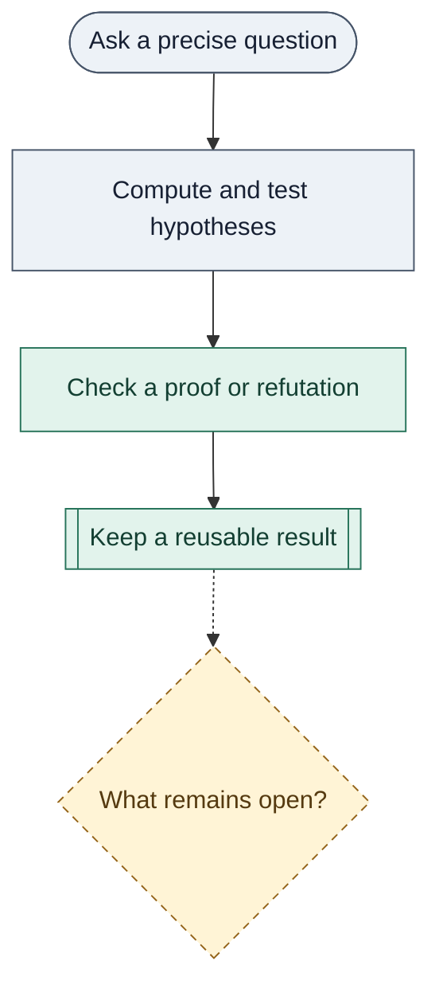

# trureturing

**A library for discovering truth.**

[Examples](#three-places-to-look) · [First run](#first-run) ·
[Lean source](D5/) · [Read the book](https://the-omega-institute.github.io/trureturing-mdbook/) ·
[Contribute](#take-part) · [Apache-2.0](LICENSE)

trureturing pursues truth by turning questions into knowledge others can check
and build on. The name reflects the project's intent: **true · return · Turing**
— truth, return, and Turing computation.

Ask a precise question. Use computation and tests to distinguish hypotheses.
Look for a proof, a counterexample, or the information still missing. Keep the
checked result with its assumptions, and make the unanswered question explicit.
People and AI can contribute; what others can reuse is the checked artifact.

> The last line of the ledger is always the first line of the next round.

A proof becomes a premise for further work. A refutation closes off a mistaken
route. A limit on what observations reveal tells us what to ask or measure next.
The purpose is to let understanding accumulate without losing its foundations:
each inquiry starts with what the last one actually established.

Today, the library contains Lean 4 proofs, research inputs, experiments and
tools for checking and recording results. Golden integers, Fibonacci weights
and Zeckendorf representations are one research thread; the examples below
also reach into conjecture refutation and the limits of local observations.
The ambition is to make more of this discovery process automatic. Choosing
the next fruitful question remains an open part of that ambition.

## Three places to look

**01 · Refute a conjecture.**
For positive n, let a(n) be the greatest integer k with `(1 + 1/n)^k ≤ 2`.
Greathouse's conjectured formula for OEIS A175406 was
`a(n) = floor((n + 1/2) log 2)`. At `n = 1121626023352383`, the formula gives
`777451915729368`, while the actual value is one less.
The [Lean refutation](D5/S0/Certificates/GreathouseLogTwoFloorRefutation.lean)
establishes `result : ¬ claim` using certified bounds on logarithms.
This refutes the literal universal formula; neither minimality of the witness
nor priority is claimed. [Problem and sources](Problems/oeis-a175406-log-two-floor-refutation.md) ·
[Explanation](Blueprint/D5/S0/Certificates/GreathouseLogTwoFloorRefutation.md).

**02 · Find what observations cannot tell you.**
Can knowing each part of a quantum system determine the whole? The
[local-marginal theorem](D5/S3/Quantum/Entanglement/LocalMarginalCorrelationBlindSpot.lean)
constructs two distinct two-qubit states: a pure Bell state and the equal
classical mixture of `00` and `11`. Both have exactly the same reduced state
on each qubit. Even these complete local descriptions cannot identify the
joint state.

For finite factor dimensions `m, n ≥ 1` with `m × n > 1`, the theorem also
proves that the correlation sector in the Hermitian tensor model is orthogonal
to the local sectors and has real dimension `(m² − 1)(n² − 1)`. This identifies
precisely which directions the local description omits.
[Explanation](Blueprint/D5/S3/Quantum/Entanglement/LocalMarginalCorrelationBlindSpot.md).

**03 · Build a result that holds beyond the examples.**
Write a natural number as its unique sum of nonadjacent Fibonacci weights
`1, 2, 3, 5, 8, …`. Replace each occupied weight Fᵢ by φⁱ, where φ is the
golden ratio, and call the resulting real value β(n). How far does this
coordinate fail to preserve addition?

$$\beta(a)+\beta(b)-\beta(a+b)\in\lbrace-1,0,1\rbrace.$$

[`deficit_three_valued`](D5/S1/Deficit/DeficitThreeValued.lean) proves this for
all natural inputs. Its proof combines an integer certificate with bounds on
the conjugate coordinate. The discrepancy is also the signed count of the two
lowest repeated-carry rules during digit normalization: a reusable connection
between an arithmetic algorithm and an exact bound, however large the inputs.
[Definitions and carry-count theorem](D5/S1/Deficit/DeficitInteger.lean) ·
[Explanation](Blueprint/D5/S1/Deficit/DeficitThreeValued.md).

## What is proved, and what is open

[D5/](D5/) contains the formal development. [Theory prose](docs/develop/theory/)
supplies research input, and [experiments](Evidence/) supply observations within
their declared scope. Neither prose nor numerical agreement establishes a
Lean theorem. The C# harness checks repository rules, proof reports and frozen
state; independent review examines whether statements faithfully express the
intended mathematics. Admitted proofs are recorded in the
[frozen ledger](Golden/Frozen/state/), with precise Lean statements and their
assumptions and axiom dependencies as the formal basis for reuse.



*A schematic of inquiry, not runtime behavior or dependency data.* In words:
question → computation and tests → checked proof or refutation → reusable
result → next open question. A question can remain unresolved at any stage;
tests alone do not establish a theorem. The dashed arrow and diamond mark the
open frontier, so color is not needed to read the distinction.

The [book](https://the-omega-institute.github.io/trureturing-mdbook/) is a
browsable, searchable projection of [Blueprint/](Blueprint/), published by
[trureturing-mdbook](https://github.com/the-omega-institute/trureturing-mdbook).
It explains the work; the formal source remains authoritative.

Two explicit boundaries live in [Hearts.lean](D5/X_Frontier/Hearts.lean):

- **O-5:** `o5_independence`, a zero-localization claim for the canonical golden
  Euler germ, has an unresolved proof body (`sorry`).
- **O-6:** `o6WeilPositivityStatement` defines a Weil-positivity proposition.
  Defining that proposition supplies no proof of it.

These are open research obligations, not established impossibility results.
This repository does **not** establish the Riemann hypothesis.

## First run

Install [elan](https://github.com/leanprover/elan#installation) and the
[.NET SDK](https://dotnet.microsoft.com/en-us/download/dotnet/10.0), with `lake`
and `dotnet` on your `PATH`. You also need Git, Make and a Bash-compatible shell.
The pins are **Lean 4.33.0** in [lean-toolchain](lean-toolchain),
**Mathlib v4.33.0** in [lakefile.toml](lakefile.toml), and
**.NET SDK 10.0.103** in [global.json](global.json).

Clone the project, then build just the introductory module. The `make` entry
prepares a private Lean cache; the first run may download dependencies.

```sh
git clone https://github.com/the-omega-institute/trureturing.git
cd trureturing
make lean LEAN_TARGETS=D5.S0.Conventions.WDigits
```

The [WDigits module](D5/S0/Conventions/WDigits.lean) directly reuses
**Mathlib's Zeckendorf development** to encode and decode natural numbers.
From that same directory, run this temporary example:

```sh
example_dir="$(mktemp -d)"
cat > "$example_dir/First.lean" <<'LEAN'
import D5.S0.Conventions.WDigits
open D5.S0.Conventions

#eval wdigits 42
#eval ((wdigits 42).map Nat.fib).sum
#check decode_wdigits
LEAN
lake env lean "$example_dir/First.lean"
rm "$example_dir/First.lean"
rmdir "$example_dir"
```

The two evaluations print `[9, 6]` and `42`. The list contains **Fibonacci
indices**, so its weights are `F₉ = 34` and `F₆ = 8`; it is not a list of the
weights themselves. `#check` displays the general decoding theorem's type.
Evaluating 42 illustrates the encoding; the theorem covers every natural number.

[Read the explanation](Blueprint/D5/S0/Conventions/WDigits.md).
`make help` lists the repository's command entry points.

## Take part

Start with one of the examples above. Reproduce it, improve its explanation,
report a mismatch between prose and a statement, or explore a precise open
question. Contributions in English and Chinese are welcome.

The [contribution guide](docs/CONTRIBUTING.md) walks you through forks, isolated
worktrees, checks and pull requests to `dev`.
[Issues](https://github.com/the-omega-institute/trureturing/issues) are a place
to bring a concrete question or reproducible problem.

## License and foundations

Released under [Apache-2.0](LICENSE). Built on
[Lean](https://lean-lang.org/) and [Mathlib](https://github.com/leanprover-community/mathlib4).
Classical results and upstream proofs remain credited to their sources.
