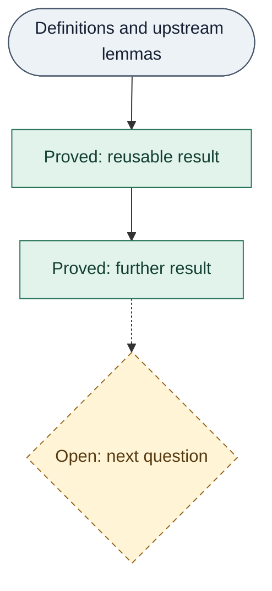

# trureturing

**Fibonacci coordinates. Reusable proofs. An open frontier.**

[English](#a-coordinate-system-you-can-check) · [中文](#中文) ·
[Lean source](D5/) · [Read the book](https://the-omega-institute.github.io/trureturing-mdbook/) ·
[Contribute](docs/CONTRIBUTING.md) · [Apache-2.0](LICENSE)

> The last line of the ledger is always the first line of the next round.

## A coordinate system you can check

What becomes visible when we write numbers in a different coordinate system?
trureturing is an open research project studying **golden integers, Fibonacci
weights and Zeckendorf representations**, with proofs in Lean 4.

Start with the weights `1, 2, 3, 5, 8, 13, …`. Every natural number has a unique
sum of distinct, nonadjacent weights: `42 = 34 + 8`. From this concrete encoding,
the project studies digit normalization, arithmetic in the golden integers
ℤ[φ], and connections to words, dynamics and analysis. Here φ is the golden
ratio, satisfying `φ² = φ + 1`.

The aim is to turn research into results another person can inspect and build
on. Each proof has a precise statement and explicit dependencies. Admitted
results are recorded in a frozen ledger; new work extends that foundation.
The frontier holds the questions still to be settled.

The philosophical motivation is simple: understanding should accumulate without
losing track of what it rests on. “The ledger” is that working metaphor.
The mathematical claims live in Lean statements and proofs, under their stated
assumptions and axiom dependencies.



*Schematic, not a dependency report.* Solid arrows show results building on
established premises. The dashed branch and diamond mark a question, with no
proof claimed. In words: definitions → proved results → further results and
new questions. Color is not needed to distinguish the states.

## Three places to look

**01 · Decode a number.**
[WDigits](D5/S0/Conventions/WDigits.lean) gives canonical encoding, decoding and
uniqueness for natural numbers. It directly reuses **Mathlib's Zeckendorf
development**. `decode_wdigits` says that summing the selected Fibonacci weights
recovers the input; `wdigits_unique` identifies any canonical representation
with that encoding. [Read the explanation](Blueprint/D5/S0/Conventions/WDigits.md).

**02 · Follow what addition leaves behind.**
Sum φⁱ over a number's occupied Fibonacci indices i, and call that real value
β(n). Addition has a small, exact discrepancy in these coordinates:

$$\beta(a)+\beta(b)-\beta(a+b)\in\{-1,0,1\}.$$

[`deficit_three_valued`](D5/S1/Deficit/DeficitThreeValued.lean) proves this for
all natural inputs. Its proof combines an integer certificate with bounds on
the conjugate coordinate; it is an unbounded theorem about the defined deficit.
[Definitions](D5/S1/Deficit/DeficitInteger.lean) ·
[Explanation](Blueprint/D5/S1/Deficit/DeficitThreeValued.md).

**03 · See a formula fail.**
For positive n, let a(n) be the greatest integer k with `(1 + 1/n)^k ≤ 2`.
Greathouse's conjectured formula for OEIS A175406 was
`a(n) = floor((n + 1/2) log 2)`. At `n = 1121626023352383`, the formula gives
`777451915729368`, while the actual value is one less.
The [Lean refutation](D5/S0/Certificates/GreathouseLogTwoFloorRefutation.lean)
establishes `result : ¬ claim` using certified bounds on logarithms.
This refutes the literal universal formula; neither minimality of the witness
nor priority is claimed. [Problem and sources](Problems/oeis-a175406-log-two-floor-refutation.md) ·
[Explanation](Blueprint/D5/S0/Certificates/GreathouseLogTwoFloorRefutation.md).

## What is proved, and what is open

[D5/](D5/) contains the formal development. [Theory prose](docs/develop/theory/)
supplies research input, and [experiments](Evidence/) supply observations within
their declared scope. Neither prose nor numerical agreement establishes a
Lean theorem. The C# harness checks repository rules, proof reports and frozen
state; independent review examines whether statements faithfully express the
intended mathematics.

The [book](https://the-omega-institute.github.io/trureturing-mdbook/) is a
browsable, searchable projection of [Blueprint/](Blueprint/), published by
[trureturing-mdbook](https://github.com/the-omega-institute/trureturing-mdbook).
It explains the work; the formal source remains authoritative.

Two explicit boundaries live in [Hearts.lean](D5/X_Frontier/Hearts.lean):

- **O-5:** `o5_independence`, a zero-localization claim for the canonical golden
  Euler germ, has an unresolved proof body (`sorry`).
- **O-6:** `o6WeilPositivityStatement` defines a Weil-positivity proposition.
  Defining that proposition supplies no proof of it.

These are open research obligations, not established impossibility results.
This repository does **not** establish the Riemann hypothesis or claim that
the universe runs on φ.

## First run

Install [elan](https://github.com/leanprover/elan#installation) and the
[.NET SDK](https://dotnet.microsoft.com/en-us/download/dotnet/10.0), with `lake`
and `dotnet` on your `PATH`. You also need Git, Make and a Bash-compatible shell.
The pins are **Lean 4.33.0** in [lean-toolchain](lean-toolchain),
**Mathlib v4.33.0** in [lakefile.toml](lakefile.toml), and
**.NET SDK 10.0.103** in [global.json](global.json).

Clone the project, then build just the introductory module. The `make` entry
prepares a private Lean cache; the first run may download dependencies.

```sh
git clone https://github.com/the-omega-institute/trureturing.git
cd trureturing
make lean LEAN_TARGETS=D5.S0.Conventions.WDigits
```

From that same directory, run this temporary example:

```sh
example_dir="$(mktemp -d)"
cat > "$example_dir/First.lean" <<'LEAN'
import D5.S0.Conventions.WDigits
open D5.S0.Conventions

#eval wdigits 42
#eval ((wdigits 42).map Nat.fib).sum
#check decode_wdigits
LEAN
lake env lean "$example_dir/First.lean"
rm "$example_dir/First.lean"
rmdir "$example_dir"
```

The two evaluations print `[9, 6]` and `42`. The list contains **Fibonacci
indices**, so its weights are `F₉ = 34` and `F₆ = 8`; it is not a list of the
weights themselves. `#check` displays the general decoding theorem's type.
Evaluating 42 illustrates the encoding; the theorem covers every natural number.

中文：先安装上述钉版工具，克隆并构建 WDigits，再在仓库根目录运行同一段示例。
输出 `[9, 6]` 是 Fibonacci 下标，对应权重 `34` 和 `8`，解码结果为 `42`。

For edits, use the [isolated worktree and check workflow](docs/CONTRIBUTING.md).
`make help` lists the repository's command entry points.

## Take part

Start with one of the examples above. Reproduce it, improve its explanation,
report a mismatch between prose and a statement, or explore a precise open
question. Contributions in English and Chinese are welcome.

The [contribution guide](docs/CONTRIBUTING.md) offers routes for readers,
Lean contributors and tool builders, with setup, checks and pull requests to
`dev`. [Issues](https://github.com/the-omega-institute/trureturing/issues)
are a place to bring a concrete question or reproducible problem.

## 中文

**Fibonacci 坐标，可复用的证明，仍然开放的前沿。**

换一套坐标，数的哪些结构会显现出来？trureturing 围绕黄金整数 ℤ[φ]、
Fibonacci 权重和 Zeckendorf 表示展开研究，并用 Lean 4 写下精确的陈述与证明。
从 `1, 2, 3, 5, 8, …` 出发，每个自然数都能唯一写成互不相邻的不同权重之和，
例如 `42 = 34 + 8`。沿着这个编码，可以研究数位归一化、黄金整数算术，
以及它们与符号序列、动力系统和分析的联系。

我们希望理解能够累积：每条结论说清自己的前提，每份证明可检查、可复用，
被接纳的结果进入冻结账本，尚未解决的问题留在前沿。上方示意图中的实线连接
已建立的结果，虚线与菱形表示待解问题。这也是“账本”这个比喻的用意：
**上一轮账本的最后一行，始终是下一轮的第一行。** 这是研究动机；数学断言
由 Lean 中的陈述、证明及其假设和公理依赖承担。

可以从三个具体结果开始：

- **编码与解码：** [WDigits](D5/S0/Conventions/WDigits.lean) 直接复用 Mathlib
  的 Zeckendorf 理论，给出规范编码、解码和唯一性。
  [阅读说明](Blueprint/D5/S0/Conventions/WDigits.md)。
- **加法留下多少差额：** 把占用的 Fibonacci 下标读成 φ 的幂，再求和得到 β。
  对所有自然数 a、b，[三值定理](D5/S1/Deficit/DeficitThreeValued.lean)
  证明 `β(a) + β(b) − β(a+b)` 只取 −1、0、1。
  [阅读说明](Blueprint/D5/S1/Deficit/DeficitThreeValued.md)。
- **一个可检查的反例：** 对满足 `(1 + 1/n)^k ≤ 2` 的最大整数 k，Greathouse
  的 floor 公式在 `n = 1121626023352383` 给出的值比实际值多 1。
  [Lean 证明](D5/S0/Certificates/GreathouseLogTwoFloorRefutation.lean)
  反驳的是这条字面公式的全称断言，不主张反例最小或发现优先权。
  [问题与来源](Problems/oeis-a175406-log-two-floor-refutation.md)。

边界同样公开：[Hearts.lean](D5/X_Frontier/Hearts.lean) 中 O-5 仍有未完成的
证明体（`sorry`），O-6 只定义了待证的 Weil 正性命题。两者尚未解决，
不表示已证明它们不可证。本项目没有证明黎曼假设，也不主张宇宙以 φ 运行。
理论散文是研究输入，实验只在声明的范围内给出读数；
[在线书](https://the-omega-institute.github.io/trureturing-mdbook/) 是生成的讲解投影，
Lean 源码才承担形式结论。

[运行第一个例子](#first-run) · [参与贡献](docs/CONTRIBUTING.md) ·
[提出问题](https://github.com/the-omega-institute/trureturing/issues) · [许可](LICENSE)

## License and foundations

Released under [Apache-2.0](LICENSE). Built on
[Lean](https://lean-lang.org/) and [Mathlib](https://github.com/leanprover-community/mathlib4).
Classical results and upstream proofs remain credited to their sources.

本项目采用 [Apache-2.0 许可](LICENSE)，建立在 Lean 与 Mathlib 的工作之上。
已有理论与上游证明归其原始来源。
