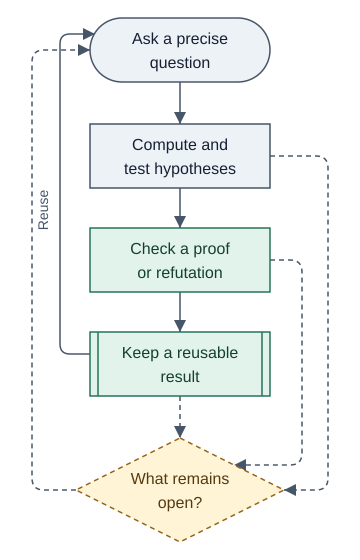

# trureturing

**A scientific method for AI to discover truth and find its next question.**

[Vision](docs/VISION.md) · [Film](#film) · [Start](#start-your-journey) · [Method](#from-questions-to-knowledge) ·
[Examples](#three-places-to-look) · [Truth and computation](#truth-and-computation) ·
[Spacetime](#toward-holographic-spacetime) · [Information escape](#information-escape) ·
[First run](#first-run) ·
[Lean source](D5/) · [Read the book](https://the-omega-institute.github.io/trureturing-mdbook/) ·
[Contribute](#take-part) · [Licensing](#license-and-foundations)

trureturing develops a scientific method for AI to turn gaps in knowledge into
questions, test conjectures, expose limits in its representations, and return
checked results to a reusable library. Autonomous research selection remains a
goal to evaluate.

The name expresses **true · return · Turing**. Truth guides the search;
verified knowledge returns as a premise for the next inquiry; computation
explores the connections. We call the structure we seek the **geometry of
logical truth**: dependencies, invariants, distinctions and the boundaries of
what an observer can recover.

The project combines philosophical inquiry, theory, experiments and Lean 4
formalization. Each proof establishes its exact statement under declared
assumptions. The [vision and research guide](docs/VISION.md) connects this work
to open directions.

## Film

<p><a href="https://github.com/the-omega-institute/trureturing-film/releases/download/film-001-v1/TRURETURING_001_narrated_EN_subs_ZH-EN.mp4"></a></p>

**TRURETURING — Truth Is Discovered** · English AI narration · Chinese and English subtitles.
[Download MP4](https://github.com/the-omega-institute/trureturing-film/releases/download/film-001-v1/TRURETURING_001_narrated_EN_subs_ZH-EN.mp4) ·
[Film source and releases](https://github.com/the-omega-institute/trureturing-film).

## Start your journey

Bring a question that matters to you. In an installed **Claude Code or Codex**
with a local workspace and Git, paste this one sentence:

> Help me explore https://github.com/the-omega-institute/trureturing: use an existing checkout or clone it into a new directory if needed, read AGENTS.md and README.md, then read the relevant SKILL.md under skills/ to investigate a question I care about and find a checked result or a clearly stated open question.

The [agent and skills guide](docs/CONTRIBUTING.md#use-claude-code-or-codex)
explains how to begin with either client and turn an exploration into a
contribution.

This homepage is the tip of an iceberg. The examples offer a glimpse; the
larger shape is yours to explore, following definitions, assumptions and
connections with your own questions. What you find can change how you look.
An epigraph for that exploration:

> And if thou gaze long into an abyss, the abyss will also gaze into thee.

— Friedrich Nietzsche, *Beyond Good and Evil*,
[§146](https://www.gutenberg.org/files/4363/4363-h/4363-h.htm).

## From questions to knowledge

Search [Lean source](D5/) and literature for your target. Identify missing
premises, distinctions or connections; choose questions addressing them.
Specify supporting and refuting outcomes before designing discriminating tests.
Keep results with their assumptions; check those against your objects before reuse.

> The last line of the ledger is always the first line of the next round.

Proofs supply premises; counterexamples refute claims within their stated scope.
When identical readings hide different target values, no function of those
readings recovers the target in both cases.
[Seek new observations or relations](docs/VISION.md#how-ai-can-find-its-next-direction).

Evaluate research selection against stated baselines on questions excluded
from method design, matching information and resources.

<p></p>

*A schematic of inquiry, not runtime behavior or dependency data.* Checked
results return as premises; dashed returns carry unresolved questions, even
without a checked result. Tests alone do not establish a theorem.

Golden integers, Fibonacci weights and Zeckendorf representations are one
thread of the library; the examples below also explore conjecture refutation
and limits of local observation.

## Three places to look

### 01 · Refute a conjecture.

For positive integers n, let a(n) be the greatest integer k with `(1 + 1/n)^k ≤ 2`.
Greathouse conjectured for OEIS A175406 that
`a(n) = floor((n + 1/2) log 2)`. At `n = 1121626023352383`, the formula gives
`777451915729368`, while the actual value is one less.
The [Lean refutation](D5/S0/Certificates/GreathouseLogTwoFloorRefutation.lean)
uses certified logarithm bounds to refute the literal universal formula.
What characterizes the inputs where it fails? Witness minimality and priority
are not claimed. [Problem and sources](Problems/oeis-a175406-log-two-floor-refutation.md) ·
[Explanation](Blueprint/D5/S0/Certificates/GreathouseLogTwoFloorRefutation.md).

### 02 · Find what observations cannot tell you.

The [local-marginal theorem](D5/S3/Quantum/Entanglement/LocalMarginalCorrelationBlindSpot.lean)
gives two-qubit states with identical reduced states on both qubits: the pure
Bell state `(|00⟩+|11⟩)/√2` and the equal `00`/`11` mixture. An added joint
`X⊗X` readout has expectations `1` and `0`, respectively, where [X](D5/S3/Quantum/FiniteDimensional.lean) swaps
`0` and `1`. This separates this pair.

For finite factor dimensions `m, n ≥ 1` with `m × n > 1`, the theorem also
proves that the correlation sector in the Hermitian tensor model is orthogonal
to the local sectors and has real dimension `(m² − 1)(n² − 1)`. This identifies
precisely which directions the local description omits.
[Explanation](Blueprint/D5/S3/Quantum/Entanglement/LocalMarginalCorrelationBlindSpot.md).

### 03 · Build a result that holds beyond the examples.

Write a natural number n as its unique sum of nonadjacent Fibonacci weights
`F₂ = 1, F₃ = 2, F₄ = 3, …`. Replace each weight Fᵢ by φⁱ, where φ is the
golden ratio, to obtain β(n). How far does this coordinate fail to preserve
addition?

$$\beta(a)+\beta(b)-\beta(a+b)\in\lbrace-1,0,1\rbrace.$$

[`deficit_three_valued`](D5/S1/Deficit/DeficitThreeValued.lean) proves this for
all natural inputs. For `1 + 1`, `β(1)=φ²` and `β(2)=φ³` give `2φ²−φ³=1`.
The discrepancy is also the signed count of the two
lowest repeated-carry rules during digit normalization: a reusable connection
between an arithmetic algorithm and an exact bound, however large the inputs.
[Definitions and carry-count theorem](D5/S1/Deficit/DeficitInteger.lean) ·
[Explanation](Blueprint/D5/S1/Deficit/DeficitThreeValued.md).

## Truth and computation

Our philosophical starting point is that **truth is discovered, not created
by the act of computing it**. In this view, **Dao (道), or God (神), names an
encompassing network of truths and their logical relations**, within which a
finite observer discovers connections. This is the project's metaphysical
orientation, not a theorem about the existence of God or the physical universe.

Computation constructs examples and counterexamples, searches for proofs and
checks them. A verified proof extends what the library can justify and reuse.
Neither this philosophical conviction nor a growing proof library establishes
that one program can enumerate or decide every truth.

The [dependency topology](D5/S3/ConceptDynamics/DependencyTopology/AlexandrovDependencyTopology.lean)
calls a set open when it contains every node reachable from its members. The
[recovery criterion](D5/S3/ConceptDynamics/Restoration/TargetRecoveryCriterion.lean)
says that, on a nonempty state space, a target admits a recovery function from
an observation exactly when any two states with the same observation have the
same target value. Existence alone supplies no algorithm or cost bound.

## Toward holographic spacetime

We study **holographic spacetime geometry** by asking when partial records
of time and space support reconstruction and
[temporal composition](D5/S3/ConceptDynamics/Spacetime/HiddenArchiveTemporalDomain.lean).

[Local agreement can fail globally](D5/S3/ConceptDynamics/Gluing/LocalLawGluingObstruction.lean):
three windows on Boolean variables require `x=y`, `y=z` and `x≠z`. Every
overlap allows both values, yet no triple satisfies all three constraints.

The [tree extension theorem](D5/S3/ConceptDynamics/Gluing/RunningIntersectionRecords.lean)
assumes nonempty local record sets on a finite tree: each recorded variable's
occurrences form a connected subtree, and neighbors allow exactly the same
joint assignments on their full overlap. Every allowed local record extends
across all recorded variables, satisfying every local constraint.
Additional global constraints can exclude every extension.

Uniqueness, original-history recovery, computational cost, and reconstruction
with resolution and error bounds require further results. Links to physical
spacetime or holographic duality remain research questions.

Theory inputs study
[event archives](docs/develop/theory/CONTEXTUAL_SPACETIME_ARITHMETIC.md)
retaining time, position, causal order and provenance;
[when observations preserve](docs/develop/theory/RECURSIVE_RELATIONAL_OBSERVATION.md)
composition, shared sources and targets; and
[experimental distances](docs/develop/theory/RECURSIVE_RELATIONAL_OBSERVATION_CONTEXT_GEOMETRY.md)
defined through allowed experiments and responses. Their prose does not certify
formal coverage.

## Information escape

**Information escape**: some distinct states remain indistinguishable under
chosen **readouts** (observation methods). Four questions guide an **automated
reviewer** under development:

- **Where did information escape?** Name the objects, assumptions and
  observations under which distinct states remain indistinguishable.
- **How is that escape addressed?** Describe the added readout or relation,
  and show how a proof connects it to those objects and assumptions.
- **What new information emerges?** Identify the distinction now justified
  by the result and its verified connection to the readout.
- **Where does information continue to escape?** Exhibit a remaining
  indistinguishable pair, prove none remain within the stated scope, or mark
  the boundary open.

**Mathematical comparison.** Fix a catalog of registered theorem occurrences and their readouts on one
shared state space. Remove one occurrence while keeping the others fixed.
Its **unique captures** are the pairs of distinct states that were
distinguishable before removal and indistinguishable afterward. The
[EscapePairs definitions and proofs](D5/S3/ConceptDynamics/InformationEscape/EscapePairs.lean)
formalize this comparison.

For a **finite state space with at least two states**,
[StructuralNovelty](D5/S3/ConceptDynamics/InformationEscape/StructuralNovelty.lean)
shows that removing an occurrence strictly increases the **escape rate** exactly
when it has a unique capture. The rate is the fraction of ordered distinct-state
pairs left indistinguishable. Zero unique capture does not mean worthlessness:
another occurrence can carry the same distinction. This comparison supplies
neither a universal value score nor a historical novelty judgment.

[Example 02](#02--find-what-observations-cannot-tell-you) adds `X⊗X` expectations to separate a locally
indistinguishable pair. Which pairs, if any, remain indistinguishable after
adding this readout?

The current declared-template binding rule issues
**Observe warnings that do not block admission**
([specification, A5.5](docs/develop/spec/golden-ledger-repo-spec.md);
[implementation](tools/StrataLint.Engine/Rules/TheoryGeneration/DeclaredTemplateBindingRule.cs)).
Other admission checks still apply. Its module selection is
separate from the mathematical comparison above.
The [Normative Draft](docs/develop/spec/lean_single_compile_intrinsic_information_escape_theory_and_spec.md)
describes a wider design whose implementation remains incomplete.

## What is proved, and what is open

Mathematical reuse rests on the statements, checked proof terms and axiom
dependencies in the [Lean source](D5/). The
[frozen ledger](Golden/Frozen/state/) tracks frozen module identities.
[Theory prose](docs/develop/theory/) supplies research input, and
[experiments](Evidence/) supply observations within their declared scope;
neither substitutes for a Lean proof. The C# harness checks repository rules,
proof reports and frozen state. Independent review examines whether statements
faithfully express the intended mathematics.

The [book](https://the-omega-institute.github.io/trureturing-mdbook/) is a
browsable, searchable projection of [Blueprint/](Blueprint/), published by
[trureturing-mdbook](https://github.com/the-omega-institute/trureturing-mdbook).
It explains the work; the formal source remains authoritative.

Two explicit boundaries live in [Hearts.lean](D5/X_Frontier/Hearts.lean):

- **O-5:** `o5_independence`, a zero-localization claim for the canonical golden
  Euler germ, has an unresolved proof body (`sorry`).
- **O-6:** `o6WeilPositivityStatement` defines a Weil-positivity proposition.
  Defining that proposition supplies no proof of it.

These are open research obligations, not established impossibility results.
This repository does **not** establish the Riemann hypothesis.

## First run

Install [elan](https://github.com/leanprover/elan#installation) and the
[.NET SDK](https://dotnet.microsoft.com/en-us/download) version specified in
[global.json](global.json). Ensure `lake` and `dotnet` are on `PATH`;
you also need Git, Make and Bash.
elan selects Lean from [lean-toolchain](lean-toolchain). Mathlib is declared in
[lakefile.toml](lakefile.toml), with resolved dependencies in
[lake-manifest.json](lake-manifest.json). For contribution checks, add Python
3.11+ as `python3`; see the [full prerequisites](docs/CONTRIBUTING.md#prerequisites).

Clone the project, then build just the introductory module. The `make` entry
prepares a private Lean cache; the first run may download dependencies.

```sh
git clone https://github.com/the-omega-institute/trureturing.git
cd trureturing
make lean LEAN_TARGETS=D5.S0.Conventions.WDigits
```

The [WDigits module](D5/S0/Conventions/WDigits.lean) directly reuses
**Mathlib's Zeckendorf development** to encode and decode natural numbers.
From that same directory, run this temporary example:

```sh
example_dir="$(mktemp -d)"
cat > "$example_dir/First.lean" <<'LEAN'
import D5.S0.Conventions.WDigits
open D5.S0.Conventions

#eval wdigits 42
#eval ((wdigits 42).map Nat.fib).sum
#check decode_wdigits
LEAN
lake env lean "$example_dir/First.lean"
rm "$example_dir/First.lean"
rmdir "$example_dir"
```

The two evaluations print `[9, 6]` and `42`. The list contains **Fibonacci
indices**, so its weights are `F₉ = 34` and `F₆ = 8`; it is not a list of the
weights themselves. `#check` displays the general decoding theorem's type.
Evaluating 42 illustrates the encoding; the theorem covers every natural number.

[Read the explanation](Blueprint/D5/S0/Conventions/WDigits.md).
`make help` lists the repository's command entry points.

## Take part

Start with one of the examples above. Reproduce it, improve its explanation,
report a mismatch between prose and a statement, or explore a precise open
question. Contributions in English and Chinese are welcome.

### A continuing research program

The [research directions](docs/VISION.md#research-directions) specify evidence
of progress for each question:

- Can AI choose questions that yield reusable knowledge?
- Which maps connect proof dependencies and observational distinctions?
- Which historical relations support reconstruction and legal composition?

The [contribution guide](docs/CONTRIBUTING.md) walks you through forks, isolated
worktrees, checks and pull requests to `dev`.
[Issues](https://github.com/the-omega-institute/trureturing/issues) are a place
to bring a concrete question or reproducible problem.

## License and foundations

The root [LICENSE](LICENSE) contains Apache-2.0. The repository's
[licensing specification](docs/develop/spec/golden-ledger-repo-spec.md#第八部治理)
assigns Apache-2.0 to repository-produced Lean code, CC-BY-4.0 to text, and CC0
to data. Third-party dependencies retain their upstream licenses and applicable
notices.

Built on
[Lean](https://lean-lang.org/) and [Mathlib](https://github.com/leanprover-community/mathlib4).
Classical results and upstream proofs remain credited to their sources.
