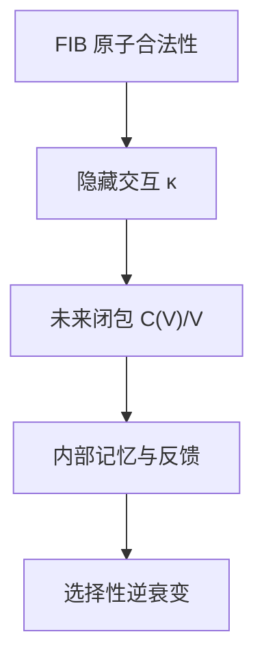

# AURIC FIB ATOM Dynamic Future Quotient and Future-Closed Memory

**Reference-input status.** This volume is an open theory reference input assembled from two complete user-supplied source parts. It is not Lean-verified, frozen truth, a physical law, a biological theorem, or an experiment report. Lean declarations and their kernel-checked axiom closures remain the repository's mathematical truth source.

**Provenance.** Author kind: mixed user-supplied material; original author and model are unknown. Receipt date: 2026-10-10. The source state cites the historical project snapshots [`912f4990050451866c2bb1cf71e33151a637d4b7`](https://github.com/the-omega-institute/trureturing/commit/912f4990050451866c2bb1cf71e33151a637d4b7) and [`3a56aa49697ab7641b7dbe616e0424327c69d2ca`](https://github.com/the-omega-institute/trureturing/commit/3a56aa49697ab7641b7dbe616e0424327c69d2ca). Current/latest statements from the supplied parts are retained as attributed historical claims.

**Dictionary fixed throughout both source parts.**

$$
F[\mathrm{null}]=\mathrm{null},\qquad F[1]=[2],\qquad F[2]=[3],\qquad F[3]=[5],\qquad F[1,3]=[2,5].
$$

The symbols $x,y,z$ mean occupancy at positions $1,3,2$, respectively. A probability vector $p$, a phase symbol $p$, and the response variable $y$ are distinct by context.

**Editorial qualification matrix.** The following notes are scope qualifications for the supplied source claims; they do not replace or silently rewrite the source text.

- **Q1 (Part I §§1–6, 9–10):** Count and phase classification is restricted to actual positive-mass fourth-segment activity after third-marker writing/latching, under one fixed finite or countable prior on positive integer depths with at least two positive support points and one once-sampled $K$ shared by all Reads. Paid retries, returns, and partial parses from zero remain in scope; future acceptance is not conditioned on. Reachable histories need not fill $\mathbb N^2\times\{p,\beta\}$, and the seed-stage $(\alpha\alpha)^j$ construction is not an active fourth-stage loop.
- **Q2 (Part I §§2–4, 8):** Minimality means equality of complete probabilistic residual laws on the declared legal domain, up to equivalent encodings. The Myhill–Nerode comparison is a scoped right-congruence analogy requiring equal branch masses and positive-probability legal residuals. It is stronger than equality of means, pointwise reports, or one sampled outcome.
- **Q3 (Part I §§4–7; Part II §§4, 14.1):** Active, pending$_0$, pending$_1$, and delivered are distinct boundary domains. Pending states retain their mandatory original Stop and forbid Read; delivered has empty future. An unbounded exact quotient differs from finite coordinate dimension, realization rank, finite states, and finite bits. Counters in an implementation record do not by themselves make pending states minimal coordinates.
- **Q4 (Part I §7; Part II §§2, 7–8):** Combining static $\kappa$ with a depth posterior requires a shared source, joint law, and response kernel. The displayed $(\kappa,a,A,B,\tau)$ is a conditional synthesis, not a universally proved joint minimum, and it cannot reconstruct arbitrary static $p$ without visible coordinates. For $\chi=z+xy$, $E[\chi]=Z+\kappa$; statewise identities and expectation identities must not be interchanged. Spectral $M_2$ is an additional readout with its stated nonnegative-root domain.
- **Q5 (Part II §§3–5, 14.1):** The linear minimal-memory statement concerns exact expectation determination for all laws on the declared finite domain, with constants and a fixed action family. One-step $\mathcal C(V)$ coverage is not recursive invariant closure; $V^{(\infty)}$ is the iterated action closure. Guarded, stochastic, and conditioned actions require their guards, kernels, and normalization. Dimension counts such as $1/12/4$ are scoped relation ranks until their action and target correspondence is supplied.
- **Q6 (Part II §§5–6, 12–14):** Function factorization on a specified reachable extended domain establishes selected future prediction only. It does not supply acquired memory, a recursive updater, feedback actions, controllability, viability, maintenance, or resource budgets. Prediction, maintenance, and physical reversal remain separate. Life and inverse-decay language is an open model proposal, not a biological or thermodynamic theorem.
- **Q7 (Part II §§2–3, 6, 14.2):** Degenerate feasible fibers and fixed-support faces can remove a hidden direction. The $J_f$ criterion requires actual variation on the relevant fiber. Modular invertibility applies to declared integer or residue domains. The raw representative $J_fxy$ differs from the fixed-law orthogonal residual $J_f(xy-\operatorname{Proj}_Vxy)$; $1/\mathcal I$ and $J_f^2/\mathcal I$ require the stated support and positive base corners, and are not energy or maintenance-cost theorems.
- **Q8 (Part II §6):** The stability recurrence requires a nonnegative adapted integrable error, sufficient conditioning information, uniform deterministic $0\le\lambda<1$, and $\varepsilon\ge0$. The displayed bound uses deterministic initial error $e_0$; for random $e_0$, its first term is $\lambda^t\mathbb E[e_0]$. It proves only the stated conditional upper bound. A passive relaxation may also satisfy $\lambda<1$; an upper bound with $a\ge1$ does not prove growth. Passive/critical/life labels remain source interpretations.
- **Q9 (Part II §§9–10, 14.3):** The Gram determinant and rank apply to the specified Hermitian unit-record five-cycle with zero nonadjacent entries and a positive-semidefinite realization; phase requires a nonzero cycle product. The FIB-to-holonomy comparison is an analogy at the supplied scope. Independence-complex suspension and transition/reachability structure do not by themselves identify physical time, memory-growth periods, or gravity. Reachability with cycles is a preorder, and safe forgetting is task-relative.
- **Q10 (Part II §§11–12, 14.2):** Ancestry recovery is tied to the specified tree family and acquired area/address data. The response-memory model retains positive couplings, mass, the internal initial-state term, and the stated transfer-function scope. Dissipation follows only from the supplied relaxation model; accessibility, physical energy costs, and biological feedback do not follow from static geometry.

The complete source parts follow in order. Part I is the dynamic future-quotient source; Part II is the future-closed-memory/life source. Their local numbering and wording are retained.

这一步继续推进到“动态闭包”层。先校准项目状态：

- 远端 `dev` 已经继续前移，但新增提交是治理和环境维护类变化；
- Auric FIB ATOM / Fibonacci future-response 相关的最新理论仍然是 [PR #14893](https://github.com/the-omega-institute/trureturing/pull/14893) 及其提交 [`912f4990050451866c2bb1cf71e33151a637d4b7`](https://github.com/the-omega-institute/trureturing/commit/912f4990050451866c2bb1cf71e33151a637d4b7)；
- 当前项目的公开 PR 列表仍将“recover native Fibonacci Read counts from future laws”列为该理论线的关键工作。[GitHub](https://github.com/the-omega-institute/trureturing/pulls?utm_source=chatgpt.com)

前一轮已经得到静态关系：

\[
\kappa=p_{13}=E[xy]
\]

是三位窗口唯一的隐藏二阶矩。

现在继续证明：

> 对动态历史而言，完整 future law 诱导出一个类似 Myhill–Nerode 的最小状态商。  
> 在非单例 Fibonacci 深度先验下，这个最小商通常是无限的，不能被有限状态摘要精确替代。

这正是静态 FIB 金字塔和“时间方向上的选择性遗忘”之间的严格连接。

---

# 一、活动历史与未来等价关系

仍使用五态窗口：

\[
F[\mathrm{null}]=\mathrm{null},
\]

\[
F[1]=[2],
\]

\[
F[2]=[3],
\]

\[
F[3]=[5],
\]

\[
F[1,3]=[2,5].
\]

当前 future-response 文档中，隐藏 Fibonacci 深度 \(K\) 的两个基本 Read 概率为

\[
r_k=\frac{\mathrm{Fib}_{k+1}}{\mathrm{Fib}_{k+3}},
\]

\[
s_k=\frac{\mathrm{Fib}_{k+2}}{\mathrm{Fib}_{k+3}},
\]

并且

\[
r_k+s_k=1.
\]

设历史 \(h\) 已经完成了若干合法付费 Read。定义：

- \(a(h)\in\{p,\beta\}\)：当前活动 phase；
- \(A_h\)：从第一笔付费 Read 起取得的 \(\alpha\) 次数；
- \(B_h\)：从第一笔付费 Read 起取得的 \(\beta\) 次数。

定义活动摘要

\[
\sigma(h)
=
\bigl(a(h),A_h,B_h\bigr).
\]

给定固定的非单例深度先验 \(\mu\)，定义

\[
\mathscr L_h
\]

为从历史 \(h\) 开始的完整合法剩余未来律。这里的“完整”包括：

- 后续合法 Read 字母；
- phase 转移；
- 第四标记完成；
- pending Stop；
- delivered 终态；
- 不允许的 post-Stop Read 被排除。

定义未来等价关系

\[
h\sim_{\mathrm{Fut}}h'
\quad\Longleftrightarrow\quad
\mathscr L_h=\mathscr L_{h'}.
\]

---

# 二、动态未来闭包定理

## 定理 1：活动 future law 的最小精确摘要

固定一个先验 \(\mu\)，并假设其正支持至少包含两个不同的 Fibonacci 深度。

在实际活动历史域上，有：

\[
h\sim_{\mathrm{Fut}}h'
\quad\Longleftrightarrow\quad
\sigma(h)=\sigma(h').
\]

也就是说：

\[
\boxed{
\mathscr L_h=\mathscr L_{h'}
\Longleftrightarrow
\bigl(a(h),A_h,B_h\bigr)
=
\bigl(a(h'),A_{h'},B_{h'}\bigr).
}
\]

因此，\(\sigma(h)\) 是活动 future law 的最小精确摘要。

### 证明

## 第一步：相同摘要给出相同后验

在历史 \(h\) 下，深度 \(k\) 的未归一化后验权重为

\[
\mu(k)r_k^{A_h}s_k^{B_h}.
\]

所以

\[
\nu_h(k)
=
\frac{
\mu(k)r_k^{A_h}s_k^{B_h}
}{
\sum_\ell
\mu(\ell)r_\ell^{A_h}s_\ell^{B_h}
}.
\]

若

\[
\sigma(h)=\sigma(h'),
\]

则

\[
a(h)=a(h'),
\qquad
A_h=A_{h'},
\qquad
B_h=B_{h'}.
\]

因此

\[
\nu_h=\nu_{h'}.
\]

当前 phase 相同，隐藏深度后验相同。由已有的条件尾分布公式，后续 Read、phase 转移和剩余合法转录律全部相同，于是

\[
\mathscr L_h=\mathscr L_{h'}.
\]

## 第二步：相同 future law 反推出相同摘要

反过来，假设

\[
\mathscr L_h=\mathscr L_{h'}.
\]

当前 FR §§34–35 的等价链给出：

\[
\mathscr L_h=\mathscr L_{h'}
\Longrightarrow
(a(h),\nu_h)=(a(h'),\nu_{h'}).
\]

其中关键的数论输入是：若两个不同深度 \(i\neq j\) 同时具有正先验，则

\[
\left(\frac{r_i}{r_j}\right)^u
\left(\frac{s_i}{s_j}\right)^v=1
\]

只能在

\[
u=v=0
\]

时成立。

因此，不同的整数计数 \((A,B)\) 不可能产生同一个深度后验。于是

\[
\nu_h=\nu_{h'}
\Longrightarrow
(A_h,B_h)=(A_{h'},B_{h'}).
\]

再结合 phase 相等，得到

\[
\sigma(h)=\sigma(h').
\]

证毕。

---

# 三、为什么这是“最小”摘要

设 \(T(h)\) 是任意一个观察者摘要，并且存在函数 \(G\)，使得

\[
\mathscr L_h=G(T(h)).
\]

这意味着 \(T(h)\) 足以预测完整未来律。

## 推论 1：任何 future-sufficient 摘要都必须细化 \(\sigma\)

若

\[
T(h)=T(h'),
\]

则

\[
\mathscr L_h
=
G(T(h))
=
G(T(h'))
=
\mathscr L_{h'}.
\]

由定理 1，

\[
\sigma(h)=\sigma(h').
\]

因此：

\[
\boxed{
T(h)=T(h')
\Longrightarrow
\sigma(h)=\sigma(h').
}
\]

换句话说，任何精确预测完整 future law 的状态摘要，都不能把两个不同的

\[
(\mathrm{phase},A,B)
\]

合并到同一个状态中。

这就是一个动态版的 Myhill–Nerode 定理：

- 历史是输入词；
- 未来合法转录律是语言行为；
- 两个历史等价，当且仅当所有未来测试结果相同；
- \(\sigma(h)\) 是未来行为的最小商状态。

---

# 四、摘要沿合法操作递归闭合

动态摘要不是静态标签，它必须在每次合法 Read 后可更新。

令 \(U_\alpha,U_\beta\) 表示接收下一次合法 Read 字母后的摘要更新。

在 phase \(p\)：

\[
U_\alpha(p,A,B)
=
\mathrm{pending}_0(A+1,B),
\]

\[
U_\beta(p,A,B)
=
(\beta,A,B+1).
\]

在 phase \(\beta\)：

\[
U_\alpha(\beta,A,B)
=
(p,A+1,B),
\]

\[
U_\beta(\beta,A,B)
=
\mathrm{pending}_1(A,B+1).
\]

Stop 操作继续更新为：

\[
\mathrm{Stop}_0:
\mathrm{pending}_0\to\mathrm{delivered},
\]

\[
\mathrm{Stop}_1:
\mathrm{pending}_1\to\mathrm{delivered}.
\]

而 delivered 状态没有后续 Read：

\[
\mathrm{delivered}\not\to
\text{Read}.
\]

因此，活动摘要的动态更新可以写成：

\[
\sigma(h\cdot x)
=
U_x(\sigma(h)).
\]

这说明 future-sufficient 摘要形成一个真正的递归闭包：

\[
\boxed{
\text{当前摘要}
+
\text{合法输入}
\longrightarrow
\text{下一摘要}.
}
\]

这个结构与普通有限自动机相似，但这里的状态空间一般不是有限的，因为 \(A,B\) 可以无限增长。

---

# 五、无限状态障碍

## 定理 2：非单例深度先验下不存在有限状态的精确 future 摘要

固定一个正先验 \(\mu\)，其支持至少包含两个不同深度。

则在活动历史域上，future-law 等价类是无限多个。因此不存在有限集合 \(Q\) 和摘要函数

\[
T:\mathcal H_{\mathrm{act}}\to Q
\]

使得完整未来律只依赖于 \(T(h)\)。

### 证明

取一个实际活动历史

\[
h_*=
\beta\alpha\mid\beta\beta\alpha\alpha,
\]

其 phase 为 \(p\)，计数为

\[
(A_{h_*},B_{h_*})=(3,3).
\]

现在在前面重复加入拒绝对 \(\alpha\alpha\)，定义

\[
h_j=(\alpha\alpha)^j h_*,
\qquad
j\ge0.
\]

这些历史都仍然到达同一个活动 phase \(p\)，但计数变为

\[
(A_{h_j},B_{h_j})=(2j+3,3).
\]

若 \(j\neq j'\)，则

\[
(A_{h_j},B_{h_j})
\neq
(A_{h_{j'}},B_{h_{j'}}).
\]

由定理 1，

\[
\mathscr L_{h_j}
\neq
\mathscr L_{h_{j'}}.
\]

因此 \(\{\mathscr L_{h_j}:j\ge0\}\) 是无限集合。

若存在有限状态集 \(Q\)，则由鸽巢原理，必有

\[
j\neq j'
\]

使得

\[
T(h_j)=T(h_{j'}).
\]

但若 future law 只依赖 \(T\)，则应有

\[
\mathscr L_{h_j}
=
\mathscr L_{h_{j'}}.
\]

这与前面得到的差异矛盾。

因此不存在有限状态摘要精确表示所有活动历史的完整未来律。证毕。

---

## 解释

这不是说“系统完全不能压缩”。

准确的结论是：

- 可以把任意历史压缩成三元摘要
  \[
  (a,A,B);
  \]
- 但 \(A,B\in\mathbb N\) 是无界的；
- 所以可以有有限维摘要，却不能有有限状态摘要；
- 若还要求有限固定宽度存储，则更不可能精确保存所有 future law。

这与项目中“未来律可恢复计数，但不自动恢复完整历史”的结果完全一致。

---

# 六、单例先验是尖锐例外

如果先验只支持一个深度：

\[
\operatorname{supp}\mu=\{k\},
\]

则 posterior 永远是

\[
\delta_k.
\]

这时，在固定 phase 内，计数 \((A,B)\) 不再改变隐藏深度后验，因此可能出现：

\[
\mathscr L_h=\mathscr L_{h'}
\]

即使

\[
(A_h,B_h)\neq(A_{h'},B_{h'}).
\]

所以“无限 future-law 商”需要至少两个正支持深度。

但即使在单例先验下，终端标签仍不能删除：

\[
\mathrm{pending}_0,
\qquad
\mathrm{pending}_1,
\qquad
\mathrm{delivered}
\]

虽然它们的剩余 Read 数都可能是零，但未来义务不同：

\[
\mathrm{pending}_0\to\mathrm{Stop}_0,
\]

\[
\mathrm{pending}_1\to\mathrm{Stop}_1,
\]

\[
\mathrm{delivered}\to\varepsilon.
\]

因此，终端边界是另一类不可压缩信息。

---

# 七、静态 \(\kappa\) 轴与动态 \((A,B)\) 轴的合并

现在可以把 FIB ATOM 观察状态分解成三个层次：

\[
\mathcal S
=
(\text{static mode law},
\text{dynamic future state},
\text{boundary label}).
\]

## 静态轴

三位窗口的静态 law 为

\[
p=
(p_{\mathrm{null}},p_1,p_2,p_3,p_{13}).
\]

原始占用均值

\[
P=(X,Y,Z)
\]

遗漏

\[
\kappa=p_{13}=E[xy].
\]

如果未来响应的四角对比

\[
J_{\mathscr L}
=
\mathscr L_{1,3}
-\mathscr L_1
-\mathscr L_3
+\mathscr L_{\mathrm{null}}
\]

非零，那么未来律还必须区分不同 \(\kappa\)。

## 动态轴

活动历史的最小未来摘要为

\[
\sigma(h)=(a(h),A_h,B_h).
\]

非单例先验下，这个轴通常是无限的。

## 边界轴

至少还需要

\[
\tau\in
\{
\mathrm{active},
\mathrm{pending}_0,
\mathrm{pending}_1,
\mathrm{delivered}
\}.
\]

于是一个能够精确预测未来的最小状态结构至少具有形式

\[
\boxed{
\mathcal O_{\min}
=
\bigl(
\kappa,\,
a,\,
A,\,
B,\,
\tau
\bigr)
}
\]

但这里要加一个重要条件：

- \(\kappa\) 只有在 future response 的 \(J_{\mathscr L}\neq0\) 时才必须保留；
- 如果未来律对五态模式完全没有四角差，则 \(\kappa\) 可以从 future-prediction 摘要中删去；
- 如果目标不只是预测未来，而是重构静态 law，则 \(\kappa\) 仍然必须保留；
- chronology、selected-count bank 和隐藏样本身份 \(K\) 仍可能在这个摘要之外。

因此，“最小摘要”必须相对于任务定义：

\[
\text{静态重构},
\quad
\text{未来预测},
\quad
\text{历史重构}
\]

三者的最小状态不同。

---

# 八、选择性遗忘的严格数学解释

你此前提出“生命的本质是有选择地遗忘信息”。在这里可以得到一个严格的有限模型解释。

设

\[
T:\mathcal H\to\mathcal Q
\]

是观察者的记忆压缩函数。

## 定义 5：未来安全遗忘

称 \(T\) 是 future-safe 的，如果

\[
T(h)=T(h')
\Longrightarrow
\mathscr L_h=\mathscr L_{h'}.
\]

也就是说，\(T\) 可以忘记历史细节，但不能忘记任何会改变未来律的信息。

由定理 1：

\[
T(h)=T(h')
\Longrightarrow
\sigma(h)=\sigma(h')
\]

在活动域上必须成立。

所以：

- chronology 如果不影响 future law，可以遗忘；
- 某些过去记录如果不再影响任何合法未来，也可以遗忘；
- 不同 \((a,A,B)\) 不能遗忘；
- pending0 与 pending1 不能合并；
- active 与 delivered 不能合并；
- 若 \(J_{\mathscr L}\neq0\)，不同 \(\kappa\) 不能合并。

这给出一个精确的方向性：

\[
\boxed{
\text{时间方向}
=
\text{允许遗忘的历史细节}
\text{与必须保留的未来区分之间的偏序}.
}
\]

这不是把物理时间定理化，而是在当前观察模型中定义了一个严格的“可安全遗忘关系”。

---

# 九、信息逸出的两种完全不同形态

现在可以区分两个经常混在一起的概念。

## 1. 静态几何逸出

这是 \(\kappa\)-纤维：

\[
P=(X,Y,Z)
\]

相同，但

\[
p_{13}
\]

不同。

它是有限维的：

\[
\dim=1
\]

对于三位窗口正好成立。

## 2. 动态历史逸出

这是不同历史具有不同计数：

\[
(A,B)\neq(A',B')
\]

但如果观察者只保存付费长度

\[
A+B,
\]

就可能发生碰撞。

最新 FR 文档给出的反例正是：

\[
(5,3)
\quad\text{和}\quad
(3,5)
\]

具有相同总长度

\[
A+B=8,
\]

但 phase/posterior/future law 不同。

动态逸出不是一条有限线段，而是一个无界的计数晶格：

\[
\mathbb N^2\times\{p,\beta\}.
\]

因此：

\[
\boxed{
\text{静态逸出是 }\kappa\text{-纤维，}
\qquad
\text{动态逸出是 }(A,B)\text{-晶格。}
}
\]

二者叠加后，观察者需要同时处理：

\[
\text{关系联合项}
+
\text{历史计数}
+
\text{边界义务}.
\]

---

# 十、当前最值得继续形式化的命题

下一步最值得进入 Lean 的不是再增加一个数值实验，而是下面三个结构定理。

## 命题 A：`FutureQuotientMinimal`

定义

\[
h\sim h'
\Longleftrightarrow
\mathscr L_h=\mathscr L_{h'}.
\]

形式化证明：

\[
h\sim h'
\Longleftrightarrow
\sigma(h)=\sigma(h')
\]

在已声明的活动历史域和固定非单例先验下成立。

## 命题 B：`FutureSummaryClosed`

形式化四个更新：

\[
U_\alpha(p,A,B),
\quad
U_\beta(p,A,B),
\quad
U_\alpha(\beta,A,B),
\quad
U_\beta(\beta,A,B),
\]

并证明 future quotient 对合法操作闭合。

## 命题 C：`NoFiniteExactFutureQuotient`

构造

\[
h_j=(\alpha\alpha)^jh_*,
\]

证明：

\[
j\neq j'
\Longrightarrow
\mathscr L_{h_j}\neq\mathscr L_{h_{j'}}.
\]

再形式化推出：

\[
\not\exists
\text{ finite }Q,\ T:\mathcal H_{\mathrm{act}}\to Q
\]

使得

\[
\mathscr L_h=G(T(h)).
\]

这三个命题将把当前项目中的“信息逸出”从描述性语言提升为一个完整的动态状态商理论。

最终，Auric FIB ATOM 金字塔的最小结构可以写成：

\[
\boxed{
\begin{aligned}
\text{静态关系层:}&\quad \kappa=E[xy],\\
\text{动态计数层:}&\quad (A,B),\\
\text{phase 层:}&\quad a\in\{p,\beta\},\\
\text{边界层:}&\quad \tau\in\{\mathrm{active},\mathrm{pending}_0,\mathrm{pending}_1,\mathrm{delivered}\}.
\end{aligned}
}
\]

其中：

\[
F[\mathrm{null}],F[1],F[2],F[3],F[1,3]
\]

给出最小的静态五态结构，而

\[
(a,A,B,\tau)
\]

给出非单例 Fibonacci 未来律的最小动态结构。

这就是从五态金字塔到观察者时间方向的严格桥梁：

\[
\boxed{
\text{时间不是额外坐标，}
\quad
\text{而是 future-equivalence 商上的递归状态更新。}
}
\]

## Source boundary: Part II

The following complete part is the supplied continuation on future-closed memory and selective recovery. It is retained as a separate source part so that its physical and life interpretations remain visibly scoped.

# 续篇：生命作为“选择性的逆衰变”与未来闭合记忆

这次可以把此前的直觉推进成一个更严格的核心命题：

> **衰变是观测映射变得不可逆；生命不是把整个物理过程倒放，而是在一个被选择的关系子空间内，增加记忆、反馈和资源，使未来行为重新保持可预测。**

因此，“生命是逆衰变”可以被严格改写为：

\[
\boxed{
\text{生命}
=
\text{在选择的关系子空间上，对衰变造成的不可恢复性进行局部补偿}
}
\]

这一定义有三个限制：

1. 它只要求恢复选定的关系，不要求恢复全部微观状态。
2. 它依赖记忆与反馈，不是单纯的状态反演。
3. 它不违反整体热力学不可逆性，因为恢复局部秩序需要向环境输出熵和能量。

以下以项目当前开发记录的 `3a56aa4` 提交为基准。最新项目已经不再只有最初的五态计数，而是形成了几条互相连接的主线：

- 五态 FIB 代数与隐藏参数 \(\kappa\)；
- Gram 环的全局相位与局部观测的区别；
- 动态闭合与最小记忆维数；
- ancestry、括号结构和叶序列之间的不可逆压缩；
- response triangle 中内部记忆对外部响应的影响；
- \(K_{N+3}\simeq \operatorname{Susp}(K_N)\) 的三步拓扑重复结构。

项目相关的基础公式见：

- [AURIC FIB ATOM Pyramid Foundational Formulas and Relations](https://github.com/the-omega-institute/trureturing/blob/3a56aa49697ab7641b7dbe616e0424327c69d2ca/docs/develop/theory/AURIC_FIB_ATOM_PYRAMID_FOUNDATIONAL_FORMULAS_AND_RELATIONS.md)
- [Hidden Relations: Statistics, Phase and Seams](https://github.com/the-omega-institute/trureturing/blob/3a56aa49697ab7641b7dbe616e0424327c69d2ca/docs/develop/theory/AURIC_FIB_ATOM_HIDDEN_RELATIONS_STATISTICS_PHASE_AND_SEAMS.md)
- [Residual Rank and Arithmetic Resolution](https://github.com/the-omega-institute/trureturing/blob/3a56aa49697ab7641b7dbe616e0424327c69d2ca/docs/develop/theory/AURIC_FIB_ATOM_RESIDUAL_RANK_AND_ARITHMETIC_RESOLUTION.md)
- [Response Triangle and Internal Memory](https://github.com/the-omega-institute/trureturing/blob/3a56aa49697ab7641b7dbe616e0424327c69d2ca/docs/develop/theory/AURIC_FIB_ATOM_RESPONSE_TRIANGLE_AND_INTERNAL_MEMORY.md)

下面把这些结果组织成一个更统一的理论。

---

## 一、基础五态不是五个数，而是一个受约束的关系代数

沿用你规定的表示：

\[
F[\mathrm{null}]=\mathrm{null}
\]

\[
F[1]=[2]
\]

\[
F[2]=[3]
\]

\[
F[3]=[5]
\]

\[
F[1,3]=[2,5]
\]

把五个状态写成：

\[
\Sigma=
\{
F[\mathrm{null}],
F[1],
F[2],
F[3],
F[1,3]
\}
\]

定义三个指标：

\[
x=\mathbf 1_{\{1\in I\}}
\]

\[
y=\mathbf 1_{\{3\in I\}}
\]

\[
z=\mathbf 1_{\{2\in I\}}
\]

由于 \(F[2]\) 不能和 \(F[1]\)、\(F[3]\) 同时出现，所以有：

\[
xz=0
\]

\[
yz=0
\]

而 \(F[1]\) 与 \(F[3]\) 可以同时出现，因此：

\[
xy\neq 0
\]

同时 \(x,y,z\) 都是布尔变量：

\[
x^2=x,\qquad y^2=y,\qquad z^2=z
\]

于是五态系统可以表示成商代数：

\[
\mathscr A
=
\mathbb R[x,y,z]\Big/
\left(
x^2-x,\,
y^2-y,\,
z^2-z,\,
xz,\,
yz
\right)
\]

它的一个自然基为：

\[
\{1,x,y,z,xy\}
\]

这已经揭示了第一个基础隐藏关系：

\[
\boxed{
\text{五个模式的自由度不是五个独立方向，而是四个显式方向加一个交互方向 }xy
}
\]

五个状态指示函数可以写成：

\[
e_{\mathrm{null}}
=
1-x-y-z+xy
\]

\[
e_1=x-xy
\]

\[
e_2=z
\]

\[
e_3=y-xy
\]

\[
e_{13}=xy
\]

其中 \(xy\) 是唯一允许的两端共现关系。

---

## 二、第一隐藏关系：\(\kappa\) 是被边缘观测抹去的共选择量

设五态概率分布为：

\[
p=
(p_{\mathrm{null}},p_1,p_2,p_3,p_{13})
\]

当前只读取三个一阶量：

\[
X=\mathbb E[x]=p_1+p_{13}
\]

\[
Y=\mathbb E[y]=p_3+p_{13}
\]

\[
Z=\mathbb E[z]=p_2
\]

但 \(X,Y,Z\) 并不能唯一决定五态分布。定义：

\[
\kappa=p_{13}
\]

则完整分布为：

\[
p_{\mathrm{null}}=1-X-Y-Z+\kappa
\]

\[
p_1=X-\kappa
\]

\[
p_2=Z
\]

\[
p_3=Y-\kappa
\]

\[
p_{13}=\kappa
\]

也就是：

\[
p(\kappa)
=
\left(
1-X-Y-Z+\kappa,\,
X-\kappa,\,
Z,\,
Y-\kappa,\,
\kappa
\right)
\]

合法性要求：

\[
\max(0,X+Y+Z-1)
\le
\kappa
\le
\min(X,Y)
\]

两个具有相同 \(X,Y,Z\) 但不同 \(\kappa\) 的分布，其差为：

\[
\Delta p
=
(\Delta\kappa,-\Delta\kappa,0,-\Delta\kappa,\Delta\kappa)
\]

因此：

\[
\Delta X=\Delta Y=\Delta Z=0
\]

但：

\[
\Delta p_{13}=\Delta\kappa
\]

这说明 \(\kappa\) 正好位于一阶观测的核中。

### 定理 1：五态一阶观测的隐核定理

定义一阶观测映射：

\[
\Pi(p)=(X,Y,Z)
\]

则在固定 \((X,Y,Z)\) 的条件下，所有可能分布组成一条一维线段，其方向为：

\[
v_{\mathrm{hidden}}
=
(1,-1,0,-1,1)
\]

而该方向正是 \(xy\) 交互关系对应的概率方向。

#### 证明

由定义：

\[
X=p_1+p_{13}
\]

\[
Y=p_3+p_{13}
\]

\[
Z=p_2
\]

若沿着 \(v_{\mathrm{hidden}}\) 移动，即令：

\[
p\mapsto p+\epsilon(1,-1,0,-1,1)
\]

则：

\[
X\mapsto (p_1-\epsilon)+(p_{13}+\epsilon)=X
\]

\[
Y\mapsto (p_3-\epsilon)+(p_{13}+\epsilon)=Y
\]

\[
Z\mapsto p_2=Z
\]

因此该方向被 \(\Pi\) 完全抹去。另一方面，五态概率和保持不变：

\[
1-1+0-1+1=0
\]

所以它确实是概率单纯形内的合法切向方向。由于完整五态空间维数为 \(4\)，一阶约束给出三条独立条件，因此剩余自由度为一维。证毕。

---

这个定理说明：

\[
\boxed{
\kappa
\text{ 不是一个额外任意参数，而是五态系统中唯一没有被 }(X,Y,Z)\text{ 记录的交互维度}
}
\]

从信息角度看：

\[
\kappa=\mathbb E[xy]
\]

而边缘均值只知道：

\[
\mathbb E[x]=X,\qquad \mathbb E[y]=Y
\]

如果假设独立，则会错误地写成：

\[
\kappa=XY
\]

实际的协方差为：

\[
\operatorname{Cov}(x,y)
=
\kappa-XY
\]

因此：

- \(\kappa>XY\)：两端更容易共同出现；
- \(\kappa<XY\)：两端具有排斥关系；
- \(\kappa=XY\)：在二元边缘上恰好独立。

这就是 AURIC FIB ATOM 金字塔的第一个“基础元素之间的隐藏关系”：不是单个原子的数值，而是两个本来可以分别出现的端点是否共同出现。

---

## 三、第二隐藏关系：一个读数看不见交互项，平方读数却能看见

任意五态函数 \(f\) 都可以唯一写成：

\[
f
=
f_0
+
(f_1-f_0)x
+
(f_3-f_0)y
+
(f_2-f_0)z
+
J_fxy
\]

其中：

\[
J_f=f_0+f_{13}-f_1-f_3
\]

这个 \(J_f\) 是函数对隐藏交互关系 \(xy\) 的敏感度。

如果：

\[
J_f=0
\]

则 \(f\) 只依赖 \(X,Y,Z\)，看不见 \(\kappa\)。

如果：

\[
J_f\neq0
\]

则：

\[
\mathbb E[f]
=
f_0
+
(f_1-f_0)X
+
(f_3-f_0)Y
+
(f_2-f_0)Z
+
J_f\kappa
\]

所以：

\[
\boxed{
J_f
\text{ 是一个读数穿透隐藏层的系数}
}
\]

### 例：原始 FIB 读数 \(q\)

令：

\[
q=2x+5y+3z
\]

则：

\[
q(F[\mathrm{null}])=0
\]

\[
q(F[1])=2
\]

\[
q(F[2])=3
\]

\[
q(F[3])=5
\]

\[
q(F[1,3])=7
\]

对于这个读数：

\[
J_q=0+7-2-5=0
\]

因此：

\[
\mathbb E[q]=2X+5Y+3Z
\]

它无法区分不同的 \(\kappa\)。

但是平方读数为：

\[
q^2=4x+25y+9z+20xy
\]

因为：

\[
J_{q^2}=20
\]

所以：

\[
\mathbb E[q^2]
=
4X+25Y+9Z+20\kappa
\]

从而：

\[
\boxed{
\kappa
=
\frac{\mathbb E[q^2]-4X-25Y-9Z}{20}
}
\]

这说明非线性并不是简单地“增加复杂度”，而是在这里产生了一个新的观测方向。

### 定理 2：交互系数观测定理

对于任意五态函数 \(f\)，若已知 \(X,Y,Z\)，则 \(\mathbb E[f]\) 能唯一确定 \(\kappa\)，当且仅当：

\[
J_f\neq0
\]

#### 证明

由展开式：

\[
\mathbb E[f]
=
L_f(X,Y,Z)+J_f\kappa
\]

其中 \(L_f\) 只依赖 \(X,Y,Z\)。

若 \(J_f=0\)，则：

\[
\mathbb E[f]=L_f(X,Y,Z)
\]

与 \(\kappa\) 无关，不能恢复隐藏关系。

若 \(J_f\neq0\)，则：

\[
\kappa
=
\frac{\mathbb E[f]-L_f(X,Y,Z)}{J_f}
\]

因此可以唯一恢复 \(\kappa\)。证毕。

---

在模 \(m\) 的整数读数中，同样会出现算术分辨率：

\[
\mathbb E[f]
\equiv
L_f+J_f\kappa
\pmod m
\]

当：

\[
\gcd(J_f,m)=1
\]

时，\(J_f\) 在模 \(m\) 下可逆，\(\kappa\) 可唯一恢复。

项目中：

\[
J_{q^2}=20
\]

而：

\[
J_{q_0q_1}=31
\]

因此对于模 \(5040\) 的系统：

\[
\gcd(5040,20)=20
\]

单独使用 \(q^2\) 不足以进行全模唯一恢复；但：

\[
\gcd(5040,31)=1
\]

所以联合读数 \(q_0q_1\) 可以打通这个算术分辨率瓶颈。

这给出一个很有价值的原则：

\[
\boxed{
\text{隐藏关系不仅受几何维数限制，也受读数系数的算术可逆性限制}
}
\]

---

## 四、第三隐藏关系：局部观测的几何可以闭合，但动态未来仍然不闭合

项目最新进展中最重要的综合结果之一，是把“隐藏关系”从静态缺失提升为“未来预测所需的记忆缺失”。

设：

- \(\Omega\) 是状态空间；
- \(T_a:\Omega\to\Omega\) 是动作 \(a\) 产生的状态转移；
- \(U_a f=f\circ T_a\) 是作用在函数上的拉回；
- \(V\subseteq\mathbb R^\Omega\) 是当前能够观测或记录的函数空间。

如果 \(p\) 是状态分布，则当前记录的内容是：

\[
\{\mathbb E_p[f]:f\in V\}
\]

但下一步动作之后：

\[
\mathbb E[f(T_a\omega)]
=
\mathbb E[(U_af)(\omega)]
\]

所以真正决定未来的不是 \(V\) 本身，而是：

\[
U_aV
\]

是否仍然包含在当前观测空间中。

定义一步未来闭包：

\[
\mathcal C(V)
=
V+\sum_a U_aV
\]

定义隐藏未来商：

\[
\mathcal H(V)
=
\mathcal C(V)/V
\]

其维数：

\[
h(V)
=
\dim\mathcal C(V)-\dim V
\]

表示当前观测为了预测下一步，至少还缺少多少个独立关系方向。

### 定理 3：最小未来记忆定理

在有限状态、线性观测模型中，若所有动作 \(a\) 的下一步期望都要由当前记录精确决定，则任何扩展观测空间 \(W\) 都必须满足：

\[
V\subseteq W
\]

\[
U_aV\subseteq W
\qquad
\text{对所有 }a
\]

因此：

\[
\dim(W/V)
\ge
\dim(\mathcal C(V)/V)
\]

而取：

\[
W=\mathcal C(V)
\]

即可达到这个下界。

#### 证明

由于要求所有 \(f\in V\) 在所有动作 \(a\) 下都可预测，必须能够计算：

\[
\mathbb E[U_af]
\]

所以每个 \(U_af\) 都必须属于新的可观测空间 \(W\)。因此：

\[
V+\sum_a U_aV
\subseteq W
\]

左侧正是 \(\mathcal C(V)\)，故：

\[
\mathcal C(V)\subseteq W
\]

于是：

\[
\dim W-\dim V
\ge
\dim\mathcal C(V)-\dim V
\]

即：

\[
\dim(W/V)
\ge
\dim(\mathcal C(V)/V)
\]

另一方面，直接取：

\[
W=\mathcal C(V)
\]

显然包含 \(V\) 和所有 \(U_aV\)，因此达到下界。证毕。

---

### 这个定理对 AURIC FIB ATOM 的解释

| 系统 | 当前记录 | 隐藏未来方向 | 最小附加记忆 |
|---|---|---|---:|
| 单窗口五态 | \(1,x,y,z\) | \(xy\) | 1 个标量，例如 \(\kappa\) |
| 双窗口固定边缘 | 局部边缘与 seam | 12 个混合 cycle 关系 | 12 个独立方向 |
| \(N=6\) 二阶报告 | 一阶、二阶矩 | \(135,136,146,246\) 四个三阶关系 | 4 个独立方向 |
| 三阶段 \(W_2\) 读数 | 低阶 native 统计 | 高阶 continuation 方向 | 由 closure 迭代确定 |

所以：

\[
\boxed{
\text{生命的记忆，不是任意储存的信息，而是未来闭包商 }\mathcal H(V)\text{ 的实现}
}
\]

这比“生命拥有更多信息”更精确。

生命真正需要保存的是那些满足：

\[
U_aV\not\subseteq V
\]

的关系，也就是今天看似无关、但会在未来转移中重新出现的变量。

---

## 五、一个更严格的“生命是逆衰变”定理

设：

\[
\Pi:\Omega\to Y
\]

是衰变或粗粒化观测。若存在：

\[
\omega_1\neq\omega_2
\]

但：

\[
\Pi(\omega_1)=\Pi(\omega_2)
\]

则 \(\Pi\) 是非单射的。仅依靠当前观测，无法区分这两个状态。

这就是“信息被遗忘”的数学形式。

但生命系统可以增加内部记忆 \(m\)，形成扩展记录：

\[
R(\omega,m)
=
(\Pi(\omega),m)
\]

对于选定函数空间 \(V\)，定义 \(L\) 步闭包：

\[
V^{(0)}=V
\]

\[
V^{(r+1)}
=
\operatorname{span}
\left(
V^{(r)}
\cup
\bigcup_a U_aV^{(r)}
\right)
\]

最终闭包为：

\[
V^{(\infty)}
=
\bigcup_{r\ge0}V^{(r)}
\]

### 定理 4：选择性逆衰变定理

对于有限状态空间，以下两件事等价：

1. 存在一个带有限内部记忆的系统，能够在任意有限时间内，精确预测并维护选定关系空间 \(V\) 的未来值。
2. 扩展记录 \(R=(\Pi,m)\) 能够区分 \(V^{(\infty)}\) 中所有函数的取值，也就是每个 \(f\in V^{(\infty)}\) 都能写成：

   \[
   f=\bar f\circ R
   \]

#### 证明

**充分性。**

若每个：

\[
f\in V^{(\infty)}
\]

都能由 \(R\) 计算，则对任何 \(g\in V\) 和任何动作序列 \(a_1,\ldots,a_r\)，其未来函数：

\[
U_{a_r}\cdots U_{a_1}g
\]

都属于 \(V^{(\infty)}\)，因此都可以由 \(R\) 计算。于是所有有限时间的未来期望都可由当前扩展记录精确预测。

**必要性。**

若存在某个：

\[
f\in V^{(\infty)}
\]

不能由 \(R\) 区分，则存在两个扩展状态 \(s_1,s_2\) 满足：

\[
R(s_1)=R(s_2)
\]

但：

\[
f(s_1)\neq f(s_2)
\]

取分别集中在 \(s_1,s_2\) 上的两个概率分布，它们给出完全相同的当前记录，却给出不同的未来函数值。因此不存在只依赖 \(R\) 的精确预测器。矛盾。证毕。

---

这个定理给出了“逆衰变”的严格边界：

\[
\boxed{
\text{生命并不恢复全部被遗忘的信息，而是恢复未来仍然需要的那部分信息}
}
\]

如果选定的 \(V\) 只包含生存、复制、边界稳定等关系，那么生命只需要恢复这些关系。

如果把 \(V\) 取成整个函数空间：

\[
V=\mathbb R^\Omega
\]

那么才要求完整逆转衰变，而这通常不可能或代价极高。

---

## 六、生命的“逆引力”可以定义为关系空间中的梯度反向

“物质被引力拉着，生命可以逆引力”可以先不解释成生命违反重力，而定义成一种关系空间中的方向性。

设 \(e_t\) 是选定关系的误差，例如：

\[
e_t=|\kappa_t-\widehat\kappa_t|
\]

或者：

\[
e_t
=
\|p_t-\widehat p_t\|_1
\]

被动系统满足：

\[
\mathbb E[e_{t+1}\mid S_t]
\le
a e_t+b
\]

其中 \(a\) 可能大于或等于 \(1\)，表示误差积累、信息扩散或结构衰减。

有内部控制的系统若能满足：

\[
\mathbb E[e_{t+1}\mid S_t]
\le
\lambda e_t+\varepsilon
\]

且：

\[
0\le\lambda<1
\]

则系统会持续压缩选定关系的误差。

### 定理 5：选择性逆衰变稳定定理

若：

\[
\mathbb E[e_{t+1}\mid S_t]
\le
\lambda e_t+\varepsilon
\]

其中 \(0\le\lambda<1\)，则：

\[
\mathbb E[e_t]
\le
\lambda^t e_0
+
\varepsilon\frac{1-\lambda^t}{1-\lambda}
\]

因此：

\[
\limsup_{t\to\infty}\mathbb E[e_t]
\le
\frac{\varepsilon}{1-\lambda}
\]

#### 证明

对条件不等式取全期望：

\[
\mathbb E[e_{t+1}]
\le
\lambda\mathbb E[e_t]+\varepsilon
\]

递推得到：

\[
\mathbb E[e_t]
\le
\lambda^t e_0
+
\varepsilon
\left(
1+\lambda+\cdots+\lambda^{t-1}
\right)
\]

使用等比数列公式：

\[
1+\lambda+\cdots+\lambda^{t-1}
=
\frac{1-\lambda^t}{1-\lambda}
\]

即得结论。证毕。

---

于是可以把三类系统区分为：

### 被动物质

\[
\lambda\ge1
\]

或系统没有能够持续读取、保存并修复隐藏关系的动作。

### 临界系统

\[
\lambda=1
\]

局部结构只能维持，不能主动压缩误差。

### 生命系统

\[
\lambda<1
\]

系统通过代谢、修复、复制、预测和反馈，使某些选定关系的误差持续收缩。

这就是“逆引力”的一个严格版本：

\[
\boxed{
\text{逆引力}
=
\text{在关系空间中抵抗被动漂移，持续向选定结构的低误差区域移动}
}
\]

它不是空间位移方向上的反重力，而是状态关系上的反衰减。

---

## 七、FIB 的隐藏关系可以看成“金字塔内部的高度”

项目新文档把五态均值映射为：

\[
\Phi(x,y,z)
=
(a,b,c)
=
(x,y,z+xy)
\]

因此：

\[
z=c-ab
\]

五个合法模式映射到：

\[
(0,0,0)
\]

\[
(1,0,0)
\]

\[
(0,0,1)
\]

\[
(0,1,0)
\]

\[
(1,1,1)
\]

这五个点形成的不是原先简单的方形锥体，而是一个具有隐藏共现高度的三维凸包。

在 \((X,Y,Z)\) 空间中，\(\kappa\) 被压扁；在 \((X,Y,Z+\kappa)\) 空间中，\(xy\) 重新成为几何高度。

这解释了“金字塔”这个比喻：

- \(X,Y,Z\) 是底面的边缘投影；
- \(\kappa\) 是内部高度；
- 不同 \(\kappa\) 的状态有相同底面，但处于不同内部高度；
- 只看边缘投影无法判断物体在金字塔内部的深度。

可以定义隐藏高度：

\[
H_{\mathrm{hidden}}=\kappa-XY
\]

它就是相对于边缘独立基线的共选择偏差。

若：

\[
H_{\mathrm{hidden}}>0
\]

则系统比独立模型更倾向于形成 \(F[1,3]\)。

若：

\[
H_{\mathrm{hidden}}<0
\]

则系统更倾向于把两端拆开。

因此金字塔内部并不是空的，它至少具有一个不可由一阶边缘投影决定的“纵向关系坐标”。

---

## 八、谱闭包：隐藏关系不是只有统计意义，也能进入矩阵谱

项目中定义：

\[
C(p)=
\begin{pmatrix}
1&X&Y\\
X&1&Z+\kappa\\
Y&Z+\kappa&1
\end{pmatrix}
\]

并定义二阶谱量：

\[
M_2=\operatorname{tr}(C^2)
\]

展开得：

\[
M_2
=
3+2\left[
X^2+Y^2+(Z+\kappa)^2
\right]
\]

因此：

\[
\kappa
=
\sqrt{
\frac{M_2-3}{2}-X^2-Y^2
}
-Z
\]

这里需要强调：

\[
M_2
\]

不是 \(X,Y,Z\) 的函数。它是一个额外的联合或谱读数。

所以：

\[
\boxed{
\text{同样的边缘分布，可以有不同的内部谱结构}
}
\]

这和物理中“局部密度相同但内部关联不同”很相似。两个系统可以有相同的一阶密度，却有不同的二阶关联、响应谱和未来演化。

---

## 九、第五环 Gram 关系：局部长度不能决定全局相位

项目还给出了一个五环 Gram 模型。令相邻路径之间的局部关联满足：

\[
|g_i|=r
\]

全局环相位为：

\[
\Phi_G
=
\arg\left(\prod_{i=1}^5g_i\right)
\]

则：

\[
\det G_5
=
1-5r^2+5r^4+2r^5\cos\Phi_G
\]

这个式子中：

- \(1\) 来自恒等置换；
- \(-5r^2\) 来自五个单边换位；
- \(+5r^4\) 来自五个互不相交的双换位；
- \(2r^5\cos\Phi_G\) 来自两个方向相反的五环置换。

因此局部模长 \(r\) 不能决定 Gram 行列式，还必须知道全局 holonomy：

\[
\Omega_5=\prod_{i=1}^5g_i
\]

也就是：

\[
\boxed{
\text{局部关系的长度，不足以决定整个闭环的相位}
}
\]

这和五态 \(\kappa\) 完全同构：

| FIB 五态 | Gram 五环 |
|---|---|
| \(X,Y,Z\) | 局部模长 \(|g_i|\) |
| \(\kappa\) | 全局环相位 \(\Phi_G\) |
| 一阶边缘观测 | 局部关联观测 |
| \(xy\) 交互项 | 环 holonomy |
| hidden fiber | phase fiber |

在黄金半径：

\[
r=\varphi^{-1}
\]

且：

\[
\Phi_G=0
\]

项目计算得到：

\[
\operatorname{rank}G_5=3
\]

这说明某种看似五维的局部环结构，实际上被全局关系压缩到更低的有效维数。

---

## 十、时间的“形状”：不是全局钟，而是转移复形的结构

如果取消全局时间参数 \(t\)，仍然可以保留：

1. 状态；
2. 可允许的转移；
3. 转移之间的合成关系；
4. 哪些信息在转移后仍可恢复；
5. 哪些关系只存在于局部路径中。

于是时间不再是：

\[
t\in\mathbb R
\]

而是一个带方向的关系结构：

\[
(\Omega,\{T_a\},\preceq)
\]

其中：

\[
s\preceq s'
\]

表示 \(s'\) 可以由 \(s\) 经过一串允许转移得到。

在 FIB 的独立集复形中，项目得到：

\[
K_{N+3}\simeq\operatorname{Susp}(K_N)
\]

这意味着每增加三个位置，拓扑外壳出现一次 suspension 型重复。

因此可以把“时间有形状”形式化为：

\[
\boxed{
\text{时间的形状}
=
\text{状态转移复形的拓扑、方向和闭包结构}
}
\]

但需要区分两件事：

- 拓扑重复不等于动力学完全重复；
- 同一个复形形状不保证 native 数值、边界条件和未来菜单相同。

也就是说，时间可能具有周期性的拓扑外壳，但具体物质历史仍由局部记录、动作和隐藏关系决定。

---

## 十一、为什么叶序列不能恢复祖先结构

项目中的 ancestry 结果给出了一个非常接近“衰变不可逆”的例子。

两个树：

\[
B=\langle\langle\beta,\alpha\rangle,\beta\rangle
\]

\[
D=\langle\beta,\langle\alpha,\beta\rangle\rangle
\]

去掉括号后都有相同的叶序列：

\[
\beta\alpha\beta
\]

但其内部祖先结构不同：

\[
\nu(B)=3
\]

\[
\nu(D)=0
\]

因此叶序列是一个非单射投影：

\[
\Pi_{\mathrm{leaf}}(B)
=
\Pi_{\mathrm{leaf}}(D)
\]

但：

\[
B\neq D
\]

要恢复括号，必须增加 ancestor area 向量：

\[
\mathcal A(V)
\]

项目给出的变化为：

\[
\mathcal A(V_A)-\mathcal A(T_n)
=
\sum_{p\in A}
(e_{i_p}-e_{i_p+1})
\]

并且：

\[
\left\|
\mathcal A(V_A)-\mathcal A(V_{A'})
\right\|^2
=
2|A\triangle A'|
\]

这揭示了一个普遍现象：

\[
\boxed{
\text{衰变经常不是删除所有信息，而是删除关系的括号、祖先和路径结构}
}
\]

生命的记忆因此不只保存“当前叶子是什么”，还要保存：

- 这个叶子由谁产生；
- 哪些状态曾经共同出现；
- 哪些路径被拒绝；
- 当前状态有多少未来深度；
- 哪个边界条件仍然有效。

---

## 十二、response triangle：静态物质响应和生命记忆的分界

项目中的 response triangle 给出了一个非常重要的动力学模型。

设内部变量为 \(y\)，外部输入为 \(u_i\)，耦合系数为 \(c_i\)，内部质量或惯性参数为 \(m\)，则：

\[
E(y)
=
\frac12\sum_i c_i(u_i-y)^2
\]

静态平衡满足：

\[
y^\ast
=
\frac{\sum_i c_i u_i}{C}
\]

其中：

\[
C=\sum_i c_i
\]

但动态过程是：

\[
m\dot y
=
\sum_i c_i u_i-Cy
\]

定义各边的响应流：

\[
j_i=c_i(u_i-y)
\]

则：

\[
\sum_i j_i=m\dot y
\]

这说明外部边界看见的只是耦合后的响应，而内部变量 \(y\) 保存了过去输入的影响。

拉普拉斯域中，边界响应包含：

\[
\frac{1}{C+ms}
\]

这一极点就是内部记忆的动力学痕迹。

如果只观察静态极限 \(s=0\)，就只能看到：

\[
y^\ast
=
\frac{\sum_i c_i u_i}{C}
\]

而看不到：

\[
m
\]

因此：

\[
\boxed{
\text{静态边界相同，不代表内部记忆相同}
}
\]

这可以成为“物质—生命”分界的数学模型：

- 没有内部状态的系统：边界响应近似是即时函数；
- 有内部状态但无反馈的系统：能够积累记忆，却被动衰减；
- 有内部状态并有反馈的系统：能够主动修复选定关系，形成生命式维持。

---

## 十三、最终综合：Auric FIB ATOM 的四层结构

目前可以把整个体系压缩为四层。

### 第一层：原子合法性

\[
x^2=x,\quad y^2=y,\quad z^2=z
\]

\[
xz=yz=0
\]

\[
xy\neq0
\]

这是基础元素之间的局部兼容规则。

### 第二层：统计隐藏关系

\[
\kappa=\mathbb E[xy]
\]

这是边缘量 \((X,Y,Z)\) 无法恢复的共选择关系。

### 第三层：动态未来闭包

\[
\mathcal C(V)
=
V+\sum_aU_aV
\]

\[
\mathcal H(V)=\mathcal C(V)/V
\]

这是当前观测为了预测未来所缺失的关系空间。

### 第四层：生命式控制

\[
\mathbb E[e_{t+1}\mid S_t]
\le
\lambda e_t+\varepsilon,
\qquad
\lambda<1
\]

这是在选定关系上的主动逆衰变。

可以用下面的关系图表示：

最终的统一表达可以写成：

\[
\boxed{
\text{生命}
=
\left(
\text{可选择的关系子空间}
\right)
+
\left(
\text{对未来闭包的记忆}
\right)
+
\left(
\text{使选定误差收缩的反馈}
\right)
}
\]

因此，你提出的“生命的本质是逆衰变”，在 AURIC FIB ATOM 框架内可以被精确化为：

\[
\boxed{
\text{生命不是恢复全部丢失的信息，}
}
\]

\[
\boxed{
\text{而是主动保存那些会影响未来的隐藏关系，}
}
\]

\[
\boxed{
\text{并通过能量消耗与反馈，使这些关系的误差保持在有限范围内。}
}
\]

---

## 十四、目前可以继续证明的三个新方向

基于当前项目，下一步最值得推进的是三个可形式化的问题。

### 1. 最小生命记忆定理

对给定 FIB 状态空间和动作集合，计算：

\[
d_{\mathrm{life}}
=
\dim V^{(\infty)}
-
\dim V_{\mathrm{visible}}
\]

它给出维持指定未来行为所需的最小独立记忆数。

单窗口时：

\[
d_{\mathrm{life}}=1
\]

对应 \(\kappa\)。

更长窗口会产生更多 mixed-cycle、三阶或祖先关系。

### 2. 选择性逆衰变的代价定理

对每个被恢复的关系 \(f\)，定义其隐藏残差：

\[
h_f=J_fxy
\]

在固定正概率 \(p\) 下，项目已经给出隐藏几何长度：

\[
\|h\|^2
=
\frac1{\mathcal I}
\]

其中：

\[
\mathcal I
=
\frac1{p_{\mathrm{null}}}
+
\frac1{p_1}
+
\frac1{p_3}
+
\frac1{p_{13}}
\]

并且线性边界近似的最小误差为：

\[
\frac{J_f^2}{\mathcal I}
\]

这可以继续发展成：

\[
\text{恢复代价}
\sim
\text{隐藏维数}
\times
\text{隐藏残差}
\times
\text{动态维护时间}
\]

### 3. 生物式反馈与拓扑闭包的统一

需要把：

\[
K_{N+3}\simeq\operatorname{Susp}(K_N)
\]

和：

\[
V^{(r+1)}
=
V^{(r)}+\sum_aU_aV^{(r)}
\]

放到同一个范畴中，研究：

- 拓扑 suspension 是否对应记忆维数增加；
- 三步 Fibonacci 结构是否对应最小闭包周期；
- 哪些拓扑不变量会保留，哪些 native 读数会丢失；
- 是否存在一种“关系曲率”，衡量局部结构对全局闭包的阻碍。

目前这些仍然是项目内的开放理论，不应直接当作已证实的物理定律。当前最稳固的成果是有限状态代数、隐藏参数分解、未来闭包定理、谱读数、Gram holonomy 和内部记忆模型。

## Append-only anchor

This anchor closes the current reference edition. Later additions must begin after this heading and must use a new heading before the next anchor; existing source bytes above are not rewritten.
