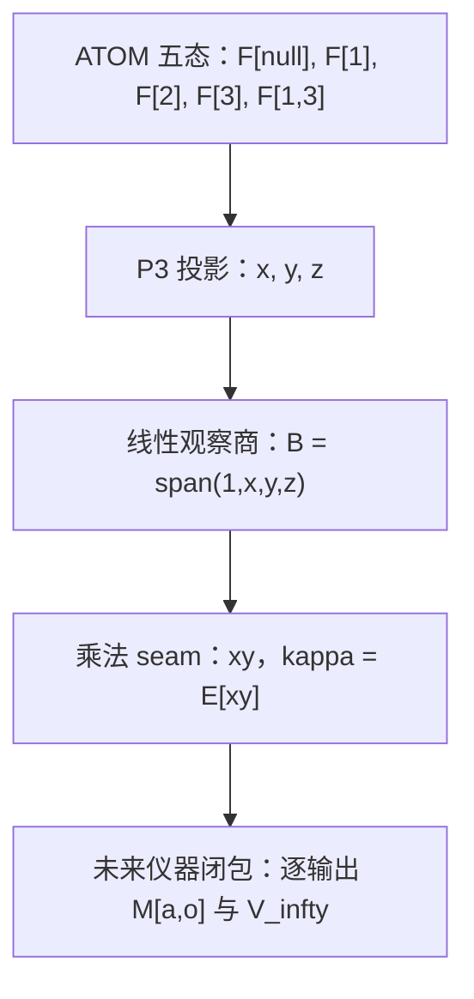

# Auric FIB ATOM：静态隐藏纤维、输出分辨未来商与可维护性

**Reference input: open.** 本卷完整保存两部分用户供文，包括所有陈述、证明、表格、例子、项目对应说明、重复总结和拟议 Lean 目标。供文中的“定理”“证明”“已证明”等语言仍属开放参考输入；本文不取得 Lean/Frozen 证明、物理认证、生物学结论或优先权。Lean 声明、证明项及其内核核验的公理闭包才承载本库形式系统内的数学真值。

**来源。** Author kind: mixed user-supplied material; original author and model unknown. Receipt date: 2026-10-10. 来源标识为本会话供文 static-fiber-and-maintainability-source 与 output-resolved-instrument-source。第二次发送中的第一部分与此前供文逐字一致，本文保留该部分一次，随后完整保留追加的第二部分。下表指纹属于接收的原始文本，正文仅作下述结构规范化。

| 来源部分 | 原始字节数 | 原始 SHA-256 |
| --- | ---: | --- |
| I static-fiber-and-maintainability-source | 24778 | 033869ff61fe472a074ace0df3a39bac9b5a889191b4f77c7b0e5641dcad7ef6 |
| II output-resolved-instrument-source | 25152 | 27b5713b7c3a8b2cc1575467b43ff26327e7ce0efdb4715a5e4688632e39b526 |

**历史读法。** 第一部分给出的 dev 状态归属历史提交 46ec5166a750ea6d0b0612d157c86f19975688ef，第二部分归属 ae4f135cebf29ea39c8253bf1c21016cf7cb7cfb；两者均在接收工作树中实际观察过。正文中的“当前”“最新”、提交数量、PR 时间和证明等级语言保持来源归属，不认证交付时移动 dev 的最新状态。“D5/InstrumentClosure.lean”是供文的拟议路径，不是本卷新增的形式化或已准入地址。

**结构规范化。** 全部原句、公式内容、证明和例子保留；只将 Markdown 数学入口改为 GitHub 的美元号形式，对全卷节号及定理局部地址作唯一化，并把证明标题降为所属声明的子标题。代码围栏原样保存，公式中的独立等号并入前一行以避免 setext 标题。原中文节名、原声明名称和编号保留在标题中。这些地址仅用于本文定位，不指定 Lean 名称、依赖或覆盖。

**固定字典与对象类型。** 本卷的 F[null]、F[1]、F[2]、F[3]、F[1,3] 分别对应 null、[2]、[3]、[5]、[2,5]；占位 x,y,z 分别表示索引 1,3,2。Legacy 25 是联合模式标签，数量和 7 才是 2+5。静态概率律、条件后验、取得记录、参数先验、instrument 子核、动态 phase、边界义务和控制 belief 不能仅凭同名变量互换。

**既有归属。** 静态纤维、四角差、联合投影和矩读数沿用 [Joint Projection, Multiwindow Order and Response Fibers](AURIC_FIB_ATOM_JOINT_PROJECTION_MULTIWINDOW_ORDER_AND_RESPONSE_FIBERS.md) 与 [Foundational Formulas and Relations](AURIC_FIB_ATOM_PYRAMID_FOUNDATIONAL_FORMULAS_AND_RELATIONS.md)。深度先验、活动历史与终端边界沿用 [Dynamic Future Quotient and Future-Closed Memory](AURIC_FIB_ATOM_DYNAMIC_FUTURE_QUOTIENT_AND_FUTURE_CLOSED_MEMORY.md) 的限定。第二部分引用 [Paired Calibration Observability](RECURSIVE_RELATIONAL_OBSERVATION_PAIRED_CALIBRATION_OBSERVABILITY.md) 与 [Acquired Return p-Emission Variation](RECURSIVE_RELATIONAL_OBSERVATION_ACQUIRED_RETURN_P_EMISSION_VARIATION.md) 只作声明范围内的参考；本卷没有证明它们到五态 instrument 的 native 实现桥。有限维可观测闭包、线性表示和安全 belief 最大不动点属于既有数学方法；本文不宣称这些方法原创。新增综合的作用是保留逐输出分支、明确平均泄漏抵消反例，并把预测与可维护性分开。

## 编者限定与开放义务

以下限定与供文分开；它们不替换原句，也不使开放命题成为形式化真值。

- **Q1（I §5、II §§1、7）：** 固定三均值纤维上的必要性要求至少两个实际可行的 kappa 值。单点纤维上的任何未来目标都恒定，即使四角差非零。对所有概率律的全域充分性与在一个固定支持面上的充分性必须分别量化。
- **Q2（II §§3、5、7）：** Instrument 子核需非负，并给出逐动作的行和规范、合法菜单与终端规则。任意实末端函数给出加权测试期望；只有事件指示函数或取值在 [0,1] 的随机测试才直接给出事件概率。开环动作词和按输出选择的策略有不同合同；推广到反馈策略须保留每条分支的动作合法性、标签和公共策略。
- **Q3（II §§3、7）：** d=p(kappa+1)-p(kappa) 是仿射族的形式带符号方向，并不要求这两个对象同时是概率律；五态可行区间一般容不下单位增量。实际分离用非零可行增量 t。p(0) 也可能只作仿射基点。定义 rho 时包含空词和末端测试，且最小值存在仅在可分离时使用。
- **Q4（I §6、II §3）：** 观测秩取实际函数空间或选定有限基的行空间。无限动作或输出族可用张成空间维数，不应冒称已经取得有限矩阵。有限 horizon 上界的关键是一次维数停滞就对全部子核稳定；record-only 取常数 1 为初始测试。若末端空间已含完整三均值，局部五态缺口至多一维。上述维数与有限状态、有限比特、统计样本量和资源成本不是同一量。
- **Q5（II §5）：** Bayes 后验与均值公式要求参数先验在可行 kappa 域上非退化、事件具有严格正的先验预测概率。零概率事件不定义通常条件后验；退化先验可在非零 c 下不变。因可行 kappa 有界，方差可积；似然必须非负。参数后验和固定参数下的状态后验不同。
- **Q6（I §8、II §§6–7）：** Fibonacci future quotient 限于一个固定的正整数深度先验、至少两个正支持点、一次抽样且所有 Reads 共用的深度，以及实际可达的第四段活动域。seed 重试可改变累计计数，但不是已经进入第四段后的任意活动循环。Reachable histories 不填满任意计数晶格；原文未重证 FR 的数论输入。
- **Q7（I §8、II §7）：** 各坐标在固定其他坐标的纤维中分别单射，不推出整个联合参数全局单射。三个可恢复的单射探针加上同一个已指定参数化响应核才给出精确商的双向结论；相同坐标到相同 law 的充分方向也需明确。来源 epoch 与隐藏样本身份仍可能在该商之外。
- **Q8（I §9）：** 连续概率纤维和离散非负整数纤维共用一维仿射核机制；这不是未经映射证明的拓扑、测度或资源成本同构。整数恢复使用完整总量及允许支持，边界约束可使纤维退化。
- **Q9（I §10）：** 存在 G 使条件期望 E[f|R]=G(R) 本身是条件期望的可测因子化，不证明 R 保留完整历史的预测能力。真正的压缩充分性须相对完整取得历史比较其未来条件律。最大不动点刻画指定总转移模型下非空 belief 的无限期稳健安全；它没有给出误差收缩、取得记忆、能源预算、终止义务或物理维护。安全策略允许的随机化、观测和死锁约定必须另定。
- **Q10（I §11）：** 严格整数标量时间与无有向环的等价结论需要有限有向图。无限无环图未必能严格嵌入整数；源与最长路径也未必存在。原图的可达性为 preorder，强连通分量商给偏序，但无限 condensation DAG 不自动具有严格整数时标。这些图论事实不认证物理时间。
- **Q11（II §§6、9）：** Paired calibration 的常数及 return-variation 不等式只引用各自原文的共同 kernel、概率界、可达条件与风险合同，不证明是本 instrument 的读数。局部 kappa 识别不重构所有历史。供文所列 Lean 文件仍为拟议工作；本卷未新增 Lean 或冻结声明。生命、逆衰变、引力和光的物理解释仍是开放候选。
- **Q12（II §§3、8）：** 对指定末端空间 G，逐输出的 B-不变性是保证 future-sufficiency 的充分条件。若要断言它也是必要条件，必须明确 G 已覆盖 B、全部初始律、动作合法菜单和完整读数的量词，并验证对应反推；任意 G 下不能把该充分判据直接说成必要。
- **Q13（II §§4、7、8）：** Pr(11)=kappa 表示概率律层面的可识别关系。单个实现记录或有限样本不等于取得该概率的精确值；统计估计、误差界和认证仍需各自的样本与精度合同。

## 部分 I：续篇：从静态隐藏纤维到动态未来商

这次最重要的推进，不是再增加一个新的数值，而是把“隐藏关系”分成四个不同层次：

$$
\boxed{
\text{局部联合关系}
\;\longrightarrow\;
\text{静态概率纤维}
\;\longrightarrow\;
\text{动态非同余}
\;\longrightarrow\;
\text{可维护性商}
}
$$

截至当前项目 `dev`：

$$
\texttt{HEAD}=46ec5166a750ea6d0b0612d157c86f19975688ef
$$

对应提交时间为 2026-10-10 07:21 UTC。相对于前面使用的 `3a56aa4`，仓库已经前进了 288 个提交。

当前最相关的新增方向有：

- [联合投影、多窗关系阶数与响应纤维](https://github.com/the-omega-institute/trureturing/blob/46ec5166a750ea6d0b0612d157c86f19975688ef/docs/develop/theory/AURIC_FIB_ATOM_JOINT_PROJECTION_MULTIWINDOW_ORDER_AND_RESPONSE_FIBERS.md)
- [动态未来商与 Future-Closed Memory](https://github.com/the-omega-institute/trureturing/blob/46ec5166a750ea6d0b0612d157c86f19975688ef/docs/develop/theory/AURIC_FIB_ATOM_DYNAMIC_FUTURE_QUOTIENT_AND_FUTURE_CLOSED_MEMORY.md)
- [配对有限读数的可观测性](https://github.com/the-omega-institute/trureturing/blob/46ec5166a750ea6d0b0612d157c86f19975688ef/docs/develop/theory/RECURSIVE_RELATIONAL_OBSERVATION_PAIRED_CALIBRATION_OBSERVABILITY.md)
- [稀疏字面历史传输](https://github.com/the-omega-institute/trureturing/blob/46ec5166a750ea6d0b0612d157c86f19975688ef/docs/develop/theory/RECURSIVE_RELATIONAL_OBSERVATION_SPARSE_LITERAL_HISTORY_TRANSPORT.md)

这些文档中，有一部分是仓库中的 open reference input，尚未进入 Lean/Frozen 真值层。因此下面把“项目已经有的结论”“在有限模型中可直接证明的新定理”“物理解释”明确分开。

---

## 1. 一、五个基础元素的真正关系：一个隐藏反应方向

固定你的记号：

$$
F[\mathrm{null}]=\mathrm{null}
$$

$$
F[1]=[2]
$$

$$
F[2]=[3]
$$

$$
F[3]=[5]
$$

$$
F[1,3]=[2,5]
$$

为简化书写，令：

$$
\nu=F[\mathrm{null}]
$$

并令五态集合为：

$$
\Sigma=\{\nu,F[1],F[2],F[3],F[1,3]\}
$$

定义三个占位变量：

$$
x=\mathbf 1_{\{1\in I\}}
$$

$$
y=\mathbf 1_{\{3\in I\}}
$$

$$
z=\mathbf 1_{\{2\in I\}}
$$

五种状态对应：

| 状态 | $(x,y,z)$ |
|---|---:|
| $F[\mathrm{null}]$ | $(0,0,0)$ |
| $F[1]$ | $(1,0,0)$ |
| $F[2]$ | $(0,0,1)$ |
| $F[3]$ | $(0,1,0)$ |
| $F[1,3]$ | $(1,1,0)$ |

合法性为：

$$
x^2=x,\qquad y^2=y,\qquad z^2=z
$$

$$
xz=0,\qquad yz=0
$$

而：

$$
xy\neq0
$$

这里最重要的不是单独的 $x,y,z$，而是概率空间中存在一个唯一的守恒交换方向：

$$
F[\mathrm{null}]+F[1,3]
\;\rightleftarrows\;
F[1]+F[3]
$$

它对应的带符号向量为：

$$
d=
e_{\nu}-e_1-e_3+e_{13}
$$

也就是：

$$
d=(1,-1,0,-1,1)
$$

沿着这个方向改变概率：

$$
p\mapsto p+\epsilon d
$$

会使：

$$
p_{\nu}\mapsto p_{\nu}+\epsilon
$$

$$
p_1\mapsto p_1-\epsilon
$$

$$
p_3\mapsto p_3-\epsilon
$$

$$
p_{13}\mapsto p_{13}+\epsilon
$$

而 $p_2$ 不变。

这个交换保持：

$$
X=\mathbb E[x]
$$

$$
Y=\mathbb E[y]
$$

$$
Z=\mathbb E[z]
$$

不变，却改变 $F[1,3]$ 的概率。

因此可以把 $d$ 称为五态系统的**隐藏反应方向**。

---

## 2. 二、边缘读数空间恰好是隐藏反应的守恒超平面

定义函数空间：

$$
\mathcal A=\mathbb R^\Sigma
$$

定义显式边缘空间：

$$
V=\operatorname{span}\{1,x,y,z\}
$$

定义四角差：

$$
J(f)=
f_{\nu}+f_{13}-f_1-f_3
$$

其中 $f_s$ 表示函数 $f$ 在状态 $s$ 上的取值。

### theorem 2.1: 定理 1：边缘空间与隐藏反应的对偶定理

有：

$$
\boxed{
V=\ker J
}
$$

也就是说，$V$ 恰好是所有在隐藏反应

$$
F[\mathrm{null}]+F[1,3]
\rightleftarrows
F[1]+F[3]
$$

下保持不变的线性读数。

#### 证明

直接计算：

$$
J(1)=1+1-1-1=0
$$

$$
J(x)=0+1-1-0=0
$$

$$
J(y)=0+1-0-1=0
$$

$$
J(z)=0+0-0-0=0
$$

因此：

$$
V\subseteq\ker J
$$

另一方面：

$$
J(xy)=0+1-0-0=1
$$

所以 $J$ 是非零线性泛函。

因为：

$$
\dim\mathcal A=5
$$

而 $J\neq0$，故：

$$
\dim\ker J=4
$$

同时：

$$
\dim V=4
$$

因此：

$$
V=\ker J
$$

证毕。

---

这个结果比“有一个隐藏参数”更精确：

$$
\boxed{
\text{隐藏关系不是任意缺失，而是边缘守恒空间的唯一对偶方向。}
}
$$

任何 $f\in\mathcal A$ 都能唯一写成：

$$
f=f_{\mathrm{edge}}+J(f)\,xy
$$

其中：

$$
f_{\mathrm{edge}}\in V
$$

所以：

- $J(f)=0$：这个读数对隐藏反应守恒；
- $J(f)\neq0$：这个读数能够检测隐藏反应；
- $J(f)$ 是该读数对隐藏关系的响应强度。

---

## 3. 三、\(\chi=z+xy\)：把金字塔的缺边补成完整四维坐标

当前项目新增的一个关键变量是：

$$
\chi=z+xy
$$

它在五个状态上的值为：

| 状态 | $\chi$ |
|---|---:|
| $F[\mathrm{null}]$ | $0$ |
| $F[1]$ | $0$ |
| $F[2]$ | $1$ |
| $F[3]$ | $0$ |
| $F[1,3]$ | $1$ |

因此 $\chi$ 把：

$$
F[2]
\quad\text{和}\quad
F[1,3]
$$

放入同一个闭合类。

令：

$$
W=\mathbb E[\chi]
$$

则：

$$
W=Z+\kappa
$$

其中：

$$
\kappa=p_{13}
$$

### theorem 3.1: 定理 2：联合投影的仿射双射定理

定义：

$$
\Phi(p)=(X,Y,Z,W)
$$

则五态概率律可以由 $(X,Y,Z,W)$ 唯一恢复：

$$
p_{13}=W-Z
$$

$$
p_2=Z
$$

$$
p_1=X-W+Z
$$

$$
p_3=Y-W+Z
$$

$$
p_{\mathrm{null}}=1-X-Y-2Z+W
$$

#### 证明

由：

$$
W=Z+p_{13}
$$

得到：

$$
p_{13}=W-Z
$$

又：

$$
Z=p_2
$$

而：

$$
X=p_1+p_{13}
$$

所以：

$$
p_1=X-p_{13}=X-W+Z
$$

同理：

$$
p_3=Y-W+Z
$$

最后由归一化：

$$
p_{\mathrm{null}}=
1-p_1-p_2-p_3-p_{13}
$$

代入前面四式得：

$$
p_{\mathrm{null}}=
1-X-Y-2Z+W
$$

因此逆映射存在且唯一。证毕。

---

这个定理有一个整数版本。

设五种模式的计数为：

$$
(n_{\mathrm{null}},n_1,n_2,n_3,n_{13})
$$

定义：

$$
X=n_1+n_{13}
$$

$$
Y=n_3+n_{13}
$$

$$
Z=n_2
$$

$$
W=n_2+n_{13}
$$

则：

$$
n_{13}=W-Z
$$

$$
n_2=Z
$$

$$
n_1=X-W+Z
$$

$$
n_3=Y-W+Z
$$

$$
n_{\mathrm{null}}=
N-X-Y-2Z+W
$$

这里没有除法。对应逆矩阵是整数矩阵，行列式为：

$$
\pm1
$$

因此这是一个 unimodular 恢复。

这说明：

$$
\boxed{
\chi
\text{ 不是第五个原子，而是补足隐藏联合关系的最小闭包坐标。}
}
$$

---

## 4. 四、为什么 \(q\) 单样本可逆，但平均值看不见 \(\kappa\)

定义数量读数：

$$
q=
2x+5y+3z
$$

五种状态的逐样本读数为：

$$
q(\nu)=0
$$

$$
q(F[1])=2
$$

$$
q(F[2])=3
$$

$$
q(F[3])=5
$$

$$
q(F[1,3])=7
$$

这五个数互不相同。

因此，如果保留完整的 $q$ 分布，或者保留足够多的矩：

$$
\mathbb E[q^0],\mathbb E[q^1],\ldots,\mathbb E[q^4]
$$

则由 Vandermonde 可逆性可以恢复五态概率。

但是：

$$
J(q)=0+7-2-5=0
$$

所以：

$$
\mathbb E[q]=
2X+5Y+3Z
$$

完全看不见 $\kappa$。

而平方读数为：

$$
q^2=4x+25y+9z+20xy
$$

因此：

$$
J(q^2)=20
$$

并且：

$$
\mathbb E[q^2]=
4X+25Y+9Z+20\kappa
$$

所以：

$$
\kappa=
\frac{
\mathbb E[q^2]-4X-25Y-9Z
}{20}
$$

这揭示了一个容易被混淆的区别：

$$
\boxed{
\text{逐样本注入}
\neq
\text{期望读数注入}
}
$$

数量 $q$ 可以区分五种单次状态，但它的一阶平均是仿射读数，满足：

$$
0+7=2+5
$$

因此对隐藏反应没有响应。

平方读数破坏了这一仿射关系：

$$
0^2+7^2-2^2-5^2=20
$$

所以 $q^2$ 才第一次穿透隐藏纤维。

更一般地，对任意多项式 $P$：

$$
J(P(q))=
P(0)+P(7)-P(2)-P(5)
$$

定义最小非线性分辨阶：

$$
m_\ast=
\min\{m\ge0:J(q^m)\neq0\}
$$

在本五态系统中：

$$
J(1)=0
$$

$$
J(q)=0
$$

$$
J(q^2)=20\neq0
$$

所以：

$$
\boxed{m_\ast=2}
$$

这可以称为该观察切面的**最小非线性分辨率**。

它不是一般系统的“记忆比特数”，而是特定读数 $q$ 穿透特定隐藏反应的最小矩阶。

---

## 5. 五、隐藏关系何时会在未来显现？

静态隐藏不等于永远隐藏。它是否会影响未来，取决于允许的动作如何作用。

设：

$$
T_a:\Sigma\to\Sigma
$$

是一个确定动作，定义函数拉回：

$$
U_af=f\circ T_a
$$

当前只观察：

$$
V=\operatorname{span}\{1,x,y,z\}
$$

对于任意 $f\in V$，有：

$$
\mathbb E_p[U_af]=
\mathbb E_p[\pi_V(U_af)]
+
J(U_af)\kappa
$$

其中：

$$
\pi_V(U_af)=U_af-J(U_af)xy
$$

### theorem 5.1: 定理 3：隐藏关系的动态显现判据

在固定 $(X,Y,Z)$ 的概率纤维上，所有一步目标 $f\in V$ 都能由当前边缘读数预测，当且仅当：

$$
J(U_af)=0
$$

对所有允许动作 $a$ 和所有 $f\in V$ 成立。

若存在某个 $a,f$ 使：

$$
J(U_af)\neq0
$$

则存在两个具有相同 $(X,Y,Z)$ 的当前分布，却具有不同的一步未来输出。

#### 证明

如果：

$$
J(U_af)=0
$$

则：

$$
U_af\in V
$$

所以：

$$
\mathbb E_p[U_af]
$$

只依赖：

$$
\mathbb E_p[1],\mathbb E_p[x],\mathbb E_p[y],\mathbb E_p[z]
$$

即只依赖 $(X,Y,Z)$。

反过来，若：

$$
J(U_af)\neq0
$$

取同一均值纤维中的两个分布：

$$
p_\kappa
\quad\text{和}\quad
p_{\kappa'}
$$

则：

$$
p_\kappa-p_{\kappa'}=
(\kappa-\kappa')d
$$

于是：

$$
\mathbb E_{p_\kappa}[U_af]
-
\mathbb E_{p_{\kappa'}}[U_af]=
(\kappa-\kappa')J(U_af)
$$

只要：

$$
\kappa\neq\kappa'
$$

这个差就非零。证毕。

---

### 一个显式动作反例

定义动作：

$$
T(\nu)=F[1]
$$

$$
T(F[1])=\nu
$$

$$
T(F[2])=F[2]
$$

$$
T(F[3])=\nu
$$

$$
T(F[1,3])=F[1,3]
$$

取 $f=x$，则：

$$
U_Tx=
(1,0,0,0,1)
$$

按照状态顺序：

$$
(\nu,F[1],F[2],F[3],F[1,3])
$$

有：

$$
J(U_Tx)=1+1-0-0=2
$$

现在取：

$$
X=0.4,\qquad Y=0.4,\qquad Z=0.1
$$

两个合法分布：

$$
p_{\kappa=0.1}=
(0.2,0.3,0.1,0.3,0.1)
$$

$$
p_{\kappa=0.3}=
(0.4,0.1,0.1,0.1,0.3)
$$

它们具有相同的：

$$
(X,Y,Z)=(0.4,0.4,0.1)
$$

但动作后：

$$
\mathbb E[x']=
p_{\nu}+p_{13}=
0.1+2\kappa
$$

所以：

$$
\mathbb E_{p_{0.1}}[x']=0.3
$$

$$
\mathbb E_{p_{0.3}}[x']=0.7
$$

当前边缘相同，未来输出不同。

这就是“隐藏关系成为时间方向上的可见差异”的最小模型。

---

## 6. 六、一步闭包不是无限未来闭包

给定动作词 $w=a_1a_2\cdots a_k$，定义：

$$
U_w=U_{a_1}\cdots U_{a_k}
$$

对于时间范围 $T$，定义未来观测空间：

$$
\mathcal O_T=
\operatorname{span}
\left\{
U_wf:
f\in V,\ |w|\le T
\right\}
$$

定义观测矩阵 $M_T$，其行由 $(w,f)$ 标记，列由五个状态标记：

$$
(M_T)_{(w,f),s}=
f(T_w(s))
$$

则：

$$
\operatorname{row}(M_T)=\mathcal O_T
$$

### theorem 6.1: 定理 4：有限时域观测秩定理

两个概率律 $p,q$ 在当前 $V$-读数以及所有长度不超过 $T$ 的目标上完全相同，当且仅当：

$$
\langle p-q,g\rangle=0
$$

对所有：

$$
g\in\mathcal O_T
$$

成立。

相对于当前读数 $V$，未来新增的线性观测维数为：

$$
d_T=
\dim\frac{\mathcal O_T+V}{V}
$$

等价地：

$$
d_T=
\operatorname{rank}(M_T)-\operatorname{rank}(M_0)
$$

#### 证明

所有当前和未来输出都是概率向量与观测函数的内积：

$$
\mathbb E_p[g]=\langle p,g\rangle
$$

因此 $p,q$ 给出相同输出，当且仅当：

$$
\langle p-q,g\rangle=0
$$

对全部 $g\in\mathcal O_T$ 成立。

观测矩阵的行空间正是这些函数的线性张成，所以新增秩就是商空间维数。证毕。

---

这给出了对过去“1、12、4 个隐藏方向”的严格修正：

- 单窗口的一维隐藏方向，是静态函数商的结论；
- 双窗口的 12 个方向，只在指定的双窗守卫、固定边缘和特定记录域中成立；
- $N=6$ 的 4 个三阶方向，只针对指定的二阶报告；
- 它们不能脱离动作、目标函数、记录域和精度，直接称为一般的“动态记忆维数”。

对于单窗口五态系统，函数代数总维数是 5，边缘空间维数是 4，因此任何未来闭包只能有：

$$
d_T\in\{0,1\}
$$

若某个动作词使：

$$
J(U_wf)\neq0
$$

则：

$$
\mathcal O_T=\mathcal A
$$

并恰好增加一个实线性观测方向。

---

## 7. 七、当前标量相同，未来可以分裂：动态同余失败

最新边界文档中还有一个非常直接的例子。

设组成向量为：

$$
c=(a,b)
$$

表示：

$$
a=\#\alpha,\qquad b=\#\beta
$$

替换更新为：

$$
M(a,b)=(b,a+b)
$$

当前标量读数为：

$$
q_0(a,b)=2a+3b
$$

两个状态：

$$
c_1=(3,0)
$$

$$
c_2=(0,2)
$$

具有相同当前读数：

$$
q_0(c_1)=6=q_0(c_2)
$$

但更新后：

$$
M(c_1)=(0,3)
$$

$$
M(c_2)=(2,2)
$$

于是：

$$
q_0(M(c_1))=9
$$

$$
q_0(M(c_2))=10
$$

所以：

$$
q_0(c_1)=q_0(c_2)
$$

并不推出：

$$
q_0(M(c_1))=q_0(M(c_2))
$$

这说明：

$$
\boxed{
\ker q_0
\text{ 不是替换动力学 }M\text{ 的前向同余}
}
$$

也就是：

$$
\text{当前读数相同}
\not\Rightarrow
\text{未来读数相同}
$$

这比“时间是一个额外坐标”更精确：

> 时间方向是当前观测等价关系在合法更新下是否保持的性质。

如果一个观测商满足：

$$
s\sim s'
\Longrightarrow
T_a(s)\sim T_a(s')
$$

对所有动作都成立，那么它是一个动态同余，可以安全地作为状态商。

如果不成立，隐藏关系会在未来被重新分离。

---

## 8. 八、静态 \(\kappa\)、动态计数与边界义务不能直接拼成一个无条件直积

当前动态未来商文档在这里作了重要限定。

在指定的非单例 Fibonacci 深度先验下，若：

$$
r_k=\frac{\operatorname{Fib}_{k+1}}{\operatorname{Fib}_{k+3}}
$$

$$
s_k=\frac{\operatorname{Fib}_{k+2}}{\operatorname{Fib}_{k+3}}
$$

则历史 $h$ 的深度后验满足：

$$
\nu_h(k)
\propto
\mu(k)\,
r_k^{A_h}\,
s_k^{B_h}
$$

其中：

- $A_h$ 是历史中 $\alpha$ 的取得次数；
- $B_h$ 是历史中 $\beta$ 的取得次数；
- $a(h)\in\{p,\beta\}$ 是当前 phase。

在该声明的活动域和非单例先验下，项目给出的未来等价关系为：

$$
h\sim_{\mathrm{Fut}}h'
\iff
\bigl(a(h),A_h,B_h\bigr)=
\bigl(a(h'),A_{h'},B_{h'}\bigr)
$$

这意味着：

$$
\sigma(h)=\bigl(a(h),A_h,B_h\bigr)
$$

是该特定完整 future law 的最小精确摘要。

但它一般不是有限状态摘要，因为：

$$
A_h,B_h\in\mathbb N
$$

是无界的。

取一族历史：

$$
h_j=(\alpha\alpha)^j h_\ast
$$

则它们可以保持相同 phase，却具有：

$$
(A_{h_j},B_{h_j})=(2j+A_\ast,B_\ast)
$$

不同 $j$ 给出不同 future law，因此未来等价类无限。

所以：

$$
\boxed{
\text{有限维坐标}
\neq
\text{有限状态}
\neq
\text{有限比特}
}
$$

现在可以定义更谨慎的分层状态：

$$
\mathcal S=
\left(
\kappa,\,
a,\,
A,\,
B,\,
\tau,\,
e
\right)
$$

其中：

- $\kappa$：静态五态联合关系；
- $a,A,B$：特定动态先验下的 future quotient；
- $\tau$：边界义务，如 active、pending、delivered；
- $e$：来源 epoch 或原始历史身份。

但是不能无条件宣称：

$$
\mathcal S=
\kappa\times(a,A,B)\times\tau\times e
$$

就是普适最小状态。因为 $\kappa$ 与深度后验是否共同出现，取决于：

- 同一来源；
- 联合概率律；
- 同一 response kernel；
- 同一取得记录；
- 同一未来操作合同。

### theorem 8.1: 定理 5：分层不可压缩定理

设目标未来律为：

$$
L(\kappa,\sigma,\tau)
$$

其中：

$$
\sigma=(a,A,B)
$$

假设：

1. 固定 $(\sigma,\tau)$ 后，$\kappa\mapsto L(\kappa,\sigma,\tau)$ 在实际可行纤维上是单射；
2. 固定静态关系和 $\tau$ 后，$\sigma\mapsto L$ 在声明的动态域上是单射；
3. 不同 $\tau$ 的边界义务产生不同合法未来；
4. 这些坐标确实由同一个联合来源和同一个响应核生成。

则任何精确预测 $L$ 的摘要，都不能在相应纤维内合并不同的 $\kappa$、$\sigma$ 或 $\tau$。

若另外存在三个独立探针：

$$
P_\kappa(L)=\phi_\kappa(\kappa)
$$

$$
P_\sigma(L)=\phi_\sigma(\sigma)
$$

$$
P_\tau(L)=\phi_\tau(\tau)
$$

且三个 $\phi$ 都是单射，则联合坐标：

$$
(\kappa,\sigma,\tau)
$$

是完整 future law 的精确商坐标。

#### 证明

在固定 $(\sigma,\tau)$ 的纤维内，条件 1 直接说明不同 $\kappa$ 不能产生同一未来律。因此任何 future-sufficient 摘要必须区分这些 $\kappa$。

同理，条件 2 和 3 分别给出 $\sigma$ 与 $\tau$ 的必要区分。

若存在三个独立探针，则：

$$
L=L'
$$

推出：

$$
\phi_\kappa(\kappa)=\phi_\kappa(\kappa')
$$

$$
\phi_\sigma(\sigma)=\phi_\sigma(\sigma')
$$

$$
\phi_\tau(\tau)=\phi_\tau(\tau')
$$

由于各 $\phi$ 单射，得到：

$$
\kappa=\kappa',\qquad
\sigma=\sigma',\qquad
\tau=\tau'
$$

因此联合坐标是精确商。证毕。

---

这个定理的关键限制是：

$$
\boxed{
\text{没有共同来源和联合响应核，不能把各层最小性自动相乘。}
}
$$

这正是当前项目对前面“$(\kappa,a,A,B,\tau)$ 普适最小记忆”说法的修正。

---

## 9. 九、同一种隐藏机制也出现在 5040 指数编码中

令素数指数向量为：

$$
\mathbf a=(a_2,a_3,a_5,a_7)
$$

定义可见编码：

$$
u=a_2+a_7
$$

$$
v=a_3
$$

$$
w=a_5+a_7
$$

即：

$$
C(\mathbf a)=(u,v,w)
$$

其核方向为：

$$
(-1,0,-1,+1)
$$

因为：

$$
(-1)+1=0
$$

$$
(-1)+1=0
$$

所以固定 $(u,v,w)$ 时，非负整数解写为：

$$
a_2=u-\kappa
$$

$$
a_3=v
$$

$$
a_5=w-\kappa
$$

$$
a_7=\kappa
$$

这里的：

$$
\kappa=a_7
$$

就是共享 $2/5$ 叶计数的隐藏交互坐标。

这与五态概率纤维完全同构：

| FIB 概率层 | 5040 指数层 |
|---|---|
| $X,Y,Z$ | $u,v,w$ |
| $p_{13}$ | $a_7$ |
| $d=(1,-1,0,-1,1)$ | $(-1,0,-1,+1)$ |
| 固定边缘、改变联合关系 | 固定叶计数、改变共享指数 |
| $\kappa$-纤维 | $a_7$-整数纤维 |

例如：

$$
7=2^0 3^0 5^0 7^1
$$

给出：

$$
(u,v,w)=(1,0,1),\qquad \kappa=1
$$

而：

$$
10=2^1 3^0 5^1 7^0
$$

给出：

$$
(u,v,w)=(1,0,1),\qquad \kappa=0
$$

所以 7 与 10 的可见叶计数相同，但隐藏共享坐标不同。

对于：

$$
5040=2^4 3^2 5^1 7^1
$$

有：

$$
(u,v,w;\kappa)=(5,2,2;1)
$$

边界上限可能使某些纤维退化为单点，但这只是约束后的唯一性，不是说明代数上原本没有隐藏方向。

---

## 10. 十、预测不等于维护：生命模型必须加入可行控制

此前“未来闭合”与“生命”之间还缺少一个逻辑层。

### 预测性

给定记录 $R_t$，若存在函数 $G_w$，使：

$$
\mathbb E[f(S_{t+w})\mid R_t]=
G_w(R_t)
$$

则称 $R_t$ 对目标 $f$ 具有预测充分性。

### 可维护性

可维护性还必须存在：

- 控制策略 $\pi$；
- 安全集合 $K$；
- 误差函数 $e$；
- 资源成本 $c$。

并满足：

$$
\mathbb E[e(S_{t+1})\mid S_t=s,\pi]
\le
\lambda e(s)+\varepsilon
$$

以及资源预算：

$$
\mathbb E[c]\le B
$$

仅有预测性，不能推出可维护性。

---

### 定义：部分观测安全算子

令：

- $\Omega$ 为有限状态；
- $\mathcal A$ 为动作集合；
- $\delta(s,a)$ 为转移；
- $o(s)$ 为观测；
- $K\subseteq\Omega$ 为安全集合。

对一个 belief：

$$
B\subseteq K
$$

定义：

$$
\delta_a(B)=\{\delta(s,a):s\in B\}
$$

以及观测到 $y$ 后的 belief：

$$
B_{a,y}=
\delta_a(B)\cap o^{-1}(y)
$$

定义算子：

$$
\mathcal F(S)=
\left\{
B\subseteq K:
\exists a,\ 
\delta_a(B)\subseteq K,\ 
B_{a,y}\in S
\text{ 对所有非空后继成立}
\right\}
$$

定义最大不动点：

$$
V^\ast=\nu S.\mathcal F(S)
$$

### theorem 10.1: 定理 6：部分观测可维护性的最大不动点定理

一个 belief $B$ 属于 $V^\ast$，当且仅当存在基于观测和当前 belief 的策略，使系统从 $B$ 出发永久保持在 $K$ 中。

#### 证明

**充分性。**

若：

$$
B\in V^\ast
$$

则根据不动点定义，存在动作 $a(B)$，使：

$$
\delta_{a(B)}(B)\subseteq K
$$

并且每一个非空观测后继 belief 都属于 $V^\ast$。

因此执行 $a(B)$ 后，无论真实状态是哪一个，也无论收到哪个合法观测，下一 belief 仍在 $V^\ast$。递归执行得到永久安全策略。

**必要性。**

若存在一个观测策略从 $B$ 永久保持 $K$，令 $S$ 为该策略所有可达的 belief 集合。

对每个：

$$
B'\in S
$$

策略给出一个共同动作 $a$，使：

$$
\delta_a(B')\subseteq K
$$

并且所有观测后继仍然属于 $S$。

因此：

$$
S\subseteq\mathcal F(S)
$$

由最大不动点性质：

$$
S\subseteq V^\ast
$$

于是：

$$
B\in V^\ast
$$

证毕。

---

### FIB 五态中的安全遗忘反例

取：

$$
A=F[1]
$$

$$
D=F[1,3]
$$

令观测只读取 $x$。那么：

$$
x(A)=1=x(D)
$$

所以两者被当前观测合并。

取两个动作 $L,R$，并定义抽象控制转移：

$$
\delta(A,L)=A
$$

$$
\delta(A,R)=F[\mathrm{null}]
$$

$$
\delta(D,R)=D
$$

$$
\delta(D,L)=F[\mathrm{null}]
$$

令安全集合：

$$
K=\{A,D\}
$$

完整状态观测时：

- 处于 $A$ 使用 $L$；
- 处于 $D$ 使用 $R$。

两个状态都可维护。

但在只知道 $x=1$ 的合并 belief：

$$
B=\{A,D\}
$$

安全动作集合分别为：

$$
\operatorname{Safe}(A)=\{L\}
$$

$$
\operatorname{Safe}(D)=\{R\}
$$

所以：

$$
\operatorname{Safe}(A)\cap\operatorname{Safe}(D)=\varnothing
$$

合并之后没有共同安全动作，维护失败。

这说明：

$$
\boxed{
\text{可以安全遗忘的条件不是“未来状态看起来相似”，而是共享动作且后继 belief 仍处于最大安全不动点。}
}
$$

这个动作系统是用于说明逻辑差异的抽象 FIB 控制模型，不是仓库已经证明的 native FIB 动力学。

---

## 11. 十一、时间形状的严格模型：循环内只能得到偏序

如果把所有合法转移组成有向图：

$$
G=(V,E)
$$

问是否存在严格标量时间：

$$
\tau:V\to\mathbb Z
$$

满足：

$$
u\to v
\Longrightarrow
\tau(v)>\tau(u)
$$

### theorem 11.1: 定理 7：严格标量时间与无环性的等价定理

有向图存在上述严格时间函数，当且仅当图无有向环。

#### 证明

若存在有向环：

$$
v_0\to v_1\to\cdots\to v_k=v_0
$$

则：

$$
\tau(v_0)<\tau(v_1)<\cdots<\tau(v_k)=\tau(v_0)
$$

矛盾。

反过来，若图无环，则取拓扑排序，或令：

$$
\tau(v)=
\text{从任意源到 }v\text{ 的最长路径长度}
$$

每条边都会使最长路径长度至少增加一，因此满足严格不等式。证毕。

若存在循环，则原图只能形成 preorder。把每个强连通分量压缩后，得到 condensation DAG，在这个商图上才能定义严格时间。

所以在模型内：

$$
\boxed{
\text{时间形状}=
\text{转移图的偏序、循环和强连通分量结构}
}
$$

这支持“没有一个全局钟直接统治所有局部过程”的模型直觉，但它还不是广义相对论或物理时间的证明。

---

## 12. 十二、当前 Auric FIB ATOM 金字塔的最小层级

现在可以把基础结构写成四层。

### 第一层：局部原子关系

$$
xz=yz=0
$$

$$
xy\neq0
$$

### 第二层：静态联合纤维

$$
d=(1,-1,0,-1,1)
$$

$$
\kappa=p_{13}
$$

$$
F[\mathrm{null}]+F[1,3]
\rightleftarrows
F[1]+F[3]
$$

### 第三层：闭包坐标

$$
\chi=z+xy
$$

$$
W=Z+\kappa
$$

$$
(X,Y,Z,W)
$$

能够完整恢复五态静态概率律。

### 第四层：动态和控制商

$$
\sigma=(\mathrm{phase},A,B)
$$

用于特定 Fibonacci 深度先验下的完整未来律；

$$
\tau\in
\{
\mathrm{active},
\mathrm{pending}_0,
\mathrm{pending}_1,
\mathrm{delivered}
\}
$$

记录边界义务；

$$
V^\ast
$$

决定一个被压缩的观测 belief 是否仍然可以被控制在安全域内。

最终得到：

$$
\boxed{
\begin{aligned}
\text{静态可见边缘}&:\quad (X,Y,Z),\\
\text{静态隐藏关系}&:\quad \kappa,\\
\text{静态闭包读数}&:\quad W=Z+\kappa,\\
\text{动态未来状态}&:\quad (\mathrm{phase},A,B),\\
\text{边界义务}&:\quad \tau,\\
\text{可维护性判据}&:\quad B\in V^\ast.
\end{aligned}
}
$$

这也给出对“生命是逆衰变”的更严格修正：

$$
\boxed{
\text{预测}=
\text{未来等价商上的函数闭合}
}
$$

$$
\boxed{
\text{维护}=
\text{在部分观测下仍存在安全共同动作的可行不动点}
}
$$

$$
\boxed{
\text{生命的候选数学定义}=
\text{选择性未来商}
+
\text{可执行记忆更新}
+
\text{安全可行控制}
}
$$

这还没有证明生命在物理上就是逆衰变，也没有证明引力就是时间引力，更没有证明光就是不可恢复信息。它完成的是更基础的一步：把这些直觉中真正可以数学化的部分，拆成了静态联合关系、动态同余、来源历史和控制可行性四个可以分别验证的对象。

## 部分 II：先校正当前项目状态

当前 `dev` 的远端 HEAD 已经推进到 [`ae4f135`](https://github.com/the-omega-institute/trureturing/commit/ae4f135cebf29ea39c8253bf1c21016cf7cb7cfb)，时间为 2026-10-10 15:37:42（SGT），对应 PR #15026。此前使用的 `912f499` 已经只是历史基线。

今天与 Auric FIB ATOM 直接相关的理论推进，主要集中在以下几组变更：

| 时间 | 项目进展 | 对本问题的作用 |
|---|---|---|
| 09:44 | PR #14965，[Relational Quotients and Physical Candidates](https://github.com/the-omega-institute/trureturing/blob/ae4f135cebf29ea39c8253bf1c21016cf7cb7cfb/docs/develop/theory/AURIC_FIB_ATOM_RELATIONAL_QUOTIENTS_AND_PHYSICAL_CANDIDATES.md) | 把三位 FIB 窗口组织成路径 $P_3$ 的独立集，并明确三均值商中遗留一个隐藏 seam |
| 13:04 | PR #14999，[Dynamic Future Quotient and Future-Closed Memory](https://github.com/the-omega-institute/trureturing/blob/ae4f135cebf29ea39c8253bf1c21016cf7cb7cfb/docs/develop/theory/AURIC_FIB_ATOM_DYNAMIC_FUTURE_QUOTIENT_AND_FUTURE_CLOSED_MEMORY.md) | 从单步可见空间推进到递归未来闭包和最小未来记忆 |
| 14:40 | PR #15014，[Paired Calibration Observability](https://github.com/the-omega-institute/trureturing/blob/ae4f135cebf29ea39c8253bf1c21016cf7cb7cfb/docs/develop/theory/RECURSIVE_RELATIONAL_OBSERVATION_PAIRED_CALIBRATION_OBSERVABILITY.md) | 证明两个各自不足的事件读口，在共同 continuation kernel 下可以联合反演完整发射律 |
| 15:01 | PR #15020，[Acquired Return $p$-Emission Variation](https://github.com/the-omega-institute/trureturing/blob/ae4f135cebf29ea39c8253bf1c21016cf7cb7cfb/docs/develop/theory/RECURSIVE_RELATIONAL_OBSERVATION_ACQUIRED_RETURN_P_EMISSION_VARIATION.md) | 把“未来记忆”进一步连接到实际 return variation，而不是静态常数发射 |
| 15:37 | 当前 `dev` HEAD | 最新提交本身属于其他理论线，Auric 相关理论仍以上述文档为主 |

仓库首页明确区分了 Lean 形式化源、理论 prose、实验观察和开放研究输入；理论文档中的数学命题不能自动视为 Lean 已验证结果。[GitHub](https://github.com/the-omega-institute/trureturing?utm_source=chatgpt.com) 当前项目仍在高频合并新的研究分支。[GitHub](https://github.com/the-omega-institute/trureturing/pulls?utm_source=chatgpt.com)

下面给出本轮真正需要推进的核心结论：

> **静态 FIB 五态中的隐藏量 $\kappa$ 是一维的；但动态未来是否能看见 $\kappa$，不能由平均转移核 $K=\sum_oM_o$ 判断，必须检查每个输出标签对应的子仪器 $M_{a,o}$。**

这会把 Auric FIB ATOM 金字塔从“静态三均值商”推进到“输出分辨的未来观察商”。

---

## 13. 一、五态 ATOM 的严格代数模型

按照你指定的表示法，五个基本状态写成

$$
F[\mathrm{null}]=\mathrm{null},
\qquad
F[1]=[2],
\qquad
F[2]=[3],
\qquad
F[3]=[5],
\qquad
F[1,3]=[2,5].
$$

把状态简写成

$$
S=
\left\{
F[\mathrm{null}],
F[1],
F[2],
F[3],
F[1,3]
\right\}.
$$

将它看成路径 $P_3$ 的独立集：

- $F[\mathrm{null}]$ 对应空集；
- $F[1]$ 对应左端点；
- $F[2]$ 对应中间点；
- $F[3]$ 对应右端点；
- $F[1,3]$ 对应两个端点同时出现。

定义三个基本指示函数 $x,y,z:S\to\{0,1\}$：

- $x$：是否含有端点 $1$；
- $y$：是否含有端点 $3$；
- $z$：是否含有中间点 $2$。

因此：

| 状态 | $x$ | $y$ | $z$ |
|---|---:|---:|---:|
| $F[\mathrm{null}]$ | 0 | 0 | 0 |
| $F[1]$ | 1 | 0 | 0 |
| $F[2]$ | 0 | 0 | 1 |
| $F[3]$ | 0 | 1 | 0 |
| $F[1,3]$ | 1 | 1 | 0 |

这五态函数空间为 $\mathbb R^S$，维数是 5。

令状态分布为

$$
p=
(p_{\mathrm{null}},p_1,p_2,p_3,p_{13}).
$$

定义三个可见均值

$$
X=\mathbb E_p[x]=p_1+p_{13},
$$

$$
Y=\mathbb E_p[y]=p_3+p_{13},
$$

$$
Z=\mathbb E_p[z]=p_2.
$$

隐藏关系为

$$
\kappa=p_{13}=
\mathbb E_p[xy].
$$

于是完整分布可以写成

$$
\boxed{
p_\kappa=
\left(
1-X-Y-Z+\kappa,\,
X-\kappa,\,
Z,\,
Y-\kappa,\,
\kappa
\right).
}
$$

正性条件为

$$
0\le \kappa\le \min(X,Y),
$$

以及

$$
1-X-Y-Z+\kappa\ge 0.
$$

固定 $(X,Y,Z)$ 改变 $\kappa$ 时，分布沿方向

$$
d=
(1,-1,0,-1,1)
$$

移动：

$$
p_{\kappa+t}=p_\kappa+t\,d.
$$

这个方向满足

$$
d\cdot 1=0,
\qquad
d\cdot x=0,
\qquad
d\cdot y=0,
\qquad
d\cdot z=0,
$$

但

$$
d\cdot(xy)=1.
$$

因此三均值 $(X,Y,Z)$ 恰好忘掉一维信息 $\kappa$。

---

### theorem 13.1: 定理 1：三均值商的唯一隐藏方向

令

$$
\mathcal B=\operatorname{span}\{1,x,y,z\}.
$$

则：

1. $\dim\mathcal B=4$；
2. $\mathcal B^\perp=\operatorname{span}\{d\}$；
3. 对任意 $f:S\to\mathbb R$，定义

   $$
   J_f=
   f(F[1,3])
   -
   f(F[1])
   -
   f(F[3])
   +
   f(F[\mathrm{null}]).
   $$

   则

   $$
   \mathbb E_{p_{\kappa+t}}[f]=
   \mathbb E_{p_\kappa}[f]
   +
   tJ_f.
   $$

4. 因而

   $$
   f\in\mathcal B
   \quad\Longleftrightarrow\quad
   J_f=0.
   $$

#### 证明

任意 $f\in\mathbb R^S$ 的期望在沿 $d$ 移动时满足

$$
\mathbb E_{p_{\kappa+t}}[f]=
(p_\kappa+t d)\cdot f=
p_\kappa\cdot f+t(d\cdot f).
$$

而

$$
d\cdot f=
f(F[\mathrm{null}])
-f(F[1])
-f(F[3])
+f(F[1,3])=
J_f.
$$

所以 $J_f=0$ 当且仅当 $f$ 对隐藏方向 $d$ 不敏感。由于 $\mathcal B$ 是四维，而 $d$ 给出唯一一维正交方向，因此

$$
\ker J=\mathcal B.
$$

证毕。

---

## 14. 二、基础元素之间最重要的隐藏关系：\(\mathcal B\) 不是代数

五态模型的乘法关系为

$$
x^2=x,\qquad y^2=y,\qquad z^2=z,
$$

并且因为 $F[1,2]$ 和 $F[2,3]$ 不属于独立集，

$$
xz=0,\qquad yz=0.
$$

但是 $x$ 与 $y$ 可以同时出现于 $F[1,3]$，所以

$$
xy\neq 0.
$$

事实上，$xy$ 正是状态 $F[1,3]$ 的指示函数：

$$
xy(F[1,3])=1,
$$

而在其他四个状态上为 0。

因此

$$
\{1,x,y,z,xy\}
$$

构成整个 $\mathbb R^S$ 的一组基。

这说明：

$$
\mathcal B=\operatorname{span}\{1,x,y,z\}
$$

只是一个四维线性空间，并不是一个乘法代数。

---

### theorem 14.1: 定理 2：可见函数的乘法会重新生成 $\kappa$

令

$$
f=a_0+a_1x+a_2y+a_3z,
$$

$$
g=b_0+b_1x+b_2y+b_3z.
$$

则存在 $h\in\mathcal B$，使得

$$
fg=
h+
(a_1b_2+a_2b_1)xy.
$$

因此

$$
\boxed{
J_{fg}=a_1b_2+a_2b_1.
}
$$

#### 证明

将 $fg$ 展开。所有含 $z$ 的交叉项 $xz,yz$ 均为零，$x^2,y^2,z^2$ 分别化为 $x,y,z$。唯一产生新基向量 $xy$ 的项是

$$
a_1x\cdot b_2y
+
a_2y\cdot b_1x=
(a_1b_2+a_2b_1)xy.
$$

其余项都属于 $\mathcal B$。又因为 $J_{xy}=1$，所以

$$
J_{fg}=a_1b_2+a_2b_1.
$$

证毕。

---

### corollary 14.1: 推论 2.1：最小的联合隐藏关系

取

$$
U=x+z,\qquad V=y+z.
$$

两者各自都属于 $\mathcal B$，所以单独的均值只依赖 $(X,Y,Z)$：

$$
\mathbb E[U]=X+Z,
\qquad
\mathbb E[V]=Y+Z.
$$

但是

$$
UV=(x+z)(y+z)
=xy+xz+yz+z^2
=xy+z.
$$

因此

$$
\boxed{
UV=z+xy.
}
$$

于是

$$
\boxed{
\mathbb E[UV]=Z+\kappa.
}
$$

这给出了一个非常具体的隐藏关系：

> 两个单独看起来都属于三均值可见层的二值事件，在保留联合发生记录后，会重新产生 $\kappa$。

这不是抽象的“可能存在高阶相关”，而是五态 FIB ATOM 中唯一隐藏方向的最简乘法实现。

从代数角度看，

$$
xy=(x+z)(y+z)-z,
$$

因此

$$
\langle\mathcal B\rangle_{\mathrm{alg}}=
\mathbb R^S.
$$

也就是说：

> 线性观察只得到四维商；允许联合乘法后，五态完整结构立即恢复。

---

### corollary 14.2: 推论 2.2：二阶矩恢复隐藏 seam

取

$$
q=2x+5y+3z.
$$

它在五个状态上的值为

$$
q(F[\mathrm{null}])=0,
$$

$$
q(F[1])=2,
$$

$$
q(F[2])=3,
$$

$$
q(F[3])=5,
$$

$$
q(F[1,3])=7,
$$

其中 $7=2+5$，与用户指定的

$$
F[1,3]=[2,5]
$$

一致。

一次均值为

$$
\mathbb E[q]=2X+5Y+3Z,
$$

它完全看不见 $\kappa$。

但是

$$
q^2=
4x+25y+9z+20xy,
$$

所以

$$
\boxed{
\mathbb E[q^2]=
4X+25Y+9Z+20\kappa.
}
$$

因此

$$
\boxed{
\kappa=
\frac{\mathbb E[q^2]-4X-25Y-9Z}{20}.
}
$$

更一般地，若

$$
q=ax+by+cz,
$$

则

$$
q^2=a^2x+b^2y+c^2z+2ab\,xy,
$$

从而当 $ab\neq0$ 时，

$$
\boxed{
\kappa=
\frac{\mathbb E[q^2]-a^2X-b^2Y-c^2Z}{2ab}.
}
$$

这说明：

> “精确值 $q$ 能区分五个状态”与“$\mathbb E[q]$ 能否恢复 $\kappa$”是两个不同问题。一次均值可以丢失 seam，二阶矩又能把 seam 拉回来。

---

## 15. 三、动态未来闭包必须使用输出分辨的 instrument

当前动态理论中最需要修正的一点是：

$$
K_a=\sum_o M_{a,o}
$$

的平均转移核，不足以描述完整未来记录。

原因是：观察者在真实过程中会看到具体输出 $o$，然后按照这个输出条件化未来。条件化使用的是每个子核 $M_{a,o}$，而不是它们的总和。

---

### 定义 3.1：输出分辨 instrument

设有限状态集为 $S$，动作集为 $A$，输出字母表为 $O$。

对每个动作 $a$ 和输出 $o$，定义矩阵

$$
M_{a,o}(s,t)=
\Pr(o,\text{下一状态}=t\mid \text{当前状态}=s,\text{动作}=a).
$$

它作用在列函数 $f:S\to\mathbb R$ 上：

$$
(M_{a,o}f)(s)=
\sum_{t\in S}M_{a,o}(s,t)f(t).
$$

对一条带动作和输出的记录词

$$
\omega=((a_1,o_1),\ldots,(a_m,o_m)),
$$

定义

$$
M_\omega=
M_{a_1,o_1}\cdots M_{a_m,o_m}.
$$

如果初始分布是行向量 $p$，末端测试函数为 $g$，则该记录事件的概率为

$$
\Pr_p(\omega,g)=
pM_\omega g.
$$

---

### 定义 3.2：未来观察闭包

给定末端测试函数空间 $G$，定义

$$
V_0=\operatorname{span}(G),
$$

$$
V_{m+1}=
V_m+
\operatorname{span}
\left\{
M_{a,o}f:
a\in A,\ o\in O,\ f\in V_m
\right\}.
$$

定义

$$
V_\infty=\bigcup_{m\ge0}V_m.
$$

当只记录输出词而没有额外末端测试时，取

$$
G=\{1\},
\qquad
V_0=\operatorname{span}\{1\}.
$$

---

### theorem 15.1: 定理 3：输出分辨未来闭包定理

对有限状态 instrument，有：

#### 结论一：$V_m$ 精确描述长度不超过 $m$ 的全部记录

$V_m$ 正好由所有长度不超过 $m$ 的记录词拉回函数张成：

$$
V_m=
\operatorname{span}
\left\{
M_\omega g:
|\omega|\le m,\ g\in G
\right\}.
$$

因此，对两个初始分布 $p,q$，有

$$
pM_\omega g=qM_\omega g
$$

对所有 $|\omega|\le m$ 成立，当且仅当

$$
(p-q)f=0
\qquad
\forall f\in V_m.
$$

#### 结论二：若 $\mathcal B$ 对每个 $M_{a,o}$ 都不变，则 $\mathcal B$ 是未来充分的

如果

$$
G\subseteq\mathcal B
$$

且

$$
M_{a,o}\mathcal B\subseteq\mathcal B
\qquad
\forall(a,o),
$$

则

$$
V_\infty\subseteq\mathcal B.
$$

因此任意满足

$$
p-q\in\mathcal B^\perp
$$

的两个分布，所有未来记录概率都相同。

#### 结论三：隐藏 seam 的最早暴露深度

令

$$
d=p_{\kappa+1}-p_\kappa.
$$

定义

$$
\rho_{\mathcal M}(d)=
\min
\left\{
m:
\exists\omega,g,\ |\omega|=m,\ 
dM_\omega g\neq0
\right\}.
$$

如果不存在这样的词，则令

$$
\rho_{\mathcal M}(d)=\infty.
$$

那么：

- 所有长度小于 $\rho_{\mathcal M}(d)$ 的记录都看不见 $\kappa$；
- 长度等于 $\rho_{\mathcal M}(d)$ 时，至少有一个记录事件对 $\kappa$ 敏感；
- 对任意记录事件 $E=(\omega,g)$，其概率为

  $$
  \Pr_{p_\kappa}(E)=
  A_E+\kappa B_E,
  $$

  其中

  $$
  B_E=dM_\omega g.
  $$

#### 证明

对 $V_m$ 的表达式用 $m$ 归纳。

当 $m=0$ 时，$V_0=\operatorname{span}(G)$。

若 $V_m$ 已由长度不超过 $m$ 的词张成，则对每个 $f=M_\omega g\in V_m$，

$$
M_{a,o}f=
M_{a,o}M_\omega g
$$

对应长度增加一的记录。因此 $V_{m+1}$ 正好由长度不超过 $m+1$ 的词张成。

若 $\mathcal B$ 包含 $G$，且每个 $M_{a,o}$ 保持 $\mathcal B$，归纳可得

$$
V_m\subseteq \mathcal B
$$

对所有 $m$ 成立，因而

$$
V_\infty\subseteq\mathcal B.
$$

最后，由

$$
p_\kappa=p_0+\kappa d
$$

直接得到

$$
p_\kappa M_\omega g=
p_0M_\omega g+\kappa(dM_\omega g).
$$

证毕。

---

### 有限状态 horizon 上界

若 $|S|=N$，则

$$
\dim V_m\le N.
$$

从 $V_0$ 开始，维数至多严格增加 $N-\dim V_0$ 次。因此：

- record-only 情形 $V_0=\operatorname{span}\{1\}$ 时，最多 $N-1$ 次严格增长；
- 五态局部模型中，任何可暴露的隐藏方向，必在长度不超过 4 的某个输出记录中暴露；
- 如果已经允许末端测试空间 $\mathcal B$，而 $\dim\mathcal B=4$，则五态空间只有一维缺口。只要有一个 $M_{a,o}$ 把 $\mathcal B$ 中某个函数送出 $\mathcal B$，一步就会补足整个 $\mathbb R^5$。

这里的“五态上界”只适用于有限的局部 ATOM 层。包含 Fibonacci 深度、计数 $(A,B)$、阶段和边界标签的完整动态空间仍然是无限状态空间，不能把五态 horizon 上界直接推广到整个 FIB 计数模型。

---

## 16. 四、平均转移核闭合的严格反例

下面给出一个最小的五态 instrument。它是一个数学构造，用来证明“平均核闭合”不足以保证完整未来闭合；它暂时不等同于仓库中的 native continuation 规则。

定义第一步输出为

$$
o_1=x(s).
$$

定义下一状态：

$$
T(s)=
\begin{cases}
F[1], & y(s)=1,\\
F[\mathrm{null}], & y(s)=0.
\end{cases}
$$

第二步再次输出下一状态的 $x$ 值：

$$
o_2=x(T(s)).
$$

由于 $T(s)=F[1]$ 当且仅当 $y(s)=1$，所以

$$
o_2=y(s).
$$

真值表为：

| 初始状态 | $o_1=x$ | 下一状态 | $o_2$ | 记录 |
|---|---:|---|---:|---|
| $F[\mathrm{null}]$ | 0 | $F[\mathrm{null}]$ | 0 | 00 |
| $F[1]$ | 1 | $F[\mathrm{null}]$ | 0 | 10 |
| $F[2]$ | 0 | $F[\mathrm{null}]$ | 0 | 00 |
| $F[3]$ | 0 | $F[1]$ | 1 | 01 |
| $F[1,3]$ | 1 | $F[1]$ | 1 | 11 |

因此两步记录分布为

$$
\Pr(00)=p_{\mathrm{null}}+p_2
=1-X-Y+\kappa,
$$

$$
\Pr(10)=p_1=X-\kappa,
$$

$$
\Pr(01)=p_3=Y-\kappa,
$$

$$
\Pr(11)=p_{13}=\kappa.
$$

于是：

$$
\Pr(o_1=1)=X,
$$

$$
\Pr(o_2=1)=Y,
$$

但

$$
\boxed{
\Pr(o_1=1,o_2=1)=\kappa.
}
$$

这正是一个严格的“两次边际各自可见、联合记录恢复隐藏 seam”的例子。

---

### 矩阵形式

令 $M_1$ 是输出 $1$ 的子核，$M_0$ 是输出 $0$ 的子核。对常数函数 $1$ 和 $x$，有

$$
M_1 1=x,
$$

$$
M_1x=xy,
$$

$$
M_0x=y-xy.
$$

因此

$$
M_1M_1 1=xy.
$$

所以记录 $11$ 的概率为

$$
pM_1M_1 1=
p(xy)=
\kappa.
$$

但是平均核

$$
K=M_0+M_1
$$

满足

$$
K1=1,
$$

$$
Kx=y,
$$

$$
Ky=0,
$$

$$
Kz=0.
$$

所以

$$
K\mathcal B\subseteq\mathcal B.
$$

平均核完全没有产生 $xy$，而输出分辨的子核分别产生了

$$
M_1x=xy,
$$

$$
M_0x=y-xy.
$$

两个分支中的隐藏项在求和时抵消：

$$
M_0x+M_1x=y.
$$

这可以用商空间表示。令

$$
Q=\mathbb R^S/\mathcal B.
$$

由于 $Q$ 一维，记 $[xy]$ 为其基向量，则

$$
[M_1x]=[xy],
$$

$$
[M_0x]=-[xy],
$$

但

$$
[(M_0+M_1)x]=0.
$$

所以：

$$
\boxed{
K\mathcal B\subseteq\mathcal B
\quad\not\Rightarrow\quad
M_o\mathcal B\subseteq\mathcal B\ \text{对每个 }o.
}
$$

动态预测必须保留输出标签，不能把所有输出支路先求和。

---

## 17. 五、FIB 隐藏关系的 Bayes 形式

把 $\kappa$ 看作一个待推断参数，并令其先验为非退化分布 $\Pi$。

对任意记录事件 $E=(\omega,g)$，定义

$$
\ell_E=M_\omega g.
$$

其似然为

$$
Q_E(\kappa)=
p_\kappa\ell_E=
Q_0+\kappa c_E,
$$

其中

$$
c_E=d\ell_E.
$$

因此后验为

$$
\Pi(d\kappa\mid E)
\propto
(Q_0+\kappa c_E)\Pi(d\kappa).
$$

于是得到：

$$
\boxed{
\Pi(\cdot\mid E)=\Pi
\quad\Longleftrightarrow\quad
c_E=0.
}
$$

也就是：

$$
\boxed{
\text{记录事件能够更新 }\kappa
\quad\Longleftrightarrow\quad
dM_\omega g\neq0.
}
$$

若先验方差为 $\operatorname{Var}_\Pi(\kappa)>0$，则后验均值变化为

$$
\mathbb E[\kappa\mid E]-\mathbb E[\kappa]=
\frac{
c_E\operatorname{Var}_\Pi(\kappa)
}{
\mathbb E_\Pi[Q_E(\kappa)]
}.
$$

这给出了“隐藏关系何时进入未来预测”的严格判据。

需要区分两种后验：

1. $\Pi(\kappa\mid E)$：参数 $\kappa$ 的后验；
2. $p_\kappa(s\mid E)$：固定 $\kappa$ 下状态 $s$ 的条件后验。

上面的 $dM_\omega g\neq0$ 精确刻画的是第一种，即未来事件对隐藏参数的可辨识性。

---

## 18. 六、把静态金字塔与最新动态文档接起来

现在可以把 Auric FIB ATOM 金字塔写成五层：



### 第一层：P3 独立集结构

PR #14965 将三位窗口明确组织成 $P_3$ 的独立集。五个状态不是任意五点，而是由局部相容关系筛选出来的：

$$
xz=0,\qquad yz=0,\qquad xy\neq0.
$$

这已经把“隐藏关系”变成了一个图组合结构：两个端点可以共存，中间点不能与任一端点共存。

### 第二层：三均值观察商

$$
\mathcal B=\operatorname{span}\{1,x,y,z\}
$$

只保留线性边际。它遗漏的唯一方向为

$$
xy,
$$

对应概率坐标 $\kappa$。

### 第三层：乘法和二阶矩

PR #14919 的 moment triangle / inverse precision 方向，与上面的

$$
q^2=
4x+25y+9z+20xy
$$

属于同一种机制：一阶响应落在 $\mathcal B$，二阶响应越过 $\mathcal B$ 并触及 seam。

### 第四层：动态 future quotient

PR #14999 引入了递归未来闭包。其核心思想可以写为

$$
V^{(0)}=\mathcal B,
$$

$$
V^{(r+1)}=
\operatorname{span}
\left(
V^{(r)}
\cup
\bigcup_a U_aV^{(r)}
\right).
$$

这里的关键修正是：

> 对完整输出记录，$U_a$ 还必须细分为每个输出标签对应的 $M_{a,o}$。

因此严格的动态闭包应当是

$$
\boxed{
V^{(r+1)}=
\operatorname{span}
\left(
V^{(r)}
\cup
\bigcup_{a,o}M_{a,o}V^{(r)}
\right).
}
$$

只检查

$$
\sum_o M_{a,o}
$$

的闭合，会把不同输出支路中符号相反的隐藏泄漏抵消掉。

### 第五层：paired calibration observability

PR #15014 给出了一个与 FIB seam 高度相似的递归观测结构。

其固定 kernel 为 $B:X\to Y$ 和 $A:Y\to X$，发射概率为 $u_x,v_y$，完整递归律为

$$
Q_x=
u_x\delta_\alpha
+
(1-u_x)\beta\sum_yB_{xy}W_y,
$$

$$
W_y=
(1-v_y)\delta_\beta
+
v_y\alpha\sum_xA_{yx}Q_x.
$$

定义

$$
L=\operatorname{diag}(1-u)B\operatorname{diag}(v)A,
$$

$$
g=\operatorname{diag}(1-u)B(1-v).
$$

两个事件读口为

$$
f=g+Lg+L^2g,
$$

$$
h=1-v+\operatorname{diag}(v)Ag.
$$

单独的 $f$ 或 $h$ 都可能留下纤维，但联合 $(f,h)$ 在共同 continuation kernel 下形成闭合反演。文档中的稳定性估计为

$$
\|u-u'\|_\pi
+
\frac43\|v-v'\|_\tau
\le
14\delta_f+38\delta_h,
$$

并进一步给出完整递归律的总变差控制

$$
\pi\operatorname{TV}(Q,Q')
\le
20\delta_f+52\delta_h,
$$

$$
\tau\operatorname{TV}(W,W')
\le
20\delta_f+52\delta_h.
$$

这与 FIB 的结构对应关系是：

- 单个三均值读口对应一个投影；
- $\kappa$ 是投影纤维中的隐藏坐标；
- paired readout 对应两个输出分支的联合约束；
- 共同 continuation kernel 把隐藏坐标重新传入未来。

这里是结构类比和可迁移的方法，不应直接把 $f,h$ 认定为 FIB 的线性 $\kappa$-读数。两者之间还需要定义一个正式模式映射。

### 第六层：actual return variation

PR #15020 定义了实际 return variation：

$$
\mathcal V_h(M)=
\sum_{x,y,x'}
\rho_h(x)B_{xy}A_{yx'}
|u_x-u_{x'}|,
$$

$$
\mathcal V(M)=\sup_h\mathcal V_h(M).
$$

并证明风险和 return variation 满足

$$
\frac{61}{11}e(M)
+
\frac{19}{11}\sqrt{\mathcal V(M)}
>
\frac{\eta}{400000}.
$$

如果

$$
e(M)\to0,
$$

则必有

$$
\liminf\mathcal V(M)
\ge
\left(
\frac{11\eta}{7600000}
\right)^2.
$$

其对 FIB 动力学的启发是：

> 当未来预测精度不断提高时，系统不能简单地把所有发射律压成一个静态常数；实际 return 上仍然必须保留某种状态变化。

因此，$\kappa$ 的未来意义不能只理解为“静态遗漏的一个数字”。在动态模型里，它可能表现为：

- 不同输出支路的条件化差异；
- continuation kernel 下的回流差异；
- return 过程中的发射变化；
- 需要额外记忆才能保持精确预测的隐藏坐标。

---

## 19. 七、统一定理：FIB-ATOM 的未来充分性判据

### theorem 19.1: 定理 4：FIB 输出仪器的隐藏 seam 判据

设五态初始分布属于固定三均值纤维

$$
p_\kappa=p_*+\kappa d.
$$

设 $\mathcal M=\{M_{a,o}\}$ 是一个有限输出 instrument，末端测试空间为 $G$。

定义

$$
V_\infty=
\operatorname{span}
\{M_\omega g:\omega\text{ 为任意有限输出词},\ g\in G\}.
$$

则：

#### 情形 A：永久隐藏

如果

$$
d f=0
\qquad
\forall f\in V_\infty,
$$

则所有未来输出记录都与 $\kappa$ 无关。

特别地，如果

$$
\mathcal B\supseteq G,
$$

并且

$$
M_{a,o}\mathcal B\subseteq\mathcal B
\qquad
\forall(a,o),
$$

则

$$
V_\infty\subseteq\mathcal B,
$$

因此 $\kappa$ 永久不可见。

#### 情形 B：有限深度暴露

如果存在某个有限输出词 $\omega$ 和末端 probe $g$，使得

$$
dM_\omega g\neq0,
$$

那么记录事件 $(\omega,g)$ 的概率对 $\kappa$ 非恒定，因而 $\kappa$ 可被未来数据识别。

最小记录长度为

$$
\rho_{\mathcal M}(d).
$$

#### 情形 C：五态局部的最小记忆

由于

$$
\mathbb R^S/\mathcal B
$$

是一维，五态局部模型只需要一个额外标量记忆：

$$
H(\mathcal B)=
\mathbb R^S/\mathcal B
\cong
\mathbb R\,[xy].
$$

因此在局部五态层：

$$
\boxed{
\text{最小额外未来记忆}=1\text{ 个标量 }\kappa.
}
$$

但是否需要这个标量，取决于输出 instrument 是否把 $xy$ 拉回到可观测闭包。

---

## 20. 八、对当前理论的精确修正

当前理论可以用下面三条规则稳定下来。

### 规则一：单步 $J_f=0$ 只说明当前读口看不见 $\kappa$

如果

$$
J_f=0,
$$

只能得到

$$
\mathbb E[f]
$$

在当前静态层面对 $\kappa$ 不敏感。

它不能推出所有未来记录都不敏感。

### 规则二：平均更新闭合不等于输出闭合

条件

$$
K_a\mathcal B\subseteq\mathcal B,
\qquad
K_a=\sum_oM_{a,o},
$$

只能说明所有输出分支的隐藏泄漏在求和后抵消。

完整未来记录需要更强的条件：

$$
\boxed{
M_{a,o}\mathcal B\subseteq\mathcal B
\quad
\text{对每一个合法 }(a,o).
}
$$

### 规则三：未来可见性由词级 pullback 决定

真正的判据是

$$
dM_\omega g\neq0,
$$

而不是某个平均矩阵的单步作用。

在两步反例中：

$$
dM_1 1=0,
$$

所以第一步单独输出不能更新 $\kappa$；

但是

$$
dM_1M_1 1=
d(xy)=
1,
$$

所以第二步的记录 $11$ 可以精确读出

$$
\kappa=p_{13}.
$$

这就是“隐藏关系在未来中被激活”的最小严格模型。

---

## 21. 九、证明等级与下一步 Lean 目标

当前应当把结果分成三类。

### 已由本轮数学推导得到的结果

以下都是有限五态线性代数和有限 instrument 理论的直接证明：

1. $p_\kappa$ 的完整参数化；
2. 三均值商的隐藏方向 $d$；
3. $J_f$ 判据；
4. $\mathcal B$ 非代数；
5. $J_{fg}=a_1b_2+a_2b_1$；
6. $(x+z)(y+z)=z+xy$；
7. 二阶矩恢复 $\kappa$；
8. 输出分辨未来闭包定理；
9. 平均核闭合不足的两步反例；
10. 记录事件的 Bayes 更新判据。

### 仓库当前理论文档的状态

PR #14965、#14999、#15014、#15020 中的相关内容，当前应标记为：

- open reference；
- ordinary mathematics；
- theory input；
- 尚未自动转化为 Lean theorem；
- 不构成物理定律、生物学定理或实验事实。

这与仓库首页对形式证明、理论文本和实验观察的区分一致。[GitHub](https://github.com/the-omega-institute/trureturing?utm_source=chatgpt.com)

### 最值得新增的 Lean 文件

下一步可以新增一个局部、清晰、可机械验证的文件：

```text
D5/
  InstrumentClosure.lean
```

建议依次形式化：

1. 五态类型

   ```lean
   inductive FIBState
   | null
   | one
   | two
   | three
   | oneThree
   ```

2. 函数 $x,y,z,xy$；
3. 分布参数化 $p_\kappa$；
4. 定理

   $$
   d\cdot1=d\cdot x=d\cdot y=d\cdot z=0,
   \qquad
   d\cdot xy=1;
   $$

5. instrument 子核 $M_0,M_1$；
6. 证明

   $$
   M_1 1=x,
   \qquad
   M_1x=xy,
   \qquad
   M_0x=y-xy;
   $$

7. 证明

   $$
   pM_1M_1 1=\kappa;
   $$

8. 证明平均核满足

   $$
   K\mathcal B\subseteq\mathcal B;
   $$

9. 证明逐输出闭合和平均闭合之间的严格差异。

这样可以把“隐藏 seam 在未来记录中何时出现”变成一个真正可复用的形式化组件。接下来再定义 native FIB continuation 是否能实现这个 instrument，才可以把这个抽象定理接回仓库的原生规则。

## 追加锚（本行以下为增补区）
