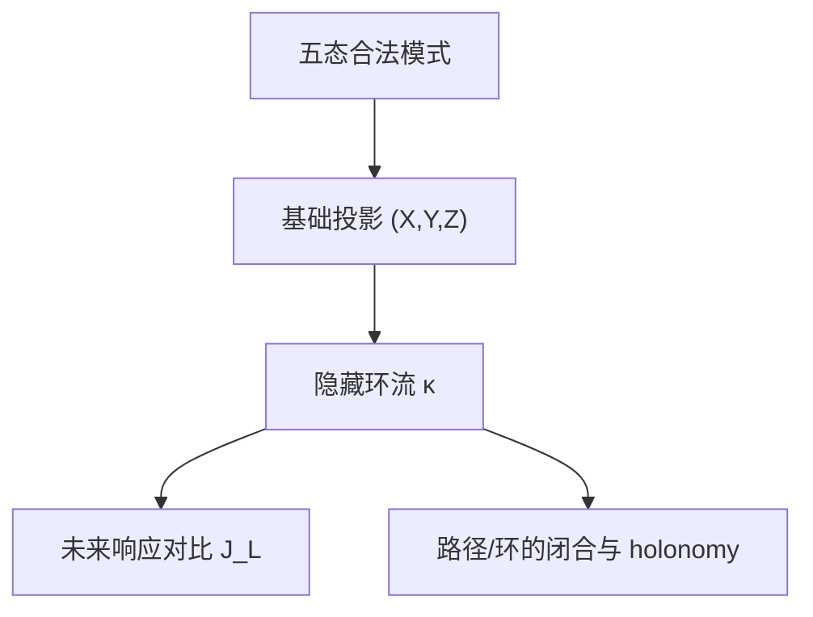

# 续篇：从五态金字塔到响应曲率、长窗口环流与未来闭包

**Reference input: open.** 本卷保存完整用户供文，包含全部声明、证明、例子、表格、项目对应和拟议接口。原文的定理及证明语言归属开放参考输入；本卷没有新增 Lean、Blueprint、Reg 或 Frozen 声明。Lean 声明、证明项及其经内核核验的公理闭包承载本库形式系统内的数学真值。

**来源。** Author kind: mixed user-supplied material; original author and model unknown. Receipt date: 2026-10-10. 来源标识为本会话供文 auric-fib-atom-response-contrast-higher-block-cycles-and-future-visibility。接收原文 SHA-256 为 `c66b3f60d9b16a01bc936fd7689a648a9b35a86263fc22cdc26351363493750c`，字节数为 27689。全部原句与公式内容保留，只规范 Markdown 数学入口、标题层级和结构空行。声明地址用于本文定位。按用户指定，本卷是纯理论添加，不运行消化，不新增 atom 或覆盖主张。

**既有结果与归属。** 供文关于 dev、PR 和公开研究列表的当前性归属其引用的历史快照，不认证移动分支的交付状态。线性核、运输环空间、Zeckendorf 唯一性、Caratheodory 表示和 finite-instrument 观测方法属于既有数学；此处保留其在指定 AURIC 合同中的综合推导，不将重述计作原创。参见 [Output-Resolved Instrument Closure](AURIC_FIB_ATOM_OUTPUT_RESOLVED_INSTRUMENT_CLOSURE.md)、[Boundary, Transport Fibers and Loop Closure](AURIC_FIB_ATOM_BOUNDARY_TRANSPORT_FIBERS_AND_LOOP_CLOSURE.md) 及 [Joint Projection, Multiwindow Order and Response Fibers](AURIC_FIB_ATOM_JOINT_PROJECTION_MULTIWINDOW_ORDER_AND_RESPONSE_FIBERS.md)。本文未认证抽象模型的 native 实现、资源等价或物理解释。

## 编者限定与开放义务

以下限定同完整供文分开；它们不替代原句，也不认证原文定理。

- **Q1** （§2、拟议 Markov square move）原文把 delta_s 定义为单位质量时，delta_000+delta_101=delta_100+delta_001 在完整 signed-measure 空间中不成立。正确式是它们的一阶投影相等，或 A(delta_000-delta_100-delta_001+delta_101)=0。保留的原等式只能在该投影商内读作相等，不能作为完整分布相等的前提。
- **Q2** （§§2、6–7）E-V+c 是固定有限支持图的边缘映射核维数。实际非负纤维可为空或退化；在全部允许边上存在严格正的可行流时才取得通用维数。这里的环流是有正负系数的零边界方向，不是支持图中的正向周期轨迹。三态一词应区分三个位置、三个 pair-state 与五个局部 ATOM。
- **Q3** （§§3、9）Q 是未归一化质量表，条件律为 Q/(1-Z)，要求 Z<1。最大熵截面固定合法边缘；退化边缘可使纤维单点。det T=-Z Delta 的可逆性等价还要求 Z>0。T 是联合质量矩阵，其行归一化后才在正行上成为转移核；秩层标签不恢复 kappa 数值，也不认证输出记录的未来可辨识性。
- **Q4** （§4）五个响应律须在同一事件空间、同一来源和固定响应核下定义。J 非零识别一个有至少两个可行点的固定边界纤维；单点纤维已经由边界确定。律级可识别性不等于有限样本精确恢复，也不等于有限资源下可取得。
- **Q5** （§§5–8）只固定单点均值的隐藏方向 h_S 与固定完整 prefix/suffix 的 square flows h_q 属于不同观察合同。一个加权二阶矩给出 pair moments 的一个线性组合，不逐个恢复全部 pair moments；完整独立集矩才恢复完整律。样本值、完整分布、有限样本估计和期望矩须分别量化。
- **Q6** （§7）separator 公式取整数 n>=3；g_n=N_(n-4) 的简化限于 n>=4。自由分量计数与实际纤维维数须按有效支持区分；内部词条件独立的概率解释要求 s_q>0，零质量分量没有已定义的条件律。
- **Q7** （§10）矩阵幂导数是固定可行点、固定方向 H、固定 lambda/O 的一阶灵敏度。所有长度的一阶导数为零不推出不同参数的精确未来律相等。至多 2d 的块矩阵截断只适用于这个固定矩阵与探针产生的递推序列，不是任意输出分辨 instrument 的全局参数辨识上界。
- **Q8** （§§10、13–14）完整未来记录应逐一使用带标签的 M_(a,o)，并纳入合法动作、guard、Stop 与边界菜单；平均 transfer powers 不替代输出词闭包。分层记忆是待证共同实现，不能把 separator、环流和历史摘要的最小性无条件相乘。
- **Q9** （§11）开放路径乘积区间描述固定边界下的局部律集合，全局联合律还可有高阶自由度。Markov gluing 要求窗口系统满足 running intersection。按行向量时间约定应按时间顺序乘 T_1...T_L；C5 的矩阵相同，反序不影响该例，但一般不可交换。零迹排除支持闭环，正迹只证明某个支持轨迹，不证明指定全部边缘质量可实现。
- **Q10** （§12）几何冲突图与左右 separator 运输图是不同对象。刚化通常增加冲突边，本文没有证明把该操作转成某个运输边的删除。删环边或桥的 cycle-rank 计算是抽象图事实，不是 native 几何记忆定理。
- **Q11** （§14）摘要可辨识性须在共同先验混合后的实际可达历史上成立，不能仅由不同 conditional-kernel 名称推出。计数无界不单独证明无限个互异 future laws；需要实际无限可达并可区分的历史族。
- **Q12** （§§15–16）全局实现与观测恢复是不同问题，响应不可见不排除合法系统存在。loop-coupling 非空才是指定全局边缘的精确可行性条件；holonomy 在此需要明确实现定义。拟议 Lean 接口与 typed native bridge 均未由本卷形式化。

## 完整供文

## 续篇：从五态金字塔到响应曲率、长窗口环流与未来闭包

下面沿用固定约定，并严格区分**索引**与**取值**：

$$
F[\mathrm{null}]=\mathrm{null},\qquad
F[1]=[2],\qquad
F[2]=[3],\qquad
F[3]=[5],\qquad
F[1,3]=[2,5].
$$

这里的索引是 $1,2,3$，对应的 Fibonacci 取值是 $2,3,5$。

令

- $x=1$：位置 $1$ 被占用，对应取值 $2$；
- $z=1$：位置 $2$ 被占用，对应取值 $3$；
- $y=1$：位置 $3$ 被占用，对应取值 $5$。

合法模式禁止相邻占用，因此

$$
xz=0,\qquad zy=0.
$$

五个合法状态是

$$
000,\quad 100,\quad 010,\quad 001,\quad 101.
$$

对应概率写成

$$
p_0,\quad p_1,\quad p_2,\quad p_3,\quad p_{13},
$$

其中

$$
p_0=\Pr(000),\quad
p_1=\Pr(100),\quad
p_2=\Pr(010),\quad
p_3=\Pr(001),\quad
p_{13}=\Pr(101).
$$

基础金字塔坐标为

$$
X=p_1+p_{13},\qquad
Y=p_3+p_{13},\qquad
Z=p_2.
$$

因此

$$
P=\left\{(X,Y,Z)\in\mathbb R_{\ge 0}^3:
X+Z\le 1,\quad Y+Z\le 1\right\}.
$$

用户所说的“填充关系”，真正的核心是：$(X,Y,Z)$ 只给出投影，而没有给出 $p_{13}$。所有更深层的结构都围绕这个缺失坐标展开。

---

## 1. 一、最新项目进展与 AURIC 的对应关系

trureturing 当前的研究方法仍然强调：理论文档、实验结果和 Lean 内核检查必须区分；最终可信的形式真值来自可检查的形式化证明，而不是单独的理论叙述。[GitHub](https://github.com/the-omega-institute/trureturing?utm_source=chatgpt.com)

当前开放工作线中已经出现了与 AURIC FIB 金字塔直接相关的几个方向。项目的开放 PR 列表还把“AURIC FIB 金字塔到 escape dynamics 的 typed bridge”列为独立任务，说明静态 FIB 结构与动态逃逸、返回和热力学量之间的桥接仍处在研究阶段。[GitHub](https://github.com/the-omega-institute/trureturing/pulls?utm_source=chatgpt.com)

| 项目进展 | 对 AURIC 的数学含义 | 当前状态 |
|---|---|---|
| [PR #14965：joint FIB projection and response fibers](https://github.com/the-omega-institute/trureturing/pull/14965) | 明确把基础投影 $(X,Y,Z)$、隐藏纤维 $\kappa$ 与未来响应律放到同一个公式中 | 开放理论参考；桥接到统一实际未来事件空间仍需证明 |
| [PR #14999：dynamic future quotient](https://github.com/the-omega-institute/trureturing/pull/14999) | 将静态隐藏变量与 activity-scoped future law quotient、future-closed memory 联系起来 | 条件性理论；有限记忆是否存在取决于可辨识性与计数是否有界 |
| [PR #15014：paired readout inversion](https://github.com/the-omega-institute/trureturing/pull/15014) | 研究两个读出是否足以反演隐藏参数 | 已有固定核下的反演公式；资源与无约束 attainability 仍未完全解决 |
| [PR #15020：complete-tail calibration](https://github.com/the-omega-institute/trureturing/pull/15020) | 给出实际返回变化的 source-specific variation floor | 是下界，不等于通用最优值或有限实现定理 |
| [PR #15044：finite common generators](https://github.com/the-omega-institute/trureturing/pull/15044) | 将兼容的 complete-law flows 通过有限划分、重心与收缩构造成有限共同生成器 | 需要额外假设；没有自动给出固定资源预算或 Lean 证明 |

这些进展可以被统一成一条结构链：



关键变化是：$\kappa$ 不再只是一个“没有被观测到的概率”，而被解释为同时具有三种身份：

1. 固定边缘下的运输环流；
2. 局部 $2\times 2$ contingency table 的 Markov move；
3. 未来响应律中的一个可见或不可见方向。

---

## 2. 二、定理一：五态金字塔是一个一维运输纤维

### 定义 1：基础投影与隐藏坐标

在概率单纯形

$$
\Delta_5=
\left\{
(p_0,p_1,p_2,p_3,p_{13})\ge 0:
p_0+p_1+p_2+p_3+p_{13}=1
\right\}
$$

上定义投影

$$
\pi(p)=(X,Y,Z)
$$

其中

$$
X=p_1+p_{13},\qquad
Y=p_3+p_{13},\qquad
Z=p_2.
$$

令

$$
\kappa:=p_{13}.
$$

则逆变换为

$$
p_0=1-X-Y-Z+\kappa,
$$

$$
p_1=X-\kappa,
$$

$$
p_2=Z,
$$

$$
p_3=Y-\kappa,
$$

$$
p_{13}=\kappa.
$$

非负性给出

$$
\kappa\ge 0,
$$

$$
\kappa\le X,
$$

$$
\kappa\le Y,
$$

$$
\kappa\ge X+Y+Z-1.
$$

因此隐藏纤维是区间

$$
\boxed{
\kappa\in[\kappa_-,\kappa_+]
}
$$

其中

$$
\kappa_-=\max(0,X+Y+Z-1),
$$

$$
\kappa_+=\min(X,Y).
$$

---

### theorem 2.1: 定理 1：运输环流维数定理

把三元状态 $(x,z,y)$ 看成从左窗口 $(x,z)$ 到右窗口 $(z,y)$ 的一条边。合法 pair-state 为

$$
00,\qquad 10,\qquad 01.
$$

五条边分别为

$$
000:00\to00,
$$

$$
100:10\to00,
$$

$$
010:01\to10,
$$

$$
001:00\to01,
$$

$$
101:10\to01.
$$

所得二部支持图有 $E=5$ 条边、$V=6$ 个顶点、$c=2$ 个连通分量。因此固定左、右边缘后，通用运输纤维的仿射维数为

$$
E-V+c=5-6+2=1.
$$

这个唯一自由方向就是

$$
d=(1,-1,0,-1,1)
$$

也就是

$$
p\longmapsto p+t(1,-1,0,-1,1).
$$

#### 证明

固定左、右边缘等价于固定二部图每个顶点的流入或流出量。令 $A$ 为二部图的边—顶点关联矩阵。对一个连通二部图，左侧顶点行和右侧顶点行之间有一个线性依赖，因此

$$
\operatorname{rank}(A)=|V|-1.
$$

对 $c$ 个连通分量，

$$
\operatorname{rank}(A)=|V|-c.
$$

所以

$$
\dim\ker A=
|E|-(|V|-c)=
|E|-|V|+c.
$$

在 AURIC 图中，这个维数为 $1$。验证 $d$ 的四个边缘和为零即可：

$$
1-1=0,\qquad
-1+1=0.
$$

因此 $d$ 保持所有基础坐标 $(X,Y,Z)$ 不变。由于概率非负性把这条仿射直线截成一个闭区间，得到上面的 $\kappa$-纤维。证毕。

---

### 隐藏方向的 $2\times2$ 结构

在 $z=0$ 的条件层上，四个格子可写成

$$
Q=
\begin{pmatrix}
p_0 & p_3\\
p_1 & p_{13}
\end{pmatrix},
$$

其中行对应 $x=0,1$，列对应 $y=0,1$。

固定行和、列和时，唯一的内部变换是

$$
Q\longmapsto
Q+t
\begin{pmatrix}
1&-1\\
-1&1
\end{pmatrix}.
$$

这正是标准的 $2\times2$ Markov square move。

因此有一个基本仿射恒等式：

$$
\boxed{
\delta_{000}+\delta_{101}=
\delta_{100}+\delta_{001}
}
$$

这里 $\delta_s$ 表示状态 $s$ 的单位质量。这个恒等式解释了为什么

$$
F[\mathrm{null}]+F[1,3]
$$

与

$$
F[1]+F[3]
$$

在一阶投影上完全无法区分。

---

## 3. 三、定理二：$\Delta$ 是源分布的相关曲率

定义

$$
\Delta
:=
p_0p_{13}-p_1p_3.
$$

代入 $\kappa$ 参数化：

$$
\Delta=
(1-X-Y-Z+\kappa)\kappa
-
(X-\kappa)(Y-\kappa).
$$

展开后得到

$$
\boxed{
\Delta=(1-Z)\kappa-XY
}
$$

这是一条非常重要的隐藏关系。

当 $Z<1$ 时，给定 $(X,Y,Z)$，条件 $z=0$ 下的边缘概率为

$$
\Pr(x=1\mid z=0)=\frac{X}{1-Z},
$$

$$
\Pr(y=1\mid z=0)=\frac{Y}{1-Z},
$$

而联合概率为

$$
\Pr(x=1,y=1\mid z=0)=
\frac{\kappa}{1-Z}.
$$

因此：

### theorem 3.1: 定理 2：条件独立性判据

在 $Z<1$ 时，

$$
\boxed{
\Delta=0
}
$$

当且仅当

$$
x\perp y\mid z=0.
$$

#### 证明

条件独立要求

$$
\frac{\kappa}{1-Z}=
\frac{X}{1-Z}\cdot\frac{Y}{1-Z}.
$$

两边乘以 $(1-Z)^2$，得到

$$
(1-Z)\kappa=XY,
$$

这正是 $\Delta=0$。证毕。

---

### 最大熵规范截面

固定 $(X,Y,Z)$ 后，只有 $z=0$ 条件层中的 $2\times2$ 表仍然变化。条件熵关于 $\kappa$ 严格凹，因此最大熵点唯一。

定义

$$
\kappa_0=\frac{XY}{1-Z},
\qquad Z<1.
$$

则

$$
\Delta(\kappa_0)=0.
$$

所以 $\kappa_0$ 是最大熵截面，也是条件独立截面。

这给出一个自然的规范选择：

$$
\boxed{
\text{最大熵规范}
\quad\Longleftrightarrow\quad
\text{条件独立规范}
\quad\Longleftrightarrow\quad
\Delta=0
}
$$

但必须区分两种性质：

- $\Delta=0$ 表示源分布在局部条件层上没有额外相关；
- $\kappa$ 是否能被未来响应看见，取决于响应对比 $J_{\mathscr L}$，不是只取决于 $\Delta$。

换句话说，$\Delta=0$ 并不自动意味着“所有未来实验都看不见 $\kappa$”。

---

## 4. 四、定理三：未来响应的隐藏方向由 $J_{\mathscr L}$ 决定

设五个模式对应的未来概率律为

$$
\mathscr L_0,\quad
\mathscr L_1,\quad
\mathscr L_2,\quad
\mathscr L_3,\quad
\mathscr L_{13}.
$$

这里要求五个 $\mathscr L_I$ 定义在同一个未来事件空间中，例如同一个返回事件、同一个停止事件或同一个完整响应轨迹空间。

混合未来律为

$$
\overline{\mathscr L}(p)=
p_0\mathscr L_0
+p_1\mathscr L_1
+p_2\mathscr L_2
+p_3\mathscr L_3
+p_{13}\mathscr L_{13}.
$$

代入 $\kappa$ 参数化，得到

$$
\boxed{
\begin{aligned}
\overline{\mathscr L}(p)
={}&
\mathscr L_0
+(\mathscr L_1-\mathscr L_0)X\\
&+(\mathscr L_3-\mathscr L_0)Y\\
&+(\mathscr L_2-\mathscr L_0)Z\\
&+J_{\mathscr L}\kappa,
\end{aligned}
}
$$

其中

$$
\boxed{
J_{\mathscr L}=
\mathscr L_{13}
-\mathscr L_1
-\mathscr L_3
+\mathscr L_0.
}
$$

这个 $J_{\mathscr L}$ 是未来响应的二阶差分，也可以称为响应曲率或响应对比。

---

### theorem 4.1: 定理 3：响应可见性定理

固定 $(X,Y,Z)$ 后，未来响应能够识别隐藏坐标 $\kappa$，当且仅当

$$
\boxed{
J_{\mathscr L}\neq 0.
}
$$

如果

$$
J_{\mathscr L}=0,
$$

则整个 $\kappa$-纤维在该响应仪器下坍缩为同一个未来律。

#### 证明

在固定 $(X,Y,Z)$ 的纤维上，只有 $\kappa$ 变化，因此

$$
\overline{\mathscr L}(\kappa)=
C(X,Y,Z)+J_{\mathscr L}\kappa.
$$

若 $J_{\mathscr L}=0$，则响应与 $\kappa$ 无关。

若 $J_{\mathscr L}\neq0$，取一个线性泛函 $\varphi$，使得

$$
\varphi(J_{\mathscr L})\neq0.
$$

则

$$
\varphi(\overline{\mathscr L})=
\varphi(C)+\varphi(J_{\mathscr L})\kappa,
$$

从而

$$
\kappa=
\frac{
\varphi(\overline{\mathscr L})-\varphi(C)
}{
\varphi(J_{\mathscr L})
}.
$$

因此 $\kappa$ 可被唯一恢复。证毕。

---

### 两个重要读出

### 1. Fibonacci 加法权重看不见 $\kappa$

模式权重为

$$
q=(0,2,3,5,7).
$$

这里 $7$ 对应状态 $F[1,3]=[2,5]$。

响应对比为

$$
J_q=7-2-5+0=0.
$$

因此加法读出

$$
S=2x+3z+5y
$$

的均值满足

$$
\boxed{
\mathbb E[S]=2X+3Z+5Y
}
$$

与 $\kappa$ 无关。

这说明一个重要事实：

> Fibonacci 加法本身只看到一阶占用投影，不看到端点的联合填充。

### 2. 二阶矩看见 $\kappa$

因为

$$
xz=0,\qquad zy=0,
$$

有

$$
S^2=4x+9z+25y+20xy.
$$

于是

$$
\boxed{
\mathbb E[S^2]=
4X+9Z+25Y+20\kappa.
}
$$

所以二阶矩直接恢复

$$
\boxed{
\kappa=
\frac{\mathbb E[S^2]-4X-9Z-25Y}{20}.
}
$$

这也说明 $\Delta$ 与 $J_{\mathscr L}$ 的角色不同：

- $\Delta$ 是源分布自身的条件相关；
- $J_{\mathscr L}$ 是观测器对隐藏相关的灵敏度。

源可以满足 $\Delta=0$，而某个非加法型未来读出仍然有 $J_{\mathscr L}\neq0$。

---

## 5. 五、独立集矩坐标：金字塔其实是低分辨率投影

对于任意合法独立集 $T\subseteq\{1,2,3\}$，定义交互矩

$$
M_T=
\mathbb E\left[\prod_{i\in T}x_i\right],
\qquad
M_\varnothing=1.
$$

在三位置 AURIC 中，合法独立集只有

$$
\varnothing,\quad
\{1\},\quad
\{2\},\quad
\{3\},\quad
\{1,3\}.
$$

对应矩为

$$
M_{\{1\}}=X,
\qquad
M_{\{2\}}=Z,
\qquad
M_{\{3\}}=Y,
\qquad
M_{\{1,3\}}=\kappa.
$$

因此完整五态分布等价于

$$
(1,X,Z,Y,\kappa).
$$

金字塔坐标 $(X,Y,Z)$ 只保留了阶数不超过一的矩，丢弃了唯一的二阶合法独立集矩 $M_{\{1,3\}}$。

这给出严格的分辨率层级：

| 观测层级 | 可恢复量 |
|---|---|
| 归一化 | $M_\varnothing=1$ |
| 一阶占用 | $X,Y,Z$ |
| 二阶联合 | $\kappa=M_{\{1,3\}}$ |
| 全部独立集矩 | 完整五态律 |

在三位置问题中，二阶读出已经足够恢复完整分布；在更长窗口中，这种层级会继续增长。

---

## 6. 六、长窗口定理：隐藏维数按 Fibonacci 递推增长

定义

$$
W_n=
\left\{
w\in\{0,1\}^n:
w_iw_{i+1}=0
\right\}.
$$

也就是长度为 $n$ 且不含相邻 $1$ 的所有词。

令

$$
N_n:=|W_n|.
$$

则

$$
N_0=1,\qquad
N_1=2,\qquad
N_n=N_{n-1}+N_{n-2}.
$$

因此

$$
N_1=2,\quad
N_2=3,\quad
N_3=5,\quad
N_4=8,\quad
N_5=13.
$$

在用户的 Fibonacci 约定中，这正是

$$
F[1]=[2],\quad
F[2]=[3],\quad
F[3]=[5]
$$

所描述的计数序列。

---

### theorem 6.1: 定理 4：只固定单点占用时的隐藏维数

若只固定

$$
m_i=\mathbb E[x_i],
\qquad i=1,\dots,n,
$$

则通用隐藏纤维的仿射维数为

$$
\boxed{
d_n=N_n-1-n.
}
$$

#### 证明

概率分布有 $N_n$ 个坐标，归一化去掉一个维度，单点均值再给出 $n$ 个独立线性约束。支持中包含空词与所有单点词，因此这些约束在一般点处秩为 $n+1$。所以

$$
d_n=N_n-(n+1).
$$

当 $n=3$ 时，

$$
d_3=5-1-3=1,
$$

恰好就是 $\kappa$。证毕。

---

### 显式高阶隐藏方向

对每个合法独立集 $S\subseteq\{1,\dots,n\}$，且 $|S|\ge2$，定义

$$
h_S=
\delta_S
-
\sum_{i\in S}\delta_{\{i\}}
+
(|S|-1)\delta_\varnothing.
$$

它保持总质量与每个单点均值：

$$
\sum_T h_S(T)=0,
$$

并且对每个位置 $j$，

$$
\sum_T h_S(T)\mathbf 1_{\{j\in T\}}=0.
$$

不同 $S$ 的最高阶坐标 $\delta_S$ 不同，因此这些 $h_S$ 线性独立。

在 $n=3$ 时，唯一的 $S$ 是

$$
S=\{1,3\},
$$

于是

$$
h_{\{1,3\}}=
\delta_{13}-\delta_1-\delta_3+\delta_\varnothing,
$$

这正是 AURIC 的 $\kappa$ 环流方向。

---

## 7. 七、完整 separator 读出后的隐藏维数

只固定单点均值，隐藏方向很多；如果固定完整的 $(n-1)$-窗口边缘，隐藏量会大幅减少。

构造二部图：

- 左侧节点是 $W_{n-1}$ 的 prefix；
- 右侧节点是 $W_{n-1}$ 的 suffix；
- 每个 $w\in W_n$ 是一条从 prefix 到 suffix 的边。

这个图按中间词

$$
q\in W_{n-2}
$$

分解成连通分量。于是

$$
E=N_n,
\qquad
V=2N_{n-1},
\qquad
c=N_{n-2}.
$$

根据运输纤维维数定理：

### theorem 7.1: 定理 5：完整 separator 的隐藏维数

固定所有 prefix 和 suffix 边缘后，隐藏纤维的通用维数为

$$
\boxed{
g_n=
N_n-2N_{n-1}+N_{n-2}.
}
$$

利用递推关系，对于 $n\ge4$，

$$
g_n=N_{n-4}.
$$

因此

$$
g_3=1,\qquad
g_4=1,\qquad
g_5=2,\qquad
g_6=3,\qquad
g_7=5.
$$

长窗口的隐藏维数再次呈 Fibonacci 增长。

---

### 每个自由分量都是一个局部 square cycle

只有当内部词 $q$ 的首尾都是 $0$ 时，外部位 $a,b\in\{0,1\}$ 都能自由取值。此时四个合法边为

$$
0q0,\qquad
0q1,\qquad
1q0,\qquad
1q1.
$$

对应一个 $2\times2$ 方格环流：

$$
h_q=
\delta_{0q0}
-\delta_{0q1}
-\delta_{1q0}
+\delta_{1q1}.
$$

若定义

- $s_q$：该分量总质量；
- $R_q$：左外端为 $1$ 的质量；
- $C_q$：右外端为 $1$ 的质量；
- $\kappa_q=p_{1q1}$；

则四个格子是

$$
p_{0q0}=s_q-R_q-C_q+\kappa_q,
$$

$$
p_{1q0}=R_q-\kappa_q,
$$

$$
p_{0q1}=C_q-\kappa_q,
$$

$$
p_{1q1}=\kappa_q.
$$

因此

$$
\boxed{
\max(0,R_q+C_q-s_q)
\le
\kappa_q
\le
\min(R_q,C_q).
}
$$

局部相关行列式为

$$
\boxed{
\Delta_q=s_q\kappa_q-R_qC_q.
}
$$

并且

$$
\Delta_q=0
$$

当且仅当两个外端在固定内部词 $q$ 后条件独立。

因此，三态 AURIC 的 $\kappa$ 只是长窗口中所有 $\kappa_q$ 的最小实例。

---

## 8. 八、定理六：加法读出只能看到一阶，二阶读出按层级恢复环流

设长窗口的加法读出为

$$
S=\sum_{i=1}^n a_i x_i.
$$

则

$$
\mathbb E[S]=
\sum_{i=1}^n a_i M_{\{i\}}.
$$

任何保持所有单点均值的环流 $h_q$ 都不会改变 $\mathbb E[S]$。

而

$$
\mathbb E[S^2]=
\sum_i a_i^2M_{\{i\}}
+
2\sum_{i<j}a_ia_jM_{\{i,j\}}.
$$

因此二阶矩可以看到二阶独立集联合，但不能自动看到三阶及以上交互。

对于三位置 AURIC，只有一个合法二阶集合 $\{1,3\}$，所以二阶矩已经恢复完整状态。

对于 $n\ge5$，还会出现例如

$$
\{1,3,5\}
$$

这样的三阶独立集。此时即使所有二阶矩都已知，三阶隐藏关系仍可能存在。

所以长窗口存在严格的观测层级：

$$
\text{单点均值}
\;\subset\;
\text{二阶联合}
\;\subset\;
\text{高阶独立集矩}
\;\subset\;
\text{完整状态律}.
$$

---

## 9. 九、传递矩阵与隐藏相关的关系

三态 pair-state 传递矩阵为

$$
T=
\begin{pmatrix}
p_0&0&p_3\\
p_1&0&p_{13}\\
0&p_2&0
\end{pmatrix}.
$$

它的行列式为

$$
\det T=
p_2(p_1p_3-p_0p_{13}).
$$

因此

$$
\boxed{
\det T=-Z\Delta.
}
$$

于是，当 $Z>0$ 时：

$$
\det T=0
\quad\Longleftrightarrow\quad
\Delta=0.
$$

这说明条件独立截面不仅是最大熵截面，而且是传递矩阵发生秩坍缩的截面。

这里有一个值得强调的结构：

- $\kappa$ 是纤维坐标；
- $\Delta$ 是纤维坐标经过非线性变换后的相关量；
- $\det T$ 是相关量再经过 $Z$ 缩放后的传播可逆性量。

因此

$$
\kappa
\longrightarrow
\Delta
\longrightarrow
\det T
$$

是一条从“填充关系”到“相关结构”再到“传播结构”的映射链。

---

## 10. 十、未来仪器的可见性判据

设隐藏参数化为

$$
T(\theta)=T_0+\sum_j\theta_jH_j.
$$

给定初始行向量 $\lambda$ 和输出列向量 $O$，长度为 $\ell$ 的未来读出为

$$
f_\ell(\theta)=\lambda T(\theta)^\ell O.
$$

精确未来等价定义为

$$
\theta\sim_{\mathrm{future}}\theta'
\quad\Longleftrightarrow\quad
\lambda T(\theta)^\ell O=
\lambda T(\theta')^\ell O
\quad
\forall \ell\ge0.
$$

沿着隐藏方向 $H$ 的一阶变化为

$$
D_Hf_\ell=
\lambda
\left(
\sum_{r=0}^{\ell-1}
T^rHT^{\ell-1-r}
\right)O.
$$

### theorem 10.1: 定理 7：传递可见性判据

若存在某个 $\ell$ 使

$$
\boxed{
\lambda
\left(
\sum_{r=0}^{\ell-1}
T^rHT^{\ell-1-r}
\right)O
\neq0,
}
$$

则隐藏方向 $H$ 对该未来仪器是一阶可见的。

若对所有 $\ell\ge0$ 都为零，则该方向对该仪器是一阶不可见。

#### 证明

由矩阵幂的导数公式，

$$
\frac{d}{d\varepsilon}
(T+\varepsilon H)^\ell
\Big|_{\varepsilon=0}=
\sum_{r=0}^{\ell-1}
T^rHT^{\ell-1-r}.
$$

左右乘以 $\lambda$ 和 $O$ 即得。证毕。

需要注意：

- 这个判据是**一阶可见性**；
- 精确的全局未来等价要求比较所有 $\theta,\theta'$ 的全部幂；
- 对固定 $T,H$，上述导数序列可由维数至多 $2d$ 的块矩阵
  $$
  \begin{pmatrix}
  T&H\\
  0&T
  \end{pmatrix}
  $$
  生成，因此可以用有限阶线性递推截断检查；
- 经过可达—可观测最小化后，这个上界还可能下降。

这正是“静态 $\kappa$”如何进入动态 future quotient 的精确接口。

---

## 11. 十一、开放路径、闭环与奇环障碍

### 路径

在开放路径上，只要相邻窗口的 separator 边缘相容，就可以按 Markov gluing 逐段拼接。

因此，对于局部窗口 $i$，若

$$
Z_i=X_{i+1},
\qquad
Y_i=Z_{i+1},
$$

则基础边缘相容；每个局部 $\kappa_i$ 只需落在自己的区间内。

开放路径的隐藏纤维通常形如

$$
\prod_i[\kappa_{i,-},\kappa_{i,+}].
$$

### 环

在闭环上，局部边缘相容只是必要条件，不是充分条件。还必须满足整个 transfer product 存在闭合轨道。

若局部 transfer 矩阵为 $T_1,\dots,T_L$，则

$$
\operatorname{tr}(T_LT_{L-1}\cdots T_1)>0
$$

只能说明支持层面存在某个闭合路径；若指定了完整边缘质量，还需要进一步满足质量守恒与边缘约束。

若

$$
\boxed{
\operatorname{tr}(T_LT_{L-1}\cdots T_1)=0,
}
$$

则不存在正权闭合轨道。

---

### C5 奇环反例

令每个局部窗口都取

$$
q_i=
\frac12\delta_{101}
+
\frac12\delta_{010}.
$$

每个窗口的左、右 pair-state 边缘都是

$$
\frac12\delta_{10}
+
\frac12\delta_{01},
$$

所以所有相邻 overlap 都一致。

但是每个位置的占用均值都是 $1/2$，于是五个位置的总期望占用为

$$
\sum_{i=1}^5\mathbb E[x_i]=
\frac52.
$$

C5 上独立集的最大大小为 $2$，任何合法全局配置最多占用两个位置，因此全局合法分布必须满足

$$
\sum_{i=1}^5\mathbb E[x_i]\le2.
$$

这里

$$
\frac52>2,
$$

所以不存在全局 C5 分布。

传递矩阵的支持部分在 $\{10,01\}$ 上执行交换。五次交换仍然是交换，没有固定点，因此

$$
\operatorname{tr}(T_5T_4T_3T_2T_1)=0.
$$

这说明：

> 局部填充关系可以全部一致，但全局环路仍然无法闭合。

这也是“基础投影障碍”与“隐藏纤维障碍”必须分开处理的原因。

---

## 12. 十二、软到刚：$\tau$ 改变的是支持图，$\kappa$ 改变的是纤维内部

soft-to-rigid 项目中的几何过程可以抽象为一个参数化支撑族，例如

$$
S_{\gamma,\tau}=
\gamma\big((1-\tau)P\oplus\tau\rho D\big),
$$

其中 $\tau$ 调整形状从柔性到刚性之间的几何关系。

把它与 AURIC 结合时，最稳妥的数学解释是：

- $\tau$ 是外层几何参数；
- $\tau$ 改变冲突图或可行支持；
- $\kappa$ 是在某一个固定支持图上的运输环流坐标。

因此不能直接把 $\tau$ 认作 $\kappa$。真正的关系是：

$$
\tau
\longmapsto
D_\tau
\longmapsto
\bigl(E_\tau,V_\tau,c_\tau\bigr)
\longmapsto
g_\tau=E_\tau-V_\tau+c_\tau.
$$

如果刚化过程删除的是一个环上的边，则 cycle rank 下降一个，隐藏自由度减少一个。

如果删除的是桥，边数减少一个，同时连通分量数增加一个，通常有

$$
\Delta g=(-1)+(+1)=0.
$$

因此：

> 几何刚化只有在改变支持图的环结构时，才会真正减少 AURIC 隐藏填充自由度。

这给出了 soft-to-rigid 与 AURIC 之间一个比“参数类比”更严格的桥接方式。

---

## 13. 十三、动态未来记忆的三层分解

将当前结构与 trureturing 的 dynamic future quotient 方向结合，可以把记忆分成三个层面。

### 1. Separator 记忆

记录当前窗口边界或 pair-state 分布，例如

$$
\Sigma_{\mathrm{sep}}.
$$

如果只关心“能否继续”，支持语言往往可以压缩为末尾连续 $1$ 的长度；对 Fibonacci 禁止 $11$ 的情形，只需两个 run-length 状态。

### 2. 环流记忆

如果未来律依赖完整局部联合分布，就不能只保存 separator 的一阶边缘，还需保存

$$
\Sigma_{\mathrm{cycle}}=
(\kappa_q)_q.
$$

长窗口的独立环流维数为

$$
g_n=N_n-2N_{n-1}+N_{n-2}.
$$

即使 separator 的支持商是有限的，$\Sigma_{\mathrm{cycle}}$ 仍然可以随窗口长度增长。

### 3. 历史计数记忆

未来返回、阶段、深度和资源约束可能还依赖历史计数，例如

$$
\Sigma_{\mathrm{hist}}=(\mathrm{phase},A,B,\mathrm{boundary}).
$$

如果 $A,B$ 无界增长，精确 future quotient 可能没有有限状态表示。

因此总体记忆结构应写成

$$
\boxed{
\Sigma_{\mathrm{future}}=
\bigl(
\Sigma_{\mathrm{sep}},
\Sigma_{\mathrm{cycle}},
\Sigma_{\mathrm{hist}}
\bigr).
}
$$

某个实验如果只读一阶占用，可以商掉 $\Sigma_{\mathrm{cycle}}$；如果读二阶联合，则必须保留一部分 $\kappa_q$；如果读完整未来律，还可能需要保留历史计数。

---

## 14. 十四、条件性未来商定理

设每个历史 $h$ 的未来律为 $L_h$，并假设：

1. 存在一个摘要映射
   $$
   \sigma(h)=(\mathrm{phase},A,B,\mathrm{boundary});
   $$
2. 在共同深度先验下，$L_h$ 只依赖于 $\sigma(h)$；
3. 不同摘要对应的条件未来核线性可辨识。

则有

$$
\boxed{
L_h=L_{h'}
\quad\Longleftrightarrow\quad
\sigma(h)=\sigma(h').
}
$$

#### 证明

由第 2 条，若 $\sigma(h)=\sigma(h')$，两者使用相同的条件核和相同先验混合，因此未来律相同。

反之，若摘要不同，由第 3 条，至少有一个未来事件的概率组合系数不同，故对应的未来律不同。证毕。

这个定理是条件性定理，因为第 3 条“可辨识性”必须针对具体模型证明。它不能仅由静态五态代数推出。

如果摘要中的 $A,B$ 取值无界，并且不同计数产生无限多个可区分未来核，那么不存在有限精确 future quotient。

---

## 15. 十五、统一判定定理

可以把整个 AURIC FIB ATOM 金字塔的严格分析写成四步。

### theorem 15.1: 定理 8：基础—纤维—响应—闭环判定链

给定一个局部或多窗口 AURIC 系统，其全局可实现性和可恢复性必须依次满足：

### 第一步：基础投影可行

检查基础坐标是否属于相应的独立集或稳定集多面体。

对于路径，邻接不等式通常足够；对于奇环，还需奇环不等式，例如 C5：

$$
\sum_{i=1}^5m_i\le2.
$$

### 第二步：局部隐藏纤维可行

对每个局部运输分量，检查

$$
\kappa_{q,-}\le\kappa_q\le\kappa_{q,+}.
$$

这一步只解决局部非负性。

### 第三步：响应可见性

对于所选未来仪器 $\mathscr L$，检查

$$
J_{\mathscr L}
$$

是否在隐藏方向上非零，或检查 transfer 导数

$$
\lambda
\left(
\sum_{r=0}^{\ell-1}T^rHT^{\ell-1-r}
\right)O.
$$

这一步决定隐藏关系是否可被未来行为恢复。

### 第四步：全局闭环

在环结构上检查 transfer product 的闭合性、质量守恒和 holonomy 条件。

#### 证明

第一步是全局支持的必要条件；隐藏坐标不改变基础投影，因此第二步无法修复第一步的失败。

第二步保证每个局部 law 是非负概率律，但开放路径的局部律并不自动保证环路闭合，因此还必须执行第四步。

第三步独立决定观测仪器是否区分同一基础纤维中的不同 $\kappa$。

四个条件分别约束不同层级，不能互相替代。证毕。

---

## 16. 十六、适合下一步 Lean 形式化的命题

建议把下一阶段拆成以下几个可独立检查的声明。

### 1. 五态纤维定理

定义

```text
FIBMode := {null, one, two, three, thirteen}
```

并证明：

$$
\pi^{-1}(X,Y,Z)=
\left\{
p(\kappa):
\kappa_-\le\kappa\le\kappa_+
\right\}.
$$

### 2. Markov square move

形式化

$$
\delta_{\mathrm{null}}+\delta_{13}=
\delta_1+\delta_3
$$

以及它保持 $X,Y,Z$ 不变。

### 3. 相关—行列式定理

证明

$$
\Delta=(1-Z)\kappa-XY,
$$

并证明

$$
\det T=-Z\Delta.
$$

### 4. ResponseContrast

定义

$$
J_{\mathscr L}=
\mathscr L_{13}-\mathscr L_1-\mathscr L_3+\mathscr L_0
$$

并证明

$$
\overline{\mathscr L}=
C(X,Y,Z)+J_{\mathscr L}\kappa.
$$

### 5. HigherBlockCycleBasis

对 $W_n$ 构造 prefix-suffix 二部图，证明

$$
\dim\ker A=
N_n-2N_{n-1}+N_{n-2}.
$$

然后为每个自由内部词 $q$ 构造

$$
h_q=
\delta_{0q0}-\delta_{0q1}-\delta_{1q0}+\delta_{1q1}.
$$

### 6. FutureVisibility

定义一阶可见性：

$$
D_Hf_\ell=
\lambda
\left(
\sum_{r=0}^{\ell-1}
T^rHT^{\ell-1-r}
\right)O.
$$

并明确把“所有阶导数为零”和“全局未来律完全相等”分成两个不同命题。

---

真正需要继续推进的核心不是再增加一个新的坐标，而是把以下三种对象严格接通：

$$
\boxed{
\text{基础稳定集多面体}
\quad\longrightarrow\quad
\text{运输环流纤维}
\quad\longrightarrow\quad
\text{未来律可观测商}.
}
$$

在三态情形中，唯一隐藏关系是 $\kappa=p_{13}$。在长窗口中，隐藏量变成一族 $\kappa_q$，其维数由支持图的环空间给出；在动态系统中，还要进一步判断哪些环流方向能通过未来返回、响应或资源约束被观测到。

## 追加锚（本行以下为增补区）
