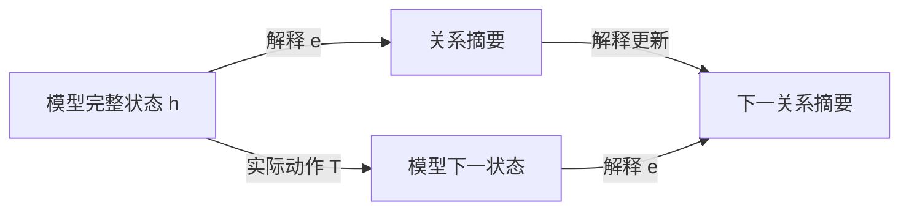

# FIB ATOM 与机器学习白盒性：五窗、关系交互与递归解释

> **参考输入。** 本卷是 [Fibonacci 原子关系生成卷](FIBONACCI_ATOMIC_RELATION_GENERATION.md) 与 [机器学习卷](CONTEXTUAL_SPACETIME_ARITHMETIC_ML.md) 的姊妹卷，给出普通数学推导与模型解释；本文新增综合尚未整体经 Lean 内核核验，不以理论文字承担形式化真值。正文聚焦五种局部窗口怎样形成可执行的解释，不预设一般神经网络已经学会这套结构。

## 1. 白盒问题要先说清解释什么

机器学习用数据选择模型的参数，使模型对指定输入产生需要的输出。选择过程可以写成更新 $\theta^+=U(\theta,\text{数据},\text{优化器状态})$；使用过程则是 $y=f_\theta(x)$，或者带记忆的 $h^+=T_\theta(h,x)$、$y=o_\theta(h)$。解释学习过程和解释使用过程，面对的状态与动作并不相同。

能查看权重和程序，提供了实现访问权。进一步给一个小表示 $e(h)$，能够计算指定输出、预测允许干预的结果，并逐步更新自身，才得到了相应任务的动态解释。人能否理解这些坐标、计算是否划算、解释的预测是否符合现实，又是另外的要求。

| 解释范围 | 要回答的问题 | 尚不能由此推出的性质 |
| --- | --- | --- |
| 实现可见 | 参数、算子、缓存是什么 | 已找到简洁机制 |
| 当前预测充分 | 这个输入为什么得到这个输出 | 新输入、干预与下一步训练仍正确 |
| 动态机制充分 | 改输入、续接或允许干预后怎样变化 | 解释坐标有唯一的人类语义 |
| 学习过程充分 | 换批次、继续训练时怎样变化 | 泛化、可靠性或价值选择必然正确 |

本卷以可计算的小系统解释这些区别。FIB ATOM 提供的核心材料是：有限的局部模式、有约束的组合、可展开的块、关系记录，以及对未来操作闭合的状态。它们给出白盒设计与检验的方法，不给任意网络指定一种普适的五分类。

## 2. 用户五分类的准确含义

**定义 2.1（低位到高位的五窗）。** 固定三个位权 $(2,3,5)$，位串记为 $b=(b_1,b_2,b_3)$，要求

$$
b_1b_2=b_2b_3=0,\qquad b_i\in\{0,1\}.
$$

于是局部字母表为

$$
\Sigma=\{000,100,010,101,001\}.
$$

| FIB 标签 | 位串 | 所选位置 | 初始窗口读数 |
| --- | --- | --- | --- |
| null | 000 | 空集 | 0 |
| 2 | 100 | 第一个位置 | 2 |
| 3 | 010 | 第二个位置 | 3 |
| 2 5 | 101 | 第一、第三个位置共同成块 | 7 |
| 5 | 001 | 第三个位置 | 5 |

原卷 §57 按高到低的 $(b_5,b_3,b_2)$ 写字面位串，下标表示对应位权；本文采用原卷 §§104、141 的低到高坐标。反转映射 $\rho(x,y,z)=(z,y,x)$ 保持所选位置集合：原卷 §57 的 `001` 对应本文的 `100`，都选择位权 2；该节的 `100` 对应本文的 `001`，都选择位权 5。`000`、`010`、`101` 在反转下不变。

五来自三位中禁止相邻占位。换成四位窗口就有八个合法模式；一般长度 $k$ 的模式数为 $F_{k+2}$，由“首位零后剩 $k-1$ 位、首位一后次位必须零而剩 $k-2$ 位”的递推得到。

下一组三位权是 $(8,13,21)$，五种模式仍在，读数却变成 $0,8,13,29,21$。局部组合语法与数值素性是两件事。跨窗还要检查接缝，`null` 消耗三个位置，不能视作结束或无操作。

在机器学习中，可以把这五类作为明确语法下的输入类别，或作为一个待验证的解释字典；不能从“五类”直接推出五个神经元、五个潜在因子或五态控制器。

按位置集合的包含序，非零原子只有三个单例；`101` 是复合模式，`000` 是空模式。五窗作为不可再切的读取字母，是指定窗口长度后的语法约定。关系任务中不能删除的区别，则要由任务和未来操作给出证据，不能只靠“原子”这个名称判定。

## 3. 五窗上的完整特征代数

**命题 3.1（五个合法点的交互展开）。** 任意函数 $f:\Sigma\to\mathbb R$ 唯一写成

$$
f(b)=c_0+c_1b_1+c_2b_2+c_3b_3+c_{13}b_1b_3.
\tag{3.1}
$$

其系数为

$$
\begin{aligned}
c_0&=f(000),\\
c_1&=f(100)-f(000),\\
c_2&=f(010)-f(000),\\
c_3&=f(001)-f(000),\\
c_{13}&=f(101)-f(100)-f(001)+f(000).
\end{aligned}
\tag{3.2}
$$

证明。依次代入空点和三个单点得到前四个系数；最后代入 $101$ 得到第五个。五点上的值全部恢复，且任何表示都被这些代入强制，故存在且唯一。$\square$

这里的五是合法域上函数空间的维数；一种固定线性特征字典要表示所有实值任务，至少需要五个线性独立特征。这不禁止用一个整数编码五个输入，再用非线性查表解码，也不规定一个给定任务必须使用全部五项。

**解释 3.2（相互作用相对于任务）。** $c_{13}$ 比较“共同出现的效果”与“分别出现的效果之和”。它为零当且仅当该任务在这五个点上没有超出常数和单项的贡献。例如：

$$
f_{\mathrm{sum}}(b)=2b_1+3b_2+5b_3
\quad\Longrightarrow\quad c_{13}=0;
$$

$$
f_{\mathrm{joint}}(b)=b_1b_3
\quad\Longrightarrow\quad c_{13}=1.
$$

相同的 FIB 结构，对加法读数没有交互修正，对共同出现任务却必须保留交互。这比给 `101` 贴上“复杂特征”标签更具体：有一条可计算、可反驳的等式。

由于本域上 $b_1b_2=b_2b_3=b_1b_2b_3=0$，这些特征的系数无法由合法域数据识别，也不影响域内任何输出。若另外开放 `110` 等输入，已经扩展了任务域；此时旧解释在域外的延拓不是唯一的。`101` 则本来合法，未采到它属于数据覆盖缺失，不能当成语法排除。

式（3.2）是给定输入坐标上的函数交互，不单独证明网络内部存在一个独立的交互模块，更不等于真实世界的因果效应。

## 4. 同块观察与解释系数是一对对偶坐标

**定义 4.1（合法块与共现记录）。** 设 $I$ 为有限位置集，$\mathcal A\subseteq2^I$ 非空且向下闭：$S\in\mathcal A,T\subseteq S$ 蕴含 $T\in\mathcal A$。无相邻占位的合法位置集满足此条件。一个有限块多重集给出重数 $m_S\in\mathbb N$。定义

$$
y_T=\sum_{S\in\mathcal A,\ T\subseteq S}m_S,
\qquad T\in\mathcal A.
\tag{4.1}
$$

$y_T$ 数的是多少个块同时包含 $T$，不是等价关系分块的布尔位。这里允许不同块重叠、重复；两个位置同现的次数一般不能决定三个位置共同出现的次数。$y_\varnothing$ 是块总数。

**命题 4.2（块函数与共现记录的精确配对）。** 给任意 $f:\mathcal A\to\mathbb R$，置

$$
c_T=\sum_{U\subseteq T}(-1)^{|T|-|U|}f(U).
$$

则

$$
f(S)=\sum_{T\subseteq S}c_T,
\qquad
\boxed{\sum_{S\in\mathcal A}m_Sf(S)
=\sum_{T\in\mathcal A}c_Ty_T.}
\tag{4.2}
$$

证明。第一式中 $f(U)$ 的合并系数为 $\sum_{U\subseteq T\subseteq S}(-1)^{|T|-|U|}$，$U=S$ 时为一，否则由二项式展开为零。向下闭保证所用 $f(U)$ 均有定义。第二式把有限和交换次序，再用式（4.1）。$\square$

这是有限集合 Möbius 反演的应用。FIB 卷 §62 从共现记录恢复块重数；这里从块函数恢复解释系数。二者通过式（4.2）相接：**关系记录说明共同发生了什么，任务系数说明这种共同发生对输出有什么贡献。** 有限配对并未假设块统计独立。

若 $c_\varnothing=f(\varnothing)\ne0$，必须保留 $y_\varnothing$ 的总块数贡献。这套无序统计不保存窗口次序、位置权重或接缝；第6、7节的递归任务还需要相应状态，不能仅由这些计数恢复。

**实例 4.3（7 与 10 的白盒差异）。** 沿用 FIB 卷 §58，只允许四个非空块 $[2],[3],[5],[2+5]$，重数分别为 $a_2,a_3,a_5,a_7$。记

$$
u=a_2+a_7,\qquad v=a_3,\qquad w=a_5+a_7,\qquad\kappa=a_7.
$$

若块内相加、块间相乘，则

$$
N=2^{u-\kappa}3^v5^{w-\kappa}7^\kappa,
\qquad 0\le\kappa\le\min(u,w).
$$

对每块的值取对数，使乘法总任务变为式（4.2）的加法任务，得到

$$
\boxed{\log N=u\log2+v\log3+w\log5
+\kappa\log\frac7{10}.}
\tag{4.3}
$$

空块在这个乘法例中不计入；为使用完整五点展开，可约定它的块因子为一、对数读数为零。这是乘法单位合同，不是把数值零的 `null` 拿来相乘。

$[2+5]$ 与 $[2][5]$ 有相同 $(u,v,w)=(1,0,1)$，却分别给 $N=7,10$。共同成块项的系数恰为 $\log7-\log2-\log5$。因此，删除 $\kappa$ 后，任何只对叶计数做后处理的模型都不能准确恢复这两个结果。

固定 $(u,v,w)$、允许全部上述合法重数组合时，$\kappa=0,\ldots,\min(u,w)$ 全可实现。因 $7/10\ne1$，这些 $N$ 两两不同，补充记录至少需要 $\min(u,w)+1$ 个值；记录 $\kappa$ 达到下界。若另加有限重数盒，须重新计算实际纤维，不能沿用这个全区间计数。

## 5. 训练能拟合单项，却没有识别关系

**定义 5.1（五窗线性解释模型）。** 取

$$
\phi(b)=(1,b_1,b_2,b_3,b_1b_3),\qquad
f_\theta(b)=\langle\theta,\phi(b)\rangle,
\quad\theta\in\mathbb R^5.
$$

训练集覆盖 $000,100,010,001$，但没有 $101$，损失为这些点上的平方误差。令 $e_{13}=(0,0,0,0,1)$。

**命题 5.2（缺少合法联合样本的识别缺口）。** 对任意 $t\in\mathbb R$，$\theta$ 与 $\theta+te_{13}$ 在全部训练点上预测相同，且整个训练损失相同；在 $101$ 上相差 $t$。四个训练行线性独立，故这个训练读数的参数核恰为 $\mathbb Re_{13}$。

证明。训练点的最后一个特征全部为零；空点及三个单点分别确定偏置和三个单项系数。联合点的最后一项是一。$\square$

即使训练误差为零，这个关系方向也没被数据决定。最小范数、稀疏性或初始化可以选定一个系数，但该选择是归纳偏置；没有新增数据或结构假设时，不能把它说成真实交互已经被识别。

这里的不可识别针对旧四模式的读数权限。黑盒若允许查询全部五个模式，同样可以由式（3.2）计算交互；白盒若允许读取参数，可以直接读出模型选取的 $c_{13}$。两者都还需区分“当前模型的系数”与“数据已经识别的真实目标系数”。

**命题 5.3（新联合样本使隐藏方向反馈到旧任务）。** 从相差 $te_{13}$ 的两组参数出发，对同一个新样本 $(101,y)$ 做一次同步的欧氏梯度下降，损失为 $\tfrac12(f_\theta(101)-y)^2$、步长同为 $\eta$，无正则、动量或额外更新项。更新后参数差为

$$
\Delta\theta^+=t(e_{13}-\eta\phi(101)).
\tag{5.1}
$$

因而旧空点上的预测差变为 $-\eta t$。若 $\eta t\ne0$，它们已不在旧训练读数的同一纤维。

证明。两组参数在新样本上的残差相差 $t$，梯度相差 $t\phi(101)$；从原参数差中减去步长乘梯度差得式（5.1）。空点只读取偏置，取第一坐标即得。$\square$

**解释 5.4（反馈取决于特征与优化规则）。** 对一般线性特征模型，一次上述更新使任意输入 $x$ 的输出变为

$$
f^+(x)=f(x)-\eta(f(z)-y)K(x,z),\qquad
K(x,z)=\langle\phi(x),\phi(z)\rangle.
\tag{5.2}
$$

五窗交互字典满足 $K(000,101)=1$，旧空点输出的改变量为 $-\eta(f(101)-y)$，该量非零时输出改变。改用五模式的独热坐标 $\psi(b)=e_b$，并在该坐标做欧氏梯度下降，则 $K(x,z)=\mathbf1_{x=z}$，新 $101$ 样本不改变旧四模式。两套特征都能表达所有五点函数，却产生不同学习动态。这里的反馈由表示与优化度量共同决定，不是 FIB 语法对所有学习算法的强制结论。

取 Fibonacci 读数 $q(u,v)=2u+3v$ 与推进 $M(u,v)=(v,u+v)$，有 $q(3,-2)=0$、$q(M(3,-2))=-1$。它与命题5.3共享一个可核对的机制：原观察的核不被新增动作保持。后者的动作是读入一个合法联合样本并学习；没有要求神经网络的更新矩阵等于 Fibonacci 矩阵。

## 6. 五种输入，却只需四个结构状态

**定义 6.1（接缝与 End 任务）。** 逐窗按低位到高位读取。状态记录上一位 $s\in\{0,1\}$ 和上一窗是否非零 $E\in\{0,1\}$。若 $s b_1=1$，接缝非法并进入吸收失败态；否则更新为

$$
(s^+,E^+)=(b_3,\mathbf1_{b\ne000}).
\tag{6.1}
$$

End 是一次结束查询，成功当且仅当当前 $E=1$。取无单位位的初态 $(s,E)=(0,0)$，故空串不接受。该模型只检查结构，不输出数值，也不保留全部历史。它是原卷 §104 的初始化取单位位零时的结构部分。

End 不属于可继续读取的窗口字母表。若把它改成输入字母，并要求拒绝 End 后的所有输入，则须另计终止后的接收态；下述四态数只针对窗串及其终端查询。

**命题 6.2（四态结构解释）。** 所有可达结构状态恰为

$$
A=(0,0),\quad B=(0,1),\quad C=(1,1),\quad D=\mathrm{fail}.
$$

其转移表为：

| 当前状态 | null / 000 | 2 / 100 | 3 / 010 | 2 5 / 101 | 5 / 001 | End 成功 |
| --- | --- | --- | --- | --- | --- | --- |
| A | A | B | B | C | C | 否 |
| B | A | B | B | C | C | 是 |
| C | A | D | B | D | C | 是 |
| D | D | D | D | D | D | 否 |

这四态在确定性、只读后续窗并最终询问 End 的模型中同时充分且最小。

证明。式（6.1）给出表，每个合法窗满足 $b_3=1\Rightarrow b\ne000$，故 $(1,0)$ 不可达。$A$ 初始可达，$100$ 到 $B$，$001$ 到 $C$，$001,100$ 到 $D$。End 区分 $A$ 与 $B,C$，也区分 $D$ 与 $B,C$；续接 $100$ 后 End 区分 $B,C$；续接 $010$ 后 End 区分 $A,D$。所以四态两两有未来见证，任意准确实现至少四个可达状态。表给上界。$\square$

这是一张完整的小白盒：不仅说“模型记得接缝”，还列出它怎样记、怎样更新、每份记忆为什么不能再删。五个输入标签、四个行为状态、五维局部函数空间，是三个不同的数量。

`null` 从 $B$ 到 $A$ 会改变能否 End；从 $C$ 到 $A$ 还会解除接缝限制。把它解释成“什么都没发生”，会同时错判两种未来。

## 7. 数值任务需要额外递归状态

**定义 7.1（同一低位扫描中的数值接口）。** 承接第6节，固定单位位 $\varepsilon=0$。当前累计值为 $r$，当前窗前两个位权为 $u,v$，第三个位权为 $u+v$。初始 $(r,u,v)=(0,2,3)$。在合法读窗后，按表加入数值：

| 窗口标签 | 累计值增量 $d_b(u,v)$ |
| --- | --- |
| null | 0 |
| 2 | $u$ |
| 3 | $v$ |
| 2 5 | $2u+v$ |
| 5 | $u+v$ |

同时更新

$$
r^+=r+d_b(u,v),\qquad
\binom{u^+}{v^+}
=\begin{pmatrix}1&2\\2&3\end{pmatrix}\binom u v.
\tag{7.1}
$$

三步位权推进就是 $M^3$，其中 $M=\begin{pmatrix}0&1\\1&1\end{pmatrix}$。接缝、End 按第6节更新。合法 End 返回 $r$，其余返回失败标签。对输入窗数归纳，$(r,u,v,s,E)$ 因而给完整数值任务的闭合接口。

这里坚持低位到高位扫描。原卷 §236 的高位到低位 Horner 写法把三步推进作用于累计组成，接缝方向也相反；不能直接拿那张公式替换式（7.1）。

**命题 7.2（有限结构记忆不等于有限数值记忆）。** 四态结构接口不足以恢复任意长度的合法且可 End 窗串的精确整数值。这里的候选是固定初态、只读窗串的确定性状态实现：每个窗口字母对应一个固定状态转移，End 输出仅由当前状态决定，不另获免费的外部时钟、位置、输入历史访问或累计寄存器。若它对所有有限合法且可 End 的窗串均精确输出整数值，则需要无限多个可达状态。

证明。连续读 $k\ge1$ 个 $100$ 窗，每条接缝合法，End 成功，结构态全为 $B$；累计数值为

$$
\sum_{j=0}^{k-1}F_{3j+3}.
$$

各项正，随 $k$ 严格增加。因此这些历史必须占不同的输出状态。$\square$

若任务只要模 $m\ge2$ 的输出，把 $(r,u,v)$ 全部模 $m$ 化，配三个合法结构态和一个失败态，得到至多 $3m^3+1$ 个状态的准确上界。并未证明这些组合全可达或彼此不可合并。读取位置若由外部提供，$u,v$ 可按位置计算，但位置与计算费用必须另记。

**解释 7.3（五窗递归与神经状态）。** 一个学习模型可以用很多神经元实现四态结构解释，也可以用很少的实数坐标编码更大甚至无限的状态族。神经元数、可区分状态数和存储位数不能互相替代。FIB 的有限窗口提供的是局部语法；递归深度和数值精度仍会增加任务负担。

## 8. 从手写白盒到学习模型，需要交换关系

**定义 8.1（指定任务的解释合同）。** 设学习模型在已声明的可达载体 $H$ 上运行，操作 $a$ 的部分更新为 $T_a:D_a\to H$，所需读数为 $o$。解释 $e:H\to Q$ 的值域取实际像，要求有读出 $\bar o$、合法域 $\bar D_a$ 和更新 $\bar T_a$ 满足

$$
\begin{aligned}
o(h)&=\bar o(e(h)),\\
h\in D_a&\Longleftrightarrow e(h)\in\bar D_a,\\
e(T_a h)&=\bar T_a(e(h))\quad(h\in D_a).
\end{aligned}
\tag{8.1}
$$

来源、允许查询、干预和记录要求均固定在合同里。操作后仍须落在 $H$，或明确扩大载体；比较同一高层干预的不同低层实现时，另需给出相容的干预映射。

逐词归纳可知式（8.1）保持全部合法性与输出。反向，解释值相同但某个未来结果不同，就否定该解释对相应动作族的充分性。仓内 `TargetRecoveryCriterion`、`DynamicClosureMinimality`、`ControlledBehaviorUniversality` 分别提供目标纤维、动态细化和有限实现的相关接口；使用时仍须满足各自前件。

图的两条路径得到相同摘要，是一个可检验的承诺。给隐藏状态训练一个能读出“接缝位”的探针，仅验证了解码的一部分；还应检验模型遇到 $100$、$001$、`null` 时，探针读数是否按第6节转移，并检验实际输出。

手写出正确的四态自动机，证明的是这项任务有一个白盒实现。要说已训练的网络具有这个机制，还需构造并验证该网络上的 $e$。有限测试没找到反例，只说明相应测试集上未找到反例。

## 9. 同一预测函数，也可以有不同学习未来

**实例 9.1（两层模型的参数纤维）。** 对标量两层线性模型

$$
f_{a,b}(x)=abx,\qquad w=ab,\qquad s=a^2+b^2,
$$

用固定损失 $\ell(w)$、步长 $\eta$ 做同步欧氏梯度下降。记 $g=\ell'(w)$、$\alpha=\eta g$。原 ML 卷 §9 的公式给

$$
\begin{aligned}
a^+&=a-\alpha b,& b^+&=b-\alpha a,\\
w^+&=(1+\alpha^2)w-\alpha s,&
s^+&=(1+\alpha^2)s-4\alpha w.
\end{aligned}
\tag{9.1}
$$

后两式分别由乘积和平方和展开得到。$w$ 足以解释固定参数下全部输入的预测，却一般不足以解释下一次训练。以 $\ell(w)=w^2/2,\eta=1/10$ 为例，

$$
(a,b)=(1,1),\ (2,1/2)
$$

都有 $w=1$，但 $s=2,17/4$，下一步 $w^+$ 分别是 $81/100,117/200$。

这个训练任务至少必须补充能区分上述两个 $s$ 值的信息；加入 $(w,s)$ 后式（9.1）闭合，并不要求所有准确编码都把该坐标命名为 $s$。固定损失与更新规则是结论的一部分，动量、Adam、不同坐标的优化度量或新的参数干预会改变合同。若 $g=0$ 且后续始终无新任务，参数可驻定，不应宣称所有纤维差异都必然显现。

这个例子与第5节互补：第5节保持同一参数化而扩大训练数据，第9节保持同一预测函数而比较不同参数因子。二者都要求解释学习时保留未来会反馈到输出的隐藏区别。

## 10. 关系原子不等于一个神经元

**解释 10.1（坐标变化与同一行为）。** 对两层线性网络 $f(x)=W_2W_1x$，任意可逆隐藏换基 $A$ 给

$$
W'_1=AW_1,\qquad W'_2=W_2A^{-1},\qquad
W'_2W'_1=W_2W_1.
$$

因此内部坐标名称和逐坐标激活值不由输入输出函数唯一决定。一般非线性网络不能随意用这个全可逆换基；例如 ReLU 只在相应置换、正缩放等确实保持运算的变换下适用。第9节还说明，保持当前函数的重参数化不自动保持欧氏训练动态。

若低层干预是“将某个神经元归零”，换基后应运输同一个干预算子；换成“仍把第一个坐标归零”通常已换了实验。任务相对的行为商规范，不代表一套神经元分工、一个最稀疏字典或一个人类概念命名也规范。

**实例 10.2（能读出概念，不等于该坐标在被使用）。** 令隐藏态 $h=(x,x)$，输出 $y=h_1$。两个坐标都能完美预测 $x$；在这个实现中将 $h_2$ 置零却不改变输出。探针的成功证明信息可解码，未证明输出通过该坐标产生。

消融后没有变化也不能一般推出关系无作用：冗余路径、饱和区、错误的干预范围都可能遮蔽变化。应固定允许的替换与背景，比较实际输出，并核对式（8.1）；不要把任意离开可达像的激活拼接当作自然数据的反事实。

FIB 的 $101$ 给一个有来源的联合特征；稀疏自编码器中的一个激活方向还取决于数据支撑、字典规范和优化目标。[白盒纤维律卷](WHITE_BOX_LOSS_FIBER_LAW.md)第4章的特征吸收实例说明，重构和稀疏性可以偏好共同出现的方向；它们不自动把真实生成因子逐一恢复。

**约定 10.3（五窗与原子语义保持分层）。** 用户所指的五分类就是第2节的五个合法窗口。本卷为解释而区分的语义层次——语法叶、可展开封装、数量乘法素元、操作不可约结构、任务行为区别——是一份概念表，并非原卷既有的五分类，也不与五个窗口逐项对应。`null` 尤其不是一个素元；`2 5` 也不自动是一种独立神经机制。称某个区别为“关系原子”，须至少附上任务、允许操作、它被合并时的错误见证；这仍不声称有唯一的生成元分解。

## 11. 怎样把解释变成可检验的学习任务

一个具体的 FIB 白盒实验可以同时保留三类目标，而不是只训练一次五分类：

1. **局部语义**：输出五窗类别、数值或 $b_1b_3$；用式（3.2）测量交互系数，并明确是否覆盖 $101$。
2. **递归结构**：预测下一窗是否合法以及能否 End；比较模型摘要与第6节四态转移，特别测试 `null` 和非法接缝。
3. **数值行为**：预测指定精度下的累计值；检验式（7.1），比较同结构态、不同数值态的历史。

这些目标不要求模型使用同一份最小表示。若还要解释训练，把优化器记忆、批次输入和参数状态并入合同，用第5、9节的成对实例测试当前解释是否闭合。

**判据 11.1（恢复与分离）。** 候选解释要被称为某个有限确定性任务的最小准确实现，需要两类证据：所有实际状态和动作上成立的恢复、保域与更新等式，以及每对不同可达解释状态的未来区分词。前者排除错误合并，后者排除冗余。第6节四态表同时给了这两类证据。

如果学习网络的可达隐藏态尚未被完整刻画，抽取出的有限表不能单独替网络通过前一项。可以证明一个覆盖可达态的归纳不变量，再逐动作验证；只有样本检验时应报告样本范围与反例，不能把长串泛化准确率改称全域证明。

近似解释还需指定度量、误差和允许时域。若 $L\ge0$、$\varepsilon\ge0$，且状态误差满足 $e_{t+1}\le Le_t+\varepsilon$，则 $e_t\le L^te_0+\varepsilon\sum_{j=0}^{t-1}L^j$；但接缝、End 这样的离散判定还需守卫裕量或精确的标签保持。数值接近不自动保证走相同分支。相关完整条件见 ML 卷 §§21、25–26。

## 12. 本卷提供的连接与尚未取得的结果

FIB 五窗给出的学习对象可写为

$$
\boxed{\text{合法局部模式}
\ \longrightarrow\ \text{单项与关系交互}
\ \longrightarrow\ \text{带接缝的递归状态}
\ \longrightarrow\ \text{指定任务的动态解释}.}
$$

五点函数展开与同块记录的配对是这里的具体桥梁：$c_{13}$ 描述任务对共现的响应，$\kappa$ 描述实际共现次数。缺失联合训练样本留下未识别方向；新增联合样本能让这个方向反馈到旧预测。结构任务具有四态解释，精确无界数值任务则不能由四态承担。

这些内容既不证明任意大型网络已有短小的全局解释，也不证明 FIB 坐标在真实学习任务上优于其他表示。本文没有训练神经网络、测量泛化收益或完成一般因果抽象的提取算法。尚待研究的具体问题是：在选定模型与干预族上，能否实际提取满足式（8.1）的低成本表示；哪些关系必须保留；超出有限窗口后需要增加哪些状态。

## 13. 来源与核验范围

| 来源 | 本卷使用的内容与边界 |
| --- | --- |
| [FIB 原卷](FIBONACCI_ATOMIC_RELATION_GENERATION.md) §§57–58、62、104、141、236–237 | §57 提供高到低位序的数值窗口，§§104、141 提供本文采用的低到高位序合同，二者经反转对应；另复用块重数与 $\kappa$、接缝和三步递归，不从素数或共同谱推断学习能力 |
| [ML 卷](CONTEXTUAL_SPACETIME_ARITHMETIC_ML.md) §§2–3、9、13、19、21 | 任务充分性、两层训练闭包、优化器状态、因果干预与近似误差；第9节公式在这里直接复用 |
| [白盒纤维律卷](WHITE_BOX_LOSS_FIBER_LAW.md) §§3–4 | 训练读数纤维与特征吸收；不将线性或特定字典结论外推到所有网络 |
| [LiteralWindowEnd.lean](../../../D5/S3/Arith/FibonacciAtomic/LiteralWindowEnd.lean) 的 `Window`、`bits`、`step`、`execution` | 五个实际构造子、部分语言的失败总化与 End；第6节四态最小性是本文针对结构子任务的推导，不冒称源码已逐字给出 |
| [DynamicClosureMinimality.lean](../../../D5/S3/ConceptDynamics/Interventions/DynamicClosureMinimality.lean) | 动态闭包及其最小细化接口；实际网络的闭合前件仍需验证 |
| [TargetRecoveryCriterion.lean](../../../D5/S3/ConceptDynamics/Restoration/TargetRecoveryCriterion.lean) | 目标在观察纤维上常值的恢复判据；不提供缺失实验数据 |
| [Geiger 等，Causal Abstraction](https://www.jmlr.org/papers/v26/23-0058.html)，JMLR 26(83) | 因果抽象需要状态和干预的对应；平均干预准确率不等于全域精确抽象，库内来源见 [条目](../../../Library/Dynamics/geiger2025causal.md) |
| [Elhage 等，Toy Models of Superposition](https://arxiv.org/abs/2209.10652)；[Chanin 等，A is for Absorption](https://arxiv.org/abs/2409.14507) | 分布式特征与特征吸收的相关研究背景；不充当本文五窗定理或任意网络解释成功的证据 |

五点展开、有限集合 Möbius 反演、自动机剩余行为及梯度代数均属成熟工具。本卷提供它们在固定 FIB 任务上的综合应用，不宣称这些工具原创。新增综合的证据是所列普通证明；没有新增冻结声明，也未把有限检查提升为全称 Lean 核验。

## 追加锚（本行以下为增补区）

## 14. 固定任务后的风险分解与表示细化

**定义 14.1（平方损失比较合同）。** 固定有限支撑的联合分布 $(X,Y)$，其中 $Y\in\mathbb R$；完整输入为 $X$，表示为 $Z=e(X)$，损失为 $(Y-h(Z))^2$。读出类 $\mathcal H$ 是预先规定的非空实值函数类，实际读出 $\widehat h\in\mathcal H$。表示取得、读出计算、训练标签及允许动作的资源合同也须固定。以下期望均对同一联合分布计算；若读出由随机训练集产生，先固定一次训练所得的读出，再按需对训练随机性取期望。

只在正概率纤维上定义条件均值，零概率处的值任取。记

$$
\begin{aligned}
m(X)&=\mathbb E[Y\mid X],& m_e(Z)&=\mathbb E[Y\mid Z],\\
N&=\mathbb E[(Y-m(X))^2],& I&=\mathbb E[(m(X)-m_e(Z))^2],\\
A&=\inf_{h\in\mathcal H}\mathbb E[(m_e(Z)-h(Z))^2],&
B&=\mathbb E[(m_e(Z)-\widehat h(Z))^2]-A.
\end{aligned}
\tag{14.1}
$$

本节 $N$ 是相对完整输入 $X$ 的标签噪声，与第4节的整数读数符号分别使用；$I$ 是表示遗漏的条件均值信息，$A$ 是读出类的逼近缺口，$B$ 是实际读出的总体类内超额。有限支撑使各个实值读出的风险有限；不要求 $\mathcal H$ 有最优元、凸性或线性结构。

**命题 14.2（四项非负分解）。** 在定义14.1的合同下，实际风险满足

$$
R(\widehat h):=\mathbb E[(Y-\widehat h(Z))^2]=N+I+A+B,
\qquad N,I,A,B\ge0.
\tag{14.2}
$$

证明。逐个正概率的 $X=x$ 纤维有 $\mathbb E[Y-m(X)\mid X=x]=0$；因此 $Y-m(X)$ 与任意 $X$ 的函数的乘积期望为零。又因 $Z=e(X)$，逐个 $Z=z$ 纤维求和得 $\mathbb E[m(X)\mid Z]=m_e(Z)$，故 $m(X)-m_e(Z)$ 与任意 $Z$ 的函数正交。展开

$$
Y-\widehat h(Z)=(Y-m(X))+(m(X)-m_e(Z))+(m_e(Z)-\widehat h(Z))
$$

的平方，三个交叉项分别由上述两种纤维求和消去，得到 $N+I+\mathbb E[(m_e-\widehat h)^2]$。加减 $A$ 得式（14.2）。前三项是平方期望或其非空类下确界；由 $\widehat h\in\mathcal H$，最后一项也非负。$\square$

$B$ 不一概是“优化残差”：未知目标的样本识别不足也能让经验最优读出具有正的 $B$。对给定非空训练集，令 $\widehat R$ 为经验平方风险。若 $\delta=\sup_{h\in\mathcal H}|R(h)-\widehat R(h)|<\infty$，则有

$$
\begin{aligned}
B&=R(\widehat h)-\inf_{h\in\mathcal H}R(h)\\
&\le \widehat R(\widehat h)-\inf_{h\in\mathcal H}\widehat R(h)+2\delta.
\end{aligned}
\tag{14.3}
$$

证明。由 $|R-\widehat R|\le\delta$，有 $R(\widehat h)\le\widehat R(\widehat h)+\delta$；又对任意 $h\in\mathcal H$ 有 $\widehat R(h)\le R(h)+\delta$，取下确界得 $\inf\widehat R\le\inf R+\delta$。两式相减即得，无需下确界可达。$\square$ 这只给总体超额的上界；经验优化差降低，不单独保证总体风险严格降低，也未给出 $\delta$ 的概率估计。

**命题 14.3（细化表示的精确收益）。** 设 $e=r\circ e'$，并允许各表示上的全部实值读出。记 $R_*(e)=\inf_h\mathbb E[(Y-h(e(X)))^2]$。则

$$
R_*(e)-R_*(e')=
\mathbb E\!\left[(\mathbb E[Y\mid e'(X)]-\mathbb E[Y\mid e(X)])^2\right].
\tag{14.4}
$$

严格改善当且仅当两个条件均值以正概率不同。

证明。令 $m'=\mathbb E[Y\mid e'(X)]$、$m_e=\mathbb E[Y\mid e(X)]$。对各表示，纤维消交叉项给 $R(h)=\mathbb E[(Y-m_e)^2]+\mathbb E[(m_e-h)^2]$，故条件均值读出达到不限类的最优风险。因 $m'-m_e$ 是 $e'$ 的函数，$Y-m'$ 与它正交；展开 $Y-m_e=(Y-m')+(m'-m_e)$ 即得式（14.4）。有限分布中平方期望为正恰等价于非零差有正概率。$\square$

因此，仅对旧表示做确定性后处理 $\widetilde e=t\circ e$，不能降低不限类的最佳风险；它可以通过计算新的非线性特征改善受限线性可读性。第15节将给出信息不变而线性误差严格下降的实例。

**实例 14.4（共同成块信息的风险价值）。** 完整输入 $X$ 等概率取第4节的两个块配置 $[2+5]$、$[2][5]$，真实目标分别为 $Y=7,10$。旧表示只有叶计数 $(u,v,w)=(1,0,1)$，最佳读出恒为 $17/2$，其风险为

$$
\frac12(7-17/2)^2+\frac12(10-17/2)^2=\frac94.
$$

加入共同成块次数 $\kappa$ 后，两输入分别有 $\kappa=1,0$，可精确读出目标，风险为零。这里 $N=0$；不限类下旧表示的 $I=9/4$、$A=B=0$。$\kappa$ 必须从块的实际来源取得，不能由相同的旧叶计数算出；添加它改变信息取得合同。

解释对模型忠实也不保证模型对真实目标正确。例如 $X$ 等概率取 $0,1$、$Y=X$，模型恒预测零。一态解释对模型的任意输入查询都忠实，状态始终不变，但真实平方风险为 $1/2$。模型“好坏”只能相对于固定目标、分布、损失和资源比较；准确解释允许看清错误，并不自行消除错误。

## 15. 五窗上受限读出的精确误差

**命题 15.1（加性读出的最佳平方风险）。** 令 $X=b\in\Sigma$、$Y=f(b)$，其中 $f$ 是任意确定实值目标，$p_b=P(X=b)$。允许任意实系数的加性读出

$$
g(b)=a_0+a_1b_1+a_2b_2+a_3b_3.
$$

若四角 $000,100,001,101$ 都有正概率，$010$ 的概率允许为零，则

$$
\inf_g\mathbb E[(f(X)-g(X))^2]
=\frac{c_{13}^2}{S},\qquad
S=\frac1{p_{000}}+\frac1{p_{100}}+\frac1{p_{001}}+\frac1{p_{101}},
\tag{15.1}
$$

其中 $c_{13}=f(101)-f(100)-f(001)+f(000)$。加入交互 $b_1b_3$ 的第3节完整字典可把风险降为零；严格收益恰在 $c_{13}\ne0$ 时成立。

证明。按 $(000,100,010,101,001)$ 排列五点值，置 $d=(1,-1,0,1,-1)$。由命题3.1，加性读出类恰是超平面 $d\cdot g=0$：四个加性系数任取，而唯一缺少的系数就是 $d\cdot g$。对残差 $r=f-g$，因此有 $d\cdot r=c_{13}$。在四角上用加权 Cauchy–Schwarz 得

$$
c_{13}^2
=\left(\sum_{b:\,d_b\ne0}\sqrt{p_b}\,r_b\frac{d_b}{\sqrt{p_b}}\right)^2
\le S\sum_b p_b r_b^2.
$$

取四角残差 $r_b=c_{13}d_b/(p_bS)$，并取 $r_{010}=0$，则 $d\cdot r=c_{13}$，故 $g=f-r$ 属于加性类，且其风险等于 $c_{13}^2/S$，达到下界。完整字典由式（3.1）准确表达 $f$。$\square$

**实例 15.2（信息完整，线性读出仍有损失）。** 五窗均匀、$f(b)=b_1b_3$ 时，$c_{13}=1$、$S=20$，最佳加性风险为 $1/20$。上述最优读出的五点值为

$$
g=(-1/4,\ 1/4,\ 0,\ 3/4,\ 1/4),
\qquad g(b)=-1/4+b_1/2+b_2/4+b_3/2.
$$

输入位串本身是单射表示，$N=I=0$；这里的正误差属于受限读出项 $A$。从已有位串计算 $b_1b_3$ 没有增加信息，却扩展了线性读出空间并使 $A=0$。本命题允许任意实值预测；上面的负值说明若强制预测落在 $[0,1]$，不能直接沿用此最小二乘等号。

**命题 15.3（支撑与噪声边界）。** 若四角至少有一个不在正概率支撑上，加性类可拟合整个正概率支撑，确定目标的最佳风险为零。若标签有噪声且条件均值为 $f(b)=\mathbb E[Y\mid X=b]$，则四角均正时加性最佳风险为

$$
\mathbb E[\operatorname{Var}(Y\mid X)]+\frac{c_{13}(f)^2}{S};
\tag{15.2}
$$

缺角时只剩条件方差项。完整字典在两种情形下都达到条件方差项。

证明。缺角时先把 $g$ 在所有正概率点置为 $f$，其余缺点任填；选一个缺角，因对应 $d_b\ne0$，可只调整这个不计风险的值，使唯一约束 $d\cdot g=0$ 成立。这给出加性读出，不使用 $1/0$。有噪声时逐个 $X=b$ 纤维消交叉项，得 $\mathbb E[(Y-g)^2]=\mathbb E[\operatorname{Var}(Y\mid X)]+\mathbb E[(f-g)^2]$，再应用命题15.1或缺角构造。$\square$

## 16. 零训练误差之外的样本识别缺口

**定义 16.1（两目标识别合同）。** 已知真实目标属于

$$
f_\theta(b)=\theta\mathbf1_{b=101},\qquad\theta\in\{0,1\};
$$

其他四点的目标已知为零。训练数据 $D_n=((X_i,f_\theta(X_i)))_{i=1}^n$ 是 $n\ge0$ 个无噪声、独立同分布局部窗口样本；输入分布不依赖 $\theta$，且 $P(X=101)=p$。测试窗口独立于训练集并服从同一分布。算法仅获得 $D_n$、上述已知合同和与 $\theta$ 无关的随机性，允许任意实值预测；没有额外标签或读取真实 $\theta$ 的权限。

**命题 16.2（精确 minimax 风险）。** 对 $0<p<1$，在训练、算法随机性与独立测试窗口上取期望，有

$$
\inf_{\mathcal A}\max_{\theta\in\{0,1\}}
\mathbb E[(f_\theta(X)-\widehat f_{\mathcal A,D_n}(X))^2]
=\frac{p(1-p)^n}{4}.
\tag{16.1}
$$

证明。令 $E$ 为训练中未见 $101$ 的事件，$P(E)=(1-p)^n$。在 $E$ 上两种目标产生完全相同的训练记录分布，连同算法随机性也无法区分它们。设算法在 $101$ 上的实值预测为 $C$，对两目标等权平均，有

$$
\frac12\mathbb E[C^2+(1-C)^2\mid E]
=\mathbb E[(C-1/2)^2\mid E]+\frac14\ge\frac14.
$$

测试取 $101$ 的概率为 $p$，其余误差非负；两目标的最大风险至少为平均风险，故下界为 $p(1-p)^n/4$。达到下界的算法在其他点恒输出零：见过 $101$ 时读出其标签并准确预测，未见时在该点输出 $1/2$。两目标的风险都等于下界。$\square$

这份算法在每一份训练集上都零误差，却仍可有正测试风险；其预测也属于第5节的完整交互字典。故这里没有表示损失或函数类逼近损失，经验优化已完成，缺的是关于固定真实目标的识别信息。实值输出权限决定常数 $1/4$；若每份训练所得预测必须是两个候选函数之一且允许随机化，未见时等概率选择给出并达到常数 $1/2$。

**推论 16.3（采样与合法查询的识别收益）。** 在 $0<p<1$ 下，每增一个同分布样本，式（16.1）的风险严格乘以 $1-p$。若另有权限向同一个固定真实目标查询合法窗口 $101$ 的无噪声标签，一次查询即识别 $\theta$，使所有五点的预测风险为零。

证明。前者直接比较相邻 $n$ 的公式；后者由 $f_\theta(101)=\theta$，其余值已知为零。$\square$

该查询取得真实目标标签；查询模型自身的预测不提供这份识别信息。标签来源、主动查询权限及其取得成本须另列，不能把新增权限当作免费算法改进。边界为：$p=0$ 时测试风险始终为零但 $\theta$ 未必识别；$n=0$ 时任意 $p$ 的 minimax 风险为 $p/4$；$p=1,n\ge1$ 时首样本已识别目标，风险为零，避免把 $0^0$ 当作推导步骤。

局部窗口独立采样的合同不自动等于第6节带接缝的合法窗串分布。序列中的窗口可以相关，选择机制也能改变未见事件概率；没有该合同便不能把 $(1-p)^n$ 用于序列风险。

## 17. 两层训练：平衡操作与状态反馈

本节承接第9节，只讨论精确实数标量参数、已知损失 $\ell(w)=w^2/2$ 和同步欧氏梯度下降；没有动量、正则、额外参数更新或数值舍入。先取固定步长 $\eta>0$，记一次更新为 $G_\eta$。

**命题 17.1（固定步长的一步下降判据）。** 对 $w=ab\ne0$、$s=a^2+b^2$，有

$$
w^+=w(1-\eta s+\eta^2w^2),\qquad
\ell(w^+)<\ell(w)
\quad\Longleftrightarrow\quad
\eta w^2<s<\frac2\eta+\eta w^2.
\tag{17.1}
$$

证明。式（9.1）代入 $g=w$ 给第一式；严格下降等价于 $|1-\eta s+\eta^2w^2|<1$，将两个严格不等式分别移项即得。$\square$ 当 $w=0$ 时损失已经为零，无严格下降。

同为 $w=1,\eta=1/10$，平衡因子 $(1,1)$ 的下一步为 $81/100$；因子 $(10,1/10)$ 有 $s=10001/100$，下一步为 $-8991/1000$，其绝对值大于一，损失反而增加。因此相同预测函数与相同目标，不保证同一次训练有相同收益。

**命题 17.2（保持当前函数的平衡与收敛）。** 约定 $\operatorname{sgn}(0)=0$，定义参数操作

$$
\operatorname{Bal}(a,b)=
(\sqrt{|w|},\operatorname{sgn}(w)\sqrt{|w|}),\qquad w=ab.
$$

它保持乘积 $w$，使 $s=2|w|$。平衡后做一步固定步长下降，得到

$$
w^+=F_\eta(w):=w(1-\eta|w|)^2.
\tag{17.2}
$$

若 $0<\eta|w_0|<2$，一次初始平衡后的连续梯度下降严格降低每个非零步的损失，并有 $w_t\to0$；若到达零则保持零。

证明。平衡乘积为 $w$，平方和为 $2|w|$，代入式（17.1）得式（17.2）。同步更新还满足

$$
(a^+)^2-(b^+)^2=(1-\eta^2w^2)(a^2-b^2),
$$

故一次平衡后 $a^2=b^2$ 永远保持，且 $s=2|w|$，无需每步重新平衡。令 $q_t=|w_t|$，则 $q_{t+1}=q_t(1-\eta q_t)^2$；在 $0<\eta q_t<2$ 内乘子严格小于一，故 $q_t$ 递减，始终小于 $2/\eta$，并有非负极限 $q_\infty$。连续性给 $q_\infty=q_\infty(1-\eta q_\infty)^2$。正的解只能是 $2/\eta$，而 $q_\infty\le q_0<2/\eta$，故极限为零。$\square$

取解释 $e(a,b)=ab$，该操作满足交换等式

$$
e\circ\operatorname{Bal}=e,\qquad
e\circ G_\eta\circ\operatorname{Bal}=F_\eta\circ e.
\tag{17.3}
$$

这给出修改动作恢复 $w$ 闭合的具体方式：执行“平衡后更新”，或者先进入并保持平衡子域。它并未使原来任意因子上的固定步长更新对 $w$ 闭合。平衡也不是处处最快：第9节的 $(2,1/2)$ 在同一步长下得到 $117/200$，其损失小于平衡所得 $81/100$ 的损失。

**命题 17.3（读取隐藏关系量的反馈收缩）。** 改用状态反馈合同：$s_t>0$ 时取 $\eta_t=1/s_t$ 并做同步欧氏更新；$s_t=0$ 时停止。则每个非停止步满足

$$
\begin{aligned}
w_{t+1}&=\frac{w_t^3}{s_t^2},&
s_{t+1}&=s_t-\frac{3w_t^2}{s_t}\ge\frac{s_t}{4}>0,\\
|w_{t+1}|&\le\frac{|w_t|}{4},&
\ell(w_{t+1})&\le\frac{\ell(w_t)}{16}.
\end{aligned}
\tag{17.4}
$$

因此 $\ell(w_t)\le16^{-t}\ell(w_0)$，从任意有限实参数出发都有 $w_t\to0$；初态 $s_0=0$ 时本来有 $w_0=0$，停止后视为保持零。

证明。由 $(|a|-|b|)^2\ge0$ 得 $s\ge2|w|$。在式（9.1）中代入 $g=w,\eta=1/s$，得到 $w^+=w^3/s^2$、$s^+=s-3w^2/s$。又 $w^2\le s^2/4$，故 $s^+\ge s/4$、$|w^+|\le|w|/4$，平方后得到损失界，归纳即得全程收缩。$\square$

此动作需要读取当前 $s=a^2+b^2$ 并计算一次倒数，固定步长合同已经换成状态反馈。闭合状态仍是 $(w,s)$：例如 $w=1$、$s=2$ 与 $s=17/4$ 的反馈下一步分别为 $1/4$ 与 $16/289$，所以 $w$ 独自不能决定该更新。白盒所见的隐藏关系量在这里成为控制资源，但计算精度和读取费用不由实数证明承担。

**命题 17.4（只读 $w$ 的步长不能统一保证下降）。** 若步长规则只依赖当前非零 $w$ 并选择 $\eta(w)>0$，且允许同一 $w$ 纤维的 $s$ 无界，则它没有对该纤维统一的一步下降保证。

证明。固定 $w\ne0$ 后步长是一个正数。取同纤维因子 $(a,w/a)$ 并让 $|a|$ 增大，$s=a^2+w^2/a^2$ 无界；可取 $s>2/\eta(w)+\eta(w)w^2$。式（17.1）的乘子于是小于 $-1$，损失严格增加。$\square$

这里优化目标已经明确为零，反馈证明不承担第16节中未知真实标签的识别义务；这些结论也不外推到一般网络、其他优化器或有限精度训练。

## 18. 从诊断量到可验证的研究路径

第14节的分解把误差定位到不同合同，第15、16、17节分别提供可计算收益。操作的成本应与收益一起比较：取得来源关系、增加读出特征、购买标签和读取训练状态不是同一种资源。

| 诊断量或障碍 | 对应操作 | 已证收益与条件 | 所需资源 |
| --- | --- | --- | --- |
| 旧表示合并了不同条件均值，$I>0$ | 从来源取得细化信息 | 不限读出时下降量恰为式（14.4）；两块配置补 $\kappa$ 下降 $9/4$ | 共同成块记录的取得与存储 |
| 四角均正且 $c_{13}\ne0$，加性类有 $A>0$ | 由位串计算并加入 $b_1b_3$ | 确定目标下降 $c_{13}^2/S$；均匀共同出现目标下降 $1/20$ | 一项交互特征及相应读出计算 |
| 两候选目标未被局部样本识别 | 增加一个同分布无噪声样本 | $0<p<1$ 时 minimax 风险乘 $1-p$ | 一个真实标签及采样成本 |
| 同一识别合同允许主动合法查询 | 查询固定真实目标的 $101$ 标签 | 一次查询使候选目标风险归零 | 主动查询权限与真实标签来源 |
| 固定步长不满足下降判据 | 保持函数的初始平衡 | $0<\eta|w_0|<2$ 时非零步严格下降并收敛；不保证每步最快 | 因子访问、乘积、平方根及参数写入 |
| 同预测纤维的 $s$ 无界 | 读取 $s$ 并取反馈步长 $1/s$ | 标量合同下每步损失至多原来的 $1/16$，无需初始平衡 | 当前平方和与一次倒数计算 |

若关注类内总体超额 $B$，式（14.3）要求同时检查经验优化差和总体—经验偏差；不能仅凭零训练误差宣布识别或泛化完成。相应上界下降也不等于实际风险已严格下降。表中每个严格收益都来自对应定理的前件，改变标签噪声、分布、输出范围或动作权限须重新核对。

回到五窗递归，局部交互误差、共同成块信息和目标识别可分别按上述公式检验；接缝、End 与累计数值还必须接受第6、7节的状态下界及第8节的恢复、保域、交换律。平均局部风险不替代序列动态闭合。例如第6节的 $B,C$ 都可 End，却在续接 $100$ 后给不同合法性；将它们合并即使不影响当前 End 风险，也不能准确执行下一窗。用探针读到这些关系之后，仍须验证真实网络是否使用它们、允许干预是否相容、更新是否保持解释，才能把手写白盒结论接回实际模型。

**来源与适用映射。** 下列既有声明提供条件期望与受限读出的结构来源。第14节的有限模型可取样本空间为 $(X,Y)$ 的有限联合支撑，配其概率测度与离散可测结构；$X$、$e(X)$ 是概念映射，平方可积自动成立，$e=r\circ e'$ 给条件 $\sigma$-代数包含关系。任意读出类 $\mathcal H$ 本身不因此成为子空间，也不取得正交投影或最近点。

| 新增连接的来源 | 对应内容与边界 |
| --- | --- |
| [ConditionalExpectationOptimality.lean](../../../D5/S3/ConceptDynamics/Prediction/ConditionalExpectationOptimality.lean)，`conditional_expectation_minimizes_mean_square_error` | 对概念生成的 $\sigma$-代数，平方可积条件期望的误差不大于任意可测平方可积读出；对应不限类最优性，不保证受限类下确界可达 |
| [ConditionalExpectationResidualDecomposition.lean](../../../D5/S3/ConceptDynamics/Prediction/ConditionalExpectationResidualDecomposition.lean)，`conditional_expectation_residual_orthogonal_decomposition` | $L^2$ 残差对概念可测子空间正交；第14节以有限纤维求和写出本卷所需的交叉项消去 |
| [ConditionalExpectationRefinementPythagoras.lean](../../../D5/S3/ConceptDynamics/Prediction/ConditionalExpectationRefinementPythagoras.lean)，`conditional_expectation_refinement_pythagoras` | 嵌套条件 $\sigma$-代数下，旧风险等于新风险加两条件期望的平方距离；对应式（14.4）的结构 |
| [ML 卷](CONTEXTUAL_SPACETIME_ARITHMETIC_ML.md) §§28.2–28.4、29.2–29.3 | 区分表示遗漏、受限解码、总体类内超额及可逆重编码的可访问性；其对数损失分解、Walsh 共同空间与下确界条件各按原合同使用，不替代本卷平方损失与五窗计算 |

以上引用按声明和正文条件核对，本文不声称重新编译这些来源。五窗精确风险、两目标采样界与两种训练改进由本卷普通数学推导给出，没有新增 Lean 核验、实际网络训练或普遍性能排名，也不据此宣称研究原创。

## 追加锚（本行以下为增补区）

## 19. 从四态结构语言到词响应合同

本批承接第6、8节，把结构任务接到 [计算行为表示卷](COMPUTATIONAL_BEHAVIOR_REPRESENTATION_THEORY.md) §§5.1–5.5 的词残余与有限块恢复，以及 [FIB 延拓几何卷](FIB_RELATIONAL_CONTINUATION_GEOMETRY.md) §6 的线性最小边界。一般构造属于既有理论；这里给出低位到高位、带终端 End 查询的具体实例及其验证证书。

**定义 19.1（总化终端响应）。** 固定 $\Sigma=\{000,100,010,101,001\}$，$\varepsilon$ 表示空词。对每个 $w\in\Sigma^*$，先从第6节初态 $A$ 读完 $w$，再执行一次 End 查询，定义

$$
F(w)=\begin{cases}1,&\text{终态为 }B\text{ 或 }C,\\0,&\text{终态为 }A\text{ 或吸收失败态 }D.\end{cases}
\tag{19.1}
$$

因此 $F(\varepsilon)=0$。End 不属于 $\Sigma$，也不消耗一个窗；$F(w)$ 本身就是完成该查询后的值。尚未执行 End 的运行记录不是另一个 $F(w)$ 值。非法接缝总化为拒绝后，$F$ 在所有窗词上有定义；这不把失败词改称合法词。

固定域 $K=\mathbb Q$，把布尔结果编码为域中的 $0,1$。一个 $d$ 维齐次线性模型由固定初始行 $\alpha$、每字母一个固定矩阵 $T_a$ 和线性终端列 $\beta$ 构成：

$$
z_{wa}=z_wT_a,\qquad z_\varepsilon=\alpha,\qquad
\widehat F(w)=\alpha T_{a_1}\cdots T_{a_n}\beta\quad(w=a_1\cdots a_n).
\tag{19.2}
$$

空乘积是单位阵；零维模型只给零响应。合同没有免费时钟、词长参数、历史访问或另加的非线性读出。系数的可表示精度与运算成本须独立记账。

记 $F_u(v)=F(uv)$、$H_F(u,v)=F(uv)$、$V_F=\operatorname{span}_K\{F_u\}$。复用上述两卷的结论：$\dim V_F$ 等于最小齐次线性维数。所需证明桥是：任意 $d$ 维实现将残余写为 $v\mapsto z_uT_v\beta$，故秩至多 $d$；反向，$g(v)\mapsto g(av)$ 保持 $V_F$，因为它把 $F_u$ 送到 $F_{ua}$，而线性关系可在后缀 $av$ 处逐项检验。以 $F_\varepsilon$ 初始化、在空后缀评价读出，即实现每个词。

这使用词拼接而非单一时间移位。仓内 [SequenceHankelRealization.lean](../../../D5/S3/Observer/Hankel/SequenceHankelRealization.lean) 的尾序列是 $m(i+j)$，对应单矩阵的 $CA^nB$；这里不同字母的矩阵一般不交换。例如 $F(001\cdot100)=0$，$F(100\cdot001)=1$，不能用词长替代字母次序。源码引用不表示本批词版本已编译或经 Lean 验证。

## 20. 三个预测坐标实现四个行为态

**命题 20.1（结构响应的最小线性维数）。** $F$ 的 Hankel 秩与最小齐次线性维数均为 $3$；第6节的四个离散未来行为类仍然是四个。

证明。记 $F_S(v)$ 为从结构态 $S$ 续读 $v$ 后的 End 结果。每个前缀的全部未来响应只取决于 $A,B,C,D$，而 $F_D$ 恒零，故 $V_F$ 由 $F_A,F_B,F_C$ 张成，秩至多三。取有序前缀与后缀

$$
P=(\varepsilon,100,001),\qquad Q=(\varepsilon,100,010).
$$

$P$ 中的前缀依次到达 $A,B,C$，并给出有限子矩阵

$$
H=(F(pq))_{p\in P,q\in Q}
=\begin{pmatrix}0&1&1\\1&1&1\\1&0&1\end{pmatrix},\qquad \det H=-1.
\tag{20.1}
$$

于是三个残余线性无关，秩至少三；结合第19节的桥得最小性。$D$ 可由 $001\cdot100$ 到达，且零残余与其他三行不同；离散类数不因零残余在线性张成中不增加维数而减少。$\square$

**构造 20.2（有限可检验的预测坐标）。** 对每个前缀置

$$
z_u=(F(u),F(u\cdot100),F(u\cdot010)),\qquad
z_A=(0,1,1),\ z_B=(1,1,1),\ z_C=(1,0,1),\ z_D=(0,0,0).
\tag{20.2}
$$

取 $\alpha=z_A$、$\beta=(1,0,0)^{\mathsf T}$。若 $e_i$ 是三维空间的第 $i$ 个单位列，则五个更新为外积

$$
T_{000}=e_3z_A,\quad T_{100}=e_2z_B,\quad
T_{010}=e_3z_B,\quad T_{101}=e_2z_C,\quad T_{001}=e_3z_C.
\tag{20.3}
$$

例如 $T_{100}$ 只有第二行非零，该行为 $(1,1,1)$；$T_{000}$ 只有第三行非零，该行为 $(0,1,1)$。式（20.3）因而逐项确定五个有理 $3\times3$ 矩阵。

验证。令 $\delta(S,a)$ 为第6节状态表的后继。矩阵乘法给全部二十个等式 $z_ST_a=z_{\delta(S,a)}$，四个读出满足 $z_S\beta=\mathbf1_{S\in\{B,C\}}$。其简短核对是：$A,B,C$ 的第三坐标均为一，$D$ 为零，故 $000,010,001$ 分别把前三态送到 $A,B,C$ 并保持 $D$；第二坐标在 $A,B$ 为一，在 $C,D$ 为零，故 $100,101$ 分别把 $A,B$ 送到 $B,C$，把 $C,D$ 送到 $D$。从 $z_\varepsilon=z_A$ 对词长归纳，每个词到达其真实结构态对应的行，终端输出即为 $F(w)$。这证明全部词，有限枚举只是额外核对。

坐标是三个指定未来查询的结果，不是三个输入标签；向量空间中的任意线性组合也不都是实际 FIB 状态。五个输入标签、四个离散行为态、三个线性维度、系数精度和计算成本分别承担不同合同。

## 21. 输出补码改变线性秩，却不增加语义信息

**命题 21.1（同一四态语言的四维齐次编码）。** 定义 $G(w)=1-F(w)$，即把拒绝（包括失败）编码为一、接受编码为零。它仍有四个离散未来类，但最小齐次线性维数为 $4$。同一三维坐标与式（20.3）仍可用仿射读出 $1-z_1$ 计算 $G$。

证明。补码是单射，两个残余 $F_u,F_v$ 相等当且仅当 $G_u,G_v$ 相等，所以四类保持。所有 $F_u$ 在后缀 $000$ 处为零；故它们的线性张成不含常值函数 $\mathbf1$。失败态可达，$G_D=\mathbf1$，而 $F_u=\mathbf1-G_u$，于是

$$
V_G=\operatorname{span}_K(\{\mathbf1\}\cup V_F),\qquad \dim V_G=1+3=4.
\tag{21.1}
$$

取 $P'=(\varepsilon,100,001,001\cdot100)$、$Q'=(\varepsilon,100,010,000)$，另有可核对的下界证书

$$
(G(pq))_{p\in P',q\in Q'}=
\begin{pmatrix}1&0&0&1\\0&0&0&1\\0&1&0&1\\1&1&1&1\end{pmatrix},\qquad \det=1.
\tag{21.2}
$$

仿射读出公式直接来自定义；若要求齐次读出，就增添恒定坐标，令 $\widetilde z=(1,z)$、$\widetilde T_a=\operatorname{diag}(1,T_a)$、$\widetilde\beta=(1,-1,0,0)^{\mathsf T}$，得到四维上界。$\square$

这里没有改变接受语义或增加来源信息；变化是输出编码与齐次读出约束。因此“线性维数更大”本身不证明任务记住了更多离散信息，也不能把仿射偏置当作齐次合同里的免费项。

## 22. 四十二个终端查询与有条件的完整重建

**应用 22.1（预测坐标中的有限块公式）。** 对域值词响应 $f$，须先有独立依据证明全局 $\dim V_f\le r$，再找到 $r\times r$ 可逆块 $H=(f(p_iq_j))$。定义

$$
H_a=(f(p_i a q_j))_{i,j},\qquad
h=(f(q_j))_j,\qquad b=(f(p_i))_i^{\mathsf T}.
$$

在预测行坐标 $z_u=(f(uq_j))_j$ 中，完整实现为

$$
\alpha=h,\qquad T_a=H^{-1}H_a,\qquad\beta=H^{-1}b.
\tag{22.1}
$$

证明桥。可逆块使所选 $r$ 个残余独立，全局上界使它们成为基。以残余基的行系数 $c$ 表示函数时，评价行是 $z=cH$，字母后评价行为 $cH_a$，故 $zT_a=cH_a$ 强制式（22.1）。空后缀输出为 $cb=zH^{-1}b$，初始评价行为 $h$。计算行为表示卷 §5.4 使用残余基坐标，给 $A_a=H_aH^{-1}$、初态 $hH^{-1}$；换基 $z=cH$ 给 $T_a=H^{-1}A_aH=H^{-1}H_a$。左右乘次序来自坐标合同，不是可互换的公式。

对本卷 $P,Q$，终端查询集合是

$$
\mathcal W=PQ\ \cup\ \bigcup_{a\in\Sigma}PaQ\ \cup\ P\ \cup\ Q,
\qquad PQ=\{pq:p\in P,q\in Q\}.
\tag{22.2}
$$

这里 $P,Q$ 都含空词，后两项已含于 $PQ$。去重后，长度 $0,1,2,3$ 的词数分别为 $1,5,16,20$，共 $42$；每一项都指读完该词后查询 End。式（22.1）由这些值恢复式（20.3）及 $\alpha,\beta$。

第20节的状态结构提供独立全局秩上界。因此在全局秩至多三的模型类内，这些数据唯一确定全部词响应，坐标或内部冗余表示仍可不同。若只给这四十二个读数，可逆块仅证明秩至少三，不能认证秩至多三；有限样本没有自行证明其重建前提。近似 Hankel 数据也没有自行取得精确恢复合同。

## 23. 受限线性模型的全序列正确性证书

**定理 23.1（已知维数下的有限等价界）。** 两个满足式（19.2）的模型使用同一域、字母表及终端输出合同，维数为 $d_1,d_2$，令 $N=d_1+d_2>0$。它们在所有词上输出相同，当且仅当在所有长度至多 $N-1$ 的词上输出相同，测试必须包含空词。若两者都零维，则都为零响应。此界是经典加权自动机等价判定的结论。[^fib-wb-kiefer]

证明。构造差模型

$$
\alpha_\Delta=(\alpha_1,-\alpha_2),\qquad
M_a=\operatorname{diag}(T_a^{(1)},T_a^{(2)}),\qquad
\beta_\Delta=\binom{\beta_1}{\beta_2}.
\tag{23.1}
$$

令 $R_k=\operatorname{span}\{\alpha_\Delta M_w:|w|\le k\}$，则

$$
R_{k+1}=R_k+\sum_{a\in\Sigma}R_kM_a.
\tag{23.2}
$$

若相邻两空间相等，该空间对全部字母闭合，此后永远不增长。若 $\alpha_\Delta=0$，差响应已为零；否则 $\dim R_0=1$。每次不稳定就至少增加一维，环境只有 $N$ 维，故 $R_{N-1}$ 已包含全部可达行。测试为零使 $\beta_\Delta$ 消去它的每个生成行，进而消去整个可达空间，差响应在每个词上为零。逆向显然。$\square$

于是与三维 FIB 参考模型比较时，候选已知维数至多 $d$，测试所有 $|w|\le d+2$ 足够。这是充分界；并未声称对每个具体候选都是最小界。输入允许非法接缝时，也须按总化合同测试相应词。

**证书 23.2（闭合行空间避免全词枚举）。** 对已给出的差模型，提供有限矩阵 $B$、行 $\lambda$ 及每字母一个矩阵 $C_a$，精确核对

$$
\alpha_\Delta=\lambda B,\qquad BM_a=C_aB\quad(a\in\Sigma),\qquad B\beta_\Delta=0.
\tag{23.3}
$$

这些等式证明 $\alpha_\Delta M_w=\lambda C_wB$，故所有词差输出为零。反向，若两个模型等价，取全部可达行空间的一组基作 $B$，初态属于该空间、空间字母闭合且输出全零，便得到式（23.3）。可达空间为零时允许空基。FIB 比较中基行数至多 $d+3$，无需把指数多个词枚举作为唯一证书。

一个具体证书比较第6节四维独热实现与第20节三维实现。令 $Z$ 为四行 $z_A,z_B,z_C,z_D$，$C_a$ 是按状态表写出的四维确定性转移矩阵，$y=(0,1,1,0)^{\mathsf T}$。取

$$
B=[I_4\mid-Z],\qquad \lambda=(1,0,0,0),\qquad
\alpha_\Delta=(\lambda,-z_A),\quad
M_a=\operatorname{diag}(C_a,T_a),\quad
\beta_\Delta=\binom{y}{\beta}.
\tag{23.4}
$$

二十个状态更新给 $ZT_a=C_aZ$，四个读出给 $Z\beta=y$，因此 $BM_a=C_aB$、$B\beta_\Delta=0$、$\alpha_\Delta=\lambda B$。四行七列的证书已覆盖任意词长。

Kiefer 的可达基算法给 $O(|\Sigma|N^3)$ 次精确域算术操作的等价判定，并在不等价时产生长度至多 $N-1$ 的区别词。[^fib-wb-kiefer] 这不是有理数位复杂度或实际运行时间保证。有效算法还要求编码系数、精确运算和可判等，例如有理数；抽象实数等式不能免费变成程序。浮点近似相等、阈值后的标签相同、非线性网络及任意未计入的偏置都不直接满足本合同。仿射更新或读出须先齐次化，并把恒定坐标计入维数。

## 24. 取消维数前提后的反例与白盒证据分层

**命题 24.1（没有已知上界的有限测试缺口）。** 对任意整数 $L\ge0$，存在有限状态、取值仍为 $0/1$ 的结构响应，与 $F$ 在全部长度至多 $L$ 的词上相同，却在一个更长词上不同。

证明。取 $W=100^{L+1}$，这里幂表示重复整个窗字母。每条接缝合法且终态为 $B$，所以 $F(W)=1$。令

$$
\widehat F_L(w)=F(w)-\mathbf1_{\{w=W\}}.
\tag{24.1}
$$

它只把 $W$ 改为拒绝。识别单词 $W$ 的前缀链有 $L+2$ 个匹配长度态及一个吸收错配态；读完恰好 $W$ 才输出一，再读任何字母进入错配态。与四态 FIB 自动机取有限乘积并在终端读出“FIB 接受且不等于 $W$”，就实现式（24.1）。其离散状态数有限，也有有限维独热线性实现，但没有与 $L$ 无关的这份构造上界。所有 $|w|\le L$ 都不等于 $W$，所以测试全过而全序列等价不成立。$\square$

空词也不能一般地漏测：一维模型 $\alpha=\beta=1$、所有 $T_a=0$ 只在空词输出一，与零模型在全部非空词上相同。它们应在初态 End 查询时就被区分。

| 研究主张 | 能支持它的证据 | 仍须单独验证的边界 |
| --- | --- | --- |
| 局部五窗任务准确 | 全部五点标签，或第15、16节相应风险与识别合同 | 接缝历史、失败与未来递归不由局部准确率承担 |
| 受限模型的整串结构输出正确 | 固定齐次线性实现、已知维数上界、精确数据；式（23.3）或全部短词等价界 | 四十二查询重建还要求独立全局秩上界；有限数据本身不认证它 |
| 实际神经模型具有该动态解释 | 在实际可达状态上验证第8节的读出、保域、更新交换律及允许干预对应 | 正确的外部实现与探针可解码不单独证明实际网络使用该机制 |

这里验证的是总化结构响应，不是第7节的累计整数、训练动态、任意网络的抽取算法或有效验证方法。即使真实模型和参考模型整串输出相同，也可能有不同内部实现；行为等价不自行提供神经机制或干预的忠实映射。

## 25. 本批来源、有限核对与未解决边界

| 核对的来源 | 使用的范围与限制 |
| --- | --- |
| [计算行为表示卷](COMPUTATIONAL_BEHAVIOR_REPRESENTATION_THEORY.md) §§5.1–5.5 | 复用词残余、最小线性维数、有限块恢复和无全局秩前提的障碍；式（22.1）显式换到预测坐标 |
| [FIB 延拓几何卷](FIB_RELATIONAL_CONTINUATION_GEOMETRY.md) §6 | 复用任意域、联合词响应的线性关系检验；本批只用单输出，其后高到低数值读者不替代本卷低到高 End 合同 |
| Kiefer，*Notes on Equivalence and Minimization of Weighted Automata*，arXiv:2009.01217v1 | §2 Propositions 2.1–2.2、Theorem 2.3 给可达基、零性及等价界；§§3–4 给最小性与 Hankel 自动机构造，均为精确域模型 |
| Balle、Quattoni、Carreras，*Local Loss Optimization in Operator Models: A New Insight into Spectral Learning*，arXiv:1206.6393v1[^fib-wb-balle] | §2.3、Lemma 1 连接最小加权自动机与完整秩 Hankel 块的因子分解；本文用有理数方阵逆给具体适配，不外推为带噪全序列保证 |

有限核对使用精确整数与有理数，分别从位串接缝规则、四态表和五个矩阵计算。已核对二十个转移、四个读出、式（20.1）与（21.2）的行列式、五个 $H_a$ 块的恢复、式（23.4）的五个闭合等式及零输出；查询集由集合生成与全部三窗词的分割判定独立确认是 $42$ 个。长度至多六的全部 $19{,}531$ 个词在三种计算中一致；对 $L=0,1,2,3,4$ 的延迟拒绝实例另核对短词匹配与长词分歧。任意词长的结论来自正文证明；这些有限计算不取代证明，也不是独立评审席的裁决。

本批没有新增 Lean 核验，没有检验实际网络，也没有证明任意模型的全局线性秩上界或有效抽取能力。尚缺的实际白盒桥，是针对给定模型及动作族取得并验证第8节交换关系，或者证明其真实运行满足第19节线性合同与已知维数前提。普通推导是成熟理论在具体结构任务上的应用与综合，不宣称研究原创。

[^fib-wb-kiefer]: Stefan Kiefer，[*Notes on Equivalence and Minimization of Weighted Automata*](https://arxiv.org/abs/2009.01217v1)，§2 Propositions 2.1–2.2、Theorem 2.3；Hankel 构造见 §4 Propositions 4.1–4.2、Theorem 4.3。
[^fib-wb-balle]: Borja Balle、Ariadna Quattoni、Xavier Carreras，[*Local Loss Optimization in Operator Models: A New Insight into Spectral Learning*](https://arxiv.org/abs/1206.6393)，v1，§2.3、Lemma 1。一般因子分解在实数上使用伪逆；本批可逆方阵的公式由普通线性代数给出。

## 追加锚（本行以下为增补区）

## 26. 固定有理衰减与终端阈值

**定义 26.1（衰减族的共同合同）。** 沿用第6、19节的低位到高位字母表 $\Sigma=\{000,100,010,101,001\}$、初态 $A$ 及吸收失败态 $D$。End 只在词末查询，不属于 $\Sigma$，也不增加词长。响应 $F:\Sigma^*\to\{0,1\}\subset\mathbb Q$ 按式（19.1）总化，故 $F(\varepsilon)=0$。记号 $(100)^r,(010)^r,(000)^r$ 均表示重复整个窗字母 $r$ 次，零次重复为空词。

固定每个模型内不随词或时间改变的有理数 $0<\lambda<1$。取第20节的 $\alpha,\beta,T_a$，定义

$$
T_a^\lambda=\lambda T_a,\qquad
F_\lambda(w)=\alpha T_{a_1}^\lambda\cdots T_{a_n}^\lambda\beta
\quad(w=a_1\cdots a_n),
\qquad
J_\lambda(w)=\mathbf1_{\{F_\lambda(w)\ge1/2\}}.
\tag{26.1}
$$

定义整数截止与截断响应

$$
h(\lambda)=\max\{k\in\mathbb N_0:\lambda^k\ge1/2\},\qquad
J_h(w)=F(w)\mathbf1_{\{|w|\le h\}}\quad(h\in\mathbb N_0).
\tag{26.2}
$$

$h(\lambda)$ 存在，因为 $\lambda^0=1$ 而 $\lambda^k\to0$。比较目标始终为 $F$。$F_\lambda$ 是三维齐次线性模型的域值读出，$J_\lambda$ 是其非线性终端阈值读出；另求 $J_h$ 的最小齐次线性维数时，要求直接以线性终端列输出 $J_h$ 的 $0,1$ 域值，采用第19节的另一输出合同。

对任意响应 $f$，记 $f_u(v)=f(uv)$、$H_f(u,v)=f(uv)$。令 $\kappa(f)$ 为这些残余函数的不同取值数，即精确确定性终端响应所需的最小可达状态数；令 $\operatorname{rank}_{\mathbb Q}H_f$ 为残余的有理线性张成维数。确定性状态数、齐次线性维数与有理系数的表示精度分别计量；参数 $\lambda$ 的分子分母不计作额外线性坐标。

## 27. 三维衰减响应与截止语言的精确复杂度

**命题 27.1（衰减、有限时域与必需区别）。** 对定义26.1中的每个固定 $\lambda$，有

$$
F_\lambda(w)=\lambda^{|w|}F(w),\qquad
\operatorname{rank}_{\mathbb Q}H_{F_\lambda}=3,
\qquad \kappa(F_\lambda)=\aleph_0.
\tag{27.1}
$$

该原始响应的最小齐次有理线性维数为三。其相对 $F$ 的精确标量误差满足

$$
\max_{|w|\le M}|F_\lambda(w)-F(w)|
=\begin{cases}0,&M=0,\\1-\lambda^M,&M\ge1,\end{cases}
\qquad
\sup_{w\in\Sigma^*}|F_\lambda(w)-F(w)|=1,
\tag{27.2}
$$

后一上确界不在任何有限词上取得。阈值响应则为 $J_\lambda=J_{h(\lambda)}$，并且

$$
\begin{array}{c|cc}
&\kappa(J_h)&\operatorname{rank}_{\mathbb Q}H_{J_h}\\ \hline
h=0&1&0\\
h\ge1&3h&2h
\end{array}
\tag{27.3}
$$

$J_h$ 的最小齐次有理线性维数恰等于表中的秩。若 $h\ge3$，则 $J_h$ 在式（22.2）的全部四十二个终端查询上与 $F$ 相同，其全局秩仍为 $2h$。

证明。把每个乘积中的标量 $\lambda$ 提出即得式（27.1）的第一式，空词也满足它。式（26.1）给秩至多三。取第20节的有序前缀 $P=(\varepsilon,100,001)$ 与后缀 $Q=(\varepsilon,100,010)$；它们的长度各为 $0,1,1$。对应有限块为

$$
H_\lambda=D_\lambda H D_\lambda,\qquad
D_\lambda=\operatorname{diag}(1,\lambda,\lambda),\qquad
\det H_\lambda=-\lambda^4\ne0,
\tag{27.4}
$$

故秩至少三。按第19节的残余秩与最小齐次维数桥，得到维数最小性；该一般桥采用既有加权自动机的 Hankel 构造。[^fib-wb-kiefer] 前缀 $(100)^k$（$k\ge1$）合法且接受，其原始残余在空后缀的值为 $\lambda^k$，彼此不同；所有有限词组成可数集，故不同残余恰为可数无穷。

拒绝词的标量误差为零，长度 $n\ge1$ 的接受词误差为 $1-\lambda^n$。每个 $n\ge1$ 都有接受词 $(100)^n$，而 $1-\lambda^n$ 随 $n$ 严格递增至一。这给出式（27.2），也给出不取到上确界的结论。对接受词，阈值条件恰为 $\lambda^{|w|}\ge1/2$；对拒绝词，原始响应为零。因此 $J_\lambda=J_{h(\lambda)}$。当 $h=0$ 时，唯一允许长度的空词仍被拒绝，故 $J_0$ 恒零，只有一个确定性残余，且零维齐次模型已足够。

以下固定 $h\ge1$。记第20节从结构态 $S\in\{A,B,C\}$ 开始的未来响应为 $F_S$，定义剩余允许长度为 $r$ 的函数

$$
S_r(v)=F_S(v)\mathbf1_{\{|v|\le r\}},\qquad
E(v)=\mathbf1_{\{v=\varepsilon\}},\qquad D(v)=0.
\tag{27.5}
$$

这里 $A_r,B_r,C_r$ 是函数记号，$D$ 也是失败态的零响应。长度未超过 $h$ 的前缀 $u$，若结构终态为 $S$，则 $(J_h)_u=S_{h-|u|}$；若已失败或长度超过 $h$，其残余为 $D$。剩余长度为零时，$A_0=D$，$B_0=C_0=E$。于是全部可达残余恰在下表中，各行右侧给出相应前缀：

$$
\begin{array}{c|c}
\text{残余}&\text{前缀见证}\\ \hline
A_h&\varepsilon\\
A_r\ (1\le r<h)&(000)^{h-r}\\
B_r\ (1\le r<h)&(000)^{h-r-1}100\\
C_r\ (1\le r<h)&(000)^{h-r-1}001\\
E&(100)^h\\
D&(100)^{h+1}
\end{array}
\tag{27.6}
$$

这些前缀均沿第6节的转移到达所称残余。$h=1$ 时中间三行的索引集为空，故不存在负指数。要证没有重合，先取两个不同的正允许长度 $r,r'$。后缀 $(010)^{\max(r,r')}$ 从 $A,B,C$ 开始均接受，但仅在较大的允许长度内，所以区分所有不同允许长度的行。同一允许长度时，空后缀区分 $A_r$ 与 $B_r,C_r$，后缀 $100$ 区分 $B_r$ 与 $C_r$。后缀 $010$ 在每个正允许长度的行上为一，在 $E,D$ 上为零；空后缀再区分 $E,D$。所以表中函数两两不同，数目为 $1+3(h-1)+2=3h$。任何确定性响应的相同状态都须有相同的全部未来输出，这给下界；以表中残余为状态、按字母续读，转移仍为可达残余，给出同样大小的上界。

线性上界更小。第6节中 $A,B$ 在每个非空后缀上的响应相同，只在空后缀上差一，故

$$
B_r=A_r+E\quad(r\ge0),\qquad A_0=0,\quad C_0=E.
\tag{27.7}
$$

因此表（27.6）的残余由以下 $2h$ 个函数张成：

$$
A_h;\quad
A_{h-1},C_{h-1};\quad\ldots;\quad A_1,C_1;\quad E.
\tag{27.8}
$$

当 $h=1$ 时此表只有 $A_1,E$。为给出匹配的下界，按式（27.8）的顺序选 $2h$ 个前缀：先 $\varepsilon$，再对 $r=h-1,h-2,\ldots,1$ 依次选

$$
(000)^{h-r},\qquad(000)^{h-r-1}001,
$$

最后选 $(100)^h$。按相应分块选 $2h$ 个后缀：先 $(010)^h$，再对同一递减的 $r$ 依次选 $(100)^r,(010)^r$，最后选 $\varepsilon$。较小允许长度的行在更长后缀上为零，$E$ 在全部非空后缀上为零，故这个 Hankel 子矩阵是分块上三角矩阵。首块、每个二阶块及末块分别为

$$
1,\qquad
\begin{pmatrix}1&1\\0&1\end{pmatrix},\qquad 1.
\tag{27.9}
$$

例如二阶块的第一行来自 $A_r$，第二行来自 $C_r$；从 $C$ 读首字母 $100$ 立即失败，读 $010$ 则进入 $B$ 并接受。因此整个子矩阵的行列式为一，秩至少 $2h$。结合式（27.8）与第19节的桥得精确秩和最小齐次维数。式（22.2）的所有查询长度至多三；当 $h\ge3$ 时它们都未被截断，而式（27.3）仍给出全局秩 $2h$。$\square$

## 28. 固定输入律下的精确风险与联合逼近

**定义 28.1（几何长度的全词概率律）。** 固定实数 $0<q<1$，在包括空词及非法接缝词的全部 $\Sigma^*$ 上赋予

$$
P_q(w)=(1-q)(q/5)^{|w|}.
\tag{28.1}
$$

记 $\Pr_q(B)=\sum_{w\in B}P_q(w)$，并定义相对同一个 $F$ 的标签风险

$$
R_h=\Pr_q\{w:J_h(w)\ne F(w)\}.
\tag{28.2}
$$

**命题 28.2（截止复杂度、精确风险与固定模型族）。** 式（28.1）是归一化概率律。令 $x=q/5$，$c_n=|\{w\in\Sigma^n:F(w)=1\}|$，则 $c_0=0,c_1=4$，且对每个 $h\ge0$，

$$
R_h=\Pr_q\{w:F(w)=1,\ |w|>h\}
=(1-q)x^{h+1}\frac{c_{h+1}+x c_h}{1-4x-x^2},
\qquad
0<R_h\le q^{h+1}.
\tag{28.3}
$$

所以 $R_h\to0$，但二元标签的最坏词误差仍为

$$
\max_{w\in\Sigma^*}|J_h(w)-F(w)|=1,
\tag{28.4}
$$

并在 $(100)^{h+1}$ 上取得。

进一步，对任意固定 $M\in\mathbb N_0$、$0<q<1$、正容差 $\eta_p,\eta_s,\eta_r$ 与复杂度界 $K\ge0$，存在整数 $h\ge\max\{1,M\}$ 及有理数

$$
2^{-1/h}<\lambda<2^{-1/(h+1)}
\tag{28.5}
$$

使同一个固定参数模型满足

$$
\begin{aligned}
\max_{a\in\Sigma,\,1\le i,j\le3}|(T_a^\lambda-T_a)_{ij}|
&=1-\lambda<\eta_p,\\
\max_{|w|\le M}|F_\lambda(w)-F(w)|&<\eta_s,\\
J_\lambda(w)&=F(w)\quad(|w|\le M),\\
R_{h(\lambda)}&<\eta_r,\\
\kappa(J_\lambda)=3h&>K,\qquad
\operatorname{rank}_{\mathbb Q}H_{J_\lambda}=2h>K,
\end{aligned}
\tag{28.6}
$$

而 $J_\lambda((100)^{h+1})=0\ne1=F((100)^{h+1})$。其中 $\alpha,\beta$ 保持定义26.1的固定值。这里的量词选择一族各自固定的模型，不是令一个模型在运行中改变 $\lambda$。

证明。长度 $n$ 的全部词共有 $5^n$ 个，包括失败词，故

$$
\sum_{w\in\Sigma^*}P_q(w)
=(1-q)\sum_{n=0}^\infty5^n(q/5)^n
=(1-q)\sum_{n=0}^\infty q^n=1.
\tag{28.7}
$$

按截断定义，$J_h$ 与 $F$ 的分歧恰为长度超过 $h$ 的接受词，因此

$$
R_h=(1-q)\sum_{n=h+1}^\infty c_nx^n.
\tag{28.8}
$$

在此尾和中求所需接受计数。接缝守卫的定长分解见 [FIB 延拓几何卷](FIB_RELATIONAL_CONTINUATION_GEOMETRY.md) §2.3；本式另要求末窗 End 成功。由第20节的五个坐标更新，矩阵和为

$$
S=\sum_{a\in\Sigma}T_a
=\begin{pmatrix}0&0&0\\2&1&2\\2&2&3\end{pmatrix},
\qquad c_n=\alpha S^n\beta.
\tag{28.9}
$$

$S$ 是三个预测坐标上的更新之和。展开 $S^n$ 时按原次序选取每个字母，得到全部定长词的 $T_w$ 之和，终端列再把它们的接受值求和；不要求各 $T_a$ 交换。$\alpha=(0,1,1)$ 给

$$
\alpha S=(4,3,5),\qquad
\alpha S^2=(16,13,21)=4\alpha S+\alpha,
$$

因此

$$
c_0=0,\qquad c_1=4,\qquad
c_{n+2}=4c_{n+1}+c_n\quad(n\ge0).
\tag{28.10}
$$

这是式（28.8）所用的具体计数递推。由于 $0\le c_n\le5^n$ 且 $5x=q<1$，该尾和绝对收敛，乘以 $1-4x-x^2$ 后可逐项整理。首项留下 $c_{h+1}x^{h+1}$，次项的系数为 $c_{h+2}-4c_{h+1}=c_h$，其余由式（28.10）消去，故

$$
(1-4x-x^2)\sum_{n=h+1}^\infty c_nx^n
=x^{h+1}(c_{h+1}+x c_h).
\tag{28.11}
$$

$0<x<1/5$ 给 $1-4x-x^2>1-4/5-1/25=4/25>0$，得到式（28.3），其中 $h=0$ 的值为 $4(1-q)x/(1-4x-x^2)$。接受词 $(100)^{h+1}$ 的概率为 $(1-q)x^{h+1}>0$，故 $R_h>0$；同时分歧事件包含于 $|w|>h$，其概率为 $q^{h+1}$，得到上界与极限。两响应取值均为 $0,1$，同一个接受词被截断即证明式（28.4）。

最后固定命题中的 $M,q,\eta_p,\eta_s,\eta_r,K$。随正整数 $h\to\infty$，有 $2^{-1/h}\to1$、$q^{h+1}\to0$；若 $M\ge1$，另有 $2^{-M/h}\to1$。因此可取足够大的整数 $h\ge\max\{1,M\}$，同时满足

$$
1-2^{-1/h}<\eta_p,\qquad q^{h+1}<\eta_r,\qquad
2h>K,
\quad\text{且当 }M\ge1\text{ 时 }1-2^{-M/h}<\eta_s.
\tag{28.12}
$$

因 $2^{-1/h}<2^{-1/(h+1)}$，式（28.5）的开区间非空；有理数稠密性允许在其中选 $\lambda\in\mathbb Q$。于是 $\lambda^h>1/2$ 而 $\lambda^{h+1}<1/2$，所以 $h(\lambda)=h$。五个参考矩阵的系数均为零或一，且至少一个系数为一，故系数最大绝对变化恰为 $1-\lambda<1-2^{-1/h}<\eta_p$。当 $M\ge1$ 时，式（27.2）给标量误差 $1-\lambda^M<1-2^{-M/h}<\eta_s$；当 $M=0$ 时误差为零。$h\ge M$ 保证全部该长度内的标签与 $F$ 相同，式（28.3）给风险小于 $\eta_r$，式（27.3）给两个复杂度超过 $K$。长度 $h+1$ 的接受词仍越过截止，完成全部同时成立的断言。$\square$

## 追加锚（本行以下为增补区）

## 29. 衰减三坐标的归一化解释与有限窗观测

**定义 29.1（可达载体、归一化与当前行观察合同）。** 固定本模型内不随词或时间改变的有理数 $0<\lambda<1$。沿用第6、19、20节的低位到高位五窗字母表 $\Sigma=\{000,100,010,101,001\}$、转移 $\delta$ 与规范行

$$
z_A=(0,1,1),\qquad z_B=(1,1,1),\qquad z_C=(1,0,1),\qquad z_D=(0,0,0).
\tag{29.1}
$$

End 是词外的终端查询，不增加词长；$S(u)=\delta(A,u)$ 与 $F(u)=z_{S(u),1}$ 在全部 $\Sigma^*$ 上总化，包含接缝失败词。令 $x_u=\lambda^{|u|}z_{S(u)}$，对整数 $M\ge0$ 取

$$
H=\{x_u:u\in\Sigma^*\},\qquad H_M=\{x_u:|u|\le M\}.
\tag{29.2}
$$

实数行向量的范数为 $\|r\|_\infty=\max_{1\le j\le3}|r_j|$，$H$ 取该范数诱导的拓扑。在 $H$ 上定义

$$
e(x)=\begin{cases}x/x_3,&x_3>0,\\0,&x=0.\end{cases}
\tag{29.3}
$$

端点观测噪声半径为实数 $\rho\ge0$。当前行观察器只读取观测行 $y$ 与截止 $M$，可另获当前读入位置 $n=|u|\le M$；不读取当前输入字母、输入历史、先前真状态、符号机旁路或独立缓存。无时钟时，将有限中心按规范状态分组为 $H_{M,S}=\{x_u:|u|\le M,\ S(u)=S\}$，在非空组中选使 $\min_{x\in H_{M,S}}\|y-x\|_\infty$ 最小的唯一组，输出 $z_S$，并列时输出 $\bot$。给定位置 $n$ 时可改用 $R_n=\{S(u):|u|=n\}$ 与 $C_n=\{\lambda^nz_S:S\in R_n\}$ 作同样的最近类解码。

**命题 29.2（FIB 精确解释、尖锐有限窗稳定性与连续性边界）。** 归一化恢复全部四个规范态，并交换每个五窗动作：

$$
\begin{aligned}
e(x_u)&=z_{S(u)},&e(\lambda xT_a)&=e(x)T_a\quad(x\in H,\ a\in\Sigma),\\
x_{u,1}&=F_\lambda(u)=\lambda^{|u|}F(u),&e(x_u)_1&=F(u).
\end{aligned}
\tag{29.4}
$$

因此 $r_{\rm new}(x)=e(x)_1$ 是恢复 $F$ 的改变后读出；它不使原读出 $F_\lambda$ 或原阈值读出 $J_\lambda=\mathbf1_{\{x_1\ge1/2\}}$ 变成 $F$。在有限载体上，空上确界取零，有

$$
L_M=\sup_{\substack{x,x'\in H_M\\x\ne x'}}
\frac{\|e(x)-e(x')\|_\infty}{\|x-x'\|_\infty}
=\begin{cases}0,&M=0,\\\lambda^{-M},&M\ge1.\end{cases}
\tag{29.5}
$$

这里比较包括不同词长的点。对 $M\ge1$，不同规范类的精确最小间隔为

$$
\min_{\substack{x,x'\in H_M\\e(x)\ne e(x')}}\|x-x'\|_\infty=\lambda^M.
\tag{29.6}
$$

在所有 $|u|\le M$ 及所有 $\|y-x_u\|_\infty\le\rho$ 的观测上，存在统一恢复规范状态的当前行解码器，当且仅当

$$
\rho<\lambda^M/2\qquad(M\ge1).
\tag{29.7}
$$

统一恢复 $F(u)$ 标签的充要条件相同；只给截止或另给位置均如此，对固定长度 $M$ 的全部端点也如此。$M=0$ 时只有 $z_A$，常值状态解码器与常值零标签对每个 $\rho\ge0$ 均正确。$M=1$ 时 $R_1=\{A,B,C\}$，恢复半径恰为严格的 $\lambda/2$；失败态 $D$ 首次在深度二可达。

在全深度载体 $H$ 上，精确规范状态恢复不能连续；也不存在连续解释 $\tilde e:H\to Q$ 与连续忠实读出 $\bar r:Q\to\mathbb R$ 使 $\bar r(\tilde e(x_u))=F(u)$ 对所有词成立。这一障碍只针对规范状态恢复，或连续解释后接连续忠实读出；允许恒等解释配不连续读出，或把离散时钟加入拓扑域，不受该结论排除。

证明。式（20.2）–（20.3）给出 $z_ST_a=z_{\delta(S,a)}$，且 $A,B,C$ 的第三坐标为一，$D$ 的行为零。因而每个非零可达行的第三坐标为 $\lambda^{|u|}$，式（29.3）恢复 $z_{S(u)}$，零行则恢复 $z_D$。对 $x=x_u$，直接计算 $\lambda xT_a=\lambda^{|u|+1}z_{\delta(S(u),a)}$，得到动作交换。第19节的终端列与式（27.1）分别给出 $e(x_u)_1=F(u)$ 和 $x_{u,1}=F_\lambda(u)$。接受词 $(100)^n$ 在 $\lambda^n<1/2$ 时仍有 $J_\lambda=0\ne1=F$，故改变读出不修正原有 $J_\lambda$。

由第6节转移表，$R_0=\{A\}$，$R_1=\{A,B,C\}$；$001\cdot100$ 到达 $D$，而长度零、一均不能失败。若 $x=\lambda^nz_S$ 与 $x'=\lambda^mz_{S'}$ 的规范态不同，二元坐标行 $z_S,z_{S'}$ 有一坐标一方为一、另一方为零，故 $\|x-x'\|_\infty\ge\min(\lambda^n,\lambda^m)\ge\lambda^M$，而 $\|e(x)-e(x')\|_\infty=1$。若规范态相同，分子为零。这证明式（29.5）的上界，且覆盖不同词长。词 $(000)^M$ 与 $(000)^{M-1}100$ 分别到达 $A,B$，对应行只在第一坐标相差 $\lambda^M$，达到 $L_M=\lambda^{-M}$ 及式（29.6）的等号。$M=0$ 的载体是单点，故 $L_0=0$。

若式（29.7）成立，真类到 $y$ 的距离至多 $\rho$，任何异类中心到 $y$ 的距离至少 $\lambda^M-\rho>\rho$。定义29.1的分组解码因而正确，不需时钟；给定 $n$ 时对 $C_n$ 的解码也正确。输出规范行的第一坐标即恢复 $F$。反之，上述同长 $A,B$ 中心的中点为 $\lambda^M(1/2,1,1)$，到两中心距离均为 $\lambda^M/2$，且两词的 $F$ 标签分别为零、一。闭观测球在等号及更大半径时相交，当前行与时钟均相同，所以状态与标签解码器都不能统一正确。$M=0$ 的常值解码直接给出唯一状态与标签。这是噪声管内解码器的存在结论，不把 $e$ 在 $H$ 外的任何延拓当作鲁棒解码。

最后，第6、20节的 $B\xrightarrow{100}B$ 与 $C\xrightarrow{100}D$ 给出实际可达序列

$$
x_{(100)^n}=\lambda^nz_B\longrightarrow0=x_{001\cdot100},\qquad
e(x_{(100)^n})=z_B\ne z_D=e(0)\quad(n\ge1).
\tag{29.8}
$$

所以 $e$ 在零行不连续，任何精确恢复规范行的映射在 $H$ 上都等于 $e$。若连续 $\tilde e,\bar r$ 存在，则连续复合 $\bar r\circ\tilde e$ 在该序列上恒为一、在其极限点为零，矛盾。恒等解释仍连续，可配 $r_{\rm new}$ 这样的不连续读出；离散时钟使 $(\lambda^nz_B,n)$ 不收敛到带固定时钟的失败点，改变了连续性论证的拓扑域。$\square$

## 30. 实际更新噪声、可达碰撞与重置反馈

**定义 30.1（原始实际更新与逐坐标重置）。** 沿用定义29.1的固定 $\lambda$、五窗与当前行观察合同，取实数 $\nu\ge0$。对词 $u=a_1\cdots a_n$，原始实际轨迹及其无噪声轨迹为

$$
\begin{aligned}
y_0&=z_A,&y_k&=\lambda y_{k-1}T_{a_k}+\xi_k,&\|\xi_k\|_\infty&\le\nu,\\
x_0&=z_A,&x_k&=\lambda x_{k-1}T_{a_k},&&1\le k\le n.
\end{aligned}
\tag{30.1}
$$

令 $s_0=0$，并对 $k\ge1$ 令 $s_k=1+\lambda+\cdots+\lambda^{k-1}=(1-\lambda^k)/(1-\lambda)$。另定义重置轨迹

$$
q_0=z_A,\qquad q_k=P_\lambda(\lambda q_{k-1}T_{a_k}+\xi_k),\qquad
(P_\lambda(t))_j=\mathbf1_{\{t_j\ge\lambda/2\}}\quad(1\le j\le3).
\tag{30.2}
$$

噪声发生在重置之前；$P_\lambda$ 的输出用于下一步反馈，故该合同改变了更新接口，并非仅在原始轨迹末端改变读出。

**命题 30.2（FIB 实际噪声的尖锐截止阈值、首次碰撞与恢复反馈比较）。** 第20节的原五个矩阵对任意实数行向量 $r$ 都满足行作用不膨胀，原始轨迹误差满足

$$
\|rT_a\|_\infty\le\|r\|_\infty,\qquad
\|y_k-x_k\|_\infty\le\nu s_k\quad(0\le k\le n).
\tag{30.3}
$$

对每个 $M\ge1$，在所有 $|u|\le M$ 及所有允许的逐步噪声下，统一恢复规范状态的当前行解码器存在，当且仅当

$$
\nu<\nu_M,\qquad \nu_M=\frac{\lambda^M}{2s_M}.
\tag{30.4}
$$

统一恢复 $F$ 标签的充要条件相同；只给截止或另给位置均如此，对固定长度 $M$ 的全部端点也如此。$M=0$ 时无更新，当前行恒为 $z_A$，状态及零标签对每个 $\nu\ge0$ 均可恢复；$M=1$ 时严格阈值为 $\nu_1=\lambda/2$。

必要性由同一时刻的实际可达轨迹给出。对 $M\ge2$，词 $u=(100)^M$ 逐步取 $\xi_k=-\nu_Mz_B$，词 $v=001(100)^{M-1}$ 逐步取 $\xi_k=+\nu_Mz_B$，则

$$
y^u_k=(\lambda^k-\nu_Ms_k)z_B\quad(1\le k\le M),\qquad
y^u_0=z_A,
\tag{30.5}
$$

$$
y^v_1=\lambda z_C+\nu_Mz_B,\qquad (y^v_1)_2=\nu_M,\qquad
y^v_k=\nu_Ms_kz_B\quad(2\le k\le M),
\tag{30.6}
$$

所以

$$
y^u_M=y^v_M=\frac{\lambda^M}{2}z_B,\qquad
S(u)=B,\quad S(v)=D,\quad F(u)=1,\quad F(v)=0.
\tag{30.7}
$$

当 $M\ge2$ 时，这对展示轨迹的最后一个字母也同为 $100$。$M=1$ 时，词 $000,100$ 分别取噪声 $+(\lambda/2)(1,0,0)$ 与 $-(\lambda/2)(1,0,0)$，共同端点为 $(\lambda/2,\lambda,\lambda)$，所需规范态为 $A,B$，$F$ 标签为零、一。首次歧义深度在声明的不提供当前字母的行观察合同下恰为

$$
n_*(\nu)=\begin{cases}
\infty,&\nu=0,\\
\min\{n\ge1:\lambda^n\le 2\nu/(1-\lambda+2\nu)\},&\nu>0.
\end{cases}
\tag{30.8}
$$

这些阈值和首次歧义只针对当前行解码器，不延伸到读取当前字母、输入历史、先前真状态、符号机旁路或独立缓存的算法。

重置反馈的全词、逐步规范状态及 $F$ 标签恢复恰具有噪声裕量 $\nu<\lambda/2$：在此条件下

$$
q_k=z_{S(a_1\cdots a_k)},\qquad (q_k)_1=F(a_1\cdots a_k)\quad(0\le k\le n).
\tag{30.9}
$$

等号已不能统一保证恢复。无噪声前缀 $100$ 与 $001$ 后，对共同字母 $100$ 分别加入 $-\lambda z_B/2$ 与 $+\lambda z_B/2$，两条实际重置前接口相同：

$$
\lambda z_BT_{100}-\lambda z_B/2
=\lambda z_CT_{100}+\lambda z_B/2
=\lambda z_B/2,
\qquad P_\lambda(\lambda z_B/2)=z_B,
\tag{30.10}
$$

而正确后继分别是 $B,D$，其 $F$ 标签为一、零。因此在等号处，任何仅凭当前重置前接口的解码器，即使获知这同一当前字母，也不能同时正确恢复两种后继或标签；此不可能性不覆盖读取先前状态或历史的控制器。原始阈值在 $M=1$ 等于重置裕量边界 $\lambda/2$，在每个 $M\ge2$ 则严格小于它并趋于零；重置裕量对所有词长保持不变。

证明。式（20.3）的五个矩阵各有外积形式 $T_a=e_jz_{S'}$，其中 $e_j$ 是单位列，$z_{S'}$ 的坐标属于 $\{0,1\}$。于是 $(rT_a)_\ell=r_j(z_{S'})_\ell$，直接得到式（30.3）的不膨胀。令 $\Delta_k=y_k-x_k$，由定义30.1有 $\Delta_0=0$ 与 $\Delta_k=\lambda\Delta_{k-1}T_{a_k}+\xi_k$，故 $\|\Delta_k\|_\infty\le\lambda\|\Delta_{k-1}\|_\infty+\nu$；归纳给出 $\nu s_k$ 上界。因 $s_k\le s_M$，式（30.4）使所有截止内误差严格小于 $\lambda^M/2$。命题29.2的跨长度类间隔于是给出无时钟的最近类恢复；给定位置时可用 $C_k$。恢复规范行后取第一坐标即可恢复 $F$。

必要性不以任意端点球代替轨迹。对词 $u$，式（20.3）的 $T_{100}=e_2z_B$ 只读取第二坐标；置 $c_k=(y^u_k)_2$，则 $c_0=1$、$c_k=\lambda c_{k-1}-\nu_M$。由此 $c_k=\lambda^k-\nu_Ms_k$，且从第一步起整行就是 $c_kz_B$，得到式（30.5）；初始行仍是 $z_A$。对词 $v$，第6、20节给 $z_AT_{001}=z_C$，故第一行正是式（30.6）的 $\lambda z_C+\nu_Mz_B$，其第二坐标为 $\nu_M$。随后每个 $100$ 的实际第二坐标满足 $c_k=\lambda c_{k-1}+\nu_M$，从 $c_1=\nu_M$ 得 $c_k=\nu_Ms_k$；从第二步起整行等于该标量乘 $z_B$。利用 $\nu_Ms_M=\lambda^M/2$ 得到式（30.7）。无噪声目标仍按第6节转移表计算，$u$ 到达 $B$，$v$ 在 $001$ 后到达 $C$，再读 $100$ 到达吸收失败态 $D$。两条噪声序列每步的无穷范数均为 $\nu_M$，因此在等号及所有更大预算下都是允许的实际轨迹，且其时钟也相同。

$M=1$ 的共同端点直接由 $\lambda z_A$、$\lambda z_B$ 加上所示实数行向量噪声得到，两词的当前字母不同；这一构造只支持定义29.1的观察合同。$M=0$ 无任何加噪更新。对 $\nu>0$，临界深度 $n$ 的条件 $\nu\ge\lambda^n/(2s_n)$，代入 $s_n=(1-\lambda^n)/(1-\lambda)$，等价于式（30.8）的不等式。上述上界排除较浅深度的异类合并，实际轨迹在每个满足临界条件的深度提供合并；$\lambda^n\to0$ 保证最小深度存在。$\nu=0$ 时规范类始终分离，故没有有限歧义深度。

对重置轨迹，若当前反馈行是 $z_S$，第20节给 $z_ST_a=z_{S'}$。进入 $P_\lambda$ 的每个无噪声坐标为零或 $\lambda$；在 $\|\xi_k\|_\infty\le\nu<\lambda/2$ 时，前者仍严格低于阈值，后者严格高于阈值，所以 $P_\lambda(\lambda z_ST_a+\xi_k)=z_{S'}$。从 $q_0=z_A$ 归纳得到式（30.9），这一步使用的是重置后的反馈行。等号构造的两个前缀以零噪声实际到达 $z_B,z_C$，第20节的 $z_BT_{100}=z_B$、$z_CT_{100}=0$ 给出式（30.10）。阈值的“$\ge$”约定将共同行送到 $z_B$，使应到达 $D$ 的轨迹状态与标签都错误；相同接口也使任何仅从该接口解码的函数无法区分两个正确后继。更大预算包含这对轨迹。深度一的共同端点 $(\lambda/2,\lambda,\lambda)$ 经 $P_\lambda$ 也成为 $z_B$，使词 $000$ 的状态与标签错误；深度零则仍是唯一的 $z_A$ 与零标签。

最后 $s_1=1$ 给出 $\nu_1=\lambda/2$；当 $M\ge2$ 时 $s_M>1$ 且 $\lambda^M<\lambda$，故 $\nu_M<\lambda/2$，又因 $s_M\ge1$ 而 $\lambda^M\to0$，有 $\nu_M\to0$。重置阈值只取决于每步零与 $\lambda$ 两种坐标的间隔，与词长无关。$\square$

## 追加锚（第30节之后）

## 31. 接缝合法源上的实际噪声阈值与观察合同

**定义 31.1（合法源承诺与统一恢复）。** 沿用第6、19、20、29、30节的低位到高位五窗 $\Sigma=\{000,100,010,101,001\}$、初态 $A$、吸收失败态 $D$、规范行 $z_A,z_B,z_C,z_D$ 及原五个矩阵 $T_a$。固定有理数 $0<\lambda<1$；End 仍是词外查询，$F(u)=z_{S(u),1}$ 仍在全部 $\Sigma^\ast$ 上定义。对字母 $a$，以 $b_i(a)$ 表示从低到高的第 $i$ 位，定义

$$
\mathrm{Legal}=\{\varepsilon\}\cup
\{a_1\cdots a_n:n\ge1,\ b_3(a_{k-1})b_1(a_k)=0\ (2\le k\le n)\}.
\tag{31.1}
$$

这只限制符号输入源，不改 $F$、矩阵或加噪方式。合法但末窗为 $000$ 的词仍在源中；它到达 $A$，End 拒绝，却未进入 $D$。接缝条件与 End 条件沿用[原卷 §104.1](FIBONACCI_ATOMIC_RELATION_GENERATION.md#1041-单位初始化窗口与终端观察)及本卷第6节，单位初始化取零。

对整数 $M\ge0$ 和实数 $\nu\ge0$，实际行严格按式（30.1）更新：

$$
y_0=z_A,\qquad
y_k=\lambda y_{k-1}T_{a_k}+\xi_k,\qquad
\|\xi_k\|_\infty\le\nu,\qquad
s_0=0,\quad s_k=\sum_{j=0}^{k-1}\lambda^j\ (k\ge1).
\tag{31.2}
$$

统一规范态恢复要求同一个解码器对每个 $0\le n\le M$、每个 $u\in\mathrm{Legal}\cap\Sigma^n$ 及每条满足式（31.2）的实际噪声轨迹，都将 $y_n$ 解码为 $z_{S(u)}$；统一 End 恢复相应要求输出 $F(u)$。解码器知道固定的 $\lambda,\nu,M$ 和源承诺，可另获位置 $n$，但不读取当前字母、历史、先前状态或独立缓存。初始行已知且不加噪。

合法源承诺由源的构造或另行扫描符号输入的验证器提供，未验证的承诺只是条件前提。另一个观察合同显式提供精确末窗 $\ell(u)$，并以独立空词标记表示 $\ell(\varepsilon)$；这份符号信息由观察接口提供，不从噪声行推出。条件解码器不承担承诺验证或末窗取得。

**命题 31.2（合法源的尖锐更新噪声边界）。** 在定义31.1的当前行合同下，规范态统一恢复与 End 标签统一恢复各自存在的充要条件均为

$$
\nu<c_M,\qquad c_M=\frac{\lambda^M}{s_M+1}\qquad(M\ge1).
\tag{31.3}
$$

不提供位置与提供位置的结论相同，固定深度 $M$ 的结论也相同。$M=0$ 时行恒为 $z_A$，任意噪声预算下都可输出 $z_A$ 与零标签；$M=1$ 时边界为严格的 $\lambda/2$。对每个 $M\ge2$，

$$
\frac{\lambda^M}{2s_M}<c_M,\qquad
\lim_{M\to\infty}c_M=0.
\tag{31.4}
$$

证明。式（20.3）将每个原矩阵写成 $T_a=e_jz_t$。合法读入时，其无噪声后继就是 $t=S(a_1\cdots a_n)\in\{A,B,C\}$：$b_1(a)=1$ 时读取前态第二坐标，合法前态只能是 $A,B$，该坐标为一；$b_1(a)=0$ 时读取第三坐标，三个合法前态该坐标均为一。对任意实际前行，末步都有

$$
y_{n,r}=\lambda y_{n-1,j}(z_t)_r+\xi_{n,r}.
\tag{31.5}
$$

因此目标中的零坐标被原矩阵直接清零，只有最后一步噪声；目标中的一坐标则复用式（30.3）的累积误差界。对 $1\le n\le M$，

$$
(z_t)_r=0\ \Longrightarrow\ |y_{n,r}|\le\nu,\qquad
(z_t)_r=1\ \Longrightarrow\
y_{n,r}\ge\lambda^n-\nu s_n\ge\lambda^M-\nu s_M.
\tag{31.6}
$$

若 $\nu<c_M$，则 $\nu<\lambda^M-\nu s_M$。选固定阈值 $\tau$ 严格位于两者之间，逐坐标输出 $\mathbf1_{\{y_r>\tau\}}$，便同时恢复 $A,B,C$ 三个规范行；其第一坐标给出 $F$，包括 $C$ 的接受标签。因 $0<\tau<1$，同一解码器也恢复初始 $z_A$。它不使用位置，故给出所有声明深度的充分性。

必要性用实际更新构造。令 $c=c_M$，取两条合法同长词 $u=(100)^M$、$w=(000)^M$。在 $u$ 的每步取 $\xi_k^u=-cz_B$；在 $w$ 的前 $M-1$ 步取 $\xi_k^w=-cz_A$，最后一步取 $\xi_M^w=(c,-c,-c)$。原矩阵 $T_{100}=e_2z_B$ 与 $T_{000}=e_3z_A$ 给出

$$
\begin{aligned}
y_k^u&=(\lambda^k-cs_k)z_B &&(1\le k\le M),\\
y_k^w&=(\lambda^k-cs_k)z_A &&(0\le k<M),\\
y_M^w&=(c,\lambda^M-cs_M,\lambda^M-cs_M).
\end{aligned}
\tag{31.7}
$$

这里 $y_0^u$ 仍为 $z_A$；第一式从第一步开始，因为它读取的初始第二坐标为一。第二式由第三坐标递推，末步用 $s_M=1+\lambda s_{M-1}$ 得到第三式。由于 $\lambda^M-cs_M=c$，

$$
y_M^u=y_M^w=cz_B,\qquad
S(u)=B,\quad S(w)=A,\quad F(u)=1,\quad F(w)=0.
\tag{31.8}
$$

每个噪声向量的无穷范数都是 $c$。故等号及更大预算允许这两条原始轨迹；终行和位置均相同，所需规范态及 End 标签却不同。当前行解码器无法同时正确，固定深度的必要性也已成立。$M=1$ 时前 $M-1$ 步为空，同一构造在 $c=\lambda/2$ 给出共同端点 $(c,c,c)$，未用不可达失败态。$M=0$ 无更新。最后 $s_1=1$、$s_M>1$（$M\ge2$）给出比较式，且 $s_M+1\ge2$ 与 $\lambda^M\to0$ 给出极限。因此任何正的逐步噪声预算都不能保证全深度合法源上的当前行恢复。$\square$

**命题 31.3（精确末窗、总域与端点噪声的区别）。** 对规范态和 End 两种恢复，式（31.2）的合同有下表中的完整比较；“任意”表示任意 $\nu\ge0$。

| 符号源 | 只读当前行，$M\ge1$ | 当前行加精确末窗，$M=1$ | 当前行加精确末窗，$M\ge2$ |
| --- | --- | --- | --- |
| $\mathrm{Legal}$ | $\nu<\lambda^M/(s_M+1)$ | 任意 | 任意 |
| 全部 $\Sigma^\ast$ | $\nu<\lambda^M/(2s_M)$ | 任意 | $\nu<\lambda^M/(2s_M)$ |

$M=0$ 的各合同均可常值恢复。若在只读当前行合同下改为独立端点噪声合同 $\|y-\lambda^{|u|}z_{S(u)}\|_\infty\le\rho$，则合法源与全源在 $M\ge1$ 上的规范态及 End 恢复边界都仍为 $\rho<\lambda^M/2$；$M=0$ 则任意 $\rho$。这里的源限制不提供额外历史，也不把精确末窗当成行读数。

证明。对非空合法词，第6节递推及式（20.3）给出精确末窗映射

$$
\ell(u)=000\Rightarrow S(u)=A,\qquad
\ell(u)\in\{100,010\}\Rightarrow S(u)=B,\qquad
\ell(u)\in\{101,001\}\Rightarrow S(u)=C.
\tag{31.9}
$$

忽略噪声行即可恢复规范态及其第一坐标，空词标记则给出 $A,0$。深度至多一的全源也是合法源。全源只读行的边界复用命题30.2；在 $M\ge2$ 时，式（30.5）–（30.7）的实际 $B/D$ 碰撞还具有相同精确末窗 $100$，所以增加末窗不能放宽边界。行解码本身给出相同边界下的充分性。这些下界不涉及读取历史或先前真状态的算法。

端点噪声比较复用命题29.2的类间隔与解码结论。合法源仍含同深度 $A/B$ 中心 $\lambda^Mz_A,\lambda^Mz_B$，距离为 $\lambda^M$，中点 $\lambda^M(1/2,1,1)$ 同时给出相反 End 标签的歧义；删去 $D$ 没有增大这个间隔。式（31.3）的改进来自原矩阵对零坐标的末步清零，不是端点球半径改进。

合法性的保持还要求合法前缀当前接缝位 $s=b_3(\ell(u))$（空词时 $s=0$）与下一窗 $a$ 满足 $s b_1(a)=0$。End 同为一的 $B,C$ 对下一窗 $100$ 分别允许与禁止。源生成器可保持这个接缝位；全源验证器还须保持已失败标记，首次违缝后永不清除。末窗映射仅在承诺成立时给出当前状态，不能自行验证历史接缝；这与 End 读出是不同义务。$\square$

## 32. 总响应的接缝因子、承诺风险与联合输入区分

**定义 32.1（接缝积、末窗读出与风险）。** 在同一个总域 $\Sigma^\ast$ 上定义

$$
\begin{aligned}
L(\varepsilon)&=1,&
L(a_1\cdots a_n)&=\prod_{k=2}^n
\bigl(1-b_3(a_{k-1})b_1(a_k)\bigr)\quad(n\ge1),\\
E(\varepsilon)&=0,&
E(a_1\cdots a_n)&=\mathbf1_{\{a_n\ne000\}}\quad(n\ge1),\\
g_B(\varepsilon)&=0,&
g_B(a_1\cdots a_n)&=\mathbf1_{\{a_n\in\{100,010\}\}}\quad(n\ge1),\\
h(u)&=E(u).
\end{aligned}
\tag{32.1}
$$

空积取一。$L=1$ 恰为定义31.1的源承诺；$g_B$ 是仅接受 $B$ 末窗的读出，$h$ 接受全部非零末窗。对任意 $\Sigma^\ast$ 上的概率律 $P$ 及布尔预测器 $f$，以总任务 $F$ 为确定标签，定义

$$
R_P(f)=\sum_{u\in\Sigma^\ast}P(u)\,
\mathbf1_{\{f(u)\ne F(u)\}}.
\tag{32.2}
$$

不要求 $P$ 有限支撑。

**命题 32.2（总域分解与两个末窗预测器的精确风险）。** 对每个词，

$$
F(u)=L(u)E(u).
\tag{32.3}
$$

因而 $h$ 在每个合法词上都等于 $F$，而 $g_B(001)=0\ne1=F(001)$，$101$ 也给出同样反例。对任意支持于 $\mathrm{Legal}$ 的概率律 $P$，令

$$
p_C=P\{a_1\cdots a_n:n\ge1,\ a_n\in\{101,001\}\}.
\tag{32.4}
$$

对任意 $n\ge2$、$q\in[0,1]$ 取 $v_n=001(100)^{n-1}$ 与 $Q=(1-q)P+q\delta_{v_n}$，则

$$
\begin{aligned}
R_P(h)&=0,&R_P(g_B)&=p_C,\\
R_Q(F)&=0,&R_Q(h)&=q,&R_Q(g_B)&=(1-q)p_C+q.
\end{aligned}
\tag{32.5}
$$

因此 $R_Q(g_B)=q$ 恰在 $(1-q)p_C=0$ 时成立。若任务只要求合法源上的 End，$h$ 已是精确预测器；若任务要求全部 $\Sigma^\ast$ 上的固定 $F$，上述失败词属于必须处理的输入。

证明。初态接缝位为零，首窗总合法。未失败时，上一窗的最高位就是当前接缝位；第一个使积中某因子为零的接缝恰使原自动机进入 $D$，此后吸收且 $F=0$。所有因子为一时，每步均合法，末态按式（31.9）确定，End 恰为 $E$；空词则 $L=1,E=F=0$。这证明式（32.3），并区分合法但 End 拒绝的 $A$ 与失败态 $D$。

在合法源上，$g_B$ 与 $F$ 的不一致指示量恰为末态 $C$ 的指示量，而 $h$ 的不一致指示量恒零。单窗 $001,101$ 都从 $A$ 到达 $C$。词 $v_n$ 则在首窗到达 $C$，第二窗 $100$ 触发接缝 $1\cdot1$ 并进入 $D$，其后保持失败；其末窗仍为 $100$，所以 $g_B(v_n)=h(v_n)=1$、$F(v_n)=0$。对有界的零一损失按 $Q$ 的两部分求期望即得式（32.5），没有有限支撑前提。$\square$

**命题 32.3（控制末窗的联合接缝区分）。** 取首窗 $x\in\{100,001\}$ 与第二窗 $a\in\{100,010\}$，总响应为

$$
F(xa)=1-b_3(x)b_1(a).
\tag{32.6}
$$

具体四词表为：

| 首窗 $\backslash$ 第二窗 | $100$ | $010$ |
| --- | --- | --- |
| $100$ | $1$ | $1$ |
| $001$ | $0$ | $1$ |

每个格子的末窗预测 $g_B,h$ 都为一。并且对每个 $n\ge2$，

$$
u_n=(100)^n\in\mathrm{Legal},\quad F(u_n)=1,\qquad
v_n=001(100)^{n-1}\notin\mathrm{Legal},\quad F(v_n)=0,
\qquad \ell(u_n)=\ell(v_n)=100.
\tag{32.7}
$$

因此在 $\mathrm{Legal}$ 内任取外部输入及其 $F$ 标签，均不能区分候选 $F,h$；总域允许的接缝输入 $v_2$ 就能区分它们，四词表还保持两个首窗各自的即时 End 标签均为一，并控制允许与禁止的下一窗。此处只比较函数，不假定某训练管线会产出两个候选。[^fib-wb-seam-evaluation]

证明。两个首窗都是从 $A$ 合法可达且 End 接受的窗；两个末窗均非零。式（32.3）于是只剩唯一接缝因子，给出式（32.6）及表中四值。$100$ 前缀到达 $B$，$001$ 前缀到达 $C$；共同续窗 $010$ 将二者送到 $B$，共同续窗 $100$ 则分别送到 $B,D$。这排除了“凡含 $001$ 就拒绝”对表中关系的替代。式（32.7）沿用式（30.5）–（30.7）的两词族：$u_n$ 始终处于 $B$，$v_n$ 第二步即失败，后续 $100$ 不改变两种结论。命题32.2给出合法域的逐词相等，所以合法域内的标签查询也不能区分 $F,h$；加入带固定总任务标签零的 $v_2$ 即产生分歧。

这些词仅构成所列候选的有限区分集。对没有已知维数上界的模型，不能由有限区分集认证全域正确，适用边界见命题24.1。若候选满足式（19.2）的同域、精确齐次线性合同且已知维数至多 $d$，才可复用定理23.1：与三维参考比较时，全体长度至多 $d+2$ 的词足以判定等价，且须包含空词及失败词；闭合可达空间证书可按式（23.3）替代枚举。[^fib-wb-kiefer] 行为区分或行为等价都不自行给出内部机制；实际动态解释仍须满足定义8.1在其可达域上的读出、保域与更新交换关系。$\square$

**命题 32.4（相同计数与相同末窗的最短区别）。** 定义受限符号观察

$$
O(u)=\bigl(|u|,(N_a(u))_{a\in\Sigma},\ell(u)\bigr),
\tag{32.8}
$$

其中 $N_a(u)$ 是窗字母 $a$ 的出现次数，空词沿用独立末窗标记。存在 $O$ 相同而 $F$ 与 $L$ 各自不同的同长词，其最小长度恰为三；每个 $n\ge3$ 都有这样的词对：

$$
\begin{aligned}
p_n&=(000)^{n-3}\,001\cdot000\cdot100,\\
r_n&=(000)^{n-3}\,000\cdot001\cdot100,\\
O(p_n)&=O(r_n),&
(L(p_n),F(p_n))&=(1,1),&
(L(r_n),F(r_n))&=(0,0).
\end{aligned}
\tag{32.9}
$$

故只经 $O$ 读出的预测器不能在总域精确恢复 $F$，也不能精确验证 $L$；此限制仅针对所声明的长度、计数、末窗观察。

证明。前置零窗保持初态 $A$。随后 $p_n$ 的三步为 $A\to C\to A\to B$，每条接缝合法；$r_n$ 的三步为 $A\to A\to C\to D$，末接缝失败。两词均有 $n-2$ 个 $000$、一个 $001$、一个 $100$，其余窗计数为零，末窗同为 $100$，得到式（32.9）。$n=0$ 时只有空词；$n=1$ 时末窗决定整词；$n=2$ 时从计数中减去一个已知末窗，剩下的唯一窗就是首窗。因此 $O$ 在长度至多二的词上单射，不能发生不同标签的合并，长度三的展示词对达到最小值。任何只经 $O$ 的函数在展示词对上输出相同，不能同时等于两种相反的 $F$ 值或 $L$ 值。$\square$

[^fib-wb-seam-evaluation]: Robert Geirhos 等，[*Shortcut Learning in Deep Neural Networks*](https://www.nature.com/articles/s42256-020-00257-z)，Nature Machine Intelligence 2，665–673；其摘要给出标准基准表现与更困难测试条件之间的快捷规则区分。Alexander D’Amour 等，[*Underspecification Presents Challenges for Credibility in Modern Machine Learning*](https://jmlr.org/papers/v23/20-1335.html)，JMLR 23(226)，1–61；其摘要区分训练域测试表现等价与部署域行为不同。这里仅借用这两项评估区分，FIB 的接缝表与风险式由上述递推证明，不从文献推出训练或实际网络结论。

## 追加锚（第30节之后）

## 33. 五窗全直方图的合法计数与固定末窗接缝期望

**定义 33.1（零初始化、直方图与计数约定）。** 沿用第6、31、32节的低位到高位总任务，记

$$
X=100,\qquad Y=001,\qquad Z=101,\qquad U=000,\qquad V=010.
\tag{33.1}
$$

单位初始接缝位固定为零，End 仍是词外查询，$F$ 在全部 $\Sigma^\ast$ 上保持式（32.3）的 $F=LE$。$U,V$ 的第一、第三位都为零，称为中性窗；每个中性窗都实际消耗一个输入位置，$U$ 不等于空词。对非负整数直方图

$$
(a,b,c,r,s)=(N_X(w),N_Y(w),N_Z(w),N_U(w),N_V(w)),\qquad t=r+s,\qquad n=a+b+c+t,
\tag{33.2}
$$

$N_g(w)$ 沿用式（32.8）的单词字母计数；无词参数的 $N_f$ 则表示下述合法末窗词数。令 $\mathcal W(a,b,c,r,s)$ 为具有这些计数的全部不同窗词，令 $\mathcal W_f$ 为其中精确末窗为 $f\in\Sigma$ 的词。定义

$$
\begin{aligned}
T_f&=|\mathcal W_f|,\\
H(a,b,c,r,s)&=|\mathcal W(a,b,c,r,s)\cap\mathrm{Legal}|,\\
N_f&=|\mathcal W_f\cap\mathrm{Legal}|,\\
J(w_1\cdots w_n)&=\sum_{i=1}^{n-1}b_3(w_i)b_1(w_{i+1}).
\end{aligned}
\tag{33.3}
$$

$J(\varepsilon)=0$，长度一的和也为空；$L(w)=1$ 恰当且仅当 $J(w)=0$。合法性只排除坏接缝，接受性另要求 $E=1$。若指定末窗的出现次数为零，则 $\mathcal W_f$ 为空，$T_f=N_f=0$。空直方图的唯一词是 $\varepsilon$，它没有末窗，$H(0,0,0,0,0)=1$，$F(\varepsilon)=0$。

对整数 $k\ge0$ 与整数 $x$，约定

$$
C_k(x)=
\begin{cases}
\displaystyle\binom{x+k-1}{k-1},&k\ge1,\ x\ge0,\\
1,&k=0,\ x=0,\\
0,&k=0,\ x>0\text{，或 }x<0.
\end{cases}
\tag{33.4}
$$

对非负整数 $q$，$\binom qj=0$ 若 $j<0$ 或 $j>q$。$H$ 的任一参数为负时先定义其值为零，不对负参数计算阶乘。$C_k(x)$ 是将 $x$ 份同类窗分配到 $k$ 个有序间隙的弱分拆数；$k=0$ 的约定表示没有容纳位置。计数中的中性窗总数用 $t$ 表示，与既有失败态 $D$ 区别。

**命题 33.2（中性分隔的唯一间隙形）。** 一个词具有恰好 $t$ 个中性窗时，按这些窗的实际位置唯一写成

$$
w=g_0d_1g_1\cdots d_tg_t,\qquad d_i\in\{U,V\},\qquad g_i\in\{X,Y,Z\}^\ast.
\tag{33.5}
$$

它合法当且仅当每个间隙唯一具有形式

$$
g_i=X^{\alpha_i}Z^{\gamma_i}Y^{\beta_i},\qquad
\alpha_i,\beta_i\ge0,\qquad \gamma_i\in\{0,1\}.
\tag{33.6}
$$

这里第一个间隙与其余间隙使用同一种形状，依赖的是初始接缝位零。

证明。$U,V$ 的两端接缝位均为零，所以进入或离开任一中性窗的接缝都合法，式（33.5）的分解又由中性窗的位置唯一确定。非中性字母的坏接缝恰为

$$
YX,\quad YZ,\quad ZX,\quad ZZ.
\tag{33.7}
$$

在没有中性窗的一个间隙中，一旦读到 $Y$，后面只能继续读 $Y$；读到 $Z$ 后，后面也只能读 $Y$。所以 $Z$ 至多一次，全部 $X$ 必须在它之前，全部 $Y$ 必须在它之后；若没有 $Z$，仍是先 $X$ 后 $Y$。这给出式（33.6），其中三个指数由各类字母的数量唯一确定。反过来，式（33.6）中出现的接缝只能是 $XX,XZ,XY,ZY,YY$，均合法。首窗没有额外禁令，因为初始接缝位为零；各间隙间的接缝则已经由中性窗排除。因此逐间隙的条件既必要又充分。$\square$

**命题 33.3（全部直方图与五种末窗的精确计数）。** 对定义33.1的每个非负直方图，

$$
H(a,b,c,r,s)=\binom tr\binom{t+1}c\,C_{t+1}(a)C_{t+1}(b).
\tag{33.8}
$$

五种合法末窗计数分别为

$$
\begin{aligned}
N_U&=H(a,b,c,r-1,s),\\
N_V&=H(a,b,c,r,s-1),\\
N_Y&=H(a,b-1,c,r,s),\\
N_X&=\binom tr\binom tc\,C_{t+1}(a-1)C_t(b),\\
N_Z&=\binom tr\binom t{c-1}\,C_{t+1}(a)C_t(b).
\end{aligned}
\tag{33.9}
$$

这些公式使用定义33.1的零值约定；没有出现的末窗一律计零。非空直方图满足

$$
\sum_{f\in\Sigma}N_f=H(a,b,c,r,s).
\tag{33.10}
$$

在精确末窗纤维内，$F$ 正标签词数为 $N_f$ 若 $f\ne U$，为零若 $f=U$。空直方图的五个 $N_f$ 都为零，因此式（33.10）不适用于空直方图。

证明。按命题33.2，先将 $r$ 个 $U$ 与 $s$ 个 $V$ 排成中性窗序列，有 $\binom tr$ 种。再从 $t+1$ 个间隙中选择 $c$ 个放置 $Z$，有 $\binom{t+1}c$ 种；每个被选间隙恰放一个 $Z$。全部 $a$ 个 $X$ 与 $b$ 个 $Y$ 各自分配到这 $t+1$ 个有序间隙，有 $C_{t+1}(a)$ 与 $C_{t+1}(b)$ 种。每份选择都由式（33.6）产生唯一合法词，也可由该词唯一恢复这些选择，故相乘得到式（33.8）。这里的弱分拆与同类字母排列仅使用标准计数规则。[^fib-wb-permutation-mcs]

若末窗为 $U$，删除它得到直方图 $(a,b,c,r-1,s)$ 的任意合法词；反过来，向这样的词附加 $U$，新接缝因 $b_1(U)=0$ 必然合法。两操作互逆，且空前缀也允许。末窗 $V$ 的删除与附加同理，得到前两式。若末窗为 $Y$，删除它得到直方图 $(a,b-1,c,r,s)$ 的任意合法词；因为 $b_1(Y)=0$，向任意这样的前缀附加 $Y$ 总合法。这个删除双射给出第三式，所用前缀也可以是空词。

若末窗为 $X$，最后一个间隙必须是一个非空 $X$ 段：它不能含 $Z$ 或 $Y$，否则式（33.6）的末字母不可能为 $X$。因此 $c$ 个 $Z$ 只能占用前 $t$ 个间隙，全部 $Y$ 也只能分配到前 $t$ 个间隙。最后间隙的 $X$ 数至少一；先保留这一个 $X$，剩下的 $a-1$ 个 $X$ 在全部 $t+1$ 个间隙自由分配。这分别给出 $\binom tc,C_t(b),C_{t+1}(a-1)$，乘以中性窗排列数即得第四式。

若末窗为 $Z$，最后间隙必须是 $X^{\alpha_t}Z$：恰有一个 $Z$，且没有 $Y$。将其余 $c-1$ 个 $Z$ 放到前 $t$ 个间隙，把全部 $Y$ 分配到前 $t$ 个间隙，而全部 $X$ 仍可分配到所有 $t+1$ 个间隙。因此得到第五式。这两种端点构造都可从结果词恢复全部分配，故没有重计，也没有遗漏。

当 $t=0$ 时，式（33.8）为一恰在 $c\in\{0,1\}$，否则为零；唯一合法候选是 $X^aZ^cY^b$。此时 $N_U=N_V=0$，其余端点公式具体化为

$$
\begin{aligned}
N_X&=\mathbf1_{\{a\ge1,\ b=0,\ c=0\}},\\
N_Y&=\mathbf1_{\{b\ge1,\ c\in\{0,1\}\}},\\
N_Z&=\mathbf1_{\{c=1,\ b=0\}}.
\end{aligned}
\tag{33.11}
$$

因而没有间隙可供分配时，$C_0$ 正好落实所需限制。对一般 $t$，若 $c>t+1$ 则没有合法词，式（33.8）为零，五个端点公式也全为零。任一末窗不存在时，删除双射的负参数或相应零因子给出 $N_f=0$，不涉及负阶乘。空直方图在式（33.8）中给一，代表空词；各端点公式则给零。非空合法词都有且只有一个末窗，端点集合分割全部合法词，故式（33.10）成立。最后复用式（32.3），合法且末窗非 $U$ 的词恰为接受词，而末窗 $U$ 的全部词均有 $E=F=0$。$\square$

**命题 33.4（固定末窗均匀纤维的接缝期望与同质判据）。** 取 $n\ge2$ 且 $T_f>0$ 的直方图与末窗，在全部不同词组成的 $\mathcal W_f$ 上取均匀概率律，不限制为合法词。令

$$
M_f=(b+c-b_3(f))(a+c)-c+\mathbf1_{\{f=Z\}}.
\tag{33.12}
$$

则

$$
\mathbb E[J]=\frac{M_f}{n-1},\qquad
M_f=0\ \Longleftrightarrow\ N_f=T_f
\ \Longleftrightarrow\ \mathcal W_f\subseteq\mathrm{Legal}.
\tag{33.13}
$$

若 $f\ne U$，纤维内同时出现零与一的 $F$ 标签，当且仅当 $N_f>0$ 且 $M_f>0$。若 $f=U$，$F$ 恒为零，包括 $0<N_f<T_f$ 的合法性混合情形。长度零的唯一词和每个长度一的可用末窗纤维都全合法，分别有空词标签零，以及单窗标签 $\mathbf1_{\{f\ne U\}}$；这些情形不使用式（33.13）的分母。

证明。临时给同类窗的各副本加不同标签，固定一份 $f$ 在最后位置，将其余 $n-1$ 份等可能排列。擦去标签时，每个不同前缀都有相同数量的标签提升，故得到本命题的全纤维均匀律。保留末窗之后，前缀副本中右接缝位为一、左接缝位为一及两位均为一的数量分别为

$$
B'=b+c-b_3(f),\qquad
A'=a+c-b_1(f),\qquad
c'=c-\mathbf1_{\{f=Z\}}.
\tag{33.14}
$$

前缀内部可能形成坏接缝的有序副本对，第一份须在右位为一的 $B'$ 份中，第二份须在左位为一的 $A'$ 份中，并且两份不同。乘积 $B'A'$ 错计同一副本与自身配对的情形，恰有 $c'$ 份 $Z$ 需要扣除，因此不同副本对数为 $B'A'-c'$。

当 $n\ge3$ 时，前缀有至少两个位置。对任一指定有序不同副本对，将它们按指定次序视为相邻的一个块，排列数为 $(n-2)!$，而总排列数为 $(n-1)!$，所以该对在前缀相邻的概率为 $1/(n-1)$。对全部这样的对求指示量期望，得到内部坏接缝期望 $(B'A'-c')/(n-1)$。末窗之前的位置在前缀副本中均匀，故最终接缝的坏事件概率为 $b_1(f)B'/(n-1)$。相加并代入式（33.14）得

$$
\begin{aligned}
\mathbb E[J]
&=\frac{B'A'-c'+b_1(f)B'}{n-1}\\
&=\frac{(b+c-b_3(f))(a+c)-c+\mathbf1_{\{f=Z\}}}{n-1}.
\end{aligned}
\tag{33.15}
$$

当 $n=2$ 时，前缀只有一份副本，没有内部有序不同副本对。若该副本为 $Z$，$B'A'=c'=1$；若不是 $Z$，两者都为零，所以仍有 $B'A'-c'=0$。唯一接缝的坏事件概率就是 $b_1(f)B'$，分母 $n-1=1$，上述相加与展开仍成立。

$J$ 是非负整数，而每个纤维词在均匀律下都有正概率。因此 $\mathbb E[J]=0$ 当且仅当每个词的 $J$ 都为零，当且仅当每个词合法，也当且仅当 $N_f=T_f$。若 $M_f>0$，至少一个词非法，故 $N_f<T_f$；反之亦然。对于 $f\ne U$，式（32.3）使合法词标签为一、非法词标签为零，所以标签混合恰要求既有合法词，又不是全合法，等价于所述 $N_f>0,M_f>0$。对于 $f=U$，末窗因子恒为零，不随 $J$ 改变。长度至多一没有内部接缝，初始接缝位零又允许每个首窗，故最后的边界结论成立。$\square$

## 34. 全排列观察纤维、极小正类与关系源的精确风险

**定义 34.1（显式排列源与受限观察）。** 对 $n\ge1$、$T_f>0$ 的直方图和精确末窗，固定一份带标签的 $f$ 副本在末位，等可能排列其余带标签副本，擦去标签得到概率律 $P_f^{\mathrm{unif}}$。这里的源包含整个 $\mathcal W_f$，并不先筛选合法词。预测器只收到式（32.8）的

$$
O(w)=\bigl(n,(N_g(w))_{g\in\Sigma},f\bigr),
\tag{34.1}
$$

不收到字母次序、邻接关系、先前状态或缓存。观察供应方精确计算并交付这份 $O$；排列源由上述规则提供。$\mathcal W_f$ 为空时不在其上定义条件概率，也不定义 $P_f^{\mathrm{unif}}$。空词另有独立末窗标记，对应唯一词 $\varepsilon$ 的点质量源。

确定性 $O$ 规则输出零或一。允许随机化时，规则在给定 $O=o$ 上以概率 $q(o)\in[0,1]$ 输出一，随机数独立于输入词及源的生成随机数。标签始终由同一个总任务 $F$ 给出，风险是式（32.2）的零一损失期望，对随机规则还对其独立随机数取期望。

**命题 34.2（全纤维大小、合法比例与精确受限风险）。** 令 $n_X=a,n_Y=b,n_Z=c,n_U=r,n_V=s$。当 $n\ge1$ 且 $n_f\ge1$ 时，

$$
T_f=\frac{(n-1)!}{\displaystyle\prod_{g\in\Sigma}(n_g-\mathbf1_{\{g=f\}})!}.
\tag{34.2}
$$

若 $n_f=0$ 则先置 $T_f=0$，不计算右边的负阶乘。对每个非空纤维，定义

$$
\lambda_f=P_f^{\mathrm{unif}}\{L=1\}=\frac{N_f}{T_f},\qquad
p_f=P_f^{\mathrm{unif}}\{F=1\}
=\mathbf1_{\{f\ne U\}}\frac{N_f}{T_f}.
\tag{34.3}
$$

纤维内的 $O$ 恒定，故一个随机规则在此就是一个常数 $q\in[0,1]$，其风险为

$$
R_{P_f^{\mathrm{unif}}}(q)=p_f(1-q)+(1-p_f)q
=p_f+q(1-2p_f).
\tag{34.4}
$$

确定性规则与允许独立随机化的规则各自的最小风险均为

$$
\min\{p_f,1-p_f\}.
\tag{34.5}
$$

当 $p_f<1/2$ 时唯一最优输出概率为 $q=0$；当 $p_f>1/2$ 时为 $q=1$；当 $p_f=1/2$ 时所有 $q$ 都最优。空词点质量的正标签比例为零、风险为 $q$，最优拒绝；这些数不来自一个带末窗的空纤维。[^fib-wb-permutation-bayes]

证明。固定最后一份 $f$ 后，前缀包含 $n_g-\mathbf1_{\{g=f\}}$ 份 $g$。共有 $(n-1)!$ 种带标签排列，每个擦去标签的不同词恰有

$$
\prod_{g\in\Sigma}(n_g-\mathbf1_{\{g=f\}})!
\tag{34.6}
$$

种标签提升：分别把各类副本标签分配到该类字母的位置即可。这个数与词的次序无关，故擦去标签后正好是全部不同词的均匀律，并由相除得到式（34.2）。这是固定末窗后的同类字母排列规则。[^fib-wb-permutation-mcs] 指定末窗若不存在，则没有任何词，零值约定已经在阶乘计算之前处理。

合法词数由命题33.3给出，所以合法概率是 $N_f/T_f$。复用 $F=LE$，若 $f\ne U$，合法概率也就是正标签概率；若 $f=U$，正标签概率为零，无论合法概率怎样。规则的独立随机数使正类错误率为 $1-q$、负类错误率为 $q$，相乘相加得到式（34.4）。这个仿射式在 $q=0$ 与 $q=1$ 上分别为 $p_f$ 与 $1-p_f$，所以确定性最小值为式（34.5）；整个区间上的最小值仍是同一个端点最小值，斜率的正、负、零又给出全部最优规则。空词标签零，故只在输出一时错误，风险为 $q$。这里计算的是所声明观察与概率律下的最优风险；完整词读出 $F$ 的逐词损失恒零。$\square$

**命题 34.3（一个中性窗的全部接受词与极小正类比例）。** 固定整数 $m\ge1$，取

$$
(a,b,c,r,s)=(m,m,0,1,0),\qquad f=X,
\tag{34.7}
$$

并记其全纤维为 $\mathcal W_m$、均匀律为 $P_m^{\mathrm{unif}}$。全部接受词恰为以下 $m$ 个不同词：

$$
u_k=X^kY^mUX^{m-k},\qquad 0\le k<m.
\tag{34.8}
$$

因此

$$
|\mathcal W_m|=m\binom{2m}m,\qquad
|\{w\in\mathcal W_m:F(w)=1\}|=m,\qquad
p_m=\frac1{\binom{2m}m}.
\tag{34.9}
$$

$m=1$ 时 $p_m=1/2$，所有随机常值规则都有最优风险 $1/2$。$m\ge2$ 时，唯一最优 $O$ 规则为拒绝，其均匀源风险为 $p_m$，而

$$
p_m\le2^{-m}\longrightarrow0.
\tag{34.10}
$$

同一纤维还满足 $\mathbb E_{P_m^{\mathrm{unif}}}[J]=m/2$，且每个 $m\ge1$ 都有混合 $F$ 标签。

证明。只有一个中性窗 $U$，所以合法词分成它前后的两个间隙。末窗是 $X$，由命题33.3的末 $X$ 构造，后间隙只能是非空 $X$ 段，全部 $m$ 个 $Y$ 必须在前间隙。又因 $c=0$，前间隙只能是 $X^kY^m$。前后 $X$ 数合计为 $m$，后段非空，故 $0\le k<m$，得到式（34.8），没有别的合法候选。这些词的全部接缝合法且末窗非零，所以全部接受。$U$ 的位置为 $k+m+1$，各 $k$ 给出不同词。

将式（34.7）代入式（34.2）得

$$
T_X=\frac{(2m)!}{(m-1)!m!}=m\binom{2m}m,
\tag{34.11}
$$

而代入式（33.9）得 $N_X=C_2(m-1)C_1(m)=m$。这也与接受词的直接列举一致，故式（34.9）成立。对 $m\ge1$，

$$
\binom{2m}m=\prod_{j=1}^m\frac{m+j}{j}\ge2^m.
\tag{34.12}
$$

每一因子都至少二；$m=1$ 时正好为二，$m\ge2$ 时至少一个因子严格大于二，尤其 $\binom{2m}m>2$。于是 $m=1$ 的比例恰为一半，而 $m\ge2$ 的比例严格小于一半；命题34.2给出所述最优规则与风险，式（34.12）给出极限。最后 $b_3(X)=0$，式（33.12）在这个直方图上给 $M_X=m^2$，且 $n-1=2m$，故接缝期望为 $m/2>0$；又 $N_X=m>0$，命题33.4给出标签混合。$\square$

**命题 34.4（单次相邻交换与显式正负关系源）。** 对命题34.3的每个 $u_k$，只交换 $U$ 与紧挨它之前的最后一个 $Y$，得到

$$
v_k=X^kY^{m-1}UYX^{m-k},\qquad 0\le k<m.
\tag{34.13}
$$

则

$$
O(u_k)=O(v_k)=o_m,\qquad
J(u_k)=0,\quad F(u_k)=1,\qquad
J(v_k)=1,\quad F(v_k)=0.
\tag{34.14}
$$

正源与负源分别定义为

$$
P_m^+=\frac1m\sum_{k=0}^{m-1}\delta_{u_k},\qquad
P_m^-=\frac1m\sum_{k=0}^{m-1}\delta_{v_k}.
\tag{34.15}
$$

每个源在每次生成时独立抽取均匀 $K\in\{0,\ldots,m-1\}$，分别输出 $(u_K,F(u_K))$ 或 $(v_K,F(v_K))$。$P_m^+$ 在全部接受词上均匀，$P_m^-$ 仅在式（34.13）的 $m$ 个词上均匀。源分支、$K$、是否交换及生成器随机数不交付给只读 $O$ 的预测器。

存在全纤维 $\mathcal W_m$ 上的配对对合 $\tau_m$：交换每对 $u_k,v_k$，固定其余词。它满足

$$
\tau_m^2=\mathrm{id},\qquad
(\tau_m)_*P_m^{\mathrm{unif}}=P_m^{\mathrm{unif}},\qquad
(\tau_m)_*P_m^+=P_m^-.
\tag{34.16}
$$

因此对全纤维均匀输入施加这个双射仍保持该输入律；正负关系源的差别由式（34.15）所指定的源选择给出。

证明。$u_k$ 中被交换的相邻二窗是 $YU$；交换后变为 $UY$，其余位置完全不动，恰得式（34.13）。两词的计数相同，$m-k\ge1$ 又保证末窗仍为 $X$，所以 $O$ 相同。$u_k$ 的合法性已在命题34.3证明。$v_k$ 中，前置的 $X^kY^{m-1}$ 合法，进入 $U$ 的接缝以及 $UY$ 的接缝也合法。唯一坏接缝是这个 $Y$ 与其后第一个 $X$ 之间的 $YX$；此后只有 $XX$。故即使 $m=1$、$Y^{m-1}$ 为空，也恰有 $J(v_k)=1$。末窗 $X$ 给 $E=1$，于是 $F=LE$ 给出两种标签。

$v_k$ 的 $U$ 位于 $k+m$，故这 $m$ 个负词互异；正词已经互异，且两组标签相反，因而两组不相交。这使逐对交换的 $\tau_m$ 良定义并且平方为恒等。全纤维均匀律给每个词相同质量，任一置换都保持它；逐对交换又将 $P_m^+$ 的每一质量 $1/m$ 送到对应的 $v_k$，得到式（34.16）。命题34.3列出了全部正词，所以 $P_m^+=P_m^{\mathrm{unif}}(\,\cdot\mid F=1)$；负源则由所列负模板直接定义。当 $m\ge2$ 时，全体拒绝词数为 $m(\binom{2m}m-1)>m$，因此 $P_m^-$ 不等于均匀源条件于 $F=0$ 的律；$m=1$ 时只有一个负词，两者才相同。

相邻交换确实改变固定任务的标签，故生成器须输出证明确定的 $F(v_K)=0$，不能沿用 $u_K$ 的正标签。若标签由一个独立验证器提供，则验证器须读取足以验证接缝与末窗的信息；其读入与验证是额外供应资源，不包含在预测器的 $O$ 合同内。式（34.15）的源与标签在这里由上述构造提供，均不由某个不透明内部状态推断。$\square$

**命题 34.5（关系混合的已知源风险与未知源极小极大值）。** 对固定 $m\ge1$，取显式混合源

$$
Q_\theta=\theta P_m^+ +(1-\theta)P_m^-,\qquad 0\le\theta\le1.
\tag{34.17}
$$

可用独立于 $K$ 的分支随机数以概率 $\theta$ 选择正源，再按定义的模板生成；分支与 $K$ 均不观察。只读 $O$ 的规则在共同读数 $o_m$ 上以概率 $q$ 输出一，且其随机数独立于生成随机数，则

$$
R_\theta(q)=\theta(1-q)+(1-\theta)q.
\tag{34.18}
$$

若规则知道 $\theta$ 后才选择，确定性与独立随机规则的最优风险均为 $\min\{\theta,1-\theta\}$。若源固定为 $\theta=1/2$，每个这样的规则的风险都为 $1/2$。若必须先选规则，之后源参数可在整个 $[0,1]$ 内未知取值，则

$$
\begin{aligned}
\min_{q\in\{0,1\}}\ \sup_{\theta\in[0,1]}R_\theta(q)&=1,\\
\min_{q\in[0,1]}\ \sup_{\theta\in[0,1]}R_\theta(q)&=\frac12.
\end{aligned}
\tag{34.19}
$$

随机极小极大值由唯一输出概率 $q=1/2$ 达到。两种源端点的失败是对称的：拒绝在 $P_m^+$ 上风险一，在 $P_m^-$ 上风险零；接受则交换这两个风险。完整读取词并计算 $F$ 的规则在所有这些源上风险零。

证明。正源的所有标签为一，负源的所有标签为零，而两源给出的 $O$ 都是 $o_m$。因此只读 $O$ 的规则不能随实际词或源分支改变输出概率，正源错误率为 $1-q$，负源错误率为 $q$，得到式（34.18）。已知 $\theta$ 时，该式关于 $q$ 仿射，两个确定性端点的风险为 $\theta$ 与 $1-\theta$；相应地，$\theta<1/2$ 最优拒绝，$\theta>1/2$ 最优接受，$\theta=1/2$ 时所有 $q$ 都最优。

对预先固定的 $q$，风险关于 $\theta$ 也仿射，所以其最坏值在源端点取得：

$$
\sup_{\theta\in[0,1]}R_\theta(q)=\max\{q,1-q\}.
\tag{34.20}
$$

$q$ 只能取零或一时，这个最大值恒为一；允许独立随机化时，它至少为一半，且恰在 $q=1/2$ 为一半，得到式（34.19）。若只在预测器与源之间共享一个与标签相关的随机数，则不满足这里的独立随机合同，不能代入同一个 $q$ 风险式。

尤其当 $m\ge2$ 时，命题34.3的均匀纤维最优拒绝规则在均匀源上只有 $p_m\to0$ 的风险，却在正关系源 $P_m^+$ 上风险一；相反，正关系源的精确常值接受规则在负关系源 $P_m^-$ 上风险一。这些结论同时控制全部五种计数、长度及精确末窗，变化的是明确声明的词序源，而 $F$ 从未改变。$m=1$ 时均匀源的所有常值随机规则打平，仍满足式（34.18）及两个源端点的风险。逐词输出 $F$ 的损失恒零，故最后的完整词结论在任意 $\theta$ 下都成立。$\square$

**命题 34.6（充分的静态接缝位与有序取得合同）。** 给式（34.1）的观察另供应静态违反位

$$
B_{\mathrm{bad}}(w)=\mathbf1_{\{J(w)>0\}},\qquad
\widetilde O(w)=(O(w),B_{\mathrm{bad}}(w)).
\tag{34.21}
$$

则总任务 $F$ 可由这份细化观察精确读出：

$$
F(w)=
\begin{cases}
0,&w=\varepsilon,\\
\mathbf1_{\{f\ne U\}}\bigl(1-B_{\mathrm{bad}}(w)\bigr),&w\ne\varepsilon,\ f=\ell(w).
\end{cases}
\tag{34.22}
$$

因此该读出在全纤维均匀源、正负关系源及其所有混合源上都具有零风险。式（34.21）只规定已取得的静态信息；按式（34.23）读取有序接缝是取得该位的一种充分方法。已经证明的源承诺或证书若能确定当前词的合法性，也可供应该位；特别地，已证合法源承诺在其承诺域内直接给出 $B_{\mathrm{bad}}=0$。

对可用纤维 $T_f>0$，$N_f$ 数的正是 $J=0$ 的词，其余 $T_f-N_f$ 个词均有 $J>0$。若 $N_f=T_f$，该位恒为零；若 $N_f=0$，该位恒为一；这两类仅凭 $O$ 与既有计数即可确定该位。例如 $n\ge2$ 时 $M_f=0$ 给出前者，$c>t+1$ 给出后者。若 $0<N_f<T_f$，则同一 $O$ 下两种违反位都出现，仅凭 $O$ 不能在整个纤维上逐词恢复该位，须另有能区分这两种合法性的额外信息。即使 $f=U$ 使 $F$ 恒为零，混合纤维内的违反位仍有两种取值。单元素纤维的 $N_f$ 只能为零或 $T_f$；空词与长度一的可用纤维均有 $J=0$；$T_f=0$ 的空纤维没有待恢复的输入。

第6节的四态机在其既有窗流加外部 End 合同下足以计算总 $F$；此静态细化不给额外供应 $O$ 或末窗的读取器提出新的状态下界，也不把一个终端违反位当作一位总流式实现。

证明。$J=0$ 与 $L=1$ 等价，故 $L=1-B_{\mathrm{bad}}$；末窗及空词标记给出 $E$。代入既有 $F=LE$ 就得到式（34.22），因此每个输入上的错误指示量都为零。式（34.14）的配对词具有相同 $O$ 而违反位相反，所以这一个静态位确实切开了所构造的正负区别。

取得该位的一个充分有序算法从接缝位 $h_0=0$ 与累计违反位 $d_0=0$ 出发，在读到 $w_i$ 时更新

$$
d_i=d_{i-1}\lor\bigl(h_{i-1}b_1(w_i)\bigr),\qquad
h_i=b_3(w_i).
\tag{34.23}
$$

归纳可得 $h_i=b_3(w_i)$（$i\ge1$），且 $d_i$ 恰为截至该位置是否出现坏接缝的指示量：首窗因 $h_0=0$ 不会违反；每个后续步骤只新增当前有序接缝，已经为一的 $d$ 永不清除。因此结束时 $d_n=B_{\mathrm{bad}}(w)$。该算法同时使用先前接缝位与累计违反位；终端读出的一个位并未承担先前接缝位的保存。观察供应方还须独立交付式（34.1）的计数与末窗；若只给合法源承诺，则由构造或验证确定 $d_n=0$，其适用域仍是承诺的域。

对总任务本身，直接复用第6节：合法前缀的 $A,B,C$ 已记录当前接缝与 End 信息，首次违反进入吸收态 $D$，外部 End 按已有表读出 $F$。这提供原合同下的充分实现。式（34.22）则是得到 $O$ 与违反位后的终端读出；它与式（34.23）的有序取得使用不同资源，故不能从静态位数推得总顺序读取器的状态数。$\square$

[^fib-wb-permutation-mcs]: MIT，[*Mathematics for Computer Science*](https://courses.csail.mit.edu/6.042/spring18/mcs.pdf)，Corollary 15.5.3（正文第667页）给出 $k>0$ 类中选择 $x$ 份的计数 $\binom{x+k-1}{k-1}$；Rule 15.6.3（正文第669页）给出固定各类重数的序列数，即总数阶乘除以各类重数阶乘。式（33.8）–（33.9）在零初始化五窗接缝下的间隙与末窗限制由本卷的双射证明给出，$k=0$ 及负参数零值使用定义33.1的显式约定。

[^fib-wb-permutation-bayes]: Thomas M. Cover、Peter E. Hart，[*Nearest Neighbor Pattern Classification*](https://isl.stanford.edu/~cover/papers/transIT/0021cove.pdf)，IEEE Transactions on Information Theory 13(1)，21–27，§IV 及式（20）给出条件零一损失的 Bayes 最小值 $\min\{p,1-p\}$。命题34.2只在所声明的 $O$ 观察下使用这个条件决策原则；其精确比例来自五窗计数，不借用近邻误差界、连续性假设或大样本结论。

## 追加锚（第34节之后）

## 35. 固定长度总任务的全部切面：端口类型与实秩

**定义 35.1（整窗坐标切面与有序接缝端口）。** 固定整数 $n\ge1$，沿用第6、19、32节的零初始化、低位到高位字母表 $\Sigma=\{000,100,010,101,001\}$。每个坐标是一个完整窗口，输入域是全部 $\Sigma^n$，包括非法接缝和末窗为零的词。End 在第 $n$ 个窗之后查询，不属于输入字母表。记

$$
F_n(w)=\mathbf1_{\{w_n\ne000\}}
\prod_{i=1}^{n-1}\bigl(1-b_3(w_i)b_1(w_{i+1})\bigr).
\tag{35.1}
$$

这是式（32.3）在长度 $n$ 上的限制，只使用原卷约定104.1、定义104.2–104.3的单位位为零的结构部分；不附加算术读出。$000$ 仍消耗一个窗，不是空词。

对 $A\subseteq[n]=\{1,\ldots,n\}$，令 $B=[n]\setminus A$，沿用 [观察边界代数卷](OBSERVATION_BOUNDARY_ALGEBRA_MINIMAL_REALIZATION.md) 定义14的全部补全响应

$$
R_A(a)(b)=F_n(a\sqcup b),\qquad
\kappa_A(F_n)=|\{R_A(a):a\in\Sigma^A\}|.
\tag{35.2}
$$

补全量词是所有 $b\in\Sigma^B$，不筛选合法补全。定义实响应矩阵 $H_A(F_n)$，行由 $a\in\Sigma^A$ 标记，列由 $b\in\Sigma^B$ 标记，矩阵元为 $F_n(a\sqcup b)$。

令 $C_A$ 为路径边 $\{i,i+1\}$ 中恰有一个端点属于 $A$ 的集合，按 $i$ 递增排序，记 $d_A=|C_A|$。对于 $e=\{i,i+1\}\in C_A$，两侧的端口是左窗的高位 $b_3(w_i)$ 和右窗的低位 $b_1(w_{i+1})$；以 $p_e(a)$、$p_e(b)$ 分别表示落在 $A$、$B$ 一侧的那个位。故每侧端口剖面均属于 $\{0,1\}^{d_A}$。置

$$
\begin{aligned}
g_A(a)&=\prod_{\substack{1\le i<n\\i,i+1\in A}}
\bigl(1-b_3(a_i)b_1(a_{i+1})\bigr)
\begin{cases}\mathbf1_{\{a_n\ne000\}},&n\in A,\\1,&n\notin A,\end{cases}\\
\epsilon_A&=\mathbf1_{\{\,n\in A\ \text{或存在 }i\text{ 使 }i,i+1\in A\,\}}.
\end{aligned}
\tag{35.3}
$$

$g_B$ 同理定义。空乘积取一。称 $g_A=1$ 的赋值为好赋值；这里的“好”只检查已在该侧闭合的因子。

**命题 35.2（端口正规形、共同实现与单端口见证）。** 对定义35.1的每个切面和全部原始赋值，

$$
F_n(a\sqcup b)=g_A(a)g_B(b)
\prod_{e\in C_A}\bigl(1-p_e(a)p_e(b)\bigr).
\tag{35.4}
$$

每侧所有 $2^{d_A}$ 个二进制端口剖面都能由好赋值共同实现。两个好赋值响应相等，当且仅当其端口剖面相等；不同剖面可以由只测试一个跨切面端口的具体补全区分。任意赋值 $a$ 的响应恒零，当且仅当 $g_A(a)=0$，而这样的赋值存在，当且仅当 $\epsilon_A=1$。

式（35.4）的二进制端口核是经典不交性函数；单坐标测试见证与其确定性单向通信论证相同。[^fib-wb-cut-disjointness] 本命题另需证明这些抽象剖面在五窗原域内同时可达，以及零响应何时可达。

**证明。** 式（35.1）的接缝因子唯一分为 $A$ 内部、$B$ 内部和跨切面三种；末窗因子恰属于包含 $n$ 的一侧。这给出式（35.4），仍保留每个接缝的实际左右方向。

任取一侧 $S\in\{A,B\}$ 的指定端口剖面。将 $S$ 唯一分为最大连续坐标段。单窗段若同时有左、右端口，其所需低、高位 $(u,v)$ 可分别由

$$
(u,v)=(0,0),(1,0),(0,1),(1,1)
\quad\longleftrightarrow\quad010,100,001,101
\tag{35.5}
$$

实现；不存在的端口取零即可。长度至少二的段，首窗取低位为指定左端口、高位为零的 $010$ 或 $100$，末窗取低位为零、高位为指定右端口的 $010$ 或 $001$，其余窗全取 $010$。所有内部接缝均合法，且所用窗全部非零，因而即使该段含 $n$ 也满足末窗条件。不同段无同侧内部接缝，可分别作此构造。空侧的唯一空剖面由空赋值实现。这证明每侧全部剖面的共同实现性。两侧任意指定的一对剖面，其好代表可合并为同一原始输入；跨切面冲突只影响式（35.4）的输出，不妨碍该输入属于总域 $\Sigma^n$。

若两个好赋值剖面相同，式（35.4）给出相同响应。反之，取一个值不同的端口。若它是 $A$ 侧某窗的高位，则在紧接的 $B$ 窗放 $100$，其低位为一；若它是 $A$ 侧某窗的低位，则在紧前的 $B$ 窗放 $001$，其高位为一。其余 $B$ 窗全放 $010$。测试窗的另一端口为零，所以即使它是两面都有跨切面接缝的单窗，也只测试所选因子；$B$ 内部接缝均合法，末窗若在 $B$ 也非零。因此两次输出分别为 $1-p_e(a)$ 与 $1-p_e(a')$，确实不同。

$g_A=0$ 时式（35.4）给恒零响应；$g_A=1$ 时，全 $010$ 的 $B$ 补全使 $g_B=1$ 且所有 $B$ 端口为零，输出为一，所以响应不恒零。若 $n\in A$，将 $a_n$ 置为 $000$ 即使 $g_A=0$；若 $i,i+1\in A$，在这两处依次置 $001,100$，就使内部接缝因子为零。若两种条件都不成立，$g_A$ 是没有末窗因子的空积，恒为一。故零响应可达恰为 $\epsilon_A=1$。末窗 $000$ 可在全部接缝合法时造成拒绝，故零响应类型并不等同于吸收接缝失败的运行原因。$\square$

**定理 35.3（全部切面的精确响应数与实秩）。** 对每个 $n\ge1$ 和每个 $A\subseteq[n]$，同时有

$$
\boxed{\kappa_A(F_n)=2^{d_A}+\epsilon_A,\qquad
\operatorname{rank}_{\mathbb R}H_A(F_n)=2^{d_A}.}
\tag{35.6}
$$

尤其空切面给 $(\kappa,\operatorname{rank})=(1,1)$，全切面给 $(2,1)$；$n=1$ 只有这两个切面。另行定义空词边界 $F_0=0$ 时，唯一切面给 $(1,0)$，不属于式（35.6）的正长度量词。

**证明。** 命题35.2给出恰好 $2^{d_A}$ 个不同的非零响应，以及仅在 $\epsilon_A=1$ 时额外出现的一个零响应，故得基数公式。

令 $e_p$ 为以剖面 $p\in\{0,1\}^{d_A}$ 标记的标准单位列，令

$$
K=\begin{pmatrix}1&1\\1&0\end{pmatrix},\qquad
\phi_A(a)=g_A(a)e_{p(a)},\qquad
\phi_B(b)=g_B(b)e_{p(b)}.
\tag{35.7}
$$

$d_A=0$ 时用一维列及 $K^{\otimes0}=[1]$。以二进制剖面的相同排序作为两侧指标，式（35.4）等价于

$$
F_n(a\sqcup b)=\phi_A(a)^{\mathsf T}
K^{\otimes d_A}\phi_B(b).
\tag{35.8}
$$

令 $Q_A$ 的第 $a$ 行为 $\phi_A(a)^{\mathsf T}$，$Q_B$ 同理，则全域上有 $H_A=Q_AK^{\otimes d_A}Q_B^{\mathsf T}$，秩至多 $2^{d_A}$。另一方面，对每侧每个剖面选命题35.2给出的一个好代表，所得到的实际 $2^{d_A}\times2^{d_A}$ 子矩阵恰为 $K^{\otimes d_A}$，而

$$
K^{-1}=\begin{pmatrix}0&1\\1&-1\end{pmatrix},\qquad
(K^{\otimes d_A})^{-1}=(K^{-1})^{\otimes d_A}.
\tag{35.9}
$$

它在 $\mathbb R$ 上可逆，故秩至少 $2^{d_A}$。这是实际原始赋值组成的子矩阵下界，连同全域因子分解给出精确秩；零响应行存在与否均不改变该秩。空、全切面的 $d_A=0$，其 $\epsilon_A$ 分别为零、一；$F_n$ 同时取零和一，例如全 $000$ 与全 $010$。空词任务则是单个零矩阵元，给出单独的边界。$\square$

此处使用有限张量因子分解和展平矩阵秩的经典背景；具体实域可逆子矩阵与五窗全域因子分解由式（35.7）–（35.9）给出。[^fib-wb-cut-tensor]

**命题 35.4（FIB 切面的两种精确接口资源）。** 在观察边界代数卷定理17的全部补全、确定性有限消息合同下，$A$ 侧最少可达消息数为 $2^{d_A}+\epsilon_A$。若每个消息使用固定长度二进制编码，最少位数为

$$
\left\lceil\log_2(2^{d_A}+\epsilon_A)\right\rceil=d_A+\epsilon_A.
\tag{35.10}
$$

另取齐次线性响应解码合同：允许任意编码 $z:\Sigma^A\to\mathbb R^q$，但对每个补全 $b$ 要有齐次线性函数 $\ell_b$，使 $F_n(a\sqcup b)=\ell_b(z(a))$ 对全部 $a,b$ 成立。这个合同的最小 $q$ 恰为 $2^{d_A}$。

**证明。** 有限消息下界与达到下界的响应类型编码直接复用上述定理17，不另引入一般最小化结论；代入式（35.6），固定长度位数按该卷推论17.1的计数并取不同标签达到。$\epsilon_A=0$ 时对数恰为 $d_A$；$\epsilon_A=1$ 时 $2^{d_A}<2^{d_A}+1\le2^{d_A+1}$，故得式（35.10）。

线性合同给出 $H_A=ZD$，其中 $Z$ 的行是 $z(a)^{\mathsf T}$，$D$ 的列是各 $\ell_b$ 的系数，故 $q\ge\operatorname{rank}_{\mathbb R}H_A=2^{d_A}$。式（35.8）以 $z=\phi_A$ 达到该维数。有限消息中的零类型有别于全部好类型，在线性表示中却是零向量，不增加张成维数。$\square$

这两种合同分别规定有限可达标签数与全部补全的齐次线性解码；一个实坐标可有任意多种取值，故有限标签数不直接给出任意非线性实编码的维数下界。位数与线性维数也不自动计入程序、精度、控制或总存储。

**命题 35.5（整窗独立乘积下的接受关系不可分解）。** 令 $n\ge2$，$\mathcal L_n=\{w\in\Sigma^n:F_n(w)=1\}$。对任意非空真子集 $A\subset[n]$，不存在关系 $U\subseteq\Sigma^A$、$V\subseteq\Sigma^B$ 使

$$
\mathcal L_n=\{a\sqcup b:a\in U,\ b\in V\}.
\tag{35.11}
$$

**证明。** 全 $010$ 属于 $\mathcal L_n$，所以接受关系非空。路径连通且两侧均非空，故必有跨切面边，即 $d_A\ge1$。若式（35.11）成立，则响应矩阵是 $\mathbf1_U\mathbf1_V^{\mathsf T}$，两因子均非零，实秩为一；定理35.3却给秩 $2^{d_A}\ge2$，矛盾。$\square$

这个不可分解性只针对独立的完整窗口坐标乘积。式（35.1）仍是相邻接缝的局部因子乘积，这些因子共享窗口坐标；命题35.5不排除这种重叠因子，也不对其他源编码或辅助变量作绝对不可约断言。

## 36. 外供读取位置下的最优与最坏顺序

**定义 36.1（固定长度的逐层状态合同）。** 对定义35.1的同一个 $F_n$，固定坐标读取排列 $\pi=(i_1,\ldots,i_n)$，每个坐标恰读一次。令 $A_k=\{i_1,\ldots,i_k\}$，包括 $A_0=\varnothing$。在第 $k$ 层只保留已读输入的确定性状态；下个窗作为当前输入供应，转移是原子操作，读取位置及排列由外部提供，只在恰好 $n$ 次输入后要求输出 $F_n$。没有额外跨已读、未读部分的信息通道。定义

$$
W_n(\pi)=\max_{0\le k\le n}\kappa_{A_k}(F_n).
\tag{36.1}
$$

观察边界代数卷定理17、18及推论20.1给出每层响应类型的最小性、相容更新与标签复用，因此 $W_n(\pi)$ 是该合同下最少的峰值可达状态数。输入寄存器、位置控制、转移函数描述与工作空间分别计费。

**命题 36.2（五窗任务的尖锐顺序分离）。** 对每个 $n\ge1$，

$$
\boxed{\min_\pi W_n(\pi)=
\begin{cases}2,&n=1,2,\\3,&n\ge3,\end{cases}
\qquad
\max_\pi W_n(\pi)=2^{n-1}+1.}
\tag{36.2}
$$

升序 $(1,2,\ldots,n)$ 达到最优值；先读与 $n$ 同奇偶的全部位置、再读另一奇偶的位置，达到最坏值，两组各自内部的次序任意。升序各层容量在 $n\ge3$ 时是

$$
1,\ 2,\ \underbrace{3,\ldots,3}_{n-2\text{ 层}},\ 2;
\tag{36.3}
$$

$n=1,2$ 时分别是 $(1,2)$、$(1,2,2)$。

**证明。** 升序的非空真前缀有 $d_A=1$。长度一的首前缀既不含 $n$ 也无内部相邻对，容量为二；长度从二到 $n-1$ 的前缀有内部相邻对，容量为三。全切面容量为二，空切面容量为一，故得所述上界及逐层值。

终值层的两个响应给全部 $n$ 的下界二。对 $n\ge3$，若首个读取位置是内部位置 $1<i_1<n$，该单窗有 $d_A=2,\epsilon_A=0$，第一层已有四类；若先读 $n$，则 $d_A=1,\epsilon_A=1$，已有三类。余下情形是先读 $1$。第二个位置为 $2$ 时，$A_2=\{1,2\}$ 是有内部接缝的真前缀，已有三类；第二个位置为 $n$ 时，两端联合有 $d_{A_2}=2,\epsilon_{A_2}=1$，已有五类；若 $2<i_2<n$，则孤立首窗和内部单窗共给三条跨切面边，且 $\epsilon_{A_2}=0$，已有八类。所有排列因此均有峰值至少三。

对任意切面，$d_A\le n-1$、$\epsilon_A\le1$，故容量不超过 $2^{n-1}+1$。与 $n$ 同奇偶的位置组成 $A$ 时，每条路径边都跨切面，且 $n\in A$，所以 $d_A=n-1,\epsilon_A=1$。所述排列在读完第一组时达到此切面，故达到最坏值；$n=1$ 时第一组就是全切面，也成立。$\square$

此处固定了长度、只在最终层查询并外供读取位置；第6、19–21节则允许任意长窗词及任意前缀后的 End 查询，其四态与词 Hankel 秩三保持原合同。式（36.2）的宽度三不改变该四态结论。树叶在其他子树输入未知时独立压缩自己的窗，而定义36.1的当前窗直接送入既有状态转移；两种输入接口不能互换计数。

## 37. 四消息迫使双梳形，五消息允许最小依赖高度

**定义 37.1（单节点消息峰值与二叉依赖高度）。** 对定义35.1的 $F_n$，给定叶与 $[n]$ 一一对应的有限有根满二叉树 $T$，每个内部节点恰有两个子节点。每叶仅读自己的一个整窗并产生完整消息，内部节点只依赖两个子节点的完整消息作原子合并，根消息决定输出。树、节点位置与调度规则外部供应，不允许用消息之外的时序、控制或跨子树通道传递输入信息。沿用观察边界代数卷定义16、定理20，根也计入消息，节点 $v$ 的坐标块记为 $A_v$。令 $P(T,m)$ 为某准确实现 $m$ 中一个节点可达消息数的最大值，令

$$
P_*(T)=\min_m P(T,m)=\max_{v\in T}\kappa_{A_v}(F_n),\qquad
h(T)=\max_{\text{叶 }v}\operatorname{dist}_T(\text{根},v).
\tag{37.1}
$$

式（37.1）的等号直接复用定理20的同时最小实现。高度按父子边数计，单叶树高度为零。峰值只计一条节点消息的字母表容量，不是同时常驻的全部消息存储；高度只计合并依赖链。满二叉树有 $n-1$ 次合并。将高度解释为平行运行时间还需供应并发资源与调度，并按原子合并计时；控制、输入取得、程序描述、总工作量、所有消息的存储及实数精度仍分别计费。

**命题 37.2（容量至多四的全部真块）。** 设 $n\ge3$。非空真子集 $A\subset[n]$ 满足 $\kappa_A(F_n)\le4$，当且仅当它属于以下三类之一：全局真前缀 $[1,k]$、全局真后缀 $[k+1,n]$，或内部单窗 $\{i\}$，其中 $1<i<n$。

**证明。** 写 $[n]$ 上的隶属位串 $\mathbf1_A$，$d_A$ 恰是该位串的翻转次数。非空真子集不能有 $d_A=0$。$d_A=1$ 时恰为前缀或后缀，容量是二或三。$d_A=2$ 时，两端隶属位相同：若两端均不在 $A$，$A$ 是一个内部区间；若两端均在 $A$，$A$ 是前后两个非空端区间的并。

内部区间为单窗时没有内部相邻对且不含 $n$，所以容量为四；长度至少二时 $\epsilon_A=1$，容量为五。两端区间的并含 $n$，容量也为五。$d_A\ge3$ 时容量至少八。定理35.3穷尽这些情况，给出所述分类。$\square$

**定理 37.3（四消息树的强制形状与最小高度）。** 设 $n\ge3$。在定义37.1的合同下，所有准确二叉树实现的最小峰值为四。若一个准确实现峰值至多四，则根的两个坐标块必为 $[1,k]$ 与 $[k+1,n]$，其中 $1\le k<n$；每个非单窗前缀块只能剥离其最右窗，每个非单窗后缀块只能剥离其最左窗。因此除了交换左右子节点，树是由这两个逐窗剥离链在根合并而成，并且

$$
h(T)=\max\{k,n-k\}.
\tag{37.2}
$$

反过来，每个这样的树均有准确峰值四实现。故

$$
\boxed{\min_{T:\,P_*(T)\le4}h(T)=\lceil n/2\rceil.}
\tag{37.3}
$$

**证明。** 每个内部位置都是独立叶，其单窗容量为四，所以任何准确实现峰值至少四。若峰值至多四，每个非根块都属于命题37.2的三类。根的两个块互为补集；内部单窗的补集是两端区间的并，容量五，因而不能作为根的一侧。一个前缀的补集是后缀，反之亦然，所以根必须作所述分割。

考虑真前缀 $[1,j]$，$j\ge2$。它的两个子块不含 $n$，均非空，且恰有一个含 $1$。含 $1$ 的子块只能是全局前缀；另一个既不能是前缀，也不能是不含 $n$ 的全局后缀，故只能是内部单窗。两者并为 $[1,j]$ 强制该单窗是 $\{j\}$，另一块是 $[1,j-1]$。对真后缀相同地考察包含 $n$ 的子块，强制剥离其最左窗。重复应用直到单窗，得到两条梳形链。

$k$ 叶的此种链高度为 $k-1$，$n-k$ 叶的另一链高度为 $n-k-1$；接上根的一条边，给出式（37.2）。反过来，链上全部块是端区间或单窗，所以所有切面容量至多四，并有内部单窗容量等于四；观察边界代数卷定理20在全部节点同时达到这些容量。取 $k=\lfloor n/2\rfloor$ 或 $\lceil n/2\rceil$ 达到最小值 $\lceil n/2\rceil$。$\square$

**定理 37.4（平衡区间树、最小高度与全部小长度边界）。** 对每个 $n\ge1$，递归地把连续区间分为长度相差至多一的两个相邻区间，得到准确峰值至多五、高度

$$
h=\lceil\log_2n\rceil
\tag{37.4}
$$

的树。这是 $n$ 叶二叉树的最小可能高度。在该最小高度下，最小准确峰值如下：

| 窗数 $n$ | 所有树的最小峰值 | 此峰值下的最小高度 | 所有树的最小高度 | 最小高度下的最小峰值 |
| --- | --- | --- | --- | --- |
| $1$ | $2$ | $0$ | $0$ | $2$ |
| $2$ | $3$ | $1$ | $1$ | $3$ |
| $3$ | $4$ | $2$ | $2$ | $4$ |
| $4$ | $4$ | $2$ | $2$ | $4$ |
| $5$ | $4$ | $3$ | $3$ | $4$ |
| $6$ | $4$ | $3$ | $3$ | $4$ |
| $n\ge7$ | $4$ | $\lceil n/2\rceil$ | $\lceil\log_2n\rceil$ | $5$ |

**证明。** 任意真连续区间是端区间或内部区间。端区间容量至多三；内部区间只有两条跨切面边，单窗容量四，长度至少二时容量五；根容量二。因此连续区间树所有节点容量至多五，定理20给准确实现。平衡分割的高度按 $h(1)=0$、$h(n)=1+h(\lceil n/2\rceil)$ 递推，等于 $\lceil\log_2n\rceil$。反过来，高度 $h$ 的二叉树最多 $2^h$ 个叶，此由对子树归纳得到，所以任何 $n$ 叶树高度至少该值。

$n=1$ 时根兼叶，$F_1=\mathbf1_{\{w_1\ne000\}}$ 有两个可达输出，峰值二、高度零。$n=2$ 时首叶容量二、末叶容量三、根容量二，唯一二叶形状的最小峰值三、高度一；它不等于定义36.1的顺序宽度二。$n=3,4,5,6$ 时，定理37.3的均分双梳形高度分别为 $2,2,3,3$，恰等于叶数高度下界，且峰值四是独立内部叶的必需值。

当 $n=7,8$ 时 $\lceil n/2\rceil\ge4>3=\lceil\log_2n\rceil$。余下令 $r=\lceil\log_2n\rceil\ge4$，则 $n\ge2^{r-1}+1$，故

$$
\lceil n/2\rceil\ge2^{r-2}+1>r.
\tag{37.5}
$$

最后一个不等式由 $2^{r-2}\ge r$ 得到：$r=4$ 为等号；从 $r$ 到 $r+1$，左侧倍增为至少 $2r\ge r+1$。因此 $n\ge7$ 的每棵最小高度树都无法满足峰值至多四，准确峰值必须至少五；平衡连续区间树给峰值至多五，故恰达到五。$\square$

## 38. 区间双线性接口：五个有限类型与四个实坐标

**定义 38.1（含端点修正的区间消息）。** 固定定义35.1的 $n\ge1$。对非空连续区间 $I=[l,r]$，记仅含其内部接缝的积为

$$
L_I(w)=\prod_{i=l}^{r-1}\bigl(1-b_3(w_i)b_1(w_{i+1})\bigr),\qquad
E(w_n)=\mathbf1_{\{w_n\ne000\}}.
\tag{38.1}
$$

令 $e_0=(1,0)^{\mathsf T}$、$e_1=(0,1)^{\mathsf T}$，$K$ 如式（35.7）。按区间相对于整个 $[n]$ 的位置取消息：

$$
\begin{aligned}
M_I(w)&=L_I(w)e_{b_1(w_l)}e_{b_3(w_r)}^{\mathsf T}
&& (1<l\le r<n),\\
p_I(w)&=L_I(w)e_{b_3(w_r)}^{\mathsf T}
&& (l=1,\ r<n),\\
s_I(w)&=L_I(w)E(w_n)e_{b_1(w_l)}
&& (1<l,\ r=n),\\
q_{[n]}(w)&=L_{[n]}(w)E(w_n)=F_n(w)
&& (l=1,\ r=n).
\end{aligned}
\tag{38.2}
$$

内部消息是 $2\times2$ 实矩阵，前缀消息是二维行，后缀消息是二维列，根消息是标量。相应的 $g_I$ 在内部、真前缀时等于 $L_I$，在真后缀及根时等于 $L_IE(w_n)$；因此末窗条件只在实际包含 $n$ 的消息中出现。

**命题 38.2（全部原始窗词上的精确区间收缩）。** 定义38.1的消息在任意相邻不交区间 $I=[l,j]$、$J=[j+1,r]$ 上按以下双线性规则合并：

$$
\begin{array}{c|c}
I\cup J\text{ 的位置与两侧消息}&\text{合并消息}\\\hline
\text{内部：矩阵 }M_I,M_J&M_IKM_J\\
\text{真前缀：行 }p_I\text{ 与矩阵 }M_J&p_IKM_J\\
\text{真后缀：矩阵 }M_I\text{ 与列 }s_J&M_IKs_J\\
\text{全区间：行 }p_I\text{ 与列 }s_J&p_IKs_J
\end{array}
\tag{38.3}
$$

任意连续区间二叉树用这些叶消息和合并规则，都在全部 $\Sigma^n$ 上输出 $F_n$。其内部合并分别对两个输入消息线性，联合是双线性；不将其称为输入的全局线性层。张量收缩与展平的通用背景沿用经典理论。[^fib-wb-cut-tensor]

**证明。** 对内部区间，设 $u=b_1(w_l)$、$v=b_3(w_j)$、$u'=b_1(w_{j+1})$、$v'=b_3(w_r)$，则

$$
\begin{aligned}
M_IKM_J
&=L_IL_J(e_v^{\mathsf T}Ke_{u'})e_ue_{v'}^{\mathsf T}\\
&=L_IL_J(1-vu')e_ue_{v'}^{\mathsf T}
=M_{I\cup J}.
\end{aligned}
\tag{38.4}
$$

中间因子就是新闭合的实际有序接缝。去掉最左端单位列得到前缀行公式；将最右端单位行改为末窗因子得到后缀列公式；同时作两种修正得到根标量公式。左右内部接缝、这条新接缝和末窗因子因而各出现恰一次，任何零因子都由零消息吸收。

对 $n\ge2$，首叶只发送 $e_{b_3(w_1)}^{\mathsf T}$；末叶在 $w_n=000$ 时发送零列，否则发送 $e_{b_1(w_n)}$；内部叶发送 $e_{b_1(w_i)}e_{b_3(w_i)}^{\mathsf T}$，其中 $000$ 与 $010$ 都发送 $e_0e_0^{\mathsf T}$。这些正是空内部接缝积的式（38.2）。对树的内部节点归纳，式（38.3）保持式（38.2），到根得到式（35.1）。$n=1$ 时单叶直接输出 $E(w_1)$。所以结论包括所有合法词、所有坏接缝词及末窗零词。$\square$

**命题 38.3（区间有限类型、线性维数与第五消息的深度作用）。** 对同一个固定长度总任务，定义38.1的消息恰代表全部区间响应类型，并同时达到命题35.4的齐次线性解码维数。各区间的精确数量为：

| 区间位置 | 可达消息 | 响应类型数 | 实响应秩与最小齐次线性解码维数 |
| --- | --- | --- | --- |
| 内部单窗 | 四个 $e_ue_v^{\mathsf T}$ | $4$ | $4$ |
| 长度至少二的内部区间 | 四个 $e_ue_v^{\mathsf T}$ 与零矩阵 | $5$ | $4$ |
| 长度一的真前缀 | 两个 $e_v^{\mathsf T}$ | $2$ | $2$ |
| 长度至少二的真前缀 | 两个 $e_v^{\mathsf T}$ 与零行 | $3$ | $2$ |
| 任意非空真后缀 | 两个 $e_u$ 与零列 | $3$ | $2$ |
| 根 $[n]$ | 标量 $0,1$ | $2$ | $1$ |

表中的位置须实际存在，例如内部单窗须 $n\ge3$，长度至少二的内部区间须 $n\ge4$。在 $n\ge7$ 时，将有限消息峰值允许量从四增加到五，使最小二叉依赖高度从 $\lceil n/2\rceil$ 降为 $\lceil\log_2n\rceil$；新增的零消息并未增加内部区间的四维线性坐标空间。

**证明。** 内部区间有两个跨切面端口，式（38.2）的矩阵保留低、高端口与内部有效性。命题35.2的构造给全部四个好端口剖面；单窗没有内部接缝，故不能产生零矩阵；长度至少二时可在相邻位置放 $001,100$，产生零矩阵。四个矩阵单位构成 $\mathbb R^{2\times2}$ 的基，零矩阵不增加维数。

真前缀只有一个高端口，长度一时没有内部失败，所以只有两个单位行；长度至少二时增加零行。真后缀只有一个低端口，$E(w_n)=0$ 已使任何长度都能产生零列；两个非零剖面可达。根不保留端口，只有总输出零和一。这些消息相等当且仅当命题35.2中的有效端口类型相等；零消息也与每个好类型由全 $010$ 补全区分，所以表中的类型计数精确。

定理35.3的秩下界分别为四、二、一。固定外部补全后，响应是内部矩阵、前缀行、后缀列或根标量的齐次线性函数：这是式（35.8）的端口因子分解按相应端口排列写出的函数。故这些四维、二维、一维消息同时给出线性解码上界，达到命题35.4的下界。合并仍是命题38.2的双线性操作。

第五有限类型是内部坏接缝产生的零响应；它允许长度至少二的内部区间成为一个独立压缩的子树块。峰值四时这些块及两端并块都由命题37.2排除，迫使定理37.3的双梳形；峰值五时连续区间可平衡合并，定理37.4给最小高度。$n\ge7$ 的严格高度分离由式（37.5）保证；$n=3,\ldots,6$ 已能在四消息下达到最小高度，没有这项严格收益。$\square$

本命题的五个有限块类型、定义2.1的五个原始窗字母及四个线性坐标承担不同任务：单个内部叶已把 $000$ 与 $010$ 合并，较长内部块才新增坏接缝零类型。命题35.5说明接受关系跨每个非平凡整窗切面保留联合约束，式（38.3）则给这种关系在区间接口中的具体组合。它们在已声明的有限消息和齐次线性响应合同下成立，不推出五个普适输入原子、五个神经单元、任意非线性网络的最小维数、训练效果或某个实际学习网络已经恢复了这些机制。

[^fib-wb-cut-disjointness]: Tim Roughgarden，[*Communication Complexity (for Algorithm Designers)*](https://arxiv.org/abs/1509.06257)，§1.9.1，Proposition 1.8，正文第15页：$\mathrm{DISJ}(x,y)=1$ 当且仅当不存在 $x_i=y_i=1$，其确定性单向下界用 $y$ 为一个单位向量区分不同 $x$。式（35.4）的端口核正是该函数，式（35.5）及单窗 $100/001$ 测试证明该见证在零初始化五窗总域内可实现；额外零类型的判据由内部接缝及末窗条件决定。

[^fib-wb-cut-tensor]: Ke Ye、Lek-Heng Lim，[*Tensor network ranks*](https://arxiv.org/abs/1801.02662v2)，§2，正文第6页明确允许实向量空间；正文第25页 Lemma 8.7 给收缩端口维数对展平秩的上界，Theorem 8.8 的式（33）给树网络的边展平秩描述。这里只引用有限收缩与展平的通用背景；FIB 的实际 $K^{\otimes d_A}$ 子矩阵、实域逆矩阵、零类型修正、有限消息树形限制与端点双线性公式由 §§35–38 的具体证明给出，不以张量网络秩替代有限消息基数。

## 追加锚（第38节之后）
## 39. 有序首次拒绝的全切面剖面

**定义 39.1（首次拒绝诊断）。** 固定 $n\ge1$，沿用式（35.1）的
$\Sigma^n$、零初始化和 End 位置。令 $\mathsf{acc}$ 表示接受，令

$$
T_n(w)=
\begin{cases}
\min\{\,i<n:b_3(w_i)b_1(w_{i+1})=1\,\},&
\text{若坏接缝非空},\\
n,&
\text{若所有接缝合法且 }w_n=000,\\
\mathsf{acc},&
\text{若所有接缝合法且 }w_n\ne000.
\end{cases}
\tag{39.1}
$$

这里的整数标签是规定的有序诊断位置；它不声称唯一的物理因果、干预归因或实际学习机制。于是
$F_n(w)=1\Longleftrightarrow T_n(w)=\mathsf{acc}$。

对 $A\subseteq[n]$ 写 $B=[n]\setminus A$，所有补全均在完整 $\Sigma^B$ 上量化（包括坏接缝和末窗 $000$），并令

$$
C_A=\{\,i<n:|\{i,i+1\}\cap A|=1\,\},\quad
J_A=\{\,j<n:j,j+1\in A\,\},\quad d_A=|C_A|.
\tag{39.2}
$$

对 $j\in J_A$ 置
$c_A(j)=|\{\,i\in C_A:i<j\,\}|$，并置
$\delta_A=\mathbf1_{\{\,n\ge2,\ n\in A,\ n-1\notin A\,\}}$。
跨切面接缝 $i\in C_A$ 的 $A$-端口记作 $p_i(a)$：若 $i\in A$，它是 $b_3(a_i)$；若 $i+1\in A$，它是 $b_1(a_{i+1})$。补全 $b$ 的另一端口记作 $q_i(b)$。定义 $A$-闭合首次拒绝

$$
\tau_A(a)=\min\Bigl(
\{\,j\in J_A:b_3(a_j)b_1(a_{j+1})=1\,\}
\cup
\{\,n:n\in A,\ a_n=000\,\}
\cup\{\infty\}\Bigr).
\tag{39.3}
$$

其中 $\infty$ 大于所有整数。于是全局诊断正是闭合失败和跨切面失败的最小者：

$$
T_n(a\sqcup b)=\min\Bigl(\tau_A(a),\tau_B(b),
\{\,i\in C_A:p_i(a)q_i(b)=1\,\}\Bigr),
\tag{39.4}
$$

若最小值为 $\infty$ 则按约定读作 $\mathsf{acc}$。式（39.4）只是把接缝因子和末窗因子按 $A$、$B$、跨切面三类重排，没有改变算术源或式（35.1）的 $F_n$。

**命题 39.2（规范首次闭合剖面与联合可实现性）。** 对 $a\in\Sigma^A$ 定义

$$
\Pi_A(a)=
\begin{cases}
(\tau_A(a),(p_i(a))_{i\in C_A,\ i<\tau_A(a)}),&\tau_A(a)<\infty,\\
(\infty,(p_i(a))_{i\in C_A}),&\tau_A(a)=\infty.
\end{cases}
\tag{39.5}
$$

则 $\Pi_A(a)$ 完全决定补全响应 $b\mapsto T_n(a\sqcup b)$；每个列出的剖面都由实际五窗赋值实现，而且 $A$、$B$ 的代表可任意合并为同一个原始词；不同的 $\tau_A$ 标签由全 $010$ 的中性补全分开，相同 $\tau_A$ 下的不同端口剖面由单端口测试补全分开。当 $B=\varnothing$ 时，中性补全就是唯一的空赋值，仍分开不同闭合标签。

**证明。** 给定 $\tau_A$，其后的 $A$-端口不会影响式（39.4）的最小值，此前的端口只通过相应的因子 $1-p_iq_i$ 出现。全为 $010$ 的补全使所有跨切面端口为零且 $\tau_B=\infty$，故先分开不同的 $\tau_A$（空补全亦然）。若两个剖面的 $\tau_A$ 相同而在最早不同的 $i$ 处有不同端口，若 $A$-端在左窗就在右侧相邻 $B$-窗取 $100$，若 $A$-端在右窗就在左侧相邻 $B$-窗取 $001$，其余 $B$-窗取 $010$。测试窗另一端口为零；更早端口相同，故两响应在 $i$ 处分开。四个非零窗的端口对

$$
(b_1,b_3)=(0,0),(1,0),(0,1),(1,1)
\longleftrightarrow 010,100,001,101
\tag{39.6}
$$

使所有指定端口同时可取；同一连通段内低位、高位独立，不同连通段之间没有同侧接缝，所以指定失败和更早合法条件可联合实现。$A$、$B$ 位于不交坐标上，拼接不需一致性条件，原始域也允许坏接缝。

若 $\tau_A(a)=n$，必须取 $a_n=000$ 并使更早闭合接缝合法。只有 $n\ge2$ 且 $n-1\notin A$ 时有额外约束：跨接缝 $n-1$ 的 $A$-端是 $000$ 的低位 $0$，故 $p_{n-1}=0$；若 $n-1\in A$ 或 $n=1$，没有跨端口约束。其余端口仍可独立取值。证毕。$\square$

**定理 39.3（首次拒绝切面的精确容量）。** 对每个 $n\ge1$ 和 $A\subseteq[n]$，定义 $\kappa_A(T_n)$ 为不同补全响应 $b\mapsto T_n(a\sqcup b)$ 的数目，则

$$
\boxed{\kappa_A(T_n)=2^{d_A}
 +\sum_{j\in J_A}2^{c_A(j)}
 +\mathbf1_{\{n\in A\}}\,2^{d_A-\delta_A}.}
\tag{39.7}
$$

前项是 $\tau_A=\infty$ 的全部跨端口剖面；每个 $j\in J_A$ 只留下 $j$ 之前的 $c_A(j)$ 个端口；最后一项是终端 $000$ 的剖面，$\delta_A$ 正好记录唯一被固定为零的 incoming 端口。命题39.2的全 $010$ 补全和单端口补全证明三类响应互异，因此计数同时是上界和下界。

对连续区间，式（39.7）给出完整端点表：

$$
\begin{array}{c|c}
A&\kappa_A(T_n)\\ \hline
\varnothing&1\\
[n]&n+1\\
[1,m],\ 1\le m<n&m+1\\
\{n\},\ n\ge2&3\\
[l,n],\ 1<l<n,\ m=n-l+1\ge2&2m+2\\
[l,r],\ 1<l\le r<n,\ m=r-l+1&2m+2
\end{array}
\tag{39.8}
$$

故首端单例为 $2$；当 $n\ge2$ 时，真末端单例为 $3$；当 $n\ge3$ 时，内部单例为 $4$；除首端前缀外，长度至少二的非前缀区间均为 $2m+2$。$n=1$ 时空切面和全切面分别为 $1,2$；不存在 $n=0$ 的窗口坐标，另取空词边界时应独立约定。

把诊断投影到布尔输出，令 $\pi(\mathsf{acc})=1$、$\pi(i)=0$。则 $\pi\circ T_n=F_n$：所有有限 $\tau_A$-类型成为同一个零响应，而 $\tau_A=\infty$ 的 $2^{d_A}$ 个 live profiles 仍彼此可分。这正解释了式（35.6）的 $2^{d_A}+\epsilon_A$；新增的首次位置信息在布尔投影中可以全部消失。

对每个 $n\ge2$，取

$$
x_n=(001,100,(010)^{n-2}),\qquad
y_n=((010)^{n-1},000).
\tag{39.9}
$$

则 $F_n(x_n)=F_n(y_n)=0$，而 $T_n(x_n)=1$、$T_n(y_n)=n$。所以只看 $F_n$ 的输出位后处理不能恢复全部规定的 $T_n$ 标签；这只说明两个不同目标的监督信息不同，不说明完整原始输入上的 $T_n$ 需要额外监督。

## 40. 端点诊断合并与固定读取顺序

**定义 40.1（区间诊断消息）。** 对非空区间 $I=[l,r]$，先检查其内部接缝 $l,\ldots,r-1$。若有坏接缝，消息记录最早位置 $f_I$，并保留左端 incoming 位 $u_I=b_1(w_l)$（$l=1$ 时固定为初始化的 $0$）；此时丢弃 outgoing 位。若内部接缝全合法，则消息为 live：保留 $u_I$，并在 $r<n$ 时保留 outgoing 位 $v_I=b_3(w_r)$，在 $r=n$ 时改保留终端标记 $z_I=\mathbf1_{\{w_n=000\}}$。根消息没有外部端口，只使用失败位置或终端标记。

对 $n\ge2$，首叶、内部叶、末叶的独立消息数分别为 $2,4,3$：首叶只有 outgoing 位；内部叶有 incoming/outgoing 两位；末叶的两个非零 live incoming 类型加上 $000$ 终端类型，后者的 incoming 位固定为 $0$。$n=1$ 时根叶直接有接受和终端 $000$ 两类。

**命题 40.2（保留最早失败所需端口的合并）。** 将相邻 $I=[l,j]$、$J=[j+1,r]$ 合并如下：

1. 若 $I$ 已失败，返回 $I$ 的 $(f_I,u_I)$；
2. 若 $I$ live 且 $v_I=u_J=1$，返回失败位置 $j$，并保留并区间的 incoming $u_I$；
3. 若前两项未发生而 $J$ 已失败，返回 $J$ 的失败位置，并把其 incoming 替换为 $u_I$；
4. 若两侧均 live 且接缝合法，返回 incoming $u_I$ 和 $J$ 的 outgoing 或终端标记 $z_J$。

在根，失败消息输出 $f_I$；live 消息在 $z_I=1$ 时输出 $n$，否则输出 $\mathsf{acc}$。

**证明。** 第一项是左侧已有更早失败；第二项是新闭合接缝；第三项在接缝合法后传递右侧第一个失败；第四项没有失败，故只需左边界 incoming 与最右侧 outgoing/终端条件。按合并树的内部节点归纳，四种情形穷尽坏接缝、合法接缝后的右侧失败和完全 live。失败后的 outgoing 永远位于其后，可以丢弃；incoming 仍可能在更高一级与更左子树形成更早跨接缝，故保留它。终端 $000$ 只在最终 $z_I$ 上读出，根输出逐词等于式（39.1）。$\square$

**命题 40.3（固定读取顺序的精确极值）。** 对排列 $\pi$ 及前缀 $A_k$，令

$$
W_n^{T}(\pi)=\max_{0\le k\le n}\kappa_{A_k}(T_n).
\tag{40.1}
$$

在固定长度、最终一次查询、读取位置由外部给定的顺序接口中，$W_n^T$ 是峰值状态数。升序读取 $1,2,\ldots,n$ 的各层容量为 $k+1$（空层为 $1$，根层为 $n+1$），并达到

$$
\boxed{\min_\pi W_n^{T}(\pi)=n+1.}
\tag{40.2}
$$

而

$$
\boxed{
\max_\pi W_n^{T}(\pi)=
\begin{cases}2,&n=1,\\3\cdot2^{n-2},&n\ge2.
\end{cases}}
\tag{40.3}
$$

**证明。** 升序前缀表由式（39.8）给出，根层有 $n+1$ 个响应，所以任意顺序受 $n+1$ 下界约束，升序达到它。对任意切面置 $q=n-1-d_A$。若 $q=0$，所有接缝均跨切面，$J_A=\varnothing$；若 $n\in A$，$\delta_A=1$，容量为 $2^{n-1}+2^{n-2}=3\cdot2^{n-2}$，否则为 $2^{n-1}$。若 $q\ge1$，至多有 $q$ 个内部接缝，每个和终端项都不超过 $2^{d_A}$，因而

$$
\kappa_A(T_n)\le(q+2)2^{d_A}
=(q+2)2^{n-1-q}\le3\cdot2^{n-2},
\tag{40.4}
$$

其中 $q+2\le3\cdot2^{q-1}$ 在 $q=1$ 为等式，随后归纳成立。取 $A=\{\,i:i\equiv n\pmod2\,\}$ 达到上界。$n=1$ 只有空层和根层，峰值为 $2$。$\square$

固定顺序接口把当前原始输入逐层送入，不能与所有长度的 End 机器或树叶在其余子树未知时的独立压缩相互替代。式（40.1）只计一层状态字母表；输入取得、位置控制、程序描述、精度、全部消息存储、总合并工作和并行资源另行计费。

## 41. 任意子集下界与尖锐二叉树前沿

**命题 41.1（不含首端的任意子集下界）。** 若 $S\subseteq[n]$、$1\notin S$、$|S|\ge2$，则

$$
\boxed{\kappa_S(T_n)\ge2|S|+2.}
\tag{41.1}
$$

**证明。** 将 $S$ 的连续段按从左到右写成长度 $\ell_1,\ldots,\ell_r$。每段内部接缝 $j$ 都满足 $c_S(j)=2i-1$，其中 $i$ 是段编号。若最后一段不是末端单例（它未到 $n$，或到 $n$ 但长度至少二），则基项与终端项之和为 $4^r$，故

$$
\kappa_S(T_n)=4^r+2\sum_{i=1}^r(\ell_i-1)4^{i-1}
\ge4^r+2(|S|-r)\ge2|S|+2.
\tag{41.2}
$$

因为 $4^r-2r\ge2$。若最后一段是末端单例，则 $r\ge2$，基项与终端项之和为 $3\cdot4^{r-1}$，从而

$$
\kappa_S(T_n)=3\cdot4^{r-1}+2\sum_{i=1}^{r-1}(\ell_i-1)4^{i-1}
\ge3\cdot4^{r-1}+2(|S|-r)\ge2|S|+2.
\tag{41.3}
$$

这里未假定 $S$ 是连续子树块。$\square$

**定理 41.2（二叉树的精确峰值—高度前沿）。** 令 $T$ 是叶集为 $[n]$ 的满二叉树，$A_v$ 是节点 $v$ 的叶坐标集，根计入消息。沿用独立的 [观察边界代数卷](OBSERVATION_BOUNDARY_ALGEBRA_MINIMAL_REALIZATION.md) 定义16、定理20的完整原子消息合同：消息是离散完整值，不允许由时序、控制或跨子树旁路携带输入。则

$$
P_*^{T_n}(T)=\min_m\max_v|m_v|=\max_v\kappa_{A_v}(T_n),
\qquad h(T)=\max_{\text{叶 }v}\operatorname{dist}(\text{根},v),
\tag{41.4}
$$

并有

$$
\boxed{\min_TP_*^{T_n}(T)=n+1,\qquad
\min_Th(T)=\lceil\log_2n\rceil.}
\tag{41.5}
$$

写 $H=\lceil\log_2n\rceil$。在所有达到最小峰值的树中，最小高度为

$$
\boxed{
\min_{T:P_*^{T_n}(T)=n+1}h(T)=
\begin{cases}
H+1,&n=2^h\ge4,\\
H,&\text{otherwise},
\end{cases}}
\tag{41.6}
$$

而在所有达到最小高度的树中，最小峰值为

$$
\boxed{
\min_{T:h(T)=H}P_*^{T_n}(T)=
\begin{cases}
n+2,&n=2^h\ge4,\\
n+1,&\text{otherwise}.
\end{cases}}
\tag{41.7}
$$

**证明。** 根的全切面容量恒为 $n+1$。对 $n\ge3$ 取

$$
a=\left\lceil\frac{n+1}{2}\right\rceil,\qquad
b=\left\lfloor\frac{n-1}{2}\right\rfloor,\qquad
[n]=[1,a]\sqcup[a+1,n],
\tag{41.8}
$$

并在两个相邻区间内递归作长度相差至多一的二分，较大的半边置于左侧。右根块长度为 $b$；所有非前缀块长度至多 $b$，而前缀块根以下的非前缀子块长度至多 $\lfloor a/2\rfloor\le b$。由式（39.8），这些块容量至多 $2b+2\le n+1$，前缀块容量至多其长度加一，故整棵树峰值恰为根的 $n+1$。$n=1,2$ 直接用单叶和两叶树。

每个高度 $h$ 的二叉树至多有 $2^h$ 片叶，故高度下界为 $H$。构造（41.8）的高度为 $1+\lceil\log_2a\rceil$。若 $n$ 不是二的幂，$a\le2^{H-1}$ 且 $a>2^{H-2}$，所以该高度为 $H$；若 $n=2^h\ge4$，$a=2^{h-1}+1$，高度为 $h+1$。

设 $n=2^h\ge4$ 且 $h(T)=h$。根的两个子树必须各有 $n/2\ge2$ 片叶；其中一个子集 $S$ 不含坐标 $1$。命题41.1给出该子树容量至少 $2(n/2)+2=n+2$。把根分为两个等长相邻区间并在各自递归平衡，式（39.8）给出峰值 $n+2$，达到下界。若 $n$ 非二的幂，构造（41.8）已有高度 $H$ 和峰值 $n+1$，而根下界已给最优性。$n=1,2,3,4$ 的端点值为

$$
\begin{array}{c|cccc}
n&\min P_*&\min h\text{ at }\min P_*&\min h&\min P_*\text{ at }\min h\\ \hline
1&2&0&0&2\\
2&3&1&1&3\\
3&4&2&2&4\\
4&5&3&2&6
\end{array}
\tag{41.9}
$$

满二叉树有 $n-1$ 次合并；这里的高度只计父子依赖边，不是无条件运行时间；峰值仍是一个节点的一次消息字母表大小，而非同时存储量。对 $n=2^h\ge4$，$n+1$ 与 $n+2$ 都需要 $h+1$ 个固定二进制位；这不产生神经元数、秩或实际学习器的结论。输入取得、控制、精度、全部消息存储、总工作量和提供的并行资源均另行计费。$\square$

固定顺序的首次匹配与有序决策列表提供首个满足局部条件即停止的成熟背景；树形全乘积和同时自底向上编码的条件见相应的树通信结果；平衡有序归约的算法背景也区分依赖高度、总工作和处理器资源。它们只支持模型对应和资源区分，不把 Boolean PAC 可学习性、交互扩展或神经网络表示界转移到 $T_n$。[^fib-wb-first-hit] [^fib-wb-tree] [^fib-wb-prefix]

[^fib-wb-first-hit]: R. L. Rivest, *Learning Decision Lists*, [PDF](https://people.csail.mit.edu/rivest/pubs/Riv87b.pdf), §2.6, p.234, DOI [10.1007/BF00058680](https://doi.org/10.1007/BF00058680). 该文提供有序首个匹配规则的成熟背景；这里的 $T_n$ 是五窗上的多类精确诊断，未转移其 Boolean 学习结论。

[^fib-wb-tree]: H. Kowshik and P. R. Kumar, *Optimal Function Computation in Directed and Undirected Graphs*, [arXiv:1105.0240v2](https://arxiv.org/pdf/1105.0240v2), Theorems 1--2 and §III.B. 其中的树形全乘积与自底向上编码条件只作通信模型背景；式（41.4）仍直接沿用独立的 [观察边界代数卷](OBSERVATION_BOUNDARY_ALGEBRA_MINIMAL_REALIZATION.md) 定理20的合同。

[^fib-wb-prefix]: G. E. Blelloch, *Prefix Sums and Their Applications*, [PDF](https://www.cs.cmu.edu/~guyb/papers/Ble93.pdf), §1.2, p.39. 该来源支持平衡有序归约以及处理器、运行时间和依赖高度的分开计费，不给出本卷的消息字母表前沿。

## 追加锚（第41节之后）

## 42. 完整诊断查询的实秩与相容最小树接口

**定义 42.1（完整标签与两种坐标合同）。** 固定 §39 的 $n\ge1$、低到高位五窗总域、零初始化、消耗位置的 $000$ 和词外 End；只取原卷 §104 的单位位为零的结构任务。沿用 $C_A,d_A,J_A,c_A(j),\delta_A,\Pi_A,\kappa_A(T_n)$，令 $B=[n]\setminus A$、$Y_n=\{1,\ldots,n,\mathsf{acc}\}$，定义实际原始赋值矩阵

$$
M_A(T_n)_{a,(b,y)}=\mathbf1_{\{T_n(a\sqcup b)=y\}},
\qquad a\in\Sigma^A,\quad (b,y)\in\Sigma^B\times Y_n.
\tag{42.1}
$$

齐次合同允许任意编码 $z:\Sigma^A\to\mathbb R^q$，要求每个固定 $(b,y)$ 的指示值是 $z(a)$ 的齐次线性函数；仿射合同另允许随 $(b,y)$ 改变的常数项。$q$ 计消息向量的实坐标数，包含消息中固定的常数坐标；编码不预设线性。长度、坐标集、查询索引、基与系数固定且不依赖输入；固定常数、程序与控制描述另计，仿射常数不伪装为齐次坐标。若以常数坐标 $1$ 齐次化仿射消息，须把该坐标计入 $q$。精度、有限位数、输出的 $n+1$ 个指示坐标、全部消息的同时存储与工作量均须另计。

**引理 42.2（诊断标签隔离的原始可逆子矩阵）。** 对每个 $n\ge1$ 和每个切面 $A$，

$$
\boxed{\operatorname{rank}_{\mathbb R}M_A(T_n)
=\kappa_A(T_n)
=2^{d_A}+\sum_{j\in J_A}2^{c_A(j)}
+\mathbf1_{\{n\in A\}}2^{d_A-\delta_A}.}
\tag{42.2}
$$

这里独立的是每个规范响应类型的一行；同类型的重复原始行仍相等。

证明。上界由命题39.2给出：所有原始行通过规范剖面因子化。下界取以下实际代表。先把各窗未指定的低、高位设为零，再用式（39.6）的四个非零窗实现位对。live 行取全部指定跨端口，内部接缝的位保持零。对于 $j\in J_A$，任取 $j$ 前的跨端口，后面的跨端口取零，并置 $b_3(a_j)=b_1(a_{j+1})=1$；这两个位不属于跨端口，恰使首个内部失败为 $j$。若 $n\in A$，终端行另取 $a_n=000$，内部接缝的位保持零，其余跨端口任取；当 $\delta_A=1$ 时必须有 $p_{n-1}=0$。这些是 §39 各类型的代表，包含所有指数为零的情形。

每组配上同样数量的实际列。live 组的列标签为 $\mathsf{acc}$，补全取命题35.2的好代表，全部 $q_i$ 任取。$j$ 组的列标签为 $j$，只令 $i<j$ 的 $q_i$ 任取，其余取零。终端组的列标签为 $n$，令除被固定端口以外的 $q_i$ 任取，被固定端口的 $q_i$ 取零。每个补全都无 $B$-内部失败，且 $n\in B$ 时末窗非零；不同组可以复用同一个补全，$(b,y)$ 仍是不同的列。

标签 $j\in J_A$ 只能由 $A$ 内部产生，$A$ 所有的终端标签 $n$ 也只能由其末窗产生；crossing 标签均在 $C_A$，与这些标签不交。因而不同组之间的矩阵元为零。组内输出相应标签，当且仅当此前所有跨接缝合法，矩阵元就是 $\prod_i(1-p_iq_i)$，得到实际子矩阵

$$
\operatorname{diag}\!\left(
K^{\otimes d_A},\ (K^{\otimes c_A(j)})_{j\in J_A},
K^{\otimes(d_A-\delta_A)}\ \text{若 }n\in A
\right),\qquad
K=\begin{pmatrix}1&1\\1&0\end{pmatrix}.
\tag{42.3}
$$

复用式（35.9）的逆矩阵及 $K^{\otimes0}=[1]$，每块可逆。子矩阵阶数恰为式（39.7）的容量，故下界与上界相等。空切面只剩一阶 live 块；全切面每个诊断标签各有一个一阶块，给秩 $n+1$；$n=1$ 的两个切面给秩 $1,2$。$\square$

**推论 42.3（坐标最小值与公平的布尔参照）。** 定义42.1的两个合同分别有

$$
q_{\mathrm{hom}}(A,T_n)=\kappa_A(T_n),\qquad
q_{\mathrm{aff}}(A,T_n)=\kappa_A(T_n)-1.
\tag{42.4}
$$

将同一完整标签查询约定用于 $F_n$，其矩阵 $M_A(F_n)=[\mathbf1-H_A(F_n),H_A(F_n)]$，其中 $\mathbf1$ 是同形全一矩阵。于是

$$
\begin{aligned}
\operatorname{rank}_{\mathbb R}M_A(F_n)&=\kappa_A(F_n)=2^{d_A}+\epsilon_A,\\
q_{\mathrm{hom}}(A,F_n)&=\kappa_A(F_n),\qquad
q_{\mathrm{aff}}(A,F_n)=\kappa_A(F_n)-1,\\
\Delta_A&=q_{\mathrm{hom}}(A,T_n)-q_{\mathrm{hom}}(A,F_n)\\
&=q_{\mathrm{aff}}(A,T_n)-q_{\mathrm{aff}}(A,F_n)\\
&=\sum_{j\in J_A}2^{c_A(j)}
+\mathbf1_{\{n\in A\}}2^{d_A-\delta_A}-\epsilon_A\ge0.
\end{aligned}
\tag{42.5}
$$

证明。齐次解码使 $M=ZD$，故 $q\ge\operatorname{rank}M$。仿射解码使 $M=[\mathbf1,Z]D$，故 $q+1\ge\operatorname{rank}M$。对 $k=\kappa_A(T_n)$ 个剖面使用标准基 $e_s\in\mathbb R^k$，每个查询以对应响应值为系数，即达到齐次下界。仿射编码删除中性剖面 $o_A=(\infty,0)$ 的坐标：它送到零，其余送到 $\mathbb R^{k-1}$ 的标准基；被删坐标以 $1-\sum_{s\ne o_A}z_s$ 恢复，即达到仿射下界。引理的 $k$ 行线性独立，使相对中性行的 $k-1$ 个行差也独立，故响应行的仿射维数为 $k-1$。

布尔 lift 的列空间恰为 $\operatorname{span}(\operatorname{col}H_A,\mathbf1)$。当 $\epsilon_A=0$ 时，命题35.2的中性补全给 $H_A$ 的全一列，故 lift 的秩仍为 $2^{d_A}$。当 $\epsilon_A=1$ 时，有一个原始行在 $H_A$ 中恒零；全一列不在其列空间中，故 lift 的秩增加一。定理35.3给其类型数也为 $2^{d_A}+\epsilon_A$，同样的标准基与删坐标编码达到两种下界。式（42.5）的非负性也由 $F_n$ 是 $T_n$ 的标签投影而得。$\square$

空切面的齐次、仿射维数为 $1,0$，仿射的 $\mathbb R^0$ 只有一个值，所有响应由固定查询常数给出；全切面分别为 $n+1,n$。特别地 $n=1$ 的根维数为 $2,1$。这些维数不能用 §35 的单输出矩阵 $H_A$ 直接作诊断增量：当 $n=4,A=\{2,3\}$ 时，$\operatorname{rank}H_A=4$、$\operatorname{rank}M_A(F_n)=5$、$\operatorname{rank}M_A(T_n)=6$，在同一查询合同下的诊断增量是 $1$。有限消息最少仍为 $\kappa_A(T_n)$ 个完整值，固定长度二进制编码为 $\lceil\log_2\kappa_A(T_n)\rceil$ 位；这些是与实坐标不同的资源。

**推论 42.4（任意不交子集的合并与同时最小实现）。** 令 $U,V\subseteq[n]$ 不交，$S=U\cup V$。写子剖面 $s=(\tau_U,p^U)$、$t=(\tau_V,p^V)$，令 $E(U,V)$ 为两端分属 $U,V$ 的接缝索引，$t_0=\min(\tau_U,\tau_V)$。将新闭合的端口按实际左右方向配对，定义

$$
\begin{aligned}
\tau&=\min\left(\{t_0\}\cup
\{i\in E(U,V):i<t_0,\ p_i^Up_i^V=1\}\right),\\
\mu_{U,V}(s,t)&=\left(\tau,
(p_i^{\operatorname{owner}(i)})_{i\in C_S,\ i<\tau}\right).
\end{aligned}
\tag{42.6}
$$

其中 $\operatorname{owner}(i)$ 是 $S$ 端点所属的子集，$\tau=\infty$ 时保留全部 $C_S$。若 $\tau=n$，终端零窗及其被固定端口从包含 $n$ 的孩子继承。该规则在全部原始赋值上满足 $\mu_{U,V}(\Pi_U(a),\Pi_V(b))=\Pi_S(a\sqcup b)$，不要求子集为区间。

取 $\mathcal P_S$ 为可达剖面集，$V_S=\mathbb R^{\mathcal P_S}$。其标准基上的合并有双线性延拓

$$
B_{U,V}(x,z)=\sum_{s\in\mathcal P_U}\sum_{t\in\mathcal P_V}
x_sz_t e_{\mu_{U,V}(s,t)}.
\tag{42.7}
$$

令 $D_S$ 删除 $o_S$ 坐标，令 $L_S:\mathbb R^{\mathcal P_S\setminus\{o_S\}}\to V_S$ 为仿射 lift：$(L_Sx)_s=x_s$（$s\ne o_S$），$(L_Sx)_{o_S}=1-\sum_{s\ne o_S}x_s$。则

$$
\widetilde B_{U,V}(x,z)=D_SB_{U,V}(L_Ux,L_Vz)
\tag{42.8}
$$

分别对两个变量仿射。任意叶集为 $[n]$ 的满二叉树，以这些叶编码、合并和根读出，在每个节点同时达到齐次维数 $\kappa_{A_v}(T_n)$，或仿射维数 $\kappa_{A_v}(T_n)-1$。

证明。所有 $i<t_0$ 的新闭合接缝在两个孩子中都有已存端口，因为 $i<\tau_U,\tau_V$；更迟的接缝不能早于已有停止。父停止以前的外端口也一定仍存于其所属孩子。父内部失败唯一分成孩子内部失败和新闭合失败，终端条件归唯一包含 $n$ 的孩子，故式（42.6）逐项给出真实父剖面。全部子剖面都可达，两个原始代表在不交坐标上能共同实现，所以 $\mu$ 的像确为可达父剖面，不拼接互不相容的状态。

叶 $i$ 接收一次完整 $w_i$，发送 $e_{\Pi_{\{i\}}(w_i)}$，或其删坐标版本。式（42.7）把两条标准基消息送到正确父标准基；式（42.8）的 lift 恢复这些标准基，对节点归纳即得全部原始输入上的准确消息。根没有外端口，其 $n+1$ 个剖面就是诊断标签，齐次根读出取相应坐标；仿射根读出对有限标签取保留坐标，对 $\mathsf{acc}$ 取 $1-\sum$。单叶根 $n=1$ 使用同样规则。中性子剖面合并为中性父剖面。双线性延拓与删去一个重心坐标都是成熟的有限基构造，不另立一般最小化定理。

反向，考虑任何上述同类树模型，允许任意叶编码，根作全部标签的线性或仿射读出。固定节点 $v$ 外部的完整原始输入后，各祖先路径上的兄弟消息固定；每次双线性合并对路径变量线性，每次 bi-affine 合并对路径变量仿射。复合到根便给出定义42.1的每个 $(b,y)$ 解码，故引理42.2及推论42.3在每个节点给出相应下界。构造同时达到所有这些下界；有限完整值也恰为各 $\kappa_{A_v}$。条件是独立整窗叶、完整原子消息、固定树以及没有携带输入的时序、控制或跨子树通道。$\square$

**推论 42.5（坐标峰值—高度的尖锐端点）。** 在推论42.4的模型中，根计入坐标峰值，令 $Q_{\mathrm{hom},*}(T),Q_{\mathrm{aff},*}(T)$ 为固定树上准确实现的最小最大节点维数。则

$$
Q_{\mathrm{hom},*}(T)=\max_v\kappa_{A_v}(T_n),\qquad
Q_{\mathrm{aff},*}(T)=\max_v\kappa_{A_v}(T_n)-1.
\tag{42.9}
$$

设 $H=\lceil\log_2n\rceil$、$\eta_n=\mathbf1_{\{n=2^h\ge4\}}$。两模型的最小峰值分别为 $n+1,n$；达到该峰值的最小高度均为 $H+\eta_n$；最小高度均为 $H$，在该高度下的最小峰值分别为 $n+1+\eta_n,n+\eta_n$。端点如下：

| $n$ | 最小齐次／仿射峰值 | 在最小峰值的最小高度 | 最小高度 | 在最小高度的齐次／仿射峰值 |
| --- | --- | --- | --- | --- |
| $1$ | $2/1$ | $0$ | $0$ | $2/1$ |
| $2$ | $3/2$ | $1$ | $1$ | $3/2$ |
| $3$ | $4/3$ | $2$ | $2$ | $4/3$ |
| $4$ | $5/4$ | $3$ | $2$ | $6/5$ |

证明。式（42.9）由每个节点的同时最小性得出；齐次峰值恰是式（41.4）的有限容量峰值，仿射峰值整体减一。代入定理41.2即可得到所有端点和达到它们的树，无需重做树形下界。高度仍只计父子依赖边；满二叉树的 $n-1$ 次合并、输入取得、输出、存储、精度、程序和并行资源另计，不能把高度视为无条件运行时间。$\square$

**命题 42.6（查询基与解释范围）。** 式（42.2）及其坐标结论保持于诊断标签的双射重命名，或每个补全上完整指示向量的可逆线性换基；它们不保持于只读某个标量标签编码的合同。完整查询本身也不保证任意任务的规范行独立。

证明。双射重命名置换列；可逆换基对每个补全右乘可逆块，保持秩、仿射行维数及可解码性。反例取 $n=2$ 的全切面：原始词 $(001,100),(010,000),(010,010)$ 分别给标签 $1,2,\mathsf{acc}$。令编码值分别为 $0,1,2$，标量编码本身用一个实坐标齐次读出，却不能仿射恢复中间标签的指示值 $0,1,0$：若 $\alpha t+\beta$ 在 $t=0,2$ 为零，则 $\alpha=\beta=0$，在 $t=1$ 不可能为一。允许任意非线性解码时，有限剖面可用互异标量编码，再查表恢复每个 $(b,y)$；这也不构造标量双线性树。

另一反例是普通选择任务 $G((u,v),b)=u$（$b=0$）或 $v$（$b=1$），其中 $u,v,b\in\{0,1\}$。四个规范行 $r_{uv}=(1-u,u,1-v,v)$ 两两不同，却满足 $r_{00}+r_{11}=r_{01}+r_{10}$；前三个 $r_{00},r_{01},r_{10}$ 独立，故完整查询秩为三而类型数为四。FIB 的独立性依靠式（42.3）的实际标签隔离见证，不能仅由类型计数推出。$\square$

这里的来源关系是具体任务的推导与接口综合（repo-derived），不主张全局原创：剖面与容量复用 §§35、39，有限树接口与前沿复用 §§38–41 及观察边界代数卷定理17、20；矩阵因子分解、Kronecker 积的秩、仿射包维数与有限基的双线性延拓是成熟工具。向量输出 Hankel 的秩—最小表示背景见 Rabusseau、Li、Precup，*Connecting Weighted Automata and Recurrent Neural Networks through Spectral Learning*，§2、Theorem 1，[PMLR 正文](https://proceedings.mlr.press/v89/rabusseau19a/rabusseau19a.pdf)：其条件是离散词上的实向量输出和完整 Hankel 展平，并非任意切面或任意神经网络。有限实空间的收缩秩背景见 Ye、Lim，*Tensor network ranks*，§2、Lemma 8.7、Theorem 8.8，[原文](https://arxiv.org/pdf/1801.02662v2)：树与全张量条件必需。零错误全乘积下的有限字母表与树形相容编码见 Kowshik、Kumar，*Optimal Function Computation in Directed and Undirected Graphs*，Theorems 1–2、§III.B，[原文](https://arxiv.org/pdf/1105.0240v2)；有限字母表不能替代实坐标合同。

在固定模型已经满足这些编码、合并和完整读出条件时，显式剖面说明哪些首次拒绝及此前端口区别必须留在接口，式（42.6）说明这些区别怎样沿树合并；这给出任务相关的结构解释。五个原始窗、有限剖面数和实坐标维数仍是不同量。本节不从这些条件推出实际网络已学得该机制、训练或泛化效果、监督需求、唯一因果、神经元数、任意读出秩或任意网络下界；精确实坐标也不是有限位内存。

## 追加锚（本行以下为增补区）
## 43. 完整诊断的概率边界、压缩风险与近似树的不相容性

本节在 §39 的同一个首次拒绝任务 $T_n$ 上，为 §42 的精确坐标容量补上概率几何：哪些规范区别出现得多、在共同补全下怎样碰撞，以及保留较少坐标时付出多少完整标签平方误差。剖面、可达性、精确秩和准确树接口仍复用 §§35、39、42；这里增加五窗实际概率算子及其风险应用，并给出一棵两叶标量树的严格近似障碍。

**定义 43.1（固定原始律与完整标签损失）。** 固定 $n\ge1$、$\Sigma=\{000,100,010,101,001\}$，窗位由低到高排列，初始接缝位为零，$000$ 消耗一个位置，End 是第 $n$ 个窗后的外部查询。只使用原卷 §104 的单位位为零的结构部分。$T_n$ 返回最早坏接缝 $i<n$，若没有则在末窗为 $000$ 时返回 $n$，否则返回 $\mathsf{acc}$。在全部原始输入上固定

$$
P_n=\operatorname{Unif}(\Sigma)^{\otimes n},\qquad
Y_n=\{1,\ldots,n,\mathsf{acc}\},\qquad
\mathcal R_A(\widehat r)=
\mathbb E_{a\sim P_A,\ b\sim P_B}
\sum_{y\in Y_n}\bigl(\mathbf1_{\{T_n(a\sqcup b)=y\}}-\widehat r_y(a,b)\bigr)^2,
\tag{43.1}
$$

其中 $A\subseteq[n]$、$B=[n]\setminus A$，$P_A,P_B$ 是相应整窗乘积边缘律，不附加合法性承诺。齐次读出为 $\widehat r_y(a,b)=\sum_{j=1}^q z_j(a)d_j(b,y)$；仿射读出另加 $c(b,y)$。编码 $z$ 任意，但同一 $z(a)$ 必须服务全部补全与标签查询。预测是任意实向量，不强制概率单纯形，不将损失除以 $n+1$。坐标、存储常数、仿射查询常数及固定基、系数、控制描述的计费沿用定义42.1。

记 $\ell(x)=b_1(x)$、$h(x)=b_3(x)$、$z_0(x)=\mathbf1_{\{x=000\}}$。五个实际 $(\ell,h,z_0)$ 依次为 $(0,0,1),(1,0,0),(0,0,0),(1,1,0),(0,1,0)$，各有质量 $1/5$。因此

$$
\bigl(P(\ell=u,h=v)\bigr)_{u,v=0,1}
=\frac15\begin{pmatrix}2&1\\1&1\end{pmatrix}.
\tag{43.2}
$$

整窗之间独立，窗内这些位不独立；特别地 $P(\ell=h=1)=1/5\ne4/25$。终端过滤必须先区分 $000$ 与 $010$，不能只对未过滤的位对表操作。

**命题 43.2（每个切面的两态剖面质量算子）。** 令 $\mathcal P_A$ 为 §39 的可达剖面集。对 $s=(\tau,p)\in\mathcal P_A$，定义 $f_i^s(x)$ 为如下条件的指示值：当 $i\in A$ 时，$x$ 满足归该窗所有的每个保留跨端口 $p_j$，其中 $j\in C_A$、$j<\tau$；若 $i=n\in A$，再要求 $x=000$ 当 $\tau=n$，要求 $x\ne000$ 当 $\tau=\infty$，而 $\tau<n$ 时不加末窗限制。没有要求的位保持自由。对接缝索引 $j$ 定义

$$
E_j^s(r,u)=
\begin{cases}
1-ru,&j\in J_A,\ j<\tau,\\
ru,&j\in J_A,\ j=\tau,\\
1,&\text{其余情形},
\end{cases}
\qquad
D_i^s(r,v)=
\begin{cases}
\displaystyle\frac15\sum_{x\in\Sigma}
\mathbf1_{\{h(x)=v\}}f_i^s(x)E_{i-1}^s(r,\ell(x)),&i\in A,\\
\mathbf1_{\{v=0\}},&i\in B,
\end{cases}
\tag{43.3}
$$

其中 $r,v\in\{0,1\}$，$E_0^s=1$。则每个规范质量由两态路径求值得到：

$$
\mu_A(s):=P_A\{\Pi_A(a)=s\}
=(1,0)D_1^s\cdots D_n^s\begin{pmatrix}1\\1\end{pmatrix}>0,
\qquad \sum_{s\in\mathcal P_A}\mu_A(s)=1.
\tag{43.4}
$$

证明。在 $i\in A$ 的一步中，实际选一个完整窗，权重为 $1/5$；保存它的高位，并检查该步新闭合的 $A$-内部接缝及已指定端口。在 $i\in B$ 的一步中，两条高位状态都送到零，权重为一：此处只计算 $A$ 边缘质量，没有抽取或计数 $B$ 窗。这个重置恰好切断不同 $A$ 连续段之间不存在的同侧接缝。

按位置归纳，行向量的第 $v$ 分量等于已选 $A$ 窗满足全部已处理过滤条件、并以 $v$ 为当前保存高位的质量；位于 $B$ 后保存值为零。展开最终乘积，每个 $a\in\Sigma^A$ 有唯一选择路径，权重为 $5^{-|A|}$。过滤条件要求：$\tau$ 前的闭合接缝合法；若 $\tau<n$，该闭合接缝坏；若 $\tau=n$，末窗为零且此前闭合接缝合法；若 $\tau=\infty$，全部闭合因子通过；并且 $\tau$ 前的跨端口恰为 $p$。这些条件逐项等价于 $\Pi_A(a)=s$。停止后的端口、内部接缝及末窗没有额外限制，所以原始后缀的全部重数都保留。由命题39.2每个所列剖面有实际代表，又因原始律全支撑，质量严格正；剖面纤维分割全部 $A$ 赋值，故质量和为一。空切面的乘积也给一。$\square$

**命题 43.3（同一补全的六态首次停止核）。** 为每个剖面取引理42.2的实际 $A$ 代表 $a_s$，令

$$
\Gamma_A(s,t)=P_B\{T_n(a_s\sqcup b)=T_n(a_t\sqcup b)\}.
\tag{43.5}
$$

使用状态 $00,01,10,11,E,D$；前四态保存两条尚未停止历史的先前高位，$E,D$ 分别吸收相同和不同的首次停止。初态为 $00$。在位置 $i\in A$ 输入固定符号对 $(a_{s,i},a_{t,i})$；在 $i\in B$ 输入同一个符号对 $(x,x)$，对五个完整 $x$ 各赋权 $1/5$。从 live 态 $(r,r')$ 读 $(c,d)$，先计算

$$
\alpha=r\ell(c),\qquad \beta=r'\ell(d).
\tag{43.6}
$$

两者均一时送到 $E$，恰一者为一时送到 $D$，两者均零且 $i<n$ 时送到 $(h(c),h(d))$。$E,D$ 保持吸收。对于 $i=n$，在接缝检查之后，将仍存活的分支直接送到 $E$ 当且仅当 $z_0(c)=z_0(d)$，否则送到 $D$。记这些位置算子为 $Q_i^{s,t}$，则

$$
\Gamma_A(s,t)=e_{00}^{\mathsf T}Q_1^{s,t}\cdots Q_n^{s,t}e_E.
\tag{43.7}
$$

非末位置的 $B$ 算子在上述六态次序下明确为

$$
Q_B=\frac15
\begin{pmatrix}
3&0&0&2&0&0\\
2&0&0&1&0&2\\
2&0&0&1&0&2\\
2&0&0&1&2&0\\
0&0&0&0&5&0\\
0&0&0&0&0&5
\end{pmatrix}.
\tag{43.8}
$$

末位置的 $B$ 算子将 $00,11$ 以概率一送到 $E$，将 $01,10$ 以概率 $3/5$ 送到 $E$、$2/5$ 送到 $D$；两吸收态仍自环。这一末位置算子折入外部 End，没有多抽一个随机符号。

证明。只要路径仍 live，两条实际历史均未遇到更早坏接缝，保存位恰为它们各自先前窗的高位。因而同时违反表示同一个最早位置，两标签已经相同；单侧违反表示该侧先停，另一侧今后只可能输出更晚位置或接受，不能再输出这个已过的索引，所以不同是永久的。零初始化使首步不会产生假接缝。末窗接缝通过后，剩余两个标签只有 $n$ 和 $\mathsf{acc}$，恰由当前零窗标记是否相同决定。吸收态自环将剩余原始窗的总质量一积分掉，而不是删除其概率。

对 $B$ 一步，先前位为 $00$ 时全部符号通过，高位零、一的数量为三、二；为 $01$ 或 $10$ 时两个低位一符号使单侧停止，其余三个符号中两个高位零、一个高位一；为 $11$ 时同样两个符号使双侧同时停止。这给出式（43.8）。末步的共享符号使每个存活分支具有相同终端标记，所以得到所列末算子。按位置归纳并用 $B$ 整窗的独立乘积律，成功路径恰为式（43.5）的事件。命题39.2使同剖面的代表对每一个固定 $b$ 都有相同响应，故核与代表选择无关。特别地 $\Gamma_A(s,s)=1$。$\square$

两态和六态都是固定 $n$、切面及剖面描述下的按位置路径求值器；外供日程、过滤条件和代表描述须计费。这不是最小状态或无时钟自主诊断读者的结论。若先对全部位置使用同一非末算子、再只从高位对读 End，就已丢失 $000/010$ 的区别，不能沿用六态证明。共享补全也不可改成独立补全：$n=1,A=\varnothing$ 时正确自碰撞为一，独立抽两次补全却给 $1/25+16/25=17/25$。

**命题 43.4（完整原始矩阵的加权等距提升）。** 记 $k=|\mathcal P_A|=\kappa_A(T_n)$、$\nu_b=P_B(b)$，令 $r_s(b,y)=\mathbf1_{\{T_n(a_s\sqcup b)=y\}}$，定义

$$
\begin{aligned}
X_{s,(b,y)}&=\sqrt{\mu_A(s)\nu_b}\,r_s(b,y),\\
W_{a,(b,y)}&=\sqrt{P_A(a)\nu_b}\,M_A(T_n)_{a,(b,y)},\\
U_{a,s}&=\mathbf1_{\{\Pi_A(a)=s\}}\sqrt{P_A(a)/\mu_A(s)}.
\end{aligned}
\tag{43.9}
$$

则 $W=UX$、$U^{\mathsf T}U=I_k$，实际全部原始行与全部完整查询列的非零奇异值平方就是

$$
\mathsf{C}_A=XX^{\mathsf T},\qquad
(\mathsf{C}_A)_{s,t}=\sqrt{\mu_A(s)\mu_A(t)}\,\Gamma_A(s,t),
\qquad \operatorname{tr}\mathsf{C}_A=1,\quad \operatorname{rank}\mathsf{C}_A=k.
\tag{43.10}
$$

令 $u_s=\sqrt{\mu_A(s)}$、$P=I_k-uu^{\mathsf T}$，则

$$
\mathsf{C}_A^0=P\mathsf{C}_AP,\qquad
\operatorname{rank}\mathsf{C}_A^0=k-1,\qquad
\operatorname{tr}\mathsf{C}_A^0=1-u^{\mathsf T}\mathsf{C}_Au.
\tag{43.11}
$$

证明。同剖面的原始响应行完全相同，故逐项得到 $W=UX$；不同纤维不交，且第 $s$ 列的平方范数为 $\sum_{\Pi_A(a)=s}P_A(a)/\mu_A(s)=1$，所以 $U$ 是等距嵌入。这识别的是完整原始矩阵，而不是 §42 的标签隔离子矩阵。两个一热完整标签向量的内积恰是标签相等的指示值，按同一个 $b$ 求和即得核公式。对角核为一，质量和为一，故迹为一。引理42.2给规范行独立，所有行列权重正，故 $\mathsf{C}_A$ 正定、秩为 $k$。$u$ 是单位向量；$v^{\mathsf T}P\mathsf{C}_APv=(Pv)^{\mathsf T}\mathsf{C}_A(Pv)$ 为零当且仅当 $Pv=0$，所以中心化核空间恰为 $\operatorname{span}\{u\}$。最后由 $P^2=P$ 和迹的循环性得到式（43.11）。$\square$

**定理 43.5（精确可达的坐标—风险曲线）。** 对每个整数 $q\ge0$，在定义43.1的两种读出类中，最小风险分别为

$$
R_{\mathrm{hom},A}(q)=\sum_{j>q}\lambda_j(\mathsf{C}_A),\qquad
R_{\mathrm{aff},A}(q)=\sum_{j>q}\lambda_j(\mathsf{C}_A^0),
\tag{43.12}
$$

其中特征值递减排列并在有限谱后补零。这是成熟加权低秩逼近和中心化理论在式（43.10）的应用。对齐次模型，取 $\mathsf{C}_A$ 的前 $\min(q,k)$ 个正交单位特征向量 $v_j$；以下编码和全部查询系数共同达到最优：

$$
z_j(a)=\frac{v_j(\Pi_A(a))}{\sqrt{\mu_A(\Pi_A(a))}},\qquad
d_j(b,y)=\sum_{t\in\mathcal P_A}\sqrt{\mu_A(t)}v_j(t)r_t(b,y),\qquad
\widehat r_y(a,b)=\sum_j z_j(a)d_j(b,y).
\tag{43.13}
$$

对仿射模型，改取 $\mathsf{C}_A^0$ 在 $u^\perp$ 中的前 $\min(q,k-1)$ 个正交单位特征向量，使用同一系数公式，并加

$$
m_y(b)=\sum_t\mu_A(t)r_t(b,y).
\tag{43.14}
$$

多余坐标置零；这明确给出服务每个 $(b,y)$ 的同一消息，而不是逐查询重新优化编码。

证明。将任意原始编码在每个规范纤维内取 $P_A$ 条件均值，仍有 $q$ 个坐标及同一组线性或仿射读出。目标在该纤维内恒定，平方误差的条件均值分解说明此操作不增加任何固定查询的风险，因而不排除更优的原始编码。正权重对行列缩放后，式（43.1）正好是矩阵误差的 Frobenius 范数平方，每个 $(b,y)$ 列权重为 $\nu_b$，没有标签平均因子。齐次可行预测恰为秩至多 $q$ 的矩阵因子分解。

为完整说明最佳秩结论，任取秩至多 $q$ 的近似 $H$，设 $L$ 为其列空间、$\mathcal Q_L$ 为正交投影。则

$$
\|X-H\|_F^2\ge\|(I-\mathcal Q_L)X\|_F^2
=\operatorname{tr}\mathsf{C}_A-\operatorname{tr}(\mathcal Q_L \mathsf{C}_A)
\ge\sum_{j>q}\lambda_j(\mathsf{C}_A).
\tag{43.15}
$$

最后一步在 $\mathsf{C}_A$ 特征基中展开：投影的对角数属于 $[0,1]$，其和至多 $q$，与递减非负特征值配对的最大值至多前 $q$ 项之和。投影到前 $q$ 个特征方向达到等号；式（43.13）逐项还原该投影，所以确实可达。这是 Eckart–Young/SVD 的有限维证明机制。

仿射情形先使每个编码坐标的 $A$ 均值为零，把原均值吸收到查询常数中。目标的 $A$ 均值与中心化响应正交；平方展开使常数误差与零均值误差分开，最佳常数因此为式（43.14）。这里对每个固定 $(b,y)$ 在 $A$ 上中心化，不对随机 $(a,b)$ 作一次全局平均。加权中心化矩阵是 $PX$，其 Gram 为 $\mathsf{C}_A^0$。对 $PX$ 重用式（43.15），得到第二个谱尾；因 $v_j\perp u$，系数中减去 $m_y(b)$ 的项消失，所列仿射构造正好达到它。$\square$

由正定性，齐次零坐标风险为一，零风险恰要求 $q\ge k$；仿射零坐标风险为

$$
1-u^{\mathsf T}\mathsf{C}_Au
=1-\sum_b\nu_b\sum_y m_y(b)^2,
\tag{43.16}
$$

零风险恰要求 $q\ge k-1$，与 §42 完全一致。空切面有 $\mathsf{C}_A=[1]$、$\mathsf{C}_A^0=0$：齐次需一个计费的常数坐标，仿射零坐标即准确。全切面没有补全，剖面就是标签，故 $\mathsf{C}_{[n]}=\operatorname{diag}(p_y)$，$p_y=P_n(T_n=y)$；其中心化非零谱也等于 $\operatorname{diag}(p)-pp^{\mathsf T}$ 的非零谱，因为它们分别是 $P\operatorname{diag}(\sqrt p)$ 的左右 Gram。$n=1$ 的全切面 $p=(1/5,4/5)$，齐次 $q=0,1,2$ 的风险依次为 $1,1/5,0$，仿射 $q=0,1$ 的风险为 $8/25,0$。

**命题 43.6（全切面首次标签概率的非枚举计算）。** 令

$$
S=\frac15\begin{pmatrix}3&2\\2&1\end{pmatrix},\qquad
v_m=(1,0)S^m.
\tag{43.17}
$$

则全部标签概率为

$$
p_j=\frac25(v_j)_1\quad(1\le j<n),\qquad
p_n=\frac15 v_{n-1}\begin{pmatrix}1\\1\end{pmatrix},\qquad
p_{\mathsf{acc}}=\frac15 v_{n-1}\begin{pmatrix}4\\2\end{pmatrix}.
\tag{43.18}
$$

证明。$v_m$ 的两分量按先前高位 $0,1$ 分别记录前 $m$ 窗尚无坏接缝的质量。高位零时五个窗均可通过，下一高位的数量为三、二；高位一时只能取低位零的三个窗，下一高位的数量为二、一，故归纳给式（43.17）。最早在接缝 $j$ 停止，需要前 $j$ 窗仍存活、高位一，并在下一窗取两个低位一符号之一；后缀不限制，总质量一。末窗 $000$ 的低位零，必可接入任一存活前缀，给 $p_n$；末窗非零时，高位零前缀有四种选择，高位一前缀只有 $010,001$ 两种，给接受概率。三类互斥并穷尽所有词。该接受质量也与 §28 的既有接受计数除以 $5^n$ 一致，计数递推不作新增结果。$\square$

**命题 43.7（同任务标量双线性树的严格风险间隙）。** 固定 $n=2$，两个叶分别只读一个独立整窗，每片叶和根消息均有一个实坐标；根合并为双线性，全部三标签由根消息齐次线性读出，不允许额外输入通道。在同一个 $P_2$ 和式（43.1）的损失下，记其风险下确界为 $R_{\mathrm{tree}}$。则自由全切面的一坐标齐次最优值为 $9/25$，而

$$
\frac{116-11\sqrt{10}}{200}\le R_{\mathrm{tree}}\le\frac37,
\qquad
R_{\mathrm{tree}}-\frac9{25}
\ge\frac{11(4-\sqrt{10})}{200}>\frac{11}{240}>0.
\tag{43.19}
$$

证明。将首窗按高位 $h=0,1$ 分组，质量为 $3/5,2/5$；将第二窗分为 $Z=\{000\}$、$L=\{100,101\}$、$N=\{010,001\}$，质量为 $1/5,2/5,2/5$。实际标签表为

$$
\begin{array}{c|ccc}
&Z&L&N\\\hline
h=0&2&\mathsf{acc}&\mathsf{acc}\\
h=1&2&1&\mathsf{acc}
\end{array}
\qquad
(p_1,p_2,p_{\mathsf{acc}})=\frac1{25}(4,5,16).
\tag{43.20}
$$

其中末窗为零时低位也为零，不产生坏接缝。因此全切面 Gram 为这三个概率组成的对角阵，定理43.5给一坐标最优风险 $1-16/25=9/25$；编码 $\mathbf1_{\{T_2=\mathsf{acc}\}}$、读出接受坐标实际达到它。

任意允许的标量树都只有一个共同预测向量 $d f(w_1)g(w_2)$，因为实标量双线性合并必为固定倍数的乘积，该倍数可吸收到 $d\in\mathbb R^3$。零乘积预测风险为一。否则把乘积 $H=fg$ 归一化为 $\mathbb E H^2=1$，相应调整 $d$。固定 $H$ 时，展开平方并优化 $d$，可解释能量恰为 $\sum_y\langle H,I_y\rangle^2$，其中 $I_y=\mathbf1_{\{T_2=y\}}$，内积按同一个 $P_2$。令 $e_y=I_y/\sqrt{p_y}$、$\alpha_y=\langle H,e_y\rangle$。标签互斥使 $e_y$ 正交单位，Bessel 不等式给 $\sum_y\alpha_y^2\le1$，故

$$
\sum_y p_y\alpha_y^2
\le\frac15+\frac{11}{25}\alpha_{\mathsf{acc}}^2.
\tag{43.21}
$$

还需用乘积约束限制接受相关性。在实际五乘五接受指示矩阵中，三条高位零行是 $(0,1,1,1,1)$，两条高位一行是 $(0,0,1,0,1)$，列按定义43.1的符号次序排列。重复行列的概率等距合并给加权接受矩阵

$$
A_{\mathsf{acc}}=\frac15
\begin{pmatrix}0&\sqrt6&\sqrt6\\0&0&2\end{pmatrix},\qquad
A_{\mathsf{acc}}A_{\mathsf{acc}}^{\mathsf T}
=\frac1{25}\begin{pmatrix}12&2\sqrt6\\2\sqrt6&4\end{pmatrix}.
\tag{43.22}
$$

未除以 $25$ 的后一个矩阵具有迹 $16$、行列式 $24$，特征多项式为 $t^2-16t+24$，所以接受矩阵的最大奇异值平方为 $(8+2\sqrt{10})/25$。对任意可能带负值的叶函数，归一化的加权向量 $\sqrt{P_1}f/\|f\|$ 和 $\sqrt{P_1}g/\|g\|$ 都是单位向量，且乘积律给 $\|fg\|=\|f\|\|g\|$。矩阵算子范数不等式因此给

$$
\langle H,I_{\mathsf{acc}}\rangle^2
\le\frac{8+2\sqrt{10}}{25},\qquad
\alpha_{\mathsf{acc}}^2\le\frac{4+\sqrt{10}}8.
\tag{43.23}
$$

聚合没有假设叶函数在重复类型上恒定：等距提升将类型内的正交分量送入接受矩阵的零空间，范数界覆盖全部原始叶函数。把式（43.23）代入式（43.21），可解释能量至多 $(84+11\sqrt{10})/200$，从总能量一中减去即得风险下界。又 $10<361/36$，故 $\sqrt{10}<19/6$；将它代入间隙表达式，得到严格有理证书 $11/240$。

上界由以下同一个实际树达到：首叶发送 $f=1$ 当 $h=0$，否则发送 $1/2$；第二叶发送

$$
g(Z)=0,\qquad g(L)=6/7,\qquad g(N)=8/7.
\tag{43.24}
$$

根发送乘积 $H=fg$，齐次读出在标签次序 $(1,2,\mathsf{acc})$ 下为 $(0,0,H)$。直接按式（43.20）的六个类型质量求和，

$$
\mathbb E H^2
=\left(\frac35+\frac25\frac14\right)
\frac25\left(\frac{36}{49}+\frac{64}{49}\right)=\frac47,
\qquad
\mathbb E(I_{\mathsf{acc}}H)
=\frac35\frac25\left(\frac67+\frac87\right)
+\frac25\frac25\frac12\frac87=\frac47.
\tag{43.25}
$$

全部三标签平方损失于是为 $1-2(4/7)+4/7=3/7$。每片叶与根都恰有一个消息坐标，固定系数描述仍另计；输出超出单纯形在本合同中允许。$\square$

这一比较使用自由全切面，不能换成首叶切面。为具体看清局部与共同实现的差别，$A=\{1\}$ 的两剖面质量为 $(3/5,2/5)$，核的非对角元为 $3/5$，故一坐标最优风险为 $(25-\sqrt{241})/50$。$A=\{2\}$ 按 $(Z,L,N)$ 排列的质量为 $(1/5,2/5,2/5)$，核为

$$
\Gamma_{\{2\}}=
\begin{pmatrix}1&0&0\\0&1&3/5\\0&3/5&1\end{pmatrix},
\qquad
\operatorname{spec}\mathsf{C}_{\{2\}}=\{16/25,5/25,4/25\}.
\tag{43.26}
$$

第二叶与全切面的谱相同，一坐标最优风险均为 $9/25$；首叶值更小。因此三个节点各自最优值的最大者是 $9/25$，却严格小于每个允许的共同标量树风险。固定一个树节点外部输入后，祖先合并及根读出仍对该节点消息齐次线性，故每个切面风险确为共同树的下界；这些下界的同时达到性不由各自最优逼近提供。§42 用完整规范基的合并闭包达到准确下界，截断的谱方向没有该闭包保证。式（43.19）给出这一失效的同任务定量实例，并未求出标量树的精确最优值或推广到所有较大树。

在机器学习解释中，规范剖面指出完整诊断依赖哪些首次停止和此前关系；$\mu_A$ 说明它们在指定输入律下的频率，$\Gamma_A$ 说明不同剖面在同一测试补全下仍有多相似。两者合成的谱将“保留多少坐标”变成可达的总体平方误差曲线，每多一个坐标的最优收益是下一特征值。即使完全知道这些最优接口，独立训练或选择局部低秩方向也未提供一个相容树，须检验共同预测及其合并约束。这里的严格正谱尾只认证声明读出类中的总体逼近缺口，不认证某个学习器达到最优，不把它改读为零一错误、训练或泛化效果、神经元数量、唯一因果或实际内部机制。§42.6 的任意可逆输出换基保持秩，却不保持本节欧氏损失；正交的输出换基保持风险，其他换基须同时搬运损失度量。

一个固定质量或固定核项只需 $O(n)$ 次定尺寸算术更新，但剖面数 $k$ 可随 $n$ 指数增长，完整 Gram 组装可需 $O(nk^2)$ 次算术及 $O(k^2)$ 存储，随后还要计算谱和解码系数。质量和碰撞为有理数；$\mathsf{C}_A$ 虽含平方根，仍与有理矩阵 $\Gamma_A\operatorname{diag}(\mu_A)$ 相似。中心化后亦可用有理核

$$
K_{s,t}=\Gamma_A(s,t)-\sum_v\mu_A(v)\Gamma_A(s,v)
-\sum_v\mu_A(v)\Gamma_A(v,t)
+\sum_{v,w}\mu_A(v)\mu_A(w)\Gamma_A(v,w)
\tag{43.27}
$$

表示为 $\mathsf{C}_A^0=\operatorname{diag}(\sqrt\mu)K\operatorname{diag}(\sqrt\mu)$。有限代数可描述这些谱与精确实数最优构造，不承诺关于 $n$ 的多项式代价、有效训练或有限精度实现。输入取得、输出的 $n+1$ 个坐标、所有消息的同时存储、算术位数、基与控制描述、总工作及依赖高度均是另外的资源；两态、六态或一实坐标不替代这些账目。

来源上，五窗合同来自原卷 §104，概率过滤、首次停止核及两窗间隙属于本库具体任务的推导（repo-derived）；既有风险 §§14–15、28、33–34 与精确接口 §§35–42 不重复计作新结果。相关静态／动态区别及联合来源条件见 [计算行为表示卷](COMPUTATIONAL_BEHAVIOR_REPRESENTATION_THEORY.md) §§4–5、[FIB 延拓几何卷](FIB_RELATIONAL_CONTINUATION_GEOMETRY.md) §§5–6。一般加权路径求和、配对转移和共享特征 Gram 已属成熟理论，见 Cortes、Haffner、Mohri，[*Rational Kernels: Theory and Algorithms*](https://www.jmlr.org/papers/volume5/cortes04a/cortes04a.pdf)，§§4.1–4.2、§5.3 Proposition 7；其 regulated 条件在这里的有限位置路径上由有限求和满足，实际共享特征必须是同一个 $(b,y)$。最佳秩逼近归于 Eckart–Young，[*The Approximation of One Matrix by Another of Lower Rank*](https://doi.org/10.1007/BF02288367)，加权缩放与中心化是成熟线性代数；产品测度及单展平的 SVD 尾等号亦见 Nouy，[*Higher-order principal component analysis for the approximation of tensors in tree-based low rank formats*](https://arxiv.org/pdf/1705.00880v2)，§3、§5.1。该文 §5.2、Theorem 5.5 需要层级相容子空间并给准最优界，不提供各切面最优值的同时等号。Balle、Panangaden、Precup，[*Singular Value Automata and Approximate Minimization*](https://arxiv.org/pdf/1711.05994v2)，§7、Theorem 7.1，明确指出截断 Hankel 的 SVD 通常失去 Hankel 结构；其最小加权自动机、平方可和词响应和结构化截断条件不替代本节的任意切面与完整标签树合同。一般张量逼近的不相容现象不作新理论，这里的贡献是指定 FIB 概率算子及可量化的共同树障碍。来源比较限于所列范围，不主张全局原创。本节为普通未编译理论，未取得 Lean kernel 身份。

## 追加锚（本行以下为增补区）

## 44. 首次诊断的共同树特征：精确长度阈值、定量障碍与最小相容修复

### 44.1. 同一任务、同一损失与根消息约束

**定义 44.1（完整标签的共同预测）。** 沿用定义39.1、42.1、43.1：$n\ge1$，$\Sigma=\{000,100,010,101,001\}$，由低位到高位读取完整窗口，单位位初始化为零，$000$ 消耗一个窗，End 是窗外终端查询。$T_n$ 返回最早坏接缝 $i<n$；没有坏接缝时，末窗 $000$ 给标签 $n$，其余给 $\mathsf{acc}$。固定整窗独立律 $P_n=\operatorname{Unif}(\Sigma)^{\otimes n}$，保持窗内低位、高位与零窗指示的实际相关性。记 $I_y=\mathbf1_{\{T_n=y\}}$、$Y_n=\{1,\ldots,n,\mathsf{acc}\}$，预测 $\widehat I$ 是完整的 $n+1$ 维实向量，风险为

$$
R(\widehat I)=\mathbb E_{P_n}\sum_{y\in Y_n}(I_y-\widehat I_y)^2.
\tag{44.1}
$$

不按标签数平均，不限制为概率单纯形，不把平方风险换成准确率。自由全切面允许任意原始输入编码和一个共同的 $q$ 坐标根消息，再齐次线性读出所有标签，记最优风险为 $R_{\mathrm{free},q}(n)$。

固定二叉树 $\mathcal T$ 的每个整窗恰位于一片叶。叶编码可为任意有符号、非线性实函数；内部合并分别双线性；根消息的 $q$ 个实坐标经一个固定齐次线性映射读出完整标签。没有跨子树输入、携带输入的时序或控制，也没有免费仿射偏置。峰值宽度 $w$ 是全部叶、内部节点及根消息维数的最大值；根消息本身必须满足指定的 $q$，不能先存三坐标再以两坐标读出冒充根 $q=2$。忽略的叶若发送常数，其坐标仍计费。记在这棵树上根 $q\le2$、峰值宽度 $w$ 的风险下确界为 $R_{w,\mathcal T}(n)$。位置、基、系数与控制是固定描述；描述大小、精度和位数、全部消息存储、输出、输入取得、总工作与依赖高度分别计量。

### 44.2. 全部标签的精确谱选择阈值

**定理 44.2（相邻长度的严格选择）。** 令 $F_0=0,F_1=1$。记接缝标签 $j<n$ 的概率为 $s_j$、终端标签的概率为 $D_n$、接受概率为 $A_n$。则

$$
s_j=\frac{2F_{3j}}{5^{j+1}},\qquad
D_n=\frac{F_{3n-1}}{5^n},\qquad
A_n=\frac{2F_{3n}}{5^n}.
\tag{44.2}
$$

接缝1是唯一最大概率标签，当且仅当 $n\ge11$；接缝1、2是唯一前二标签，当且仅当 $n\ge12$。全部长度的前二顺序为

| 长度 | 第一标签 | 第二标签 |
| --- | --- | --- |
| $n=1$ | $\mathsf{acc}$ | 终端 $n$ |
| $n=2,3$ | $\mathsf{acc}$ | 终端 $n$ |
| $4\le n\le10$ | $\mathsf{acc}$ | 接缝1 |
| $n=11$ | 接缝1 | $\mathsf{acc}$ |
| $n\ge12$ | 接缝1 | 接缝2 |

这些前二标签彼此严格分离，也与其余标签严格分离；不主张所有较低标签之间都没有相等概率。自由全切面风险为

$$
\begin{aligned}
R_{\mathrm{free},1}(n)&=
\begin{cases}1-A_n,&1\le n\le10,\\21/25,&n\ge11,\end{cases}\\
R_{\mathrm{free},2}(n)&=
\begin{cases}1-A_n-D_n,&1\le n\le3,\\21/25-A_n,&4\le n\le11,\\89/125,&n\ge12.\end{cases}
\end{aligned}
\tag{44.3}
$$

各自唯一的最优实现张量是在所选标签坐标上保留真实 $I_y$，其余预测坐标全部为零；编码基并不唯一。

证明。直接使用命题43.6的存活递推。为明确状态与向量位置，写

$$
v_m=(u_m,v_m^{(1)})=(1,0)S^m,
\qquad
S=\frac15\begin{pmatrix}3&2\\2&1\end{pmatrix}.
\tag{44.4}
$$

这里 $u_m$ 是高位状态0的质量，位于第一位置；$v_m^{(1)}$ 是高位状态1的质量，位于第二位置。式（43.18）的状态下标 $1$ 按其证明所指定的高位状态解释，故接缝概率取 $\frac25v_j^{(1)}$。以这两个具名分量直接复用原递推，整数计数为

$$
(U_m,V_m):=5^m(u_m,v_m^{(1)})
=(1,0)\begin{pmatrix}3&2\\2&1\end{pmatrix}^{m}
=(F_{3m+1},F_{3m}).
\tag{44.5}
$$

末窗过滤给 $D_n=(U_{n-1}+V_{n-1})/5^n$、$A_n=(4U_{n-1}+2V_{n-1})/5^n$，于是得到式（44.2）。这只是 §43 的概率递推与 §28 计数的参数连接。

对 $m\ge1$，$U_m<2V_m$：初值为 $(3,2)$，下一步 $U_{m+1}-2V_{m+1}=-U_m<0$。所以 $V_{m+1}=2U_m+V_m<5V_m$，接缝概率严格递减，前三项为

$$
s_1=\frac4{25},\qquad s_2=\frac{16}{125},\qquad s_3=\frac{68}{625}.
\tag{44.6}
$$

接受与终端的相邻差分别是

$$
A_n-A_{n+1}=\frac{4U_{n-1}}{5^{n+1}}>0,
\qquad
D_n-D_{n+1}=\frac{2V_{n-1}}{5^{n+1}}.
\tag{44.7}
$$

故 $D_1=D_2=1/5$，此后严格递减；始终 $A_n>D_n$。终端与首接缝的边界是 $D_3=21/125>4/25$、$D_4=89/625<4/25$。其余关键相邻比较为

$$
\begin{aligned}
A_{10}=\frac{332816}{1953125}&>\frac4{25}
>\frac{7049156}{48828125}=A_{11}>\frac{16}{125},\\
\frac{16}{125}&>\frac{29860704}{244140625}=A_{12}
>\frac{68}{625}>\frac{126491972}{1220703125}=A_{13}.
\end{aligned}
\tag{44.8}
$$

递减接缝、递减接受、终端低于接受以及 $D_3,D_4$ 的比较穷尽所有竞争标签，证明表中顺序与精确阈值。对 $n\ge12$，去掉前二标签后的实际最大概率因而为

$$
\beta_n:=\max_{y\notin\{1,2\}}P_n(T_n=y)
=\begin{cases}A_{12},&n=12,\\68/625,&n\ge13.\end{cases}
\tag{44.9}
$$

尤其 $n=12$ 的第三标签是接受，不能用接缝3提前替代它。

式（44.3）及最优张量使用命题43.5的加权全切面 SVD：标签指示互相正交，其平方范数就是各概率，保留前 $q$ 项。截止处严格谱隙给唯一最优实现张量；全支撑使 $L^2(P_n)$ 相等就是每个原始词上的相等。此处复用成熟最佳低秩逼近，不把它另算作一般新定理。$\square$

### 44.3. 相关中窗的三个共同方向与精确 Gram

**定理 44.3（三窗加权展平）。** 对 $n\ge3$，置

$$
a=h(w_1),\quad b=\ell(w_2),\quad c=h(w_2),\quad d=\ell(w_3),
\qquad
G_1=ab=I_1,\quad G_2=(1-ab)cd=I_2.
\tag{44.10}
$$

中窗的 $(b,c)$ 在 $00,10,01,11$ 上的质量依次为 $2/5,1/5,1/5,1/5$；特别地 $\mathbb E[bc]=1/5$。把共同张量 $(G_1,G_2)$ 按中窗 $s$ 与其余窗 $x$ 加标签 $k\in\{1,2\}$ 展平，矩阵元取 $\sqrt{P_{\{2\}}(s)P_{[n]\setminus\{2\}}(x)}G_k(s,x)$。行 $000,010$ 为零，非零行按 $100,001,101$ 排序，其行 Gram 为

$$
K=\frac1{125}
\begin{pmatrix}10&0&10\\0&10&6\\10&6&16\end{pmatrix},
\qquad
\operatorname{spec}_{>0}K=
\left\{\frac{10}{125},\frac{13+\sqrt{145}}{125},
\frac{13-\sqrt{145}}{125}\right\}.
\tag{44.11}
$$

完整五行 Gram 另有两个零特征值。将标签函数分别归一化为 $e_i=G_i/\sqrt{s_i}$，对应非零行 Gram 为

$$
N=\frac18\begin{pmatrix}4&0&4\\0&5&3\\4&3&7\end{pmatrix}.
\tag{44.12}
$$

其三个正特征值是 $64t^3-128t^2+58t-3$ 的根；记最小者为 $\nu$，则有精确有理证书 $\nu>1/17$。

证明。接缝1先于接缝2检查，所以实际前二指示恰为式（44.10），不依赖后续窗。三个非零中窗行在尚未加权时分别是 $(a,0)$、$(0,d)$、$(a,(1-a)d)$。利用独立整窗的 $\mathbb E[a]=\mathbb E[d]=2/5$，并给每个中窗原始符号质量 $1/5$，逐个内积给式（44.11）；尾窗的权重求和为一。这里没有把 $b,c$ 换成独立位。

$125K$ 的特征多项式为

$$
t^3-36t^2+284t-240=(t-10)(t^2-26t+24),
\tag{44.13}
$$

顺序主子式为 $10,100,240$，所以精确秩为三；迹 $36/125=s_1+s_2$。对各标签通道的行内积除以其概率，再求和得到 $N$；其迹、二阶基本对称和、行列式分别为 $2,29/32,3/64$，给所述特征多项式。进一步

$$
N-\frac1{17}I_3
=\frac1{136}
\begin{pmatrix}60&0&68\\0&77&51\\68&51&111\end{pmatrix}.
\tag{44.14}
$$

右侧整数矩阵的顺序主子式为 $60,4620,712$，全部严格正，故 $N-I_3/17$ 正定。这给与预测器无关的严格有理下界，不依赖浮点特征值。$\square$

### 44.4. 全标签谱隙把局部亏量变成每棵树的正风险间隙

**定理 44.4（任意叶编码的统一宽度二障碍）。** 对每个 $n\ge12$ 和每棵固定二叉树 $\mathcal T$，令 $\delta_n=s_2-\beta_n$。全部消息宽度至多二、根消息 $q\le2$ 的任意共同预测满足

$$
R(\widehat I)\ge\frac{89}{125}+\delta_n\nu,
\qquad
R_{2,\mathcal T}(n)\ge\frac{89}{125}+\delta_n\nu
>\frac{89}{125}+\frac{\delta_n}{17},
\tag{44.15}
$$

其中

$$
\delta_{12}=\frac{1389296}{244140625},\qquad
\delta_n=\frac{12}{625}\quad(n\ge13).
\tag{44.16}
$$

因此整个 $n\ge12$ 范围的超额下确界严格大于 $1389296/4150390625$；$n\ge13$ 的统一尾界严格大于 $12/10625$。

证明。令 $U\subseteq L^2(P_n)$ 为实际根消息坐标函数的共同线性张成，$\dim U\le2$，$Q$ 为正交投影到 $U$。每个预测标签函数都属于同一个 $U$，逐标签最小二乘给

$$
R(\widehat I)\ge1-\sum_{y\in Y_n}p_y\|Qe_y\|^2,
\qquad p_y=P_n(T_n=y),\quad e_y=I_y/\sqrt{p_y}.
\tag{44.17}
$$

此处包含所有后接缝、终端与接受标签。全部 $e_y$ 组成一个正交归一族。置 $\alpha_i=\|Qe_i\|^2$、$t=2-\alpha_1-\alpha_2$。Bessel 不等式给

$$
\sum_{y\notin\{1,2\}}\|Qe_y\|^2\le t,
\qquad
R(\widehat I)-\frac{89}{125}
\ge(s_1-\beta_n)(1-\alpha_1)
+(s_2-\beta_n)(1-\alpha_2)\ge\delta_n t.
\tag{44.18}
$$

当 $\dim U<2$ 时同样成立。其他标签至多以 $\beta_n$ 为单位补回根空间的剩余容量，不能免费抵消前二方向的亏量。这是确定性谱隙／投影超额分解在本任务中的应用。

令 $V\subseteq L^2(P_{\{2\}})$ 为中窗原始叶的至多两个编码函数的张成。固定其余输入后，沿该叶到根的每次分别双线性合并都保持对这片叶消息的齐次线性依赖；归纳给出每个根函数形如 $\sum_j f_j(w_2)c_j(w_{[n]\setminus\{2\}})$，其中 $f_j\in V$。所以

$$
U\subseteq V\otimes L^2(P_{[n]\setminus\{2\}}).
\tag{44.19}
$$

这个包含关系不要求原始叶编码线性、非负或仅为某种符号类型；其他叶可任意使用整个后缀。齐次合并与无跨子树通道正是它所需的条件。

由包含关系，投影到 $U$ 的误差不小于投影到右侧大空间的误差。对共同归一化张量 $(e_1,e_2)$，选择至多二维中窗因子空间的最佳投影误差，是式（44.12）的第三特征值 $\nu$：这是单展平加权 SVD 尾公式的直接应用。因此

$$
t=\sum_{i=1}^2\|e_i-Qe_i\|^2
\ge\sum_{i=1}^2\|(I-P_V\otimes I)e_i\|^2\ge\nu.
\tag{44.20}
$$

与式（44.18）合并得到第一不等式。$\delta_n\nu$ 是同一长度下与预测器无关的正数，故取所有允许预测器的下确界仍保留它；这不是仅从非达到性推断正间隙，也无需假设最优预测器存在。式（44.9）给实际 $\delta_n$；$A_{12}>s_3$ 说明 $\delta_{12}<12/625$，再用 $\nu>1/17$ 得两个统一常数。$\square$

### 44.5. 每棵树都可达到的最小相容特征空间

**定理 44.5（峰值三、根二的必要充分构造）。** 对 $n\ge12$，每棵固定二叉树达到自由全切面两坐标风险所需的最小峰值宽度恰为三，根消息保持两坐标。中窗叶的必要消息空间包含

$$
\operatorname{span}\{b,c,bc\}.
\tag{44.21}
$$

若该叶恰用三坐标，其坐标函数是此空间的一个可逆基。一个对所有固定树有效的相容构造如下。节点的叶集为 $A$，固定活动集 $S=A\cap\{1,2,3\}$，发送下表基的实际值；$\varnothing$ 发送一个计费的常数坐标。

| 活动集 $S$ | 消息基 $\phi_S$ | 维数 |
| --- | --- | --- |
| $\varnothing$ | $(1)$ | $1$ |
| $\{1\}$ | $(1,a)$ | $2$ |
| $\{2\}$ | $(b,c,bc)$ | $3$ |
| $\{3\}$ | $(1,d)$ | $2$ |
| $\{1,2\}$ | $(ab,c-abc)$ | $2$ |
| $\{1,3\}$ | $(a,d,ad)$ | $3$ |
| $\{2,3\}$ | $(b,cd,bcd)$ | $3$ |
| $\{1,2,3\}$ | $(ab,cd-abcd)=(G_1,G_2)$ | $2$ |

这些也是共同目标 $(G_1,G_2)$ 对相应活动子集的最小系数空间。令 $u=(u_0,u_1)$、$v=(v_1,v_2,v_3)$、$w=(w_0,w_1)$ 分别表示活动单集1、2、3的消息，$s=(s_1,s_2)$、$t=(t_1,t_2,t_3)$、$r=(r_1,r_2,r_3)$ 分别表示活动集12、13、23的消息。六个非空分拆使用固定合并

$$
\begin{aligned}
1+2 &: (u_1v_1,\ u_0v_2-u_1v_3),\\
1+3 &: (u_1w_0,\ u_0w_1,\ u_1w_1),\\
2+3 &: (v_1w_0,\ v_2w_1,\ v_3w_1),\\
12+3 &: (s_1w_0,\ s_2w_1),\\
13+2 &: (t_1v_1,\ t_2v_2-t_3v_3),\\
23+1 &: (u_1r_1,\ u_0r_2-u_1r_3).
\end{aligned}
\tag{44.22}
$$

反向子节点顺序交换相应实参。空活动子消息的一个标量乘另一消息的每个坐标；两个空活动子消息相乘。所有公式在整个相应实向量空间上分别双线性，不靠可达输入上的特殊非线性延拓。

证明。达到自由最优风险时，定理44.2的唯一性迫使实际完整预测为 $(G_1,G_2,0,\ldots,0)$。分别固定外部输入：$a=1$ 时 $G_1$ 给中窗函数 $b$；$a=0,d=1$ 时 $G_2$ 给 $c$；$a=1,d=1$ 时 $G_2$ 给 $c-bc$。于是三者都须在实际中窗叶消息张成内，且 $b,c,bc$ 在原始符号 $100,001,101$ 上线性独立。因此每棵树都需要峰值至少三；叶编码中的非线性自由不绕过这个必要空间。

表中其他空间也可由同一共同张量的系数直接取得。活动集1、3、12的展开依次为

$$
\begin{aligned}
(G_1,G_2)&=a(b,0)+1(0,cd)-a(0,bcd),\\
(G_1,G_2)&=1(ab,0)+d(0,c-abc),\\
(G_1,G_2)&=ab(1,0)+(c-abc)(0,d).
\end{aligned}
\tag{44.23}
$$

它们的局部函数与合并后的外部系数各有两个独立方向，故最小维数为二。对于活动集13、23，展开为

$$
\begin{aligned}
(G_1,G_2)&=a(b,0)+d(0,c)-ad(0,bc),\\
(G_1,G_2)&=b(a,0)+cd(0,1)-bcd(0,a).
\end{aligned}
\tag{44.24}
$$

第一行的外部系数 $(b,0),(0,c),(0,-bc)$ 独立，第二行的外部系数 $(a,0),(0,1),(0,-a)$ 独立。局部的 $a,d,ad$ 以及 $b,cd,bcd$ 也独立：前者取位对 $10,01,11$；后者取中窗与第三窗使 $(b,cd,bcd)$ 分别为 $(1,0,0),(0,1,0),(1,1,1)$。这些都是实际原始输入。因此两个活动空间确实各需三维。空集只需非零常数空间；全活动集的 $G_1,G_2$ 有互斥的正质量支撑，需二维。中窗情形已证，故得到表中全部最小空间。每个节点的完整叶集若另含忽略窗，这些必要函数对忽略窗仍恒定，不降低维数。

相容性的证明是在原始输入上作树结构归纳。每片叶发送其表中局部基，忽略叶发送存储的1。非空、互不交的活动子集只有式（44.22）的六种无序分拆；代入各自基，分别得到父节点表中基。空活动合并的标量乘法也保持该不变量。因而不论叶集是否连续、不论忽略叶插在何处，每个节点都发送所声明的实际基值，峰值至多三。根的活动集是123，消息实际为 $(G_1,G_2)$；齐次线性根读出把它们放入标签1、2，其余坐标为零。最终活动合并直接产生两坐标，若完整活动消息先形成再吸收忽略子树，仍只是二维消息乘计费标量。尤其根若隔离中窗叶，$13+2$ 的式子直接由两片三维子消息产生二维根；子边秩三不迫使根消息三维。构造达到 $89/125$，与必要下界合并证明最小峰值恰为三。$\square$

**推论 44.5a（局部混合项须相容传输）。** 只给中窗叶增加 $bc$，而把其余全部消息仍限制在二维，不足以修复每棵树：含活动集13或23节点的树，式（44.24）迫使该节点也有三个共同方向；中窗叶先吸收忽略叶时，活动集仍为2，也保留三维需求。充分修复是允许最小峰值从二到三，并按相容空间传输；它不指定恰好一个物理神经元或唯一的特征坐标。证明即式（44.21）、（44.24）与树归纳；各节点可作可逆换基并相应搬运合并系数。$\square$

### 44.6. 一个共同宽度二预测器与精确可达到的改善

**命题 44.6（可行风险与最优风险的区间）。** 对每个 $n\ge3$，完整预测

$$
H_1=ab,\qquad H_2=(1-a/2)cd,\qquad
H_y=0\quad(y\notin\{1,2\})
\tag{44.25}
$$

可在每棵固定树上以峰值宽度二、根两坐标实现，且完整标签风险恰为 $91/125$。对 $n\ge12$，定理44.5的修复将这个可行预测的风险降至 $89/125$，改善恰为 $2/125$。对于同一棵树上未知的最佳宽度二预测，有

$$
\frac{89}{125}+\delta_n\nu
\le R_{2,\mathcal T}(n)\le\frac{91}{125},
\qquad
R_{3,\mathcal T}(n)=\frac{89}{125},
\qquad
\delta_n\nu\le R_{2,\mathcal T}(n)-R_{3,\mathcal T}(n)
\le\frac2{125}.
\tag{44.26}
$$

不把 $91/125$ 声称为宽度二的精确最优值。

证明。叶1、2、3分别发送 $(a,1-a/2)$、$(b,c)$、$(1,d)$；其余叶发送一个计费标量1。有活动叶的两个子消息逐坐标相乘，空活动标量缩放另一消息，两个空活动标量相乘。树归纳给两条同一预测器的乘积通道，根恰为 $(H_1,H_2)$，全部合并齐次且分别双线性。这是一个共同张量，未拼接不同局部最优预测。

$G_1-H_1=0$，而

$$
G_2-H_2=acd(1/2-b),\qquad
\mathbb E[(G_2-H_2)^2]
=\frac14\mathbb E[acd]=\frac2{125},
\qquad
\mathbb E[H_2^2]=\mathbb E[G_2H_2]=\frac{14}{125}.
\tag{44.27}
$$

第一等式后的平方利用 $b\in\{0,1\}$，最后的期望仍在实际相关五符号律上取值。所有未预测标签的总能量为 $1-s_1-s_2=89/125$，故式（44.1）给 $91/125$；包括在先发生接缝1时第二预测通道错误触发所付的损失，没有对前二标签作条件化。定理44.4给最佳宽度二下界，定理44.5与自由全切面下界给宽度三的等号，得到式（44.26）。$\square$

### 44.7. 同一损失下的标量对照与准确诊断边界

**命题 44.7（后期首接缝的最小宽度一实现）。** 对 $n\ge11$，每棵固定树均以峰值宽度一、根 $q=1$ 达到自由一坐标风险 $21/25$，且最小达到峰值就是一。首接缝乘积预测在 $n\ge2$ 的风险恒为 $21/25$，它达到自由一坐标最优当且仅当 $n\ge11$。

证明。叶1发送 $a=h(w_1)$，叶2发送 $b=\ell(w_2)$，其他每片叶发送一个存储且计费的标量1；每次合并相乘。根消息就是 $ab=I_1$，齐次读出只在标签1返回它。平方风险为 $1-s_1=21/25$。定理44.2给达到自由最优的精确长度条件；非零最优张量不能由零维齐次消息产生，故峰值一最小。$\square$

**推论 44.7a（长度与目标张量的区别）。** 这不抵触命题43.7的 $n=2$ 标量树间隙：那时最大概率标签是接受，概率为 $16/25$，自由一坐标风险为 $9/25$，被选接受指示不能作为该两叶标量乘积实现。任务、输入律和损失没有改变，改变的是长度所决定的首选张量。$n=11$ 的自由两坐标张量选择接缝1与接受；定理44.5的两接缝构造不在该长度声称最优，也不分类 $n\le11$ 的根两坐标树问题。证明由定理44.2和命题43.7。$\square$

**命题 44.7b（近似与准确完整诊断的区别）。** 定理44.5只准确恢复被风险准则选中的两个坐标，其余完整标签预测置零；这不等于准确恢复整个 $T_n$。$n=3$ 的完整标签概率为 $(20,16,21,68)/125$，自由两坐标风险是 $36/125$，两接缝张量的风险却为 $89/125$。准确完整诊断的齐次根需要 $n+1$ 个坐标。证明。前三个风险与概率由式（44.2）–（44.3）、（44.10）得到；准确根维数直接复用 §42 的完整响应秩。因此根的近似维数、峰值传输宽度与准确诊断容量是三个不同的要求。$\square$

### 44.8. 白盒解释的合同边界与成熟供应关系

**推论 44.8（关系特征修复的可验证含义）。** 在定义44.1的合同下，一条具体架构改进路线由四个可计算对象组成：全标签谱选出同一个目标张量；共同系数空间定位中窗及特定子树的三维障碍；最小相容空间表提供分别双线性的实际传输；完整标签风险验证改善。定理44.2–44.7给这条路线的必要性、充分性与质量后果。$bc=\ell(w_2)h(w_2)$ 由已经取得的同一个完整窗口计算，未获得新的原始数据；它使已有交互能够通过受限接口共同传播。必要空间由任务与输入律确定，基可逆更换，因而不识别一个物理神经元或唯一内部机制。精确实坐标宽度与固定描述、有限精度、总消息存储、完整输出、输入取得、工作及高度仍是各自资源。证明即必要系数空间、相容构造与式（44.26）；这些总体风险等号不蕴含硬编码最优能被有效学到，也不提供训练、泛化、因果、有限位数或无条件运行时间结论。

来源与参数连接附于上述具体推导。§3 已给五窗交互代数，§§14–15 已区分表示与读出风险，§§23–25 已给有限证书的维数条件，§28 提供接受计数，§§33–43 提供关系律、剖面、精确秩和概率／SVD 接口；均作既有供应，不重复计作一般新知识。原卷 §104 的单位零结构任务是本节对象；[计算行为表示卷](COMPUTATIONAL_BEHAVIOR_REPRESENTATION_THEORY.md) §§4–5、[FIB 延拓几何卷](FIB_RELATIONAL_CONTINUATION_GEOMETRY.md) §§5–6及[观察边界代数卷](OBSERVATION_BOUNDARY_ALGEBRA_MINIMAL_REALIZATION.md) §§54–56分别提供共同响应、动态传输和联合相容性的相关框架，未替代这里的实坐标完整标签平方风险。

成熟低秩与投影工具归于原供应者。Nouy，[*Higher-order principal component analysis for the approximation of tensors in tree-based low rank formats*](https://arxiv.org/pdf/1705.00880v2)，§3 的最小子空间、§5.1 的单展平投影用于有限乘积 $L^2(P_n)$ 与欧氏标签因子；其 §5.2、Theorem 5.5 是层级相容投影的准最优界，不提供独立最优切面的同时等号。Ye、Lim，[*Tensor network ranks*](https://arxiv.org/pdf/1801.02662v2)，Lemma 8.7、Theorem 8.8 给固定树的边收缩秩与展平秩框架；这里以有限实函数空间、一个共同完整输出张量和独立的二维根消息约束连接它，实际六个合并另由式（44.22）给出，不借用复杂度结论。Reiß、Wahl，[*Non-asymptotic upper bounds for the reconstruction error of PCA*](https://arxiv.org/pdf/1609.03779)，Lemma 2.6 的确定性投影超额分解提供谱隙稳定性机制；这里使用概率 $p_y$、全标签正交族和任意根子空间，不使用其抽样或统计误差界。最佳单展平低秩尾与唯一性继续复用 §43 所引 Eckart–Young/SVD。精确长度阈值、相关中窗 Gram、全标签正间隙与相容最小修复的连接是此具体任务的仓内普通推导（repo-derived），不主张一般工具的新原创性或全局文献优先权；以上不具有新增 Lean kernel 证明身份。

## 追加锚（本行以下为增补区）

## 45. 同一三类任务的输出合同分离：线性概率与标量 softmax

### 45.1. 显式粗化、整窗律与两种计费合同

**定义 45.1（三类首次拒绝任务）。** 固定 $n\ge3$，保留定义44.1的完整原始域、零初始化、词外 End 与首次诊断 $T_n$：每个 $000$ 消耗一个窗，最早坏接缝优先，没有坏接缝时末窗 $000$ 给终端标签 $n$，其余接受。另声明输出粗化

$$
C_n(w)=\begin{cases}
1,&T_n(w)=1,\\
2,&T_n(w)=2,\\
0,&\text{其余全部原标签}.
\end{cases}
\tag{45.1}
$$

这没有删除原任务的后接缝、终端或接受标签，而是把它们在新任务中合入类0。以下两种模型比较同一个 $C_n$，不把三类预测称作完整 $n+1$ 标签诊断。固定 $P_n=\operatorname{Unif}(\Sigma)^{\otimes n}$，其中 $\Sigma=\{000,100,010,101,001\}$；独立单位是完整窗口，窗内位保持实际相关性。沿用式（44.10）的

$$
a=h(w_1),\quad b=\ell(w_2),\quad c=h(w_2),\quad d=\ell(w_3),
\qquad
G_1=ab,\quad G_2=(1-ab)cd,
\quad F=(1-G_1-G_2,G_1,G_2).
\tag{45.2}
$$

类坐标顺序恒为 $0,1,2$，$F=e_{C_n}$。整窗独立给 $\mathbb E[a]=\mathbb E[d]=2/5$；中窗 $(b,c)$ 在 $00,10,01,11$ 上的质量为 $(2,1,1,1)/5$，故

$$
P_n(C_n=0,1,2)=\frac1{125}(89,20,16).
\tag{45.3}
$$

例如 $P(C_n=2)=\mathbb E[d](\mathbb E[c]-\mathbb E[a]\mathbb E[bc])=(2/5)(2/5-2/25)=16/125$。不能以独立的 $b,c$ 替换这项计算。

固定任意二叉树，每个整窗恰在一片独立叶。叶编码可为任意有符号、非线性实函数；内部合并在整个消息空间上分别双线性，没有跨子树输入、携带输入的控制或时序、非线性内部覆盖，也没有免费仿射内部常数。峰值 $w$ 是全部叶、内部节点和根的实际消息维数最大值，根维数另记 $q$。忽略窗的常数消息也计坐标。位置、树、基和合并系数固定且与输入无关。

齐次概率合同要求 $p=Az_{\rm root}$，其中 $A$ 是固定齐次线性读出，且每个实际原始词上 $p\in\Delta_3=\{p_y\ge0:\sum_y p_y=1\}$。仿射-logit softmax 合同则要求

$$
L_y(z)=u_y\cdot z+v_y,\qquad
p_y(z)=\frac{\exp L_y(z)}{\sum_{k=0}^2\exp L_k(z)}.
\tag{45.4}
$$

偏置 $v_y$ 是显式存储的固定头参数，不是免费输入消息，也不许可内部仿射合并。头的非张量激活、三个输出概率、参数槽数、尺度、描述与求值精度另计；它们不混入消息宽度。分类取 $\arg\max_y p_y$，并固定一个只依赖并列最大标签集合的确定性选择规则，不读取输入或额外控制。

两种合同都使用完整三类总体损失

$$
R_2(p)=\mathbb E_{P_n}\sum_{y=0}^2(p_y-F_y)^2,
\qquad
R_{\log}(p)=\mathbb E_{P_n}[-\log p_{C_n}],
\qquad
R_{01}(p)=P_n(\arg\max p\ne C_n).
\tag{45.5}
$$

平方损失不按三类平均；对数为自然对数，真类零概率取 $+\infty$。分类误差单列，§44 的有符号完整标签平方风险保持其原合同。

### 45.2. 齐次概率的全部最小空间与共同树实现

**定理 45.2（准确概率的根三、峰值四）。** 对每个 $n\ge3$ 和每棵固定二叉树，准确实现 $p=F$ 的齐次概率模型，其最小根维数为三、最小峰值为四；这两个最小值可同时达到。节点叶集为 $A$，活动集为 $S=A\cap\{1,2,3\}$。准确目标在该节点所需的最小系数空间及其一组实际消息基如下，忽略窗方向恒定。

| 活动集 $S$ | 系数空间的基 $\phi_S$ | 维数 |
| --- | --- | --- |
| $\varnothing$ | $(1)$ | $1$ |
| $\{1\}$ | $(1,a)$ | $2$ |
| $\{2\}$ | $(1,b,c,bc)$ | $4$ |
| $\{3\}$ | $(1,d)$ | $2$ |
| $\{1,2\}$ | $(1,ab,c-abc)$ | $3$ |
| $\{1,3\}$ | $(1,a,d,ad)$ | $4$ |
| $\{2,3\}$ | $(1,b,cd,bcd)$ | $4$ |
| $\{1,2,3\}$ | $(1,G_1,G_2)$ | $3$ |

证明。把输出标签因子保留在补全侧，定义 $U_S(F)$ 为所有补全和所有标签对应的局部函数 $F_y(\,\cdot\,,x)$ 的实张成。由于每个补全下 $\sum_y F_y=1$，有

$$
U_S(F)=\operatorname{span}\bigl(\{1\}\cup U_S(G_1,G_2)\bigr).
\tag{45.6}
$$

$U_S(G_1,G_2)$ 直接复用定理44.5的全部系数空间。单集1、3的原空间已含1；单集2、双集12、13、23及全集的原基都在一个实际局部赋值上同时为零，所以新增1与原空间独立。具体可取中窗 $000$，或在相应局部令 $a=d=0$、$b=c=0$。原基的独立性也在实际域上成立：$(b,c)$ 和 $(a,d)$ 各取全部四个位对；$(b,cd)$ 亦可取 $00,10,01,11$；对12可取 $(ab,c-abc)=(0,0),(1,0),(0,1)$。根部三类都有正质量。因此得到表中八个最小空间，尤其12是三维。

固定节点之外的所有原始输入，沿节点到根的路径，每次合并都对该节点消息齐次线性，最终概率亦线性。因此 $U_S(F)$ 必须包含在节点坐标函数的张成中。这覆盖任意非线性、有符号叶编码；节点另含忽略窗时，这些必要函数只是沿忽略坐标恒定延拓，维数不降低。中窗叶强制四维；根的输出包含三个线性独立 one-hot 向量，强制根三维。

充分性给出一个共同构造，而非拼接不同展平的最优张量。各节点发送表中 $\phi_S$ 的实际值，以下向量坐标从零编号，$u,v$ 分别按所列左右活动集取基。六个非空分拆用

$$
\begin{aligned}
1+2 &: (u_0v_0,\ u_1v_1,\ u_0v_2-u_1v_3),\\
1+3 &: (u_0v_0,\ u_1v_0,\ u_0v_1,\ u_1v_1),\\
2+3 &: (u_0v_0,\ u_1v_0,\ u_2v_1,\ u_3v_1),\\
12+3 &: (u_0v_0,\ u_1v_0,\ u_2v_1),\\
13+2 &: (u_0v_0,\ u_1v_1,\ u_2v_2-u_3v_3),\\
23+1 &: (u_0v_0,\ u_1v_1,\ u_2v_0-u_3v_1).
\end{aligned}
\tag{45.7}
$$

反向子节点交换实参。空活动子树发送一个计费标量1，合并时乘另一消息的每个坐标；两个空活动标量相乘。每个公式在整个相应实向量空间上分别双线性。代入子基逐式得到父基，树结构归纳使所有节点同时满足不变量，不要求叶集连续。根实际发送三坐标 $(r_0,r_1,r_2)=(1,G_1,G_2)$，固定齐次读出为 $(r_0-r_1-r_2,r_1,r_2)$，故准确概率、根三与峰值四共同达到。$\square$

### 45.3. 完整概率 Gram 给出宽度不足的统一正损失

**定理 45.3（实际加权谱尾证书）。** 把 $F$ 按中窗与其余窗口加类坐标展平，矩阵元为

$$
\sqrt{P_{\{2\}}(s)P_{[n]\setminus\{2\}}(x)}\,F_y(s,x).
$$

其完整五行 Gram，在原始中窗顺序 $000,100,010,101,001$ 下恰为

$$
K=\frac1{125}
\begin{pmatrix}
25&15&25&9&15\\
15&25&15&19&9\\
25&15&25&9&15\\
9&19&9&25&15\\
15&9&15&15&25
\end{pmatrix}.
\tag{45.8}
$$

$K$ 的秩为四、迹为一。记最小正特征值为 $\gamma$，则 $\gamma>1/125$。每个峰值 $w\le3$ 的齐次概率预测满足

$$
R_2(p)\ge\gamma>\frac1{125}.
\tag{45.9}
$$

这是统一于 $n$、树、编码及参数的下确界下界。另若根 $q\le2$，无论峰值多大，均有 $R_2(p)\ge16/125$。这两个下界也各自下界 $R_{\log}(p)$。

证明。固定中窗位对时，行代表分别为：$00$ 恒属类0；$10$ 按 $a$ 在类0、1间选择；$01$ 按 $d$ 在类0、2间选择；$11$ 先按 $a$ 选类1，否则按 $d$ 选类2或0。给定同一个外部 $(a,d)$，两个 one-hot 行的内积正是两类相同的指示。对独立完整首、第三窗求和，例如 $00$ 与 $11$ 的相同概率为 $(3/5)^2=9/25$，$10$ 与 $11$ 的相同概率为 $2/5+(3/5)^2=19/25$。每个中窗原始符号另乘质量 $1/5$，得到式（45.8）；尾窗权重求和为一。重复的 $000,010$ 行都保留了它们的实际质量。

以正交和、差合并这两个相同行，差方向为零；其余四维块的位对顺序取 $00,10,01,11$。非零谱等于

$$
B=\frac1{125}DMD,\qquad
D=\operatorname{diag}(\sqrt2,1,1,1),\qquad
M=\begin{pmatrix}
25&15&15&9\\
15&25&9&19\\
15&9&25&15\\
9&19&15&25
\end{pmatrix}.
\tag{45.10}
$$

实际满权块的有理正定证书为

$$
B-\frac1{125}I_4=\frac1{250}DAD,\qquad
A=\begin{pmatrix}
49&30&30&18\\
30&48&18&38\\
30&18&48&30\\
18&38&30&48
\end{pmatrix}.
\tag{45.11}
$$

$A$ 的顺序主子式恰为 $49,1452,43020,182112$，全部严格正。Sylvester 判据给 $B-I_4/125$ 正定，故四个正特征值都大于 $1/125$；这是精确有理证书，不以未加权选行替代完整 Gram。

中窗叶的编码函数张成空间记为 $V$，$\dim V\le w$。固定其余输入后的逐层双线性性及齐次根读出给

$$
p\in V\otimes L^2(P_{[n]\setminus\{2\}})\otimes\mathbb R^3.
\tag{45.12}
$$

投影到这个较大的空间已给所有允许预测的平方误差下界。单展平最佳低秩尾公式使 $\dim V\le3$ 时误差至少为 $K$ 的第四正特征值 $\gamma$。相同 $K$ 对全部 $n\ge3$ 成立，所以取预测器下确界仍至少为这个固定正数，而非仅从非达到性推断正间隙。根 $q\le2$ 时，三个预测函数另同属一个至多二维根空间；互斥类指示的输出 Gram 为 $\operatorname{diag}(89,20,16)/125$，相同投影尾给 $16/125$。两处都在更大的有符号预测类上放松，未声称 SVD 最优张量满足单纯形或整棵树约束，也未给出不足宽度的精确最优风险。

最后，令 $u=p_{C_n}\in(0,1]$。其余概率之和为 $1-u$，所以 $\|p-e_{C_n}\|^2\le2(1-u)^2$。函数 $-\log u-2(1-u)^2$ 在 $u=1$ 为零，导数为 $-(2u-1)^2/u\le0$，故 $-\log u\ge\|p-e_{C_n}\|^2$；$u=0$ 按扩展损失解释。取期望得到对数下界。$\square$

### 45.4. 同一两通道传输的优先分数与有限分类间隔

**定理 45.4（每棵树的峰值二、实际标量根）。** 每棵固定树都能以峰值二、根 $q=1$ 发送同一个分数

$$
Z=3ab+(1-a/2)cd,
\tag{45.13}
$$

并使用同一固定仿射头模板

$$
(L_0,L_1,L_2)=\lambda(0,\ 2Z-9/4,\ Z-1/4),\qquad\lambda>0.
\tag{45.14}
$$

每个有限 $\lambda>0$ 都有 $R_{01}=0$；所有实际输入的真类 logit 比每个竞争类至少高 $\lambda/4$。

证明。复用命题44.6的两条乘积通道，叶1、2、3分别发送 $(a,1-a/2),(b,c),(1,d)$，忽略叶发送计费的1。每个有活动叶的真子树发送两条逐坐标乘积，空活动子树发送标量乘积；两个活动子消息逐坐标相乘，空活动标量缩放另一消息。全部合并在环境空间上分别双线性。

实际根直接输出一个标量：两侧均活动时取 $3x_1y_1+x_2y_2$；只有一侧活动时取 $s(3x_1+x_2)$，其中 $s$ 是另一侧的计费标量。这里通道下标为1、2。即使全部活动窗先在某个真子树聚齐，它也保持两通道，最终由后一公式在根产生标量。因而根从未先发送两坐标再以读出维数冒充根一维。归纳得到式（45.13）。

同一个原始三窗词的类、分数及两个未缩放真类差，按125个等质量词计数，恰为

| 真类 | $Z$ | 原始词数 | 真类减两个竞争类的差（由小到大） |
| --- | --- | --- | --- |
| $0$ | $0$ | $89$ | $(1/4,9/4)$ |
| $2$ | $1/2$ | $4$ | $(1/4,3/2)$ |
| $2$ | $1$ | $12$ | $(3/4,1)$ |
| $1$ | $3$ | $16$ | $(1,15/4)$ |
| $1$ | $7/2$ | $4$ | $(3/2,19/4)$ |

该表可直接按式（45.2）分情形推导：$ab=1$ 时 $Z=3$ 或 $7/2$；$ab=0,cd=1$ 时 $Z=1$ 或 $1/2$；其余恰为 $Z=0$。对五窗的实际联合值计数给上述质量。真类差全部正，softmax 保持 logit 大小顺序，故固定并列规则从未在该构造的实际输入上触发。$\square$

### 45.5. 任意有符号标量乘积都不能解决实际三类图案

**定理 45.5（峰值一的统一错误与完整损失底）。** 对每个 $n\ge3$、每棵固定树及任意峰值 $w\le1$ 的仿射-logit softmax 模型，

$$
R_{01}\ge\frac1{125},\qquad
R_2\ge\frac1{250},\qquad
R_{\log}\ge\frac{\log2}{125}.
\tag{45.15}
$$

因此任意小的完整平方损失或对数损失所需最小峰值恰为二；定理45.4的实际根一维同时达到这两个损失的零下确界。根零维不能趋近零损失。

证明。标量环境上的分别双线性映射只能是 $(x,y)\mapsto kxy$。沿任意树归纳，根分数必为 $\kappa\prod_{i=1}^n f_i(w_i)$，其中每个 $f_i$ 可为任意有符号、非线性原始叶函数。零维消息可补一个恒零坐标以归入此论证。固定任意尾赋值 $\tau=(w_4,\ldots,w_n)$，把它的乘积并入 $\kappa_\tau$，只考察下面八个实际三窗词：

$$
w_1\in\{000,001\},\qquad
w_2\in\{100,001\},\qquad
w_3\in\{000,100\}.
\tag{45.16}
$$

两种中窗的真实类表，行按第一窗、列按第三窗，分别为

$$
C\big|_{w_2=100}=\begin{pmatrix}0&0\\1&1\end{pmatrix},
\qquad
C\big|_{w_2=001}=\begin{pmatrix}0&2\\0&2\end{pmatrix}.
\tag{45.17}
$$

这是同一个 $C_n$ 的真实限制，对每个尾赋值都成立；未筛掉非法接缝，也未把尾概率固定成单个 $5^{-(n-3)}$ 事件。

先说明标量仿射头的决策几何。三条仿射 logit 的弱最大集合是仿射半直线的交，因此为区间。斜率、截距不完全相同的线只在至多一个点相等，固定并列规则至多决定区间端点是否纳入。若恰有两条线恒等，它们在共同最大区域中的胜者固定；未被选者只能在与第三条线的单个交点成为三重并列的胜者，其决策集至多为单点。全三条恒等时决策恒定。这些退化下，每个确定性决策集仍是区间、单点或空集，三类的决策集两两不交。因此同一类的两个实际标量值之间的闭区间也必须归该类。

假设这八个词全部分类正确。$\kappa_\tau=0$ 会把全部分数合并为零，立即矛盾。六个被选叶值中任何一个为零也强制不同类在零分数碰撞：第一窗任一行在两种中窗间出现不同类；中窗任一切片含不同类；第三窗任一列在两种中窗间出现不同类。因此这些因子全部非零。令第一窗两值之比为 $r$，第三窗两值之比为 $s$，两个中窗切片的基分数为 $k,t\ne0$。分数矩阵为

$$
k\begin{pmatrix}1&s\\r&rs\end{pmatrix},
\qquad
t\begin{pmatrix}1&s\\r&rs\end{pmatrix}.
\tag{45.18}
$$

$r=1$ 在第一切片合并不同类，$s=1$ 在第二切片合并不同类，均不允许。若 $r<0$，第二切片的类0值 $t,tr$ 跨过零，类2值 $ts,trs$ 亦跨过零；两个决策区间都包含零，矛盾。若 $s<0$，第一切片的类0值 $k,ks$ 与类1值 $kr,krs$ 同样强制区间重叠。故只能 $r,s>0$。

取绝对值的对数；在每个切片中分数同号，即使 $k$ 或 $t$ 为负，也只反转标量次序。第一切片两行的对数区间长度都为 $|\log s|$，平移差为 $\log r$。两个不同类的闭区间必须不交，迫使 $|\log r|>|\log s|$。第二切片两列长度都为 $|\log r|$，平移差为 $\log s$，却迫使 $|\log s|>|\log r|$。等号会使端点分数相同而类不同，固定并列选择也不能解决。矛盾证明每个尾赋值至少有一个被错分的实际三窗词。

每个实际三窗词在给定尾下的质量为 $1/125$，所以

$$
\forall\tau\ \exists\text{错分三窗词},\qquad
P_n(\text{错分}\mid\tau)\ge1/125.
\tag{45.19}
$$

错分词可随尾改变；对所有尾积分仍得统一错误下界。错分时某个竞争类 $j$ 满足 $p_j\ge p_C$，因而 $p_C\le1/2$、$-\log p_C\ge\log2$，且

$$
\|p-e_C\|^2\ge(1-p_C)^2+p_j^2
\ge(1-p_C)^2+p_C^2\ge1/2.
\tag{45.20}
$$

取期望给式（45.15）。根零维只产生固定概率向量；互斥三类的正质量使其最佳平方损失为 $1-\sum_y P(C_n=y)^2=7048/15625>0$，最佳对数损失为这些质量的正熵。结合定理45.4及下一节的趋零损失界，根最小一维、峰值最小二维。这里的风险常数是统一证书，未声称它们是精确最优风险。$\square$

### 45.6. 同一有限间隔预测器的两种完整 proper loss

**命题 45.6（指数代价、有限分类与非达到的零损失）。** 对定理45.4的同一个预测器，置 $t=\exp(-\lambda/4)$。完整总体损失满足

$$
\frac{93}{125}\log(1+t)
\le R_{\log}\le\log(1+2t)\le2t,
\qquad
\frac{186}{125}\frac{t^2}{(1+2t)^2}
\le R_2\le6t^2.
\tag{45.21}
$$

两种 proper loss 的下确界均为零，任何有限实 logit 都不达到零；分类零误差却已在每个有限 $\lambda>0$ 达到。给 $0<\varepsilon<1$，充分的尺度分别为

$$
\lambda\ge4\log(2/\varepsilon)\quad\Longrightarrow\quad R_{\log}\le\varepsilon,
\qquad
\lambda\ge2\log(6/\varepsilon)\quad\Longrightarrow\quad R_2\le\varepsilon.
\tag{45.22}
$$

若同时要求两者至多 $\varepsilon$，选两个充分尺度的最大值，仍是同一个预测器。

证明。对某个输入，未缩放真类差为 $g,h>0$，令 $r=\exp(-\lambda g)$、$s=\exp(-\lambda h)$。三概率恰为真类 $1/(1+r+s)$ 和两竞争类 $r/(1+r+s),s/(1+r+s)$，所以该输入的完整损失为

$$
\Phi_\lambda(g,h)=\log(1+r+s),\qquad
\Psi_\lambda(g,h)=\frac{(r+s)^2+r^2+s^2}{(1+r+s)^2}.
\tag{45.23}
$$

总体精确值是定理45.4五行按质量 $89,4,12,16,4$ 除以125加权的 $\Phi_\lambda$、$\Psi_\lambda$。它们对应同一真实联合实现，而非逐类另选预测器。因为 $r,s\le t$，有 $\Phi\le\log(1+2t)$、$\Psi\le(4t^2+2t^2)=6t^2$。前两行共93个词含真类差 $1/4$，至少一个竞争比率等于 $t$，因此 $\Phi\ge\log(1+t)$，且 $\Psi\ge2t^2/(1+2t)^2$；其余词贡献非负，得到全部界。

这些界直接给式（45.22）与趋零下确界。有限 logit 下三个概率都严格处于 $(0,1)$，真类不可能为1，故每个词的两种 proper loss 都严格正。更精确地，五行表达式给

$$
\lim_{\lambda\to\infty}\frac{R_{\log}}{\exp(-\lambda/4)}=\frac{93}{125},
\qquad
\lim_{\lambda\to\infty}\frac{R_2}{\exp(-\lambda/2)}=\frac{186}{125}.
\tag{45.24}
$$

因为只有前两行含 $1/4$ 差，其第二个差严格更大，其他行的最小差亦严格更大。这说明该固定分数／模板下，逼近精度要求的尺度按 $\log(1/\varepsilon)$ 增长；它不是有限参数集合中的零损失达到性或训练收敛结论。$\square$

### 45.7. 标量头的相对偏置不能由分数重标度逃掉

**命题 45.7（中位斜率的偏置代价，仅限根一维）。** 对任意标量根分数 $z(w)$ 和三个仿射 logits $u_yz+v_y$，不要求它来自定理45.4或有界消息，令相对偏置跨度 $B_v=\max_yv_y-\min_yv_y$。在本节的三类律下，

$$
R_{\log}\ge\frac{16}{125}\log(1+e^{-B_v}),
\qquad
R_2\ge\frac{24}{125}\frac1{(1+e^{B_v})^2}.
\tag{45.25}
$$

所以根一维时，任意小的任一种 proper loss 都要求相对头偏置无界，即使允许消息和斜率无界。该结论不声称一般多坐标头的系数范数必须无界。

证明。按斜率排列标签为 $-,m,+$，取 $\theta\in[0,1]$ 使 $u_m=\theta u_-+(1-\theta)u_+$；全部斜率相等时也可任取这样的 $\theta$。在每个 $z$ 上

$$
L_m-\bigl(\theta L_-+(1-\theta)L_+\bigr)
=\delta:=v_m-\theta v_--(1-\theta)v_+\le B_v.
\tag{45.26}
$$

至少一个竞争 logit 不小于 $L_m-B_v$，故竞争指数比之和 $S=\sum_{j\ne m}\exp(L_j-L_m)\ge e^{-B_v}$。当真类为 $m$ 时，对数损失至少为 $\log(1+e^{-B_v})$。平方损失中两竞争概率之和为 $S/(1+S)$，两者平方和至少为该和平方的一半，因此完整平方损失至少为 $\frac32[S/(1+S)]^2\ge\frac32/(1+e^{B_v})^2$。中位斜率标签无论是哪一类，其真实质量都至少为 $16/125$，积分得到式（45.25）。相等斜率和截距仍服从同一个凸组合等式，不需要严格分类间隔。$\square$

**推论 45.7a（宽度、尺度、描述与精度分别计量）。** 式（45.14）有六个仿射实参数槽，四个非零；可由固定有理模板与一个共享尺度 $\lambda$ 描述。其最大参数绝对值为 $9\lambda/4$，相对偏置跨度为 $9\lambda/4$，实际输入上的最大 logit 跨度为 $19\lambda/4$。传输因子始终有界、$0\le Z\le7/2$，消息峰值二与根一不随 $\lambda$ 变化；头另承担三个指数及归一化所需的输出求值。

选择正整数 $\lambda$ 即可按式（45.22）逼近任意给定精度；固定个数的参数槽不等于固定描述长度。在直接整数二进制编码中，尺度所需长度为 $\lfloor\log_2\lambda\rfloor+1$，随目标误差趋零而无界，固定模板的分母只需常量描述。这不是对所有表示的最短描述下界，也不是物理神经元或总位数计数。指数求值、舍入后概率归一化和小概率的有限精度实现未由精确实数公式证明。

消息可换基、重标度，把部分尺度搬入传输会改变头的坐标系数。因此不能从置信度提高直接推断一般 $q$ 的头系数范数必须发散；需另外控制实际 logit 差、消息尺度及精度。命题45.7给的是 $q=1$ 特有的相对截距障碍，平移或重标度标量分数仍产生三个仿射 logits，故其下界仍适用。证明由式（45.14）、五行分数表及命题45.7。$\square$

### 45.8. 哪条交互障碍消失，以及白盒结论的范围

**推论 45.8（组合输出合同的尖锐分离）。** 在定义45.1的同一个粗化任务、原始律和双线性传输限制下，两个准确度要求的最小资源为

| 输出合同与目标 | 最小实际根维数 | 最小全部消息峰值 | 额外输出资源 |
| --- | --- | --- | --- |
| 齐次线性概率，准确 one-hot | $3$ | $4$ | 固定线性读出，可有限达到零 proper loss |
| 仿射-logit softmax，任意小 proper loss | $1$ | $2$ | 固定偏置模板、非线性归一化及无界置信尺度 |

第二行在有限尺度已能准确分类，但只在尺度趋于无界时趋近零 proper loss。宽度一的 softmax 与宽度至多三的齐次概率分别仍有式（45.15）、（45.9）的统一正损失底；这些证书不比较不同合同的精确最优风险。

机制在同一中窗上可见。准确齐次概率必须同时线性恢复1、$b,c,bc$ 四个方向，尤其需在先发生第一接缝时取消第二指示的触发。两通道分数不准确恢复 $G_2$：$ab=1$ 时仍可保留 $(1-a/2)cd$ 的正值，但首接缝的分数已在 $3$ 或 $7/2$，由头判作类1；第二接缝独占时分数在 $1/2$ 或1，判作类2；其余为零，判作类0。声明的相对偏置把类2放在两个阈值之间，softmax 再把这些仿射差归一化为概率。收益属于固定仿射偏置与非线性激活的组合合同，不能单归于激活。

定理45.3要求最终概率对中窗叶消息保持齐次线性，其式（45.12）才给概率张量的线性因子限制。softmax 之后的概率已不满足这个前提，所以其目标秩不再下界传输宽度；新的必要性必须由定理45.5的实际标量乘积／决策区间论证提供。旧齐次结论没有被改判。两通道中的 $b,c$ 和从同一个已观察窗口计算的 $bc$ 都不是新增原始数据；改变头也没有取得新数据。如果表示已把不同真类合并成同一根消息，任何确定性头仍无法恢复被合并的区别。本节消除的是受限输出运算的线性障碍，而非信息丢失。

供应与新内容的范围明确如下。§3 给合法五窗的交互代数，§§14–16 区分信息、受限读出与样本识别，§§20–21 说明常数方向和输出编码的计费；§§35、38、42–44 提供真实补全、共同树空间、齐次因子路径以及式（45.2）、（45.13）的两通道供应。原卷 §104 固定低到高窗序与单位零结构部分；[观察边界代数卷](OBSERVATION_BOUNDARY_ALGEBRA_MINIMAL_REALIZATION.md) 定理19解释显式任务粗化，[计算行为表示卷](COMPUTATIONAL_BEHAVIOR_REPRESENTATION_THEORY.md) §§4–5及[FIB 延拓几何卷](FIB_RELATIONAL_CONTINUATION_GEOMETRY.md) §§5–6提供共同响应和相容传输的接口。本节在这些供应上连接实际三类的尖锐宽度、非线性头机制、有符号必要性及完整损失／头资源后果，属于具体任务的普通综合推导（repo-derived）。

成熟工具各按原适用范围引用：Nouy，[*Higher-order principal component analysis for the approximation of tensors in tree-based low rank formats*](https://arxiv.org/pdf/1705.00880v2)，§3、§5.1的最小系数空间与单展平 SVD 尾用于独立整窗的有限乘积 Hilbert 空间，标签因子为未平均的欧氏三维空间，不借其层级准最优界声称独立切面同时最优；Boyd、Vandenberghe，[*Convex Optimization*](https://web.stanford.edu/~boyd/cvxbook/bv_cvxbook.pdf)，§2.2.1的仿射半空间与 §3.1.5 的 log-sum-exp 提供区间及归一化工具，退化并列情形由本节逐项处理；Gneiting、Raftery，[*Strictly Proper Scoring Rules, Prediction, and Estimation*](https://sites.stat.washington.edu/raftery/Research/PDF/Gneiting2007jasa.pdf)，§3 Examples 1、3提供完整 quadratic/Brier 与 logarithmic score，式（45.5）采用相应的损失约定；Soudry 等，[*The Implicit Bias of Gradient Descent on Separable Data*](https://jmlr.org/papers/volume19/18-188/18-188.pdf)，引言及 §4.1区分可分分类与交叉熵在发散参数下的零下确界，本节不调用其梯度下降或最大间隔训练结论。

这里给普通理论证明，不具有新增 Lean kernel 核验身份，也不主张一般工具的新原创性或全局文献优先权。全部界限只针对声明的三类输出、精确实数及两种头合同；没有得到完整首次诊断、训练或泛化保证、唯一隐藏机制、物理神经元／有限位数下界、因果结论或无条件运行时间结论。

## 追加锚（本行以下为增补区）

## 46. 有限相对头偏置的尖锐前沿：中窗正方向、并列分类与置信尺度搬运

### 46.1. 同一原始律、三类任务与固定预算

**定义 46.1（有限相对偏置合同）。** 固定 $n\ge3$ 与 $\Sigma=\{000,100,010,101,001\}$，三位按低到高排列，$\ell(x_0x_1x_2)=x_0$、$h(x_0x_1x_2)=x_2$。沿用定义44.1、45.1：单位位初始化为零，每个 $000$ 消耗一个窗，End 是词外查询；$T_n$ 返回最早坏接缝 $i<n$，没有坏接缝时末窗 $000$ 返回 $n$，其余接受。只声明同一个粗化 $C_n=1$ 当 $T_n=1$，$C_n=2$ 当 $T_n=2$，其余原标签全部归类0。记

$$
a=h(w_1),\quad b=\ell(w_2),\quad c=h(w_2),\quad d=\ell(w_3),
\qquad G_1=ab,\quad G_2=(1-ab)cd.
\tag{46.1}
$$

因此 $C_n=1$ 当 $ab=1$；在 $ab=0$ 时，$cd=1$ 给类2，其余给类0。尾窗仍参与完整 $T_n$，但不改变这个粗化。原始律始终是独立**整窗**的 $P_n=\operatorname{Unif}(\Sigma)^{\otimes n}$，不筛去坏接缝。实际中窗 $(b,c)$ 的质量为 $P(00,10,01,11)=(2,1,1,1)/5$，窗内 $b,c$ 不独立；三类质量沿用式（45.3）的 $(89,20,16)/125$。

每棵固定二叉树把每个整窗放在一片叶。允许任意有符号、非线性实叶编码；内部合并须在完整环境消息空间上分别双线性。没有免费仿射内部偏置、跨子树输入或携带输入的控制与时序。所有叶、非根内部节点、实际根及忽略窗常数的坐标都计费；根维数记 $q$，这些实际维数的最大值记 $w$。位置、树和合并模板与输入无关。固定头为

$$
L_y(z)=u_y\cdot z+v_y,\qquad
p_y(z)=\frac{e^{L_y(z)}}{\sum_{j=0}^2e^{L_j(z)}},\qquad
B_v=\max_yv_y-\min_yv_y\le B<\infty,
\quad B\ge0.
\tag{46.2}
$$

预算 $B$ 在目标误差之前固定；每个候选预测器都须遵守同一个上限，不能随误差趋零而增长。斜率、叶与内部系数及消息值没有附加范数或紧性约束。类顺序为 $0,1,2$，分类规则只依赖最大标签集合；下文的准确分类构造规定三重并列选0，其他并列集合采用预先固定的确定性规则。

沿用完整、未按类数平均的三类损失

$$
R_{\log}=\mathbb E[-\log p_{C_n}],\qquad
R_2=\mathbb E\sum_{y=0}^2(p_y-\mathbf1_{\{C_n=y\}})^2,
\qquad R_{01}=P_n(\text{分类错误}).
\tag{46.3}
$$

对数为自然对数，真类零概率时损失为 $+\infty$。任意小 proper loss 指相应风险的下确界为零；有限实 softmax logits 不达到零损失。§45 允许相对偏置无界的结论保持原合同；本节增加的是式（46.2）的固定有限预算，不改写完整首次诊断或 §44 的有符号平方风险。

### 46.2. 同一中窗空间的三个严格符号要求

**引理 46.2（三乘四正方向障碍）。** 令 $X=\{00,10,01,11\}$，$V\subseteq\mathbb R^X$ 为维数至多二的实函数空间。不可能有 $P_0,P_B,P_C\in V$，在这个列顺序下同时满足严格符号表

$$
\operatorname{sgn}\begin{pmatrix}P_0\\P_B\\P_C\end{pmatrix}
=\begin{pmatrix}+&+&+&+\\-&+&-&+\\-&-&+&+\end{pmatrix}.
\tag{46.4}
$$

证明。$P_B,P_C$ 必线性独立：若 $P_C=tP_B$，在00列两者都负，迫使 $t>0$；在10列前者负而后者正，却迫使 $t<0$。两函数也都非零，所以维数零、一已被排除。在维数二的剩余情形，必有 $P_0=\alpha P_B+\beta P_C$。

四列包含 $(P_B,P_C)$ 的全部四种严格符号组合。若 $\alpha>0$ 就取 $P_B<0$ 的列，若 $\alpha<0$ 就取 $P_B>0$ 的列，若 $\alpha=0$ 则对其符号无要求；对 $\beta,P_C$ 同样选择。两个选择可在同一列同时实现，于是 $\alpha P_B\le0$、$\beta P_C\le0$。至少一个系数非零时其和严格负；两系数都零时其和为零。两种情形都违背 $P_0>0$。这也处理了零系数和退化空间，而不依赖函数值的大小。按严格符号秩的定义，式（46.4）的符号秩恰为三：上述论证给下界，三行本身给上界。$\square$

**定理 46.3（每个尾赋值都有不超过预算的真类差）。** 对定义46.1中的任意编码、树、根维数和头斜率，只要第二片整窗叶的实际消息维数 $r_2\le2$，则

$$
\forall\tau\in\Sigma^{n-3}\quad
\exists(w_1,w_2,w_3)\in\Sigma^3\quad
\exists j\ne C_n(w_1,w_2,w_3,\tau):\quad
L_{C_n}-L_j\le B.
\tag{46.5}
$$

证明。固定任意尾赋值 $\tau$，$n=3$ 时它是空赋值。选取实际第一窗 $000,001$，使 $a=0,1$；实际第三窗 $000,100$，使 $d=0,1$；中窗依次选 $000,100,001,101$，使 $(b,c)=00,10,01,11$。只用外侧三种上下文 $(a,d)=00,10,01$，实际真类表为

$$
\begin{array}{c|cccc}
(a,d)\backslash(b,c)&00&10&01&11\\\hline
00&0&0&0&0\\
10&0&1&0&1\\
01&0&0&2&2
\end{array}.
\tag{46.6}
$$

这些是原始域内的十二个词，包含实际坏接缝，不是独立中窗位构成的虚拟样本。由式（46.1），表对每个尾赋值成立。

设第二叶编码为 $f:\Sigma\to\mathbb R^{r_2}$，把它的坐标函数限制到这四个实际中窗，令 $V=\operatorname{span}\{f_1,\ldots,f_{r_2}\}$。固定所有外侧叶输入后，从第二叶到根的每次合并都对该叶消息齐次线性：另一子消息已是固定向量，分别双线性映射因而成为线性映射，路径复合仍线性。因此，对每个所选上下文，根消息为某个 $M_{a,d,\tau}f(w_2)$；每个**斜率部分** $u_y\cdot M_{a,d,\tau}f(w_2)$ 均在同一个 $V$ 中。允许外侧编码依赖全部尾窗，也不改变这一点。

假设这十二个词的所有真类对竞争类差都严格大于 $B$。把头的真实截距留在 $V$ 之外，定义

$$
\begin{aligned}
P_0&=(u_0-u_1)\cdot M_{0,0,\tau}f,\\
P_B&=(u_1-u_0)\cdot M_{1,0,\tau}f,\\
P_C&=(u_2-u_0)\cdot M_{0,1,\tau}f.
\end{aligned}
\tag{46.7}
$$

因为每个 $v_y-v_j\le B_v\le B$，真类差 $L_y-L_j>B$ 必迫使其斜率差 $(u_y-u_j)\cdot z>0$。在00上下文，真类0对类1给 $P_0>0$ 的四列；在10上下文，$b=1$ 时真类1给 $P_B>0$，$b=0$ 时真类0给 $P_B<0$；在01上下文，$c=1$ 时真类2给 $P_C>0$，$c=0$ 时真类0给 $P_C<0$。于是得到引理46.2的严格符号表，矛盾。

因此这十二个词中至少有一个词、一个竞争类的真类差至多 $B$，得到式（46.5）。证明没有把仿射截距当免费中窗函数，没有限制斜率或消息的幅值，也没有要求叶编码非负、线性或单射。$\square$

这个障碍作用于激活之前的齐次斜率函数，不能改称 softmax 概率张量的线性秩下界。它也不要求每个成功编码含有字面常数1；所需的是能同时承担严格正函数与两种交叉符号划分的第三个独立方向。

### 46.3. 逐尾见证到完整 proper loss 的统一正底

**推论 46.4（任意根维数下的中窗损失证书）。** 在定理46.3的条件下，对每个 $n$、每棵树及任意尾编码，有

$$
R_{\log}\ge\frac1{125}\log(1+e^{-B})>0,
\qquad
R_2\ge\frac{2}{125(1+e^B)^2}
\ge\frac{3}{250(1+e^B)^2}>0.
\tag{46.8}
$$

证明。令 $k=e^{-B}\in(0,1]$。对式（46.5）中的词，写 $x=p_C$，则某竞争类满足 $p_j\ge kx$，故 $x\le A:=1/(1+k)$。于是

$$
-\log x\ge\log(1+k),\qquad
\|p-e_C\|^2\ge(1-x)^2+p_j^2
\ge f(x):=(1-x)^2+k^2x^2.
\tag{46.9}
$$

在 $0\le x\le A$ 上，$f'(x)=2((1+k^2)x-1)\le0$，因为 $(1+k^2)/(1+k)\le1$。因此

$$
f(x)\ge f(A)=\frac{2k^2}{(1+k)^2}.
\tag{46.10}
$$

也可直接核对 $f(x)-f(A)=(A-x)[2-(1+k^2)(x+A)]\ge0$。此逐点估计包括 $B=0$，无需两个竞争类同时达到各自最优值。它仅用一个实际竞争类给下界，不是整体风险的最优化。

给定任何尾赋值，所找到的那个完整原始三窗词都有条件质量 $1/125$。其他词损失非负，故给定尾的两种风险至少分别为 $\log(1+k)/125$ 和 $2k^2/[125(1+k)^2]$。见证词和竞争类可随尾改变；**每个尾都有见证**，所以对全部尾积分不再乘 $5^{-(n-3)}$，得到式（46.8）。$\square$

根一维的另一必要性直接复用命题45.7：在相同有限预算下，不论传输峰值多大，

$$
q\le1\quad\Longrightarrow\quad
R_{\log}\ge\frac{16}{125}\log(1+e^{-B}),\qquad
R_2\ge\frac{24}{125(1+e^B)^2}.
\tag{46.11}
$$

其供应是标量头的中位斜率凸组合和每类至少 $16/125$ 的真实质量，不是本节中窗证明的替代。根零维可嵌入恒零标量，因此同样服从该证书。结合式（46.8），任一种 proper loss 的零下确界都要求实际根至少二维、峰值至少三维。

### 46.4. 零偏置、零误差而不趋零损失的 W 分类器

**定理 46.5（每棵树的准确并列分类族）。** 令 $W=2ab-cd$。对任意 $\lambda>0$，每棵固定树可用峰值二、实际根一维发送 $z=\lambda W$，接固定零偏置头

$$
(L_0,L_1,L_2)=(0,z,-z).
\tag{46.12}
$$

三重并列选0时，$R_{01}=0$；类0的真类间隔为零，故该准确性没有严格分离或正间隔保证。

证明。第一、二、三叶分别发送计费的 $(\lambda a,\lambda),(b,c),(1,d)$，忽略叶发送计费标量1。非根节点若两子树都含活动叶，即叶1、2、3之一，就逐坐标相乘；若仅一侧活动，另一侧的标量缩放两个坐标；两侧都无活动叶时相乘两个标量。活动性由固定叶位置决定，不读取输入。

设非根节点活动集为 $S$。有活动时归纳消息为 $(P_S,Q_S)$，其中

$$
\begin{aligned}
\lambda_S&=\lambda^{\mathbf1_{\{1\in S\}}},\\
P_S&=\lambda_S\prod_{i\in S}p_i,\qquad (p_1,p_2,p_3)=(a,b,1),\\
Q_S&=\lambda_S\prod_{i\in S}q_i,\qquad (q_1,q_2,q_3)=(1,c,d).
\end{aligned}
\tag{46.13}
$$

空活动节点的实际消息为1。两子活动集不交，至多一侧含叶1，因此相乘只带入一次 $\lambda$，不产生错误的 $\lambda^2$。

根直接产生**一个**坐标：两侧均活动时使用 $2u_Pv_P-u_Qv_Q$；若活动叶已在一侧聚齐而另一侧为空活动标量 $s$，使用 $s(2u_P-u_Q)$，反向同理。所有这些式子在完整环境空间上分别双线性。实际根没有先发送两个坐标再把头的标量读出当作根维数。式（46.13）给根值 $\lambda(2ab-cd)$，也覆盖活动叶先聚齐、再与任意忽略子树合并的情况。

同一原始三窗律下，完整分数直方图为

| 真类 $C_n$ | $W$ | 原始三窗词数 | 式（46.12）的真类差除以 $\lambda$，由小到大 |
| --- | --- | --- | --- |
| $0$ | $0$ | $89$ | $(0,0)$ |
| $1$ | $1$ | $4$ | $(1,2)$ |
| $1$ | $2$ | $16$ | $(2,4)$ |
| $2$ | $-1$ | $16$ | $(1,2)$ |

确实，类1恰有 $ab=1$；其中 $cd=1$ 的词数为 $2\cdot1\cdot2=4$，其余16个给 $W=2$。类2有 $ab=0,cd=1$，共16个，给 $W=-1$。其余89个两乘积都零。类1、2分别是严格最大 logit，类0的三个 logits 全为零，由固定三重并列规则选0。$\square$

为了把准确分类与 proper loss 分开，令

$$
\phi(t)=\log(1+e^{-t}+e^{-2t}),\qquad
\psi(t)=\frac{2(e^{-2t}+e^{-3t}+e^{-4t})}{(1+e^{-t}+e^{-2t})^2}.
\tag{46.14}
$$

类0始终有 $p_C=1/3$，完整平方损失为 $2/3$。其他词的两个真类差为 $(t,2t)$ 时，真类及竞争概率为 $(1,e^{-t},e^{-2t})/(1+e^{-t}+e^{-2t})$；平方误差展开恰为 $\psi(t)$。所以同一个 W 分类族的完整总体风险为

$$
\begin{aligned}
R_{\log}^{\mathrm{hard}}(\lambda)
&=\frac{89\log3+20\phi(\lambda)+16\phi(2\lambda)}{125},\\
R_2^{\mathrm{hard}}(\lambda)
&=\frac{178}{375}+\frac{20\psi(\lambda)+16\psi(2\lambda)}{125}.
\end{aligned}
\tag{46.15}
$$

各附加项非负并在 $\lambda\to\infty$ 时趋零，故这个**指定族内部**的下确界分别为 $89\log3/125$ 和 $178/375$。这不是全部有限偏置模型的最优风险，也没有把类0的并列准确性称作严格可分或鲁棒分类。

### 46.5. 三通道共同传输与实际二维根

**定理 46.6（固定有界头的共同趋零损失族）。** 对每个 $\lambda>0$、每棵固定树及每个 $n\ge3$，有同一个峰值三、实际根二维的预测器发送

$$
z=(z_1,z_2)=(\lambda W,\lambda),
\qquad
(L_0,L_1,L_2)=(z_2/2,z_1,-z_1).
\tag{46.16}
$$

该头的全部偏置为零、最大系数绝对值为1；所有实际词的最小真类差至少 $\lambda/2$。同一个预测器同时满足

$$
R_{\log}\le2e^{-\lambda/2},\qquad
R_2\le6e^{-\lambda}.
\tag{46.17}
$$

证明。三个活动叶的实际消息为

$$
(\lambda,\lambda a,\lambda),\qquad
(1,b,c),\qquad
(1,1,d),
\tag{46.18}
$$

每片忽略叶发送计费标量1。所有非根活动子树统一使用三个坐标 $(t,P,Q)$。两侧活动时合并为

$$
(u_tv_t,u_Pv_P,u_Qv_Q);
\tag{46.19}
$$

仅一侧活动时，空活动侧的标量缩放三个坐标；两侧都空活动时，相乘两个标量。因固定子树叶集决定活动性，选择这些公式不引入携带输入的控制。

式（46.13）中的 $\lambda_S,P_S,Q_S$ 给所有非根活动消息的不变量

$$
(t_S,P_S,Q_S)=(\lambda_S,P_S,Q_S).
\tag{46.20}
$$

叶消息先满足该式，两个不交活动集的合并再保持它；叶1只出现一次，故常数通道和另两通道都只缩放一次。全部忽略子树的标量仍为1。

实际根只输出两个坐标。两侧均活动时，其完整环境公式为

$$
(u,v)\longmapsto
(2u_Pv_P-u_Qv_Q,\ u_tv_t).
\tag{46.21}
$$

若一侧已经包含全部活动叶、另一侧为空活动标量 $s$，则直接输出

$$
(u,s)\longmapsto
(s(2u_P-u_Q),\ su_t),
\tag{46.22}
$$

反向参数次序同理。逐坐标乘法、标量缩放及这两个根式均在整个实环境空间上分别双线性，不只在可达消息上成立。根没有三坐标暂存；由式（46.20）直接得到式（46.16），任意树因而使用同一原始分数和同一头。

真类差的全部实际情形为

| 真类与 $W$ | 原始三窗词数 | 式（46.16）的真类差除以 $\lambda$，由小到大 |
| --- | --- | --- |
| $C_n=0,W=0$ | $89$ | $(1/2,1/2)$ |
| $C_n=1,W=1$ | $4$ | $(1/2,2)$ |
| $C_n=1,W=2$ | $16$ | $(3/2,4)$ |
| $C_n=2,W=-1$ | $16$ | $(1/2,2)$ |

于是类0也获得严格正间隔，所有词的真类都严格最大。对两个未缩放真类差 $g,h$，置 $r=e^{-\lambda g}$、$s=e^{-\lambda h}$，沿用命题45.6的完整逐点损失恒等式

$$
\Phi_\lambda(g,h)=\log(1+r+s),\qquad
\Psi_\lambda(g,h)=\frac{(r+s)^2+r^2+s^2}{(1+r+s)^2}.
\tag{46.23}
$$

两种总体风险的**精确**值分别是

$$
\begin{aligned}
R_{\log}&=\frac{89\Phi_\lambda(1/2,1/2)+20\Phi_\lambda(1/2,2)
+16\Phi_\lambda(3/2,4)}{125},\\
R_2&=\frac{89\Psi_\lambda(1/2,1/2)+20\Psi_\lambda(1/2,2)
+16\Psi_\lambda(3/2,4)}{125}.
\end{aligned}
\tag{46.24}
$$

这不是逐类或逐切面另选预测器的组合。令 $\rho=e^{-\lambda/2}$，表中所有 $r,s\le\rho$，故 $\Phi\le\log(1+2\rho)\le2\rho$，$\Psi\le(2\rho)^2+2\rho^2=6\rho^2$。完整原始律加权给式（46.17）。$\square$

给 $0<\varepsilon<1$，同一个预测器取

$$
\lambda\ge\max\{2\log(2/\varepsilon),\ \log(6/\varepsilon)\}
\tag{46.25}
$$

即可同时满足 $R_{\log},R_2\le\varepsilon$。它在每个有限尺度已有零分类误差；两个 proper loss 的下确界都是零，但有限实 logits 下三概率全为正、真类概率小于1，故有限尺度不达到零 proper loss。

### 46.6. 同一预算下的峰值与根最小值

**推论 46.7（有限偏置前沿）。** 对每个固定 $B\ge0$、每个 $n\ge3$ 及每棵固定树，在定义46.1的同一任务与传输合同下，表中每行的根与峰值最小值可同时实现，后两行还可使用同一个预测器：

| 目标，分类构造规定三重并列选0 | 最小实际根维数 $q$ | 最小全部消息峰值 $w$ | 达到性的含义 |
| --- | --- | --- | --- |
| 零分类误差 $R_{01}=0$ | $1$ | $2$ | 有限尺度可达到，但允许零间隔 |
| 对数损失的零下确界 | $2$ | $3$ | 坐标宽度可达到；零损失不在有限 logits 达到 |
| 完整 Brier 损失的零下确界 | $2$ | $3$ | 同上，且可与对数目标用同一个预测器 |

证明。定理46.5提供第一行的共同树实现。根零维给固定 logits 和固定分类结果，三类均有正质量，不能准确分类；定理45.5对任意固定并列规则给峰值一的统一错误下界 $1/125$。因此第一行的根一、峰值二确为最小。

对后两行，式（46.11）排除根至多一维；峰值至多二时，中窗叶维数必至多二，式（46.8）排除任一种风险的零下确界。定理46.6在零偏置下同时给根二、峰值三，故对每个有限 $B\ge0$ 都合法，且达到两个尖锐坐标阈值。$\square$

这里求的是实际根与全树峰值的最小值，不是每一个切面、每一个节点或全树坐标总和的最小值。统一三元消息使任意树的归纳紧凑；例如第一、第三叶可达函数的张成仅为二维，却仍各发送三个实际坐标。本构造不以重复值或可达秩较低为由少计这些坐标，也不主张总存储量最优。式（46.8）、（46.11）、（46.15）分别是统一下界证书、标量根供应和指定族的精确风险，不给出所有不足宽度模型的精确总体最优风险。

### 46.7. 尺度在哪里，以及四种响应为何仍需第三个方向

**命题 46.8（头、消息与描述分账）。** 按每类每个斜率和一个截距计仿射参数槽，式（46.12）的头有六槽、两个非零，式（46.16）的头有九槽、三个非零；二者最大头系数绝对值均为1，实际截距全零，$B_v=0$。置信尺度 $\lambda$ 存在第一叶的编码参数和被计费的消息中，不在头偏置中。

证明。标量头的三行斜率／截距为 $(0,0),(1,0),(-1,0)$；二维头的三行斜率／截距为 $(0,1/2,0),(1,0,0),(-1,0,0)$，给上述槽数与非零数。第一叶的二元或三元编码用一个共享 $\lambda$ 和固定有理模板；其中重复出现的 $\lambda$ 仍占各自实际消息坐标。其余叶与全部合并采用固定有理模板，不随目标精度改变。

由式（46.13）、（46.20），所有非根消息坐标的绝对值至多 $\max(1,\lambda)$。对 $\lambda\ge1$，全部实际消息坐标的绝对值至多 $2\lambda$，实际根可达到 $|\lambda W|=2\lambda$。两种头在实际词上的最大 logit 跨度均为 $4\lambda$，在 $W=2$ 时达到。这些是该族的真实幅值读数，与坐标数、头参数槽数及描述长度不同。$\square$

固定模板和共享一个尺度不等于固定比特预算。可以选择满足式（46.25）的正整数 $\lambda$；直接二进制表示该整数的长度为 $\lfloor\log_2\lambda\rfloor+1$，沿该族趋零时，式（46.24）中类0的正质量迫使 $\lambda\to\infty$，这个直接编码的长度因而无界。所有坐标副本都已计费，描述共享只免去重复描述同一参数，不免消息存储。精确实数与指数公式没有给出有限位数、舍入后归一化、计算精度或数值稳定性保证，也没有给出所有描述体系的最短长度下界。

相对截距跨度是**所声明消息坐标下**的头资源，不是任意仿射消息平移下不变的内禀范数。式（46.16）把类0的有效偏移作为额外根坐标 $\lambda$ 传送，头的真实截距仍为零；该坐标及其上游常数通道都已经计费。任意标量根的平移或重标度仍服从命题45.7，所以不能靠重命名标量绕开根二维的必要性。中窗障碍则来自齐次路径与实际截距分离，不能靠把头截距暗放进一个免费局部函数绕开。

在 [观察边界代数卷](OBSERVATION_BOUNDARY_ALGEBRA_MINIMAL_REALIZATION.md) 定理19的任务粗化意义下，中窗恰有四种剩余响应类型 $(b,c)$：$000$ 与 $010$ 对所有实际补全给同一粗化响应；上下文 $(a,d)=10$ 检验 $b$，上下文01检验 $c$，所以四个位对两两可由某个共同实际补全区别。$(b,c)$ 与 $(1,b,c)$ 区分的仍是同样四个类型，加入常数方向没有增加原始信息区别。

然而在固定有限截距与齐次双线性传输下，需要趋近 one-hot 时，真类差必须突破任意固定预算；式（46.4）要求一个严格正方向与两种交叉符号方向共同实现。二维中窗即使区分了四种类型，也不能实现这三个严格要求；三维编码 $(1,b,c)$ 直接提供一组独立方向，定理46.6把它接成同一个全树预测器。因此这项损失差由**允许运算与 margin 响应**决定，不能只按原始区别数量判断。这是 FIB 五种整窗模式、交叠接缝关系与任务相关白盒接口的一次具体应用，不是四个语义状态、三个实坐标和物理比特的等同。

可验证的理论推进路线是补入已证明缺失的方向，或另行声明并检验改变后的偏置预算／算子合同。该路线本身不保证训练找到参数、泛化到另一分布或给出经验模型排序；这里的闭合对象只是指定原始律、精确实数和固定树合同下的资源前沿。

### 46.8. 供应、具体新增内容与边界

本节直接复用 §45 的实际三类粗化和质量、定理45.5的峰值一分类必要性、命题45.7的根一维偏置证书及命题45.6的完整损失恒等式；§§44–45 的计费常数和齐次路径线性提供共同树接口。原卷 §104 提供低到高五窗、单位初始化及词外 End 的结构合同，观察边界代数卷定理19提供任务粗化的响应商解释。本节的具体新增推导是实际十二词的三乘四严格符号障碍、逐尾赋值的有限预算损失底，以及 W 的准确并列分类与共同三通道置信搬运联立得到的尖锐根／峰值前沿；属于具体任务的普通综合推导（repo-derived）。

成熟工具各按原范围署名：Noga Alon、Shay Moran、Amir Yehudayoff，[*Sign rank versus VC dimension*](https://arxiv.org/pdf/1503.07648v2)，§1 的 Sign rank 定义与过原点半空间表示提供严格符号秩语言，式（46.4）的实际小矩阵在本节直接证明，不借其 VC 维或学习界；Stephen Boyd、Lieven Vandenberghe，[*Convex Optimization*](https://web.stanford.edu/~boyd/cvxbook/bv_cvxbook.pdf)，§2.1.5 的凸锥、§2.2.1 的半空间及 §3.1.5 的 log-sum-exp 提供正方向、仿射差和归一化的成熟工具；Tilmann Gneiting、Adrian E. Raftery，[*Strictly Proper Scoring Rules, Prediction, and Estimation*](https://sites.stat.washington.edu/raftery/Research/PDF/Gneiting2007jasa.pdf)，§3 Examples 1、3 给 quadratic/Brier 与 logarithmic score，式（46.3）取其负评分损失约定，Brier 保留全部三类平方和。

以上署名不把通用符号秩、凸锥或 proper score 框架称作新理论，不主张全局文献优先权。这里只给普通理论证明，没有新增 Lean kernel 核验身份。结论不覆盖完整 $T_n$ 的最小诊断资源、一般机器学习模型、概率张量的错误秩推断、唯一隐藏基、物理神经元或比特下界、训练收敛、泛化、因果结论、有限精度实现或无条件运行时间；也未求出不足宽度时的精确总体最优风险。

## 追加锚（本行以下为增补区）
## 47. 内点噪声后验的交互方向：相对偏置阈值与共同树的正超额风险

### 47.1. 新联合律、准确后验与实际资源

§§45–46 在同一三类教师上区分分类与 proper prediction；这里另行固定一个带对称标签噪声的联合律。目标是准确的 Bayes 后验，或 proper 风险相对 Bayes 值的零超额下确界。普通可靠性校准是较弱的目标，命题47.9给出两者的具体区别。

**定义 47.1（内点噪声与有界相对截距合同）。** 固定 $n\ge3$、任意一棵二叉树，以及在目标声明之前选定的

$$
0<\varepsilon<\frac13,\qquad B\ge0,\qquad
\gamma=\log\frac{1-2\varepsilon}{\varepsilon}>0.
\tag{47.1}
$$

保留 $X=(w_1,\ldots,w_n)\sim P_n=\operatorname{Unif}(\Sigma)^{\otimes n}$，其中 $\Sigma=\{000,100,010,101,001\}$；独立因子是整窗。沿用式（45.1）–（45.3）的三类粗化 $C=C_n$、位 $a=h(w_1),b=\ell(w_2),c=h(w_2),d=\ell(w_3)$，以及

$$
G_1=ab,\qquad G_2=(1-ab)cd,\qquad
\pi=P_n(C=0,1,2)=\frac1{125}(89,20,16).
\tag{47.2}
$$

中窗 $(b,c)$ 四种位对 $00,10,01,11$ 的质量仍为 $(2,1,1,1)/5$，不能把 $b,c$ 当作独立变量。新联合律明确规定

$$
r(X)=P_\varepsilon(Y=\,\cdot\mid X)
=\varepsilon\mathbf1+(1-3\varepsilon)e_C,
\qquad Y\in\{0,1,2\}.
\tag{47.3}
$$

即真教师类的条件概率为 $1-2\varepsilon$，另两类各为 $\varepsilon$。它没有重写原来的无噪声联合律或完整诊断 $T_n$。教师类仍是唯一的条件概率最大类，预测观测噪声标签的 Bayes 零一风险为 $2\varepsilon$，准确率为 $1-2\varepsilon$。

每片叶只接收一个完整窗口，原始编码可以是任意非线性、有符号实函数；内部合并在整个环境消息空间上分别双线性。没有免费内部仿射常数、跨子树输入、携带输入的控制或时序。树、编码、合并及读出参数固定且与输入无关。所有实际叶、非根、忽略子树中的常数坐标和根坐标均计费，峰值记为 $w$，实际根维数记为 $q$。头取三个有限实仿射 logits

$$
L_y(z)=u_y\cdot z+v_y,\qquad
p_y(X)=\frac{e^{L_y(z)}}{\sum_{k=0}^2e^{L_k(z)}},\qquad
B_v=\max_yv_y-\min_yv_y\le B.
\tag{47.4}
$$

头参数槽与概率输出另计，不暗作内部消息。除声明的相对截距资源外，不对消息、斜率、合并系数或其他参数施加范数或紧致性假设。置

$$
\beta=(v_1-v_0,v_2-v_0),\qquad
H(p)=\left(\log\frac{p_1}{p_0},\log\frac{p_2}{p_0}\right).
\tag{47.5}
$$

可行相对偏置恰为 $|\beta_1|,|\beta_2|,|\beta_1-\beta_2|\le B$：三者分别是三对截距差；反之取 $(v_0,v_1,v_2)=(0,\beta_1,\beta_2)$ 即可。概率内点性使 log-odds 有限，准确目标为

$$
H^\star=H(r)=\gamma(2G_1+G_2-1,\ G_1+2G_2-1).
\tag{47.6}
$$

三类对应的目标点依次是 $(-\gamma,-\gamma),(\gamma,0),(0,\gamma)$。

**约定 47.2（两种完整 proper excess）。** 以下总体期望都使用式（47.3）的同一联合律，对数为自然对数，Brier 不按类平均：

$$
\begin{aligned}
R_{\log,\varepsilon}(p)&=\mathbb E[-\log p_Y(X)],&
R_{2,\varepsilon}(p)&=\mathbb E\sum_{y=0}^2(p_y(X)-\mathbf1_{\{Y=y\}})^2,\\
h_\varepsilon&=-(1-2\varepsilon)\log(1-2\varepsilon)-2\varepsilon\log\varepsilon,&
b_\varepsilon&=4\varepsilon-6\varepsilon^2,\\
\Delta_{\log}(p)&=R_{\log,\varepsilon}(p)-h_\varepsilon
=\mathbb E\,\mathrm{KL}(r\Vert p),&
\Delta_2(p)&=R_{2,\varepsilon}(p)-b_\varepsilon
=\mathbb E\|p-r\|_2^2.
\end{aligned}
\tag{47.7}
$$

这里直接复用 §14 的条件均值风险分解、§34 的条件 Bayes 决策及严格 proper score 恒等式。具体地，给定 $X$，对数风险减去 $-\sum_y r_y\log r_y$ 得 $\sum_y r_y\log(r_y/p_y)$；平方风险展开为 $1-\|r\|_2^2+\|p-r\|_2^2$，而 $1-\|r\|_2^2=4\varepsilon-6\varepsilon^2$。因此两个 Bayes 风险均由 $p=r$ 唯一达到；有限域上每个原始词质量为正，任一个零超额都等价于逐词准确后验。这里追求零的是超额，不是带噪声的完整 proper 风险。

### 47.2. 齐次路径与中窗的精确必要空间

**引理 47.3（任意叶编码下的共同路径空间）。** 令中窗叶的 $m$ 个坐标函数张成 $V\subseteq\mathbb R^\Sigma$。固定该叶之外的所有输入后，预测的每个 log-odds 坐标减去相应 $\beta_i$ 都属于同一个 $V$。若预测准确，则它必须包含目标所有外部截面；其联合张成恰为

$$
U_2(H^\star-\beta)=
\begin{cases}
\operatorname{span}\{1,b,c,bc\},&\beta\ne(-\gamma,-\gamma),\\
\operatorname{span}\{b,c,bc\},&\beta=(-\gamma,-\gamma).
\end{cases}
\tag{47.8}
$$

两行维数分别为四、三。唯一使常数方向消失的相对偏置，其跨度正好是 $\gamma$。

证明。沿中窗叶到根的路径，固定另一子树的消息后，每次分别双线性合并成为对当前消息的齐次线性映射；与头斜率复合仍齐次线性。头只在最后加入实际 $\beta$，所以所有外部环境共用叶坐标空间 $V$。这一步约束的是 log-odds，未把 softmax 概率当作线性张量。

写 $t_i=-\gamma-\beta_i$。第一坐标的四个外部 $(a,d)=00,10,01,11$ 截面为

$$
t_1\mathbf1,\quad t_1\mathbf1+2\gamma b,\quad
 t_1\mathbf1+\gamma c,\quad
 t_1\mathbf1+2\gamma b+\gamma c-\gamma bc.
\tag{47.9}
$$

作差得到 $b,c,bc$；若 $t_1\ne0$，还得到1。第二坐标把 $2\gamma b,\gamma c,-\gamma bc$ 分别换为 $\gamma b,2\gamma c,-2\gamma bc$，所以 $t_2\ne0$ 时同样得到四维空间。四个函数在实际中窗 $000,100,001,101$ 上独立；原始符号 $010$ 与 $000$ 的目标截面相同，但任意编码仍可区分这两个符号。当两个 $t_i$ 均为零，联合输出为 $\gamma(2G_1+G_2,G_1+2G_2)$，其二乘二系数矩阵行列式为3，故其截面空间等于 $(G_1,G_2)$ 的截面空间，即 $\operatorname{span}\{b,c,bc\}$。相对偏置 $(-\gamma,-\gamma)$ 对应截距 $(0,-\gamma,-\gamma)$，跨度为 $\gamma$。$\square$

这个必要空间不是关于信息状态数的下界：二维非线性编码可以给有限中窗状态安排不同实数值。这里恢复的 $bc$ 是完成所有外部环境下准确后验所需的关系响应方向；它连同是否需传输1，由齐次运算和实际头截距共同决定。维数下界也不要求隐藏坐标恰叫 $b,c,bc$。

### 47.3. 十六个实际词的逆矩阵证书

**命题 47.4（不限制学习参数的中窗定量分离）。** 对每个固定尾赋值 $\tau=(w_4,\ldots,w_n)$，考虑首窗 $w_1\in\{000,001\}$、第三窗 $w_3\in\{000,100\}$，以及中窗依次为 $000,100,001,101$。外部列按 $(a,d)=00,10,01,11$ 排列。令 $t=-\gamma-\beta_1$，第一目标 log-odds 减偏置的实际四乘四矩阵为

$$
M(t)=
\begin{pmatrix}
t&t&t&t\\
t&t+2\gamma&t&t+2\gamma\\
t&t&t+\gamma&t+\gamma\\
t&t+2\gamma&t+\gamma&t+2\gamma
\end{pmatrix},\qquad
\det M(t)=-2t\gamma^3.
\tag{47.10}
$$

当 $t\ne0$，所选逆及其 Frobenius 范数恒等式是

$$
\begin{aligned}
M(t)^{-1}&=
\begin{pmatrix}
\frac1t+\frac1{2\gamma}&\frac1{2\gamma}&0&-\frac1\gamma\\
\frac1{2\gamma}&-\frac1{2\gamma}&-\frac1\gamma&\frac1\gamma\\
0&-\frac1\gamma&0&\frac1\gamma\\
-\frac1\gamma&\frac1\gamma&\frac1\gamma&-\frac1\gamma
\end{pmatrix},\\
\|M(t)^{-1}\|_F^2&=\frac1{t^2}+\frac1{\gamma t}+\frac{10}{\gamma^2}.
\end{aligned}
\tag{47.11}
$$

若中窗叶 $m\le3$ 且 $B<\gamma$，每个尾下都有一个上述实际词满足

$$
\|H(p)-H^\star\|_2\ge\delta_B:=\frac{\gamma-B}{4\sqrt{11}}.
\tag{47.12}
$$

若 $m\le2$，不论偏置大小，每个尾下都有一个上述实际词满足

$$
\|H(p)-H^\star\|_2\ge\delta_2:=\frac{\gamma}{4\sqrt{10}}.
\tag{47.13}
$$

证明。首、第三窗选取确实实现所列四个位对，中窗行实现全部四种 $b,c$；因此十六个矩阵元都是不同的原始三窗词，给定尾时各有质量 $1/125$。逐式代入式（47.6）得到 $M(t)$；直接乘法给式（47.11）的左右逆，平方求和给其范数。第二目标坐标对应矩阵是

$$
M_2(t_2)=
\begin{pmatrix}
t_2&t_2&t_2&t_2\\
t_2&t_2+\gamma&t_2&t_2+\gamma\\
t_2&t_2&t_2+2\gamma&t_2+2\gamma\\
t_2&t_2+\gamma&t_2+2\gamma&t_2+\gamma
\end{pmatrix},\qquad \det M_2(t_2)=-4t_2\gamma^3,
\tag{47.14}
$$

也给出式（47.8）的例外判据。

由引理47.3，第一预测坐标减偏置的矩阵 $N$ 可分解为四行叶编码乘四列路径系数，故 $\operatorname{rank}N\le m$。任意秩至多三的 $N$ 都有单位向量 $x\in\ker N$，而

$$
\|M-N\|_F\ge\|(M-N)x\|_2=\|Mx\|_2
\ge\frac1{\|M^{-1}\|_{\rm op}}\ge\frac1{\|M^{-1}\|_F}.
\tag{47.15}
$$

十六个元中至少一个误差不小于此值的四分之一。若 $B<\gamma$，有 $t<0$、$|t|\ge\gamma-B$，式（47.11）的交叉项非正，因而

$$
\|M(t)^{-1}\|_F^2
\le\frac1{(\gamma-B)^2}+\frac{10}{\gamma^2}
\le\frac{11}{(\gamma-B)^2}.
\tag{47.16}
$$

这给式（47.12），不需控制 $N$。当 $m\le2$，第一预测 log-odds 本身的矩阵为 $N+\beta_1\mathbf1\mathbf1^{\mathsf T}$，秩至多三；与未移去偏置的目标 $M(-\gamma)$ 比较。式（47.11）给 $\|M(-\gamma)^{-1}\|_F^2=10/\gamma^2$，故式（47.15）给式（47.13），也不需限制 $\beta$。$\square$

### 47.4. 根三角形与内点误差转换

**引理 47.5（根一维距离与统一 proper 转换）。** 若实际根 $q\le1$，不论传输峰值与偏置大小，都有一整个教师类上的所有输入满足

$$
\|H(p)-H^\star\|_2\ge\delta_q:=\frac{\gamma}{\sqrt3};
\qquad P_n(\text{该类})\ge\frac{16}{125}.
\tag{47.17}
$$

对任意本节的后验 $r$ 和有限 softmax 预测 $p$，若 log-odds 误差至少为 $\delta\ge0$，则

$$
\begin{aligned}
\|p-r\|_2^2&\ge\Phi_\varepsilon(\delta)
:=\varepsilon^2\min\left\{\frac14,\frac{\delta^2}{12}\right\},\\
\mathrm{KL}(r\Vert p)&\ge\|p-r\|_2^2.
\end{aligned}
\tag{47.18}
$$

证明。根至多一维意味着 $H(p)=Az+\beta$ 的实际像落在同一固定仿射直线上；像为点时把它包含在任意直线上。设直线的单位法向量为 $(u,v)$、法向偏移为 $t$。三个目标点的未加权质心为零，它们到该线的平方距离平均为

$$
\frac{(-\gamma u-\gamma v-t)^2+(\gamma u-t)^2+(\gamma v-t)^2}{3}
=\frac{2\gamma^2}{3}(u^2+uv+v^2)+t^2
\ge\frac{\gamma^2}{3},
\tag{47.19}
$$

其中 $u^2+v^2=1$、$uv\ge-1/2$。至少一个目标点到直线距离为 $\gamma/\sqrt3$ 或更大；属于该类的所有预测仍在这条线上，得到式（47.17）。此处未加权几何只用来找整类，积分时用该类的真实质量。

令 $e=\|p-r\|_2$。若 $e\le\varepsilon/2$，每个 $p_y\ge r_y-e\ge\varepsilon/2$，连接 $p,r$ 的线段每个坐标也至少为 $\varepsilon/2$。对数逐坐标的导数模至多 $2/\varepsilon$；差矩阵

$$
A=\begin{pmatrix}-1&1&0\\-1&0&1\end{pmatrix},\qquad
AA^{\mathsf T}=\begin{pmatrix}2&1\\1&2\end{pmatrix},\qquad
\|A\|_{\rm op}=\sqrt3
\tag{47.20}
$$

给出沿线段积分后的 $\|H(p)-H(r)\|_2\le(2\sqrt3/\varepsilon)e$。因此此分支有 $e^2\ge\varepsilon^2\delta^2/12$；若 $e>\varepsilon/2$，直接有 $e^2>\varepsilon^2/4$。合并得式（47.18）的第一行，覆盖无界 log-odds。

自然对数 Pinsker 给 $\mathrm{KL}(r\Vert p)\ge\|r-p\|_1^2/2$。差向量的坐标和为零；正分量总和与负分量绝对值总和同为 $s$，故 $\|r-p\|_2^2\le2s^2=\|r-p\|_1^2/2$。得到第二行，未引入按三类平均的因子。$\square$

**定理 47.6（同一预测器的参数、长度与树统一正下界）。** 在定义47.1下，总有 $\Delta_{\log}\ge\Delta_2$。以下每个适用条件都为两种超额提供同一个严格正的数值下界：

$$
\begin{aligned}
m\le3,\ B<\gamma:\quad
\Delta_{\log},\Delta_2&\ge
\frac{\varepsilon^2}{125}\min\left\{\frac14,\frac{(\gamma-B)^2}{2112}\right\},\\
m\le2:\quad
\Delta_{\log},\Delta_2&\ge
\frac{\varepsilon^2}{125}\min\left\{\frac14,\frac{\gamma^2}{1920}\right\},\\
q\le1:\quad
\Delta_{\log},\Delta_2&\ge
\frac{16\varepsilon^2}{125}\min\left\{\frac14,\frac{\gamma^2}{36}\right\}.
\end{aligned}
\tag{47.21}
$$

第二行允许任意偏置，第三行还允许任意峰值。特别地，$w\le3$ 使第一行的中窗条件成立，$w\le2$ 使第二行成立。

证明。每个尾赋值都由命题47.4找到一个条件质量为 $1/125$ 的实际三窗词；将式（47.12）或（47.13）代入式（47.18），给每个尾相同的条件超额下界。再对全部尾积分，尾质量之和为1，得到前两行。见证词可以随尾改变，所以这里没有 $5^{-(n-3)}$ 损失。根一维使用引理47.5的整个类及其至少 $16/125$ 的质量，得到第三行。式（47.7）、（47.18）给两种风险的同一数值底及其顺序。所有证书约束同一预测器、同一联合律；多个条件同时成立时可以取这些下界的最大值，未断言它们可相加。这些是正分离证书，不是不足资源时的精确最优风险。$\square$

### 47.5. 同一完整输入上的两套相容构造

**定理 47.7（每棵树的有限参数准确后验）。** 对每个 $n\ge3$ 和每棵固定树，零相对头偏置下可用峰值四、实际根二准确实现 $r$；当 $B\ge\gamma$ 时，可用峰值三、实际根二准确实现 $r$。每套构造都是一个共同预测器，同时达到两种 proper Bayes 风险。

证明。节点叶集为 $A$，固定活动集 $S=A\cap\{1,2,3\}$。以下是非根节点实际发送的全部坐标，常数1及其每份副本均计费：

| §47 活动集 $S$ | 零偏置构造的消息 | 足够偏置构造的消息 |
| --- | --- | --- |
| $\varnothing$ | $(1)$ | $(1)$ |
| $\{1\}$ | $(1,a)$ | $(1,a)$ |
| $\{2\}$ | $(1,b,c,bc)$ | $(b,c,bc)$ |
| $\{3\}$ | $(1,d)$ | $(1,d)$ |
| $\{1,2\}$ | $(1,ab,c-abc)$ | $(ab,c-abc)$ |
| $\{1,3\}$ | $(1,a,d,ad)$ | $(a,d,ad)$ |
| $\{2,3\}$ | $(1,b,cd,bcd)$ | $(b,cd,bcd)$ |
| $\{1,2,3\}$ | $(1,G_1,G_2)$ | $(G_1,G_2)$ |

非根的六种非空无序分拆恰为 $1+2,1+3,2+3,12+3,13+2,23+1$。第一套逐项使用式（45.7），第二套逐项使用式（44.22）；这里复用的是已给出的多项式恒等式，不是定理44.5的 $n\ge12$ 最优性结论。将子消息代入六式，各自得到本表的父消息。空活动子消息用其一个实标量乘另一消息的每个坐标，两个空活动标量相乘；反向子序交换实参。这些公式在整个环境空间上分别双线性。叶消息满足本表，合并保持它，因而树结构归纳覆盖非连续叶集、忽略叶先进入活动子树及任意忽略子树插入。

实际根必须直接给两个坐标。为明确这一点，以下 $u,v$ 按表中相应左右子活动集取值，坐标从零编号。第一套在三种最终非空分拆上直接输出

$$
\begin{aligned}
12+3:&\quad\gamma(-u_0v_0+2u_1v_0+u_2v_1,\ -u_0v_0+u_1v_0+2u_2v_1),\\
13+2:&\quad\gamma(-u_0v_0+2u_1v_1+u_2v_2-u_3v_3,\ -u_0v_0+u_1v_1+2u_2v_2-2u_3v_3),\\
23+1:&\quad\gamma(-u_0v_0+2u_1v_1+u_2v_0-u_3v_1,\ -u_0v_0+u_1v_1+2u_2v_0-2u_3v_1).
\end{aligned}
\tag{47.22}
$$

若全部活动叶已在一个真子树中，其实际消息为 $r'=(r'_0,r'_1,r'_2)$，另一子树为空活动标量 $s$，根直接输出

$$
\gamma s(-r'_0+2r'_1+r'_2,\ -r'_0+r'_1+2r'_2).
\tag{47.23}
$$

故实际根为 $z=H^\star$，头取 $(L_0,L_1,L_2)=(0,z_1,z_2)$、三个真实截距均为零。式（47.22）–（47.23）是两坐标的双线性根映射，没有先传输三坐标根再让头压缩。

第二套在相应三种最终分拆直接输出

$$
\begin{aligned}
12+3:&\quad(u_0v_0,u_1v_1),\\
13+2:&\quad(u_0v_0,u_1v_1-u_2v_2),\\
23+1:&\quad(u_0v_1,u_1v_0-u_2v_1).
\end{aligned}
\tag{47.24}
$$

完整活动子树吸收空活动标量时，根直接输出 $s(r'_0,r'_1)$。所以实际根是 $z=(G_1,G_2)$，固定头为

$$
(L_0,L_1,L_2)=
(0,\ \gamma(2z_1+z_2)-\gamma,\ \gamma(z_1+2z_2)-\gamma).
\tag{47.25}
$$

它的相对截距是 $(-\gamma,-\gamma)$，跨度恰为 $\gamma$，包括 $B=\gamma$ 的等号情形。

两套均使三类 logits 分别为 $(0,-\gamma,-\gamma),(0,\gamma,0),(0,0,\gamma)$。因 $e^\gamma=(1-2\varepsilon)/\varepsilon$，三者 softmax 都逐词等于式（47.3）。非根峰值分别为四、三，实际根均只有二；所有概率与参数在固定内点 $\varepsilon$ 下有限。$\square$

**推论 47.8（准确达到与零超额下确界的同一尖锐前沿）。** 固定定义47.1中的 $\varepsilon,B,n$ 和树。对根与峰值上限 $(Q,W)$，以下三个要求有同一必要充分条件：准确后验存在；对数超额的下确界为零；完整 Brier 超额的下确界为零。条件为

$$
Q\ge2,\qquad W\ge W_B,
\qquad
W_B=\begin{cases}4,&0\le B<\gamma,\\3,&B\ge\gamma.\end{cases}
\tag{47.26}
$$

在可行侧，还可用同一个有限参数预测器同时达到两种 Bayes 风险，所以要求两种超额同时趋零也给相同前沿。

证明。定理47.6在各个不可行区域保留统一严格正下界，排除精确达到和任何参数序列的零超额下确界；定理47.7在可行侧给共同精确达到。准确后验的中窗必要空间及偏置例外另外由引理47.3给出。$\square$

资源数字与系数规模分别计量。第一套所有非根坐标的绝对值至多1，实际根坐标绝对值至多 $\gamma$；头有九个仿射实参数槽、两个非零，截距均零。第二套所有实际消息坐标绝对值至多1；头同样有九个槽、六个非零，最大系数绝对值为 $2\gamma$、截距跨度为 $\gamma$。两套实际 logit 跨度都是 $\gamma$。固定有理合并模板与一个共享实数 $\gamma$ 足以描述所列构造；任意实数 $\varepsilon$ 不因此获得有限数字描述，且 $\varepsilon\downarrow0$ 时 $\gamma\to\infty$。共享参数描述没有免去重复常数与消息坐标的费用，准确实数结论也没有给出量化精度保证。

### 47.6. 普通校准的常数反例与端点

**命题 47.9（可靠性校准不足以要求中窗交互）。** 若可靠性校准指 $P_\varepsilon(Y=y\mid p(X))=p_y(X)$，则本节有一个合法的峰值一、根一、零头偏置的校准预测器，却有严格正的 Brier 超额

$$
\Delta_2=(1-3\varepsilon)^2\frac{7048}{15625}>0.
\tag{47.27}
$$

证明。置 $\bar p=\varepsilon\mathbf1+(1-3\varepsilon)\pi=P_\varepsilon(Y=\,\cdot)$。每片叶发送计费标量1，内部相乘至根1，头取 $L_y(z)=(\log\bar p_y)z$，截距全零；softmax 输出恒为 $\bar p$。因此条件于该常值预测的标签律就是 $\bar p$，满足校准。另一方面

$$
\mathbb E\|\bar p-r(X)\|_2^2
=(1-3\varepsilon)^2\left(1-\sum_y\pi_y^2\right)
=(1-3\varepsilon)^2\frac{7048}{15625},
\tag{47.28}
$$

由式（47.7）得结论。$\square$

所以“校准的 Bayes 概率预测”在本节必须保留准确 Bayes 后验或零 Bayes 超额的限定。类频率校准没有保留每个原始词的条件概率，不能替代式（47.26）的目标。

两个端点另行区分：$\varepsilon=0$ 的目标是 one-hot，有限 softmax 不能精确输出它；§46 的固定有限偏置、峰值三、根二族给的是无噪声 proper 风险的零下确界。这里的内点逆链常数不延伸到该端点。$\varepsilon=1/3$ 时目标恒为 $(1/3,1/3,1/3)$、$\gamma=0$，一个计费常数树与零 logits 即可达到它，式（47.26）的非退化前沿不适用。

### 47.7. W 族的有限最优置信度

**命题 47.10（同一 Bayes 分类下的过度置信）。** 取 §46.5 式（46.16）的实际族

$$
W=2ab-cd,\qquad z=(\lambda W,\lambda),\qquad
(L_0,L_1,L_2)=\lambda(1/2,W,-W),\qquad \lambda>0.
\tag{47.29}
$$

它仍在每棵树上使用峰值三、实际根二与零头偏置。对式（47.3）的噪声律，它对每个 $\lambda>0$ 都有 Bayes 分类风险 $2\varepsilon$。令 $R_{\log,0}(\lambda),R_{2,0}(\lambda)$ 专指式（46.24）的这个严格分类 W 族，则

$$
R_{\log,\varepsilon}(\lambda)
=R_{\log,0}(\lambda)+\frac{227\varepsilon}{125}\lambda.
\tag{47.30}
$$

该族的对数风险有唯一有限正极小点 $\lambda_\star\in(0,\infty)$；越过它继续提高置信度，分类不变，对数风险严格增加。完整 Brier 风险则满足

$$
\begin{aligned}
R_{2,\varepsilon}(\lambda)
&=R_{2,0}(\lambda)+2\varepsilon\bigl(3\mathbb E_{P_n}[p_C(\lambda)]-1\bigr),\\
\lim_{\lambda\to\infty}R_{2,\varepsilon}(\lambda)&=4\varepsilon,\qquad
\lim_{\lambda\to\infty}\Delta_2(\lambda)=6\varepsilon^2>0.
\end{aligned}
\tag{47.31}
$$

证明。式（46.18）–（46.22）已经给共同树的三通道搬运与直接二坐标根。此族在所有词上教师类严格最大，故在新噪声律下仍作条件 Bayes 分类。两个未缩放真类差 $(g,h)$ 的实际词数分别是 $(1/2,1/2)$ 上89词、$(1/2,2)$ 上20词、$(3/2,4)$ 上16词。第二组包括4个类1、$W=1$ 的词与16个类2的词，第三组是16个类1、$W=2$ 的词；这些计数不能与类质量表逐行等同。它们的差之和均值为

$$
\mathbb E[g+h]=\frac{89+50+88}{125}=\frac{227}{125}.
\tag{47.32}
$$

逐词噪声对数损失与无噪声损失之差为 $\varepsilon[(L_C-L_j)+(L_C-L_k)]$，得到式（47.30）。式（46.24）的每个 $\log(1+e^{-\lambda g}+e^{-\lambda h})$ 二阶导数，是三种斜率 $0,-g,-h$ 在其正指数权重下的方差；至少两个斜率不同，故严格为正。加上线性噪声项后仍严格凸，且延伸至 $\lambda=0$ 的右导数与无穷处导数分别为

$$
R'_{\log,\varepsilon}(0)=\frac{227(3\varepsilon-1)}{375}<0,
\qquad
\lim_{\lambda\to\infty}R'_{\log,\varepsilon}(\lambda)
=\frac{227\varepsilon}{125}>0.
\tag{47.33}
$$

连续严格递增导数因此恰过零一次，得到唯一有限正族内极小点。平方风险逐词展开，噪声相对无噪声的改变量为 $-2(r-e_C)\cdot p=2\varepsilon(3p_C-1)$，给式（47.31）。该族所有真类差为正，所以 $p_C\to1$、$R_{2,0}\to0$，完整风险极限为 $4\varepsilon$；减去 $4\varepsilon-6\varepsilon^2$ 得超额极限。$\square$

这里的唯一性限于 W 的单参数族。零偏置、峰值三在本节内点噪声目标下已有定理47.6的正超额底，故该族的对数极小值也不能成为整个允许模型的 Bayes 值。保持分类的优先顺序不等于准确概率：无噪声时可把置信尺度推向无穷，这里两个竞争类的正条件质量会对过大的 logit 差收费。

### 47.8. 工具来源与关系结论的范围

风险恒等式与条件 Bayes 原理复用 §§14、34；整窗三类律、实际消息和 W 族复用 §§44–46。这里的具体综合推导是内点噪声 log-odds 对中窗 $bc$ 的必要响应、相对偏置 $\gamma$ 消去常数方向的唯一例外、任意参数下的正超额证书，以及两套同一输入上的全树相容达到。它改变的是所声明条件概率目标所需的关系接口：$bc$ 恢复交叠接缝的响应，计费的1或足额固定截距承载常数方向；同一个较薄分类分数仍可保持类序，却不能满足这个后验目标。

成熟工具按其假设署名。Yang、Dai、Salakhutdinov、Cohen，[*Breaking the Softmax Bottleneck: A High-Rank RNN Language Model*](https://arxiv.org/pdf/1711.03953)，§2.1 Proposition 1、Corollary 1 给 log-probability 矩阵模逐上下文共同平移的秩视角；其充分性使用 universal-approximator 假设。本节以 log-odds 消去共同平移，并单独证明有界相对截距和齐次树的达到性，不借该假设。Nouy，[*Higher-order principal component analysis for the approximation of tensors in tree-based low-rank formats*](https://arxiv.org/pdf/1705.00880v2)，§3 的最小子空间等于展平秩、§5.1 的单展平 SVD 用于乘积测度 Hilbert 空间；本节的独立因子是完整窗口，窗内 $b,c$ 相关，其根秩约定也不能替代实际二坐标根的证明。逆矩阵、核向量距离和树归纳在本节直接给出必要与充分证书，未拼接分别最优的切面。

Gneiting、Raftery，[*Strictly Proper Scoring Rules, Prediction, and Estimation*](https://sites.stat.washington.edu/raftery/Research/PDF/Gneiting2007jasa.pdf)，§3 Examples 1、3 供应完整平方和的 Brier divergence 与正确方向的 KL；本节取负评分损失。Reid、Williamson，[*Information, Divergence and Risk for Binary Experiments*](https://jmlr.org/papers/volume12/reid11a/reid11a.pdf)，§3.2 与 Appendix E 的变差定义对应有限分布 $L^1$ 距离，自然对数 Pinsker 为 $\mathrm{KL}\ge\|r-p\|_1^2/2$。式（47.18）的特定局部逆 log-odds 常数则由内点线段直接证明。

Müller、Kornblith、Hinton，[*When Does Label Smoothing Help?*](https://arxiv.org/pdf/1906.02629)，§1.1 的软目标 $(1-\alpha)e_C+(\alpha/K)\mathbf1$ 在 $K=3,\alpha=3\varepsilon$ 时等于式（47.3），§2 已讨论由目标决定的有限正确类／竞争类 logit 差；有限软目标置信度不是本节另创的原则。Olmin、Lindsten，[*Robustness and Reliability When Training With Noisy Labels*](https://proceedings.mlr.press/v151/olmin22a/olmin22a.pdf)，Lemma 3.1、Propositions 3.1–3.3 在其对称噪声条件下给概率变换和类序保留；取 $K=3,\omega=2\varepsilon$ 得本节的 $(1-3\varepsilon)e_C+\varepsilon\mathbf1$。其对干净标签的校准比较不改成本节的评分对象：这里始终对明确的噪声联合律评分。

本节给指定精确实数模型的普通数学证明与显式资源证书，未求不足预算时的精确最优风险。有限族极小点不替代总体模型极小点，坐标数不等于物理神经元或比特，所列基也不具有唯一隐藏表示身份；这里没有训练、泛化、因果或运行时间结论。

## 追加锚（本行以下为增补区）

## 48. 同一响应商与分类误差下的两重偏置阈值：根截距和中窗系数空间

### 48.1. 两个明确的标签通道与各自的 Bayes 基线

**定义 48.1（等分类难度的对称通道与曲线通道）。** 固定 $n\ge3$、任意一棵二叉树及 $B\ge0$。原始输入仍为

$$
X=(w_1,\ldots,w_n)\sim P_n=\operatorname{Unif}(\Sigma)^{\otimes n},
\qquad \Sigma=\{000,100,010,101,001\}.
$$

独立单位是整窗。令 $\ell,h$ 分别取窗口的最低位、最高位，沿用定义45.1的首次诊断粗化 $C=C_n$，并写

$$
a=h(w_1),\quad b=\ell(w_2),\quad c=h(w_2),\quad d=\ell(w_3),
\qquad G_1=ab,\quad G_2=(1-ab)cd,
\qquad C=G_1+2G_2.
\tag{48.1}
$$

$G_1,G_2$ 不同时为一；类0包括原诊断中没有被单独保留的全部标签。固定

$$
\begin{aligned}
\frac13<r<1,\qquad e&=\frac{1-r}{2},\qquad K=\frac re=\frac{2r}{1-r},\qquad k=\log K,\\
x&=\frac{K^2+\sqrt{K^4+8K}}4,\qquad t=\log x,\qquad
A=\frac{Kr}{x},\qquad D=\frac r{x^2},\qquad \eta=D.
\end{aligned}
\tag{48.2}
$$

这里是两个不同的联合律 $P^{\mathrm{s}}$、$P^{\mathrm{c}}$，两者均有输入边缘 $P_n$，标签均为 $Y\in\{0,1,2\}$。按标签顺序 $0,1,2$，分别规定

$$
\rho^{\mathrm{s}}(X)=e\mathbf1+(r-e)e_C,
\qquad
\rho^{\mathrm{c}}(X)=
\begin{cases}
(r,A,D),&C=0,\\
(e,r,e),&C=1,\\
(D,A,r),&C=2.
\end{cases}
\tag{48.3}
$$

$\rho^j=P^j(Y=\,\cdot\mid X)$ 是相应通道的后验；不把两套条件律置于同一个未声明的联合律内。

每片叶接收恰一个完整窗口，原始编码可为任意有符号、非线性实函数。每个内部合并在整个环境实向量空间上分别双线性，没有免费内部仿射常数、跨子树输入或携带输入的控制／时序。树、所有映射及参数固定且与输入无关。所有实际叶、非根、根及忽略子树中的常数坐标均计费；峰值 $w$ 包括根，实际根维数为 $q$，中窗叶维数为 $m$。维数零也纳入比较。固定头为

$$
L_y(z)=u_y\cdot z+v_y,\qquad
p_y(X)=\frac{e^{L_y(z)}}{\sum_{j=0}^2e^{L_j(z)}},\qquad
B_v=\max_yv_y-\min_yv_y\le B.
\tag{48.4}
$$

头的 $3(q+1)$ 个仿射实参数槽及三个概率输出另计，不充作内部消息。除实际相对截距跨度外，不限制斜率、编码、消息或合并系数的范数，也不假定学习参数紧致。令

$$
H(p)=\left(\log\frac{p_1}{p_0},\log\frac{p_2}{p_0}\right),\qquad
\beta=(v_1-v_0,v_2-v_0),\qquad
\mathfrak b(\beta)=\max\{0,\beta_1,\beta_2\}-\min\{0,\beta_1,\beta_2\}.
\tag{48.5}
$$

$\mathfrak b(\beta)=B_v$，可行性等价于 $|\beta_1|,|\beta_2|,|\beta_1-\beta_2|\le B$；共同平移三个截距不改变这个费用。

对 $j\in\{\mathrm{s},\mathrm{c}\}$，自然对数损失、完整且不按类平均的 Brier 损失，以及各自的 Bayes 基线和超额，约定为

$$
\begin{aligned}
R_{\log}^{j}(p)&=\mathbb E_{P^j}[-\log p_Y(X)],&
h_j&=\mathbb E_{P_n}\left[-\sum_y\rho_y^j\log\rho_y^j\right],\\
R_2^{j}(p)&=\mathbb E_{P^j}\sum_y(p_y(X)-\mathbf1_{\{Y=y\}})^2,&
b_j&=\mathbb E_{P_n}[1-\|\rho^j\|_2^2],\\
\Delta_{\log}^{j}(p)&=R_{\log}^{j}(p)-h_j,&
\Delta_2^{j}(p)&=R_2^{j}(p)-b_j.
\end{aligned}
\tag{48.6}
$$

准确后验是逐原始词 $p=\rho^j$；零超额下确界则对本定义允许的全部有限实参数预测器取下确界。本节关于准确后验或零超额下确界的陈述，均不以可靠性校准 $P^j(Y=y\mid p(X))=p_y(X)$ 替换。

**引理 48.2（正通道、有限像重编码与不同 proper 基线）。** 式（48.2）满足

$$
t>k>0,\qquad r>A>e>D>0,\qquad A+D=2e.
\tag{48.7}
$$

两个通道都严格以 $C$ 为唯一后验最大类，每个对角概率都为 $r$，两者对各自观测标签的 Bayes 零一风险同为 $1-r$。两组三点后验像之间有双射

$$
\rho_C^{\mathrm{s}}\longmapsto\rho_C^{\mathrm{c}},
\qquad \rho_C^{\mathrm{c}}\longmapsto\rho_C^{\mathrm{s}}.
\tag{48.8}
$$

对于任意切面 $J\subseteq\{1,\ldots,n\}$，两种后验任务与教师 $C$ 的补全响应等价关系完全相同，故有相同的任务响应商及相容拼接。式（48.8）只定义在这两组三点像上，不宣称全概率单纯形上的仿射等价、随机后处理或 Blackwell 等价。

置 $h_E=-r\log r-A\log A-D\log D$、$b_E=1-r^2-A^2-D^2$。各自的 proper 基线为

$$
\begin{aligned}
h_{\mathrm{s}}&=-r\log r-2e\log e,&
b_{\mathrm{s}}&=1-r^2-2e^2,\\
h_{\mathrm{c}}&=\frac{21}{25}h_E+\frac4{25}h_{\mathrm{s}},&
b_{\mathrm{c}}&=\frac{21}{25}b_E+\frac4{25}b_{\mathrm{s}},\\
h_{\mathrm{s}}-h_{\mathrm{c}}
&=\frac{21}{25}\left[A\log\frac Ae+D\log\frac De\right]>0,&
b_{\mathrm{s}}-b_{\mathrm{c}}&=\frac{21}{50}(A-D)^2>0.
\end{aligned}
\tag{48.9}
$$

并且每个通道独立满足

$$
\Delta_{\log}^{j}(p)=\mathbb E_{P_n}\mathrm{KL}(\rho^j\Vert p),\qquad
\Delta_2^{j}(p)=\mathbb E_{P_n}\|p-\rho^j\|_2^2.
\tag{48.10}
$$

证明。$K>1$，$x$ 是 $2x^2-K^2x-K=0$ 的唯一正根；两根乘积为 $-K/2$。该多项式在 $x=K$ 处为 $-K(K-1)^2<0$，故 $x>K>1$，即 $t>k>0$。又 $r=K/(K+2)$，根方程等价于

$$
\frac{x}{x^{-1}+K+x}=r.
\tag{48.11}
$$

所以在 $\zeta=-t,0,t$ 处，$\operatorname{softmax}(-\zeta,k,\zeta)$ 依次给式（48.3）的三个曲线行，其中两端的正确类概率由式（48.11）给 $r$，中间为 $K/(K+2)=r$。两端的竞争概率分别为 $A,D$，因而行和为一、$A+D=1-r=2e$。$x>K$ 给 $A<r$；$A/D=Kx>1$ 与竞争概率之和给 $A>e>D$，而 $r>e$。故两通道严格保留教师赢家，且曲线通道的所有后验坐标至少为 $\eta=D$。

整窗独立与实际中窗关系给 $\mathbb E[a]=\mathbb E[b]=\mathbb E[c]=\mathbb E[d]=2/5$、$\mathbb E[bc]=1/5$。于是

$$
P_n(C=1)=\frac4{25},\qquad
P_n(C=2)=\frac25\left(\frac25-\frac25\frac15\right)=\frac{16}{125},\qquad
P_n(C=0)=\frac{89}{125}.
\tag{48.12}
$$

这里没有把中窗两位当成独立样本。每个输入的最大后验都为 $r$，积分得到 Bayes 零一风险 $1-r$。

三行各有不同的唯一最大类，故两种类到后验的映射均单射，其逆在各自三点像上就是 $\arg\max$。这证明式（48.8）。对于局部赋值 $u,u'$，逐一对全部补全 $v$ 应用这些单射，得到

$$
\rho^j(u,v)=\rho^j(u',v)\ \Longleftrightarrow\ C(u,v)=C(u',v).
$$

因此任意切面的响应等价关系相同；在代表元上拼接给相同的商运算。这是 §21 输出单射重编码原则在指定后验像上的应用，也可由观察边界代数卷定理19的任务细化映射分别沿两个方向得到。

曲线边缘类0、2的总质量为 $105/125=21/25$，中间类1的质量为 $20/125=4/25$，故条件熵与 $1-\|\rho\|_2^2$ 的积分给式（48.9）的前两行。对数基线之差由 $A+D=2e$ 化简；其中方括号内的量等于 $2e$ 乘概率对 $(A/(2e),D/(2e))$ 相对 $(1/2,1/2)$ 的 KL，且 $A\ne D$，故严格正。平方基线之差用 $A^2+D^2-2e^2=(A-D)^2/2$。给定输入时，对数风险减熵为 $\mathrm{KL}(\rho^j\Vert p)$，平方风险展开为 $1-\|\rho^j\|_2^2+\|p-\rho^j\|_2^2$，证明式（48.10）。因此两个 proper Bayes 值均由相应后验唯一达到，不能用一个通道的完整风险代替另一个通道的超额。

这些评分恒等式使用 Gneiting、Raftery，[*Strictly Proper Scoring Rules, Prediction, and Estimation*](https://sites.stat.washington.edu/raftery/Research/PDF/Gneiting2007jasa.pdf)，§3 Examples 1、3 的负评分损失约定：完整 Brier divergence 是平方欧氏距离，logarithmic divergence 的顺序是 $\mathrm{KL}(\rho\Vert p)$。$\square$

### 48.2. 根可选截距与中窗唯一消常截距

**引理 48.3（两个截距几何及实际词的统一分离）。** 以下目标与预测均使用曲线通道。记

$$
\begin{aligned}
h_0&=(k-t,-2t),\qquad \mathcal H(\zeta)=(k+\zeta,2\zeta),\\
H^\star(X)=H(\rho^{\mathrm{c}}(X))
&=h_0+t(1,2)(G_1+2G_2)
=\mathcal H(-t+tG_1+2tG_2).
\end{aligned}
\tag{48.13}
$$

准确根一维头的偏置 $\beta$ 必须位于整条目标直线 $\mathcal H(\mathbb R)$ 上；该线上的最小实际截距跨度为 $k$，且只在 $\beta=\mathcal H(0)=(k,0)$ 达到。记 $U_2$ 为两个目标坐标在全部外部补全下所得中窗截面的联合实张成。任意准确预测的中窗共同路径空间必须包含

$$
U_2(H^\star-\beta)=
\begin{cases}
\operatorname{span}\{1,b,c,bc\},&\beta\ne h_0,\\
\operatorname{span}\{b,c,bc\},&\beta=h_0.
\end{cases}
\tag{48.14}
$$

两行的维数分别为四、三；唯一消去中窗常数方向的偏置 $h_0$ 有费用 $\mathfrak b(h_0)=2t>k$。

这些维数障碍有下列不限制学习参数的定量版本。对于每个固定尾赋值 $\tau=(w_4,\ldots,w_n)$：若 $m\le3$ 且 $B<2t$，存在一个实际三窗词，其 log-odds 误差至少为 $\delta_M$；若 $m\le2$，不论 $B$ 多大，存在一个实际三窗词，其误差至少为 $\delta_2$。根方面，若 $q\le1$ 且 $B<k$，存在 $C=0$ 或 $C=2$ 的一个整类，其每个输入的误差至少为 $\delta_R$；若 $q=0$，不论 $B$ 多大，也有一个这样的整类，其每个输入的误差至少为 $\delta_0$。常数为

$$
\delta_M=\frac{2t-B}{4\sqrt5},\qquad
\delta_2=\frac{t}{2\sqrt3},\qquad
\delta_R=\sqrt{\frac25}(k-B),\qquad
\delta_0=t\sqrt5.
\tag{48.15}
$$

误差均指 $\|H(p)-H^\star\|_2$；中窗见证在该尾下的条件质量为 $1/125$，根整类质量至少为 $16/125$。

证明。三个目标后验的 logits 可取 $(-\zeta,k,\zeta)$，消去第0类 logit 后得到式（48.13）。三个目标点是 $\mathcal H(-t),\mathcal H(0),\mathcal H(t)$，且彼此不同。若 $q=1$ 且准确，$H(p)=\beta+Az$ 的仿射像必须包含这三个点，故其整条直线与目标线重合，$\beta=\mathcal H(\zeta_0)$。该偏置的费用为

$$
\mathfrak b(\mathcal H(\zeta_0))
=\max\{|k+\zeta_0|,|2\zeta_0|,|k-\zeta_0|\}
=\max\{k+|\zeta_0|,2|\zeta_0|\}.
\tag{48.16}
$$

最小值恰为 $k$，仅在 $\zeta_0=0$ 达到。根维数零的仿射像为点，不能包含这三个目标。

固定中窗叶之外的全部输入，沿该叶到根的每次双线性合并都成为对当前消息的齐次线性映射。再与头斜率复合，两个预测 log-odds 减去 $\beta$ 都属于中窗叶坐标函数的同一个张成空间；任意有符号、非线性叶编码也服从这个约束。第二目标坐标减偏置的四个外部 $(a,d)=00,10,01,11$ 截面为

$$
a_0\mathbf1,\quad a_0\mathbf1+2tb,\quad
 a_0\mathbf1+4tc,\quad a_0\mathbf1+2tb+4tc-4tbc,
\qquad a_0=-2t-\beta_2.
\tag{48.17}
$$

作差得到 $b,c,bc$；当 $a_0\ne0$ 时还得到1。第一坐标有同样的非恒定方向，常数系数为 $k-t-\beta_1$。所以恰在 $\beta=h_0$ 时两者都不需要常数。$1,b,c,bc$ 在实际中窗 $000,100,001,101$ 上独立；原字母 $010$ 不被删去，只是其目标截面与 $000$ 相同。又 $k-t<0$、$-2t<k-t$，故 $\mathfrak b(h_0)=2t$，证明式（48.14）。

定量证书仍取这些四个中窗，首窗取 $000,001$，第三窗取 $000,100$，外部列依次为 $(a,d)=00,10,01,11$。十六个不同实际词各有条件质量 $1/125$。令

$$
V=\begin{pmatrix}
1&0&0&0\\1&1&0&0\\1&0&1&0\\1&1&1&1
\end{pmatrix}.
$$

式（48.17）的实际第二坐标目标矩阵是

$$
\begin{aligned}
M(a_0)&=V\operatorname{diag}(a_0,2t,4t,-4t)V^{\mathsf T}\\
&=\begin{pmatrix}
a_0&a_0&a_0&a_0\\
a_0&a_0+2t&a_0&a_0+2t\\
a_0&a_0&a_0+4t&a_0+4t\\
a_0&a_0+2t&a_0+4t&a_0+2t
\end{pmatrix},\qquad
\det M(a_0)=-32a_0t^3.
\end{aligned}
\tag{48.18}
$$

对于 $a_0\ne0$，直接逆为

$$
\begin{aligned}
M(a_0)^{-1}&=\begin{pmatrix}
\frac1{a_0}+\frac1{2t}&-\frac1{4t}&0&-\frac1{4t}\\
-\frac1{4t}&\frac1{4t}&-\frac1{4t}&\frac1{4t}\\
0&-\frac1{4t}&0&\frac1{4t}\\
-\frac1{4t}&\frac1{4t}&\frac1{4t}&-\frac1{4t}
\end{pmatrix},\\
\|M(a_0)^{-1}\|_F^2&=\frac1{a_0^2}+\frac1{a_0t}+\frac1{t^2}.
\end{aligned}
\tag{48.19}
$$

任意预测的对应矩阵 $N$ 可分解为四行实际叶编码乘四列路径系数，故 $\operatorname{rank}N\le m$。秩至多三时，取单位核向量 $u$，得到

$$
\|M-N\|_F\ge\|(M-N)u\|_2=\|Mu\|_2
\ge\frac1{\|M^{-1}\|_{\mathrm{op}}}\ge\frac1{\|M^{-1}\|_F}.
\tag{48.20}
$$

十六个元中有一个误差至少为右端的四分之一。若 $B<2t$，实际偏置限制给 $a_0<0$、$|a_0|\ge2t-B$。式（48.19）的交叉项非正，且 $2t-B\le2t$，所以

$$
\|M(a_0)^{-1}\|_F^2
\le\frac1{(2t-B)^2}+\frac1{t^2}
\le\frac5{(2t-B)^2}.
\tag{48.21}
$$

这证明 $\delta_M$。若 $m\le2$，不移去偏置的预测矩阵为 $N+\beta_2\mathbf1\mathbf1^{\mathsf T}$，秩仍至多三。未移去偏置的目标是 $M(-2t)$，其逆 Frobenius 范数平方恰为 $3/(4t^2)$；式（48.20）给 $\delta_2=t/(2\sqrt3)$，无需控制偏置。

根证书使用目标端点相对实际偏置的两列

$$
R_\beta=
\begin{pmatrix}
k-t-\beta_1&k+t-\beta_1\\
-2t-\beta_2&2t-\beta_2
\end{pmatrix}.
\tag{48.22}
$$

当 $B<k$ 时，偏置六边形的限制给

$$
\begin{aligned}
\det R_\beta&=2t(2k-2\beta_1+\beta_2)\ge4t(k-B)>0,\\
\|R_\beta\|_F^2&=2(k-\beta_1)^2+2\beta_2^2+10t^2
\le2(k+B)^2+2B^2+10t^2<20t^2.
\end{aligned}
\tag{48.23}
$$

第一行用 $2\beta_1-\beta_2=\beta_1+(\beta_1-\beta_2)\le2B$，第二行用 $B<k<t$。根至多一维时，所有 $H(p)-\beta$ 落在同一至多一维线性空间。将两目标列正交投影到此空间得到秩至多一的矩阵。该矩阵与 $R_\beta$ 的 Frobenius 距离至少为最小奇异值，而

$$
\sigma_{\min}(R_\beta)
=\frac{|\det R_\beta|}{\sigma_{\max}(R_\beta)}
\ge\frac{4t(k-B)}{\sqrt{20}\,t}.
$$

两列中至少一列到该空间的距离不小于此值的 $1/\sqrt2$，即 $\delta_R$；该端点类的全部预测都在同一个仿射空间内，故整个类保留此误差。若 $q=0$，预测为固定点；两个目标端点的距离为 $2t\sqrt5$，三角不等式使至少一个端点到固定点的距离不小于 $t\sqrt5$。两个端点类的真实质量分别为 $89/125,16/125$，均至少为 $16/125$。所有证书只限制目标、实际偏置及秩，没有对预测矩阵或消息设置紧致性。$\square$

### 48.3. 两种 proper 超额的共同尖锐前沿与相容达到

**定理 48.4（双阈值的同时根／峰值前沿）。** 固定定义48.1的 $r,B,n$ 及树。对根和峰值上限 $Q,W\in\mathbb Z_{\ge0}$，曲线通道的下列要求有同一个必要充分条件：存在准确后验预测器；$\inf\Delta_{\log}^{\mathrm{c}}=0$；$\inf\Delta_2^{\mathrm{c}}=0$；存在一列共同预测器使两种超额同时趋零。条件为 $Q\ge q_B,W\ge w_B$，其中

$$
(q_B,w_B)=
\begin{cases}
(2,4),&0\le B<k,\\
(1,4),&k\le B<2t,\\
(1,3),&B\ge2t.
\end{cases}
\tag{48.24}
$$

三个前沿点均由每棵固定树上的一个有限实参数预测器同时达到两种 proper Bayes 风险；等号 $B=k$、$B=2t$ 分别属于第二、第三行。

不充分预算下，令

$$
\Phi_\eta(\delta)=\eta^2\min\left\{\frac14,\frac{\delta^2}{12}\right\}.
\tag{48.25}
$$

对于任意同一预测器，总有 $\Delta_{\log}^{\mathrm{c}}\ge\Delta_2^{\mathrm{c}}$，并有以下参数、长度、树统一的正超额底：

$$
\begin{aligned}
m\le3,\ B<2t:&\quad
\Delta_{\log}^{\mathrm{c}},\Delta_2^{\mathrm{c}}
\ge\frac1{125}\Phi_\eta\!\left(\frac{2t-B}{4\sqrt5}\right),\\
m\le2:&\quad
\Delta_{\log}^{\mathrm{c}},\Delta_2^{\mathrm{c}}
\ge\frac1{125}\Phi_\eta\!\left(\frac{t}{2\sqrt3}\right),\\
q\le1,\ B<k:&\quad
\Delta_{\log}^{\mathrm{c}},\Delta_2^{\mathrm{c}}
\ge\frac{16}{125}\Phi_\eta\!\left(\sqrt{\frac25}(k-B)\right),\\
q=0:&\quad
\Delta_{\log}^{\mathrm{c}},\Delta_2^{\mathrm{c}}
\ge\frac{16}{125}\Phi_\eta(t\sqrt5).
\end{aligned}
\tag{48.26}
$$

第二、第四行允许任意偏置；根证书允许任意峰值。多个条件同时成立时取适用下界的最大值，不将它们相加。这些是固定内点 $r$、固定 $B$ 下的严格正证书，不声称是不足预算时的精确最优风险，也不声称关于 $r$ 的端点一致性。

证明。先把引理48.3的 log-odds 证书转成两种 proper 超额。曲线目标的最小坐标为 $\eta$。若 $s=\|p-\rho^{\mathrm{c}}\|_2\le\eta/2$，两者连线的每个概率坐标至少为 $\eta/2$。对数导数模至多 $2/\eta$，log-odds 差矩阵

$$
\begin{pmatrix}-1&1&0\\-1&0&1\end{pmatrix}
$$

的算子范数为 $\sqrt3$，故沿线段积分给

$$
\|H(p)-H^\star\|_2\le\frac{2\sqrt3}{\eta}s.
\tag{48.27}
$$

若 $s>\eta/2$，直接有 $s^2>\eta^2/4$。两个分支合并，任意 log-odds 误差 $\delta$ 都迫使 $s^2\ge\Phi_\eta(\delta)$，包括无界 log-odds 的情形。这复用引理47.5的内点线段方法，所需前提只是当前真实后验下界 $\eta$，没有把曲线后验替换为对称律。

自然对数 Pinsker 给 $\mathrm{KL}(\rho^{\mathrm{c}}\Vert p)\ge\|\rho^{\mathrm{c}}-p\|_1^2/2$。差向量坐标和为零，正、负部分的总质量相同，故 $\|\rho^{\mathrm{c}}-p\|_2^2\le\|\rho^{\mathrm{c}}-p\|_1^2/2$。于是两种超额满足所述顺序及同一数值底。这里使用 Reid、Williamson，[*Information, Divergence and Risk for Binary Experiments*](https://jmlr.org/papers/volume12/reid11a/reid11a.pdf)，§3.2 的变差约定和 Appendix E 的 Pinsker 常数；其变差在有限域上为完整 $L^1$ 距离。

每个尾赋值由中窗证书得到至少一个条件质量 $1/125$ 的见证词，再对全部尾积分，得到式（48.26）的前两行。见证可随尾改变，条件下界相同，故不损失 $5^{-(n-3)}$ 因子。根证书在整个端点类上成立，真实类质量至少为 $16/125$，得到后两行。这些量化底排除全部任意参数序列的零超额下确界，而不只是排除精确达到。特别地，$w\le3,B<2t$ 触发第一行，$w\le2$ 触发第二行，$q\le1,B<k$ 触发第三行，$q=0$ 总触发第四行；这给式（48.24）的全部必要性，包括维数零、一、二。

充分性直接复用已有相容多项式传输。对每个非根节点，令其叶集为 $J$、活动集为 $S=J\cap\{1,2,3\}$。前两种构造逐节点使用定理45.2的常数增广基及式（45.7）；第三种使用定理44.5的 $G$ 共同基及式（44.22）。这里仅使用这些基与合并恒等式，不调用定理44.5限定 $n\ge12$ 的最优性结论。所有 $S=\varnothing$ 子树都发送一个实际、计费的标量1；空活动合并用该标量乘另一子消息的每个坐标，两个空活动标量相乘，逆子序交换实参。

叶消息满足对应基值不变量。非空、不交的活动子集恰有 $1+2,1+3,2+3,12+3,13+2,23+1$ 六种无序分拆；所引供应式的每项都是一个左坐标乘一个右坐标的固定线性组合，代入子基逐式给父基。空活动乘法也保持不变量。因此整树归纳同时覆盖所有节点，不要求叶集连续，也覆盖忽略叶先进入活动子树和全部活动叶先在真子树中汇合的情形。前两种非根峰值为四，第三种为三，中窗叶分别已经达到四、三；非根各坐标实际值均在 $[0,1]$。

为直接产生实际根，不在根处先发送供应式的完整向量。对于常数增广构造，记 $(T_0,T_1,T_2)$ 为式（45.7）在最终非空分拆 $12+3,13+2,23+1$ 上的三个双线性表达式；这仅是表达式记号，不是额外根消息。它们在实际子基上取值 $(1,G_1,G_2)$。当完整活动子树与空活动子树在根汇合时，若前者实际消息为 $(c_0,c_1,c_2)$、后者为标量 $s$，同一记号改取 $T_j=sc_j$。于是第一种根直接输出两坐标

$$
z_{\mathrm{low}}=
\bigl((k-t)T_0+tT_1+2tT_2,\ -2tT_0+2tT_1+4tT_2\bigr),
\qquad (L_0,L_1,L_2)=(0,z_{\mathrm{low},1},z_{\mathrm{low},2}).
\tag{48.28}
$$

其根就是 $H^\star$，实际根二，截距均零，适用于全部 $B\ge0$。第二种根直接输出一个标量

$$
z_{\mathrm{mid}}=-tT_0+tT_1+2tT_2,
\qquad (L_0,L_1,L_2)=(-z_{\mathrm{mid}},k,z_{\mathrm{mid}}).
\tag{48.29}
$$

实际根一，取值 $-t,0,t$；实际截距为 $(0,k,0)$，跨度恰为 $k$。式（48.11）及引理48.2证明其逐词后验准确，包括 $B=k$。

对于第三种构造，记 $(P_1,P_2)$ 为式（44.22）在最终三种非空分拆上的两个双线性表达式，它们在实际子基上取值 $(G_1,G_2)$。完整活动子树与空活动子树在根汇合时，改取 $P_i=sg_i$，其中前者实际消息为 $(g_1,g_2)$、后者为 $s$。根直接输出

$$
u=tP_1+2tP_2,
\qquad (L_0,L_1,L_2)=(-u+t,k,u-t).
\tag{48.30}
$$

实际根一，取值 $0,t,2t$。头的截距为 $(t,k,-t)$，因为 $t>k>0$，实际跨度恰为 $2t$，相对偏置恰为 $h_0$。令 $\zeta=u-t$，头又是 $(-\zeta,k,\zeta)$，故逐词后验准确，包括 $B=2t$。

式（48.28）–（48.30）把固定线性组合直接作用于供应的双线性表达式，故仍在整个相应环境空间上分别双线性；没有先物化三坐标根再由头压缩。尤其非连续分拆 $13+2$ 的增广表达式是 $T_0=u_0v_0,T_1=u_1v_1,T_2=u_2v_2-u_3v_3$，非增广表达式是 $P_1=u_0v_0,P_2=u_1v_1-u_2v_2$，直接代入上述根式即可。完整活动加空活动的 $sc_j,sg_i$ 也在全环境上双线性，所有常数来源都已由实际非根坐标计费。这样每套构造都是同一个完整输入上的共同预测器，其准确后验由式（48.10）同时达到两种 Bayes 风险，完成充分性。

所给构造的资源分别核算如下：实际 $(q,w,B_v)$ 为 $(2,4,0),(1,4,k),(1,3,2t)$；非根合并系数均为 $0,\pm1$，三种直接根合并系数的绝对值分别至多 $4t,2t,2t$。实际根坐标的绝对值分别至多 $2t,t,2t$。三种头分别有九、六、六个仿射实参数槽，其中非零数为二、三、五；所列头参数的最大绝对值分别为 $1,\max\{1,k\},\max\{1,t\}$。实际 logits 的最大跨度均为 $2t$，中间类的跨度为 $k$。固定有理供应模板与共享实参数 $k,t$ 描述这些表达式，或由一个共享 $r$ 通过式（48.2）指定它们；共享描述不免除每份实际常数、坐标及头参数槽的费用。这里的有限实参数不为任意实数 $r$ 提供有限数字描述，所给基的系数上界也不是换基不变量或所有模型的范数下界。$\square$

### 48.4. 同商通道的交叉资源前沿

**推论 48.5（等 Bayes 分类、等响应商与不等概率接口）。** 在定义48.1的同一输入域、整窗律、教师及树合同下，对称通道的准确后验和两种零 proper 超额下确界的同时最小根／峰值为

$$
(q_B^{\mathrm{s}},w_B^{\mathrm{s}})=
\begin{cases}
(2,4),&0\le B<k,\\
(2,3),&B\ge k.
\end{cases}
\tag{48.31}
$$

因而在非空区间 $k\le B<2t$，对称通道需要 $(2,3)$，曲线通道需要 $(1,4)$。两个通道的 Bayes 零一风险同为 $1-r$，全部切面响应商相同，却有互不弱支配的最小根／峰值资源。曲线通道内部的根一维阈值 $k$ 与中窗三维阈值 $2t$ 也严格不同。

证明。取 §47 的 $\varepsilon=e$；因 $0<e<1/3$、$1-2e=r$，其实际通道恰为式（48.3）的对称通道，且 $\gamma=\log(r/e)=k$。定理47.6、47.7及推论47.8分别给参数统一的正超额底、每棵树的共同有限参数达到，以及式（48.31）。每个通道都使用式（48.9）中自己的 Bayes 基线。引理48.2给相同分类风险和响应商，定理48.4给曲线前沿，$t>k$ 保证所列交叉区间非空。

两种几何要求可以明确分开：根一维只要求三个目标 log-odds 点处于同一经过实际 $\beta$ 的仿射线，允许在整条目标线上选择费用最小的截距；中窗三维则要求全部外部补全的共同齐次系数空间不再含1，强制唯一偏置 $h_0$。在曲线通道中，前者由中间点 $(k,0)$ 达到费用 $k$，后者由端点 $(k-t,-2t)$ 达到费用 $2t$。有限后验像上的单射重编码保留补全响应相等关系，却不承诺保留这些齐次系数空间或允许头的截距几何。

因此 FIB 五种实际整窗模式及其接缝关系的语义响应结构，不决定指定概率头合同的坐标前沿；所需 $bc$ 方向与计费常数是完成全部补全响应的运算条件，不能按类型数解释为坐标数。结论只涉及上述精确实数、齐次双线性、固定有限相对头偏置模型的准确后验和 Bayes 超额；它没有给节点逐一或总存储最优性、物理神经元／比特下界、训练、泛化、因果、运行时间或有限精度结论，也没有给全局文献优先权。$\square$

## 追加锚（本行以下为增补区）

## 49. 严格标签退化与概率接口增维：同一 FIB 教师的 Markov 反例及解码闭包

### 49.1. 同一整窗输入上的实际退化通道

**定义 49.1（曲线后验、追加标签噪声与原头合同）。** 固定 $n\ge3$ 及任意一棵叶标号为 $1,\ldots,n$ 的二叉树。输入边缘仍为

$$
P_n=\operatorname{Unif}(\Sigma)^{\otimes n},\qquad
\Sigma=\{000,100,010,101,001\}.
$$

独立单位是完整窗口，窗内两端位不拆成独立样本。沿用定义48.1的教师粗化与实际位函数

$$
a=h(w_1),\quad b=\ell(w_2),\quad c=h(w_2),\quad d=\ell(w_3),
\qquad G_1=ab,\quad G_2=(1-ab)cd,\quad C=G_1+2G_2.
\tag{49.1}
$$

令 $s=\sqrt2$，取定义48.1的曲线通道参数 $r=1/2$。其参数对应为

$$
r=\frac12,\quad e=\frac14,\quad A=s-1,\quad
D=\frac{3-2s}{2},\quad k=\log2,\quad t=\log(1+s).
\tag{49.2}
$$

标签 $Y,Y'\in\{0,1,2\}$；所有概率向量按行排列，标签顺序为 $0,1,2$。记

$$
Q=\begin{pmatrix}r&A&D\\e&r&e\\D&A&r\end{pmatrix},\qquad
T=\frac12I_3+\frac16J_3
=\begin{pmatrix}2/3&1/6&1/6\\1/6&2/3&1/6\\1/6&1/6&2/3\end{pmatrix},
\tag{49.3}
$$

其中 $J_3$ 是全1矩阵。直接规定同一个联合律

$$
P(X=x,Y=i,Y'=j)=5^{-n}Q_{C(x),i}T_{ij}.
\tag{49.4}
$$

因此 $Y$ 已有曲线后验噪声，$T$ 是在它之后追加的标签通道；$Y$ 不是确定教师标签 $C$。分别记旧律、退化律的后验为

$$
\rho(X)=Q_{C(X),\cdot},\qquad
\rho'(X)=Q'_{C(X),\cdot},\qquad
Q'=QT=\frac12Q+\frac16J_3
=\begin{pmatrix}r'&A'&D'\\e'&r'&e'\\D'&A'&r'\end{pmatrix},
\tag{49.5}
$$

其中

$$
r'=\frac5{12},\quad e'=\frac7{24},\quad
A'=\frac{s}{2}-\frac13,\quad D'=\frac{11-6s}{12},\qquad \mu=D'.
\tag{49.6}
$$

每片叶只接收其一个完整窗口，可使用任意非线性、有符号实编码。内部合并在整个环境向量空间上分别齐次双线性；不允许免费内部常数、跨子树输入、携带输入的控制或时序通道。树、编码、合并与头参数均固定且与输入无关；全部实际叶、非根、根以及忽略子树的坐标都计费。$q$ 是实际根维数，$w$ 是包括根的消息维数峰值。原头合同仍为

$$
L_i(z)=u_i\cdot z+v_i,\qquad p_i=\frac{\exp L_i}{\sum_j\exp L_j},\qquad
H(p)=\left(\log\frac{p_1}{p_0},\log\frac{p_2}{p_0}\right).
\tag{49.7}
$$

头允许任意有限、输入无关的偏置，不设偏置跨度预算；编码、消息和其余实参数也无范数上界。头的 $3(q+1)$ 个仿射参数槽、三个 logits 和三个概率输出另计，不混入 $q,w$。本合同不含 softmax 之后的概率适配器。

旧律的风险对 $(X,Y)$ 评分，退化律的风险对 $(X,Y')$ 评分。对 $j\in\{\mathrm{o},\mathrm{g}\}$，令 $Y_{\mathrm{o}}=Y$、$Y_{\mathrm{g}}=Y'$、$\rho^{\mathrm{o}}=\rho$、$\rho^{\mathrm{g}}=\rho'$。使用自然对数损失和完整、不按类平均的三类 Brier 损失，零预测真类概率的对数损失为 $+\infty$；本例的有限 softmax 预测始终为正。各自的风险、Bayes 值及超额记为

$$
\begin{aligned}
R_{\log}^j(p)&=\mathbb E[-\log p_{Y_j}(X)],&
R_2^j(p)&=\mathbb E\sum_{i=0}^2(p_i(X)-\mathbf1_{\{Y_j=i\}})^2,\\
h_j&=\mathbb E_{P_n}\mathcal E(\rho^j),&
\mathcal E(p)&=-\sum_i p_i\log p_i,\\
b_j&=\mathbb E_{P_n}[1-\|\rho^j\|_2^2],&
\Delta_{\log}^j(p)&=R_{\log}^j(p)-h_j,\qquad
\Delta_2^j(p)=R_2^j(p)-b_j.
\end{aligned}
\tag{49.8}
$$

准确后验指每个原始词上 $p=\rho^j$；零超额下确界对上述全部有限参数预测器取下确界，不以可靠性校准代替准确后验。

### 49.2. 概率、响应商与严格随机顺序

**命题 49.2（同商但严格退化的两个实际实验）。** 式（49.4）是正联合概率律，满足 $X\to Y\to Y'$，且式（49.5）是其真实条件后验。三个教师类的质量为

$$
(\pi_0,\pi_1,\pi_2)=\frac1{125}(89,20,16).
\tag{49.9}
$$

两套行向量正、归一，均严格以 $C$ 为唯一最大类；对各自观测标签的 Bayes 零一风险分别为 $1/2,7/12$。对于教师 $C$ 的每个切面和全部合法补全，两后验的补全响应等价关系与 $C$ 的等价关系完全相同。

实验 $C\to Y'$ 是 $C\to Y$ 的随机后处理，但不存在与 $C,X$ 无关的反向行随机矩阵 $S$ 使 $Q'S=Q$。与此同时，已知通道的后验向量在其像上有准确代数反演

$$
\rho=2\rho'-\frac13\mathbf1.
\tag{49.10}
$$

这个反演不是随机标签解码。两矩阵的普通概率秩均为三。

各律的 proper Bayes 基线及超额恒等式为

$$
\begin{aligned}
h_{\mathrm{o}}&=\frac{21}{25}\mathcal E(r,A,D)+\frac4{25}\mathcal E(e,r,e),\\
h_{\mathrm{g}}&=\frac{21}{25}\mathcal E(r',A',D')+\frac4{25}\mathcal E(e',r',e'),\\
b_{\mathrm{o}}&=\frac{105\sqrt2-134}{25},\qquad
b_{\mathrm{g}}=\frac{105\sqrt2-84}{100}=\frac12+\frac14b_{\mathrm{o}},\\
\Delta_{\log}^j(p)&=\mathbb E_{P_n}\mathrm{KL}(\rho^j\Vert p),\qquad
\Delta_2^j(p)=\mathbb E_{P_n}\|p-\rho^j\|_2^2.
\end{aligned}
\tag{49.11}
$$

证明。$e^t=1+s$、$e^{-t}=s-1$，在 $\zeta=-t,0,t$ 处，$\operatorname{softmax}(-\zeta,k,\zeta)$ 依次等于 $Q$ 的三行。两端的归一化分母为 $(1+s)+2+(s-1)=2(1+s)$，给 $r,A,D$；中间分母为4，给 $e,r,e$。$1<s<3/2$ 给 $A,D>0$，且

$$
A+D=\frac12,\qquad r-A=D>0,\qquad r-D=A>0,\qquad r-e=\frac14>0.
$$

$T$ 正且每行和为一，所以式（49.4）总和为一，并直接给 $P(Y'=j\mid X,Y=i)=T_{ij}$。求和得到 $\rho'=\rho T$ 及式（49.6）。所有坐标差在这个后处理中减半，故严格教师赢家保留，正确类概率从 $r$ 变为 $r'$。又 $A-e=e-D=s-5/4>0$，所以 $r>A>e>D>0$，退化律的最小坐标恰为 $\mu=D'>0$。

整窗独立给 $\mathbb E[a]=\mathbb E[b]=\mathbb E[c]=\mathbb E[d]=2/5$，实际中窗则给 $\mathbb E[bc]=1/5$。因此

$$
P(ab=1)=\frac4{25},\quad P(cd=1)=\frac4{25},\quad
P(abcd=1)=\frac25\frac15\frac25=\frac4{125}.
$$

互斥指示 $G_1,G_2$ 给式（49.9）。这些质量也对每个固定尾 $w_4,\ldots,w_n$ 条件成立。每个输入的最大标签概率分别为 $r,r'$，故两标签预测任务的 Bayes 零一风险不同；它们不是从 $Y$ 或 $Y'$ 反推 $C$ 的风险。

每套行映射 $C\mapsto Q_C$、$C\mapsto Q'_C$ 都单射，其在三点像上的逆是 $\arg\max$。对任意切面 $J$、局部赋值 $u,\widetilde u$，逐补全 $v$ 有

$$
\begin{aligned}
Q_{C(u,v)}=Q_{C(\widetilde u,v)}
&\ \Longleftrightarrow\ C(u,v)=C(\widetilde u,v)\\
&\ \Longleftrightarrow\ Q'_{C(u,v)}=Q'_{C(\widetilde u,v)}.
\end{aligned}
$$

对全部合法 $v$ 取全称量词就得到同一响应商，商上的代表元拼接也相同。特别地，作为确定统计量，$\sigma(\rho(X))=\sigma(\rho'(X))=\sigma(C(X))$。此处教师仅是粗化 $C$，不将这个结论提升为完整首次诊断教师的全部响应。

有限实验的随机顺序采用 Blackwell，[*Equivalent Comparisons of Experiments*](https://doi.org/10.1214/aoms/1177729032)，1953，24(2)，265–272 的成熟比较框架。本例的方向可直接由 $Q'=QT$ 看出：任何使用 $Y'$ 的随机决策规则，都可在 $Y$ 后先应用 $T$ 再应用该规则，得到相同的逐教师类决策律。反向则由以下精确矩阵证书排除：

$$
\det Q=AD>0,\qquad \det T=\frac14,\qquad
\det Q'=\frac14AD>0,\qquad T^{-1}=2I_3-\frac13J_3.
\tag{49.12}
$$

若 $Q'S=Q$，可逆性迫使 $S=T^{-1}$；其非对角元为 $-1/3$，不可能行随机。式（49.10）却在已知后验像上成立。又 $P(Y=i\mid X=x,Y'=j)=Q_{C(x),i}T_{ij}/Q'_{C(x),j}>0$ 对每个 $i$ 都成立，所以即使给定 $X,Y'$，也不能确定原来那次 $Y$ 抽样。故随机标签实验的严格退化、后验向量的代数反演与指定头合同中的可取得性是三个不同问题；这里没有全单纯形上的随机反演。

最后，对每个律分别条件于 $X$，对数损失减条件熵给正确方向的 KL，Brier 展开给 $1-\|\rho^j\|_2^2+\|p-\rho^j\|_2^2$。两端类总质量为 $21/25$，中间类为 $4/25$，得到式（49.11）；代入式（49.2）给 $b_{\mathrm{o}}$。对任意三类概率向量 $v$，$\|vT\|_2^2=\|v\|_2^2/4+1/4$，给 $b_{\mathrm{g}}$。评分约定复用 Gneiting、Raftery，[*Strictly Proper Scoring Rules, Prediction, and Estimation*](https://sites.stat.washington.edu/raftery/Research/PDF/Gneiting2007jasa.pdf)，§3 Examples 1、3 的负评分损失；不把一个律的完整风险作为另一个律的超额。$\square$

### 49.3. 精确 log-odds 三角形与全部参数统一的正超额底

**定理 49.3（退化后的根一维不能逼近 proper Bayes 值）。** 在定义49.1的原仿射-softmax 头合同内，对每个 $n\ge3$、固定树、任意有限参数、任意峰值及全部尾输入，只要实际根 $q\le1$，就有

$$
\Delta_2^{\mathrm{g}}(p)\ge\kappa,\qquad
\Delta_{\log}^{\mathrm{g}}(p)\ge\kappa,\qquad
\kappa=\frac{\mu^2}{1875}\left[\log\frac{125}{98}\right]^2
=\frac{193-132\sqrt2}{270000}\left[\log\frac{125}{98}\right]^2>0.
\tag{49.13}
$$

这一下界同时排除准确后验和两种零 proper 超额下确界，允许偏置、斜率及内部消息沿任意参数序列无界。

证明。采用式（49.7）的同一个 $H$ 坐标图。旧律三点为 $(k+\zeta,2\zeta)$、$\zeta=-t,0,t$，仿射维数恰为一。置

$$
\eta=\log\frac{A'}{r'},\quad \xi=\log\frac{r'}{e'},\quad
\lambda=\log\frac{r'}{D'},\quad \delta=\log\frac{125}{98}.
$$

退化律的三个目标点为

$$
v_0=(\eta,-\lambda),\qquad v_1=(\xi,0),\qquad
v_2=(\eta+\lambda,\lambda).
\tag{49.14}
$$

精确代数给

$$
(A')^2=\frac23D',\qquad
(r')^3D'-(A')^2(e')^2=\frac{D'}{64}>0,\qquad
\frac{(r')^3D'}{(A')^2(e')^2}=\frac{125}{98}.
\tag{49.15}
$$

其中 $(r')^3=125/1728$，而 $(A')^2(e')^2=(98/1728)D'$，两者的差系数为 $27/1728=1/64$。故

$$
2(\xi-\eta)-\lambda=\delta,\qquad
\det(v_1-v_0,v_2-v_0)=\lambda\delta>0.
\tag{49.16}
$$

因为本例 $r'>D'>0$，三个点共线当且仅当 $(A')^2(e')^2=(r')^3D'$。它约束 log-odds 的仿射维数；式（49.12）的两个普通概率秩相同，不能用它们区分根一维与根二维。

现在证明所需的条带距离。$s>4/3$ 给 $r'/D'>5/3>125/98$，所以 $\lambda>\delta>0$；又 $125/98<2$ 给 $\delta<\log2<1$。式（49.16）说明

$$
v_1-\frac{v_0+v_2}{2}=\left(\frac\delta2,0\right),\qquad
\|v_2-v_0\|_2=\sqrt5\lambda,\qquad
\|v_1-v_0\|_2^2,\|v_2-v_1\|_2^2<2\lambda^2.
$$

因此 $v_0v_2$ 是最长边，三角形的二倍面积为 $\lambda\delta$。

这里使用的三角形最小条带事实可以直接证明。对单位方向 $\nu=(\cos\theta,\sin\theta)$，宽度为

$$
W(\nu)=\max_i\nu\cdot v_i-\min_i\nu\cdot v_i.
$$

非退化三角形给 $W>0$。投影次序只在 $\nu$ 垂直于某条边时改变；在两次改变之间，极大、极小顶点固定，故 $W(\theta)=\nu\cdot(v_i-v_j)$，且 $W''=-W<0$。这样的开区间内不可能有局部极小点。因此单位圆上连续宽度的最小值在某条边的法向方向取得。该方向上这条边的两个顶点投影相同，第三顶点在另一条平行支撑线上，宽度就是该边的高，即二倍面积除以边长。最小宽度于是是最长边上的高，本例为 $\delta/\sqrt5$。对任意仿射直线 $\ell$，设其单位法向为 $\nu$；若所有顶点到 $\ell$ 的距离至多 $a$，则其投影落在长 $2a$ 的区间内。因此

$$
\max_c\operatorname{dist}(v_c,\ell)\ge
\frac12\min_\nu W(\nu)=\frac{\delta}{2\sqrt5}=:d_*.
\tag{49.17}
$$

这个固定目标三角形的几何证明没有给学习参数或根消息设置紧致域。

根 $q\le1$ 时，消去第0类 logit 后 $H(p(X))=\beta+Mz(X)$ 落在一个固定仿射直线上；仿射像为点时，把它包含在任意直线内即可。式（49.17）选出一个教师类 $c_*$，使其目标到该线的距离至少为 $d_*$。于是对这个类的每个原始输入和每个尾，均有 $\|H(p)-v_{c_*}\|_2\ge d_*$。

把几何距离转成概率误差必须保留内点和大误差两个分支。记 $a_p=\|p-Q'_{c_*}\|_2$。若 $a_p\le\mu/2$，连接二者的概率线段上每个坐标至少为 $\mu/2$。差分矩阵

$$
M_0=\begin{pmatrix}-1&1&0\\-1&0&1\end{pmatrix},\qquad
M_0M_0^{\mathsf T}=\begin{pmatrix}2&1\\1&2\end{pmatrix}
$$

的算子范数为 $\sqrt3$，各对数导数绝对值至多 $2/\mu$。沿该线段积分得到

$$
d_*\le\|H(p)-v_{c_*}\|_2\le\frac{2\sqrt3}{\mu}a_p,\qquad
a_p^2\ge\frac{\mu^2\delta^2}{240}.
\tag{49.18}
$$

若 $a_p>\mu/2$，直接有 $a_p^2>\mu^2/4\ge\mu^2\delta^2/240$，因为 $\delta<1$。所以式（49.18）的最后一个下界覆盖所有预测，包括逼近单纯形边界的参数序列。所选整类的实际质量至少为 $16/125$，故

$$
\mathbb E_{P_n}\|p-\rho'\|_2^2
\ge\frac{16}{125}\frac{\mu^2\delta^2}{240}
=\frac{\mu^2\delta^2}{1875}.
$$

只用了一个整类见证，未把重叠障碍的下界相加；也未选取一个尾词而付出 $5^{-(n-3)}$ 的代价。

自然对数 Pinsker 给 $\mathrm{KL}(R\Vert p)\ge\|R-p\|_1^2/2$。因差向量的坐标和为零，正、负部分各有同一总质量 $m$，各部分平方和至多 $m^2$，所以 $\|R-p\|_2^2\le2m^2=\|R-p\|_1^2/2$。由式（49.11）得对数超额的同一个底。这里的 Pinsker 常数复用 Reid、Williamson，[*Information, Divergence and Risk for Binary Experiments*](https://jmlr.org/papers/volume12/reid11a/reid11a.pdf)，§3.2、Appendix E 的完整 $L^1$ 变差约定。

softmax 的 log-probability 因子化与概率混合逃出单 softmax 秩限制的成熟视角见 Yang、Dai、Salakhutdinov、Cohen，[*Breaking the Softmax Bottleneck: A High-Rank RNN Language Model*](https://arxiv.org/pdf/1711.03953)，§2.1、§2.4；其 universal-approximator 充分性不用于本节。Ganea、Gelly、Bécigneul、Severyn，[*Breaking the Softmax Bottleneck via Learnable Monotonic Pointwise Non-linearities*](https://proceedings.mlr.press/v97/ganea19a/ganea19a.pdf)，§3 区分 log-probability 逼近、交叉熵和众数匹配；其 Theorem 2 固定词嵌入的最大熵刻画不替代本节对全部头的统一风险底。式（49.15）–（49.18）把这些视角接到当前实际整窗律与自由偏置合同，正底由固定三角形和内点常数直接给出。$\square$

### 49.4. 每棵树的直接根与准确达到

**定理 49.4（严格退化把最小实际根从一维提高到二维）。** 固定定义49.1的任意 $n\ge3$ 和树，在原仿射-softmax 合同内，不对峰值另设上限时，准确后验及每一种零 proper 超额下确界所需的最小实际根维数分别是

$$
q_{\min}^{\mathrm{o}}=1,\qquad q_{\min}^{\mathrm{g}}=2.
\tag{49.19}
$$

两种律各有一个有限参数、全树相容的预测器，逐词准确并同时达到该律的两种 proper Bayes 值；所给构造均有 $w\le3$。此处未主张峰值三的最优性，也未要求一个预测器在两个律下同时等于两个不同后验。

证明。旧律正是定义48.1的曲线通道取 $r=1/2$：$K=r/e=2$，式（48.2）的正根 $x=1+\sqrt2$，故其 $k,t,A,D$ 与式（49.2）逐项相同。根零维的排除直接复用定理48.4、式（48.26）第四行：对任意偏置与任意峰值，

$$
q=0\quad\Longrightarrow\quad
\Delta_{\log}^{\mathrm{o}}(p),\Delta_2^{\mathrm{o}}(p)
\ge\frac{16}{125}D^2\min\left\{\frac14,\frac{5t^2}{12}\right\}>0.
\tag{49.20}
$$

本节虽不固定 $B$，每个允许头的偏置跨度仍有限，可取该跨度为定理48.4的 $B$；其第四行与 $B$ 无关，所以同一底覆盖任意偏置序列。退化律根至多一维的排除由定理49.3给出。两个排除都针对下确界，而不只是准确非达到。

充分性复用 §44.5 的实际 $G$ 基及式（44.22）的六个合并恒等式，使用范围是这些多项式传输，不是定理44.5的 $n\ge12$ 最优性断言。每个非根节点的固定活动集为其叶集与 $\{1,2,3\}$ 的交；它发送所引表中的实际基值，每个维数至多三。每个忽略叶和空活动子树发送一个实际计费标量1。对空活动合并，标量乘另一子消息的各坐标；两个空活动标量相乘。反向子序交换实参。

叶消息给正确基值。非空、不交活动集的六种无序分拆恰为式（44.22）中的六式，代入各自基给父基；空活动合并也保留这一不变量。每个坐标表达式都是一个左坐标乘一个右坐标的固定线性组合，故在整个环境空间上分别双线性。树结构归纳于是覆盖全部节点、非连续叶集、忽略叶先进入活动子树，以及完整活动集先在真子树形成再吸收忽略子树的情形。这是同一完整输入的相容传输，不拼接不同切面的分别最优值。

在实际根处，令 $B_1,B_2$ 表示最终合并的两条双线性坐标表达式，它们在真实子消息上分别等于 $G_1,G_2$；这个记号不是先物化的二坐标根。旧律直接输出

$$
u=tB_1+2tB_2\in\mathbb R,\qquad
(L_0,L_1,L_2)=(-u+t,k,u-t).
\tag{49.21}
$$

这就是式（48.30）的实际根一维构造。$u$ 的实际值为 $0,t,2t$，令 $\zeta=u-t$ 即得到 $\operatorname{softmax}(-\zeta,k,\zeta)=\rho$。

退化律在根直接输出 $g=(B_1,B_2)$，使用头

$$
(L_0,L_1,L_2)=
\left(0,\ \eta+(\xi-\eta)g_1+\lambda g_2,
\ -\lambda+\lambda g_1+2\lambda g_2\right).
\tag{49.22}
$$

$g=(0,0),(1,0),(0,1)$ 时，这个头的 log-odds 分别是式（49.14）的 $v_0,v_1,v_2$。正概率向量由两个 log-odds 唯一确定，故其概率逐词等于 $\rho'$。

所有根活动分拆都由同一直接定义覆盖。例如非连续分拆 $13+2$ 的子消息为 $x=(a,d,ad)$、$y=(b,c,bc)$；旧根是单条标量双线性式

$$
u=tx_1y_1+2t(x_2y_2-x_3y_3),
$$

退化根是 $(x_1y_1,x_2y_2-x_3y_3)$。$12+3$ 和 $23+1$ 直接使用式（44.22）各自末端的两条表达式及同一个标量组合。若完整活动子树消息 $(g_1,g_2)$ 与忽略标量 $s_0$ 在根汇合，旧根直接为 $ts_0(g_1+2g_2)$，退化根直接为 $(s_0g_1,s_0g_2)$；逆方向交换实参。这些仍在整个子消息空间上分别双线性，没有内部加常数或额外根坐标。

两构造保留全部非根及忽略坐标的费用。旧头有六个仿射参数槽，退化头有九个；各自产生三个 logits 和三个概率。式（49.21）的偏置 $(t,k,-t)$ 与式（49.22）的偏置 $(0,\eta,-\lambda)$ 有限且输入无关。参数共享不删除实际坐标或参数槽。每个律的同一个准确预测器由式（49.11）同时达到自己的对数、Brier Bayes 值；与必要底合并给式（49.19）。$\square$

### 49.5. 输出后复合的闭包条件与独立费用

**定义 49.5（在可达根集上的随机后复合闭包）。** 设允许解码族中的 $d:\mathbb R^q\to\Delta_m$ 与一个允许编码相配，其可达根集为 $S_z\subseteq\mathbb R^q$。对一个固定、输入无关的行随机矩阵 $U\in[0,1]^{m\times m'}$，闭包条件是存在准入解码 $d_U$，使

$$
d_U(z)=d(z)U\qquad(z\in S_z),
\tag{49.23}
$$

并保持原树及全部叶、非根、根消息资源，只给解码侧增加明确允许的费用向量 $c_U$；$m'$ 个输出及其系数、常数、运算和实际存储另计。若对所比较的全部允许编码／解码与矩阵都满足此条件，称该族有相应的构造闭包。要求等式在全部 $\mathbb R^q$ 上成立是充分的更强条件；可达集上的条件已经足够。这是对同一编码的构造转移条件，不规定它是重新选择编码后所有最小资源比较的必要条件。

**命题 49.6（适配器恢复根资源单调构造，但改变原头族）。** 若显式准入概率后适配器 $p\mapsto pT$ 并允许其解码费用，式（49.21）的旧根一维预测器可在不改变任一树消息的条件下准确给退化律后验，同时达到退化律的两个 proper Bayes 值。更一般地，对任意旧律概率预测 $p(X)$，本例适配器满足

$$
\Delta_2^{\mathrm{g}}(pT)=\frac14\Delta_2^{\mathrm{o}}(p),\qquad
\Delta_{\log}^{\mathrm{g}}(pT)\le\Delta_{\log}^{\mathrm{o}}(p).
\tag{49.24}
$$

因此定义49.5的闭包给同一编码的根／树消息资源不增加的构造关系；它不是解码零费用或总资源单调定理。原仿射-softmax 族在本例可达根集上不满足这个闭包，所以原合同的式（49.13）、（49.19）保持成立。

证明。将解码改为 $d_T(z)=d(z)T$，可达根和所有树消息逐点不变。旧律的 $d(z(X))=\rho(X)$ 给 $d_T(z(X))=\rho'(X)$，无需反演任何标签通道。

对任意概率向量，$pT=p/2+\mathbf1/6$，故 $pT-\rho T=(p-\rho)/2$。平方范数和式（49.11）给式（49.24）的等号。对数不等号逐输入使用 log-sum：对每个输出 $j$，取 $a_i=\rho_iT_{ij}$、$b_i=p_iT_{ij}$，则

$$
\left(\sum_i a_i\right)\log\frac{\sum_i a_i}{\sum_i b_i}
\le\sum_i a_i\log\frac{a_i}{b_i}.
$$

求和并用 $\sum_jT_{ij}=1$ 得 $\mathrm{KL}(\rho T\Vert pT)\le\mathrm{KL}(\rho\Vert p)$；对 $X$ 积分完成证明。这是随机后处理的成熟数据处理机制。式（49.24）把准确达到以及两种消失超额同时转移，仍使用退化律自身的 Bayes 基线。

一般闭包也只按式（49.23）复用同一编码，因而原来的 $q,w$ 保持。对有限矩阵 $U$，还分别有 KL 数据处理和 $\|(p-\rho)U\|_2\le\|U\|_{\mathrm{op}}\|p-\rho\|_2$，所以所需解码费用准入时，零 proper 超额构造也可转移。这里没有比较所有模型的总存储或运行时间。

本例的解码费用可明确列出。密集适配器是一个 $3\times3$ 系数矩阵，三维概率输入、三维概率输出；逐坐标展开有九个系数槽、九次乘法和六次加法。若同时保留输入与输出，二者是六个解码存储坐标。利用 $\sum_i p_i=1$ 的专用表达式

$$
p'_j=\frac12p_j+\frac16\qquad(j=0,1,2)
\tag{49.25}
$$

有三次乘法、三次加法，系数 $1/2$ 和常数 $1/6$ 各有三次表达式出现；它们可共享数值描述，其实际槽、出现和输出坐标仍由所声明解码费用核算。是否允许原位覆盖输入是另外的存储合同，不能从根维数不变推出额外存储为零。这些概率运算在原 softmax 之后发生，既不是免费内部常数，也不是原头合同的一部分。

若原仿射-softmax 族已对这个旧预测器闭合，就会有同一根一维、原族头输出准确 $\rho'$，与定理49.3矛盾。因此本例展示的是真实输出算子族不闭合造成的资源顺序失败，而非语义教师更复杂。已知 posterior 向量的式（49.10）反演也没有提供随机标签逆矩阵或原头族的闭包。

概率级前向修正归于 Patrini、Rozza、Menon、Nock、Qu，[*Making Deep Neural Networks Robust to Label Noise: A Loss Correction Approach*](https://openaccess.thecvf.com/content_cvpr_2017/papers/Patrini_Making_Deep_Neural_CVPR_2017_paper.pdf)，CVPR 2017，§4.2、式（3）–（5）、Theorem 2。其列概率约定写 $T^{\mathsf T}p$，对应这里的行概率 $pT$；其 proper-composite、非奇异噪声矩阵下的总体最小化结论不被用作本节受限头的训练保证。Lukasik、Bhojanapalli、Menon、Kumar，[*Does Label Smoothing Mitigate Label Noise?*](https://proceedings.mlr.press/v119/lukasik20a/lukasik20a.pdf)，§2.2 式（2）–（5）明确行随机标签通道、对称形式及 softmax 概率之后的前向修正；其中类数 $L=3$、$\alpha=1/2$、翻转率 $\varrho=1/3$ 对应式（49.3），不把旧曲线通道换成 one-hot 教师。

本例的新增连接是同一实际 FIB 律上的严格随机退化、精确仿射 log-odds 增维、无尾质量损失的统一正底及兼容直接根。五种整窗模式的窗内相关、接缝相消和忽略方向仍按既有传输共同实现；它们的语义响应分类没有增加，却不能决定指定概率算子所需的实际根维数。结论限于所声明精确实数、分别齐次双线性树和解码合同；不推出物理比特／神经元、唯一表示、总存储、有限精度、运行时间、训练、泛化或因果学习结论，也不主张成熟工具的原创性或全局文献优先权。$\square$

## 追加锚（本行以下为增补区）

## 50. 连续标签退化的根维数相图与双端点二次逼近阶

### 50.1. 同一整窗律上的连续后验族

**定义 50.1（保留原头合同的连续 Markov 族）。** 固定定义49.1的任意 $n\ge3$ 和叶标号二叉树，沿用其完整输入域 $\Sigma^n$、整窗独立律 $P_n$、实际位函数 $a,b,c,d$、互斥指示 $G_1,G_2$、教师 $C=G_1+2G_2$ 及矩阵 $Q$。窗口位序与原卷 §104 的五种低到高字母一致；这里的概率域仍是完整乘积，不另加跨窗接缝合法性筛选。置

$$
s=\sqrt2,\qquad A=s-1,\qquad \chi=3-2s=A^2,\qquad D=\frac\chi2,
\qquad t=\log(1+s).
$$

对每个预先固定、输入无关的 $\alpha\in[0,1]$，令

$$
T_\alpha=\alpha I_3+\frac{1-\alpha}{3}J_3,\qquad
P(X=x,Y=i,Y_\alpha=j)=5^{-n}Q_{C(x),i}(T_\alpha)_{ij}.
\tag{50.1}
$$

$Y$ 是定义49.1已有噪声的标签，不是确定教师 $C$。按标签顺序 $0,1,2$ 写

$$
\begin{aligned}
R&=\frac{2+\alpha}{6},& E&=\frac{4-\alpha}{12},\\
U&=\frac{1+(3s-4)\alpha}{3},& V&=\frac{2+(7-6s)\alpha}{6},\\
Q_\alpha&=QT_\alpha
=\begin{pmatrix}R&U&V\\E&R&E\\V&U&R\end{pmatrix},&
\rho_\alpha(X)&=(Q_\alpha)_{C(X),\cdot}.
\end{aligned}
\tag{50.2}
$$

每个预测器仍满足定义49.1的有符号非线性叶编码、全环境分别齐次双线性合并和实际坐标计费条件；无免费内部常数、跨子树输入或携带输入的控制。实际根维数为 $q$，原头只有有限、输入无关的仿射 logits 和 softmax，偏置、斜率及所有消息参数无范数预算。全文仅用同一坐标图

$$
H(p)=\left(\log\frac{p_1}{p_0},\log\frac{p_2}{p_0}\right).
\tag{50.3}
$$

本合同不含概率后适配器。$\alpha$ 只指定一个联合律和该律下的固定模型参数，不是额外输入通道。

沿用式（49.8）的自然对数损失与完整、不按类平均的三类 Brier 损失，各自对 $(X,Y_\alpha)$ 评分。令 $h(\alpha),b(\alpha)$ 为这个律的 Bayes 基线，$\Delta_\ell^\alpha(p)=R_\ell^\alpha(p)-R_{\ell,\mathrm{Bayes}}^\alpha$。对固定 $n$ 和树，定义

$$
E_\ell(\alpha)=\inf_{p:\ q\le1}\Delta_\ell^\alpha(p),
\qquad \ell\in\{\log,2\}.
\tag{50.4}
$$

下确界包括该树上全部准入的有限参数、全部非根维数和叶编码；不额外限制峰值。不同 $\alpha$ 分别使用自己的联合律和基线。

**定理 50.2（全族的概率、响应与基线）。** 式（50.1）是归一的非负联合律，满足 $X\to Y\to Y_\alpha$；$0\le\alpha<1$ 时每个三元事件 $(x,i,j)$ 的概率严格为正，$\alpha=1$ 时只有 $i=j$ 有正概率。所有后验坐标在整个闭区间上至少为 $D>0$。对于 $\alpha>0$，$\rho_\alpha$ 严格以 $C$ 为唯一最大类，三行互异，全部补全响应商与 $C$ 相同；$\alpha=0$ 时后验恒定，后验响应商为单点。

各律的 Bayes 分类错误率及 proper 基线为

$$
\begin{aligned}
R_{01,\mathrm{Bayes}}^\alpha&=\frac23-\frac\alpha6,\\
h(\alpha)&=\frac{21}{25}\mathcal E(R,U,V)
+\frac4{25}\mathcal E(E,R,E),\\
b(\alpha)&=\frac23(1-\alpha^2)
+\alpha^2\frac{105\sqrt2-134}{25},
\qquad \mathcal E(v)=-\sum_i v_i\log v_i.
\end{aligned}
\tag{50.5}
$$

特别地 $h(0)=\log3,b(0)=2/3$。对每个准入预测器，

$$
\Delta_{\log}^\alpha(p)=\mathbb E_{P_n}\operatorname{KL}(\rho_\alpha\Vert p),
\qquad
\Delta_2^\alpha(p)=\mathbb E_{P_n}\|\rho_\alpha-p\|_2^2.
\tag{50.6}
$$

证明。$T_\alpha$ 行随机，且
$Q_\alpha=\alpha Q+(1-\alpha)J_3/3$，所以式（50.1）的求和给式（50.2）及所述 Markov 性。$Q$ 的最小坐标为 $D$，与 $1/3$ 的凸组合仍至少为 $D$；联合律在 $\alpha=1$ 的支撑由 $T_1=I_3$ 决定。准确差值为

$$
R-U=\alpha D,\qquad R-V=\alpha A,\qquad R-E=\frac\alpha4.
\tag{50.7}
$$

它们对 $\alpha>0$ 全部为正。因此三行的不同唯一赢家使行映射单射，逆在其三点像上就是 $\arg\max$。对任意切面和任意共同补全，后验相等当且仅当 $C$ 相等；再取全部补全的全称量词就得到同一响应商。这是边界卷定理19的任务细化关系在可逆有限像上的应用，不是随机标签的反演。

式（49.9）的整类质量仍为 $(89,20,16)/125$，也对每个固定尾条件成立：整窗独立给 $P(ab=1)=P(cd=1)=4/25$，实际中窗给 $\mathbb E[bc]=1/5$，从而 $P(abcd=1)=4/125$，而 $G_2=cd-abcd$。没有把 $b,c$ 拆成独立位。正确类概率恒为 $R$，于是分类基线为 $1-R$；在 $\alpha=0$ 三类并列，Bayes 正确率仍为 $1/3$。类0和类2的熵相同，两端总质量为 $21/25$，给 $h(\alpha)$。对任意概率向量 $v$，

$$
\left\|\alpha v+\frac{1-\alpha}{3}\mathbf1\right\|_2^2
=\alpha^2\|v\|_2^2+\frac{1-\alpha^2}{3}.
$$

结合式（49.11）的旧 Brier 基线即得 $b(\alpha)$。分别条件于 $X$，对数损失减熵给 KL，Brier 展开给
$1-\|\rho_\alpha\|_2^2+\|p-\rho_\alpha\|_2^2$，得到式（50.6）。评分约定是 Gneiting、Raftery，[*Strictly Proper Scoring Rules, Prediction, and Estimation*](https://sites.stat.washington.edu/raftery/Research/PDF/Gneiting2007jasa.pdf)，JASA 102(477):359–378，2007，§3 Examples 1、3 的负评分，平方距离不除以类数。

概率矩阵还满足

$$
\det Q_\alpha=\alpha^2AD,\qquad
\rho=\frac{\rho_\alpha-(1-\alpha)\mathbf1/3}{\alpha}\quad(\alpha>0).
\tag{50.8}
$$

第一式由 $\det Q=AD$ 和 $T_\alpha$ 在常数方向、零和方向上的特征值 $1,\alpha,\alpha$ 得到。若 $0<\alpha<1$ 且有反向行随机矩阵 $S$ 使 $Q_\alpha S=Q$，可逆性迫使
$S=T_\alpha^{-1}=\alpha^{-1}I_3-(1-\alpha)J_3/(3\alpha)$，其非对角元为负；$\alpha=0$ 的秩也排除反向矩阵，$\alpha=1$ 则是恒等。故式（50.8）的后验代数反演不等于随机标签逆通道，响应商保留不等于原头的概率可实现性。

这种类条件随机通道与概率级前向修正是既有工具：Lukasik、Bhojanapalli、Menon、Kumar，[*Does Label Smoothing Mitigate Label Noise?*](https://proceedings.mlr.press/v119/lukasik20a.html)，ICML 2020，PMLR 119:6448–6458，§2.2 式（2）–（5）；其中对称混合参数对应本节 $1-\alpha$，本文独立定义完全混合端点。Patrini、Rozza、Menon、Nock、Qu，[*Making Deep Neural Networks Robust to Label Noise: A Loss Correction Approach*](https://openaccess.thecvf.com/content_cvpr_2017/html/Patrini_Making_Deep_Neural_CVPR_2017_paper.html)，CVPR 2017:1944–1952，§4.2、Theorem 2 的非奇异矩阵和 proper-composite 条件属于其总体前向修正结论；本节不借此增加原头族，也不推论训练保证。$\square$

### 50.2. 准确的全区间共线例外

**定理 50.3（只有两个端点退化的 log-odds 因式分解）。** 对 $\alpha\in[0,1]$ 定义

$$
\lambda=\log\frac RV,\qquad \eta=\log\frac UR,\qquad
\xi=\log\frac RE,\qquad
\delta=2(\xi-\eta)-\lambda
=\log\frac{R^3V}{U^2E^2}.
\tag{50.9}
$$

三个目标点在同一 $H$ 图中为

$$
v_0=(\eta,-\lambda),\qquad v_1=(\xi,0),\qquad
v_2=(\eta+\lambda,\lambda),\qquad
\det(v_1-v_0,v_2-v_0)=\lambda\delta.
\tag{50.10}
$$

置 $F=R^3V-U^2E^2$，则准确恒等式为

$$
\begin{aligned}
F&=\frac\chi{144}\alpha(1-\alpha)
\bigl[\alpha^2+(6s-3)\alpha+8\bigr],\\
RV-EU&=-\frac A{12}\alpha(\alpha+5-3s).
\end{aligned}
\tag{50.11}
$$

因此内部 $0<\alpha<1$ 有 $0<\delta<\lambda\le2t<2$，不存在内部共线例外。三点的仿射维数在 $\alpha=0$、$0<\alpha<1$、$\alpha=1$ 分别为 $0,2,1$。整个闭区间上另有

$$
\frac{4\chi}{3}\alpha(1-\alpha)
\le\delta(\alpha)\le6A\alpha(1-\alpha).
\tag{50.12}
$$

证明。对三行分别取式（50.3）就得到式（50.10）。特别地
$v_1-(v_0+v_2)/2=(\delta/2,0)$，行列式为 $\lambda\delta$。

将式（50.2）代入 $F$ 并清除分母，利用 $s^2=2$ 逐次幂相减得到

$$
\begin{aligned}
1296F
&=(2+\alpha)^3[2+(7-6s)\alpha]
-[1+(3s-4)\alpha]^2(4-\alpha)^2\\
&=9\chi\bigl[8\alpha+(6s-11)\alpha^2
+(4-6s)\alpha^3-\alpha^4\bigr]\\
&=9\chi\alpha(1-\alpha)
[\alpha^2+(6s-3)\alpha+8].
\end{aligned}
\tag{50.13}
$$

同样，相减 $RV$ 与 $EU$ 给式（50.11）的第二式。因为 $\chi>0$、$6s-3>0$，方括号在闭区间上至少为8；$5-3s>0$。由正分母知 $F>0$ 恰在内部，$F=0$ 恰在两个端点。因此 $\delta>0$ 恰在内部，并且

$$
\delta-\lambda=2\log\frac{RV}{EU}<0\qquad(\alpha>0).
$$

又 $R-V=\alpha A>0$，且 $R'V-RV'=A/3>0$，故 $R/V$ 随 $\alpha$ 严格增加，$\lambda(1)=\log(1/\chi)=2t$。$1+s<5/2<\exp1$ 给 $2t<2$。在 $\alpha=0$，$R=E=U=V=1/3$，三点全为零；在 $\alpha=1$，$\delta=0$ 而 $\lambda=2t>0$，端点三行仍互异且共线。这证明全部例外和仿射维数。

对于 $x\ge0$，对 $1/(1+u)$ 积分给
$x/(1+x)\le\log(1+x)\le x$。应用于 $x=F/(U^2E^2)$，得到

$$
\frac F{R^3V}\le\delta\le\frac F{U^2E^2}.
\tag{50.14}
$$

全区间有 $R\le1/2,V\le1/3,U\ge1/3,E\ge1/4$，以及

$$
8\le\alpha^2+(6s-3)\alpha+8\le6(1+s).
$$

于是左端至少为 $(4\chi/3)\alpha(1-\alpha)$，右端至多为
$6\chi(1+s)\alpha(1-\alpha)=6A\alpha(1-\alpha)$，给式（50.12），包括两个零端点。特别地 $\alpha=1/2$ 代回得到式（49.15）的 $\delta=\log(125/98)$；全区间判定使用的是式（50.13），而不是从该单点外推。$\square$

### 50.3. 不受参数范数与尾长度影响的族风险底

**定理 50.4（每个内部参数的整类统一障碍）。** 在定义50.1的同一个准入类中，对任意 $n\ge3$、树和全部有限参数预测器，只要 $q\le1$，就有

$$
\Delta_{\log}^\alpha(p)\ge\Delta_2^\alpha(p)
\ge\frac{V^2\delta^2}{1875}
\ge\frac{D^2\delta^2}{1875}
\qquad(0<\alpha<1).
\tag{50.15}
$$

下界覆盖非根维数无界、任意尾、任意偏置与斜率序列；不含随 $n$ 消失的尾质量因子。

证明。复用定理49.3的最小条带与逆链方法，先核对该族的尺度。由式（50.10），

$$
\begin{aligned}
\|v_2-v_0\|_2&=\sqrt5\lambda,\\
\|v_1-v_0\|_2^2&=\lambda^2+\frac{(\lambda+\delta)^2}{4},\\
\|v_2-v_1\|_2^2&=\lambda^2+\frac{(\lambda-\delta)^2}{4}.
\end{aligned}
$$

$0<\delta<\lambda$ 使后两边都短于 $v_0v_2$，三角形二倍面积为 $\lambda\delta$。定理49.3所证的最小条带事实于是给最小宽度 $\delta/\sqrt5$：投影极大、极小顶点固定的角区间内，宽度满足 $W''=-W<0$，最小值只能在边的法向方向取得；这些宽度就是三条边上的高，最小高对应最长边。因此每条仿射线至少有一个目标顶点距其不小于 $\delta/(2\sqrt5)$。

$q\le1$ 时全部 $H(p(X))$ 位于一个固定仿射线或点。点可包含在任意线中。因此可选一个教师类 $c_*$，使对该类的每个完整输入与每个尾同时有

$$
\|H(p(X))-v_{c_*}\|_2\ge\frac\delta{2\sqrt5}.
\tag{50.16}
$$

这里选的是一个整类；不主张三类各自都有该距离底。类可依赖预测器和 $\alpha$，但不依赖类内单个输入或尾。

各原后验坐标与同一个 $1/3$ 作凸组合，保留定义49.1的坐标序，因此当前后验的最小坐标为 $V$。若 $a_p=\|p-(Q_\alpha)_{c_*,\cdot}\|_2\le V/2$，连接两概率向量的线段每个坐标至少为 $V/2$。式（49.18）的对数差分矩阵范数为 $\sqrt3$，故沿线段积分给

$$
\|H(p)-v_{c_*}\|_2\le\frac{2\sqrt3}{V}a_p,
\qquad a_p^2\ge\frac{V^2\delta^2}{240}.
\tag{50.17}
$$

若 $a_p>V/2$，则 $a_p^2>V^2/4\ge V^2\delta^2/240$，因为本族 $\delta<2$。这个分支同时覆盖预测逼近单纯形边界、log-odds 无界的情形。整类质量至少为 $16/125$，对该类的全部输入积分就给 $V^2\delta^2/1875$。式（49.9）的条件尾质量相同，也可先对每个尾积分再平均；没有固定一个尾词而付出 $5^{-(n-3)}$。

自然对数 Pinsker 的完整 $L^1$ 约定给
$\operatorname{KL}(r\Vert p)\ge\|r-p\|_1^2/2$。零和差向量的正、负部分质量同为 $m$，两部分平方和各至多 $m^2$，因此
$\|r-p\|_2^2\le2m^2=\|r-p\|_1^2/2$。由式（50.6）得同一对数底和超额顺序。该常数归于 Reid、Williamson，[*Information, Divergence and Risk for Binary Experiments*](https://jmlr.org/papers/volume12/reid11a/reid11a.pdf)，JMLR 12:731–817，2011，§3.2、Appendix E；其变差是完整 $L^1$，不是其一半。上述界逐个准入参数成立，故取任意参数序列或下确界都保留；未使用学习参数紧致性。$\square$

### 50.4. 同一直接标量根达到两个匹配上界

**定理 50.5（全树相容的 secant 头族）。** 对任意定义50.1的固定 $n$ 和树，存在一族实际根一维、消息峰值至多三的有限参数预测器 $p_\alpha^{\mathrm{sec}}$，其树消息和合并不随 $\alpha$ 改变，实际根直接为

$$
u=C=G_1+2G_2.
$$

取同一个原仿射头

$$
(L_0,L_1,L_2)=
\left(0,\ \eta+\frac\lambda2u,\ -\lambda+\lambda u\right).
\tag{50.18}
$$

它在类0、2逐词准确；类1仅在第1个 log-odds 坐标有位移 $-\delta/2$。对整个闭区间同时有

$$
\Delta_{\log}^\alpha(p_\alpha^{\mathrm{sec}})\le\frac{\delta^2}{200},
\qquad
\Delta_2^\alpha(p_\alpha^{\mathrm{sec}})\le\frac{3\delta^2}{800}.
\tag{50.19}
$$

两个端点该族都准确；上界由同一预测器提供，不要求求解最佳仿射线或最佳标量头。

证明。非根传输完整复用 §44.5 的 $G$ 基和式（44.22），不复用定理44.5限定 $n\ge12$ 的峰值最优性。活动集是节点叶集与 $\{1,2,3\}$ 的交。每个叶给所引基的实际值，忽略叶和空活动子树都保存一个计费标量1。两个非空、不交活动集只有式（44.22）的六种无序分拆；代入子基各自产生父基。空活动标量乘另一消息的全部坐标，两个空活动标量相乘，反向子序交换实参。因此树结构归纳在同一完整输入上同时保持全部节点基值，覆盖非连续活动叶集、忽略叶插入，以及全部活动叶先在真子树汇合的情形。每项是一个左坐标乘一个右坐标的固定线性组合，所以合并在整个环境空间上分别齐次双线性。

在实际根，直接组合最后的双线性表达式，而不先输出一个两坐标根。用零起始子坐标，三种非空最终分拆的标量式为

$$
\begin{aligned}
12+3:&\quad x=(ab,c-abc),\ y=(1,d),
&u&=x_0y_0+2x_1y_1,\\
13+2:&\quad x=(a,d,ad),\ y=(b,c,bc),
&u&=x_0y_0+2x_1y_1-2x_2y_2,\\
23+1:&\quad x=(b,cd,bcd),\ y=(1,a),
&u&=x_0y_1+2x_1y_0-2x_2y_1.
\end{aligned}
\tag{50.20}
$$

逆序交换实参即可。若完整活动子树的已计费非根消息 $(g_1,g_2)$ 与忽略标量 $s_0$ 在根汇合，则直接输出 $u=s_0g_1+2s_0g_2$。这些都是单个标量环境双线性映射，实际值为 $C$，并没有隐藏的物化二维根。

$u=0,2$ 时式（50.18）的两个 log-odds 正是 $v_0,v_2$。$u=1$ 时为

$$
\left(\eta+\frac\lambda2,0\right)=
\left(\xi-\frac\delta2,0\right).
$$

于是只需计算类1的损失。置 $f(x)=\log(2+\exp x)$，$h=\delta/2\ge0$；目标中间类概率为
$f'(\xi)=\exp\xi/(2+\exp\xi)=R$，而 $f''=f'(1-f')\le1/4$。类1的准确 KL 为

$$
\operatorname{KL}((E,R,E)\Vert p_\alpha^{\mathrm{sec}})
=f(\xi-h)-f(\xi)+hf'(\xi)
=\int_0^h(h-v)f''(\xi-v)\,dv
\le\frac{h^2}{8}=\frac{\delta^2}{32}.
\tag{50.21}
$$

乘类1质量 $4/25$ 得式（50.19）的对数常数。

令 $\widetilde R=f'(\xi-h)$。同一个 $f''\le1/4$ 给
$|R-\widetilde R|\le h/4=\delta/8$；预测的其他两类概率各为 $(1-\widetilde R)/2$，目标各为 $E=(1-R)/2$。所以类1的平方误差准确为

$$
\|(E,R,E)-p_\alpha^{\mathrm{sec}}\|_2^2
=\frac32(R-\widetilde R)^2
\le\frac{3\delta^2}{128}.
\tag{50.22}
$$

再乘 $4/25$ 得 Brier 常数 $3/800$。两个端点 $\delta=0$，三类全部准确。

费用仍逐项保留：非根各消息维数至多三，忽略标量和每份常数坐标都计费；标量根取值为 $0,1,2$，式（50.20）及活动加空活动根的系数为 $1,2,-2$ 的所列出现。非根供应系数仍为 $0,\pm1$。头有六个仿射参数槽、三个 logits 和三个概率输出，$\eta,\lambda$ 的每个实际参数出现均计入头费用；共享数值描述不删除槽位。所有参数有限且输入无关。这是一套构造上界，不主张峰值三最优、正风险头最优或总存储最优。$\square$

### 50.5. 不连续维数与连续逼近难度的完整结论

**定理 50.6（全区间风险夹界与准确根相图）。** 对每个固定 $n\ge3$ 和树，定义50.1的两种根至多一维风险下确界满足

$$
\frac{D^2\delta(\alpha)^2}{1875}
\le E_2(\alpha)\le E_{\log}(\alpha)
\le\frac{\delta(\alpha)^2}{200},
\qquad E_2(\alpha)\le\frac{3\delta(\alpha)^2}{800}.
\tag{50.23}
$$

因而整个闭区间上有显式、长度和树统一的夹界

$$
\begin{aligned}
\frac{4\chi^4}{16875}\alpha^2(1-\alpha)^2
&\le E_2(\alpha)\le E_{\log}(\alpha)
\le\frac{9\chi}{50}\alpha^2(1-\alpha)^2,\\
E_2(\alpha)&\le\frac{27\chi}{200}\alpha^2(1-\alpha)^2.
\end{aligned}
\tag{50.24}
$$

对两种损失分别都成立以下双端点同阶界，常数严格为正：

$$
\begin{aligned}
0\le\alpha\le\frac12:
&\quad \frac{\chi^4}{16875}\alpha^2
\le E_\ell(\alpha)\le\frac{9\chi}{50}\alpha^2,\\
\frac12\le\alpha\le1:
&\quad \frac{\chi^4}{16875}(1-\alpha)^2
\le E_\ell(\alpha)\le\frac{9\chi}{50}(1-\alpha)^2,
\qquad \ell\in\{\log,2\}.
\end{aligned}
\tag{50.25}
$$

不另设峰值上限时，以下四种要求所需的最小实际根维数相同：准确后验；零对数超额下确界；零 Brier 超额下确界；一列共同预测器使两种超额同时趋零。它们的完整相图是

$$
q_{\min}(\alpha)=
\begin{cases}
0,&\alpha=0,\\
2,&0<\alpha<1,\\
1,&\alpha=1.
\end{cases}
\tag{50.26}
$$

每个充分根维数都由每棵树上的一个有限参数预测器同时准确达到该律的两个 Bayes 值。常数和 secant 头不被断言最优。

证明。内部由定理50.4、50.5取下确界得到式（50.23）；同一预测器上 $\Delta_2^\alpha\le\Delta_{\log}^\alpha$ 也给两个下确界的顺序。两个端点由定理50.5准确达到，故同一夹界在那里亦成立。把 $D=\chi/2$ 及式（50.12）两边平方代入，分别得到下界常数
$4\chi^4/16875$、对数上界常数 $9\chi/50$ 和 Brier 上界常数 $27\chi/200$，即式（50.24）。在左半区间，$1/4\le(1-\alpha)^2\le1$；在右半区间，$1/4\le\alpha^2\le1$，遂得式（50.25）。右端变量因子始终是 $(1-\alpha)^2$，不是正的常数底。

端点的几何尺度还能直接由式（50.11）确定。$x=F/(U^2E^2)$ 在两个端点趋零，且 $\log(1+x)/x\to1$。代入各端点的正分母给准确极限

$$
\lim_{\alpha\downarrow0}\frac{\delta(\alpha)}\alpha=\frac{9\chi}{2},
\qquad
\lim_{\alpha\uparrow1}\frac{\delta(\alpha)}{1-\alpha}
=\frac{2(1+\sqrt2)}3,
\qquad
\lim_{\alpha\downarrow0}\frac{\lambda(\alpha)}\alpha=3A.
\tag{50.27}
$$

最后一个极限也由 $R'V-RV'=A/3$ 和 $R(0)=V(0)=1/3$ 得到。这些极限不代替式（50.25）的指定半区间统一界。尤其在 $\alpha\downarrow0$，行列式 $\lambda\delta$ 含两个一次消失因素，但最长边 $\sqrt5\lambda$ 也含一个；用于概率下界的条带宽度是 $\delta/\sqrt5$。只平方行列式而不除以收缩的边长，不能得到正确风险阶。

接着证明式（50.26）的必要性。内部式（50.15）是严格正底，已经排除根零、一的准确后验、各自零下确界及共同消失序列。在任意 $\alpha>0$，根零维的仿射头是一个常概率 $p$。令 $\bar\rho=\mathbb E\rho_\alpha$，方差恒等式和式（50.6）给

$$
\begin{aligned}
\Delta_2^\alpha(p)
&=\|p-\bar\rho\|_2^2+
\sum_{i<j}\pi_i\pi_j\|(Q_\alpha)_i-(Q_\alpha)_j\|_2^2\\
&\ge\pi_0\pi_2\|(R,U,V)-(V,U,R)\|_2^2
=\frac{2848\chi}{15625}\alpha^2>0.
\end{aligned}
\tag{50.28}
$$

对数超额至少同大，所以特别在 $\alpha=1$ 排除根零的三个逼近要求。这个证书针对该律的常预测最小风险，不把别的联合律的完整风险拿来比较。

充分性仍在原头族内完成。对任何 $\alpha$，按定理50.5的同一非根传输，在根直接输出 $g=(G_1,G_2)$，其两个坐标是式（44.22）最后合并的两个环境双线性表达式；活动加空活动情形直接为 $(s_0g_1,s_0g_2)$，逆序交换实参。使用

$$
(L_0,L_1,L_2)=
\left(0,\ \eta+(\xi-\eta)g_1+\lambda g_2,
\ -\lambda+\lambda g_1+2\lambda g_2\right).
\tag{50.29}
$$

$g=(0,0),(1,0),(0,1)$ 时逐一给 $v_0,v_1,v_2$；两个 log-odds 唯一确定正概率向量，故逐词准确为 $\rho_\alpha$。树归纳与式（50.20）的全部分拆相同，实际根二、非根至多三、头九个仿射参数槽，全部常数与忽略消息仍计费。在 $\alpha=1$，定理50.5的标量头已准确，等价于式（49.21）把根缩放为 $C$ 后的原曲线头；无需二维根。在 $\alpha=0$，另取每片叶和每个非根的已计费标量1，合并为标量乘法，根直接采用到 $\mathbb R^0$ 的唯一双线性映射，三个头偏置为零；其实际根零，softmax 恒为均匀后验。每种准确构造由式（50.6）同时给两种零超额，常序列也满足共同趋零要求。与必要底合并得到四种要求的同一最小维数。

这里的 log-odds 仿射维数机制沿用 Yang、Dai、Salakhutdinov、Cohen，[*Breaking the Softmax Bottleneck: A High-Rank RNN Language Model*](https://arxiv.org/pdf/1711.03953)，ICLR 2018，§2.1、§2.4 的 log-probability 因子化视角；其概率混合并不属于本节原头。Ganea、Gelly、Bécigneul、Severyn，[*Breaking the Softmax Bottleneck via Learnable Monotonic Pointwise Non-linearities*](https://proceedings.mlr.press/v97/ganea19a.html)，ICML 2019，PMLR 97:2073–2082，§3 区分 log-probability 与交叉熵逼近，Theorem 2 的固定嵌入矩阵条件不提供本节对全部头的统一底。

式（50.11）、（50.24）–（50.27）把 §49 的单个退化参数延伸为全族例外判定和匹配的双端点风险阶；它们是本族的普通综合推导（repo-derived），传输、proper-score 和随机通道工具仍按所引来源复用。指定原头的准确维数在端点跳变，而其根一维最佳超额有上述二次消失界；这两个结论兼容。对 $\alpha>0$，语义教师响应商并未改变，发生变化的是指定概率接口的实现要求。式（49.23）的已知概率适配器若准入，可给不同解码合同的根一维准确实现，并需其独立费用；它不属于式（50.4）的预测类。以上不推出峰值最优性、全局资源单调性、物理比特／神经元、总存储、有限精度、运行时间、训练、泛化、因果学习或全局文献优先权。$\square$

## 追加锚（本行以下为增补区）
## 51. 准确根相位的统计边界与同一置信事件下的计费后验学习

§50 的准确根维数在两个端点跳变，而 proper 超额在端点连续消失。这里让通道参数未知，并区分三件事：一个联合律固有的准确表示维数；从有限训练记录判别这个维数；用训练选出的一个实际预测器控制独立测试的总体超额。已知教师与一个未知标量使后两件事可作完整的定量比较。主要连接是标量 secant 头的跨参数风险恒等式：估计与表示近似之间有带符号的交叉项，它决定哪些低维根能在同一统计证书下合法选用。

### 51.1. 一个未知标量、完整记录与条件总体损失

**定义 51.1（连续正实验与准确相位）。** 固定任意 $n\ge3$ 及定义50.1准入的一棵叶标号二叉树。完整输入窗彼此独立，均匀分布于 $\Sigma=\{000,100,010,101,001\}$；窗内位仍相关。活动窗、位函数 $a,b,c,d$、教师 $G_1=ab,G_2=(1-ab)cd,C=G_1+2G_2$ 和矩阵 $Q$ 全部已知。唯一未知量是开始采样前固定的 $\alpha\in[0,1]$。本节的 $Y$ 专指 §50 的 $Y_\alpha$，退化前标签不在训练记录中。令

$$
\begin{aligned}
u&=(1/3,1/3,1/3),& w_c&=Q_{c,\cdot}-u,\\
q_t(c)&=u+t w_c,&
P_t(x,y)&=5^{-n}q_t(C(x),y),\qquad 0\le t\le1,\\
\pi&=(89,20,16)/125,&
\phi(t)&=\begin{cases}0,&t=0,\\2,&0<t<1,\\1,&t=1.\end{cases}
\end{aligned}
\tag{51.1}
$$

整类质量 $\pi$ 与尾窗无关，来自 §50.2 的整窗律；例如中窗 $\mathbb E[bc]=1/5$，不能把它改成两个边缘均值的乘积。式（50.26）把 $\phi(\alpha)$ 解释为原仿射-softmax 头的最小准确实际根维数，也分别是零对数、零完整 Brier 超额下确界的最小根。这里复用该结构结论，不重新判定相图。

训练集 $D_m=((X_i,Y_i))_{i=1}^m$ 来自同一个 $P_\alpha$ 的独立同分布抽样；测试记录独立于训练并服从同一律。训练结束后，一个所选预测器 $p_{D_m}$ 的全部参数固定、有限、测试输入无关。对训练条件化，定义

$$
\begin{aligned}
\Delta_{\log}(\alpha,p_{D_m})
&=\mathbb E_{X\sim P_n}\operatorname{KL}
\bigl(q_\alpha(C(X))\Vert p_{D_m}(X)\bigr),\\
\Delta_B(\alpha,p_{D_m})
&=\mathbb E_{X\sim P_n}\|q_\alpha(C(X))-p_{D_m}(X)\|_2^2.
\end{aligned}
\tag{51.2}
$$

这是各自在真实 $\alpha$ 律下、减去同律 Bayes 值的独立测试总体超额。对数采用自然底，Brier 是三类平方差之和，不除以三；恒等式直接复用式（50.6）。若允许算法随机化，条件对象还包括与 $\alpha$ 无关的随机种子。本节给出的学习器本身是确定性的。原头、环境双线性合并、常数与忽略子树的收费合同完整保留；不增加概率适配器、未知教师、任意未知噪声或额外标签视图。

**引理 51.2（匹配计数的显式估计与一个置信区间）。** 对整数 $m\ge1$，令

$$
Z_i=\mathbf1\{Y_i=C(X_i)\},\qquad
M_{\mathrm{match}}=\sum_{i=1}^m Z_i,\qquad
\beta=\operatorname{clip}_{[0,1]}
\left(\frac{6M_{\mathrm{match}}}{m}-2\right).
\tag{51.3}
$$

这些 $Z_i$ 独立同分布，均值为 $(2+\alpha)/6$。对 $r>0$，

$$
P_\alpha^m\{ |\beta-\alpha|\ge r\}
\le 2\exp(-mr^2/18).
\tag{51.4}
$$

因而给定 $0<\delta<1$，置

$$
r=\sqrt{\frac{18\log(2/\delta)}m},\qquad
I=[\max(0,\beta-r),\min(1,\beta+r)],
\tag{51.5}
$$

就有 $P_\alpha^m\{\alpha\in I\}\ge1-\delta$，对 $\alpha\in[0,1]$ 一致成立。$m=0$ 不使用式（51.3）或（51.5）。

证明。式（50.2）的三个对角元都为 $R_\alpha=(2+\alpha)/6$，故条件于每个完整输入也有 $\mathbb E_\alpha[Z_i\mid X_i]=R_\alpha$。独立完整记录经同一个确定函数映射，给所述 Bernoulli 抽样。由这个均值倒解参数才得到 $6M_{\mathrm{match}}/m-2$。投影到包含 $\alpha$ 的闭区间不增加与 $\alpha$ 的距离，因此估计偏差至少为 $r$ 时，匹配频率偏差至少为 $r/6$。

此处仅应用成熟 Bernoulli Hoeffding 界。其必要计算也可直接写出：对于均值为 $p$ 的 Bernoulli 变量，中心化对数矩母函数为 $\psi_p(t)=\log(1-p+pe^t)-pt$，满足 $\psi_p(0)=\psi_p'(0)=0$、$\psi_p''(t)\le1/4$，故 $\psi_p(t)\le t^2/8$。独立乘积和指数 Markov 界在 $t=4v$ 给频率上尾 $e^{-2mv^2}$，下尾同理。取 $v=r/6$、合并两尾即得式（51.4）；置信区间只需其严格偏差事件。这是 Hoeffding，[*Probability Inequalities for Sums of Bounded Random Variables*](https://doi.org/10.1080/01621459.1963.10500830)，JASA 58(301):13–30 的指数浓缩应用，不是新的一般浓缩定理。

匹配数不被主张为充分统计量。例如条件于 $C=0$，两个不匹配标签的概率比为 $U_\alpha/V_\alpha$，随 $\alpha$ 改变；保留完整 $(X,Y)$ 可看到匹配指示丢弃的这项信息。$\square$

### 51.2. 有限样本不能一致认证的准确相位

**定理 51.3（严格有限样本障碍及其极限）。** 令 $\mathcal A$ 遍历所有从 $m$ 个完整记录输出 $\{0,1,2\}$ 的规则，允许与 $\alpha$ 无关的随机化，定义

$$
\mathfrak R_m=
\inf_{\mathcal A}\sup_{\alpha\in[0,1]}
P_\alpha^m\{\mathcal A\ne\phi(\alpha)\}.
\tag{51.6}
$$

对每个整数 $m\ge0$，置 $c_m=(2/3)^m$，则

$$
\mathfrak R_m\ge\frac{1+c_m}{2+c_m}>\frac12.
\tag{51.7}
$$

无数据时 $\mathfrak R_0=2/3$；对 $m\ge1$ 另有

$$
\mathfrak R_m\le
\min\left\{\frac23,\frac12+\frac12e^{-m/72}\right\},
\qquad
\lim_{m\to\infty}\mathfrak R_m=\frac12.
\tag{51.8}
$$

不主张 $m>0$ 的精确 minimax 值。

证明。固定一个规则，写
$a_\alpha=P_\alpha^m\{\mathcal A=0\}$、
$b_\alpha=P_\alpha^m\{\mathcal A=1\}$。
完整样本字母表有限，每个记录概率关于 $\alpha$ 仿射，样本概率为次数不超过 $m$ 的多项式。对每个样本词先平均独立随机种子，规则只给固定的三个输出概率；故 $a_\alpha,b_\alpha$ 仍连续。内部相位错误为 $a_\alpha+b_\alpha$，从两个内部方向趋向端点时分别满足

$$
\begin{aligned}
\lim_{\alpha\downarrow0}P_\alpha^m\{\mathcal A\ne2\}
&=a_0+b_0,\qquad &
P_0^m\{\mathcal A\ne0\}&=1-a_0,\\
\lim_{\alpha\uparrow1}P_\alpha^m\{\mathcal A\ne2\}
&=a_1+b_1,&
P_1^m\{\mathcal A\ne1\}&=1-b_1.
\end{aligned}
\tag{51.9}
$$

令 $v$ 为该规则在式（51.6）中的上确界错误。上确界不小于两个内部极限，因此 $v\ge a_0+b_0$，同时 $a_0\ge1-v$、$b_1\ge1-v$。所有 $Q$ 坐标至多为 $1/2$，而 $q_0$ 坐标恒为 $1/3$，所以完整单记录逐点有 $P_0\ge(2/3)P_1$，完整 $m$ 记录逐点有 $P_0^m\ge c_mP_1^m$。对输出1的非负随机规则积分，得到 $b_0\ge c_mb_1$。于是

$$
v\ge a_0+b_0\ge(1+c_m)(1-v),
$$

即式（51.7）；对所有规则取下确界保留它。该推导包含 $m=0$ 的空记录律。

独立等概率输出三个相位的规则在所有参数下错误均为 $2/3$。当 $m\ge1$，还可用独立公平硬币：一面输出2；另一面按匹配频率是否大于 $5/12$ 作端点检验，大于时输出1，否则输出0。两个端点的匹配均值是 $1/3,1/2$，与阈值的距离均为 $1/12$，各端点检验的单侧错误至多 $e^{-m/72}$。因此每个端点的三相位错误至多 $1/2+e^{-m/72}/2$，每个内部参数的错误恰为 $1/2$。这给式（51.8），两边夹住其极限，也给 $m=0$ 的准确值。$\square$

式（51.9）说明为什么式（51.6）必须使用 $\sup$：内部极限控制的最坏值未必在某个内部参数取得。这里的障碍是相位函数在正概率律的极限处不连续，不能仅由有限支撑或互相绝对连续推出“所有非零置信检验都无效”。固定分离的正概率律仍可作有用检验。

**推论 51.4（非一致的点态相位识别）。** 对 $m\ge1$，令 $t_m=\min\{1/4,m^{-1/4}\}$，按以下互不重叠的分支输出：$\beta\le t_m$ 时为0，$\beta\ge1-t_m$ 时为1，其余为2。对每个固定 $\alpha$，错误概率趋零；沿同一个无限独立样本序列的嵌套前缀，规则最终几乎必然一直输出 $\phi(\alpha)$。

证明。在两个端点，错误概率至多 $2e^{-mt_m^2/18}$。在固定内部参数，令 $d=\min\{\alpha,1-\alpha\}>0$；当 $t_m<d/2$，出错蕴含 $|\beta-\alpha|\ge d/2$，概率至多 $2e^{-md^2/72}$。前一种尾界最终按 $e^{-\sqrt m/18}$ 衰减，后一种按 $e^{-md^2/72}$ 衰减，两者各自可求和。第一 Borel–Cantelli 引理给每个固定律下的最终正确性；无需置信失败事件独立。这个点态结论不把式（51.8）的极限改成零，也不认证精确后验。收缩阈值和非一致性的成熟背景可见 Leeb、Pötscher，[*Sparse Estimators and the Oracle Property, or the Return of Hodges' Estimator*](https://arxiv.org/abs/0704.1466)，其引言的 $m^{-1/4}$ 阈值与点态边界；这里没有将其回归定理移用为本实验的证明。$\square$

### 51.3. 分离参数集合上的完整记录样本上下界

**定理 51.5（准确相位识别的分离尺度）。** 固定 $0<\gamma<1/2$，令

$$
\Theta_\gamma=\{0,1\}\cup[\gamma,1-\gamma],\qquad
S=\frac{452-315\sqrt2}{75}>0.
\tag{51.10}
$$

采用 $\gamma/2,1-\gamma/2$ 替换推论51.4的两个阈值，等号分别归于端点分支。该规则对 $\Theta_\gamma$ 的一致错误至多 $2e^{-m\gamma^2/72}$。对任意 $0<\delta<1$，充分样本条件为

$$
m\ge\left\lceil72\gamma^{-2}\log(2/\delta)\right\rceil.
\tag{51.11}
$$

反之，如果任意完整记录规则在 $\Theta_\gamma$ 上一致错误至多 $\delta$，其中 $0<\delta<1/2$，那么必要条件为

$$
m\ge\frac{\operatorname{kl}(1-\delta,\delta)}{3S\gamma^2},\qquad
\operatorname{kl}(1-\delta,\delta)
=(1-2\delta)\log\frac{1-\delta}{\delta}.
\tag{51.12}
$$

特别在 $0<\delta\le1/4$，必要样本数至少为
$\log(1/\delta)/(12S\gamma^2)$，与充分界同为 $\gamma^{-2}\log(1/\delta)$ 阶。

证明。在分离集合中，错误都要求 $|\beta-\alpha|\ge\gamma/2$，式（51.4）给充分界，包括阈值等号。

必要界使用完整 $(X,Y)$，而不先压缩成匹配数。对任意 $a,b\in[0,1]$，共同输入因子逐项消去，得到

$$
\begin{aligned}
\operatorname{KL}(P_a\Vert P_b)
&=\sum_{c=0}^2\pi_c\sum_{y=0}^2
q_a(c,y)\log\frac{q_a(c,y)}{q_b(c,y)},\\
\operatorname{KL}(P_a^m\Vert P_b^m)
&=m\operatorname{KL}(P_a\Vert P_b).
\end{aligned}
\tag{51.13}
$$

所有坐标正，似然比有限；独立记录的对数似然相加。取 $a=\gamma,b=0$，成熟的 $\operatorname{KL}\le\chi^2$ 比较给

$$
\operatorname{KL}(P_\gamma\Vert P_0)
\le\sum_c\pi_c\sum_y
\frac{(q_\gamma(c,y)-1/3)^2}{1/3}
=3\gamma^2\sum_c\pi_c\|w_c\|_2^2
=3S\gamma^2.
\tag{51.14}
$$

其中类0、2的平方和相同，类1的平方和为 $1/24$；将 $w_0=(1/6,\sqrt2-4/3,7/6-\sqrt2)$ 代入给式（51.10）的 $S$。这里没有随尾长度下降的质量因子。

令事件 $E$ 为规则输出非零相位。在 $P_\gamma^m$ 下其概率至少 $1-\delta$，在 $P_0^m$ 下至多 $\delta$。对事件及其补集使用 log-sum／KL 数据处理不等式，就有

$$
\operatorname{KL}(P_\gamma^m\Vert P_0^m)
\ge\operatorname{kl}(P_\gamma^m(E),P_0^m(E))
\ge\operatorname{kl}(1-\delta,\delta).
\tag{51.15}
$$

最后一步在第一参数大于第二参数的区域中，二元 KL 随第一参数增大、随第二参数减小。独立算法随机化只是在记录之后加同一个 Markov 核，不改变此不等式。这个事件级变换的成熟供应是 Kaufmann、Cappé、Garivier，[*On the Complexity of Best-Arm Identification in Multi-Armed Bandit Models*](https://jmlr.org/papers/volume17/kaufman16a/kaufman16a.pdf)，JMLR 17:1–42，Appendix A.1、Lemma 19；此处取固定停止时刻 $m$，不需自适应 bandit 条件。式（51.13）–（51.15）给必要界。$\delta\le1/4$ 时 $1-2\delta\ge1/2$ 且 $1-\delta\ge\sqrt\delta$，故二元 KL 至少为 $\log(1/\delta)/4$，得到明确的同阶范围。$\square$

### 51.4. 参数连续性与 secant 头的带符号跨律误差

**引理 51.6（负熵势、曲率与统一参数损失）。** 定义负 Shannon 熵势函数

$$
\begin{aligned}
F(t)&=\sum_c\pi_c\sum_y q_t(c,y)\log q_t(c,y),\\
F''(t)&=\sum_c\pi_c\sum_y\frac{w_{cy}^2}{q_t(c,y)},\\
M&=F''(1)=\frac{4+105\sqrt2}{225},\qquad
K=\frac M2=\frac{4+105\sqrt2}{450}.
\end{aligned}
\tag{51.16}
$$

$F$ 是负熵，$F''$ 才是曲率。对整个闭区间和任意 $a,b$，

$$
\begin{aligned}
\Delta_{\log}(a,q_b)&=\operatorname{KL}(P_a\Vert P_b)
=D_F(a,b):=F(a)-F(b)-F'(b)(a-b)
\le K(a-b)^2,\\
\Delta_B(a,q_b)&=S(a-b)^2\le K(a-b)^2.
\end{aligned}
\tag{51.17}
$$

证明。每行的 $w_c$ 和为零。对正的仿射概率逐项求导，得到式（51.16）的曲率与式（51.17）的准确 Bregman 恒等式。每个正仿射函数的倒数凸，故 $F''$ 凸，在区间上不超过两个端点的较大值。端点直接求和为

$$
F''(0)=3S,\qquad
F''(1)=\frac{21}{25}
\left[\frac{(1/6)^2}{1/2}
+\frac{(\sqrt2-4/3)^2}{\sqrt2-1}
+\frac{(7/6-\sqrt2)^2}{(3-2\sqrt2)/2}\right]
+\frac4{25}\frac19=M.
\tag{51.18}
$$

$M-3S=(2940\sqrt2-4064)/225>0$，例如 $\sqrt2>7/5$ 已足够；因此 $K>S>0$。所有概率在闭区间至少为 §50 的 $D=(3-2\sqrt2)/2$，求导和积分均合法。Taylor 积分余项在任意方向给

$$
D_F(a,b)=(a-b)^2\int_0^1(1-v)F''(b+v(a-b))\,dv
\le\frac M2(a-b)^2.
$$

平方差则直接由 $q_a-q_b=(a-b)w$ 得到。$\square$

**引理 51.7（实际标量头的两种准确跨律恒等式）。** 在估计值 $\beta\in[0,1]$ 处，把式（50.2）的 $R,E,U,V$ 记作 $R_\beta,E_\beta,U_\beta,V_\beta$。定义

$$
\begin{aligned}
\lambda_\beta&=\log(R_\beta/V_\beta),&
\eta_\beta&=\log(U_\beta/R_\beta),&
\xi_\beta&=\log(R_\beta/E_\beta),\\
g_\beta&=2(\xi_\beta-\eta_\beta)-\lambda_\beta,&
0\le g_\beta&\le6A\beta(1-\beta),& A&=\sqrt2-1.
\end{aligned}
\tag{51.19}
$$

$g$ 是式（50.9）的几何位移，不是置信失败概率 $\delta$；它在内部严格正，在两个端点为零，这些事实与上界复用式（50.11）–（50.12）。使用定理50.5的实际标量根 $C$ 及原头

$$
p_\beta^{(1)}(X)=\operatorname{softmax}
\left(0,\eta_\beta+\frac{\lambda_\beta}2 C(X),
-\lambda_\beta+\lambda_\beta C(X)\right).
\tag{51.20}
$$

令 $f(z)=\log(2+e^z)$，并置

$$
\begin{aligned}
\widetilde R_\beta&=f'(\xi_\beta-g_\beta/2),\qquad
 e_\beta=R_\beta-\widetilde R_\beta,\qquad 0\le e_\beta\le g_\beta/8,\\
L_\beta&=\frac4{25}
\left[f(\xi_\beta-g_\beta/2)-f(\xi_\beta)
+R_\beta g_\beta/2\right],\qquad
0\le L_\beta\le g_\beta^2/200.
\end{aligned}
\tag{51.21}
$$

那么对每个真实参数 $\alpha\in[0,1]$，准确有

$$
\begin{aligned}
\Delta_{\log}(\alpha,p_\beta^{(1)})
&=D_F(\alpha,\beta)+L_\beta
+\frac{(\alpha-\beta)g_\beta}{75},\\
\Delta_B(\alpha,p_\beta^{(1)})
&=S(\alpha-\beta)^2+\frac6{25}e_\beta^2
+\frac2{25}(\alpha-\beta)e_\beta.
\end{aligned}
\tag{51.22}
$$

特别在 $|\alpha-\beta|\le r$ 上，两种损失共享证书

$$
\begin{aligned}
\Delta_{\log}(\alpha,p_\beta^{(1)})&\le U_1
:=Kr^2+\frac{g_\beta^2}{200}+\frac{rg_\beta}{75},\\
\Delta_B(\alpha,p_\beta^{(1)})
&\le Sr^2+\frac{3g_\beta^2}{800}+\frac{rg_\beta}{100}
\le U_1.
\end{aligned}
\tag{51.23}
$$

证明。式（51.20）在类0、2等于 $q_\beta$，类1的 logits 为 $(0,\xi_\beta-g_\beta/2,0)$；这是既有 secant 头的逐类值。由于 $f'(\xi_\beta)=R_\beta$、$0<f''=f'(1-f')\le1/4$，式（51.21）的两个界就是式（50.21）–（50.22）所用的一维积分界。

对数交叉项可准确求出。在类1，三个坐标的 $\log(q_\beta/p_\beta^{(1)})$ 都含共同项 $f(\xi_\beta-g_\beta/2)-f(\xi_\beta)$，中间坐标另含 $g_\beta/2$。从真实 $q_\alpha$ 而非 $q_\beta$ 对它取期望，平均差为

$$
\pi_1(R_\alpha-R_\beta)g_\beta/2
=\frac4{25}\frac{\alpha-\beta}{6}\frac{g_\beta}{2}
=\frac{(\alpha-\beta)g_\beta}{75}.
$$

类0、2的这项差为零。将 $\operatorname{KL}(q_\alpha\Vert q_\beta)$ 加回，得到第一个恒等式。

Brier 使用同一个真实差向量分解。类1有

$$
w_1=(-1/12,1/6,-1/12),\qquad
q_\beta(1)-p_\beta^{(1)}(1)=(-e_\beta/2,e_\beta,-e_\beta/2).
$$

两向量内积为 $e_\beta/4$，后者平方范数为 $3e_\beta^2/2$。展开 $\|q_\alpha-p_\beta^{(1)}\|^2$ 后，估计项为 $S(\alpha-\beta)^2$，其余两项乘 $\pi_1=4/25$，恰为式（51.22）的两个系数。交叉项的符号随 $\alpha-\beta$ 改变，不能把自律近似误差与估计误差简单相加当成跨律恒等式。最后用引理51.6与式（51.21），再逐系数比较 $S<K$、$3/800<1/200$、$1/100<1/75$，即得同时证书。$\square$

### 51.5. 一个数据依赖、全树相容的根选择器

**定理 51.8（共同置信事件上的根零、一、二学习）。** 给定 $\epsilon>0$、$0<\delta<1$，定义

$$
\epsilon_0=\min\{\epsilon,K/4\},\qquad
m\ge\left\lceil72K\epsilon_0^{-1}\log(2/\delta)\right\rceil.
\tag{51.24}
$$

按式（51.3）、（51.5）计算 $\beta,r$。设 $u_I=\min(1,\beta+r)$，三个候选的共同损失证书分别为

$$
U_0=Ku_I^2,\qquad
U_1=Kr^2+g_\beta^2/200+rg_\beta/75,\qquad
U_2=Kr^2.
\tag{51.25}
$$

学习器按固定优先次序选择一个实际预测器：$U_0\le\epsilon_0$ 时选均匀预测器 $p^{(0)}=u$；否则，$U_1\le\epsilon_0$ 时选式（51.20）的 $p_\beta^{(1)}$；其余选 $p_\beta^{(2)}=q_\beta(C(X))$。两处等号均包含在前一分支。三个实际根维数依次为0、1、2，原树和原头均可实现它们。对每个 $\alpha$、每个 $n\ge3$ 和每棵固定准入树，

$$
P_\alpha^m\left\{
\Delta_{\log}(\alpha,p_{D_m})\le\epsilon,
\quad\Delta_B(\alpha,p_{D_m})\le\epsilon
\right\}\ge1-\delta.
\tag{51.26}
$$

对 $\alpha=0$，至少以概率 $1-\delta$ 选实际根0；对 $\alpha=1$，至少以概率 $1-\delta$ 选实际根1。这个选择给三个候选中证书准入的最小根，不主张正容差下所有预测器的最小可能根。

证明。式（51.24）保证

$$
Kr^2\le\epsilon_0/4,\qquad r\le1/4.
\tag{51.27}
$$

在唯一事件 $\mathcal E=\{|\beta-\alpha|\le r\}$ 上，真实参数属于 $I$。均匀预测器即 $q_0$，故引理51.6给两种超额至多 $K\alpha^2\le Ku_I^2$。标量候选由引理51.7控制，根二候选由式（51.17）控制。这三个结论在同一事件上同时对实际算出的候选成立；数据依赖选择后仍保留各自证书，无需为候选再取并集界或分割样本。根二总满足 $U_2\le\epsilon_0/4$，因而必有合格候选。式（51.5）的置信度和 $\epsilon_0\le\epsilon$ 给式（51.26）。其括号内两个数是在该份训练条件下计算的总体风险，不是训练损失，也不是对训练再取期望的风险。

全树实现复用式（44.22）的相容 $G$ 传输与 §50.4–50.5 的直接根解释，只使用构造，不将定理44.5的 $n\ge12$ 峰值最优性移用于 $n\ge3$。非根节点保留该供应器实际基值，忽略叶和空活动子树保留收费标量1。若根的两个子基给最后双线性表达式 $(P_1,P_2)$，那么根二直接输出 $(P_1,P_2)$，根一直接输出一个坐标 $P_1+2P_2$。例如非连续活动分拆 $13+2$ 的子消息为 $x=(a,d,ad)$、$y=(b,c,bc)$，根一直接为

$$
x_0y_0+2x_1y_1-2x_2y_2.
\tag{51.28}
$$

这不是先物化根二再免费压缩。其余最终分拆直接沿用式（50.20），逆方向交换实参。完整活动消息若先形成于真子树，再与忽略标量 $s_0$ 在根相遇，根一直接为 $s_0g_1+2s_0g_2$，根二为 $(s_0g_1,s_0g_2)$。每个表达式在整个子消息环境空间分别齐次双线性，树归纳覆盖忽略窗插入与任意叶次序。

根二的原头参数由同一组 $\lambda_\beta,\eta_\beta,\xi_\beta$ 给出：

$$
(L_0,L_1,L_2)=
\left(0,\eta_\beta+(\xi_\beta-\eta_\beta)G_1+\lambda_\beta G_2,
-\lambda_\beta+\lambda_\beta G_1+2\lambda_\beta G_2\right).
\tag{51.29}
$$

三类互斥值逐一给 $q_\beta$ 的 log-odds，故准确实现这个估计后验。根一用式（51.20）。根零则让每片叶和每个非根节点发送一个收费标量1，非根合并为乘法，实际根采用到 $\mathbb R^0$ 的唯一双线性映射，头的三个偏置均为零。三个预测器都只有原仿射-softmax 输出，没有另加概率适配器或测试时携带训练输入的控制。

端点资格在同一 $\mathcal E$ 上成立。$\alpha=0$ 时 $\beta\le r$，故 $u_I\le2r$、$U_0\le4Kr^2\le\epsilon_0$。$\alpha=1$ 时 $\beta\ge1-r$，故 $u_I=1$、$U_0=K>\epsilon_0$；又由式（51.19）有 $g_\beta\le6Ar$，于是

$$
\begin{aligned}
U_1&\le C_1r^2,\qquad
C_1=K+\frac{9\chi}{50}+\frac{2A}{25},\qquad \chi=A^2,\\
4K-C_1&=\frac{49\sqrt2}{50}-\frac{13}{30}>0.
\end{aligned}
\tag{51.30}
$$

结合式（51.27）给 $U_1\le\epsilon_0$，所以根一分支被选择。$\square$

在 $\mathcal E$ 上，一个明确的根零邻域充分条件是
$\alpha+2r\le\sqrt{\epsilon_0/K}$。根一邻域的充分风险条件为

$$
Kr^2+\frac{9\chi}{50}(1-\alpha+r)^2
+\frac{2A}{25}r(1-\alpha+r)\le\epsilon_0;
\tag{51.31}
$$

因为 $g_\beta\le6A(1-\alpha+r)$。在该条件下 $U_1$ 合格；若 $U_0$ 也合格，仍按既定次序选根零，否则选根一。实际 $g_\beta$ 证书还可在这些充分邻域以外合格，不将邻域当成准确的容差相图。无数据时没有 $\beta$；均匀根零由式（51.17）在所有 $\alpha$ 下同时给两种风险至多 $K$，所以 $\epsilon\ge K$ 时也有无数据方案。式（51.24）是一条统一的充分路径，不主张其大容差预算最优。

**命题 51.9（选定预测器与训练生成器的分立费用）。** 对定理51.8的一棵 $n$ 叶完整二叉树，根维数 $q\in\{1,2\}$ 的选定模型可以把每个非根消息维数限制在三以内。若物化全部节点消息，树消息坐标总数至多 $3(2n-2)+q$。一种包含零槽、固定常数及重复出现的稠密参数计数上界为

$$
15n\quad\hbox{叶表槽},\qquad
27(n-2)\quad\hbox{非根合并张量槽},\qquad
9q\quad\hbox{直接根张量槽},\qquad
3(q+1)\quad\hbox{仿射头槽}.
\tag{51.32}
$$

根零的常量路线有 $2n-2$ 个非根标量消息，可按 $5n$ 个叶表槽、$n-2$ 个非根乘法系数槽、零个根张量槽和三个头偏置槽计费。忽略分支也在这些计数内。每种模型另有三个 logits 与三个概率输出的头存储；它们不算根消息坐标。树的元数据、模板、参数生成、训练记录取得及训练控制费用另计。

证明。完整二叉树有 $n$ 片叶、$n-1$ 个内部节点，其中非根内部节点为 $n-2$，全部非根节点为 $2n-2$。每片叶在五个窗口字母上的至多三坐标值用至多15槽存储；每个非根合并的三维输入、输出稠密张量至多 $3^3=27$ 槽。实际根是从至多三维的两片子消息直接输出 $q$ 维，张量至多 $9q$ 槽，不含更大隐藏根。仿射头每行 $q$ 个斜率和一个偏置，三行给 $3(q+1)$ 槽。常量路线按同样节点数逐个计费即可。共享同一个数值不删除它在参数槽中的每次实际出现；有符号的固定系数、常数坐标与忽略子树也不免费。

训练可流式保存匹配计数与样本计数，二者各在 $0,\ldots,m$ 中；名义计数状态不超过 $(m+1)^2$，再加有界数目的算术寄存器与三分支选择状态。每个 $C(X_i)$ 由已知活动窗口实际计算，标签来自记录中的 $Y_i$，不由教师预言机提供。取得 $m$ 份完整记录、读取活动窗和累加计数仍是训练操作。给定 $m$ 后，置信半径需要对数与平方根；头生成至多需要 $\lambda_\beta,\eta_\beta,\xi_\beta$ 三个对数，再作固定算术。secant 资格检验复用这三个数计算 $g_\beta$，无需另求最优仿射线或新增优化型参数生成器。模板存储、生成和写出式（51.32）的全部参数槽、常数保存、比较与计数控制均另外收费。训练一旦结束，所选参数对所有独立测试输入固定；训练计数不是免费测试消息。以上只是有限实数数学模型中的资源上界，不是数字精度、物理神经元、运行时间或全部资源最优性结论。$\square$

### 51.6. 小容差必需的样本阶与同一学习器的点态路径

**定理 51.10（完整记录的容差样本下界）。** 若一个任意学习器对所有 $\alpha\in[0,1]$ 都以至少 $1-\delta$ 的训练概率满足式（51.26），那么在
$0<\epsilon\le S/9$、$0<\delta<1/2$ 的范围内必有

$$
m\ge\frac{\operatorname{kl}(1-\delta,\delta)}{27\epsilon}.
\tag{51.33}
$$

对 $0<\delta\le1/4$，这给
$m\ge\log(1/\delta)/(108\epsilon)$。该下界甚至只需 Brier 保证，也适用于原树模型之外的预测器。结合式（51.24），对小 $\epsilon$ 与上述小失败概率范围，样本阶为匹配的 $\epsilon^{-1}\log(1/\delta)$；不推出根数、参数数或运行时间的最优性。

证明。取两条完整记录律 $\alpha_0=0$、$\alpha_1=t=3\sqrt{\epsilon/S}\le1$。它们共用输入边缘，后验函数在 $L^2(P_n;\mathbb R^3)$ 中的距离由式（51.17）恰为

$$
\|q_t(C(\cdot))-q_0(C(\cdot))\|_{L^2(P_n)}
=\sqrt S\,t=3\sqrt\epsilon.
\tag{51.34}
$$

两个 Brier 超额 $\epsilon$ 球的半径各为 $\sqrt\epsilon$，因此不相交。对学习器输出作最近后验测试：哪个已知目标后验与该输出的 $L^2(P_n)$ 距离较小，就判哪个律，距离相等时固定处理。只要真实律的 Brier 保证成立，到另一目标的距离至少 $2\sqrt\epsilon$，该测试必正确。因此两条律下测试错误各至多 $\delta$，包括学习器独立随机化。

对这个测试使用式（51.15）的事件数据处理，并在式（51.14）中把 $\gamma$ 换成 $t$，得到

$$
\operatorname{kl}(1-\delta,\delta)
\le m\operatorname{KL}(P_t\Vert P_0)
\le3mSt^2=27m\epsilon.
$$

这是完整 $(X,Y)$ 的信息界；最近后验测试仅承担下界归约，不是被部署预测器中的免费组件。$\delta\le1/4$ 时使用定理51.5已经给出的二元 KL 常数即可。$\square$

**推论 51.11（一个学习器同时逼近风险并最终点态选对根）。** 沿同一个独立记录序列，在充分大的整数 $m\ge2$ 处令

$$
\delta_m=m^{-2},\qquad
\epsilon_m=\frac{72K\log(2m^2)}m\le K/4,
\tag{51.35}
$$

并用定理51.8的同一个估计、证书和选择规则。对每个固定 $\alpha$，两种条件总体超额最终几乎必然都不超过 $\epsilon_m$，且所选实际根最终几乎必然恒等于 $\phi(\alpha)$。风险速率是 $O(\log m/m)$，不是一致准确相位识别。

证明。式（51.24）在这里恰由 $m$ 满足，置信失败概率 $m^{-2}$ 可求和。Borel–Cantelli 给最终一直发生共同置信事件，式（51.26）给最终风险界。$r_m\to0$，且在这些事件上 $\beta_m\to\alpha$。两个端点的选择由式（51.30）及根零证明直接确定。

固定内部参数时，连续的 $g_\beta$ 趋于严格正的 $g_\alpha$。两个低根证书分别趋于 $K\alpha^2>0$ 和 $g_\alpha^2/200>0$，而 $\epsilon_m\to0$，所以它们最终都被拒绝，根二被选择。这只在每个固定律下断言，未把所有参数的最坏相位错误变成零。即使选中的根等于该律的固有最小准确根，有限训练的 $\beta$ 仍不被认证等于 $\alpha$，所选后验只获得容差保证。$\square$

### 51.7. 三分支实例、供应关系与解释范围

**例 51.12（一个预算中三个实际根）。** 取 $\epsilon=10^{-4}$、$\delta=1/20$，式（51.24）允许 $m=900048$。在估计值 $\beta=0$ 处，$U_0=Kr^2\le\epsilon/4$，选根零；在 $\beta=1$ 处，$U_0=K>\epsilon$、$g_1=0$，选根一。中点 $g_{1/2}=\log(125/98)$，于是
$U_1\ge\log(125/98)^2/200>10^{-4}$，且 $U_0\ge K/4>10^{-4}$，选根二。式（51.3）在这个样本数上 $\beta=0,1/2,1$ 分别由匹配计数 $300016,375020,450024$ 取得。这个实例说明分支确实可用；每个真实律的高概率保证仍由定理51.8的共同事件承担，不由这些估计值的展示承担。

§16 已处理无噪声未见原子的两目标识别风险；本节使用任意接近的严格正标签律和不连续的准确根相位。更广的既有供应还包括[恢复几何卷](RECURSIVE_RELATIONAL_OBSERVATION_RECOVERY_GEOMETRY.md)§14 的同一联合置信事件与数据依赖合法拟合，以及[机器学习观察卷](CONTEXTUAL_SPACETIME_ARITHMETIC_ML_OBSERVATION.md)§50 的有限候选辨识、一次选择和独立计费控制。它们分别提供成熟的置信组织与有限模型机制，不提供这里的连续根相图、两种带符号 secant 跨律系数或同一 $0/1/2$ 根选择证书。一般二点检验、KL 数据处理、指数浓缩和 proper-score 恒等式仍是原供应者的工具；Gneiting、Raftery，[*Strictly Proper Scoring Rules, Prediction, and Estimation*](https://sites.stat.washington.edu/raftery/Research/PDF/Gneiting2007jasa.pdf)，JASA 102(477):359–378，§3 Examples 1、3 的负评分分别给本节的完整 Brier 与自然对数约定。

数据依赖选择后的保证必须保留其实际概率对象。Liang、Zhu、Barber，[*Conformal prediction after data-dependent model selection*](https://arxiv.org/abs/2408.07066v3)，Theorem 3.1 在交换性和预训练评分族下给边缘预测集覆盖；该结论没有给出式（51.2）的训练条件总体 proper 超额，也不替代这里的同一事件证明。本节不要求候选经选模后仍交换，只要求真实参数在那份训练的区间中。

始终输出根二的 plug-in 后验已经由引理51.6给有用风险上界；本节在其相同的参数生成信息上，用式（51.22）添加低根资格而不另建拟合问题。实际新连接是这个具体 FIB 正实验的严格有限相位底、完整记录样本尺度、带符号跨律恒等式与共同选择路径，属于仓内普通综合推导。它不主张一般统计工具或边界选模现象的新原创性，不具有新增 Lean kernel 证明身份，不认证未知教师学习、一般神经网络训练、梯度优化、因果发现、隐藏标签多视图恢复、有限精度或总资源最优性。准确相位、参数识别和有限容差预测三个要求始终分开。

## 追加锚（本行以下为增补区）

## 52. 未知选定窗口教师的联合辨识、结构恢复与弱信号预测门

本节把 §50–§51 的“教师已知、只估计标量”改成一个具体的未知教师问题。对象仍是完整五窗记录，不把被跳过的窗口改写成首次失败诊断。固定

$$
\Sigma=\{000,100,010,101,001\},\qquad
h(x)=x_2,\quad \ell(x)=x_0,
$$

位按原卷 §104 的低到高顺序读取；不同窗口独立，窗口内的 $h,\ell$ 保持实际相关性。对 $n\ge3$，未知参数是有序三元组
$\theta=(p,q,r)$，$1\le p<q<r\le n$，以及独立于输入、开始采样前固定的 $\alpha\in[0,1]$。写

$$
G_{1,\theta}=h_p\ell_q,qquad
G_{2,\theta}=(1-G_{1,\theta})h_q\ell_r,qquad
C_\theta=G_{1,\theta}+2G_{2,\theta},
$$

并令 $Q$ 为式（50.2）的三行无噪声后验矩阵，$u=(1/3,1/3,1/3)$，$w_c=Q_{c,\cdot}-u$。实际观测律为

$$
P_{\theta,\alpha}(x,y)=5^{-n}\bigl(u+\alpha w_{C_\theta(x)}\bigr)_y.
\tag{52.1}
$$

这仍只观察 $Y$；不存在退化前标签、未知输入分布、可自由置换的类名或概率后适配器。由实际五符号律和窗口独立性，所有 $\theta$ 都有相同的类质量

$$
\pi=(\pi_0,\pi_1,\pi_2)=\left(\frac{89}{125},\frac4{25},\frac{16}{125}\right).
\tag{52.2}
$$

其中 $\mathbb E[h]=\mathbb E[\ell]=2/5$、$\mathbb E[h\ell]=1/5$；后一等式是窗口内相关性的必要部分。§104 给出这五种窗口及正值规范窗口的原子语义，§44 给出相同全树合同下的共同供应器。本节的三种量词分开：辨识是总体联合律相等时的断言，结构恢复是在给定正信号下的有限样本概率断言，预测是训练后固定参数对独立同律测试的总体风险断言。

### 52.1. 总体联合辨识与信号为零的碰撞

先使用与 $\theta$ 无关的标签边际。令
$Z=\mathbf1_{\{Y=0\}}-\mathbf1_{\{Y=2\}}$。由 $Q$ 的三行和式（52.2），

$$
\mathbb E_{\theta,\alpha}[Z]
=\kappa\alpha,qquad
\kappa=\frac{73(\sqrt2-1)}{125}>0.
\tag{52.3}
$$

同样，

$$
P_{\theta,\alpha}(Y=2)=\frac13-\rho\alpha,qquad
\rho=\frac{534\sqrt2-629}{750}>0,
\tag{52.4}
$$

因为 $P_{\theta,1}(Y=2)=(293-178\sqrt2)/250$。故总体边际先唯一确定 $\alpha$；这个结论使用固定输入边缘和固定类模板，不能推广成任意未知教师、任意未知输入律下的未知噪声辨识。

对 $\alpha>0$，$u+\alpha w_0,u+\alpha w_1,u+\alpha w_2$ 三行两两不同，并且其最大坐标分别仍为 $0,1,2$。因此若
$P_{\theta,\alpha}=P_{\eta,\beta}$，式（52.4）先给 $\alpha=\beta$，再由全支撑的 $X$ 边缘得到
$C_\theta(x)=C_\eta(x)$ 对所有 $x\in\Sigma^n$ 成立。下面的协方差指纹使三个位点及其有序角色唯一确定，所以 $\theta=\eta$。反之，$\alpha=0$ 时所有三元组都给同一个均匀标签联合律；当 $n=3$ 时参数空间本来只有一个三元组。于是对 $n\ge4$ 有精确的总体碰撞结论

$$
P_{\theta,\alpha}=P_{\eta,\beta}\iff
\alpha=\beta\ \text{且}\ (\alpha=0\ \text{或}\ \theta=\eta).
\tag{52.5}
$$

由后验向量做
$[q_\alpha-(1-\alpha)u]/\alpha$ 只是正概率向量的代数逆变换；它不恢复某一次随机的退化前标签。形式上的反向矩阵在 $0<\alpha<1$ 时有负的非对角元，故不能作为隐藏标签的随机反演器；$\alpha=0$ 完全抹去教师信号。

### 52.2. 协方差指纹与精确重叠间隙

**引理 52.1（角色指纹）。** 对任意 $\theta=(p,q,r)$，令协方差在完整输入律下计算，则

$$
\begin{array}{c|ccc}
 i & p & q & r\\ \hline
\operatorname{Cov}(h_i,C_\theta)&36/625&106/625&16/625\\
\operatorname{Cov}(\ell_i,C_\theta)&6/625&56/625&96/625
\end{array}
\tag{52.6}
$$

而对所有 $i\notin\{p,q,r\}$ 两项均为零。特别地，$\{p,q,r\}$ 是非零坐标的支撑，三种非零向量又区分低位角色、中间角色和高位角色。

**证明。** 记 $a=h_p,b=\ell_q,c=h_q,d=\ell_r$。直接展开
$C=ab+2cd-2abcd$，并使用跨窗独立和
$\mathbb E[h]=\mathbb E[\ell]=2/5$、$\mathbb E[h\ell]=1/5$。有

$$
\mathbb E[C\mid a]=\frac8{25}+\frac6{25}a,qquad
\mathbb E[C\mid d]=\frac4{25}+\frac{16}{25}d,
$$

以及

$$
\mathbb E[C\mid b,c]=\frac25b+\frac45c-\frac8{25}bc.
$$

代入 $\operatorname{Var}(h)=\operatorname{Var}(\ell)=6/25$ 和实际的 $bc$ 矩即可得（52.6）；未出现的窗口与 $C$ 独立。证毕。$\square$

为量化不同三元组的可分性，令

$$
\begin{aligned}
D(\theta,\eta)&=P_X\{C_\theta\ne C_\eta\},\\
\Gamma(\theta,\eta)&=\mathbb E_X\left[\frac12-Q_{C_\theta(X),C_\eta(X)}\right],\\
T(\theta,\eta)&=\mathbb E_X\left\|Q_{C_\theta(X),\cdot}-Q_{C_\eta(X),\cdot}\right\|_2^2.
\end{aligned}
\tag{52.7}
$$

这里 $Q_{c,d}$ 是无噪声行 $c$ 在标签 $d$ 的坐标。先看 $G_1$ 的前两位。两个不同有序对的交集质量分别在“同角色共用一个位置、交叉共用一个位置、完全不共用位置”三种情形为 $8/125,4/125,16/625$；因为每个 $G_1$ 的质量都是 $4/25$，对应的异或质量为

$$
\frac{24}{125},\qquad \frac{32}{125},\qquad \frac{168}{625}.
\tag{52.8}
$$

若前两位相同而 $r\ne r'$，差异只发生在
$(1-h_p\ell_q)h_q$ 通过两个不同的 $\ell$ 位时。该门的质量为 $8/25$，两个独立低位不同的概率为 $12/25$，故

$$
D(\theta,\eta)=\frac{96}{625}
\quad(p,q\text{ 相同},\ r\ne r'),
$$

而第一种情形至少为 $24/125$。所以对 $n\ge4$ 的不同三元组

$$
\inf_{\theta\ne\eta}D(\theta,\eta)=\frac{96}{625}.
\tag{52.9}
$$

这已经给出结构不同与噪声标量的分离，但还要保留实际标签行的权重。令 $A=\sqrt2-1$、$\chi=A^2=3-2\sqrt2$、$D_*=\chi/2$。若前两位不同，类1差异的两个方向质量相同；从真实类1流向非1的匹配亏量为 $1/4$，从真实非1流入类1的亏量为
$1/2-(\sqrt2-1)=D_*$。因此由（52.8）

$$
\Gamma(\theta,\eta)
\ge \frac12\left(D_*+\frac14\right)\frac{24}{125}
=\frac{3(7-4\sqrt2)}{125}=:\Gamma_*.
\tag{52.10}
$$

若只有 $r$ 改变，额外差异是类0与类2的交换，每点亏量为 $A$，故其匹配间隙为 $96A/625>\Gamma_*$. 这是所有不同三元组的精确下界，等号由 $(1,3,4)$ 与 $(2,3,4)$ 取得。

同样，类1与端点类的行平方距离均为

$$
d_{\rm row}=\frac{63}{8}-\frac{11\sqrt2}{2},
$$

端点类0与类2的平方距离为 $2\chi$。由（52.8）及后者的 $r$ 情形，得到

$$
\inf_{\theta\ne\eta}T(\theta,\eta)
=\frac{24d_{\rm row}}{125}
=\frac{189-132\sqrt2}{125}=:T_*.
\tag{52.11}
$$

等号仍由 $(1,3,4),(2,3,4)$ 取得；同前两位而只改 $r$ 时平方距离为 $192\chi/625>T_*$. 后文只需一个便于书写的正下界，置

$$
 d_0:=\frac1{100}<T_*.
\tag{52.12}
$$

式（52.8）–（52.11）是对第一对不同和同第一对不同两类的解析证明。任意一对候选只依赖至多六个并集窗口，故把这六窗枚举作为外部反例和常数核验的充分约化；有限枚举本身不替代这里的全称证明。

### 52.3. 一个不需要已知 $\alpha$ 的一向量恢复器

对每个位置定义

$$
\psi_i=\frac{9h_i+2\ell_i}{11}-\frac25,qquad
J_i=-\psi_i Z.
\tag{52.13}
$$

由（52.3）和（52.6），在三种活动角色上的均值依次为

$$
\mathbb E[J_i]=
\begin{cases}
\alpha\tau,&i=p\text{ 或 }i=r,\\
\alpha\,1066(\sqrt2-1)/6875,&i=q,\\
0,&i\notin\{p,q,r\},
\end{cases}
\qquad
\tau=\frac{336(\sqrt2-1)}{6875}=0.0202437464665\ldots .
\tag{52.14}
$$

每个 $J_i$ 落在 $[-3/5,3/5]$。恢复器只保存一个长度为 $n$ 的经验向量 $\overline J_i$，选取其中最大的三个位置，按固定索引顺序破平，再排序为
$\widehat\theta=(\widehat p,\widehat q,\widehat r)$。它不使用 $\alpha$、下界 $a$ 或候选三元组表。

**定理 52.2（正信号下的结构恢复）。** 对 $n\ge4$、$0<a\le1$、$0<\delta<1$，若

$$
 m\ge
\left\lceil
\frac{72}{25\tau^2a^2}\log\frac{2n}{\delta}
\right\rceil,
\tag{52.15}
$$

则

$$
\inf_{\theta\in\Theta_n,\,\alpha\in[a,1]}
P_{\theta,\alpha}^{m}\{\widehat\theta=\theta\}\ge1-\delta.
\tag{52.16}
$$

恢复器本身不需要知道 $a$；$a$ 只出现在统一预算中。对每个固定的 $\alpha>0$，同一规则逐点强一致；式（52.16）不声称在 $\alpha\downarrow0$ 时仍有统一结构准确性。

**证明。** Hoeffding 对区间长度 $6/5$ 的 $J_i$ 给出
$P(|\overline J_i-\mathbb E J_i|\ge e)\le2\exp(-25me^2/18)$。取
$e=a\tau/2$ 并对 $n$ 个坐标作并集界；在该事件上每个活动均值至少为 $a\tau$，每个非活动均值为零，故三个活动坐标严格排在所有非活动坐标之前。证毕。$\square$

标量仍可由同一记录流式估计。令

$$
\overline Z=m^{-1}\sum_{j=1}^m Z_j,qquad
\widehat\alpha=\operatorname{clip}_{[0,1]}(\overline Z/\kappa).
\tag{52.17}
$$

因为 $Z\in[-1,1]$，对任意 $r>0$

$$
P_{\theta,\alpha}^{m}\{|\widehat\alpha-\alpha|>r\}
\le2\exp\left(-\frac{m\kappa^2r^2}{2}\right).
\tag{52.18}
$$

这个边际标量估计在学习 $\theta$ 以前仍有效；§51 的已知教师匹配计数没有被移植成未知教师的充分统计量。

### 52.4. 完整记录的信息下界

令 $N=\binom n3$，对允许参数无关随机化的完整记录规则 $\mathcal A$ 定义

$$
R_m(n,a)=\inf_{\mathcal A}\sup_{\theta\in\Theta_n,\,\alpha\in[a,1]}
P_{\theta,\alpha}^{m}\{\mathcal A\ne\theta\}.
$$

记

$$
S=\sum_{c=0}^2\pi_c\|w_c\|_2^2
=\frac{452-315\sqrt2}{75}=0.0869697046997\ldots .
\tag{52.19}
$$

令 $P_0$ 为输入仍按 $5^{-n}$、标签独立均匀的参考律。它不必属于 $[a,1]$，只是信息论参考。逐坐标的 $\mathrm{KL}\le\chi^2$ 和张量化给

$$
\mathrm{KL}(P_{\theta,a}^{m}\Vert P_0^{m})
\le3mSa^2.
$$

所以完整记录的 Fano 下界为

$$
R_m(n,a)\ge
\left[1-\frac{3mSa^2+\log2}{\log N}\right]_+.
\tag{52.20}
$$

这一步没有假设（52.13）是充分统计量。另一方面取近邻
$\theta=(1,2,3)$、$\eta=(1,2,4)$，它们只有类0、2在质量 $96/625$ 的集合上交换。对同一 $a$，完整记录的单样本 KL 正好是

$$
\frac{96}{625}aA\lambda(a),qquad
\lambda(a)=\log\frac{2+a}{2+(7-6\sqrt2)a},
$$

且 $0\le\lambda(a)\le2a\log(1+\sqrt2)$。因此

$$
\mathrm{KL}(P_{\theta,a}^{m}\Vert P_{\eta,a}^{m})
\le c_{\rm pair}ma^2,qquad
c_{\rm pair}=\frac{192(\sqrt2-1)\log(1+\sqrt2)}{625}
=0.1121516216098\ldots .
\tag{52.21}
$$

任意规则若在这两个参数上的错误都不超过 $\delta<1/2$，则

$$
 m\ge\frac{\operatorname{kl}(1-\delta,\delta)}{c_{\rm pair}a^2}.
\tag{52.22}
$$

所以在 $n\ge4$、$0<\delta\le1/4$ 时，必要项包含 $a^{-2}\log N$ 和 $a^{-2}\log(1/\delta)$，与（52.15）的 $a^{-2}[\log n+\log(1/\delta)]$ 阶相合，常数不作最优声称。对 $\alpha\in[0,1]$ 的有限样本 minimax 错误至少为 $1-1/N$；即使把参数域改成 $(0,1]$，令 $\alpha\downarrow0$ 的连续性仍给同一下确界，均匀随机猜测达到它。所有有限记录律的点概率均为正，故 $n\ge4$ 时不存在无分离条件下的有限样本概率一的结构恢复。

### 52.5. 错误教师的真实 proper-risk 费用

对任意真实 $\theta$、候选 $\eta$ 和 $\alpha,\beta\in[0,1]$，置

$$
J_{\theta\eta}=\mathbb E_X\|w_{C_\theta(X)}-w_{C_\eta(X)}\|_2^2
=T(\theta,\eta).
$$

若部署后验为 $q_\beta(C_\eta(X))$，则在同一三类质量（52.2）下有精确的跨律恒等式

$$
\begin{aligned}
\Delta_B(\theta,\alpha;q_\beta\circ C_\eta)
 &=S(\alpha-\beta)^2+\alpha\beta J_{\theta\eta},\\
\Delta_{\log}(\theta,\alpha;q_\beta\circ C_\eta)
 &=D_F(\alpha,\beta)
 +\frac{\alpha}{\beta}
 \mathrm{KL}(P_{\theta,\beta}\Vert P_{\eta,\beta}),\qquad \beta>0.
\end{aligned}
\tag{52.23}
$$

其中 $D_F$ 是式（51.17）的参数 Bregman 项；当 $\beta=0$ 时第二式的结构项按连续意义为零，实际后验是均匀向量。式（52.23）把噪声估计误差和教师位置误差分开，且第二项在 $\alpha\beta>0$、$\theta\ne\eta$ 时严格为正。由（52.11），它至少包含 $\alpha\beta d_0$ 的 Brier 结构费用。

例如 $\theta=(1,2,3)$、$\eta=(1,2,4)$、$\beta=\alpha>0$ 时，

$$
\Delta_B=\frac{192\chi}{625}\alpha^2,qquad
\Delta_{\log}=\frac{96}{625}\alpha A\lambda(\alpha)>0.
\tag{52.24}
$$

在 $\alpha=1$，两数分别为 $0.0527071872780\ldots$ 与
$0.1121516216098\ldots$。所以即使噪声标量完全已知，错误的学习三元组也会在真实测试律上付出结构费用；它不能被已知教师的条件保证静默吸收。

### 52.6. 同一事件上的弱信号预测门

恢复和预测共用一份记录，不作样本分割。令

$$
 e=\sqrt{\frac{18}{25m}\log\frac{4n}{\delta}},qquad
 r=\sqrt{\frac{2}{m\kappa^2}\log\frac4\delta},
$$

并定义事件

$$
\mathcal E=\left\{\max_i|\overline J_i-\mathbb E J_i|\le e,\quad
|\widehat\alpha-\alpha|\le r\right\}.
\tag{52.25}
$$

由两个并集界，$P_{\theta,\alpha}^m(\mathcal E)\ge1-\delta$。令
$\varepsilon_0=\min\{\varepsilon,K/4\}$，其中
$K=(4+105\sqrt2)/450$ 是 §51 的统一曲率常数。若

$$
 m\ge\left\lceil\max\left{
\frac{32K}{\kappa^2\varepsilon_0}\log\frac4\delta,
\frac{288K}{25\tau^2\varepsilon_0}\log\frac{4n}{\delta}
\right\}\right\rceil,
\tag{52.26}
$$

则在 $\mathcal E$ 上

$$
 r\le\frac14\sqrt{\frac{\varepsilon_0}{K}},qquad
 e\le\frac{\tau}{4}\sqrt{\frac{\varepsilon_0}{K}}.
\tag{52.27}
$$

由 $\beta=\widehat\alpha$ 写 $u_I=\min(1,\beta+r)$，并计算三个证书

$$
U_0=Ku_I^2,qquad
U_1=Kr^2+\frac{g_\beta^2}{200}+\frac{rg_\beta}{75},qquad
U_2=Kr^2,
\tag{52.28}
$$

其中 $g_\beta$ 是 §51.7 的 secant 几何位移。固定选择规则为：若 $U_0\le\varepsilon_0$ 选均匀根 $p^{(0)}=u$；否则若 $U_1\le\varepsilon_0$ 选 §51.7 的标量 secant 头 $p^{(1)}_\beta$；否则选根二的
$p^{(2)}_\beta=q_\beta(C_{\widehat\theta})$。等号归前一支。

在 $\widehat\theta=\theta$ 的事件上，必须保留 §51.7 的带符号跨律项，而不能只相加绝对值：

$$
\begin{aligned}
\Delta_{\log}(\theta,\alpha;p^{(1)}_\beta)
 &=D_F(\alpha,\beta)+L_\beta
   +\frac{(\alpha-\beta)g_\beta}{75},\\
\Delta_B(\theta,\alpha;p^{(1)}_\beta)
 &=S(\alpha-\beta)^2+\frac6{25}e_\beta^2
   +\frac2{25}(\alpha-\beta)e_\beta,
\end{aligned}
\tag{52.29}
$$

式中 $0\le L_\beta\le g_\beta^2/200$、$0\le e_\beta\le g_\beta/8$，并且 $0\le g_\beta\le6A\beta(1-\beta)$。故（52.28）同时控制两种总体超额；它是 §51 的已知教师恒等式在已证明恢复事件上的应用。

**定理 52.3（未知教师的统一训练—测试保证）。** 对每个 $n\ge3$、$\theta\in\Theta_n$、$\alpha\in[0,1]$、固定准入树、$\varepsilon>0$ 和 $0<\delta<1$，若（52.26）成立，则上述单次训练选择器满足

$$
P_{\theta,\alpha}^{m}\left\{
\Delta_{\log}(\theta,\alpha;p_{D_m})\le\varepsilon,
\quad
\Delta_B(\theta,\alpha;p_{D_m})\le\varepsilon
\right\}\ge1-\delta.
\tag{52.30}
$$

这里的测试期望对独立同律 $X$ 取，$p_{D_m}$ 在训练后固定；没有把训练样本重新当测试样本。

**证明。** 在 $\mathcal E$ 上，若 $U_0>\varepsilon_0$，则
$\beta+r>\sqrt{\varepsilon_0/K}$。结合（52.27），

$$
\alpha\ge\beta-r>\frac12\sqrt{\frac{\varepsilon_0}{K}},qquad
\alpha\tau>2e.
$$

定理52.2的同一最大偏差事件遂给出 $\widehat\theta=\theta$；因此所有非零根分支只在已证明的正确教师上调用（52.29）。若 $U_0$ 合格，§51.6 的参数曲率界直接控制均匀后验。根二的 $U_2$ 总是合格，故选择总有定义。端点 $\alpha=0$ 时 $u_I\le2r$，根零合格；$\alpha=1$ 时 $g_\beta\le6Ar$，并以

$$
C_1=K+\frac{9\chi}{50}+\frac{2A}{25},qquad
4K-C_1=\frac{49\sqrt2}{50}-\frac{13}{30}>0
$$

得到根一合格。于是（52.29）、（51.17）和（52.28）在同一事件上给两种超额不超过 $\varepsilon_0\le\varepsilon$，而事件失败概率至多 $\delta$。证毕。$\square$

这个证明把结构恢复、端点相位和总体预测分别量化：弱信号时可以合法选择根零，但没有把有限数据下的准确结构相位认证成定理。若事件 $\mathcal E$ 失败，或部署到未恢复的 $\widehat\theta\ne\theta$，则不赋予已知教师保证；（52.23）给出实际错误教师的结构项，且所有输出概率坐标至少为
$D=(3-2\sqrt2)/2$，从而失败分支逐次满足

$$
\Delta_{\log}\le\log(1/D),qquad \Delta_B\le2.
\tag{52.31}
$$

因此把失败分支计入训练随机性后，期望超额还可写成
$\varepsilon+\delta\log(1/D)$ 和 $\varepsilon+2\delta$ 的显式上界；这不是把失败样本删掉，而是单独收费。对任意错误三元组，根二的精确 Brier 式（52.23）仍保留 $\alpha\beta J_{\theta\eta}$，根一只在定理52.3已经证明的恢复事件上使用（52.29）。

### 52.7. 预测样本下界与全树实现收费

取 $0<\varepsilon\le d_0/9$，令
$\alpha_*=3\sqrt{\varepsilon/d_0}$。由（52.11）任意两个目标后验在
$L^2(P_n)$ 中的距离至少为 $3\sqrt\varepsilon$。因此半径 $\sqrt\varepsilon$ 的 Brier 好球互不相交；对任意学习器把输出归到最近目标，再对完整记录使用（52.20）的同一参考律，得到

$$
 m\ge
\frac{d_0\bigl((1-\delta)\log N-\log2\bigr)}{27S\varepsilon}
\quad\text{当分子为正时}.
\tag{52.32}
$$

这一下界允许任意预测器，不假设候选表、扫描统计量或树模型。另取固定 $\theta$ 的两个标量
$0$ 与 $3\sqrt{\varepsilon/S}$，便有

$$
 m\ge\frac{\operatorname{kl}(1-\delta,\delta)}{27\varepsilon},
\tag{52.33}
$$

在 $0<\varepsilon\le S/9$ 下同样成立。故小容差范围内，选定预测器的
$\varepsilon^{-1}[\log n+\log(1/\delta)]$ 阶有完整记录下界；没有声称优化器、根容差、统计量或物理资源达到最优。

学习到的三元组接入 §44.5 的成熟 all-tree 供应器，只把活动叶的名字重标为 $p,q,r$。它是选定窗口教师的传输，不是跳过窗口上的首失败诊断。对最终活动分拆，直接根映射仍在整个子消息环境空间上齐次双线性。例如以 $u=(u_0,u_1)$、$v=(v_1,v_2,v_3)$、$w=(w_0,w_1)$ 表示活动集 $1,2,3$ 的消息时，三种最后分拆的根标量直接为

$$
\begin{array}{rcl}
12+3&:&x_0y_0+2x_1y_1,\\
13+2&:&x_0y_0+2x_1y_1-2x_2y_2,\\
23+1&:&x_0y_1+2x_1y_0-2x_2y_1.
\end{array}
\tag{52.34}
$$

根二则直接输出 $(G_1,G_2)$，不先物化更大根再免费投影；根零沿用已收费标量常数和乘法合并。§44.5 的六个活动子集表和树归纳因此继续适用任意叶序、忽略叶及非连续三元组。

统计和表示费用分开记录。流式训练保存 $n$ 个累加器和一个标签和：$55J_i=-(45h_i+10\ell_i-22)Z$，每次总和可保持在 $[-33m,33m]$，标签和在 $[-m,m]$；另计样本计数、前三名扫描寄存器和三分支控制器。学习到的有序三元组元数据至多为 $3\lceil\log_2 n\rceil$ 比特，或在固定枚举下为 $\lceil\log_2\binom n3\rceil$ 比特。输入取得是 $m$ 个完整 $n$ 窗口记录及 $m$ 个标签；没有物化 $N$ 个候选表，也没有输入相关的测试控制。

§51.9 的消息、叶表、非根张量、直接根张量和仿射头槽数继续分别收费；训练计数、位置元数据、置信半径的对数与平方根、至多三个头对数、树模板和参数发射另计。所有位置和参数在独立测试前固定。这些是有限实数合同下的上界与实现关系，不是总资源、峰值、物理比特、物理神经元、唯一编码、梯度优化收敛或一般稀疏教师可学习性的断言。

### 52.8. 关系边界与证据范围

本节新增的是同一实际五窗律中的未知有序位置、共同噪声标量、协方差指纹、精确重叠间隙、错误教师 proper-risk 项和同一弱信号置信事件之间的关系。§50–§51 的已知教师 secant 头、曲率、树供应器和带符号跨律项作为接口复用；成熟的 Fano、二点 KL、Hoeffding 和 proper-score 恒等式只作证明工具。它不是一个泛化的有限类 PAC 包装，也没有把标签边际标量估计冒充教师学习。

（52.2）、（52.6）、（52.9）–（52.11）、（52.19）–（52.21）、（52.23）、（52.26）–（52.29）和（52.34）的常数、概率、矩、间隙、KL、Brier、对数及直接根恒等式都可在至多六个并集窗口的有限代数中逐项核对；这些有限事实只支撑常数与反例边界，解析的第一对／同第一对证明承担全称结论。输入窗口与原子语义仍受原卷 §104 的正值规范合同约束；本节没有新增 Lean kernel 身份，也没有把有限抽样当作普遍证明。

## 追加锚（未知选定窗口教师批次之后）

### 52.9. 下界的正式量词、弱置信边界与学习接口

本小节给出式（52.20）–（52.22）和式（52.33）的完整适用域。所有学习器都可以使用与参数无关的内部随机化；学习器读完 $m$ 份完整 $(X,Y)$ 记录后输出一个在独立同律测试前固定的预测器。训练随机性、完整记录的输入边缘以及测试期望都按式（52.1）的实际联合律计算。

先处理结构下界的小样本边界。若 $n=3$，则
$\Theta_3=\{(1,2,3)\}$，结构参数没有待辨识的选择，因而对任意 $m$ 和 $0<a\le1$，
$R_m(3,a)=0$；涉及 $\log\binom n3$ 的表达式在此情形不使用。若 $n\ge4$、$0<a\le1$，则式（52.20）由完整记录的参考律 Fano 论证给出为

$$
R_m(n,a)
\ge
\left[1-\frac{3mSa^2+\log 2}{\log N}\right]_+,
\qquad N=\binom n3.
\tag{52.35}
$$

这里的 $R_m(n,a)$ 仍是对所有允许参数无关随机化的完整记录规则取下确界、再对 $\theta\in\Theta_n$ 与 $\alpha\in[a,1]$ 取上确界；参考律 $P_0$ 只用于信息比较，不必属于信号受限参数族。近邻 $(1,2,3)$ 与 $(1,2,4)$ 给出的式（52.22）在 $n\ge4$、$0<a\le1$、$0<\delta<1/2$ 下的正式量词是：凡规则在这两个参数上的结构错误概率都不超过 $\delta$，必有

$$
m\ge
\frac{\operatorname{kl}(1-\delta,\delta)}{c_{\rm pair}a^2}.
\tag{52.36}
$$

当 $n\ge4$ 且 $0<\delta\le1/4$，并且式（52.35）的括号内为正时，它提供 $a^{-2}\log N$ 的项，式（52.36）提供 $a^{-2}\log(1/\delta)$ 的项；两项分别取最大值与取和只差绝对常数因子，所以它们和（52.15）的 $a^{-2}[\log n+\log(1/\delta)]$ 同阶。这里没有最优常数或最优统计量的声称。对任意固定的正 $a$，全支撑的有限记录律仍排除不同三元组的有限样本概率一恢复；在 $a\downarrow0$ 的无分离极限，均匀猜测的 $1-1/N$ 风险下确界仍是边界值。

预测下界需要把成功的学习器假设写入量词。固定任意 $n\ge3$ 和 $\theta\in\Theta_n$。令 $\mathcal A$ 是一个可随机化的完整记录学习器，输出在测试前固定的 $p_{\mathcal A(D_m)}$；若对所有 $\alpha\in[0,1]$ 都有

$$
P_{\theta,\alpha}^{m}\left\{
\Delta_B\!\left(\theta,\alpha;
 p_{\mathcal A(D_m)}\right)\le\varepsilon
\right\}\ge1-\delta,
\tag{52.37}
$$

其中 $0<\varepsilon\le S/9$ 且 $0<\delta<1/2$，则完整记录的两点检验给出

$$
m\ge
\frac{\operatorname{kl}(1-\delta,\delta)}{27\varepsilon}.
\tag{52.38}
$$

这里的 $\Delta_B$ 是独立同律测试输入上的实际 Brier 超额；若学习器同时承诺对数超额，则（52.37）仍以 Brier 条件作为必要前提。证明取同一固定教师下的 $\alpha_0=0$ 与 $\alpha_1=3\sqrt{\varepsilon/S}$。两目标后验的 $L^2(P_X)$ 距离为 $3\sqrt\varepsilon$，半径 $\sqrt\varepsilon$ 的好球不相交；而完整记录 KL 至多为 $27m\varepsilon$。在 $0<\delta<1/2$ 时，成功事件的二元数据处理才给出 $\operatorname{kl}(1-\delta,\delta)$，这正是（52.38）的置信域。

去掉这个置信限制会使同一公式失真。作为可复用的域证书，取 $n=4$、$m=1$、$\delta=43/44$ 和
$\varepsilon=K/400$，其中 $K=(4+105\sqrt2)/450$。学习器忽略这一个训练记录，独立且均匀地选取 $\eta\in\Theta_4$ 与
$\beta\in\{0,0.1,0.2,\ldots,1\}$，输出根二预测器
$q_\beta(C_\eta)$。对任意真实 $(\theta,\alpha)$，至少有一个网格值满足 $|\beta-\alpha|\le1/20$；事件 $\eta=\theta$ 且该网格值被选中的概率至少为 $1/44=1-\delta$。在这个事件上，式（51.17）的引理 51.6 给出

$$
\Delta_{\log}\le K(1/20)^2=K/400=\varepsilon,
\qquad
\Delta_B\le S(1/20)^2\le K/400=\varepsilon.
\tag{52.39}
$$

所以 $m=1$ 已满足全参数的概率保证，而未加 $\delta<1/2$ 的右端为
$\operatorname{kl}(1/44,43/44)/(27\varepsilon)\approx156.958$。这不是训练数据或隐藏标签的使用；随机选择在测试前完成。它说明（52.38）的弱置信边界是二元 KL 数据处理的必要条件，而不是证明技巧的省略。式（52.30）的上界则保持其原有的宽域：$n\ge3$、$\theta\in\Theta_n$、$\alpha\in[0,1]$、$\varepsilon>0$ 和任意 $0<\delta<1$，只要（52.26）成立，统一训练—测试结论仍按原式成立。

下面区分三种可执行的教师搜索。当前的一向量对比扫描逐条完整读取记录，更新 $n$ 个 $J_i$ 累加器、标签和与样本计数，再作一次 $O(n)$ 的前三名扫描；其算术更新量为 $O(mn)$，并不把（52.13）声称为未知教师下的充分统计量。穷举匹配则对 $N=\binom n3$ 个候选逐条计算 $C_\eta(X_j)$ 和匹配或协方差对比，取得完整记录以后需要 $O(mN)$ 次候选—记录评价；保存候选计数需要 $O(N)$ 状态，改为重复读取记录则以读取次数换存储，活动窗口的重新访问费用另计。仅匹配计数不能自动消除未知 $\alpha$，候选特定的标量校准仍是额外步骤。直接联合似然对每个候选使用

$$
L_\eta(t)=
\sum_{j=1}^{m}
\log\!\left(u_{Y_j}+t\,w_{C_\eta(X_j),Y_j}\right),
\qquad 0\le t\le1,
\tag{52.40}
$$

并对 $t$ 作一维约束拟合；每个候选的目标对 $t$ 是凹的，但仍需 $O(mN)$ 个似然项、对数、边界裁剪和一维搜索或等价的精确比较。三种方法都另计完整记录取得、窗口访问、候选表或重读、标量拟合、置信半径和参数发射；这里给出成本边界，不宣称统计或计算上的支配关系。

学习到 $\widehat\theta=(\widehat p,\widehat q,\widehat r)$ 后，置
$\widehat a=h_{\widehat p}$、$\widehat b=\ell_{\widehat q}$、
$\widehat c=h_{\widehat q}$、$\widehat d=\ell_{\widehat r}$，以及

$$
\widehat G_1=\widehat a\widehat b,
\qquad
\widehat G_2=(1-\widehat a\widehat b)\widehat c\widehat d,
\qquad
\widehat C=\widehat G_1+2\widehat G_2.
\tag{52.41}
$$

根一的实际部署头必须把学习到的教师代入式（51.20）：

$$
p^{(1)}_{\widehat\beta}(X)=
\operatorname{softmax}\!\left(
0,
\eta_{\widehat\beta}+\frac{\lambda_{\widehat\beta}}2\widehat C(X),
-\lambda_{\widehat\beta}+\lambda_{\widehat\beta}\widehat C(X)
\right),
\tag{52.42}
$$

根二使用 $q_{\widehat\beta}(\widehat C(X))$；根零沿用恒等均匀后验。式（52.42）的风险使用必须位于教师恢复事件上，并调用引理 51.6 的曲率界与引理 51.7 的带符号跨律恒等式；错误的 $\widehat\theta$ 仍按式（52.23）收取结构项。

为使式（52.41）在任意叶序和非连续三元组上成为可核对的全树接口，令
$a=h_p$、$b=\ell_q$、$c=h_q$、$d=\ell_r$。三种最后分拆的子消息基与直接根映射为

$$
\begin{array}{c|c|c|c|c}
\text{分拆}&x&y&\text{根二}&\text{根一}\\ \hline
12+3&(ab,\ c-abc)&(1,d)&(x_0y_0,\ x_1y_1)&x_0y_0+2x_1y_1\\
13+2&(a,d,ad)&(b,c,bc)&(x_0y_0,\ x_1y_1-x_2y_2)&x_0y_0+2x_1y_1-2x_2y_2\\
23+1&(b,cd,bcd)&(1,a)&(x_0y_1,\ x_1y_0-x_2y_1)&x_0y_1+2x_1y_0-2x_2y_1
\end{array}
\tag{52.43}
$$

反向子树次序交换两个实参。若完整活动子树与忽略标量 $s$ 相遇，根一直接输出 $s(g_1+2g_2)$，根二直接输出 $(sg_1,sg_2)$；空活动合并继续逐坐标乘入已收费标量。每个映射都在完整的子消息环境空间上分别齐次双线性，包含不可达的有符号值，因此这些式子是直接根实现而不是先物化较大根再作免费投影。

选定的树模型、头和消息费用沿用命题 51.9 及式（51.32）：重标活动叶以后，$q\in\{1,2\}$ 时消息坐标至多为 $3(2n-2)+q$，叶表、非根合并、直接根张量和仿射头槽分别按
$15n$、$27(n-2)$、$9q$、$3(q+1)$ 收费；根零另按 $2n-2$ 个非根标量消息、$5n$ 个叶表槽、$n-2$ 个乘法系数槽和三个头偏置槽收费。三个 logits、三个概率输出、树模板和参数发射仍另计。这些是继承的表示与头供应，不是未知教师训练的免费预算。

未知教师训练的替代费用包括 $m$ 份完整 $n$ 窗口记录及标签、$n$ 个范围在 $[-33m,33m]$ 的有符号累加器、标签和、样本计数、前三名寄存器、控制状态以及学习到的有序三元组元数据；后者可按 $3\lceil\log_2 n\rceil$ 比特，或固定枚举按 $\lceil\log_2\binom n3\rceil$ 比特计。对比扫描的 $O(mn)$ 更新、置信对数与平方根、头对数和参数写出也属于训练生成器。采用穷举或联合似然后，还要加入候选计数或记录重读以及每候选标量拟合的相应费用。训练结束后这些位置、头参数和控制器在独立同律测试前固定；没有输入相关控制、测试时适配器、免费候选投影或教师预言机。

式（52.1）的 $X$ 边缘是全体局部合法五符号的产品律 $5^{-n}$。原卷 §104 只规定每个窗口的实际 FIB 位序和局部字母语义；本节没有对跨窗口 seam 条件作额外条件化，也没有按全局 positive-End 过滤或删去产品样本。因而上述辨识、下界、根映射和费用均针对同一个完整产品实验，而不是另一个经过筛选的输入分布。

## 追加锚（52.9 终锚）

本节的结构下界仅在 $n\ge4$ 的非平凡三元组族上使用 $\log\binom n3$；$n=3$ 的结构风险为零。预测下界的成功学习器量词和 $0<\delta<1/2$ 是式（52.38）的组成部分，$0<\delta\le1/4$ 只用于与结构上界比较阶；式（52.30）的上界仍覆盖 $0<\delta<1$。根一、根二和根零均在同一完整产品律上部署，训练替代费用与命题 51.9 的继承表示费用分别核算。

## 追加锚（本行以下为增补区）

### 52.10. 统一教师预测下界与未知噪声匹配排序的适用域

本小节统辖式（52.32）、§52.7 的预测样本阶总结，以及 §52.9 的匹配搜索、候选标量拟合和末段置信范围表述。所有对象仍取式（52.1）的完整产品实验；以下成功概率包含训练记录和参数无关的内部随机化，风险是预测器在训练后固定时的独立同律测试总体超额。

#### 52.10.1. 同一学习器的全教师成功前提

**命题 52.4（式（52.32）的统一教师量词）。** 令 $n\ge4$、$N=\binom n3$、$0<\varepsilon\le d_0/9$、$0<\delta<1$，并置
$\alpha_*=3\sqrt{\varepsilon/d_0}\in(0,1]$。固定同一个完整记录学习器 $\mathcal A$；它可以依赖 $n,m,\varepsilon,\delta$，但其规则及内部随机种子 $U\sim\nu$ 的分布不依赖未知 $\theta,\alpha$，且 $U$ 独立于记录。若这个学习器对每个 $\theta\in\Theta_n$ 都满足

$$
(P_{\theta,\alpha_*}^{m}\otimes\nu)
\left\{\Delta_B\!\left(\theta,\alpha_*;
p_{\mathcal A(D_m,U)}\right)\le\varepsilon\right\}
\ge1-\delta,
\tag{52.44}
$$

则在 $(1-\delta)\log N-\log2>0$ 时必有

$$
m\ge
\frac{d_0\bigl((1-\delta)\log N-\log2\bigr)}{27S\varepsilon}.
\tag{52.45}
$$

对所有 $\theta\in\Theta_n,\alpha\in[0,1]$ 的同一学习器统一成功保证是式（52.44）的充分较强前提；只在一个固定教师上成功则不是此命题的前提。学习器的输出可以属于树模型之外的概率预测器族。

**证明。** 写 $f_\theta=q_{\alpha_*}\circ C_\theta$。由式（52.11）–（52.12），不同教师满足
$\|f_\theta-f_\eta\|_{L^2(P_n)}^2=\alpha_*^2T(\theta,\eta)\ge9\varepsilon$。把学习器输出归到 $L^2(P_n)$ 距离最近的 $f_\eta$，并固定破平规则。在式（52.44）的好事件上，到真实目标的距离至多 $\sqrt\varepsilon$，到任意其他目标至少为 $2\sqrt\varepsilon$，所以这个同一解码器在每个教师下的错误概率至多 $\delta$。

式（52.35）的完整记录参考律论证在共同信号 $\alpha_*$ 上适用：
$\operatorname{KL}(P_{\theta,\alpha_*}^{m}\Vert P_0^m)\le3mS\alpha_*^2=27mS\varepsilon/d_0$。加入同一独立种子不改变该 KL。对均匀教师索引，互信息不超过这些参考 KL 的平均值；Fano 给平均解码错误至少为
$1-(27mS\varepsilon/d_0+\log2)/\log N$。结合错误至多 $\delta$ 即得式（52.45）。最近目标计算只用于信息下界归约，不给部署模型增加免费组件。$\square$

**推论 52.5（预测阶比较的共同范围）。** 若同一个学习器对所有 $\theta\in\Theta_n$ 和所有 $\alpha\in[0,1]$ 都以至少 $1-\delta$ 的训练概率满足实际 Brier 超额不超过 $\varepsilon$，则在

$$
n\ge4,\qquad
0<\varepsilon\le\frac{\min(d_0,S)}9,\qquad
0<\delta\le\frac14
\tag{52.46}
$$

的范围内同时有

$$
m\ge\frac{d_0\log N}{108S\varepsilon},
\qquad
m\ge\frac{\log(1/\delta)}{108\varepsilon}.
\tag{52.47}
$$

**证明。** $N\ge4$ 使
$(1-\delta)\log N-\log2\ge\frac14\log N>0$，故命题52.4给第一项。固定任意一个教师，统一保证又供应式（52.37）的全 $\alpha$ 前提；式（52.38）和
$\operatorname{kl}(1-\delta,\delta)\ge\frac14\log(1/\delta)$ 给第二项。两项取最大值与取和只差绝对常数，且 $\log\binom n3$ 与 $\log n$ 在 $n\ge4$ 时同阶。因此，仅在式（52.46）及上述同一学习器的统一保证下，才把它们与式（52.30）的构造预算比较为
$\varepsilon^{-1}[\log n+\log(1/\delta)]$ 阶。$\square$

式（52.37）固定教师、遍历 $\alpha$ 的成功前提本身只供应式（52.38）的标量置信项，不能供应 $\log N$ 项。例如硬编码一个固定 $\theta_0$，使用引理51.2的匹配估计并输出 $q_\beta(C_{\theta_0})$，由式（51.4）、（51.17），
$m\ge\lceil18S\varepsilon^{-1}\log(2/\delta)\rceil$ 已足以在该教师下对所有 $\alpha$ 给 Brier 成功保证，预算与 $n$ 无关。这只是固定教师前提的范围见证，不能替代未知教师学习。式（52.30）自身仍保留 $n\ge3$、任意 $\varepsilon>0$、$0<\delta<1$ 和全部 $\theta\in\Theta_n,\alpha\in[0,1]$ 的原有上界范围；小失败概率条件也用于上述预测阶比较，而非仅用于结构阶比较。

#### 52.10.2. 无需已知噪声的穷举匹配

**命题 52.6（匹配排序与统一恢复预算）。** 对 $m\ge1$，定义

$$
M_\eta=\frac1m\sum_{j=1}^{m}
\mathbf1\{Y_j=C_\eta(X_j)\},
\qquad
\widehat\theta_M=\underset{\eta\in\Theta_n}{\arg\max}\ M_\eta,
\tag{52.48}
$$

并按固定候选次序破平。在真实律 $P_{\theta,\alpha}$ 下，因为 $Q$ 的三个对角元均为 $1/2$，

$$
\mathbb E_{\theta,\alpha}M_\eta
=\frac13+\frac\alpha6-\alpha\Gamma(\theta,\eta).
\tag{52.49}
$$

故 $\alpha>0$ 时真实教师是唯一的总体最大者；这个排序规则不需要已知 $\alpha$ 或逐候选标量拟合。对 $n\ge4$、$0<a\le1$、$0<\delta<1$，统一充分预算为

$$
m\ge\left\lceil
\frac{2\log(2N/\delta)}{a^2\Gamma_*^2}
\right\rceil,
\qquad
\inf_{\theta\in\Theta_n,\,\alpha\in[a,1]}
P_{\theta,\alpha}^{m}\{\widehat\theta_M=\theta\}\ge1-\delta.
\tag{52.50}
$$

**证明。** 条件于输入的候选匹配概率为
$1/3+\alpha(Q_{C_\theta,C_\eta}-1/3)$，取期望并用式（52.7）即得式（52.49）。真实教师的均值为 $1/3+\alpha/6$，而式（52.10）给每个其他候选至少 $a\Gamma_*$ 的均值差。每个固定候选的匹配指示在不同完整记录间独立且属于 $[0,1]$。沿用引理51.2中的 Hoeffding 界，对阈值 $a\Gamma_*/2$，任一候选经验均值偏差至少达到该阈值的概率至多
$2\exp(-ma^2\Gamma_*^2/2)$。对 $N$ 个候选取并集界；在所有偏差严格小于该阈值时，真实经验均值严格大于其余候选，故破平规则不影响恢复。式（52.50）使失败概率至多 $\delta$；不要求同一记录上的候选分数彼此独立。$n=3$ 时唯一三元组无需排序恢复；$\alpha=0$ 时所有总体匹配均值相同，不作正信号恢复声称。$\square$

#### 52.10.3. 共享校准、后选计数与分立费用

噪声校准可以始终使用一个共享的教师无关标签和：式（52.3）、（52.17）–（52.18）的
$\beta=\operatorname{clip}_{[0,1]}(\overline Z/\kappa)$ 对所有教师都有效。对同一批记录上的匹配恢复事件和这个标量校准事件，分别分配失败概率 $\delta_M,\delta_\alpha$，其交集概率至少为 $1-\delta_M-\delta_\alpha$；两个事件可以依赖。因而教师排序和标量校准无需逐候选联合拟合。

后选的 $M_{\widehat\theta_M}$ 则不自动继承引理51.2已知教师的独立同分布噪声估计保证：选出的教师依赖全部记录，匹配指示的选取也依赖同一批标签。恢复事件上它等于真实教师计数，若沿这条路径校准，须另行计入恢复失败或给出选择后的有效保证。式（52.40）的逐候选一维标量拟合属于所选联合似然方法，或属于明确另外选择的候选校准方案；它不是式（52.48）匹配排序的必要步骤。

费用按各自实际操作分开。完整取得 $m$ 份 $n$ 窗口记录和 $m$ 个标签、窗口访问及候选生成都计费。穷举匹配需要 $O(mN)$ 次候选—记录评价；流式同时更新时保存 $N$ 个范围为 $0,\ldots,m$ 的计数器及候选扫描状态。逐候选评价可减少计数器数量，但须计入记录存储与重访，或 $N$ 遍完整记录读取，不能把重读当作免费。共享标量校准另保存范围为 $[-m,m]$ 的标签和、样本计数及算术寄存器。联合似然另计式（52.40）的似然项、对数和所选逐候选标量拟合操作。原式（52.13）的 $O(mn)$ 一向量扫描、$n$ 个有符号计数器、前三名寄存器，以及置信、头生成、位置元数据和参数发射费用仍按 §52.7–§52.9 分别计算。以上比较不赋予通用统计工具新知识身份，不声称方法支配、统计最优或计算最优。

表示费用继续取命题51.9及式（52.41）–（52.43）的直接根供应。式（52.23）的精确结构风险分解针对根二后验 plug-in；根一的式（52.29）只在已证明的教师恢复事件上调用，错误教师分支仍按式（52.31）计费。整个实验保持局部完整五符号的产品律、实际窗内相关性和低到高位序，不增加跨窗 seam 或全局 positive-End 条件化。

## 追加锚（本行以下为增补区）

### 52.11. 标量校准与教师结构信息的区别

本小节沿用式（52.1）的完整五符号产品律、实际窗内相关性、固定三类命名与已知 $Q$，并保留 §52.9–§52.10 的全部适用域。已知教师的标量校准、未知教师的标签边际校准和配对记录的结构发现，具有不同的信息权限。

**命题 52.100（本实验中仅标签的准确结构恢复上限）。** 令 $n\ge3$、$N=\binom n3$、整数 $m\ge0$。学习器只取得 $D_m^Y=(Y_1,\ldots,Y_m)$，输出 $\widehat\theta\in\Theta_n$；其规则可以依赖已知实验、$n,m$ 和预先给定的参数域，但不依赖真实教师。内部种子 $U\sim\nu$ 独立于记录，分布不依赖未知 $\theta,\alpha$。写

$$
\mu_\alpha=u+\alpha\sum_{c=0}^2\pi_c w_c,
\qquad
\pi=(89,20,16)/125.
$$

对每个固定 $\alpha\in[0,1]$，所有教师的完整标签串律恰为 $\mu_\alpha^{\otimes m}$。因而对任意非空 $I\subseteq[0,1]$，有准确值

$$
\sup_{\mathcal A}\ \inf_{\substack{\theta\in\Theta_n\\\alpha\in I}}
(\mu_\alpha^{\otimes m}\otimes\nu)
\{\mathcal A(D_m^Y,U)=\theta\}
=\frac1N.
\tag{52.101}
$$

同样的值适用于每个固定的、甚至事先已知的 $\alpha$；不是仅在 $\alpha\downarrow0$ 时成立。$n=3$ 时右端为1，唯一三元组无需数据。$n\ge4$ 时，对所有教师的成功概率至少为 $1-\delta$ 可行，当且仅当 $\delta\ge1-1/N$，其中 $0\le\delta\le1$；这包含弱置信域与 $m=0$，不使用二元 KL 的 $\delta<1/2$ 条件。

证明。跨窗独立而中窗 $\mathbb E[h\ell]=1/5$，所以
$P(G_{1,\theta}=1)=4/25$，
$P(G_{2,\theta}=1)=4/25-(2/5)(1/5)(2/5)=16/125$，得到共同 $\pi$。对完整输入积分即得共同标签边际 $\mu_\alpha$；独立记录给其乘积律。固定 $\alpha$ 后，学习器连同种子的输出分布是同一个 $r_\alpha$，与真实教师无关，因此

$$
\frac1N\sum_{\theta\in\Theta_n}
(\mu_\alpha^{\otimes m}\otimes\nu)\{\widehat\theta=\theta\}
=\frac1N\sum_{\theta\in\Theta_n}r_\alpha(\theta)=\frac1N.
$$

最小成功率不超过平均值。独立均匀猜测三元组在每个教师、每个 $\alpha$ 下成功率均为 $1/N$，给出反向不等式与置信域的充要条件。若允许弃权，平均式只会变成不等式，上限不增加。$\square$

这个共同律仍含有标量信息：$Z=\mathbf1_{\{Y=0\}}-\mathbf1_{\{Y=2\}}$ 满足 $\mathbb E Z=\kappa\alpha$，且 $\kappa=73(\sqrt2-1)/125>0$。对 $m\ge1$，式（52.17）–（52.18）的仅标签估计因此对全部教师有效，并沿嵌套独立样本前缀几乎必然趋于真实 $\alpha$；后一个结论也可由固定正误差的可求和尾界得到。任何仅由这些标签及独立种子计算的校准值、置信区间或教师输出，其分布在固定 $\alpha$ 下仍与教师无关。准确校准 $\alpha$ 不切开这个教师纤维。

若把训练观察换成某个统计量 $T_m$，上面的计数论证只要求：对每个固定 $\alpha$，整个 $T_m$ 的律在所有教师下相同，且后处理核不依赖教师。这是需要证明的条件，不能靠“边际统计量”之名取得。特别是 $X$ 边际与 $Y$ 边际分别不依赖教师，不意味着配对的 $(X,Y)$ 联合律不依赖教师；条件标签律 $P(Y\mid X)$ 也没有被命题52.100丢弃后的共同律所覆盖。

**命题 52.102（仅标签训练下的小 Brier 容差障碍）。** 固定 $n\ge4$、$0<\alpha\le1$，并令

$$
0\le\varepsilon<\frac{\alpha^2T_*}{4},
\qquad T_*=\frac{189-132\sqrt2}{125}>0.
$$

一个仅由 $D_m^Y,U$ 选择的预测器 $p:\Sigma^n\to\Delta_3$，可以在测试时读取完整 $X$，也可以预先知道这个 $\alpha$，但其训练规则与种子仍满足命题52.100。预测器在独立同律测试前固定。按式（51.2）、（52.1）的完整三类 Brier 超额，有

$$
\inf_{\theta\in\Theta_n}
(\mu_\alpha^{\otimes m}\otimes\nu)
\left\{
\Delta_B(\theta,\alpha;p)
=\mathbb E_{X\sim P_n}\|q_\alpha(C_\theta(X))-p(X)\|_2^2
\le\varepsilon
\right\}
\le\frac1N.
\tag{52.103}
$$

所以该域内的全教师风险成功保证仍须 $\delta\ge1-1/N$，任意样本数都不能替代缺失的配对关系。

证明。写 $f_\theta=q_\alpha\circ C_\theta$。式（52.11）给不同教师
$\|f_\theta-f_\eta\|_{L^2(P_n)}^2=\alpha^2T(\theta,\eta)\ge\alpha^2T_*$。若同一个 $p$ 同时属于两个超额不超过 $\varepsilon$ 的集合，三角不等式给
$\|f_\theta-f_\eta\|_{L^2(P_n)}\le2\sqrt\varepsilon<\alpha\sqrt{T_*}$，矛盾。这些好集合互不相交；仅标签训练所得随机函数 $p$ 的律共同，所以各好集合的概率之和至多为1，最小者至多 $1/N$。这是条件总体风险的度量证明，与观测标签准确率无关。完整 Brier 的平方距离约定复用 Gneiting、Raftery，[*Strictly Proper Scoring Rules, Prediction, and Estimation*](https://sites.stat.washington.edu/raftery/Research/PDF/Gneiting2007jasa.pdf)，§3 Example 1。$\square$

此障碍不覆盖 $n=3$、$\alpha=0$ 或较大容差：信号为零时所有目标后验都是 $u$；一般固定 $\alpha$ 时，均匀预测器的 Brier 超额准确为 $S\alpha^2$，故 $\varepsilon\ge S\alpha^2$ 时它对所有教师成功，而不恢复位置。命题52.102也不包含 $\varepsilon=\alpha^2T_*/4$ 的等号边界；最近教师对的后验中点在该边界可同时属于两个好球。对数风险没有由本命题另获下界。

与现有两个完整记录接口的比较如下。§51 的教师 $C$ 已知，$\mathbf1\{Y=C(X)\}$ 的均值为 $1/3+\alpha/6$；它实际读取已知活动窗，校准的是唯一未知标量，不恢复未知位置。§52 的 $J_i=-\psi_iZ$ 则保留输入坐标与同一条标签的配对关系，其均值在活动位置至少为 $\alpha\tau$、在其他位置为零；式（52.15）在 $\alpha\ge a>0$ 的预算下恢复未知三元组。§52.10 的候选匹配也实际由已付费完整 $X_j$ 计算 $C_\eta(X_j)$，其均值为 $1/3+\alpha/6-\alpha\Gamma(\theta,\eta)$，故无需已知 $\alpha$ 即可排序；它不是仅标签操作。后选匹配计数仍须保留 §52.10.3 的选择依赖边界。扫描、穷举候选评价、完整输入取得、位置元数据与训练后固定的直接根及仿射头，继续按 §52.7–§52.10 分立收费。

这里的白盒区别针对本实验的实际关系：标签边际能辨识通道标量，却把所有未知位置合并；配对指纹恢复这些位置后，才可在同一事件上接入 §51 的已知教师 secant 风险接口。§52.6 的弱信号均匀分支也可合法避开位置恢复。共同观察律下的决策上限、数据处理和互不相交风险球都是成熟论证；Scarlett、Cevher，[*An Introductory Guide to Fano's Inequality with Applications in Statistical Estimation*](https://arxiv.org/abs/1901.00555v1)，§2.1、§5.2 给其一般信息与估计背景。命题52.100–52.102只作共同类质量、正信号结构间隙及已收费预测接口的具体 FIB 比较，不取得一般决策理论或新学习算法的原创性身份，也不改变固定 $Q$、输入律、教师模板和类名的范围。

## 追加锚（本行以下为增补区）
## 53. 整窗输入律、一阶观察消去与原子发现的恢复

同一确定教师的必要窗口可以在全支撑输入律下没有某个一阶统计指纹。必要性考察逐词改变输入是否改变任务，指纹则先经标签响应再按输入律平均。本节给出 §52 教师上的准确消去、一组仍保留的联合区别，以及一个保持原预测任务的单标量观察修复。

### 53.1. 固定教师、已知整窗律与未知通道强度

**定义 53.1（同律完整记录实验）。** 令 $n\ge3$，
$\Sigma=\{000,100,010,101,001\}$，位按低到高顺序写作
$(b_1,b_2,b_3)$，$\ell=b_1,h=b_3$。给定一个已知概率律
$\mu$，满足 $\mu(s)>0$ 对每个 $s\in\Sigma$ 成立。输入
$X=(W_1,\ldots,W_n)$ 的整窗彼此独立，公共律为 $\mu$；窗内位保持五符号的实际联合关系。未知教师为递增三元组
$\theta=(p,q,r)$，$1\le p<q<r\le n$，

$$
G_1=h_p\ell_q,\qquad G_2=(1-G_1)h_q\ell_r,\qquad
C_\theta=G_1+2G_2,\qquad F_\theta=G_1+G_2=\mathbf1_{\{C_\theta\ne0\}}.
\tag{53.1}
$$

预测目标始终是 $C_\theta$；$F_\theta$ 只用于训练时发现位置。已知且按固定标签 $0,1,2$ 排列的通道为

$$
Q=\begin{pmatrix}1/2&A&D\\1/4&1/2&1/4\\D&A&1/2\end{pmatrix},\qquad
A=\sqrt2-1,\quad D=(3-2\sqrt2)/2=1/2-A.
\tag{53.2}
$$

开始采样前固定但未知的 $\alpha\in[0,1]$ 给出

$$
P(Y=j\mid X)=\alpha Q_{C_\theta(X),j}+(1-\alpha)/3.
$$

训练取得 $m$ 份完整独立同分布 $(X,Y)$ 记录；测试独立于训练且服从同一输入律与通道。树、叶、环境的齐次双线性合并、原仿射-softmax 头及常数与忽略分支的计费合同沿用 §49.1。没有跨窗接缝或 positive-End 条件化：原卷 §104 供应局部字母与位序，其规范终止语言不替代这里的 $\Sigma^n$ 产品域。

记

$$
u=\mu(100),\quad v=\mu(001),\quad z=\mu(101),\quad t=\mu(000)+\mu(010),\quad H=v+z,\quad L=u+z,\quad e=H+L.
\tag{53.3}
$$

于是 $t=1-H-L+z>0$，$\mathbb E h=H,\mathbb E\ell=L,\mathbb E[h\ell]=z$。全支撑保证确定任务的区别有正概率，不保证指定响应的有符号平均不抵消。

### 53.2. 全支撑下消失的旧一阶指纹

**命题 53.2（整个局部一阶投影的消去）。** 对旧标签读数 $Z=\mathbf1_{\{Y=0\}}-\mathbf1_{\{Y=2\}}$，每个局部实函数 $f:\Sigma\to\mathbb R$ 满足

$$
\begin{aligned}
\mathbb E[Z\mid X]&=\alpha A(1-C_\theta),\\
\mathbb E[C_\theta\mid W_p]&=2HL+L(1-2z)h_p,\\
\operatorname{Cov}(f(W_p),Z)&=-\alpha A L(1-2z)\operatorname{Cov}_\mu(f,h).
\end{aligned}
\tag{53.4}
$$

特别取按 $\Sigma$ 顺序排列的

$$
\mu_*=(1/8,1/8,1/8,1/2,1/8).
\tag{53.5}
$$

此律全支撑，$H=L=5/8,z=1/2$，而
$\mathbb E[C_\theta\mid W_p]=25/32$ 对五个字母全部相同。因此第一位置的每个中心化局部旧 $Z$ 矩都为零，单独更换局部特征不能恢复它。

**证明。** $Q$ 各行在标签 0 与 2 的坐标差为 $A,0,-A$。混合均匀行不贡献差，给第一式。展开
$C=h_p\ell_q+2h_q\ell_r-2h_p\ell_qh_q\ell_r$，使用跨窗独立及中窗的实际矩 $\mathbb E[\ell_qh_q]=z$，得到第二式；对 $f(W_p)$ 条件化即得第三式。代入（53.5）即得消去。 $\square$

**命题 53.3（相同旧矩、不同教师与保留的联合读数）。** 在 $n=4,\mu=\mu_*$ 下，教师 $\theta=(1,3,4)$ 与 $\eta=(2,3,4)$ 对每个 $i\in\{1,2,3,4\}$ 和每个局部 $f$ 都有相同的 $\mathbb E[f(W_i)Z]$。它们在输入
$X=(001,000,100,000)$ 上分别给 $C_\theta=1,C_\eta=0$；该输入概率为 $1/4096$，故 $\alpha>0$ 时完整条件标签律不同。

式（52.13）的旧
$\psi_i=(9h_i+2\ell_i)/11-2/5$ 仍以均匀律均值中心化。在当前律下，两教师的旧 $J_i=-\psi_iZ$ 总体均值向量相同，准确为

$$
\frac{\mathbb E J}{\alpha A}=\left(-\frac{63}{1280},-\frac{63}{1280},\frac{533}{3520},\frac{939}{28160}\right)\qquad(\alpha>0).
\tag{53.6}
$$

将局部均值改成当前 $5/8$ 只删除所有位置共有的基线，不恢复第一位置与非活动位置的差别。

**证明。** 对第一或第二窗口，式（53.4）与非活动窗口的独立性都给相同的常数条件 $Z$ 均值；对第三、第四窗口，积分掉第一教师位以后，只用其公共边缘 $H$，故两教师的条件均值相同。任意局部函数的矩随之相同。输入见证直接代入（53.1），其概率为 $(1/8)^4$。计算旧均值时，当前 $\mathbb E\psi=5/8-2/5=9/40$，活动协方差加入这一共有偏移后得到（53.6）。更直接地，条件于第一教师位 $h_p=0,1$，三类条件质量分别为

$$
P(C=\cdot\mid h_p=0)=(39,0,25)/64,\qquad P(C=\cdot\mid h_p=1)=(19,40,5)/64.
\tag{53.7}
$$

两者的 $C$ 均值相同，但条件标签 1 概率相差 $5\alpha D/8>0$。所以完整条件标签向量仍能看到该关系。$Z$ 的取值 $1,0,-1$ 与三个标签一一对应，保留完整 $(X,Z)$ 等价于保留 $(X,Y)$；这里丢失的是指定总体一阶期望。命题不声称经验矩波动的整个有限样本分布也相同。 $\square$

**定理 53.4（固定全支撑律上的完整联合辨识）。** 对定义 53.1 的同一个已知 $\mu$，

$$
P_{\theta,\alpha}=P_{\eta,\beta}\quad\Longleftrightarrow\quad
\alpha=\beta\ \text{且}\ (\alpha=0\ \text{或}\ \theta=\eta).
\tag{53.8}
$$

**证明。** 正概率输入 $(000,\ldots,000)$ 对所有教师给 $C=0$。相同联合律的此条件行给
$\alpha Q_0+(1-\alpha)\mathbf1/3=\beta Q_0+(1-\beta)\mathbf1/3$；$Q_0\ne\mathbf1/3$ 迫使 $\alpha=\beta$。若该值为正，三行互异，且每个输入有正概率，所以教师函数逐词相同。

$C$ 的必要坐标恰为 $p,q,r$：固定 $W_q=100,W_r=000$，将 $W_p$ 从 000 换到 001 会把输出 0 换成 1；固定 $W_p=001,W_r=000$，将 $W_q$ 从 000 换到 100 有同样区别；固定 $W_p=000,W_q=001$，将 $W_r$ 从 000 换到 100 会把输出 0 换成 2。其他窗口未出现。相同函数有相同必要支撑，再由递增模板排序恢复 $\theta$。反向直接由定义成立。$n=3$ 的三元组本来唯一；$\alpha=0$ 时所有教师共享独立均匀标签律。这个联合辨识证明没有移用 §52 的均匀律边际校准分母。 $\square$

一阶投影是产品概率空间的既有概念，参见 O’Donnell，[*Analysis of Boolean Functions*](https://arxiv.org/abs/2105.10386)，Chapter 8，§§8.1、8.3，Theorem 8.35 的 Efron–Stein／Hoeffding／ANOVA 分解；这里的产品因子是整个五符号窗口，不是独立位。确定响应商对全部补全取量词，而统计投影取加权平均，二者与边界代数卷定义 43、定理 43.1 的响应限制也相容。

### 53.3. 一个精确 $F$ 标签对比与平衡局部特征

**引理 53.5（已知 $Q$ 的归一对比）。** 置

$$
w=(-1,1,11-8\sqrt2),\qquad \kappa=20\sqrt2-28>0,\qquad B=31-22\sqrt2.
\tag{53.9}
$$

则 $|w_j|\le1$，且

$$
Qw=B\mathbf1+\kappa(0,1,1),\qquad
\mathbb E[w_Y\mid X]=\alpha\kappa F_\theta+\alpha B+(1-\alpha)\bar w,\quad \bar w=(w_0+w_1+w_2)/3.
\tag{53.10}
$$

**证明。** 利用 $(\sqrt2)^2=2$ 逐行相乘即得。也可先取
$b=(-1-3\sqrt2/2,5/2+\sqrt2,-\sqrt2/2)$，其 $Qb=(0,1,1)$，然后写 $w=B\mathbf1+\kappa b$。这是已知通道的线性期望反演再作仿射归一；没有反演未知 $Q_\alpha$，也没有估计 $\alpha$。这些有符号系数是训练读数，不是概率或实现的隐藏标签。成熟的已知通道反演机制见 Patrini 等，[*Making Deep Neural Networks Robust to Label Noise: A Loss Correction Approach*](https://openaccess.thecvf.com/content_cvpr_2017/papers/Patrini_Making_Deep_Neural_CVPR_2017_paper.pdf)，§4.1、Theorem 1；这里不借用其优化器保证。 $\square$

**定理 53.6（所有全支撑整窗律上的正指纹）。** 令 $\varphi=h+\ell$，$T_i=(\varphi(W_i)-e)w_Y$，$\gamma_i=\operatorname{Cov}(\varphi(W_i),F_\theta)$。则
$\mathbb ET_i=\alpha\kappa\gamma_i$。非活动位置的 $\gamma_i=0$，活动位置全为正，准确为

$$
\begin{aligned}
K_h&=\operatorname{Cov}_\mu(\varphi,h)=Ht+(1-H)z,\\
K_\ell&=\operatorname{Cov}_\mu(\varphi,\ell)=Lt+(1-L)z,\\
\gamma_p&=L(1-z)K_h,\qquad \gamma_r=H(1-z)K_\ell,\\
\gamma_q&=tuH+tvL+2tz(H+L-HL)+uzL(1-H)+vzH(1-L).
\end{aligned}
\tag{53.11}
$$

在（53.5）的律上，$(\gamma_p,\gamma_q,\gamma_r)=(55,145,55)/512$。
对 $0<\rho\le1/5$，定义已知律族
$\mathcal M_\rho=\{\mu:\mu(s)\ge\rho\text{ 对全部 }s\in\Sigma\}$，则统一有

$$
\min(\gamma_p,\gamma_q,\gamma_r)\ge8\rho^3.
\tag{53.12}
$$

**证明。** （53.10）的后两项与输入无关，被中心化消去。非活动窗口与 $F$ 独立。对端点，展开
$F=h_p\ell_q+h_q\ell_r-h_p\ell_qh_q\ell_r$ 后，其条件斜率分别为 $L(1-z),H(1-z)$。局部恒等式
$H(1-H)+z-HL=Ht+(1-H)z$ 给 $K_h$，另一式交换 $H,L$。

中窗的四种端点状态 $(\ell,h)=(00,10,01,11)$ 质量为 $t,u,v,z$，$\varphi$ 值为 $0,1,1,2$，条件 $F$ 均值为 $0,H,L,H+L-HL$。有限协方差恒等式

$$
\operatorname{Cov}(a_S,b_S)=\sum_{s<s'}p_sp_{s'}(a_s-a_{s'})(b_s-b_{s'})
\tag{53.13}
$$

给出（53.11）；六对中 10 与 01 项为零，其余五项全非负且前两项严格正。

在 $\mathcal M_\rho$ 中，$H,L\ge2\rho,t\ge2\rho,z\ge\rho,1-z\ge4\rho$，而 $K_h,K_\ell$ 是 $t,z$ 的凸组合，至少为 $\rho$。两端因此至少为 $8\rho^3$；中窗同时保留两项，由 $tuH\ge4\rho^3,tvL\ge4\rho^3$ 得 $\gamma_q\ge tuH+tvL\ge4\rho^3+4\rho^3=8\rho^3$。这是充分下界，不主张其 $\rho$ 指数尖锐。 $\square$

### 53.4. 固定律修复与全支撑类中的有限必要性

**命题 53.7（两种改动的不同必要范围）。** 在 $\mu_*$ 上，旧 $Z$ 配任何局部函数都不能看到 $p$；改变标签对比是该一阶类中的必要步骤。不过只换成（53.9）而保留 $9h+2\ell$，已经能在此单个律看到全部活动位置，不需要声称两项改动在 $\mu_*$ 都必要。

跨越所有全支撑律时，保留旧特征不够。按 $\Sigma$ 顺序取

$$
\mu_\dagger=(7/72,11/36,7/72,7/36,11/36).
\tag{53.14}
$$

此时 $H=L=1/2,\operatorname{Cov}(h,\ell)=-1/18$，故
$\operatorname{Cov}(9h+2\ell,\ell)=0$；末位的中心化一阶矩（即旧特征与该标签对比的协方差）对每个标量标签对比都为零。平衡特征的修复仍给
$\gamma=(203/2592,7/48,203/2592)>0$。

**证明。** 首句是命题 53.2；在 $\mu_*$ 上旧正权特征对 $h,\ell$ 的协方差都正；中窗旧特征在 00、10、01、11 上的值与条件 $F$ 的四个值同序，协方差亦正。对于（53.14），直接代入 $z=7/36$ 给零协方差。任意标签对比 $v_Y$ 的条件均值都是 $C$ 的函数。固定 $W_r$ 后，第一类质量不依赖它，第二类质量对 $\ell_r$ 仿射，所以 $\mathbb E[v_Y\mid W_r]$ 是 $\ell_r$ 的仿射函数。与旧特征的协方差因此总为零；新指纹由（53.11）得到。 $\square$

**命题 53.8（正局部线性类中的平衡与指定响应类的权重区间）。** 若限定特征 $f=a_hh+a_\ell\ell$，其中 $a_h,a_\ell>0$，并要求 $\operatorname{Cov}(f,F)$ 在三个活动位置对所有全支撑律都为正，则充要条件是 $a_h=a_\ell$。另限定响应 $F_k=G_1+kG_2$，局部特征固定为 $h+\ell$，标签对比取 $Q^{-1}(0,1,k)$，则对所有全支撑律都具有三个正指纹的权重恰为 $0<k\le1$。

**证明。** 等权充分性是定理 53.6 的正倍数。若 $a_h>a_\ell$，取 $H=L=1/2$、$z=t=(a_h-a_\ell)/(4a_h)$、$u=v=1/2-z$，并把 $t$ 正分给 000、010，则末位协方差为零；$a_\ell>a_h$ 时对称构造使第一位失败。对于指定响应类，两端指纹为 $L(1-kz)K_h$ 和 $kH(1-z)K_\ell$，中窗为

$$
\gamma_q(k)=tuH+ktvL+2tz(H+kL-kHL)+uzkL(1-H)+vzH(1-kL).
\tag{53.15}
$$

当 $0<k\le1$ 时全部项正，且在 $\mathcal M_\rho$ 上三个均至少为 $8k\rho^3$。若 $k>1$，取 $z=1/k$、其他四符号各为 $(1-1/k)/4$，第一位投影为零；若 $k\le0$，末位不能严格为正。这只分类所声明的正局部线性类和 $G_1+kG_2$ 响应类，不分类任意特征、任意标签对比或统计最优性。 $\square$

### 53.5. 同一记录的充分置信预算与准确计数

**定理 53.9（未知强度下的排序恢复）。** 对 $n\ge4,m\ge1$，选取

$$
S_i=m^{-1}\sum_{j=1}^m\varphi(W_{j,i})w_{Y_j}
$$

最大的三个位置，固定按索引破平，再递增排序为 $\widehat\theta$。这个规则不使用 $\alpha$ 或其下界。固定全支撑 $\mu$，令

$$
\gamma_\mu=\min(\gamma_p,\gamma_q,\gamma_r),\quad M_\mu=\max(e,2-e),\quad R_\mu=\max_{k,y}(k-e)w_y-\min_{k,y}(k-e)w_y. \tag{53.16}
$$

其中 $k\in\{0,1,2\}$，且 $R_\mu\le2M_\mu\le4$。对 $0<a\le1,0<\delta<1$，以下任一充分预算保证对全部 $\theta$ 与 $\alpha\in[a,1]$ 有 $P(\widehat\theta=\theta)\ge1-\delta$：

$$
m\ge\left\lceil\frac{2R_\mu^2}{a^2\kappa^2\gamma_\mu^2}\log\frac{2n}{\delta}\right\rceil,\qquad
m\ge\left\lceil\frac{8M_\mu^2}{a^2\kappa^2\gamma_\mu^2}\log\frac{2n}{\delta}\right\rceil. \tag{53.17}
$$

在已知律族 $\mathcal M_\rho$ 中，一条更保守的统一充分条件为

$$
m\ge\left\lceil\frac{1}{2a^2\kappa^2\rho^6}\log\frac{2n}{\delta}\right\rceil.
\tag{53.18}
$$

在 $\mu_*$ 上，$R_\mu=5/2,M_\mu=5/4,\gamma_\mu=55/512$，所以式（53.17）的精确系数为 $25/[2\kappa^2(55/512)^2]=13404.74896865\ldots$。

**证明。** $S_i$ 与 $\overline T_i$ 之差是对所有位置相同的 $e\overline w$，故排序完全相同。每个 $T_i$ 在区间长度 $R_\mu$ 中。Hoeffding 的成熟有界独立样本界给
$P(|\overline T_i-\mathbb ET_i|\ge b)\le2\exp(-2mb^2/R_\mu^2)$。取 $b=a\kappa\gamma_\mu/2$，再对 $n$ 个位置作并集界。在全部偏差严格小于 $b$ 的事件上，每个活动分数严格大于每个非活动分数。这里只要求不同完整记录独立，不要求同一记录的坐标分数独立。（53.12）与 $M_\mu\le2$ 给（53.18）。对每个固定全支撑 $\mu$ 与 $\alpha>0$，有限个经验均值由强大数律同时收敛，故此排序最终几乎必然正确；没有 $\alpha\downarrow0$ 或最小符号质量趋零时的统一有限预算。

**命题 53.10（秩所需的两组整数状态与单组替代）。** 写 $U=(-1,1,11)$，保存

$$
P_i=\sum_{j=1}^m\varphi(W_{j,i})U_{Y_j},\qquad V_i=\sum_{j=1}^m\varphi(W_{j,i})\mathbf1_{\{Y_j=2\}}. \tag{53.19}
$$

秩分数准确为 $(P_i-8\sqrt2V_i)/m$。固定 $m$ 时，$P_i\in[-2m,22m]$、$V_i\in[0,2m]$，两组共 $2n$ 个整数累加器可用
$n\lceil\log_2(24m+1)\rceil+n\lceil\log_2(2m+1)\rceil$ 比特编码。它们不保存或估计 $e$。若另要实际中心化均值，才增加给定的 $e$ 与共享 $P_0=\sum U_{Y_j}\in[-m,11m]$、$N_2=\sum\mathbf1_{\{Y_j=2\}}\in[0,m]$，读出
$[(P_i-eP_0)-8\sqrt2(V_i-eN_2)]/m$。

一个只作算术费用比较的替代对比是 $v=(-2,2,-1)$。置
$\varepsilon=(23-16\sqrt2)/4>0$，则

$$
Qv=(3A-3/2)\mathbf1+A(0,1,1)+\varepsilon(0,1,0). \tag{53.20}
$$

其中心化指纹为
$\alpha[A\gamma_i+\varepsilon\operatorname{Cov}(\varphi(W_i),G_1)]$，而 $G_1$ 的三个活动协方差分别为 $LK_h,HK_\ell,0$。因此仍全部正；排序仅用
$n$ 个 $\sum\varphi(W_i)v_Y\in[-4m,4m]$ 整数，编码为 $n\lceil\log_2(8m+1)\rceil$ 比特。在 $\mu_*$ 上，以区间宽度上界 $4M_\mu=5$ 和信号下界 $\alpha A(55/512)$ 得保守预算系数 $50/[A^2(55/512)^2]=25254.33388743\ldots$；这条证书不与（53.17）的归一精确 $F$ 常数混用。

**证明。** （53.19）是 $w=U-8\sqrt2\mathbf1_{\{Y=2\}}$ 的逐项恒等式，整数范围来自 $\varphi\in\{0,1,2\}$。排序时中心化删除同一个标量。（53.20）逐行相乘；对 $G_1=h_p\ell_q$ 条件化给所列三个协方差。替代变量的绝对值至多 $2M_\mu$，同一定理 53.9 的 Hoeffding 推导给其预算。

整数状态只计有界累加器，不计任意实参数的精度。主对比还计三项整数系数 $(-1,1,11)$、系数 $-8$、标签 2 指示、$\sqrt2$ 的固定代数描述与每次实际读取；一个窗口更新两组计数。比较两秩需要决定整数 $a-8\sqrt2 b$ 的符号，可先按符号分支，再作整数平方比较。已知律有五个给定质量参数，$e$ 是一个派生均值；任意实质量没有由此取得有限物理比特界。训练取得 $m$ 个完整 $n$ 窗口输入和 $m$ 个标签，更新量为 $O(mn)$，前三名选择为 $O(n)$；递增三元组可用至多 $3\lceil\log_2n\rceil$ 比特保存。两个对比使用相同记录，是不同费用配置，不据此声称 Pareto 支配或全局最优。

### 53.6. 从支撑返回原教师与同律分类风险

**定理 53.11（发现、直接根与独立测试的接口）。** $F_\theta$ 与 $C_\theta$ 都恰有必要支撑 $\{p,q,r\}$。因而定理 53.9 的成功事件可经递增排序恢复原教师，并在独立测试上重新计算 $\widehat C=\widehat G_1+2\widehat G_2$。只取测试时的 $F$ 则不能恢复三类：在 $\mu_*$ 下，类 1、2 质量为 $25/64,25/128$，任何只可测于 $F$ 的教师分类器错误至少为 $25/128$。

对每棵固定 $n$ 叶二叉树，可复用式（44.22）和 §49.4 的实际多项式供应，重标活动叶为学到的位置，令实际标量根直接为 $u=t_0\widehat C$，$t_0=\log(1+\sqrt2)$，使用原头

$$
(L_0,L_1,L_2)=(-u+t_0,\log2,u-t_0).
\tag{53.21}
$$

三个教师值上的唯一最大类为 $\widehat C$。非根消息维数至多三；物化全部消息时至多 $3(2n-2)+1$ 个坐标。一条包含零槽、常数和忽略分支的充分稠密参数账为 $15n$ 个叶表槽、$27(n-2)$ 个非根张量槽、9 个直接根张量槽及 6 个仿射头槽；另计三个 logits、三个概率输出、树与位置元数据、训练状态和参数生成。

若训练误识别概率至多 $\delta$，则训练与独立同律测试平均的教师错误不超过 $\delta$。该教师也是观测标签的 Bayes 分类器，Bayes 错误为 $2/3-\alpha/6$。对训练后固定的 $\widehat\theta$，其观测标签零一超额准确为

$$
\alpha\mathbb E_{X\sim\mu^{\otimes n}}
[(1/2-Q_{C_\theta(X),\widehat C(X)})\mathbf1_{\{C_\theta(X)\ne\widehat C(X)\}}],
\tag{53.22}
$$

它介于 $\alpha D$ 与 $\alpha A$ 乘教师分歧概率之间；对训练再平均，上界为 $\alpha A\delta$。

**证明。** 定理 53.4 的三个切换见证也都把 $F$ 从 0 切到 1；排序后的支撑因此指定全部角色，但没有声称单个二元 $F$ 值编码了 $C$。两种非零类的质量从 $P(G_1)=HL$、$P(G_2)=HL(1-z)$ 的条件展开得到；合并后必牺牲较小类。树供应的八个活动基和六种不交合并是逐词多项式恒等式，改变正符号质量不改变它们。最后三种非空分拆的直接 $\widehat C$ 根式依次为
$x_0y_0+2x_1y_1$、$x_0y_0+2x_1y_1-2x_2y_2$、$x_0y_1+2x_1y_0-2x_2y_1$，子基准确取式（52.43）；乘 $t_0$ 仍是环境双线性映射。若完整活动真子树与忽略标量 $s$ 相遇，直接输出 $t_0s(g_1+2g_2)$；反序交换实参。不存在先物化较大根再免费压缩。每个忽略标量和常数坐标照计。式（53.21）在 $u=0,t_0,2t_0$ 直接给类 0、1、2 赢家，复用实际式（49.21）的头。

在恢复事件上，测试教师逐词准确，故条件教师风险为零；失败时教师错误至多 1。各通道行的对角元共同为 $1/3+\alpha/6$，对 $\alpha>0$ 严格大于其余坐标，所以逐输入相减得到（53.22）。错类亏量 $1/2-Q_{c,d}$ 属于 $\{D,1/4,A\}$；$\alpha=0$ 时所有超额为零。收费槽数按命题 51.9 的节点与张量计数，只用构造上界，不运送 §44 的 $n\ge12$ 最优性或均匀律风险常数。

本节把 FIB 教师的整窗律依赖、一阶方向的结构性消去、完整联合律仍存的区别，以及平衡局部特征的恢复放在同一个记录实验中。已知通道反演、产品空间投影、有界独立样本浓缩和有限支撑排序是成熟供应；新增综合限于这个 FIB 教师、明确整窗律与所声明观察类。这里不扩展到未知 $Q$、任意教师、未知输入律校准、隐藏标签重构、proper 后验风险、优化器、因果发现、有限精度、物理比特或总资源最优性，也不声称全局文献优先权。

## 追加锚（本行以下为增补区）

## 54. 奇异标签通道、原子的边际消失与最小充分交互阶

标签通道没有逆矩阵，不等于它把不同的确定教师合并；必要窗口没有完整一阶标签关系，也不等于它没有任务响应。本节在原三窗口优先门上给出这两种区别的共同实例：通道的行重心恰好抵消第一位置的全部单窗观察，两个配对关系却保留该位置，并确定这个实验的最小充分总体观察阶。

### 54.1. 整窗产品实验与新的标签合同

**定义 54.1（已知输入律与共同退化通道）。** 固定 $n\ge3$，沿用原卷 §104、§141 的低到高位序与局部字母

$$
\Sigma=(000,100,010,101,001),\qquad \ell=b_1,\quad h=b_3.
$$

给定已知全支撑概率律，按上述顺序写作

$$
\mu=(u,x,v,t,z),\qquad u,x,v,t,z>0,\qquad u+x+v+t+z=1.
\tag{54.1}
$$

本节的 $t$ 是字母 $101$ 的质量，$z$ 是字母 $001$ 的质量；不继承式（53.3）中这两个字母的参数名称。记

$$
e=u+v,\qquad H=t+z=\mathbb Eh,\qquad L=t+x=\mathbb E\ell,\qquad s=H+L.
\tag{54.2}
$$

因此 $\mathbb E[h\ell]=t$，不能把它换成 $HL$。输入 $X=(W_1,\ldots,W_n)$ 的整个窗口独立同分布于 $\mu$，窗内位保留五符号联合关系。未知教师仍为递增三元组 $\theta=(p,q,r)$，$1\le p<q<r\le n$，并且

$$
G_1=h_p\ell_q,\qquad G_2=(1-G_1)h_q\ell_r,\qquad C_\theta=G_1+2G_2.
\tag{54.3}
$$

预测目标是原来的 $C_\theta\in\{0,1,2\}$。这里更换标签通道：固定类名与标签名 $0,1,2$，已知矩阵为

$$
R=\begin{pmatrix}
1/2&1/4&1/4\\
3/8&1/4&3/8\\
1/4&1/4&1/2
\end{pmatrix},\qquad
R_\alpha=\alpha R+(1-\alpha)J/3,\qquad 0\le\alpha\le1,
\tag{54.4}
$$

其中 $J$ 是三阶全一矩阵，$\alpha$ 在采样前固定而可未知。实际记录律为

$$
P_{\theta,\alpha}(X=w,Y=j)=\left(\prod_{i=1}^n\mu(w_i)\right)(R_\alpha)_{C_\theta(w),j}.
\tag{54.5}
$$

训练取得完整独立同分布记录 $(X,Y)$；测试独立于训练，服从同一输入律和通道。这是局部五符号的产品实验，没有跨窗接缝或正值 End 条件化。原卷的规范终止任务与这里的选定窗口教师保持各自范围。

矩阵 $R$ 严格正且行随机。若先用 $R$，再对其输出施加共同随机核 $\alpha I+(1-\alpha)J/3$，所得通道正是 $R_\alpha$；这是实际允许的共同退化。令

$$
d=(-1/8,0,1/8),\qquad R_c=R_0+cd,\qquad Z=\mathbf1_{\{Y=2\}}-\mathbf1_{\{Y=0\}}.
$$

便有

$$
R_1=(R_0+R_2)/2,\qquad
\mathbb E[Z\mid X]=\frac\alpha4(C_\theta-1),\qquad
P(Y=1)=\frac13-\frac\alpha{12}.
\tag{54.6}
$$

$R_\alpha$ 在 $\alpha>0$ 时秩为二，三行仍两两不同；在 $\alpha=0$ 时秩为一，三行都是均匀行。证明是各行位于 $\alpha R_0+(1-\alpha)\mathbf1/3+\mathbb R d$，行和为一而 $d$ 的坐标和为零；正 $\alpha$ 保留非零行差。特别，对任意标签函数 $f$，其条件期望只能是 $C_\theta$ 的仿射函数。不存在把三类分别变成 $(0,1,1)$ 的标签线性对比，因为其第二值必须等于第一、第三值的平均。因此 §53 的精确二元响应对比不能在这个通道下照搬。

### 54.2. 行重心的准确消去与完整单窗碰撞

**命题 54.2（第一位置的通道重心判据）。** 对任意给定的三行标签通道 $K$，按式（54.3）的同一教师与输入律生成标签。第一位置 $W_p$ 与标签独立，当且仅当

$$
K_1=(1-t)K_0+tK_2.
\tag{54.7}
$$

**证明。** 条件于 $h_p=a\in\{0,1\}$，跨窗独立给

$$
P(C_\theta=\cdot\mid h_p=a)
=\bigl(1-HL-aL(1-t),\ aL,\ HL-atL\bigr).
\tag{54.8}
$$

整个 $W_p$ 对教师的作用只经 $h_p$。两种 $a$ 的条件标签行之差准确为

$$
L\bigl[K_1-(1-t)K_0-tK_2\bigr].
\tag{54.9}
$$

全支撑使两种 $a$ 均有正概率，且 $L>0$。条件标签行相同等价于独立性，故得充要判据。$\square$

这把消去定位到同一个实际联合关系：门的覆盖概率给系数 $1-t,t$，通道的行几何决定此方向是否为零。对 $R_\alpha$，$\alpha>0$ 时式（54.9）等于 $\alpha L(1-2t)d$，故消去恰在 $t=1/2$；$\alpha=0$ 时全部输入都与标签独立。若在 $t=1/2$ 时只把 $R_1$ 改成 $R_1+\varepsilon(0,1,-1)$，其中 $0<\varepsilon<1/8$，矩阵仍严格正且行随机，标签 1 的条件概率差变为 $\alpha\varepsilon L$。打破行重心关系就恢复第一位置的完整一阶区别，无需改变确定教师。

**命题 54.3（相同完整单窗观察，不同完整记录律）。** 对 $\alpha>0$、$t=1/2$ 的任意全支撑 $\mu$，$W_p$ 与 $Y$ 独立，但 $p$ 仍是 $C_\theta$ 的必要坐标。对 $n=4$，教师 $\theta=(1,3,4)$ 与 $\tau=(2,3,4)$ 满足

$$
\operatorname{Law}_{\theta,\alpha}(W_i,Y)
=\operatorname{Law}_{\tau,\alpha}(W_i,Y)\quad(1\le i\le4),
\qquad P_{\theta,\alpha}\ne P_{\tau,\alpha}.
\tag{54.10}
$$

**证明。** 展开 $C=h_p\ell_q+2h_q\ell_r-2h_p\ell_qh_q\ell_r$，得到三个完整窗口上的条件均值

$$
\begin{aligned}
\mathbb E[C\mid W_p]&=2HL+L(1-2t)h_p,\\
\mathbb E[C\mid W_q]&=H\ell_q+2Lh_q-2HL\ell_qh_q,\\
\mathbb E[C\mid W_r]&=HL+2H(1-t)\ell_r,\\
\mathbb EC&=HL(3-2t).
\end{aligned}
\tag{54.11}
$$

非活动窗口的条件均值恒为 $\mathbb EC$。$R_\alpha$ 每个标签坐标都对 $C$ 仿射，所以这些条件均值确定每个完整条件标签向量。$t=1/2$ 时第一式恒为 $2HL=\mathbb EC$，给 $W_p\perp Y$；任何局部函数或标签重编码都不能在这个总体单窗观察中恢复 $p$。

两教师的第 1、2 窗口分别交换必要第一位置与非活动位置，它们的条件标签向量都恒定。第 3、4 窗口保持同一角色，积分掉第一位置只使用同一个 $H$，故所有五字母、三标签的单窗联合质量逐项相同。但在

$$
X=(001,000,100,000)
\tag{54.12}
$$

上，$C_\theta=1$、$C_\tau=0$。其输入概率为 $zuxu>0$，对应通道行之差为 $\alpha d\ne0$，故完整联合律不同。固定 $W_q=100,W_r=000$，把 $W_p$ 从 $000$ 改为 $001$，也把 $C$ 从 0 改为 1，证明第一位置的必要性。$\square$

例如

$$
\mu_*=(1/8,1/8,1/8,1/2,1/8)
\tag{54.13}
$$

给 $H=L=5/8$、$\mathbb EC=25/32$，式（54.12）的概率为 $1/4096$。未退化的共同标签边际准确为 $(103/256,1/4,89/256)$。§53 中相同的输入律只消去了旧标签对比的局部均值，标签 1 仍区分两个条件类混合；这里的行重心还把该剩余区别消去，因而式（54.10）覆盖完整单窗联合表。

### 54.3. 奇异性不妨碍确定教师的联合辨识

**定理 54.4（完整联合律与完成响应商）。** 对同一个已知全支撑 $\mu$，全部递增教师及 $\alpha,\beta\in[0,1]$ 满足

$$
P_{\theta,\alpha}=P_{\tau,\beta}
\quad\Longleftrightarrow\quad
\alpha=\beta\ \text{且}\ (\alpha=0\ \text{或}\ \theta=\tau).
\tag{54.14}
$$

给定 $\alpha>0$，确定任务 $C_\theta(X)$ 与向量任务 $B_{\theta,\alpha}(X)=(R_\alpha)_{C_\theta(X),\cdot}$ 在每个切面有相同的完成响应等价关系。

**证明。** 式（54.6）先给 $\alpha=4-12P(Y=1)$，包括零值。相同联合律因而迫使 $\alpha=\beta$。若此值为正，全支撑使每个输入的条件标签行可由联合律确定，互异的三行遂迫使 $C_\theta(w)=C_\tau(w)$ 对每个 $w$ 成立。

教师的必要支撑恰为 $\{p,q,r\}$。第一位置的切换已见上文；固定 $W_p=001,W_r=000$，把 $W_q$ 从 $000$ 改为 $100$，输出从 0 改为 1；固定 $W_p=000,W_q=001$，把 $W_r$ 从 $000$ 改为 $100$，输出从 0 改为 2。其余窗口没有出现在教师中。相同函数必有相同必要支撑，递增顺序再确定三个角色，所以 $\theta=\tau$。反向由定义成立。

对任一切面 $A$，任意内部赋值 $a,a'$ 及共同外部补全 $b$，正 $\alpha$ 的行单射给

$$
B_{\theta,\alpha}(a,b)=B_{\theta,\alpha}(a',b)
\iff C_\theta(a,b)=C_\theta(a',b).
\tag{54.15}
$$

对全部 $b$ 取量词，即得到边界代数卷定义 14、43 中的同一响应商；定理 43.1 的固定赋值限制也由此相容。$\square$

$R$ 的左核包含 $(1,-2,1)$，故不同的随机类混合只要均值相同就可能映成同一标签向量。式（54.8）在 $t=1/2$ 的差恰落在此核中；但确定教师逐输入使用的是三个互异行，行秩二并未把它们合并。式（54.15）谈的是条件分布向量任务，不能解释为从一次随机标签反演真实类别。$\alpha=0$ 时该向量任务为常值；如果允许通道端点行也相同，末位的类 0／2 切换可以消失。缺失输入全支撑或取消递增角色合同也须另作辨识证明。

### 54.4. 两个配对关系与总体观察阶的准确相图

定义平衡局部函数及其实际中心化为

$$
\varphi=h+\ell,\qquad \psi=\varphi-s,
\qquad K_h=\mathbb E[\psi h],\quad K_\ell=\mathbb E[\psi\ell],\quad K_t=\mathbb E[\psi h\ell].
$$

直接计算给

$$
K_h=eH+t(1-H)=t+H(1-s)>0,\quad
K_\ell=eL+t(1-L)=t+L(1-s)>0,\quad
K_t=t(2-s).
\tag{54.16}
$$

**引理 54.5（实际优先门的配对恒等式）。** 对不同位置定义 $T_{ij}=\mathbb E[\psi(W_i)\psi(W_j)Z]$。只要一个端点不活动，$T_{ij}=0$；三个活动配对为

$$
\begin{aligned}
T_{pq}&=\frac\alpha4K_h(K_\ell-2LK_t),\\
T_{pr}&=-\frac\alpha2tK_hK_\ell,\\
T_{qr}&=\frac\alpha2K_\ell(K_h-HK_t).
\end{aligned}
\tag{54.17}
$$

特别在 $t=1/2$ 时，

$$
T_{pq}=-\frac\alpha4xK_h<0,\qquad
T_{pr}=-\frac\alpha4K_hK_\ell<0,\qquad
T_{qr}=\frac\alpha4K_\ell(1-Hs)
\quad(\alpha>0).
\tag{54.18}
$$

**证明。** 因 $\mathbb E\psi=0$，式（54.6）中的常数项对不同窗口的乘积无贡献。展开式（54.3）后，对 $p,q$ 的三个项分别得到 $K_hK_\ell,0,-2K_hK_tL$；对 $p,r$ 只有第三项保留，给 $-2K_htK_\ell$；对 $q,r$ 第二、第三项分别给 $2K_hK_\ell,-2HK_tK_\ell$。乘 $\alpha/4$ 即得（54.17）。未活动窗口与其余输入、标签联合独立，中心化使其项为零。

当 $t=1/2$，由（54.16）有 $K_\ell-2LK_t=1/2-L=-x$，以及 $2(K_h-HK_t)=1-Hs$，得到（54.18）。特别，$p,r$ 的存活项完全来自优先掩码 $-2h_p\ell_qh_q\ell_r$；它没有被消失的单窗投影控制。$\square$

在 $\mu_*$ 上三个值为

$$
(T_{pq},T_{pr},T_{qr})=\frac\alpha{4096}(-44,-121,77).
\tag{54.19}
$$

第三条边不必存活。例如全支撑律

$$
\mu_0=(1/12,1/12,1/12,1/2,1/4)
$$

给 $Hs=1$，三值为 $\alpha(-1/192,-11/576,0)$。因此不能把恢复规则写成“取绝对值最大的三条边再取其端点”。

**定义 54.6（总体边际观察架构）。** 对整数 $0\le k\le n$，观察对象为精确总体律的集合

$$
\mathcal O_k(\theta,\alpha)
=\{\operatorname{Law}_{\theta,\alpha}(W_A,Y):A\subseteq[n],\ |A|\le k\},
\tag{54.20}
$$

其中空集给标签边际，已知 $\mu$ 与通道族随实验给定。一个阶数充分，指该映射在所声明的全部递增教师上能够唯一确定教师；它不是样本取得方式或任意学习器的资源下界。

**定理 54.7（非平凡教师族的最小充分阶）。** 固定 $n\ge4$、全支撑 $\mu$ 和 $\alpha>0$。在定义 54.6 的总体架构中，确定全部递增教师所需的最小阶恰为

$$
k_{\min}=\begin{cases}2,&t=1/2,\\1,&t\ne1/2.\end{cases}
\tag{54.21}
$$

若 $\alpha$ 未知，标签边际同时确定它，结论不变；若 $\alpha=0$，任何阶都不能区分不同教师。$n=3$ 时教师本来唯一，其结构发现阶为零。

**证明。** 标签边际与教师无关：类质量为 $(1-HL(2-t),HL,HL(1-t))$，所以零阶不能区分非平凡族。$t\ne1/2$ 时（54.11）的三个活动条件均值全非常值：第一、第三式的斜率非零；中窗在 $000,100$ 上分别为 $0,H$。正 $\alpha$ 使这种区别保留在条件标签向量中。非活动窗则独立于标签。故一阶准确找出必要支撑，递增排序确定教师。

$t=1/2$ 时命题 54.3 的两教师碰撞可嵌入任意 $n\ge4$，所有新增位置的单窗观察相同，所以一阶不充分。另一方面，定义位置分数

$$
A_i=\max_{j\ne i}|T_{ij}|.
\tag{54.22}
$$

非活动分数为零。$p,r$ 通过 $T_{pr}$ 严格正，$q$ 通过 $T_{pq}$ 严格正。因此取最大的三个位置分数再按位置递增排序就恢复教师；每个 $T_{ij}$ 由二阶总体律取得，故二阶充分。零强度和唯一三元组的边界由定义立即成立。$\square$

“最小”只针对式（54.20）的整体参数族。某个预先受限教师族可以需要更少的阶；同一批完整样本产生的经验单窗表也不受此下界覆盖。确切地，令

$$
U_i=\frac1m\sum_{b=1}^m\psi(W_{b,i}),\qquad
V_j=\frac1m\sum_{b=1}^m\psi(W_{b,j})Z_b\quad(i\ne j).
$$

两个量各可由一个经验单窗表计算，但它们的共同抽样律满足

$$
m\operatorname{Cov}(U_i,V_j)=T_{ij}.
\tag{54.23}
$$

证明是在双重和中，不同记录的项由独立性和 $\mathbb E\psi=0$ 消失，同一记录的 $m$ 项各为 $T_{ij}$。所以经验单窗摘要的联合波动可以保留二阶信息；若两个摘要由互相独立的记录流取得，该协方差则为零。总体单窗表的相同，不推出所有可取得样本摘要的分布相同。

### 54.5. 互补边给出的统一位置间隙

以下固定 $t=1/2$。令

$$
b_1=xK_h,\qquad b_2=K_hK_\ell,\qquad b_3=|K_\ell(1-Hs)|,\qquad
\gamma_\mu=\operatorname{median}(b_1,b_2,b_3).
\tag{54.24}
$$

**引理 54.8（中位边间隙）。** $\gamma_\mu>0$，且最小活动位置分数准确为 $\alpha\gamma_\mu/4$。对已知律族

$$
\mathcal M^{1/2}_\rho=\{\mu:t=1/2,\ \mu(w)\ge\rho\text{ 对全部 }w\in\Sigma\},
\qquad 0<\rho\le1/8,
$$

统一有

$$
\gamma_\mu\ge\rho/8.
\tag{54.25}
$$

**证明。** 三个活动位置分数分别为 $\alpha/4$ 乘 $\max(b_1,b_2),\max(b_1,b_3),\max(b_2,b_3)$，其中最小值就是三个数的中位数。前两条边严格正，故中位数正。

写 $d_0=x+z<1/2$，则 $s=1+d_0$，而

$$
K_h=1/2-(1/2+z)d_0,\quad
K_\ell=1/2-(1/2+x)d_0,\quad
K_h+K_\ell=1-d_0-d_0^2>1/4.
\tag{54.26}
$$

由 $e\ge2\rho$、$H,L\ge1/2$、$1-H=e+x\ge3\rho$、$1-L=e+z\ge3\rho$，两者还都至少为 $5\rho/2$，特别至少为 $\rho$。它们中有一个大于 $1/8$，故 $b_2\ge\rho/8$。

若 $K_h\ge1/8$，则 $b_1\ge\rho/8$，已经有两条足够大的边。若 $K_h<1/8$，因 $d_0<1/2$，有 $K_h>1/4-z/2$，从而 $z>1/4$、$z-K_h>1/8$；又由（54.26）得 $K_\ell>1/8$。恒等式 $1-Hs=K_h-z$ 给

$$
b_3=K_\ell|K_h-z|>1/64\ge\rho/8.
$$

后一不等式使用 $\rho\le1/8$。两种情形都至少有两条边不小于 $\rho/8$，故得中位数下界。此证明允许第三条边为零，未要求各边统一严格正。$\square$

### 54.6. 稠密配对的有限置信恢复

**定理 54.9（完整记录上的位置最大值恢复）。** 固定 $n\ge4$、已知全支撑 $\mu$ 且 $t=1/2$、$0<a\le1$、$0<\delta<1$。记 $N=\binom n2$，$M_\mu=\max(s,2-s)=s<3/2$。用 $m$ 份完整记录计算

$$
\widehat T_{ij}=\frac1m\sum_{b=1}^m\psi(W_{b,i})\psi(W_{b,j})Z_b,
\qquad \widehat A_i=\max_{j\ne i}|\widehat T_{ij}|.
$$

取 $\widehat A_i$ 最大的三个位置，固定按索引破平，再递增排序为 $\widehat\theta$。若

$$
m\ge\left\lceil
\frac{128M_\mu^4}{a^2\gamma_\mu^2}\log\frac{2N}{\delta}
\right\rceil,
\tag{54.27}
$$

则对所有教师与 $\alpha\in[a,1]$，$P(\widehat\theta=\theta)\ge1-\delta$。在 $\mathcal M^{1/2}_\rho$ 上，一条统一充分预算为

$$
m\ge\left\lceil
\frac{41472}{a^2\rho^2}\log\frac{n(n-1)}\delta
\right\rceil.
\tag{54.28}
$$

恢复规则使用已知 $s$，不估计或反演 $\alpha$；$a$ 只用于预算。以上常数为充分值，不声称尖锐。

**证明。** 先给所用的成熟有界独立样本界。对有限取值 $V\in[l,u]$，令 $g(\lambda)=\log\mathbb E\exp(\lambda(V-\mathbb EV))$。指数倾斜后仍支撑于 $[l,u]$，所以 $g''(\lambda)$ 是该律的方差，至多 $(u-l)^2/4$：取区间中点 $c$，方差不超过 $\mathbb E(V-c)^2\le(u-l)^2/4$。由 $g(0)=g'(0)=0$ 积分得到 $g(\lambda)\le\lambda^2(u-l)^2/8$。对独立记录的和应用指数 Markov 并分别优化正、负 $\lambda$，即得 Hoeffding 界

$$
P(|\overline V-\mathbb EV|\ge\varepsilon)
\le2\exp\left(-\frac{2m\varepsilon^2}{(u-l)^2}\right).
\tag{54.29}
$$

每个固定配对的记录变量落在 $[-M_\mu^2,M_\mu^2]$。取 $\varepsilon=a\gamma_\mu/8$，对 $N$ 个配对取并集界，失败概率至多 $2N\exp[-ma^2\gamma_\mu^2/(128M_\mu^4)]$。在所有配对误差严格小于 $\varepsilon$ 时，非活动位置最大值小于 $\varepsilon$，每个活动位置最大值大于 $a\gamma_\mu/4-\varepsilon=\varepsilon$，故严格分开。这里只要求不同完整记录独立；同一记录的不同配对分数可以依赖。式（54.25）及 $M_\mu^4\le81/16$ 给（54.28）。$\square$

对每个固定全支撑 $\mu$、$t=1/2$ 与 $\alpha>0$，有限个配对经验均值由强大数律同时收敛，此规则最终几乎必然恢复教师。这与统一有限置信预算不同。没有正 $\alpha$ 下界时，任意两教师的单记录总变差至多为 $\alpha/4$，因为条件行差的总变差为 $\alpha|C_\theta-C_\tau|/8$；$m$ 记录的总变差至多 $m\alpha/4$。固定有限 $m$ 而让 $\alpha\downarrow0$，两个实验趋于相同，所以不能对它们同时给任意固定 $\delta<1/2$ 的结构成功保证。

全支撑本身也不供应统一质量间隙。取

$$
\mu_\varepsilon=(\varepsilon,1/2-3\varepsilon,\varepsilon,1/2,\varepsilon),\qquad 0<\varepsilon<1/6.
\tag{54.30}
$$

对于 $(1,2,3)$ 与 $(1,2,4)$，教师只能在 $\ell_3\ne\ell_4$ 时不同；这个概率至多 $6\varepsilon$，所以两单记录律的总变差至多 $3\alpha\varepsilon/2$，固定 $m$ 的联合距离也趋零。极限中 $\ell$ 恒为一，末位不再可见。若某规则在两教师下错误都至多 $\delta$，其输出第一教师的事件迫使总变差至少为 $1-2\delta$，证明了上述两个无统一保证的结论。这不改变逐点一致性，也不把有限置信保证当成某份实现样本的概率一认证。

### 54.7. 独立批次锚点与线性计数器的充分实现

稠密配对不是二阶关系必须采用的取得方式。已知律下，中、末角色的一阶区别还存活，可先取得它们，再只测末位的入射边。

**引理 54.10（两个有符号角色锚点）。** 在 $t=1/2$、$\alpha>0$ 时，令

$$
\eta(W)=u\mathbf1_{\{W=001\}}-z\mathbf1_{\{W=000\}},\qquad M_\eta=\max(u,z)<1/2.
$$

则 $\mathbb E\eta=0$，并且

$$
\mathbb E[\eta(W_i)Z]=\begin{cases}\alpha g_q,&i=q,\\0,&i\ne q,\end{cases}
\qquad g_q=uzL/2>0.
\tag{54.31}
$$

在排除 $q$ 后，$\mathbb E[\psi(W_i)Z]$ 只在 $r$ 非零，准确为 $\alpha g_r$，其中 $g_r=HK_\ell/4>0$。以真实 $r$ 为锚，在排除 $q,r$ 的位置中，$T_{ir}$ 只在 $p$ 非零，准确为 $-\alpha g_p$，其中 $g_p=K_hK_\ell/4>0$。

**证明。** $u\mu(001)=z\mu(000)=uz$ 给中心化。中窗的条件 $C$ 均值在 $001$ 与 $000$ 的差为 $2L$，所以（54.6）给 $\alpha uzL/2$。第一位置的条件标签行恒定；末位置只经 $\ell$，而这两个字母的 $\ell$ 都为零；非活动位置独立，所以其余 $\eta$ 均值为零。末位的条件 $C$ 斜率在 $t=1/2$ 为 $H$，故平衡中心化给 $\alpha HK_\ell/4$；第一位置和非活动位置均为零，中窗值无需限定。最后一项直接是（54.18），其他允许端点均非活动。$\square$

**定理 54.11（两独立批次恢复）。** 在定理 54.9 的同一参数域下，取互相独立、同律的两批完整记录，大小分别为

$$
\begin{aligned}
m_1&\ge\left\lceil\frac8{a^2}
\max\left(\frac{M_\eta^2}{g_q^2},\frac{M_\mu^2}{g_r^2}\right)
\log\frac{8n}{\delta}\right\rceil,\\
m_2&\ge\left\lceil\frac{8M_\mu^4}{a^2g_p^2}
\log\frac{4n}{\delta}\right\rceil.
\end{aligned}
\tag{54.32}
$$

第一批取最大有符号 $\eta Z$ 经验均值的位置为 $\widehat q$；排除它后取最大有符号 $\psi Z$ 经验均值的位置为 $\widehat r$。第二批在排除 $\widehat q,\widehat r$ 后，取最大绝对配对经验值 $|\widehat T_{i\widehat r}|$ 的位置为 $\widehat p$，最后递增排序三个位置。固定按索引破平。此规则对全部教师和 $\alpha\in[a,1]$ 成功概率至少为 $1-\delta$。

在 $\mathcal M^{1/2}_\rho$ 上，以下两条统一充分预算成立：

$$
m_1\ge\left\lceil\frac{32}{a^2\rho^4}\log\frac{8n}{\delta}\right\rceil,
\qquad
m_2\ge\left\lceil\frac{10368}{625a^2\rho^4}\log\frac{4n}{\delta}\right\rceil.
\tag{54.33}
$$

**证明。** 第一批的两组分数是在选位置前就固定的 $2n$ 个变量族，绝对值分别不超过 $M_\eta,M_\mu$。对它们分别使用误差阈值 $ag_q/2,ag_r/2$，式（54.29）与并集界给全部误差严格小于阈值的概率至少为 $1-\delta/2$。在该事件 $E_1$ 上，唯一正 $\eta$ 均值确定真实 $q$；排除它后，唯一正平衡均值确定真实 $r$。

条件于第一批的 $E_1$，第二批仍是原来的独立同分布记录，且所选锚点等于真实 $r$。此时最多 $n$ 个固定配对变量的范围为 $[-M_\mu^2,M_\mu^2]$。误差阈值 $ag_p/2$ 与第二条预算给条件失败概率至多 $\delta/2$，并严格分开唯一活动 $p$。总失败概率至多 $P(E_1^c)+P(E_2^c\mid E_1)\le\delta$。这没有假设由同一批数据选出的随机分数无条件仍独立同分布。

统一预算使用引理 54.8 的 $K_h,K_\ell\ge5\rho/2$，故

$$
g_q\ge\rho^2/4,\qquad g_r\ge5\rho/16,\qquad g_p\ge25\rho^2/16.
$$

又 $M_\eta\le1/2$、$M_\mu\le3/2$，于是第一条最大比值至多
$\max(4/\rho^4,576/(25\rho^2))=4/\rho^4$，其中等式使用 $\rho\le1/8$。第二条系数至多 $8(81/16)\cdot256/(625\rho^4)=10368/(625\rho^4)$。$\square$

### 54.8. 系数、完整取得、计数和位置读出的分立费用

两种恢复器均支付已知 $3\times3$ 通道、固定标签对比 $Z=(-1,0,1)$、局部函数 $\varphi=h+\ell$、五个输入质量及派生均值 $s$ 的描述、保存和实际读取费用。稀疏方案还实际使用 $u,z$。预算需要给定 $a,\delta$、可选的 $\rho$，并计算相应对数、系数和向上取整；这些操作另计。支撑排序不需要通道标量估计。

一般已知律下，稠密方案可以保存所有无序配对的整数和以及一组线性和：

$$
P_{ij}=\sum_b\varphi_{b,i}\varphi_{b,j}Z_b\in[-4m,4m],\quad
B_i=\sum_b\varphi_{b,i}Z_b\in[-2m,2m],\quad
D=\sum_b Z_b\in[-m,m].
$$

读出准确为

$$
m\widehat T_{ij}=P_{ij}-s(B_i+B_j)+s^2D.
\tag{54.34}
$$

固定 $m$ 的有界整数编码费用为

$$
N\lceil\log_2(8m+1)\rceil+n\lceil\log_2(4m+1)\rceil+
\lceil\log_2(2m+1)\rceil.
\tag{54.35}
$$

这是 $N+n+1$ 个计数器，每个配对都付费。中心化项不能在取绝对值和入射最大值前当作共同偏移删除。若 $s=A/B$ 为给定有理数，$B>0$，可用整数
$B^2P_{ij}-AB(B_i+B_j)+A^2D$ 作精确比较；系数整数、其位长、$O(\log m+\operatorname{bitlength}(A,B))$ 的算术暂存和运算费用另计。任意实数输入质量则须支付其准确描述及读出、比较资源，不从计数器的有限编码推得质量参数的有限比特描述。

在 $\mu_*$ 上可直接只保存每对的一个整数

$$
S_{ij}=\sum_b(4\varphi_{b,i}-5)(4\varphi_{b,j}-5)Z_b
=16m\widehat T_{ij}\in[-25m,25m].
\tag{54.36}
$$

因 $4\varphi-5\in\{-5,-1,3\}$，区间来自逐次乘积的绝对值至多 25；$N\lceil\log_2(50m+1)\rceil$ 比特保存该配对库，另计固定整数系数、更新和比较。

稀疏方案的第一批保存

$$
U_i=\sum_b\mathbf1_{\{W_{b,i}=001\}}Z_b,\quad
V_i=\sum_b\mathbf1_{\{W_{b,i}=000\}}Z_b,\quad B_i,\quad D_1.
$$

前两组各落在 $[-m_1,m_1]$，$B_i$ 落在 $[-2m_1,2m_1]$。锚点读出分别是 $(uU_i-zV_i)/m_1$ 与 $(B_i-sD_1)/m_1$。一条编码上界为

$$
2n\lceil\log_2(2m_1+1)\rceil+n\lceil\log_2(4m_1+1)\rceil+
\lceil\log_2(2m_1+1)\rceil.
\tag{54.37}
$$

读出 $\widehat q,\widehat r$ 后，这些计数器可以复用。第二批只需至多 $n-1$ 个 $P_{i\widehat r}$、$n$ 个 $B_i$ 与 $D_2$，以（54.34）中心化；其编码上界为

$$
(n-1)\lceil\log_2(8m_2+1)\rceil+n\lceil\log_2(4m_2+1)\rceil+
\lceil\log_2(2m_2+1)\rceil.
\tag{54.38}
$$

峰值计数空间可取（54.37）、（54.38）的最大值，另加样本计数、锚点索引、排序和算术寄存器。所有实际系数及其乘法、符号与绝对值比较都付费；没有把中心化或锚点当作免费的辅助信息。

稠密训练取得 $m$ 份完整 $n$ 窗口输入和 $m$ 个标签，作 $O(mn^2)$ 次有界计数更新及 $O(n^2)$ 次最终比较。稀疏训练取得 $m_1+m_2$ 份完整输入和同样数量的标签，作 $O((m_1+m_2)n)$ 次更新及 $O(n)$ 次读出比较，峰值活计数器为 $O(n)$。每份完整记录可用 $3n+2$ 比特的固定长度传输编码，未压缩的整窗缓冲为 $3n$ 比特；配对计算若只缓存 $\varphi$，可用 $2n$ 比特加标签，但它不抵消完整记录取得的费用。流式计数无需保存全部数据集。扫描索引、样本数、入射最大值暂存、比较暂存与最终至多 $3\lceil\log_2n\rceil$ 比特的有序位置描述均另计。这些是具体编码和整数操作上界，没有把它们等同于物理时间或全部资源最优值。

### 54.9. 回到原教师、同一全树头与改变后的损失

**命题 54.12（恢复成功后的原任务预测）。** 任一种恢复器成功时，按递增位置重新计算式（54.3）的 $\widehat C$，便有 $\widehat C(X)=C_\theta(X)$ 对每个测试输入成立。若训练恢复失败概率至多 $\delta$，则在独立同律测试上

$$
\mathbb E_{\text{训练}}P_X\{\widehat C(X)\ne C_\theta(X)\mid\text{训练}\}\le\delta.
\tag{54.39}
$$

直接求值读取三个学到的窗口，取得 $h_p,\ell_q,h_q,\ell_r$ 四个端点位，再计算两个优先门；位置访问、测试取得及有限次算术均付费。若访问接口要求完整扫描，则支付一次 $n$ 窗口扫描。

要求原仿射-softmax 树实现时，可直接复用式（44.22）与 §49.4。具体对应是将活动角色 $1,2,3$ 重标为学到的 $p,q,r$，令 $a=h_p,b=\ell_q,c=h_q,d=\ell_r$。原八个活动消息基依次为

$$
\begin{array}{c|cccccccc}
\text{活动集}&\varnothing&1&2&3&12&13&23&123\\\hline
\text{消息}&(1)&(1,a)&(b,c,bc)&(1,d)&(ab,c-abc)&(a,d,ad)&(b,cd,bcd)&(G_1,G_2).
\end{array}
\tag{54.40}
$$

六个非空不交合并沿用（44.22），空活动标量逐坐标相乘。最后三种分拆的直接标量根为

$$
u=\tau_0\begin{cases}
x_0y_0+2x_1y_1,&12+3,\\
x_0y_0+2x_1y_1-2x_2y_2,&13+2,\\
x_0y_1+2x_1y_0-2x_2y_1,&23+1,
\end{cases}\qquad \tau_0=\log(1+\sqrt2),
\tag{54.41}
$$

其中子基分别为 $(ab,c-abc),(1,d)$；$(a,d,ad),(b,c,bc)$；$(b,cd,bcd),(1,a)$，准确取式（52.43）。反序交换实参；完整活动若在真子树内已经相遇，再与忽略标量 $k$ 在根相遇，根直接输出 $\tau_0k(g_1+2g_2)$。这些是整个环境空间上的齐次双线性表达式，不先物化较大根。原头为

$$
(L_0,L_1,L_2)=(-u+\tau_0,\log2,u-\tau_0).
\tag{54.42}
$$

**证明。** 支撑恢复加递增模板给正确角色，故逐词准确；成功事件的条件教师错误为零，失败事件至多为一，得到（54.39）。消息基和六个合并是原优先门的点态多项式恒等式，不依赖输入质量或标签通道。逐树归纳给直接根 $u=\tau_0\widehat C$。由于 $\tau_0>\log2$，在 $u=0,\tau_0,2\tau_0$ 上头的唯一最大类分别为 0、1、2，因此分类输出仍为 $\widehat C$。$\square$

这条继承实现保留全部常数和忽略分支。物化全部节点消息时，坐标总数至多 $3(2n-2)+1$；充分稠密参数槽分别为 $15n$ 个叶表槽、$27(n-2)$ 个非根双线性槽、9 个直接根槽与 6 个仿射头槽，另计三个 logits、三个概率、树与位置元数据、参数生成和写出。完整二叉树有 $n$ 叶、$n-2$ 个非根内部节点；每个消息维数至多三，故这些槽数直接由 $5\cdot3$、$3^3$、$3^2$ 与 $3(1+1)$ 给出。重复常数的每次出现照计，训练状态也不成为免费测试消息。只使用这个构造上界，不迁移其他参数域的峰值最优性。

在新的 $R_\alpha$ 下，$\alpha>0$ 时原教师分类并不是观测标签的 Bayes 分类。类 0、2 的最大标签仍为自身；类 1 的标签 0、2 并列最大，超过标签 1 的概率为 $\alpha/8$。因 $P(C=1)=HL$，完美原教师预测的观测标签风险与 Bayes 风险准确为

$$
\begin{aligned}
\mathcal R_Y(C_\theta)&=2/3-\alpha/6+\alpha HL/4,\\
\mathcal R_Y^*&=2/3-\alpha/6+\alpha HL/8,\\
\mathcal R_Y(C_\theta)-\mathcal R_Y^*&=\alpha HL/8.
\end{aligned}
\tag{54.43}
$$

$\alpha=0$ 时标签独立均匀，所有分类器都是标签 Bayes 分类，式（54.43）的超额为零。证明是在类 0、2 上正确预测概率为 $1/3+\alpha/6$，在类 1 上原教师取 $1/3-\alpha/12$，Bayes 取 $1/3+\alpha/24$，按类质量平均。$\mu_*$ 的最后差为 $25\alpha/512$。式（54.42）的概率输出也不被指定为 $R_\alpha$ 的后验；本节只复用它的原教师 argmax。未知位置恢复、原任务正确率、观测标签零一风险与完整后验的 proper 风险因此保持不同合同。

### 54.10. 成熟供应、替代方案与关系范围

产品空间的一阶和二阶投影属于成熟的正交分解。O’Donnell，[*Analysis of Boolean Functions*](https://www.cs.cmu.edu/~odonnell/papers/Analysis-of-Boolean-Functions-by-Ryan-ODonnell.pdf)，§8.3、Theorem 8.35，适用于这里的 $\Omega=\Sigma,\pi=\mu$，每个独立坐标是整个窗口。第一位置的 $\mathbb E[C\mid W_p]-\mathbb EC$ 为零，而 $\mathbb E[\psi_p\psi_r C]$ 可以非零；一般分解并不给出式（54.7）、（54.18）的 FIB 系数和符号。

边际无关而联合相关也是既有筛选障碍，见 Fan、Samworth、Wu，[*Ultrahigh Dimensional Feature Selection: Beyond The Linear Model*](https://jmlr.org/papers/volume10/fan09a/fan09a.pdf)，摘要及 §2.3。这里不增加一般筛选或 ANOVA 算法。Mossel、O’Donnell、Servedio，[*Learning juntas*](https://www.cs.cmu.edu/~odonnell/papers/juntas.pdf)，§5.1 的单调 junta 一阶系数结论使用均匀独立位及 Boolean 响应；本实验的位只在整窗间独立，$C$ 为三值，且固定 $W_q=101,W_r=100$ 时增大 $h_p$ 把 $C$ 从 2 降到 1，不能使用该单调捷径。O’Donnell 的 Definition 6.15 及 Siegenthaler 讨论也要求对应的 Boolean cube 条件；这里的 $q,r$ 一阶观察仍可见，不称为整个函数的一阶相关免疫。式（54.29）是经典 Hoeffding 有界独立样本界，来源为 [*Probability Inequalities for Sums of Bounded Random Variables*](https://doi.org/10.1080/01621459.1963.10500830)；其所需证明已给出。

不改变观察阶时，任意单窗函数或标签对比都不能切开（54.10）；增加样本预算也不能改变这个精确总体碰撞。完整记录的候选对比则仍是可行替代：对 $T=\binom n3$ 个教师计算 $S_\eta=m^{-1}\sum_b C_\eta(X_b)Z_b$。所有教师的 $\mathbb EC$ 与 $\mathbb EC^2$ 相同，所以

$$
\mathbb E S_\theta-\mathbb E S_\eta
=\frac\alpha8\mathbb E_X(C_\theta-C_\eta)^2>0\quad(\eta\ne\theta,\ \alpha>0).
\tag{54.44}
$$

这是（54.6）及相同第二矩的直接展开，给有限候选排序的逐点一致性。流式候选库要付 $T$ 个范围在 $[-2m,2m]$ 的计数器和 $O(mT)$ 次候选评价；减少库则另付记录保留或重访。它不是旧通道的未校正标签匹配，也不解释最小总体观察阶。

本节的两个二阶充分实现作用不同。稠密位置最大值由互补边的中位数间隙取得（54.28）的 $\rho^{-2}$ 统一样本证书，支付二次计数库与每记录二次更新；锚点分批方案将活计数器与每记录更新降为线性，但所给统一样本证书为 $\rho^{-4}$，并取得两批完整记录。两个充分上界在所声明的样本与计数坐标上各有优势，不能据此宣称方法支配、最优样本阶或最优总费用。

保留的具体关系是：相同优先门的覆盖质量和通道行重心把必要原子的整个单窗关系消去，逐词完成响应仍保留，两个确定符号的配对关系及第三条互补边使总体二阶恰好充分。有限置信恢复把该关系接回付费的原教师读出；通道改变同时改变观测损失。这些结论限于已知整窗律、已知通道族、共同标量退化和递增三元组。它们没有扩展到未知输入律或未知通道的联合校准、任意教师、一次标签反演、因果辨识、优化器、有限精度头或物理资源最优性，也不声称全局文献优先权。

## 追加锚（本行以下为增补区）

## 55. 单窗盲原子的稀有方差学习与完整记录信息下界

总体单窗观察消去一个必要原子，限制的是那个总体表示；它没有使完整记录中的该原子不可学习。本节在 §54 的同一奇异通道实验中给出一个更具体的关系：利用实际二阶矩和共同质量预算，两批独立完整记录、线性整数计数器足以按 $\rho^{-1}$ 而非 $\rho^{-4}$ 的统一样本阶恢复递增教师；同一律类上的完整记录检验下界也具有 $a^{-2}\rho^{-1}$ 的信息代价。这里给普通数学证明，目标是原确定教师的准确恢复。

### 55.1. 已知整窗律、未知位置与凸退化范围

**定义 55.1（质量受限的原教师实验）。** 固定 $n\ge4$、$0<\rho\le1/8$、$0<a\le1$。位按原卷 §104、§141 的低到高顺序，整个窗口字母及质量依次为

$$
\Sigma=(000,100,010,101,001),\quad \ell=b_1,\quad h=b_3,
\qquad
\mathcal M_\rho=
\{\mu=(u,x,v,1/2,z):u,x,v,z\ge\rho,\ u+x+v+z=1/2\}.
\tag{55.1}
$$

本节 $t=\mu(101)=1/2$、$z=\mu(001)$，沿用 §54 的命名。学习器事先取得完整的 $\mu\in\mathcal M_\rho$。不同窗口 $W_i$ 独立同分布于 $\mu$，窗内位不作独立化。记

$$
H=\mathbb Eh=1/2+z,\qquad L=\mathbb E\ell=1/2+x,
\qquad \mathbb E[h\ell]=1/2,
\qquad V_H=H(1-H),\quad V_L=L(1-L),\quad D=V_HV_L.
\tag{55.2}
$$

未知教师为 $\theta=(p,q,r)\in\Theta_n=\{1\le p<q<r\le n\}$。保持原优先门与原预测目标

$$
G_1=h_p\ell_q,\qquad G_2=(1-G_1)h_q\ell_r,
\qquad C_\theta=G_1+2G_2.
\tag{55.3}
$$

标签合同准确取式（54.4）的

$$
R=\begin{pmatrix}1/2&1/4&1/4\\3/8&1/4&3/8\\1/4&1/4&1/2\end{pmatrix},
\qquad R_\alpha=\alpha R+(1-\alpha)J/3,\qquad \alpha\in[a,1].
\tag{55.4}
$$

通道族已知，共同 $\alpha$ 在取得记录前固定，可以未知。一次完整记录 $(X,Y)=(W_1,\ldots,W_n,Y)$ 的律为

$$
P_{\mu,\alpha,\theta}(w,j)=\mu^{\otimes n}(w)(R_\alpha)_{C_\theta(w),j}.
\tag{55.5}
$$

训练记录相互独立；测试独立于训练并使用同一输入律和通道。此处仍是局部五符号的整窗产品实验，不施加跨窗 seam 或全局 positive-End 条件化。原卷的规范终止语言提供字母语义，不把它的来源约束或自主读者状态数搬进这个采样模型。以下对数均为自然对数。

### 55.2. 常数标签二阶矩与三个角色的实际信号

**引理 55.2（角色均值、二阶矩与范围）。** 置 $Z=\mathbf1_{\{Y=2\}}-\mathbf1_{\{Y=0\}}$，以及

$$
\eta_i=u\mathbf1_{\{W_i=001\}}-z\mathbf1_{\{W_i=000\}},\qquad
A_i^{\rm obs}=\eta_i Z,\qquad B_i^{\rm obs}=(\ell_i-L)Z.
$$

以真实 $r$ 为锚，对 $i\notin\{q,r\}$ 另置
$T_i^{\rm obs}=(h_i-H)(\ell_r-L)Z$。有

$$
\mathbb E[Z\mid X]=\frac\alpha4(C_\theta-1),\qquad
\mathbb E[Z^2\mid X]=\beta:=\frac23+\frac\alpha{12}\le\frac34.
\tag{55.6}
$$

三个分数族的均值准确为

$$
\begin{aligned}
\mathbb EA_i^{\rm obs}&=\begin{cases}\alpha uzL/2,&i=q,\\0,&i\ne q,\end{cases}\\
\mathbb EB_i^{\rm obs}&=\begin{cases}
\alpha HV_L/4,&i=r,\\
\alpha L(1-2HL)/4,&i=q,\\
0,&i\notin\{q,r\},
\end{cases}\\
\mathbb ET_i^{\rm obs}&=\begin{cases}-\alpha D/4,&i=p,\\0,&i\notin\{p,q,r\}.
\end{cases}
\end{aligned}
\tag{55.7}
$$

相应的原始二阶矩和绝对范围为

$$
\begin{array}{c|c|c}
\text{分数}&\mathbb E[(\text{分数})^2]&|\text{分数}|\text{ 的上界}\\\hline
A_i^{\rm obs}&\beta uz(u+z)&M_q=\max(u,z)\\
B_i^{\rm obs}&\beta V_L&M_r=L\\
T_i^{\rm obs},\ i\notin\{q,r\}&\beta D&M_p=HL
\end{array}
\tag{55.8}
$$

证明。三行的标签对比均值是 $\alpha(-1/4,0,1/4)$，而各行在标签 0、2 的概率和都是 $2/3+\alpha/12$，给（55.6）。所以任意输入特征 $f$ 都满足 $\mathbb E[f(X)^2Z^2]=\beta\mathbb Ef(X)^2$；并未假设 $Z$ 与 $X$ 独立。

展开原门

$$
C=h_p\ell_q+2h_q\ell_r-2h_p\ell_qh_q\ell_r
\tag{55.9}
$$

并使用实际中窗矩 $\mathbb E[h_q\ell_q]=t=1/2$，得到

$$
\mathbb E[C\mid W_p]=2HL,\qquad
\mathbb E[C\mid W_q]=H\ell_q+2Lh_q-2HL\ell_qh_q,
\qquad
\mathbb E[C\mid W_r]=HL+H\ell_r.
\tag{55.10}
$$

对 $\eta$，有 $\mathbb E\eta=0$、$\mathbb E[\eta\ell]=\mathbb E[\eta\ell h]=0$、$\mathbb E[\eta h]=uz$。中窗条件式留下 $2Luz$；第一窗的条件式为常数，末窗仅经 $\ell$，其余窗与标签及活动窗独立，故第一组均值为（55.7）。二阶矩由 $u^2z+z^2u=uz(u+z)$ 给出。

对 $\ell-L$，有 $\mathbb E[(\ell-L)\ell]=V_L$、$\mathbb E[(\ell-L)h]=t-HL$、$\mathbb E[(\ell-L)\ell h]=t(1-L)$。末窗留下 $HV_L$，中窗留下
$HV_L+2L(t-HL)-2HLt(1-L)=L(1-2HL)$，第一窗和非活动窗为零。中心 Bernoulli 特征的二阶矩为 $V_L$。

最后对 $(h_p-H)(\ell_r-L)$，式（55.9）的前两项各缺少一个中心化因子，期望为零；第三项贡献
$-2V_HtV_L=-D$。乘 $\alpha/4$ 给唯一负均值。允许的其他 $i$ 不活动，其中心化因子独立于 $(C,W_r)$，所以均值为零。对任意不同的 $i,r$，整窗独立给该乘积特征的二阶矩 $V_HV_L$。由于 $H,L>1/2$，分别有 $|h-H|\le H$、$|\ell-L|\le L$，得到最后两个范围。全部方差都不超过所列原始二阶矩。$\square$

这保留 §54 的 $q$ 对比，但更换了末位和锚点特征。$B_q^{\rm obs}$ 的均值可以消失或变号；恢复末位之前确实需要排除已学到的 $q$。

### 55.3. 同一半质量预算排除两个独立稀有补事件

**引理 55.3（足够的联合质量界）。** 对每个 $\mu\in\mathcal M_\rho$，

$$
V_L\ge\frac{3\rho}{2},\qquad
(1-H)(1-L)\ge\frac{9\rho}{8},\qquad
D\ge\frac{9\rho}{32}.
\tag{55.11}
$$

证明。$H,L\ge1/2$，且 $1-H=u+x+v\ge3\rho$、$1-L=u+v+z\ge3\rho$，故 $V_L\ge3\rho/2$。令 $s_0=u+v\ge2\rho$，则 $x+z=1/2-s_0$，于是

$$
\begin{aligned}
(1-H)(1-L)&=(s_0+x)(s_0+z)=s_0/2+xz,\\
xz&\ge\rho(x+z)-\rho^2,\\
(1-H)(1-L)&\ge(s_0+\rho)(1/2-\rho)
\ge3\rho(1/2-\rho)\ge9\rho/8.
\end{aligned}
\tag{55.12}
$$

第二行来自 $(x-\rho)(z-\rho)\ge0$，最后一行使用 $\rho\le1/8$。再乘 $HL\ge1/4$ 得 $D$ 的界。$\square$

两个补质量共享同一五符号预算，不能同时独立地逼近各自的 $3\rho$ 下界。若只把两个单独的方差下界相乘，会把真实可用的线性 $\rho$ 界削弱为二次界。这条关系使第一位置的负配对信号与其方差具有同一质量尺度；所用系数只是充分值。

### 55.4. 两批独立完整记录的方差敏感恢复

**定理 55.4（线性计数的统一充分样本预算）。** 对所有定义55.1的参数以及任意 $0<\delta<1$，取得相互独立、同律的两批完整记录，大小为

$$
m_1=\left\lceil\frac{264}{a^2\rho}\log\frac{8n}{\delta}\right\rceil,
\qquad
m_2=\left\lceil\frac{352}{a^2\rho}\log\frac{4n}{\delta}\right\rceil.
\tag{55.13}
$$

第一批同时计算全部 $A_i^{\rm obs}$、$B_i^{\rm obs}$ 的经验均值。先取第一组的最大有符号均值位置为 $\widehat q$；排除该位置后，取第二组的最大有符号均值位置为 $\widehat r$。第二批计算

$$
\frac1{m_2}\sum_{b=1}^{m_2}
(h_{b,i}-H)(\ell_{b,\widehat r}-L)Z_b,
\qquad i\notin\{\widehat q,\widehat r\},
\tag{55.14}
$$

取最小有符号均值位置为 $\widehat p$。全部平局按固定索引规则处理；若 $\widehat p<\widehat q<\widehat r$ 不成立，则输出一个预先固定的合法三元组。该规则不估计 $\alpha$，并且

$$
\inf_{\substack{\mu\in\mathcal M_\rho,\ \theta\in\Theta_n\\\alpha\in[a,1]}}
P_{\mu,\alpha,\theta}^{m_1+m_2}\{\widehat\theta=\theta\}\ge1-\delta,
\qquad
m_1+m_2\le\frac{616}{a^2\rho}\log\frac{8n}{\delta}+2.
\tag{55.15}
$$

证明。所用成熟工具是有界 Bernstein 不等式。对独立同分布原始分数 $S$，若 $|S|\le M$、$\operatorname{Var}(S)\le V$，则

$$
P\{|\overline S-\mathbb ES|\ge\varepsilon\}
\le2\exp\left[-\frac{m\varepsilon^2}{2(V+2M\varepsilon/3)}\right].
\tag{55.16}
$$

这是 Tropp，[*User-Friendly Tail Bounds for Sums of Random Matrices*](https://arxiv.org/pdf/1004.4389)，Theorem 6.1(ii) 的标量特例：对 $S-\mathbb ES$ 及其负值分别使用维数一的结论，中心化上界为 $2M$，方差和至多 $mV$，阈值为 $m\varepsilon$，再取两侧并集。这里只在不同完整记录之间使用独立性。

若唯一非零均值的绝对值至少为 $d$，所有经验偏差严格小于 $d/2$ 就会把它与零均值位置严格分开。将 $\varepsilon=d/2$ 代入（55.16），充分指数系数为

$$
K=\frac{8V}{d^2}+\frac{8M}{3d}.
\tag{55.17}
$$

对三个角色依次使用

$$
(d_q,d_r,d_p)=(auzL/2,\ aHV_L/4,\ aD/4),
\qquad
(V_q,V_r,V_p)=(3uz(u+z)/4,\ 3V_L/4,\ 3D/4).
$$

范围取引理55.2所列。每组的信号均值可以比 $d$ 大，仍用共同误差阈值 $d/2$。完整常数链为

$$
\begin{aligned}
K_q&=\frac{24(u+z)}{a^2uzL^2}+\frac{16M_q}{3auzL}
\le\frac{192}{a^2\rho}+\frac{32}{3a^2\rho}
=\frac{608}{3a^2\rho}<\frac{264}{a^2\rho},\\
K_r&=\frac{96}{a^2H^2V_L}+\frac{32L}{3aHV_L}
\le\frac{256}{a^2\rho}+\frac{64}{9a^2\rho}
=\frac{2368}{9a^2\rho}<\frac{264}{a^2\rho},\\
K_p&=\frac{96}{a^2D}+\frac{32HL}{3aD}
\le\frac{1024}{3a^2\rho}+\frac{256}{27a^2\rho}
=\frac{9472}{27a^2\rho}<\frac{352}{a^2\rho}.
\end{aligned}
\tag{55.18}
$$

第一行用 $1/u+1/z\le2/\rho$、$M_q/(uz)=1/\min(u,z)\le1/\rho$ 和 $L\ge1/2$；第二行用 $H\ge1/2$、$V_L\ge3\rho/2$，并将范围项写成 $32/[3aH(1-L)]$；第三行用（55.11），将范围项写成 $32/[3a(1-H)(1-L)]$。所有范围项的 $a^{-1}$ 均由 $a\le1$ 吸收到 $a^{-2}$。

第一批的两组分数在选择位置之前就是固定的两个至多 $n$ 个变量族。各自的并集失败概率至多
$2n\exp[-\log(8n/\delta)]=\delta/4$。在它们的共同成功事件 $E_1$ 上，唯一正 $A$ 均值确定真实 $q$，再排除它后唯一正 $B$ 均值确定真实 $r$；同一记录中的位置分数和两个族之间可以依赖。

条件于 $E_1$，第二批依然是未受第一批事件改变的原律独立记录，且锚点准确为固定的真实 $r$。对至多 $n$ 个固定配对使用第三行和 $\log(4n/\delta)$，条件失败概率至多 $\delta/2$；唯一负均值的最小位置为真实 $p$。因此总体失败概率不超过
$P(E_1^c)+P(E_1\cap E_2^c)\le\delta/2+\delta/2$。成功事件上的角色本来递增，不依赖失败分支的回退。两个向上取整和对数单调性给总预算。$\square$

第二批支付新的取得费用；预先取得后留出的独立记录块也可以充当它，但同一固定记录不能重用后自称独立新批。证明不声称同批选择后的随机锚点分数无条件仍独立同分布。$q$ 的间隙在某些律上为 $O(\rho^2)$，但其二阶矩同时为 $O(\rho^3)$；决定预算的是方差除以间隙平方以及范围项，不是间隙平方单独一项。

### 55.5. 同一律类中的完整记录困难子族

**定义 55.5（准确教师恢复的 minimax 样本量）。** 对整数 $m\ge0$，允许任意计算、存储、特征和参数无关随机化。学习器族 $\mathcal A_{\mu,a,\rho}$ 可以使用给定完整输入律及预算参数，但不能使用未知 $\alpha,\theta$；它读 $m$ 份完整（55.5）记录并输出 $\Theta_n$ 中的元素。定义

$$
\begin{aligned}
\mathfrak R_m(n,a,\rho)
&=\inf_{\mathcal A}\sup_{\mu\in\mathcal M_\rho}
\sup_{\alpha\in[a,1]}\sup_{\theta\in\Theta_n}
P_{\mu,\alpha,\theta}^{m}\{\mathcal A_{\mu,a,\rho}\ne\theta\},\\
m_*(n,a,\rho,\delta)
&=\inf\{m\in\mathbb N_0:\mathfrak R_m(n,a,\rho)\le\delta\}.
\end{aligned}
\tag{55.19}
$$

失败概率包含独立内部随机种子。另以 $\mathfrak R_m^{\rm known}$、$m_*^{\rm known}$ 表示学习器还取得真实共同 $\alpha$ 的版本；其余上确界和准确恢复目标相同。这里没有限制学习器为保留矩、单窗表、线性状态或树模型。

**命题 55.6（完整记录的稀有相邻行 KL）。** 在同一参数域内，固定已知律、噪声及末两个位置

$$
\mu_\rho=(\rho,\rho,\rho,1/2,1/2-3\rho),\quad
\alpha=a,\quad q=n-1,\quad r=n,
\quad p\in\{1,\ldots,n-2\}.
\tag{55.20}
$$

记相应单记录律为 $P_p$。对不同的 $p,p'$，原教师分歧概率为

$$
d_\rho=2H(1-H)L
=6\rho(1-3\rho)(1/2+\rho)\le3\rho,
\qquad
\operatorname{KL}(P_p^m\Vert P_{p'}^m)
\le\frac38ma^2\rho.
\tag{55.21}
$$

证明。$\rho\le1/8$ 保证 $1/2-3\rho\ge\rho$，故困难律确属 $\mathcal M_\rho$，并有 $H=1-3\rho,L=1/2+\rho$。同一实际输入上

$$
C_p-C_{p'}=(h_p-h_{p'})\ell_q(1-2h_q\ell_r).
\tag{55.22}
$$

末因子恒为 $\pm1$。所以教师恰在 $h_p\ne h_{p'}$ 且 $\ell_q=1$ 时不同，差的绝对值恰为一。三个不同整窗独立给概率 $2H(1-H)L$；再用
$(1-3\rho)(1/2+\rho)=1/2-\rho/2-3\rho^2\le1/2$ 得上界。

全部 $R_a$ 坐标至少为 $1/4$。不同输入响应在分歧集上使用相邻通道行；两行仅在坐标 0、2 各差 $a/8$。对严格正概率向量 $s,t$，$\log x\le x-1$ 给

$$
\operatorname{KL}(s\Vert t)
\le\sum_j\frac{(s_j-t_j)^2}{t_j},
\qquad
\operatorname{KL}((R_a)_c\Vert(R_a)_{c'})\le a^2/8
\quad(|c-c'|=1).
\tag{55.23}
$$

两个完整记录的输入边缘准确相同，因而在完整 $\Sigma^n\times\{0,1,2\}$ 空间求和给

$$
\operatorname{KL}(P_p\Vert P_{p'})
=\sum_w\mu_\rho^{\otimes n}(w)
\operatorname{KL}((R_a)_{C_p(w)}\Vert(R_a)_{C_{p'}(w)})
\le a^2d_\rho/8.
$$

不存在保留分数或摘要投影。独立记录的对数似然比是 $m$ 个单记录对数比之和，取期望即 KL 张量化，得到（55.21），也包括 $m=0$。$\square$

### 55.6. Fano 与二元决策给出的统一匹配范围

**定理 55.7（不限资源的准确恢复下界）。** 对 $n\ge4$、$0<a\le1$、$0<\rho\le1/8$，任何在全部允许参数下准确恢复失败概率至多 $0<\delta<1/2$ 的完整记录学习器都满足

$$
m\ge\frac8{3a^2\rho}
\left[(1-\delta)\log(n-2)-\log2\right]_+,
\qquad
m\ge\frac8{3a^2\rho}(1-2\delta)\log\frac{1-\delta}{\delta}.
\tag{55.24}
$$

它们对已知 $\alpha$ 的学习器也成立，甚至可以预先提供（55.20）的 $q,r$。特别在 $0<\delta\le1/4$ 时，

$$
\frac{\log n+\log(1/\delta)}{6a^2\rho}
\le m_*^{\rm known}(n,a,\rho,\delta)
\le m_*(n,a,\rho,\delta)
\le m_1+m_2
\le\frac{616}{a^2\rho}\log\frac{8n}{\delta}+2.
\tag{55.25}
$$

证明。将任何全参数成功规则限制到命题55.6的困难子族。输出不属于该子族时可统一改报一个固定子族元素，得到子族解码器；这不增加子族中的错误。令 $V$ 在 $M=n-2$ 个第一位置上均匀取值，$\overline P=M^{-1}\sum_pP_p^m$。互信息满足

$$
I(V;D_m)=\frac1M\sum_p\operatorname{KL}(P_p^m\Vert\overline P)
\le\frac1{M^2}\sum_{p,p'}\operatorname{KL}(P_p^m\Vert P_{p'}^m)
\le\frac38ma^2\rho.
\tag{55.26}
$$

中间不等式来自 $-\log$ 的凸性。独立随机种子与 $V,D_m$ 独立，或等价的共同随机输出核，不增加此信息预算。有限 Fano 给
$H(V\mid\widehat V)\le\log2+P(\widehat V\ne V)\log M$：先报告是否错误，错误时剩余至多 $M-1$ 个选择，再把二元熵界为 $\log2$。数据处理与 $H(V)=\log M$ 给（55.24）第一项。成熟条件及这个有限族形式见 Scarlett、Cevher，[*An Introductory Guide to Fano's Inequality with Applications in Statistical Estimation*](https://arxiv.org/pdf/1901.00555)，Theorem 1、Lemma 4，式（26）–（27）；该文是 Fano 方法的综述，不是其历史起源。

两教师时上述粗 Fano 可以为空，故另取 $p=1$ 对 $p=2$。令二元决定事件 $E$ 为学习器输出第一教师。统一恢复给 $P_1^m(E)\ge1-\delta$、$P_2^m(E)\le\delta$。对共同决定核作二元 KL 数据处理，有

$$
\operatorname{KL}(P_1^m\Vert P_2^m)
\ge\operatorname{kl}(P_1^m(E),P_2^m(E))
\ge\operatorname{kl}(1-\delta,\delta)
=(1-2\delta)\log\frac{1-\delta}{\delta}.
\tag{55.27}
$$

这里 $\operatorname{kl}(b,c)=b\log(b/c)+(1-b)\log((1-b)/(1-c))$。数据处理可直接在 $E,E^c$ 两块分别用 log-sum 不等式；随机决定先给两实验加入同一条件决定核，再分块，其联合 KL 仍为输入 KL。由于 $1-\delta>\delta$，二元 KL 对第一个概率递增、对第二个概率递减于这些允许区间；零概率边界按连续或无穷值解释。结合命题55.6即得第二项。正记录律保证所用绝对连续性。

下面明确比较范围。若 $\delta\le1/4$，则 $1-2\delta\ge1/2$ 且 $1-\delta\ge\sqrt\delta$，所以（55.27）至少为 $\frac14\log(1/\delta)$。二元下界因此至少为
$2\log(1/\delta)/(3a^2\rho)$。若 $n\ge6$，$M\ge4$，有
$(1-\delta)\log M-\log2\ge\frac14\log M$，以及 $M=n-2\ge\sqrt n$，所以 Fano 下界至少为 $\log n/(3a^2\rho)$。取这两个下界最大值不小于它们和的一半，得到（55.25）的左端。若 $n=4,5$，则 $\log n\le2\log(1/\delta)$，仅二元项已足以得到同一左端。

下确界的表述不要求假设 minimax 规则达到最小值：若 $\mathfrak R_m\le\delta$，可取最坏错误不超过 $\delta+\varepsilon$ 的逼近规则；先对 $\delta+\varepsilon<1/2$ 使用（55.24），再令 $\varepsilon\downarrow0$。其右端连续，刚才的 $\delta\le1/4$ 数值界于是仍成立。已知 $\alpha$ 只扩大学习器类，但困难子族早已固定并可提供 $\alpha=a,q,r$，同一下界有效。定理55.4给未知 $\alpha$ 上界，额外知识可被忽略，遂得全部不等式。$\square$

这是对已知输入律族的最坏律准确恢复样本阶，包括固定置信与上述小失败概率域；不是每个固定律都需要 $\rho^{-1}$。例如平衡律可满足任意更小的声明质量下界，但它自身的各间隙和方差没有随该声明变化。$n=3$ 只有一个递增三元组，结构样本量为零，即使 $\alpha=0$ 也如此。$n\ge4,\alpha=0$ 时每行均匀，全部教师记录律相同；均匀猜测的 minimax 错误为 $1-1/\binom n3$，更多记录不能改善。没有在 $\delta\uparrow1/2$ 的范围声称（55.25）的匹配系数，也不将准确恢复下界套到任意固定预测容差。

### 55.7. 准确函数恢复、预测风险与完成响应的不同量词

**命题 55.8（原任务接口与缩小容差的下界归约）。** 全支撑、递增模板下，准确恢复原函数 $C_\theta:\Sigma^n\to\{0,1,2\}$ 等价于准确恢复 $\theta$。定理55.4给出的 $\widehat C$ 在成功事件上逐词等于原教师，并在独立同律测试上满足

$$
\mathbb E_{\rm train}P_X\{\widehat C(X)\ne C_\theta(X)\mid\rm train\}\le\delta.
\tag{55.28}
$$

在困难子族（55.20）上，对任意训练后固定的分类器 $f$，以已知输入律的分歧距离选最近的子族教师。若该解码器报错，则

$$
P_X\{f(X)\ne C_p(X)\}\ge d_\rho/2.
\tag{55.29}
$$

因此同一学习器在每个困难教师下，以概率至少 $1-\delta$ 达到教师风险 $\le\varepsilon<d_\rho/2$，会供应定理55.7的准确恢复前提。

证明。原函数的必要坐标恰为 $p,q,r$：固定 $W_q=100,W_r=000$ 后切换 $W_p=000,001$ 给类 0、1；固定 $W_p=001,W_r=000$ 后切换 $W_q=000,100$ 也给类 0、1；固定 $W_p=000,W_q=001$ 后切换 $W_r=000,100$ 给类 0、2。其余位置不在公式中。必要支撑决定三个位置，递增合同再决定角色。所有这些词在全支撑律中有正概率，故准确函数和教师恢复等价；（55.28）在成功事件上风险为零、失败事件上至多为一。

困难子族任意两教师的距离准确为 $d_\rho$。若最近教师为 $p'\ne p$，由三角不等式及最近性，
$d_\rho\le P_X(f\ne C_p)+P_X(f\ne C_{p'})\le2P_X(f\ne C_p)$，得到（55.29）。最近教师运算只是下界归约，不是部署中的免费读出。$\square$

固定正容差有不同答案：困难子族中任取一个固定 $p'$，不看训练就用 $C_{p'}$，其对每个真实子族教师的风险至多 $d_\rho\le3\rho$。故不能把（55.25）的 $\log(1/\delta)/(a^2\rho)$ 项原样解释为达到任意期望测试错误 $\delta$ 的必要预算。

这里也保留 §54.2–§54.4 的白盒边界。因 $R_1=(R_0+R_2)/2$、$t=1/2$，式（55.10）的第一条件均值恒为总体均值，完整 $\operatorname{Law}(W_p,Y)$ 与非活动窗相同。固定 $q,r$、更换 $p$ 后，全部带坐标索引的总体单窗联合律以及标签边际仍相同；但 $(1,3,4)$、$(2,3,4)$ 在输入 $(001,000,100,000)$ 上给类 1、0，额外窗口可置 000，其质量严格正。正 $\alpha$ 的通道行两两不同，所以这个逐词区别在通道向量任务上仍存。

更一般，对任意切面、内部赋值 $b,b'$ 和共同外部补全 $c$，有

$$
(R_\alpha)_{C_\theta(b,c),\cdot}=(R_\alpha)_{C_\theta(b',c),\cdot}
\iff C_\theta(b,c)=C_\theta(b',c),\qquad\alpha>0.
\tag{55.30}
$$

对全部 $c$ 取量词，就是边界代数卷定义14、43的同一完成响应商；固定赋值限制遵守其定理43.1。通道秩二消去的是随机混合方向，三行的单射仍保留确定响应；这不反演一次随机标签。学习预算按平均记录信息计算，不按一个指定见证词的逆概率计算。

总体单窗碰撞也不是共享记录经验单窗摘要的下界：式（54.23）已经表明其联合波动可含配对信息。当前实现实际支付锚定二阶特征，信息下界直接比较完整记录，因而没有交换观察模型。它只证明样本信息代价，不证明两个批次、线性计数器或二阶算术是所有学习器的必要资源。

### 55.8. 整数计数器、完整取得与精确比较的费用

**命题 55.9（两批分数的稀疏整数实现）。** 第一批对每个 $i$ 保存

$$
A_i=\sum_b\mathbf1_{\{W_{b,i}=001\}}Z_b,\quad
B_i=\sum_b\mathbf1_{\{W_{b,i}=000\}}Z_b,\quad
E_i=\sum_b\ell_{b,i}Z_b,\qquad T=\sum_b Z_b.
\tag{55.31}
$$

这是 $3n+1$ 个范围 $[-m_1,m_1]$ 的有符号整数；两个最大值读出分别比较 $uA_i-zB_i$ 和 $E_i-LT$。保留 $\widehat q,\widehat r$ 后可释放第一批数组。第二批只对 $i\notin\{\widehat q,\widehat r\}$ 保存

$$
D_i=\sum_b h_{b,i}\ell_{b,\widehat r}Z_b,\quad
F_i=\sum_b h_{b,i}Z_b,\qquad
E'_r=\sum_b\ell_{b,\widehat r}Z_b,\quad T'=\sum_bZ_b.
\tag{55.32}
$$

这是 $2(n-2)+2$ 个范围 $[-m_2,m_2]$ 的整数。最小值读出准确比较

$$
D_i-LF_i-HE'_r+HLT'.
\tag{55.33}
$$

证明。前两个读出是引理55.2的逐项求和，正批量分母不改变秩。（55.33）来自
$(h_i-H)(\ell_{\widehat r}-L)=h_i\ell_{\widehat r}-Lh_i-H\ell_{\widehat r}+HL$。原始加数只为 $-1,0,1$，给范围与计数器数量。每个特征的系数乘法是在读出时实际执行，没有把实均值当作免费整数状态。$\square$

固定批长时，第一批整数数组可用
$(3n+1)\lceil\log_2(2m_1+1)\rceil$ 比特编码，第二批可用
$(2n-2)\lceil\log_2(2m_2+1)\rceil$ 比特编码。可复用存储的峰值为两者最大值，另加样本和循环计数、三个位置索引、两个锚点、极值与比较暂存、破平和回退控制状态。三个最终索引最多用 $3\lceil\log_2n\rceil$ 比特。这不是所有算法的存储下界。

两批实际取得 $m_1+m_2$ 份完整 $n$ 窗口记录及同样数量的标签。窗口取得和处理量为 $O(n(m_1+m_2))$，每记录整数更新为 $O(n)$；初始化、释放或复用数组以及三次极值扫描共用 $O(n)$ 次状态或系数运算。一个完整记录缓冲按 $n$ 个三位窗口加标签计 $3n+2$ 比特：顺序输入中锚点或标签可能晚于待更新窗口出现，不能假设免费回绕。若使用索引访问输入接口，也须计它的实际读取和锚点取得费用。这里不保存全部训练集，不使用训练记录的免费重访。

描述与读取费用还包括完整五质量律、通道族、标签对比 $(-1,0,1)$、$u,z,H,L,HL$ 及特征规则，预算参数 $a,\rho,\delta$、两个批长和相应系数、对数及向上取整。恢复排序没有 $\alpha$ 估计，但正下界 $a$ 确实进入预算。

若给定质量具有共同有理分母 $B>0$，记 $H=H_0/B,L=L_0/B$。第一组读出使用整数质量分子，比较整数的量级为 $O(Bm_1)$；第二组可准确比较

$$
B^2D_i-BL_0F_i-BH_0E'_r+H_0L_0T',
\tag{55.34}
$$

其量级为 $O(B^2m_2)$。质量分子、分母和派生系数需有限描述；中间整数位宽为 $O(\log B+\log(m_1+m_2+1))$，其乘法和比较按实际大整数费用计，不能把一次系数算术等同于一个物理比特操作。整数计数空间为 $O(n\log(m_1+m_2+1))$，再加质量、预算和记录／读出暂存。若批长由有限数值程序生成，须支付对数与舍入的认证费用，可取经认证的更大整数批长，而不是把无法判定的临界舍入免费准确化。

任意已知实质量则只取得一个收费的精确实数描述和读出合同；本节没有为任意实数给出有限比特编码、近似误差保证或物理时间界。尤其计数器的有限整数范围不使任意输入律、对数或树头系数自动具有有限准确比特描述。

### 55.9. 原优先门读出与逐词全树供应的准确对应

恢复后直接按（55.3）计算 $\widehat G_1,\widehat G_2,\widehat C$。读取学到的三个窗口、提取四个端点位、优先掩码与加权和均计费；若输入只能顺序访问，则支付所需完整扫描。训练成功事件的逐词结论才供应（55.28）。

如需任意固定二叉树和原仿射-softmax 头，只调用式（44.22）与 §49.4 的点态多项式供应。对应为
$(a,b,c,d)=(h_{\widehat p},\ell_{\widehat q},h_{\widehat q},\ell_{\widehat r})$，把活动叶 $1,2,3$ 重标到学到的位置。式（44.22）的活动基是
$(1)$、$(1,a)$、$(b,c,bc)$、$(1,d)$、$(ab,c-abc)$、$(a,d,ad)$、$(b,cd,bcd)$、$(G_1,G_2)$，分别对应空集、三个单集、三个双集及全集。其六个不交合并在原索引下为

$$
\begin{aligned}
1+2 &: (u_1v_1,\ u_0v_2-u_1v_3),&
1+3 &: (u_1w_0,\ u_0w_1,\ u_1w_1),\\
2+3 &: (v_1w_0,\ v_2w_1,\ v_3w_1),&
12+3 &: (s_1w_0,\ s_2w_1),\\
13+2 &: (t_1v_1,\ t_2v_2-t_3v_3),&
23+1 &: (u_1r_1,\ u_0r_2-u_1r_3).
\end{aligned}
\tag{55.35}
$$

这里 $u=(1,a),v=(b,c,bc),w=(1,d)$，而 $s,t,r$ 分别为双集12、13、23的所列子消息，字母 $r$ 在此式仅是供应器消息名称。交换子树时交换实参，空活动消息的收费标量 1 逐坐标乘入。这些是整个子消息环境空间上的齐次双线性表达式。沿树归纳，它们准确产生原门；它们不使用输入律或标签后验。

§49.4 式（49.21）给直接标量根 $u_{\rm root}=\tau\widehat C$，其中 $\tau=\log(1+\sqrt2)$；三种末分拆12+3、13+2、23+1分别用式（54.41）的三个直接根式，不先物化较大根再免费压缩。完整活动真子树若与忽略标量 $k$ 在根相遇，直接输出 $\tau k(g_1+2g_2)$。原头是

$$
(-u_{\rm root}+\tau,\ \log2,\ u_{\rm root}-\tau).
\tag{55.36}
$$

由于 $\tau>\log2$，在 $\widehat C=0,1,2$ 三个值上的唯一最大类分别为 0、1、2。常数与每个忽略叶／子树的标量都保留费用。物化全部消息的坐标上界为 $3(2n-2)+1$；充分稠密参数槽为 $15n$ 个叶表槽、$27(n-2)$ 个非根双线性槽、9 个直接根槽、6 个仿射头槽。再计 $O(n)$ 次消息传输、根读出、三个 logits、三个概率输出、树和位置元数据、模板生成、参数写出及实际系数描述和运算。这些是继承的构造上界，没有获得其他参数域的宽度最优性、优化器保证或物理资源最优性。

只有逐词原教师 argmax 随该对应输运。旧 $Q$ 的后验、proper-risk、Bayes 等于 $C$ 或噪声反向保证不输运到 $R_\alpha$。在当前通道，类1的观测标签0、2各比标签1多 $\alpha/8$，而 $P(C=1)=P(G_1=1)=HL$。因此即使准确恢复原教师，其观测标签零一风险仍比标签 Bayes 风险多 $\alpha HL/8$，准确复用式（54.43）。本节目标是原 $C$，式（55.36）的概率输出也没有被重新指定为当前通道的后验。

### 55.10. 成熟方法、实际增量与不可比资源坐标

Bernstein 方差敏感浓缩、有限 Fano、二元 log-sum／KL 数据处理和稀有事件学习是成熟供应。§16.2已经给无噪声两目标的准确局部稀有事件风险；§52.4已经在旧 $Q$、均匀输入实验中使用完整记录 Fano 与二点检验。本节不把这些方法或稀有事件可学习性本身列为新知识。

边际无关而联合相关的筛选障碍及条件招募方法，见 Fan、Samworth、Wu，[*Ultrahigh Dimensional Feature Selection: Beyond The Linear Model*](https://jmlr.org/papers/volume10/fan09a/fan09a.pdf)，摘要、§2.3。其迭代伪似然／惩罚优化并不是（55.14）的置信证明。Mossel、O’Donnell、Servedio，[*Learning juntas*](https://www.cs.cmu.edu/~odonnell/papers/juntas.pdf)，§5.1 的单调一阶捷径使用均匀独立 Boolean 位和 Boolean 响应；本实验只在整窗之间独立，三值优先门也非单调：固定 $W_q=101,W_r=100$，把 $h_p$ 从0改到1会把 $C$ 从2降到1。因此不能借这个捷径保证必要第一位置有正一阶系数。

噪声下先发现相关变量、再学习响应也有成熟研究。Arpe，[*Learning Juntas in the Presence of Noise*](https://eccc.weizmann.ac.il/report/2005/088/download)，摘要及 §1，研究 Boolean junta 的随机属性翻转和分类标签翻转；所述统一输入结论要求属性噪声逐位独立，并用 $|1-2p_i|\ge\gamma_a>0$、$|1-2\eta|\ge\gamma_b>0$ 保持噪声可辨，再按低阶 Fourier 系数条件发现变量。该输入、翻转核和 Boolean 输出条件没有提供本节相关五符号窗口与奇异三类通道的角色矩或质量一致界；这里不输运它的噪声反向或单调类保证。

具体增量限于同一个五符号实验中的三件相连事实：更换两种角色特征后，原始二阶矩与实际间隙给（55.18）；共同半质量预算使锚点方差乘积仍为线性 $\rho$；困难第一位置子族的完整记录 KL 又把该质量尺度送入准确恢复下界。它把总体单窗盲原子、仍存的完成响应和有限样本稀有速率接在同一个原教师上。结论不来自归一旧 Hoeffding 常数，也不将一般浓缩或检验工具重新命名为算法成果。

对同一目标，各种取得方式保留各自用途。§54.6的稠密入射最大值使用一批记录并保留全部配对诊断，已给 $\rho^{-2}$ 充分证书，计数器和每记录更新为二次；§54.7的平衡特征稀疏方案使用两批、线性更新，已有 $\rho^{-4}$ 充分证书。当前方案也是两批线性整数状态，但用上述特征、方差和联合约束取得 $\rho^{-1}$ 证书。它不证明稠密方法真实样本阶必为 $\rho^{-2}$，也不使旧参数域中的保证失效。

完整记录的穷举候选对比仍可按式（54.44）逐点恢复；支付 $\binom n3$ 个计数器或实际记录保留／重访以及每候选评价。已知 $\alpha$ 时也可比较完整候选似然，未知 $\alpha$ 时联合拟合另付费用；本节未为这些替代方法新增统一计算证书。完全不改总体单窗表示则仍不能切开（54.10）。采样量、更新量、保留诊断、批次取得、精确系数与物理表示是不同坐标，准确恢复的信息阶匹配不证明总费用支配。

全部定理依赖已知完整输入律、$t=1/2$、原递增三元组、共同凸退化 $\alpha\in[a,1]$ 及完整独立记录。未知输入律或通道联合校准、任意教师、标签反演、因果识别、任意固定风险容差、有限精度头和总资源最优性均需另外的关系与证明；这里也不声称全局文献优先权。

## 追加锚（本行以下为增补区）

## 56. 未知整窗律的条件归一化、有限整数取得与稀有样本阶

已知律的中心化矩与未知律的条件均值可以保留同一角色关系，但它们要求的输入描述不同。本节保持 §55 的五符号、半质量约束、奇异三类通道与原优先教师，用实际条件格子的计数和标签和取得三个角色。完整输入律及共同通道标量均不作为排序输入；随机分母的占用代价、两批完整取得和精确有理比较仍计入。准确恢复的最坏律样本阶与 §55 相同，精确实质量的读出合同则被移除。

### 56.1. 未知质量与未知共同通道标量的完整记录实验

**定义 56.1（未知律实验）。** 固定 $n\ge4$、$0<\rho\le1/8$、$0<a\le1$，取

$$
\Sigma=(000,100,010,101,001),\qquad \ell=b_1,\quad h=b_3,
\qquad
\mathcal M_\rho=
\{(u,x,v,1/2,z):u,x,v,z\ge\rho,\ u+x+v+z=1/2\}.
\tag{56.1}
$$

这里三位由低到高排列，字母语义取[原卷 §104.1、§141.1](FIBONACCI_ATOMIC_RELATION_GENERATION.md#104-规范三位窗口正值-end-与任务相关的联合未来商)；§57 的高位优先坐标须反转。$000$ 是消耗位置的窗口。采样模型准确取定义55.1的整窗产品实验：$W_1,\ldots,W_n$ 独立同分布于同一个未知 $\mu\in\mathcal M_\rho$，不附加跨窗 seam 或正值 End 条件化，窗内位也不独立化。$t=\mu(101)=1/2$ 是公开类约束，其他四质量未知。以下

$$
H=1/2+z,\qquad L=1/2+x,\qquad \mathbb E[h\ell]=1/2
\tag{56.2}
$$

只用于证明，不是算法的输入。

未知递增教师为 $\theta=(p,q,r)\in\Theta_n$，原目标和通道为

$$
\begin{aligned}
G_1&=h_p\ell_q,&G_2&=(1-G_1)h_q\ell_r,& C_\theta&=G_1+2G_2,\\
R&=\begin{pmatrix}1/2&1/4&1/4\\3/8&1/4&3/8\\1/4&1/4&1/2\end{pmatrix},&&
R_\alpha=\alpha R+(1-\alpha)J/3,&\alpha&\in[a,1].
\end{aligned}
\tag{56.3}
$$

共同 $\alpha$ 在采样前固定且未知。学习器知道 $n,a,\rho$、有限字母表、通道族和递增模板，未取得 $\mu,\alpha,\theta$。每份收费完整记录的律仍为

$$
P_{\mu,\alpha,\theta}(w,j)
=\mu^{\otimes n}(w)(R_\alpha)_{C_\theta(w),j}.
\tag{56.4}
$$

不同训练记录独立，测试记录独立于训练且同律。以下 $\log$ 为自然对数。排序器可以只接收两个正整数批长；$a,\rho$ 与置信目标只用于选择批长。

### 56.2. 完整条件标签行与真实条件表

**引理 56.2（条件行及噪声底）。** 置 $Z=\mathbf1_{\{Y=2\}}-\mathbf1_{\{Y=0\}}$、$\beta=2/3+\alpha/12$。对每个由输入定义、质量为正的事件 $A$，令 $g_A=\mathbb E[C_\theta\mid A]$、$m_A=\alpha(g_A-1)/4$。有

$$
\operatorname{Law}(Y\mid A)
=\left(\frac\beta2-\frac{m_A}2,\ 1-\beta,\
\frac\beta2+\frac{m_A}2\right),\qquad
\mathbb E[Z\mid A]=m_A,\qquad \mathbb E[Z^2\mid A]=\beta.
\tag{56.5}
$$

每个条件行坐标至少为 $1/4$，且

$$
\operatorname{Var}(Z\mid A)=\beta-m_A^2
\ge\frac23+\frac\alpha{12}-\frac{\alpha^2}{16}\ge\frac23.
\tag{56.6}
$$

**证明。** 式（55.6）的三类条件均值及常数二阶矩给前两种矩；每个通道坐标是 $C$ 的仿射函数，混合后便准确得到（56.5），而非仅凭一个矩猜测标签行。$R_\alpha$ 各坐标至少为 $1/4$，其条件混合也如此。$0\le g_A\le2$ 给 $|m_A|\le\alpha/4$，且 $\alpha/12-\alpha^2/16\ge0$，得到方差界。$\square$

**命题 56.3（单窗与末位锚定的条件表）。** 按（56.1）的字母顺序，$\mathbb E[C\mid W_i=w]$ 为

$$
\begin{array}{c|ccccc}
i\backslash w&000&100&010&101&001\\\hline
p&2HL&2HL&2HL&2HL&2HL\\
q&0&H&0&H+2L-2HL&2L\\
r&HL&HL+H&HL&HL+H&HL\\
i\notin\{p,q,r\}&2HL&2HL&2HL&2HL&2HL
\end{array}.
\tag{56.7}
$$

对 $i\ne r$，置 $g_i(b,c)=\mathbb E[C\mid h_i=b,\ell_r=c]$。四格的完整表为

$$
\begin{array}{c|cccc}
i\backslash(b,c)&(0,0)&(0,1)&(1,0)&(1,1)\\\hline
p&0&2H&L&L+2H-1\\
q&Hx/(1-H)&Hx/(1-H)&1/2&3/2\\
i\notin\{p,q,r\}&HL&HL+H&HL&HL+H
\end{array}.
\tag{56.8}
$$

每格的标签行由（56.5）给出。

**证明。** 单窗表直接使用实际式（55.10）；非活动窗独立于活动窗及条件标签，其均值为 $\mathbb EC=2HL$。对锚定表，展开实际优先多项式（55.9），只对未条件化的整窗平均。第一角色给

$$
g_p(b,c)=bL+2Hc-2bc\mathbb E[\ell_qh_q]=bL+2Hc-bc.
\tag{56.9}
$$

中窗须保留其相关位的条件概率

$$
\mathbb E[\ell_q\mid h_q=0]=\frac{x}{1-H},\qquad
\mathbb E[\ell_q\mid h_q=1]=\frac{1/2}{H}.
\tag{56.10}
$$

于是 $g_q(0,c)=Hx/(1-H)$，而 $g_q(1,c)=1/2+c$。非活动 $i$ 的条件 $h_i$ 不改变 $\mathbb E[C\mid\ell_r=c]=HL+Hc$。这给所有四格；未把 $h_q,\ell_q$ 的联合矩替换为 $HL$。$\square$

### 56.3. 无需质量输入的角色对比与线性稀有格子质量

**定理 56.4（条件归一化的角色证书）。** 定义

$$
\begin{aligned}
T_i&=\mathbb E[Z\mid W_i=001]-\mathbb E[Z\mid W_i=000],\\
R_i&=\mathbb E[Z\mid\ell_i=1]-\mathbb E[Z\mid\ell_i=0],\\
U_i&=\mathbb E[Z\mid h_i=1,\ell_r=1]-\mathbb E[Z\mid h_i=1,\ell_r=0]\\
&\hspace{1em}-\mathbb E[Z\mid h_i=0,\ell_r=1]+\mathbb E[Z\mid h_i=0,\ell_r=0],\qquad i\ne r.
\end{aligned}
\tag{56.11}
$$

它们准确满足

$$
\begin{aligned}
T_i&=\begin{cases}\alpha L/2,&i=q,\\0,&i\ne q,\end{cases}\\
R_i&=\begin{cases}
\alpha H/4,&i=r,\\
\alpha(1-2HL)/(4(1-L)),&i=q,\\
0,&i\notin\{q,r\},
\end{cases}\\
U_i&=\begin{cases}-\alpha/4,&i=p,\\+\alpha/4,&i=q,\\0,&i\notin\{p,q,r\}.
\end{cases}
\end{aligned}
\tag{56.12}
$$

特别 $T_q\ge a/4$、$R_r\ge a/8$。这些是同一实际律下的观察条件对比，不是干预响应。

**证明。** 对（56.7）和（56.8）应用（56.5）；差分消去共同的 $-\alpha/4$。单字母 $001,000$ 的中位差为 $2L$，其余为零。第一位置的全部条件行恒定，末位的 $\ell$ 斜率为 $H$。为给完整中位值，实际字母质量还给

$$
\mathbb E[C\mid\ell_q=1]=1,\qquad
\mathbb E[C\mid\ell_q=0]=\frac{2Lz}{1-L}.
$$

两者相减为 $(1-2HL)/(1-L)$。四格差分依次为 $-1,+1,0$，故 $U_q$ 全域恰为正 $\alpha/4$。算法排除 $q,r$ 后只剩 $p$ 的负对比。$\square$

这些量与实际 §55 的矩之间有精确总体对应：

$$
\begin{aligned}
\mathbb E[(u\mathbf1_{\{001\}}(W_i)-z\mathbf1_{\{000\}}(W_i))Z]&=uzT_i,\\
\mathbb E[(\ell_i-L)Z]&=L(1-L)R_i,\\
\mathbb E[(h_i-H)(\ell_r-L)Z]&=H(1-H)L(1-L)U_i,\qquad i\ne r.
\end{aligned}
\tag{56.13}
$$

第一式由两个真实字母质量 $z,u$ 给出；第二式是 Bernoulli 条件均值分解；第三式把四个真实格子求和，使用不同整窗的独立性。它将 §55 的中心化信号除以正总体质量因子，保留同一教师和记录实验；这些因子不必取得后再做经验排序。

**引理 56.5（全部所需格子的统一正质量）。** 两个单字母组质量 $z,u\ge\rho$。两个 $\ell$ 组质量为 $L\ge1/2$、$1-L\ge3\rho$。对每个 $i\ne r$，四个 $(h_i,\ell_r)$ 格子质量至少为 $9\rho/8$，因而本节全部所需组质量至少为 $\rho$。

**证明。** 只有不同整窗之间才可因子分解。$H,L\ge1/2$，故四个乘积质量的最小值为 $(1-H)(1-L)$；引理55.3准确给它不小于 $9\rho/8$。该供应使用共同半质量关系：若 $s=u+v$，则 $(1-H)(1-L)=s/2+xz$，且 $(x-\rho)(z-\rho)\ge0$。因此不能只将两个分别不小于 $3\rho$ 的补质量相乘而丢失联合约束。$\square$

### 56.4. 两批条件比率排序器及其全样本定义

**定义 56.6（付费经验条件排序）。** 给定 $n$ 和正整数 $m_1,m_2$，取得两批相互独立、同律的完整记录。对某批中的输入组 $A$，只保存

$$
N_A=\sum_{b=1}^{m_j}\mathbf1_{A}(X_b),\qquad
S_A=\sum_{b=1}^{m_j}\mathbf1_A(X_b)Z_b.
\tag{56.14}
$$

$N_A>0$ 时经验组均值为 $S_A/N_A$；$N_A=0$ 时规定为零并置空组标志，不作零分母除法。所有平局取最小索引。

第一批对每个 $i$ 保存四组 $W_i=001,W_i=000,\ell_i=1,\ell_i=0$ 的计数及有符号和，构造（56.11）的经验 $\widehat T_i,\widehat R_i$。取最大有符号 $\widehat T_i$ 的位置为 $\widehat q$，再在 $i\ne\widehat q$ 中取最大有符号 $\widehat R_i$ 的位置为 $\widehat r$。

第二批只对 $i\notin\{\widehat q,\widehat r\}$ 保存四个实际组 $(h_i,\ell_{\widehat r})=(b,c)$。构造（56.11）的经验 $\widehat U_i$，取最小有符号值的位置为 $\widehat p$。若任何已使用组为空，或 $\widehat p<\widehat q<\widehat r$ 不成立，输出固定合法三元组 $(1,2,3)$；否则输出 $(\widehat p,\widehat q,\widehat r)$。两批均按给定批长取得，空组和破平约定使此映射在每份有限记录上都有定义。

排序输入不含 $u,x,v,z,H,L,\alpha$，不作中心化系数或干扰质量估计。输出预测器直接计算（56.3）的原 $\widehat C$。

### 56.5. 随机分母、条件浓缩与真实锚点置信证明

**引理 56.7（单组占用及条件均值界）。** 固定一个质量 $\pi\ge\rho$ 的输入组 $A$，批长 $m\ge1$。令 $N,S$ 为（56.14）的两整数，$z_A=\mathbb E[Z\mid A]$。对 $0<a\le1$，

$$
P\left\{N<m\pi/2\ \text{或}\
\left(N>0\ \text{且}\ |S/N-z_A|\ge a/32\right)\right\}
\le3\exp\left(-\frac{ma^2\rho}{4096}\right).
\tag{56.15}
$$

**证明。** $N\sim\operatorname{Binomial}(m,\pi)$。对 $2^{-N}$ 使用 Markov 不等式，

$$
P(N<m\pi/2)
\le2^{m\pi/2}(1-\pi/2)^m\le\exp(-m\pi/8).
\tag{56.16}
$$

后一式使用 $\log(1-x)\le-x$ 和 $(\log2)/2-1/2\le-1/8$。现在条件于此一个固定组的完整成员指标序列 $(\mathbf1_A(X_b))_{b=1}^m$。完整记录的独立乘积律使保留的 $N$ 个标签独立，且每个准确服从 $\operatorname{Law}(Y\mid A)$；未条件于其他坐标组或经验排序。在 $N\ge1$ 时，$Z\in[-1,1]$，故式（54.29）的宽度二 Hoeffding 界给

$$
P\{|S/N-z_A|\ge\varepsilon\mid\text{成员指标序列}\}
\le2\exp(-N\varepsilon^2/2).
\tag{56.17}
$$

所用成熟供应为 Hoeffding，[*Probability Inequalities for Sums of Bounded Random Variables*](https://doi.org/10.1080/01621459.1963.10500830)，Theorem 1 的有界独立变量界；这里准确保留宽度二的重标度。其区间矩母函数和独立和接口也见钉版 Mathlib 的 [hasSubgaussianMGF_of_mem_Icc、measure_sum_range_ge_le_of_iIndepFun](https://github.com/leanprover-community/mathlib4/blob/db584cd6d46c92f209a44c0f1c829460d327499d/Mathlib/Probability/Moments/SubGaussian.lean)。本证明仅使用该普通概率不等式。

在占用成功时 $N\ge m\pi/2>0$，取 $\varepsilon=a/32$，得到误差概率不超过 $2\exp[-ma^2\pi/4096]$。占用失败项由 $a\le1$ 也不超过 $\exp[-ma^2\pi/4096]$；求和并用 $\pi\ge\rho$ 得（56.15）。这个界单独支付了空组与随机分母。$\square$

**定理 56.8（未知律的统一准确恢复）。** 对定义56.1的全部参数及 $0<\delta<1$，定义56.6取

$$
m_1=m_2=\left\lceil
\frac{4096}{a^2\rho}\log\frac{24n}{\delta}
\right\rceil.
\tag{56.18}
$$

则同一个不读取 $\mu,\alpha$ 的规则满足

$$
\inf_{\mu\in\mathcal M_\rho,\ \alpha\in[a,1],\ \theta\in\Theta_n}
P^{m_1+m_2}_{\mu,\alpha,\theta}\{\widehat\theta=\theta\}\ge1-\delta,
\qquad
m_1+m_2\le\frac{8192}{a^2\rho}\log\frac{24n}{\delta}+2.
\tag{56.19}
$$

在同一成功事件上，$\widehat C=C_\theta$ 在全部 $\Sigma^n$ 上逐词成立。因此训练平均的独立同律原教师测试错误不超过 $\delta$。

**证明。** 第一批最多 $4n$ 个固定组。引理56.5、56.7和并集界使它们全都有正计数且每个均值误差严格小于 $a/32$ 的事件 $E_1$ 满足

$$
P(E_1^c)\le12n\exp[-m_1a^2\rho/4096]\le\delta/2.
\tag{56.20}
$$

在此事件，每个两组对比的误差严格小于 $a/16$。故 $\widehat T_q>3a/16$，其余 $\widehat T_i<a/16$，确定 $\widehat q=q$。排除 $q$ 后，$\widehat R_r>a/16$ 而其他允许竞争者均小于 $a/16$，确定 $\widehat r=r$。

对每份落在 $E_1$ 中的第一批记录，第二批仍独立且服从原来的完整记录乘积律；所选锚点准确为固定的真实 $r$。对至多 $4(n-2)$ 个真实锚点组再用引理56.7，条件失败概率不超过 $\delta/2$。其共同成功事件上四组对比误差严格小于 $a/8$，故 $\widehat U_p<-a/8$，其他允许竞争者均大于 $-a/8$，确定 $\widehat p=p$。真实角色本来递增，且没有空组，回退不触发。总失败概率至多 $\delta$。

这个条件论证没有把同批数据任意选出的分数称为无条件独立样本；不同坐标和不同组的经验均值可以相互依赖。成功时直接按原门求值准确，失败时教师错误至多一，得到测试结论；两个向上取整给总预算。$\square$

### 56.6. 实际四格、精确有理比较与全部取得费用

**命题 56.9（线性整数状态与有限位执行）。** 定义56.6的第一批使用 $8n$ 个整数计数器：每个四组各有一个非负计数及一个有符号和。保存两个锚点后释放这些数组，第二批使用 $8(n-2)$ 个计数器。每个计数在 $[0,m_j]$，每个有符号和在 $[-m_j,m_j]$。这是一条充分实现，不是最少计数器结论。

对正组计数，两组差可表示为

$$
\widehat D=\frac{S_1N_0-S_0N_1}{N_1N_0}.
\tag{56.21}
$$

对四格，写 $\epsilon_{11}=\epsilon_{00}=1$、$\epsilon_{10}=\epsilon_{01}=-1$，则

$$
\widehat U=
\frac{\displaystyle\sum_{b,c}\epsilon_{bc}S_{bc}
\prod_{(b',c')\ne(b,c)}N_{b'c'}}
{\displaystyle\prod_{b,c}N_{bc}}.
\tag{56.22}
$$

分母为正，两个分数的大小、相等与符号均可用整数交叉相乘准确决定，无浮点除法或最大公因数化简。两组比较的中间整数绝对值至多常数倍 $m_1^4$，四格比较至多常数倍 $m_2^8$。

**证明。** 分母通分给两式。$|S_A|\le N_A\le m_j$，故两组分子绝对值至多 $2m_1^2$、分母至多 $m_1^2$；四格分子绝对值至多 $4m_2^4$、分母至多 $m_2^4$。比较时再乘另一分母，得到所述量级与有限整数操作。零分母仅走定义56.6的空组分支。$\square$

**命题 56.10（总体独立不保证经验格子因子分解）。** 在当前实验中存在全部四格非空的有限记录，使某个不同窗对的经验联合质量不等于经验边缘质量的乘积；以该乘积替代实际格子分母会改变（56.22）的值。

**证明。** 取 $i\ne r$，五份记录的 $(h_i,\ell_r)$ 依次为 $(0,0),(0,1),(1,0),(1,1),(1,1)$，可用 $W_i=000,001$ 分别实现 $h_i=0,1$，$W_r=000,100$ 分别实现 $\ell_r=0,1$，其余窗口任取 000。四格计数为 $(1,1,1,2)$，两个边缘的一质量均为 $3/5$，但联合 $(1,1)$ 质量为 $2/5\ne9/25$。令其中一个 $(1,1)$ 标签为2，其余标签为1，则只有 $S_{11}=1$，实际四格对比为 $1/2$。若用 $m\widehat P(h_i=b)\widehat P(\ell_r=c)$ 取代联合计数，所得值为 $1/(5\cdot9/25)=5/9$。全支撑输入与严格正通道坐标使这份有限记录具有正概率。$\square$

训练实际支付两批共 $m_1+m_2$ 份完整输入与同样数量的标签，取得每份的全部 $n$ 个窗口。一个当前完整记录缓冲可用 $3n+2$ 比特：在顺序输入中，标签或第二批锚点可能晚于待更新位置，须先取得整份再更新；该缓冲及其写读均收费。没有保留全部训练集、免费回绕或免费锚点访问。完整窗口处理量和整数更新量为 $O(n(m_1+m_2))$。还支付数组初始化与释放／复用、组解码、三次线性极值扫描、样本及循环计数、两个锚点和三个最终索引、平局／空组／递增检查、回退、比较暂存与输出读写。

计数器数量与状态容量不同。固定批长下，仅整数数组的充分状态容量分别为 $[(m_1+1)(2m_1+1)]^{4n}$ 和 $[(m_2+1)(2m_2+1)]^{4(n-2)}$；这是由各整数范围相乘的上界，未声称这些组合全部可达。完整状态还包括缓冲、索引、预算与控制，其容量须再计入。

令 $b=O(\log(m_1+m_2+1))$。峰值计数器空间为 $O(nb)$ 比特，另加 $O(n)$ 比特整窗缓冲、$O(\log n+b)$ 的索引／控制／读出暂存以及批长和输入参数描述。每次计数更新作用于 $O(b)$ 位整数，每次排序比较只需常数次 $O(b)$ 位整数乘法及比较。以逐位加法和学校式乘法可给 $O(b)$、$O(b^2)$ 的相应操作上界；例如训练加排序的一条充分位操作界为

$$
O\bigl(n(m_1+m_2)(b+\log n)+nb^2\bigr),
\tag{56.23}
$$

再加预算预处理和实际输入／输出接口费用。它不是单位成本实数算术界，也不是物理时间或物理存储最优界。固定有限字母表、组规则和通道族的描述及读取同样收费。

**命题 56.11（有限预算描述）。** 若 $a,\rho,\delta$ 为给定正有理数且满足上述范围，总描述位长为 $B$，则无需准确计算对数便可取得满足定理56.8的整数批长。取最小非负整数 $k$ 使 $2^k\delta\ge24n$，令

$$
m_1=m_2=\left\lceil\frac{4096k}{a^2\rho}\right\rceil.
\tag{56.24}
$$

**证明。** 因 $24n/\delta>1$，有 $k\ge\log_2(24n/\delta)\ge\log(24n/\delta)$。将有理不等式交叉相乘后，整数倍增与比较能在有限步找到此 $k$；有理乘积和整数除法／向上取整给两批长。故满足（56.18）的充分预算。$\square$

这项预处理另支付 $B$ 个输入位、$n$ 的描述、$k$ 步倍增与比较、相应大整数暂存、除法及取整，以及所得批长的保存与控制费用；中间比较整数可有 $O(B+k+\log n)$ 位。给定经认证的正有理下界 $a_0\le a,\rho_0\le\rho$ 和 $0<\delta_0\le\delta$ 也可用同一合同。排序本身只用有限整数批长，因此对任意允许的、包括无理质量的 $\mu$ 都有限执行。未被表示的任意实 $a,\rho,\delta$ 不自动是有限位预算输入；真实分布的精确抽样属于所声明的付费统计实验，不是一个从任意实概率合成样本的有限算法。

### 56.7. 由信息偏序继承完整记录下界

**定义 56.12（未知律的 minimax 风险）。** 允许任意存储、计算、完整记录特征和独立随机化，学习器只能使用公开 $n,a,\rho$，不能读取未知 $\mu,\alpha,\theta$。置

$$
\begin{aligned}
\mathfrak R_m^{\rm unk}(n,a,\rho)
&=\inf_A\sup_{\mu\in\mathcal M_\rho,\ \alpha\in[a,1],\ \theta\in\Theta_n}
P_{\mu,\alpha,\theta}^m\{A(D_m)\ne\theta\},\\
m_*^{\rm unk}(n,a,\rho,\delta)
&=\inf\{m\in\mathbb N_0:\mathfrak R_m^{\rm unk}\le\delta\},
\qquad \inf\varnothing=+\infty.
\end{aligned}
\tag{56.25}
$$

准确函数恢复版本允许输出任意 $f:\Sigma^n\to\{0,1,2\}$，以逐词 $f=C_\theta$ 为成功，而非只允许教师类输出。

**定理 56.13（相同未知律类的准确恢复阶）。** 对 $n\ge4$、$0<a\le1$、$0<\rho\le1/8$，任何统一错误至多 $0<\delta<1/2$ 的未知律完整记录规则均满足实际定理55.7的两条下界

$$
m\ge\frac8{3a^2\rho}\bigl[(1-\delta)\log(n-2)-\log2\bigr]_+,
\qquad
m\ge\frac8{3a^2\rho}(1-2\delta)\log\frac{1-\delta}{\delta}.
\tag{56.26}
$$

特别对 $0<\delta\le1/4$，

$$
\left\lceil\frac{\log n+\log(1/\delta)}{6a^2\rho}\right\rceil
\le m_*^{\rm unk}(n,a,\rho,\delta)
\le2\left\lceil\frac{4096}{a^2\rho}\log\frac{24n}{\delta}\right\rceil.
\tag{56.27}
$$

同样的上下界适用于准确函数恢复。因此此域内两种目标均有最坏律样本阶
$\Theta((\log n+\log(1/\delta))/(a^2\rho))$；没有尖锐常数结论。

**证明。** 在相同全参数域上，给定 $\mu$ 的规则可以忽略它并运行任意未知律规则；若再给共同 $\alpha$，也可忽略。因此 §55 定义55.5的风险满足准确方向

$$
\mathfrak R_m^{\rm known}\le\mathfrak R_m\le\mathfrak R_m^{\rm unk}.
\tag{56.28}
$$

这里第一个量已知 $\mu,\alpha$，第二个已知 $\mu$、未知 $\alpha$，第三个均未知。信息增加扩大学习器类，不改变记录、目标或上确界参数域。

更具体，把未知律规则限制到实际式（55.20）的同类困难律 $\mu_\rho=(\rho,\rho,\rho,1/2,1/2-3\rho)$、$\alpha=a$、$q=n-1,r=n$，再向它揭示 $\mu_\rho,\alpha,q,r$。它是这个较易子实验中忽略附加信息的一个规则；定理55.7的下界对该较易子实验的每个规则均有效，故有效于原未知律规则。直接调用（55.24）得（56.26），调用 §55.6 的数值比较得左端。KL、Fano 和二元检验的供应均取该定理。

若 $\mathfrak R_m^{\rm unk}\le\delta$ 但下确界没有达到，取最坏错误至多 $\delta+\varepsilon<1/2$ 的逼近规则，应用上述下界再令 $\varepsilon\downarrow0$；右端连续。因 $m$ 是整数，得到向上取整。定理56.8提供未知律上界。

函数对应直接使用实际命题55.8：不同递增三元组给不同原函数，全支撑使逐词相等等价于几乎处处相等。将任意输出函数在全部有限词上与有限教师类比较，匹配时解码其唯一三元组，否则报固定默认三元组。这种下界归约不需未知质量，函数准确时解码必准确；其枚举计算不受资源限制，但不成为部署中的免费读出。反方向按学到的三元组求原门即可，故两版本上下界相同。$\square$

端点须分开。$n=3$ 只有一个合法三元组，零记录已足够。$n\ge4$ 时零记录 minimax 错误准确为 $1-1/\binom n3$：参数无关输出概率的最小值不超过 $1/\binom n3$，均匀随机猜测达到该值。若另外允许 $\alpha=0$，教师不进入记录律，任何样本量仍有此错误。$\delta=0$ 时，不同教师的有限记录律都在同一有限空间上严格正；加上同一独立随机种子后仍相互绝对连续，不能同时概率一准确恢复。对任意两个不同教师，有限记录空间上 $\sum_d\min(P_1^m(d),P_2^m(d))>0$，任意共同随机规则的两种错误之和至少为此正量，故其最大错误有一个与规则无关的正下界；下确界也不能为零。因此 $n\ge4$ 时没有有限的零错误预算。（56.27）的匹配只在 $\delta\le1/4$ 声明，上界则适用于全部 $0<\delta<1$。

### 56.8. 原函数、单窗碰撞与观测标签损失

准确恢复的函数接口取命题55.8和 §55.9。学习器成功后直接计算两个优先门，实际支付三个选中窗口、四个端点位和有限整数运算；顺序输入需要的整记录扫描也收费。无需真实质量系数、标签后验或实数树头。

若需要树消费者，只复用式（44.22）和（49.21）的点态多项式，重标活动叶为 $p,q,r$；令直接根比例为一便输出 $C$。六个合并、每个忽略分支的标量一、其他坐标、消息取得和传输仍计费。原含 $\log(1+\sqrt2)$ 的仿射-softmax 实系数头是另一实现合同，未包含在本节有限整数学习与直接求 $C$ 的结论内；其旧 $Q$ 后验、proper-risk 和 root-phase 结论不移入 $R_\alpha$。

第一角色的整个单窗条件标签行恒定，故 $W_p$ 与 $Y$ 独立，如同非活动窗；固定 $q,r$ 更换 $p$ 会保留所有带索引的总体单窗联合律。实际 §55.7 的例子 $(1,3,4),(2,3,4)$ 在 $(001,000,100,000)$ 上仍给不同原响应。它只是总体单窗表示不足的证书，不是共享记录形成的任意联合经验摘要下界；式（54.23）的波动关系仍可携带配对信息。当前样本下界直接针对完整记录。

确定通道行在 $\alpha>0$ 时两两不同，因此式（55.30）的完成响应等价以及[边界卷定义14、43和定理43.1](OBSERVATION_BOUNDARY_ALGEBRA_MINIMAL_REALIZATION.md#定义-43响应函数与固定赋值输运)的固定赋值限制仍适用。未知质量改变取得合同，不改变这个逐词等价；单次随机标签不能反演一个确定类别。

准确识别与固定正教师风险也不同。直接复用 §55.7 的困难子族距离 $d_\rho\le3\rho$：不看训练而选任意固定子族教师，就对每个真实子族教师有至多 $3\rho$ 的测试分歧。故（56.27）不是任意固定正预测容差的样本下界。命题55.8的最近教师归约只对以置信至少 $1-\delta$ 达到风险 $\varepsilon<d_\rho/2$ 的合同有效；不能把其中置信错误 $\delta$ 直接换成任意期望预测损失。

在当前 $R_\alpha$ 中，原教师 $C$ 也不是观测标签的 Bayes 动作。类1的标签0、2各比标签1多 $\alpha/8$，其类质量为 $HL$，所以完美 $C$ 的观测标签零一超额准确为 $\alpha HL/8$，直接取式（54.43）。本节测试结论的目标一直是原 $C$，不是观测标签 Bayes 或完整后验。

### 56.9. 条件比率、代入估计与完整似然的不同合同

条件均值、列联表、边际筛选失效后的联合招募与带噪相关变量发现均是成熟方法。Fan、Samworth、Wu，[*Ultrahigh Dimensional Feature Selection: Beyond The Linear Model*](https://jmlr.org/papers/volume10/fan09a/fan09a.pdf)，摘要及 §2.3，明确讨论边际无关而联合相关，以及保留已招募变量后的条件贡献；其伪似然／惩罚优化不供应（56.12）的精确角色表或（56.19）的有限预算。Arpe，[*Learning Juntas in the Presence of Noise*](https://eccc.weizmann.ac.il/report/2005/088/download)，摘要、§1，使用 Boolean 响应、逐位独立属性翻转及分类翻转，并讨论非均匀产品输入；这些条件不等于相关五符号整窗与奇异三标签通道。本节不提出通用条件估计器、稀疏 junta 或树学习器。

已知可用的完整质量描述时，定理55.4仍给较小的充分常数和命题55.9的较少计数器；它支付真实 $u,z,H,L$ 的读出。经验律代入是合法候选，但须另证明系数误差、偏差和精确比较的取得合同；这里没有证明经正确分析的代入法需要更差样本阶。两组条件比率可以理解为经验自归一化，锚定步骤则保留实际四个联合计数，命题56.10禁止直接因子化它们。

**命题 56.14（完整似然中的输入律因子消去）。** 对任意有限完整记录，定义56.1的似然分解为

$$
\mathcal L(\mu,\alpha,\theta;D_m)
=\left[\prod_{b=1}^m\prod_{i=1}^n\mu(W_{b,i})\right]
\left[\prod_{b=1}^m(R_\alpha)_{C_\theta(X_b),Y_b}\right].
\tag{56.29}
$$

在 $\mu\in\mathcal M_\rho$ 上剖面化得到的第一因子与 $\theta,\alpha$ 无关，因此不改变教师／标量候选之间的完整似然比较。

**证明。** 相互独立的完整记录律（56.4）逐份相乘即得分解。参数域是输入质量与 $\alpha,\theta$ 的直积，故对 $\mu$ 取上确界只作用于第一个括号。$\mathcal M_\rho$ 非空紧致且所有观察字母质量为正，该公共因子正且上确界达到，因而可以从比较中消去。$\square$

这表明移除质量输入不专属于条件对比。未知 $\alpha$ 仍可在条件标签似然中剖面化，但需要支付其优化与比较；穷举 $\binom n3$ 个教师也须支付候选评价、累积状态或记录保留／重访。本节没有为该剖面最优器给新的统一置信或运行时间证书，也未证明它或正确的代入法劣于当前规则。

本节保留的模型关系是：真实条件表将 §55 的质量加权信号归一化，共同半质量约束保持每个所需条件格子的线性稀有质量，付费随机分母与两独立批次给未知 $\mu,\alpha$ 的准确恢复，而附加信息偏序直接接回复用的完整记录下界。总体归一化恒等式本身不代替取得；有限整数排序则不要求一个任意精确实质量描述。这个组合是特定模型的取得与归一化结论，不是一般条件估计方法的新发明，也不声称全局原创性或改进所有机器学习模型。

全部结论依赖公开 $t=1/2$、共同全支撑整窗产品律、原递增优先模板、已知通道族及正 $a,\rho$。未知 $t$、异质窗口律、跨窗依赖、主动查询、任意教师或噪声、隐藏标签反转均不在此合同中。样本下界是最坏律而非每个固定律的 $\rho^{-1}$ 下界；没有计数器数量、批次数、运行时间、物理费用或有限精度树头的最优性结论。

## 追加锚（本行以下为增补区）

## 57. 自由五质量的尖锐教师重叠、整数相关分数与二次稀有信息代价

同一个递增三窗口教师，在共同整窗律下具有与位置无关的类分布和平方范数。这个不变性使有符号标签相关分数无需输入质量即可排序；但消去质量描述不消去取得稀有分歧的代价。本节允许五种字母的质量全部未知，证明所有教师重叠模式的精确最小平方分离为 $8\rho^2(1-2\rho)$，并把它同时接到有限整数排序的置信上界和不限资源的完整记录下界。半质量子类的线性稀有阶与自由质量类的二次稀有阶，由实际共同实现的门关系区分。

### 57.1. 五质量全部未知的同律完整记录实验

**定义 57.1（自由整窗律与原教师）。** 固定 $n\ge4$、 $0<\rho\le1/8$、 $0<a\le1$。按低到高位序取

$$
\begin{aligned}
\Sigma&=(000,100,010,101,001),\qquad \ell=b_1,\quad h=b_3,\\
\mathcal M_\rho^{\rm free}
&=\{\mu=(u,x,v,t,z):u,x,v,t,z\ge\rho,\quad u+x+v+t+z=1\},\\
H&=t+z,\qquad L=t+x,\qquad \mathbb E_\mu[h\ell]=t.
\end{aligned}
\tag{57.1}
$$

五个质量均不作为学习器输入；尤其 $t=\mu(101)$ 不固定为 $1/2$。实际端点对 $(h,\ell)$ 的四格质量为 $(0,0):u+v$、 $(0,1):x$、 $(1,1):t$、 $(1,0):z$。因此窗内相关性由同一个字母决定， $t$ 不能换成 $HL$。局部字母及位序取[原卷定义104.2、§141.1](FIBONACCI_ATOMIC_RELATION_GENERATION.md#104-规范三位窗口正值-end-与任务相关的联合未来商)；高位优先的素项记号须反转，空窗仍消耗位置。

每份记录的 $n$ 个整个窗口相互独立，同律于同一个未知 $\mu$；不同记录也独立。未知递增三元组及原教师为

$$
\begin{aligned}
\Theta_n&=\{(p,q,r):1\le p<q<r\le n\},\qquad N=\binom n3,\\
A_\theta&=h_p\ell_q,\qquad B_\theta=h_q\ell_r,\\
G_{1,\theta}&=A_\theta,\qquad
G_{2,\theta}=(1-A_\theta)B_\theta,\qquad
C_\theta=A_\theta+2(1-A_\theta)B_\theta.
\end{aligned}
\tag{57.2}
$$

这些门取自本卷式（44.22）、（49.21）的点态多项式，目标保持三值 $C_\theta$，其中系数2不可删去。三个选中窗口组成虚拟教师；没有对跳过的位置进行完整首失败扫描，也没有对产品样本附加接缝或正值 End 筛选。

固定类名和标签名 $0,1,2$，通道准确为

$$
R=\begin{pmatrix}
1/2&1/4&1/4\\
3/8&1/4&3/8\\
1/4&1/4&1/2
\end{pmatrix},
\qquad
R_\alpha=\alpha R+(1-\alpha)J/3,\qquad \alpha\in[a,1].
$$

$J$ 是全一矩阵，共同未知 $\alpha$ 在采样前固定。完整记录和标签对比为

$$
P_{\mu,\alpha,\theta}(w,j)
=\mu^{\otimes n}(w)(R_\alpha)_{C_\theta(w),j},
\qquad
Z=\mathbf1_{\{Y=2\}}-\mathbf1_{\{Y=0\}}.
\tag{57.3}
$$

测试记录独立于训练且同律。公开合同包括有限字母表、通道族和递增模板；它不认证某个实际采样装置满足这些假设。定义55.1已允许未知 $\alpha$，定义56.1还要求公开 $t=1/2$。这里比较的自由质量类包含那个半质量子类，准确恢复目标及记录接口保持相同。以下 $\log$ 为自然对数。

### 57.2. 至多六个窗口与共同教师范数

**引理 57.2（有限支撑约化与共同矩）。** 对同一个 $\mu$，所有 $\theta\in\Theta_n$ 的类质量及前两个矩相同，准确为

$$
\begin{aligned}
\pi_1&=HL,\qquad \pi_2=HL(1-t),\qquad
\pi_0=1-HL(2-t),\\
\mathbb E_\mu C_\theta&=HL(3-2t),\qquad
\mathbb E_\mu C_\theta^2=HL(5-4t).
\end{aligned}
\tag{57.4}
$$

三个类都具有正质量。任意两个教师的平方分歧

$$
d_\mu(\theta,\tau)=\mathbb E_{\mu^{\otimes n}}(C_\theta-C_\tau)^2
\tag{57.5}
$$

只依赖其至多六个选中位置的升序重叠模式。

**证明。** 不同窗口独立，故
$\mathbb EA_\theta=\mathbb EB_\theta=HL$，而

$$
\mathbb E[A_\theta B_\theta]
=\mathbb E h_p\,\mathbb E(\ell_qh_q)\,\mathbb E\ell_r
=HtL.
$$

$C_\theta=1$ 当且仅当 $A_\theta=1$，而 $C_\theta=2$ 当且仅当 $A_\theta=0,B_\theta=1$。这给类质量和两个矩；中窗必须使用实际联合质量 $t$。 $H,L>0,t<1$ 给前两个非零类正质量；事件 $h_p=h_q=0$ 保证类0，故 $\pi_0\ge(1-H)^2>0$。

令 $U=\{p,q,r,p',q',r'\}$， $k=|U|\le6$。对只依赖 $W_U$ 的任意函数 $f$，对其他窗口逐个求和得到

$$
\mathbb E_{\mu^{\otimes n}}f(W_U)
=\sum_{w_U\in\Sigma^U}f(w_U)\prod_{i\in U}\mu(w_i),
\tag{57.6}
$$

因为每个被积分窗口的质量和为1。把 $U$ 按升序双射到 $\{1,\ldots,k\}$，保留每个教师的三个角色与每个窗内的 $h,\ell$，便得到相同的乘积质量和同一门表达式。绝对位置及未选中窗口不贡献额外项。这是完整产品律中的解析约化，不依赖有限枚举。共同矩是总体结论，不能理解为不同候选的经验均值或经验平方范数也相等。证毕。 $\square$

### 57.3. 全部递增重叠模式的尖锐分离

**定理 57.3（自由五质量的精确最小分离）。** 对定义57.1的参数，

$$
\inf_{\mu\in\mathcal M_\rho^{\rm free}}\ 
\inf_{\substack{\theta,\tau\in\Theta_n\\\theta\ne\tau}}
d_\mu(\theta,\tau)
=\gamma_\rho,\qquad
\gamma_\rho:=8\rho^2(1-2\rho).
\tag{57.7}
$$

特别，所有不同递增三元组在每个允许律上都给不同的原函数。

**证明。** 先比较第一对 $(p,q)$ 和 $(p',q')$，写
$A=h_p\ell_q,A'=h_{p'}\ell_{q'}$。如果 $A\ne A'$，恰有一个教师值为1，另一个值属于 $\{0,2\}$，无论第三位置怎样重叠，两个教师都不同。因此

$$
d_\mu(\theta,\tau)\ge P_\mu(A\ne A').
$$

两个不同递增第一对只能共用一个位置，或不共用位置；若共用位置，它具有相同角色或交叉角色。两个交叉相等不能同时成立，否则违背递增顺序。全部可能性为

$$
\begin{array}{c|c|c}
\text{第一对关系}&\mathbb E[AA']&P(A\ne A')\\ \hline
p=p',\ q\ne q'&HL^2&2HL(1-L)\\
q=q',\ p\ne p'&LH^2&2LH(1-H)\\
q=p'\ \text{或}\ q'=p&HtL&2HL(1-t)\\
\{p,q\}\cap\{p',q'\}=\varnothing&H^2L^2&2HL(1-HL)
\end{array}.
\tag{57.8}
$$

每行由 $P(A=1)=P(A'=1)=HL$ 及
$P(A\ne A')=2HL-2\mathbb E[AA']$ 得到。交叉行的共享窗口实际贡献 $t$，不是 $HL$。某个第三位置属于另一教师的第一对，或者两个第三位置相同，都不改变 $C=1\iff A=1$ 的强制区别，所以表中不遗漏这种交叠。

同一个允许律满足

$$
2\rho\le H,L\le1-3\rho,\qquad
H(1-H),L(1-L)\ge b_\rho:=2\rho(1-2\rho).
\tag{57.9}
$$

后一个界来自凹函数 $s(1-s)$ 的区间端点：
$3\rho(1-3\rho)-2\rho(1-2\rho)=\rho(1-5\rho)\ge0$。
前两行于是至少为 $4\rho b_\rho=\gamma_\rho$。
第三行用 $t\le H$，得到
$2HL(1-t)\ge2L H(1-H)\ge4\rho b_\rho$；
第四行用 $HL\le L$，得到
$2HL(1-HL)\ge2H L(1-L)\ge4\rho b_\rho$。
这些不等式全部作用于正在比较的同一个 $\mu$，没有将分别可达的极值假装成一个共同实现。

剩下的情形是第一对完全相同而 $r\ne r'$。两个第三窗均在 $\{p,q\}$ 之外且彼此不同；直接相减得

$$
C_\theta-C_\tau
=2(1-h_p\ell_q)h_q(\ell_r-\ell_{r'}),
\qquad
d_\mu(\theta,\tau)=8HL(1-t)(1-L).
\tag{57.10}
$$

其中 $\mathbb E[(1-h_p\ell_q)h_q]=H-Ht=H(1-t)$，
$P(\ell_r\ne\ell_{r'})=2L(1-L)$。由
$H(1-t)\ge H(1-H)$，此距离至少为
$8b_\rho^2$。又

$$
\frac{8b_\rho^2}{\gamma_\rho}=4(1-2\rho)\ge3,
$$

故同第一对的所有情形也满足所需界。这两个分支穷尽不同递增教师。

为取得等号，取实际全支撑律和同一末位锚点族

$$
\mu_*=\left(\frac{1-3\rho}{2},\rho,
\frac{1-3\rho}{2},\rho,\rho\right),\qquad
H=L=2\rho,\qquad
\theta_i=(i,n-1,n),\quad 1\le i\le n-2.
\tag{57.11}
$$

所有五质量至少为 $\rho$，因为 $\rho\le1/8<1/5$。
置 $B=h_{n-1}\ell_n$。对 $i\ne j$，

$$
C_{\theta_i}-C_{\theta_j}
=(h_i-h_j)\ell_{n-1}(1-2B).
$$

$B\in\{0,1\}$ 使 $(1-2B)^2=1$，故差的绝对值在分歧上恰为1，且

$$
d_{\mu_*}(\theta_i,\theta_j)
=P_{\mu_*}(C_{\theta_i}\ne C_{\theta_j})
=2H(1-H)L=8\rho^2(1-2\rho).
\tag{57.12}
$$

$n\ge4$ 保证至少两个这样的教师。这取得全类下界。系数2使上述末因子为正负一；将任务换成二值非零指示会改变这条分歧恒等式。证毕。 $\square$

### 57.4. 共同范数如何消去排序中的干扰参数

**引理 57.4（有符号分数与分歧方差）。** 对任意真实参数，每个条件通道行的坐标至少为 $1/4$，且

$$
\mathbb E[Z\mid X]=\frac{\alpha}{4}(C_\theta-1),
\qquad
\mathbb E[Z^2\mid X]=\beta:=\frac{8+\alpha}{12}\le\frac34.
\tag{57.13}
$$

令 $D=C_\theta-C_\tau$、 $W=ZD$，则

$$
\mathbb EW=\frac{\alpha}{8}d_\mu(\theta,\tau),\qquad
\mathbb EW^2=\beta d_\mu(\theta,\tau),\qquad
\operatorname{Var}(W)\le\frac34d_\mu(\theta,\tau).
\tag{57.14}
$$

所以正 $\alpha$ 时，真实教师唯一最大化总体分数
$\mathbb E[ZC_\tau(X)]$。

**证明。** 通道的每一行在标签2与0之差为
$\alpha(c-1)/4$，在这两个标签上的质量和均为 $\beta$，给（57.13）。由引理57.2，

$$
\begin{aligned}
\mathbb EW
&=\frac\alpha4\mathbb E[(C_\theta-1)(C_\theta-C_\tau)]\\
&=\frac\alpha4\bigl(\mathbb EC_\theta^2-\mathbb EC_\theta C_\tau\bigr)
=\frac\alpha8\mathbb E(C_\theta-C_\tau)^2.
\end{aligned}
$$

最后一步使用共同平方范数，前一步还使用共同一阶矩。条件二阶矩给第二式，减去均值平方只会降低方差。 $W$ 在两个教师相同的输入上严格为零；因此方差随实际分歧质量下降，而不是仅由全域范围控制。定理57.3再给严格正总体分数差。证毕。 $\square$

通道的严格正性同时保留了标签不确定性。任意正质量输入事件 $E$ 上，令 $g_E=\mathbb E[C_\theta\mid E]$，则条件均值为 $\alpha(g_E-1)/4$、条件二阶矩仍为 $\beta$，故

$$
\operatorname{Var}(Z\mid E)
=\beta-\frac{\alpha^2(g_E-1)^2}{16}
\ge\frac23+\frac\alpha{12}-\frac{\alpha^2}{16}\ge\frac23.
$$

即使 $\alpha=1$，也没有无噪声教师标签。分数的稀有方差来自教师差在大部分输入上为零，而非该事件内标签确定。

不同教师也不能通过更换未知干扰描述形成相同完整记录律。若
$P_{\mu,\alpha,\theta}=P_{\nu,\alpha',\tau}$，输入边缘先给
$\mu=\nu$；标签1的概率是 $(4-\alpha)/12$，给
$\alpha=\alpha'$。正 $\alpha$ 时三条件行两两不同，输入全支撑遂给逐词 $C_\theta=C_\tau$，定理57.3给 $\theta=\tau$。零强度另按 §57.10 处理。

### 57.5. 单批整数候选分数及质量敏感置信界

**定义 57.5（有限候选排序器）。** 排序器只接收整数 $n,m$ 及 $m$ 份完整记录。对每个递增候选保存整数

$$
S_\tau=\sum_{s=1}^m Z_sC_\tau(X_s),
\qquad
\widehat\theta=\text{字典序最小的 }S_\tau\text{ 最大者}.
\tag{57.15}
$$

输出函数直接为 $C_{\widehat\theta}$。它不接收
$\mu,\alpha,H,L,t$，不估计这些量，也不对实参数优化。
$m=0$ 时约定返回 $(1,2,3)$；这个回退不附带正信号准确恢复保证。

**定理 57.6（自由未知质量的统一恢复）。** 对所有定义57.1的参数及整数 $m\ge1$，

$$
P_{\mu,\alpha,\theta}^{m}(\widehat\theta\ne\theta)
\le(N-1)\exp\left(-\frac{m\alpha^2\gamma_\rho}{128}\right).
\tag{57.16}
$$

因而对任意 $0<\delta<1$，以下整数预算足以使统一失败概率不超过 $\delta$：

$$
m\ge
\left\lceil\frac{32}{a^2\rho^2}
\log\frac{N-1}{\delta}\right\rceil.
\tag{57.17}
$$

**证明。** 固定竞争者 $\tau\ne\theta$，写
$d=d_\mu(\theta,\tau)>0,\lambda=\mathbb EW=\alpha d/8$。
不同完整记录使 $W_s$ 独立同分布；同一记录内的候选分数可以依赖。
$|W_s|\le2$，故 $|W_s-\lambda|\le4$，方差至多 $3d/4$。
标量单侧 Bernstein 给

$$
\begin{aligned}
P(S_\theta-S_\tau\le0)
&\le\exp\left[
-\frac{m\lambda^2}{2(3d/4+4\lambda/3)}
\right]\\
&=\exp\left[-\frac{m\alpha^2d}{64(3/2+\alpha/3)}\right]
\le\exp(-m\alpha^2d/128).
\end{aligned}
\tag{57.18}
$$

所用供应是 Tropp 的 [*User-Friendly Tail Bounds for Sums of Random Matrices*](https://arxiv.org/pdf/1004.4389v7)，Theorem 6.1(ii) 的维数一特例：对独立零均值变量
$\lambda-W_s$ 取上界4、总方差 $3md/4$、阈值 $m\lambda$。
最后一步用 $\alpha\le1$ 和 $64(3/2+1/3)<128$。

对 $N-1$ 个竞争者取并集界；若所有真实分数差严格正，破平规则不会改变结果。即使真实候选在平局中排后，失败仍包含于这个并集，因此（57.16）包括平局。定理57.3给 $d\ge\gamma_\rho$。
又 $\gamma_\rho\ge6\rho^2$，故（57.17）令指数至少达到
$\log((N-1)/\delta)$。没有使用经验候选范数相等或候选间独立的假设。证毕。 $\square$

共同范数下的相关排序是成熟的内积代数，本卷式（54.44）已给其总体恒等式。它在总体上与适当平方距离排序对应，却不等于经验最小二乘：经验的 $\sum_s C_\tau(X_s)^2$ 通常因候选而异。若只对有界 $ZC_\tau$ 分别作范围浓缩，会把小均值差平方，失去这里由（57.14）保留的稀有尺度。方差与均值的联系也属成熟快率机制；此处仅逐候选用标量 Bernstein 和有限并集，不使用星形函数类结论。

### 57.6. 同一困难族的精确完整记录 KL

**命题 57.7（相邻行与完整输入条件化）。** 固定任意同一个全支撑 $\mu$、同一个 $0<\alpha\le1$ 和
$q=n-1,r=n$，只让第一位置 $i\in\{1,\ldots,n-2\}$ 改变。
令 $P_i=P_{\mu,\alpha,\theta_i}$。置

$$
U_\alpha=\frac{2+\alpha}{6},\qquad
V_\alpha=\frac{4-\alpha}{12},\qquad
M_\alpha=\frac{U_\alpha+V_\alpha}{2}.
$$

三个条件行为

$$
r_0=(U_\alpha,V_\alpha,V_\alpha),\quad
r_1=(M_\alpha,V_\alpha,M_\alpha),\quad
r_2=(V_\alpha,V_\alpha,U_\alpha).
\tag{57.19}
$$

定义相邻行的 Jeffreys 散度为两向 KL 的和，则

$$
\begin{aligned}
J_\alpha
&=\operatorname{KL}(r_1\Vert r_0)+\operatorname{KL}(r_0\Vert r_1)\\
&=\operatorname{KL}(r_1\Vert r_2)+\operatorname{KL}(r_2\Vert r_1)
=\frac\alpha8\log\frac{4+2\alpha}{4-\alpha},\\
\operatorname{KL}(P_i\Vert P_j)&=H(1-H)LJ_\alpha,\qquad i\ne j.
\end{aligned}
\tag{57.20}
$$

在（57.11）的同类困难律上，

$$
K_\alpha:=\operatorname{KL}(P_i\Vert P_j)
=4\rho^2(1-2\rho)J_\alpha
\le\frac{\alpha^2\rho^2}{2},\qquad
\operatorname{KL}(P_i^m\Vert P_j^m)=mK_\alpha.
\tag{57.21}
$$

**证明。** $M_\alpha-V_\alpha=U_\alpha-M_\alpha=\alpha/8$。
对两个正向量，
$\operatorname{KL}(s\Vert t)+\operatorname{KL}(t\Vert s) =\sum_y(s_y-t_y)\log(s_y/t_y)$。
对 $r_1,r_0$ 代入，两非零项给
$(\alpha/8)\log(U_\alpha/V_\alpha)$；交换标签0和2给另一相邻对。

对完整输入取 $B=h_q\ell_r$，教师差仍为
$(h_i-h_j)\ell_q(1-2B)$。写 $g=H(1-H)L$。全部有序分歧的实际质量为

$$
\begin{array}{c|cccc}
(C_{\theta_i},C_{\theta_j})&(1,0)&(0,1)&(1,2)&(2,1)\\ \hline
P_\mu&g(1-t)&g(1-t)&g t&g t
\end{array}.
\tag{57.22}
$$

例如 $P(h_i=1,h_j=0)=H(1-H)$，而
$P(\ell_q=1,B=1)=tL$、
$P(\ell_q=1,B=0)=L(1-t)$。
这一步保留同一中窗的实际交集 $t$。
其余输入两教师相同；不存在类0与2的分歧。

两个实验的完整 $X$ 边缘相同，故在完整五符号记录空间上准确有

$$
\operatorname{KL}(P_i\Vert P_j)
=\sum_{w\in\Sigma^n}\mu^{\otimes n}(w)
\operatorname{KL}(r_{C_{\theta_i}(w)}\Vert r_{C_{\theta_j}(w)}).
$$

按（57.22）合并两种方向，得到
$g(1-t)J_\alpha+gtJ_\alpha=gJ_\alpha$。
这不是对分数、端点摘要或内存状态的 KL；中间位及全部未选中窗口仍在完整记录求和中。

在 $\mu_*$ 上 $g=4\rho^2(1-2\rho)$。对 $0<\alpha\le1$，

$$
\log\frac{4+2\alpha}{4-\alpha}
=\log\left(1+\frac{3\alpha}{4-\alpha}\right)
\le\frac{3\alpha}{4-\alpha}\le\alpha.
$$

因此 $J_\alpha\le\alpha^2/8$，给所述上界。独立记录的对数似然比逐份相加，取期望即得准确的 $m$ 倍 KL，包括 $m=0$。证毕。 $\square$

### 57.7. 不限计算与存储的准确恢复样本阶

**定义 57.8（未知干扰参数的 minimax 风险）。** 学习器可使用公开 $n,a,\rho$、任意完整记录计算和独立参数无关随机化，但不可读取真实 $\mu,\alpha,\theta$。置

$$
\begin{aligned}
\mathfrak R_m^{\rm free}(n,a,\rho)
&=\inf_{\mathcal A}
\sup_{\mu\in\mathcal M_\rho^{\rm free},\,\alpha\in[a,1],\,\theta\in\Theta_n}
P_{\mu,\alpha,\theta}^m\{\mathcal A(D_m)\ne\theta\},\\
m_*^{\rm free}(n,a,\rho,\delta)
&=\inf\{m\in\mathbb N_0:\mathfrak R_m^{\rm free}\le\delta\},
\qquad \inf\varnothing=+\infty.
\end{aligned}
\tag{57.23}
$$

准确函数版本允许输出任意 $f:\Sigma^n\to\{0,1,2\}$，成功指逐词
$f=C_\theta$。这些定义不限制计数器、特征、批次数或运行时间。

**定理 57.9（完整记录的匹配阶）。** 对 $n\ge4$、 $0<a\le1$、 $0<\rho\le1/8$，任何全参数准确恢复错误不超过 $0<\delta<1/2$ 的规则都满足

$$
mK_a\ge\bigl[(1-\delta)\log(n-2)-\log2\bigr]_+,\qquad
mK_a\ge\operatorname{kl}(1-\delta,\delta).
\tag{57.24}
$$

下界即使向规则揭示 $\mu_*,\alpha=a,q=n-1,r=n$ 仍成立。
特别对 $0<\delta\le1/4$，两种准确恢复目标均满足

$$
\begin{aligned}
\left\lceil
\frac{\log n+\log(1/\delta)}{8a^2\rho^2}
\right\rceil
&\le m_*^{\rm free}(n,a,\rho,\delta)\\
&\le
\left\lceil\frac{32}{a^2\rho^2}
\log\frac{\binom n3-1}{\delta}\right\rceil,\\
m_*^{\rm free}
&=\Theta\left(\frac{\log n+\log(1/\delta)}{a^2\rho^2}\right),
\end{aligned}
\tag{57.25}
$$

其中常数为统一绝对常数，未声称尖锐。

**证明。** 限制到同类子实验（57.11）、 $\alpha=a$，并提供上述附加信息。每条未知参数规则都是这个较易实验中忽略附加信息的一条规则；因此较易实验的全规则下界作用于原规则。附加值在各假设下相同，既不携带第一位置索引，也不增加 KL。允许随机计算整个 $X,Y$，并没有限制为（57.15）的分数。

令第一位置索引 $I$ 均匀分布于 $M=n-2$ 个值，记
$\overline P=M^{-1}\sum_iP_i^m$。由 $-\log$ 的凸性及命题57.7，

$$
I(I;D_m)
=\frac1M\sum_i\operatorname{KL}(P_i^m\Vert\overline P)
\le\frac1{M^2}\sum_{i,j}\operatorname{KL}(P_i^m\Vert P_j^m)
\le mK_a.
\tag{57.26}
$$

输出不在子族时改报固定子族元素，不增加子族错误。共同随机决定核不增加互信息；等价地加入独立种子不增加索引信息。有限 Fano 的
$H(I\mid\widehat I)\le\log2+P(\widehat I\ne I)\log M$
便给（57.24）第一式。该有限信息不等式的作用与 §55.6 相同，此处供应的是不同同类困难律和准确完整记录 KL。

另取第一位置1与2。以输出第一教师为事件 $E$，统一成功给
$P_1^m(E)\ge1-\delta$、 $P_2^m(E)\le\delta$。二元 KL 数据处理给

$$
mK_a\ge
\operatorname{kl}(P_1^m(E),P_2^m(E))
\ge\operatorname{kl}(1-\delta,\delta)
=(1-2\delta)\log\frac{1-\delta}{\delta}.
\tag{57.27}
$$

随机决定可先加入同一条件决定核，再将联合空间分成 $E,E^c$ 两块；log-sum 不等式给同一结果。于是这个下界也覆盖任意内部随机化，不遗漏完整输入的其他可用特征。

当 $\delta\le1/4$ 时，
$\operatorname{kl}(1-\delta,\delta)\ge\frac14\log(1/\delta)$；
证明用 $1-2\delta\ge1/2$、 $1-\delta\ge\sqrt\delta$。
若 $n\ge6$，则 $M\ge4$，
$(1-\delta)\log M-\log2\ge\frac14\log M$，且 $M\ge\sqrt n$。
再用 $K_a\le a^2\rho^2/2$，得到
$m\ge\log n/(4a^2\rho^2)$ 及
$m\ge\log(1/\delta)/(2a^2\rho^2)$；
它们的最大值不小于（57.25）的左端未取整值。
若 $n=4,5$，则 $\log n\le2\log(1/\delta)$，仅二元项也足够。

若风险下确界没有达到，取最坏错误至多 $\delta+\varepsilon<1/2$ 的逼近规则，先使用（57.24），再令 $\varepsilon\downarrow0$。右端连续，故同一数值界适用于 $\mathfrak R_m^{\rm free}\le\delta$，整数性给向上取整。定理57.6给上界； $\log(\binom n3-1)\le3\log n$，所以阶相合。

最后，不同三元组给不同原函数，也可由三个必要坐标直接看出：固定 $W_q=100,W_r=000$，切换 $W_p=000,001$ 得0、1；固定 $W_p=001,W_r=000$，切换 $W_q=000,100$ 得0、1；固定 $W_p=000,W_q=001$，切换 $W_r=000,100$ 得0、2。其余坐标不出现，递增支撑指定全部角色。全支撑使几乎处处相等等价于逐词相等。任意准确输出函数可在有限词域上与有限教师类比较，匹配时解码唯一三元组，否则报固定值；成功函数必解码成功。此计算只用于不限资源的下界归约，不成为免费部署操作。反向按学到的三元组求原门即可。证毕。 $\square$

### 57.8. 有限预算、完整取得与候选库的全部费用

**命题 57.10（整数预算接口）。** 排序例程本身只需给定 $n,m$。
若还需一个全部有限描述的充分预算构造，可给正整数
$A,R,d$，承诺

$$
1/A\le a,\qquad 1/R\le\rho,\qquad 2^{-d}\le\delta.
$$

整数算术计算 $N=\binom n3$，以 $N-1$ 的二进制位长取得
$b_N=\lceil\log_2 N\rceil$，然后取

$$
m=32A^2R^2(b_N+d).
\tag{57.28}
$$

它满足定理57.6的统一保证，无需计算任何实对数或输入真实质量描述。

**证明。** $\log N+\log(1/\delta)\le(b_N+d)\log2\le b_N+d$，
且 $A^2R^2\ge1/(a^2\rho^2)$。所以（57.28）至少为（57.17）未取整的右端，并且已经是整数。 对 $N\ge2$，准确有 $b_N=\operatorname{bitlength}(N-1)$：若 $2^{b-1}\le N-1<2^b$，则 $2^{b-1}<N\le2^b$。整数 $d$ 本身的有限描述不要求物化长度为 $2^d$ 的对象。证毕。 $\square$

这些正整数是公开预算证书，不是从未知分布自动提取的下界。
若 $A,R$ 在相应逆下界的固定常数倍内、 $d$ 在
$\log_2(1/\delta)$ 的常数倍内，预算仍具有（57.25）的样本阶；
过于保守的证书会增加样本。实际 $\mu,\alpha$ 可以是无理数，排序仍有限执行；从任意实概率合成精确样本不属于这个付费统计端口的算法承诺。

**命题 57.11（候选分数的明确有限实现）。** 对 $n\ge4,m\ge1$，一条充分实现如下。

1. 初始化字典序候选库的 $N$ 个分数整数。
2. 每次付费取得完整 $n$ 窗口记录和标签，并缓存整份记录。
3. 以三个递增索引枚举所有 $p<q<r$，读取四个端点位，计算
    $G_1=h_p\ell_q$、 $G_2=(1-G_1)h_q\ell_r$ 及
    $C=G_1+2G_2$，向当前候选加上 $ZC$。
4. 完成 $m$ 份记录后按同一候选次序读出全部分数，仅在严格变大时更新最佳三元组，保证字典序破平。
5. 输出三个索引及原优先门的有限描述；测试时按该固定三元组求 $C$。

准确取得量是 $mn$ 个整个窗口、 $m$ 个标签。
候选工作为 $mN$ 次评价与更新，另有 $N$ 次初始化、
$N$ 次最终读出、 $N-1$ 次极值比较。三元组枚举、索引递增、边界检测、缓存写读、候选寻址、样本计数、破平及输出控制均收费。
因此该路线支付 $\Theta(mn^3)$ 量级的候选工作，不给线性时间或线性计数器结论。

每个分数在 $[-2m,2m]$，可移位存入区间 $[0,4m]$，单计数器宽度为

$$
B_m=\left\lceil\log_2(4m+1)\right\rceil.
$$

令 $L_{\rm in}$ 为实际有限输入的总位长，包括 $n,m$，或包括
$n,A,R,d$ 及生成批长所需的有限描述。一条包含完整记录缓冲和控制的存储上界是

$$
NB_m+O(n+\log n+\log(m+1)+L_{\rm in})\quad\text{比特}.
\tag{57.29}
$$

**证明。** 单次加数 $ZC\in\{-2,-1,0,1,2\}$，部分和范围为
$[-2s,2s]$，最终范围及固定移位编码随之成立。 $m\ge1$ 时， $B_m$ 恰为 $4m$ 的二进制位长，可用整数操作取得。记录用每窗三位加标签两位缓存，费用为 $3n+2$ 比特；顺序端口的标签或第三角色可能晚到，故先取得再更新。库可按候选次序连续存储，不必再保存 $N$ 个三元组索引表。枚举当前三元组与最佳三元组、样本及候选计数、整数暂存和回退控制使用所列对数空间；更新和最终读出时逐候选推进库指针。证毕。 $\square$

在声明的字寻址 RAM 上，令一个字足以保存分数、索引和库地址，取
$w=O(\log(n+m+2)+L_{\rm in})$ 位。候选阶段只使用有限门运算、字整数加减、移位、比较和连续地址递增；完整缓冲与紧密计数器数组的读写同样计入。其字操作／传输量为
$O(mn+(m+1)N)$。若每个这样的字运算、地址处理与字传输收费 $O(w)$，学校式预算整数乘法／除法预处理另收费 $O(L_{\rm in}^2)$，得到一条充分费用界

$$
O\bigl([mn+(m+1)N]w+L_{\rm in}^2\bigr).
\tag{57.30}
$$

预处理包括 $N$、位长、预算乘积、批长、字段宽度和循环界的生成及保存；生成整数的位长为 $O(L_{\rm in})$。计数器可紧密打包，连续指针读写时只访问常数个足宽字，暂存亦在（57.29）内。这个收费模型明确给字传输单价，不将任意大整数乘法默认为线性位费用，不声称最优图灵机、物理位操作或物理时间界。

$n=3$ 时唯一三元组可直接返回，不必取得训练记录。 $m=0$ 的固定回退不需要库； $n<3$、负批长、非正证书、非法窗口或标签等有限域非法输入返回有限错误响应，不断言统计保证；逐窗和标签的有限解码检查计入取得处理。每次后续完整测试记录仍支付 $n$ 窗口取得、缓冲和标签接口约定的费用；取得以后，原 $C$ 的求值仅用常数个门运算与地址读取。若另选原仿射-softmax 树头，其实系数、消息和概率输出费用依 §55.9 单独计算，不包含在上述整数实现中。

### 57.9. 半质量子类、条件招募与剖面似然的比较

**命题 57.12（共同实现决定稀有指数）。** 在
$t=1/2,\mu(s)\ge\rho$ 的子类中，所有不同教师均满足

$$
d_\mu(\theta,\tau)\ge\frac32\rho.
$$

另一方面，只改变第一位置、固定末两个位置的族在实际子类律

$$
\mu_{\rm half}=(\rho,\rho,\rho,1/2,1/2-3\rho)
\tag{57.31}
$$

上具有距离
$6\rho(1-3\rho)(1/2+\rho)=\Theta(\rho)$。
该子类的准确恢复样本阶为
$\Theta((\log n+\log(1/\delta))/(a^2\rho))$，取实际定理55.7及56.13的范围 $n\ge4,0<\delta\le1/4$。

**证明。** 在这个同一子类中，
$H,L\ge1/2$、 $1-H,1-L\ge3\rho$。
（57.8）的同角色两行各至少为 $3\rho/2$；
交叉行等于 $HL\ge1/4\ge3\rho/2$；
不交行用 $1-HL\ge1-L$，也至少为 $3\rho/2$。
（57.10）等于 $4HL(1-L)$，至少为 $3\rho$。
（57.31）可行，且 $H=1-3\rho,L=1/2+\rho$，直接用（57.12）之前的一般第一位置差恒等式得所列距离。其线性阶在
$\rho\le1/8$ 上具有统一正上下常数。所述子类样本阶已有完整记录下界和未知律条件排序上界；也与本节的分歧方差及一般 KL 公式相容。证毕。 $\square$

自由类允许 $H=L=2\rho$ 的共同实现，半质量子类则不允许这两个边缘同时变小。全类与子类的指数差因此来自真实门分歧的几何和共同质量预算，不是把某个未知 $t$ 填入已知系数，也不是删除一个输入参数的计算优势。保留半质量子类可继续使用 §56 的线性更新条件排序；它没有解决自由类的统一目标。完整质量和未知 $\alpha$ 的 §55 仍是有效的另一个接口，未知 $\alpha$ 不单独构成本节比较的增量。

条件招募也可揭示同一个稀有代价。只在已揭示 $q,r$ 的第一位置族中，取

$$
B=h_q\ell_r,\qquad T=(1-2B)Z.
$$

在事件 $\ell_q=1$ 上，
$C_\theta-1=(1-2B)(h_p-1)$，故

$$
\mathbb E[T\mid X]=\frac\alpha4(h_p-1)
\quad(\ell_q=1).
\tag{57.32}
$$

进一步条件于 $h_i=1$，若 $i=p$，均值为0；若
$i\ne p$ 且 $i\notin\{q,r\}$，均值为
$-\alpha(1-H)/4$。这个条件间隙在 $\mu_*$ 上为
$\alpha$ 阶，但每个条件组 $\{\ell_q=1,h_i=1\}$ 的原记录质量是
$LH=4\rho^2$。只保存命中组不能让未命中的取得免费。
这是一个已知锚点子实验中的具体关系，不是一条完整的所有三元组比率学习器；它不能突破定理57.9对完整记录的下界。

另一个合法替代是候选剖面似然。对任意已取得完整记录，

$$
\mathcal L(\mu,\alpha,\tau;D_m)
=\left[\prod_{s=1}^m\prod_{i=1}^n\mu(W_{s,i})\right]
\left[\prod_{s=1}^m(R_\alpha)_{C_\tau(X_s),Y_s}\right].
\tag{57.33}
$$

参数域是 $\mathcal M_\rho^{\rm free}$ 与 $(\alpha,\tau)$ 的直积。
第一因子严格正、与候选和通道标量无关；对 $\mu$ 剖面化产生同一个正因子，可从比较中消去。这准确复用命题56.14的乘积分解，未使用半质量。条件于完整 $X$ 也已经移除这项输入律干扰。

对固定 $\tau$，第二因子是 $\alpha$ 的有理系数多项式。
若优化区间端点具有给定有理描述，例如证书给定的 $[1/A,1]$，端点及导数实根的有限隔离、代数值比较可以实现精确剖面；常值多项式单独处理。候选评价、系数生成、根隔离、比较、状态或记录重访都须付费，因此这种替代不必依靠免费实数预言机。本节没有为它给尖锐运行时间或统一样本证书，也没有证明它或正确的质量代入法劣于整数分数。当前分数路线的证书是有限整数执行与（57.25）的记录阶；代价是显式穷举全部候选。

### 57.10. 准确识别、原任务风险与不确定性端点

在（57.11）的困难子族中，不看训练而始终输出原类0的预测器满足

$$
P_{\mu_*}(C_\theta\ne0)
=HL(2-t)=4\rho^2(2-\rho)\le8\rho^2
\quad\text{对每个 }\theta=\theta_i.
\tag{57.34}
$$

因此该子族不能供应随 $\rho\downarrow0$ 仍保持固定正预测容差的识别尺度下界。这个零训练风险仅针对所列困难子族，不是自由全类的统一预测保证。

下界向预测迁移须给缩小的风险门。在该子族中，任意两教师的 Hamming 距离及平方 $L^2(\mu_*^{\otimes n})$ 距离均为
$\gamma_\rho$。若一个训练后固定的分类器 $f$ 的条件原任务错误为
$\varepsilon<\gamma_\rho/2$，最近教师解码必为真实索引：
错误解码将由三角不等式和最近性迫使
$\gamma_\rho\le2P(f\ne C_\theta)$。
$\varepsilon=\gamma_\rho/4$ 是一个明确安全门。
对实值预测器，若条件平方风险为
$\varepsilon<\gamma_\rho/4$， $L^2$ 三角不等式给同样结论，因为错误最近教师将迫使
$\sqrt{\gamma_\rho}\le2\sqrt\varepsilon$；
$\varepsilon=\gamma_\rho/16$ 是明确安全门。
若同一学习器在每个困难教师下以训练置信至少 $1-\delta$ 达到该门，最近教师归约保持这份置信，才可调用定理57.9。归约可以用被揭示的 $\mu_*$ 和不限计算，不给部署算法额外免费能力。

相反，定理57.6的恢复好事件已经给全部词域上的
$C_{\widehat\theta}=C_\theta$；失败事件上的独立同律原任务错误至多一，所以训练平均原任务测试错误不超过 $\delta$。
置信失败概率与任意期望预测容差仍是不同量。

观测标签动作也不是原教师动作。正 $\alpha$ 时，类1的标签0、2各比标签1多 $\alpha/8$；类0、2的最佳标签为自身。
因此完美原 $C$ 的观测标签零一超额准确为
$\alpha HL/8$，取式（54.43）的同通道计算。
旧 $Q$ 的后验、proper-risk、root-phase 和原教师等于标签 Bayes 的结论不进入本实验。共同 $\mu,\alpha$ 下， $X$ 边缘显然与教师无关；引理57.2还使 $Y$ 边缘与教师无关。分别拥有这两个总体边缘不等于保留配对记录，后者才含位置关系。§52.11的共同律决策界解释这个信息区别，不把仅标签标量校准当作教师发现。

确定通道行在 $\alpha>0$ 时单射。因此每个切面上，对共同外部补全 $c$，

$$
(R_\alpha)_{C_\theta(b,c),\cdot}
=(R_\alpha)_{C_\theta(b',c),\cdot}
\iff C_\theta(b,c)=C_\theta(b',c).
\tag{57.35}
$$

对全部 $c$ 取量词，便保留[边界卷定义14、43、定理43.1](OBSERVATION_BOUNDARY_ALGEBRA_MINIMAL_REALIZATION.md#定义-43响应函数与固定赋值输运)的同一完成响应商及固定赋值限制。未知质量不改变点态门及其确定响应，但记录数量按平均统计区别计费；一个正概率见证词的逆概率不自动给全部样本阶。条件通道向量的单射也不允许从一次随机标签反演原类别。

端点另行量化。 $n=3$ 时只有一个三元组，任意噪声下均无需样本。
$n\ge4,m=0$ 时，任意参数无关随机输出的最小教师成功率至多
$1/N$，均匀猜测达到它；固定字典序回退不承诺达到这个 minimax 值。
若允许 $\alpha=0$，完整记录与教师无关，任意样本数的 minimax 成功率仍为 $1/N$。
若要求 $\delta=0$，所有允许正质量律及 $\alpha\le1$ 的有限完整记录均严格正。
固定同一 $\mu,\alpha$ 下任取两个不同教师，其有限记录重叠量
$\sum_d\min(P_1^m(d),P_2^m(d))>0$；
任意共同随机规则的两种错误之和至少为这个量，故最坏错误有规则无关的正下界。准确零错误不能由有限 $m$ 达到。
（57.25）的匹配范围要求正 $a,\rho$ 及 $0<\delta\le1/4$；
上界（57.16）—（57.17）覆盖 $0<\delta<1$。
$\rho\downarrow0$ 没有质量无关分离， $a\downarrow0$ 没有强度无关统一恢复。

### 57.11. 成熟供应、实际重叠与关系范围

本卷的实际五点代数和多项式供应是 §2—3、式（44.22）、（49.21）；式（54.44）已经给共同教师矩的相关排序。
§55—56提供半质量子类的稀有方差、条件取得、整数比较和不限资源完整记录下界。
本节使用这些对象和接口，将自由五质量下的全重叠尖锐分离、取得等号的共同困难族、准确相邻行 KL 和分歧支持方差接在一起。移除输入律描述、有限候选数或一般相关排序本身不取得新意资格。

[Bartlett、Mendelson，*Empirical Minimization*](https://www.stat.berkeley.edu/~bartlett/papers/bm-em-05.pdf)，§1.1、Definition 2.6 给均值控制二阶矩的 Bernstein 类背景。这里（57.14）准确有
$\mathbb EW^2\le(6/\alpha)\mathbb EW$，体现同一成熟机制；
未把有限候选差类假设成星形类，也未调用其需要额外结构的整体经验过程结论。Tropp 上引 Theorem 6.1(ii) 供应实际使用的单侧标量不等式。

[Gerchinovitz、Ménard、Stoltz，*Fano's inequality for random variables*，v3](https://arxiv.org/pdf/1702.05985v3)，§1、§2.1、Lemma 1及Corollary 2给有限检验、KL 和二元数据处理背景。仓内
[FanoMethodSampleComplexity](../../../D5/S3/Estimation/FanoMethodSampleComplexity.lean) 的独立重复信息界、
[LiteralWindowEnd](../../../D5/S3/Arith/FibonacciAtomic/LiteralWindowEnd.lean) 的低到高字母及
[FirstRejectionProfileMass](../../../D5/S3/Arith/FibonacciAtomic/FirstRejectionProfileMass.lean) 的完整首失败质量具有各自合同。前者是成熟信息工具；后两者不将完整相邻扫描或均匀质量模型转成当前未知三窗口教师。信息工具的通用形式不供应（57.7）的模型特定分离，也不把均匀首失败律换成未知三窗口律。

[Jan Arpe，*Learning Juntas in the Presence of Noise*，ECCC TR05-088](https://eccc.weizmann.ac.il/report/2005/088/download/)，摘要、§§4.3—4.4研究带独立属性翻转及分类翻转的 Boolean junta，先发现相关变量再学习响应。
该问题提供稀疏带噪发现的成熟比较，但其独立位、Boolean 输出及翻转通道不供应相关五符号整窗、三值优先门和（57.7）的质量指数。
相关性或同名噪声参数不能替代这些对应条件。

输入因子消去准确复用命题56.14并由（57.33）直接证明；
[Will Fithian，*Sufficiency*](https://stat210a.berkeley.edu/fall-2024/reader/sufficiency.html) 的 factorization theorem 给共同条件律和参数无关因子消去的标准背景。
[尺度读出卷§22](FIB_SCALE_READOUT_PERMISSION_GEOMETRY.md#22-可数只读记录的有声返回与终止精确探针许可的分界)将理想精确参数查询、可数记录和有限描述区分；
[边界动力学卷§96](RECURSIVE_RELATIONAL_OBSERVATION_BOUNDARY_DYNAMICS.md#96-同一四态反馈的停止记录共同恢复与有限饱和)将记录的共同律恢复、实际已发生记录与计数器取得区分。
这些边界使有限整数预算、付费样本端口和反复取得的控制条件不能相互免费替代；它们的来源、停止记录和观察合同不直接提供本节教师样本率。

结论限于共享整窗 IID 律、所列五符号、已知三标签通道族、共同正信号下界及递增原教师。
异质窗口律、跨窗依赖、主动查询、任意教师或未知通道须另给共同矩、合法操作和信息比较。
本节不声明全局文献优先权、计数器／时间／批次最优性、物理资源最优性或有限精度实数树头保证。
精确最小分离与完整记录样本阶由上面的全称解析证明承担，有限整数实现由所列预算和操作承担。

## 追加锚（本行以下为增补区）

## 58. 异质整窗律下的尖锐分离、相关置信失效与单批整数补偿

共同输入律在 §57 中保证候选的共同中心范数。本节允许每个位置具有自己的未知五符号律：准确恢复仍有同一个尖锐平方分离和完整记录样本阶，但原始相关分数的统一置信尺度会失效。实际通道提供一个逐记录的范数补偿，使一张固定小整数表恢复分歧支持的均值与方差关系。

### 58.1. 独立异质整窗实验与实际联合块

**定义 58.1（异质输入类）。** 令 $n\ge4$、 $0<\rho\le1/8$、 $0<a\le1$。字母按低位到高位排列为

$$
\Sigma=(000,100,010,101,001),\qquad \ell=b_1,\quad h=b_3.
$$

位置 $i$ 的未知律为 $\mu_i=(u_i,x_i,v_i,t_i,z_i)$，五个质量各至少为 $\rho$、和为1；记全部这类位置律向量为 $\mathcal H_{n,\rho}$。同一份输入中 $W_i\sim\mu_i$ 相互独立，完整训练记录相互独立同分布。独立测试输入使用相同的乘积律 $\bigotimes_i\mu_i$。这里的 IID 是完整记录层面的 IID，不要求位置律相同。

实际联合块及边缘为

$$
\begin{array}{c|cccc}
(h_i,\ell_i)&(0,0)&(0,1)&(1,1)&(1,0)\\ \hline
P&u_i+v_i&x_i&t_i&z_i
\end{array},\qquad
H_i=t_i+z_i,\quad L_i=t_i+x_i.
\tag{58.1}
$$

故 $H_i,L_i\in[b,c]=[2\rho,1-3\rho]$，而 $\mathbb E[h_i\ell_i]=t_i$；同窗交集不能替换为 $H_iL_i$。不同位置的端点可独立，同一位置的两个端点则使用这张联合块表。

候选集为 $\Theta_n=\{(p,q,r):1\le p<q<r\le n\}$， $N=\binom n3$。对候选 $\tau=(p,q,r)$ 定义

$$
A_\tau=h_p\ell_q,\quad B_\tau=h_q\ell_r,\quad
C_\tau=A_\tau+2(1-A_\tau)B_\tau,\quad f_\tau=C_\tau-1.
\tag{58.2}
$$

因此 $C_\tau\in\{0,1,2\}$，并且逐词有

$$
C_\tau=1\iff A_\tau=1,\qquad f_\tau^2=1-A_\tau.
\tag{58.3}
$$

真实递增三元组 $\theta$ 未知；原教师目标是 $C_\theta$。标签在给定完整输入后按真实类通过

$$
R=\begin{pmatrix}
1/2&1/4&1/4\\
3/8&1/4&3/8\\
1/4&1/4&1/2
\end{pmatrix},\qquad
R_\alpha=\alpha R+(1-\alpha)J/3,\qquad \alpha\in[a,1]
\tag{58.4}
$$

产生 $Y\in\{0,1,2\}$，其中 $J$ 为全1矩阵，共同强度 $\alpha$ 也未知。每份训练记录包含全部 $n$ 个实际窗口及标签。未知律描述不作为学习器输入。

这些对象复用 §2 的字母、式（44.22）的优先门和（49.21）的系数二组合。原 FIB 卷定义104.2还有跨窗接缝合法性；这里声明的独立完整窗口实验没有施加全局接缝条件。实验也没有采用旧 $Q$ 通道，或把原教师换成标签 Bayes 动作。

### 58.2. 全重叠的异质尖锐分离

**定理 58.2（异质全类最小分离）。** 记

$$
d_{\boldsymbol\mu}(\theta,\tau)
=\mathbb E_{\otimes_i\mu_i}(C_\theta-C_\tau)^2,\qquad
\gamma_\rho=8\rho^2(1-2\rho).
$$

则对所有 $n\ge4$，

$$
\inf_{\boldsymbol\mu\in\mathcal H_{n,\rho}}
\min_{\theta\ne\tau}d_{\boldsymbol\mu}(\theta,\tau)
=\gamma_\rho.
\tag{58.5}
$$

**证明。** 两个教师只依赖各自三元组的并集，至多六个位置。对其余独立坐标积分，保留的分布正是这些位置各自实际律的乘积。递增重标记仅改变坐标名称，每个原位置律随坐标一起移动。这给出至多六窗的解析归约，不把异质律变成共同律，也不改变同窗交集 $t_i$。

先令 $\psi(s,t)=s+t-2st$。在 $[b,c]^2$ 上，双线性函数的最小值在四角达到。混合角与 $(b,b)$ 角之差为 $(c-b)(1-2b)\ge0$； $(c,c)$ 角之差为

$$
\psi(c,c)-\psi(b,b)=2(c-b)(1-b-c)=2\rho(1-5\rho)\ge0.
$$

故

$$
\psi(s,t)\ge2b(1-b)=4\rho(1-2\rho).
\tag{58.6}
$$

若两个第一门 $A,A'$ 不同，则其中一个教师类为1，另一个为0或2，平方差恰为1。因此无论第三位置如何重叠，

$$
d_{\boldsymbol\mu}(\theta,\tau)\ge P(A\ne A').
\tag{58.7}
$$

不同的递增第一位置对恰有下列四种关系。

共同第一位置的 $(p,q),(p,s)$ 满足
$P(A\ne A')=H_p\psi(L_q,L_s)$；共同第二位置的 $(p,q),(s,q)$ 满足
$P(A\ne A')=L_q\psi(H_p,H_s)$。两式均由实际不同位置独立得到，再用（58.6）及 $H_p,L_q\ge2\rho$，给出 $\gamma_\rho$。

交叉位置对可写为 $(p,q),(q,s)$， $p<q<s$。置 $h=H_p,l=L_s$，使用同一中窗的实际交集，有

$$
\begin{aligned}
P(A\ne A')
&=H_pL_q+H_qL_s-2H_pt_qL_s\\
&=h x_q+l z_q+t_q\psi(h,l)\\
&\ge\rho(h+l)+\rho\psi(h,l)
=2\rho(h+l-hl)\\
&\ge8\rho^2(1-\rho)\ge\gamma_\rho.
\end{aligned}
\tag{58.8}
$$

所有系数非负， $x_q,z_q,t_q\ge\rho$ 是同一合法中窗的同时约束；最后一步用 $h,l\ge2\rho$ 以及 $h+l-hl$ 对两个变量的单调性。反方向交叉只是交换两个门，不另引入分布。

不相交的第一位置对使 $A,A'$ 为独立 Bernoulli，成功概率 $k,l$ 各在
$[k_0,c_0]=[4\rho^2,(1-3\rho)^2]$。此区间满足 $k_0\le c_0$、 $k_0+c_0\le1$ 和 $k_0\le1/2$。再作四角比较，混合角差为 $(c_0-k_0)(1-2k_0)\ge0$，双上角差为 $2(c_0-k_0)(1-c_0-k_0)\ge0$，所以

$$
P(A\ne A')=\psi(k,l)
\ge8\rho^2(1-4\rho^2)\ge\gamma_\rho.
\tag{58.9}
$$

这里只需 $k_0+c_0=1-6\rho+13\rho^2\le1$；没有独立选择一个位置不相容的两个边缘极值。

剩下的是共同第一位置对、不同第三位置的 $(p,q,r),(p,q,s)$。令 $K=(1-h_p\ell_q)h_q$，则

$$
\begin{aligned}
C_\theta-C_\tau&=2K(\ell_r-\ell_s),\\
d_{\boldsymbol\mu}(\theta,\tau)
&=4(H_q-H_pt_q)\psi(L_r,L_s),\\
H_q-H_pt_q&=z_q+t_q(1-H_p)\ge\rho.
\end{aligned}
\tag{58.10}
$$

两个第三位置都在共同第一位置对以外，故所用独立性成立。由（58.6），这里的下界为 $16\rho^2(1-2\rho)\ge\gamma_\rho$。以上覆盖所有三元组重叠。

等号复用（57.11）的合法共同律子类：每个位置均取

$$
\mu_*=\left((1-3\rho)/2,\rho,(1-3\rho)/2,\rho,\rho\right),
\quad H=L=2\rho,\quad
\theta_i=(i,n-1,n),\quad 1\le i\le n-2.
\tag{58.11}
$$

写 $q=n-1,r=n,B=h_q\ell_r$，对于 $i\ne j$，

$$
C_{\theta_i}-C_{\theta_j}
=(h_i-h_j)\ell_q(1-2B),\qquad
d_{\mu_*}(\theta_i,\theta_j)
=2H(1-H)L=\gamma_\rho.
\tag{58.12}
$$

此差只取 $0,\pm1$，所以 Hamming 距离也恰为 $\gamma_\rho$。所有五质量均合法；下界与等号共同证明（58.5）。正分离还证明不同候选给不同原函数。 $\square$

异质律下的实际类质量为

$$
\pi_{1,\tau}=H_pL_q,\qquad
\pi_{2,\tau}=(H_q-H_pt_q)L_r,
$$

从而

$$
\mathbb EC_\tau=\pi_{1,\tau}+2\pi_{2,\tau},\quad
\mathbb EC_\tau^2=\pi_{1,\tau}+4\pi_{2,\tau},\quad
\mathbb Ef_\tau^2=1-H_pL_q.
\tag{58.13}
$$

这些量通常随候选变化。尖锐分离没有使用共同候选矩。

### 58.3. 原始相关分数保留方向，但缺少共同中心范数

**命题 58.3（精确方向与归一化条件）。** 令 $Z=\mathbf1_{\{Y=2\}}-\mathbf1_{\{Y=0\}}$。实际三行可写为

$$
r_0=(U,V,V),\quad r_1=(M,V,M),\quad r_2=(V,V,U),
\quad U=(4+2\alpha)/12,\quad V=(4-\alpha)/12,\quad M=(8+\alpha)/24.
$$

对每个输入，

$$
\mathbb E[Z\mid X]=\alpha f_\theta/4,\qquad
\mathbb E[Z^2\mid X]=\kappa_\alpha=(8+\alpha)/12,
\qquad P(Y=1\mid X)=V.
\tag{58.14}
$$

若 $D=C_\theta-C_\tau$、 $d=\mathbb ED^2$，则原始相关分数的差满足

$$
\begin{aligned}
\mathbb E[ZD]
&=\frac\alpha8\left[d+\mathbb E(f_\theta^2-f_\tau^2)\right]\\
&=\frac\alpha8\left[d+P(A_\tau=1)-P(A_\theta=1)\right]\\
&=\frac\alpha4P(A_\theta=0,A_\tau=1)
+\frac\alpha2P(\{C_\theta,C_\tau\}=\{0,2\}).
\end{aligned}
\tag{58.15}
$$

在本节全支撑实验中，这个差对每个 $\tau\ne\theta$ 都严格为正，但没有统一的 $\alpha d$ 阶下界。

**证明。** （58.14）逐行代入（58.4）即可。恒等式
$2f_\theta(f_\theta-f_\tau)=(f_\theta-f_\tau)^2+f_\theta^2-f_\tau^2$
与（58.3）给前两行。按有序类对枚举：真实类1与候选端点的贡献为0，真实端点与候选类1的条件贡献为 $\alpha/4$，两个端点互换的贡献为 $\alpha/2$，其余为0，给最后一行。

严格性也可直接在实际块上检查。第一位置对不同时，共同第一位置可令该 $h=1$、真实第二位置 $\ell=0$、候选第二位置 $\ell=1$；共同第二位置可令该 $\ell=1$、真实第一位置 $h=0$、候选第一位置 $h=1$。交叉 $(p,q),(q,s)$ 可令 $h_p=0,h_q=1,\ell_s=1$；反方向可令 $h_q=0,h_p=1,\ell_q=1$，其中中窗的 $(h_q,\ell_q)=(0,1)$ 合法。不相交时分别关闭真实门、打开候选门即可。以上都是正质量的 $A_\theta=0,A_\tau=1$ 事件。第一位置对相同时，令 $h_p=0,h_q=1$，并使两个第三位置的 $\ell$ 不同，产生正质量0对2事件。四种同窗块都严格正，故这些实现均有正质量。 $\square$

原始排序取得 $\mathbb E[ZD]=\alpha d/8$ 所需的是所有候选具有共同的 $\mathbb Ef_\tau^2$，等价于共同第一门质量 $H_pL_q$。共同整窗律保证这一点，却比它更强。例如所有位置都有共同 $H_i=H,L_i=L$、但合法 $t_i$ 不同，已经足够保留原始相关的距离比例；这时（58.13）的普通一、二阶教师矩仍可变化。在 $\rho<1/8$ 时，围绕 $H=L=1/2$ 的小幅 $t_i$ 变化、 $x_i=z_i=1/2-t_i$、 $u_i=v_i=t_i/2$ 给实际例子。

因此共同律的作用首先是候选范数归一化。异质输入没有使原始相关的总体最大者变成错误教师；需要另核验的是间隙、方差与有限置信。

### 58.4. 正总体方向下的实际目标阶置信反例

**命题 58.4（异质原始相关的统一置信失效）。** 取 $n=4$，真实教师 $\theta=(1,3,4)$，竞争者 $\tau=(2,3,4)$，并取

$$
\mu_1=(\rho,\rho,\rho,\rho,1-4\rho),\qquad
\mu_2=\mu_3=\mu_4=\mu_*.
\tag{58.16}
$$

对全部 $0<\rho\le1/8$，这些都是合法律。固定 $\alpha=a>0$，则

$$
\begin{aligned}
D&=(h_1-h_2)\ell_3(1-2h_3\ell_4),\\
d&=2\rho(1-5\rho+12\rho^2),\\
\mathbb E(f_\theta^2-f_\tau^2)&=-2\rho+10\rho^2,\\
\mathbb E[ZD]&=3\alpha\rho^3>0,\\
\operatorname{Var}(ZD)&=\kappa_\alpha d-9\alpha^2\rho^6.
\end{aligned}
\tag{58.17}
$$

对任意固定 $K>0$，令 $m=\lceil K/(a^2\rho^2)\rceil$，以原始分数 $S^{\rm raw}_\sigma=\sum_sZ_sC_\sigma(X_s)$ 排序。则

$$
\lim_{\rho\downarrow0}
P(S^{\rm raw}_\theta<S^{\rm raw}_\tau)=\frac12.
\tag{58.18}
$$

故任何全候选原始最大分数规则在这些输入上的失败概率下极限至少为 $1/2$；它不能在统一常数倍的 $a^{-2}\rho^{-2}$ 记录数上达到失败至多 $1/4$。

**证明。** $H_1=1-3\rho,H_2=L_3=2\rho$。由（58.12）的代数和位置独立性，
$d=L_3[H_1(1-H_2)+H_2(1-H_1)]$，得到所列值。范数差是 $H_2L_3-H_1L_3$，代入（58.15）给均值；（58.14）给二阶矩 $\kappa_\alpha d$，得到准确方差。固定正 $\alpha$ 时，方差为 $\Theta(\rho)$，因此

$$
\frac{(\mathbb E[ZD])^2}{\operatorname{Var}(ZD)}
=\Theta(\alpha^2\rho^5),
\tag{58.19}
$$

而平方分歧为 $\Theta(\rho)$。这已经定位了相关归一化的失衡，但实际置信失效还需证明（58.18）。

反向第一门事件 $E_-:=\{h_1=0,h_2=1,\ell_3=1\}$ 的质量是 $12\rho^3$。 $mP(E_-)\to0$，所以全部记录均不命中 $E_-$ 的概率趋于1。条件于此事件，各记录仍独立，使用逐记录排除 $E_-$ 后的同一条件律。唯一可能非零的差来自
$E_+:=\{h_1=1,h_2=0,\ell_3=1\}$，其质量为 $2\rho(1-3\rho)(1-2\rho)$。这里真实类恒为1，通道行 $r_1$ 给 $Z=1$ 与 $Z=-1$ 相同概率；乘以 $1-2h_3\ell_4\in\{-1,1\}$ 后仍对称。因此条件差 $ZD$ 仅取 $0,1,-1$，两个非零概率相同。

非零差个数 $J_m$ 的条件均值为
$m\kappa_aP(E_+)/(1-P(E_-))\to\infty$，它是二项变量，故 $J_m\to\infty$ 依概率成立。给定 $J_m=j$，差的总和是 $j$ 个独立等概率符号的和，平局概率在偶数 $j$ 时为 $2^{-j}\binom j{j/2}=O(j^{-1/2})$，奇数时为0。条件总和平局概率趋于0；对称性给严格负总和概率趋于 $1/2$。排除反向事件的概率趋于1，遂得（58.18）。真实分数严格低于一个竞争者时，任何全候选最大分数规则都不能返回真实教师，破平规则不影响此结论。 $\square$

固定 $n=4$ 和 $\delta=1/4$ 已足够推翻具有统一常数的目标阶原始相关保证。本命题没有声称总体误排序，也没有声称所有原始分数方法的最优记录指数必为5。

### 58.5. 通道自身提供的单批固定整数表

**定义 58.5（逐记录补偿分数）。** 定义

$$
v(Y)=1-3\mathbf1_{\{Y=1\}},\qquad
s_\tau(X,Y)=2Zf_\tau(X)-v(Y)f_\tau(X)^2.
\tag{58.20}
$$

行索引为候选类 $C$、列索引为标签 $Y$，实际九项整数表为

$$
\begin{array}{c|rrr}
 C\backslash Y&0&1&2\\ \hline
0&1&2&-3\\
1&0&0&0\\
2&-3&2&1
\end{array}.
\tag{58.21}
$$

学习器累计 $S_\tau=\sum_{s=1}^m s_\tau(X_s,Y_s)$，返回字典序最小的最大分数候选。它不接收、估计或搜索 $\mu_i,\alpha$。

**命题 58.6（准确补偿与分歧支持方差）。** 对全部合法异质律，

$$
\begin{aligned}
\mathbb E[v(Y)\mid X]&=1-3V=\alpha/4,\\
\mathbb E[s_\tau\mid X]
&=\frac\alpha4\left[f_\theta^2-(f_\theta-f_\tau)^2\right],\\
\mathbb E[s_\theta-s_\tau]&=\alpha d_{\boldsymbol\mu}(\theta,\tau)/4.
\end{aligned}
\tag{58.22}
$$

令 $W=s_\theta-s_\tau,D=C_\theta-C_\tau$，逐记录还有

$$
W=0\text{ 当 }D=0,\qquad |W|\le4,\qquad W^2\le9D^2,
\qquad \operatorname{Var}(W)\le9\mathbb ED^2.
\tag{58.23}
$$

**证明。** 第一个条件矩由实际标签1列直接给出，是 §54、§57 通道恒等式的复用。将它与（58.14）分别代入线性项和平方项，得到第二式，取真实候选再作差即得第三式。这里不要求 $v$ 与 $Z$ 独立。

方差直接由同一记录上的表核验。候选类相邻时，两行之差是 $(1,2,-3)$ 或 $(-3,2,1)$ 及其相反数，绝对值不超过3，平方不超过 $9D^2$。两端点行之差是 $(4,0,-4)$ 及其相反数；此时 $D^2=4$，平方16不超过36。相同类差为0。于是表给统一范围4和（58.23）。 $\square$

也可令 $T=4v=4-12\mathbf1_{\{Y=1\}}$，其条件均值为 $\alpha$。分数
$8\sum_s Z_sC_\tau-\sum_sT_sf_\tau^2$
等于 $4S_\tau+8\sum_sZ_s$，附加项对所有候选相同。这说明补偿来自实际通道的观测量，并不等于免费读取未知强度。它使用同一份完整带标签记录，无需第二批校准或精确实系数。

### 58.6. 统一置信与同类完整记录 minimax 阶

**定理 58.7（补偿排序的置信界）。** 对 $n\ge4$、 $m\ge1$ 和定义58.1的全部参数，

$$
P(\widehat\theta\ne\theta)
\le(N-1)\exp\left(-\frac{m\alpha^2\gamma_\rho}{512}\right).
\tag{58.24}
$$

因此任意 $0<\delta<1$ 下，充分预算为

$$
m\ge\left\lceil\frac{128[\log N+\log(1/\delta)]}{a^2\rho^2}\right\rceil.
\tag{58.25}
$$

统计式中的对数均为自然对数。

**证明。** 固定 $\tau\ne\theta$，写 $d=\mathbb ED^2>0$、 $\lambda=\mathbb EW=\alpha d/4$。由（58.23），方差不超过 $9d$； $d\le4$ 给 $0<\lambda\le1$，所以 $|W-\lambda|\le5$。不同完整记录的 $W_s$ 独立同分布。标量单侧 Bernstein 因而给

$$
\begin{aligned}
P(S_\theta-S_\tau\le0)
&\le\exp\left[-\frac{m\lambda^2}{2(9d+5\lambda/3)}\right]\\
&\le\exp\left[-\frac{3m\alpha^2d}{904}\right]
\le\exp\left[-\frac{m\alpha^2d}{512}\right].
\end{aligned}
\tag{58.26}
$$

所用浓缩供应与 §57 相同：Tropp 上引 Theorem 6.1(ii) 的维数一特例，对 $\lambda-W_s$ 取上界5、总方差 $9md$、阈值 $m\lambda$。对所有 $N-1$ 个竞争者取并集，再用定理58.2。事件 $S_\theta-S_\tau\le0$ 包含平局，不要求真实教师在字典序中靠前，也不要求候选之间独立。

由于 $\gamma_\rho\ge6\rho^2$，预算（58.25）使指数至少为 $\tfrac32[\log N+\log(1/\delta)]$，足以消去并集因子。 $\square$

**定义 58.8（不限资源的异质准确恢复）。** 学习器可以使用公开保证参数及完整记录的任意计算、任意内存和参数无关随机化，但不可读取实际未知参数。记

$$
\begin{aligned}
\mathfrak R_m^{\rm het}(n,a,\rho)
&=\inf_{\mathcal A}\sup_{\boldsymbol\mu\in\mathcal H_{n,\rho},\,
\alpha\in[a,1],\,\theta\in\Theta_n}
P_{\boldsymbol\mu,\alpha,\theta}^{m}(\mathcal A(D_m)\ne\theta),\\
m_*^{\rm het}(n,a,\rho,\delta)
&=\inf\{m\in\mathbb N_0:\mathfrak R_m^{\rm het}\le\delta\}.
\end{aligned}
\tag{58.27}
$$

准确原函数版本允许输出任意 $g:\Sigma^n\to\{0,1,2\}$，成功指 $g=C_\theta$ 逐词成立；空集下确界约定为 $+\infty$。

**定理 58.9（相同类的匹配记录阶）。** 对 $n\ge4$、 $0<a\le1$、 $0<\rho\le1/8$、 $0<\delta\le1/4$，两种准确恢复目标都满足

$$
\begin{aligned}
\left\lceil\frac{\log n+\log(1/\delta)}{8a^2\rho^2}\right\rceil
&\le m_*^{\rm het}(n,a,\rho,\delta)\\
&\le\left\lceil\frac{128[\log\binom n3+\log(1/\delta)]}{a^2\rho^2}\right\rceil,\\
m_*^{\rm het}
&=\Theta\left(\frac{\log n+\log(1/\delta)}{a^2\rho^2}\right).
\end{aligned}
\tag{58.28}
$$

**证明。** 上界是定理58.7，且 $\log\binom n3\le3\log n$。下界直接复用定理57.9及其准确完整记录供应（57.20）—（57.27），不重新把成熟 Fano 或 KL 证明计为内容。具体归约是限制到（58.11）的合法共同律子类，令 $\alpha=a$，仅第一位置 $i$ 未知。再向估计器揭示同一个 $\mu_*,\alpha=a,q=n-1,r=n$。这些附加值在所有假设下相同；较易实验中的每个困难记录仍包括全部窗口和标签。原异质实验的任何规则都是这个较易实验中忽略附加值的一条规则。

既有准确 KL 为 $K_a=4\rho^2(1-2\rho)\tfrac a8\log((4+2a)/(4-a))\le a^2\rho^2/2$，独立 $m$ 记录的 KL 为 $mK_a$。定理57.9已在允许任意独立随机化、计算和内存的规则类中给（58.28）的下界，包括风险下确界未达到时的逼近处理。它没有限定估计器只看分数或摘要，故作用于当前同一个完整记录类。

定理58.2和全支撑使不同三元组对应不同逐词原函数。成功输出任意原函数时，在有限词域上与有限候选比较可以解码唯一三元组；准确索引反过来直接给原函数。这只是不限资源下界归约，不作为免费部署步骤。 $\square$

共同输入律是当前异质类中的一个困难子类，因此不能靠增加位置律描述自由度降低该信息下界。另一方面，补偿表给全异质类上界；样本指数没有增加。

### 58.7. 全有限预算、完整取得与紧密计数器执行

**命题 58.10（整数充分预算）。** 排序例程只接收有限整数 $n,m$。一个不含实数查询的预算前端可以接收正整数 $A,R,d_{\rm cert}$，具有数学承诺

$$
1/A\le a,\qquad 1/R\le\rho,\qquad 2^{-d_{\rm cert}}\le\delta.
$$

对 $n\ge4$，用整数算术计算 $N=n(n-1)(n-2)/6$、
$b_N=\operatorname{bitlength}(N-1)=\lceil\log_2N\rceil$，然后取

$$
m=128A^2R^2(b_N+d_{\rm cert}).
\tag{58.29}
$$

这满足（58.25）。匹配下界的范围可取 $d_{\rm cert}\ge2$。

**证明。** $\log N+\log(1/\delta)\le(b_N+d_{\rm cert})\log2\le b_N+d_{\rm cert}$，且 $A^2R^2\ge(a^2\rho^2)^{-1}$。右边已为整数，故也支配取整预算。位长恒等式使用 $N\ge2$，由 $2^{b-1}\le N-1<2^b$ 等价于 $2^{b-1}<N\le2^b$ 得到。 $\square$

证书承诺不等于从未知分布自动验证下界。若 $A,R$ 在相应逆下界的固定倍数内、 $d_{\rm cert}$ 在所需二进制置信位数的固定倍数内，这个前端仍保持（58.28）的样本阶；过度保守证书增加实际样本与费用。 $d_{\rm cert}$ 用其整数描述输入，无需物化 $2^{d_{\rm cert}}$ 长度的对象。实际概率可以是无理数；从任意概率描述合成精确样本不属于这里声明的取得端口能力。

**命题 58.11（单批整数实现及全部费用）。** 对 $n\ge4,m\ge1$，一条充分实现为：初始化全部字典序候选分数；逐份取得并缓存完整记录；按 $p<q<r$ 枚举候选，读取三个窗口中的四个端点位，计算（58.2）的两门及类，用（58.21）查表更新当前分数；最后按相同次序读出全部分数，仅在严格变大时更新最佳三元组。输出该三元组及原门的有限描述。

准确取得量是 $mn$ 个完整窗口和 $m$ 个标签。候选部分支付 $mN$ 次评价、表查询与计数器更新，另外支付 $N$ 次初始化、 $N$ 次最终读出和 $N-1$ 次最大值比较。样本及候选计数、三个递增索引、循环界、边界检查、完整缓存写读、地址形成、破平、输出及非法输入检测均收费。整份记录的取得不能由三个免费被选窗口替代。此实现有显式立方候选工作，并不供应线性候选时间或线性计数器结论。

每个分数的准确全局范围为 $[-3m,2m]$。采用共同移位 $S_\tau+3m\in[0,5m]$，字段宽度为

$$
B_m=\lceil\log_2(5m+1)\rceil=\operatorname{bitlength}(5m).
\tag{58.30}
$$

第 $s$ 份记录后的移位范围 $[3m-3s,3m+2s]$ 也包含于该固定字段，故全程没有溢出。每窗三位、标签两位的完整当前记录缓冲使用 $3n+2$ 比特。库按候选次序连续存放，不另存 $N$ 份索引表。若 $L_{\rm in}$ 为实际有限输入总位长，包括预算前端或给定批长及控制所需的有限描述，则充分存储为

$$
NB_m+O(n+\log n+\log(m+1)+L_{\rm in})\quad\text{比特}.
\tag{58.31}
$$

这里计数器字段可以紧密打包，但地址和字段访问不免费。具体声明字寻址 RAM：先取足以容纳字段、输入整数、循环界、整个存储区比特地址和预处理暂存整数的位数 $q$，再取不小于 $q$ 的最小二幂作为字宽 $w$。可使 $B_m+2\le w$，并有

$$
w=O(\log(n+m+2)+L_{\rm in}).
$$

总比特地址需要的位数包括 $\log(NB_m+3n+1)$； $N\le n^3$ 保证它在所列上界内。每个字段长度不超过 $w$，因而最多跨两个字。以字指针和字内偏移连续扫描字段；由于 $w$ 为二幂，将比特地址换成字地址及偏移可用收费的移位和掩码完成。跨字字段的提取、更新和写回使用常数个收费字读写、移位及布尔运算。窗口字段地址 $3(i-1)$ 的生成和其最多两字读取同样收费，标签和表地址也处理。字尾填充及常数个暂存字的 $O(w)$ 空间由（58.31）的余项承担。

在这个约定下，字操作／传输数为 $O(mn+(m+1)N)$。每个实际字加减、移位、比较、地址处理和传输收费 $O(w)$；学校式预算整数乘除、位长、字宽和循环界预处理另收费 $O(L_{\rm in}^2)$，得到充分费用

$$
O\left([mn+(m+1)N]w+L_{\rm in}^2\right).
\tag{58.32}
$$

预处理整数的位长为 $O(L_{\rm in})$。候选阶段不需要任意大整数乘法：门、表及移位分数只作有界字操作。这将 §57.8 的紧密计数器 RAM 约定具体化，不把任意位寻址、字段提取或一般乘法视为免费，也不声称最优图灵机、物理位操作或物理时间界。

每次测试仍先付费取得并缓存全部 $n$ 窗口输入，再用输出三元组作常数次收费地址读取和门计算。若接口还供应测试标签，其取得也计费；原 $C$ 求值本身不需要标签。实数树头、概率输出及其系数描述不在这个整数执行证书内。

### 58.8. 有效替代路线及其实际负担

保持共同律或共同第一门质量的限制，可以继续使用 §57 的原始整数相关；它回答较小模型的问题。（58.16）—（58.18）说明不能无条件把该置信机制搬到全部异质类。下面的替代各有合法用途，不替换已经证明的固定表路线。

**命题 58.12（有限下界系数的补偿）。** 已给正整数 $A$、承诺 $b=1/A\le a\le\alpha$ 时，也可排序

$$
8\sum_sZ_sC_\tau-b\sum_sf_\tau^2,
\qquad\text{等价整数分数 }8A K_\tau-T_\tau,
\quad K_\tau=\sum_sZ_sC_\tau,\quad T_\tau=\sum_sf_\tau^2.
\tag{58.33}
$$

这个单批路线无需强度估计。令其未乘 $A$ 的逐记录差为
$W_b=8ZD-b(f_\theta^2-f_\tau^2)$。逐有序类对的条件均值为：真实类1对端点时 $b$，真实端点对类1时 $2\alpha-b$，端点互换时 $4\alpha$，相同时0。因此

$$
bd\le\mathbb EW_b\le2d,\quad
W_b^2\le81D^2,\quad |W_b|\le16,\quad
|W_b-\mathbb EW_b|\le32.
$$

Bernstein 给单竞争者失败至多 $\exp(-mb^2d/256)$：分母不超过
$2(81+64/3)d$，均值平方至少 $b^2d^2$。于是有限预算
$m=64A^2R^2(b_N+d_{\rm cert}+2)$ 足够。其每候选整数范围可取
$[-(16A+1)m,16Am]$，较大系数的描述、字段宽度、更新、读出和 $A$ 倍乘都必须计费；完整取得仍为 $mn$ 窗口加 $m$ 标签。它是一条已证充分替代，不给所有常数、字宽或机器费用上均优于固定表的结论。

**命题 58.13（付费独立校准）。** 若确实需要可复用的强度估计，可以先取独立校准批 $m_1$。令 $k$ 为其中标签1次数，

$$
B=\operatorname{clip}(4m_1-12k,0,m_1),\qquad \beta=B/m_1.
\tag{58.34}
$$

由于 $T=4-12\mathbf1_{\{Y=1\}}\in[-8,4]$、 $\mathbb ET=\alpha$，Hoeffding 与投影到 $[0,1]$ 的非扩张性给

$$
P(|\beta-\alpha|>a/2)\le2\exp(-m_1a^2/288).
\tag{58.35}
$$

因此 $m_1\ge\lceil288a^{-2}\log(4/\delta)\rceil$ 足以用失败份额 $\delta/2$ 保证相对误差不超过 $\alpha/2$。在独立选择批中排序
$8\sum ZC_\tau-\beta\sum f_\tau^2$。令 $b_{\theta\tau}=\mathbb E(f_\theta^2-f_\tau^2)$。 $|b_{\theta\tau}|\le P(A_\theta\ne A_\tau)\le d$，故在校准好事件上

$$
\mathbb EW_\beta
=\alpha d+(\alpha-\beta)b_{\theta\tau}\ge\alpha d/2.
$$

又 $\beta\in[0,1]$ 给 $W_\beta^2\le81D^2,|W_\beta|\le16$、中心范围32，均值至多 $3d/2$。同一 Bernstein 计算给单竞争者失败至多
$\exp(-m_2\alpha^2d/1024)$。因此

$$
m_2\ge\left\lceil\frac{1024}{a^2\gamma_\rho}
\log\frac{2(N-1)}\delta\right\rceil
\tag{58.36}
$$

与（58.35）共同给置信 $1-\delta$。例如完全整数的
$m_1=512A^2(d_{\rm cert}+2)$、
$m_2=512A^2R^2(b_N+d_{\rm cert}+1)$ 是充分证书。

选择排名可准确执行为 $8m_1K_\tau-BT_\tau$，其中
$K_\tau\in[-2m_2,2m_2]$、 $T_\tau\in[0,m_2]$。分子、分母各用 $O(\log(m_1+1))$ 位；同一分母让比较无需实数除法。两个批次都支付完整窗口和标签取得；校准另支付标签计数、裁剪和分数描述，选择支付两类累加、候选枚举及最终整数交叉乘法。交叉乘法按实际操作数位长以学校式费用计算，不能套用一次免费字乘的假设。 $\beta=0$ 的有限失败回退可以保留整数排名，不附加好事件保证。

使用响应 $1+4Z/\beta$ 的有限平方损失 ERM，在 $\beta>0$ 时展开候选平方损失、删去共同项再乘 $\beta$，恰给上述选择排名。这个成熟平方损失代数不提供异质重叠分离；校准及其独立批费用也不会因改名为 ERM 消失。

另可对完整似然作条件比较或剖面化：

$$
\mathcal L(\boldsymbol\mu,\alpha,\tau;D_m)
=\left[\prod_{s=1}^m\prod_{i=1}^n\mu_i(W_{s,i})\right]
\left[\prod_{s=1}^m(R_\alpha)_{C_\tau(X_s),Y_s}\right].
\tag{58.37}
$$

第一因子与候选、通道强度无关，参数域对各位置律和 $(\alpha,\tau)$ 是直积。逐位置剖面化产生共同正因子；条件于完整 $X$ 也已消去它。这是命题56.14、式（57.33）的因子分解在位置乘积上的直接复用。给定有理证书区间 $[1/A,1]$ 后，剩余每候选因子为次数至多 $m$ 的有理系数多项式，可通过端点、导数实根隔离和代数值比较有限地优化；常值情形单独处理。系数生成、根隔离、候选比较、存储和记录重访均计费。本节没有给此替代的尖锐统计或运行时间证书，也没有把其强度优化当作实数预言机。

最后，在揭示 $q,r$ 的子实验中，取 $B_0=h_q\ell_r,T'=(1-2B_0)Z$。在 $\ell_q=1$ 上，

$$
\mathbb E[T'\mid X]=\alpha(h_p-1)/4.
\tag{58.38}
$$

再条件于 $h_i=1$， $i=p$ 的均值为0，而不属于 $\{p,q,r\}$ 的 $i$ 给 $-\alpha(1-H_p)/4$。在困难共同律中条件组质量为 $H_iL_q=4\rho^2$，完整取得仍支付这个稀有招募代价。这里没有建立一个负担更小的全三元组比率学习器；揭示末对的条件间隙不能绕过定理58.9。

固定表路线的具体节约是无需输入位置律描述、无需强度描述和独立校准批、无需实系数或强度优化。它没有获得全局最快运行时间、最少计数器或物理资源最优性的证书。

### 58.9. 原函数、预测容差与观测标签的边界

困难子类（58.11）仍具有 §57.10 的零训练预测器：总输出原类0时，对每个困难教师，

$$
P(C_\theta\ne0)=4\rho^2(2-\rho)\le8\rho^2.
\tag{58.39}
$$

这只是该子类的预测上界。因此准确恢复下界不蕴含随 $\rho\downarrow0$ 仍固定为正的预测容差下界，也不宣称该零训练预测器对异质全类有效。

在同一困难子类中，教师间 Hamming 和平方 $L^2$ 距离均为 $\gamma_\rho$。任意训练后分类器的条件原任务错误若为 $\varepsilon<\gamma_\rho/2$，最近教师 Hamming 解码必正确；安全门可取 $\gamma_\rho/4$。任意实值预测器的条件平方风险若为 $\varepsilon<\gamma_\rho/4$， $L^2$ 三角不等式给正确解码；安全门可取 $\gamma_\rho/16$。前者错误解码会迫使 $\gamma_\rho\le2\varepsilon$，后者会迫使 $\sqrt{\gamma_\rho}\le2\sqrt\varepsilon$。这复用 §57 的最近教师归约，允许揭示困难律及不限计算；只有在每个困难教师下以训练置信 $1-\delta$ 达到缩小风险门，才能以相同置信调用准确恢复下界。

补偿排序的恢复好事件给全部词域上的函数相等。独立同律测试时，好事件的原任务错误为0，坏事件至多为1，所以训练平均原任务测试错误至多为 $\delta$。训练置信与任意给定预测容差仍是不同量。

实际通道在原类1时有标签0、2各为 $M>V=P(Y=1)$，故观测标签 Bayes 动作不同于原教师动作。原 $C$ 的标签零一超额为 $\alpha P(C=1)/8=\alpha H_pL_q/8$；旧 $Q$ 的后验、root-phase、proper-risk 或原教师等于标签 Bayes 的结论不转入这里。

对 $\alpha>0$，三条件行两两不同，因而固定一个完成输入时

$$
(R_\alpha)_{C_\theta(b,c),\cdot}
=(R_\alpha)_{C_\theta(b',c),\cdot}
\iff C_\theta(b,c)=C_\theta(b',c).
\tag{58.40}
$$

对全部共同外部完成 $c$ 取量词，保留边界卷定义14、43及定理43.1的完成响应商与固定赋值限制。行向量单射不允许从一次随机标签反演原类。

共同输入边缘仍与教师无关；异质全类的整个 $Y$ 边缘却可以随教师改变，因为其均值含（58.13）的候选依赖矩。只有标签1概率在这里始终为 $V$。因此 §52.11 的共同观察律决策界只在它的共同律假设实际成立时使用，不能把整个标签边缘都说成教师无关；仅一个教师无关通道标量也不足以确定三元组。

不同教师、不同未知参数也不能形成同一完整记录律：相同 $X$ 边缘先确定各个 $\mu_i$，标签1概率再确定 $\alpha$，正强度的行单射与输入全支撑给逐词函数相等，定理58.2遂确定三元组。这里是可识别性，不是无需样本的参数取得。

### 58.10. 域端点、有限回退与适用条件

$n=3$ 时唯一递增三元组直接返回，无需训练； $n<3$ 没有本题候选。对 $n\ge4,m=0$，参数无关随机输出的最坏教师成功率至多 $1/N$，均匀猜测达到它。固定字典序回退 $(1,2,3)$ 不承诺达到此 minimax 值。

若允许 $\alpha=0$，所有条件行均匀，任意记录数的 minimax 成功率仍为 $1/N$。没有正统一强度下界时，不断趋近零的强度也不给有限统一样本证书。若允许 $\rho=0$，输入支撑可消去教师区别，不断趋近零的质量也没有强制分离阶。

$\delta=0$ 时，固定同一个合法全支撑输入律及正强度，任意两个不同教师的所有有限完整记录均有正概率，因为每个通道项至少为 $1/4$。两记录律的重叠量
$\sum_d\min(P_1^m(d),P_2^m(d))>0$，任意共同随机决定规则的两错误之和至少为这个量，故有限 $m$ 不可能达到准确零错误。 $\delta=1$ 只要求空泛置信；实际上界覆盖 $0<\delta<1$，匹配阶限于 $0<\delta\le1/4$。

五质量下界要求 $\rho\le1/5$；超过它的类为空。 $(1/8,1/5]$ 的合法类不在本节尖锐分离与匹配阶的证明范围内。负质量下界、非正保证强度、 $\alpha\notin[0,1]$ 和置信参数不在 $[0,1]$ 的输入不接受上述保证。

有限例程对非整数 $n,m$、负批长、非正证书、非法窗口或标签返回有限错误响应；逐符号解码检查计入取得处理。合法 $m=0$ 返回固定候选且不附带高置信保证； $n=3$ 的专用分支先于训练预算构造。校准路线的非法或失败回退同样不冒领其好事件结论。证书约束是数学保证前提，不是例程已经测得未知分布满足它。

独立位置律、相同完整记录分布、独立同律测试和所列实际通道是全称结论的必要模型前提。本节不覆盖任意分布漂移、跨窗依赖、全局接缝条件化、对抗噪声、因果发现或优化器成功。

### 58.11. 成熟供应与模型特定的关系增量

§54 的共同候选矩、 §55 的未知强度接口、 §56 的半质量未知律、 §57 的共同未知五质量及困难子类都是各自有效的供应。本节新增的关系是：实际异质重叠仍给（58.5）的尖锐分离；第一门身份（58.3）精确定位原始范数偏移；合法异质族在保留总体方向时推翻目标阶原始置信；实际通道的教师无关标签列可以逐记录补偿这项偏移；表差仍严格支持于同一个实际教师分歧。全窗取得随后继续支付由共同子类达到的 $\rho^2$ 信息瓶颈。

[Natarajan、Dhillon、Ravikumar、Tewari，*Learning with Noisy Labels*](https://proceedings.neurips.cc/paper/2013/hash/3871bd64012152bfb53fdf04b401193f-Abstract.html) 给二元类条件噪声下无偏损失修正及经验最小化的成熟背景。损失修正思想本身不是本节新意，其二元类条件翻转接口也不直接给未知强度三值通道的固定表和异质五符号全重叠结论。

[Bartlett、Mendelson，*Empirical Minimization*](https://www.stat.berkeley.edu/~bartlett/papers/bm-em-05.pdf) 的均值—二阶矩联系及 Definition 2.6 给快率背景；（58.22）—（58.23）具体有 $\mathbb EW^2\le(36/\alpha)\mathbb EW$。这里使用逐竞争者的有限并集，没有把候选差类当成满足额外条件的星形类。[Tropp，*User-Friendly Tail Bounds for Sums of Random Matrices*](https://arxiv.org/pdf/1004.4389v7) Theorem 6.1(ii) 的维数一形式供应实际用到的单侧 Bernstein。一般浓缩与有限模型选择不获得模型特定新意。

[Gerchinovitz、Ménard、Stoltz，*Fano's inequality for random variables*](https://arxiv.org/html/1702.05985v3) 给 Fano、检验与数据处理的成熟背景；本节下界的实际模型合同由定理57.9直接承担。仓内 [FanoMethodSampleComplexity](../../../D5/S3/Estimation/FanoMethodSampleComplexity.lean) 的独立重复信息界、 [LiteralWindowEnd](../../../D5/S3/Arith/FibonacciAtomic/LiteralWindowEnd.lean) 的低到高位及接缝合同、 [FirstRejectionProfileMass](../../../D5/S3/Arith/FibonacciAtomic/FirstRejectionProfileMass.lean) 的均匀五符号全相邻扫描各有自己的范围。它们不直接给当前异质三窗优先门分离或固定补偿表。钉版 Mathlib 的 `Probability/Moments/SubGaussian.lean` 中区间有界变量及独立和尾界供应成熟 Hoeffding 背景，不承担本节异质模型的对应证明。

[Jan Arpe，*Learning Juntas in the Presence of Noise*，ECCC TR05-088](https://eccc.weizmann.ac.il/report/2005/088/download/) 的相关变量发现与非均匀属性讨论属于 Boolean junta、属性翻转和分类翻转通道；其非均匀扩展还有相应单调性限制。位置稀疏、非均匀或噪声参数同名不能将它直接迁移为相关端点的五符号整窗、三值优先门和本节通道。

[尺度读出卷§24](FIB_SCALE_READOUT_PERMISSION_GEOMETRY.md#24-两两叶最优与三个实际来源的共同费用障碍)区分各对分别可达与共同策略可达； [边界动力学卷§98](RECURSIVE_RELATIONAL_OBSERVATION_BOUNDARY_DYNAMICS.md#98-固定付费-read-切面的执行残余与终局摘要条件桥)保留同一实现、多切相容、终端摘要条件化与新取得许可的区别。独立窗口乘积律不能从归档条件化或合成桥免费继承，分开的边缘最优值也不能替代当前同一对象的联合质量。因此本节各交集、方差和下界使用同一个实际记录实现，完整取得与反复读取费用由自己的明确接口承担；两卷不供应这里的教师样本率。

文献背景、成熟损失修正、似然因子消去、枚举、浓缩和 Fano 均不承担全局原创性声明。当前结论是模型内的解析理论结果；这里不宣称 Lean kernel 核验、穷尽文献无先例、最优常数、最优批次／计数器／时间或物理取得能力。既有 §52.11 的条件与未决边界继续保留。

## 追加锚（本行以下为增补区）

## 59. 仅改变测试原子频率：固定容差预测、准确恢复与两种风险比

### 59.1. 同一教师、同一训练实验、不同测试律

**定义 59.1（原教师的源—目标实验）。** 训练端完整沿用定义58.1：低到高字母顺序为

$$
\Sigma=(000,100,010,101,001),\qquad \ell=b_1,\quad h=b_3,
$$

第 $i$ 个窗口律为未知的 $\mu_i=(u_i,x_i,v_i,t_i,z_i)$，五质量同时至少为 $\rho$、和为1。不同位置独立，完整记录独立同分布；记源输入律为 $\mu=\bigotimes_{i=1}^n\mu_i$。参数范围为 $n\ge4$、 $0<\rho\le1/8$、 $0<a\le1$。实际同窗联合量仍是

$$
H_i=t_i+z_i,\qquad L_i=t_i+x_i,\qquad
\mathbb E[h_i\ell_i]=t_i,
\tag{59.1}
$$

其中 $(h,\ell)$ 的四质量依次为 $u_i+v_i,x_i,t_i,z_i$，不能将交集替成 $H_iL_i$。

未知递增三元组 $\theta=(p<q<r)\in\Theta_n$ 定义同一个确定函数

$$
A_\theta=h_p\ell_q,\qquad B_\theta=h_q\ell_r,\qquad
C_\theta=A_\theta+2(1-A_\theta)B_\theta.
\tag{59.2}
$$

只取得完整源记录 $(X,Y)$，其中 $X$ 包含全部 $n$ 个窗口， $Y$ 的条件行是（58.4）的

$$
R_\alpha=\alpha
\begin{pmatrix}1/2&1/4&1/4\\3/8&1/4&3/8\\1/4&1/4&1/2\end{pmatrix}
+(1-\alpha)J/3,\qquad \alpha\in[a,1].
\tag{59.3}
$$

共同强度 $\alpha$ 未知；实际位置律描述、原类 $C_\theta$、预加噪标签均不作为训练输入。

唯一改变是独立测试输入取已知的

$$
\nu=\operatorname{Unif}(\Sigma)^{\otimes n}.
\tag{59.4}
$$

训练后固定分类器 $f:\Sigma^n\to\{0,1,2\}$，其随机性包含在训练记录及独立于训练记录和未知参数的种子 $\xi$ 内。源、目标的条件原任务风险分别为

$$
L_\mu(\theta,f)=P_\mu(f(X)\ne C_\theta(X)),\qquad
L_\nu(\theta,f)=5^{-n}\sum_{x\in\Sigma^n}
\mathbf1_{\{f(x)\ne C_\theta(x)\}}.
\tag{59.5}
$$

允许 $f$ 为任意分类器，未限定为教师候选。训练置信指
$P_{D_m,\xi}(L_\nu(\theta,f)>\varepsilon)\le\delta$；它不同于训练平均风险，也不同于一次随机测试的成功率。测试不提供原标签、观测标签、干预或标签查询。取固定目标

$$
\varepsilon_0=3/125.
\tag{59.6}
$$

独立整窗律是这里的模型前提，不是原 FIB 卷定义104.2的全局接缝条件化地址律； $000$ 仍是实际占位窗口。 §51–§52 的旧 $Q$ 标签、root-phase 和 proper-risk 结论不迁移到（59.3）。

**命题 59.2（零训练源风险不能认证目标容差）。** 对（58.11）的合法共同困难律

$$
\mu_*=\bigl((1-3\rho)/2,\rho,(1-3\rho)/2,\rho,\rho\bigr),
\tag{59.7}
$$

恒输出0对每个教师有源风险 $4\rho^2(2-\rho)\le8\rho^2$；目标风险却恒为 $36/125=12\varepsilon_0$。

**证明。** 直接复用（58.13）的同一实际类质量：
$P(C_\theta=1)=H_pL_q$，
$P(C_\theta=2)=(H_q-H_pt_q)L_r$。源端 $H=L=2\rho,t=\rho$ 给（58.39）。目标端 $H=L=2/5,t=1/5$ 给三类质量 $(89,20,16)/125$，后二项之和为 $36/125$。例如 $\rho=1/32$ 时源风险 $63/8192<\varepsilon_0$，目标风险仍不变。这里比较的是理论原类风险，未把噪声标签准确率或完美经验拟合当作可观察的原风险证书。 $\square$

### 59.2. 复用目标几何，补齐异质源 Hamming 几何

记两个教师在律 $\lambda$ 下的 Hamming 距离为
$D_\lambda(\theta,\tau)=P_\lambda(C_\theta\ne C_\tau)$，平方距离为
$d_\lambda(\theta,\tau)=\mathbb E_\lambda(C_\theta-C_\tau)^2$。

均匀目标的确定教师与 §52.2 完全相同。因此（52.8）—（52.9）直接供应

$$
\Delta_{\rm all}:=\min_{\theta\ne\tau}D_\nu(\theta,\tau)
=96/625,
\tag{59.8}
$$

等号由 $(1,2,3),(1,2,4)$ 达到。该事实不涉及标签通道；复用它不等于迁移旧 $Q$ 的统计结论。第一位置对不同的距离至少为 $24/125$；第一位置对相同、第三位置不同的差只取 $0,\pm2$，故其平方距离是 Hamming 的四倍。结合（58.12）的确定函数恒等式在均匀律上的代入，得到

$$
\min_{\theta\ne\tau}d_\nu(\theta,\tau)=24/125,
\qquad
D_\nu(\theta_i,\theta_j)=d_\nu(\theta_i,\theta_j)=24/125,
\quad \theta_i=(i,n-1,n),\ i\ne j.
\tag{59.9}
$$

后一族的差为 $(h_i-h_j)\ell_{n-1}(1-2h_{n-1}\ell_n)$，非零幅度为1，距离为 $2H(1-H)L$。这正是全类两个度量的最小值不同的原因。

**定理 59.3（异质源全类的尖锐分类分离）。** 对定义59.1的源律类，

$$
\inf_{\boldsymbol\mu\in\mathcal H_{n,\rho}}
\min_{\theta\ne\tau}D_\mu(\theta,\tau)
=\eta_\rho:=4\rho^2(1-2\rho)(1+3\rho).
\tag{59.10}
$$

它不同于定理58.2的平方分离 $\gamma_\rho=8\rho^2(1-2\rho)$。

**证明。** 先复用（58.5）证明中的解析支持归约：两个教师只依赖三元组并集 $U$， $|U|\le6$；积分其余独立位置只留下 $\bigotimes_{i\in U}\mu_i$。递增重标记时每个实际位置律随坐标移动，不能改成共同律。

第一位置对不同时， $A_\theta\ne A_\tau$ 使一个原类为1、另一个为0或2，必然造成分类分歧。（58.6）—（58.9）已对共同第一位置、共同第二位置、交叉和不相交四种实际重叠证明
$P(A_\theta\ne A_\tau)\ge\gamma_\rho$。这里直接使用这些门概率下界。

第一位置对相同时，写 $\theta=(p,q,r),\tau=(p,q,s)$ 和
$K=(1-h_p\ell_q)h_q$。由（58.10），

$$
\begin{aligned}
C_\theta-C_\tau&=2K(\ell_r-\ell_s),\\
D_\mu(\theta,\tau)
&=(H_q-H_pt_q)\psi(L_r,L_s),\qquad
\psi(l,l')=l+l'-2ll'.
\end{aligned}
\tag{59.11}
$$

两个第三位置都在共同首对以外，故这里的独立性真实成立。五质量约束同时给 $H_p\le1-3\rho$、 $z_q,t_q\ge\rho$，所以

$$
H_q-H_pt_q=z_q+t_q(1-H_p)\ge\rho(1+3\rho).
\tag{59.12}
$$

再复用（58.6）的 $\psi(L_r,L_s)\ge4\rho(1-2\rho)$，得到 $\eta_\rho$。不同首对的下界更大，因为
$\eta_\rho/\gamma_\rho=(1+3\rho)/2\le11/16<1$。

等号使用同一个合法实现： $\theta=(1,2,3),\tau=(1,2,4)$，

$$
\mu_1=(\rho,\rho,\rho,\rho,1-4\rho),\qquad
\mu_2=\mu_3=\mu_4=\mu_*.
\tag{59.13}
$$

其余位置任选合法律。第一位置 $H_1=1-3\rho$，中窗 $z_2=t_2=\rho$，两末窗 $L_3=L_4=2\rho$；于是（59.12）与 $\psi$ 下界同时取等号，给（59.10）。所有质量同时合法，没有拼接同窗不相容的边缘极值。 $\square$

### 59.3. 任意分类器的逐次解码与同记录 minimax 等价

**定义 59.4（目标预测 minimax）。** 学习器仅使用定义59.1的训练记录、公开保证参数及参数无关随机化。计算和内存不限，输出任意固定分类器。记

$$
\begin{aligned}
\mathfrak R_m^\nu(\varepsilon)
&=\inf_{\mathcal A}\sup_{\theta,\boldsymbol\mu,\alpha}
P_{D_m,\xi}\{L_\nu(\theta,\mathcal A(D_m,\xi))>\varepsilon\},\\
m_*^\nu(\varepsilon,\delta)
&=\inf\{m\in\mathbb N_0:\mathfrak R_m^\nu(\varepsilon)\le\delta\}.
\end{aligned}
\tag{59.14}
$$

上确界取定义59.1的全部参数。预算是固定记录数，或具有统一最坏上界的记录数；后一情形可补齐无用记录到上界。这里没有期望停止时间保证。 $\mathfrak R_m^{\rm het}$、 $m_*^{\rm het}$ 指（58.27）的同一训练实验准确三元组恢复。

**定理 59.5（固定容差内的不限资源等价）。** 对每个 $m$、每个 $0\le\varepsilon<48/625$，

$$
\mathfrak R_m^\nu(\varepsilon)=\mathfrak R_m^{\rm het},\qquad
m_*^\nu(\varepsilon,\delta)=m_*^{\rm het}(\delta).
\tag{59.15}
$$

第二式在 $0\le\delta\le1$ 取相同的空集下确界约定；它是记录预算等价，不是计算或存储等价。

**证明。** 对任意已固定的分类器 $f$，逐词有

$$
\mathbf1_{\{C_\theta\ne C_\tau\}}
\le\mathbf1_{\{C_\theta\ne f\}}
+\mathbf1_{\{f\ne C_\tau\}}.
\tag{59.16}
$$

若 $L_\nu(\theta,f)\le\varepsilon$，则每个 $\tau\ne\theta$ 满足

$$
L_\nu(\tau,f)\ge\Delta_{\rm all}-\varepsilon
>\varepsilon\ge L_\nu(\theta,f).
\tag{59.17}
$$

因此已知目标律下的最近教师唯一为 $\theta$。该结论对每个实现的 $(D_m,\xi)$ 分别成立，完全保留训练成功概率 $1-\delta$，没有把种子或训练风险先取平均。

任意目标预测器后接这个解码器，给准确恢复器，逐次准确失败不超过目标风险失败。反向从准确恢复器输出 $C_{\widehat\theta}$；因 $\varepsilon<\Delta_{\rm all}$，目标风险失败恰等于索引失败。两个方向对所有规则成立，分别取上确界、下确界即得（59.15），无需假设下确界已经达到。 $\square$

解码只需要有限候选公式和已知均匀律，可枚举全部 $5^n$ 个词，调用已固定 $f$，比较整数分歧计数，并用固定字典序处理坏事件的平局。一般实现可付出 $N5^n$ 次候选评价以及词生成、 $f$ 求值、计数、地址和比较费用， $N=\binom n3$。它不取目标标签，也不读取真实三元组。这个不限资源下界归约不是下面的充分学习器，不能获得免费或高效解码名义。

**命题 59.6（严格半径的等号反例）。** 在 $\varepsilon=48/625$，取
$f=\min(C_{123},C_{124})$。则对两个教师都有 $L_\nu=48/625$。

**证明。** 两教师只在 $K=(1-h_1\ell_2)h_2=1$ 且 $\ell_3\ne\ell_4$ 时交换0、2。 $P_\nu(K=1)=8/25$，末两窗的两个异或方向质量各为 $6/25$。取最小者分别错在其中一个方向，风险各为 $(8/25)(6/25)$。故通用唯一解码不能含等号；本反例没有判定等号处的准确 minimax 数值。 $\square$

**命题 59.7（已知目标律与无标签数据不增教师信息）。** 独立目标输入样本在每个假设下具有相同律，与完整源记录及教师独立。固定长度目标流的附加律是共同乘积因子；任意两个完整观察律的 KL 不变。它也可由参数无关种子逐位均匀选择五个字母来模拟，不增加带标签源记录数。若依源记录决定读取多少无标签词，给定源记录后的机制仍是参数无关 Markov 核，可用同一独立随机流模拟。数据处理不增信息。生成、取得和读取仍计费；这不授权标签查询或免费物理采样。

### 59.4. 固定正容差的匹配完整记录阶

**定理 59.8（任意分类器的源训练下界与全异质类上界）。** 对 $n\ge4$、 $0<a\le1$、 $0<\rho\le1/8$、 $0<\delta\le1/4$，在 $\varepsilon_0=3/125$ 下，

$$
\begin{aligned}
\left\lceil\frac{\log n+\log(1/\delta)}{8a^2\rho^2}\right\rceil
&\le m_*^\nu(\varepsilon_0,\delta)\\
&\le\left\lceil\frac{128[\log\binom n3+\log(1/\delta)]}{a^2\rho^2}\right\rceil,\\
m_*^\nu(\varepsilon_0,\delta)
&=\Theta\!\left(\frac{\log n+\log(1/\delta)}{a^2\rho^2}\right).
\end{aligned}
\tag{59.18}
$$

实际上同一上下界适用于全部 $0\le\varepsilon<12/125$。全类精确 minimax 等价仍仅在（59.15）的较小严格区间声称。上界单独覆盖全部 $0<\delta<1$。对数均为自然对数。

**证明。** 上界完整复用定义58.5及定理58.7：每候选累加固定整数表（58.21），等价写为

$$
s_\tau=2Z(C_\tau-1)-v(C_\tau-1)^2,\quad
Z=\mathbf1_{\{Y=2\}}-\mathbf1_{\{Y=0\}},\quad
v=1-3\mathbf1_{\{Y=1\}}.
\tag{59.19}
$$

返回字典序最小的最大分数候选，部署 $C_{\widehat\theta}$。训练字母、未知异质律类、完整记录、教师和 $R_\alpha$ 都未改变，故（58.24）逐字给

$$
P(\widehat\theta\ne\theta)
\le(N-1)\exp[-m\alpha^2\gamma_\rho/512].
\tag{59.20}
$$

准确恢复的好事件给整个有限词域上函数相等，因此目标风险为0，不需要重要性加权或目标律估计。（58.25）正是（59.18）的上界；这里不重新证明整数表、方差或 Bernstein。

下界限制到（59.7）的共同律、 $\alpha=a$ 和 $\theta_i=(i,n-1,n)$， $1\le i\le n-2$。只向规则揭示在所有假设下相同的真实 $\mu_*,a,q=n-1,r=n$；完整 $n$ 窗口及每个标签仍可使用，计算、内存和随机化不限。原规则忽略这些附加值即可嵌入这个更易实验。

实际训练记录就是定理57.9及定理58.9的困难记录，其单记录完整联合 KL 已由（57.20）—（57.27）供应：

$$
K_a=4\rho^2(1-2\rho)\frac a8
\log\frac{4+2a}{4-a}\le a^2\rho^2/2.
\tag{59.21}
$$

这不是只看分数或摘要的 KL；重复信息、检验和 Fano 下界直接复用原证明，不计为新增内容。当前困难教师的目标距离由（59.9）为 $24/125$。所以对任意分类器，若条件目标风险不超过 $\varepsilon<12/125$，（59.16）的同一个逐次论证在困难候选中唯一解码真实 $i$，保留 $1-\delta$ 训练置信。定理57.9给（59.18）的左式，包括小 $n$、置信端和风险下确界逼近。完整源记录未变，已知目标律或独立无标签数据由命题59.7消去，遂得任意分类器下界。 $\square$

当 $\varepsilon<48/625$，可以直接用（59.15）与定理58.9；困难子族另给 $[48/625,12/125)$ 的匹配阶，包括前述中点半径。这是较大容差的率结论，不是全类最近教师总能正确的结论。 $12/125$ 的等号及更大固定容差的最大有效范围未由本定理确定。

若按题设每份源记录必须完整取得，标签数就是记录数，源窗口取得阶为

$$
\Theta\!\left(\frac{n[\log n+\log(1/\delta)]}{a^2\rho^2}\right).
\tag{59.22}
$$

记录数中的对数 $n$ 不意味着总取得或候选计算也是对数费用。

### 59.5. 教师差异的风险比与任意错误集合的密度比

**命题 59.9（全输入密度比较的尖锐值与用途）。** 定义
$w(x)=\nu(x)/\mu(x)$。则

$$
\sup_{\boldsymbol\mu\in\mathcal H_{n,\rho}}\max_x w(x)
=(5\rho)^{-n},\qquad
L_\nu(\theta,f)\le(5\rho)^{-n}L_\mu(\theta,f).
\tag{59.23}
$$

第二式对任意分类器成立，其统一乘法常数不可减小。

**证明。** 每词源质量至少为 $\rho^n$，目标质量为 $5^{-n}$。共同困难律中全词 $x_*=(100,\ldots,100)$ 的质量恰为 $\rho^n$，达到比值。该词所有 $h$ 为0，任意教师原类为0；令 $f$ 仅在这个词输出1，其余等于 $C_\theta$。两错误率分别为 $\rho^n$ 和 $5^{-n}$，恰达到（59.23）。这一固定教师见证证明乘法常数尖锐，不供应训练算法。 $\square$

因此仅依该全空间最坏比的迁移证书会要求源原风险至少被控制到
$\varepsilon_0(5\rho)^n$ 这一充分门。它不是达到目标容差的必要门；单词反例的目标质量也不是固定正容差下界。由一个指数比不能推出所有重要性加权学习器失败，更不能推出所有替代学习器都付指数记录数。

**命题 59.10（至多六窗的局部比较）。** 对教师对的并集 $U$、 $k=|U|\le6$，其 Hamming 分歧、平方差以及（59.19）的同记录分数差都只依赖 $X_U$；分数还依赖 $Y$，但真实教师本身也在 $U$ 内，标签条件行由 $X_U$ 确定。因此先解析积分未用坐标后，局部密度比恰为

$$
w_U(x_U)=\prod_{i\in U}\frac1{5\mu_i(x_i)},\qquad
D_\nu(\theta,\tau)\le(5\rho)^{-k}D_\mu(\theta,\tau)
\le(5\rho)^{-6}D_\mu(\theta,\tau).
\tag{59.24}
$$

平方差也有同一非负量比较。此归约保留实际同窗相关性及实际位置律；它不适用于可依赖全部 $n$ 坐标的任意 $f$，也不减少完整记录取得。

局部最坏比仍不是这个教师类最强的比较。令

$$
K_H(n,\rho)=\sup_{\boldsymbol\mu\in\mathcal H_{n,\rho}}
\max_{\theta\ne\tau}
\frac{D_\nu(\theta,\tau)}{D_\mu(\theta,\tau)}.
$$

由定理59.3、概率至多1及（59.13）的同一等号对，

$$
\frac{96}{625\eta_\rho}\le K_H(n,\rho)\le\frac1{\eta_\rho},
\qquad K_H(n,\rho)=\Theta(\rho^{-2}),
\tag{59.25}
$$

常数与 $n$ 无关。共同困难首位族的比值更明确：

$$
\frac{D_\nu(\theta_i,\theta_j)}{D_{\mu_*}(\theta_i,\theta_j)}
=\frac3{125\rho^2(1-2\rho)}.
\tag{59.26}
$$

（59.25）未声称一个精确最大比值。它表明教师候选之间的完整分歧有 $\rho^{-2}$ 级比较，而任意分类器的错误集合仍可达到（59.23）的指数比。若输出已经限定为 $C_\tau$，源原风险严格小于 $\eta_\rho$ 就迫使 $\tau=\theta$，从而目标风险为0；这个条件不是免费可观察的原标签证书，也不适用于任意输出函数。

**命题 59.11（指定全词加权分数的未用坐标二阶矩）。** 即使理论上给出准确权重，直接将（59.19）的差
$W=s_\theta-s_\tau$ 乘以完整 $w=w_Uw_{U^c}$，也有

$$
\mathbb E_{\mu,R_\alpha}[(wW)^2]
=\mathbb E_{\mu_U,R_\alpha}[(w_UW)^2]
\prod_{i\notin U}\left[\frac1{25}\sum_{b\in\Sigma}\frac1{\mu_i(b)}\right].
\tag{59.27}
$$

**证明。** $W$ 和标签条件行只依赖 $X_U$；未用位置独立，逐项积分平方乘积即可。 $\square$

取共同困难律和 $\theta_1=(1,n-1,n),\theta_2=(2,n-1,n)$， $|U|=4$，固定 $\rho,\alpha>0$。每个未用因子为

$$
B_\rho=\frac{3/\rho+4/(1-3\rho)}{25}>1.
\tag{59.28}
$$

严格性也由 $\mathbb Ew_i=1$、非恒定 $w_i$ 的严格正方差得到。由于教师分歧正质量、通道全正且表行不同，局部二阶矩 $A_{\rho,\alpha}>0$。准确补偿的目标均值为
$\mathbb E[wW]=\alpha d_\nu/4=6\alpha/125$，所以该指定统计量的方差是

$$
A_{\rho,\alpha}B_\rho^{n-4}-(6\alpha/125)^2.
\tag{59.29}
$$

它在固定参数下随未用窗口数指数增长。这里没有推出统一的加权必要成本；先积分未用权重、选用别的统计量或直接恢复函数是不同路线。实际源律未知，准确 $w_U$ 的取得或估计也需要另给证书。加权观测 $Y$ 损失本身仍不是原 $C$ 分类损失。

### 59.6. 充分路线的有限整数预算与全部取得费用

训练例程不新增学习机制：使用命题58.10—58.11的原单批整数表及紧密计数器实现。预算前端接收正整数 $A,R,d_{\rm cert}$，具有承诺
$1/A\le a$、 $1/R\le\rho$、 $2^{-d_{\rm cert}}\le\delta$，准确计算

$$
N=\binom n3,\quad b_N=\operatorname{bitlength}(N-1),\quad
m=128A^2R^2(b_N+d_{\rm cert}).
\tag{59.30}
$$

全部预算算术是整数算术；未知律和强度的下界是保证前提，不是例程自动测得的事实。近紧证书保留（59.18）的阶，保守证书支付更多记录。

每份源记录先取得并缓存全部 $n$ 个实际窗口和一个观测标签。总取得恰为 $mn$ 个窗口、 $m$ 个标签，当前完整缓冲为 $3n+2$ 比特。全部 $N$ 候选初始化、 $mN$ 次三元组评价／整数表查询／计数更新、 $N$ 次最终计数读出和 $N-1$ 次比较都支付。三个位置索引、循环上下界、记录计数、完整缓存写读、地址形成、被选窗读取、窗口及标签验证、破平、非法输入响应、有限回退和输出都收费。三元组仅读取三个已取得的窗口，不是只取得三个免费窗口。

每计数器范围为 $[-3m,2m]$，共同移位字段范围为 $[0,5m]$，宽度
$B_m=\operatorname{bitlength}(5m)=\lceil\log_2(5m+1)\rceil$。实际位存储复用（58.31）：

$$
NB_m+O(n+\log n+\log(m+1)+L_{\rm in}).
\tag{59.31}
$$

候选按递增次序生成，不另存 $N$ 份索引表。字寻址 RAM 仍取容纳整个存储比特地址、字段、预算暂存整数及控制的最小充分二幂字宽
$w=O(\log(n+m+2)+L_{\rm in})$。字段最多跨两字；指针、偏移、收费移位和掩码、字段提取更新及窗口地址形成继续使用命题58.11的合同，未改成免费任意位读取。充分字操作／传输数与安全位收费分别为

$$
O(mn+(m+1)N),\qquad
O\bigl([mn+(m+1)N]w+L_{\rm in}^2\bigr).
\tag{59.32}
$$

余项支付学校式预算算术、位长及控制预处理。这里没有最少计数器、最快候选搜索、图灵机最优或物理位操作声明。

每个独立目标测试输入也先支付全部 $n$ 窗口取得和完整缓冲，再作常数次收费地址读取与门运算，输出原类。无需目标标签或密度估计。 §59.3 的指数枚举解码器只用于不限资源归约，未混入这条充分执行。

### 59.7. 与替代路线的具体比较

恒0路线在共同困难源上有小原风险，但命题59.2否定其固定目标容差。它也不具有全异质源的同一小风险保证。

直接全函数恢复路线使用已证明的单批整数表，准确好事件在任何测试输入律上都给风险0。在本题均匀目标与严格容差内，任意分类器也必须能被解码为准确教师，故结构恢复的稀有源信息瓶颈成为固定正目标风险的必要记录瓶颈。这里的必要性来自目标分歧几何与完整源记录 KL 的同一实验对应，未从源风险小直接推断目标风险小。

只迁移一个任意分类器的源风险上界可使用（59.23），但那个尖锐全空间证书可指数松。若已经限定教师输出，则（59.25）或源风险 $<\eta_\rho$ 给更强的结构证书；不能静默把这一限制套到任意分类器下界上。

重要性加权仍是有效的通用候选。准确权重需要实际源律或付费估计；（59.27）只定位指定全词加权分数的多余二阶矩。该例没有反驳全部加权路线，也没有把去掉未用坐标的解析积分变成免费取得、免费估计或免费白盒压缩。

已知位置律、已知强度或条件／剖面似然可使用（58.37）的成熟因子消去；已揭示末对可使用（58.38）的条件组间隙。它们各有不同的权限、校准、候选优化、重访或稀有组招募费用。下界已向规则揭示相同真实困难律与强度及末对，仍允许全部记录，因此这些额外知识不能绕过当前目标记录阶。本节没有给负担更小的全三元组计算路线，也未断言充分枚举在时间或存储上最优。

原子暴露由源端实际输入律决定；原任务容差由目标对同一函数差异的质量决定。把稀有源差异置于均匀目标中，不增加训练记录中的教师信息，却把必须辨认的风险尺度从随 $\rho^2$ 缩小变成固定正数。这是本模型内对暴露、预测和准确恢复的连接，不是任意分布漂移保证。

### 59.8. 端点、观察任务与未决范围

在（59.15）的严格容差范围内， $n=3$ 的唯一三元组无需训练； $n<3$ 无本题候选。对 $n\ge4,m=0$，不同教师的风险好集合互不相交，共同随机输出的最坏成功率至多 $1/N$；均匀随机输出教师达到它。固定字典序回退不获得该 minimax 成功率。因而 $\delta\ge1-1/N$ 时零记录已经满足该范围内的保证，匹配下界仍只声明 $0<\delta\le1/4$。

若允许 $\alpha=0$，固定同一源律后全部标签条件行相同，任意记录数的 minimax 成功率仍为 $1/N$。没有正统一强度下界时，可令强度趋于0，不能取得超过该猜测水平的有限统一高置信证书。若允许 $\rho=0$，例如源端全部窗口固定为 $000$，全部教师给同一源记录律而目标教师仍不同；同样失去统一目标保证。仅承诺每质量正却不给正统一下界也不能消去趋零困难族。

$\delta=0$ 时，在同一合法全支撑源律及正强度下，任意两个教师的所有有限完整记录都有正概率；通道每项至少为 $1/4$。其记录律重叠量严格正，而严格容差的两个好集合互不相交，所以有限记录不可能给两教师都零失败。 $\delta=1$ 是空泛置信；实际上界覆盖 $0<\delta<1$。

五质量下界 $\rho>1/5$ 时源类为空； $(1/8,1/5]$ 虽可合法，当前异质尖锐常数和匹配率不在证明范围。非法整数、负记录数、非正预算证书、非法窗或标签继续使用 §58.10 的有限错误响应；合法 $m=0$ 有有限候选回退，未附高置信承诺。 $n=3$ 分支先于预算前端。

对 $\alpha>0$，实际 $R_\alpha$ 在原类1时的标签 Bayes 动作为0或2，而不是1；在均匀目标上它的原类错误恰为 $4/25>\varepsilon_0$。原教师作为观测标签分类器的标签零一超额则为
$\alpha P_\nu(C_\theta=1)/8=\alpha/50$。因此本节的固定正原类容差不是标签 Bayes／proper 后验分离，未声称后验在 $a\downarrow0$ 时仍有固定间隔。

同输入上的标签行单射仍给（58.40）的完成响应商对应，但一次随机标签不能反演原类。 §52.11 的共同观察律决策界只在其共同律前提成立时使用；异质全类的整个标签边缘可以随教师改变，只有（58.14）的标签1列概率恒为同一个 $V$。原卷的五分类、边界卷的共同完成量词和本节的监督目标各有自己的对象范围，不能仅凭同名原子合并。

这里保留独立位置、同分布完整源记录、同一教师和实际 $R_\alpha$ 的所有条件。不涵盖跨窗依赖、全局接缝过程、标签机制改变、任意漂移、对抗噪声、因果识别、实际神经优化器成功或一般白盒性。等号处准确 minimax 是否仍相同、更大容差的最终匹配范围及更省候选工作的充分路线均未解决。

### 59.9. 成熟背景与关系增量的范围

[杉山、Krauledat、Müller，*Covariate Shift Adaptation by Importance Weighted Cross Validation*，JMLR 8:985–1005](https://www.jmlr.org/papers/volume8/sugiyama07a/sugiyama07a.pdf) §2—§3研究保持条件输出律的输入漂移，其理论加权风险接口假设密度比已知。保持同一教师而改变输入律、重要性加权及无偏风险思想均是成熟背景；它不直接提供当前未知三值通道的原教师恢复合同。

[Ben-David、Blitzer、Crammer、Kulesza、Pereira、Vaughan，*A theory of learning from different domains*，Machine Learning 79:151–175](https://www.alexkulesza.com/pubs/adapt_mlj10.pdf) Lemma 3、Theorem 2按假设类分歧距离和共同低风险假设控制目标错误。分类误差三角不等式、类相关分歧与共同实现的比较不是新方法。这里需要额外核验的是同一优先门的确定几何、未知观测通道训练实验和训练置信量词，而非直接改写一般域适应上界。

[Ben-David、Luu、Lu、Pál，*Impossibility Theorems for Domain Adaptation*，AISTATS 2010，PMLR 9:129–136](https://proceedings.mlr.press/v9/david10a/david10a.pdf) Theorems 1—2说明单靠 covariate shift 与另一个局部条件不足以保证一般无目标标签适应；其不可区分目标构造不直接成为当前全支撑、固定有限教师和正通道强度实验的反例。当前匹配下界由实际 §57 完整记录合同承担。

[Cortes、Mansour、Mohri，*Learning Bounds for Importance Weighting*](https://cs.nyu.edu/~mohri/pub/importance.pdf) Lemma 1及 Theorem 3按权重二阶矩／Rényi 量给加权分析，也覆盖不要求权重一致有界的条件。故一个全空间最坏比或一个指定分数的二阶矩例子不能裁决所有加权算法；（59.27）—（59.29）只给本题可核验的乘积因子。

[Arpe，*Learning Juntas in the Presence of Noise*，ECCC TR05-088](https://eccc.weizmann.ac.il/report/2005/088/download/)研究 Boolean junta、独立属性翻转和分类翻转；其 §5 的非均匀属性扩展有单调类与相应边缘范围条件。稀疏变量发现、对数维数样本依赖及噪声学习已有成熟供应，但这些接口不能直接取代相关端点五符号整窗与三值优先门通道。

仓内 [UniqueDecodingRadius](../../../D5/S3/Arith/Coding/UniqueDecodingRadius.lean) 的 `unique_decoding_radius` 和钉版 Mathlib `InformationTheory.Hamming` 的 `hammingDist_triangle` 已给通用半距离解码及三角结构；它们不提供新的本模型学习率。[FanoMethodSampleComplexity](../../../D5/S3/Estimation/FanoMethodSampleComplexity.lean)供应一般独立重复信息界，Mathlib `Probability/Moments/SubGaussian` 供应有界变量及独立和尾界；这里直接复用 §57—§58 已完成的模型对应，不新增一般浓缩、Fano、表证明或绑定包装。上述通用声明不直接承担当前源—目标原任务的模型量词。

[原 FIB 卷定义104.2](FIBONACCI_ATOMIC_RELATION_GENERATION.md)、[边界卷定义14、43](OBSERVATION_BOUNDARY_ALGEBRA_MINIMAL_REALIZATION.md)、[尺度卷§25](FIB_SCALE_READOUT_PERMISSION_GEOMETRY.md)、[动力学卷§99](RECURSIVE_RELATIONAL_OBSERVATION_BOUNDARY_DYNAMICS.md)分别保留字面接缝、共同完成、共同策略费用和条件档案信息合同。条件档案或共享来源不能免费供应这里的独立乘积采样；各对边缘最优也不能取代同一实现的同时质量或全窗取得。

均匀目标几何已由 §52 给出，稀有源函数恢复和补偿表已由 §57—§58 给出。本节的关系增量是将同一训练实验连接到任意分类器的固定正目标容差，明确逐次置信与记录 minimax 等价的严格半径；另给异质源分类分离的同时尖锐实现，以及教师差异和任意错误集合两种不同的风险比。通用迁移、解码、枚举和信息不等式不取得模型内新增知识名义。当前结果是解析理论，未声称 Lean kernel 核验、穷尽文献的原创性、最优常数或物理采样能力； §52.11 的既有条件及未决边界保持其原范围。

## 追加锚（本行以下为增补区）

## 60. 测试原子暴露超过二元半径后的列表几何与记录信息

本节只改变测试输入的已知独立暴露率，训练记录、三值教师和观测通道沿用定义59.1。目标风险始终是独立测试输入上的原类 $C$ 风险；观测标签不是测试目标。先给出一个显式揭示末两窗的子实验，再把其列表容量转成完整记录下界。揭示子实验的上界不移作未知全部三元组任务的上界。

### 60.1. 统一实验与末对揭示子族

**定义60.1（暴露律与揭示族）。** 仍取

$$
\Sigma=(000,100,010,101,001),\qquad \ell=b_1,\quad h=b_3,
$$

源端位置相互独立，第 $i$ 个窗口的五质量为
$\mu_i=(u_i,x_i,v_i,t_i,z_i)$，每项至少为 $\rho$；完整 $(X,Y)$ 记录独立同分布，$n\ge4$、$0<\rho\le1/8$、$0<a\le1$，且 $\alpha\in[a,1]$ 未知。教师

$$
A_\theta=h_p\ell_q,\qquad B_\theta=h_q\ell_r,\qquad
C_\theta=A_\theta+2(1-A_\theta)B_\theta
$$

使用定义59.1的实际行 $R_\alpha$。唯一改变为已知目标律

$$
\nu_s=\left(\frac{1-3s}{2},s,\frac{1-3s}{2},s,s\right)^{\! \otimes n},
\qquad 0<s\le\frac15 .
\tag{60.1}
$$

令 $\tau=2s\in(0,2/5]$。于是每个窗口有 $P(h=1)=P(\ell=1)=\tau$、$P(h\ell=1)=s=\tau/2$。目标样本和训练记录独立，学习器在训练和一个与参数无关的随机种子 $\xi$ 条件化后输出任意固定 $f:\Sigma^n\to\{0,1,2\}$，并记

$$
L_s(i,f)=P_{\nu_s}\{f(X)\ne C_i(X)\}.
\tag{60.2}
$$

揭示族把 $q=n-1,r=n$ 作为真实、无噪声 side information 揭示，只让 $p=i$ 在
$[M]=\{1,\ldots,M\}$ 中变化，其中 $M=n-2$。记

$$
d(X)=2h_q\ell_r.
$$

在同一个输入上，若 $\ell_q=0$，则所有教师输出 $d$；若 $\ell_q=1$，第 $i$ 个教师输出 $1$ 当且仅当 $h_i=1$，否则输出 $d$。由于 $d\in\{0,2\}$，这两个输出始终不同。

**引理60.2（任意分类器的逐点多数下界）。** 对非空 $S\subseteq[M]$，令 $k=|S|$、$B_k\sim\operatorname{Bin}(k,\tau)$，并定义

$$
r_k(s)=\frac{\tau}{k}\mathbb E\min\{B_k,k-B_k\}
=\frac{\tau}{k}\sum_{j=0}^k\min\{j,k-j\}{k\choose j}\tau^j(1-\tau)^{k-j}.
\tag{60.3}
$$

则对所有分类器（允许使用全部 $n$ 个窗口）都有

$$
\min_f\max_{i\in S}L_s(i,f)
=\min_f\frac1k\sum_{i\in S}L_s(i,f)=r_k(s).
\tag{60.4}
$$

**证明。** 固定一个输入且 $\ell_q=1$。设 $b$ 是 $S$ 中满足 $h_i=1$ 的个数；这 $b$ 个教师输出1，其余 $k-b$ 个输出 $d$。任意单一输出在这 $k$ 个教师上的错误数至少为 $\min(b,k-b)$；输出第三个类别更差。若 $\ell_q=0$，错误数为零。对输入律取期望得到平均风险下界（60.3）。令

$$
F_S(x)=
\begin{cases}
1,&\ell_q=1\text{ 且 }\sum_{i\in S}h_i>k/2,\\
d(x),&\text{否则},
\end{cases}
\tag{60.5}
$$

平局取 $d$。它在每个逐点构型上达到该下界；$S$ 内置换对称，所以每个 $i\in S$ 的风险都等于 $r_k(s)$。这同时证明了任意分类器的 worst-case 与平均下界相同，而没有把 $f$ 限制为教师候选或只读选定坐标。$\square$

**定理60.3（奇偶阶梯与有限暴露极限）。** 有

$$
r_1=0,\qquad r_{2j}=r_{2j+1}
=\tau\sum_{\ell=1}^{j}\operatorname{Cat}_{\ell-1}
[\tau(1-\tau)]^{\ell}\quad(j\ge1),
\tag{60.6}
$$

其中 $\operatorname{Cat}_v={2v\choose v}/(v+1)$。并且

$$
r_{2j}>r_{2j-1},\qquad r_k<\tau^2,\qquad
\lim_{k\to\infty}r_k=\tau^2=4s^2.
\tag{60.7}
$$

**证明。** 记

$$
e_k=\frac1k\mathbb E\min\{B_k,k-B_k\},\qquad r_k=\tau e_k .
$$

先处理奇数步。对 $2j+1$ 个可交换的独立 Bernoulli 位均匀删去一个坐标，删后计数 $T$ 服从 $\operatorname{Bin}(2j,\tau)$。条件于删前总数为 $b$，把被删位分别为 $1$ 和 $0$ 的两种情形按概率 $b/(2j+1)$ 与 $(2j+1-b)/(2j+1)$ 相加，逐个检查 $b\le j$、$b=j+1$ 和 $b\ge j+2$，得到

$$
\mathbb E\!\left[\min\{T,2j-T\}\mid B_{2j+1}=b\right]
=\frac{2j}{2j+1}\min\{b,2j+1-b\}.
$$

取期望并除以 $2j$，即 $e_{2j}=e_{2j+1}$。同一均匀删位计算用于偶数步时，归一化后的非平局构型两种删法相消，只有删前恰有 $j$ 个1的平局构型留下增量；因此

$$
e_{2j}-e_{2j-1}
=\frac{\mathbb P\{B_{2j}=j\}}{2(2j-1)}.
$$

于是

$$
\frac{\tau}{2(2j-1)}{2j\choose j}[\tau(1-\tau)]^j
=\tau\operatorname{Cat}_{j-1}[\tau(1-\tau)]^j>0.
$$

累加即得（60.6）。由于 $\tau\le2/5<1/2$，有 $\min(B_k,k-B_k)\le B_k$，且事件 $B_k=k$ 具有正概率并使不等式严格，故 $r_k<\tau^2$。大数定律及有界收敛给 $k^{-1}\min(B_k,k-B_k)\to\tau$，再乘外层 $\tau$ 得极限 $\tau^2$。$\square$

### 60.2. 风险球容量与零训练置信

**定义60.4（可兼容位置数）。** 对 $\varepsilon\ge0$ 置

$$
K_M(s,\varepsilon)=\max\{k\in\{1,\ldots,M\}:r_k(s)\le\varepsilon\}.
\tag{60.8}
$$

集合非空，因为 $r_1=0$。若 $\varepsilon<\tau^2$，还可写
$K_M=\min\{M,K_\infty(s,\varepsilon)\}$，其中 $K_\infty$ 是同一不等式在所有正整数中的最大解；若 $\varepsilon\ge\tau^2$，则 $K_M=M$。

**定理60.5（任意分类器风险球的精确容量）。** 在揭示族中

$$
\max_f\left|\{i\in[M]:L_s(i,f)\le\varepsilon\}\right|
=K_M(s,\varepsilon).
\tag{60.9}
$$

等号边界按 $r_k\le\varepsilon$ 计入。

**证明。** 若某 $f$ 对 $k$ 个位置均好，则把这 $k$ 个位置取作 $S$，其平均风险不超过 $\varepsilon$；由（60.4）必有 $r_k\le\varepsilon$，故好位置数不超过 $K_M$。反向取任意 $S$、$|S|=K_M$，使用 $F_S$。对 $j\notin S$，当 $K_M<M$ 时

$$
L_s(j,F_S)=\tau\left[\tau+(1-2\tau)P\{B_{K_M}>K_M/2\}\right]>\tau^2>\varepsilon,
\tag{60.10}
$$

所以其好集合恰为 $S$；$K_M=M$ 时直接使用 $F_{[M]}$。$\square$

**推论60.6（零训练 worst-case 半径与置信）。** 揭示族的精确零训练 minimax 半径是

$$
\inf_f\max_{i\in[M]}L_s(i,f)=r_M(s).
\tag{60.11}
$$

若 $f$ 只由参数无关种子随机化，则

$$
\sup_f\min_{i\in[M]}P_\xi\{L_s(i,f)\le\varepsilon\}
=\frac{K_M(s,\varepsilon)}{M}.
\tag{60.12}
$$

**证明。** 式（60.11）的下界是（60.4）取 $S=[M]$，达到式为 $F_{[M]}$。对（60.12），固定每个种子实现的 $f$，其好集合至多 $K_M$；对位置取平均再取最小，给出上界 $K_M/M$。均匀随机选择一个 $K_M$-子集 $S$ 并输出 $F_S$ 时，每个位置入选概率恰为 $K_M/M$，达到上界。$\square$

当 $K_M<M$ 时，零记录达到置信 $1-\delta$ 的充要条件是 $\delta\ge1-K_M/M$。特别地，$\delta=0$ 时若 $K_M<M$，任何有限记录数都不能给所有位置概率一的成功：完整正记录律对所有位置相互绝对连续，而所有好集合的交为空。若 $M=1$（即 $n=3$），$r_1=0$，结构上无需训练。

**命题60.7（预测列表与 $K$-列表恢复的记录预算等价）。** 在揭示族，对任意 $\varepsilon,\delta$，达到

$$
P_{D_m,\xi}\{L_s(I,f_{D_m,\xi})\le\varepsilon\}\ge1-\delta
\quad\text{对每个 }I\in[M]
\tag{60.13}
$$

所需的最坏记录预算，等于恢复一个大小至多 $K_M(s,\varepsilon)$ 的位置列表、并对每个真实位置以概率至少 $1-\delta$ 覆盖它所需的最坏记录预算。

**证明。** 预测器给出列表

$$
S(f)=\{i:L_s(i,f)\le\varepsilon\},
$$
由（60.9）其大小至多 $K_M$，且（60.13）正是列表覆盖。反向给定列表 $S$，若 $|S|=k\le K_M$，输出 $F_S$；在列表覆盖事件 $I\in S$ 上，风险为 $r_k\le r_{K_M}\le\varepsilon$。因此列表覆盖事件包含于预测成功事件，未声称两个事件相等；空列表只需指定固定回退分类器。预测器到列表的变换逐点保留成功事件，列表到预测器的变换至少保留覆盖事件，故两方向在最坏记录预算上给出相同的下确界；计算和存储成本不在等价中。$\square$

因此成对距离超过两倍并不是容差扩展后的完整信息商。例 $\varepsilon=r_2=r_3$ 且 $M\ge2$ 时，每一对、每一组三元位置均可由一个预测器兼容，容量准确为 $K_M=\min\{M,3\}$；只有在 $M\ge4$ 时“四个位置不能同时兼容”才是有内容的陈述。

### 60.3. 位置信息、置信信息与完整记录

**定义60.8（揭示子实验的困难子类）。** 取同一合法源律

$$
\mu_*=
\left(\frac{1-3\rho}{2},\rho,\frac{1-3\rho}{2},\rho,\rho\right)
\tag{60.14}
$$

并固定 $\alpha=a$、$q=n-1,r=n$。令 $P_i$ 是完整一条 $(X,Y)$ 记录在教师 $\theta_i=(i,n-1,n)$ 下的律。这个实验向学习器揭示 $\mu_*,a,q,r$；原未知异质、未知全部三元组任务的任何学习器都可以忽略这些额外信息，所以揭示实验的下界转移到原任务。

**引理60.9（实际通道的完整记录 KL）。** 置

$$
U=\frac{4+2a}{12},\qquad V=\frac{4-a}{12},\qquad T=\frac{U+V}{2},
$$

则三行分别为 $(U,V,V),(T,V,T),(V,V,U)$。相邻行的 Jeffreys 散度为

$$
J_a=\frac a8\log\frac{4+2a}{4-a},
\tag{60.15}
$$

且任意 $i\ne j$ 的完整一记录 KL 为

$$
\kappa_a=4\rho^2(1-2\rho)J_a\le\frac{a^2\rho^2}{2},
\qquad
\operatorname{KL}(P_i^{\otimes m}\Vert P_j^{\otimes m})=m\kappa_a.
\tag{60.16}
$$

**证明。** 在该源律 $H=L=2\rho$、$t=\rho$。两个第一位置不同的教师只在 $h_i\ne h_j$ 且 $\ell_q=1$ 时分歧；按 $h_q\ell_r=1$ 或0分解，四种有序类对的总质量为 $H(1-H)L(1-t)$ 与 $H(1-H)Lt$。两种相邻类方向的 Jeffreys 散度相同，合计为（60.15），故输入全部窗口后 KL 为 $H(1-H)LJ_a=4\rho^2(1-2\rho)J_a$。最后使用 $\log(1+3a/(4-a))\le a$。完整未选窗口、窗内相关性和标签均保留在 KL 求和中。$\square$

**定理60.10（列表下界的双向散度证书）。** 令 $K=K_M(s,\varepsilon)<M$、$b=K/M$，并取 $0<\delta<1-b$。若一个任意可随机化学习器对揭示族每个位置都满足

$$
P_{P_i^{\otimes m},\xi}\{L_s(i,f_{D_m,\xi})>\varepsilon\}\le\delta,
\tag{60.17}
$$

则

$$
(1-1/M)m\kappa_a
\ge \operatorname{kl}(1-\delta,b)+\operatorname{kl}(b,1-\delta)
=(1-\delta-b)\log\frac{(1-\delta)(1-b)}{\delta b}.
\tag{60.18}
$$

第一项的增长由位置列表容量 $b$ 控制，第二项在固定 $b<1$ 时随 $\delta\downarrow0$ 按 $(1-b)\log(1/\delta)$ 增长；不能从列表基数单独推出置信成本。

**证明。** 把学习器种子并入观察 $Z$，令

$$
Q_i=P_i^{\otimes m}\otimes\nu_\xi,\qquad
\bar Q=M^{-1}\sum_{i=1}^M Q_i.
$$

在乘积空间上定义

$$
A(i,dz)=M^{-1}Q_i(dz),\qquad B(i,dz)=M^{-1}\bar Q(dz).
$$

有限正记录律和共同种子律使这些分布相对于同一支配测度有正密度 $q_i,\bar q$。因此可直接展开对数项：

$$
\begin{aligned}
\operatorname{KL}(A\Vert B)+\operatorname{KL}(B\Vert A)
&=M^{-1}\sum_i\left[\operatorname{KL}(Q_i\Vert\bar Q)+\operatorname{KL}(\bar Q\Vert Q_i)\right]\\
&=M^{-2}\sum_{i,j}\operatorname{KL}(Q_i\Vert Q_j).
\end{aligned}
\tag{60.19}
$$

第二个等号中的 $\bar q$ 项因 $\bar q=M^{-1}\sum_jq_j$ 相消；这是耦合的双向混合恒等式，而不是把两个单向凸性上界相加。共同种子因子不改变任意 $Q_i,Q_j$ 的 KL，且 $i=j$ 项为零、$i\ne j$ 项均为 $m\kappa_a$，故右端为 $(1-1/M)m\kappa_a$。$Q_i$ 还保留每条记录的全部窗口和观测标签。

令 $E=\{(i,z):i\in S(f_z)\}$。由（60.17），$A(E)\ge1-\delta$；由（60.9），$B(E)\le K/M=b$。二元数据处理及二元 Jeffreys 散度在 $1-\delta>b$ 的区域单调，给出（60.18）。由于 $A,B$ 保留完整源记录，未假设不同位置成功事件不交；这正是双向项保留置信代价的原因。$\square$

在 $K\le M/2$、$0<\delta\le1/4$ 时，置
$L=\log(M/K)+\log(1/\delta)$。有
$1-\delta-b\ge1/4$、
$\log((1-\delta)(1-b))\ge-\log(8/3)\ge-L/2$，故
（60.18）的右端至少为 $L/8$；再结合（60.16）得到一个保守化为

$$
m\ge\frac{\log(M/K)+\log(1/\delta)}{4a^2\rho^2}.
\tag{60.20}
$$

这只在声明的列表和置信范围内成立；当 $\delta\ge1-K/M$ 时零数据基线已经可行，式（60.18）不应外推到该区域。

**例60.11（严格二元半径之外的具体区间）。** 当 $s=1/5$ 时 $\tau=2/5$，有

$$
r_2=r_3=\frac{12}{125},\qquad
r_4=r_5=\frac{372}{3125}.
\tag{60.21}
$$

一般在阶梯端点 $\varepsilon=r_2=r_3$ 且 $M\ge2$ 时，容量是 $K_M=\min\{M,3\}$；因此 $M=2$ 时只能同时服务两个位置，$M\ge3$ 时才达到三个位置，四位置不相容的断言还要求 $M\ge4$。在本例的 $s=1/5$ 下，$r_2=r_3=12/125<1/10<372/3125=r_4=r_5$，所以 $\varepsilon=1/10$ 时同样有 $K=\min\{M,3\}$；若 $M\ge3$ 则 $K=3$。这个容差已经超过旧的二元唯一解码半径 $r_2$，却仍要求一个位置列表容量为3；当 $n\ge8$、$0<\delta\le1/4$ 时，完整原任务至少需要

$$
m\ge\frac{\log((n-2)/3)+\log(1/\delta)}{4a^2\rho^2}
\tag{60.22}
$$

条完整源记录。这里的下界来自（60.14）的合法困难子类和（60.18），不是来自观测标签 Bayes 风险，也不是平均教师先验。

### 60.4. revealed 上界、full-task 边界与成本

在揭示族中，$F_{[M]}$ 是零训练充分预测器，测试时读取全部 $n$ 窗口、计数 $M$ 个 $h_i$，按 $\ell_q$ 和 $d$ 执行一次多数比较；它不读取训练记录、源律、$\alpha$ 或标签。随机 $K$-子集版本还需独立子集种子、索引存储与列表评价。所有 $q,r$ 读取和每个忽略窗口的取得仍付费；揭示的 $q,r$ 是该子实验的 side information。

该上界不能转给原未知全部三元组任务。取 $n=4$ 的教师 $(1,2,3)$ 与 $(2,3,4)$，其第一门在目标律下的分歧为

$$
P_{\nu_s}(A_{123}\ne A_{234})=8s^2(1-s)>2r_2(s).
\tag{60.23}
$$

所以同一个 full-task 分类器不可能同时以风险 $r_2(s)$ 服务这两个教师；零训练时任意独立随机化的最小成功概率至多为 $1/2$。这只否定把 revealed 上界静默搬入 full task；它没有给出 full-task 在 $r_M(s)\le\varepsilon<4s^2(2-s)$ 区间的完整容量。

full task 的一个真实零训练上界仍是恒输出0：

$$
L_s(\theta,0)=P_{\nu_s}(C_\theta\ne0)=\tau^2(2-s)=4s^2(2-s).
\tag{60.24}
$$

而揭示族的 $d$ 预测器风险为 $\tau^2=4s^2$。两者属于不同实验拥有者，不能比较成同一任务的上界/下界结算。

若需要任意 $\varepsilon\ge0$ 的 all-task 充分路线，可复用第58–59节的补偿分数

$$
s_\tau(X,Y)=2Z(C_\tau(X)-1)-v(Y)(C_\tau(X)-1)^2,
\quad Z=\mathbf1_{\{Y=2\}}-\mathbf1_{\{Y=0\}},
\quad v=1-3\mathbf1_{\{Y=1\}}.
$$

对任意 $0<\delta<1$，其完整异质源保证为：若

$$
m\ge\left\lceil
\frac{128[\log {n\choose3}+\log(1/\delta)]}{a^2\rho^2}
\right\rceil,
\tag{60.25}
$$

则

$$
P_{D_m,\xi}\{C_{\widehat\theta}=C_\theta\}\ge1-\delta,
$$
并且在该恢复事件上条件原类测试风险满足 $L_s(\theta,C_{\widehat\theta})=0$；事件外不作逐次训练实现的零风险保证。该实现取得 $mn$ 个源窗口和 $m$ 个标签，初始化 $N={n\choose3}$ 个候选计数器，执行 $mN$ 次候选评价、三窗口寻址、表查询和计数更新，完成 $N$ 次读出及 $N-1$ 次比较；还支付完整记录缓冲、循环控制、索引、验证、破平、回退、输出及测试时 $n$ 个目标窗口的取得。计数器可移位到 $[0,5m]$，每个字段宽 $\lceil\log_2(5m+1)\rceil$；字寻址实现的充分操作/传输界为

$$
O\bigl([mn+(m+1)N]w+L_{\rm in}^2\bigr),
$$

其中 $w=O(\log(n+m+2)+L_{\rm in})$，$L_{\rm in}$ 是实际有限预算和输入描述位长。这里 $N=\binom n3$ 的充分路线是三次级候选枚举；从任意预测器显式比较整个 $\Sigma^n$ 以形成风险列表时可能出现的指数计算，只属于前述不限资源的列表归约，不是这条实现的部署费用。该路线没有把 revealed 的 $q,r$ 或任何标签/律 oracle 加入 full-task 上界。

### 60.5. 端点、信息解释与未决前沿

当 $s=0$，目标律只支持 $000,010$，所有 $h$ 为0，$C_\theta\equiv0$，恒输出0风险为0；本节正暴露公式从 $s>0$ 开始。向量（60.1）的五个质量自身非负当且仅当 $0\le s\le1/3$；本节定理仍只规定 $0<s\le1/5$，$1/5$ 是合同端点而不是非负性的必要上界。源五质量类的非空性要求 $0<\rho\le1/5$，本节证明保留较窄的 $0<\rho\le1/8$。若 $\rho=0$，或允许 $\alpha=0$（相应 $a=0$），可选取教师无关的完整记录律，位置成功上限退化为 $K/M$；不能保留（60.18）的有限预算结论。$\delta=1$ 是空泛保证；当 $K<M$ 且 $\delta\ge1-K/M$ 时零数据覆盖基线已经可行，而（60.18）只在 $0<\delta<1-K/M$ 的严格置信域使用。$\varepsilon$ 的容量端点始终按 $r_k\le\varepsilon$ 的非严格不等式计入。

式（60.3）–（60.12）给出的是条件于训练记录和参数无关种子的原类测试风险，不是观测标签 Bayes/proper 风险，也不是训练平均风险。式（60.18）分开了列表位置成本与置信事件成本；成对成功集合重叠会使二元唯一解码失效，却不会在容量小于 $M$ 时消除完整记录的置信信息代价。已知无标签目标输入只提供共同 $\nu_s$ 因子，独立目标样本和参数无关种子不增加教师 KL；取得和读取仍收费。

本节的模型特定增量是：目标原子暴露率 $s$ 通过二项多数把可安全合并的未知位置数精确变成阶梯 $K_M(s,\varepsilon)$，并将近似预测严格等价为揭示族的列表恢复；完整源记录上的实际三值通道再以双向散度恢复位置与置信两项。全未知三元组任务在 revealed 半径以上的完整零训练容量、$K$ 接近 $M$ 的尖锐有限样本常数，以及更大容差的最佳充分路线仍未解决。这里不主张全局最强容差前沿、快速候选发现、一般机器学习、因果或物理白盒结论。

## 追加锚（本行以下为增补区）

## 60. 接缝合法域上的优先教师等价与可辨识对象

### 60.1. 实际合法输入与有效位置对

沿用五窗字母及式（58.2）的优先教师，位置从零开始，以 $\operatorname{Fin}(n)$ 编号。单位位固定为零；空窗保持占位，末窗允许为空，不施加 End 查询。输入域 $\mathcal L_n$ 是展平后三位串没有相邻占位的全部 $n$ 窗词，等价于每个接缝满足 $h_i\ell_{i+1}=0$。本节没有将独立窗口产品律条件化为新的未知来源。

对严格递增三元组 $t=(p,q,r)$，定义两个可为空的有效位置对

$$
e_1(t)=\begin{cases}(p,q),&p+1<q,\\\varnothing,&q=p+1,\end{cases}
\qquad
e_2(t)=\begin{cases}(q,r),&q+1<r,\\\varnothing,&r=q+1.\end{cases}
$$

教师 $C_t$ 仍优先检查 $h_p\ell_q$，其成立时输出1；否则检查 $h_q\ell_r$，其成立时输出2，否则输出0。有效位置对是该实际函数在接缝约束下留下的关系，不是另行定义的教师目标。

**定理 60.1（合法历史上的完整教师等价）。** 对所有自然数 $n$ 和所有严格递增三元组 $t,u$，

$$
\bigl(\forall x\in\mathcal L_n,\ C_t(x)=C_u(x)\bigr)
\quad\Longleftrightarrow\quad
\bigl(e_1(t)=e_1(u)\ \land\ e_2(t)=e_2(u)\bigr).
$$

证明。相邻位置对的门被合法接缝强制关闭。有效位置对相同因此给出逐输入相同的两道门及优先输出。反向使用实际合法探针：对任意 $i+1<j$，只在位置 $i$ 放 $001$、位置 $j$ 放 $100$，其余位置放 $000$。该词合法，且任何位置对 $(a,b)$ 的端点乘积为1恰当且仅当 $(a,b)=(i,j)$。探测第一有效位置对时本教师输出1；探测第二有效位置对时本教师输出2，其第一门不成立。两个教师若在全部合法词上相等，分别读出两个有效位置对；另一教师的第一门不能冒充第二门，因为优先输出会是1。空有效对由反向探测排除。 $\square$

### 60.2. 身份恢复与来源分离的不同义务

两道门均相邻的教师全为常数零。只有一道门非相邻时，关闭的门可以使一个索引不再影响函数。若两道门都非相邻，有效位置对恢复全部三个索引；此受限候选族没有合法域函数碰撞。上述结论只给定性可辨识性，不提供某个随机来源对探针赋予的概率。

式（58.4）通道与整数补偿表的逐输入恒等式不依赖窗口间独立性。但式（58.5）的平方分离及完整记录样本阶仍属于其产品律合同。要取得合法历史上的统一统计保证，须给出同一合法联合来源下的区分事件质量与相应信息下界；五符号边缘质量不能替代这些联合义务。来源的全支撑也不自动给长度无关的定量分离。

## 追加锚（本行以下为增补区）

## 教师身份补充：单门关闭与严格索引约束

在严格递增三元组族内，恰有一道有效门时仍可恢复全部索引：若 $e_1$ 非空而 $e_2$ 为空，则 $r=q+1$；若 $e_1$ 为空而 $e_2$ 非空，则 $p=q-1$。关闭的门不再直接参与输出，但严格角色约束仍保留其端点位置。因此，至少一道有效门存在时，合法域教师函数唯一确定三元组。不同三元组的合法域函数碰撞仅发生于两道门均相邻的情形，此时教师恒为零。这里没有将定性身份恢复升级为有限样本保证。

## 追加锚（本行以下为增补区）

## 第60节的引用范围

本卷两个编号为60的节分别以完整节题区分：“测试原子暴露超过二元半径后的列表几何与记录信息”称为列表几何节；“接缝合法域上的优先教师等价与可辨识对象”称为合法历史节。引用第60节及其60.1、60.2小节时须同时注明节题或上述简称。定义60.1（暴露律与揭示族）及式（60.1）—（60.25）属于列表几何节；定理60.1（合法历史上的完整教师等价）属于合法历史节。两个节的输入域与来源合同各按本节定义使用。

## 追加锚（本行以下为增补区）

## 61. 接缝条件乘积来源中的长度无关教师分离

### 61.1. 原始位置律、合法事件与条件来源

位置由 $\operatorname{Fin}(n)$ 编号，五窗字母为
$\Sigma=\{000,100,010,101,001\}$，三位从低到高书写。记窗口首位与末位为 $\ell$ 与 $h$。输入 $x\in\Sigma^{\operatorname{Fin}(n)}$ 保留全部位置，包括空窗及末尾空窗；单位位为零，不施加 End 查询。接缝合法域沿用第60节“接缝合法域上的优先教师等价与可辨识对象”（合法历史节）：

$$
\mathcal L_n=\{x:\ h(x_i)\ell(x_{i+1})=0\text{ 对每个 }i+1<n\}.
\tag{61.1}
$$

在每个位置给定一个非负有理概率律 $\mu_i:\Sigma\to\mathbb Q$，满足

$$
\mu_i(b)\ge0,\qquad \sum_{b\in\Sigma}\mu_i(b)=1.
\tag{61.2}
$$

原始联合律、合法事件的归一化常数及其条件来源分别定义为

$$
P_\mu(x)=\prod_{i\in\operatorname{Fin}(n)}\mu_i(x_i),\qquad
Z_\mu=\sum_{x\in\mathcal L_n}P_\mu(x),\qquad
Q_\mu(x)=\frac{\mathbf1_{\mathcal L_n}(x)P_\mu(x)}{Z_\mu}.
\tag{61.3}
$$

$Q_\mu$ 的概率律解释使用 $Z_\mu>0$；下面的定理同时给出这一条件。原始 $P_\mu$ 是位置乘积律，而 $Q_\mu$ 对全部接缝一起条件化，各窗在 $Q_\mu$ 下无需独立。它没有用逐行归一化的前向过程替代全局条件来源。

严格三元组 $t=(p,q,r)$ 满足 $p<q<r$。教师 $C_t$ 先检查 $h(x_p)\ell(x_q)$，成立时返回1；否则检查 $h(x_q)\ell(x_r)$，成立时返回2；否则返回0。记

$$
\sigma(t)=\bigl(e(p,q),e(q,r)\bigr),\qquad
e(i,j)=\begin{cases}(i,j),&i+1<j,\\\varnothing,&j=i+1.\end{cases}
\tag{61.4}
$$

两个教师在同一个实际条件来源中的分歧为

$$
D_\mu(t,u)
=\frac{\displaystyle\sum_{x\in\mathcal L_n}
 \mathbf1_{C_t(x)\ne C_u(x)}P_\mu(x)}{Z_\mu}.
\tag{61.5}
$$

### 61.2. 五位置合法修复与分离

**定理 61.1（合法条件乘积来源中的统一分离）。** 对每个自然数 $n$，每组满足（61.2）的位置律，每个有理数 $\rho>0$，以及每两个严格三元组 $t,u$，若

$$
\forall i\in\operatorname{Fin}(n)\ \forall b\in\Sigma,
\qquad \mu_i(b)\ge\rho,
\qquad \sigma(t)\ne\sigma(u),
\tag{61.6}
$$

则

$$
Z_\mu>0\qquad\text{且}\qquad D_\mu(t,u)\ge\rho^5.
\tag{61.7}
$$

证明。先构造一个大小至多5的固定位置集 $S$ 及其赋值 $a$，使每个合法输入 $x$ 在覆盖这些位置后仍合法，并使两个教师分歧。

取一条有效边 $(i,j)$，即 $i+1<j$。在 $i$ 固定窗口 $001$，在 $j$ 固定窗口 $100$，并在 $i+1$ 与 $j-1$ 固定 $000$。这一赋值开启 $(i,j)$ 的门。$001$ 的首位为零，$100$ 的末位为零，因此向外的接缝安全；两个固定空窗保护它们朝内的接缝。其余固定空窗也不会产生冲突；两个未覆盖位置间的接缝沿用原输入的合法性。

若竞争位置对 $(a,b)$ 也有效且不同于 $(i,j)$，严格顺序 $a<b$ 和 $i<j$ 保证至少一个竞争端点 $z$ 不在 $\{i,j\}$ 中。在 $z$ 再固定一个空窗便关闭竞争门，而不改变已经开启的门。于是固定位置集合可取

$$
S=\{i,j,i+1,j-1,z\},\qquad |S|\le5.
\tag{61.8}
$$

若竞争位置对相邻，则合法接缝已经关闭竞争门，不需要额外端点。集合中相同位置只计一次；间距恰为二时两个保护空窗是同一位置。

若两教师的第一有效边不同，选择其中非空的一条作为 $(i,j)$，开启其第一门并关闭另一教师的第一门。前者输出1，后者输出0或2，因而分歧。若第一有效边相同而第二有效边不同，选择其中非空的第二边 $(q,r)$，开启它并关闭竞争第二门。固定 $q$ 为 $001$ 使 $\ell(x_q)=0$，所以本教师的第一门关闭。第一有效边相同保证另一教师的第一门也关闭：非空时它们是相同位置对，空时两者都被合法接缝关闭。两个输出分别为2与0。

因此存在固定 $S,a$，记覆盖运算为 $T(x)$，满足

$$
|S|\le5,\qquad
x\in\mathcal L_n\Longrightarrow
\bigl(T(x)\in\mathcal L_n\ \land\ C_t(T(x))\ne C_u(T(x))\bigr).
\tag{61.9}
$$

下面在同一原始乘积律上按 $S$ 与其补集分组。内部赋值记为 $v\in\Sigma^S$，外部赋值记为 $y\in\Sigma^{S^c}$，其乘积质量分别为 $P_S(v)$ 与 $P_{S^c}(y)$。内部固定赋值的质量为

$$
m_a=P_S(a)=\prod_{i\in S}\mu_i(a_i).
\tag{61.10}
$$

对每个外部赋值定义两个内部纤维质量

$$
\begin{aligned}
W(y)&=\sum_v\mathbf1_{\mathcal L_n}(v,y)P_S(v),\\
E(y)&=\sum_v\mathbf1_{\mathcal L_n}(v,y)
 \mathbf1_{C_t(v,y)\ne C_u(v,y)}P_S(v).
\end{aligned}
\tag{61.11}
$$

内部乘积律归一化，所以 $0\le W(y)\le1$。若 $y$ 存在合法补全，由（61.9）可知固定补全 $(a,y)$ 合法且分歧，因此 $E(y)\ge m_a\ge m_aW(y)$。若 $y$ 没有合法补全，则 $W(y)=0$，而 $E(y)\ge0$，同一不等式仍成立。这一步只处理可补全的外部赋值，没有赋予非法外部历史新的合法补全。

以非负外部乘积质量加权，并记（61.5）的分子为 $N_\mu(t,u)$，得到

$$
\begin{aligned}
m_aZ_\mu
&=\sum_yP_{S^c}(y)m_aW(y)\\
&\le\sum_yP_{S^c}(y)E(y)
=N_\mu(t,u).
\end{aligned}
\tag{61.12}
$$

全空窗词合法，且它的原始质量为正，故 $Z_\mu>0$。归一化与（61.6）给出 $0<\rho\le1$，于是

$$
\rho^5\le\rho^{|S|}\le m_a
\le\frac{N_\mu(t,u)}{Z_\mu}=D_\mu(t,u).
\tag{61.13}
$$

这也给出（61.7）的两个结论。 $\square$

### 61.3. 与合法域教师等价的连接及范围

合法历史节的教师等价按完整有效签名判断。同签名教师在全部合法输入上相同，故在本节的同一条件来源中分歧为零；不同签名则由（61.7）取得统一正分歧。长度无关性来自至多五个固定位置的合法修复及纤维比较，而不是把条件化后的窗口视为独立。

本节保留两道门的先后次序、空窗占位、单位位零及无 End 查询的合同。它给出这个条件乘积来源族中的函数分离；对只有五符号边缘下界的任意接缝相关来源，不给出同样的联合分歧保证。窗口质量、标签通道及完整训练记录的取得合同仍须分别指定，才能把函数分离接到监督学习或信息下界。指数5及其常数没有最优性结论，本文也没有给出样本最优、算法时间最优或物理取得能力。

## 追加锚（本行以下为增补区）

## 62. 受控五窗的角色隔离、有限噪声查询与取得费用

### 62.1. 同一教师与更强的取得合同

本节的目标是恢复未知的严格递增三元组，而非只预测观测标签。位置以 $1,\ldots,n$ 编号，$n\geq4$，并固定

$$
\Sigma=(000,100,010,101,001),\qquad
\ell=b_1,\quad h=b_3,\qquad
\theta=(p<q<r).
\tag{62.1}
$$

三位仍从低到高书写。对完整输入 $x\in\Sigma^n$，定义

$$
A_\theta(x)=h_p\ell_q,\qquad
B_\theta(x)=h_q\ell_r,\qquad
C_\theta(x)=A_\theta(x)+2(1-A_\theta(x))B_\theta(x).
\tag{62.2}
$$

这是第58节的优先教师，系数2和同窗端点的联合关系均保留。每次查询可以设置一个完整的 $x$，然后只取得一个 $Y\in\{0,1,2\}$。输入可由此前的观测标签及教师无关的随机种子决定，也可保持同一配置重复请求新标签。实际通道为

$$
R=
\begin{pmatrix}
1/2&1/4&1/4\\
3/8&1/4&3/8\\
1/4&1/4&1/2
\end{pmatrix},
\qquad
R_\alpha=\alpha R+(1-\alpha)J/3,
\qquad \alpha\in[a,1],\quad 0<a\leq1.
\tag{62.3}
$$

$\alpha$ 在整个实验中固定、未知。给定教师、共同的 $\alpha$、既有历史及本次所选输入，下一标签的条件律恰为 $R_\alpha(C_\theta(x),\cdot)$；新通道随机性与此前随机性条件独立。学习者没有 $C_\theta(x)$、$\alpha$、活动索引、来源律或加噪前标签的旁路读数。

**独立整窗设置是本节明确增加的能力。** 它允许每个查询指定 $\Sigma^n$ 的一个成员，不证明该成员可以展平为接缝合法的全局 Fibonacci 地址，也不证明存在相应物理干预。以下两个标题为60的节各守原域：“测试原子暴露超过二元半径后的列表几何与记录信息”简称列表几何节；“接缝合法域上的优先教师等价与可辨识对象”简称合法历史节。合法历史节要求 $h_i\ell_{i+1}=0$，本节不施加这个联合限制，也不调用 End 查询。因而本节的三元组恢复不能搬入该合法域；其中连续相邻三元组的常数零碰撞仍然存在。

已知正下界 $a$ 可以用整数证书实现：给定 $A_0\geq1$，满足 $1/A_0\leq a$。置信要求为 $0<\delta<1$，给定整数 $k\geq0$，满足 $2^{-k}\leq\delta$。证书的输入、格式检查及算术均付费；$\alpha\geq1/A_0$ 是通道合同前提，不由观测标签自动认证。松证书会增加下面的有限预算。取 $A_0=\lceil1/a\rceil$、$k=\lceil\log_2(1/\delta)\rceil$ 时，可读出相应渐近阶。

### 62.2. 三种合法局部符号操作

**命题 62.1（有序角色编译）。** 在整窗设置合同下，以下输入分别给出中间角色的阈值，以及已知中间角色后的两个成员查询：

$$
\begin{aligned}
x_i^{\,q}(j)&=
 \begin{cases}101,&i\leq j,\\001,&i>j,\end{cases}
&
C_\theta(x^{\,q}(j))&=\mathbf1_{\{q\leq j\}},
\\
x_q^{\,r}(S)&=001,\quad
x_i^{\,r}(S)=
 \begin{cases}100,&i\in S,\\000,&i\ne q,\ i\notin S,\end{cases}
&
C_\theta(x^{\,r}(S))&=2\mathbf1_{\{r\in S\}},
\\
x_q^{\,p}(S)&=100,\quad
x_i^{\,p}(S)=
 \begin{cases}001,&i\in S,\\000,&i\ne q,\ i\notin S,\end{cases}
&
C_\theta(x^{\,p}(S))&=\mathbf1_{\{p\in S\}}.
\end{aligned}
\tag{62.4}
$$

第二行要求 $S\subseteq\{q+1,\ldots,n\}$，第三行要求 $S\subseteq\{1,\ldots,q-1\}$；它们只能在 $q$ 正确恢复之后用于相应统计证明。第一行允许 $j=0,\ldots,n$。

证明。第一行的所有 $h_i=1$，而 $\ell_i=\mathbf1_{\{i\leq j\}}$。若 $q\leq j$，第一门为1，优先输出为1。若 $q>j$，则 $r>q>j$，$\ell_q=\ell_r=0$，两门均关闭。它完全不需要知道 $p,r$。第二行在正确 $q$ 处令 $\ell_q=0,h_q=1$，故第一门恒闭，第二门恰读取 $r$ 是否属于 $S$。第三行令 $\ell_q=1,h_q=0$，故第二门恒闭，第一门恰读取 $p$ 是否属于 $S$。全部使用的符号都属于式（62.1），没有 $111$ 或独立赋值两端点的额外操作。 $\square$

取两侧各自的前缀 $S$，可依次搜索

$$
q\in[2,n-1],\qquad r\in[q+1,n],\qquad p\in[1,q-1].
\tag{62.5}
$$

单元素区间直接返回，不请求标签。区间外的切点回答由序约束确定，也不请求标签。这里使用了实际角色的次序与门的优先级，不允许任意角色置换。

两个反例界定操作的强度。若把第一行的前缀换成任意集合 $S$，保持所有 $h_i=1$，则

$$
C_\theta(x)=\mathbf1_{\{q\in S\}}
 +2\mathbf1_{\{q\notin S,\ r\in S\}}.
\tag{62.6}
$$

负回答可以成为类2，原来的二元解释失效。若去掉 $q<r$，例如把索引误写为 $(1,3,2)$，第一行切点2也给类2。另一方面，两个连续 $101$ 窗口有 $h_i\ell_{i+1}=1$，说明这些整窗探针可以违反合法历史节的接缝条件。局部符号可用不等于全局历史可设置。

### 62.3. 未知共同噪声下的整数比较器

令

$$
U_\alpha=\frac{4+2\alpha}{12},\quad
V_\alpha=\frac{4-\alpha}{12},\quad
M_\alpha=\frac{U_\alpha+V_\alpha}{2}.
$$

通道三行依次为

$$
P_0=(U_\alpha,V_\alpha,V_\alpha),\quad
P_1=(M_\alpha,V_\alpha,M_\alpha),\quad
P_2=(V_\alpha,V_\alpha,U_\alpha).
\tag{62.7}
$$

特别地，$P_1=(P_0+P_2)/2$。不能把未隔离的类0/类2混合当作已认证类1。

每个标签只提取

$$
Z=\mathbf1_{\{Y=2\}}-\mathbf1_{\{Y=0\}}\in[-1,1],
\qquad
\mathbb E[Z\mid C]=\frac{\alpha(C-1)}4.
\tag{62.8}
$$

保持一个探针取得 $b=512A_0^2$ 个新标签，记 $S_Z=\sum Z$。对 $q,p$ 的类0/类1探针，回答“是”当且仅当 $S_Z>-64A_0$；对 $r$ 的类0/类2探针，回答“是”当且仅当 $S_Z>0$。相等时均回答“否”。第一种比较的均值与阈值至少相距 $1/(8A_0)$，第二种至少相距 $1/(4A_0)$。

所用有界变量浓缩是成熟的 Hoeffding 不等式：独立 $W_j\in[u,v]$ 的平均值满足单侧尾界 $\exp(-2bt^2/(v-u)^2)$。把它条件化于块开始的完整历史，式（62.8）的范围长为2，因此第一种错误率至多

$$
\exp\!\left(-\frac{b}{128A_0^2}\right)=e^{-4}<\frac1{24};
\tag{62.9}
$$

第二种至多 $e^{-16}$。严格比较与零和事件都包含在这个界内。无需估计 $\alpha$，无需教师无关的类2校准。此处的独立性是固定当前输入后，新标签的条件独立性；不同自适应块的错误并未被宣称为无条件 IID。

### 62.4. 固定有限步的回退搜索

下面完整给出噪声二分搜索所需的桥梁，避免用期望停止结果替代有限预算。令候选角色在长度 $s$ 的连续区间内，平移为 $z\in\{1,\ldots,s\}$；其阈值比较为 $z\leq j$。取

$$
d=\lceil\log_2 s\rceil,\quad D=\lceil\log_2 n\rceil,\qquad
T=2D+20(k+2).
\tag{62.10}
$$

$s=1$ 时直接返回。其余情况使用叶数 $2^d$ 的隐式完美二叉区间树，$s$ 之后的叶只是填充。每个叶接一条长度 $T$ 的向下链。树和链均只保存当前地址、深度及区间端点，不物化指数数量的节点。

从根开始，恰执行 $T$ 轮。当前树节点的区间为 $[L,H]$；链上节点继承其叶的单元素区间。每轮先比较 $z\leq L-1$ 与 $z\leq H$，合法区间内应分别为否与是。若有一个不符合，向父节点移动一条边；根处停留。若二者均符合且当前是内部树节点，再比较 $z\leq\lfloor(L+H)/2\rfloor$，据此向左或右子节点移动。若在叶或链上，向链的下一节点移动。每轮至多三个比较块。切点在候选域外时用确定的序约束回答；这些回答不耗通道调用。

链长 $T$ 足够：起点为根，$T$ 轮不能到达深度 $d+T$ 的链末端，因此实际运行无未定义的下移。结束时若位于真实候选范围内的叶或其链，返回对应角色；否则返回该候选域的固定元素。三个阶段的域始终按返回的 $q\in[2,n-1]$ 定义，所以即便早期误判，整个算法仍在固定预算内结束，并输出一个合法递增三元组。

**引理 62.2（条件错误下的有限树界）。** 若每个调用的比较在其当时完整历史下错误概率不超过 $1/24$，则上述搜索错误概率小于 $\delta/4$。

证明。给定固定的真角色，把根到其叶及延长链称为真路径。对当前节点 $v$，记 $w$ 为它与真路径的最后公共祖先，定义

$$
\Phi(v)=2\,\operatorname{depth}(w)-\operatorname{depth}(v).
\tag{62.11}
$$

真路径上的值就是深度。若一轮所有比较正确，当前区间不含真角色时，端点验证一定把它移向父节点；区间含真角色时，中点比较把它移向真子节点；真叶或真链上的验证使其下移。因此每个正确轮使 $\Phi$ 增加1。任意回答仍只产生一条边移动或根停留，故每个其余轮使 $\Phi$ 至多减少1。

一轮中后续比较可以取决于本轮先前答案。仍可按调用顺序条件化并作至多三项的并集界，得到每轮错误事件 $E_t$ 满足

$$
\Pr(E_t\mid\text{轮前历史})\leq\frac18.
\tag{62.12}
$$

令 $B_T=\sum_{t=1}^T\mathbf1_{E_t}$。迭代条件期望直接给出

$$
\mathbb E[2^{B_T}]\leq(9/8)^T,\qquad
\Pr(B_T>T/4)
 \leq\exp(-cT),\quad
c=\frac{\ln2}{4}-\ln(9/8)>\frac1{20}.
\tag{62.13}
$$

其中 $\ln2\geq56/81$、$\ln(9/8)\leq181/1536$ 给出所用严格常数。这不是对错误序列作 IID 假设。若 $B_T\leq T/4$，则 $\Phi(v_T)\geq T-2B_T\geq T/2\geq D$。所有非真路径节点的势严格小于 $d$，真路径内部树节点的势也小于 $d$，因此终点在真叶或其链。又

$$
e^{-cT}<e^{-T/20}\leq e^{-(k+2)}
 <2^{-k}/4\leq\delta/4.
\tag{62.14}
$$

证毕。 $\square$

**定理 62.3（统一有限主动恢复上界）。** 在式（62.1）—（62.3）的整窗设置与新噪声合同下，按 $q,r,p$ 顺序使用上述搜索，至多

$$
m_{\mathrm A}=9bT
 =4608A_0^2\,[\,2\lceil\log_2 n\rceil+20(k+2)\,]
\tag{62.15}
$$

次标签调用即可使 $\Pr(\widehat\theta=\theta)\geq1-\delta$，对所有教师及所有共同 $\alpha\in[a,1]$ 统一成立。

证明。$q$ 失败概率小于 $\delta/4$。条件于其正确输出和该阶段的完整历史，两侧探针均有式（62.4）的真实阈值语义，新噪声继续满足式（62.9），因此后续各阶段失败概率也小于 $\delta/4$。无须假定三个阶段独立；条件界和并集界给总错误小于 $3\delta/4\leq\delta$。每阶段至多 $3T$ 个块，每块至多 $b$ 个标签，给出式（62.15）。 $\square$

取紧的整数证书，得到

$$
m_{\mathrm A}=O\!\left(a^{-2}\bigl(\ln n+\ln(1/\delta)\bigr)\right).
\tag{62.16}
$$

本构造的预算是逐运行有界的，不是期望查询数；没有遗留 $\ln\ln n$ 标签因子。区间验证、回退和叶链是成熟噪声搜索方法，本节新增的接口内容是式（62.4）及其对实际三行通道的条件实现。

### 62.5. 全部实际通道行的定向信息

以下用自然对数计算完整三标签 KL，不只读取 $Z$。在共同参数 $\alpha$ 下令

$$
\begin{aligned}
K_\alpha&=\frac{\alpha}{4}\ln\frac{U_\alpha}{V_\alpha},\\
f_\alpha&=U_\alpha\ln\frac{U_\alpha}{M_\alpha}
             +V_\alpha\ln\frac{V_\alpha}{M_\alpha},\\
g_\alpha&=M_\alpha\ln\frac{M_\alpha^2}{U_\alpha V_\alpha}.
\end{aligned}
$$

由式（62.7）逐项相除，得到完整定向表

$$
\bigl(D_{\mathrm{KL}}(P_c\Vert P_e)\bigr)_{c,e=0}^2
 =
\begin{pmatrix}
0&f_\alpha&K_\alpha\\
g_\alpha&0&g_\alpha\\
K_\alpha&f_\alpha&0
\end{pmatrix},
\qquad
f_\alpha+g_\alpha=K_\alpha/2.
\tag{62.17}
$$

最后一个恒等式来自
$(U_\alpha-M_\alpha)\ln U_\alpha+
(V_\alpha-M_\alpha)\ln V_\alpha
=(U_\alpha-V_\alpha)\ln(U_\alpha/V_\alpha)/2$。
$f_\alpha,g_\alpha$ 是 KL，均非负；因而每个表项不超过 $K_\alpha$。对 $0\leq\alpha\leq1$，$V_\alpha\geq1/4$ 及 $\ln t\leq t-1$ 给出

$$
K_\alpha\leq\frac{\alpha^2}{4}.
\tag{62.18}
$$

这是充分的保守常数，不声称精确查询容量或最优输入先验。相邻行与端点行的定向差别不能忽略，也不能把 $P_1$ 的混合身份当作额外读出能力。

### 62.6. 不限制自适应策略的完整转录下界

考虑任意随机算法，其计算、存储与查询选择不受限制，只有停止次数 $\tau\leq m$ 被逐运行限制。把教师无关随机种子 $W$、每个完整选择 $X_t$、全部 $Y_t$、控制和停止决定，以及最终输出都纳入转录 $\mathcal T$。全部随机操作也可等价地表达为历史条件核。为证明统一下界，可以在所有教师下都诚实揭示同一个 $\alpha=a$；这只帮助学习者。

**引理 62.4（自适应全查询链式界）。** 对任意两个教师 $\theta,\eta$，在上述同一算法和共同已揭示参数下，

$$
D_{\mathrm{KL}}\!\left(\mathbb P_\theta^{\mathcal T}
 \Vert\mathbb P_\eta^{\mathcal T}\right)
 =
\mathbb E_\theta\sum_{t=1}^{\tau}
 D_{\mathrm{KL}}\!\left(
 R_a(C_\theta(X_t),\cdot)\Vert
 R_a(C_\eta(X_t),\cdot)\right)
 \leq mK_a.
\tag{62.19}
$$

证明。相同完整历史下，选种子、选输入、更新内部存储、停止与输出的算法条件核不依赖教师。它们在联合似然比中相消；这不意味着不同教师下选到的输入边缘分布相同。唯一不相消的因素是实际新标签的条件概率。因此联合对数似然比是每次实际行对数比之和。先对当前标签作条件期望，再对历史积分，就得到式（62.19）的等式。

亦可在停止后保持终止标志及输出，用全 $000$ 输入把实验补到 $m$ 次。两教师在这些补齐输入均有 $C=0$，附加行 KL 为零。算法附加的随机输出核也不增加等式中的项。所有通道项严格为正，有限标签似然比可积；种子的一般分布通过相同核积分处理。最后用式（62.17）逐项上界。 $\square$

输入本身属于转录，不能删掉；但它只是过去数据和教师无关随机性的函数或随机核，不含新的教师预言机。这个证明不使用第58节的 IID 记录 KL，也不假定查询位置或长度选择固定。

令 $N=\binom n3$。若算法对每个教师均有错误概率不超过 $\delta$，均匀教师先验下的 Fano 熵界与任意两教师的二元事件检验分别给出

$$
\begin{aligned}
mK_a&\geq (1-\delta)\ln N-\ln2,\\
mK_a&\geq \operatorname{kl}(1-\delta,\delta)
 \qquad(0<\delta<1/2).
\end{aligned}
\tag{62.20}
$$

这里 $\operatorname{kl}(u,v)=u\ln(u/v)+(1-u)\ln((1-u)/(1-v))$。第一行的完整推导是
$H(\Theta\mid\mathcal T)\leq\ln2+\delta\ln N$；
同时 KL 对第二参数的凸性给
$I(\Theta;\mathcal T)\leq N^{-2}\sum_{\theta,\eta}
D_{\mathrm{KL}}(\mathbb P_\theta^{\mathcal T}\Vert
\mathbb P_\eta^{\mathcal T})\leq mK_a$。
第二行取事件“输出 $\theta$”：在 $\theta$ 下概率至少 $1-\delta$，在另一教师下至多 $\delta$。数据处理及二元 KL 在这两个概率域的单调性给出该界。

**定理 62.5（位置与置信成本）。** 对 $n\geq4$、$0<\delta\leq1/4$，任何上述完整自适应算法都必须满足

$$
m\geq\frac1{K_a}
 \max\!\left\{(1-\delta)\ln N-\ln2,\
                 \operatorname{kl}(1-\delta,\delta)\right\}
 \geq\frac{\ln N+\ln(1/\delta)}{8K_a}
 \geq\frac{\ln N+\ln(1/\delta)}{2a^2}.
\tag{62.21}
$$

证明。$N\geq4$，第一项至少 $\ln N/4$。第二项等于
$(1-2\delta)\ln((1-\delta)/\delta)$；
$1-2\delta\geq1/2$、$1-\delta\geq\sqrt\delta$，故至少 $\ln(1/\delta)/4$。取最大值至少为两项和的一半，再用式（62.18）。 $\square$

这是两个分别成立的必要条件经过明确常数合并后的阶界，不把两个最优常数直接相加。$\ln N$ 与 $\ln n$ 对 $n\geq4$ 同阶，故式（62.16）、（62.21）给出

$$
m^*_{\mathrm{controlled}}
 =\Theta\!\left(a^{-2}\bigl(\ln n+\ln(1/\delta)\bigr)\right),
 \qquad n\geq4,\quad0<\delta\leq1/4.
\tag{62.22}
$$

这里的最小量仅指该查询合同下的标签数；不包含物理写入、总计算或内存的最优性结论。

### 62.7. 非自适应均匀配置的线性扫描反例

式（62.22）不能解释为自适应相对于全部受控非自适应查询的阶优势。下面给出一个不枚举全部三元组的充分替代构造。

预先独立选择 $L$ 个均匀完整配置 $X_j\sim\operatorname{Unif}(\Sigma)^n$，选择不使用任何标签。保持每个配置，取得

$$
K_{\mathrm U}=\left\lceil32a^{-2}\ln8\right\rceil
\tag{62.23}
$$

个新标签。设 $T_j=\operatorname{sign}(\sum Z)$，特别规定 $\operatorname{sign}(0)=0$。类2与类0的 $Z$ 分布互为符号反射，类1的分布对称。因此存在同一标量 $s_\alpha$，使

$$
\mathbb E[T_j\mid C]=s_\alpha(C-1),\qquad
s_\alpha\geq1-2\exp(-K_{\mathrm U}\alpha^2/32)\geq3/4.
\tag{62.24}
$$

后一界由类2的均值 $\alpha/4$ 和 Hoeffding 得到；把“和非正”的概率计入误差即可。零和取0使类1的期望恰为0，不能把平局删去或固定成正号。

令

$$
\psi(w)=5(h(w)+\ell(w))-4\in\{-4,1,6\}.
\tag{62.25}
$$

均匀五窗下，有
$\mathbb E\psi=0$，
$\mathbb E[h\psi]=\mathbb E[\ell\psi]=7/5$，
$\mathbb E[h\ell\psi]=6/5$。
式（62.2）在活动窗口条件下的均值为

$$
\begin{aligned}
\mathbb E[C\mid w_p]&=8/25+6h_p/25,\\
\mathbb E[C\mid w_q]&=(2/5)\ell_q+(4/5)h_q-(8/25)\ell_qh_q,\\
\mathbb E[C\mid w_r]&=4/25+16\ell_r/25.
\end{aligned}
\tag{62.26}
$$

展开 $C=h_p\ell_q+2h_q\ell_r-2h_p\ell_qh_q\ell_r$ 后，对其他独立窗口求期望即得三式。证明这些式子必须保留 $\mathbb E[h_q\ell_q]=1/5$，不能用两个边缘 $2/5$ 的乘积替代。由式（62.24）—（62.26），

$$
\mathbb E[T_j\psi(X_{ji})]
 =
\begin{cases}
s_\alpha\,42/125,&i=p,\\
s_\alpha\,162/125,&i=q,\\
s_\alpha\,112/125,&i=r,\\
0,&i\notin\{p,q,r\}.
\end{cases}
\tag{62.27}
$$

例如 $p$ 项为 $(6/25)(7/5)$；$q$ 项为
$(2/5)(7/5)+(4/5)(7/5)-(8/25)(6/5)$；
$r$ 项为 $(16/25)(7/5)$。非活动位置独立于真实教师输出，故其期望为零。优先级和同窗依赖产生三个不同的角色系数，随后索引排序利用给定次序确定角色。

取

$$
L=\left\lceil4608\ln(2n/\delta)\right\rceil,\qquad
M_i=\sum_{j=1}^L T_j\psi(X_{ji}).
\tag{62.28}
$$

每个求和项在 $[-6,6]$ 中，跨配置独立。双侧 Hoeffding 与 $n$ 项并集界保证，以至少 $1-\delta$ 的概率，所有 $M_i/L$ 距离其期望都小于 $1/8$。活动均值至少
$(3/4)(42/125)=63/250>1/4$；非活动均值为零。因此选择所有满足整数判据 $8M_i>L$ 的位置，恰得到三个活动位置。排序后输出；若选到的数量不是3，则输出固定合法三元组。

**命题 62.6（均匀配置已达到标签阶）。** 上述非自适应方案对共同未知 $\alpha\in[a,1]$ 统一精确恢复，标签数为 $K_{\mathrm U}L$，同样为
$O(a^{-2}(\ln n+\ln(1/\delta)))$。它只需要 $L$ 个完整保持配置和 $n$ 个累计计数器。

这里的符号统计不是加噪前类标签，也不保证逐配置恢复 $C$。式（62.24）的正共同增益足够保留式（62.27）的活动分离。整数预算可取 $K_{\mathrm U}=96A_0^2$ 和
$L=4608(\lceil\log_2(2n)\rceil+k)$，它们分别不小于式（62.23）、（62.28）所需的实数界。

这项构造同时限制新意与解释范围：全输入控制已经足以达到最优标签阶，甚至不需要按标签选择下一配置。角色探针的优势是直接的操作语义、小控制器与下面不同的存储/写入取舍，不是相对于全部均匀受控查询的统计阶优势。

### 62.8. 真正的来源暴露分离

与第58节的被动合同比较时，仍观察完整 $n$ 窗及一个 $Y$，但每条记录由同一未知产品来源 IID 生成，逐窗五符号质量均不小于 $\rho$。主动上界没有这项来源律要求，代价是明确购买设置能力。为核对必要的来源惩罚，取 $0<\rho\leq1/8$，全部窗口共享

$$
\mu_*=\bigl((1-3\rho)/2,\rho,(1-3\rho)/2,\rho,\rho\bigr),
\qquad
\theta_i=(i,n-1,n),\quad i=1,\ldots,n-2.
\tag{62.29}
$$

$\mathbb E h=\mathbb E\ell=2\rho$、$\mathbb E[h\ell]=\rho$。可以在所有候选下同样揭示 $\mu_*,\alpha=a,q=n-1,r=n$，没有索引相关的旁信息。这是更容易的被动子实验，故其下界仍有效。

对 $i\ne j$，令 $H=\mathbb Eh=2\rho$、$\Lambda=\mathbb E\ell=2\rho$。两教师只有在 $h_i\ne h_j$ 且 $\ell_q=1$ 时不同。一方为类1，另一方为类0或类2，取决于同一实现中的 $B$。$h_i=1,h_j=0$ 与反向各有质量 $H(1-H)$；交换方向分别使用 $g_a$ 与 $f_a$，不因 $B$ 是0还是1改变对应项。故**完整一条被动记录**的 KL 精确为

$$
K_{\mathrm P}
 =H(1-H)\Lambda(f_a+g_a)
 =2\rho^2(1-2\rho)K_a
 \leq a^2\rho^2/2.
\tag{62.30}
$$

这不是一个省略输入的标签边缘 KL，也不是给主动查询套用的记录律。两方向的差别和同窗联合条件已经在同一记录内结算。

对 $0<\delta\leq1/4$，Fano 与二元检验在这 $n-2$ 个候选上的组合给出

$$
m_{\mathrm P}\geq
 \frac{\ln n+\ln(1/\delta)}{8a^2\rho^2}.
\tag{62.31}
$$

具体地，$n\geq6$ 时，Fano 分子至少
$\ln(n-2)/4\geq\ln n/8$，二元分子至少 $\ln(1/\delta)/4$；
取最大值至少为 $(\ln n+\ln(1/\delta))/16$，再除以式（62.30）的上界。$n=4,5$ 时用二元分子即可，因为
$3\ln(1/\delta)\geq\ln n$，同样得到这个保守常数。第58节的统一恢复上界使这来源阶成为匹配的被动阶；本节没有重证其全类评分算法。

于是固定 $n,a,\delta$ 而让 $\rho$ 缩小时，被动所需标签有不可消除的 $\rho^{-2}$ 暴露惩罚，受控输入的式（62.15）没有这个因子。这是**取得合同的分离**，不反驳被动下界，也不是自适应相对于非自适应均匀控制的分离。把来源改为均匀只是本节已付费控制能力的一种使用，不能在原被动合同中无偿替换未知来源。

### 62.9. 原始教师预测桥梁的范围

在 $\widehat\theta=\theta$ 事件上，使用式（62.2）评价恢复后的教师，对每个 $x\in\Sigma^n$ 都正确。因此对任意独立测试律，其原始 $C$ 的 Hamming 风险为零；这仍须支付测试输入取得与评价费用。

被动预测下界也只能在已经证明的容差内迁移。对式（62.29）的硬族及独立均匀目标输入，任意两候选的原始教师分歧为

$$
\Pr(C_{\theta_i}\ne C_{\theta_j})
 =2(2/5)(3/5)(2/5)=24/125.
\tag{62.32}
$$

取 $\varepsilon_0=3/125$，有 $2\varepsilon_0<24/125$。若一个分类器距离真实教师不超过 $\varepsilon_0$，Hamming 三角界使它至多接近一个硬族候选，因此可以解码该索引，再调用式（62.31）。这是特定目标度量和严格半径内的统计归约，不声称该解码计算免费。第59节完整类严格半径 $\varepsilon<48/625$ 与硬族半径 $\varepsilon<12/125$ 各按其自身量词使用。

列表几何节研究更大容差后的候选列表和记录信息；唯一解码失败不产生本节的主动预测上界。这里不导入第51节的 $Q$ 通道、旧 softmax、根相位或 proper-risk 结论，也不把观测标签的 Bayes 最优性当作原始教师恢复。

### 62.10. 配置、写入、调用与存储分别付费

标签数只计算实际通道调用。以下接口区分不改变教师和噪声，只声明取得输入时究竟提供何种操作。

| 接口/构造 | 新标签调用 | 完整配置或坐标写入上界 | 保留的主要存储 |
|---|---:|---:|---|
| 每次请求重建完整输入的保守接口 | $m$ | $nm$ 个窗口放置/传输 | 完整 $n$ 窗缓冲区及控制器 |
| 保持配置的回退搜索 | $\leq9bT$ | $\leq9T$ 个配置，$\leq9nT$ 个窗口写入 | 一个缓冲区、隐式树地址、端点和计数器 |
| 保持配置的均匀扫描 | $K_{\mathrm U}L$ | $L$ 个配置，$nL$ 个窗口写入 | 缓冲区及 $n$ 个整数累计量 |
| 增量设置的普通不可逆二分 | $\leq3D b_{\mathrm{plain}}$ | 三阶段合计 $O(n)$ 坐标写入 | 缓冲区、区间端点和块计数器 |

保守接口中，每个请求都支付 $n$ 窗物化、访问和必要验证，因此有无条件有效的 $O(nm)$ 放置及有界字运算上界。保持配置只省去重写：重复 $b$ 次仍是 $b$ 次通道调用，教师执行、通道输出及所需重复读取均付费。如果接口规定每次调用都重新读取或验证全部窗口，即便写入保持不动，读取成本仍可为 $nm$。表中的写入上界不能冒充这些读取已消失。

回退构造的每个阶段至多 $3T$ 个比较块，三个阶段至多 $9T$ 个块；每块重新设置完整 $n$ 窗已经计入初始化、重设和 $q$ 处钳制，给 $9nT$ 上界。每块还需块和、标签计数、树/链控制、比较、区间和地址算术。采用能容纳索引、预算和计数器的有界字模型，存储位数为

$$
O\!\left(n+\log n+\log(m_{\mathrm A}+1)+L_{\mathrm{in}}\right),
\tag{62.33}
$$

$L_{\mathrm{in}}$ 是预算/下界证书的输入位数。没有存储 $2^D$ 棵树节点或 $\binom n3$ 个评分。输出的三个索引、阶段号和链深度也在此账内。字长假设不使大整数乘除、位操作或物理比特成本免费；精确位成本需按所选算术实现另算。

均匀扫描支付 $nL$ 次五路符号抽样、完整配置写入和 $nL$ 次计数更新；计数器 $M_i\in[-6L,6L]$。生成每个配置后先累计其块统计，再扫描该缓冲区更新各位置的 $M_i$，无需保存所有 $L$ 个输入。存储为

$$
O\!\left(n\log(L+1)+\log(m_{\mathrm U}+1)+L_{\mathrm{in}}\right),
\qquad m_{\mathrm U}=K_{\mathrm U}L.
\tag{62.34}
$$

随机性来自教师无关的五路抽样接口；保留整段随机种子则须另外支付其存储。$nL$ 个五路抽样次数不等于已证明固定长度的随机比特预算。两构造的存储比较只是这些具体方案的上界，不是全部均匀查询算法的存储下界。

还可以在明确的增量接口下采用普通二分。每次比较使用

$$
b_{\mathrm{plain}}
 =\left\lceil128A_0^2\ln(3D/\delta)\right\rceil
\tag{62.35}
$$

个新标签，$q,p$ 的块判据改为 $8A_0S_Z>-b_{\mathrm{plain}}$，$r$ 的判据仍为 $S_Z>0$，相等回答否。$q,r,p$ 合计至多 $3D$ 次比较。相同条件尾界和并集界给总失败率至多 $\delta$。取紧证书时它付出
$O(a^{-2}\ln n(\ln\ln n+\ln(1/\delta)))$ 标签。

普通二分的候选区间每步缩到一半（带整数舍入）。相邻中点的距离至多由几何递减的旧区间长度控制，故每阶段的切点总移动量为 $O(n)$，任意错误答案路径也满足这个纯几何界。式（62.4）的前缀移动只改变跨过的坐标；计入三个阶段各自的完整初始化、重设、钳制和最后的缓冲区状态，仍是 $O(n)$ 坐标写入。增量设置能力、窗口随机访问和持久缓冲区是该结论的额外接口前提。**回退搜索会重访切点并反复验证端点，不能继承这个单向二分写入证明**；其已证明写入上界仍是 $O(nT)$。

测试端也先支付完整 $n$ 窗的取得与必要合法性/格式验证；若另选流式或仅选窗接口，须重新声明访问合同。之后按存储索引取得四个位 $h_p,\ell_q,h_q,\ell_r$，支付两门、屏蔽、系数2与三元输出。训练时教师内部这些操作及观测输出作为查询执行成本付费，没有向学习者开放隐藏的 $C$。只发送切点或压缩前缀描述而不计实际放置，是另一个未在此免费提供的接口。

### 62.11. 受限前缀操作中的自适应区别

虽无全查询标签阶分离，操作族受到限制时仍能精确定位自适应的作用。仅允许第一阶段的 $q$ 前缀探针，考虑
$\theta_j=(1,j,n)$，$j=2,\ldots,n-1$。相邻教师 $j,j+1$ 只在切点 $j$ 上不同。

**命题 62.7（非自适应前缀的配置必要性）。** 任意随机非自适应设计若对上述每个教师恢复 $q$ 的错误率至多 $\delta<1/2$，其预选的不同切点数在种子上的期望至少为

$$
(1-2\delta)(n-3).
\tag{62.36}
$$

证明。固定种子并设它未选择切点 $j$，相邻两教师在全部所选探针的类及完整噪声转录律都相同，无论重复多少标签。种子分布自身也相同，故两完整转录律的总变差至多为种子选择了 $j$ 的概率。两教师均可被以错误率至多 $\delta$ 区分，要求总变差至少 $1-2\delta$。对 $j=2,\ldots,n-2$ 的包含概率求和，即得不同切点数的期望下界。 $\square$

回退构造在该前缀族中只用 $O(\ln n+\ln(1/\delta))$ 个配置。这项分离仅属于受限前缀操作，不约束式（62.27）的完整均匀配置，也不宣称未证明的配置最优常数。允许哪些操作，决定了同一教师的信息如何取得；仅比较算法名称不能替代操作合同。

### 62.12. 退化端点与未闭合资源问题

$n=3$ 只有 $(1,2,3)$，无需标签。$n\geq4$ 时，无标签且随机种子教师无关，最坏成功率最多 $1/N$；均匀猜一个三元组达到它。故 $\delta\geq1-1/N$ 的极弱置信域可以直接猜测，式（62.21）的非平凡下界没有覆盖这个域。$n<3$ 没有本节目标三元组。

$\alpha=0$ 时所有行相同，任意多标签仍不能改变最坏成功率 $1/N$。若不提供任何正共同下界，即便只允许 $\alpha>0$，任意固定有限 $m$ 都可被足够小的 $\alpha$ 使式（62.19）信息趋于零，无法统一保证严格优于无信息猜测的恢复。假下界证书不在定理前提内。

对 $n\geq4$、$\delta=0$，任何有限有界预算都不可能保证每个教师零错误。实际行在包括 $\alpha=1$ 的范围内均严格正，故相同算法下不同教师的有限完整转录律互相绝对连续，不能支持彼此不相交的必然正确输出事件。期望停止算法的分析不能替代这里的逐运行有限预算。

若新噪声合同缺失，块浓缩和式（62.13）不再成立。例如同配置重复返回首次抽到的同一噪声标签，重复请求不能按独立样本放大可靠性；式（62.19）也只能用于其已声明的实际条件行，不能外推到这个不同过程。若输入设置能力缺失，角色探针及受控均匀算法均不可用；未标注的测试抽样不能升级为有标签成员查询。若只有接缝合法的全局历史设置，本节探针合法性证明不够，须在该域另给可实现探针与可辨识目标。

当前已给出的两个资源点为：最优加性置信标签阶配 $O(nT)$ 写入；普通二分配逐路径 $O(n)$ 写入但保留标签对数开销。**能否在相同增量设置合同下，同时获得式（62.22）的标签阶与逐路径 $O(n)$ 写入，或确定必要的置信相关写入阶，仍为 open。** 本节没有给该联合目标的匹配下界，也没有计算、存储、物理比特或部署控制器的最优性证明。

### 62.13. 既有供应关系与知识增量

第16节已讨论有偿主动清洁查询，成员查询、噪声搜索、浓缩、Fano 和自适应换测度均是成熟供应方法。本节的关系增量是：五窗的两个端点和有序优先门，怎样用实际允许的符号编译成一个不依赖未知外侧角色的阈值，以及恢复中间角色后两个不同方向的成员操作；实际三行噪声怎样把每次标签信息限制为 $O(a^2)$；共同实现中的稀少门暴露怎样给被动 $\rho^2$ 信息，而控制输入为何消去这个暴露惩罚。式（62.27）的具体角色系数又给出均匀控制的充分反例，排除了自适应独占该阶改进的解释。

第52.11节的只标签读数不能恢复未知位置，与这里必须保留输入/标签配对一致；第53—54节的指纹消失和行中点混合警告由式（62.6）、（62.7）继续保留。第55—56节的受限来源与第57—58节的自由来源不能混同；这里的比较使用第58节的实际产品来源合同。列表几何节的大半径边界和合法历史节的函数商均未被主动结果改判。

主卷“连续 Clifford 叶积窗口的尖锐闭合与历史纤维”研究固定生成关系中的连续观察；尺度卷“任意有限实际正来源族的联合响应费用核心与全域取得”采用其自己的实际联合响应和地址费用合同。两者不提供本节完整产品域设置或每标签物理输入免费的许可。补全卷“三倍奇周期半块的双返回交错与非立方障碍”的合法返回关系，以及统计卷“同轨占用二点联合律”的同一随机历史关系，也不产生独立受控新实验。边界卷的共同实现纪律仍要求各门、联合律和操作属于同一实际对象。

本节是普通数学证明文本，不是 Lean/kernel 核验、冻结声明或全局新颖性认证。知识密度来自上述具体符号—角色—操作—信息对应及其反例边界，不来自重命名成熟主动学习方法，也不来自把标签节省宣布为总费用节省或现实因果白盒保证。

### 62.14. 文献与方法来源

- Bshouty–Costa，*Exact Learning of Juntas from Membership Queries*，[arXiv:1706.06934v1](https://arxiv.org/abs/1706.06934v1)。布尔成员查询和自适应/非自适应相关变量学习是既有问题；其完整输入查询有 $O(n)$ 时间费用，不能把查询计数当作总时间。
- Arpe，*Learning Juntas in the Presence of Noise*，[ECCC TR05-088](https://eccc.weizmann.ac.il/report/2005/088/)。产品属性噪声与分类噪声的布尔 junta 合同不同于本节五窗端点相关、三元实际行，不作为式（62.27）的直接证明。
- Dereniowski–Łukasiewicz–Uznański，*Noisy (Binary) Searching: Simple, Fast and Correct*，[arXiv:2107.05753v4](https://arxiv.org/abs/2107.05753v4)，定理1.1与1.3分别区分期望查询和最坏查询预算。其固定独立翻转参数不由本节的历史统一错误上界自动给出；式（62.10）—（62.14）承担本节所需的有限条件桥梁。
- Feige–Raghavan–Peleg–Upfal，*Computing with Noisy Information*，SIAM Journal on Computing 23(5)，1001–1018。端点验证、回退和叶链属于成熟噪声搜索路线；本节不把该文的其他模型直接附接到未知共同 $\alpha$。
- Teo–Scarlett，*Noisy Adaptive Group Testing via Noisy Binary Search*，[arXiv:2106.12193v2](https://arxiv.org/abs/2106.12193v2)。其组测试噪声合同及定理1的平均测试数不等于本节的固定查询上界。
- Zhou–Hero，*Resolution Limits for the Noisy Non-Adaptive 20 Questions Problem*，[arXiv:1909.12954v4](https://arxiv.org/abs/1909.12954v4)。测量相关噪声、连续位置分辨率与本节有限教师身份目标不同；支持查询与通道信息的成熟对应，不提供本节角色探针。
- Kaufmann–Cappé–Garivier，*On the Complexity of Best-Arm Identification in Multi-Armed Bandit Models*，[JMLR 17(1)](https://jmlr.org/papers/v17/kaufman16a.html)，引理1。它在相互绝对连续的臂律与几乎必然有限停止下给事件 KL 换测度界；本节完整输入选择核的相消及有界次数由式（62.19）自足证明。
- Hoeffding 有界变量浓缩、Fano 熵界、KL 链式法则与 Hamming 三角界分别供应尾界、位置下界、自适应转录分解和严格半径预测归约；这些通用工具不计为本节新方法。

## 追加锚（本行以下为增补区）

## 63. 正值 End 合法来源的噪声商恢复与条件取得

### 63.1 同一选端任务与完整合法查询

固定 $n\ge4$，位置为 $1,\ldots,n$，单位初始化为 $0$。字面低位优先字母表及端口为

$$
\Sigma=(000,100,010,101,001),\qquad \ell(b)=b_1,\quad h(b)=b_3.
$$

这里 $b_1$ 是显示的第一位，$b_3$ 是第三位；母卷定义 104.2 的零起始位坐标分别为 $b_0,b_2$。定义

$$
L_n=\{x\in\Sigma^n:\ h(x_i)\ell(x_{i+1})=0\ (i<n)\},\qquad
L_n^+=\{x\in L_n:x_n\ne000\}.
\tag{63.1}
$$

$000$ 仍消耗一整窗；正值 End 排除每个以 $000$ 结尾的词。End 本身不是第六种窗口。未知参数为严格递增三元组 $\theta=(p,q,r)$，保留第 46、58、62 章的选端响应

$$
A_\theta(x)=h(x_p)\ell(x_q),\quad B_\theta(x)=h(x_q)\ell(x_r),\quad
C_\theta(x)=A_\theta(x)+2(1-A_\theta(x))B_\theta(x).
\tag{63.2}
$$

这是在实际合法词上评价选定端口多项式。它不同于母卷的算术 End 输出 $F_H(N)$，也不同于把最早坏接缝诊断限制到接受域：该诊断在 $L_n^+$ 上恒接受，选定的非相邻关系却可以触发 $C=1,2$。中窗的两端口来自同一个字母，不能独立设置。

选用的最小取得合同如下。学习者支付一次完整运行，设置已知 $x\in L_n^+$，只获得教师观察 $Y\in\{0,1,2\}$；再次使用同一个词仍是另一完整运行。输入选择可依赖先前观察和教师无关的随机种子。固定同一个未知 $\alpha\in[a,1]$，其中 $0<a\le1$ 为已知有效下界，或者由收费的整数证书提供。每次标签在完整历史及设置的词给定后，使用新的独立通道随机性：

$$
R=\begin{pmatrix}1/2&1/4&1/4\\3/8&1/4&3/8\\1/4&1/4&1/2\end{pmatrix},\qquad
R_\alpha=\alpha R+(1-\alpha)J/3,\qquad
\mathbb P(Y=y\mid x,\text{历史})=R_\alpha(C_\theta(x),y).
\tag{63.3}
$$

没有原始 $C$、隐藏角色、来源参数或噪声神谕。下面的主学习者使用此合同的非自适应子类：独立取得完整均匀合法词，每词一个标签。若被动接口直接提供完全相同的 IID $(X,Y)$ 记录，其统计保证相同；这不把一词内部的窗口宣称为独立。

### 63.2 正值 End 不增加教师碰撞

按整个共同定义域取

$$
\theta\equiv_+\tau\quad\Longleftrightarrow\quad
\forall x\in L_n^+,\ C_\theta(x)=C_\tau(x).
\tag{63.4}
$$

复用“接缝合法域上的优先教师等价与可辨识对象”及其“教师身份补充：单门关闭与严格索引约束”的有效彩边分类；这两个标题定位的是不含 End 条件的结果。令

$$
e_A(\theta)=\begin{cases}(p,q),&q\ge p+2,\\\varnothing,&q=p+1,\end{cases}\qquad
e_B(\theta)=\begin{cases}(q,r),&r\ge q+2,\\\varnothing,&r=q+1.\end{cases}
$$

相邻门由实际接缝恒等式消失。正值 End 版本的类恰为下表：

| 间隔 | 合法域响应 | 商类数 | 每类原始参数数 |
|---|---|---:|---:|
| 两个间隔均为 1 | $0$ | $1$ | $n-2$ |
| $q-p\ge2,r-q=1$ | $h_p\ell_q$ | $\binom{n-2}{2}$ | $1$ |
| $q-p=1,r-q\ge2$ | $2h_q\ell_r$ | $\binom{n-2}{2}$ | $1$ |
| 两个间隔均至少为 2 | 原优先多项式 | $\binom{n-2}{3}$ | $1$ |

因此

$$
M_n=\binom n3-n+3
=1+2\binom{n-2}{2}+\binom{n-2}{3},\qquad
\theta\equiv_+\tau\iff \theta=\tau\ \text{或二者均为连续三元组}.
\tag{63.5}
$$

**正值 End 桥的证明。** 将任意 $L_n$ 词的末窗 $000$ 换成 $010$，两个端口均不变，全部接缝与 $C_\theta$ 均不变，得到 $L_n^+$ 词。因此两域上的整个教师函数相等是同一关系。还可用显式共同见证核对：对 $v\ge u+2$，令 $W_{uv}$ 在 $u$ 写 $001$、在 $v$ 写 $100$，其他所有位置写 $010$。这是完整合法正值 End 词，且

$$
C_\theta(W_{uv})=
\begin{cases}1,&e_A(\theta)=(u,v),\\2,&e_B(\theta)=(u,v),\\0,&\text{否则}.
\end{cases}
\tag{63.6}
$$

两个非零情形不能同时发生。故每条有效边及其颜色都有合法见证。一个 A 边强制遗漏角色 $r=q+1$，一个 B 边强制 $p=q-1$；两个有效边确定全部角色，空签名则只有连续三元组。此论证包含交叉角色重合、首位置、末位置和任意长度，没有从小实例推断唯一性。A-only 的 $(p,q-1)$ 和 B-only 的 $(q-1,r-2)$ 各与 $[n-2]$ 的二元素子集双射；两门有效的 $(p,q-1,r-2)$ 与三元素子集双射，故得到表中类数。$\square$

记零类为 $\mathcal Z_n$。其 $n-2$ 个原始参数在任何合法自适应实验中、同一 $\alpha$ 下具有相同完整记录律，有限或无限观察都不能恢复被擦除的位置。在该族上的最坏原始恢复成功率至多 $1/(n-2)$；已知该商类以后，均匀猜测其原始成员达到此界。学习者输出零类标记；固定代表 $(1,2,3)$ 只用于模型评价，不表示发现了真实位置。其他类都是单点。只消失一个门时，未参与响应的相邻角色仍可由严格索引形状推回。

例如 $n=4$ 的 $123,234$ 属于零类；$134$ 在 $(001,010,100,010)$ 上给 $1$，$124$ 在 $(010,001,010,100)$ 上给 $2$。两门均分离时，可在 $p,q,r$ 分别写 $001,101,100$ 并以 $010$ 填其余位置，同时打开两门而由优先规则输出 $1$。这不需要非法 $111$ 或相邻 $101,101$。

### 63.3 完整均匀来源、端点与精确取得

用 $\mu_n^+$ 表示 $L_n^+$ 上的均匀律。沿用第 6、44 章的结构转移计数；行表示上一高位 $s$，列表示新高位：

$$
T=\begin{pmatrix}3&2\\2&1\end{pmatrix},\qquad
T_+=\begin{pmatrix}2&2\\1&1\end{pmatrix},\qquad
b_1=(4,2)^{\mathsf T},\quad b_k=T b_{k-1}.
\tag{63.7}
$$

$000,010$ 是两个不同的 $00$ 端口字母；$T_+$ 仅用于非零末窗。已有接受计数给

$$
Z_n^+=e_0^{\mathsf T}T^{n-1}b_1=2F_{3n},\quad
\mu_n^+(x)=\frac{\mathbf1_{L_n^+}(x)}{2F_{3n}}.
\tag{63.8}
$$

另名比较域 $L_n$ 的数量为 $F_{3n+2}$，不能代入本来源的归一化。 完整记录的联合律明确为 $P_{\theta,\alpha}(x,y)=\mu_n^+(x)R_\alpha(C_\theta(x),y)$。

开始状态严格为 $s=0$。还剩 $k>1$ 窗时，一个满足 $s\ell(w)=0$ 的字母的选择概率是 $b_{k-1}(h(w))/b_k(s)$；剩一窗时，允许的每个非零字母权重为 $1$，零字母权重为 $0$。更新 $s=h(w)$。沿完整词的概率望远镜相消为 $1/Z_n^+$，所以这是精确完整均匀来源。其窗口相关，选择核依赖剩余长度和终端条件。特别地，末窗计数按字面顺序为

$$
(0,F_{3n-2},F_{3n-1},F_{3n-2},F_{3n-1}).
\tag{63.9}
$$

因为 $e_0^{\mathsf T}T^{n-1}=(F_{3n-2},F_{3n-3})$，低端为零的非零末窗可接两个入状态，低端为一的末窗只能接状态零，直接得到（63.9）。除以 $Z_n^+$ 得末窗律；$n\ge2$ 时首窗 $w$ 的概率为 $b_{n-1}(h(w))/Z_n^+$。这些首尾律不是平稳链假设。

可先抽取 $[0,Z_n^+-1]$ 中均匀整数秩，再按字面字母顺序减去上述完成块，逐窗解排名。$T^{-1}=\left(\begin{smallmatrix}-1&2\\2&-3\end{smallmatrix}\right)$ 允许下降恢复当前计数对，不必保留整个计数表。独立完整秩产生 IID 完整词；来源的计数、归一化、随机数和每一窗取得均收费，具体费用见 63.10。

### 63.4 五坐标分离保留正值 End

复用“接缝条件乘积来源中的长度无关教师分离”的有效边选择与局部替换。其原合同不含 End；这里把全部中性替换用 $010$ 实现。

**命题 63.1。** 对任意不同商类 $\theta,\tau$，有

$$
\mu_n^+(C_\theta\ne C_\tau)\ge\gamma:=5^{-5}=1/3125,
\qquad
s_{\theta\tau}:=\mathbb E_{\mu_n^+}(C_\theta-C_\tau)^2\ge\gamma.
\tag{63.10}
$$

**证明。** 若有效 A 边不同，选择其中一条非空边 $(u,v)$。写 $001$ 于 $u$、$100$ 于 $v$，并写 $010$ 于 $u+1,v-1$。选择教师的 A 为 $1$，故响应为 $1$。若另一 A 边非空而不同，可在它的不属于 $\{u,v\}$ 的一个端点写 $010$ 来关闭它；这样的端点必存在，因为两个端点严格递增且边不同。另一教师响应于是为 $0$ 或 $2$，不需控制其 B。

若 A 签名相同而 B 不同，选择一条非空 B 边 $(u,v)$，作同样设置，并至多多写一个 $010$ 来关闭另一 B。共同的 A 若为空已消失；若非空，两教师中窗都是 $u$，其 $001$ 的低端口为零，故两 A 同时关闭。两个响应为 $2,0$。

至多五个坐标被改写。唯一新高端口 $1$ 的后邻和唯一新低端口 $1$ 的前邻都有中性守卫；其余改变全为 $010$。未改接缝保持原合法性，修改末窗时使用的字母都非零，因此从每个 $L_n^+$ 词出发都得到另一个合法正值 End 词。该覆盖映射每个像至多有 $5^5$ 个原像，像全在分歧事件中。对实际均匀完整词计数即得第一式，响应为整数给第二式。$\square$

这是在同一完整来源上的有限完成证书；替换坐标取决于数学上比较的候选对，证明不把它当成知道真实角色的取得操作。六或八坐标给出的较弱充分界也成立，$\gamma$ 不宣称为精确最小分离概率。完整支持本身不提供这样的长度无关界。

### 63.5 不估计共同噪声的主恢复定理

直接使用第 58.5–58.6 节的整数补偿损失。令

$$
Z=\mathbf1_{Y=2}-\mathbf1_{Y=0},\quad W=1-3\mathbf1_{Y=1},\quad f_\kappa(x)=C_\kappa(x)-1,
\qquad \mathcal L_\kappa=Wf_\kappa^2-2Zf_\kappa.
\tag{63.11}
$$

零类的 $f=-1$。实际通道给 $\mathbb E[Z\mid X]=\alpha f_\theta(X)/4$、$\mathbb E[W\mid X]=\alpha/4$。损失表的行是 $Y$，列是候选 $C$：

$$
\begin{array}{c|rrr}&0&1&2\\\hline
0&-1&0&3\\1&-2&0&-2\\2&3&0&-1
\end{array}
$$

已有点态恒等式和幅度证书完全不需要窗口独立：若 $H=\mathcal L_\tau-\mathcal L_\theta$、$d=C_\tau-C_\theta$，则

$$
\mathbb E[H\mid X]=\alpha d^2/4,\qquad |H|\le4,\qquad H^2\le9d^2.
\tag{63.12}
$$

从 $m$ 个 IID 完整 $(X,Y)$ 记录为每个商类累加该整数损失，输出最小者，按预定顺序处理并列。候选为一次零类和所有非连续三元组；没有拟合每候选的 $\alpha$。

**定理 63.2（完整均匀合法记录）。** 对 $n\ge4,0<a\le1,0<\delta<1$，理想精确来源下

$$
m_P=\left\lceil\frac{320}{a^2\gamma}
\ln\frac{M_n-1}{\delta}\right\rceil
\tag{63.13}
$$

个标签和记录足以使商恢复成功率至少 $1-\delta$，统一于全部教师与同一个未知 $\alpha\in[a,1]$。

**证明。** 对每个错误类，令 $s=\mathbb E d^2\ge\gamma$，则均值 $\mu=\alpha s/4$，方差至多 $9s$，中心化幅度至多 $8$。独立性只用于不同完整记录。Bernstein 给

$$
\mathbb P\left(\sum_{j=1}^mH_j\le0\right)
\le\exp\left(-\frac{m\mu^2}{2(9s+8\mu/3)}\right)
\le\exp(-m\alpha^2s/320).
\tag{63.14}
$$

对 $M_n-1$ 个错误类取并集即得结论。新桥梁是实际正值 End 来源上的 $s\ge\gamma$，不是补偿损失或集中不等式本身。$\square$

完整律的相等也有明确边界：在任何已知、教师无关且完整支持的合法来源下，$\mathbb P(Y=1)=(4-\alpha)/12$ 先确定总体 $\alpha$；$\alpha>0$ 时三行不同，再确定教师商。这是总体可辨识性，不是有限样本精确恢复连续参数的保证。主规则无须估计 $\alpha$，已知下界惩罚或独立校准是其他足够路线。

必须保留 $X$。实际 $R_\alpha(1,\cdot)=(R_\alpha(0,\cdot)+R_\alpha(2,\cdot))/2$；混合不同输入的 $0,2$ 类能伪装为类 $1$。裸相关分数也有失效例：A-only 教师的 $f$ 在门关闭时为 $-1$、打开时为 $0$，零类 $g=-1$ 与它有相同未补偿总体相关 $\mathbb E[gZ]=\mathbb E[fZ]$。式（63.11）保留完整输入并支付平方项。

### 63.6 条件完成把角色支持编译为合法查询

本节给出无需 $M_n$ 候选数组的另一构造。它使用同一完整输入合同和公共语法，并不要求知道教师的中窗。

定义实际响应支持

$$
S_\theta=\begin{cases}
\varnothing,&\theta\in\mathcal Z_n,\\
\{p,q\},&\text{仅 A 有效},\\
\{q,r\},&\text{仅 B 有效},\\
\{p,q,r\},&\text{两门有效}.
\end{cases}
\tag{63.15}
$$

函数字面依赖这些坐标；下面的一点改变见证证明它们确实都不可删除。对已知集合 $I\subseteq[n]$，生成 $X\sim\mu_n^+$，然后独立生成

$$
X'\sim\mu_n^+(\,\cdot\mid X'_{I^c}=X_{I^c}).
\tag{63.16}
$$

给定共同外部，$X_I,X'_I$ 是同一个合法纤维上的两个独立均匀样本。这里的独立不跨越外部条件。任意两合法词的逐坐标混合并不合法；式（63.16）用完成计数替代混合。

**纤维实现。** 将 $I$ 分为最大连续区间 $[L,R]$，长度 $k$，入状态为 $s=h(X_{L-1})$，$L=1$ 时取 $0$。若 $R<n$，令 $t=\ell(X_{R+1})$，使用末向量 $v_0=(1,1)^{\mathsf T},v_1=(1,0)^{\mathsf T}$，区间完成数为

$$
N_{L,R}=e_s^{\mathsf T}T^k v_t\quad(R<n),\qquad
N_{L,n}=e_s^{\mathsf T}T^{k-1}b_1\quad(R=n).
\tag{63.17}
$$

第一式保留右外部接缝，第二式保留正值 End。原词 $X$ 提供一个完成，故这些数均正。已固定的外部隔开不同区间，语法只约束邻窗，所以总纤维是这些区间完成集的直积，其均匀律条件独立。抽取乘积 $\prod N_{L,R}$ 的单个均匀秩，用混合进制拆成各区间秩，再按其边界计数解排名，就精确实现（63.16）。空 $I$ 的乘积为 $1$。构造只读已知区间边界，不能从教师取得角色。所用集合为前缀减去至多三个已找到位置，故至多四个区间。

**命题 63.3（支持交叠的统一信号）。** 记

$$
V_\theta(I)=\mathbb P(C_\theta(X)\ne C_\theta(X')).
$$

则

$$
I\cap S_\theta=\varnothing\Rightarrow V_\theta(I)=0,\qquad
I\cap S_\theta\ne\varnothing\Rightarrow V_\theta(I)\ge\beta:=2/3125.
\tag{63.18}
$$

**证明。** 对 $U_c=\mathbf1_{C_\theta(X)=c}$，条件 IID 恒等式给

$$
V_\theta(I)=\sum_{c=0}^2\mathbb E\operatorname{Var}(U_c\mid X_{I^c}).
\tag{63.19}
$$

若 $i\in I$，$X_{I^c}$ 比 $X_{\{i\}^c}$ 更粗。条件方差分解使右端不小于 $V_\theta(\{i\})$。无支持交叠时，由（63.15）的字面依赖得到响应相同；此处不用受约束域上一点不敏感自动等于全组不敏感的泛化。

对一个有作用的分离门 $(u,v)$，$v\ge u+2$，以下外部背景各只固定至多三个坐标：

| 改变位置 | 固定另一个端点 | 外部守卫 | 改变的两字母 |
|---|---|---|---|
| 门的高端 $u$ | $x_v=100$ | $x_{u+1}=x_{v-1}=010$ | $001,010$ |
| 门的低端 $v$ | $x_u=001$ | $x_{u+1}=x_{v-1}=010$ | $100,010$ |

守卫可能重合，但不会是改变位置或另一个端点。对 $p$ 或有作用的 A 中窗 $q$，选 A 门；令 $q$ 的高端为零，B 被关闭。对 B-only 中窗以及有作用的 $r$，选 B 门；令 $q$ 的低端为零，A 被关闭。故显示的两字母在同一外部下分别给不同响应。两字母在全部未固定邻居下仍合法；末位置若为改变的低端，两字母都非零。

只覆盖外部的这至多三窗，保持原改变位置不动，也从每个合法正值 End 词产生满足背景的合法词。新高端有后守卫，新低端有前守卫，中性修改只放松接缝。原像数至多 $5^3$，所以背景概率至少 $5^{-3}$。给定全部其他窗，改变位置均匀分布于至多五个允许字母，显示的两字母都在其中。两个条件独立抽取产生不同响应的概率至少 $2/25$。平均得到 $V_\theta(\{i\})\ge2/(25\cdot125)=\beta$；再用条件方差单调性即得所有 $I$。$\square$

**带噪组回答。** 取

$$
L=\lceil\beta^{-1}\ln96\rceil=7132,\qquad
K=\lceil128a^{-2}\ln(384L)\rceil.
\tag{63.20}
$$

对每次组查询独立产生 $L$ 个式（63.16）的配对。每个固定完整词支付 $K$ 个新标签，按 $\bar Z\le-a/8$ 估类 $0$，$\bar Z\ge a/8$ 估类 $2$，其余估类 $1$。给定完整历史和词，其分类错误至多 $2\exp(-Ka^2/128)$。返回 $1$ 当且仅当至少一对估类不同。

全部 $2L$ 次分类有错的概率至多 $1/96$；支持相交而所有真实响应配对都相同的概率至多 $(1-\beta)^L\le1/96$。支持不相交时真实响应全相同。因此该收费程序实现

$$
g(I)=\mathbf1_{I\cap S_\theta\ne\varnothing}
\quad\text{且每个完整先前历史下错误率至多 }1/48,
\tag{63.21}
$$

每回答至多 $2LK$ 个标签、$2L$ 个完整生成词、$2L$ 个整数秩。只估固定词的响应，不用不受控的 $0,2$ 混合校准类 $1$。适应地选择 $I$ 后仍使用新完整来源和新标签，故该条件错误界在实际搜索中仍成立。

### 63.7 固定轮数搜索、形状与系数

给定已找到的集合 $P$，定义 $J=\min(S_\theta\setminus P)$，为空时取哨兵 $n+1$。对 $1\le k\le n$，组查询 $I_k=[1,k]\setminus P$ 回答 $\mathbf1_{J\le k}$。切点 $0$ 的答案为 $0$，切点至少 $n+1$ 的答案为 $1$，这两个逻辑常量不要求设置非法输入。

复用第 62.4 节的有限树、边界复查与链控制，但用已经证明的（63.21）替换产品比较器。令

$$
d=\lceil\log_2(n+1)\rceil,\qquad
T_* =\lceil2d+16\ln(5/\delta)\rceil.
\tag{63.22}
$$

在补齐的 $[1,2^d]$ 二分树各叶追加长度 $T_*+1$ 的链。每轮在当前区间 $[l,r]$ 测试 $J\le l-1$ 和 $J\le r$；若报告位于区间外，向父节点退一步，根处留根。若报告位于区间内，内部节点再比较中点并下降一边，叶或链则向该叶的链前进一边。链沿用其叶区间。每轮至多三个组调用，不保存整棵树，只保存二分地址、深度和链计数。

若本轮所有比较正确，移动一边靠近真实叶的链；条件概率至少 $15/16$。设该真实无限射线为 $\mathcal R$，对节点 $v$ 定义

$$
\Phi(v)=2\operatorname{depth}(\operatorname{LCA}(v,\mathcal R))-
\operatorname{depth}(v).
\tag{63.23}
$$

正确轮使 $\Phi$ 加 $1$，任意其他轮最多减 $1$；根停留也满足该界。$T_*$ 轮不能耗尽所加的链。若坏轮数为 $B$，则 $\Phi\ge T_*-2B$。即使坏轮相关，逐历史概率至多 $1/16$ 给

$$
\mathbb E4^B\le(19/16)^{T_*},\qquad
\mathbb P(B\ge T_*/4)
\le\left(\frac{19}{16\,4^{1/4}}\right)^{T_*}
\le e^{-T_*/16}\le\delta/5.
\tag{63.24}
$$

最后一个数值界可由 $\ln(19/16)\le3/16$、$\ln4/4>1/4$ 得到。在成功事件上 $\Phi>T_*/2\ge d$，节点已在真实叶链上，输出该叶。此证明只使用每轮条件概率，没有把自适应回答当作无条件 IID，也没有把期望查询定理换成有限上限。

最多运行三次搜索，每次将非哨兵且有效的新位置加入 $P$；遇哨兵则停止，找到三个位置也停止。正确搜索得到的支持大小为 $0,2,3$。大小 $0$ 输出零类；大小 $3$ 按序得到 $p,q,r$，并验证两个间隔至少为 $2$。大小 $2$ 写作 $u<v$，验证 $v\ge u+2$，可能的教师只有

$$
(u,v,v+1)\quad(v<n,\ \text{A-only}),\qquad
(u-1,u,v)\quad(u>1,\ \text{B-only}).
\tag{63.25}
$$

只有一个可行者时直接选它。两者均可行时，完整 $W_{uv}$ 在两候选下分别为类 $1,2$，另用

$$
K_{\rm type}=\lceil128a^{-2}\ln(5/\delta)\rceil
\tag{63.26}
$$

个新标签，以 $\bar Z\ge a/8$ 选择 B-only，否则选 A-only；每个真实候选的一侧 Hoeffding 错误至多 $\delta/5$。没有可行者、错误支持大小、重复位置、越界或错误间隔时，输出固定有效零类，所有分支都有限。

**定理 63.4（编译后的合法支持恢复）。** 对 $n\ge4,0<a\le1,0<\delta<1$，理想精确采样下，上述程序至多使用

$$
m_A=18LKT_*+K_{\rm type},\qquad
S_A=18LT_*+1
\tag{63.27}
$$

个标签和完整生成配置，整数秩调用至多 $H_A=18LT_*$。三次搜索及系数分类的失败并集至多 $4\delta/5$。再按 63.10 为实际采样中止分配 $\delta/5$，得到统一成功率至少 $1-\delta$ 的完全有限实现，且

$$
m_A=O\bigl(a^{-2}[\ln n+\ln(1/\delta)]\bigr).
\tag{63.28}
$$

该构造免去完整候选数组，但每个组试验支付许多完整来源、标签和计数运算。常数是充分界，不是实际效率建议，也不是标签优于均匀合法控制的结论。

### 63.8 不限制控制器的完整记录下界

保留第 62.5–62.6 节的实际行 KL 与共同历史分解，明确换用商类和合法正值 End 输入。令

$$
U=(4+2\alpha)/12,\quad V=(4-\alpha)/12,\quad H=(U+V)/2.
$$

三行为 $(U,V,V),(H,V,H),(V,V,U)$。定义

$$
D_\alpha=\frac\alpha4\ln\frac UV,\quad
d_0=U\ln\frac UH+V\ln\frac VH,\quad
d_1=H\ln\frac{H^2}{UV}.
$$

完整有向行 KL 表为

$$
\begin{pmatrix}0&d_0&D_\alpha\\d_1&0&d_1\\D_\alpha&d_0&0\end{pmatrix},\quad
d_0+d_1=D_\alpha/2,
\quad D_\alpha\le3\alpha^2/16.
\tag{63.29}
$$

末界来自 $\frac{d}{d\alpha}\ln\frac{4+2\alpha}{4-\alpha}=12/((4+2\alpha)(4-\alpha))\le3/4$。对完整均匀记录，KL 恰为实际输入律下条件行 KL 的平均；Pinsker 和行 TV $\alpha|c-c'|/8$ 还给

$$
\alpha^2\gamma/32\le
\mathrm{KL}(P_{\theta,\alpha}^{(X,Y)}\|P_{\tau,\alpha}^{(X,Y)})\le D_\alpha
\quad(\theta\not\equiv_+\tau).
\tag{63.30}
$$

此处没有沿用产品域的成对概率或 $\rho^{-2}$ 公式。

**定理 63.5（任意合法自适应控制）。** 若 $n\ge4,0<a\le1,0<\delta\le1/4$，任意随机学习者对每个教师商类与每个共同 $\alpha\in[a,1]$ 的错误率均至多 $\delta$，且停止时间路径上至多 $m$ 个标签，则

$$
mD_a\ge\max\{(1-\delta)\ln M_n-\ln2,\ \operatorname{kl}(1-\delta,\delta)\}.
\tag{63.31}
$$

计算量、记忆、完整合法词选择、重复查询和中止逻辑均不受算法形状限制。

**证明。** 对每类选一个代表，所有假设设同一个 $\alpha=a$，甚至把它告诉学习者。记录包含种子、全部输入、条件采样选择、标签、控制、停止和输出。在同一观察历史处，教师无关的选择、来源和控制核相同；不能要求不同教师下输入边缘分布相同。唯有新标签的条件行不同，KL 链规则给任意两完整记录律之 KL 至多 $mD_a$。停止以后可以用完整合法正值 End 词 $010^n$ 补齐，它对所有教师给 $C=0$，补齐不增加成对 KL。随机输出是同一核，其数据处理不增加 KL。

均匀商类先验的 Fano 约束给第一项；任选两个不同类，以“输出第一类”为事件的数据处理给二元项。两项是分别成立的必要条件，不把最优常数相加。$\square$

$M_n\ge3$ 时第一项至少 $\ln M_n/10$，二元项在 $\delta\le1/4$ 时至少 $\ln(1/\delta)/4$。故特别有

$$
m\ge\frac4{15a^2}\,[\ln M_n+\ln(1/\delta)].
\tag{63.32}
$$

结合真正合法的定理 63.2 或 63.4，固定上限的 minimax 标签阶为 $\Theta(a^{-2}[\ln M_n+\ln(1/\delta)])$，亦为 $\Theta(a^{-2}[\ln n+\ln(1/\delta)])$。一标签被动完整记录有同阶；生成配置数、不同配置数、预期停止费用、总工作和记忆没有由此获得匹配下界。

### 63.9 均匀控制、稀释来源与产品操作的边界

**付费重复完整词的均匀比较。** 点态通道反射沿用第 62.7 节：独立生成 $S_H$ 个 $\mu_n^+$ 完整词，每词支付 $K_H=\lceil32a^{-2}\ln8\rceil$ 个新标签，取 $T_X=\operatorname{sign}\sum Z$，约定 $\operatorname{sign}(0)=0$。反射及类 $1$ 的对称性给 $\mathbb E[T_X\mid X]=b_\alpha f_\theta(X)$，同一个 $b_\alpha\ge3/4$。以 $(f_\kappa-T_X)^2$ 的累积值选择候选。

令 $d=f_\kappa-f_\theta$；平方损失差的均值为 $\mathbb E[d^2+2(1-b_\alpha)f_\theta d]\ge\mathbb E d^2/2$，因为 $|f_\theta d|\le d^2$。其幅度至多 $4$，平方至多 $9d^2$，而均值至多 $\mathbb E d^2$。以独立完整块作 Bernstein 得错误类概率至多 $\exp(-S_H\gamma/96)$。因此

$$
S_H=\lceil96\gamma^{-1}\ln(2(M_n-1)/\delta)\rceil
\tag{63.33}
$$

足够，另分配 $\delta/2$ 给采样中止。标签数 $K_HS_H$ 同阶，生成配置和候选处理分别为 $S_H,M_nS_H$。完整运行合同仍支付每标签的 $n$ 窗重放；若另外提供保留配置后刷新标签的接口，写入才可按 $nS_H$ 计算，重读、通道与终端处理仍收费。这说明条件控制器没有相对均匀合法设计的标签阶或保留配置阶优势。

**完整支持稀释。** 对另外指定的被动来源

$$
\nu_\varepsilon=(1-\varepsilon)\delta_{010^n}+\varepsilon\mu_n^+,\qquad0<\varepsilon\le1,
\tag{63.34}
$$

所有教师在基线词上给零，完整一记录成对 KL 恰为 $\varepsilon$ 倍均匀律的 KL，至多 $\varepsilon D_a$。式（63.31）的两个被动必要项因而均要再支付 $1/\varepsilon$。取 $\varepsilon=2^{-n}$，可用 $n$ 个公平位决定稀有均匀分支，但被动标签代价可指数增长。完整支持没有替代数量化来源证书；该结论不限制能够自主设置别的合法词的主动控制器。

**产品前缀与矩失效。** 第 62 章的 $q$ 产品前缀使用相邻 $101,101$ 时违反实际接缝。事实上在全部高端口为 $1$ 的合法词上，$\ell_i=0$ 对每个 $i\ge2$，故所有教师均给零；其仅有的合法前缀切点没有角色信息。已正确取得 $q$ 以后，限制左子集为 $S\subseteq[1,q-2]$，在 $q$ 写 $100$、在 $S$ 写 $001$、其他处写 $010$，才合法地产生 $\mathbf1_{p\in S}$；右子集 $S\subseteq[q+2,n]$ 则在 $q$ 写 $001$、在 $S$ 写 $100$，产生 $2\mathbf1_{r\in S}$。这些有条件操作不能承担未知 $q$ 的取得。

产品矩扫描也不能代入合法来源。对 $n=4,\theta=134$、$\psi(w)=5(h(w)+\ell(w))-4$，精确完整合法平均为

$$
\mathbb E_{\mu_4^+}[(C_\theta-1)\psi(X_i)]_{i=1}^4
=(266,266,486,-114)/288.
\tag{63.35}
$$

第 62 章的重复符号均值只是再乘共同 $b_\alpha\ge3/4$；原阈值选择 $1,2,3$ 而非 $1,3,4$。它随样本增大趋向错误零类，不是新噪声问题，也不反驳全部可修改的矩方法。

任意合法混合亦需验证：$(001,010,100,010)$ 与 $(010,100,010,010)$ 均合法，取前者首窗和后者第二窗却形成非法 $001,100$。条件完成核正是为这项操作缺口提供的替代。

**改变合同的间隔嵌入。** 对逻辑长度 $k$，把 $w_i$ 放在物理 $2i-1$，每个偶位置包括最后 $2k$ 写 $010$。所得 $E(w)$ 在 $L_{2k}^+$，即使逻辑词非法或末窗为零。只有重新承诺教师为 $(2p-1,2q-1,2r-1)$ 时，才有 $C_{\rm physical}(E(w))=C_{\rm logical}(w)$。这是改变长度、索引和教师族的实验，其来源也不均匀于 $L_{2k}^+$。它不恢复原来未知 $n$ 位置的零类元数据；每次支付 $2k$ 窗、$k$ 个中性守卫、复位、全部读验、缓冲和索引转换。

### 63.10 随机数上限、整数精度与完整费用

**精确秩与中止。** 任意正完成数 $N\le5^n$，用 $b=\lceil\log_2N\rceil$ 个公平位提出一个秩，低于 $N$ 才接受；$N=1$ 不用位。每次接受概率至少 $1/2$，被接受的秩精确均匀。无限重试的期望位数少于 $2b$，却没有路径上的随机工作上限。若总秩调用上界为 $H$、为采样保留失败预算 $\eta$，每调用最多

$$
B=\lceil\log_2(H/\eta)\rceil
\tag{63.36}
$$

次提案；出现失败立即输出固定有效类。每个过去历史下失败概率至多 $2^{-B}$，故总中止概率至多 $\eta$，公平位上限为 $HB\lceil n\log_25\rceil$。支付每次提案的位取得、比较与拒绝。

对非自适应主学习者，用（63.13）的 $\delta/2$ 版本，$H=m_P,\eta=\delta/2$。重复均匀比较取 $H=S_H,\eta=\delta/2$；条件控制器取 $H=H_A,\eta=\delta/5$。统一证明是把有限提案程序与理想无限精确程序耦合，直至首个中止前完全相同，再把中止概率加入失败并集。条件纤维大小依赖实际外部和历史；不能因“整条路径未中止”就宣称此前所有来源和自适应回答的联合律仍无偏 IID。

**整数合同。** 付费读取有效整数 $A_0\ge1,k_\delta\ge1$，满足 $1/A_0\le a$、$2^{-k_\delta}\le\delta$。所有算法可用 $1/A_0$ 代替下界。无需浮点估计共同 $\alpha$。足够的全整数上限为

$$
\begin{aligned}
m_P&=320\cdot3125 A_0^2
[\lceil\log_2(2(M_n-1))\rceil+k_\delta],\\
L&=8000,\quad K=2048A_0^2,\quad
T_*=2\lceil\log_2(n+1)\rceil+16(k_\delta+3),\\
K_{\rm type}&=128A_0^2(k_\delta+3),\qquad
K_H=96A_0^2,\\
S_H&=96\cdot3125
[\lceil\log_2(2(M_n-1))\rceil+k_\delta].
\end{aligned}
\tag{63.37}
$$

$K\ge128A_0^2\ln(384L)$、$L\ge\beta^{-1}\ln96$ 保证组界；整数置信上限支配相应自然对数。三类阈值以 $8A_0\sum Z$ 与 $\pm K$ 的整数比较实现；系数测试同样比较 $8A_0\sum Z$ 与 $K_{\rm type}$。可分别取秩提案上限 $\lceil\log_2(2H)\rceil+k_\delta$ 或 $\lceil\log_2(5H)\rceil+k_\delta$。证书真实性是合同前提，程序不能从有限标签无误认证未知噪声下界；宽松证书增加实际预算。整数预算、类数、平方、乘法、阈值、位长和全部计数器均收费。

**窗口与来源。** 对任一 $m$ 标签构造，保守合同支付 $m$ 次初始化及完整复位、$nm$ 次窗口写入／转移、$nm$ 次教师输入读取、$nm$ 量级的字母与接缝验证，另作每次末窗 End 检查、缓冲访问、通道与终端调用。每个 $010$ 守卫也计入。$S_A,S_H$ 是生成向量数，不能替代 $m$ 次完整读验。仅在另外提供保留设置／刷新接口时才把写入改按生成配置计算；重放读取和其余接口费用仍保留，不宣称路径上 $O(n)$ 的增量写入。

计数向量与秩有 $O(n)$ 位。两计数预计算为 $O(n^2)$ 初等位工作。每个完整词的解排名是 $O(n)$ 次 $O(n)$ 位比较、减法和逆递推，充分位工作 $O(n^2)$。条件纤维至多四个区间；计数、乘积、混合进制除法及区间解排名以普通整数算法也有 $O(n^2)$ 的充分位界、$O(n)$ 工作位。还需读公共边界、枚举区间、复制未变窗与完整验证。完整产品词拒绝采样则要期望 $5^n/(2F_{3n})$ 个整词提案，是另一指数来源成本，不是本实现。

**候选、控制与记忆。** 主规则逐记录枚举 $M_n$ 类，支付 $O(m_PM_n)$ 个地址化选端评价和整数损失更新，加 $O(M_n)$ 的初始化、枚举和最终比较。每次评价支付四个端口读取、两门、优先遮罩、系数 $2$、损失表与计数器。隐式词典序三重索引避免另外存全部三元组；若存其表则多付 $O(M_n\log n)$ 位。单损失计数器足够，其范围在 $[-2m_P,3m_P]$，所以一个实现的记忆为

$$
O\bigl(n+M_n\log(m_P+1)+\log n+\log(m_PB+1)+L_{\rm in}\bigr)\ \text{位}.
\tag{63.38}
$$

重复均匀比较把候选项改为 $M_n\log(S_H+1)$，另保留块内标签计数。候选表是充分实现，不是所有均匀来源学习者的必要成本。

条件控制器用两个完整输入缓冲、常数个计数／秩、至多三个位置、区间边界、二分地址、链计数、类估计、组 OR、循环和预算状态，不保存整树、所有配对或候选数组。其记忆上界为

$$
O\bigl(n+\log n+\log(m_A B+1)+L_{\rm in}\bigr)\ \text{位}.
\tag{63.39}
$$

窗与标签工作之外，支付 $O((1+S_A)n^2)$ 的计数及解排名位工作、$O(H_ABn)$ 的秩提案位工作、每组响应比对和聚合、树控制和系数解码。主规则相应支付 $O((1+m_P)n^2+m_PBn)$ 采样位工作；重复均匀比较支付 $O((1+S_H)n^2+S_HBn)$ 采样位工作。候选整数更新和地址的位费用依赖 $\log(m_P+1),\log n$。地址化 RAM 操作不是单位物理位操作；纯顺序缓冲可需额外扫描。随机种子不必整段保留，若保留或归档则另计。式（63.38）—（63.39）均不是记忆、总时间或物理工作的最小值。

**测试。** 商恢复成功后，保留零类标记或单点三元组，在任意 $L_n^+$ 输入上评价 $C$ 都正确。因此对任何支持于该域的测试律，原选端 $C$ 的错误为零。每个测试仍支付全部 $n$ 窗取得、缓冲、接缝与 End 验证，再支付存储地址、四端口读、两门、遮罩、系数与输出；若测试另请求 $Y$，它是额外噪声调用。此结论不预测非法词、不恢复零类内部位置、不消除观察 $Y$ 的随机错误。

### 63.11 极端、精确实例与结论范围

$n=3$ 是一个零类及一个原始参数，无需标签；$n<3$ 没有严格三元组，主定理不包括它。$n\ge4$ 时零标签的最坏商恢复成功率为 $1/M_n$；若 $\delta\ge1-1/M_n$，均匀猜类足够。$\alpha=0$ 使所有行均匀，任何合法预算都不能提高该最坏成功率。没有正下界时，任意有限统一标签上限 $m$ 的最坏商成功率至多 $1/M_n+\alpha\sqrt m/4$：比较每个完整记录律与 $\alpha=0$ 的共同律，单行 KL 至多其到均匀行的 $\chi^2\le\alpha^2/8$，链规则及 Pinsker 给 TV 至多 $\alpha\sqrt m/4$。共同律的平均猜类成功率至多 $1/M_n$。令 $\alpha\downarrow0$，即排除所有要求 $\delta<1-1/M_n$ 的有限统一上限。$\delta=0$ 且类数超过一时也无有限标签上限：所有通道项在 $\alpha=1$ 时仍为正，不同类的有限完整记录律互相绝对连续。固定重复噪声、漏记完整输入、错误下界证书或不同来源都不是上述保证的前提。

下表是实际完整语言的精确有限实例，不作为通用分类或下界的替代：

| $n$ | $|L_n|$ | $|L_n^+|$ | 原始教师数 | 商类数 | 不同类最小分歧概率 | 非零组变化最小值 |
|---:|---:|---:|---:|---:|---:|---:|
| 3 | 89 | 68 | 1 | 1 | 无不同类 | 无非零支持 |
| 4 | 377 | 288 | 4 | 3 | $1/12$ | $1/10$ |
| 5 | 1597 | 1220 | 10 | 8 | $24/305$ | $144/1525$ |
| 6 | 6765 | 5168 | 20 | 17 | $45/646$ | $28/323$ |

组变化一列对全部坐标子集按（63.19）精确取最小非零值。有限值远大于充分常数并不证明更强统一常数；通用保证由彩边对应、正值 End 替换、条件方差及实际通道／完整记录证明承担。

新增关系是同一合法正值 End 实验中的来源信号与操作桥：已覆盖的清洁分类和接缝分离通过非零中性完成接回 End，精确条件纤维提供合法组操作，再由真实噪声取得可学习的支持与系数。五类递归的字母及接缝在此约束可观察教师和取得动作；它们自身不决定学习标签接口、概率律或物理解释。标签阶可匹配，完整来源计数、候选处理、标签刷新与坐标写入的联合最优比较仍为 open；不把减少候选数组等同于支配全部资源。

### 63.12 有界文献与项目对应

本章使用母卷定义 104.2 的单位、字面接缝与正值 End，及本卷第 2、6、35、44、46、52 章的任务／域区分。清洁分类按 63.2 的两个标题复用，条件来源分离按 63.4 的标题复用；整数损失复用 58.5–58.6，实际通道和有限控制器复用第 62 章而补齐本章合法操作假设。对应 D5 的 `LegalPriorityTeacher`、`LegalConditionedSeparation` 使用不含 End 的合法载体，这些声明及这里的普通证明不提供本章新结论的编译证据。

边界卷定义 47、50、52 与推论 54.3 区分共同合法补全、拒绝总化及联合相容性。这里全教师共享同一个完整定义域，按函数相等取商；不从只在相交后缀上相等的非传递关系拼商。来源完成卷 14.3–14.4 的左端与平稳律、统计卷 1.4、2.4 的出现与压力律都提示边界和共同来源必须保留，不能替代（63.8）的有限 End 律。ScaleReadout 第 30 章的实际自由树三步像、七叶分离、四值地址报告与完整成员认证费用属于另外的输入、观察和动作合同，不提供这里的窗口设置许可或噪声标签下界。

- [Bshouty–Costa, *Exact Learning of Juntas from Membership Queries*, §2、引理 11](https://arxiv.org/pdf/1706.06934v1)：相关变量与混合查询的成熟方法；完整 Boolean 立方体的混合动作不能直接用于硬接缝语言。
- [Arpe, *Learning Juntas in the Presence of Noise*, 引言](https://eccc.weizmann.ac.il/report/2005/088/download/)：噪声下相关变量恢复的既有研究；其均匀例子及属性噪声假设不同于本章相关合法输入与三值行通道。
- [Chandrasekaran–Klivans, *Learning Juntas under Markov Random Fields*, 定义 1.2、定理 1.3](https://arxiv.org/pdf/2506.00764v1)：依赖坐标学习已有方法，但有界有限势与随机平滑、对平滑的成功概率不覆盖本固定硬禁配置律。
- [Hochman, *Notes on Topological Dynamics*, §9、9.1](https://math.huji.ac.il/~mhochman/courses/TD2022/notes-v3.pdf)：有限型移位与路径计数是成熟框架；本章直接保留多重字母、初态及非零末向量，不使用平稳无限来源替代有限计数。
- [Dereniowski–Łukasiewicz–Uznański, *Noisy (Binary) Searching: Simple, Fast and Correct*, 定理 1.1、1.3 与 §3](https://arxiv.org/pdf/2107.05753v4)：期望与最坏查询范围不同。全文引言和正文的算法交叉编号不一致，采用定理及实际停止规则的范围；（63.24）的历史条件有限保证由本章展示的势与指数矩证明承担。
- [Kaufmann–Cappé–Garivier, *On the Complexity of Best-Arm Identification in Multi-Armed Bandit Models*, 引理 1](https://jmlr.org/papers/volume17/kaufman16a/kaufman16a.pdf)：自适应换测度和二元事件信息的成熟来源；本章给出整个合法输入／标签／停止核的具体分解，不把 bandit 的期望停止费用代入固定标签上限。
- [Hauser–Bühlmann, *Characterization and Greedy Learning of Interventional Markov Equivalence Classes of Directed Acyclic Graphs*, 引言](https://arxiv.org/pdf/1104.2808v1)：可辨识性依赖允许的实验族，但其结构因果模型和干预前提没有在这里建立。

以上对应是有界比较，不是穷尽新颖性或实际机器学习应用认证。有限状态来源采样、条件方差、补偿损失、集中与 Fano 均是供应方法；本章只承担精确合法 End 域上的信息／操作／费用接合。全部新增推导为普通理论文本，不具有新增 Lean kernel、冻结、物理因果或神经模型白盒保证。

## 追加锚（本行以下为增补区）
## 64. 中性删除与合法编码的双路商学习

### 64.1 目标、商与本章的新增关系

本章继续固定 $n\ge4$、初始接缝为零、低位到高位的字母表

$$
\Sigma=(000,100,010,101,001),
\qquad \ell(b)=b_1,\quad h(b)=b_3,
$$

以及

$$
L_n^+=\{x\in\Sigma^n:h(x_i)\ell(x_{i+1})=0\ (i<n),\ x_n\ne000\}.
$$

未知任务仍是

$$
A=h_p\ell_q,\qquad B=h_q\ell_r,\qquad
C=A+2(1-A)B,
\qquad p<q<r,
$$

观察行仍为第 63 章的固定共同未知 $\alpha\in[a,1]$ 的 $R_\alpha$，其中 $0<a\le1$，标签顺序为 $0,1,2$：

$$
R_\alpha=\begin{pmatrix}U&V&V\\T&V&T\\V&V&U\end{pmatrix},\qquad
U=\frac{4+2\alpha}{12},\quad V=\frac{4-\alpha}{12},\quad T=\frac{U+V}{2}.
$$

每次合法完整运行只返回一个新鲜标签；给定教师、共同 $\alpha$、已观察历史及所选完整词，其行是对应的 $R_\alpha$ 行，噪声按此条件独立。随机种子和控制器只依赖允许的历史。本章不改变字母、接缝、End、重置、标签或商的定义；它补上两个可组合的取得—计算方案。

记

$$
e_1=(p,q)\quad(q\ge p+2),\qquad e_2=(q,r)\quad(r\ge q+2),
$$

在相邻时把相应边记为空。第 63 章已证明：相同的有色边签名当且仅当在 $L_n^+$ 上有相同响应，所有连续三元组组成一个零类，其余类是单点，并且

$$
M_n=\binom n3-n+3.
$$

因此本章的输出仍是零类标志或唯一的非连续有序三元组；不输出连续零类中的伪位置。

第 63 章已经给出一个完整的条件重采样、组回答和隐式回退树编译器。这里不声称首次得到无候选表学习，也不声称相对于该编译器在所有资源坐标上占优。新增的关系是：同一合法正值 End 域中，(i) 端口中性化把一个已验证颜色变成两个端点的 OR，(ii) 一个由公平位生成的合法编码把响应商变成可解码的联合矩，(iii) 同一合法编码以常数暴露率支持付费见证筛选、独立着色和三个有限回退搜索；精确均匀合法来源另作可选取得方式。两种完整学习器均支付取得阶段，不以免费干净见证为前提。

### 64.2 中性替换的精确有色保持律

对 $S\subseteq[n]$ 定义 $D_Sx$：在 $S$ 中把整窗替换为 $010$，其余位置保留。若 $t_i=\mathbf1_{i\notin S}$，则

$$
A(D_Sx)=A(x)t_pt_q,\qquad
B(D_Sx)=B(x)t_qt_r.
\tag{64.1}
$$

被替换窗的两个端口均为零，所以每条接缝的乘积只会变小；若末窗被替换，它变成非零的 $010$。故 $D_S$ 把 $L_n^+$ 映到自身，并且 $D_SD_T=D_{S\cup T}$。

若 $C(x)=1$，则

$$
C(D_Sx)=1\iff S\cap\{p,q\}=\varnothing.
\tag{64.2}
$$

删除 $p$ 而保留 $q,r$ 时可能暴露原本被优先级遮住的 $B$，响应变成 $2$；删除共享位置 $q$ 则同时关闭两个门。删除不会重新开启 A。若 $C(x)=2$，则 $A(x)=0$ 且删除不可能令 $A$ 变为一，因此

$$
C(D_Sx)=2\iff S\cap\{q,r\}=\varnothing.
\tag{64.3}
$$

所以对一个真实固定颜色 $c\in\{1,2\}$ 的见证词，

$$
G_c(S):=\mathbf1\{C(D_Sx)\ne c\}
 =\mathbf1\{S\cap E_c\ne\varnothing\},
\quad E_1=\{p,q\},\ E_2=\{q,r\}.
\tag{64.4}
$$

这是颜色保持的 OR 关系，而不是数值单调性或“删除后仍非零”。共享中间位置 $q$ 被删除时两个门同时关闭；该情形已包含在 (64.2)—(64.4) 中。

优先级差异不是边界小例外。取 $n=5$, $\theta=(1,3,5)$ 和
$x=(001,010,101,010,100)$，则 $C(x)=1$；删除位置 $1$ 后得到
$(010,010,101,010,100)$，此时 $C=2$。任何把“响应非零”当作颜色保持的编译器都会在这一实例上给出错误 OR。

### 64.3 合法公平位编码与响应联合矩

令 $z_0=0$，独立取 $z_1,\ldots,z_n\in\{0,1\}$，并逐位写

$$
 x_i=\begin{cases}
001,&z_i=1,\\
100,&z_i=z_{i-1}=0,\\
010,&\text{否则}.
\end{cases}
\tag{64.5}
$$

若 $z_i=1$，下一窗的低端口因 $z_i=1$ 而为零；若 $z_i=0$，当前高端口为零。所以每条接缝恒为零。因此 (64.5) 的每个词都在 $L_n^+$ 中：所有接缝合法，且每个末窗均为非零字母。它是一个由 $n$ 个公平位驱动的有限边界来源，既不是均匀 $L_n^+$ 律，也不是独立字母律，更不是独立设置 $h$ 与 $\ell$。

在该像上

$$
 h_i=z_i,\qquad \ell_i=(1-z_{i-1})(1-z_i),
$$

故

$$
 A=z_p(1-z_{q-1})(1-z_q),\qquad
 B=z_q(1-z_{r-1})(1-z_r),\qquad AB=0,
$$

并且 $C=A+2B$。一个有效 A 门的三个位
$(z_p,z_{q-1},z_q)=(1,0,0)$ 的概率为 $1/8$；一个有效 B 门的三个位
$(z_q,z_{r-1},z_r)=(1,0,0)$ 的概率也为 $1/8$。当两条边均有效时，$\Pr(C\ne0)=1/4$，其中两个门事件互斥；当仅一条边有效时，该概率为 $1/8$。相邻门在商中本来就是空门。

从每个标签取

$$
 Z=\mathbf1_{Y=2}-\mathbf1_{Y=0},\qquad
 W=1-3\mathbf1_{Y=1}.
$$

对任意固定词，实际行给出

$$
\mathbb E[Z\mid x]=\frac{\alpha(C(x)-1)}4,\qquad
\mathbb E[W\mid x]=\frac\alpha4.
\tag{64.6}
$$

记 $s_i=2z_i-1$、$e_i=\mathbb E[Zs_i]$。按门的有效性，$e_i$ 的非零项（单位为 $\alpha/32$）为

| 有效门 | 非零的 $(i,e_i/(\alpha/32))$ |
|---|---|
| 仅 A | $(p,+1),(q-1,-1),(q,-1)$ |
| 仅 B | $(q,+2),(r-1,-2),(r,-2)$ |
| A、B | $(p,+1),(q-1,-1),(q,+1),(r-1,-2),(r,-2)$ |
| 均无 | 无 |

两门均有效时共享坐标 $q$ 的贡献相加为 $-1+2=+1$；表中其余位置均按有效门的间隔条件排序；因有效 A、B 门分别要求 $q\ge p+2$、$r\ge q+2$，表内位置不会因相邻门重合而误合并。证明只用
$\mathbb E[s_i]=0$、$\mathbb E[A s_p]=1/8$ 及其端点的符号，B 项相对于 A 项多一个系数 $2$；两门同时有效时逐项相加。

这张表是共享中间角色的联合矩，而不是逐窗独立的指纹。尤其不能把前一条编码换成产品词再套用第 62、63 章的均匀矩；接缝和同一 $z_q$ 的约束是表成立的原因。

### 64.4 主方案：同时浓缩位置矩与角色尺度

取整数证书 $A_0\ge1$、$k_\delta\ge2$，满足

$$
A_0^{-1}\le a,\qquad 2^{-k_\delta}\le\delta.
$$

令

$$
d=\lceil\log_2 n\rceil,\qquad
m_E=32768A_0^2(d+k_\delta+2),\qquad
\tau_E=512A_0(d+k_\delta+2).
\tag{64.7}
$$

独立产生 $m_E$ 个 (64.5) 的完整词，每次支付一个新标签。令

$$
S_i=\sum_{t=1}^{m_E} Z_t s_{t,i},\qquad
H=\sum_{t=1}^{m_E}W_t.
$$

扫描 $i=1,\ldots,n$，保留恰当且仅当 $|S_i|>\tau_E$ 的位置。

若保留集合为空，输出零类。若它有三个位置 $u<v<w$，要求符号为 $(+,-,-)$ 且 $w=v+1$；令

$$
R_u=16S_u-3H.
$$

当 $R_u<0$ 时输出 $(u,w,w+1)$，当 $R_u>0$ 时输出 $(u-1,u,w)$；任一平局、越界、间隔不符、非严格递增或连续零类三元组，以及其它保留形状，都输出零类。若保留集合有五个位置
$u<v<w<s<t$，要求符号为 $(+,-,+,-,-)$、$w=v+1$ 和 $t=s+1$，则输出 $(u,w,t)$；其余形状仍输出零类。

这里的三点形状分别是 A-only 和 B-only：第一种的支持为
$(p,q-1,q)$，第二种为 $(q,r-1,r)$。五点形状是两门同时有效的
$(p,q-1,q,r-1,r)$。在 A-only 情形，$\mathbb E[R_p]=-\alpha m_E/4$；在 B-only 情形，$\mathbb E[R_q]=+\alpha m_E/4$。所以共同未知尺度不需要估计。

### 64.5 主方案的固定预算证明与边界

变量 $Zs_i$ 的范围长为 $2$，而
$16Zs_i-3W$ 只取 $-19,6,13$，范围长为 $32$。两者在每个完整记录内可以相关；浓缩只使用记录间的新鲜独立性。Hoeffding 对每个 $i$ 给出同时事件

$$
|S_i/m_E-e_i|\le \frac1{128A_0},\qquad
|16S_i/m_E-3H/m_E-(16e_i-3\alpha/4)|\le\frac1{8A_0}
\tag{64.8}
$$

的失败概率至多

$$
4n\exp\!\left(-\frac{m_E}{32768A_0^2}\right)
\le\delta.
\tag{64.9}
$$

最后一个不等式用 $n\le2^d$, $2^{-k_\delta}\le\delta$ 及 $d,k_\delta\ge2$。在该事件上，无关位置的真矩为 $e_i=0$，经验值满足 $|S_i/m_E|\le1/(128A_0)$；有效位置的真矩满足
$|e_i|\ge1/(32A_0)$，而归一化阈值为 $1/(64A_0)$，其经验绝对值至少为 $3/(128A_0)>1/(64A_0)$，故支持恰被恢复。三点形状的角色量距零至少 $1/(4A_0)$，(64.8) 的误差不足以改变其符号；五点形状直接给出两门的三个位置。因而输出正确的商类。

各轮编码公平位独立于教师与既往历史；标签依赖教师和当前词，且满足上述新鲜噪声契约。同一词内端口由相邻编码位共同决定，不能当作独立窗口。该定理是固定上限而非期望停止，也不以逐词清洁响应为前提。若证书松于 $A_0=\lceil1/a\rceil$，预算按实际证书支付；本章假定 $0<\delta\le1/4$，取 $A_0=\lceil1/a\rceil$ 和 $k_\delta=\lceil\log_2(1/\delta)\rceil$ 时

$$
 m_E=O\!\left(a^{-2}(\log n+\log(1/\delta))\right).
$$

第 63 章的未修正均匀合法来源矩扫描反例仍适用：$n=4,\theta=(1,3,4)$ 上的均匀合法词统计 $\mathbb E[(C-1)(5(h_i+\ell_i)-4)]$ 为
$(266,266,486,-114)/288$，其最大三个位置错选零类。该反例不否定 (64.5) 的依赖编码，因为两者的来源律与统计量不同。

### 64.6 计算、存储与预测费用

每个主方案标签都支付 $n$ 个编码公平位、完整 n 窗物化、读入、接缝与正值 End 验证、重置、通道调用和 $n$ 个 $S_i$ 更新。故标签调用、完整词取得和窗口工作分别为

$$
 m_E=32768A_0^2(d+k_\delta+2),
\qquad O(nm_E),
\qquad O(nm_E)
$$

的上界；整数阈值、$R_u$、计数器和证书位长另付。在线存储只保留当前词、$n$ 个带符号计数器、$H$、输入证书及输出索引，足够空间为

$$
O\bigl(n\log(m_E+1)+n+\log m_E+L_{\rm in}\bigr)\ \text{bits}.
\tag{64.10}
$$

这里的 $n$ 个计数器取代了 $M_n$ 个候选分数，但并不宣称低于第 63 章编译器的两缓冲区存储；两者在配置来源、标签常数与算术工作上不可用单一标量排序。

在正确恢复后的测试阶段，仍须付费物化、取得并验证每个完整 $L_n^+$ 测试词，包括其初始重置与实际 End；随后只需读取 $h_p,\ell_q,h_q,\ell_r$ 并评价优先式。零类标志返回零。没有把观测标签的噪声错误或非法词预测纳入此干净响应保证。

### 64.7 固定词的三元回答编译器

删除方案必须先取得真实非零词并认证其颜色。给定任何按允许历史选出的固定 $x\in L_n^+$，重放 $K$ 次完整运行，记 $J=\sum_{j=1}^K Z_j$，定义

$$
\widehat C_K(x)=
\begin{cases}
0,&J\le-K/(8A_0),\\
2,&J\ge K/(8A_0),\\
1,&-K/(8A_0)<J<K/(8A_0).
\end{cases}
\tag{64.11}
$$

边界等号归两端类；不存在同时满足两端条件的情况。真实类零和二的均值分别不大于 $-1/(4A_0)$、不小于 $1/(4A_0)$，真实类一的均值为零。因为 $Z\in[-1,1]$，各错误事件到其均值的距离至少为 $1/(8A_0)$，Hoeffding 的一侧或两侧界给出

$$
\Pr\{\widehat C_K(x)\ne C(x)\mid\text{先前历史、所选 }x\}
\le2\exp\!\left(-\frac{K}{128A_0^2}\right).
\tag{64.12}
$$

此界对每个允许历史成立。取

$$
K_0=1024A_0^2,\qquad \eta=2e^{-8}<1/64.
\tag{64.13}
$$

若固定词的真实颜色为一，绝对经验均值把它与两个极端行分开；这不是单个线性对比把一同时与零、二分开。事实上 $R_\alpha(1,\cdot)=(R_\alpha(0,\cdot)+R_\alpha(2,\cdot))/2$。若每个标签前偷偷重换词，造成未观察到的等量零、二混合，则任何重复量都不能把该混合与类一分开。(64.12) 只用于学习者保存并完整重放的固定词，也不允许复用一次噪声作为多个新标签。

### 64.8 编码暴露、付费筛选与完整尾界

沿用主方案的整数证书，令

$$
k=k_\delta+4,\qquad \beta=2^{-k},\qquad
 t=8k,\qquad H_w=k+\lceil\log_2t\rceil,
\qquad Q=4t+3k+16H_w.
\tag{64.14}
$$

每次按 (64.5) 产生一个全新词，支付 $n$ 个公平位并保存词。分数从零开始，每个 $K_0$ 标签块把估计非零记为 $+1$、估计零记为 $-1$。首次到 $-1$ 丢弃该词并开始下一词，首次到 $H_w$ 保留该词。最多开始 $t$ 个词、总计最多执行 $Q$ 个块；没有接受即输出零类。第 $Q$ 块若恰完成接受可以进入下一阶段，其余未完成筛选立即终止。尚未完成的块不启动，预算不因等待而延长。

对一个固定词，每个块的新鲜噪声使上升概率 $p_x$ 恒定。由 (64.12)，零词有 $p_x\le\eta\le1/8$，非零词有 $p_x\ge1-\eta\ge7/8$。给定词，块独立；换词则仍采用同一教师、共同 $\alpha$ 和新种子。以下以未截断的虚拟试验分析硬上限；虚拟试验不是实际支付之外的免费标签。

**假见证与漏见证。** 对零词，用相同公平随机数耦合到上升概率 $1/8$ 的游走，增加上升概率只能提高上达机会。有限边界的上达概率 $g(j)$ 满足 $g(-1)=0,g(H)=1$ 及 $g(j)=pg(j+1)+(1-p)g(j-1)$。对 $0<p<1$、$p\ne1/2$，令 $\rho=(1-p)/p$，其解为 $g(j)=(1-\rho^{j+1})/(1-\rho^{H+1})$：代入验证递推与边界，有限吸收链保证此解唯一。$p=0,1$ 的路径为确定性，直接处理。于是从零出发在 $p=1/8$ 的上达概率为

$$
\frac{7-1}{7^{H+1}-1}=\frac6{7^{H+1}-1}\le7^{-H}.
$$

所以 $t$ 次试验内任何零词被接受的概率不超过 $t7^{-H_w}\le\beta$。对非零词，耦合到 $p=7/8$，相应概率为

$$
\frac{1-1/7}{1-(1/7)^{H_w+1}}\ge6/7.
$$

非零商类由编码取得非零词的概率至少为 $\gamma=1/8$。独立的虚拟试验因此以至少 $6\gamma/7$ 的概率取得真实接受；$t=8k$ 次均未真实接受的概率至多

$$
(1-6\gamma/7)^t\le e^{-6\gamma t/7}=e^{-6k/7}\le2^{-k}=\beta.
\tag{64.15}
$$

若实际过程提前接受零词，它已属于第一项失败；排除该失败之后，这个虚拟漏见证界正好控制实际筛选。零教师根本不存在非零词，此时漏见证不是失败，正确动作是未接受后输出零类。

**所有拒绝耗时的指数矩。** 令 $\tau_-$ 是不设上边界、从零出发的独立 $\pm1$ 游走首次到 $-1$ 的时刻，令 $s=4/3$。首次下达在 $2j+1$ 步的概率为

$$
\Pr(\tau_-=2j+1)=\operatorname{Cat}_j p^j(1-p)^{j+1},
\qquad \operatorname{Cat}_j=\frac1{j+1}\binom{2j}{j}.
\tag{64.16}
$$

前 $2j$ 步恰含 $j$ 次升和 $j$ 次降且未下穿零；反射计数从全部 $\binom{2j}{j}$ 条平衡路径中去掉 $\binom{2j}{j+1}$ 条下穿路径，差恰为 $\operatorname{Cat}_j$，再付末次下降。因为 $p\in[0,1/8]\cup[7/8,1]$，

$$
4p(1-p)s^2\le7/9<1.
$$

Catalan 幂级数绝对收敛，它给出下达子分布的最小非负根

$$
f_p=\mathbb E[s^{\tau_-}\mathbf1_{\tau_-<\infty}]
=s\bigl((1-p)+pf_p^2\bigr)
=\frac{2s(1-p)}{1+\sqrt{1-4p(1-p)s^2}}<2.
\tag{64.17}
$$

在 $p=0,1$ 时按右端连续式分别为 $s,0$。最后一个严格界由分子不超过 $8/3$、根号至少 $\sqrt2/3>1/3$ 得到，不把可能永不上达或下达的路径当成有限时刻。

对实际双边试验，定义 $R$ 为该词最终被拒绝时的总块数，若它被接受则 $R=0$。拒绝路径是 (64.16) 的下达路径子集，因此

$$
\mathbb E[s^R\mid x]\le f_{p_x}+\Pr(\text{接受}\mid x)\le3.
$$

每个新词也满足此界。把未实际启动的词补成独立虚拟试验，或逐次用条件指数矩塔式法，则

$$
\Pr\left\{\sum_{i=1}^t R_i>4t+3k\right\}
\le3^t s^{-(4t+3k)}\le2^{-k}=\beta,
\tag{64.18}
$$

因为 $s^4=256/81\ge3$、$s^3=64/27\ge2$。这控制全部被拒词的耗时，包含非零词被误拒及反复筛选，不能由单次期望耗时替代。

**真实接受的长尾。** 给定非零词，把游走忽略边界继续到 $16H_w$ 步。若该试验最终在超过 $16H_w$ 步后才接受，则它此前未触及上边界，故在该时刻分数小于 $H_w$。其未停止游走均值至少为 $12H_w$，每个增量范围长为二，因而

$$
\Pr\{\text{真实接受且接受耗时}>16H_w\mid x\}
\le \exp\!\left(-\frac{121H_w}{32}\right)
\le e^{-2H_w}.
\tag{64.19}
$$

联合 $t$ 次至多为 $te^{-2H_w}\le t2^{-2H_w}\le\beta$。这里界定的是未条件化的“真实且晚接受”事件；没有在“已接受”上重新宣称原标签独立。

排除以上四项失败后，首个真实接受词前所有拒绝共耗不超过 $4t+3k$，该接受再耗不超过 $16H_w$，且它在前 $t$ 词内出现。因此总块数不超过 $Q$。硬上限可与未截断过程逐标签耦合到首次截断，故实际非零教师的取得失败至多 $4\beta$。对零教师，除假见证外所有上限分支均正确输出零类。取得的真实颜色仍未知，下一阶段独立支付认证。

### 64.9 新鲜颜色认证与有限回退搜索

在接受词 $x^*$ 上重新取得

$$
K_c=128A_0^2(k+2)
\tag{64.20}
$$

个完整运行标签，以 (64.11) 认证颜色。由 (64.12)，错误至多 $2e^{-(k+2)}\le\beta$；估计零则立即输出零类。认证不用旧筛选标签。因为新标签在任何筛选历史下仍服从该固定词的实际行，筛选偏置不改变这项界；认证正确以后，每个新探针也继续满足条件错误界。

对保存的真正颜色 $c\in\{1,2\}$，将 $D_Sx^*$ 的 $K_0$ 标签分类与 $c$ 比较，编译

$$
\widehat G_c(S)=\mathbf1_{\widehat C_{K_0}(D_Sx^*)\ne c}.
$$

分类正确蕴含组回答正确，故给定每次探针前的全部允许历史，其错误至多 $\eta$。每个探针从原始保存词复制并按其 $S$ 中性化，不累计修改上一探针。在真实颜色正确的历史上，这就是 (64.4) 的 OR。

若端点 $u<v$，前缀删除 $[1,j]$ 的 OR 为 $\mathbf1_{u\le j}$；后缀删除 $\{j+1,\ldots,n\}$ 的 OR 为 $\mathbf1_{v>j}$，取补后为 $\mathbf1_{v\le j}$。因此两个端点分别对应一个带条件错误界的阈值搜索。下述同一控制器还用于恢复另一角色。

任意目标位于有序候选列表的 $N$ 个位置中，$1\le N\le n$。对 $N=1$ 直接返回唯一候选；否则在 $2^d$ 个叶子的完整二叉区间树上搜索，$d=\lceil\log_2n\rceil$，多余叶子作填充。阈值函数为 $f(j)=\mathbf1_{v\le j}$，已知 $f(j)=0$ 对 $j\le0$、$f(j)=1$ 对 $j\ge N$，这些边界值不调用通道。每片叶子下加长度 $T+1$ 的隐式验证链，其中

$$
T=2d+32k.
\tag{64.21}
$$

控制状态初始在根。当前区间为 $[L,R]$ 时，每步重新检查 $f(L-1)=0$ 和 $f(R)=1$；任一回答不符，就向父节点移动一边，根上则停在根。若二者相符且不是叶子，检查 $f(\lfloor(L+R)/2\rfloor)$ 并进入对应半区；在叶子或其验证链上则前进一步。链上仍用所属叶子的两个边界验证；不符时后退一边，链头的父节点是树中叶子。每步至多三个新 $K_0$ 标签块，常数边界只用逻辑值。执行恰 $T$ 步；在内部节点或填充叶子结束，输出失败标志并转成零类；在真实候选叶子或其链上结束，返回对应候选。

这棵树无需物化节点表。树中位置由深度和左右路径整数编码；区间端点与中点由移位取得，父子由路径码和深度更新。叶下链只存所属叶子和链深计数。链长超过实际运行步数，故不会触及人为链底。

固定真正目标，从根到其叶子再沿其链称为真射线。对真射线上的节点取势为其深度；对其余节点取

$$
\Phi=2\operatorname{depth}(\operatorname{LCA})-\operatorname{depth}(\text{当前节点}),
\tag{64.22}
$$

其中 LCA 是当前节点与真射线的最后共同祖先。所有回答正确的一步恰沿唯一趋向真射线的边移动，势增加一：真区间内向真子区间或链前进，假区间的正确边界验证则使其退向父节点。任意错误一步最多移动一边或在根停留，势最多下降一。令 $E_T$ 为含任一错误回答的步数，则

$$
\Phi_T\ge T-2E_T.
$$

条件于每步之前的历史，坏步概率至多 $3\eta<1/8$，即使后续调用取决于本步先前回答，逐次条件并界仍成立。令坏步指示为 $I_j$、$\mu_j=\mathbb E[I_j\mid\mathcal H_{j-1}]\le1/8$。条件 Hoeffding 引理给出

$$
\mathbb E\!\left[e^{\lambda(I_j-\mu_j)}\mid\mathcal H_{j-1}\right]
\le e^{\lambda^2/8}.
$$

塔式迭代与 Markov 不等式，取 $\lambda=1/2$，得到

$$
\Pr(E_T>T/4)
\le\exp\!\left(-\lambda T/8+T\lambda^2/8\right)
=e^{-T/32}\le\beta.
\tag{64.23}
$$

在余下事件上，$\Phi_T\ge T/2\ge d$。深度小于 $d$ 的真树节点不满足此势，任何假支路最多在深度 $d-1$ 分叉且势小于 $d$，故控制状态只能在真叶或其验证链上。搜索返回正确候选。这是固定步数、历史条件错误证明，不要求独立的步错误，也不借用期望停止的 noisy-search 定理。

### 64.10 已知中间角色的合法探针与联合成功

当颜色一的边恢复为 $u<v$，其含义是 $p=u,q=v$；颜色二则是 $q=u,r=v$。先检查 $1\le u<v\le n$、$v-u\ge2$，颜色一另要求 $v\le n-1$，颜色二另要求 $u\ge2$。未通过就输出零类，不物化所谓已知角色探针。

颜色一时把 $q$ 写为 $001$，把子集 $S\subseteq\{q+2,\ldots,n\}$ 写为 $100$，其余全部写为 $010$，记词为 $P_q^B(S)$。它始终合法且末窗非零：$q+1$ 是中性隔离窗，其余高端口只有 $q$，故没有坏接缝。该词的 $\ell_q=0$ 杀死 A，而

$$
C(P_q^B(S))=2\mathbf1_{r\in S}.
\tag{64.24}
$$

搜索列表为 $q+2,\ldots,n$ 后接一个“边不存在”哨兵；哨兵对应强制相邻位置 $r=q+1$。列表长度 $N=n-q$，对 $j<N$ 以列表前 $j$ 个实际位置为 $S$，用 $\widehat C=2$ 编译前缀阈值。$f(N)=1$ 是包含哨兵的抽象列表边界，不是一次“发现 B”的标签；$N=1$ 时直接返回强制相邻位置。

颜色二时把 $q$ 写为 $100$，子集 $S\subseteq\{1,\ldots,q-2\}$ 写为 $001$，其余全写为 $010$，记为 $P_q^A(S)$。$q-1$ 是中性隔离窗；即使 $S$ 含相邻位置，其字母均有低端口零，故所有接缝和 End 都合法。$h_q=0$ 杀死 B，而

$$
C(P_q^A(S))=\mathbf1_{p\in S}.
\tag{64.25}
$$

搜索列表为 $1,\ldots,q-2$ 后接哨兵，哨兵对应 $p=q-1$，长度 $N=q-1$。真实位置的前缀探针用 $\widehat C=1$ 编译，列表终点仍给逻辑一。这样“无另一条活边”恢复的是其被接缝强制的相邻角色，不是从已擦除信号中读出隐藏位置。

两项已知角色材料器对任何通过边界检查的估计 $q$ 都合法，即使估计不正确；删除探针也对任何保存的合法词合法。最后检查输出 $1\le p<q<r\le n$ 且不属于连续零类，失败一律输出零类。因此错误路径不产生非法词或越界钳位。

两个端点搜索和一个另一角色搜索各运行至多 $T$ 步，每步至多三块；总固定标签上限为

$$
m_D=K_0Q+K_c+9K_0T.
\tag{64.26}
$$

筛选四项至多 $4\beta$、新颜色认证至多 $\beta$、三个搜索至多 $3\beta$，总计

$$
\Pr(\text{商输出错误})\le8\beta\le\delta.
\tag{64.27}
$$

每个后续界对前阶段成功的任意已观察历史统一成立，联合时逐段条件并界；不把先前筛选标签与后续标签假装成一个无偏混合样本。零教师只会因假接受离开正确零类，其界已包含在内。对于非零教师，恢复真有色边和另一角色产生唯一原三元组，故输出恢复完整 $L_n^+$ 上的响应商。两种学习器均为无免费见证的完整定理。

$t,H_w,Q$ 都只依赖 $k$，且 $\log t=O(k)$；取紧证书时

$$
m_D=O\!\left(a^{-2}(\log n+\log(1/\delta))\right).
$$

没有逐深度高置信并界造成的乘法项，取得阶段也不只在期望内终止。

### 64.11 精确均匀合法来源是可选取得方式

若要求每个新见证词来自 $\mu_n^+=\operatorname{Uniform}(L_n^+)$，对任一活边 $(u,v)$，覆盖 $u$ 为 $001$、$v$ 为 $100$，并覆盖 $u+1,v-1$ 为 $010$。两个内侧守卫可能重合，但不与边端点重合；最多四个坐标。

唯一增加的高端口在 $u$，它的下一窗中性；唯一增加的低端口在 $v$，它的前一窗中性。其他覆盖只关端口，所以映射保持全部接缝与正值 End。A 活边被开启即使另门也开仍给类一；B 活边被开启即使被 A 优先遮住仍非零。因此每个像都非零，固定覆盖的像至多有 $5^4$ 个原像，得到

$$
\Pr_{\mu_n^+}(C\ne0)\ge\gamma_U=5^{-4}=1/625.
\tag{64.28}
$$

这些未知坐标只属于计数证明，未交给学习者。均匀取得版仍使用 (64.11)—(64.27) 的同一个完整控制器，仅将 $t$ 明定为 $1000k$ 并依此重算 $H_w,Q$。因为

$$
6\gamma_Ut/7=48k/35>k\ln2,
$$

漏见证仍至多 $\beta$；其他三项取得尾界、认证和搜索参数不变。这是独立注明预算的可选路线，不替代编码暴露率 $1/8$ 的主删除方案。

实际有限语言的计数为

$$
T_\Sigma=\begin{pmatrix}3&2\\2&1\end{pmatrix},\quad
b_1=\binom42,\quad b_j=T_\Sigma b_{j-1},\quad
|L_n^+|=b_n(0)=2F_{3n}.
\tag{64.29}
$$

这里 $Z_n^+=|L_n^+|$。状态是进入下一窗的高端口；矩阵记录每种输出高端口的可选字母数，$b_1$ 只计末窗非零字母。初始化状态为零，因此用 $b_n(0)$ 而不是平稳端点分布。按字母表既定顺序排列合法词，从 $[0,Z_n^+-1]$ 的均匀整数秩逆排：余下 $j\ge2$ 窗时，允许字母 $b$ 的分支宽为 $b_{j-1}(h(b))$；余下一窗时只保留非零字母，每支宽一。各宽之和是当前完成数，扣去前支宽并进入所选支，归纳给出每个词恰占一个秩。

无须存全长计数表。先递推到 $b_n$，再用

$$
T_\Sigma^{-1}=\begin{pmatrix}-1&2\\2&-3\end{pmatrix}
\tag{64.30}
$$

向后得到下一对计数。计数与秩有 $O(n)$ 位，每次只做常数次大整数加减比较，普通位算的充分成本为每个逆排 $O(n^2)$、辅助空间 $O(n)$ 位。

公平位生成秩也必须封顶。令 $q_r=\lceil\log_2 Z_n^+\rceil$，每个提案支付 $q_r$ 位，拒绝不小于 $Z_n^+$ 的值；成功概率 $Z_n^+/2^{q_r}\ge1/2$。全程最多 $t$ 个词，总秩提案硬上限

$$
P=4t+8k.
\tag{64.31}
$$

若前 $P$ 个提案未取得 $t$ 个有效秩，成功指示均值至少 $P/2$，而 $t\le P/4$，Hoeffding 给出

$$
\Pr(\text{秩提案截断})\le e^{-P/8}\le\beta.
$$

未截断的秩拒绝采样产生精确独立均匀词；截断实现与它耦合至首次截断。直接把截断事件并入失败，得到均匀版总失败至多 $9\beta\le\delta$。不在“整条自适应路径未截断”上重新宣称独立性。公平位总数上限为 $Pq_r$，所有失败提案及无标签的采样尝试仍支付随机位与整数工作。

### 64.12 完整字、控制器与两种计算尺度

采用计费 RAM：机器字宽 $w$ 足以容纳索引、输入整数证书、选定方案的所有预算和中间乘积、阈值、带符号计数器及树路径码。位宽按实际证书取，不把无限精度整数算术当成一个免费机器字。令 $L_{\rm in}$ 为 $n,A_0,k_\delta$ 和必要来源选择的输入位长；可取足够的

$$
w=O\bigl(L_{\rm in}+\log(n+1)+\log(m+1)\bigr).
$$

预算初始化、位长与上取整对数、证书读取、地址与循环上限计算另计。常数次普通整数预算运算和输入解析的充分位成本为 $I_{\rm bit}=O(L_{\rm in}+w^2)$，把它同样作为保守 RAM 初始化上界不会低估费用。下述 RAM 加法、比较、移位及地址操作各计一次；其保守位成本各计 $O(w)$，预算乘法采用普通 $O(w^2)$ 位算，不给最快位乘法或物理寻址定理。

每一个实际标签都支付一次完整重置与初态设置、$n$ 个 literal 窗的物化与传输、$n$ 个机器读入、接缝及末窗验证、实际 End 和通道调用。相同词的 $K$ 次重放仍是 $K$ 个完整运行；保留词的标签刷新如果不用这些步骤，就是另一个更强接口，不能用于这里的上界。输入拷贝、中性写入、子集/前后缀描述、缓冲区读写、已知角色材料器、控制变量、计数器和失败分支也在费用内。

| 资源 | 主联合矩方案 | 编码取得的完整删除方案 |
|---|---|---|
| 标签、完整重置和 End 上限 | $m_E$ | $m_D$ |
| 新配置材料器调用上限 | $m_E$ | $t+9T+1$ |
| 编码公平位上限 | $nm_E$ | $nt$ |
| 计数/推断工作 | $nm_E$ 次坐标更新和一次 $O(n)$ 扫描 | $Q$ 个筛选块、一个认证块、至多 $9T$ 个搜索块；标量计数与 $O(Q+T)$ 控制 |
| RAM 工作充分上界 | $O(nm_E)+I_{\rm bit}$ | $O(nm_D+nt+Q+T)+I_{\rm bit}$ |
| 位工作充分上界 | $O(nm_Ew)+I_{\rm bit}$ | $O(nm_Dw+nt+(Q+T)w)+I_{\rm bit}$ |
| 工作存储（位） | $O(n\log(m_E+1)+n+\log m_E+L_{\rm in})$ | $O(n+\log n+\log m_D+L_{\rm in})$ |

表中材料器次数是取得新词或建立探针的次数；每个标签仍重新支付完整字的机器材料化和运行，绝无把配置数当成完整运行数。主方案保存当前词及 $n$ 个整数分数，$|S_i|\le m_E$、$-2m_E\le H\le m_E$，角色量可用 $O(\log m_E)$ 位。删除方案用两个打包 $n$ 窗缓冲区、一个块内整数和游走/树码/链深/总标签计数器；各块结束即丢弃块内和，无词表、候选表或树节点表。阈值预先是整数：$K_0/(8A_0)=128A_0$，$K_c/(8A_0)=16A_0(k+2)$。输入证书的位长与读取不能因标签率换成 $a$ 的渐近式而消失。

精确均匀取得版用其较大的 $t,Q,m_D$，再增加 $Pq_r$ 公平位、$O((t+1)n^2)$ 计数/逆排位工作和 $O(n)$ 辅助位存储；在 RAM 上可用 $O((t+1)n\lceil n/w\rceil+P\lceil n/w\rceil)$ 的多字加减比较工作，公平位逐位生成另付 $O(Pq_r)$ RAM 步；这两项同样包含在总工作费用中。计数反向递推只需常数个多字缓冲区，不隐藏全长计数表。公平位可以逐位支付，随机提案和逆排也不是免费 source oracle。

训练后只需保留零类标志或三个 $O(\log n)$ 位索引。每次预测仍完整取得、重置、读取和验证新的 $L_n^+$ 词及其 End，支付 $O(n)$ 窗工作；然后四次所选端口读入、两个门、优先式和三元输出，零类返回零。这个保证针对正确恢复后的干净任务响应，不是预测下一次随机标签 $Y$，也不包含非法词或未付费的测试配置。

### 64.13 与实际第 63 章的关系及信息下界

第 63 章已证明商分类和实际均匀来源，已给出候选损失及条件重采样的无候选数组编译器。本章直接复用它们，不重新计作分类、通用 noisy-search 或统计下界的新成果。作为预算比较，实际 (63.37) 是

$$
B_0=\lceil\log_2(2(M_n-1))\rceil+k_\delta,\qquad
K_H=96A_0^2,\quad S_H=96\cdot3125B_0,
\quad m_H=28{,}800{,}000A_0^2B_0.
\tag{64.32}
$$

$S_H$ 是配置数，噪声证书因子在 $K_H$ 中；若另给 $S_H$ 乘 $A_0^2$，那是不同的过采样日程，不能用来归属此来源的 matching 标签阶或配置优势。

实际第 63 章条件编译器以 $\beta_{63}=2/3125$ 为组变化下界，取 $L=7132$ 对，或整数日程 $L=8000$、$K=2048A_0^2$，并用

$$
T_*=2\lceil\log_2(n+1)\rceil+16(k_\delta+3),\qquad
K_{\rm type}=128A_0^2(k_\delta+3),
$$

得到 $m_A=18LKT_*+K_{\rm type}$、$S_A=18LT_*+1$、$H_A=18LT_*$ 的标签、新配置和组对日程。其实际边界条件完成采样、第一截断耦合、支持哨兵和输出检查都是完整方案的一部分，不从它抽掉费用以制造比较优势。其两缓冲区工作存储和本章删除方案同属无候选表形式。

本章的联合矩方案换成一个明确合法的 $n$ 公平位编码，直接把商映为五点以内的带角色幅度矩；不用每个候选分数，也不用每组条件完成计数。删除方案保留该来源，只需少量编码词和标量块计数；其更复杂控制、较大常数和认证费用换取更少分数存储及编码位。均匀取得版还要支付计数、逆排和更大 $t$。这些是不同资源坐标：不声称先于第 63 章首次 table-free，也不声称对它默认 Pareto 占优。

候选数组仍是充分备用：$M_n$ 个计数器、每条记录 $O(M_n)$ 个候选评价。重复词日程可把候选更新次数降至配置数 $S_H$ 而保留 $m_H$ 个完整运行；还可储存这些词并逐候选扫描，以一个分数代替 $M_n$ 分数，但记录存储及 $O(M_nS_H)$ 工作仍须支付。三次方候选数组不是已证必要性；在小 $n$、重放或输入成本占主导时，备用方案无需因新构造而废弃。

信息边界直接采用 (63.29)—(63.32)，对照本章完整自适应契约如下。固定共同 $\alpha=a$，甚至把它同样揭示给各教师下的学习者；完整转录包含种子、全部实际词、标签、停止和输出。在同一已观察历史上，教师无关的材料器、取样、查询选择及停止核相同，只有新标签行提供 KL。任意两行的 KL 至多

$$
D_a=\frac a4\ln\frac{4+2a}{4-a}\le\frac{3a^2}{16}.
\tag{64.33}
$$

对最多 $m$ 个标签的任意合法自适应算法，停止后以 $010^n$ 完整词填充，链式法给转录 KL 不超过 $mD_a$。Fano 的位置项和二教师输出事件的置信项分别要求

$$
mD_a\ge(1-\delta)\ln M_n-\ln2,\qquad
mD_a\ge\operatorname{kl}(1-\delta,\delta).
\tag{64.34}
$$

对 $n\ge4$、$0<\delta\le1/4$，$\ln M_n$ 与 $\ln n$ 同阶，两项给加法位置/置信标签阶。它不限制查询策略为本章树，也不使用被动 product 来源的 $\rho^{-2}$。本章上界与该已有下界相接，所得 matching 仅是路径固定标签上限；配置、随机位、工作、物理位费和工作存储没有随之得到最优下界。

### 64.14 有界文献对应与内容边界

普通数学框架来自受限 membership 查询、Boolean Fourier/联合矩、稀疏多项式、计数采样、序贯漂移检验、带验证的 noisy search、条件浓缩和自适应信息。以下对应只用于确切可借的机制，所列版本不自动满足本章的合法词和付费取得前提。

| 参考与版本 | 实际可借的机制和本章须另证的条件 |
|---|---|
| [Bshouty–Costa, 1706.06934v1](https://arxiv.org/pdf/1706.06934v1)，Lemma 11 | Boolean membership 的逐段混合查询；其 Boolean cube hybrids 不自动在 $L_n^+$ 内，本章只用 (64.1) 或自己的编码/材料器。 |
| [2506.00764v1](https://arxiv.org/pdf/2506.00764v1)，Definition 1.2、Theorem 1.3 | 已知图、随机平滑后的有限 MRF/junta；平滑概率空间、成功范围与硬零接缝不同，不替代实际来源的浓缩和暴露率。 |
| [Scarlett, 1803.05099v2](https://arxiv.org/pdf/1803.05099v2)，模型 (2) | noisy group testing 的 OR 加独立对称 Bernoulli 翻转。本章 OR 先依赖真实颜色和合法删除，编译误差可不对称，且取得颜色不能免费。 |
| [Ben-Or–Hassidim, quant-ph/0703231v2](https://arxiv.org/pdf/quant-ph/0703231v2)，Theorem 1.1 | Bayesian noisy binary search 的期望查询界；本章固定 $T$ 的势和条件指数矩另证，不把期望停止当成硬上限。 |
| [2107.05753v4](https://arxiv.org/pdf/2107.05753v4)，实际 Algorithms 3.3、3.6 | 正文 3.3 使用期望停止，3.6 使用固定 $Q$；引言/正文交叉引用有不同对应，引用以实际算法及停止范围为准，不作概括性的作者错误判断。 |
| [Kaufmann–Cappé–Garivier, 1407.4443v2](https://arxiv.org/pdf/1407.4443v2)，Lemma 1 | 互相绝对连续的试验分布、可适应策略和停止时刻下的事件 KL；本章用同一历史的实际行核与路径标签上限，完整词是试验，不是未收费 arm。 |
| [Flajolet–Zimmermann–Van Cutsem, RR1830](https://algo.inria.fr/flajolet/Publications/RR-1830.pdf)，§3 | union/product 按计数权重取样；(64.29) 的初态、末窗、逆排整数位费和全局公平位截断仍须明确实现。 |
| [van der Hoeven–Lecerf, 2312.17664v1](https://arxiv.org/pdf/2312.17664v1)，Theorem 1.1 | 任意整数点评价、精确模黑箱和尺寸界下的快速稀疏插值；本章没有这种点评价，利用已证的特殊 Boolean 编码矩。 |
| [Josz–Lasserre–Mourrain, 1708.06187v2](https://arxiv.org/pdf/1708.06187v2)，引言及分离条件 | 复数/环面点评价、分离及稀疏恢复机制；不转成此三元信道的有限认证或合法材料器。 |

仓内实际母卷 Definition 104.2 的 literal 窗/End、边界卷的有界读出与操作约束、第 63 章的有色边、均匀完成数和条件编译器限定本章接口。相关 D5 的 legal-priority、conditioned-separation、literal-End、target-recovery、information-contrast、Chernoff-zero 和 dynamic-closure 声明涉及其他源码关系；读取声明不等于本章已在其上编译。钉版 mathlib `db584cd6d46c92f209a44c0f1c829460d327499d` 的 bounded-variable/sum Hoeffding、条件浓缩和核复合机制，与这里的有限记录、范围和历史假设对应；本章只给普通证明。

当前其他卷的 graph-return、实际地址报告、单孔叶块刚性、取得几何、校准边界和 transport-memory 完成条件，不提供这里的噪声通道或设置权限。本章新增内容限于实际合法编码的三位暴露和有色联合矩、优先级下的中性颜色保持、取得/认证/回退控制器的同一固定预算组合，以及这些操作到推断工作和存储的连接。有界对应不构成全局新颖性、最早结果或物理白盒认证。

### 64.15 退化边界、有限反例与普通证明范围

$n=3$ 只有一个零商类，直接输出零，不需标签；本章 matching 范围从 $n=4$ 开始。$\alpha=0$ 三行全为均匀分布，非平凡商不可能统一恢复；不知任何正下界时也不存在对全部 $\alpha>0$ 有效的统一有限标签上限。$A_0^{-1}\le a\le\alpha$ 是真实输入承诺，不是从有限数据精确认证连续参数。证书过松按其实际预算付费，证书错误则不享受成功保证。

$\delta=0$ 且至少两个商类时，每个有限转录的标签行严格正，互相绝对连续，不能对所有教师以概率一正确。若把同一个噪声标签持久复用，在 $\alpha=1$ 的类一词上一次抽到极端标签的概率为 $3/4$，重复次数不能放大置信。若忘记重置、缺 End、输出隐藏干净标签或允许非法接缝，则接口改变。全支持亦不够：$(1-\varepsilon)\delta_{010^n}+\varepsilon\mu_n^+$ 可把信息稀释任意小，不能拿平稳或 IID 窗口代替 (64.5) 或 (64.29) 的初始化有限来源。

有限核对可区分错误路线，但不承担全称结论。对全部 $n=3,4,5,6$ 的合法正值 End 词，其数量为 $68,288,1220,5168$，响应商数量为 $1,3,8,17$；全部删除子集保持接缝和 End，目标颜色保持律成立，其中 $n=5,6$ 的优先级一到二实例分别有 $64,1920$ 个。全部 $n=3$ 至 $10$ 公平位编码及递增教师符合矩表和真矩解码；$n=3$ 至 $9$ 的已知角色子集材料器均合法且满足 (64.24)—(64.25)。这些核对不能把有限范围外的情况当成枚举已证。

有限来源的秩逆排在 $n=3$ 至 $7$ 与按既定字母顺序列举的完整合法词逐项相等；叶树/验证链的局部势关系在深度一至六成立。全称学习结论仍由 (64.1) 的端口代数、(64.6) 的实际行矩、(64.8) 的联合浓缩、(64.16)—(64.19) 的拒绝/接受尾界和 (64.22)—(64.23) 的条件势证明得到。没有 Lean kernel、冻结、连续参数精确认证、最优内存、最快实现或全资源最优结论。

## 追加锚（本行以下为增补区）

## 66. 输入前付费模型选择的白盒成本与批次相变

### 66.1 全域任务、读出与付费前缀合同

**定义 66.10（树成员判定与一次付费选模）。** 来源域是全部非空有限自由有序满二叉树

$$
\mathcal T=\{\alpha,\beta\}\cup\{\langle X,Y\rangle:X,Y\in\mathcal T\},
\qquad
\rho(\alpha)=\beta,\quad \rho(\beta)=\langle\beta,\alpha\rangle,\quad
\rho(\langle X,Y\rangle)=\langle\rho(X),\rho(Y)\rangle.
$$

相等保留括号、左右次序及叶标签。任务是 $\iota(U)=\mathbf1_{\{U\in\rho^3(\mathcal T)\}}$。所有输入共享与输入无关的完整初始化；下文原型只用于评价费用。未知 $U$ 没有原型身份、正性、组成、叶数、大小或高度承诺。

任意有限地址 $u\in\{\mathtt L,\mathtt R\}^*$ 都可直接请求，包括空地址 $\varepsilon$；无须先请求前缀。原始读出 $\operatorname{out}_U(u)$ 为 $\mathsf{leaf}_\alpha,\mathsf{leaf}_\beta,\mathsf{branch},\mathsf{absent}$：沿树到达叶、内节点或不存在地址时分别给相应值。粗读出保留两个叶标签，把分支与不存在合并为 $\nu$。两种接口都只读同一棵不变的实际树，控制器只能用自己的初始化及真实地址—响应历史。

一个合格确定性控制器 $\pi$ 必须对每个 $U\in\mathcal T$ 都有限终止并正确返回 $\iota(U)$。令 $J_\pi(U)$ 为该次运行实际请求的不同地址集合，$C_\pi(U)=|J_\pi(U)|$；同地址的真实缓存使重复请求不另收费。

固定已知整数 $N\ge1$ 与实数 $\lambda>0$。输入出现以前，一个二元前缀采样器逐位消费独立公平位，每位收费 $\lambda$；在有限停止词 $w$ 处发出一个完整合格控制器 $\pi_w$，位数记为 $K=|w|$。采样器几乎必然停止，允许零测度的无限位流，那里取费用 $+\infty$。每个有限停止词都必须发出全域正确且总的控制器，不能只对某个输入几乎处处正确。

同一个被选控制器随后用于 $N$ 次成员判定；每次重置逻辑状态并清空缓存，运行期间不再消费随机位。同一位流、停止词和控制器也用于不同评价元组的反事实比较。没有输入先验、在线学习、跨次缓存、免费实随机数或免费凸混合。费用只计各次不同地址和实际消费位数；地址长度、定位、内部计算、初始化计算、时间与内存不在此数值合同内。

### 66.2 三树与五树的字面端点及完整认证

**定义 66.11（完整原型与带标签前沿）。** 取既有字面块

$$
\begin{gathered}
E=\langle\beta,\alpha\rangle,\quad A=\langle E,\beta\rangle,
\quad C=\langle A,E\rangle,\quad B=\langle C,A\rangle,\\
T=\langle A,C\rangle,\quad W_1=\langle B,C\rangle,
\quad K_T=\langle T,A\rangle.
\end{gathered}
$$

$T$ 是固定块，来源域仍写 $\mathcal T$。三树族与五树族分别为 Scale 第 36 章的 $k=1,2$ 实例；各族内使用以下局部名字和指标顺序：

$$
\begin{aligned}
F^{(3)}=(P_0,U_1,V_1)
 &=\bigl(\langle C,K_T\rangle,\ \langle T,B\rangle,\ \langle W_1,A\rangle\bigr),\\
F^{(5)}=(P_0,U_1,V_1,U_2,V_2)
 &=\bigl(\langle C,\langle C,K_T\rangle\rangle,
 \langle T,\langle C,B\rangle\rangle,
 \langle W_1,\langle C,A\rangle\rangle,\\
 &\hspace{18mm}\langle C,\langle T,B\rangle\rangle,
 \langle C,\langle W_1,A\rangle\rangle\bigr).
\end{aligned}
$$

把每个块 $A,C,B,T,W_1,K_T$ 分别换成

$$
\alpha,\quad\beta,\quad\langle\beta,\alpha\rangle,
\quad\langle\alpha,\beta\rangle,
\quad\langle\langle\beta,\alpha\rangle,\beta\rangle,
\quad\langle\langle\alpha,\beta\rangle,\alpha\rangle
$$

并保留原型外层的全部括号，便给出每棵原型的实际完整 $\rho^3$ 前像。三树前像组成均为 $(2,2)$，五树前像均为 $(2,3)$；由 $c(\rho^3X)=\left(\begin{smallmatrix}1&2\\2&3\end{smallmatrix}\right)c(X)$，像组成分别为 $(6,10)$ 与 $(8,13)$，每棵分别有 $16$ 与 $21$ 片叶。各族的异常活动槽位置和块类型不同，所以成员两两不同；所给前像直接证明全部原型为正例。

带标签前沿递归定义为

$$
\mathcal F(\alpha)=\{(\varepsilon,\alpha)\},\quad
\mathcal F(\beta)=\{(\varepsilon,\beta)\},\quad
\mathcal F(\langle X,Y\rangle)=\mathtt L\mathcal F(X)\sqcup\mathtt R\mathcal F(Y).
$$

前缀作用保留标签，$L(X)$ 是其地址投影。完整块前沿为

$$
\begin{aligned}
\mathcal F(E)&=\{(\mathtt L,\beta),(\mathtt R,\alpha)\},\\
\mathcal F(A)&=\{(\mathtt{LL},\beta),(\mathtt{LR},\alpha),(\mathtt R,\beta)\},\\
\mathcal F(C)&=\mathtt L\mathcal F(A)\sqcup\mathtt R\mathcal F(E),\\
\mathcal F(B)&=\mathtt L\mathcal F(C)\sqcup\mathtt R\mathcal F(A),\\
\mathcal F(T)&=\mathtt L\mathcal F(A)\sqcup\mathtt R\mathcal F(C),\\
\mathcal F(W_1)&=\mathtt L\mathcal F(B)\sqcup\mathtt R\mathcal F(C),\\
\mathcal F(K_T)&=\mathtt{LL}\mathcal F(A)\sqcup\mathtt{LR}\mathcal F(C)
                   \sqcup\mathtt R\mathcal F(A).
\end{aligned}
$$

这些等式与五棵、三棵原型的外层构造递归地指定了每一片实际叶及标签，没有省略的叶。认证时按左右字典序请求所选原型的全部 $16$ 或全部 $21$ 片带标签叶。

称两棵树非冲突，若每个共享叶地址上的标签相同，记为 $\operatorname{NC}$。下表穷尽所需局部交集；非空项同时表示两边相同的完整带标签限制：

| 块对 | 共享带标签前沿 |
| --- | --- |
| $(E,C)$ | $\varnothing$ |
| $(A,B)$ | $\varnothing$ |
| $(A,K_T)$ | $\varnothing$ |
| $(C,T)$ | $\mathtt L\mathcal F(A)$ |
| $(T,W_1)$ | $\mathtt R\mathcal F(C)$ |
| $(C,W_1)$ | $\varnothing$ |
| $(B,K_T)$ | $\mathtt{LL}\mathcal F(A)\sqcup\mathtt R\mathcal F(A)$ |

确实，$E$ 的叶在 $C$ 中均为分支，$A$ 的叶在 $B,K_T$ 中均为分支；余项逐左右孩子分解即得。活动槽取 $C,T,W_1$，末槽取 $K_T,B,A$，两组各自两两非冲突。槽根前缀不可比，使共享全局叶只能来自同一槽，故两族全部不同成员都非冲突。

**命题 66.12（实际路由、总后备与端点付费集）。** 以下既有端点构造在原始与粗读出下都给出全域总控制器。三树使用的四个地址是全局地址

$$
a=\mathtt{LLLR},\quad b=\mathtt{LRR},\quad
q=\mathtt{LRLLR},\quad r=\mathtt{LLLLLR}.
$$

它们等于槽根 $p_1=\mathtt L$ 加相对地址 $\mathtt{LLR},\mathtt{RR},\mathtt{RLLR},\mathtt{LLLLR}$。五树取 $p_1=\mathtt L,p_2=\mathtt{RL}$，并令

$$
a_j=p_j\mathtt{LLR},\quad b_j=p_j\mathtt{RR},\quad
q_j=p_j\mathtt{RLLR},\quad r_j=p_j\mathtt{LLLLR}\quad(j=1,2).
$$

三树的 $a_1,b_1,q_1,r_1$ 就是上面的 $a,b,q,r$。沿实际块逐字读取，四个相对地址的原始响应为

| 活动块 | $\mathtt{LLR}$ | $\mathtt{RR}$ | $\mathtt{RLLR}$ | $\mathtt{LLLLR}$ |
| --- | --- | --- | --- | --- |
| $C$ | $\mathsf{leaf}_\alpha$ | $\mathsf{leaf}_\alpha$ | $\mathsf{absent}$ | $\mathsf{absent}$ |
| $T$ | $\mathsf{leaf}_\alpha$ | $\mathsf{branch}$ | $\mathsf{leaf}_\alpha$ | $\mathsf{absent}$ |
| $W_1$ | $\mathsf{branch}$ | $\mathsf{branch}$ | $\mathsf{leaf}_\alpha$ | $\mathsf{leaf}_\alpha$ |

所有地址两两不同。控制器直接用粗响应；原始接口的实现立即合并分支／不存在，只缓存实际取得的粗值。

一个正常槽扫描先问 $a_i$：$\nu$ 暂选 $V_i$；$\alpha$ 才问 $b_i$，在那里 $\nu$ 暂选 $U_i$，$\alpha$ 继续扫描。所有 $\beta$ 或未列出的响应立即进入全局后备。端点 $\sigma_0$ 顺序扫描全部活动槽，全部继续才暂选 $P_0$。端点 $\sigma_{U_j}$ 先正常扫描其他槽，再问 $a_j$：$\nu$ 暂选 $V_j$，$\alpha$ 才问 $q_j$，其 $\nu$ 暂选 $P_0$，$\alpha$ 暂选 $U_j$。端点 $\sigma_{V_j}$ 先正常扫描其他槽，再问 $q_j$：$\nu$ 暂选 $P_0$，$\alpha$ 才问 $r_j$，其 $\nu$ 暂选 $U_j$，$\alpha$ 暂选 $V_j$。其他槽按指标递增扫描；三树的“其他槽”为空。

每次暂选只启动完整叶认证，从不接受。认证建立自己的空逻辑历史及初态，逐片请求定义 66.11 的全部带标签叶；只在全部精确匹配后返回 $1$。第一个相反标签或 $\nu$ 就立即进入全局后备，不能把不匹配直接判负。

每次后备也从自己的空逻辑历史和初态开始，先请求已知存在的根 $\varepsilon$。其待查地址均已知实际存在：$\alpha/\beta$ 关闭一片叶；在已知存在的节点，$\nu$ 只能是分支，因此建立两个孩子存在并继续请求。这个存在不变量保证粗接口也有限恢复整个实际 $U$，取得其实际叶数 $\ell$。随后有限枚举所有叶数至多 $\ell$ 的完整有序带标签树 $X$，比较描述 $\rho^3(X)$ 与刚恢复的 $U$，命中则接受，穷尽则拒绝。每个叶数只有有限个满二叉形状及叶标记；$\rho$ 从不减少叶数，所以任何实际前像都在这次枚举内。两种根叶在 $\ell=1$ 时有限拒绝；族外正树与负树同样得到正确有限判定。

外层缓存只记录本次运行真正请求的地址和同一不变输入的真实响应。认证或后备请求完全相同地址时才能供应旧值，并把这次请求／响应写入该阶段自己的逻辑历史。路由历史不预填后续初态；未请求的叶、推断的前缀或原型报告均不生成缓存。逐步归纳使后续执行等于它从头独立读取同一输入的执行，实际付费集恰为各阶段请求集的并。

原型上路由恰选中自身，全部叶认证匹配。各族的精确付费集是

$$
\begin{array}{c|ccc}
 &P_0&U_j&V_j\\\hline
\sigma_0&L(P_0)&L(U_j)\cup\{b_j\}&L(V_j)\cup\{a_j\}\\
\sigma_{U_j}&L(P_0)\cup\{q_j\}&L(U_j)&L(V_j)\cup\{a_j\}\\
\sigma_{V_j}&L(P_0)\cup\{q_j\}&L(U_j)\cup\{r_j\}&L(V_j)
\end{array}
$$

对 $\sigma_{U_j},\sigma_{V_j}$ 和 $i\ne j$，另两列仍为 $L(U_i)\cup\{b_i\}$ 与 $L(V_i)\cup\{a_i\}$。表中每个单列的额外地址都在该输入自身叶集之外，其余路由地址全是该输入的实际 $\alpha$ 叶；上面的响应表逐项给出这一点。完整认证再请求每片叶，真实同地址缓存只消去重复。因此在所列指标顺序下，全部端点费用向量为

$$
\begin{pmatrix}16&17&17\\17&16&17\\17&17&16\end{pmatrix},
\qquad
\begin{pmatrix}
21&22&22&22&22\\22&21&22&22&22\\22&22&21&22&22\\
22&22&22&21&22\\22&22&22&22&21
\end{pmatrix}.
$$

完整带标签前沿匹配迫使树相等：每个真前缀必须分支，任何路径不能越过一片已要求为叶的地址继续扩张。故认证接受正确；其他输入进入已证明总的后备。路由和认证均有限，后备在每棵有限树上有限，证明全部端点满足定义 66.10 的全域合同。费用矩阵仅评价两组原型，不给全域统一数值上界。$\square$

### 66.3 保位重标、两种批次次序与经典 DDG 供应

**引理 66.13（必查叶、非冲突障碍与保位支配）。** 写 $m=3,n=16$ 或 $m=5,n=21$，按定义 66.11 的顺序把族记为 $(P_i)_{i=0}^{m-1}$，把相应端点记为 $\sigma_i$。任何合格确定性控制器在该族上的所有费用均为有限整数且至少为 $n$，至多一个坐标等于 $n$。因此有一个实际端点逐坐标不增加费用。对任意合格前缀采样器，可以只重标其有限停止叶，保持整个二元采样树及每个消费位柱集，得到一个只发出这些实际端点的采样器，并同时不增加每个族内批次的费用。

证明。先给出无承诺必查叶障碍。一步像中的每片 $\alpha$ 都是 $\langle\beta,\alpha\rangle$ 的右端；这是唯一产生 $\alpha$ 的原子替换。二步像的全部末端樱桃均为 $\langle\beta,\alpha\rangle$：二步原子像为 $E,A$，二者非叶，源内节点连接的两个像孩子也非叶，不能另生末端樱桃。三步像同时满足这两条局部规则。

在正例 $P$ 上翻转任一叶标签而保留形状。$\alpha\mapsto\beta$ 把其末端樱桃变成 $\langle\beta,\beta\rangle$，排除二步像。$\beta\mapsto\alpha$ 若是左孩子，违反一步像的右端规则；若是右孩子，原左兄弟必须是内节点，否则原樱桃的右端为 $\beta$，已违反二步规则。新 $\alpha$ 因而没有 $\beta$ 叶左兄弟，也排除一步像。正例根非叶，这两种位置穷尽所有情况。所得树都不在三步像内，且除被翻转叶的地址外，所有地址报告完全不变，粗读出亦如此。

若接受运行遗漏该叶，历史归纳使翻转树沿同一运行接受，违反全域正确性。故必须请求全部叶。若两棵不同非冲突原型都只付 $n$，两运行只请求各自叶；同一初始化及相同历史强制相同查询和停止判断。第一次不同响应必在任一停止之前出现，否则共同终端记录已经包含一方完整前沿，迫使两树相等。这次查询是新地址，且两运行都请求它；若两边都是叶，非冲突使标签相同，矛盾。因此至少一方请求叶外地址，其费用至少 $n+1$。至多一个坐标零超额。

有零超额坐标就选该端点，没有就选 $\sigma_0$。端点自身坐标为 $n$，其他坐标为 $n+1$；原控制器其余超额都是正整数，故逐坐标支配成立。

现在对每个停止词 $w$ 静态应用这项选择，替换 $\pi_w$ 为相应端点。每个内部二元节点、停止词、长度及柱集概率 $2^{-|w|}$ 原样保留，冗余消费位也保留；无限路径也不变。控制器标签变了，$K$ 和实际位费没有变。每个有限词柱集概率严格正，故一个错误或非总的发出控制器不能藏在零测例外里。新标签都是已证明全域总的完整程序，族外行为由自身后备承担，支配只主张族内费用。

这项选择可在设计时静态定义；若原标签是有效程序，也可在已知常量原型上有限模拟其三次或五次终止运行来确定标签，属于控制器设计计算，不查询未知输入。不延续原程序的虚构历史，也不取得新随机性。停止词可数，使 $K$、控制器标签及每个固定输入费用为可测柱集函数；零测无限补集的扩展费用不影响积分。$\square$

**命题 66.14（批次的两个量词次序）。** 对任一采样器及其发出的 $\pi$，定义

$$
\begin{aligned}
G_{F,N}(\lambda)
 &=\max_{(i_1,\ldots,i_N)}\mathbb E\left[\lambda K+
                  \sum_{r=1}^N C_\pi(P_{i_r})\right],\\
H_{F,N}(\lambda)
 &=\mathbb E\left[\max_{(i_1,\ldots,i_N)}
           \left(\lambda K+\sum_{r=1}^N C_\pi(P_{i_r})\right)\right],
\end{aligned}
$$

其中元组在固定族的全部 $m^N$ 个元组中取。非负扩展期望下仍有

$$
G_{F,N}=\lambda\mathbb EK+N\max_i\mathbb EC_\pi(P_i),
\qquad
H_{F,N}=\lambda\mathbb EK+N\mathbb E\max_i C_\pi(P_i).
$$

证明。各次重置使每次费用就是所选同一控制器的独立执行费用；这里的“独立执行”指逻辑初态和空缓存，不宣称这些同种子费用是概率独立的。有限和的期望可逐项相加，重复期望最大的固定成员取得第一个最大值；逐种子重复该种子费用最大的成员取得第二个最大值。$\lambda K$ 对所有元组相同，故可提出，两个等式不交换最大值与期望。$\square$

重标后的共同端点律为 $p_i=\sum_{w\text{ 标为 }i}2^{-|w|}$，令 $t=\min_i p_i$。于是

$$
\mathbb EC_{\sigma_I}(P_j)=n+1-p_j,\qquad
G_{F,N}=(n+1)N-Nt+\lambda\mathbb EK,\qquad
H_{F,N}=(n+1)N+\lambda\mathbb EK.
$$

原采样器的每个费用坐标及每个元组均支配重标后的值。尤其任意原控制器逐种子最大费用至少为 $n+1$，零位确定性端点达到它，所以

$$
\inf H_{F^{(3)},N}=17N,\qquad \inf H_{F^{(5)},N}=22N.
$$

**引理 66.15（经典 DDG 的精确柱集尾和）。** 对任意 $m$ 结果概率律 $p$，包括实数概率、零原子和 dyadic 边界，定义

$$
R_d(p)=2^d-\sum_{i=0}^{m-1}\lfloor2^dp_i\rfloor,
\qquad L_m(p)=\sum_{d\ge0}\frac{R_d(p)}{2^d}.
$$

任何输出律为 $p$ 的公平位前缀采样器满足 $\mathbb EK\ge L_m(p)$。抽象前缀树中此界精确可达；点质量在根发出，费用为零。下文需要的取得律均有显式有理采样程序。

证明。在深度 $d$ 前发出 $i$ 的全部停止柱集展开到深度 $d$，其概率是 $2^{-d}$ 的整数倍且不超过 $p_i$，至多为 $\lfloor2^dp_i\rfloor/2^d$。因此 $\Pr(K>d)\ge R_d/2^d$，非负尾和恒等式给所述下界。这计算实际消费前缀，并未赠送任何随机数。

非点律有 $R_0=1$。令

$$
b_{i,d}=\lfloor2^dp_i\rfloor-2\lfloor2^{d-1}p_i\rfloor\in\{0,1\}
\quad(d\ge1).
$$

在深度 $d$ 展开上一层 $R_{d-1}$ 个内部节点，按固定次序为每个 $b_{i,d}=1$ 标记一个孩子为结果 $i$。可用孩子数足够，因为 $\sum_i b_{i,d}=2R_{d-1}-R_d$；剩下 $R_d$ 个孩子继续。二进制和望远镜给每个结果的总概率 $p_i$，存活概率精确为 $R_d/2^d$。整数 $0\le R_d\le m-1$ 使存活趋零并使尾和有限。dyadic 原子用终止展开，零原子不产生叶，点律另用根叶。故取得精确费用。

这是 Knuth–Yao 的经典 DDG 机制。对任意实常量的二进制数字树是数学存在对象，不承诺不可计算常量有有限有效程序；本章全实下界容纳更大的抽象律域，实际锐值则由下面有限或有限状态的有理程序取得。$\square$

### 66.4 三树的全实支持界与六／十四阈值

**引理 66.16（三结果的两条支持线）。** 对全部三结果实概率律，$t=\min_i p_i\in[0,1/3]$，有

$$
L_3(p)\ge6t,\qquad L_3(p)\ge14t-2.
$$

证明。$t=0$ 时两式由非负性成立。$0<t\le1/4$ 时 $R_0=1$，至多一个原子不小于 $1/2$，所以 $R_1\ge1$；前两项给 $L_3\ge3/2\ge6t$ 及 $L_3\ge14t-2$。$t>1/4$ 时全部原子小于 $1/2$，前两项为 $1+1=2\ge6t$，已经证明第一式。

对第二式，在 $t>1/4$ 时令 $q_i=4p_i-1$，它们组成概率律，最小值 $s=4t-1$。前两层及其后全部精确 floor 给

$$
L_3(p)=2+\frac{L_3(q)}4,
\qquad
L_3(p)-(14t-2)=\frac{L_3(q)-(14s-2)}4.
$$

若 $t<1/3$，在最小值仍大于 $1/4$ 时重复此变换；第 $h$ 次最小值为 $1/3-4^h(1/3-t)$，有限次即落入已证明的 $0<t_h\le1/4$ 范围，再逐次回传第二式。若 $t=1/3$，律必均匀，有限尾和满足 $L_3=2+L_3/4$，故 $L_3=8/3=14/3-2$。这也覆盖非 dyadic 实律，没有用有限网格代替全称证明。$\square$

**定理 66.17（三树付费批次的精确相变）。** 对定义 66.10 的全部合格采样器及完整控制器，原始／粗接口有相同锐值

$$
\begin{aligned}
\Gamma_N(\lambda)&:=\inf G_{F^{(3)},N}(\lambda)\\
 &=\min\left\{17N,\ \frac{67N}{4}+\frac{3\lambda}{2},\
                      \frac{50N}{3}+\frac{8\lambda}{3}\right\}\\
 &=\begin{cases}
17N,&N\le6\lambda,\\
67N/4+3\lambda/2,&6\lambda\le N\le14\lambda,\\
50N/3+8\lambda/3,&N\ge14\lambda.
\end{cases}
\end{aligned}
$$

交界处两式相等，全部下确界达到；同种子先取最大再求期望的独立目标仍为 $17N$。

证明。引理 66.13—66.15 把任一实际采样器的目标下界化为 $17N-Nt+\lambda L_3(p)$，但保留原来消费位的费用。若 $N\le6\lambda$，第一支持线给至少 $17N+(6\lambda-N)t\ge17N$。中间取 $x=N/\lambda\in[6,14]$，两条支持线按非负权重 $(14-x)/8,(x-6)/8$ 相加，得

$$
L_3(p)\ge xt-\frac{x-6}{4},
\qquad
17N-Nt+\lambda L_3(p)\ge\frac{67N}{4}+\frac{3\lambda}{2}.
$$

若 $N\ge14\lambda$，第二线及 $t\le1/3$ 给

$$
17N-2\lambda+(14\lambda-N)t
\ge\frac{50N}{3}+\frac{8\lambda}{3}.
$$

三个实际采样器分别取得这些界。点律在空词发出 $\sigma_0$，$K=0$。前缀词 $0,10,11$ 分别发出 $\sigma_0,\sigma_1,\sigma_2$，律为 $(1/2,1/4,1/4)$，$\mathbb EK=3/2$。均匀律用两位块：$00,01,10$ 分别发出三个端点，$11$ 用新位重启同一块。每轮继续概率 $1/4$，无限重启概率零；每个结果概率为 $(1/4)/(1-1/4)=1/3$，$\mathbb EK=2/(1-1/4)=8/3$。发出后不再取位，且每个端点已经全域总。把各律的 $t=0,1/4,1/3$ 和位费代入，分别给三条显示直线，证明锐值与两个开关。$\square$

### 66.5 五树的全实支持界与十六／四十八阈值

**引理 66.18（五结果的独立支持证明）。** 对全部五结果实概率律，$t=\min_i p_i\in[0,1/5]$，有

$$
L_5(p)\ge16t,\qquad L_5(p)\ge48t-6.
$$

证明。仍用引理 66.15 的整数残余 $R_d$，每项为 $R_d/2^d$。$t=0$ 由非负性处理。先在 $t\le3/16$ 证明第一条线，以下区间含所标右端点。

当 $0<t\le1/16$ 时，$R_0=1$ 给 $L_5\ge1\ge16t$。当 $1/16<t\le1/8$ 时，全部原子小于 $3/4$。若没有原子不小于 $1/2$，前两项合计 $2$。否则唯一原子 $a\ge1/2$，$R_1=1$。若 $R_2\ge2$，前三项已至少为 $2$。若 $R_2=1$，深度二的 floor 总数为三，恰有 $a\ge1/2$ 和 $b\ge1/4$ 分别贡献二、一，其余三个贡献零。其余三原子均大于 $1/16$，所以 $a<9/16,b<5/16$；另外任一原子还小于 $1/8$。于是深度三的 floor 总数为 $4+2=6$，$R_3=2$，前四项为 $1+1/2+1/4+2/8=2\ge16t$。

当 $1/8<t\le5/32$ 时，每个原子小于 $1/2$，至多两个不小于 $1/4$。因此 $R_0=1,R_1=2,R_2\ge2$，前三项至少为 $5/2\ge16t$。

当 $5/32<t\le1/6$ 时，若至多一个原子不小于 $1/4$，则 $R_2\ge3$，前三项至少为 $11/4$。若恰有两个 $a,b\ge1/4$，则二者都小于 $9/32<5/16$，其余三个严格介于 $5/32$ 与 $3/16$。直接取 floor 得 $R_2=2,R_3=1,R_4=2$，前五项为 $1+1+2/4+1/8+2/16=11/4$。两种情形都严格大于 $16t\le8/3$。

当 $1/6<t\le3/16$ 时，每个原子小于 $1/3$，至多一个不小于 $1/4$，故 $R_2\ge3$；每个 $\lfloor8p_i\rfloor$ 为一或二，至多一个为二，所以 $R_3\ge2$。前四项至少为 $1+1+3/4+2/8=3\ge16t$。这证明了低范围的第一线，并由 $16t\ge48t-6$ 同时给低范围的第二线。

当 $3/16<t\le1/5$ 时，每个原子严格介于 $3/16$ 与 $1/4$。令 $q_i=16p_i-3$，最小值 $s=16t-3$，得到一个概率律。深度零至三的项是 $1,1,1,3/8$；对 $d=4+h$，精确 floor 将该项化为 $q$ 的第 $h$ 项的 $1/16$。因此

$$
L_5(p)=\frac{27}{8}+\frac{L_5(q)}{16},
\qquad
L_5(p)-(48t-6)=\frac{L_5(q)-(48s-6)}{16}.
$$

非均匀律有 $t<1/5$；在最小值仍大于 $3/16$ 时迭代，最小值为 $1/5-16^h(1/5-t)$，有限次进入低范围，那里第二线已证，再回传。$t=1/5$ 必均匀，有限尾和满足 $L_5=27/8+L_5/16$，给 $L_5=18/5$。高范围的第二线又因 $48t-6\ge16t$ 供应第一线。全部实律、退化律及区间端点都已包含。两条线是必要支持不等式，不宣称只给定 $t$ 时每个值都可达。$\square$

**定理 66.19（五树付费批次的精确相变与实际采样）。** 在同一合同下，原始／粗接口有相同锐值

$$
\begin{aligned}
\Gamma_N^{(5)}(\lambda)&:=\inf G_{F^{(5)},N}(\lambda)\\
 &=\min\left\{22N,\ \frac{349N}{16}+3\lambda,
                     \ \frac{109N}{5}+\frac{18\lambda}{5}\right\}\\
 &=\begin{cases}
22N,&N\le16\lambda,\\
349N/16+3\lambda,&16\lambda\le N\le48\lambda,\\
109N/5+18\lambda/5,&N\ge48\lambda.
\end{cases}
\end{aligned}
$$

交界相容，全部下确界达到；同种子期望最大费用的最小值为 $22N$。

证明。重标和 DDG 给下界 $22N-Nt+\lambda L_5(p)$。$N\le16\lambda$ 时第一支持线给至少 $22N$。中间在 $t=3/16$ 分两段：$t\le3/16$ 用 $16t$，斜率 $16\lambda-N\le0$；$t\ge3/16$ 用 $48t-6$，斜率 $48\lambda-N\ge0$。两段都至少为 $22N-3N/16+3\lambda=349N/16+3\lambda$。$N\ge48\lambda$ 时用第二线和 $t\le1/5$，得到

$$
22N-6\lambda+(48\lambda-N)t
\ge109N/5+18\lambda/5.
$$

零位点律取得第一段。中段使用如下完整前缀代码，指标 $0,1,2,3,4$ 固定对应五个端点：$00$ 发出指标零；$010,011,100,101$ 依次发出指标一至四；$1100,1101,1110,1111$ 再依次发出同一指标一至四。所有词前缀自由，概率总和为一，每个非零指标概率 $1/8+1/16=3/16$，指标零概率 $1/4$。深度二、三、四的总叶概率分别为 $1/4,1/2,1/4$，所以

$$
p=(1/4,3/16,3/16,3/16,3/16),\qquad \mathbb EK=3.
$$

末段使用有限状态均匀五结果采样器。一块中，$000,001,010,011,100$ 依次发出指标零至四；$1010,1011,1100,1101,1110$ 再依次发出同一指标零至四；$1111$ 重启该块。每个指标本块质量 $1/8+1/16=3/16$，继续概率 $1/16$，故总体质量 $(3/16)/(1-1/16)=1/5$。本块平均消费 $3+3/8=27/8$ 位，因而

$$
p=(1/5,1/5,1/5,1/5,1/5),\qquad
\mathbb EK=\frac{27/8}{1-1/16}=\frac{18}{5}.
$$

无限重启概率零，所有有限发出词都选择一个完整全域总端点。代入 $t=0,3/16,1/5$ 及所付位费，恰给三条直线，证明锐值。最大值先于期望的结论已经由命题 66.14 给出。$\square$

### 66.6 模型排序的精确例子与白盒解释

**实例 66.20（七次运行的一位单价）。** 对三树取 $N=7,\lambda=1$，点律、偏置律、均匀律的完整付费目标分别为

$$
119,\qquad \frac{475}{4}=118.75,\qquad
\frac{358}{3}=119\frac13.
$$

只看地址期望时，均匀律每次 $50/3$ 小于偏置律的 $67/4$；补上实际种子位费，排序反转，偏置律成为最优。它在 $6\lambda<N<14\lambda$ 的整个非空区间严格优于两条外段直线。五树的 quarter 律同样在 $16\lambda<N<48\lambda$ 严格优于点律与均匀律。这些改进都来自同一个实际对象上的联合费用，未拼接不同种子的分别最优坐标。

一旦三树 $N>6\lambda$ 或五树 $N>16\lambda$，固定输入最大期望的最优值分别严格小于 $17N$ 或 $22N$，而同种子先取最大再积分的目标保持这些值。所选程序可以因种子而在一个坐标最省；非冲突障碍禁止它在同一种子下对全部原型都个体最省。前缀位费决定这种轮换何时值得，批次只摊薄一次选模费，没有增加控制器抽签次数或复用输入缓存。

这里的模型是全部可读的确定性成员判定程序，白盒解释明确给出输入域、合法查询、响应、状态重置、认证和后备。因此模型费用排序取决于任务与资源合同。五个端点指标 $P_0,U_1,V_1,U_2,V_2$ 不是五个 FIB 递归窗口 $000,100,010,101,001$；后者是带接缝和 End 的另一输入语法，也不是这里五个采样结果的内在语义。

### 66.7 来源与未证迁移边界

字面原型及完整前像来自 [Scale 第 36 章的固定版本](https://github.com/the-omega-institute/trureturing/blob/e6e4a62d5c27399314f8476c53b43db2592a2e7a/docs/develop/theory/FIB_SCALE_READOUT_PERMISSION_GEOMETRY.md#L10120)。必查叶与无承诺认证来自同卷第 18、23 章，真实缓存独立续接来自第 27 章，完整联合费用接口来自第 29 章。端点控制器及其精确付费集作为既有结果复用，本章为自己的付费合同完整给出路由、全部叶认证与总后备。母卷第 3、9 章供应替换和完整描述，第 104、240 章供应五窗合同的不同含义。Scale 第 37 章的 $k=1$ 五树有二十四片叶，不是这里第 36 章 $k=2$ 的二十一叶族；来源完成卷第 74 章的带 guard 配对返回也不供应这里的地址查询权限。

Knuth–Yao，*The Complexity of Nonuniform Random Number Generation*，是 DDG 与随机位最优生成的经典来源；[Lumbroso，1304.1916v1，§2.1 的式 (1)—(3) 与 §2.2](https://arxiv.org/html/1304.1916v1#S2.SS1) 给出精确 fractional-part 尾和及均匀五结果结构；[Saad–Freer–Rinard–Mansinghka，2003.03830v2，§2、定理 2.1](https://arxiv.org/html/2003.03830v2#S2) 明确二元生成树、dyadic 终止展开及有理有限编码。这里复述柱集证明以履行实际收费合同，不把通用采样理论或均匀五结果生成计为新增机制。

本章承担的资源关系是这两个固定实际族上的保位控制器重标、分别成立的全实支持界及付费同控制器批次相变。原型之外只保证逐输入正确且有限终止，不给统一费用上界；一般实律的抽象树存在性不保证有限有效编码。$\lambda$ 是声明的抽象位费，不换算为物理时间、内存或能量。对已经训练的网络，还需另证模型状态到这些程序的关系、实际取得权限与收费映射。本章没有神经精度、泛化、Bayes 风险、因果机制、训练进步或物理效率保证，也不由有界来源对应推出全项目缺失或世界原创性。

## 66.99 追加锚

## 67. Mersenne 端点族的付费选模与全实数相变

### 67.1 参数、合同与主结论

取整数 $h\ge2$，并置

$$
M=2^h,\qquad m=M-1,\qquad k=M/2-1,\qquad n=5k+11,
\qquad a=hM-2,\qquad b=(h+2)M-2.
$$

评价族严格取 [Scale 第 36 章](FIB_SCALE_READOUT_PERMISSION_GEOMETRY.md#36-任意规模的二重条件退出共同补偿与一次超额增长)的 $F_k=(P_0,U_1,V_1,\ldots,U_k,V_k)$。沿用定义 66.10 的付费合同：未知输入域是全部非空有限有序满 $\alpha/\beta$ 树，任务是实际 $\rho^3(\mathcal T)$ 成员判定；原型、正性、大小和组成均不是输入承诺。输入无关、几乎必然停止的公平位前缀采样器，在任何输入到来前发出一个完整、全域正确且逐输入有限终止的确定性控制器。整数 $N\ge1$ 和位价 $\lambda>0$ 预先固定；同一个停止词、种子及发出的控制器反事实地用于所有固定族内元组，每次运行重置逻辑状态并从空真实缓存开始。每个消费位收费 $\lambda$，每次运行每个实际取得的不同地址收费 $1$；没有免费混合、输入先验、在线抽签、推断缓存或跨次缓存。地址长度、内部计算、时间和内存不计价。

对 $m$ 个指标上的任意实概率律 $p$，记

$$
t=\min_i p_i,\qquad
L_m(p)=\sum_{d\ge0}\left(1-2^{-d}\sum_i\lfloor2^dp_i\rfloor\right).
$$

**定理 67.10（全实支持与取得的三段相变）。** 对所有这样的 $p$，包括零原子和二进有理边界，

$$
L_m(p)\ge at,\qquad L_m(p)\ge bt-2.
$$

令 $C_\pi(P)$ 为一次重置运行的实际地址费，$K$ 为输入前消费的位数。原始读出与将分支／不存在合并为 $\nu$ 的粗读出均有

$$
\begin{aligned}
\Gamma_{h,N}(\lambda)
&:=\inf_{\text{合格采样器}}\max_{(i_1,\ldots,i_N)}
 \mathbb E\left[\lambda K+\sum_{r=1}^N C_\pi(P_{i_r})\right]\\
&=\min\left\{(n+1)N,\;
 \left(n+1-\frac1M\right)N+\lambda\left(h-\frac2M\right),\;
 \left(n+1-\frac1m\right)N+\lambda\frac{hM}{m}\right\}.
\end{aligned}
$$

三项分别在 $N\le a\lambda$、$a\lambda\le N\le b\lambda$、$N\ge b\lambda$ 取得最小值，相邻项在边界相等；所有下确界均由实际前缀采样器取得。另一个量词次序的值为

$$
\inf_{\text{合格采样器}}\mathbb E\left[
 \lambda K+\max_{(i_1,\ldots,i_N)}\sum_{r=1}^N C_\pi(P_{i_r})\right]=(n+1)N.
$$

这是两个支持界及其优化结果，不是每个预定最小原子 $t$ 的最优位数公式。$h=2$ 复用第 66 章三树结果；以下证明同时覆盖 $h\ge3$ 的无限子序列。

### 67.2 原 Scale36 族的全参数实际端点

**引理 67.11（全部指标的实际端点）。** 这里暂写 $m=2k+1,n=5k+11$。对每个固定 $k\ge1$，存在原始／粗读出全域总控制器 $\sigma_i$，同时满足

$$
C_{\sigma_i}(P_j)=n+1-\mathbf1_{\{i=j\}}
\qquad(0\le i,j<m).
$$

这里逐槽实例化 66.11—12 的实际接口，不能仅由其三树、五树矩阵推出全参数断言。写

$$
E=\langle\beta,\alpha\rangle,\quad A=\langle E,\beta\rangle,\quad
C=\langle A,E\rangle,\quad B=\langle C,A\rangle,\quad
T=\langle A,C\rangle,\quad W_1=\langle B,C\rangle,\quad K_T=\langle T,A\rangle.
$$

令 $\mathcal R_{k+1}$ 是 $k+1$ 个槽的全孔右梳，活动槽根 $\eta_j=\mathtt R^{j-1}\mathtt L$，末槽根 $\mathtt R^k$。$P_0=\mathcal R_{k+1}(C,\ldots,C,K_T)$；$U_j$ 把第 $j$ 活动槽换成 $T$、末槽换成 $B$；$V_j$ 把它们分别换成 $W_1,A$。块 $A,C,B,T,W_1,K_T$ 的完整三步前像依次为

$$
\alpha,\quad\beta,\quad\langle\beta,\alpha\rangle,\quad
\langle\alpha,\beta\rangle,\quad
\langle\langle\beta,\alpha\rangle,\beta\rangle,\quad
\langle\langle\alpha,\beta\rangle,\alpha\rangle.
$$

保留外层右梳的全部括号，便得到每棵原型的完整前像。三类前像的组成分别是 $k(0,1)+(2,1)$、$(k-1)(0,1)+(1,1)+(1,1)$、$(k-1)(0,1)+(1,2)+(1,0)$，均为 $(2,k+1)$；母卷第 3 章的三步组成矩阵给像组成 $(2k+4,3k+7)$，所以叶数均为 $n$。异常槽位置及块类型给出恰好 $2k+1$ 棵不同正树。

直接使用 66.11 与 Scale 36.2 的完整带标签块前沿及全部局部交集：活动块 $C,T,W_1$ 两两非冲突，末块 $K_T,B,A$ 两两非冲突。上述 $k+1$ 个槽根前缀不可比，右梳没有槽外字面叶；每个全局叶属于唯一槽。因此两棵原型的任何共享叶都在同一槽内，局部非冲突逐槽提升为整个 $F_k$ 的非冲突。这包括 $j=1,j=k$，并且 $k=1$ 时槽根就是 $\mathtt L,\mathtt R$。

定义实际请求地址

$$
a_j=\eta_j\mathtt{LLR},\quad b_j=\eta_j\mathtt{RR},\quad
q_j=\eta_j\mathtt{RLLR},\quad r_j=\eta_j\mathtt{LLLLR}.
$$

四个相对地址的字面原始响应为

| 活动块 | $\mathtt{LLR}$ | $\mathtt{RR}$ | $\mathtt{RLLR}$ | $\mathtt{LLLLR}$ |
| --- | --- | --- | --- | --- |
| $C$ | $\alpha$ | $\alpha$ | 不存在 | 不存在 |
| $T$ | $\alpha$ | 分支 | $\alpha$ | 不存在 |
| $W_1$ | 分支 | 分支 | $\alpha$ | $\alpha$ |

表中 $\alpha$ 指实际叶标签；前缀 $\eta_j$ 把该表逐字搬到全局。粗控制器只用 $\alpha,\beta,\nu$；原始控制器立即合并分支／不存在后执行同一路由。

正常扫描槽 $i$：先问 $a_i$，$\nu$ 暂选 $V_i$；$\alpha$ 才问 $b_i$，其 $\nu$ 暂选 $U_i$、$\alpha$ 继续。$\sigma_0$ 按指标递增正常扫描全部槽，全部继续才暂选 $P_0$。$\sigma_{U_j}$ 正常扫描所有其他槽，再问 $a_j$：$\nu$ 暂选 $V_j$，$\alpha$ 才问 $q_j$，其 $\nu$ 暂选 $P_0$、$\alpha$ 暂选 $U_j$。$\sigma_{V_j}$ 扫描所有其他槽，再问 $q_j$：$\nu$ 暂选 $P_0$，$\alpha$ 才问 $r_j$，其 $\nu$ 暂选 $U_j$、$\alpha$ 暂选 $V_j$。其他槽始终按指标递增扫描；所有意外 $\beta$ 转入后备，$k=1$ 时其他槽扫描为空。

每次暂选只启动 66.12 的完整带标签叶认证，全部匹配才接受，任何不匹配转入全局后备。该接口适用于任意有限原型：完整前沿匹配由前沿刚性迫使输入等于原型。后备从自己的空逻辑历史和已知存在的根开始，只请求已知存在的节点；在这种节点上 $\nu$ 必为分支，故两个孩子确实存在。有限遍历恢复实际树并取得叶数 $\ell$，再有限枚举所有至多 $\ell$ 叶的完整带标签前像，比较其三步像。替换不减少叶数，故枚举完整；两个根叶有限拒绝，族外正例及负例也正确有限判定。路由、认证、后备各从自己的初态执行，外层真实缓存仅在再次请求同一已取得地址时供应响应，不预填逻辑历史，不缓存推断前缀或未请求叶。这正是 27.3 与 66.12 的阶段续接合同。

在评价族上，表中路由总选中输入自身；扫描其他槽时每个继续响应都来自该输入的 $C$ 块实际 $\alpha$ 叶。完整认证随后请求其全部 $n$ 片叶，实际付费集 $J_\sigma(P)$ 恰为

$$
\begin{array}{c|ccc}
 &P_0&U_j&V_j\\\hline
\sigma_0&L(P_0)&L(U_j)\cup\{b_j\}&L(V_j)\cup\{a_j\}\\
\sigma_{U_j}&L(P_0)\cup\{q_j\}&L(U_j)&L(V_j)\cup\{a_j\}\\
\sigma_{V_j}&L(P_0)\cup\{q_j\}&L(U_j)\cup\{r_j\}&L(V_j)
\end{array}
$$

对 $i\ne j$，后两行的另两列仍为 $L(U_i)\cup\{b_i\}$、$L(V_i)\cup\{a_i\}$。每个显示的额外地址由响应表确为该输入的非叶，其余路由请求全是自身 $\alpha$ 叶；不同槽不重合，同槽的四个词也不同。真实同地址缓存使阶段请求集取并，给出所断言的每个费用等式。全域总性由认证与后备接口保证，数值等式只评价 $F_k$。$\square$

### 67.3 精确熵下界与低区间单纯形桥梁

引理 66.15 已对任意有限指标数、实概率律、零原子及二进有理边界给出 $\mathbb EK\ge L_m(p)$ 和达到 $L_m(p)$ 的抽象最优 DDG 树；其尾余量 $0\le R_d\le m-1$ 保证 $L_m(p)<\infty$。二进有理数用终止展开，点律用根停止叶，以下直接复用这项供应。

设 $H_2(p)=\sum_{p_i>0}p_i\log_2(1/p_i)$，约定 $0\log0=0$。最优树中标为 $i$ 的停止词 $w$ 的质量 $2^{-|w|}\le p_i$，故 $|w|\ge\log_2(1/p_i)$。对全部停止叶的非负项求和，每个标签的总质量为 $p_i$，得到精确下界

$$
L_m(p)\ge H_2(p).
$$

这里没有一般的 $L_m=H_2$ 恒等式。函数 $-x\log_2x$ 在零点连续，在正区间二阶导数为 $-1/(x\ln2)$，从而熵在概率单纯形上严格凹。

现在取 $0\le t\le1/M$，令 $\theta=Mt$、$v^j=(\mathbf1+e_j)/M$，其中 $e_j$ 是单位向量。置

$$
w_j=\frac{p_j-t}{1-mt},\qquad
p=\sum_j w_j\bigl[t\mathbf1+(1-mt)e_j\bigr]
 =\sum_jw_j\bigl[(1-\theta)e_j+\theta v^j\bigr].
$$

分母至少为 $1/M$，$w_j\ge0$ 且和为 $1$；第 $i$ 坐标为 $t+(1-mt)w_i=p_i$，第二个等式也逐坐标成立。$v^j$ 有一个 $2/M$ 原子和 $M-2$ 个 $1/M$ 原子，所以 $H_2(v^j)=h-2/M=a/M$，而 $H_2(e_j)=0$。先对 $j$、再沿各条弦应用熵凹性，得到

$$
L_m(p)\ge H_2(p)
\ge\sum_jw_j H_2\bigl((1-\theta)e_j+\theta v^j\bigr)
\ge\theta\frac aM=at.
$$

又因 $bt-2-at=2Mt-2\le0$，第二个支持界也在整个低区间成立。这个凸分解只是解析证明，不是免费实现混合采样的许可；端点 $t=0,1/M$ 均包含在证明内。

### 67.4 高区间 floor 递推与全实数闭合

若 $t>1/M$，每个 $p_i$ 都满足

$$
\frac1M<p_i\le1-(m-1)t<\frac2M.
$$

因此 $q_i=Mp_i-1>0$ 的和为 $M-m=1$，是同一指标集上的概率律，其最小原子为 $s=Mt-1$。对 $d<h$ 所有 $\lfloor2^dp_i\rfloor$ 均为零；对 $d=h+e$ 则

$$
\lfloor2^{h+e}p_i\rfloor=2^e+\lfloor2^eq_i\rfloor,
\qquad L_m(p)=h+\frac{L_m(q)}M.
$$

这是精确尾和等式。定义第二支持的缺陷 $D(p)=L_m(p)-b\min_i p_i+2$，代入 $t=(s+1)/M$ 及 $b=(h+2)M-2$ 得

$$
D(p)=\frac{D(q)}M.
$$

非均匀律有 $t<1/m$；只要高区间映射仍适用，连续最小原子为

$$
t_r=\frac1m-M^r\left(\frac1m-t\right).
$$

括号严格为正，故不可能无限保持 $t_r>1/M$。每次从高区间映出的律仍为正律，所以首次退出时 $0<t_r\le1/M$。67.3 已证明该律的 $D\ge0$，沿精确递推逆向传播便得原律的 $D\ge0$。均匀律则满足 $p=q$；由 $L_m(p)$ 有限及尾和等式，

$$
L_m(p)=\frac{hM}{m}=\frac bm-2.
$$

高区间的第二支持比第一支持严格大 $2Mt-2>0$，因而也给出第一支持。低区间、非均匀有限退出和均匀不动点穷尽所有实律，证明定理 67.10 的两个界；高区间公式未被用于其排除的边界 $t=1/M$。$\square$

### 67.5 保位归约、批次相变与实际取得

**命题 67.12（同合同的批次归约与锐值）。** 66.13 的必查叶与非冲突证明适用于 67.2 的整个正族：遗漏叶的翻转保留其他全部报告，却由三步像的末端樱桃／一步 $\alpha$ 位置规则给出负例。因此每个合格确定性控制器必须取得每棵原型的全部 $n$ 片叶。若两个不同非冲突原型都仅付 $n$，两运行的首次不同响应必在任一停止前出现，否则完整前沿刚性已经迫使两树相等；该地址在两边都是叶，而非冲突强制同标签，矛盾。故费用是至少 $n$ 的有限整数，至多一个坐标等于 $n$。

对每个有限停止词 $w$，有唯一费用 $n$ 坐标时把控制器标签换成该坐标的 $\sigma_i$，没有时换成 $\sigma_0$。67.11 的端点逐坐标支配原控制器。这个静态重标保持每个内部节点、停止词、柱集概率、长度 $K$、冗余消费位及不停止路径；族外正确性由端点自身的全域后备承担。有效原程序的标签选择可通过在固定完整原型上有限模拟全部 $m$ 次终止运行来计算，在未知输入到来前完成；不要求判定任意程序的总性。这里复用 66.13 的保位步骤，只有族与端点的全参数前提需要 67.2。

66.14 的同种子、逐次重置记账于是直接给出

$$
\max_{(i_1,\ldots,i_N)}\mathbb E\left[\lambda K+\sum_r C_\pi(P_{i_r})\right]
=\lambda\mathbb EK+N\max_j\mathbb EC_\pi(P_j).
$$

常元组取得右边最大值，不需要同种子费用独立。重标后存在一个共同端点律 $p$，且 $\mathbb EC_{\sigma_I}(P_j)=n+1-p_j$，所以任意原采样器的目标至少为

$$
(n+1)N-Nt+\lambda\mathbb EK
\ge(n+1)N-Nt+\lambda L_m(p).
$$

无穷位期望直接给出无穷目标；其余使用已证明的支持界。若 $N\le a\lambda$，则 $\lambda L_m(p)-Nt\ge(a\lambda-N)t\ge0$。若 $a\lambda\le N\le b\lambda$，在 $t\le1/M$ 用第一支持及非正斜率 $a\lambda-N$，在 $t\ge1/M$ 用第二支持及非负斜率 $b\lambda-N$，两边都得到

$$
\lambda L_m(p)-Nt\ge\frac{a\lambda-N}{M}.
$$

若 $N\ge b\lambda$，用 $t\le1/m$ 得

$$
\lambda L_m(p)-Nt\ge\frac{b\lambda-N}{m}-2\lambda
=\lambda\frac{hM}{m}-\frac Nm.
$$

加回公共基线即为三段下界。三个实际输入前采样器取得它们：点律在空词发出任一固定端点，$K=0$；偏置律 $v^j$ 先读 $h-1$ 位，指定前缀 $0^{h-1}$ 立即发出 $\sigma_j$，其余前缀各再读一位，将所得 $M-2$ 个长度 $h$ 的词固定双射到其他端点。指定端点质量为 $2/M$，其余各为 $1/M$，且 $\mathbb EK=(h-1)2/M+h(1-2/M)=h-2/M$；若总是读满 $h$ 位就不能取得这张账单。均匀律每次读一个 $h$ 位块，$m$ 个词固定双射到端点，剩下一个词以新公平位重启；连续拒绝 $r$ 块的概率为 $M^{-r}$，故几乎必然停止，各指标概率为 $\sum_{r\ge0}M^{-r-1}=1/m$，位期望为 $h\sum_{r\ge0}M^{-r}=hM/m$。所有重启均发生在首个输入之前，标签赋值不再取随机性。所发出的都是 67.2 的完整全域总程序，故三项、两个切换点及边界并列都实际取得。

另一个次序逐种子满足

$$
\max_{(i_1,\ldots,i_N)}\sum_rC_\pi(P_{i_r})
=N\max_j C_\pi(P_j)\ge N(n+1).
$$

非负位费不能降低它；零位端点取得 $(n+1)N$。这单独证明期望最大值结论，没有交换最大与期望。$\square$

### 67.6 临界端点律与有限等号阶梯

**推论 67.13（端点正规形的等号律）。** 只分类端点律及其最小期望位数。第一支持等号 $L_m(p)=at$ 恰为点律或 $v^j$ 的指标置换：$t=0$ 时 $L_m=0$ 迫使根停止，故为点律；$0<t<1/M$ 时每条非退化熵弦严格凹，排除等号；$t=1/M$ 时不同 $v^j$ 的非平凡混合由严格凹性排除；高区间第二支持严格更强。$v^j$ 的上述提前停止树和点律均取得等号。

第二支持等号 $L_m(p)=bt-2$ 恰为均匀律及以下有限阶梯，$r\ge0$、指标 $j$ 任取：

$$
\begin{aligned}
p^{(r,j)}_j&=\frac1m+\frac{M-2}{mM^{r+1}},&
p^{(r,j)}_i&=\frac1m-\frac1{mM^{r+1}}\quad(i\ne j),\\
t_r&=\frac1m-\frac1{mM^{r+1}},&
L_m(p^{(r,j)})&=\frac{hM}{m}-\frac b{mM^{r+1}}.
\end{aligned}
$$

低区间的第二缺陷至少为 $2-2Mt$，所以仅在 $t=1/M$ 且为偏置律时可能为零。每个非均匀高区间等号律有限退出，$D(p)=D(q)/M$ 保持等号，最终到达偏置律；逆向迭代 $p=(\mathbf1+q)/M$ 恰给上述阶梯。均匀律是单独的不动点。

这些阶梯有实际有理分层采样器：先设 $r$ 层，每层读 $h$ 位，$m$ 个块词各发出一个固定端点，唯一剩余词继续下一层；最后接偏置提前停止采样器。每层把后缀律 $q$ 与位期望 $L_m(q)$ 变为 $(\mathbf1+q)/M$ 与 $h+L_m(q)/M$。有限层树因此恰取得所列律及位数；均匀律另由自重启树取得。

所以在最小位数的端点正规形中，$N<a\lambda$ 仅点律最优；$N=a\lambda$ 为点律或偏置律；$a\lambda<N<b\lambda$ 为偏置律；$N=b\lambda$ 为阶梯或均匀律；$N>b\lambda$ 仅均匀律。该分类不涉及任意原程序代码、查询顺序或族外行为，主定理也不依赖这个细化。$\square$

### 67.7 来源、白盒资源解释与边界

原族、完整前像及局部非冲突来自 [Scale 36.1—2](FIB_SCALE_READOUT_PERMISSION_GEOMETRY.md#36-任意规模的二重条件退出共同补偿与一次超额增长)；认证、必查叶、真实缓存与联合费用分别复用同卷第 18、23、25、27、29、34 章及本卷 66.10—15。全参数端点把既有三种尾段逐槽实现，费用由实际地址并集承担。$h=2$ 对应 66.17；66.19 的五结果是邻接既有结果，不是 Mersenne 前提。Scale 37、38 的其他族及五窗类没有替代原族；Scale 39 的原始确定性一次超额容量上界与密度 $2/3$ 也不供应这里的付费随机／粗读出优化。DBonacci 的合法末词均匀抽样使用不同语义消费者，不能替代全域成员控制器。

Knuth–Yao 的 DDG、经典源编码熵下界与熵凹性是成熟理论。参见 [Saad–Freer–Rinard–Mansinghka，2003.03830v2，§2、定理 2.1](https://arxiv.org/html/2003.03830v2#S2)、[Lumbroso，1304.1916v1，§2.1—2.2](https://arxiv.org/html/1304.1916v1#S2.SS1)，以及 [Mathlib 固定版本的 `NegMulLog.lean`](https://github.com/leanprover-community/mathlib4/blob/db584cd6d46c92f209a44c0f1c829460d327499d/Mathlib/Analysis/SpecialFunctions/Log/NegMulLog.lean) 中的零点连续性与严格凹性。这里承担的是原实际族的无限 Mersenne 子序列应用：一个对称单纯形分解连接精确熵下界与低区间，精确 floor 递推连接其余全实域，三个付费采样器给锐相变。不把通用熵、DDG 或拒绝采样计作新增机制，不主张覆盖所有族基数或世界原创性。

在 $a\lambda<N<b\lambda$，偏置选模严格优于只选固定端点或只用均匀律。这个关系比较输入前一次付费选模与重置下反复实际地址取得，适用于声明的资源模型。族外仅保证逐输入正确和有限终止，不给统一费用或运行时间上界；一般实律的抽象 DDG 存在性不保证非可计算概率的有效有限程序，所需取得律与有限阶梯则均有明确有理实现。位价不换算成物理时间、内存或能量。迁移到训练网络还须证明可达状态、合法操作、读出与费用的实际对应；这里没有神经精度、泛化、Bayes 风险、因果、训练进步或物理效率结论。

## 67.99 追加锚

## 68 原 Scale37 全参数实际查询族：免费整控制器律与共同种子前沿

### 68.1 精确结论、全域任务与完整实际族

本章固定 [Scale 卷第 37 章](FIB_SCALE_READOUT_PERMISSION_GEOMETRY.md) 的原族，取 $k\ge1$、$m=4k+1$、$n=8k+16$。区别在于输入前免费选择一整个控制器，粗读出还须保留实际地址上的非叶歧义。

**定理 68.10（精确费用）。** 在下述全域正确、逐输入有限终止的控制器模型中，原始读出满足

$$
R_{\rm raw}=n+1-\frac1{5k+1},\qquad D_{\rm raw}=W_{\rm raw}=n+1,
$$

且同一个输入前控制器律的全部非支配 $(r,w)$ 对为

$$
\left(n+1-t,\ n+1+kt\right),\qquad 0\le t\le\frac1{5k+1}.
$$

粗读出满足

$$
R_{\rm coarse}=n+\max\left\{\frac{5k-1}{4k},\frac{4k-2}{3k}\right\},
\qquad D_{\rm coarse}=W_{\rm coarse}=n+2.
$$

两个分式之差为 $(5-k)/(12k)$；在 $k=5$ 交叉。一个实际有限混合同时取得粗读出的 $R,W$，故其唯一非支配对为 $(R_{\rm coarse},n+2)$。例如 $k=1,n=24$ 时原始 $R=149/6$，粗 $R=25$、$D=W=26$；$k=2,n=32$ 时粗 $R=265/8>n+1$。因此粗读出的全参数值不能写成 $n+1$。

未知输入仍是所有非空有限有序满二叉 $\alpha/\beta$ 树。变换 $\rho$ 在叶上为 $\rho(\alpha)=\beta$、$\rho(\beta)=(\beta,\alpha)$，在二叉结点上逐子树作用；任务是判定输入是否属于 $\rho^3$ 的像。评价族只决定费用坐标，不给大小、原型或肯定输入承诺。每个有限地址（含根 $\varepsilon$）都可查询。原始回复为 $\alpha,\beta,\mathrm{br},\bot$，其中后两者分别为分叉与地址不存在；粗回复只将它们合并为 $\nu$。费用是本次运行实际请求的不同地址数。

一个种子指定一整个确定性控制器，其在上述全部输入上正确且有限终止。允许在输入前免费取与输入独立的这种控制器的分布 $\mu$；同一种子在所有反事实评价输入上指定同一个控制器。令 $C_i(c)$ 为控制器 $c$ 在第 $i$ 棵评价树上的费用，要求这些费用函数可测，定义

$$
r(\mu)=\max_i\mathbb E_\mu C_i(c),\qquad
w(\mu)=\mathbb E_\mu\max_i C_i(c),\qquad
D=\inf_c\max_i C_i(c),\quad R=\inf_\mu r(\mu),\quad W=\inf_\mu w(\mu).
$$

允许无限期望；定理中的最优值均由有限有理混合取得。本章不收取种子位费用，不引入输入先验、在线学习或跨次缓存；第 66、67 章的付费选模目标不代入这里。

为明确原型，记

$$
\begin{gathered}
E=(\beta,\alpha),\quad A=(E,\beta),\quad C=(A,E),\quad
B=(C,A),\quad T=(A,C),\\
W_1=(B,C),\quad H=K_T=(T,A),\quad Y=(W_1,A),\quad Z=(C,B),\quad
R_0=(T,B),\quad R_a=(T,Z).
\end{gathered}
$$

用有 $k+1$ 个槽的右梳连接这些块：活动槽根 $p_j=R^{j-1}L$，$1\le j\le k$，补偿槽根 $q=R^k$。这些根互不为前缀。族指标为
$\mathcal F=\{0\}\cup\{a_j,y_j,h_j,z_j:1\le j\le k\}$。基线 $0$ 的活动块全为 $B$、补偿块为 $R_0$；其余四行仅在槽 $j$ 改动：

| 行 | 活动槽 $j$ | 补偿槽 |
|---|---|---|
| $a_j$ | $A$ | $R_a$ |
| $y_j$ | $Y$ | $B$ |
| $h_j$ | $H$ | $Z$ |
| $z_j$ | $Z$ | $H$ |

所有其他活动槽仍为 $B$。完整前像也在同一右梳中逐槽给出：置 $b=(\beta,\alpha)$、$t=(\alpha,\beta)$、$w=(b,\beta)$、$h=(t,\alpha)$、$y=(w,\alpha)$、$z=(\beta,b)$、$r_0=(t,b)$、$r_a=(t,z)$，则 $A,C,B,T,W_1,H,Y,Z,R_0,R_a$ 的 $\rho^3$ 前像分别为 $\alpha,\beta,b,t,w,h,y,z,r_0,r_a$。每个前像的叶组成是 $(k+2,k+2)$，像的叶组成是 $(3k+6,5k+10)$，合计 $n$；$\rho$ 的既有单射性给出唯一前像。

下表是完整局部带标签叶前沿。行名 $0,a,y,h,z$ 在活动槽表示 $B,A,Y,H,Z$，在补偿槽表示 $R_0,R_a,B,Z,H$。一格列出的地址依次带所列标签；“支持”列恰列出在这些地址具有该叶的全部行。

| 活动槽支持 | 完整地址组 | 标签组 |
|---|---|---|
| $\{a\}$ | $LL,LR,R$ | $\beta,\alpha,\beta$ |
| $\{0,h,z\}$ | $LLLL,LLLR,LLR$ | $\beta,\alpha,\beta$ |
| $\{0,z\}$ | $LRL,LRR$ | $\beta,\alpha$ |
| $\{0,y,h\}$ | $RLL,RLR,RR$ | $\beta,\alpha,\beta$ |
| $\{y,h\}$ | $LRLLL,LRLLR,LRLR,LRRL,LRRR$ | $\beta,\alpha,\beta,\beta,\alpha$ |
| $\{y\}$ | $LLLLLL,LLLLLR,LLLLR,LLLRL,LLLRR,LLRLL,LLRLR,LLRR$ | $\beta,\alpha,\beta,\beta,\alpha,\beta,\alpha,\beta$ |
| $\{z\}$ | $RLLLL,RLLLR,RLLR,RLRL,RLRR,RRLL,RRLR,RRR$ | $\beta,\alpha,\beta,\beta,\alpha,\beta,\alpha,\beta$ |

| 补偿槽支持 | 完整地址组 | 标签组 |
|---|---|---|
| 全部五行 | $LLLL,LLLR,LLR$ | $\beta,\alpha,\beta$ |
| $\{y,h\}$ | $LRL,LRR$ | $\beta,\alpha$ |
| $\{0,a,z\}$ | $LRLLL,LRLLR,LRLR,LRRL,LRRR$ | $\beta,\alpha,\beta,\beta,\alpha$ |
| $\{y,z\}$ | $RLL,RLR,RR$ | $\beta,\alpha,\beta$ |
| $\{0,a,h\}$ | $RLLLL,RLLLR,RLLR,RLRL,RLRR$ | $\beta,\alpha,\beta,\beta,\alpha$ |
| $\{0,h\}$ | $RRLL,RRLR,RRR$ | $\beta,\alpha,\beta$ |
| $\{a\}$ | $RRLLLL,RRLLLR,RRLLR,RRLRL,RRLRR,RRRLL,RRRLR,RRRR$ | $\beta,\alpha,\beta,\beta,\alpha,\beta,\alpha,\beta$ |

活动块叶数依次为 $8,3,16,11,13$，补偿块为 $16,21,8,13,11$；每个异常对合计 $24$，再加其余 $8(k-1)$ 叶即 $n$。表中每个叶的严格前缀回复 $\mathrm{br}$，其余非叶地址回复 $\bot$；粗读出统一为 $\nu$。全局地址在活动表前加 $p_j$、补偿表前加 $q$，梳的其他祖先均为分叉。这同时穷尽所有叶、分叉和不存在地址。任意两行的共同叶地址标签相同，记此局部及全局非冲突性质为 NC。

令 $A_* =\{a_i\}$、$Y_* =\{y_i\}$、$H_* =\{h_i\}$、$Z_* =\{z_i\}$。所有非空、非常量全局叶支持恰为：

$$
\begin{array}{ll}
\text{活动槽 }j:&\{a_j\},\ \mathcal F\setminus\{a_j,y_j\},\ \mathcal F\setminus\{a_j,y_j,h_j\},\\
&\mathcal F\setminus\{a_j,z_j\},\ \{y_j,h_j\},\ \{y_j\},\ \{z_j\};\\
\text{补偿槽}:&Y_*\cup H_*,\ \{0\}\cup A_*\cup Z_*,\ Y_*\cup Z_*,\\
&\{0\}\cup A_*\cup H_*,\ \{0\}\cup H_*,\ A_*.
\end{array}
$$

补偿表首组的三个地址支持为全 $\mathcal F$，未在两张前沿表出现的地址叶支持为空。特别地，在嵌入的 $S_j=\{0,a_j,y_j,h_j,z_j\}$ 上，叶支持大小仅为 $1,2,3,5$，没有四行支持。

### 68.2 必查证书、静态剪枝与共同全域补全

**引理 68.11（认证与费用正规化）。** 每条接受评价树的实际运行都须查询它的全部 $n$ 个带标签叶。因此 $e_i(c)=C_i(c)-n\ge0$。NC 又使一个控制器至多有一个零超额坐标。下面所有端点共用一个完整叶核验器和一个全域回退，且适用于任意自适应、重复查询的原控制器。

**证明。** 复用 Scale 第 18、23 章的单叶翻转证书：在这些 $\rho^3$ 像中，翻转一个叶标签得到否定输入，两类翻转分别破坏末端樱桃或一次像的 $\alpha$ 同胞约束。任意其他地址的原始及粗回复均不变。遗漏该叶便可在否定输入上重放同一接受运行，矛盾。反之，匹配一棵满树的全部带标签叶就确定整棵树。若两行都无非叶查询，它们在共同运行首次分歧处须给不同回复；NC 排除了两种不同叶标签，故至少一行在该地址不是叶，矛盾。

对任意给定正确总控制器，取它在有限族上的有限接受运行，组成有限响应前缀树。每个终点只含一个原型，否则完整叶证书无法同时匹配两个不同原型。静态删去在当前存活原型上常量的查询，仅保留真正分裂的结点；每条保留路径是原运行查询的子序列。重复地址在存活集上已为常量，故不再保留。这是对控制器的静态重设计，不是假造一个实际查询历史；每行保留的不同非叶地址数不超过原超额。原型唯一后再接完整核验器，表外回复则进入回退。由此有限响应树下界也约束任意原自适应控制器。

完整核验器从自身初态与空逻辑历史开始，依固定次序请求所选原型的全部 $n$ 个叶，全部匹配才接受；任一不符均回退。它没有预填路线历史。唯一外层缓存只保存本次运行真实请求过的精确地址及真实回复；各阶段仍在自己的逻辑历史中记录每次请求。缓存命中不另收费，推断出的回复不入缓存，无跨次共享。

回退也从新的逻辑状态开始。根已知存在；只遍历已由祖先遍历证明存在的结点，叶回复闭合，原始分叉或在已知存在结点的 $\nu$ 才证明两个孩子存在。先前缓存的 $\nu$ 只有在该存在性已经成立时才能如此解释。有限满树因而被完整恢复；即使路线曾询问不存在地址，也不影响这条存在性纪律。设恢复树有 $\ell$ 叶，有限枚举叶数不超过 $\ell$ 的全部有序带标签满树，逐棵正向计算 $\rho^3$ 并比较。$\rho$ 不减叶数，故该有限枚举穷尽可能前像；根为单叶时直接否定。这里没有逆像执行许可或无限搜索。全体构造因而在所有输入上正确且有限终止，族外不承诺统一费用或时间上界。$\square$

下面用 $L_i$ 表示第 $i$ 行的完整叶地址集，用 $J_i$ 表示构造实际请求的不同地址集。每个端点的评价费用都将由 $J_i=L_i\cup X_i$ 给出，其中 $X_i$ 是明确列出的实际非叶地址；路线中的其他请求均为本行自己的叶。

### 68.3 原始读出的完整端点菜单与共同种子前沿

先列实际查询列，活动列须前加相应 $p_j$，补偿列须前加 $q$：

$$
v=LLLL,\ u=LRL,\ t=RLL,\ d=LRLLL,\ e=LLLLLL,\ f=RLLLL,\ s_0=LL;
\qquad x_q=qLRLLR,\ g_q=qRLLLL,\ r_q=qRRLLLL.
$$

下表是这些地址在 $S_j$ 上的原始真实回复，活动列仍写相对地址：

| 列 | $0$ | $a_j$ | $y_j$ | $h_j$ | $z_j$ |
|---|---|---|---|---|---|
| $v$ | $\beta$ | $\bot$ | $\mathrm{br}$ | $\beta$ | $\beta$ |
| $u$ | $\beta$ | $\bot$ | $\mathrm{br}$ | $\mathrm{br}$ | $\beta$ |
| $t$ | $\beta$ | $\bot$ | $\beta$ | $\beta$ | $\mathrm{br}$ |
| $d$ | $\bot$ | $\bot$ | $\beta$ | $\beta$ | $\bot$ |
| $e$ | $\bot$ | $\bot$ | $\beta$ | $\bot$ | $\bot$ |
| $f$ | $\bot$ | $\bot$ | $\bot$ | $\bot$ | $\beta$ |
| $s_0$ | $\mathrm{br}$ | $\beta$ | $\mathrm{br}$ | $\mathrm{br}$ | $\mathrm{br}$ |
| $x_q$ | $\alpha$ | $\alpha$ | $\bot$ | $\bot$ | $\alpha$ |
| $g_q$ | $\beta$ | $\beta$ | $\bot$ | $\beta$ | $\bot$ |
| $r_q$ | $\bot$ | $\beta$ | $\bot$ | $\bot$ | $\bot$ |

**命题 68.12（$6k+1$ 个实际 Pareto 端点）。** 原始超额向量的全部最小元恰为

$$
\mathbf1-\mathbf e_i\quad(i=0,y_j,h_j,z_j),\qquad
\mathbf1-\mathbf e_{a_j}+\mathbf e_b\quad(b=y_j,h_j,z_j).
$$

这里 $\mathbf e_i$ 是坐标单位向量；第一类有 $3k+1$ 个，第二类有 $3k$ 个。任何正确总控制器的向量都被其中一个端点逐坐标弱支配；这不宣称所有向上向量均可实现。

**下界证明。** 若 $a_j$ 零超额，限制到 $S_j$ 后首次信息查询必须是它的叶。活动 $A$ 的三个叶在其余四行全为分叉；补偿 $R_a$ 的叶中，三个全共同，五个支持 $\{0,a,z\}$、排除的 $y,h$ 同为不存在，五个支持 $\{0,a,h\}$、排除的 $y,z$ 同为不存在，另八个仅支持 $a$、其余四行同为不存在。因此首次分裂必有至少两行同获非叶回复，且可取两行于 $\{y_j,h_j,z_j\}$；四行子情形中这三行至多一行能避免后续非叶。NC 迫使这些尚未区分的行在后来某个新地址再分裂，至少一行再付一次非叶费。故 $a_j$ 零超额必伴随某个 $y_j,h_j,z_j$ 超额至少二。

若没有零坐标，每行至少一，被第一类任一端点支配；若零坐标不是 $a_j$，被对应第一类支配；若是 $a_j$，由刚证的局部二超额被第二类支配。每个列出的端点又因唯一零坐标及该障碍不能严格改进。这也适用于 68.11 静态剪枝以前的任意重复、自适应运行。

给 $a_j$ 权重二、其余行权重一，总权重 $s=5k+1$。无零时加权超额至少 $s$；非 $a$ 零时至少 $s-1$；$a$ 零时先有 $s-2$，局部二超额再补一。故逐控制器恒有

$$
2\sum_j e_{a_j}+e_0+\sum_j(e_{y_j}+e_{h_j}+e_{z_j})\ge5k.
$$

归一化权重 $\lambda_{a_j}=2/s$、其余 $\lambda_i=1/s$ 给出这个费用比较的加权对偶见证，不改变控制器模型或引入输入先验。对任意控制器律积分给出 $R\ge n+5k/s$，NC 给出逐种子最大超额至少一，从而 $D,W\ge n+1$。

**全部端点的实际路线。** 普通槽扫描依次查询 $p_iLLLR$：$\bot$ 选 $a_i$，$\mathrm{br}$ 选 $y_i$，$\alpha$ 则查 $p_iLRR$；后者 $\mathrm{br}$ 选 $h_i$，$\alpha$ 则查 $p_iRLR$，其 $\mathrm{br}$ 选 $z_i$、$\alpha$ 继续下一槽。每次选择只启动 68.11 的完整核验器，所有未列回复都回退。扫描全部槽并在全部继续时选基线，取得 $0$ 零端点。其各异常行的非叶集为

$$
X_{a_i}=X_{y_i}=\{p_iLLLR\},\qquad X_{h_i}=\{p_iLRR\},\qquad X_{z_i}=\{p_iRLR\},\qquad X_0=\varnothing.
$$

要取得其余端点，先按固定递增次序扫描除 $j$ 外的所有槽；若未退出，余下是 $S_j$。在下表中 $Q:\eta\mapsto P$ 表示查询 $Q$，回复 $\eta$ 后选原型 $P$；指向另一列即继续查询。活动地址全部位于槽 $j$，所有未列回复均回退。

| 目标零／二超额 | 剩余五行上的完整尾段 |
|---|---|
| $y_j$ 零 | $t:\bot\mapsto a,\mathrm{br}\mapsto z,\beta\mapsto d$；$d:\bot\mapsto0,\beta\mapsto e$；$e:\beta\mapsto y,\bot\mapsto h$ |
| $h_j$ 零 | $v:\bot\mapsto a,\mathrm{br}\mapsto y,\beta\mapsto t$；$t:\mathrm{br}\mapsto z,\beta\mapsto d$；$d:\bot\mapsto0,\beta\mapsto h$ |
| $z_j$ 零 | $v:\bot\mapsto a,\mathrm{br}\mapsto y,\beta\mapsto u$；$u:\mathrm{br}\mapsto h,\beta\mapsto f$；$f:\bot\mapsto0,\beta\mapsto z$ |
| $a_j$ 零、$h_j$ 二 | $x_q:\bot\mapsto e,\alpha\mapsto g_q$；$e:\beta\mapsto y,\bot\mapsto h$；$g_q:\bot\mapsto z,\beta\mapsto r_q$；$r_q:\bot\mapsto0,\beta\mapsto a$ |
| $a_j$ 零、$y_j$ 二 | $x_q:\bot\mapsto v,\alpha\mapsto g_q$；$v:\beta\mapsto h,\mathrm{br}\mapsto y$；$g_q:\bot\mapsto z,\beta\mapsto r_q$；$r_q:\bot\mapsto0,\beta\mapsto a$ |
| $a_j$ 零、$z_j$ 二 | $g_q:\bot\mapsto t,\beta\mapsto x_q$；$t:\beta\mapsto y,\mathrm{br}\mapsto z$；$x_q:\bot\mapsto h,\alpha\mapsto r_q$；$r_q:\bot\mapsto0,\beta\mapsto a$ |

确切的 $X$ 如下，行中活动字母均带 $p_j$：

| 尾段 | $X_0$ | $X_{a_j}$ | $X_{y_j}$ | $X_{h_j}$ | $X_{z_j}$ |
|---|---|---|---|---|---|
| $y_j$ 零 | $\{d\}$ | $\{t\}$ | $\varnothing$ | $\{e\}$ | $\{t\}$ |
| $h_j$ 零 | $\{d\}$ | $\{v\}$ | $\{v\}$ | $\varnothing$ | $\{t\}$ |
| $z_j$ 零 | $\{f\}$ | $\{v\}$ | $\{v\}$ | $\{u\}$ | $\varnothing$ |
| $a_j$ 零、$h_j$ 二 | $\{r_q\}$ | $\varnothing$ | $\{x_q\}$ | $\{x_q,e\}$ | $\{g_q\}$ |
| $a_j$ 零、$y_j$ 二 | $\{r_q\}$ | $\varnothing$ | $\{x_q,v\}$ | $\{x_q\}$ | $\{g_q\}$ |
| $a_j$ 零、$z_j$ 二 | $\{r_q\}$ | $\varnothing$ | $\{g_q\}$ | $\{x_q\}$ | $\{g_q,t\}$ |

余下五行在此前扫描中只请求自己的 $B$ 叶；其他槽的异常行退出时仍只付普通扫描的一个非叶地址。每条尾段路径地址互异，核验器再请求完整 $L_i$，故实际并集正是 $L_i\cup X_i$。这实现全部 $6k+1$ 个最小元并完成族外语义。$\square$

**命题 68.13（共同种子完整前沿）。** 给每个 $a_j$ 零、$h_j$ 二端点质量 $1/s$，每个 $h_j$ 零端点质量 $2/s$，每个 $y_j,z_j$ 零及 $0$ 零端点质量 $1/s$。每行平均超额都是 $1-1/s$，取得原始 $R$；其共同种子最大费用期望为 $n+1+k/s$。单独的 $0$ 零端点则取得 $D=W=n+1$。

为证明全部前沿，对任意控制器费用向量选择菜单中按固定顺序第一个支配它的端点；选择条件只是有限个可测费用不等式。这同时降低全部坐标和逐种子最大费用，所用端点都是完整全域控制器。令投影后第二类端点的总质量为 $q$，第一类最大超额一、第二类为二，故 $w=n+1+q$。所有 $a$ 坐标的平均给出

$$
r\ge n+1-\frac qk.
$$

非 $a$ 坐标共有 $b=3k+1$ 个；第一类在它们上的超额和为 $b-1$，第二类为 $b+1$，所以还须

$$
r\ge n+1-\frac{1-2q}{b}.
$$

交点是 $q_*=k/s$。在 $0\le q\le q_*$，给各 $a_j$ 零、$h_j$ 二端点质量 $q/k$，各 $h_j$ 零端点 $2q/k$，各 $y_j,z_j$ 零端点 $q/k$，$0$ 零端点 $1-5q$。质量非负且和为一；非基线每行平均超额 $1-q/k$，基线为 $5q\le1-q/k$，故取得 $(n+1-q/k,n+1+q)$。$q>q_*$ 时第二个下界增大而 $w$ 增大，被交点支配；$q\le q_*$ 时第一个下界及实现在相反方向严格变化。原控制器律也被其菜单投影支配，故不存在菜单以外的非支配对。置 $t=q/k$ 即得 68.10 的完整原始前沿。$\square$

### 68.4 粗读出的两个子集势与普适二超额障碍

**命题 68.14（任意控制器律的粗下界）。** 粗读出满足

$$
r\ge n+\frac{5k-1}{4k},\qquad r\ge n+\frac{4k-2}{3k},\qquad
D,W\ge n+2.
$$

**证明。** 在 68.11 的有限剪枝树中，NC 使每个有效查询只有同一带标签叶回复与 $\nu$ 两个孩子。一直沿叶孩子到最终行 $\zeta$。沿途的 $\nu$ 孩子集合 $T_\ell$ 分割 $\mathcal F\setminus\{\zeta\}$。每个落入 $T_\ell$ 的行在此首次付一个非叶地址；在该孩子内，NC 使至多一行避免后续非叶。因此对任意计数子集 $H$，若 $h=|T_\ell\cap H|>0$，这些行的超额和至少 $2h-1$。令 $\epsilon=\mathbf1_{\zeta\in H}$，$b_H$ 为遇到 $H$ 的这种孩子数，则

$$
\sum_{i\in H}e_i\ge2(|H|-\epsilon)-b_H.
$$

先取 $H_1=\mathcal F\setminus\{0\}$、$G_i=\{a_i,y_i,h_i,z_i\}$，定义第一个子集势

$$
\Phi_1(S)=\sum_{i=1}^k\min\{|S\cap G_i|,3\}.
$$

叶脊初值 $3k$、终值 $\epsilon$。每次删除遇到 $H_1$ 的 $\nu$ 孩子，势至少降一：当前组若至多三行，删行即降；若四行齐全，68.1 的完整实际支持表说明任何删行的叶支持至多保留该组两行。活动槽的大支持删除成对或三行，小支持至多二行；补偿支持也至多二行。故 $b_{H_1}\le3k-\epsilon$，从而

$$
\sum_{i\in H_1}e_i\ge5k-\epsilon\ge5k-1.
$$

再取 $H_2=A_*\cup Y_*\cup Z_*$、$\mathcal J_i=\{a_i,y_i,z_i\}$，定义第二个子集势

$$
\Phi_2(S)=\sum_{i=1}^k\min\{|S\cap\mathcal J_i|,2\}.
$$

初值 $2k$、终值 $\epsilon$。活动槽对齐全三行若删行，至少删除二行或仅保留一行；对至多二行的组，删行即降势。补偿支持只有 $\{0\}\cup A_*\cup Z_*$ 与 $Y_*\cup Z_*$ 能在齐全三行中只删除一个而不降势，分别全局删除 $y$ 或 $a$。这种遇到 $H_2$ 却不降势的删除至多一次：首次之后所有剩余组都至多二行，后来每次正删除都会降势。因此

$$
b_{H_2}\le2k-\epsilon+1,\qquad
\sum_{i\in H_2}e_i\ge4k-\epsilon-1\ge4k-2.
$$

这两项是逐控制器的子集不等式，分别除以 $|H_1|=4k$、$|H_2|=3k$ 再积分即得两个 $r$ 下界；没有把分别可达值当作同时可达值。无限期望不妨碍下界。

最后限制到任一 $S_j$ 并剪枝。它没有四行叶支持，故首次信息查询的 $\nu$ 孩子至少含两行。两行同得一个非叶回复后，后来首次分歧必发生在另一实际地址，NC 使至少一行再获非叶。这证明每个种子上有某行超额至少二，因而 $D,W\ge n+2$。此论证排除粗读出的所有 $\mathbf1-\mathbf e_i$ 端点；它并未排除零坐标伴随二超额的端点。$\square$

### 68.5 三种付费扫描、三种尾段与有理取得律

**命题 68.15（同时取得粗 $R,W$ 的实际控制器）。** 以下只使用 68.3 的真实地址列，将 $\mathrm{br},\bot$ 都改为 $\nu$。三种其他槽扫描的所有未列回复均回退：

| 扫描 | 当前槽的完整规则 |
|---|---|
| $a$ 二超额 | $v:\nu\mapsto e,\beta\mapsto u$；$e:\beta\mapsto y,\nu\mapsto a$；$u:\nu\mapsto h,\beta\mapsto t$；$t:\nu\mapsto z,\beta\mapsto$ 下一槽 |
| $y$ 二超额 | $v:\nu\mapsto s_0,\beta\mapsto u$；$s_0:\beta\mapsto a,\nu\mapsto y$；$u:\nu\mapsto h,\beta\mapsto t$；$t:\nu\mapsto z,\beta\mapsto$ 下一槽 |
| $z$ 二超额 | $t:\nu\mapsto s_0,\beta\mapsto v$；$s_0:\beta\mapsto a,\nu\mapsto z$；$v:\nu\mapsto y,\beta\mapsto u$；$u:\nu\mapsto h,\beta\mapsto$ 下一槽 |

各列地址在本槽均带 $p_i$，对应的实际非叶集为：

| 扫描 | $X_{a_i}$ | $X_{y_i}$ | $X_{h_i}$ | $X_{z_i}$ |
|---|---|---|---|---|
| $a$ 二 | $\{v,e\}$ | $\{v\}$ | $\{u\}$ | $\{t\}$ |
| $y$ 二 | $\{v\}$ | $\{v,s_0\}$ | $\{u\}$ | $\{t\}$ |
| $z$ 二 | $\{t\}$ | $\{v\}$ | $\{u\}$ | $\{t,s_0\}$ |

输入前选一个槽 $j$，按固定次序用这些扫描遍历其他槽；继续的行在这些槽全是 $B$，只请求自己的叶。未退出时，剩余五行用下述尾段之一；活动字母带 $p_j$：

| 尾段 | 完整规则 | 超额 $(0,a_j,y_j,h_j,z_j)$ |
|---|---|---|
| $A$ | $x_q:\nu\mapsto e,\alpha\mapsto g_q$；$e:\beta\mapsto y,\nu\mapsto h$；$g_q:\nu\mapsto z,\beta\mapsto r_q$；$r_q:\nu\mapsto0,\beta\mapsto a$ | $(1,0,1,2,1)$ |
| $B$ | $v:\nu\mapsto s_0,\beta\mapsto t$；$s_0:\beta\mapsto a,\nu\mapsto y$；$t:\nu\mapsto z,\beta\mapsto d$；$d:\nu\mapsto0,\beta\mapsto h$ | $(1,1,2,0,1)$ |
| $C$ | $t:\nu\mapsto f,\beta\mapsto d$；$f:\beta\mapsto z,\nu\mapsto a$；$d:\nu\mapsto0,\beta\mapsto e$；$e:\nu\mapsto h,\beta\mapsto y$ | $(1,2,0,1,1)$ |

它们的确切非叶集为：

| 尾段 | $X_0$ | $X_{a_j}$ | $X_{y_j}$ | $X_{h_j}$ | $X_{z_j}$ |
|---|---|---|---|---|---|
| $A$ | $\{r_q\}$ | $\varnothing$ | $\{x_q\}$ | $\{x_q,e\}$ | $\{g_q\}$ |
| $B$ | $\{d\}$ | $\{v\}$ | $\{v,s_0\}$ | $\varnothing$ | $\{t\}$ |
| $C$ | $\{d\}$ | $\{t,f\}$ | $\varnothing$ | $\{e\}$ | $\{t\}$ |

每个叶选择都接同一个完整叶核验器，每个未列回复都接同一个已知存在根回退。每条路径地址互异，真实缓存只合并路线与核验器实际重复请求的叶。因此每个评价行确有 $J_i=L_i\cup X_i$；没有以抽象分裂次数代替实际地址收费。每个这样补全的端点基线超额一，最大超额二，全部行超额之和 $5k$。

现输入前均匀选 $j$，以概率 $(\alpha,\beta,\gamma)$ 选尾段 $A,B,C$；条件于 $j$，每个其他槽的扫描种类也在输入前以 $(d_A,d_Y,d_Z)$ 独立选定。这个有限选择指定整个总控制器，运行中不再学习或改选。实际地址表直接给出

$$
\begin{aligned}
\mathbb E e_0&=1,\\
\mathbb E e_{a_i}&=1+\frac{-\alpha+\gamma+(k-1)d_A}{k},&
\mathbb E e_{h_i}&=1+\frac{\alpha-\beta}{k},\\
\mathbb E e_{y_i}&=1+\frac{\beta-\gamma+(k-1)d_Y}{k},&
\mathbb E e_{z_i}&=1+\frac{(k-1)d_Z}{k}.
\end{aligned}
$$

采用下面非负、各自和为一的有理概率：

| 参数 | $(\alpha,\beta,\gamma)$ | $(d_A,d_Y,d_Z)$ |
|---|---|---|
| $k=1$ | $(1/3,1/3,1/3)$ | 无其他槽 |
| $k=2$ | $(11/24,5/24,1/3)$ | $(3/8,3/8,1/4)$ |
| $3\le k\le5$ | $((k+3)/8,(5-k)/8,0)$ | $((3k+1)/(8(k-1)),(3k-7)/(8(k-1)),1/4)$ |
| $k\ge5$ | $(1,0,0)$ | $((k+1)/(3(k-1)),(k-2)/(3(k-1)),(k-2)/(3(k-1)))$ |

在 $k=1$ 全部行的平均超额为一；$k=2$ 非基线为 $1+1/8$；$3\le k\le5$ 非基线为 $1+(k-1)/(4k)$。$k\ge5$ 时 $a,y,z$ 为 $1+(k-2)/(3k)$，$h$ 为 $1+1/k\le1+(k-2)/(3k)$。两张在 $k=5$ 的概率相同，基线始终为一。故取得 68.14 两项下界的最大值。每个种子指定的实际端点最大超额都恰为二，故同一混合还有 $w=n+2$；任取其一个确定性端点也取得 $D=n+2$。任何其他粗控制器律同时受 $r\ge R$、$w\ge n+2$ 约束，被此共同取得对支配。这证明粗读出的唯一非支配对，且无需分类全部粗确定性 Pareto 端点。$\square$

### 68.6 整控制器实现、来源与白盒解释边界

上述所有混合均可在固定种子空间 $[0,1]$ 上实现：把它按有限菜单的相应质量划为半开区间，每个区间指定一个已经全域补全的确定性控制器；零质量区间为空，点 $1$ 另指定任一固定总控制器。对每棵固定输入树，费用是有限分段常数函数；每个种子均给正确、有限终止的整控制器。所列 $R,W$ 取得律的质量均有理；原始前沿的一般实参数只要求声明的可测选取，不另断言非可计算概率的有效采样。因而可测性、同种子反事实费用及所有最优值的取得均由这些实际控制器支持，不需要输入分布或逐输入例外种子集假设。

原始读出的随机平均改善须交换共同种子最大费用：在 $r=R_{\rm raw}$ 时最小 $w$ 为 $n+1+k/(5k+1)$；单独最小 $W$ 为 $n+1$。粗读出则可用同一有限混合同时取得两个最小值，但其逐种子最大费用至少 $n+2$。这个差异来自原族的完整叶支持及不存在／分叉的实际回复关系，家族只用于评价，全部控制器仍判定全域 $\rho^3$ 成员任务。

原块、共同补偿、完整前像和 NC 来自 [Scale 第 37 章](FIB_SCALE_READOUT_PERMISSION_GEOMETRY.md)；完整叶认证、实际取得、阶段独立逻辑历史、地址并集收费和静态剪枝分别复用同卷第 18、23、25、27、29、34 章。本卷第 66、67 章的付费种子模型与其原族另有参数，不能替换本章的免费整控制器律。Scale 第 39 章的原始确定性一次超额容量密度 $2/3$、第 40 章的原始确定性二次超额容量二次项 $2/9$ 属于其各自容量接口；它们没有供应本章的粗读出或随机前沿。

相关基础正文包括 [ActualTreeReadoutAcquisition](../../../D5/S3/Arith/FibonacciAtomic/ActualTreeReadoutAcquisition.lean)、[ActualJointResponseCostCore](../../../D5/S3/Arith/FibonacciAtomic/ActualJointResponseCostCore.lean)、[ActualLeafHistoryRigidity](../../../D5/S3/Arith/FibonacciAtomic/ActualLeafHistoryRigidity.lean)、[ActualImageSevenLeafSeparation](../../../D5/S3/Arith/FibonacciAtomic/ActualImageSevenLeafSeparation.lean)、[GenealogicalFiberTransport](../../../D5/S3/Arith/FibonacciAtomic/GenealogicalFiberTransport.lean)、[ActualHistorySingleHoleRecovery](../../../D5/S3/Arith/FibonacciAtomic/ActualHistorySingleHoleRecovery.lean)。这里复用它们各自的取得、费用、叶历史和同胞／纤维接口，不把这些模块的既有结论扩称为本章全参数随机结论。本章给出普通定义与证明，有限决策树、证书与有限混合等成熟方法不计作新机制；来源对照限于上述指定正文，不作全球原创性或结果不存在的断言。

主结论不依赖付费位扩展、通用优化框架或数值实验。迁移到机器学习模型，须另证对象、可达状态、合法操作、读出及费用的保持对应，尤其不得把可表达或可逆自动当作可取得。这里没有神经精度、训练改善、泛化、Bayes 风险、因果、物理时间／能量或统一族外复杂度保证。

## 68.99 追加锚

## 69 Scale38 嵌套补偿族：全端点谱与粗读出确定性极小极大

### 69.1 字面族、资源合同与精确结论

本章只处理 [Scale 第 38 章的嵌套补偿族](https://github.com/the-omega-institute/trureturing/blob/e5ce02cc2aec6c038a4f965e642e0c4b7be73913/docs/develop/theory/FIB_SCALE_READOUT_PERMISSION_GEOMETRY.md#L10787)。它已有原始读出的一次超额极小极大；这里确定哪些成员能成为端点，以及合并分支／不存在后极小极大怎样改变。

**定义 69.10（嵌套族与端点）。** 沿用 66.10 的全部非空有限有序满树域 $\mathcal T$、叶替换 $\rho(\alpha)=\beta$、$\rho(\beta)=(\beta,\alpha)$ 及全域 $\rho^3(\mathcal T)$ 成员任务。每个确定性控制器共享与输入无关的完整初始化，只能使用自己取得的真实地址—响应历史，必须在每个输入上正确且有限终止。允许任意有限地址（含根）及自适应、重复请求；原始回复为 $\alpha,\beta,\mathrm{br},\bot$，粗回复把后两者合并为 $\nu$。费用 $C_\pi(U)=|J_\pi(U)|$ 是本次实际请求的不同地址数；同地址真实缓存不另收费，地址长度与内部计算不计价。评价族不提供身份、正性、大小、组成或高度承诺。

置

$$
E=(\beta,\alpha),\quad A=(E,\beta)=\rho^3\alpha,\quad
C=(A,E)=\rho^3\beta,\quad B=(C,A)=\rho^3(\beta,\alpha),
$$

$$
H_0=C,\qquad H_{r+1}=(A,H_r),\qquad N_r=(H_r,A).
$$

对 $k\ge1$、$1\le j\le k$，$G_{k,j}$ 是以 $C$ 结尾的 $k$ 槽右梳，第 $j$ 槽为 $B$，其余槽为 $A$。固定

$$
F_k=\{P_0,X_1,\ldots,X_k,Y_0,\ldots,Y_{k-1}\},\qquad
P_0=(H_k,B),\quad X_j=(G_{k,j},A),\quad Y_i=(H_i,N_{k-i}).
$$

这是嵌套收缩与补偿，不是第 66、67 章的独立活动槽族。Scale38 给出的完整前像可直接写为：$h_0=\beta$、$h_{r+1}=(\alpha,h_r)$，$g_{k,j}$ 把 $G_{k,j}$ 中的 $A,B,C$ 换成 $\alpha,(\beta,\alpha),\beta$，于是三类前像为

$$
(h_k,(\beta,\alpha)),\qquad (g_{k,j},\alpha),\qquad
(h_i,(h_{k-i},\alpha)).
$$

它们的叶组成均为 $(k+1,2)$，三步像组成为 $(k+5,2k+8)$。因此

$$
m=|F_k|=2k+1,\qquad n=|L(U)|=3k+13\quad(U\in F_k).
$$

复用 Scale38 的成员不同、全为正例及两两非冲突（NC）：共享叶地址的标签相同。对接口 $s$，称 $Z\in F_k$ 是端点目标，若存在上述全域控制器 $\sigma_Z$ 满足

$$
C_{\sigma_Z}(U)=n+1-\mathbf1_{\{U=Z\}}\quad(U\in F_k).
$$

记目标集合为 $\mathcal E_s(k)$，确定性极小极大为 $D_s(F_k)=\inf_\pi\max_{U\in F_k}C_\pi(U)$；两者是不同问题。

**定理 69.11（全部参数的精确谱）。**

| 参数 | $\mathcal E_{\rm raw}(k)$ | $\mathcal E_{\rm coarse}(k)$ | $D_{\rm raw}$（Scale38 既有） | $D_{\rm coarse}$ |
|---|---|---|---|---|
| $k=1$ | $F_1$ | $F_1$ | $n+1$ | $n+1$ |
| $k=2$ | $\{P_0,X_1,Y_0,Y_1\}$ | $\{P_0,Y_0,Y_1\}$ | $n+1$ | $n+1$ |
| $k\ge3$ | $\{P_0,X_1,Y_{k-2},Y_{k-1}\}$ | $\varnothing$ | $n+1$ | $n+2$ |

两种接口的“每个成员都有端点”都恰在 $k=1$ 成立。特别地，当前 $k=2$ 是十九叶五树族，粗极小极大为 $20$；第 66 章的二十一叶五树族另属 Scale36，不能替换这里的参数。

### 69.2 完整带标签几何与一次非叶费的不变量

**命题 69.12（全前沿与全叶响应）。** 用 $\mathcal A=\{(LL,\beta),(LR,\alpha),(R,\beta)\}$、$\mathcal Q=\{(L,\beta),(R,\alpha)\}$ 表示 $A,E$ 的完整带标签前沿，前缀作用保留标签。则

$$
\begin{aligned}
\mathcal F(H_r)&=\bigsqcup_{t=1}^{r+1}R^{t-1}L\mathcal A
                     \sqcup R^{r+1}\mathcal Q,\\
\mathcal F(B)&=LL\mathcal A\sqcup LR\mathcal Q\sqcup R\mathcal A,\\
\mathcal F(G_{k,j})&=\bigsqcup_{t=1}^k R^{t-1}L\mathcal F(S_t)
                          \sqcup R^k\mathcal F(C),\quad
S_j=B,\ S_t=A\ (t\ne j),\\
\mathcal F(P_0)&=L\mathcal F(H_k)\sqcup R\mathcal F(B),\\
\mathcal F(X_j)&=L\mathcal F(G_{k,j})\sqcup R\mathcal A,\\
\mathcal F(Y_i)&=L\mathcal F(H_i)\sqcup RL\mathcal F(H_{k-i})\sqcup RR\mathcal A.
\end{aligned}
$$

这些不交并指定每片叶及标签；族内 $0\le i<k$。所谓 $H_r$ 的第 $t$ 三叶组是 $R^{t-1}L\mathcal A$，末二叶是 $R^{r+1}\mathcal Q$。在 $H_s$ 中，前者当且仅当 $t\le s+1$ 是匹配叶，否则不存在；后者在 $s=r$ 匹配、$s>r$ 分支、$s<r$ 不存在。$A$ 的每片叶在 $B$ 中为分支，$B$ 的每片叶在 $A$ 中不存在。

下表列出每种目标叶上的全部非匹配回复；“匹配”总指同地址、同标签的实际叶。所有未列竞争者均匹配；竞争者不含目标自身，空指标范围略去。表中的三叶／二叶组都包含组内每一个地址。

| 目标及完整叶组 | 分支竞争者 | 不存在竞争者 |
|---|---|---|
| $P_0$ 左第 $t$ 三叶组，$1\le t\le k$ | $X_t$ | $Y_i$，$i\le t-2$ |
| $P_0$ 左末块 $C$ 的五叶 | 无 | 全部 $Y_i$ |
| $P_0$ 右 $B$ 的 $LL\mathcal A,R\mathcal A$ 六叶 | 无 | 全部 $X_j$ |
| $P_0$ 右 $B$ 的 $LR\mathcal Q$ 二叶 | 全部 $Y_i$ | 全部 $X_j$ |
| $X_j$ 左普通槽三叶，$t\ne j,1\le t\le k$ | $X_t$ | $Y_i$，$i\le t-2$ |
| $X_j$ 左异常 $B$ 槽的八叶 | 无 | 全部竞争者 |
| $X_j$ 左末块 $C$ 的五叶 | 无 | 全部 $Y_i$ |
| $X_j$ 右 $A$ 的三叶 | $P_0$ 及全部 $Y_i$ | 无 |
| $Y_i$ 左第 $t$ 三叶组，$1\le t\le i+1$ | $X_t$ | $Y_j$，$j\le t-2$ |
| $Y_i$ 左末二叶 | $P_0$、全部 $X_j$、$Y_j$（$j>i$） | $Y_j$（$j<i$） |
| $Y_i$ 右 $H_{k-i}$ 第 $h$ 三叶组，$1\le h\le k-i+1$ | 无 | 全部 $X_j$；$h\ge2$ 时另有 $P_0$；$Y_j$（$j\ge k-h+2$） |
| $Y_i$ 右 $H_{k-i}$ 末二叶 | $Y_j$（$j<i$） | $P_0$、全部 $X_j$、$Y_j$（$j>i$） |
| $Y_i$ 右 $RR\mathcal A$ 三叶 | 无 | 全部 $X_j$ |

证明只需在上述不交前沿上逐块应用 $H_r/H_s$ 与 $A/B$ 的字面比较。例如右三叶组中 $Y_j$ 匹配恰当 $h\le k-j+1$，取反即表中的后缀。任何实际树的叶前沿严格前缀恰为全部分支地址，除叶地址及其严格前缀之外的地址均不存在。因此前沿等式也穷尽任意有限地址的响应，并非选取若干探针来代替全叶几何。$\square$

**引理 69.13（必查叶、饱和历史与共同补全）。** 复用 66.13、68.11 及 Scale18/23 的单叶翻转障碍与前沿刚性：每条接受正树的运行须请求它的全部带标签叶，完整匹配前沿则确定整棵满树。故在本族上

$$
C_\pi(U)=n+|J_\pi(U)\setminus L(U)|.
$$

NC 使同一控制器至多有一个费用 $n$ 的坐标。更强地，若两个不同成员沿同一个实际历史各已请求过一个非叶地址，它们不能在同一控制器下都只付至多 $n+1$。

证明。叶翻转保留其他所有地址报告，却破坏三步像的末端樱桃或一次像的 $\alpha$ 同胞规则；遗漏叶会使负例重放同一接受历史。这在粗接口也成立。对两个不同 NC 成员，共同历史不能到达停止：若停止，必查叶使一方完整前沿在另一方也匹配，前沿刚性迫使相等。故有限总性强制在停止前出现首次不同回复；该地址未在共同历史出现，否则不变输入的真实回复已经相同。NC 排除不同叶标签，至少一方取得一个新非叶。若两方此前均已有非叶，这一方的两个不同非叶加必查的 $n$ 片叶，费用至少 $n+2$。这是实际历史论证，允许任意内部状态、自适应次序及重复请求。$\square$

以下所有路由共用 68.11 的完整补全，具体执行合同如下。选择原型只启动核验器；核验器从自己的初态和空逻辑历史开始，按左右字典序请求该原型的全部带标签叶，全部匹配才接受，任何不符进入全域后备。后备也从自己的初态和空逻辑历史开始，请求已知存在的根，只遍历已经建立存在性的节点。在这种节点粗回复 $\nu$ 才能解释为分支并建立两个孩子存在；原始接口直接用 $\mathrm{br}$。有限遍历恢复实际树及叶数 $\ell$，再有限枚举叶数至多 $\ell$ 的全部有序带标签满树，正向计算 $\rho^3$ 并比较。$\rho$ 不减叶数，故穷尽所有可能前像；根叶、族外正例与负例也有限正确判定。

一个外层缓存只保存本次已经实际请求的精确地址及真实回复。后续阶段仍须请求该地址，才能取得缓存值并写入自己的逻辑历史；不预填路线历史，不缓存推断前缀、原型知识或未请求叶。缓存的 $\nu$ 不自带存在性证明。逐步归纳使每阶段等同从头独立执行，费用恰为实际请求集的并。所有未列路由回复都进入此后备；有限路由、有限核验和逐输入有限后备给出全域总控制器，数值界只评价 $F_k$。

**引理 69.14（端点的逐叶剥离判据）。** 固定目标 $Z$。从竞争者集 $F_k\setminus\{Z\}$ 开始，沿 $Z$ 的叶查询；每次按当前存活竞争者的实际回复分组。原始接口要求分支组与不存在组各至多一个，粗接口要求 $\nu$ 组至多一个；删除这些非叶组，继续匹配叶组。$Z$ 是端点目标，当且仅当有一个这样的有限次序删尽竞争者。

必要性：目标费用 $n$ 强制只查目标叶；NC 使仍为叶的竞争者匹配目标标签。任何同回复非叶组若有两员，它们首次离开目标历史时各付一非叶，此后由 69.13 不可能都保持 $n+1$。不同竞争者必在目标停止前离开，否则完整前沿刚性矛盾。重复和常量叶查询不改变此剥离。充分性：按所给次序实际请求，非叶单员回复即选择该员，全部继续才选择目标，再接共同补全。在竞争者退出前，所有请求是自身匹配叶，退出地址是自身唯一非叶；核验取得全部叶，故实际付费集恰为 $L(Z)$ 或 $L(U)\cup\{\text{退出地址}\}$。$\square$

### 69.3 原始接口的四类目标与全历史排除

定义以下全局地址，拼接按字面左右词理解：

$$
p_t=LR^{t-1}L,\qquad q_t=LR^{t-1}LLR\ (1\le t\le k+1),\qquad
b_h=RLR^{h-1}LLR,\qquad d=RR.
$$

**命题 69.15（原始端点的完整实现与排除）。** 下表的扫描都在 $\alpha$ 叶回复时继续；每个显示的选择都只启动共同核验。原始 $\mathrm{br}$ 与 $\bot$ 保持不同，未列回复进入后备。记 $J(U)=L(U)\cup\Delta(U)$。

| 目标 | 顺序、退出与尾段 | 全部非空 $\Delta(U)$；目标为 $\varnothing$ |
|---|---|---|
| $P_0$ | 扫 $q_1,\ldots,q_{k+1}$；$\mathrm{br}$ 于 $t\le k$ 选 $X_t$，$\bot$ 于 $t\ge2$ 选 $Y_{t-2}$；全继续选 $P_0$ | $\Delta(X_j)=\{q_j\}$，$\Delta(Y_i)=\{q_{i+2}\}$ |
| $X_1$ | 扫 $q_2,\ldots,q_{k+1}$，同上退出；全继续再问 $d$，$\beta$ 选 $X_1$，$\mathrm{br}$ 选 $P_0$ | $\Delta(P_0)=\{d\}$；$j\ge2$ 时 $\Delta(X_j)=\{q_j\}$；$\Delta(Y_i)=\{q_{i+2}\}$ |
| $Y_{k-2}$，$k\ge2$ | 扫 $q_1,\ldots,q_{k-1}$，同上退出；再扫 $b_1,b_2,b_3$，首个 $\bot$ 分别选 $X_k,P_0,Y_{k-1}$；全继续选目标 | $j<k$ 时 $\{q_j\}$；$i\le k-3$ 时 $\{q_{i+2}\}$；$X_k,P_0,Y_{k-1}$ 依次为 $\{b_1\},\{b_2\},\{b_3\}$ |
| $Y_{k-1}$ | 扫 $q_1,\ldots,q_k$，同上退出；再问 $b_2$，$\bot$ 选 $P_0$，$\alpha$ 选目标 | $\Delta(X_j)=\{q_j\}$；$i\le k-2$ 时 $\Delta(Y_i)=\{q_{i+2}\}$；$\Delta(P_0)=\{b_2\}$ |

首行就是 Scale38 已有控制器，原始 $D=n+1$ 在此明确复用。69.12 逐组验证其余行：$X_1$ 的 $q_2,\ldots,q_{k+1}$ 均在异常槽之外，$d$ 是其右 $A$ 的 $\beta$ 叶；$Y_{k-2}$ 左边提供前 $k-1$ 个三叶组、右 $H_2$ 提供 $b_1,b_2,b_3$；$Y_{k-1}$ 左边提供前 $k$ 个三叶组、右 $H_1$ 提供 $b_2$。前段结束时存活者分别只剩表中尾段列出的成员及目标。每次退出前的查询都是该输入自身的叶，所列退出地址确为非叶；认证再取全部 $n$ 叶，真实缓存给出显示的精确集合。$k=1$ 时第二行只扫 $q_2$，第三行不用，其他空范围直接略去。

排除其余目标无需限制控制器查询菜单。若两个竞争者在目标全部叶上的原始响应函数相同，目标的费用 $n$ 路径只能查询这些叶；两竞争者必一起以同一个非叶回复离开，69.13 即排除它们同时费用 $n+1$。以下是全部所需的成对实例。

* 对 $X_j$，$2\le j\le k$，取 $Y_{j-2},Y_{j-1}$。在普通左槽 $t<j$ 均匹配，在 $t>j$ 和末块 $C$ 均不存在；异常 $B$ 槽八叶在两者均不存在；右 $A$ 三叶在两者均分支。真正能区分这对收缩位置的第 $j$ 三叶组，已经被目标的 $B$ 槽替换。这些组穷尽 $L(X_j)$。
* 对 $Y_i$，$0\le i\le k-3$，取 $X_{i+2},X_{i+3}$。全部左三叶组均匹配，左末二叶均分支，右 $N_{k-i}$ 的全部叶均不存在，穷尽 $L(Y_i)$。

因而这些目标在原始和粗接口都不可能成为端点。特别在 $k=2$，$X_2=((A,(B,C)),A)$ 的十九片叶为 $LL\mathcal A$ 三叶、$LRL\mathcal F(B)$ 八叶、$LRR\mathcal F(C)$ 五叶、$R\mathcal A$ 三叶；$Y_0,Y_1$ 在四组上依次为匹配、不存在、不存在、分支。结合表中控制器便得精确原始谱。任意 NC 正族至少两员时 $D\ge n+1$，首行达到该界，但这不蕴含每个目标都有端点。$\square$

### 69.4 粗接口的例外端点与任意控制器极小极大

**命题 69.16（粗端点谱与普适下界）。** $k=1$ 的三个字面成员恰为 66.11 三树族的重标：本章 $(P_0,X_1,Y_0)$ 对应那里 $(U_1,V_1,P_0)$。也可直接执行以下尾段：$P_0$ 依次问 $q_1,q_2$，首个 $\nu$ 分别选 $X_1,Y_0$；$X_1$ 先问 $q_2$，$\nu$ 选 $Y_0$，$\alpha$ 则问 $d$，$\nu$ 选 $P_0$、$\beta$ 选 $X_1$；$Y_0$ 依次问 $q_1,b_2$，首个 $\nu$ 分别选 $X_1,P_0$。全继续选择各自目标。共同核验与后备给全部端点，精确非叶集分别就是这些单个退出地址；$n=16,D=17$。

当 $k=2$，字面成员为

$$
\begin{gathered}
P_0=((A,(A,C)),B),\quad X_1=((B,(A,C)),A),\quad
X_2=((A,(B,C)),A),\\
Y_0=(C,((A,(A,C)),A)),\qquad Y_1=((A,C),((A,C),A)).
\end{gathered}
$$

以下是实际粗回复，不改变树或地址：

| 地址 | $P_0$ | $X_1$ | $X_2$ | $Y_0$ | $Y_1$ |
|---|---|---|---|---|---|
| $q_1$ | $\alpha$ | $\nu$ | $\alpha$ | $\alpha$ | $\alpha$ |
| $b_1$ | $\alpha$ | $\nu$ | $\nu$ | $\alpha$ | $\alpha$ |
| $q_2$ | $\alpha$ | $\alpha$ | $\nu$ | $\nu$ | $\alpha$ |
| $q_3$ | $\alpha$ | $\alpha$ | $\alpha$ | $\nu$ | $\nu$ |
| $b_2$ | $\nu$ | $\nu$ | $\nu$ | $\alpha$ | $\alpha$ |
| $b_3$ | $\nu$ | $\nu$ | $\nu$ | $\alpha$ | $\nu$ |

每行端点路线在 $\alpha$ 时继续，首个 $\nu$ 依次选择下面的成员，全继续选择目标；所有选择接完整核验，意外回复接后备。

| 目标 | 查询次序 | 首个 $\nu$ 的对应选择 |
|---|---|---|
| $P_0$ | $q_1,b_1,q_2,q_3$ | $X_1,X_2,Y_0,Y_1$ |
| $Y_0$ | $q_1,b_1,b_2,b_3$ | $X_1,X_2,P_0,Y_1$ |
| $Y_1$ | $q_1,b_1,q_2,b_2$ | $X_1,X_2,Y_0,P_0$ |

实际付费集是目标的 $L$，其他成员的 $L$ 并上该行对应的唯一退出地址。特别 $b_1$ 在 $X_1$ 退出后单独切出 $X_2$，消除了只看粗 $q$ 扫描留下的二员歧义；完整核验并不增加叶外地址。因此最大费用 $20$ 可达；必查十九叶与 NC 给下界 $20$。

其余端点的排除覆盖全部叶。对 $X_1$，$k\ge2$ 时异常 $B$ 槽八叶的粗非叶组是全部 $2k$ 个竞争者；普通左槽 $t=2,\ldots,k$ 的组是 $\{X_t\}\cup\{Y_i:i\le t-2\}$，大小 $t\ge2$；末块 $C$ 的组是全部 $k$ 个 $Y$；右 $A$ 的组是 $\{P_0\}\cup\{Y_i\}$，大小 $k+1$。没有目标叶能给第一次安全剥离。$X_j$（$j\ge2$）已由 69.15 的相同原始限制排除，故 $k=2$ 恰有显示的三个目标。

对 $k\ge3$，69.12 给 $P_0$ 的完整非叶菜单：左槽 $t$ 为 $\{X_t\}\cup\{Y_i:i\le t-2\}$，末块为全 $Y$；右 $B$ 的六叶为全 $X$，另二叶为全 $X\cup Y$。唯一初始单员组是第一槽的 $\{X_1\}$。任意安全次序只能先删它；此后 $t\ge2$ 仍含 $X_t,Y_0$，末块仍含 $k$ 个 $Y$，右组仍含至少 $k-1\ge2$ 个 $X$，不能再剥离。

对任意 $Y_i$，唯一初始单员组同样是左第一三叶组的 $\{X_1\}$。删除后，其他左三叶组（若有）仍含 $X_t,Y_0$；左、右末二叶各含全部剩余 $2k-1$ 个竞争者；每个右三叶组及 $RR\mathcal A$ 都仍含 $k-1\ge2$ 个 $X$。$i=0$ 没有其他左三叶组，但其余组已经排除后续剥离。由 69.14 所有 $Y_i$ 都失败，结合所有 $X_j$ 的排除，得 $\mathcal E_{\rm coarse}(k)=\varnothing$。

还须证明这个端点失败确实约束任意控制器的最大费用，不能假定原控制器已经有费用 $n$ 坐标。假设某个粗全域控制器在全族上最大费用至多 $n+1$。取它在有限族上的全部有限接受运行，组成有限实际历史树；每个停止节点只能含一个成员，否则完整叶刚性矛盾。静态删除当前存活集上常量的查询，只保留真正分裂；这是新的实际查询程序，其路径为原路径子序列，不是假造原控制器的逻辑历史。重复地址也必为常量。

NC 使每个保留节点至多有一个带标签叶孩子及一个 $\nu$ 孩子。保留地址是新地址；若 $\nu$ 孩子含两员，两者在原共同历史都已取得该非叶，69.13 与原费用界矛盾。因此每次真正分裂的 $\nu$ 孩子只能是单员，另一孩子为非空匹配叶组。沿叶孩子有限前进到一个单员 $Z$；每个保留查询都是 $Z$ 的实际叶，各竞争者恰在一个单员 $\nu$ 处退出。按这条固定地址路线实际执行，退出选相应单员，最后选 $Z$，再接共同补全，便得到 $Z$ 的端点。这证明

$$
\exists\pi\ \max_{U\in F_k}C_\pi(U)\le n+1
\quad\Longrightarrow\quad \mathcal E_{\rm coarse}(k)\ne\varnothing.
$$

原运行被删去的常量非叶可以使其所有坐标大于 $n$，但新路线仍全沿 $Z$ 的叶；所以论证也覆盖原来没有 $n$ 坐标的控制器。$k\ge3$ 的完整菜单否定右边，费用为整数，遂有 $D_{\rm coarse}\ge n+2$。$\square$

**命题 69.17（两次超额的实际统一上界）。** 置 $g_t=p_tLLLR$，$2\le t\le k$。粗控制器依次问 $q_1,\ldots,q_{k+1}$，在 $\alpha$ 时继续；首个 $\nu$ 在 $t=1$ 选 $X_1$，在 $t=k+1$ 选 $Y_{k-1}$。在 $2\le t\le k$，当前族内候选恰为 $\{X_t,Y_{t-2}\}$，再问 $g_t$：$\alpha$ 选 $X_t$，$\nu$ 选 $Y_{t-2}$。全继续选 $P_0$，所有未列回复进入后备，选择仍只启动完整核验。

在 $X_t$ 上 $g_t$ 是其 $B$ 槽的实际 $\alpha$ 叶；在 $Y_{t-2}$ 上 $p_t$ 已是左末 $E$ 的 $\beta$ 叶，故其严格延长 $g_t$ 不存在。$q_t\ne g_t$；两个输入此前的 $q$ 均是自身匹配叶。由全前沿和真实缓存，精确集合为

$$
\begin{aligned}
J(P_0)&=L(P_0),\\
J(X_j)&=L(X_j)\cup\{q_j\},\\
J(Y_i)&=L(Y_i)\cup\{q_{i+2},g_{i+2}\}\quad(0\le i\le k-2),\\
J(Y_{k-1})&=L(Y_{k-1})\cup\{q_{k+1}\}.
\end{aligned}
$$

所列非叶地址全是实际请求且互异，认证取得全部叶。在 $k\ge3$ 最大费用恰为 $n+2$，与普适下界相合；$k=2$ 用 69.16 的更省路线，$k=1$ 的二员分支范围为空。至此主表全部成立。$\square$

### 69.5 既有结果的归属与白盒迁移边界

Scale38 供应这个字面嵌套族、前像、组成、NC、$P_0$ 的原始端点和 $D_{\rm raw}=n+1$；这些是既有结果。Scale18、23、25、27、29、34 及本卷 66.13、68.11 供应必查叶、完整认证、实际历史、独立阶段与真实缓存。有关正文分别见 [Scale 固定版本](https://github.com/the-omega-institute/trureturing/blob/e5ce02cc2aec6c038a4f965e642e0c4b7be73913/docs/develop/theory/FIB_SCALE_READOUT_PERMISSION_GEOMETRY.md)、[实际取得](../../../D5/S3/Arith/FibonacciAtomic/ActualTreeReadoutAcquisition.lean)、[联合费用](../../../D5/S3/Arith/FibonacciAtomic/ActualJointResponseCostCore.lean)、[七叶分离](../../../D5/S3/Arith/FibonacciAtomic/ActualImageSevenLeafSeparation.lean)、[谱系纤维](../../../D5/S3/Arith/FibonacciAtomic/GenealogicalFiberTransport.lean)、[单孔恢复](../../../D5/S3/Arith/FibonacciAtomic/ActualHistorySingleHoleRecovery.lean)与[叶历史刚性](../../../D5/S3/Arith/FibonacciAtomic/ActualLeafHistoryRigidity.lean)。这里使用这些基础各自的接口，不把它们扩称为本章全参数端点谱。有限确定性决策树与证书方法是成熟框架；这里承担的是实际嵌套几何下的一次非叶历史不变量、精确目标谱和粗极小极大差值。来源对应限于这些指定结果，不作全球缺失或世界优先权断言。

第 66、67 章的逐坐标端点重标依赖每个成员都有 $n/n+1$ 端点。该前提在当前族 $k\ge2$ 为假，不能据此推出嵌套族的付费或随机最优。失败还直接落在重标操作上：先完整认证 $X_2$、不匹配才后备，给一个全域正确控制器在 $X_2$ 只付 $n$；但任何本族端点在 $X_2$ 都付 $n+1$，所以用已有端点替换会增加这一坐标。这里排除的是这项逐坐标归约的实例化，不是所有可能的随机改进。

Scale38/39 的原始确定性一次超额容量密度 $2/3$ 另有原始接口与容量量词，不转成粗读出或随机结论。全端点性质失败也不等于一次超额极小极大失败：原始接口仍由既有 $P_0$ 端点达到 $n+1$；粗接口在 $k=2$ 也有端点，只有 $k\ge3$ 才必须增加一个地址。

费用只度量同一不变实际树上的不同地址请求；接口变粗改变可区分的响应组。迁移到机器学习模型须分别建立对象与可达状态、合法操作、读出、费用的保持对应，再核对全域任务及评价族的量词。可表达或可逆不自动提供地址取得权限或同价执行。本章没有训练、精度、泛化、Bayes 风险、因果、物理时间／能量结论，也不把端点障碍解释成神经或物理不可能性；族外只保证逐输入正确与有限终止。

## 69.99 追加锚
