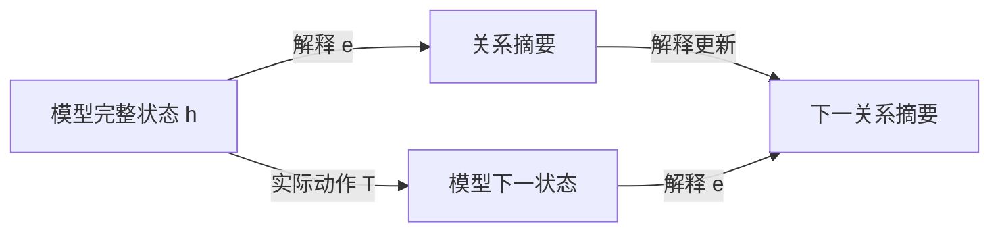

# FIB ATOM 与机器学习白盒性：五窗、关系交互与递归解释

> **参考输入。** 本卷是 [Fibonacci 原子关系生成卷](FIBONACCI_ATOMIC_RELATION_GENERATION.md) 与 [机器学习卷](CONTEXTUAL_SPACETIME_ARITHMETIC_ML.md) 的姊妹卷，给出普通数学推导与模型解释；本文新增综合尚未整体经 Lean 内核核验，不以理论文字承担形式化真值。正文聚焦五种局部窗口怎样形成可执行的解释，不预设一般神经网络已经学会这套结构。

## 1. 白盒问题要先说清解释什么

机器学习用数据选择模型的参数，使模型对指定输入产生需要的输出。选择过程可以写成更新 $\theta^+=U(\theta,\text{数据},\text{优化器状态})$；使用过程则是 $y=f_\theta(x)$，或者带记忆的 $h^+=T_\theta(h,x)$、$y=o_\theta(h)$。解释学习过程和解释使用过程，面对的状态与动作并不相同。

能查看权重和程序，提供了实现访问权。进一步给一个小表示 $e(h)$，能够计算指定输出、预测允许干预的结果，并逐步更新自身，才得到了相应任务的动态解释。人能否理解这些坐标、计算是否划算、解释的预测是否符合现实，又是另外的要求。

| 解释范围 | 要回答的问题 | 尚不能由此推出的性质 |
| --- | --- | --- |
| 实现可见 | 参数、算子、缓存是什么 | 已找到简洁机制 |
| 当前预测充分 | 这个输入为什么得到这个输出 | 新输入、干预与下一步训练仍正确 |
| 动态机制充分 | 改输入、续接或允许干预后怎样变化 | 解释坐标有唯一的人类语义 |
| 学习过程充分 | 换批次、继续训练时怎样变化 | 泛化、可靠性或价值选择必然正确 |

本卷以可计算的小系统解释这些区别。FIB ATOM 提供的核心材料是：有限的局部模式、有约束的组合、可展开的块、关系记录，以及对未来操作闭合的状态。它们给出白盒设计与检验的方法，不给任意网络指定一种普适的五分类。

## 2. 用户五分类的准确含义

**定义 2.1（低位到高位的五窗）。** 固定三个位权 $(2,3,5)$，位串记为 $b=(b_1,b_2,b_3)$，要求

$$
b_1b_2=b_2b_3=0,\qquad b_i\in\{0,1\}.
$$

于是局部字母表为

$$
\Sigma=\{000,100,010,101,001\}.
$$

| FIB 标签 | 位串 | 所选位置 | 初始窗口读数 |
| --- | --- | --- | --- |
| null | 000 | 空集 | 0 |
| 2 | 100 | 第一个位置 | 2 |
| 3 | 010 | 第二个位置 | 3 |
| 2 5 | 101 | 第一、第三个位置共同成块 | 7 |
| 5 | 001 | 第三个位置 | 5 |

原卷 §57 按高到低的 $(b_5,b_3,b_2)$ 写字面位串，下标表示对应位权；本文采用原卷 §§104、141 的低到高坐标。反转映射 $\rho(x,y,z)=(z,y,x)$ 保持所选位置集合：原卷 §57 的 `001` 对应本文的 `100`，都选择位权 2；该节的 `100` 对应本文的 `001`，都选择位权 5。`000`、`010`、`101` 在反转下不变。

五来自三位中禁止相邻占位。换成四位窗口就有八个合法模式；一般长度 $k$ 的模式数为 $F_{k+2}$，由“首位零后剩 $k-1$ 位、首位一后次位必须零而剩 $k-2$ 位”的递推得到。

下一组三位权是 $(8,13,21)$，五种模式仍在，读数却变成 $0,8,13,29,21$。局部组合语法与数值素性是两件事。跨窗还要检查接缝，`null` 消耗三个位置，不能视作结束或无操作。

在机器学习中，可以把这五类作为明确语法下的输入类别，或作为一个待验证的解释字典；不能从“五类”直接推出五个神经元、五个潜在因子或五态控制器。

按位置集合的包含序，非零原子只有三个单例；`101` 是复合模式，`000` 是空模式。五窗作为不可再切的读取字母，是指定窗口长度后的语法约定。关系任务中不能删除的区别，则要由任务和未来操作给出证据，不能只靠“原子”这个名称判定。

## 3. 五窗上的完整特征代数

**命题 3.1（五个合法点的交互展开）。** 任意函数 $f:\Sigma\to\mathbb R$ 唯一写成

$$
f(b)=c_0+c_1b_1+c_2b_2+c_3b_3+c_{13}b_1b_3.
\tag{3.1}
$$

其系数为

$$
\begin{aligned}
c_0&=f(000),\\
c_1&=f(100)-f(000),\\
c_2&=f(010)-f(000),\\
c_3&=f(001)-f(000),\\
c_{13}&=f(101)-f(100)-f(001)+f(000).
\end{aligned}
\tag{3.2}
$$

证明。依次代入空点和三个单点得到前四个系数；最后代入 $101$ 得到第五个。五点上的值全部恢复，且任何表示都被这些代入强制，故存在且唯一。$\square$

这里的五是合法域上函数空间的维数；一种固定线性特征字典要表示所有实值任务，至少需要五个线性独立特征。这不禁止用一个整数编码五个输入，再用非线性查表解码，也不规定一个给定任务必须使用全部五项。

**解释 3.2（相互作用相对于任务）。** $c_{13}$ 比较“共同出现的效果”与“分别出现的效果之和”。它为零当且仅当该任务在这五个点上没有超出常数和单项的贡献。例如：

$$
f_{\mathrm{sum}}(b)=2b_1+3b_2+5b_3
\quad\Longrightarrow\quad c_{13}=0;
$$

$$
f_{\mathrm{joint}}(b)=b_1b_3
\quad\Longrightarrow\quad c_{13}=1.
$$

相同的 FIB 结构，对加法读数没有交互修正，对共同出现任务却必须保留交互。这比给 `101` 贴上“复杂特征”标签更具体：有一条可计算、可反驳的等式。

由于本域上 $b_1b_2=b_2b_3=b_1b_2b_3=0$，这些特征的系数无法由合法域数据识别，也不影响域内任何输出。若另外开放 `110` 等输入，已经扩展了任务域；此时旧解释在域外的延拓不是唯一的。`101` 则本来合法，未采到它属于数据覆盖缺失，不能当成语法排除。

式（3.2）是给定输入坐标上的函数交互，不单独证明网络内部存在一个独立的交互模块，更不等于真实世界的因果效应。

## 4. 同块观察与解释系数是一对对偶坐标

**定义 4.1（合法块与共现记录）。** 设 $I$ 为有限位置集，$\mathcal A\subseteq2^I$ 非空且向下闭：$S\in\mathcal A,T\subseteq S$ 蕴含 $T\in\mathcal A$。无相邻占位的合法位置集满足此条件。一个有限块多重集给出重数 $m_S\in\mathbb N$。定义

$$
y_T=\sum_{S\in\mathcal A,\ T\subseteq S}m_S,
\qquad T\in\mathcal A.
\tag{4.1}
$$

$y_T$ 数的是多少个块同时包含 $T$，不是等价关系分块的布尔位。这里允许不同块重叠、重复；两个位置同现的次数一般不能决定三个位置共同出现的次数。$y_\varnothing$ 是块总数。

**命题 4.2（块函数与共现记录的精确配对）。** 给任意 $f:\mathcal A\to\mathbb R$，置

$$
c_T=\sum_{U\subseteq T}(-1)^{|T|-|U|}f(U).
$$

则

$$
f(S)=\sum_{T\subseteq S}c_T,
\qquad
\boxed{\sum_{S\in\mathcal A}m_Sf(S)
=\sum_{T\in\mathcal A}c_Ty_T.}
\tag{4.2}
$$

证明。第一式中 $f(U)$ 的合并系数为 $\sum_{U\subseteq T\subseteq S}(-1)^{|T|-|U|}$，$U=S$ 时为一，否则由二项式展开为零。向下闭保证所用 $f(U)$ 均有定义。第二式把有限和交换次序，再用式（4.1）。$\square$

这是有限集合 Möbius 反演的应用。FIB 卷 §62 从共现记录恢复块重数；这里从块函数恢复解释系数。二者通过式（4.2）相接：**关系记录说明共同发生了什么，任务系数说明这种共同发生对输出有什么贡献。** 有限配对并未假设块统计独立。

若 $c_\varnothing=f(\varnothing)\ne0$，必须保留 $y_\varnothing$ 的总块数贡献。这套无序统计不保存窗口次序、位置权重或接缝；第6、7节的递归任务还需要相应状态，不能仅由这些计数恢复。

**实例 4.3（7 与 10 的白盒差异）。** 沿用 FIB 卷 §58，只允许四个非空块 $[2],[3],[5],[2+5]$，重数分别为 $a_2,a_3,a_5,a_7$。记

$$
u=a_2+a_7,\qquad v=a_3,\qquad w=a_5+a_7,\qquad\kappa=a_7.
$$

若块内相加、块间相乘，则

$$
N=2^{u-\kappa}3^v5^{w-\kappa}7^\kappa,
\qquad 0\le\kappa\le\min(u,w).
$$

对每块的值取对数，使乘法总任务变为式（4.2）的加法任务，得到

$$
\boxed{\log N=u\log2+v\log3+w\log5
+\kappa\log\frac7{10}.}
\tag{4.3}
$$

空块在这个乘法例中不计入；为使用完整五点展开，可约定它的块因子为一、对数读数为零。这是乘法单位合同，不是把数值零的 `null` 拿来相乘。

$[2+5]$ 与 $[2][5]$ 有相同 $(u,v,w)=(1,0,1)$，却分别给 $N=7,10$。共同成块项的系数恰为 $\log7-\log2-\log5$。因此，删除 $\kappa$ 后，任何只对叶计数做后处理的模型都不能准确恢复这两个结果。

固定 $(u,v,w)$、允许全部上述合法重数组合时，$\kappa=0,\ldots,\min(u,w)$ 全可实现。因 $7/10\ne1$，这些 $N$ 两两不同，补充记录至少需要 $\min(u,w)+1$ 个值；记录 $\kappa$ 达到下界。若另加有限重数盒，须重新计算实际纤维，不能沿用这个全区间计数。

## 5. 训练能拟合单项，却没有识别关系

**定义 5.1（五窗线性解释模型）。** 取

$$
\phi(b)=(1,b_1,b_2,b_3,b_1b_3),\qquad
f_\theta(b)=\langle\theta,\phi(b)\rangle,
\quad\theta\in\mathbb R^5.
$$

训练集覆盖 $000,100,010,001$，但没有 $101$，损失为这些点上的平方误差。令 $e_{13}=(0,0,0,0,1)$。

**命题 5.2（缺少合法联合样本的识别缺口）。** 对任意 $t\in\mathbb R$，$\theta$ 与 $\theta+te_{13}$ 在全部训练点上预测相同，且整个训练损失相同；在 $101$ 上相差 $t$。四个训练行线性独立，故这个训练读数的参数核恰为 $\mathbb Re_{13}$。

证明。训练点的最后一个特征全部为零；空点及三个单点分别确定偏置和三个单项系数。联合点的最后一项是一。$\square$

即使训练误差为零，这个关系方向也没被数据决定。最小范数、稀疏性或初始化可以选定一个系数，但该选择是归纳偏置；没有新增数据或结构假设时，不能把它说成真实交互已经被识别。

这里的不可识别针对旧四模式的读数权限。黑盒若允许查询全部五个模式，同样可以由式（3.2）计算交互；白盒若允许读取参数，可以直接读出模型选取的 $c_{13}$。两者都还需区分“当前模型的系数”与“数据已经识别的真实目标系数”。

**命题 5.3（新联合样本使隐藏方向反馈到旧任务）。** 从相差 $te_{13}$ 的两组参数出发，对同一个新样本 $(101,y)$ 做一次同步的欧氏梯度下降，损失为 $\tfrac12(f_\theta(101)-y)^2$、步长同为 $\eta$，无正则、动量或额外更新项。更新后参数差为

$$
\Delta\theta^+=t(e_{13}-\eta\phi(101)).
\tag{5.1}
$$

因而旧空点上的预测差变为 $-\eta t$。若 $\eta t\ne0$，它们已不在旧训练读数的同一纤维。

证明。两组参数在新样本上的残差相差 $t$，梯度相差 $t\phi(101)$；从原参数差中减去步长乘梯度差得式（5.1）。空点只读取偏置，取第一坐标即得。$\square$

**解释 5.4（反馈取决于特征与优化规则）。** 对一般线性特征模型，一次上述更新使任意输入 $x$ 的输出变为

$$
f^+(x)=f(x)-\eta(f(z)-y)K(x,z),\qquad
K(x,z)=\langle\phi(x),\phi(z)\rangle.
\tag{5.2}
$$

五窗交互字典满足 $K(000,101)=1$，旧空点输出的改变量为 $-\eta(f(101)-y)$，该量非零时输出改变。改用五模式的独热坐标 $\psi(b)=e_b$，并在该坐标做欧氏梯度下降，则 $K(x,z)=\mathbf1_{x=z}$，新 $101$ 样本不改变旧四模式。两套特征都能表达所有五点函数，却产生不同学习动态。这里的反馈由表示与优化度量共同决定，不是 FIB 语法对所有学习算法的强制结论。

取 Fibonacci 读数 $q(u,v)=2u+3v$ 与推进 $M(u,v)=(v,u+v)$，有 $q(3,-2)=0$、$q(M(3,-2))=-1$。它与命题5.3共享一个可核对的机制：原观察的核不被新增动作保持。后者的动作是读入一个合法联合样本并学习；没有要求神经网络的更新矩阵等于 Fibonacci 矩阵。

## 6. 五种输入，却只需四个结构状态

**定义 6.1（接缝与 End 任务）。** 逐窗按低位到高位读取。状态记录上一位 $s\in\{0,1\}$ 和上一窗是否非零 $E\in\{0,1\}$。若 $s b_1=1$，接缝非法并进入吸收失败态；否则更新为

$$
(s^+,E^+)=(b_3,\mathbf1_{b\ne000}).
\tag{6.1}
$$

End 是一次结束查询，成功当且仅当当前 $E=1$。取无单位位的初态 $(s,E)=(0,0)$，故空串不接受。该模型只检查结构，不输出数值，也不保留全部历史。它是原卷 §104 的初始化取单位位零时的结构部分。

End 不属于可继续读取的窗口字母表。若把它改成输入字母，并要求拒绝 End 后的所有输入，则须另计终止后的接收态；下述四态数只针对窗串及其终端查询。

**命题 6.2（四态结构解释）。** 所有可达结构状态恰为

$$
A=(0,0),\quad B=(0,1),\quad C=(1,1),\quad D=\mathrm{fail}.
$$

其转移表为：

| 当前状态 | null / 000 | 2 / 100 | 3 / 010 | 2 5 / 101 | 5 / 001 | End 成功 |
| --- | --- | --- | --- | --- | --- | --- |
| A | A | B | B | C | C | 否 |
| B | A | B | B | C | C | 是 |
| C | A | D | B | D | C | 是 |
| D | D | D | D | D | D | 否 |

这四态在确定性、只读后续窗并最终询问 End 的模型中同时充分且最小。

证明。式（6.1）给出表，每个合法窗满足 $b_3=1\Rightarrow b\ne000$，故 $(1,0)$ 不可达。$A$ 初始可达，$100$ 到 $B$，$001$ 到 $C$，$001,100$ 到 $D$。End 区分 $A$ 与 $B,C$，也区分 $D$ 与 $B,C$；续接 $100$ 后 End 区分 $B,C$；续接 $010$ 后 End 区分 $A,D$。所以四态两两有未来见证，任意准确实现至少四个可达状态。表给上界。$\square$

这是一张完整的小白盒：不仅说“模型记得接缝”，还列出它怎样记、怎样更新、每份记忆为什么不能再删。五个输入标签、四个行为状态、五维局部函数空间，是三个不同的数量。

`null` 从 $B$ 到 $A$ 会改变能否 End；从 $C$ 到 $A$ 还会解除接缝限制。把它解释成“什么都没发生”，会同时错判两种未来。

## 7. 数值任务需要额外递归状态

**定义 7.1（同一低位扫描中的数值接口）。** 承接第6节，固定单位位 $\varepsilon=0$。当前累计值为 $r$，当前窗前两个位权为 $u,v$，第三个位权为 $u+v$。初始 $(r,u,v)=(0,2,3)$。在合法读窗后，按表加入数值：

| 窗口标签 | 累计值增量 $d_b(u,v)$ |
| --- | --- |
| null | 0 |
| 2 | $u$ |
| 3 | $v$ |
| 2 5 | $2u+v$ |
| 5 | $u+v$ |

同时更新

$$
r^+=r+d_b(u,v),\qquad
\binom{u^+}{v^+}
=\begin{pmatrix}1&2\\2&3\end{pmatrix}\binom u v.
\tag{7.1}
$$

三步位权推进就是 $M^3$，其中 $M=\begin{pmatrix}0&1\\1&1\end{pmatrix}$。接缝、End 按第6节更新。合法 End 返回 $r$，其余返回失败标签。对输入窗数归纳，$(r,u,v,s,E)$ 因而给完整数值任务的闭合接口。

这里坚持低位到高位扫描。原卷 §236 的高位到低位 Horner 写法把三步推进作用于累计组成，接缝方向也相反；不能直接拿那张公式替换式（7.1）。

**命题 7.2（有限结构记忆不等于有限数值记忆）。** 四态结构接口不足以恢复任意长度的合法且可 End 窗串的精确整数值。这里的候选是固定初态、只读窗串的确定性状态实现：每个窗口字母对应一个固定状态转移，End 输出仅由当前状态决定，不另获免费的外部时钟、位置、输入历史访问或累计寄存器。若它对所有有限合法且可 End 的窗串均精确输出整数值，则需要无限多个可达状态。

证明。连续读 $k\ge1$ 个 $100$ 窗，每条接缝合法，End 成功，结构态全为 $B$；累计数值为

$$
\sum_{j=0}^{k-1}F_{3j+3}.
$$

各项正，随 $k$ 严格增加。因此这些历史必须占不同的输出状态。$\square$

若任务只要模 $m\ge2$ 的输出，把 $(r,u,v)$ 全部模 $m$ 化，配三个合法结构态和一个失败态，得到至多 $3m^3+1$ 个状态的准确上界。并未证明这些组合全可达或彼此不可合并。读取位置若由外部提供，$u,v$ 可按位置计算，但位置与计算费用必须另记。

**解释 7.3（五窗递归与神经状态）。** 一个学习模型可以用很多神经元实现四态结构解释，也可以用很少的实数坐标编码更大甚至无限的状态族。神经元数、可区分状态数和存储位数不能互相替代。FIB 的有限窗口提供的是局部语法；递归深度和数值精度仍会增加任务负担。

## 8. 从手写白盒到学习模型，需要交换关系

**定义 8.1（指定任务的解释合同）。** 设学习模型在已声明的可达载体 $H$ 上运行，操作 $a$ 的部分更新为 $T_a:D_a\to H$，所需读数为 $o$。解释 $e:H\to Q$ 的值域取实际像，要求有读出 $\bar o$、合法域 $\bar D_a$ 和更新 $\bar T_a$ 满足

$$
\begin{aligned}
o(h)&=\bar o(e(h)),\\
h\in D_a&\Longleftrightarrow e(h)\in\bar D_a,\\
e(T_a h)&=\bar T_a(e(h))\quad(h\in D_a).
\end{aligned}
\tag{8.1}
$$

来源、允许查询、干预和记录要求均固定在合同里。操作后仍须落在 $H$，或明确扩大载体；比较同一高层干预的不同低层实现时，另需给出相容的干预映射。

逐词归纳可知式（8.1）保持全部合法性与输出。反向，解释值相同但某个未来结果不同，就否定该解释对相应动作族的充分性。仓内 `TargetRecoveryCriterion`、`DynamicClosureMinimality`、`ControlledBehaviorUniversality` 分别提供目标纤维、动态细化和有限实现的相关接口；使用时仍须满足各自前件。

图的两条路径得到相同摘要，是一个可检验的承诺。给隐藏状态训练一个能读出“接缝位”的探针，仅验证了解码的一部分；还应检验模型遇到 $100$、$001$、`null` 时，探针读数是否按第6节转移，并检验实际输出。

手写出正确的四态自动机，证明的是这项任务有一个白盒实现。要说已训练的网络具有这个机制，还需构造并验证该网络上的 $e$。有限测试没找到反例，只说明相应测试集上未找到反例。

## 9. 同一预测函数，也可以有不同学习未来

**实例 9.1（两层模型的参数纤维）。** 对标量两层线性模型

$$
f_{a,b}(x)=abx,\qquad w=ab,\qquad s=a^2+b^2,
$$

用固定损失 $\ell(w)$、步长 $\eta$ 做同步欧氏梯度下降。记 $g=\ell'(w)$、$\alpha=\eta g$。原 ML 卷 §9 的公式给

$$
\begin{aligned}
a^+&=a-\alpha b,& b^+&=b-\alpha a,\\
w^+&=(1+\alpha^2)w-\alpha s,&
s^+&=(1+\alpha^2)s-4\alpha w.
\end{aligned}
\tag{9.1}
$$

后两式分别由乘积和平方和展开得到。$w$ 足以解释固定参数下全部输入的预测，却一般不足以解释下一次训练。以 $\ell(w)=w^2/2,\eta=1/10$ 为例，

$$
(a,b)=(1,1),\ (2,1/2)
$$

都有 $w=1$，但 $s=2,17/4$，下一步 $w^+$ 分别是 $81/100,117/200$。

这个训练任务至少必须补充能区分上述两个 $s$ 值的信息；加入 $(w,s)$ 后式（9.1）闭合，并不要求所有准确编码都把该坐标命名为 $s$。固定损失与更新规则是结论的一部分，动量、Adam、不同坐标的优化度量或新的参数干预会改变合同。若 $g=0$ 且后续始终无新任务，参数可驻定，不应宣称所有纤维差异都必然显现。

这个例子与第5节互补：第5节保持同一参数化而扩大训练数据，第9节保持同一预测函数而比较不同参数因子。二者都要求解释学习时保留未来会反馈到输出的隐藏区别。

## 10. 关系原子不等于一个神经元

**解释 10.1（坐标变化与同一行为）。** 对两层线性网络 $f(x)=W_2W_1x$，任意可逆隐藏换基 $A$ 给

$$
W'_1=AW_1,\qquad W'_2=W_2A^{-1},\qquad
W'_2W'_1=W_2W_1.
$$

因此内部坐标名称和逐坐标激活值不由输入输出函数唯一决定。一般非线性网络不能随意用这个全可逆换基；例如 ReLU 只在相应置换、正缩放等确实保持运算的变换下适用。第9节还说明，保持当前函数的重参数化不自动保持欧氏训练动态。

若低层干预是“将某个神经元归零”，换基后应运输同一个干预算子；换成“仍把第一个坐标归零”通常已换了实验。任务相对的行为商规范，不代表一套神经元分工、一个最稀疏字典或一个人类概念命名也规范。

**实例 10.2（能读出概念，不等于该坐标在被使用）。** 令隐藏态 $h=(x,x)$，输出 $y=h_1$。两个坐标都能完美预测 $x$；在这个实现中将 $h_2$ 置零却不改变输出。探针的成功证明信息可解码，未证明输出通过该坐标产生。

消融后没有变化也不能一般推出关系无作用：冗余路径、饱和区、错误的干预范围都可能遮蔽变化。应固定允许的替换与背景，比较实际输出，并核对式（8.1）；不要把任意离开可达像的激活拼接当作自然数据的反事实。

FIB 的 $101$ 给一个有来源的联合特征；稀疏自编码器中的一个激活方向还取决于数据支撑、字典规范和优化目标。[白盒纤维律卷](WHITE_BOX_LOSS_FIBER_LAW.md)第4章的特征吸收实例说明，重构和稀疏性可以偏好共同出现的方向；它们不自动把真实生成因子逐一恢复。

**约定 10.3（五窗与原子语义保持分层）。** 用户所指的五分类就是第2节的五个合法窗口。本卷为解释而区分的语义层次——语法叶、可展开封装、数量乘法素元、操作不可约结构、任务行为区别——是一份概念表，并非原卷既有的五分类，也不与五个窗口逐项对应。`null` 尤其不是一个素元；`2 5` 也不自动是一种独立神经机制。称某个区别为“关系原子”，须至少附上任务、允许操作、它被合并时的错误见证；这仍不声称有唯一的生成元分解。

## 11. 怎样把解释变成可检验的学习任务

一个具体的 FIB 白盒实验可以同时保留三类目标，而不是只训练一次五分类：

1. **局部语义**：输出五窗类别、数值或 $b_1b_3$；用式（3.2）测量交互系数，并明确是否覆盖 $101$。
2. **递归结构**：预测下一窗是否合法以及能否 End；比较模型摘要与第6节四态转移，特别测试 `null` 和非法接缝。
3. **数值行为**：预测指定精度下的累计值；检验式（7.1），比较同结构态、不同数值态的历史。

这些目标不要求模型使用同一份最小表示。若还要解释训练，把优化器记忆、批次输入和参数状态并入合同，用第5、9节的成对实例测试当前解释是否闭合。

**判据 11.1（恢复与分离）。** 候选解释要被称为某个有限确定性任务的最小准确实现，需要两类证据：所有实际状态和动作上成立的恢复、保域与更新等式，以及每对不同可达解释状态的未来区分词。前者排除错误合并，后者排除冗余。第6节四态表同时给了这两类证据。

如果学习网络的可达隐藏态尚未被完整刻画，抽取出的有限表不能单独替网络通过前一项。可以证明一个覆盖可达态的归纳不变量，再逐动作验证；只有样本检验时应报告样本范围与反例，不能把长串泛化准确率改称全域证明。

近似解释还需指定度量、误差和允许时域。若 $L\ge0$、$\varepsilon\ge0$，且状态误差满足 $e_{t+1}\le Le_t+\varepsilon$，则 $e_t\le L^te_0+\varepsilon\sum_{j=0}^{t-1}L^j$；但接缝、End 这样的离散判定还需守卫裕量或精确的标签保持。数值接近不自动保证走相同分支。相关完整条件见 ML 卷 §§21、25–26。

## 12. 本卷提供的连接与尚未取得的结果

FIB 五窗给出的学习对象可写为

$$
\boxed{\text{合法局部模式}
\ \longrightarrow\ \text{单项与关系交互}
\ \longrightarrow\ \text{带接缝的递归状态}
\ \longrightarrow\ \text{指定任务的动态解释}.}
$$

五点函数展开与同块记录的配对是这里的具体桥梁：$c_{13}$ 描述任务对共现的响应，$\kappa$ 描述实际共现次数。缺失联合训练样本留下未识别方向；新增联合样本能让这个方向反馈到旧预测。结构任务具有四态解释，精确无界数值任务则不能由四态承担。

这些内容既不证明任意大型网络已有短小的全局解释，也不证明 FIB 坐标在真实学习任务上优于其他表示。本文没有训练神经网络、测量泛化收益或完成一般因果抽象的提取算法。尚待研究的具体问题是：在选定模型与干预族上，能否实际提取满足式（8.1）的低成本表示；哪些关系必须保留；超出有限窗口后需要增加哪些状态。

## 13. 来源与核验范围

| 来源 | 本卷使用的内容与边界 |
| --- | --- |
| [FIB 原卷](FIBONACCI_ATOMIC_RELATION_GENERATION.md) §§57–58、62、104、141、236–237 | §57 提供高到低位序的数值窗口，§§104、141 提供本文采用的低到高位序合同，二者经反转对应；另复用块重数与 $\kappa$、接缝和三步递归，不从素数或共同谱推断学习能力 |
| [ML 卷](CONTEXTUAL_SPACETIME_ARITHMETIC_ML.md) §§2–3、9、13、19、21 | 任务充分性、两层训练闭包、优化器状态、因果干预与近似误差；第9节公式在这里直接复用 |
| [白盒纤维律卷](WHITE_BOX_LOSS_FIBER_LAW.md) §§3–4 | 训练读数纤维与特征吸收；不将线性或特定字典结论外推到所有网络 |
| [LiteralWindowEnd.lean](../../../D5/S3/Arith/FibonacciAtomic/LiteralWindowEnd.lean) 的 `Window`、`bits`、`step`、`execution` | 五个实际构造子、部分语言的失败总化与 End；第6节四态最小性是本文针对结构子任务的推导，不冒称源码已逐字给出 |
| [DynamicClosureMinimality.lean](../../../D5/S3/ConceptDynamics/Interventions/DynamicClosureMinimality.lean) | 动态闭包及其最小细化接口；实际网络的闭合前件仍需验证 |
| [TargetRecoveryCriterion.lean](../../../D5/S3/ConceptDynamics/Restoration/TargetRecoveryCriterion.lean) | 目标在观察纤维上常值的恢复判据；不提供缺失实验数据 |
| [Geiger 等，Causal Abstraction](https://www.jmlr.org/papers/v26/23-0058.html)，JMLR 26(83) | 因果抽象需要状态和干预的对应；平均干预准确率不等于全域精确抽象，库内来源见 [条目](../../../Library/Dynamics/geiger2025causal.md) |
| [Elhage 等，Toy Models of Superposition](https://arxiv.org/abs/2209.10652)；[Chanin 等，A is for Absorption](https://arxiv.org/abs/2409.14507) | 分布式特征与特征吸收的相关研究背景；不充当本文五窗定理或任意网络解释成功的证据 |

五点展开、有限集合 Möbius 反演、自动机剩余行为及梯度代数均属成熟工具。本卷提供它们在固定 FIB 任务上的综合应用，不宣称这些工具原创。新增综合的证据是所列普通证明；没有新增冻结声明，也未把有限检查提升为全称 Lean 核验。

## 追加锚（本行以下为增补区）

## 14. 固定任务后的风险分解与表示细化

**定义 14.1（平方损失比较合同）。** 固定有限支撑的联合分布 $(X,Y)$，其中 $Y\in\mathbb R$；完整输入为 $X$，表示为 $Z=e(X)$，损失为 $(Y-h(Z))^2$。读出类 $\mathcal H$ 是预先规定的非空实值函数类，实际读出 $\widehat h\in\mathcal H$。表示取得、读出计算、训练标签及允许动作的资源合同也须固定。以下期望均对同一联合分布计算；若读出由随机训练集产生，先固定一次训练所得的读出，再按需对训练随机性取期望。

只在正概率纤维上定义条件均值，零概率处的值任取。记

$$
\begin{aligned}
m(X)&=\mathbb E[Y\mid X],& m_e(Z)&=\mathbb E[Y\mid Z],\\
N&=\mathbb E[(Y-m(X))^2],& I&=\mathbb E[(m(X)-m_e(Z))^2],\\
A&=\inf_{h\in\mathcal H}\mathbb E[(m_e(Z)-h(Z))^2],&
B&=\mathbb E[(m_e(Z)-\widehat h(Z))^2]-A.
\end{aligned}
\tag{14.1}
$$

本节 $N$ 是相对完整输入 $X$ 的标签噪声，与第4节的整数读数符号分别使用；$I$ 是表示遗漏的条件均值信息，$A$ 是读出类的逼近缺口，$B$ 是实际读出的总体类内超额。有限支撑使各个实值读出的风险有限；不要求 $\mathcal H$ 有最优元、凸性或线性结构。

**命题 14.2（四项非负分解）。** 在定义14.1的合同下，实际风险满足

$$
R(\widehat h):=\mathbb E[(Y-\widehat h(Z))^2]=N+I+A+B,
\qquad N,I,A,B\ge0.
\tag{14.2}
$$

证明。逐个正概率的 $X=x$ 纤维有 $\mathbb E[Y-m(X)\mid X=x]=0$；因此 $Y-m(X)$ 与任意 $X$ 的函数的乘积期望为零。又因 $Z=e(X)$，逐个 $Z=z$ 纤维求和得 $\mathbb E[m(X)\mid Z]=m_e(Z)$，故 $m(X)-m_e(Z)$ 与任意 $Z$ 的函数正交。展开

$$
Y-\widehat h(Z)=(Y-m(X))+(m(X)-m_e(Z))+(m_e(Z)-\widehat h(Z))
$$

的平方，三个交叉项分别由上述两种纤维求和消去，得到 $N+I+\mathbb E[(m_e-\widehat h)^2]$。加减 $A$ 得式（14.2）。前三项是平方期望或其非空类下确界；由 $\widehat h\in\mathcal H$，最后一项也非负。$\square$

$B$ 不一概是“优化残差”：未知目标的样本识别不足也能让经验最优读出具有正的 $B$。对给定非空训练集，令 $\widehat R$ 为经验平方风险。若 $\delta=\sup_{h\in\mathcal H}|R(h)-\widehat R(h)|<\infty$，则有

$$
\begin{aligned}
B&=R(\widehat h)-\inf_{h\in\mathcal H}R(h)\\
&\le \widehat R(\widehat h)-\inf_{h\in\mathcal H}\widehat R(h)+2\delta.
\end{aligned}
\tag{14.3}
$$

证明。由 $|R-\widehat R|\le\delta$，有 $R(\widehat h)\le\widehat R(\widehat h)+\delta$；又对任意 $h\in\mathcal H$ 有 $\widehat R(h)\le R(h)+\delta$，取下确界得 $\inf\widehat R\le\inf R+\delta$。两式相减即得，无需下确界可达。$\square$ 这只给总体超额的上界；经验优化差降低，不单独保证总体风险严格降低，也未给出 $\delta$ 的概率估计。

**命题 14.3（细化表示的精确收益）。** 设 $e=r\circ e'$，并允许各表示上的全部实值读出。记 $R_*(e)=\inf_h\mathbb E[(Y-h(e(X)))^2]$。则

$$
R_*(e)-R_*(e')=
\mathbb E\!\left[(\mathbb E[Y\mid e'(X)]-\mathbb E[Y\mid e(X)])^2\right].
\tag{14.4}
$$

严格改善当且仅当两个条件均值以正概率不同。

证明。令 $m'=\mathbb E[Y\mid e'(X)]$、$m_e=\mathbb E[Y\mid e(X)]$。对各表示，纤维消交叉项给 $R(h)=\mathbb E[(Y-m_e)^2]+\mathbb E[(m_e-h)^2]$，故条件均值读出达到不限类的最优风险。因 $m'-m_e$ 是 $e'$ 的函数，$Y-m'$ 与它正交；展开 $Y-m_e=(Y-m')+(m'-m_e)$ 即得式（14.4）。有限分布中平方期望为正恰等价于非零差有正概率。$\square$

因此，仅对旧表示做确定性后处理 $\widetilde e=t\circ e$，不能降低不限类的最佳风险；它可以通过计算新的非线性特征改善受限线性可读性。第15节将给出信息不变而线性误差严格下降的实例。

**实例 14.4（共同成块信息的风险价值）。** 完整输入 $X$ 等概率取第4节的两个块配置 $[2+5]$、$[2][5]$，真实目标分别为 $Y=7,10$。旧表示只有叶计数 $(u,v,w)=(1,0,1)$，最佳读出恒为 $17/2$，其风险为

$$
\frac12(7-17/2)^2+\frac12(10-17/2)^2=\frac94.
$$

加入共同成块次数 $\kappa$ 后，两输入分别有 $\kappa=1,0$，可精确读出目标，风险为零。这里 $N=0$；不限类下旧表示的 $I=9/4$、$A=B=0$。$\kappa$ 必须从块的实际来源取得，不能由相同的旧叶计数算出；添加它改变信息取得合同。

解释对模型忠实也不保证模型对真实目标正确。例如 $X$ 等概率取 $0,1$、$Y=X$，模型恒预测零。一态解释对模型的任意输入查询都忠实，状态始终不变，但真实平方风险为 $1/2$。模型“好坏”只能相对于固定目标、分布、损失和资源比较；准确解释允许看清错误，并不自行消除错误。

## 15. 五窗上受限读出的精确误差

**命题 15.1（加性读出的最佳平方风险）。** 令 $X=b\in\Sigma$、$Y=f(b)$，其中 $f$ 是任意确定实值目标，$p_b=P(X=b)$。允许任意实系数的加性读出

$$
g(b)=a_0+a_1b_1+a_2b_2+a_3b_3.
$$

若四角 $000,100,001,101$ 都有正概率，$010$ 的概率允许为零，则

$$
\inf_g\mathbb E[(f(X)-g(X))^2]
=\frac{c_{13}^2}{S},\qquad
S=\frac1{p_{000}}+\frac1{p_{100}}+\frac1{p_{001}}+\frac1{p_{101}},
\tag{15.1}
$$

其中 $c_{13}=f(101)-f(100)-f(001)+f(000)$。加入交互 $b_1b_3$ 的第3节完整字典可把风险降为零；严格收益恰在 $c_{13}\ne0$ 时成立。

证明。按 $(000,100,010,101,001)$ 排列五点值，置 $d=(1,-1,0,1,-1)$。由命题3.1，加性读出类恰是超平面 $d\cdot g=0$：四个加性系数任取，而唯一缺少的系数就是 $d\cdot g$。对残差 $r=f-g$，因此有 $d\cdot r=c_{13}$。在四角上用加权 Cauchy–Schwarz 得

$$
c_{13}^2
=\left(\sum_{b:\,d_b\ne0}\sqrt{p_b}\,r_b\frac{d_b}{\sqrt{p_b}}\right)^2
\le S\sum_b p_b r_b^2.
$$

取四角残差 $r_b=c_{13}d_b/(p_bS)$，并取 $r_{010}=0$，则 $d\cdot r=c_{13}$，故 $g=f-r$ 属于加性类，且其风险等于 $c_{13}^2/S$，达到下界。完整字典由式（3.1）准确表达 $f$。$\square$

**实例 15.2（信息完整，线性读出仍有损失）。** 五窗均匀、$f(b)=b_1b_3$ 时，$c_{13}=1$、$S=20$，最佳加性风险为 $1/20$。上述最优读出的五点值为

$$
g=(-1/4,\ 1/4,\ 0,\ 3/4,\ 1/4),
\qquad g(b)=-1/4+b_1/2+b_2/4+b_3/2.
$$

输入位串本身是单射表示，$N=I=0$；这里的正误差属于受限读出项 $A$。从已有位串计算 $b_1b_3$ 没有增加信息，却扩展了线性读出空间并使 $A=0$。本命题允许任意实值预测；上面的负值说明若强制预测落在 $[0,1]$，不能直接沿用此最小二乘等号。

**命题 15.3（支撑与噪声边界）。** 若四角至少有一个不在正概率支撑上，加性类可拟合整个正概率支撑，确定目标的最佳风险为零。若标签有噪声且条件均值为 $f(b)=\mathbb E[Y\mid X=b]$，则四角均正时加性最佳风险为

$$
\mathbb E[\operatorname{Var}(Y\mid X)]+\frac{c_{13}(f)^2}{S};
\tag{15.2}
$$

缺角时只剩条件方差项。完整字典在两种情形下都达到条件方差项。

证明。缺角时先把 $g$ 在所有正概率点置为 $f$，其余缺点任填；选一个缺角，因对应 $d_b\ne0$，可只调整这个不计风险的值，使唯一约束 $d\cdot g=0$ 成立。这给出加性读出，不使用 $1/0$。有噪声时逐个 $X=b$ 纤维消交叉项，得 $\mathbb E[(Y-g)^2]=\mathbb E[\operatorname{Var}(Y\mid X)]+\mathbb E[(f-g)^2]$，再应用命题15.1或缺角构造。$\square$

## 16. 零训练误差之外的样本识别缺口

**定义 16.1（两目标识别合同）。** 已知真实目标属于

$$
f_\theta(b)=\theta\mathbf1_{b=101},\qquad\theta\in\{0,1\};
$$

其他四点的目标已知为零。训练数据 $D_n=((X_i,f_\theta(X_i)))_{i=1}^n$ 是 $n\ge0$ 个无噪声、独立同分布局部窗口样本；输入分布不依赖 $\theta$，且 $P(X=101)=p$。测试窗口独立于训练集并服从同一分布。算法仅获得 $D_n$、上述已知合同和与 $\theta$ 无关的随机性，允许任意实值预测；没有额外标签或读取真实 $\theta$ 的权限。

**命题 16.2（精确 minimax 风险）。** 对 $0<p<1$，在训练、算法随机性与独立测试窗口上取期望，有

$$
\inf_{\mathcal A}\max_{\theta\in\{0,1\}}
\mathbb E[(f_\theta(X)-\widehat f_{\mathcal A,D_n}(X))^2]
=\frac{p(1-p)^n}{4}.
\tag{16.1}
$$

证明。令 $E$ 为训练中未见 $101$ 的事件，$P(E)=(1-p)^n$。在 $E$ 上两种目标产生完全相同的训练记录分布，连同算法随机性也无法区分它们。设算法在 $101$ 上的实值预测为 $C$，对两目标等权平均，有

$$
\frac12\mathbb E[C^2+(1-C)^2\mid E]
=\mathbb E[(C-1/2)^2\mid E]+\frac14\ge\frac14.
$$

测试取 $101$ 的概率为 $p$，其余误差非负；两目标的最大风险至少为平均风险，故下界为 $p(1-p)^n/4$。达到下界的算法在其他点恒输出零：见过 $101$ 时读出其标签并准确预测，未见时在该点输出 $1/2$。两目标的风险都等于下界。$\square$

这份算法在每一份训练集上都零误差，却仍可有正测试风险；其预测也属于第5节的完整交互字典。故这里没有表示损失或函数类逼近损失，经验优化已完成，缺的是关于固定真实目标的识别信息。实值输出权限决定常数 $1/4$；若每份训练所得预测必须是两个候选函数之一且允许随机化，未见时等概率选择给出并达到常数 $1/2$。

**推论 16.3（采样与合法查询的识别收益）。** 在 $0<p<1$ 下，每增一个同分布样本，式（16.1）的风险严格乘以 $1-p$。若另有权限向同一个固定真实目标查询合法窗口 $101$ 的无噪声标签，一次查询即识别 $\theta$，使所有五点的预测风险为零。

证明。前者直接比较相邻 $n$ 的公式；后者由 $f_\theta(101)=\theta$，其余值已知为零。$\square$

该查询取得真实目标标签；查询模型自身的预测不提供这份识别信息。标签来源、主动查询权限及其取得成本须另列，不能把新增权限当作免费算法改进。边界为：$p=0$ 时测试风险始终为零但 $\theta$ 未必识别；$n=0$ 时任意 $p$ 的 minimax 风险为 $p/4$；$p=1,n\ge1$ 时首样本已识别目标，风险为零，避免把 $0^0$ 当作推导步骤。

局部窗口独立采样的合同不自动等于第6节带接缝的合法窗串分布。序列中的窗口可以相关，选择机制也能改变未见事件概率；没有该合同便不能把 $(1-p)^n$ 用于序列风险。

## 17. 两层训练：平衡操作与状态反馈

本节承接第9节，只讨论精确实数标量参数、已知损失 $\ell(w)=w^2/2$ 和同步欧氏梯度下降；没有动量、正则、额外参数更新或数值舍入。先取固定步长 $\eta>0$，记一次更新为 $G_\eta$。

**命题 17.1（固定步长的一步下降判据）。** 对 $w=ab\ne0$、$s=a^2+b^2$，有

$$
w^+=w(1-\eta s+\eta^2w^2),\qquad
\ell(w^+)<\ell(w)
\quad\Longleftrightarrow\quad
\eta w^2<s<\frac2\eta+\eta w^2.
\tag{17.1}
$$

证明。式（9.1）代入 $g=w$ 给第一式；严格下降等价于 $|1-\eta s+\eta^2w^2|<1$，将两个严格不等式分别移项即得。$\square$ 当 $w=0$ 时损失已经为零，无严格下降。

同为 $w=1,\eta=1/10$，平衡因子 $(1,1)$ 的下一步为 $81/100$；因子 $(10,1/10)$ 有 $s=10001/100$，下一步为 $-8991/1000$，其绝对值大于一，损失反而增加。因此相同预测函数与相同目标，不保证同一次训练有相同收益。

**命题 17.2（保持当前函数的平衡与收敛）。** 约定 $\operatorname{sgn}(0)=0$，定义参数操作

$$
\operatorname{Bal}(a,b)=
(\sqrt{|w|},\operatorname{sgn}(w)\sqrt{|w|}),\qquad w=ab.
$$

它保持乘积 $w$，使 $s=2|w|$。平衡后做一步固定步长下降，得到

$$
w^+=F_\eta(w):=w(1-\eta|w|)^2.
\tag{17.2}
$$

若 $0<\eta|w_0|<2$，一次初始平衡后的连续梯度下降严格降低每个非零步的损失，并有 $w_t\to0$；若到达零则保持零。

证明。平衡乘积为 $w$，平方和为 $2|w|$，代入式（17.1）得式（17.2）。同步更新还满足

$$
(a^+)^2-(b^+)^2=(1-\eta^2w^2)(a^2-b^2),
$$

故一次平衡后 $a^2=b^2$ 永远保持，且 $s=2|w|$，无需每步重新平衡。令 $q_t=|w_t|$，则 $q_{t+1}=q_t(1-\eta q_t)^2$；在 $0<\eta q_t<2$ 内乘子严格小于一，故 $q_t$ 递减，始终小于 $2/\eta$，并有非负极限 $q_\infty$。连续性给 $q_\infty=q_\infty(1-\eta q_\infty)^2$。正的解只能是 $2/\eta$，而 $q_\infty\le q_0<2/\eta$，故极限为零。$\square$

取解释 $e(a,b)=ab$，该操作满足交换等式

$$
e\circ\operatorname{Bal}=e,\qquad
e\circ G_\eta\circ\operatorname{Bal}=F_\eta\circ e.
\tag{17.3}
$$

这给出修改动作恢复 $w$ 闭合的具体方式：执行“平衡后更新”，或者先进入并保持平衡子域。它并未使原来任意因子上的固定步长更新对 $w$ 闭合。平衡也不是处处最快：第9节的 $(2,1/2)$ 在同一步长下得到 $117/200$，其损失小于平衡所得 $81/100$ 的损失。

**命题 17.3（读取隐藏关系量的反馈收缩）。** 改用状态反馈合同：$s_t>0$ 时取 $\eta_t=1/s_t$ 并做同步欧氏更新；$s_t=0$ 时停止。则每个非停止步满足

$$
\begin{aligned}
w_{t+1}&=\frac{w_t^3}{s_t^2},&
s_{t+1}&=s_t-\frac{3w_t^2}{s_t}\ge\frac{s_t}{4}>0,\\
|w_{t+1}|&\le\frac{|w_t|}{4},&
\ell(w_{t+1})&\le\frac{\ell(w_t)}{16}.
\end{aligned}
\tag{17.4}
$$

因此 $\ell(w_t)\le16^{-t}\ell(w_0)$，从任意有限实参数出发都有 $w_t\to0$；初态 $s_0=0$ 时本来有 $w_0=0$，停止后视为保持零。

证明。由 $(|a|-|b|)^2\ge0$ 得 $s\ge2|w|$。在式（9.1）中代入 $g=w,\eta=1/s$，得到 $w^+=w^3/s^2$、$s^+=s-3w^2/s$。又 $w^2\le s^2/4$，故 $s^+\ge s/4$、$|w^+|\le|w|/4$，平方后得到损失界，归纳即得全程收缩。$\square$

此动作需要读取当前 $s=a^2+b^2$ 并计算一次倒数，固定步长合同已经换成状态反馈。闭合状态仍是 $(w,s)$：例如 $w=1$、$s=2$ 与 $s=17/4$ 的反馈下一步分别为 $1/4$ 与 $16/289$，所以 $w$ 独自不能决定该更新。白盒所见的隐藏关系量在这里成为控制资源，但计算精度和读取费用不由实数证明承担。

**命题 17.4（只读 $w$ 的步长不能统一保证下降）。** 若步长规则只依赖当前非零 $w$ 并选择 $\eta(w)>0$，且允许同一 $w$ 纤维的 $s$ 无界，则它没有对该纤维统一的一步下降保证。

证明。固定 $w\ne0$ 后步长是一个正数。取同纤维因子 $(a,w/a)$ 并让 $|a|$ 增大，$s=a^2+w^2/a^2$ 无界；可取 $s>2/\eta(w)+\eta(w)w^2$。式（17.1）的乘子于是小于 $-1$，损失严格增加。$\square$

这里优化目标已经明确为零，反馈证明不承担第16节中未知真实标签的识别义务；这些结论也不外推到一般网络、其他优化器或有限精度训练。

## 18. 从诊断量到可验证的研究路径

第14节的分解把误差定位到不同合同，第15、16、17节分别提供可计算收益。操作的成本应与收益一起比较：取得来源关系、增加读出特征、购买标签和读取训练状态不是同一种资源。

| 诊断量或障碍 | 对应操作 | 已证收益与条件 | 所需资源 |
| --- | --- | --- | --- |
| 旧表示合并了不同条件均值，$I>0$ | 从来源取得细化信息 | 不限读出时下降量恰为式（14.4）；两块配置补 $\kappa$ 下降 $9/4$ | 共同成块记录的取得与存储 |
| 四角均正且 $c_{13}\ne0$，加性类有 $A>0$ | 由位串计算并加入 $b_1b_3$ | 确定目标下降 $c_{13}^2/S$；均匀共同出现目标下降 $1/20$ | 一项交互特征及相应读出计算 |
| 两候选目标未被局部样本识别 | 增加一个同分布无噪声样本 | $0<p<1$ 时 minimax 风险乘 $1-p$ | 一个真实标签及采样成本 |
| 同一识别合同允许主动合法查询 | 查询固定真实目标的 $101$ 标签 | 一次查询使候选目标风险归零 | 主动查询权限与真实标签来源 |
| 固定步长不满足下降判据 | 保持函数的初始平衡 | $0<\eta|w_0|<2$ 时非零步严格下降并收敛；不保证每步最快 | 因子访问、乘积、平方根及参数写入 |
| 同预测纤维的 $s$ 无界 | 读取 $s$ 并取反馈步长 $1/s$ | 标量合同下每步损失至多原来的 $1/16$，无需初始平衡 | 当前平方和与一次倒数计算 |

若关注类内总体超额 $B$，式（14.3）要求同时检查经验优化差和总体—经验偏差；不能仅凭零训练误差宣布识别或泛化完成。相应上界下降也不等于实际风险已严格下降。表中每个严格收益都来自对应定理的前件，改变标签噪声、分布、输出范围或动作权限须重新核对。

回到五窗递归，局部交互误差、共同成块信息和目标识别可分别按上述公式检验；接缝、End 与累计数值还必须接受第6、7节的状态下界及第8节的恢复、保域、交换律。平均局部风险不替代序列动态闭合。例如第6节的 $B,C$ 都可 End，却在续接 $100$ 后给不同合法性；将它们合并即使不影响当前 End 风险，也不能准确执行下一窗。用探针读到这些关系之后，仍须验证真实网络是否使用它们、允许干预是否相容、更新是否保持解释，才能把手写白盒结论接回实际模型。

**来源与适用映射。** 下列既有声明提供条件期望与受限读出的结构来源。第14节的有限模型可取样本空间为 $(X,Y)$ 的有限联合支撑，配其概率测度与离散可测结构；$X$、$e(X)$ 是概念映射，平方可积自动成立，$e=r\circ e'$ 给条件 $\sigma$-代数包含关系。任意读出类 $\mathcal H$ 本身不因此成为子空间，也不取得正交投影或最近点。

| 新增连接的来源 | 对应内容与边界 |
| --- | --- |
| [ConditionalExpectationOptimality.lean](../../../D5/S3/ConceptDynamics/Prediction/ConditionalExpectationOptimality.lean)，`conditional_expectation_minimizes_mean_square_error` | 对概念生成的 $\sigma$-代数，平方可积条件期望的误差不大于任意可测平方可积读出；对应不限类最优性，不保证受限类下确界可达 |
| [ConditionalExpectationResidualDecomposition.lean](../../../D5/S3/ConceptDynamics/Prediction/ConditionalExpectationResidualDecomposition.lean)，`conditional_expectation_residual_orthogonal_decomposition` | $L^2$ 残差对概念可测子空间正交；第14节以有限纤维求和写出本卷所需的交叉项消去 |
| [ConditionalExpectationRefinementPythagoras.lean](../../../D5/S3/ConceptDynamics/Prediction/ConditionalExpectationRefinementPythagoras.lean)，`conditional_expectation_refinement_pythagoras` | 嵌套条件 $\sigma$-代数下，旧风险等于新风险加两条件期望的平方距离；对应式（14.4）的结构 |
| [ML 卷](CONTEXTUAL_SPACETIME_ARITHMETIC_ML.md) §§28.2–28.4、29.2–29.3 | 区分表示遗漏、受限解码、总体类内超额及可逆重编码的可访问性；其对数损失分解、Walsh 共同空间与下确界条件各按原合同使用，不替代本卷平方损失与五窗计算 |

以上引用按声明和正文条件核对，本文不声称重新编译这些来源。五窗精确风险、两目标采样界与两种训练改进由本卷普通数学推导给出，没有新增 Lean 核验、实际网络训练或普遍性能排名，也不据此宣称研究原创。

## 追加锚（本行以下为增补区）

## 19. 从四态结构语言到词响应合同

本批承接第6、8节，把结构任务接到 [计算行为表示卷](COMPUTATIONAL_BEHAVIOR_REPRESENTATION_THEORY.md) §§5.1–5.5 的词残余与有限块恢复，以及 [FIB 延拓几何卷](FIB_RELATIONAL_CONTINUATION_GEOMETRY.md) §6 的线性最小边界。一般构造属于既有理论；这里给出低位到高位、带终端 End 查询的具体实例及其验证证书。

**定义 19.1（总化终端响应）。** 固定 $\Sigma=\{000,100,010,101,001\}$，$\varepsilon$ 表示空词。对每个 $w\in\Sigma^*$，先从第6节初态 $A$ 读完 $w$，再执行一次 End 查询，定义

$$
F(w)=\begin{cases}1,&\text{终态为 }B\text{ 或 }C,\\0,&\text{终态为 }A\text{ 或吸收失败态 }D.\end{cases}
\tag{19.1}
$$

因此 $F(\varepsilon)=0$。End 不属于 $\Sigma$，也不消耗一个窗；$F(w)$ 本身就是完成该查询后的值。尚未执行 End 的运行记录不是另一个 $F(w)$ 值。非法接缝总化为拒绝后，$F$ 在所有窗词上有定义；这不把失败词改称合法词。

固定域 $K=\mathbb Q$，把布尔结果编码为域中的 $0,1$。一个 $d$ 维齐次线性模型由固定初始行 $\alpha$、每字母一个固定矩阵 $T_a$ 和线性终端列 $\beta$ 构成：

$$
z_{wa}=z_wT_a,\qquad z_\varepsilon=\alpha,\qquad
\widehat F(w)=\alpha T_{a_1}\cdots T_{a_n}\beta\quad(w=a_1\cdots a_n).
\tag{19.2}
$$

空乘积是单位阵；零维模型只给零响应。合同没有免费时钟、词长参数、历史访问或另加的非线性读出。系数的可表示精度与运算成本须独立记账。

记 $F_u(v)=F(uv)$、$H_F(u,v)=F(uv)$、$V_F=\operatorname{span}_K\{F_u\}$。复用上述两卷的结论：$\dim V_F$ 等于最小齐次线性维数。所需证明桥是：任意 $d$ 维实现将残余写为 $v\mapsto z_uT_v\beta$，故秩至多 $d$；反向，$g(v)\mapsto g(av)$ 保持 $V_F$，因为它把 $F_u$ 送到 $F_{ua}$，而线性关系可在后缀 $av$ 处逐项检验。以 $F_\varepsilon$ 初始化、在空后缀评价读出，即实现每个词。

这使用词拼接而非单一时间移位。仓内 [SequenceHankelRealization.lean](../../../D5/S3/Observer/Hankel/SequenceHankelRealization.lean) 的尾序列是 $m(i+j)$，对应单矩阵的 $CA^nB$；这里不同字母的矩阵一般不交换。例如 $F(001\cdot100)=0$，$F(100\cdot001)=1$，不能用词长替代字母次序。源码引用不表示本批词版本已编译或经 Lean 验证。

## 20. 三个预测坐标实现四个行为态

**命题 20.1（结构响应的最小线性维数）。** $F$ 的 Hankel 秩与最小齐次线性维数均为 $3$；第6节的四个离散未来行为类仍然是四个。

证明。记 $F_S(v)$ 为从结构态 $S$ 续读 $v$ 后的 End 结果。每个前缀的全部未来响应只取决于 $A,B,C,D$，而 $F_D$ 恒零，故 $V_F$ 由 $F_A,F_B,F_C$ 张成，秩至多三。取有序前缀与后缀

$$
P=(\varepsilon,100,001),\qquad Q=(\varepsilon,100,010).
$$

$P$ 中的前缀依次到达 $A,B,C$，并给出有限子矩阵

$$
H=(F(pq))_{p\in P,q\in Q}
=\begin{pmatrix}0&1&1\\1&1&1\\1&0&1\end{pmatrix},\qquad \det H=-1.
\tag{20.1}
$$

于是三个残余线性无关，秩至少三；结合第19节的桥得最小性。$D$ 可由 $001\cdot100$ 到达，且零残余与其他三行不同；离散类数不因零残余在线性张成中不增加维数而减少。$\square$

**构造 20.2（有限可检验的预测坐标）。** 对每个前缀置

$$
z_u=(F(u),F(u\cdot100),F(u\cdot010)),\qquad
z_A=(0,1,1),\ z_B=(1,1,1),\ z_C=(1,0,1),\ z_D=(0,0,0).
\tag{20.2}
$$

取 $\alpha=z_A$、$\beta=(1,0,0)^{\mathsf T}$。若 $e_i$ 是三维空间的第 $i$ 个单位列，则五个更新为外积

$$
T_{000}=e_3z_A,\quad T_{100}=e_2z_B,\quad
T_{010}=e_3z_B,\quad T_{101}=e_2z_C,\quad T_{001}=e_3z_C.
\tag{20.3}
$$

例如 $T_{100}$ 只有第二行非零，该行为 $(1,1,1)$；$T_{000}$ 只有第三行非零，该行为 $(0,1,1)$。式（20.3）因而逐项确定五个有理 $3\times3$ 矩阵。

验证。令 $\delta(S,a)$ 为第6节状态表的后继。矩阵乘法给全部二十个等式 $z_ST_a=z_{\delta(S,a)}$，四个读出满足 $z_S\beta=\mathbf1_{S\in\{B,C\}}$。其简短核对是：$A,B,C$ 的第三坐标均为一，$D$ 为零，故 $000,010,001$ 分别把前三态送到 $A,B,C$ 并保持 $D$；第二坐标在 $A,B$ 为一，在 $C,D$ 为零，故 $100,101$ 分别把 $A,B$ 送到 $B,C$，把 $C,D$ 送到 $D$。从 $z_\varepsilon=z_A$ 对词长归纳，每个词到达其真实结构态对应的行，终端输出即为 $F(w)$。这证明全部词，有限枚举只是额外核对。

坐标是三个指定未来查询的结果，不是三个输入标签；向量空间中的任意线性组合也不都是实际 FIB 状态。五个输入标签、四个离散行为态、三个线性维度、系数精度和计算成本分别承担不同合同。

## 21. 输出补码改变线性秩，却不增加语义信息

**命题 21.1（同一四态语言的四维齐次编码）。** 定义 $G(w)=1-F(w)$，即把拒绝（包括失败）编码为一、接受编码为零。它仍有四个离散未来类，但最小齐次线性维数为 $4$。同一三维坐标与式（20.3）仍可用仿射读出 $1-z_1$ 计算 $G$。

证明。补码是单射，两个残余 $F_u,F_v$ 相等当且仅当 $G_u,G_v$ 相等，所以四类保持。所有 $F_u$ 在后缀 $000$ 处为零；故它们的线性张成不含常值函数 $\mathbf1$。失败态可达，$G_D=\mathbf1$，而 $F_u=\mathbf1-G_u$，于是

$$
V_G=\operatorname{span}_K(\{\mathbf1\}\cup V_F),\qquad \dim V_G=1+3=4.
\tag{21.1}
$$

取 $P'=(\varepsilon,100,001,001\cdot100)$、$Q'=(\varepsilon,100,010,000)$，另有可核对的下界证书

$$
(G(pq))_{p\in P',q\in Q'}=
\begin{pmatrix}1&0&0&1\\0&0&0&1\\0&1&0&1\\1&1&1&1\end{pmatrix},\qquad \det=1.
\tag{21.2}
$$

仿射读出公式直接来自定义；若要求齐次读出，就增添恒定坐标，令 $\widetilde z=(1,z)$、$\widetilde T_a=\operatorname{diag}(1,T_a)$、$\widetilde\beta=(1,-1,0,0)^{\mathsf T}$，得到四维上界。$\square$

这里没有改变接受语义或增加来源信息；变化是输出编码与齐次读出约束。因此“线性维数更大”本身不证明任务记住了更多离散信息，也不能把仿射偏置当作齐次合同里的免费项。

## 22. 四十二个终端查询与有条件的完整重建

**应用 22.1（预测坐标中的有限块公式）。** 对域值词响应 $f$，须先有独立依据证明全局 $\dim V_f\le r$，再找到 $r\times r$ 可逆块 $H=(f(p_iq_j))$。定义

$$
H_a=(f(p_i a q_j))_{i,j},\qquad
h=(f(q_j))_j,\qquad b=(f(p_i))_i^{\mathsf T}.
$$

在预测行坐标 $z_u=(f(uq_j))_j$ 中，完整实现为

$$
\alpha=h,\qquad T_a=H^{-1}H_a,\qquad\beta=H^{-1}b.
\tag{22.1}
$$

证明桥。可逆块使所选 $r$ 个残余独立，全局上界使它们成为基。以残余基的行系数 $c$ 表示函数时，评价行是 $z=cH$，字母后评价行为 $cH_a$，故 $zT_a=cH_a$ 强制式（22.1）。空后缀输出为 $cb=zH^{-1}b$，初始评价行为 $h$。计算行为表示卷 §5.4 使用残余基坐标，给 $A_a=H_aH^{-1}$、初态 $hH^{-1}$；换基 $z=cH$ 给 $T_a=H^{-1}A_aH=H^{-1}H_a$。左右乘次序来自坐标合同，不是可互换的公式。

对本卷 $P,Q$，终端查询集合是

$$
\mathcal W=PQ\ \cup\ \bigcup_{a\in\Sigma}PaQ\ \cup\ P\ \cup\ Q,
\qquad PQ=\{pq:p\in P,q\in Q\}.
\tag{22.2}
$$

这里 $P,Q$ 都含空词，后两项已含于 $PQ$。去重后，长度 $0,1,2,3$ 的词数分别为 $1,5,16,20$，共 $42$；每一项都指读完该词后查询 End。式（22.1）由这些值恢复式（20.3）及 $\alpha,\beta$。

第20节的状态结构提供独立全局秩上界。因此在全局秩至多三的模型类内，这些数据唯一确定全部词响应，坐标或内部冗余表示仍可不同。若只给这四十二个读数，可逆块仅证明秩至少三，不能认证秩至多三；有限样本没有自行证明其重建前提。近似 Hankel 数据也没有自行取得精确恢复合同。

## 23. 受限线性模型的全序列正确性证书

**定理 23.1（已知维数下的有限等价界）。** 两个满足式（19.2）的模型使用同一域、字母表及终端输出合同，维数为 $d_1,d_2$，令 $N=d_1+d_2>0$。它们在所有词上输出相同，当且仅当在所有长度至多 $N-1$ 的词上输出相同，测试必须包含空词。若两者都零维，则都为零响应。此界是经典加权自动机等价判定的结论。[^fib-wb-kiefer]

证明。构造差模型

$$
\alpha_\Delta=(\alpha_1,-\alpha_2),\qquad
M_a=\operatorname{diag}(T_a^{(1)},T_a^{(2)}),\qquad
\beta_\Delta=\binom{\beta_1}{\beta_2}.
\tag{23.1}
$$

令 $R_k=\operatorname{span}\{\alpha_\Delta M_w:|w|\le k\}$，则

$$
R_{k+1}=R_k+\sum_{a\in\Sigma}R_kM_a.
\tag{23.2}
$$

若相邻两空间相等，该空间对全部字母闭合，此后永远不增长。若 $\alpha_\Delta=0$，差响应已为零；否则 $\dim R_0=1$。每次不稳定就至少增加一维，环境只有 $N$ 维，故 $R_{N-1}$ 已包含全部可达行。测试为零使 $\beta_\Delta$ 消去它的每个生成行，进而消去整个可达空间，差响应在每个词上为零。逆向显然。$\square$

于是与三维 FIB 参考模型比较时，候选已知维数至多 $d$，测试所有 $|w|\le d+2$ 足够。这是充分界；并未声称对每个具体候选都是最小界。输入允许非法接缝时，也须按总化合同测试相应词。

**证书 23.2（闭合行空间避免全词枚举）。** 对已给出的差模型，提供有限矩阵 $B$、行 $\lambda$ 及每字母一个矩阵 $C_a$，精确核对

$$
\alpha_\Delta=\lambda B,\qquad BM_a=C_aB\quad(a\in\Sigma),\qquad B\beta_\Delta=0.
\tag{23.3}
$$

这些等式证明 $\alpha_\Delta M_w=\lambda C_wB$，故所有词差输出为零。反向，若两个模型等价，取全部可达行空间的一组基作 $B$，初态属于该空间、空间字母闭合且输出全零，便得到式（23.3）。可达空间为零时允许空基。FIB 比较中基行数至多 $d+3$，无需把指数多个词枚举作为唯一证书。

一个具体证书比较第6节四维独热实现与第20节三维实现。令 $Z$ 为四行 $z_A,z_B,z_C,z_D$，$C_a$ 是按状态表写出的四维确定性转移矩阵，$y=(0,1,1,0)^{\mathsf T}$。取

$$
B=[I_4\mid-Z],\qquad \lambda=(1,0,0,0),\qquad
\alpha_\Delta=(\lambda,-z_A),\quad
M_a=\operatorname{diag}(C_a,T_a),\quad
\beta_\Delta=\binom{y}{\beta}.
\tag{23.4}
$$

二十个状态更新给 $ZT_a=C_aZ$，四个读出给 $Z\beta=y$，因此 $BM_a=C_aB$、$B\beta_\Delta=0$、$\alpha_\Delta=\lambda B$。四行七列的证书已覆盖任意词长。

Kiefer 的可达基算法给 $O(|\Sigma|N^3)$ 次精确域算术操作的等价判定，并在不等价时产生长度至多 $N-1$ 的区别词。[^fib-wb-kiefer] 这不是有理数位复杂度或实际运行时间保证。有效算法还要求编码系数、精确运算和可判等，例如有理数；抽象实数等式不能免费变成程序。浮点近似相等、阈值后的标签相同、非线性网络及任意未计入的偏置都不直接满足本合同。仿射更新或读出须先齐次化，并把恒定坐标计入维数。

## 24. 取消维数前提后的反例与白盒证据分层

**命题 24.1（没有已知上界的有限测试缺口）。** 对任意整数 $L\ge0$，存在有限状态、取值仍为 $0/1$ 的结构响应，与 $F$ 在全部长度至多 $L$ 的词上相同，却在一个更长词上不同。

证明。取 $W=100^{L+1}$，这里幂表示重复整个窗字母。每条接缝合法且终态为 $B$，所以 $F(W)=1$。令

$$
\widehat F_L(w)=F(w)-\mathbf1_{\{w=W\}}.
\tag{24.1}
$$

它只把 $W$ 改为拒绝。识别单词 $W$ 的前缀链有 $L+2$ 个匹配长度态及一个吸收错配态；读完恰好 $W$ 才输出一，再读任何字母进入错配态。与四态 FIB 自动机取有限乘积并在终端读出“FIB 接受且不等于 $W$”，就实现式（24.1）。其离散状态数有限，也有有限维独热线性实现，但没有与 $L$ 无关的这份构造上界。所有 $|w|\le L$ 都不等于 $W$，所以测试全过而全序列等价不成立。$\square$

空词也不能一般地漏测：一维模型 $\alpha=\beta=1$、所有 $T_a=0$ 只在空词输出一，与零模型在全部非空词上相同。它们应在初态 End 查询时就被区分。

| 研究主张 | 能支持它的证据 | 仍须单独验证的边界 |
| --- | --- | --- |
| 局部五窗任务准确 | 全部五点标签，或第15、16节相应风险与识别合同 | 接缝历史、失败与未来递归不由局部准确率承担 |
| 受限模型的整串结构输出正确 | 固定齐次线性实现、已知维数上界、精确数据；式（23.3）或全部短词等价界 | 四十二查询重建还要求独立全局秩上界；有限数据本身不认证它 |
| 实际神经模型具有该动态解释 | 在实际可达状态上验证第8节的读出、保域、更新交换律及允许干预对应 | 正确的外部实现与探针可解码不单独证明实际网络使用该机制 |

这里验证的是总化结构响应，不是第7节的累计整数、训练动态、任意网络的抽取算法或有效验证方法。即使真实模型和参考模型整串输出相同，也可能有不同内部实现；行为等价不自行提供神经机制或干预的忠实映射。

## 25. 本批来源、有限核对与未解决边界

| 核对的来源 | 使用的范围与限制 |
| --- | --- |
| [计算行为表示卷](COMPUTATIONAL_BEHAVIOR_REPRESENTATION_THEORY.md) §§5.1–5.5 | 复用词残余、最小线性维数、有限块恢复和无全局秩前提的障碍；式（22.1）显式换到预测坐标 |
| [FIB 延拓几何卷](FIB_RELATIONAL_CONTINUATION_GEOMETRY.md) §6 | 复用任意域、联合词响应的线性关系检验；本批只用单输出，其后高到低数值读者不替代本卷低到高 End 合同 |
| Kiefer，*Notes on Equivalence and Minimization of Weighted Automata*，arXiv:2009.01217v1 | §2 Propositions 2.1–2.2、Theorem 2.3 给可达基、零性及等价界；§§3–4 给最小性与 Hankel 自动机构造，均为精确域模型 |
| Balle、Quattoni、Carreras，*Local Loss Optimization in Operator Models: A New Insight into Spectral Learning*，arXiv:1206.6393v1[^fib-wb-balle] | §2.3、Lemma 1 连接最小加权自动机与完整秩 Hankel 块的因子分解；本文用有理数方阵逆给具体适配，不外推为带噪全序列保证 |

有限核对使用精确整数与有理数，分别从位串接缝规则、四态表和五个矩阵计算。已核对二十个转移、四个读出、式（20.1）与（21.2）的行列式、五个 $H_a$ 块的恢复、式（23.4）的五个闭合等式及零输出；查询集由集合生成与全部三窗词的分割判定独立确认是 $42$ 个。长度至多六的全部 $19{,}531$ 个词在三种计算中一致；对 $L=0,1,2,3,4$ 的延迟拒绝实例另核对短词匹配与长词分歧。任意词长的结论来自正文证明；这些有限计算不取代证明，也不是独立评审席的裁决。

本批没有新增 Lean 核验，没有检验实际网络，也没有证明任意模型的全局线性秩上界或有效抽取能力。尚缺的实际白盒桥，是针对给定模型及动作族取得并验证第8节交换关系，或者证明其真实运行满足第19节线性合同与已知维数前提。普通推导是成熟理论在具体结构任务上的应用与综合，不宣称研究原创。

[^fib-wb-kiefer]: Stefan Kiefer，[*Notes on Equivalence and Minimization of Weighted Automata*](https://arxiv.org/abs/2009.01217v1)，§2 Propositions 2.1–2.2、Theorem 2.3；Hankel 构造见 §4 Propositions 4.1–4.2、Theorem 4.3。
[^fib-wb-balle]: Borja Balle、Ariadna Quattoni、Xavier Carreras，[*Local Loss Optimization in Operator Models: A New Insight into Spectral Learning*](https://arxiv.org/abs/1206.6393)，v1，§2.3、Lemma 1。一般因子分解在实数上使用伪逆；本批可逆方阵的公式由普通线性代数给出。

## 追加锚（本行以下为增补区）

## 26. 固定有理衰减与终端阈值

**定义 26.1（衰减族的共同合同）。** 沿用第6、19节的低位到高位字母表 $\Sigma=\{000,100,010,101,001\}$、初态 $A$ 及吸收失败态 $D$。End 只在词末查询，不属于 $\Sigma$，也不增加词长。响应 $F:\Sigma^*\to\{0,1\}\subset\mathbb Q$ 按式（19.1）总化，故 $F(\varepsilon)=0$。记号 $(100)^r,(010)^r,(000)^r$ 均表示重复整个窗字母 $r$ 次，零次重复为空词。

固定每个模型内不随词或时间改变的有理数 $0<\lambda<1$。取第20节的 $\alpha,\beta,T_a$，定义

$$
T_a^\lambda=\lambda T_a,\qquad
F_\lambda(w)=\alpha T_{a_1}^\lambda\cdots T_{a_n}^\lambda\beta
\quad(w=a_1\cdots a_n),
\qquad
J_\lambda(w)=\mathbf1_{\{F_\lambda(w)\ge1/2\}}.
\tag{26.1}
$$

定义整数截止与截断响应

$$
h(\lambda)=\max\{k\in\mathbb N_0:\lambda^k\ge1/2\},\qquad
J_h(w)=F(w)\mathbf1_{\{|w|\le h\}}\quad(h\in\mathbb N_0).
\tag{26.2}
$$

$h(\lambda)$ 存在，因为 $\lambda^0=1$ 而 $\lambda^k\to0$。比较目标始终为 $F$。$F_\lambda$ 是三维齐次线性模型的域值读出，$J_\lambda$ 是其非线性终端阈值读出；另求 $J_h$ 的最小齐次线性维数时，要求直接以线性终端列输出 $J_h$ 的 $0,1$ 域值，采用第19节的另一输出合同。

对任意响应 $f$，记 $f_u(v)=f(uv)$、$H_f(u,v)=f(uv)$。令 $\kappa(f)$ 为这些残余函数的不同取值数，即精确确定性终端响应所需的最小可达状态数；令 $\operatorname{rank}_{\mathbb Q}H_f$ 为残余的有理线性张成维数。确定性状态数、齐次线性维数与有理系数的表示精度分别计量；参数 $\lambda$ 的分子分母不计作额外线性坐标。

## 27. 三维衰减响应与截止语言的精确复杂度

**命题 27.1（衰减、有限时域与必需区别）。** 对定义26.1中的每个固定 $\lambda$，有

$$
F_\lambda(w)=\lambda^{|w|}F(w),\qquad
\operatorname{rank}_{\mathbb Q}H_{F_\lambda}=3,
\qquad \kappa(F_\lambda)=\aleph_0.
\tag{27.1}
$$

该原始响应的最小齐次有理线性维数为三。其相对 $F$ 的精确标量误差满足

$$
\max_{|w|\le M}|F_\lambda(w)-F(w)|
=\begin{cases}0,&M=0,\\1-\lambda^M,&M\ge1,\end{cases}
\qquad
\sup_{w\in\Sigma^*}|F_\lambda(w)-F(w)|=1,
\tag{27.2}
$$

后一上确界不在任何有限词上取得。阈值响应则为 $J_\lambda=J_{h(\lambda)}$，并且

$$
\begin{array}{c|cc}
&\kappa(J_h)&\operatorname{rank}_{\mathbb Q}H_{J_h}\\ \hline
h=0&1&0\\
h\ge1&3h&2h
\end{array}
\tag{27.3}
$$

$J_h$ 的最小齐次有理线性维数恰等于表中的秩。若 $h\ge3$，则 $J_h$ 在式（22.2）的全部四十二个终端查询上与 $F$ 相同，其全局秩仍为 $2h$。

证明。把每个乘积中的标量 $\lambda$ 提出即得式（27.1）的第一式，空词也满足它。式（26.1）给秩至多三。取第20节的有序前缀 $P=(\varepsilon,100,001)$ 与后缀 $Q=(\varepsilon,100,010)$；它们的长度各为 $0,1,1$。对应有限块为

$$
H_\lambda=D_\lambda H D_\lambda,\qquad
D_\lambda=\operatorname{diag}(1,\lambda,\lambda),\qquad
\det H_\lambda=-\lambda^4\ne0,
\tag{27.4}
$$

故秩至少三。按第19节的残余秩与最小齐次维数桥，得到维数最小性；该一般桥采用既有加权自动机的 Hankel 构造。[^fib-wb-kiefer] 前缀 $(100)^k$（$k\ge1$）合法且接受，其原始残余在空后缀的值为 $\lambda^k$，彼此不同；所有有限词组成可数集，故不同残余恰为可数无穷。

拒绝词的标量误差为零，长度 $n\ge1$ 的接受词误差为 $1-\lambda^n$。每个 $n\ge1$ 都有接受词 $(100)^n$，而 $1-\lambda^n$ 随 $n$ 严格递增至一。这给出式（27.2），也给出不取到上确界的结论。对接受词，阈值条件恰为 $\lambda^{|w|}\ge1/2$；对拒绝词，原始响应为零。因此 $J_\lambda=J_{h(\lambda)}$。当 $h=0$ 时，唯一允许长度的空词仍被拒绝，故 $J_0$ 恒零，只有一个确定性残余，且零维齐次模型已足够。

以下固定 $h\ge1$。记第20节从结构态 $S\in\{A,B,C\}$ 开始的未来响应为 $F_S$，定义剩余允许长度为 $r$ 的函数

$$
S_r(v)=F_S(v)\mathbf1_{\{|v|\le r\}},\qquad
E(v)=\mathbf1_{\{v=\varepsilon\}},\qquad D(v)=0.
\tag{27.5}
$$

这里 $A_r,B_r,C_r$ 是函数记号，$D$ 也是失败态的零响应。长度未超过 $h$ 的前缀 $u$，若结构终态为 $S$，则 $(J_h)_u=S_{h-|u|}$；若已失败或长度超过 $h$，其残余为 $D$。剩余长度为零时，$A_0=D$，$B_0=C_0=E$。于是全部可达残余恰在下表中，各行右侧给出相应前缀：

$$
\begin{array}{c|c}
\text{残余}&\text{前缀见证}\\ \hline
A_h&\varepsilon\\
A_r\ (1\le r<h)&(000)^{h-r}\\
B_r\ (1\le r<h)&(000)^{h-r-1}100\\
C_r\ (1\le r<h)&(000)^{h-r-1}001\\
E&(100)^h\\
D&(100)^{h+1}
\end{array}
\tag{27.6}
$$

这些前缀均沿第6节的转移到达所称残余。$h=1$ 时中间三行的索引集为空，故不存在负指数。要证没有重合，先取两个不同的正允许长度 $r,r'$。后缀 $(010)^{\max(r,r')}$ 从 $A,B,C$ 开始均接受，但仅在较大的允许长度内，所以区分所有不同允许长度的行。同一允许长度时，空后缀区分 $A_r$ 与 $B_r,C_r$，后缀 $100$ 区分 $B_r$ 与 $C_r$。后缀 $010$ 在每个正允许长度的行上为一，在 $E,D$ 上为零；空后缀再区分 $E,D$。所以表中函数两两不同，数目为 $1+3(h-1)+2=3h$。任何确定性响应的相同状态都须有相同的全部未来输出，这给下界；以表中残余为状态、按字母续读，转移仍为可达残余，给出同样大小的上界。

线性上界更小。第6节中 $A,B$ 在每个非空后缀上的响应相同，只在空后缀上差一，故

$$
B_r=A_r+E\quad(r\ge0),\qquad A_0=0,\quad C_0=E.
\tag{27.7}
$$

因此表（27.6）的残余由以下 $2h$ 个函数张成：

$$
A_h;\quad
A_{h-1},C_{h-1};\quad\ldots;\quad A_1,C_1;\quad E.
\tag{27.8}
$$

当 $h=1$ 时此表只有 $A_1,E$。为给出匹配的下界，按式（27.8）的顺序选 $2h$ 个前缀：先 $\varepsilon$，再对 $r=h-1,h-2,\ldots,1$ 依次选

$$
(000)^{h-r},\qquad(000)^{h-r-1}001,
$$

最后选 $(100)^h$。按相应分块选 $2h$ 个后缀：先 $(010)^h$，再对同一递减的 $r$ 依次选 $(100)^r,(010)^r$，最后选 $\varepsilon$。较小允许长度的行在更长后缀上为零，$E$ 在全部非空后缀上为零，故这个 Hankel 子矩阵是分块上三角矩阵。首块、每个二阶块及末块分别为

$$
1,\qquad
\begin{pmatrix}1&1\\0&1\end{pmatrix},\qquad 1.
\tag{27.9}
$$

例如二阶块的第一行来自 $A_r$，第二行来自 $C_r$；从 $C$ 读首字母 $100$ 立即失败，读 $010$ 则进入 $B$ 并接受。因此整个子矩阵的行列式为一，秩至少 $2h$。结合式（27.8）与第19节的桥得精确秩和最小齐次维数。式（22.2）的所有查询长度至多三；当 $h\ge3$ 时它们都未被截断，而式（27.3）仍给出全局秩 $2h$。$\square$

## 28. 固定输入律下的精确风险与联合逼近

**定义 28.1（几何长度的全词概率律）。** 固定实数 $0<q<1$，在包括空词及非法接缝词的全部 $\Sigma^*$ 上赋予

$$
P_q(w)=(1-q)(q/5)^{|w|}.
\tag{28.1}
$$

记 $\Pr_q(B)=\sum_{w\in B}P_q(w)$，并定义相对同一个 $F$ 的标签风险

$$
R_h=\Pr_q\{w:J_h(w)\ne F(w)\}.
\tag{28.2}
$$

**命题 28.2（截止复杂度、精确风险与固定模型族）。** 式（28.1）是归一化概率律。令 $x=q/5$，$c_n=|\{w\in\Sigma^n:F(w)=1\}|$，则 $c_0=0,c_1=4$，且对每个 $h\ge0$，

$$
R_h=\Pr_q\{w:F(w)=1,\ |w|>h\}
=(1-q)x^{h+1}\frac{c_{h+1}+x c_h}{1-4x-x^2},
\qquad
0<R_h\le q^{h+1}.
\tag{28.3}
$$

所以 $R_h\to0$，但二元标签的最坏词误差仍为

$$
\max_{w\in\Sigma^*}|J_h(w)-F(w)|=1,
\tag{28.4}
$$

并在 $(100)^{h+1}$ 上取得。

进一步，对任意固定 $M\in\mathbb N_0$、$0<q<1$、正容差 $\eta_p,\eta_s,\eta_r$ 与复杂度界 $K\ge0$，存在整数 $h\ge\max\{1,M\}$ 及有理数

$$
2^{-1/h}<\lambda<2^{-1/(h+1)}
\tag{28.5}
$$

使同一个固定参数模型满足

$$
\begin{aligned}
\max_{a\in\Sigma,\,1\le i,j\le3}|(T_a^\lambda-T_a)_{ij}|
&=1-\lambda<\eta_p,\\
\max_{|w|\le M}|F_\lambda(w)-F(w)|&<\eta_s,\\
J_\lambda(w)&=F(w)\quad(|w|\le M),\\
R_{h(\lambda)}&<\eta_r,\\
\kappa(J_\lambda)=3h&>K,\qquad
\operatorname{rank}_{\mathbb Q}H_{J_\lambda}=2h>K,
\end{aligned}
\tag{28.6}
$$

而 $J_\lambda((100)^{h+1})=0\ne1=F((100)^{h+1})$。其中 $\alpha,\beta$ 保持定义26.1的固定值。这里的量词选择一族各自固定的模型，不是令一个模型在运行中改变 $\lambda$。

证明。长度 $n$ 的全部词共有 $5^n$ 个，包括失败词，故

$$
\sum_{w\in\Sigma^*}P_q(w)
=(1-q)\sum_{n=0}^\infty5^n(q/5)^n
=(1-q)\sum_{n=0}^\infty q^n=1.
\tag{28.7}
$$

按截断定义，$J_h$ 与 $F$ 的分歧恰为长度超过 $h$ 的接受词，因此

$$
R_h=(1-q)\sum_{n=h+1}^\infty c_nx^n.
\tag{28.8}
$$

在此尾和中求所需接受计数。接缝守卫的定长分解见 [FIB 延拓几何卷](FIB_RELATIONAL_CONTINUATION_GEOMETRY.md) §2.3；本式另要求末窗 End 成功。由第20节的五个坐标更新，矩阵和为

$$
S=\sum_{a\in\Sigma}T_a
=\begin{pmatrix}0&0&0\\2&1&2\\2&2&3\end{pmatrix},
\qquad c_n=\alpha S^n\beta.
\tag{28.9}
$$

$S$ 是三个预测坐标上的更新之和。展开 $S^n$ 时按原次序选取每个字母，得到全部定长词的 $T_w$ 之和，终端列再把它们的接受值求和；不要求各 $T_a$ 交换。$\alpha=(0,1,1)$ 给

$$
\alpha S=(4,3,5),\qquad
\alpha S^2=(16,13,21)=4\alpha S+\alpha,
$$

因此

$$
c_0=0,\qquad c_1=4,\qquad
c_{n+2}=4c_{n+1}+c_n\quad(n\ge0).
\tag{28.10}
$$

这是式（28.8）所用的具体计数递推。由于 $0\le c_n\le5^n$ 且 $5x=q<1$，该尾和绝对收敛，乘以 $1-4x-x^2$ 后可逐项整理。首项留下 $c_{h+1}x^{h+1}$，次项的系数为 $c_{h+2}-4c_{h+1}=c_h$，其余由式（28.10）消去，故

$$
(1-4x-x^2)\sum_{n=h+1}^\infty c_nx^n
=x^{h+1}(c_{h+1}+x c_h).
\tag{28.11}
$$

$0<x<1/5$ 给 $1-4x-x^2>1-4/5-1/25=4/25>0$，得到式（28.3），其中 $h=0$ 的值为 $4(1-q)x/(1-4x-x^2)$。接受词 $(100)^{h+1}$ 的概率为 $(1-q)x^{h+1}>0$，故 $R_h>0$；同时分歧事件包含于 $|w|>h$，其概率为 $q^{h+1}$，得到上界与极限。两响应取值均为 $0,1$，同一个接受词被截断即证明式（28.4）。

最后固定命题中的 $M,q,\eta_p,\eta_s,\eta_r,K$。随正整数 $h\to\infty$，有 $2^{-1/h}\to1$、$q^{h+1}\to0$；若 $M\ge1$，另有 $2^{-M/h}\to1$。因此可取足够大的整数 $h\ge\max\{1,M\}$，同时满足

$$
1-2^{-1/h}<\eta_p,\qquad q^{h+1}<\eta_r,\qquad
2h>K,
\quad\text{且当 }M\ge1\text{ 时 }1-2^{-M/h}<\eta_s.
\tag{28.12}
$$

因 $2^{-1/h}<2^{-1/(h+1)}$，式（28.5）的开区间非空；有理数稠密性允许在其中选 $\lambda\in\mathbb Q$。于是 $\lambda^h>1/2$ 而 $\lambda^{h+1}<1/2$，所以 $h(\lambda)=h$。五个参考矩阵的系数均为零或一，且至少一个系数为一，故系数最大绝对变化恰为 $1-\lambda<1-2^{-1/h}<\eta_p$。当 $M\ge1$ 时，式（27.2）给标量误差 $1-\lambda^M<1-2^{-M/h}<\eta_s$；当 $M=0$ 时误差为零。$h\ge M$ 保证全部该长度内的标签与 $F$ 相同，式（28.3）给风险小于 $\eta_r$，式（27.3）给两个复杂度超过 $K$。长度 $h+1$ 的接受词仍越过截止，完成全部同时成立的断言。$\square$

## 追加锚（本行以下为增补区）

## 29. 衰减三坐标的归一化解释与有限窗观测

**定义 29.1（可达载体、归一化与当前行观察合同）。** 固定本模型内不随词或时间改变的有理数 $0<\lambda<1$。沿用第6、19、20节的低位到高位五窗字母表 $\Sigma=\{000,100,010,101,001\}$、转移 $\delta$ 与规范行

$$
z_A=(0,1,1),\qquad z_B=(1,1,1),\qquad z_C=(1,0,1),\qquad z_D=(0,0,0).
\tag{29.1}
$$

End 是词外的终端查询，不增加词长；$S(u)=\delta(A,u)$ 与 $F(u)=z_{S(u),1}$ 在全部 $\Sigma^*$ 上总化，包含接缝失败词。令 $x_u=\lambda^{|u|}z_{S(u)}$，对整数 $M\ge0$ 取

$$
H=\{x_u:u\in\Sigma^*\},\qquad H_M=\{x_u:|u|\le M\}.
\tag{29.2}
$$

实数行向量的范数为 $\|r\|_\infty=\max_{1\le j\le3}|r_j|$，$H$ 取该范数诱导的拓扑。在 $H$ 上定义

$$
e(x)=\begin{cases}x/x_3,&x_3>0,\\0,&x=0.\end{cases}
\tag{29.3}
$$

端点观测噪声半径为实数 $\rho\ge0$。当前行观察器只读取观测行 $y$ 与截止 $M$，可另获当前读入位置 $n=|u|\le M$；不读取当前输入字母、输入历史、先前真状态、符号机旁路或独立缓存。无时钟时，将有限中心按规范状态分组为 $H_{M,S}=\{x_u:|u|\le M,\ S(u)=S\}$，在非空组中选使 $\min_{x\in H_{M,S}}\|y-x\|_\infty$ 最小的唯一组，输出 $z_S$，并列时输出 $\bot$。给定位置 $n$ 时可改用 $R_n=\{S(u):|u|=n\}$ 与 $C_n=\{\lambda^nz_S:S\in R_n\}$ 作同样的最近类解码。

**命题 29.2（FIB 精确解释、尖锐有限窗稳定性与连续性边界）。** 归一化恢复全部四个规范态，并交换每个五窗动作：

$$
\begin{aligned}
e(x_u)&=z_{S(u)},&e(\lambda xT_a)&=e(x)T_a\quad(x\in H,\ a\in\Sigma),\\
x_{u,1}&=F_\lambda(u)=\lambda^{|u|}F(u),&e(x_u)_1&=F(u).
\end{aligned}
\tag{29.4}
$$

因此 $r_{\rm new}(x)=e(x)_1$ 是恢复 $F$ 的改变后读出；它不使原读出 $F_\lambda$ 或原阈值读出 $J_\lambda=\mathbf1_{\{x_1\ge1/2\}}$ 变成 $F$。在有限载体上，空上确界取零，有

$$
L_M=\sup_{\substack{x,x'\in H_M\\x\ne x'}}
\frac{\|e(x)-e(x')\|_\infty}{\|x-x'\|_\infty}
=\begin{cases}0,&M=0,\\\lambda^{-M},&M\ge1.\end{cases}
\tag{29.5}
$$

这里比较包括不同词长的点。对 $M\ge1$，不同规范类的精确最小间隔为

$$
\min_{\substack{x,x'\in H_M\\e(x)\ne e(x')}}\|x-x'\|_\infty=\lambda^M.
\tag{29.6}
$$

在所有 $|u|\le M$ 及所有 $\|y-x_u\|_\infty\le\rho$ 的观测上，存在统一恢复规范状态的当前行解码器，当且仅当

$$
\rho<\lambda^M/2\qquad(M\ge1).
\tag{29.7}
$$

统一恢复 $F(u)$ 标签的充要条件相同；只给截止或另给位置均如此，对固定长度 $M$ 的全部端点也如此。$M=0$ 时只有 $z_A$，常值状态解码器与常值零标签对每个 $\rho\ge0$ 均正确。$M=1$ 时 $R_1=\{A,B,C\}$，恢复半径恰为严格的 $\lambda/2$；失败态 $D$ 首次在深度二可达。

在全深度载体 $H$ 上，精确规范状态恢复不能连续；也不存在连续解释 $\tilde e:H\to Q$ 与连续忠实读出 $\bar r:Q\to\mathbb R$ 使 $\bar r(\tilde e(x_u))=F(u)$ 对所有词成立。这一障碍只针对规范状态恢复，或连续解释后接连续忠实读出；允许恒等解释配不连续读出，或把离散时钟加入拓扑域，不受该结论排除。

证明。式（20.2）–（20.3）给出 $z_ST_a=z_{\delta(S,a)}$，且 $A,B,C$ 的第三坐标为一，$D$ 的行为零。因而每个非零可达行的第三坐标为 $\lambda^{|u|}$，式（29.3）恢复 $z_{S(u)}$，零行则恢复 $z_D$。对 $x=x_u$，直接计算 $\lambda xT_a=\lambda^{|u|+1}z_{\delta(S(u),a)}$，得到动作交换。第19节的终端列与式（27.1）分别给出 $e(x_u)_1=F(u)$ 和 $x_{u,1}=F_\lambda(u)$。接受词 $(100)^n$ 在 $\lambda^n<1/2$ 时仍有 $J_\lambda=0\ne1=F$，故改变读出不修正原有 $J_\lambda$。

由第6节转移表，$R_0=\{A\}$，$R_1=\{A,B,C\}$；$001\cdot100$ 到达 $D$，而长度零、一均不能失败。若 $x=\lambda^nz_S$ 与 $x'=\lambda^mz_{S'}$ 的规范态不同，二元坐标行 $z_S,z_{S'}$ 有一坐标一方为一、另一方为零，故 $\|x-x'\|_\infty\ge\min(\lambda^n,\lambda^m)\ge\lambda^M$，而 $\|e(x)-e(x')\|_\infty=1$。若规范态相同，分子为零。这证明式（29.5）的上界，且覆盖不同词长。词 $(000)^M$ 与 $(000)^{M-1}100$ 分别到达 $A,B$，对应行只在第一坐标相差 $\lambda^M$，达到 $L_M=\lambda^{-M}$ 及式（29.6）的等号。$M=0$ 的载体是单点，故 $L_0=0$。

若式（29.7）成立，真类到 $y$ 的距离至多 $\rho$，任何异类中心到 $y$ 的距离至少 $\lambda^M-\rho>\rho$。定义29.1的分组解码因而正确，不需时钟；给定 $n$ 时对 $C_n$ 的解码也正确。输出规范行的第一坐标即恢复 $F$。反之，上述同长 $A,B$ 中心的中点为 $\lambda^M(1/2,1,1)$，到两中心距离均为 $\lambda^M/2$，且两词的 $F$ 标签分别为零、一。闭观测球在等号及更大半径时相交，当前行与时钟均相同，所以状态与标签解码器都不能统一正确。$M=0$ 的常值解码直接给出唯一状态与标签。这是噪声管内解码器的存在结论，不把 $e$ 在 $H$ 外的任何延拓当作鲁棒解码。

最后，第6、20节的 $B\xrightarrow{100}B$ 与 $C\xrightarrow{100}D$ 给出实际可达序列

$$
x_{(100)^n}=\lambda^nz_B\longrightarrow0=x_{001\cdot100},\qquad
e(x_{(100)^n})=z_B\ne z_D=e(0)\quad(n\ge1).
\tag{29.8}
$$

所以 $e$ 在零行不连续，任何精确恢复规范行的映射在 $H$ 上都等于 $e$。若连续 $\tilde e,\bar r$ 存在，则连续复合 $\bar r\circ\tilde e$ 在该序列上恒为一、在其极限点为零，矛盾。恒等解释仍连续，可配 $r_{\rm new}$ 这样的不连续读出；离散时钟使 $(\lambda^nz_B,n)$ 不收敛到带固定时钟的失败点，改变了连续性论证的拓扑域。$\square$

## 30. 实际更新噪声、可达碰撞与重置反馈

**定义 30.1（原始实际更新与逐坐标重置）。** 沿用定义29.1的固定 $\lambda$、五窗与当前行观察合同，取实数 $\nu\ge0$。对词 $u=a_1\cdots a_n$，原始实际轨迹及其无噪声轨迹为

$$
\begin{aligned}
y_0&=z_A,&y_k&=\lambda y_{k-1}T_{a_k}+\xi_k,&\|\xi_k\|_\infty&\le\nu,\\
x_0&=z_A,&x_k&=\lambda x_{k-1}T_{a_k},&&1\le k\le n.
\end{aligned}
\tag{30.1}
$$

令 $s_0=0$，并对 $k\ge1$ 令 $s_k=1+\lambda+\cdots+\lambda^{k-1}=(1-\lambda^k)/(1-\lambda)$。另定义重置轨迹

$$
q_0=z_A,\qquad q_k=P_\lambda(\lambda q_{k-1}T_{a_k}+\xi_k),\qquad
(P_\lambda(t))_j=\mathbf1_{\{t_j\ge\lambda/2\}}\quad(1\le j\le3).
\tag{30.2}
$$

噪声发生在重置之前；$P_\lambda$ 的输出用于下一步反馈，故该合同改变了更新接口，并非仅在原始轨迹末端改变读出。

**命题 30.2（FIB 实际噪声的尖锐截止阈值、首次碰撞与恢复反馈比较）。** 第20节的原五个矩阵对任意实数行向量 $r$ 都满足行作用不膨胀，原始轨迹误差满足

$$
\|rT_a\|_\infty\le\|r\|_\infty,\qquad
\|y_k-x_k\|_\infty\le\nu s_k\quad(0\le k\le n).
\tag{30.3}
$$

对每个 $M\ge1$，在所有 $|u|\le M$ 及所有允许的逐步噪声下，统一恢复规范状态的当前行解码器存在，当且仅当

$$
\nu<\nu_M,\qquad \nu_M=\frac{\lambda^M}{2s_M}.
\tag{30.4}
$$

统一恢复 $F$ 标签的充要条件相同；只给截止或另给位置均如此，对固定长度 $M$ 的全部端点也如此。$M=0$ 时无更新，当前行恒为 $z_A$，状态及零标签对每个 $\nu\ge0$ 均可恢复；$M=1$ 时严格阈值为 $\nu_1=\lambda/2$。

必要性由同一时刻的实际可达轨迹给出。对 $M\ge2$，词 $u=(100)^M$ 逐步取 $\xi_k=-\nu_Mz_B$，词 $v=001(100)^{M-1}$ 逐步取 $\xi_k=+\nu_Mz_B$，则

$$
y^u_k=(\lambda^k-\nu_Ms_k)z_B\quad(1\le k\le M),\qquad
y^u_0=z_A,
\tag{30.5}
$$

$$
y^v_1=\lambda z_C+\nu_Mz_B,\qquad (y^v_1)_2=\nu_M,\qquad
y^v_k=\nu_Ms_kz_B\quad(2\le k\le M),
\tag{30.6}
$$

所以

$$
y^u_M=y^v_M=\frac{\lambda^M}{2}z_B,\qquad
S(u)=B,\quad S(v)=D,\quad F(u)=1,\quad F(v)=0.
\tag{30.7}
$$

当 $M\ge2$ 时，这对展示轨迹的最后一个字母也同为 $100$。$M=1$ 时，词 $000,100$ 分别取噪声 $+(\lambda/2)(1,0,0)$ 与 $-(\lambda/2)(1,0,0)$，共同端点为 $(\lambda/2,\lambda,\lambda)$，所需规范态为 $A,B$，$F$ 标签为零、一。首次歧义深度在声明的不提供当前字母的行观察合同下恰为

$$
n_*(\nu)=\begin{cases}
\infty,&\nu=0,\\
\min\{n\ge1:\lambda^n\le 2\nu/(1-\lambda+2\nu)\},&\nu>0.
\end{cases}
\tag{30.8}
$$

这些阈值和首次歧义只针对当前行解码器，不延伸到读取当前字母、输入历史、先前真状态、符号机旁路或独立缓存的算法。

重置反馈的全词、逐步规范状态及 $F$ 标签恢复恰具有噪声裕量 $\nu<\lambda/2$：在此条件下

$$
q_k=z_{S(a_1\cdots a_k)},\qquad (q_k)_1=F(a_1\cdots a_k)\quad(0\le k\le n).
\tag{30.9}
$$

等号已不能统一保证恢复。无噪声前缀 $100$ 与 $001$ 后，对共同字母 $100$ 分别加入 $-\lambda z_B/2$ 与 $+\lambda z_B/2$，两条实际重置前接口相同：

$$
\lambda z_BT_{100}-\lambda z_B/2
=\lambda z_CT_{100}+\lambda z_B/2
=\lambda z_B/2,
\qquad P_\lambda(\lambda z_B/2)=z_B,
\tag{30.10}
$$

而正确后继分别是 $B,D$，其 $F$ 标签为一、零。因此在等号处，任何仅凭当前重置前接口的解码器，即使获知这同一当前字母，也不能同时正确恢复两种后继或标签；此不可能性不覆盖读取先前状态或历史的控制器。原始阈值在 $M=1$ 等于重置裕量边界 $\lambda/2$，在每个 $M\ge2$ 则严格小于它并趋于零；重置裕量对所有词长保持不变。

证明。式（20.3）的五个矩阵各有外积形式 $T_a=e_jz_{S'}$，其中 $e_j$ 是单位列，$z_{S'}$ 的坐标属于 $\{0,1\}$。于是 $(rT_a)_\ell=r_j(z_{S'})_\ell$，直接得到式（30.3）的不膨胀。令 $\Delta_k=y_k-x_k$，由定义30.1有 $\Delta_0=0$ 与 $\Delta_k=\lambda\Delta_{k-1}T_{a_k}+\xi_k$，故 $\|\Delta_k\|_\infty\le\lambda\|\Delta_{k-1}\|_\infty+\nu$；归纳给出 $\nu s_k$ 上界。因 $s_k\le s_M$，式（30.4）使所有截止内误差严格小于 $\lambda^M/2$。命题29.2的跨长度类间隔于是给出无时钟的最近类恢复；给定位置时可用 $C_k$。恢复规范行后取第一坐标即可恢复 $F$。

必要性不以任意端点球代替轨迹。对词 $u$，式（20.3）的 $T_{100}=e_2z_B$ 只读取第二坐标；置 $c_k=(y^u_k)_2$，则 $c_0=1$、$c_k=\lambda c_{k-1}-\nu_M$。由此 $c_k=\lambda^k-\nu_Ms_k$，且从第一步起整行就是 $c_kz_B$，得到式（30.5）；初始行仍是 $z_A$。对词 $v$，第6、20节给 $z_AT_{001}=z_C$，故第一行正是式（30.6）的 $\lambda z_C+\nu_Mz_B$，其第二坐标为 $\nu_M$。随后每个 $100$ 的实际第二坐标满足 $c_k=\lambda c_{k-1}+\nu_M$，从 $c_1=\nu_M$ 得 $c_k=\nu_Ms_k$；从第二步起整行等于该标量乘 $z_B$。利用 $\nu_Ms_M=\lambda^M/2$ 得到式（30.7）。无噪声目标仍按第6节转移表计算，$u$ 到达 $B$，$v$ 在 $001$ 后到达 $C$，再读 $100$ 到达吸收失败态 $D$。两条噪声序列每步的无穷范数均为 $\nu_M$，因此在等号及所有更大预算下都是允许的实际轨迹，且其时钟也相同。

$M=1$ 的共同端点直接由 $\lambda z_A$、$\lambda z_B$ 加上所示实数行向量噪声得到，两词的当前字母不同；这一构造只支持定义29.1的观察合同。$M=0$ 无任何加噪更新。对 $\nu>0$，临界深度 $n$ 的条件 $\nu\ge\lambda^n/(2s_n)$，代入 $s_n=(1-\lambda^n)/(1-\lambda)$，等价于式（30.8）的不等式。上述上界排除较浅深度的异类合并，实际轨迹在每个满足临界条件的深度提供合并；$\lambda^n\to0$ 保证最小深度存在。$\nu=0$ 时规范类始终分离，故没有有限歧义深度。

对重置轨迹，若当前反馈行是 $z_S$，第20节给 $z_ST_a=z_{S'}$。进入 $P_\lambda$ 的每个无噪声坐标为零或 $\lambda$；在 $\|\xi_k\|_\infty\le\nu<\lambda/2$ 时，前者仍严格低于阈值，后者严格高于阈值，所以 $P_\lambda(\lambda z_ST_a+\xi_k)=z_{S'}$。从 $q_0=z_A$ 归纳得到式（30.9），这一步使用的是重置后的反馈行。等号构造的两个前缀以零噪声实际到达 $z_B,z_C$，第20节的 $z_BT_{100}=z_B$、$z_CT_{100}=0$ 给出式（30.10）。阈值的“$\ge$”约定将共同行送到 $z_B$，使应到达 $D$ 的轨迹状态与标签都错误；相同接口也使任何仅从该接口解码的函数无法区分两个正确后继。更大预算包含这对轨迹。深度一的共同端点 $(\lambda/2,\lambda,\lambda)$ 经 $P_\lambda$ 也成为 $z_B$，使词 $000$ 的状态与标签错误；深度零则仍是唯一的 $z_A$ 与零标签。

最后 $s_1=1$ 给出 $\nu_1=\lambda/2$；当 $M\ge2$ 时 $s_M>1$ 且 $\lambda^M<\lambda$，故 $\nu_M<\lambda/2$，又因 $s_M\ge1$ 而 $\lambda^M\to0$，有 $\nu_M\to0$。重置阈值只取决于每步零与 $\lambda$ 两种坐标的间隔，与词长无关。$\square$

## 追加锚（第30节之后）

## 31. 接缝合法源上的实际噪声阈值与观察合同

**定义 31.1（合法源承诺与统一恢复）。** 沿用第6、19、20、29、30节的低位到高位五窗 $\Sigma=\{000,100,010,101,001\}$、初态 $A$、吸收失败态 $D$、规范行 $z_A,z_B,z_C,z_D$ 及原五个矩阵 $T_a$。固定有理数 $0<\lambda<1$；End 仍是词外查询，$F(u)=z_{S(u),1}$ 仍在全部 $\Sigma^\ast$ 上定义。对字母 $a$，以 $b_i(a)$ 表示从低到高的第 $i$ 位，定义

$$
\mathrm{Legal}=\{\varepsilon\}\cup
\{a_1\cdots a_n:n\ge1,\ b_3(a_{k-1})b_1(a_k)=0\ (2\le k\le n)\}.
\tag{31.1}
$$

这只限制符号输入源，不改 $F$、矩阵或加噪方式。合法但末窗为 $000$ 的词仍在源中；它到达 $A$，End 拒绝，却未进入 $D$。接缝条件与 End 条件沿用[原卷 §104.1](FIBONACCI_ATOMIC_RELATION_GENERATION.md#1041-单位初始化窗口与终端观察)及本卷第6节，单位初始化取零。

对整数 $M\ge0$ 和实数 $\nu\ge0$，实际行严格按式（30.1）更新：

$$
y_0=z_A,\qquad
y_k=\lambda y_{k-1}T_{a_k}+\xi_k,\qquad
\|\xi_k\|_\infty\le\nu,\qquad
s_0=0,\quad s_k=\sum_{j=0}^{k-1}\lambda^j\ (k\ge1).
\tag{31.2}
$$

统一规范态恢复要求同一个解码器对每个 $0\le n\le M$、每个 $u\in\mathrm{Legal}\cap\Sigma^n$ 及每条满足式（31.2）的实际噪声轨迹，都将 $y_n$ 解码为 $z_{S(u)}$；统一 End 恢复相应要求输出 $F(u)$。解码器知道固定的 $\lambda,\nu,M$ 和源承诺，可另获位置 $n$，但不读取当前字母、历史、先前状态或独立缓存。初始行已知且不加噪。

合法源承诺由源的构造或另行扫描符号输入的验证器提供，未验证的承诺只是条件前提。另一个观察合同显式提供精确末窗 $\ell(u)$，并以独立空词标记表示 $\ell(\varepsilon)$；这份符号信息由观察接口提供，不从噪声行推出。条件解码器不承担承诺验证或末窗取得。

**命题 31.2（合法源的尖锐更新噪声边界）。** 在定义31.1的当前行合同下，规范态统一恢复与 End 标签统一恢复各自存在的充要条件均为

$$
\nu<c_M,\qquad c_M=\frac{\lambda^M}{s_M+1}\qquad(M\ge1).
\tag{31.3}
$$

不提供位置与提供位置的结论相同，固定深度 $M$ 的结论也相同。$M=0$ 时行恒为 $z_A$，任意噪声预算下都可输出 $z_A$ 与零标签；$M=1$ 时边界为严格的 $\lambda/2$。对每个 $M\ge2$，

$$
\frac{\lambda^M}{2s_M}<c_M,\qquad
\lim_{M\to\infty}c_M=0.
\tag{31.4}
$$

证明。式（20.3）将每个原矩阵写成 $T_a=e_jz_t$。合法读入时，其无噪声后继就是 $t=S(a_1\cdots a_n)\in\{A,B,C\}$：$b_1(a)=1$ 时读取前态第二坐标，合法前态只能是 $A,B$，该坐标为一；$b_1(a)=0$ 时读取第三坐标，三个合法前态该坐标均为一。对任意实际前行，末步都有

$$
y_{n,r}=\lambda y_{n-1,j}(z_t)_r+\xi_{n,r}.
\tag{31.5}
$$

因此目标中的零坐标被原矩阵直接清零，只有最后一步噪声；目标中的一坐标则复用式（30.3）的累积误差界。对 $1\le n\le M$，

$$
(z_t)_r=0\ \Longrightarrow\ |y_{n,r}|\le\nu,\qquad
(z_t)_r=1\ \Longrightarrow\
y_{n,r}\ge\lambda^n-\nu s_n\ge\lambda^M-\nu s_M.
\tag{31.6}
$$

若 $\nu<c_M$，则 $\nu<\lambda^M-\nu s_M$。选固定阈值 $\tau$ 严格位于两者之间，逐坐标输出 $\mathbf1_{\{y_r>\tau\}}$，便同时恢复 $A,B,C$ 三个规范行；其第一坐标给出 $F$，包括 $C$ 的接受标签。因 $0<\tau<1$，同一解码器也恢复初始 $z_A$。它不使用位置，故给出所有声明深度的充分性。

必要性用实际更新构造。令 $c=c_M$，取两条合法同长词 $u=(100)^M$、$w=(000)^M$。在 $u$ 的每步取 $\xi_k^u=-cz_B$；在 $w$ 的前 $M-1$ 步取 $\xi_k^w=-cz_A$，最后一步取 $\xi_M^w=(c,-c,-c)$。原矩阵 $T_{100}=e_2z_B$ 与 $T_{000}=e_3z_A$ 给出

$$
\begin{aligned}
y_k^u&=(\lambda^k-cs_k)z_B &&(1\le k\le M),\\
y_k^w&=(\lambda^k-cs_k)z_A &&(0\le k<M),\\
y_M^w&=(c,\lambda^M-cs_M,\lambda^M-cs_M).
\end{aligned}
\tag{31.7}
$$

这里 $y_0^u$ 仍为 $z_A$；第一式从第一步开始，因为它读取的初始第二坐标为一。第二式由第三坐标递推，末步用 $s_M=1+\lambda s_{M-1}$ 得到第三式。由于 $\lambda^M-cs_M=c$，

$$
y_M^u=y_M^w=cz_B,\qquad
S(u)=B,\quad S(w)=A,\quad F(u)=1,\quad F(w)=0.
\tag{31.8}
$$

每个噪声向量的无穷范数都是 $c$。故等号及更大预算允许这两条原始轨迹；终行和位置均相同，所需规范态及 End 标签却不同。当前行解码器无法同时正确，固定深度的必要性也已成立。$M=1$ 时前 $M-1$ 步为空，同一构造在 $c=\lambda/2$ 给出共同端点 $(c,c,c)$，未用不可达失败态。$M=0$ 无更新。最后 $s_1=1$、$s_M>1$（$M\ge2$）给出比较式，且 $s_M+1\ge2$ 与 $\lambda^M\to0$ 给出极限。因此任何正的逐步噪声预算都不能保证全深度合法源上的当前行恢复。$\square$

**命题 31.3（精确末窗、总域与端点噪声的区别）。** 对规范态和 End 两种恢复，式（31.2）的合同有下表中的完整比较；“任意”表示任意 $\nu\ge0$。

| 符号源 | 只读当前行，$M\ge1$ | 当前行加精确末窗，$M=1$ | 当前行加精确末窗，$M\ge2$ |
| --- | --- | --- | --- |
| $\mathrm{Legal}$ | $\nu<\lambda^M/(s_M+1)$ | 任意 | 任意 |
| 全部 $\Sigma^\ast$ | $\nu<\lambda^M/(2s_M)$ | 任意 | $\nu<\lambda^M/(2s_M)$ |

$M=0$ 的各合同均可常值恢复。若在只读当前行合同下改为独立端点噪声合同 $\|y-\lambda^{|u|}z_{S(u)}\|_\infty\le\rho$，则合法源与全源在 $M\ge1$ 上的规范态及 End 恢复边界都仍为 $\rho<\lambda^M/2$；$M=0$ 则任意 $\rho$。这里的源限制不提供额外历史，也不把精确末窗当成行读数。

证明。对非空合法词，第6节递推及式（20.3）给出精确末窗映射

$$
\ell(u)=000\Rightarrow S(u)=A,\qquad
\ell(u)\in\{100,010\}\Rightarrow S(u)=B,\qquad
\ell(u)\in\{101,001\}\Rightarrow S(u)=C.
\tag{31.9}
$$

忽略噪声行即可恢复规范态及其第一坐标，空词标记则给出 $A,0$。深度至多一的全源也是合法源。全源只读行的边界复用命题30.2；在 $M\ge2$ 时，式（30.5）–（30.7）的实际 $B/D$ 碰撞还具有相同精确末窗 $100$，所以增加末窗不能放宽边界。行解码本身给出相同边界下的充分性。这些下界不涉及读取历史或先前真状态的算法。

端点噪声比较复用命题29.2的类间隔与解码结论。合法源仍含同深度 $A/B$ 中心 $\lambda^Mz_A,\lambda^Mz_B$，距离为 $\lambda^M$，中点 $\lambda^M(1/2,1,1)$ 同时给出相反 End 标签的歧义；删去 $D$ 没有增大这个间隔。式（31.3）的改进来自原矩阵对零坐标的末步清零，不是端点球半径改进。

合法性的保持还要求合法前缀当前接缝位 $s=b_3(\ell(u))$（空词时 $s=0$）与下一窗 $a$ 满足 $s b_1(a)=0$。End 同为一的 $B,C$ 对下一窗 $100$ 分别允许与禁止。源生成器可保持这个接缝位；全源验证器还须保持已失败标记，首次违缝后永不清除。末窗映射仅在承诺成立时给出当前状态，不能自行验证历史接缝；这与 End 读出是不同义务。$\square$

## 32. 总响应的接缝因子、承诺风险与联合输入区分

**定义 32.1（接缝积、末窗读出与风险）。** 在同一个总域 $\Sigma^\ast$ 上定义

$$
\begin{aligned}
L(\varepsilon)&=1,&
L(a_1\cdots a_n)&=\prod_{k=2}^n
\bigl(1-b_3(a_{k-1})b_1(a_k)\bigr)\quad(n\ge1),\\
E(\varepsilon)&=0,&
E(a_1\cdots a_n)&=\mathbf1_{\{a_n\ne000\}}\quad(n\ge1),\\
g_B(\varepsilon)&=0,&
g_B(a_1\cdots a_n)&=\mathbf1_{\{a_n\in\{100,010\}\}}\quad(n\ge1),\\
h(u)&=E(u).
\end{aligned}
\tag{32.1}
$$

空积取一。$L=1$ 恰为定义31.1的源承诺；$g_B$ 是仅接受 $B$ 末窗的读出，$h$ 接受全部非零末窗。对任意 $\Sigma^\ast$ 上的概率律 $P$ 及布尔预测器 $f$，以总任务 $F$ 为确定标签，定义

$$
R_P(f)=\sum_{u\in\Sigma^\ast}P(u)\,
\mathbf1_{\{f(u)\ne F(u)\}}.
\tag{32.2}
$$

不要求 $P$ 有限支撑。

**命题 32.2（总域分解与两个末窗预测器的精确风险）。** 对每个词，

$$
F(u)=L(u)E(u).
\tag{32.3}
$$

因而 $h$ 在每个合法词上都等于 $F$，而 $g_B(001)=0\ne1=F(001)$，$101$ 也给出同样反例。对任意支持于 $\mathrm{Legal}$ 的概率律 $P$，令

$$
p_C=P\{a_1\cdots a_n:n\ge1,\ a_n\in\{101,001\}\}.
\tag{32.4}
$$

对任意 $n\ge2$、$q\in[0,1]$ 取 $v_n=001(100)^{n-1}$ 与 $Q=(1-q)P+q\delta_{v_n}$，则

$$
\begin{aligned}
R_P(h)&=0,&R_P(g_B)&=p_C,\\
R_Q(F)&=0,&R_Q(h)&=q,&R_Q(g_B)&=(1-q)p_C+q.
\end{aligned}
\tag{32.5}
$$

因此 $R_Q(g_B)=q$ 恰在 $(1-q)p_C=0$ 时成立。若任务只要求合法源上的 End，$h$ 已是精确预测器；若任务要求全部 $\Sigma^\ast$ 上的固定 $F$，上述失败词属于必须处理的输入。

证明。初态接缝位为零，首窗总合法。未失败时，上一窗的最高位就是当前接缝位；第一个使积中某因子为零的接缝恰使原自动机进入 $D$，此后吸收且 $F=0$。所有因子为一时，每步均合法，末态按式（31.9）确定，End 恰为 $E$；空词则 $L=1,E=F=0$。这证明式（32.3），并区分合法但 End 拒绝的 $A$ 与失败态 $D$。

在合法源上，$g_B$ 与 $F$ 的不一致指示量恰为末态 $C$ 的指示量，而 $h$ 的不一致指示量恒零。单窗 $001,101$ 都从 $A$ 到达 $C$。词 $v_n$ 则在首窗到达 $C$，第二窗 $100$ 触发接缝 $1\cdot1$ 并进入 $D$，其后保持失败；其末窗仍为 $100$，所以 $g_B(v_n)=h(v_n)=1$、$F(v_n)=0$。对有界的零一损失按 $Q$ 的两部分求期望即得式（32.5），没有有限支撑前提。$\square$

**命题 32.3（控制末窗的联合接缝区分）。** 取首窗 $x\in\{100,001\}$ 与第二窗 $a\in\{100,010\}$，总响应为

$$
F(xa)=1-b_3(x)b_1(a).
\tag{32.6}
$$

具体四词表为：

| 首窗 $\backslash$ 第二窗 | $100$ | $010$ |
| --- | --- | --- |
| $100$ | $1$ | $1$ |
| $001$ | $0$ | $1$ |

每个格子的末窗预测 $g_B,h$ 都为一。并且对每个 $n\ge2$，

$$
u_n=(100)^n\in\mathrm{Legal},\quad F(u_n)=1,\qquad
v_n=001(100)^{n-1}\notin\mathrm{Legal},\quad F(v_n)=0,
\qquad \ell(u_n)=\ell(v_n)=100.
\tag{32.7}
$$

因此在 $\mathrm{Legal}$ 内任取外部输入及其 $F$ 标签，均不能区分候选 $F,h$；总域允许的接缝输入 $v_2$ 就能区分它们，四词表还保持两个首窗各自的即时 End 标签均为一，并控制允许与禁止的下一窗。此处只比较函数，不假定某训练管线会产出两个候选。[^fib-wb-seam-evaluation]

证明。两个首窗都是从 $A$ 合法可达且 End 接受的窗；两个末窗均非零。式（32.3）于是只剩唯一接缝因子，给出式（32.6）及表中四值。$100$ 前缀到达 $B$，$001$ 前缀到达 $C$；共同续窗 $010$ 将二者送到 $B$，共同续窗 $100$ 则分别送到 $B,D$。这排除了“凡含 $001$ 就拒绝”对表中关系的替代。式（32.7）沿用式（30.5）–（30.7）的两词族：$u_n$ 始终处于 $B$，$v_n$ 第二步即失败，后续 $100$ 不改变两种结论。命题32.2给出合法域的逐词相等，所以合法域内的标签查询也不能区分 $F,h$；加入带固定总任务标签零的 $v_2$ 即产生分歧。

这些词仅构成所列候选的有限区分集。对没有已知维数上界的模型，不能由有限区分集认证全域正确，适用边界见命题24.1。若候选满足式（19.2）的同域、精确齐次线性合同且已知维数至多 $d$，才可复用定理23.1：与三维参考比较时，全体长度至多 $d+2$ 的词足以判定等价，且须包含空词及失败词；闭合可达空间证书可按式（23.3）替代枚举。[^fib-wb-kiefer] 行为区分或行为等价都不自行给出内部机制；实际动态解释仍须满足定义8.1在其可达域上的读出、保域与更新交换关系。$\square$

**命题 32.4（相同计数与相同末窗的最短区别）。** 定义受限符号观察

$$
O(u)=\bigl(|u|,(N_a(u))_{a\in\Sigma},\ell(u)\bigr),
\tag{32.8}
$$

其中 $N_a(u)$ 是窗字母 $a$ 的出现次数，空词沿用独立末窗标记。存在 $O$ 相同而 $F$ 与 $L$ 各自不同的同长词，其最小长度恰为三；每个 $n\ge3$ 都有这样的词对：

$$
\begin{aligned}
p_n&=(000)^{n-3}\,001\cdot000\cdot100,\\
r_n&=(000)^{n-3}\,000\cdot001\cdot100,\\
O(p_n)&=O(r_n),&
(L(p_n),F(p_n))&=(1,1),&
(L(r_n),F(r_n))&=(0,0).
\end{aligned}
\tag{32.9}
$$

故只经 $O$ 读出的预测器不能在总域精确恢复 $F$，也不能精确验证 $L$；此限制仅针对所声明的长度、计数、末窗观察。

证明。前置零窗保持初态 $A$。随后 $p_n$ 的三步为 $A\to C\to A\to B$，每条接缝合法；$r_n$ 的三步为 $A\to A\to C\to D$，末接缝失败。两词均有 $n-2$ 个 $000$、一个 $001$、一个 $100$，其余窗计数为零，末窗同为 $100$，得到式（32.9）。$n=0$ 时只有空词；$n=1$ 时末窗决定整词；$n=2$ 时从计数中减去一个已知末窗，剩下的唯一窗就是首窗。因此 $O$ 在长度至多二的词上单射，不能发生不同标签的合并，长度三的展示词对达到最小值。任何只经 $O$ 的函数在展示词对上输出相同，不能同时等于两种相反的 $F$ 值或 $L$ 值。$\square$

[^fib-wb-seam-evaluation]: Robert Geirhos 等，[*Shortcut Learning in Deep Neural Networks*](https://www.nature.com/articles/s42256-020-00257-z)，Nature Machine Intelligence 2，665–673；其摘要给出标准基准表现与更困难测试条件之间的快捷规则区分。Alexander D’Amour 等，[*Underspecification Presents Challenges for Credibility in Modern Machine Learning*](https://jmlr.org/papers/v23/20-1335.html)，JMLR 23(226)，1–61；其摘要区分训练域测试表现等价与部署域行为不同。这里仅借用这两项评估区分，FIB 的接缝表与风险式由上述递推证明，不从文献推出训练或实际网络结论。

## 追加锚（第30节之后）

## 33. 五窗全直方图的合法计数与固定末窗接缝期望

**定义 33.1（零初始化、直方图与计数约定）。** 沿用第6、31、32节的低位到高位总任务，记

$$
X=100,\qquad Y=001,\qquad Z=101,\qquad U=000,\qquad V=010.
\tag{33.1}
$$

单位初始接缝位固定为零，End 仍是词外查询，$F$ 在全部 $\Sigma^\ast$ 上保持式（32.3）的 $F=LE$。$U,V$ 的第一、第三位都为零，称为中性窗；每个中性窗都实际消耗一个输入位置，$U$ 不等于空词。对非负整数直方图

$$
(a,b,c,r,s)=(N_X(w),N_Y(w),N_Z(w),N_U(w),N_V(w)),\qquad t=r+s,\qquad n=a+b+c+t,
\tag{33.2}
$$

$N_g(w)$ 沿用式（32.8）的单词字母计数；无词参数的 $N_f$ 则表示下述合法末窗词数。令 $\mathcal W(a,b,c,r,s)$ 为具有这些计数的全部不同窗词，令 $\mathcal W_f$ 为其中精确末窗为 $f\in\Sigma$ 的词。定义

$$
\begin{aligned}
T_f&=|\mathcal W_f|,\\
H(a,b,c,r,s)&=|\mathcal W(a,b,c,r,s)\cap\mathrm{Legal}|,\\
N_f&=|\mathcal W_f\cap\mathrm{Legal}|,\\
J(w_1\cdots w_n)&=\sum_{i=1}^{n-1}b_3(w_i)b_1(w_{i+1}).
\end{aligned}
\tag{33.3}
$$

$J(\varepsilon)=0$，长度一的和也为空；$L(w)=1$ 恰当且仅当 $J(w)=0$。合法性只排除坏接缝，接受性另要求 $E=1$。若指定末窗的出现次数为零，则 $\mathcal W_f$ 为空，$T_f=N_f=0$。空直方图的唯一词是 $\varepsilon$，它没有末窗，$H(0,0,0,0,0)=1$，$F(\varepsilon)=0$。

对整数 $k\ge0$ 与整数 $x$，约定

$$
C_k(x)=
\begin{cases}
\displaystyle\binom{x+k-1}{k-1},&k\ge1,\ x\ge0,\\
1,&k=0,\ x=0,\\
0,&k=0,\ x>0\text{，或 }x<0.
\end{cases}
\tag{33.4}
$$

对非负整数 $q$，$\binom qj=0$ 若 $j<0$ 或 $j>q$。$H$ 的任一参数为负时先定义其值为零，不对负参数计算阶乘。$C_k(x)$ 是将 $x$ 份同类窗分配到 $k$ 个有序间隙的弱分拆数；$k=0$ 的约定表示没有容纳位置。计数中的中性窗总数用 $t$ 表示，与既有失败态 $D$ 区别。

**命题 33.2（中性分隔的唯一间隙形）。** 一个词具有恰好 $t$ 个中性窗时，按这些窗的实际位置唯一写成

$$
w=g_0d_1g_1\cdots d_tg_t,\qquad d_i\in\{U,V\},\qquad g_i\in\{X,Y,Z\}^\ast.
\tag{33.5}
$$

它合法当且仅当每个间隙唯一具有形式

$$
g_i=X^{\alpha_i}Z^{\gamma_i}Y^{\beta_i},\qquad
\alpha_i,\beta_i\ge0,\qquad \gamma_i\in\{0,1\}.
\tag{33.6}
$$

这里第一个间隙与其余间隙使用同一种形状，依赖的是初始接缝位零。

证明。$U,V$ 的两端接缝位均为零，所以进入或离开任一中性窗的接缝都合法，式（33.5）的分解又由中性窗的位置唯一确定。非中性字母的坏接缝恰为

$$
YX,\quad YZ,\quad ZX,\quad ZZ.
\tag{33.7}
$$

在没有中性窗的一个间隙中，一旦读到 $Y$，后面只能继续读 $Y$；读到 $Z$ 后，后面也只能读 $Y$。所以 $Z$ 至多一次，全部 $X$ 必须在它之前，全部 $Y$ 必须在它之后；若没有 $Z$，仍是先 $X$ 后 $Y$。这给出式（33.6），其中三个指数由各类字母的数量唯一确定。反过来，式（33.6）中出现的接缝只能是 $XX,XZ,XY,ZY,YY$，均合法。首窗没有额外禁令，因为初始接缝位为零；各间隙间的接缝则已经由中性窗排除。因此逐间隙的条件既必要又充分。$\square$

**命题 33.3（全部直方图与五种末窗的精确计数）。** 对定义33.1的每个非负直方图，

$$
H(a,b,c,r,s)=\binom tr\binom{t+1}c\,C_{t+1}(a)C_{t+1}(b).
\tag{33.8}
$$

五种合法末窗计数分别为

$$
\begin{aligned}
N_U&=H(a,b,c,r-1,s),\\
N_V&=H(a,b,c,r,s-1),\\
N_Y&=H(a,b-1,c,r,s),\\
N_X&=\binom tr\binom tc\,C_{t+1}(a-1)C_t(b),\\
N_Z&=\binom tr\binom t{c-1}\,C_{t+1}(a)C_t(b).
\end{aligned}
\tag{33.9}
$$

这些公式使用定义33.1的零值约定；没有出现的末窗一律计零。非空直方图满足

$$
\sum_{f\in\Sigma}N_f=H(a,b,c,r,s).
\tag{33.10}
$$

在精确末窗纤维内，$F$ 正标签词数为 $N_f$ 若 $f\ne U$，为零若 $f=U$。空直方图的五个 $N_f$ 都为零，因此式（33.10）不适用于空直方图。

证明。按命题33.2，先将 $r$ 个 $U$ 与 $s$ 个 $V$ 排成中性窗序列，有 $\binom tr$ 种。再从 $t+1$ 个间隙中选择 $c$ 个放置 $Z$，有 $\binom{t+1}c$ 种；每个被选间隙恰放一个 $Z$。全部 $a$ 个 $X$ 与 $b$ 个 $Y$ 各自分配到这 $t+1$ 个有序间隙，有 $C_{t+1}(a)$ 与 $C_{t+1}(b)$ 种。每份选择都由式（33.6）产生唯一合法词，也可由该词唯一恢复这些选择，故相乘得到式（33.8）。这里的弱分拆与同类字母排列仅使用标准计数规则。[^fib-wb-permutation-mcs]

若末窗为 $U$，删除它得到直方图 $(a,b,c,r-1,s)$ 的任意合法词；反过来，向这样的词附加 $U$，新接缝因 $b_1(U)=0$ 必然合法。两操作互逆，且空前缀也允许。末窗 $V$ 的删除与附加同理，得到前两式。若末窗为 $Y$，删除它得到直方图 $(a,b-1,c,r,s)$ 的任意合法词；因为 $b_1(Y)=0$，向任意这样的前缀附加 $Y$ 总合法。这个删除双射给出第三式，所用前缀也可以是空词。

若末窗为 $X$，最后一个间隙必须是一个非空 $X$ 段：它不能含 $Z$ 或 $Y$，否则式（33.6）的末字母不可能为 $X$。因此 $c$ 个 $Z$ 只能占用前 $t$ 个间隙，全部 $Y$ 也只能分配到前 $t$ 个间隙。最后间隙的 $X$ 数至少一；先保留这一个 $X$，剩下的 $a-1$ 个 $X$ 在全部 $t+1$ 个间隙自由分配。这分别给出 $\binom tc,C_t(b),C_{t+1}(a-1)$，乘以中性窗排列数即得第四式。

若末窗为 $Z$，最后间隙必须是 $X^{\alpha_t}Z$：恰有一个 $Z$，且没有 $Y$。将其余 $c-1$ 个 $Z$ 放到前 $t$ 个间隙，把全部 $Y$ 分配到前 $t$ 个间隙，而全部 $X$ 仍可分配到所有 $t+1$ 个间隙。因此得到第五式。这两种端点构造都可从结果词恢复全部分配，故没有重计，也没有遗漏。

当 $t=0$ 时，式（33.8）为一恰在 $c\in\{0,1\}$，否则为零；唯一合法候选是 $X^aZ^cY^b$。此时 $N_U=N_V=0$，其余端点公式具体化为

$$
\begin{aligned}
N_X&=\mathbf1_{\{a\ge1,\ b=0,\ c=0\}},\\
N_Y&=\mathbf1_{\{b\ge1,\ c\in\{0,1\}\}},\\
N_Z&=\mathbf1_{\{c=1,\ b=0\}}.
\end{aligned}
\tag{33.11}
$$

因而没有间隙可供分配时，$C_0$ 正好落实所需限制。对一般 $t$，若 $c>t+1$ 则没有合法词，式（33.8）为零，五个端点公式也全为零。任一末窗不存在时，删除双射的负参数或相应零因子给出 $N_f=0$，不涉及负阶乘。空直方图在式（33.8）中给一，代表空词；各端点公式则给零。非空合法词都有且只有一个末窗，端点集合分割全部合法词，故式（33.10）成立。最后复用式（32.3），合法且末窗非 $U$ 的词恰为接受词，而末窗 $U$ 的全部词均有 $E=F=0$。$\square$

**命题 33.4（固定末窗均匀纤维的接缝期望与同质判据）。** 取 $n\ge2$ 且 $T_f>0$ 的直方图与末窗，在全部不同词组成的 $\mathcal W_f$ 上取均匀概率律，不限制为合法词。令

$$
M_f=(b+c-b_3(f))(a+c)-c+\mathbf1_{\{f=Z\}}.
\tag{33.12}
$$

则

$$
\mathbb E[J]=\frac{M_f}{n-1},\qquad
M_f=0\ \Longleftrightarrow\ N_f=T_f
\ \Longleftrightarrow\ \mathcal W_f\subseteq\mathrm{Legal}.
\tag{33.13}
$$

若 $f\ne U$，纤维内同时出现零与一的 $F$ 标签，当且仅当 $N_f>0$ 且 $M_f>0$。若 $f=U$，$F$ 恒为零，包括 $0<N_f<T_f$ 的合法性混合情形。长度零的唯一词和每个长度一的可用末窗纤维都全合法，分别有空词标签零，以及单窗标签 $\mathbf1_{\{f\ne U\}}$；这些情形不使用式（33.13）的分母。

证明。临时给同类窗的各副本加不同标签，固定一份 $f$ 在最后位置，将其余 $n-1$ 份等可能排列。擦去标签时，每个不同前缀都有相同数量的标签提升，故得到本命题的全纤维均匀律。保留末窗之后，前缀副本中右接缝位为一、左接缝位为一及两位均为一的数量分别为

$$
B'=b+c-b_3(f),\qquad
A'=a+c-b_1(f),\qquad
c'=c-\mathbf1_{\{f=Z\}}.
\tag{33.14}
$$

前缀内部可能形成坏接缝的有序副本对，第一份须在右位为一的 $B'$ 份中，第二份须在左位为一的 $A'$ 份中，并且两份不同。乘积 $B'A'$ 错计同一副本与自身配对的情形，恰有 $c'$ 份 $Z$ 需要扣除，因此不同副本对数为 $B'A'-c'$。

当 $n\ge3$ 时，前缀有至少两个位置。对任一指定有序不同副本对，将它们按指定次序视为相邻的一个块，排列数为 $(n-2)!$，而总排列数为 $(n-1)!$，所以该对在前缀相邻的概率为 $1/(n-1)$。对全部这样的对求指示量期望，得到内部坏接缝期望 $(B'A'-c')/(n-1)$。末窗之前的位置在前缀副本中均匀，故最终接缝的坏事件概率为 $b_1(f)B'/(n-1)$。相加并代入式（33.14）得

$$
\begin{aligned}
\mathbb E[J]
&=\frac{B'A'-c'+b_1(f)B'}{n-1}\\
&=\frac{(b+c-b_3(f))(a+c)-c+\mathbf1_{\{f=Z\}}}{n-1}.
\end{aligned}
\tag{33.15}
$$

当 $n=2$ 时，前缀只有一份副本，没有内部有序不同副本对。若该副本为 $Z$，$B'A'=c'=1$；若不是 $Z$，两者都为零，所以仍有 $B'A'-c'=0$。唯一接缝的坏事件概率就是 $b_1(f)B'$，分母 $n-1=1$，上述相加与展开仍成立。

$J$ 是非负整数，而每个纤维词在均匀律下都有正概率。因此 $\mathbb E[J]=0$ 当且仅当每个词的 $J$ 都为零，当且仅当每个词合法，也当且仅当 $N_f=T_f$。若 $M_f>0$，至少一个词非法，故 $N_f<T_f$；反之亦然。对于 $f\ne U$，式（32.3）使合法词标签为一、非法词标签为零，所以标签混合恰要求既有合法词，又不是全合法，等价于所述 $N_f>0,M_f>0$。对于 $f=U$，末窗因子恒为零，不随 $J$ 改变。长度至多一没有内部接缝，初始接缝位零又允许每个首窗，故最后的边界结论成立。$\square$

## 34. 全排列观察纤维、极小正类与关系源的精确风险

**定义 34.1（显式排列源与受限观察）。** 对 $n\ge1$、$T_f>0$ 的直方图和精确末窗，固定一份带标签的 $f$ 副本在末位，等可能排列其余带标签副本，擦去标签得到概率律 $P_f^{\mathrm{unif}}$。这里的源包含整个 $\mathcal W_f$，并不先筛选合法词。预测器只收到式（32.8）的

$$
O(w)=\bigl(n,(N_g(w))_{g\in\Sigma},f\bigr),
\tag{34.1}
$$

不收到字母次序、邻接关系、先前状态或缓存。观察供应方精确计算并交付这份 $O$；排列源由上述规则提供。$\mathcal W_f$ 为空时不在其上定义条件概率，也不定义 $P_f^{\mathrm{unif}}$。空词另有独立末窗标记，对应唯一词 $\varepsilon$ 的点质量源。

确定性 $O$ 规则输出零或一。允许随机化时，规则在给定 $O=o$ 上以概率 $q(o)\in[0,1]$ 输出一，随机数独立于输入词及源的生成随机数。标签始终由同一个总任务 $F$ 给出，风险是式（32.2）的零一损失期望，对随机规则还对其独立随机数取期望。

**命题 34.2（全纤维大小、合法比例与精确受限风险）。** 令 $n_X=a,n_Y=b,n_Z=c,n_U=r,n_V=s$。当 $n\ge1$ 且 $n_f\ge1$ 时，

$$
T_f=\frac{(n-1)!}{\displaystyle\prod_{g\in\Sigma}(n_g-\mathbf1_{\{g=f\}})!}.
\tag{34.2}
$$

若 $n_f=0$ 则先置 $T_f=0$，不计算右边的负阶乘。对每个非空纤维，定义

$$
\lambda_f=P_f^{\mathrm{unif}}\{L=1\}=\frac{N_f}{T_f},\qquad
p_f=P_f^{\mathrm{unif}}\{F=1\}
=\mathbf1_{\{f\ne U\}}\frac{N_f}{T_f}.
\tag{34.3}
$$

纤维内的 $O$ 恒定，故一个随机规则在此就是一个常数 $q\in[0,1]$，其风险为

$$
R_{P_f^{\mathrm{unif}}}(q)=p_f(1-q)+(1-p_f)q
=p_f+q(1-2p_f).
\tag{34.4}
$$

确定性规则与允许独立随机化的规则各自的最小风险均为

$$
\min\{p_f,1-p_f\}.
\tag{34.5}
$$

当 $p_f<1/2$ 时唯一最优输出概率为 $q=0$；当 $p_f>1/2$ 时为 $q=1$；当 $p_f=1/2$ 时所有 $q$ 都最优。空词点质量的正标签比例为零、风险为 $q$，最优拒绝；这些数不来自一个带末窗的空纤维。[^fib-wb-permutation-bayes]

证明。固定最后一份 $f$ 后，前缀包含 $n_g-\mathbf1_{\{g=f\}}$ 份 $g$。共有 $(n-1)!$ 种带标签排列，每个擦去标签的不同词恰有

$$
\prod_{g\in\Sigma}(n_g-\mathbf1_{\{g=f\}})!
\tag{34.6}
$$

种标签提升：分别把各类副本标签分配到该类字母的位置即可。这个数与词的次序无关，故擦去标签后正好是全部不同词的均匀律，并由相除得到式（34.2）。这是固定末窗后的同类字母排列规则。[^fib-wb-permutation-mcs] 指定末窗若不存在，则没有任何词，零值约定已经在阶乘计算之前处理。

合法词数由命题33.3给出，所以合法概率是 $N_f/T_f$。复用 $F=LE$，若 $f\ne U$，合法概率也就是正标签概率；若 $f=U$，正标签概率为零，无论合法概率怎样。规则的独立随机数使正类错误率为 $1-q$、负类错误率为 $q$，相乘相加得到式（34.4）。这个仿射式在 $q=0$ 与 $q=1$ 上分别为 $p_f$ 与 $1-p_f$，所以确定性最小值为式（34.5）；整个区间上的最小值仍是同一个端点最小值，斜率的正、负、零又给出全部最优规则。空词标签零，故只在输出一时错误，风险为 $q$。这里计算的是所声明观察与概率律下的最优风险；完整词读出 $F$ 的逐词损失恒零。$\square$

**命题 34.3（一个中性窗的全部接受词与极小正类比例）。** 固定整数 $m\ge1$，取

$$
(a,b,c,r,s)=(m,m,0,1,0),\qquad f=X,
\tag{34.7}
$$

并记其全纤维为 $\mathcal W_m$、均匀律为 $P_m^{\mathrm{unif}}$。全部接受词恰为以下 $m$ 个不同词：

$$
u_k=X^kY^mUX^{m-k},\qquad 0\le k<m.
\tag{34.8}
$$

因此

$$
|\mathcal W_m|=m\binom{2m}m,\qquad
|\{w\in\mathcal W_m:F(w)=1\}|=m,\qquad
p_m=\frac1{\binom{2m}m}.
\tag{34.9}
$$

$m=1$ 时 $p_m=1/2$，所有随机常值规则都有最优风险 $1/2$。$m\ge2$ 时，唯一最优 $O$ 规则为拒绝，其均匀源风险为 $p_m$，而

$$
p_m\le2^{-m}\longrightarrow0.
\tag{34.10}
$$

同一纤维还满足 $\mathbb E_{P_m^{\mathrm{unif}}}[J]=m/2$，且每个 $m\ge1$ 都有混合 $F$ 标签。

证明。只有一个中性窗 $U$，所以合法词分成它前后的两个间隙。末窗是 $X$，由命题33.3的末 $X$ 构造，后间隙只能是非空 $X$ 段，全部 $m$ 个 $Y$ 必须在前间隙。又因 $c=0$，前间隙只能是 $X^kY^m$。前后 $X$ 数合计为 $m$，后段非空，故 $0\le k<m$，得到式（34.8），没有别的合法候选。这些词的全部接缝合法且末窗非零，所以全部接受。$U$ 的位置为 $k+m+1$，各 $k$ 给出不同词。

将式（34.7）代入式（34.2）得

$$
T_X=\frac{(2m)!}{(m-1)!m!}=m\binom{2m}m,
\tag{34.11}
$$

而代入式（33.9）得 $N_X=C_2(m-1)C_1(m)=m$。这也与接受词的直接列举一致，故式（34.9）成立。对 $m\ge1$，

$$
\binom{2m}m=\prod_{j=1}^m\frac{m+j}{j}\ge2^m.
\tag{34.12}
$$

每一因子都至少二；$m=1$ 时正好为二，$m\ge2$ 时至少一个因子严格大于二，尤其 $\binom{2m}m>2$。于是 $m=1$ 的比例恰为一半，而 $m\ge2$ 的比例严格小于一半；命题34.2给出所述最优规则与风险，式（34.12）给出极限。最后 $b_3(X)=0$，式（33.12）在这个直方图上给 $M_X=m^2$，且 $n-1=2m$，故接缝期望为 $m/2>0$；又 $N_X=m>0$，命题33.4给出标签混合。$\square$

**命题 34.4（单次相邻交换与显式正负关系源）。** 对命题34.3的每个 $u_k$，只交换 $U$ 与紧挨它之前的最后一个 $Y$，得到

$$
v_k=X^kY^{m-1}UYX^{m-k},\qquad 0\le k<m.
\tag{34.13}
$$

则

$$
O(u_k)=O(v_k)=o_m,\qquad
J(u_k)=0,\quad F(u_k)=1,\qquad
J(v_k)=1,\quad F(v_k)=0.
\tag{34.14}
$$

正源与负源分别定义为

$$
P_m^+=\frac1m\sum_{k=0}^{m-1}\delta_{u_k},\qquad
P_m^-=\frac1m\sum_{k=0}^{m-1}\delta_{v_k}.
\tag{34.15}
$$

每个源在每次生成时独立抽取均匀 $K\in\{0,\ldots,m-1\}$，分别输出 $(u_K,F(u_K))$ 或 $(v_K,F(v_K))$。$P_m^+$ 在全部接受词上均匀，$P_m^-$ 仅在式（34.13）的 $m$ 个词上均匀。源分支、$K$、是否交换及生成器随机数不交付给只读 $O$ 的预测器。

存在全纤维 $\mathcal W_m$ 上的配对对合 $\tau_m$：交换每对 $u_k,v_k$，固定其余词。它满足

$$
\tau_m^2=\mathrm{id},\qquad
(\tau_m)_*P_m^{\mathrm{unif}}=P_m^{\mathrm{unif}},\qquad
(\tau_m)_*P_m^+=P_m^-.
\tag{34.16}
$$

因此对全纤维均匀输入施加这个双射仍保持该输入律；正负关系源的差别由式（34.15）所指定的源选择给出。

证明。$u_k$ 中被交换的相邻二窗是 $YU$；交换后变为 $UY$，其余位置完全不动，恰得式（34.13）。两词的计数相同，$m-k\ge1$ 又保证末窗仍为 $X$，所以 $O$ 相同。$u_k$ 的合法性已在命题34.3证明。$v_k$ 中，前置的 $X^kY^{m-1}$ 合法，进入 $U$ 的接缝以及 $UY$ 的接缝也合法。唯一坏接缝是这个 $Y$ 与其后第一个 $X$ 之间的 $YX$；此后只有 $XX$。故即使 $m=1$、$Y^{m-1}$ 为空，也恰有 $J(v_k)=1$。末窗 $X$ 给 $E=1$，于是 $F=LE$ 给出两种标签。

$v_k$ 的 $U$ 位于 $k+m$，故这 $m$ 个负词互异；正词已经互异，且两组标签相反，因而两组不相交。这使逐对交换的 $\tau_m$ 良定义并且平方为恒等。全纤维均匀律给每个词相同质量，任一置换都保持它；逐对交换又将 $P_m^+$ 的每一质量 $1/m$ 送到对应的 $v_k$，得到式（34.16）。命题34.3列出了全部正词，所以 $P_m^+=P_m^{\mathrm{unif}}(\,\cdot\mid F=1)$；负源则由所列负模板直接定义。当 $m\ge2$ 时，全体拒绝词数为 $m(\binom{2m}m-1)>m$，因此 $P_m^-$ 不等于均匀源条件于 $F=0$ 的律；$m=1$ 时只有一个负词，两者才相同。

相邻交换确实改变固定任务的标签，故生成器须输出证明确定的 $F(v_K)=0$，不能沿用 $u_K$ 的正标签。若标签由一个独立验证器提供，则验证器须读取足以验证接缝与末窗的信息；其读入与验证是额外供应资源，不包含在预测器的 $O$ 合同内。式（34.15）的源与标签在这里由上述构造提供，均不由某个不透明内部状态推断。$\square$

**命题 34.5（关系混合的已知源风险与未知源极小极大值）。** 对固定 $m\ge1$，取显式混合源

$$
Q_\theta=\theta P_m^+ +(1-\theta)P_m^-,\qquad 0\le\theta\le1.
\tag{34.17}
$$

可用独立于 $K$ 的分支随机数以概率 $\theta$ 选择正源，再按定义的模板生成；分支与 $K$ 均不观察。只读 $O$ 的规则在共同读数 $o_m$ 上以概率 $q$ 输出一，且其随机数独立于生成随机数，则

$$
R_\theta(q)=\theta(1-q)+(1-\theta)q.
\tag{34.18}
$$

若规则知道 $\theta$ 后才选择，确定性与独立随机规则的最优风险均为 $\min\{\theta,1-\theta\}$。若源固定为 $\theta=1/2$，每个这样的规则的风险都为 $1/2$。若必须先选规则，之后源参数可在整个 $[0,1]$ 内未知取值，则

$$
\begin{aligned}
\min_{q\in\{0,1\}}\ \sup_{\theta\in[0,1]}R_\theta(q)&=1,\\
\min_{q\in[0,1]}\ \sup_{\theta\in[0,1]}R_\theta(q)&=\frac12.
\end{aligned}
\tag{34.19}
$$

随机极小极大值由唯一输出概率 $q=1/2$ 达到。两种源端点的失败是对称的：拒绝在 $P_m^+$ 上风险一，在 $P_m^-$ 上风险零；接受则交换这两个风险。完整读取词并计算 $F$ 的规则在所有这些源上风险零。

证明。正源的所有标签为一，负源的所有标签为零，而两源给出的 $O$ 都是 $o_m$。因此只读 $O$ 的规则不能随实际词或源分支改变输出概率，正源错误率为 $1-q$，负源错误率为 $q$，得到式（34.18）。已知 $\theta$ 时，该式关于 $q$ 仿射，两个确定性端点的风险为 $\theta$ 与 $1-\theta$；相应地，$\theta<1/2$ 最优拒绝，$\theta>1/2$ 最优接受，$\theta=1/2$ 时所有 $q$ 都最优。

对预先固定的 $q$，风险关于 $\theta$ 也仿射，所以其最坏值在源端点取得：

$$
\sup_{\theta\in[0,1]}R_\theta(q)=\max\{q,1-q\}.
\tag{34.20}
$$

$q$ 只能取零或一时，这个最大值恒为一；允许独立随机化时，它至少为一半，且恰在 $q=1/2$ 为一半，得到式（34.19）。若只在预测器与源之间共享一个与标签相关的随机数，则不满足这里的独立随机合同，不能代入同一个 $q$ 风险式。

尤其当 $m\ge2$ 时，命题34.3的均匀纤维最优拒绝规则在均匀源上只有 $p_m\to0$ 的风险，却在正关系源 $P_m^+$ 上风险一；相反，正关系源的精确常值接受规则在负关系源 $P_m^-$ 上风险一。这些结论同时控制全部五种计数、长度及精确末窗，变化的是明确声明的词序源，而 $F$ 从未改变。$m=1$ 时均匀源的所有常值随机规则打平，仍满足式（34.18）及两个源端点的风险。逐词输出 $F$ 的损失恒零，故最后的完整词结论在任意 $\theta$ 下都成立。$\square$

**命题 34.6（充分的静态接缝位与有序取得合同）。** 给式（34.1）的观察另供应静态违反位

$$
B_{\mathrm{bad}}(w)=\mathbf1_{\{J(w)>0\}},\qquad
\widetilde O(w)=(O(w),B_{\mathrm{bad}}(w)).
\tag{34.21}
$$

则总任务 $F$ 可由这份细化观察精确读出：

$$
F(w)=
\begin{cases}
0,&w=\varepsilon,\\
\mathbf1_{\{f\ne U\}}\bigl(1-B_{\mathrm{bad}}(w)\bigr),&w\ne\varepsilon,\ f=\ell(w).
\end{cases}
\tag{34.22}
$$

因此该读出在全纤维均匀源、正负关系源及其所有混合源上都具有零风险。式（34.21）只规定已取得的静态信息；按式（34.23）读取有序接缝是取得该位的一种充分方法。已经证明的源承诺或证书若能确定当前词的合法性，也可供应该位；特别地，已证合法源承诺在其承诺域内直接给出 $B_{\mathrm{bad}}=0$。

对可用纤维 $T_f>0$，$N_f$ 数的正是 $J=0$ 的词，其余 $T_f-N_f$ 个词均有 $J>0$。若 $N_f=T_f$，该位恒为零；若 $N_f=0$，该位恒为一；这两类仅凭 $O$ 与既有计数即可确定该位。例如 $n\ge2$ 时 $M_f=0$ 给出前者，$c>t+1$ 给出后者。若 $0<N_f<T_f$，则同一 $O$ 下两种违反位都出现，仅凭 $O$ 不能在整个纤维上逐词恢复该位，须另有能区分这两种合法性的额外信息。即使 $f=U$ 使 $F$ 恒为零，混合纤维内的违反位仍有两种取值。单元素纤维的 $N_f$ 只能为零或 $T_f$；空词与长度一的可用纤维均有 $J=0$；$T_f=0$ 的空纤维没有待恢复的输入。

第6节的四态机在其既有窗流加外部 End 合同下足以计算总 $F$；此静态细化不给额外供应 $O$ 或末窗的读取器提出新的状态下界，也不把一个终端违反位当作一位总流式实现。

证明。$J=0$ 与 $L=1$ 等价，故 $L=1-B_{\mathrm{bad}}$；末窗及空词标记给出 $E$。代入既有 $F=LE$ 就得到式（34.22），因此每个输入上的错误指示量都为零。式（34.14）的配对词具有相同 $O$ 而违反位相反，所以这一个静态位确实切开了所构造的正负区别。

取得该位的一个充分有序算法从接缝位 $h_0=0$ 与累计违反位 $d_0=0$ 出发，在读到 $w_i$ 时更新

$$
d_i=d_{i-1}\lor\bigl(h_{i-1}b_1(w_i)\bigr),\qquad
h_i=b_3(w_i).
\tag{34.23}
$$

归纳可得 $h_i=b_3(w_i)$（$i\ge1$），且 $d_i$ 恰为截至该位置是否出现坏接缝的指示量：首窗因 $h_0=0$ 不会违反；每个后续步骤只新增当前有序接缝，已经为一的 $d$ 永不清除。因此结束时 $d_n=B_{\mathrm{bad}}(w)$。该算法同时使用先前接缝位与累计违反位；终端读出的一个位并未承担先前接缝位的保存。观察供应方还须独立交付式（34.1）的计数与末窗；若只给合法源承诺，则由构造或验证确定 $d_n=0$，其适用域仍是承诺的域。

对总任务本身，直接复用第6节：合法前缀的 $A,B,C$ 已记录当前接缝与 End 信息，首次违反进入吸收态 $D$，外部 End 按已有表读出 $F$。这提供原合同下的充分实现。式（34.22）则是得到 $O$ 与违反位后的终端读出；它与式（34.23）的有序取得使用不同资源，故不能从静态位数推得总顺序读取器的状态数。$\square$

[^fib-wb-permutation-mcs]: MIT，[*Mathematics for Computer Science*](https://courses.csail.mit.edu/6.042/spring18/mcs.pdf)，Corollary 15.5.3（正文第667页）给出 $k>0$ 类中选择 $x$ 份的计数 $\binom{x+k-1}{k-1}$；Rule 15.6.3（正文第669页）给出固定各类重数的序列数，即总数阶乘除以各类重数阶乘。式（33.8）–（33.9）在零初始化五窗接缝下的间隙与末窗限制由本卷的双射证明给出，$k=0$ 及负参数零值使用定义33.1的显式约定。

[^fib-wb-permutation-bayes]: Thomas M. Cover、Peter E. Hart，[*Nearest Neighbor Pattern Classification*](https://isl.stanford.edu/~cover/papers/transIT/0021cove.pdf)，IEEE Transactions on Information Theory 13(1)，21–27，§IV 及式（20）给出条件零一损失的 Bayes 最小值 $\min\{p,1-p\}$。命题34.2只在所声明的 $O$ 观察下使用这个条件决策原则；其精确比例来自五窗计数，不借用近邻误差界、连续性假设或大样本结论。

## 追加锚（第34节之后）

## 35. 固定长度总任务的全部切面：端口类型与实秩

**定义 35.1（整窗坐标切面与有序接缝端口）。** 固定整数 $n\ge1$，沿用第6、19、32节的零初始化、低位到高位字母表 $\Sigma=\{000,100,010,101,001\}$。每个坐标是一个完整窗口，输入域是全部 $\Sigma^n$，包括非法接缝和末窗为零的词。End 在第 $n$ 个窗之后查询，不属于输入字母表。记

$$
F_n(w)=\mathbf1_{\{w_n\ne000\}}
\prod_{i=1}^{n-1}\bigl(1-b_3(w_i)b_1(w_{i+1})\bigr).
\tag{35.1}
$$

这是式（32.3）在长度 $n$ 上的限制，只使用原卷约定104.1、定义104.2–104.3的单位位为零的结构部分；不附加算术读出。$000$ 仍消耗一个窗，不是空词。

对 $A\subseteq[n]=\{1,\ldots,n\}$，令 $B=[n]\setminus A$，沿用 [观察边界代数卷](OBSERVATION_BOUNDARY_ALGEBRA_MINIMAL_REALIZATION.md) 定义14的全部补全响应

$$
R_A(a)(b)=F_n(a\sqcup b),\qquad
\kappa_A(F_n)=|\{R_A(a):a\in\Sigma^A\}|.
\tag{35.2}
$$

补全量词是所有 $b\in\Sigma^B$，不筛选合法补全。定义实响应矩阵 $H_A(F_n)$，行由 $a\in\Sigma^A$ 标记，列由 $b\in\Sigma^B$ 标记，矩阵元为 $F_n(a\sqcup b)$。

令 $C_A$ 为路径边 $\{i,i+1\}$ 中恰有一个端点属于 $A$ 的集合，按 $i$ 递增排序，记 $d_A=|C_A|$。对于 $e=\{i,i+1\}\in C_A$，两侧的端口是左窗的高位 $b_3(w_i)$ 和右窗的低位 $b_1(w_{i+1})$；以 $p_e(a)$、$p_e(b)$ 分别表示落在 $A$、$B$ 一侧的那个位。故每侧端口剖面均属于 $\{0,1\}^{d_A}$。置

$$
\begin{aligned}
g_A(a)&=\prod_{\substack{1\le i<n\\i,i+1\in A}}
\bigl(1-b_3(a_i)b_1(a_{i+1})\bigr)
\begin{cases}\mathbf1_{\{a_n\ne000\}},&n\in A,\\1,&n\notin A,\end{cases}\\
\epsilon_A&=\mathbf1_{\{\,n\in A\ \text{或存在 }i\text{ 使 }i,i+1\in A\,\}}.
\end{aligned}
\tag{35.3}
$$

$g_B$ 同理定义。空乘积取一。称 $g_A=1$ 的赋值为好赋值；这里的“好”只检查已在该侧闭合的因子。

**命题 35.2（端口正规形、共同实现与单端口见证）。** 对定义35.1的每个切面和全部原始赋值，

$$
F_n(a\sqcup b)=g_A(a)g_B(b)
\prod_{e\in C_A}\bigl(1-p_e(a)p_e(b)\bigr).
\tag{35.4}
$$

每侧所有 $2^{d_A}$ 个二进制端口剖面都能由好赋值共同实现。两个好赋值响应相等，当且仅当其端口剖面相等；不同剖面可以由只测试一个跨切面端口的具体补全区分。任意赋值 $a$ 的响应恒零，当且仅当 $g_A(a)=0$，而这样的赋值存在，当且仅当 $\epsilon_A=1$。

式（35.4）的二进制端口核是经典不交性函数；单坐标测试见证与其确定性单向通信论证相同。[^fib-wb-cut-disjointness] 本命题另需证明这些抽象剖面在五窗原域内同时可达，以及零响应何时可达。

**证明。** 式（35.1）的接缝因子唯一分为 $A$ 内部、$B$ 内部和跨切面三种；末窗因子恰属于包含 $n$ 的一侧。这给出式（35.4），仍保留每个接缝的实际左右方向。

任取一侧 $S\in\{A,B\}$ 的指定端口剖面。将 $S$ 唯一分为最大连续坐标段。单窗段若同时有左、右端口，其所需低、高位 $(u,v)$ 可分别由

$$
(u,v)=(0,0),(1,0),(0,1),(1,1)
\quad\longleftrightarrow\quad010,100,001,101
\tag{35.5}
$$

实现；不存在的端口取零即可。长度至少二的段，首窗取低位为指定左端口、高位为零的 $010$ 或 $100$，末窗取低位为零、高位为指定右端口的 $010$ 或 $001$，其余窗全取 $010$。所有内部接缝均合法，且所用窗全部非零，因而即使该段含 $n$ 也满足末窗条件。不同段无同侧内部接缝，可分别作此构造。空侧的唯一空剖面由空赋值实现。这证明每侧全部剖面的共同实现性。两侧任意指定的一对剖面，其好代表可合并为同一原始输入；跨切面冲突只影响式（35.4）的输出，不妨碍该输入属于总域 $\Sigma^n$。

若两个好赋值剖面相同，式（35.4）给出相同响应。反之，取一个值不同的端口。若它是 $A$ 侧某窗的高位，则在紧接的 $B$ 窗放 $100$，其低位为一；若它是 $A$ 侧某窗的低位，则在紧前的 $B$ 窗放 $001$，其高位为一。其余 $B$ 窗全放 $010$。测试窗的另一端口为零，所以即使它是两面都有跨切面接缝的单窗，也只测试所选因子；$B$ 内部接缝均合法，末窗若在 $B$ 也非零。因此两次输出分别为 $1-p_e(a)$ 与 $1-p_e(a')$，确实不同。

$g_A=0$ 时式（35.4）给恒零响应；$g_A=1$ 时，全 $010$ 的 $B$ 补全使 $g_B=1$ 且所有 $B$ 端口为零，输出为一，所以响应不恒零。若 $n\in A$，将 $a_n$ 置为 $000$ 即使 $g_A=0$；若 $i,i+1\in A$，在这两处依次置 $001,100$，就使内部接缝因子为零。若两种条件都不成立，$g_A$ 是没有末窗因子的空积，恒为一。故零响应可达恰为 $\epsilon_A=1$。末窗 $000$ 可在全部接缝合法时造成拒绝，故零响应类型并不等同于吸收接缝失败的运行原因。$\square$

**定理 35.3（全部切面的精确响应数与实秩）。** 对每个 $n\ge1$ 和每个 $A\subseteq[n]$，同时有

$$
\boxed{\kappa_A(F_n)=2^{d_A}+\epsilon_A,\qquad
\operatorname{rank}_{\mathbb R}H_A(F_n)=2^{d_A}.}
\tag{35.6}
$$

尤其空切面给 $(\kappa,\operatorname{rank})=(1,1)$，全切面给 $(2,1)$；$n=1$ 只有这两个切面。另行定义空词边界 $F_0=0$ 时，唯一切面给 $(1,0)$，不属于式（35.6）的正长度量词。

**证明。** 命题35.2给出恰好 $2^{d_A}$ 个不同的非零响应，以及仅在 $\epsilon_A=1$ 时额外出现的一个零响应，故得基数公式。

令 $e_p$ 为以剖面 $p\in\{0,1\}^{d_A}$ 标记的标准单位列，令

$$
K=\begin{pmatrix}1&1\\1&0\end{pmatrix},\qquad
\phi_A(a)=g_A(a)e_{p(a)},\qquad
\phi_B(b)=g_B(b)e_{p(b)}.
\tag{35.7}
$$

$d_A=0$ 时用一维列及 $K^{\otimes0}=[1]$。以二进制剖面的相同排序作为两侧指标，式（35.4）等价于

$$
F_n(a\sqcup b)=\phi_A(a)^{\mathsf T}
K^{\otimes d_A}\phi_B(b).
\tag{35.8}
$$

令 $Q_A$ 的第 $a$ 行为 $\phi_A(a)^{\mathsf T}$，$Q_B$ 同理，则全域上有 $H_A=Q_AK^{\otimes d_A}Q_B^{\mathsf T}$，秩至多 $2^{d_A}$。另一方面，对每侧每个剖面选命题35.2给出的一个好代表，所得到的实际 $2^{d_A}\times2^{d_A}$ 子矩阵恰为 $K^{\otimes d_A}$，而

$$
K^{-1}=\begin{pmatrix}0&1\\1&-1\end{pmatrix},\qquad
(K^{\otimes d_A})^{-1}=(K^{-1})^{\otimes d_A}.
\tag{35.9}
$$

它在 $\mathbb R$ 上可逆，故秩至少 $2^{d_A}$。这是实际原始赋值组成的子矩阵下界，连同全域因子分解给出精确秩；零响应行存在与否均不改变该秩。空、全切面的 $d_A=0$，其 $\epsilon_A$ 分别为零、一；$F_n$ 同时取零和一，例如全 $000$ 与全 $010$。空词任务则是单个零矩阵元，给出单独的边界。$\square$

此处使用有限张量因子分解和展平矩阵秩的经典背景；具体实域可逆子矩阵与五窗全域因子分解由式（35.7）–（35.9）给出。[^fib-wb-cut-tensor]

**命题 35.4（FIB 切面的两种精确接口资源）。** 在观察边界代数卷定理17的全部补全、确定性有限消息合同下，$A$ 侧最少可达消息数为 $2^{d_A}+\epsilon_A$。若每个消息使用固定长度二进制编码，最少位数为

$$
\left\lceil\log_2(2^{d_A}+\epsilon_A)\right\rceil=d_A+\epsilon_A.
\tag{35.10}
$$

另取齐次线性响应解码合同：允许任意编码 $z:\Sigma^A\to\mathbb R^q$，但对每个补全 $b$ 要有齐次线性函数 $\ell_b$，使 $F_n(a\sqcup b)=\ell_b(z(a))$ 对全部 $a,b$ 成立。这个合同的最小 $q$ 恰为 $2^{d_A}$。

**证明。** 有限消息下界与达到下界的响应类型编码直接复用上述定理17，不另引入一般最小化结论；代入式（35.6），固定长度位数按该卷推论17.1的计数并取不同标签达到。$\epsilon_A=0$ 时对数恰为 $d_A$；$\epsilon_A=1$ 时 $2^{d_A}<2^{d_A}+1\le2^{d_A+1}$，故得式（35.10）。

线性合同给出 $H_A=ZD$，其中 $Z$ 的行是 $z(a)^{\mathsf T}$，$D$ 的列是各 $\ell_b$ 的系数，故 $q\ge\operatorname{rank}_{\mathbb R}H_A=2^{d_A}$。式（35.8）以 $z=\phi_A$ 达到该维数。有限消息中的零类型有别于全部好类型，在线性表示中却是零向量，不增加张成维数。$\square$

这两种合同分别规定有限可达标签数与全部补全的齐次线性解码；一个实坐标可有任意多种取值，故有限标签数不直接给出任意非线性实编码的维数下界。位数与线性维数也不自动计入程序、精度、控制或总存储。

**命题 35.5（整窗独立乘积下的接受关系不可分解）。** 令 $n\ge2$，$\mathcal L_n=\{w\in\Sigma^n:F_n(w)=1\}$。对任意非空真子集 $A\subset[n]$，不存在关系 $U\subseteq\Sigma^A$、$V\subseteq\Sigma^B$ 使

$$
\mathcal L_n=\{a\sqcup b:a\in U,\ b\in V\}.
\tag{35.11}
$$

**证明。** 全 $010$ 属于 $\mathcal L_n$，所以接受关系非空。路径连通且两侧均非空，故必有跨切面边，即 $d_A\ge1$。若式（35.11）成立，则响应矩阵是 $\mathbf1_U\mathbf1_V^{\mathsf T}$，两因子均非零，实秩为一；定理35.3却给秩 $2^{d_A}\ge2$，矛盾。$\square$

这个不可分解性只针对独立的完整窗口坐标乘积。式（35.1）仍是相邻接缝的局部因子乘积，这些因子共享窗口坐标；命题35.5不排除这种重叠因子，也不对其他源编码或辅助变量作绝对不可约断言。

## 36. 外供读取位置下的最优与最坏顺序

**定义 36.1（固定长度的逐层状态合同）。** 对定义35.1的同一个 $F_n$，固定坐标读取排列 $\pi=(i_1,\ldots,i_n)$，每个坐标恰读一次。令 $A_k=\{i_1,\ldots,i_k\}$，包括 $A_0=\varnothing$。在第 $k$ 层只保留已读输入的确定性状态；下个窗作为当前输入供应，转移是原子操作，读取位置及排列由外部提供，只在恰好 $n$ 次输入后要求输出 $F_n$。没有额外跨已读、未读部分的信息通道。定义

$$
W_n(\pi)=\max_{0\le k\le n}\kappa_{A_k}(F_n).
\tag{36.1}
$$

观察边界代数卷定理17、18及推论20.1给出每层响应类型的最小性、相容更新与标签复用，因此 $W_n(\pi)$ 是该合同下最少的峰值可达状态数。输入寄存器、位置控制、转移函数描述与工作空间分别计费。

**命题 36.2（五窗任务的尖锐顺序分离）。** 对每个 $n\ge1$，

$$
\boxed{\min_\pi W_n(\pi)=
\begin{cases}2,&n=1,2,\\3,&n\ge3,\end{cases}
\qquad
\max_\pi W_n(\pi)=2^{n-1}+1.}
\tag{36.2}
$$

升序 $(1,2,\ldots,n)$ 达到最优值；先读与 $n$ 同奇偶的全部位置、再读另一奇偶的位置，达到最坏值，两组各自内部的次序任意。升序各层容量在 $n\ge3$ 时是

$$
1,\ 2,\ \underbrace{3,\ldots,3}_{n-2\text{ 层}},\ 2;
\tag{36.3}
$$

$n=1,2$ 时分别是 $(1,2)$、$(1,2,2)$。

**证明。** 升序的非空真前缀有 $d_A=1$。长度一的首前缀既不含 $n$ 也无内部相邻对，容量为二；长度从二到 $n-1$ 的前缀有内部相邻对，容量为三。全切面容量为二，空切面容量为一，故得所述上界及逐层值。

终值层的两个响应给全部 $n$ 的下界二。对 $n\ge3$，若首个读取位置是内部位置 $1<i_1<n$，该单窗有 $d_A=2,\epsilon_A=0$，第一层已有四类；若先读 $n$，则 $d_A=1,\epsilon_A=1$，已有三类。余下情形是先读 $1$。第二个位置为 $2$ 时，$A_2=\{1,2\}$ 是有内部接缝的真前缀，已有三类；第二个位置为 $n$ 时，两端联合有 $d_{A_2}=2,\epsilon_{A_2}=1$，已有五类；若 $2<i_2<n$，则孤立首窗和内部单窗共给三条跨切面边，且 $\epsilon_{A_2}=0$，已有八类。所有排列因此均有峰值至少三。

对任意切面，$d_A\le n-1$、$\epsilon_A\le1$，故容量不超过 $2^{n-1}+1$。与 $n$ 同奇偶的位置组成 $A$ 时，每条路径边都跨切面，且 $n\in A$，所以 $d_A=n-1,\epsilon_A=1$。所述排列在读完第一组时达到此切面，故达到最坏值；$n=1$ 时第一组就是全切面，也成立。$\square$

此处固定了长度、只在最终层查询并外供读取位置；第6、19–21节则允许任意长窗词及任意前缀后的 End 查询，其四态与词 Hankel 秩三保持原合同。式（36.2）的宽度三不改变该四态结论。树叶在其他子树输入未知时独立压缩自己的窗，而定义36.1的当前窗直接送入既有状态转移；两种输入接口不能互换计数。

## 37. 四消息迫使双梳形，五消息允许最小依赖高度

**定义 37.1（单节点消息峰值与二叉依赖高度）。** 对定义35.1的 $F_n$，给定叶与 $[n]$ 一一对应的有限有根满二叉树 $T$，每个内部节点恰有两个子节点。每叶仅读自己的一个整窗并产生完整消息，内部节点只依赖两个子节点的完整消息作原子合并，根消息决定输出。树、节点位置与调度规则外部供应，不允许用消息之外的时序、控制或跨子树通道传递输入信息。沿用观察边界代数卷定义16、定理20，根也计入消息，节点 $v$ 的坐标块记为 $A_v$。令 $P(T,m)$ 为某准确实现 $m$ 中一个节点可达消息数的最大值，令

$$
P_*(T)=\min_m P(T,m)=\max_{v\in T}\kappa_{A_v}(F_n),\qquad
h(T)=\max_{\text{叶 }v}\operatorname{dist}_T(\text{根},v).
\tag{37.1}
$$

式（37.1）的等号直接复用定理20的同时最小实现。高度按父子边数计，单叶树高度为零。峰值只计一条节点消息的字母表容量，不是同时常驻的全部消息存储；高度只计合并依赖链。满二叉树有 $n-1$ 次合并。将高度解释为平行运行时间还需供应并发资源与调度，并按原子合并计时；控制、输入取得、程序描述、总工作量、所有消息的存储及实数精度仍分别计费。

**命题 37.2（容量至多四的全部真块）。** 设 $n\ge3$。非空真子集 $A\subset[n]$ 满足 $\kappa_A(F_n)\le4$，当且仅当它属于以下三类之一：全局真前缀 $[1,k]$、全局真后缀 $[k+1,n]$，或内部单窗 $\{i\}$，其中 $1<i<n$。

**证明。** 写 $[n]$ 上的隶属位串 $\mathbf1_A$，$d_A$ 恰是该位串的翻转次数。非空真子集不能有 $d_A=0$。$d_A=1$ 时恰为前缀或后缀，容量是二或三。$d_A=2$ 时，两端隶属位相同：若两端均不在 $A$，$A$ 是一个内部区间；若两端均在 $A$，$A$ 是前后两个非空端区间的并。

内部区间为单窗时没有内部相邻对且不含 $n$，所以容量为四；长度至少二时 $\epsilon_A=1$，容量为五。两端区间的并含 $n$，容量也为五。$d_A\ge3$ 时容量至少八。定理35.3穷尽这些情况，给出所述分类。$\square$

**定理 37.3（四消息树的强制形状与最小高度）。** 设 $n\ge3$。在定义37.1的合同下，所有准确二叉树实现的最小峰值为四。若一个准确实现峰值至多四，则根的两个坐标块必为 $[1,k]$ 与 $[k+1,n]$，其中 $1\le k<n$；每个非单窗前缀块只能剥离其最右窗，每个非单窗后缀块只能剥离其最左窗。因此除了交换左右子节点，树是由这两个逐窗剥离链在根合并而成，并且

$$
h(T)=\max\{k,n-k\}.
\tag{37.2}
$$

反过来，每个这样的树均有准确峰值四实现。故

$$
\boxed{\min_{T:\,P_*(T)\le4}h(T)=\lceil n/2\rceil.}
\tag{37.3}
$$

**证明。** 每个内部位置都是独立叶，其单窗容量为四，所以任何准确实现峰值至少四。若峰值至多四，每个非根块都属于命题37.2的三类。根的两个块互为补集；内部单窗的补集是两端区间的并，容量五，因而不能作为根的一侧。一个前缀的补集是后缀，反之亦然，所以根必须作所述分割。

考虑真前缀 $[1,j]$，$j\ge2$。它的两个子块不含 $n$，均非空，且恰有一个含 $1$。含 $1$ 的子块只能是全局前缀；另一个既不能是前缀，也不能是不含 $n$ 的全局后缀，故只能是内部单窗。两者并为 $[1,j]$ 强制该单窗是 $\{j\}$，另一块是 $[1,j-1]$。对真后缀相同地考察包含 $n$ 的子块，强制剥离其最左窗。重复应用直到单窗，得到两条梳形链。

$k$ 叶的此种链高度为 $k-1$，$n-k$ 叶的另一链高度为 $n-k-1$；接上根的一条边，给出式（37.2）。反过来，链上全部块是端区间或单窗，所以所有切面容量至多四，并有内部单窗容量等于四；观察边界代数卷定理20在全部节点同时达到这些容量。取 $k=\lfloor n/2\rfloor$ 或 $\lceil n/2\rceil$ 达到最小值 $\lceil n/2\rceil$。$\square$

**定理 37.4（平衡区间树、最小高度与全部小长度边界）。** 对每个 $n\ge1$，递归地把连续区间分为长度相差至多一的两个相邻区间，得到准确峰值至多五、高度

$$
h=\lceil\log_2n\rceil
\tag{37.4}
$$

的树。这是 $n$ 叶二叉树的最小可能高度。在该最小高度下，最小准确峰值如下：

| 窗数 $n$ | 所有树的最小峰值 | 此峰值下的最小高度 | 所有树的最小高度 | 最小高度下的最小峰值 |
| --- | --- | --- | --- | --- |
| $1$ | $2$ | $0$ | $0$ | $2$ |
| $2$ | $3$ | $1$ | $1$ | $3$ |
| $3$ | $4$ | $2$ | $2$ | $4$ |
| $4$ | $4$ | $2$ | $2$ | $4$ |
| $5$ | $4$ | $3$ | $3$ | $4$ |
| $6$ | $4$ | $3$ | $3$ | $4$ |
| $n\ge7$ | $4$ | $\lceil n/2\rceil$ | $\lceil\log_2n\rceil$ | $5$ |

**证明。** 任意真连续区间是端区间或内部区间。端区间容量至多三；内部区间只有两条跨切面边，单窗容量四，长度至少二时容量五；根容量二。因此连续区间树所有节点容量至多五，定理20给准确实现。平衡分割的高度按 $h(1)=0$、$h(n)=1+h(\lceil n/2\rceil)$ 递推，等于 $\lceil\log_2n\rceil$。反过来，高度 $h$ 的二叉树最多 $2^h$ 个叶，此由对子树归纳得到，所以任何 $n$ 叶树高度至少该值。

$n=1$ 时根兼叶，$F_1=\mathbf1_{\{w_1\ne000\}}$ 有两个可达输出，峰值二、高度零。$n=2$ 时首叶容量二、末叶容量三、根容量二，唯一二叶形状的最小峰值三、高度一；它不等于定义36.1的顺序宽度二。$n=3,4,5,6$ 时，定理37.3的均分双梳形高度分别为 $2,2,3,3$，恰等于叶数高度下界，且峰值四是独立内部叶的必需值。

当 $n=7,8$ 时 $\lceil n/2\rceil\ge4>3=\lceil\log_2n\rceil$。余下令 $r=\lceil\log_2n\rceil\ge4$，则 $n\ge2^{r-1}+1$，故

$$
\lceil n/2\rceil\ge2^{r-2}+1>r.
\tag{37.5}
$$

最后一个不等式由 $2^{r-2}\ge r$ 得到：$r=4$ 为等号；从 $r$ 到 $r+1$，左侧倍增为至少 $2r\ge r+1$。因此 $n\ge7$ 的每棵最小高度树都无法满足峰值至多四，准确峰值必须至少五；平衡连续区间树给峰值至多五，故恰达到五。$\square$

## 38. 区间双线性接口：五个有限类型与四个实坐标

**定义 38.1（含端点修正的区间消息）。** 固定定义35.1的 $n\ge1$。对非空连续区间 $I=[l,r]$，记仅含其内部接缝的积为

$$
L_I(w)=\prod_{i=l}^{r-1}\bigl(1-b_3(w_i)b_1(w_{i+1})\bigr),\qquad
E(w_n)=\mathbf1_{\{w_n\ne000\}}.
\tag{38.1}
$$

令 $e_0=(1,0)^{\mathsf T}$、$e_1=(0,1)^{\mathsf T}$，$K$ 如式（35.7）。按区间相对于整个 $[n]$ 的位置取消息：

$$
\begin{aligned}
M_I(w)&=L_I(w)e_{b_1(w_l)}e_{b_3(w_r)}^{\mathsf T}
&& (1<l\le r<n),\\
p_I(w)&=L_I(w)e_{b_3(w_r)}^{\mathsf T}
&& (l=1,\ r<n),\\
s_I(w)&=L_I(w)E(w_n)e_{b_1(w_l)}
&& (1<l,\ r=n),\\
q_{[n]}(w)&=L_{[n]}(w)E(w_n)=F_n(w)
&& (l=1,\ r=n).
\end{aligned}
\tag{38.2}
$$

内部消息是 $2\times2$ 实矩阵，前缀消息是二维行，后缀消息是二维列，根消息是标量。相应的 $g_I$ 在内部、真前缀时等于 $L_I$，在真后缀及根时等于 $L_IE(w_n)$；因此末窗条件只在实际包含 $n$ 的消息中出现。

**命题 38.2（全部原始窗词上的精确区间收缩）。** 定义38.1的消息在任意相邻不交区间 $I=[l,j]$、$J=[j+1,r]$ 上按以下双线性规则合并：

$$
\begin{array}{c|c}
I\cup J\text{ 的位置与两侧消息}&\text{合并消息}\\\hline
\text{内部：矩阵 }M_I,M_J&M_IKM_J\\
\text{真前缀：行 }p_I\text{ 与矩阵 }M_J&p_IKM_J\\
\text{真后缀：矩阵 }M_I\text{ 与列 }s_J&M_IKs_J\\
\text{全区间：行 }p_I\text{ 与列 }s_J&p_IKs_J
\end{array}
\tag{38.3}
$$

任意连续区间二叉树用这些叶消息和合并规则，都在全部 $\Sigma^n$ 上输出 $F_n$。其内部合并分别对两个输入消息线性，联合是双线性；不将其称为输入的全局线性层。张量收缩与展平的通用背景沿用经典理论。[^fib-wb-cut-tensor]

**证明。** 对内部区间，设 $u=b_1(w_l)$、$v=b_3(w_j)$、$u'=b_1(w_{j+1})$、$v'=b_3(w_r)$，则

$$
\begin{aligned}
M_IKM_J
&=L_IL_J(e_v^{\mathsf T}Ke_{u'})e_ue_{v'}^{\mathsf T}\\
&=L_IL_J(1-vu')e_ue_{v'}^{\mathsf T}
=M_{I\cup J}.
\end{aligned}
\tag{38.4}
$$

中间因子就是新闭合的实际有序接缝。去掉最左端单位列得到前缀行公式；将最右端单位行改为末窗因子得到后缀列公式；同时作两种修正得到根标量公式。左右内部接缝、这条新接缝和末窗因子因而各出现恰一次，任何零因子都由零消息吸收。

对 $n\ge2$，首叶只发送 $e_{b_3(w_1)}^{\mathsf T}$；末叶在 $w_n=000$ 时发送零列，否则发送 $e_{b_1(w_n)}$；内部叶发送 $e_{b_1(w_i)}e_{b_3(w_i)}^{\mathsf T}$，其中 $000$ 与 $010$ 都发送 $e_0e_0^{\mathsf T}$。这些正是空内部接缝积的式（38.2）。对树的内部节点归纳，式（38.3）保持式（38.2），到根得到式（35.1）。$n=1$ 时单叶直接输出 $E(w_1)$。所以结论包括所有合法词、所有坏接缝词及末窗零词。$\square$

**命题 38.3（区间有限类型、线性维数与第五消息的深度作用）。** 对同一个固定长度总任务，定义38.1的消息恰代表全部区间响应类型，并同时达到命题35.4的齐次线性解码维数。各区间的精确数量为：

| 区间位置 | 可达消息 | 响应类型数 | 实响应秩与最小齐次线性解码维数 |
| --- | --- | --- | --- |
| 内部单窗 | 四个 $e_ue_v^{\mathsf T}$ | $4$ | $4$ |
| 长度至少二的内部区间 | 四个 $e_ue_v^{\mathsf T}$ 与零矩阵 | $5$ | $4$ |
| 长度一的真前缀 | 两个 $e_v^{\mathsf T}$ | $2$ | $2$ |
| 长度至少二的真前缀 | 两个 $e_v^{\mathsf T}$ 与零行 | $3$ | $2$ |
| 任意非空真后缀 | 两个 $e_u$ 与零列 | $3$ | $2$ |
| 根 $[n]$ | 标量 $0,1$ | $2$ | $1$ |

表中的位置须实际存在，例如内部单窗须 $n\ge3$，长度至少二的内部区间须 $n\ge4$。在 $n\ge7$ 时，将有限消息峰值允许量从四增加到五，使最小二叉依赖高度从 $\lceil n/2\rceil$ 降为 $\lceil\log_2n\rceil$；新增的零消息并未增加内部区间的四维线性坐标空间。

**证明。** 内部区间有两个跨切面端口，式（38.2）的矩阵保留低、高端口与内部有效性。命题35.2的构造给全部四个好端口剖面；单窗没有内部接缝，故不能产生零矩阵；长度至少二时可在相邻位置放 $001,100$，产生零矩阵。四个矩阵单位构成 $\mathbb R^{2\times2}$ 的基，零矩阵不增加维数。

真前缀只有一个高端口，长度一时没有内部失败，所以只有两个单位行；长度至少二时增加零行。真后缀只有一个低端口，$E(w_n)=0$ 已使任何长度都能产生零列；两个非零剖面可达。根不保留端口，只有总输出零和一。这些消息相等当且仅当命题35.2中的有效端口类型相等；零消息也与每个好类型由全 $010$ 补全区分，所以表中的类型计数精确。

定理35.3的秩下界分别为四、二、一。固定外部补全后，响应是内部矩阵、前缀行、后缀列或根标量的齐次线性函数：这是式（35.8）的端口因子分解按相应端口排列写出的函数。故这些四维、二维、一维消息同时给出线性解码上界，达到命题35.4的下界。合并仍是命题38.2的双线性操作。

第五有限类型是内部坏接缝产生的零响应；它允许长度至少二的内部区间成为一个独立压缩的子树块。峰值四时这些块及两端并块都由命题37.2排除，迫使定理37.3的双梳形；峰值五时连续区间可平衡合并，定理37.4给最小高度。$n\ge7$ 的严格高度分离由式（37.5）保证；$n=3,\ldots,6$ 已能在四消息下达到最小高度，没有这项严格收益。$\square$

本命题的五个有限块类型、定义2.1的五个原始窗字母及四个线性坐标承担不同任务：单个内部叶已把 $000$ 与 $010$ 合并，较长内部块才新增坏接缝零类型。命题35.5说明接受关系跨每个非平凡整窗切面保留联合约束，式（38.3）则给这种关系在区间接口中的具体组合。它们在已声明的有限消息和齐次线性响应合同下成立，不推出五个普适输入原子、五个神经单元、任意非线性网络的最小维数、训练效果或某个实际学习网络已经恢复了这些机制。

[^fib-wb-cut-disjointness]: Tim Roughgarden，[*Communication Complexity (for Algorithm Designers)*](https://arxiv.org/abs/1509.06257)，§1.9.1，Proposition 1.8，正文第15页：$\mathrm{DISJ}(x,y)=1$ 当且仅当不存在 $x_i=y_i=1$，其确定性单向下界用 $y$ 为一个单位向量区分不同 $x$。式（35.4）的端口核正是该函数，式（35.5）及单窗 $100/001$ 测试证明该见证在零初始化五窗总域内可实现；额外零类型的判据由内部接缝及末窗条件决定。

[^fib-wb-cut-tensor]: Ke Ye、Lek-Heng Lim，[*Tensor network ranks*](https://arxiv.org/abs/1801.02662v2)，§2，正文第6页明确允许实向量空间；正文第25页 Lemma 8.7 给收缩端口维数对展平秩的上界，Theorem 8.8 的式（33）给树网络的边展平秩描述。这里只引用有限收缩与展平的通用背景；FIB 的实际 $K^{\otimes d_A}$ 子矩阵、实域逆矩阵、零类型修正、有限消息树形限制与端点双线性公式由 §§35–38 的具体证明给出，不以张量网络秩替代有限消息基数。

## 追加锚（第38节之后）
