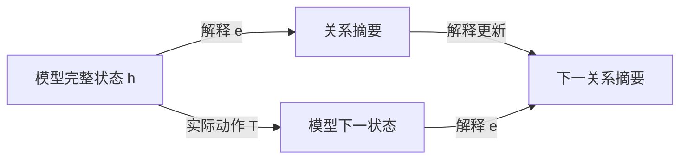

# FIB ATOM 与机器学习白盒性：五窗、关系交互与递归解释

> **参考输入。** 本卷是 [Fibonacci 原子关系生成卷](FIBONACCI_ATOMIC_RELATION_GENERATION.md) 与 [机器学习卷](CONTEXTUAL_SPACETIME_ARITHMETIC_ML.md) 的姊妹卷，给出普通数学推导与模型解释；本文新增综合尚未整体经 Lean 内核核验，不以理论文字承担形式化真值。正文聚焦五种局部窗口怎样形成可执行的解释，不预设一般神经网络已经学会这套结构。

## 1. 白盒问题要先说清解释什么

机器学习用数据选择模型的参数，使模型对指定输入产生需要的输出。选择过程可以写成更新 $\theta^+=U(\theta,\text{数据},\text{优化器状态})$；使用过程则是 $y=f_\theta(x)$，或者带记忆的 $h^+=T_\theta(h,x)$、$y=o_\theta(h)$。解释学习过程和解释使用过程，面对的状态与动作并不相同。

能查看权重和程序，提供了实现访问权。进一步给一个小表示 $e(h)$，能够计算指定输出、预测允许干预的结果，并逐步更新自身，才得到了相应任务的动态解释。人能否理解这些坐标、计算是否划算、解释的预测是否符合现实，又是另外的要求。

| 解释范围 | 要回答的问题 | 尚不能由此推出的性质 |
| --- | --- | --- |
| 实现可见 | 参数、算子、缓存是什么 | 已找到简洁机制 |
| 当前预测充分 | 这个输入为什么得到这个输出 | 新输入、干预与下一步训练仍正确 |
| 动态机制充分 | 改输入、续接或允许干预后怎样变化 | 解释坐标有唯一的人类语义 |
| 学习过程充分 | 换批次、继续训练时怎样变化 | 泛化、可靠性或价值选择必然正确 |

本卷以可计算的小系统解释这些区别。FIB ATOM 提供的核心材料是：有限的局部模式、有约束的组合、可展开的块、关系记录，以及对未来操作闭合的状态。它们给出白盒设计与检验的方法，不给任意网络指定一种普适的五分类。

## 2. 用户五分类的准确含义

**定义 2.1（低位到高位的五窗）。** 固定三个位权 $(2,3,5)$，位串记为 $b=(b_1,b_2,b_3)$，要求

$$
b_1b_2=b_2b_3=0,\qquad b_i\in\{0,1\}.
$$

于是局部字母表为

$$
\Sigma=\{000,100,010,101,001\}.
$$

| FIB 标签 | 位串 | 所选位置 | 初始窗口读数 |
| --- | --- | --- | --- |
| null | 000 | 空集 | 0 |
| 2 | 100 | 第一个位置 | 2 |
| 3 | 010 | 第二个位置 | 3 |
| 2 5 | 101 | 第一、第三个位置共同成块 | 7 |
| 5 | 001 | 第三个位置 | 5 |

原卷 §57 按高到低的 $(b_5,b_3,b_2)$ 写字面位串，下标表示对应位权；本文采用原卷 §§104、141 的低到高坐标。反转映射 $\rho(x,y,z)=(z,y,x)$ 保持所选位置集合：原卷 §57 的 `001` 对应本文的 `100`，都选择位权 2；该节的 `100` 对应本文的 `001`，都选择位权 5。`000`、`010`、`101` 在反转下不变。

五来自三位中禁止相邻占位。换成四位窗口就有八个合法模式；一般长度 $k$ 的模式数为 $F_{k+2}$，由“首位零后剩 $k-1$ 位、首位一后次位必须零而剩 $k-2$ 位”的递推得到。

下一组三位权是 $(8,13,21)$，五种模式仍在，读数却变成 $0,8,13,29,21$。局部组合语法与数值素性是两件事。跨窗还要检查接缝，`null` 消耗三个位置，不能视作结束或无操作。

在机器学习中，可以把这五类作为明确语法下的输入类别，或作为一个待验证的解释字典；不能从“五类”直接推出五个神经元、五个潜在因子或五态控制器。

按位置集合的包含序，非零原子只有三个单例；`101` 是复合模式，`000` 是空模式。五窗作为不可再切的读取字母，是指定窗口长度后的语法约定。关系任务中不能删除的区别，则要由任务和未来操作给出证据，不能只靠“原子”这个名称判定。

## 3. 五窗上的完整特征代数

**命题 3.1（五个合法点的交互展开）。** 任意函数 $f:\Sigma\to\mathbb R$ 唯一写成

$$
f(b)=c_0+c_1b_1+c_2b_2+c_3b_3+c_{13}b_1b_3.
\tag{3.1}
$$

其系数为

$$
\begin{aligned}
c_0&=f(000),\\
c_1&=f(100)-f(000),\\
c_2&=f(010)-f(000),\\
c_3&=f(001)-f(000),\\
c_{13}&=f(101)-f(100)-f(001)+f(000).
\end{aligned}
\tag{3.2}
$$

证明。依次代入空点和三个单点得到前四个系数；最后代入 $101$ 得到第五个。五点上的值全部恢复，且任何表示都被这些代入强制，故存在且唯一。$\square$

这里的五是合法域上函数空间的维数；一种固定线性特征字典要表示所有实值任务，至少需要五个线性独立特征。这不禁止用一个整数编码五个输入，再用非线性查表解码，也不规定一个给定任务必须使用全部五项。

**解释 3.2（相互作用相对于任务）。** $c_{13}$ 比较“共同出现的效果”与“分别出现的效果之和”。它为零当且仅当该任务在这五个点上没有超出常数和单项的贡献。例如：

$$
f_{\mathrm{sum}}(b)=2b_1+3b_2+5b_3
\quad\Longrightarrow\quad c_{13}=0;
$$

$$
f_{\mathrm{joint}}(b)=b_1b_3
\quad\Longrightarrow\quad c_{13}=1.
$$

相同的 FIB 结构，对加法读数没有交互修正，对共同出现任务却必须保留交互。这比给 `101` 贴上“复杂特征”标签更具体：有一条可计算、可反驳的等式。

由于本域上 $b_1b_2=b_2b_3=b_1b_2b_3=0$，这些特征的系数无法由合法域数据识别，也不影响域内任何输出。若另外开放 `110` 等输入，已经扩展了任务域；此时旧解释在域外的延拓不是唯一的。`101` 则本来合法，未采到它属于数据覆盖缺失，不能当成语法排除。

式（3.2）是给定输入坐标上的函数交互，不单独证明网络内部存在一个独立的交互模块，更不等于真实世界的因果效应。

## 4. 同块观察与解释系数是一对对偶坐标

**定义 4.1（合法块与共现记录）。** 设 $I$ 为有限位置集，$\mathcal A\subseteq2^I$ 非空且向下闭：$S\in\mathcal A,T\subseteq S$ 蕴含 $T\in\mathcal A$。无相邻占位的合法位置集满足此条件。一个有限块多重集给出重数 $m_S\in\mathbb N$。定义

$$
y_T=\sum_{S\in\mathcal A,\ T\subseteq S}m_S,
\qquad T\in\mathcal A.
\tag{4.1}
$$

$y_T$ 数的是多少个块同时包含 $T$，不是等价关系分块的布尔位。这里允许不同块重叠、重复；两个位置同现的次数一般不能决定三个位置共同出现的次数。$y_\varnothing$ 是块总数。

**命题 4.2（块函数与共现记录的精确配对）。** 给任意 $f:\mathcal A\to\mathbb R$，置

$$
c_T=\sum_{U\subseteq T}(-1)^{|T|-|U|}f(U).
$$

则

$$
f(S)=\sum_{T\subseteq S}c_T,
\qquad
\boxed{\sum_{S\in\mathcal A}m_Sf(S)
=\sum_{T\in\mathcal A}c_Ty_T.}
\tag{4.2}
$$

证明。第一式中 $f(U)$ 的合并系数为 $\sum_{U\subseteq T\subseteq S}(-1)^{|T|-|U|}$，$U=S$ 时为一，否则由二项式展开为零。向下闭保证所用 $f(U)$ 均有定义。第二式把有限和交换次序，再用式（4.1）。$\square$

这是有限集合 Möbius 反演的应用。FIB 卷 §62 从共现记录恢复块重数；这里从块函数恢复解释系数。二者通过式（4.2）相接：**关系记录说明共同发生了什么，任务系数说明这种共同发生对输出有什么贡献。** 有限配对并未假设块统计独立。

若 $c_\varnothing=f(\varnothing)\ne0$，必须保留 $y_\varnothing$ 的总块数贡献。这套无序统计不保存窗口次序、位置权重或接缝；第6、7节的递归任务还需要相应状态，不能仅由这些计数恢复。

**实例 4.3（7 与 10 的白盒差异）。** 沿用 FIB 卷 §58，只允许四个非空块 $[2],[3],[5],[2+5]$，重数分别为 $a_2,a_3,a_5,a_7$。记

$$
u=a_2+a_7,\qquad v=a_3,\qquad w=a_5+a_7,\qquad\kappa=a_7.
$$

若块内相加、块间相乘，则

$$
N=2^{u-\kappa}3^v5^{w-\kappa}7^\kappa,
\qquad 0\le\kappa\le\min(u,w).
$$

对每块的值取对数，使乘法总任务变为式（4.2）的加法任务，得到

$$
\boxed{\log N=u\log2+v\log3+w\log5
+\kappa\log\frac7{10}.}
\tag{4.3}
$$

空块在这个乘法例中不计入；为使用完整五点展开，可约定它的块因子为一、对数读数为零。这是乘法单位合同，不是把数值零的 `null` 拿来相乘。

$[2+5]$ 与 $[2][5]$ 有相同 $(u,v,w)=(1,0,1)$，却分别给 $N=7,10$。共同成块项的系数恰为 $\log7-\log2-\log5$。因此，删除 $\kappa$ 后，任何只对叶计数做后处理的模型都不能准确恢复这两个结果。

固定 $(u,v,w)$、允许全部上述合法重数组合时，$\kappa=0,\ldots,\min(u,w)$ 全可实现。因 $7/10\ne1$，这些 $N$ 两两不同，补充记录至少需要 $\min(u,w)+1$ 个值；记录 $\kappa$ 达到下界。若另加有限重数盒，须重新计算实际纤维，不能沿用这个全区间计数。

## 5. 训练能拟合单项，却没有识别关系

**定义 5.1（五窗线性解释模型）。** 取

$$
\phi(b)=(1,b_1,b_2,b_3,b_1b_3),\qquad
f_\theta(b)=\langle\theta,\phi(b)\rangle,
\quad\theta\in\mathbb R^5.
$$

训练集覆盖 $000,100,010,001$，但没有 $101$，损失为这些点上的平方误差。令 $e_{13}=(0,0,0,0,1)$。

**命题 5.2（缺少合法联合样本的识别缺口）。** 对任意 $t\in\mathbb R$，$\theta$ 与 $\theta+te_{13}$ 在全部训练点上预测相同，且整个训练损失相同；在 $101$ 上相差 $t$。四个训练行线性独立，故这个训练读数的参数核恰为 $\mathbb Re_{13}$。

证明。训练点的最后一个特征全部为零；空点及三个单点分别确定偏置和三个单项系数。联合点的最后一项是一。$\square$

即使训练误差为零，这个关系方向也没被数据决定。最小范数、稀疏性或初始化可以选定一个系数，但该选择是归纳偏置；没有新增数据或结构假设时，不能把它说成真实交互已经被识别。

这里的不可识别针对旧四模式的读数权限。黑盒若允许查询全部五个模式，同样可以由式（3.2）计算交互；白盒若允许读取参数，可以直接读出模型选取的 $c_{13}$。两者都还需区分“当前模型的系数”与“数据已经识别的真实目标系数”。

**命题 5.3（新联合样本使隐藏方向反馈到旧任务）。** 从相差 $te_{13}$ 的两组参数出发，对同一个新样本 $(101,y)$ 做一次同步的欧氏梯度下降，损失为 $\tfrac12(f_\theta(101)-y)^2$、步长同为 $\eta$，无正则、动量或额外更新项。更新后参数差为

$$
\Delta\theta^+=t(e_{13}-\eta\phi(101)).
\tag{5.1}
$$

因而旧空点上的预测差变为 $-\eta t$。若 $\eta t\ne0$，它们已不在旧训练读数的同一纤维。

证明。两组参数在新样本上的残差相差 $t$，梯度相差 $t\phi(101)$；从原参数差中减去步长乘梯度差得式（5.1）。空点只读取偏置，取第一坐标即得。$\square$

**解释 5.4（反馈取决于特征与优化规则）。** 对一般线性特征模型，一次上述更新使任意输入 $x$ 的输出变为

$$
f^+(x)=f(x)-\eta(f(z)-y)K(x,z),\qquad
K(x,z)=\langle\phi(x),\phi(z)\rangle.
\tag{5.2}
$$

五窗交互字典满足 $K(000,101)=1$，旧空点输出的改变量为 $-\eta(f(101)-y)$，该量非零时输出改变。改用五模式的独热坐标 $\psi(b)=e_b$，并在该坐标做欧氏梯度下降，则 $K(x,z)=\mathbf1_{x=z}$，新 $101$ 样本不改变旧四模式。两套特征都能表达所有五点函数，却产生不同学习动态。这里的反馈由表示与优化度量共同决定，不是 FIB 语法对所有学习算法的强制结论。

取 Fibonacci 读数 $q(u,v)=2u+3v$ 与推进 $M(u,v)=(v,u+v)$，有 $q(3,-2)=0$、$q(M(3,-2))=-1$。它与命题5.3共享一个可核对的机制：原观察的核不被新增动作保持。后者的动作是读入一个合法联合样本并学习；没有要求神经网络的更新矩阵等于 Fibonacci 矩阵。

## 6. 五种输入，却只需四个结构状态

**定义 6.1（接缝与 End 任务）。** 逐窗按低位到高位读取。状态记录上一位 $s\in\{0,1\}$ 和上一窗是否非零 $E\in\{0,1\}$。若 $s b_1=1$，接缝非法并进入吸收失败态；否则更新为

$$
(s^+,E^+)=(b_3,\mathbf1_{b\ne000}).
\tag{6.1}
$$

End 是一次结束查询，成功当且仅当当前 $E=1$。取无单位位的初态 $(s,E)=(0,0)$，故空串不接受。该模型只检查结构，不输出数值，也不保留全部历史。它是原卷 §104 的初始化取单位位零时的结构部分。

End 不属于可继续读取的窗口字母表。若把它改成输入字母，并要求拒绝 End 后的所有输入，则须另计终止后的接收态；下述四态数只针对窗串及其终端查询。

**命题 6.2（四态结构解释）。** 所有可达结构状态恰为

$$
A=(0,0),\quad B=(0,1),\quad C=(1,1),\quad D=\mathrm{fail}.
$$

其转移表为：

| 当前状态 | null / 000 | 2 / 100 | 3 / 010 | 2 5 / 101 | 5 / 001 | End 成功 |
| --- | --- | --- | --- | --- | --- | --- |
| A | A | B | B | C | C | 否 |
| B | A | B | B | C | C | 是 |
| C | A | D | B | D | C | 是 |
| D | D | D | D | D | D | 否 |

这四态在确定性、只读后续窗并最终询问 End 的模型中同时充分且最小。

证明。式（6.1）给出表，每个合法窗满足 $b_3=1\Rightarrow b\ne000$，故 $(1,0)$ 不可达。$A$ 初始可达，$100$ 到 $B$，$001$ 到 $C$，$001,100$ 到 $D$。End 区分 $A$ 与 $B,C$，也区分 $D$ 与 $B,C$；续接 $100$ 后 End 区分 $B,C$；续接 $010$ 后 End 区分 $A,D$。所以四态两两有未来见证，任意准确实现至少四个可达状态。表给上界。$\square$

这是一张完整的小白盒：不仅说“模型记得接缝”，还列出它怎样记、怎样更新、每份记忆为什么不能再删。五个输入标签、四个行为状态、五维局部函数空间，是三个不同的数量。

`null` 从 $B$ 到 $A$ 会改变能否 End；从 $C$ 到 $A$ 还会解除接缝限制。把它解释成“什么都没发生”，会同时错判两种未来。

## 7. 数值任务需要额外递归状态

**定义 7.1（同一低位扫描中的数值接口）。** 承接第6节，固定单位位 $\varepsilon=0$。当前累计值为 $r$，当前窗前两个位权为 $u,v$，第三个位权为 $u+v$。初始 $(r,u,v)=(0,2,3)$。在合法读窗后，按表加入数值：

| 窗口标签 | 累计值增量 $d_b(u,v)$ |
| --- | --- |
| null | 0 |
| 2 | $u$ |
| 3 | $v$ |
| 2 5 | $2u+v$ |
| 5 | $u+v$ |

同时更新

$$
r^+=r+d_b(u,v),\qquad
\binom{u^+}{v^+}
=\begin{pmatrix}1&2\\2&3\end{pmatrix}\binom u v.
\tag{7.1}
$$

三步位权推进就是 $M^3$，其中 $M=\begin{pmatrix}0&1\\1&1\end{pmatrix}$。接缝、End 按第6节更新。合法 End 返回 $r$，其余返回失败标签。对输入窗数归纳，$(r,u,v,s,E)$ 因而给完整数值任务的闭合接口。

这里坚持低位到高位扫描。原卷 §236 的高位到低位 Horner 写法把三步推进作用于累计组成，接缝方向也相反；不能直接拿那张公式替换式（7.1）。

**命题 7.2（有限结构记忆不等于有限数值记忆）。** 四态结构接口不足以恢复任意长度的合法且可 End 窗串的精确整数值。这里的候选是固定初态、只读窗串的确定性状态实现：每个窗口字母对应一个固定状态转移，End 输出仅由当前状态决定，不另获免费的外部时钟、位置、输入历史访问或累计寄存器。若它对所有有限合法且可 End 的窗串均精确输出整数值，则需要无限多个可达状态。

证明。连续读 $k\ge1$ 个 $100$ 窗，每条接缝合法，End 成功，结构态全为 $B$；累计数值为

$$
\sum_{j=0}^{k-1}F_{3j+3}.
$$

各项正，随 $k$ 严格增加。因此这些历史必须占不同的输出状态。$\square$

若任务只要模 $m\ge2$ 的输出，把 $(r,u,v)$ 全部模 $m$ 化，配三个合法结构态和一个失败态，得到至多 $3m^3+1$ 个状态的准确上界。并未证明这些组合全可达或彼此不可合并。读取位置若由外部提供，$u,v$ 可按位置计算，但位置与计算费用必须另记。

**解释 7.3（五窗递归与神经状态）。** 一个学习模型可以用很多神经元实现四态结构解释，也可以用很少的实数坐标编码更大甚至无限的状态族。神经元数、可区分状态数和存储位数不能互相替代。FIB 的有限窗口提供的是局部语法；递归深度和数值精度仍会增加任务负担。

## 8. 从手写白盒到学习模型，需要交换关系

**定义 8.1（指定任务的解释合同）。** 设学习模型在已声明的可达载体 $H$ 上运行，操作 $a$ 的部分更新为 $T_a:D_a\to H$，所需读数为 $o$。解释 $e:H\to Q$ 的值域取实际像，要求有读出 $\bar o$、合法域 $\bar D_a$ 和更新 $\bar T_a$ 满足

$$
\begin{aligned}
o(h)&=\bar o(e(h)),\\
h\in D_a&\Longleftrightarrow e(h)\in\bar D_a,\\
e(T_a h)&=\bar T_a(e(h))\quad(h\in D_a).
\end{aligned}
\tag{8.1}
$$

来源、允许查询、干预和记录要求均固定在合同里。操作后仍须落在 $H$，或明确扩大载体；比较同一高层干预的不同低层实现时，另需给出相容的干预映射。

逐词归纳可知式（8.1）保持全部合法性与输出。反向，解释值相同但某个未来结果不同，就否定该解释对相应动作族的充分性。仓内 `TargetRecoveryCriterion`、`DynamicClosureMinimality`、`ControlledBehaviorUniversality` 分别提供目标纤维、动态细化和有限实现的相关接口；使用时仍须满足各自前件。

图的两条路径得到相同摘要，是一个可检验的承诺。给隐藏状态训练一个能读出“接缝位”的探针，仅验证了解码的一部分；还应检验模型遇到 $100$、$001$、`null` 时，探针读数是否按第6节转移，并检验实际输出。

手写出正确的四态自动机，证明的是这项任务有一个白盒实现。要说已训练的网络具有这个机制，还需构造并验证该网络上的 $e$。有限测试没找到反例，只说明相应测试集上未找到反例。

## 9. 同一预测函数，也可以有不同学习未来

**实例 9.1（两层模型的参数纤维）。** 对标量两层线性模型

$$
f_{a,b}(x)=abx,\qquad w=ab,\qquad s=a^2+b^2,
$$

用固定损失 $\ell(w)$、步长 $\eta$ 做同步欧氏梯度下降。记 $g=\ell'(w)$、$\alpha=\eta g$。原 ML 卷 §9 的公式给

$$
\begin{aligned}
a^+&=a-\alpha b,& b^+&=b-\alpha a,\\
w^+&=(1+\alpha^2)w-\alpha s,&
s^+&=(1+\alpha^2)s-4\alpha w.
\end{aligned}
\tag{9.1}
$$

后两式分别由乘积和平方和展开得到。$w$ 足以解释固定参数下全部输入的预测，却一般不足以解释下一次训练。以 $\ell(w)=w^2/2,\eta=1/10$ 为例，

$$
(a,b)=(1,1),\ (2,1/2)
$$

都有 $w=1$，但 $s=2,17/4$，下一步 $w^+$ 分别是 $81/100,117/200$。

这个训练任务至少必须补充能区分上述两个 $s$ 值的信息；加入 $(w,s)$ 后式（9.1）闭合，并不要求所有准确编码都把该坐标命名为 $s$。固定损失与更新规则是结论的一部分，动量、Adam、不同坐标的优化度量或新的参数干预会改变合同。若 $g=0$ 且后续始终无新任务，参数可驻定，不应宣称所有纤维差异都必然显现。

这个例子与第5节互补：第5节保持同一参数化而扩大训练数据，第9节保持同一预测函数而比较不同参数因子。二者都要求解释学习时保留未来会反馈到输出的隐藏区别。

## 10. 关系原子不等于一个神经元

**解释 10.1（坐标变化与同一行为）。** 对两层线性网络 $f(x)=W_2W_1x$，任意可逆隐藏换基 $A$ 给

$$
W'_1=AW_1,\qquad W'_2=W_2A^{-1},\qquad
W'_2W'_1=W_2W_1.
$$

因此内部坐标名称和逐坐标激活值不由输入输出函数唯一决定。一般非线性网络不能随意用这个全可逆换基；例如 ReLU 只在相应置换、正缩放等确实保持运算的变换下适用。第9节还说明，保持当前函数的重参数化不自动保持欧氏训练动态。

若低层干预是“将某个神经元归零”，换基后应运输同一个干预算子；换成“仍把第一个坐标归零”通常已换了实验。任务相对的行为商规范，不代表一套神经元分工、一个最稀疏字典或一个人类概念命名也规范。

**实例 10.2（能读出概念，不等于该坐标在被使用）。** 令隐藏态 $h=(x,x)$，输出 $y=h_1$。两个坐标都能完美预测 $x$；在这个实现中将 $h_2$ 置零却不改变输出。探针的成功证明信息可解码，未证明输出通过该坐标产生。

消融后没有变化也不能一般推出关系无作用：冗余路径、饱和区、错误的干预范围都可能遮蔽变化。应固定允许的替换与背景，比较实际输出，并核对式（8.1）；不要把任意离开可达像的激活拼接当作自然数据的反事实。

FIB 的 $101$ 给一个有来源的联合特征；稀疏自编码器中的一个激活方向还取决于数据支撑、字典规范和优化目标。[白盒纤维律卷](WHITE_BOX_LOSS_FIBER_LAW.md)第4章的特征吸收实例说明，重构和稀疏性可以偏好共同出现的方向；它们不自动把真实生成因子逐一恢复。

**约定 10.3（五窗与原子语义保持分层）。** 用户所指的五分类就是第2节的五个合法窗口。本卷为解释而区分的语义层次——语法叶、可展开封装、数量乘法素元、操作不可约结构、任务行为区别——是一份概念表，并非原卷既有的五分类，也不与五个窗口逐项对应。`null` 尤其不是一个素元；`2 5` 也不自动是一种独立神经机制。称某个区别为“关系原子”，须至少附上任务、允许操作、它被合并时的错误见证；这仍不声称有唯一的生成元分解。

## 11. 怎样把解释变成可检验的学习任务

一个具体的 FIB 白盒实验可以同时保留三类目标，而不是只训练一次五分类：

1. **局部语义**：输出五窗类别、数值或 $b_1b_3$；用式（3.2）测量交互系数，并明确是否覆盖 $101$。
2. **递归结构**：预测下一窗是否合法以及能否 End；比较模型摘要与第6节四态转移，特别测试 `null` 和非法接缝。
3. **数值行为**：预测指定精度下的累计值；检验式（7.1），比较同结构态、不同数值态的历史。

这些目标不要求模型使用同一份最小表示。若还要解释训练，把优化器记忆、批次输入和参数状态并入合同，用第5、9节的成对实例测试当前解释是否闭合。

**判据 11.1（恢复与分离）。** 候选解释要被称为某个有限确定性任务的最小准确实现，需要两类证据：所有实际状态和动作上成立的恢复、保域与更新等式，以及每对不同可达解释状态的未来区分词。前者排除错误合并，后者排除冗余。第6节四态表同时给了这两类证据。

如果学习网络的可达隐藏态尚未被完整刻画，抽取出的有限表不能单独替网络通过前一项。可以证明一个覆盖可达态的归纳不变量，再逐动作验证；只有样本检验时应报告样本范围与反例，不能把长串泛化准确率改称全域证明。

近似解释还需指定度量、误差和允许时域。若 $L\ge0$、$\varepsilon\ge0$，且状态误差满足 $e_{t+1}\le Le_t+\varepsilon$，则 $e_t\le L^te_0+\varepsilon\sum_{j=0}^{t-1}L^j$；但接缝、End 这样的离散判定还需守卫裕量或精确的标签保持。数值接近不自动保证走相同分支。相关完整条件见 ML 卷 §§21、25–26。

## 12. 本卷提供的连接与尚未取得的结果

FIB 五窗给出的学习对象可写为

$$
\boxed{\text{合法局部模式}
\ \longrightarrow\ \text{单项与关系交互}
\ \longrightarrow\ \text{带接缝的递归状态}
\ \longrightarrow\ \text{指定任务的动态解释}.}
$$

五点函数展开与同块记录的配对是这里的具体桥梁：$c_{13}$ 描述任务对共现的响应，$\kappa$ 描述实际共现次数。缺失联合训练样本留下未识别方向；新增联合样本能让这个方向反馈到旧预测。结构任务具有四态解释，精确无界数值任务则不能由四态承担。

这些内容既不证明任意大型网络已有短小的全局解释，也不证明 FIB 坐标在真实学习任务上优于其他表示。本文没有训练神经网络、测量泛化收益或完成一般因果抽象的提取算法。尚待研究的具体问题是：在选定模型与干预族上，能否实际提取满足式（8.1）的低成本表示；哪些关系必须保留；超出有限窗口后需要增加哪些状态。

## 13. 来源与核验范围

| 来源 | 本卷使用的内容与边界 |
| --- | --- |
| [FIB 原卷](FIBONACCI_ATOMIC_RELATION_GENERATION.md) §§57–58、62、104、141、236–237 | §57 提供高到低位序的数值窗口，§§104、141 提供本文采用的低到高位序合同，二者经反转对应；另复用块重数与 $\kappa$、接缝和三步递归，不从素数或共同谱推断学习能力 |
| [ML 卷](CONTEXTUAL_SPACETIME_ARITHMETIC_ML.md) §§2–3、9、13、19、21 | 任务充分性、两层训练闭包、优化器状态、因果干预与近似误差；第9节公式在这里直接复用 |
| [白盒纤维律卷](WHITE_BOX_LOSS_FIBER_LAW.md) §§3–4 | 训练读数纤维与特征吸收；不将线性或特定字典结论外推到所有网络 |
| [LiteralWindowEnd.lean](../../../D5/S3/Arith/FibonacciAtomic/LiteralWindowEnd.lean) 的 `Window`、`bits`、`step`、`execution` | 五个实际构造子、部分语言的失败总化与 End；第6节四态最小性是本文针对结构子任务的推导，不冒称源码已逐字给出 |
| [DynamicClosureMinimality.lean](../../../D5/S3/ConceptDynamics/Interventions/DynamicClosureMinimality.lean) | 动态闭包及其最小细化接口；实际网络的闭合前件仍需验证 |
| [TargetRecoveryCriterion.lean](../../../D5/S3/ConceptDynamics/Restoration/TargetRecoveryCriterion.lean) | 目标在观察纤维上常值的恢复判据；不提供缺失实验数据 |
| [Geiger 等，Causal Abstraction](https://www.jmlr.org/papers/v26/23-0058.html)，JMLR 26(83) | 因果抽象需要状态和干预的对应；平均干预准确率不等于全域精确抽象，库内来源见 [条目](../../../Library/Dynamics/geiger2025causal.md) |
| [Elhage 等，Toy Models of Superposition](https://arxiv.org/abs/2209.10652)；[Chanin 等，A is for Absorption](https://arxiv.org/abs/2409.14507) | 分布式特征与特征吸收的相关研究背景；不充当本文五窗定理或任意网络解释成功的证据 |

五点展开、有限集合 Möbius 反演、自动机剩余行为及梯度代数均属成熟工具。本卷提供它们在固定 FIB 任务上的综合应用，不宣称这些工具原创。新增综合的证据是所列普通证明；没有新增冻结声明，也未把有限检查提升为全称 Lean 核验。

## 追加锚（本行以下为增补区）

## 14. 固定任务后的风险分解与表示细化

**定义 14.1（平方损失比较合同）。** 固定有限支撑的联合分布 $(X,Y)$，其中 $Y\in\mathbb R$；完整输入为 $X$，表示为 $Z=e(X)$，损失为 $(Y-h(Z))^2$。读出类 $\mathcal H$ 是预先规定的非空实值函数类，实际读出 $\widehat h\in\mathcal H$。表示取得、读出计算、训练标签及允许动作的资源合同也须固定。以下期望均对同一联合分布计算；若读出由随机训练集产生，先固定一次训练所得的读出，再按需对训练随机性取期望。

只在正概率纤维上定义条件均值，零概率处的值任取。记

$$
\begin{aligned}
m(X)&=\mathbb E[Y\mid X],& m_e(Z)&=\mathbb E[Y\mid Z],\\
N&=\mathbb E[(Y-m(X))^2],& I&=\mathbb E[(m(X)-m_e(Z))^2],\\
A&=\inf_{h\in\mathcal H}\mathbb E[(m_e(Z)-h(Z))^2],&
B&=\mathbb E[(m_e(Z)-\widehat h(Z))^2]-A.
\end{aligned}
\tag{14.1}
$$

本节 $N$ 是相对完整输入 $X$ 的标签噪声，与第4节的整数读数符号分别使用；$I$ 是表示遗漏的条件均值信息，$A$ 是读出类的逼近缺口，$B$ 是实际读出的总体类内超额。有限支撑使各个实值读出的风险有限；不要求 $\mathcal H$ 有最优元、凸性或线性结构。

**命题 14.2（四项非负分解）。** 在定义14.1的合同下，实际风险满足

$$
R(\widehat h):=\mathbb E[(Y-\widehat h(Z))^2]=N+I+A+B,
\qquad N,I,A,B\ge0.
\tag{14.2}
$$

证明。逐个正概率的 $X=x$ 纤维有 $\mathbb E[Y-m(X)\mid X=x]=0$；因此 $Y-m(X)$ 与任意 $X$ 的函数的乘积期望为零。又因 $Z=e(X)$，逐个 $Z=z$ 纤维求和得 $\mathbb E[m(X)\mid Z]=m_e(Z)$，故 $m(X)-m_e(Z)$ 与任意 $Z$ 的函数正交。展开

$$
Y-\widehat h(Z)=(Y-m(X))+(m(X)-m_e(Z))+(m_e(Z)-\widehat h(Z))
$$

的平方，三个交叉项分别由上述两种纤维求和消去，得到 $N+I+\mathbb E[(m_e-\widehat h)^2]$。加减 $A$ 得式（14.2）。前三项是平方期望或其非空类下确界；由 $\widehat h\in\mathcal H$，最后一项也非负。$\square$

$B$ 不一概是“优化残差”：未知目标的样本识别不足也能让经验最优读出具有正的 $B$。对给定非空训练集，令 $\widehat R$ 为经验平方风险。若 $\delta=\sup_{h\in\mathcal H}|R(h)-\widehat R(h)|<\infty$，则有

$$
\begin{aligned}
B&=R(\widehat h)-\inf_{h\in\mathcal H}R(h)\\
&\le \widehat R(\widehat h)-\inf_{h\in\mathcal H}\widehat R(h)+2\delta.
\end{aligned}
\tag{14.3}
$$

证明。由 $|R-\widehat R|\le\delta$，有 $R(\widehat h)\le\widehat R(\widehat h)+\delta$；又对任意 $h\in\mathcal H$ 有 $\widehat R(h)\le R(h)+\delta$，取下确界得 $\inf\widehat R\le\inf R+\delta$。两式相减即得，无需下确界可达。$\square$ 这只给总体超额的上界；经验优化差降低，不单独保证总体风险严格降低，也未给出 $\delta$ 的概率估计。

**命题 14.3（细化表示的精确收益）。** 设 $e=r\circ e'$，并允许各表示上的全部实值读出。记 $R_*(e)=\inf_h\mathbb E[(Y-h(e(X)))^2]$。则

$$
R_*(e)-R_*(e')=
\mathbb E\!\left[(\mathbb E[Y\mid e'(X)]-\mathbb E[Y\mid e(X)])^2\right].
\tag{14.4}
$$

严格改善当且仅当两个条件均值以正概率不同。

证明。令 $m'=\mathbb E[Y\mid e'(X)]$、$m_e=\mathbb E[Y\mid e(X)]$。对各表示，纤维消交叉项给 $R(h)=\mathbb E[(Y-m_e)^2]+\mathbb E[(m_e-h)^2]$，故条件均值读出达到不限类的最优风险。因 $m'-m_e$ 是 $e'$ 的函数，$Y-m'$ 与它正交；展开 $Y-m_e=(Y-m')+(m'-m_e)$ 即得式（14.4）。有限分布中平方期望为正恰等价于非零差有正概率。$\square$

因此，仅对旧表示做确定性后处理 $\widetilde e=t\circ e$，不能降低不限类的最佳风险；它可以通过计算新的非线性特征改善受限线性可读性。第15节将给出信息不变而线性误差严格下降的实例。

**实例 14.4（共同成块信息的风险价值）。** 完整输入 $X$ 等概率取第4节的两个块配置 $[2+5]$、$[2][5]$，真实目标分别为 $Y=7,10$。旧表示只有叶计数 $(u,v,w)=(1,0,1)$，最佳读出恒为 $17/2$，其风险为

$$
\frac12(7-17/2)^2+\frac12(10-17/2)^2=\frac94.
$$

加入共同成块次数 $\kappa$ 后，两输入分别有 $\kappa=1,0$，可精确读出目标，风险为零。这里 $N=0$；不限类下旧表示的 $I=9/4$、$A=B=0$。$\kappa$ 必须从块的实际来源取得，不能由相同的旧叶计数算出；添加它改变信息取得合同。

解释对模型忠实也不保证模型对真实目标正确。例如 $X$ 等概率取 $0,1$、$Y=X$，模型恒预测零。一态解释对模型的任意输入查询都忠实，状态始终不变，但真实平方风险为 $1/2$。模型“好坏”只能相对于固定目标、分布、损失和资源比较；准确解释允许看清错误，并不自行消除错误。

## 15. 五窗上受限读出的精确误差

**命题 15.1（加性读出的最佳平方风险）。** 令 $X=b\in\Sigma$、$Y=f(b)$，其中 $f$ 是任意确定实值目标，$p_b=P(X=b)$。允许任意实系数的加性读出

$$
g(b)=a_0+a_1b_1+a_2b_2+a_3b_3.
$$

若四角 $000,100,001,101$ 都有正概率，$010$ 的概率允许为零，则

$$
\inf_g\mathbb E[(f(X)-g(X))^2]
=\frac{c_{13}^2}{S},\qquad
S=\frac1{p_{000}}+\frac1{p_{100}}+\frac1{p_{001}}+\frac1{p_{101}},
\tag{15.1}
$$

其中 $c_{13}=f(101)-f(100)-f(001)+f(000)$。加入交互 $b_1b_3$ 的第3节完整字典可把风险降为零；严格收益恰在 $c_{13}\ne0$ 时成立。

证明。按 $(000,100,010,101,001)$ 排列五点值，置 $d=(1,-1,0,1,-1)$。由命题3.1，加性读出类恰是超平面 $d\cdot g=0$：四个加性系数任取，而唯一缺少的系数就是 $d\cdot g$。对残差 $r=f-g$，因此有 $d\cdot r=c_{13}$。在四角上用加权 Cauchy–Schwarz 得

$$
c_{13}^2
=\left(\sum_{b:\,d_b\ne0}\sqrt{p_b}\,r_b\frac{d_b}{\sqrt{p_b}}\right)^2
\le S\sum_b p_b r_b^2.
$$

取四角残差 $r_b=c_{13}d_b/(p_bS)$，并取 $r_{010}=0$，则 $d\cdot r=c_{13}$，故 $g=f-r$ 属于加性类，且其风险等于 $c_{13}^2/S$，达到下界。完整字典由式（3.1）准确表达 $f$。$\square$

**实例 15.2（信息完整，线性读出仍有损失）。** 五窗均匀、$f(b)=b_1b_3$ 时，$c_{13}=1$、$S=20$，最佳加性风险为 $1/20$。上述最优读出的五点值为

$$
g=(-1/4,\ 1/4,\ 0,\ 3/4,\ 1/4),
\qquad g(b)=-1/4+b_1/2+b_2/4+b_3/2.
$$

输入位串本身是单射表示，$N=I=0$；这里的正误差属于受限读出项 $A$。从已有位串计算 $b_1b_3$ 没有增加信息，却扩展了线性读出空间并使 $A=0$。本命题允许任意实值预测；上面的负值说明若强制预测落在 $[0,1]$，不能直接沿用此最小二乘等号。

**命题 15.3（支撑与噪声边界）。** 若四角至少有一个不在正概率支撑上，加性类可拟合整个正概率支撑，确定目标的最佳风险为零。若标签有噪声且条件均值为 $f(b)=\mathbb E[Y\mid X=b]$，则四角均正时加性最佳风险为

$$
\mathbb E[\operatorname{Var}(Y\mid X)]+\frac{c_{13}(f)^2}{S};
\tag{15.2}
$$

缺角时只剩条件方差项。完整字典在两种情形下都达到条件方差项。

证明。缺角时先把 $g$ 在所有正概率点置为 $f$，其余缺点任填；选一个缺角，因对应 $d_b\ne0$，可只调整这个不计风险的值，使唯一约束 $d\cdot g=0$ 成立。这给出加性读出，不使用 $1/0$。有噪声时逐个 $X=b$ 纤维消交叉项，得 $\mathbb E[(Y-g)^2]=\mathbb E[\operatorname{Var}(Y\mid X)]+\mathbb E[(f-g)^2]$，再应用命题15.1或缺角构造。$\square$

## 16. 零训练误差之外的样本识别缺口

**定义 16.1（两目标识别合同）。** 已知真实目标属于

$$
f_\theta(b)=\theta\mathbf1_{b=101},\qquad\theta\in\{0,1\};
$$

其他四点的目标已知为零。训练数据 $D_n=((X_i,f_\theta(X_i)))_{i=1}^n$ 是 $n\ge0$ 个无噪声、独立同分布局部窗口样本；输入分布不依赖 $\theta$，且 $P(X=101)=p$。测试窗口独立于训练集并服从同一分布。算法仅获得 $D_n$、上述已知合同和与 $\theta$ 无关的随机性，允许任意实值预测；没有额外标签或读取真实 $\theta$ 的权限。

**命题 16.2（精确 minimax 风险）。** 对 $0<p<1$，在训练、算法随机性与独立测试窗口上取期望，有

$$
\inf_{\mathcal A}\max_{\theta\in\{0,1\}}
\mathbb E[(f_\theta(X)-\widehat f_{\mathcal A,D_n}(X))^2]
=\frac{p(1-p)^n}{4}.
\tag{16.1}
$$

证明。令 $E$ 为训练中未见 $101$ 的事件，$P(E)=(1-p)^n$。在 $E$ 上两种目标产生完全相同的训练记录分布，连同算法随机性也无法区分它们。设算法在 $101$ 上的实值预测为 $C$，对两目标等权平均，有

$$
\frac12\mathbb E[C^2+(1-C)^2\mid E]
=\mathbb E[(C-1/2)^2\mid E]+\frac14\ge\frac14.
$$

测试取 $101$ 的概率为 $p$，其余误差非负；两目标的最大风险至少为平均风险，故下界为 $p(1-p)^n/4$。达到下界的算法在其他点恒输出零：见过 $101$ 时读出其标签并准确预测，未见时在该点输出 $1/2$。两目标的风险都等于下界。$\square$

这份算法在每一份训练集上都零误差，却仍可有正测试风险；其预测也属于第5节的完整交互字典。故这里没有表示损失或函数类逼近损失，经验优化已完成，缺的是关于固定真实目标的识别信息。实值输出权限决定常数 $1/4$；若每份训练所得预测必须是两个候选函数之一且允许随机化，未见时等概率选择给出并达到常数 $1/2$。

**推论 16.3（采样与合法查询的识别收益）。** 在 $0<p<1$ 下，每增一个同分布样本，式（16.1）的风险严格乘以 $1-p$。若另有权限向同一个固定真实目标查询合法窗口 $101$ 的无噪声标签，一次查询即识别 $\theta$，使所有五点的预测风险为零。

证明。前者直接比较相邻 $n$ 的公式；后者由 $f_\theta(101)=\theta$，其余值已知为零。$\square$

该查询取得真实目标标签；查询模型自身的预测不提供这份识别信息。标签来源、主动查询权限及其取得成本须另列，不能把新增权限当作免费算法改进。边界为：$p=0$ 时测试风险始终为零但 $\theta$ 未必识别；$n=0$ 时任意 $p$ 的 minimax 风险为 $p/4$；$p=1,n\ge1$ 时首样本已识别目标，风险为零，避免把 $0^0$ 当作推导步骤。

局部窗口独立采样的合同不自动等于第6节带接缝的合法窗串分布。序列中的窗口可以相关，选择机制也能改变未见事件概率；没有该合同便不能把 $(1-p)^n$ 用于序列风险。

## 17. 两层训练：平衡操作与状态反馈

本节承接第9节，只讨论精确实数标量参数、已知损失 $\ell(w)=w^2/2$ 和同步欧氏梯度下降；没有动量、正则、额外参数更新或数值舍入。先取固定步长 $\eta>0$，记一次更新为 $G_\eta$。

**命题 17.1（固定步长的一步下降判据）。** 对 $w=ab\ne0$、$s=a^2+b^2$，有

$$
w^+=w(1-\eta s+\eta^2w^2),\qquad
\ell(w^+)<\ell(w)
\quad\Longleftrightarrow\quad
\eta w^2<s<\frac2\eta+\eta w^2.
\tag{17.1}
$$

证明。式（9.1）代入 $g=w$ 给第一式；严格下降等价于 $|1-\eta s+\eta^2w^2|<1$，将两个严格不等式分别移项即得。$\square$ 当 $w=0$ 时损失已经为零，无严格下降。

同为 $w=1,\eta=1/10$，平衡因子 $(1,1)$ 的下一步为 $81/100$；因子 $(10,1/10)$ 有 $s=10001/100$，下一步为 $-8991/1000$，其绝对值大于一，损失反而增加。因此相同预测函数与相同目标，不保证同一次训练有相同收益。

**命题 17.2（保持当前函数的平衡与收敛）。** 约定 $\operatorname{sgn}(0)=0$，定义参数操作

$$
\operatorname{Bal}(a,b)=
(\sqrt{|w|},\operatorname{sgn}(w)\sqrt{|w|}),\qquad w=ab.
$$

它保持乘积 $w$，使 $s=2|w|$。平衡后做一步固定步长下降，得到

$$
w^+=F_\eta(w):=w(1-\eta|w|)^2.
\tag{17.2}
$$

若 $0<\eta|w_0|<2$，一次初始平衡后的连续梯度下降严格降低每个非零步的损失，并有 $w_t\to0$；若到达零则保持零。

证明。平衡乘积为 $w$，平方和为 $2|w|$，代入式（17.1）得式（17.2）。同步更新还满足

$$
(a^+)^2-(b^+)^2=(1-\eta^2w^2)(a^2-b^2),
$$

故一次平衡后 $a^2=b^2$ 永远保持，且 $s=2|w|$，无需每步重新平衡。令 $q_t=|w_t|$，则 $q_{t+1}=q_t(1-\eta q_t)^2$；在 $0<\eta q_t<2$ 内乘子严格小于一，故 $q_t$ 递减，始终小于 $2/\eta$，并有非负极限 $q_\infty$。连续性给 $q_\infty=q_\infty(1-\eta q_\infty)^2$。正的解只能是 $2/\eta$，而 $q_\infty\le q_0<2/\eta$，故极限为零。$\square$

取解释 $e(a,b)=ab$，该操作满足交换等式

$$
e\circ\operatorname{Bal}=e,\qquad
e\circ G_\eta\circ\operatorname{Bal}=F_\eta\circ e.
\tag{17.3}
$$

这给出修改动作恢复 $w$ 闭合的具体方式：执行“平衡后更新”，或者先进入并保持平衡子域。它并未使原来任意因子上的固定步长更新对 $w$ 闭合。平衡也不是处处最快：第9节的 $(2,1/2)$ 在同一步长下得到 $117/200$，其损失小于平衡所得 $81/100$ 的损失。

**命题 17.3（读取隐藏关系量的反馈收缩）。** 改用状态反馈合同：$s_t>0$ 时取 $\eta_t=1/s_t$ 并做同步欧氏更新；$s_t=0$ 时停止。则每个非停止步满足

$$
\begin{aligned}
w_{t+1}&=\frac{w_t^3}{s_t^2},&
s_{t+1}&=s_t-\frac{3w_t^2}{s_t}\ge\frac{s_t}{4}>0,\\
|w_{t+1}|&\le\frac{|w_t|}{4},&
\ell(w_{t+1})&\le\frac{\ell(w_t)}{16}.
\end{aligned}
\tag{17.4}
$$

因此 $\ell(w_t)\le16^{-t}\ell(w_0)$，从任意有限实参数出发都有 $w_t\to0$；初态 $s_0=0$ 时本来有 $w_0=0$，停止后视为保持零。

证明。由 $(|a|-|b|)^2\ge0$ 得 $s\ge2|w|$。在式（9.1）中代入 $g=w,\eta=1/s$，得到 $w^+=w^3/s^2$、$s^+=s-3w^2/s$。又 $w^2\le s^2/4$，故 $s^+\ge s/4$、$|w^+|\le|w|/4$，平方后得到损失界，归纳即得全程收缩。$\square$

此动作需要读取当前 $s=a^2+b^2$ 并计算一次倒数，固定步长合同已经换成状态反馈。闭合状态仍是 $(w,s)$：例如 $w=1$、$s=2$ 与 $s=17/4$ 的反馈下一步分别为 $1/4$ 与 $16/289$，所以 $w$ 独自不能决定该更新。白盒所见的隐藏关系量在这里成为控制资源，但计算精度和读取费用不由实数证明承担。

**命题 17.4（只读 $w$ 的步长不能统一保证下降）。** 若步长规则只依赖当前非零 $w$ 并选择 $\eta(w)>0$，且允许同一 $w$ 纤维的 $s$ 无界，则它没有对该纤维统一的一步下降保证。

证明。固定 $w\ne0$ 后步长是一个正数。取同纤维因子 $(a,w/a)$ 并让 $|a|$ 增大，$s=a^2+w^2/a^2$ 无界；可取 $s>2/\eta(w)+\eta(w)w^2$。式（17.1）的乘子于是小于 $-1$，损失严格增加。$\square$

这里优化目标已经明确为零，反馈证明不承担第16节中未知真实标签的识别义务；这些结论也不外推到一般网络、其他优化器或有限精度训练。

## 18. 从诊断量到可验证的研究路径

第14节的分解把误差定位到不同合同，第15、16、17节分别提供可计算收益。操作的成本应与收益一起比较：取得来源关系、增加读出特征、购买标签和读取训练状态不是同一种资源。

| 诊断量或障碍 | 对应操作 | 已证收益与条件 | 所需资源 |
| --- | --- | --- | --- |
| 旧表示合并了不同条件均值，$I>0$ | 从来源取得细化信息 | 不限读出时下降量恰为式（14.4）；两块配置补 $\kappa$ 下降 $9/4$ | 共同成块记录的取得与存储 |
| 四角均正且 $c_{13}\ne0$，加性类有 $A>0$ | 由位串计算并加入 $b_1b_3$ | 确定目标下降 $c_{13}^2/S$；均匀共同出现目标下降 $1/20$ | 一项交互特征及相应读出计算 |
| 两候选目标未被局部样本识别 | 增加一个同分布无噪声样本 | $0<p<1$ 时 minimax 风险乘 $1-p$ | 一个真实标签及采样成本 |
| 同一识别合同允许主动合法查询 | 查询固定真实目标的 $101$ 标签 | 一次查询使候选目标风险归零 | 主动查询权限与真实标签来源 |
| 固定步长不满足下降判据 | 保持函数的初始平衡 | $0<\eta|w_0|<2$ 时非零步严格下降并收敛；不保证每步最快 | 因子访问、乘积、平方根及参数写入 |
| 同预测纤维的 $s$ 无界 | 读取 $s$ 并取反馈步长 $1/s$ | 标量合同下每步损失至多原来的 $1/16$，无需初始平衡 | 当前平方和与一次倒数计算 |

若关注类内总体超额 $B$，式（14.3）要求同时检查经验优化差和总体—经验偏差；不能仅凭零训练误差宣布识别或泛化完成。相应上界下降也不等于实际风险已严格下降。表中每个严格收益都来自对应定理的前件，改变标签噪声、分布、输出范围或动作权限须重新核对。

回到五窗递归，局部交互误差、共同成块信息和目标识别可分别按上述公式检验；接缝、End 与累计数值还必须接受第6、7节的状态下界及第8节的恢复、保域、交换律。平均局部风险不替代序列动态闭合。例如第6节的 $B,C$ 都可 End，却在续接 $100$ 后给不同合法性；将它们合并即使不影响当前 End 风险，也不能准确执行下一窗。用探针读到这些关系之后，仍须验证真实网络是否使用它们、允许干预是否相容、更新是否保持解释，才能把手写白盒结论接回实际模型。

**来源与适用映射。** 下列既有声明提供条件期望与受限读出的结构来源。第14节的有限模型可取样本空间为 $(X,Y)$ 的有限联合支撑，配其概率测度与离散可测结构；$X$、$e(X)$ 是概念映射，平方可积自动成立，$e=r\circ e'$ 给条件 $\sigma$-代数包含关系。任意读出类 $\mathcal H$ 本身不因此成为子空间，也不取得正交投影或最近点。

| 新增连接的来源 | 对应内容与边界 |
| --- | --- |
| [ConditionalExpectationOptimality.lean](../../../D5/S3/ConceptDynamics/Prediction/ConditionalExpectationOptimality.lean)，`conditional_expectation_minimizes_mean_square_error` | 对概念生成的 $\sigma$-代数，平方可积条件期望的误差不大于任意可测平方可积读出；对应不限类最优性，不保证受限类下确界可达 |
| [ConditionalExpectationResidualDecomposition.lean](../../../D5/S3/ConceptDynamics/Prediction/ConditionalExpectationResidualDecomposition.lean)，`conditional_expectation_residual_orthogonal_decomposition` | $L^2$ 残差对概念可测子空间正交；第14节以有限纤维求和写出本卷所需的交叉项消去 |
| [ConditionalExpectationRefinementPythagoras.lean](../../../D5/S3/ConceptDynamics/Prediction/ConditionalExpectationRefinementPythagoras.lean)，`conditional_expectation_refinement_pythagoras` | 嵌套条件 $\sigma$-代数下，旧风险等于新风险加两条件期望的平方距离；对应式（14.4）的结构 |
| [ML 卷](CONTEXTUAL_SPACETIME_ARITHMETIC_ML.md) §§28.2–28.4、29.2–29.3 | 区分表示遗漏、受限解码、总体类内超额及可逆重编码的可访问性；其对数损失分解、Walsh 共同空间与下确界条件各按原合同使用，不替代本卷平方损失与五窗计算 |

以上引用按声明和正文条件核对，本文不声称重新编译这些来源。五窗精确风险、两目标采样界与两种训练改进由本卷普通数学推导给出，没有新增 Lean 核验、实际网络训练或普遍性能排名，也不据此宣称研究原创。

## 追加锚（本行以下为增补区）

## 19. 从四态结构语言到词响应合同

本批承接第6、8节，把结构任务接到 [计算行为表示卷](COMPUTATIONAL_BEHAVIOR_REPRESENTATION_THEORY.md) §§5.1–5.5 的词残余与有限块恢复，以及 [FIB 延拓几何卷](FIB_RELATIONAL_CONTINUATION_GEOMETRY.md) §6 的线性最小边界。一般构造属于既有理论；这里给出低位到高位、带终端 End 查询的具体实例及其验证证书。

**定义 19.1（总化终端响应）。** 固定 $\Sigma=\{000,100,010,101,001\}$，$\varepsilon$ 表示空词。对每个 $w\in\Sigma^*$，先从第6节初态 $A$ 读完 $w$，再执行一次 End 查询，定义

$$
F(w)=\begin{cases}1,&\text{终态为 }B\text{ 或 }C,\\0,&\text{终态为 }A\text{ 或吸收失败态 }D.\end{cases}
\tag{19.1}
$$

因此 $F(\varepsilon)=0$。End 不属于 $\Sigma$，也不消耗一个窗；$F(w)$ 本身就是完成该查询后的值。尚未执行 End 的运行记录不是另一个 $F(w)$ 值。非法接缝总化为拒绝后，$F$ 在所有窗词上有定义；这不把失败词改称合法词。

固定域 $K=\mathbb Q$，把布尔结果编码为域中的 $0,1$。一个 $d$ 维齐次线性模型由固定初始行 $\alpha$、每字母一个固定矩阵 $T_a$ 和线性终端列 $\beta$ 构成：

$$
z_{wa}=z_wT_a,\qquad z_\varepsilon=\alpha,\qquad
\widehat F(w)=\alpha T_{a_1}\cdots T_{a_n}\beta\quad(w=a_1\cdots a_n).
\tag{19.2}
$$

空乘积是单位阵；零维模型只给零响应。合同没有免费时钟、词长参数、历史访问或另加的非线性读出。系数的可表示精度与运算成本须独立记账。

记 $F_u(v)=F(uv)$、$H_F(u,v)=F(uv)$、$V_F=\operatorname{span}_K\{F_u\}$。复用上述两卷的结论：$\dim V_F$ 等于最小齐次线性维数。所需证明桥是：任意 $d$ 维实现将残余写为 $v\mapsto z_uT_v\beta$，故秩至多 $d$；反向，$g(v)\mapsto g(av)$ 保持 $V_F$，因为它把 $F_u$ 送到 $F_{ua}$，而线性关系可在后缀 $av$ 处逐项检验。以 $F_\varepsilon$ 初始化、在空后缀评价读出，即实现每个词。

这使用词拼接而非单一时间移位。仓内 [SequenceHankelRealization.lean](../../../D5/S3/Observer/Hankel/SequenceHankelRealization.lean) 的尾序列是 $m(i+j)$，对应单矩阵的 $CA^nB$；这里不同字母的矩阵一般不交换。例如 $F(001\cdot100)=0$，$F(100\cdot001)=1$，不能用词长替代字母次序。源码引用不表示本批词版本已编译或经 Lean 验证。

## 20. 三个预测坐标实现四个行为态

**命题 20.1（结构响应的最小线性维数）。** $F$ 的 Hankel 秩与最小齐次线性维数均为 $3$；第6节的四个离散未来行为类仍然是四个。

证明。记 $F_S(v)$ 为从结构态 $S$ 续读 $v$ 后的 End 结果。每个前缀的全部未来响应只取决于 $A,B,C,D$，而 $F_D$ 恒零，故 $V_F$ 由 $F_A,F_B,F_C$ 张成，秩至多三。取有序前缀与后缀

$$
P=(\varepsilon,100,001),\qquad Q=(\varepsilon,100,010).
$$

$P$ 中的前缀依次到达 $A,B,C$，并给出有限子矩阵

$$
H=(F(pq))_{p\in P,q\in Q}
=\begin{pmatrix}0&1&1\\1&1&1\\1&0&1\end{pmatrix},\qquad \det H=-1.
\tag{20.1}
$$

于是三个残余线性无关，秩至少三；结合第19节的桥得最小性。$D$ 可由 $001\cdot100$ 到达，且零残余与其他三行不同；离散类数不因零残余在线性张成中不增加维数而减少。$\square$

**构造 20.2（有限可检验的预测坐标）。** 对每个前缀置

$$
z_u=(F(u),F(u\cdot100),F(u\cdot010)),\qquad
z_A=(0,1,1),\ z_B=(1,1,1),\ z_C=(1,0,1),\ z_D=(0,0,0).
\tag{20.2}
$$

取 $\alpha=z_A$、$\beta=(1,0,0)^{\mathsf T}$。若 $e_i$ 是三维空间的第 $i$ 个单位列，则五个更新为外积

$$
T_{000}=e_3z_A,\quad T_{100}=e_2z_B,\quad
T_{010}=e_3z_B,\quad T_{101}=e_2z_C,\quad T_{001}=e_3z_C.
\tag{20.3}
$$

例如 $T_{100}$ 只有第二行非零，该行为 $(1,1,1)$；$T_{000}$ 只有第三行非零，该行为 $(0,1,1)$。式（20.3）因而逐项确定五个有理 $3\times3$ 矩阵。

验证。令 $\delta(S,a)$ 为第6节状态表的后继。矩阵乘法给全部二十个等式 $z_ST_a=z_{\delta(S,a)}$，四个读出满足 $z_S\beta=\mathbf1_{S\in\{B,C\}}$。其简短核对是：$A,B,C$ 的第三坐标均为一，$D$ 为零，故 $000,010,001$ 分别把前三态送到 $A,B,C$ 并保持 $D$；第二坐标在 $A,B$ 为一，在 $C,D$ 为零，故 $100,101$ 分别把 $A,B$ 送到 $B,C$，把 $C,D$ 送到 $D$。从 $z_\varepsilon=z_A$ 对词长归纳，每个词到达其真实结构态对应的行，终端输出即为 $F(w)$。这证明全部词，有限枚举只是额外核对。

坐标是三个指定未来查询的结果，不是三个输入标签；向量空间中的任意线性组合也不都是实际 FIB 状态。五个输入标签、四个离散行为态、三个线性维度、系数精度和计算成本分别承担不同合同。

## 21. 输出补码改变线性秩，却不增加语义信息

**命题 21.1（同一四态语言的四维齐次编码）。** 定义 $G(w)=1-F(w)$，即把拒绝（包括失败）编码为一、接受编码为零。它仍有四个离散未来类，但最小齐次线性维数为 $4$。同一三维坐标与式（20.3）仍可用仿射读出 $1-z_1$ 计算 $G$。

证明。补码是单射，两个残余 $F_u,F_v$ 相等当且仅当 $G_u,G_v$ 相等，所以四类保持。所有 $F_u$ 在后缀 $000$ 处为零；故它们的线性张成不含常值函数 $\mathbf1$。失败态可达，$G_D=\mathbf1$，而 $F_u=\mathbf1-G_u$，于是

$$
V_G=\operatorname{span}_K(\{\mathbf1\}\cup V_F),\qquad \dim V_G=1+3=4.
\tag{21.1}
$$

取 $P'=(\varepsilon,100,001,001\cdot100)$、$Q'=(\varepsilon,100,010,000)$，另有可核对的下界证书

$$
(G(pq))_{p\in P',q\in Q'}=
\begin{pmatrix}1&0&0&1\\0&0&0&1\\0&1&0&1\\1&1&1&1\end{pmatrix},\qquad \det=1.
\tag{21.2}
$$

仿射读出公式直接来自定义；若要求齐次读出，就增添恒定坐标，令 $\widetilde z=(1,z)$、$\widetilde T_a=\operatorname{diag}(1,T_a)$、$\widetilde\beta=(1,-1,0,0)^{\mathsf T}$，得到四维上界。$\square$

这里没有改变接受语义或增加来源信息；变化是输出编码与齐次读出约束。因此“线性维数更大”本身不证明任务记住了更多离散信息，也不能把仿射偏置当作齐次合同里的免费项。

## 22. 四十二个终端查询与有条件的完整重建

**应用 22.1（预测坐标中的有限块公式）。** 对域值词响应 $f$，须先有独立依据证明全局 $\dim V_f\le r$，再找到 $r\times r$ 可逆块 $H=(f(p_iq_j))$。定义

$$
H_a=(f(p_i a q_j))_{i,j},\qquad
h=(f(q_j))_j,\qquad b=(f(p_i))_i^{\mathsf T}.
$$

在预测行坐标 $z_u=(f(uq_j))_j$ 中，完整实现为

$$
\alpha=h,\qquad T_a=H^{-1}H_a,\qquad\beta=H^{-1}b.
\tag{22.1}
$$

证明桥。可逆块使所选 $r$ 个残余独立，全局上界使它们成为基。以残余基的行系数 $c$ 表示函数时，评价行是 $z=cH$，字母后评价行为 $cH_a$，故 $zT_a=cH_a$ 强制式（22.1）。空后缀输出为 $cb=zH^{-1}b$，初始评价行为 $h$。计算行为表示卷 §5.4 使用残余基坐标，给 $A_a=H_aH^{-1}$、初态 $hH^{-1}$；换基 $z=cH$ 给 $T_a=H^{-1}A_aH=H^{-1}H_a$。左右乘次序来自坐标合同，不是可互换的公式。

对本卷 $P,Q$，终端查询集合是

$$
\mathcal W=PQ\ \cup\ \bigcup_{a\in\Sigma}PaQ\ \cup\ P\ \cup\ Q,
\qquad PQ=\{pq:p\in P,q\in Q\}.
\tag{22.2}
$$

这里 $P,Q$ 都含空词，后两项已含于 $PQ$。去重后，长度 $0,1,2,3$ 的词数分别为 $1,5,16,20$，共 $42$；每一项都指读完该词后查询 End。式（22.1）由这些值恢复式（20.3）及 $\alpha,\beta$。

第20节的状态结构提供独立全局秩上界。因此在全局秩至多三的模型类内，这些数据唯一确定全部词响应，坐标或内部冗余表示仍可不同。若只给这四十二个读数，可逆块仅证明秩至少三，不能认证秩至多三；有限样本没有自行证明其重建前提。近似 Hankel 数据也没有自行取得精确恢复合同。

## 23. 受限线性模型的全序列正确性证书

**定理 23.1（已知维数下的有限等价界）。** 两个满足式（19.2）的模型使用同一域、字母表及终端输出合同，维数为 $d_1,d_2$，令 $N=d_1+d_2>0$。它们在所有词上输出相同，当且仅当在所有长度至多 $N-1$ 的词上输出相同，测试必须包含空词。若两者都零维，则都为零响应。此界是经典加权自动机等价判定的结论。[^fib-wb-kiefer]

证明。构造差模型

$$
\alpha_\Delta=(\alpha_1,-\alpha_2),\qquad
M_a=\operatorname{diag}(T_a^{(1)},T_a^{(2)}),\qquad
\beta_\Delta=\binom{\beta_1}{\beta_2}.
\tag{23.1}
$$

令 $R_k=\operatorname{span}\{\alpha_\Delta M_w:|w|\le k\}$，则

$$
R_{k+1}=R_k+\sum_{a\in\Sigma}R_kM_a.
\tag{23.2}
$$

若相邻两空间相等，该空间对全部字母闭合，此后永远不增长。若 $\alpha_\Delta=0$，差响应已为零；否则 $\dim R_0=1$。每次不稳定就至少增加一维，环境只有 $N$ 维，故 $R_{N-1}$ 已包含全部可达行。测试为零使 $\beta_\Delta$ 消去它的每个生成行，进而消去整个可达空间，差响应在每个词上为零。逆向显然。$\square$

于是与三维 FIB 参考模型比较时，候选已知维数至多 $d$，测试所有 $|w|\le d+2$ 足够。这是充分界；并未声称对每个具体候选都是最小界。输入允许非法接缝时，也须按总化合同测试相应词。

**证书 23.2（闭合行空间避免全词枚举）。** 对已给出的差模型，提供有限矩阵 $B$、行 $\lambda$ 及每字母一个矩阵 $C_a$，精确核对

$$
\alpha_\Delta=\lambda B,\qquad BM_a=C_aB\quad(a\in\Sigma),\qquad B\beta_\Delta=0.
\tag{23.3}
$$

这些等式证明 $\alpha_\Delta M_w=\lambda C_wB$，故所有词差输出为零。反向，若两个模型等价，取全部可达行空间的一组基作 $B$，初态属于该空间、空间字母闭合且输出全零，便得到式（23.3）。可达空间为零时允许空基。FIB 比较中基行数至多 $d+3$，无需把指数多个词枚举作为唯一证书。

一个具体证书比较第6节四维独热实现与第20节三维实现。令 $Z$ 为四行 $z_A,z_B,z_C,z_D$，$C_a$ 是按状态表写出的四维确定性转移矩阵，$y=(0,1,1,0)^{\mathsf T}$。取

$$
B=[I_4\mid-Z],\qquad \lambda=(1,0,0,0),\qquad
\alpha_\Delta=(\lambda,-z_A),\quad
M_a=\operatorname{diag}(C_a,T_a),\quad
\beta_\Delta=\binom{y}{\beta}.
\tag{23.4}
$$

二十个状态更新给 $ZT_a=C_aZ$，四个读出给 $Z\beta=y$，因此 $BM_a=C_aB$、$B\beta_\Delta=0$、$\alpha_\Delta=\lambda B$。四行七列的证书已覆盖任意词长。

Kiefer 的可达基算法给 $O(|\Sigma|N^3)$ 次精确域算术操作的等价判定，并在不等价时产生长度至多 $N-1$ 的区别词。[^fib-wb-kiefer] 这不是有理数位复杂度或实际运行时间保证。有效算法还要求编码系数、精确运算和可判等，例如有理数；抽象实数等式不能免费变成程序。浮点近似相等、阈值后的标签相同、非线性网络及任意未计入的偏置都不直接满足本合同。仿射更新或读出须先齐次化，并把恒定坐标计入维数。

## 24. 取消维数前提后的反例与白盒证据分层

**命题 24.1（没有已知上界的有限测试缺口）。** 对任意整数 $L\ge0$，存在有限状态、取值仍为 $0/1$ 的结构响应，与 $F$ 在全部长度至多 $L$ 的词上相同，却在一个更长词上不同。

证明。取 $W=100^{L+1}$，这里幂表示重复整个窗字母。每条接缝合法且终态为 $B$，所以 $F(W)=1$。令

$$
\widehat F_L(w)=F(w)-\mathbf1_{\{w=W\}}.
\tag{24.1}
$$

它只把 $W$ 改为拒绝。识别单词 $W$ 的前缀链有 $L+2$ 个匹配长度态及一个吸收错配态；读完恰好 $W$ 才输出一，再读任何字母进入错配态。与四态 FIB 自动机取有限乘积并在终端读出“FIB 接受且不等于 $W$”，就实现式（24.1）。其离散状态数有限，也有有限维独热线性实现，但没有与 $L$ 无关的这份构造上界。所有 $|w|\le L$ 都不等于 $W$，所以测试全过而全序列等价不成立。$\square$

空词也不能一般地漏测：一维模型 $\alpha=\beta=1$、所有 $T_a=0$ 只在空词输出一，与零模型在全部非空词上相同。它们应在初态 End 查询时就被区分。

| 研究主张 | 能支持它的证据 | 仍须单独验证的边界 |
| --- | --- | --- |
| 局部五窗任务准确 | 全部五点标签，或第15、16节相应风险与识别合同 | 接缝历史、失败与未来递归不由局部准确率承担 |
| 受限模型的整串结构输出正确 | 固定齐次线性实现、已知维数上界、精确数据；式（23.3）或全部短词等价界 | 四十二查询重建还要求独立全局秩上界；有限数据本身不认证它 |
| 实际神经模型具有该动态解释 | 在实际可达状态上验证第8节的读出、保域、更新交换律及允许干预对应 | 正确的外部实现与探针可解码不单独证明实际网络使用该机制 |

这里验证的是总化结构响应，不是第7节的累计整数、训练动态、任意网络的抽取算法或有效验证方法。即使真实模型和参考模型整串输出相同，也可能有不同内部实现；行为等价不自行提供神经机制或干预的忠实映射。

## 25. 本批来源、有限核对与未解决边界

| 核对的来源 | 使用的范围与限制 |
| --- | --- |
| [计算行为表示卷](COMPUTATIONAL_BEHAVIOR_REPRESENTATION_THEORY.md) §§5.1–5.5 | 复用词残余、最小线性维数、有限块恢复和无全局秩前提的障碍；式（22.1）显式换到预测坐标 |
| [FIB 延拓几何卷](FIB_RELATIONAL_CONTINUATION_GEOMETRY.md) §6 | 复用任意域、联合词响应的线性关系检验；本批只用单输出，其后高到低数值读者不替代本卷低到高 End 合同 |
| Kiefer，*Notes on Equivalence and Minimization of Weighted Automata*，arXiv:2009.01217v1 | §2 Propositions 2.1–2.2、Theorem 2.3 给可达基、零性及等价界；§§3–4 给最小性与 Hankel 自动机构造，均为精确域模型 |
| Balle、Quattoni、Carreras，*Local Loss Optimization in Operator Models: A New Insight into Spectral Learning*，arXiv:1206.6393v1[^fib-wb-balle] | §2.3、Lemma 1 连接最小加权自动机与完整秩 Hankel 块的因子分解；本文用有理数方阵逆给具体适配，不外推为带噪全序列保证 |

有限核对使用精确整数与有理数，分别从位串接缝规则、四态表和五个矩阵计算。已核对二十个转移、四个读出、式（20.1）与（21.2）的行列式、五个 $H_a$ 块的恢复、式（23.4）的五个闭合等式及零输出；查询集由集合生成与全部三窗词的分割判定独立确认是 $42$ 个。长度至多六的全部 $19{,}531$ 个词在三种计算中一致；对 $L=0,1,2,3,4$ 的延迟拒绝实例另核对短词匹配与长词分歧。任意词长的结论来自正文证明；这些有限计算不取代证明，也不是独立评审席的裁决。

本批没有新增 Lean 核验，没有检验实际网络，也没有证明任意模型的全局线性秩上界或有效抽取能力。尚缺的实际白盒桥，是针对给定模型及动作族取得并验证第8节交换关系，或者证明其真实运行满足第19节线性合同与已知维数前提。普通推导是成熟理论在具体结构任务上的应用与综合，不宣称研究原创。

[^fib-wb-kiefer]: Stefan Kiefer，[*Notes on Equivalence and Minimization of Weighted Automata*](https://arxiv.org/abs/2009.01217v1)，§2 Propositions 2.1–2.2、Theorem 2.3；Hankel 构造见 §4 Propositions 4.1–4.2、Theorem 4.3。
[^fib-wb-balle]: Borja Balle、Ariadna Quattoni、Xavier Carreras，[*Local Loss Optimization in Operator Models: A New Insight into Spectral Learning*](https://arxiv.org/abs/1206.6393)，v1，§2.3、Lemma 1。一般因子分解在实数上使用伪逆；本批可逆方阵的公式由普通线性代数给出。

## 追加锚（本行以下为增补区）

## 26. 固定有理衰减与终端阈值

**定义 26.1（衰减族的共同合同）。** 沿用第6、19节的低位到高位字母表 $\Sigma=\{000,100,010,101,001\}$、初态 $A$ 及吸收失败态 $D$。End 只在词末查询，不属于 $\Sigma$，也不增加词长。响应 $F:\Sigma^*\to\{0,1\}\subset\mathbb Q$ 按式（19.1）总化，故 $F(\varepsilon)=0$。记号 $(100)^r,(010)^r,(000)^r$ 均表示重复整个窗字母 $r$ 次，零次重复为空词。

固定每个模型内不随词或时间改变的有理数 $0<\lambda<1$。取第20节的 $\alpha,\beta,T_a$，定义

$$
T_a^\lambda=\lambda T_a,\qquad
F_\lambda(w)=\alpha T_{a_1}^\lambda\cdots T_{a_n}^\lambda\beta
\quad(w=a_1\cdots a_n),
\qquad
J_\lambda(w)=\mathbf1_{\{F_\lambda(w)\ge1/2\}}.
\tag{26.1}
$$

定义整数截止与截断响应

$$
h(\lambda)=\max\{k\in\mathbb N_0:\lambda^k\ge1/2\},\qquad
J_h(w)=F(w)\mathbf1_{\{|w|\le h\}}\quad(h\in\mathbb N_0).
\tag{26.2}
$$

$h(\lambda)$ 存在，因为 $\lambda^0=1$ 而 $\lambda^k\to0$。比较目标始终为 $F$。$F_\lambda$ 是三维齐次线性模型的域值读出，$J_\lambda$ 是其非线性终端阈值读出；另求 $J_h$ 的最小齐次线性维数时，要求直接以线性终端列输出 $J_h$ 的 $0,1$ 域值，采用第19节的另一输出合同。

对任意响应 $f$，记 $f_u(v)=f(uv)$、$H_f(u,v)=f(uv)$。令 $\kappa(f)$ 为这些残余函数的不同取值数，即精确确定性终端响应所需的最小可达状态数；令 $\operatorname{rank}_{\mathbb Q}H_f$ 为残余的有理线性张成维数。确定性状态数、齐次线性维数与有理系数的表示精度分别计量；参数 $\lambda$ 的分子分母不计作额外线性坐标。

## 27. 三维衰减响应与截止语言的精确复杂度

**命题 27.1（衰减、有限时域与必需区别）。** 对定义26.1中的每个固定 $\lambda$，有

$$
F_\lambda(w)=\lambda^{|w|}F(w),\qquad
\operatorname{rank}_{\mathbb Q}H_{F_\lambda}=3,
\qquad \kappa(F_\lambda)=\aleph_0.
\tag{27.1}
$$

该原始响应的最小齐次有理线性维数为三。其相对 $F$ 的精确标量误差满足

$$
\max_{|w|\le M}|F_\lambda(w)-F(w)|
=\begin{cases}0,&M=0,\\1-\lambda^M,&M\ge1,\end{cases}
\qquad
\sup_{w\in\Sigma^*}|F_\lambda(w)-F(w)|=1,
\tag{27.2}
$$

后一上确界不在任何有限词上取得。阈值响应则为 $J_\lambda=J_{h(\lambda)}$，并且

$$
\begin{array}{c|cc}
&\kappa(J_h)&\operatorname{rank}_{\mathbb Q}H_{J_h}\\ \hline
h=0&1&0\\
h\ge1&3h&2h
\end{array}
\tag{27.3}
$$

$J_h$ 的最小齐次有理线性维数恰等于表中的秩。若 $h\ge3$，则 $J_h$ 在式（22.2）的全部四十二个终端查询上与 $F$ 相同，其全局秩仍为 $2h$。

证明。把每个乘积中的标量 $\lambda$ 提出即得式（27.1）的第一式，空词也满足它。式（26.1）给秩至多三。取第20节的有序前缀 $P=(\varepsilon,100,001)$ 与后缀 $Q=(\varepsilon,100,010)$；它们的长度各为 $0,1,1$。对应有限块为

$$
H_\lambda=D_\lambda H D_\lambda,\qquad
D_\lambda=\operatorname{diag}(1,\lambda,\lambda),\qquad
\det H_\lambda=-\lambda^4\ne0,
\tag{27.4}
$$

故秩至少三。按第19节的残余秩与最小齐次维数桥，得到维数最小性；该一般桥采用既有加权自动机的 Hankel 构造。[^fib-wb-kiefer] 前缀 $(100)^k$（$k\ge1$）合法且接受，其原始残余在空后缀的值为 $\lambda^k$，彼此不同；所有有限词组成可数集，故不同残余恰为可数无穷。

拒绝词的标量误差为零，长度 $n\ge1$ 的接受词误差为 $1-\lambda^n$。每个 $n\ge1$ 都有接受词 $(100)^n$，而 $1-\lambda^n$ 随 $n$ 严格递增至一。这给出式（27.2），也给出不取到上确界的结论。对接受词，阈值条件恰为 $\lambda^{|w|}\ge1/2$；对拒绝词，原始响应为零。因此 $J_\lambda=J_{h(\lambda)}$。当 $h=0$ 时，唯一允许长度的空词仍被拒绝，故 $J_0$ 恒零，只有一个确定性残余，且零维齐次模型已足够。

以下固定 $h\ge1$。记第20节从结构态 $S\in\{A,B,C\}$ 开始的未来响应为 $F_S$，定义剩余允许长度为 $r$ 的函数

$$
S_r(v)=F_S(v)\mathbf1_{\{|v|\le r\}},\qquad
E(v)=\mathbf1_{\{v=\varepsilon\}},\qquad D(v)=0.
\tag{27.5}
$$

这里 $A_r,B_r,C_r$ 是函数记号，$D$ 也是失败态的零响应。长度未超过 $h$ 的前缀 $u$，若结构终态为 $S$，则 $(J_h)_u=S_{h-|u|}$；若已失败或长度超过 $h$，其残余为 $D$。剩余长度为零时，$A_0=D$，$B_0=C_0=E$。于是全部可达残余恰在下表中，各行右侧给出相应前缀：

$$
\begin{array}{c|c}
\text{残余}&\text{前缀见证}\\ \hline
A_h&\varepsilon\\
A_r\ (1\le r<h)&(000)^{h-r}\\
B_r\ (1\le r<h)&(000)^{h-r-1}100\\
C_r\ (1\le r<h)&(000)^{h-r-1}001\\
E&(100)^h\\
D&(100)^{h+1}
\end{array}
\tag{27.6}
$$

这些前缀均沿第6节的转移到达所称残余。$h=1$ 时中间三行的索引集为空，故不存在负指数。要证没有重合，先取两个不同的正允许长度 $r,r'$。后缀 $(010)^{\max(r,r')}$ 从 $A,B,C$ 开始均接受，但仅在较大的允许长度内，所以区分所有不同允许长度的行。同一允许长度时，空后缀区分 $A_r$ 与 $B_r,C_r$，后缀 $100$ 区分 $B_r$ 与 $C_r$。后缀 $010$ 在每个正允许长度的行上为一，在 $E,D$ 上为零；空后缀再区分 $E,D$。所以表中函数两两不同，数目为 $1+3(h-1)+2=3h$。任何确定性响应的相同状态都须有相同的全部未来输出，这给下界；以表中残余为状态、按字母续读，转移仍为可达残余，给出同样大小的上界。

线性上界更小。第6节中 $A,B$ 在每个非空后缀上的响应相同，只在空后缀上差一，故

$$
B_r=A_r+E\quad(r\ge0),\qquad A_0=0,\quad C_0=E.
\tag{27.7}
$$

因此表（27.6）的残余由以下 $2h$ 个函数张成：

$$
A_h;\quad
A_{h-1},C_{h-1};\quad\ldots;\quad A_1,C_1;\quad E.
\tag{27.8}
$$

当 $h=1$ 时此表只有 $A_1,E$。为给出匹配的下界，按式（27.8）的顺序选 $2h$ 个前缀：先 $\varepsilon$，再对 $r=h-1,h-2,\ldots,1$ 依次选

$$
(000)^{h-r},\qquad(000)^{h-r-1}001,
$$

最后选 $(100)^h$。按相应分块选 $2h$ 个后缀：先 $(010)^h$，再对同一递减的 $r$ 依次选 $(100)^r,(010)^r$，最后选 $\varepsilon$。较小允许长度的行在更长后缀上为零，$E$ 在全部非空后缀上为零，故这个 Hankel 子矩阵是分块上三角矩阵。首块、每个二阶块及末块分别为

$$
1,\qquad
\begin{pmatrix}1&1\\0&1\end{pmatrix},\qquad 1.
\tag{27.9}
$$

例如二阶块的第一行来自 $A_r$，第二行来自 $C_r$；从 $C$ 读首字母 $100$ 立即失败，读 $010$ 则进入 $B$ 并接受。因此整个子矩阵的行列式为一，秩至少 $2h$。结合式（27.8）与第19节的桥得精确秩和最小齐次维数。式（22.2）的所有查询长度至多三；当 $h\ge3$ 时它们都未被截断，而式（27.3）仍给出全局秩 $2h$。$\square$

## 28. 固定输入律下的精确风险与联合逼近

**定义 28.1（几何长度的全词概率律）。** 固定实数 $0<q<1$，在包括空词及非法接缝词的全部 $\Sigma^*$ 上赋予

$$
P_q(w)=(1-q)(q/5)^{|w|}.
\tag{28.1}
$$

记 $\Pr_q(B)=\sum_{w\in B}P_q(w)$，并定义相对同一个 $F$ 的标签风险

$$
R_h=\Pr_q\{w:J_h(w)\ne F(w)\}.
\tag{28.2}
$$

**命题 28.2（截止复杂度、精确风险与固定模型族）。** 式（28.1）是归一化概率律。令 $x=q/5$，$c_n=|\{w\in\Sigma^n:F(w)=1\}|$，则 $c_0=0,c_1=4$，且对每个 $h\ge0$，

$$
R_h=\Pr_q\{w:F(w)=1,\ |w|>h\}
=(1-q)x^{h+1}\frac{c_{h+1}+x c_h}{1-4x-x^2},
\qquad
0<R_h\le q^{h+1}.
\tag{28.3}
$$

所以 $R_h\to0$，但二元标签的最坏词误差仍为

$$
\max_{w\in\Sigma^*}|J_h(w)-F(w)|=1,
\tag{28.4}
$$

并在 $(100)^{h+1}$ 上取得。

进一步，对任意固定 $M\in\mathbb N_0$、$0<q<1$、正容差 $\eta_p,\eta_s,\eta_r$ 与复杂度界 $K\ge0$，存在整数 $h\ge\max\{1,M\}$ 及有理数

$$
2^{-1/h}<\lambda<2^{-1/(h+1)}
\tag{28.5}
$$

使同一个固定参数模型满足

$$
\begin{aligned}
\max_{a\in\Sigma,\,1\le i,j\le3}|(T_a^\lambda-T_a)_{ij}|
&=1-\lambda<\eta_p,\\
\max_{|w|\le M}|F_\lambda(w)-F(w)|&<\eta_s,\\
J_\lambda(w)&=F(w)\quad(|w|\le M),\\
R_{h(\lambda)}&<\eta_r,\\
\kappa(J_\lambda)=3h&>K,\qquad
\operatorname{rank}_{\mathbb Q}H_{J_\lambda}=2h>K,
\end{aligned}
\tag{28.6}
$$

而 $J_\lambda((100)^{h+1})=0\ne1=F((100)^{h+1})$。其中 $\alpha,\beta$ 保持定义26.1的固定值。这里的量词选择一族各自固定的模型，不是令一个模型在运行中改变 $\lambda$。

证明。长度 $n$ 的全部词共有 $5^n$ 个，包括失败词，故

$$
\sum_{w\in\Sigma^*}P_q(w)
=(1-q)\sum_{n=0}^\infty5^n(q/5)^n
=(1-q)\sum_{n=0}^\infty q^n=1.
\tag{28.7}
$$

按截断定义，$J_h$ 与 $F$ 的分歧恰为长度超过 $h$ 的接受词，因此

$$
R_h=(1-q)\sum_{n=h+1}^\infty c_nx^n.
\tag{28.8}
$$

在此尾和中求所需接受计数。接缝守卫的定长分解见 [FIB 延拓几何卷](FIB_RELATIONAL_CONTINUATION_GEOMETRY.md) §2.3；本式另要求末窗 End 成功。由第20节的五个坐标更新，矩阵和为

$$
S=\sum_{a\in\Sigma}T_a
=\begin{pmatrix}0&0&0\\2&1&2\\2&2&3\end{pmatrix},
\qquad c_n=\alpha S^n\beta.
\tag{28.9}
$$

$S$ 是三个预测坐标上的更新之和。展开 $S^n$ 时按原次序选取每个字母，得到全部定长词的 $T_w$ 之和，终端列再把它们的接受值求和；不要求各 $T_a$ 交换。$\alpha=(0,1,1)$ 给

$$
\alpha S=(4,3,5),\qquad
\alpha S^2=(16,13,21)=4\alpha S+\alpha,
$$

因此

$$
c_0=0,\qquad c_1=4,\qquad
c_{n+2}=4c_{n+1}+c_n\quad(n\ge0).
\tag{28.10}
$$

这是式（28.8）所用的具体计数递推。由于 $0\le c_n\le5^n$ 且 $5x=q<1$，该尾和绝对收敛，乘以 $1-4x-x^2$ 后可逐项整理。首项留下 $c_{h+1}x^{h+1}$，次项的系数为 $c_{h+2}-4c_{h+1}=c_h$，其余由式（28.10）消去，故

$$
(1-4x-x^2)\sum_{n=h+1}^\infty c_nx^n
=x^{h+1}(c_{h+1}+x c_h).
\tag{28.11}
$$

$0<x<1/5$ 给 $1-4x-x^2>1-4/5-1/25=4/25>0$，得到式（28.3），其中 $h=0$ 的值为 $4(1-q)x/(1-4x-x^2)$。接受词 $(100)^{h+1}$ 的概率为 $(1-q)x^{h+1}>0$，故 $R_h>0$；同时分歧事件包含于 $|w|>h$，其概率为 $q^{h+1}$，得到上界与极限。两响应取值均为 $0,1$，同一个接受词被截断即证明式（28.4）。

最后固定命题中的 $M,q,\eta_p,\eta_s,\eta_r,K$。随正整数 $h\to\infty$，有 $2^{-1/h}\to1$、$q^{h+1}\to0$；若 $M\ge1$，另有 $2^{-M/h}\to1$。因此可取足够大的整数 $h\ge\max\{1,M\}$，同时满足

$$
1-2^{-1/h}<\eta_p,\qquad q^{h+1}<\eta_r,\qquad
2h>K,
\quad\text{且当 }M\ge1\text{ 时 }1-2^{-M/h}<\eta_s.
\tag{28.12}
$$

因 $2^{-1/h}<2^{-1/(h+1)}$，式（28.5）的开区间非空；有理数稠密性允许在其中选 $\lambda\in\mathbb Q$。于是 $\lambda^h>1/2$ 而 $\lambda^{h+1}<1/2$，所以 $h(\lambda)=h$。五个参考矩阵的系数均为零或一，且至少一个系数为一，故系数最大绝对变化恰为 $1-\lambda<1-2^{-1/h}<\eta_p$。当 $M\ge1$ 时，式（27.2）给标量误差 $1-\lambda^M<1-2^{-M/h}<\eta_s$；当 $M=0$ 时误差为零。$h\ge M$ 保证全部该长度内的标签与 $F$ 相同，式（28.3）给风险小于 $\eta_r$，式（27.3）给两个复杂度超过 $K$。长度 $h+1$ 的接受词仍越过截止，完成全部同时成立的断言。$\square$

## 追加锚（本行以下为增补区）
