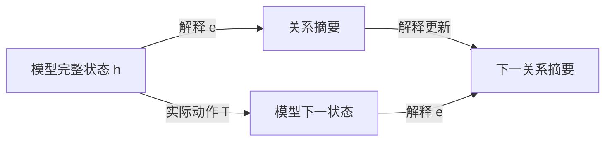

# FIB ATOM 与机器学习白盒性：五窗、关系交互与递归解释

> **参考输入。** 本卷是 [Fibonacci 原子关系生成卷](FIBONACCI_ATOMIC_RELATION_GENERATION.md) 与 [机器学习卷](CONTEXTUAL_SPACETIME_ARITHMETIC_ML.md) 的姊妹卷，给出普通数学推导与模型解释；本文新增综合尚未整体经 Lean 内核核验，不以理论文字承担形式化真值。正文聚焦五种局部窗口怎样形成可执行的解释，不预设一般神经网络已经学会这套结构。

## 1. 白盒问题要先说清解释什么

机器学习用数据选择模型的参数，使模型对指定输入产生需要的输出。选择过程可以写成更新 $\theta^+=U(\theta,\text{数据},\text{优化器状态})$；使用过程则是 $y=f_\theta(x)$，或者带记忆的 $h^+=T_\theta(h,x)$、$y=o_\theta(h)$。解释学习过程和解释使用过程，面对的状态与动作并不相同。

能查看权重和程序，提供了实现访问权。进一步给一个小表示 $e(h)$，能够计算指定输出、预测允许干预的结果，并逐步更新自身，才得到了相应任务的动态解释。人能否理解这些坐标、计算是否划算、解释的预测是否符合现实，又是另外的要求。

| 解释范围 | 要回答的问题 | 尚不能由此推出的性质 |
| --- | --- | --- |
| 实现可见 | 参数、算子、缓存是什么 | 已找到简洁机制 |
| 当前预测充分 | 这个输入为什么得到这个输出 | 新输入、干预与下一步训练仍正确 |
| 动态机制充分 | 改输入、续接或允许干预后怎样变化 | 解释坐标有唯一的人类语义 |
| 学习过程充分 | 换批次、继续训练时怎样变化 | 泛化、可靠性或价值选择必然正确 |

本卷以可计算的小系统解释这些区别。FIB ATOM 提供的核心材料是：有限的局部模式、有约束的组合、可展开的块、关系记录，以及对未来操作闭合的状态。它们给出白盒设计与检验的方法，不给任意网络指定一种普适的五分类。

## 2. 用户五分类的准确含义

**定义 2.1（低位到高位的五窗）。** 固定三个位权 $(2,3,5)$，位串记为 $b=(b_1,b_2,b_3)$，要求

$$
b_1b_2=b_2b_3=0,\qquad b_i\in\{0,1\}.
$$

于是局部字母表为

$$
\Sigma=\{000,100,010,101,001\}.
$$

| FIB 标签 | 位串 | 所选位置 | 初始窗口读数 |
| --- | --- | --- | --- |
| null | 000 | 空集 | 0 |
| 2 | 100 | 第一个位置 | 2 |
| 3 | 010 | 第二个位置 | 3 |
| 2 5 | 101 | 第一、第三个位置共同成块 | 7 |
| 5 | 001 | 第三个位置 | 5 |

这是 FIB 卷 §§57、104、141 的同一窗口，位序固定为低到高。五来自三位中禁止相邻占位。换成四位窗口就有八个合法模式；一般长度 $k$ 的模式数为 $F_{k+2}$，由“首位零后剩 $k-1$ 位、首位一后次位必须零而剩 $k-2$ 位”的递推得到。

下一组三位权是 $(8,13,21)$，五种模式仍在，读数却变成 $0,8,13,29,21$。局部组合语法与数值素性是两件事。跨窗还要检查接缝，`null` 消耗三个位置，不能视作结束或无操作。

在机器学习中，可以把这五类作为明确语法下的输入类别，或作为一个待验证的解释字典；不能从“五类”直接推出五个神经元、五个潜在因子或五态控制器。

按位置集合的包含序，非零原子只有三个单例；`101` 是复合模式，`000` 是空模式。五窗作为不可再切的读取字母，是指定窗口长度后的语法约定。关系任务中不能删除的区别，则要由任务和未来操作给出证据，不能只靠“原子”这个名称判定。

## 3. 五窗上的完整特征代数

**命题 3.1（五个合法点的交互展开）。** 任意函数 $f:\Sigma\to\mathbb R$ 唯一写成

$$
f(b)=c_0+c_1b_1+c_2b_2+c_3b_3+c_{13}b_1b_3.
\tag{3.1}
$$

其系数为

$$
\begin{aligned}
c_0&=f(000),\\
c_1&=f(100)-f(000),\\
c_2&=f(010)-f(000),\\
c_3&=f(001)-f(000),\\
c_{13}&=f(101)-f(100)-f(001)+f(000).
\end{aligned}
\tag{3.2}
$$

证明。依次代入空点和三个单点得到前四个系数；最后代入 $101$ 得到第五个。五点上的值全部恢复，且任何表示都被这些代入强制，故存在且唯一。$\square$

这里的五是合法域上函数空间的维数；一种固定线性特征字典要表示所有实值任务，至少需要五个线性独立特征。这不禁止用一个整数编码五个输入，再用非线性查表解码，也不规定一个给定任务必须使用全部五项。

**解释 3.2（相互作用相对于任务）。** $c_{13}$ 比较“共同出现的效果”与“分别出现的效果之和”。它为零当且仅当该任务在这五个点上没有超出常数和单项的贡献。例如：

$$
f_{\mathrm{sum}}(b)=2b_1+3b_2+5b_3
\quad\Longrightarrow\quad c_{13}=0;
$$

$$
f_{\mathrm{joint}}(b)=b_1b_3
\quad\Longrightarrow\quad c_{13}=1.
$$

相同的 FIB 结构，对加法读数没有交互修正，对共同出现任务却必须保留交互。这比给 `101` 贴上“复杂特征”标签更具体：有一条可计算、可反驳的等式。

由于本域上 $b_1b_2=b_2b_3=b_1b_2b_3=0$，这些特征的系数无法由合法域数据识别，也不影响域内任何输出。若另外开放 `110` 等输入，已经扩展了任务域；此时旧解释在域外的延拓不是唯一的。`101` 则本来合法，未采到它属于数据覆盖缺失，不能当成语法排除。

式（3.2）是给定输入坐标上的函数交互，不单独证明网络内部存在一个独立的交互模块，更不等于真实世界的因果效应。

## 4. 同块观察与解释系数是一对对偶坐标

**定义 4.1（合法块与共现记录）。** 设 $I$ 为有限位置集，$\mathcal A\subseteq2^I$ 非空且向下闭：$S\in\mathcal A,T\subseteq S$ 蕴含 $T\in\mathcal A$。无相邻占位的合法位置集满足此条件。一个有限块多重集给出重数 $m_S\in\mathbb N$。定义

$$
y_T=\sum_{S\in\mathcal A,\ T\subseteq S}m_S,
\qquad T\in\mathcal A.
\tag{4.1}
$$

$y_T$ 数的是多少个块同时包含 $T$，不是等价关系分块的布尔位。这里允许不同块重叠、重复；两个位置同现的次数一般不能决定三个位置共同出现的次数。$y_\varnothing$ 是块总数。

**命题 4.2（块函数与共现记录的精确配对）。** 给任意 $f:\mathcal A\to\mathbb R$，置

$$
c_T=\sum_{U\subseteq T}(-1)^{|T|-|U|}f(U).
$$

则

$$
f(S)=\sum_{T\subseteq S}c_T,
\qquad
\boxed{\sum_{S\in\mathcal A}m_Sf(S)
=\sum_{T\in\mathcal A}c_Ty_T.}
\tag{4.2}
$$

证明。第一式中 $f(U)$ 的合并系数为 $\sum_{U\subseteq T\subseteq S}(-1)^{|T|-|U|}$，$U=S$ 时为一，否则由二项式展开为零。向下闭保证所用 $f(U)$ 均有定义。第二式把有限和交换次序，再用式（4.1）。$\square$

这是有限集合 Möbius 反演的应用。FIB 卷 §62 从共现记录恢复块重数；这里从块函数恢复解释系数。二者通过式（4.2）相接：**关系记录说明共同发生了什么，任务系数说明这种共同发生对输出有什么贡献。** 有限配对并未假设块统计独立。

若 $c_\varnothing=f(\varnothing)\ne0$，必须保留 $y_\varnothing$ 的总块数贡献。这套无序统计不保存窗口次序、位置权重或接缝；第6、7节的递归任务还需要相应状态，不能仅由这些计数恢复。

**实例 4.3（7 与 10 的白盒差异）。** 沿用 FIB 卷 §58，只允许四个非空块 $[2],[3],[5],[2+5]$，重数分别为 $a_2,a_3,a_5,a_7$。记

$$
u=a_2+a_7,\qquad v=a_3,\qquad w=a_5+a_7,\qquad\kappa=a_7.
$$

若块内相加、块间相乘，则

$$
N=2^{u-\kappa}3^v5^{w-\kappa}7^\kappa,
\qquad 0\le\kappa\le\min(u,w).
$$

对每块的值取对数，使乘法总任务变为式（4.2）的加法任务，得到

$$
\boxed{\log N=u\log2+v\log3+w\log5
+\kappa\log\frac7{10}.}
\tag{4.3}
$$

空块在这个乘法例中不计入；为使用完整五点展开，可约定它的块因子为一、对数读数为零。这是乘法单位合同，不是把数值零的 `null` 拿来相乘。

$[2+5]$ 与 $[2][5]$ 有相同 $(u,v,w)=(1,0,1)$，却分别给 $N=7,10$。共同成块项的系数恰为 $\log7-\log2-\log5$。因此，删除 $\kappa$ 后，任何只对叶计数做后处理的模型都不能准确恢复这两个结果。

固定 $(u,v,w)$、允许全部上述合法重数组合时，$\kappa=0,\ldots,\min(u,w)$ 全可实现。因 $7/10\ne1$，这些 $N$ 两两不同，补充记录至少需要 $\min(u,w)+1$ 个值；记录 $\kappa$ 达到下界。若另加有限重数盒，须重新计算实际纤维，不能沿用这个全区间计数。

## 5. 训练能拟合单项，却没有识别关系

**定义 5.1（五窗线性解释模型）。** 取

$$
\phi(b)=(1,b_1,b_2,b_3,b_1b_3),\qquad
f_\theta(b)=\langle\theta,\phi(b)\rangle,
\quad\theta\in\mathbb R^5.
$$

训练集覆盖 $000,100,010,001$，但没有 $101$，损失为这些点上的平方误差。令 $e_{13}=(0,0,0,0,1)$。

**命题 5.2（缺少合法联合样本的识别缺口）。** 对任意 $t\in\mathbb R$，$\theta$ 与 $\theta+te_{13}$ 在全部训练点上预测相同，且整个训练损失相同；在 $101$ 上相差 $t$。四个训练行线性独立，故这个训练读数的参数核恰为 $\mathbb Re_{13}$。

证明。训练点的最后一个特征全部为零；空点及三个单点分别确定偏置和三个单项系数。联合点的最后一项是一。$\square$

即使训练误差为零，这个关系方向也没被数据决定。最小范数、稀疏性或初始化可以选定一个系数，但该选择是归纳偏置；没有新增数据或结构假设时，不能把它说成真实交互已经被识别。

这里的不可识别针对旧四模式的读数权限。黑盒若允许查询全部五个模式，同样可以由式（3.2）计算交互；白盒若允许读取参数，可以直接读出模型选取的 $c_{13}$。两者都还需区分“当前模型的系数”与“数据已经识别的真实目标系数”。

**命题 5.3（新联合样本使隐藏方向反馈到旧任务）。** 从相差 $te_{13}$ 的两组参数出发，对同一个新样本 $(101,y)$ 做一次同步的欧氏梯度下降，损失为 $\tfrac12(f_\theta(101)-y)^2$、步长同为 $\eta$，无正则、动量或额外更新项。更新后参数差为

$$
\Delta\theta^+=t(e_{13}-\eta\phi(101)).
\tag{5.1}
$$

因而旧空点上的预测差变为 $-\eta t$。若 $\eta t\ne0$，它们已不在旧训练读数的同一纤维。

证明。两组参数在新样本上的残差相差 $t$，梯度相差 $t\phi(101)$；从原参数差中减去步长乘梯度差得式（5.1）。空点只读取偏置，取第一坐标即得。$\square$

**解释 5.4（反馈取决于特征与优化规则）。** 对一般线性特征模型，一次上述更新使任意输入 $x$ 的输出变为

$$
f^+(x)=f(x)-\eta(f(z)-y)K(x,z),\qquad
K(x,z)=\langle\phi(x),\phi(z)\rangle.
\tag{5.2}
$$

五窗交互字典满足 $K(000,101)=1$，所以新增联合样本会更新旧空点的偏置。改用五模式的独热坐标 $\psi(b)=e_b$，并在该坐标做欧氏梯度下降，则 $K(x,z)=\mathbf1_{x=z}$，新 $101$ 样本不改变旧四模式。两套特征都能表达所有五点函数，却产生不同学习动态。这里的反馈由表示与优化度量共同决定，不是 FIB 语法对所有学习算法的强制结论。

取 Fibonacci 读数 $q(u,v)=2u+3v$ 与推进 $M(u,v)=(v,u+v)$，有 $q(3,-2)=0$、$q(M(3,-2))=-1$。它与命题5.3共享一个可核对的机制：原观察的核不被新增动作保持。后者的动作是读入一个合法联合样本并学习；没有要求神经网络的更新矩阵等于 Fibonacci 矩阵。

## 6. 五种输入，却只需四个结构状态

**定义 6.1（接缝与 End 任务）。** 逐窗按低位到高位读取。状态记录上一位 $s\in\{0,1\}$ 和上一窗是否非零 $E\in\{0,1\}$。若 $s b_1=1$，接缝非法并进入吸收失败态；否则更新为

$$
(s^+,E^+)=(b_3,\mathbf1_{b\ne000}).
\tag{6.1}
$$

End 是一次结束查询，成功当且仅当当前 $E=1$。取无单位位的初态 $(s,E)=(0,0)$，故空串不接受。该模型只检查结构，不输出数值，也不保留全部历史。它是原卷 §104 的初始化取单位位零时的结构部分。

End 不属于可继续读取的窗口字母表。若把它改成输入字母，并要求拒绝 End 后的所有输入，则须另计终止后的接收态；下述四态数只针对窗串及其终端查询。

**命题 6.2（四态结构解释）。** 所有可达结构状态恰为

$$
A=(0,0),\quad B=(0,1),\quad C=(1,1),\quad D=\mathrm{fail}.
$$

其转移表为：

| 当前状态 | null / 000 | 2 / 100 | 3 / 010 | 2 5 / 101 | 5 / 001 | End 成功 |
| --- | --- | --- | --- | --- | --- | --- |
| A | A | B | B | C | C | 否 |
| B | A | B | B | C | C | 是 |
| C | A | D | B | D | C | 是 |
| D | D | D | D | D | D | 否 |

这四态在确定性、只读后续窗并最终询问 End 的模型中同时充分且最小。

证明。式（6.1）给出表，每个合法窗满足 $b_3=1\Rightarrow b\ne000$，故 $(1,0)$ 不可达。$A$ 初始可达，$100$ 到 $B$，$001$ 到 $C$，$001,100$ 到 $D$。End 区分 $A$ 与 $B,C$，也区分 $D$ 与 $B,C$；续接 $100$ 后 End 区分 $B,C$；续接 $010$ 后 End 区分 $A,D$。所以四态两两有未来见证，任意准确实现至少四个可达状态。表给上界。$\square$

这是一张完整的小白盒：不仅说“模型记得接缝”，还列出它怎样记、怎样更新、每份记忆为什么不能再删。五个输入标签、四个行为状态、五维局部函数空间，是三个不同的数量。

`null` 从 $B$ 到 $A$ 会改变能否 End；从 $C$ 到 $A$ 还会解除接缝限制。把它解释成“什么都没发生”，会同时错判两种未来。

## 7. 数值任务需要额外递归状态

**定义 7.1（同一低位扫描中的数值接口）。** 当前累计值为 $r$，当前窗前两个位权为 $u,v$，第三个位权为 $u+v$。初始 $(r,u,v)=(0,2,3)$。在合法读窗后，按表加入数值：

| 窗口标签 | 累计值增量 $d_b(u,v)$ |
| --- | --- |
| null | 0 |
| 2 | $u$ |
| 3 | $v$ |
| 2 5 | $2u+v$ |
| 5 | $u+v$ |

同时更新

$$
r^+=r+d_b(u,v),\qquad
\binom{u^+}{v^+}
=\begin{pmatrix}1&2\\2&3\end{pmatrix}\binom u v.
\tag{7.1}
$$

三步位权推进就是 $M^3$，其中 $M=\begin{pmatrix}0&1\\1&1\end{pmatrix}$。接缝、End 按第6节更新。合法 End 返回 $r$，其余返回失败标签。对输入窗数归纳，$(r,u,v,s,E)$ 因而给完整数值任务的闭合接口。

这里坚持低位到高位扫描。原卷 §236 的高位到低位 Horner 写法把三步推进作用于累计组成，接缝方向也相反；不能直接拿那张公式替换式（7.1）。

**命题 7.2（有限结构记忆不等于有限数值记忆）。** 四态结构接口不足以恢复任意长度字串的精确整数值。任何要求在任意 End 精确输出整数、且无外部累计寄存器的确定性实现，都需要无限多个可达状态。

证明。连续读 $k\ge1$ 个 $100$ 窗，每条接缝合法，End 成功，结构态全为 $B$；累计数值为

$$
\sum_{j=0}^{k-1}F_{3j+3}.
$$

各项正，随 $k$ 严格增加。因此这些历史必须占不同的输出状态。$\square$

若任务只要模 $m\ge2$ 的输出，把 $(r,u,v)$ 全部模 $m$ 化，配三个合法结构态和一个失败态，得到至多 $3m^3+1$ 个状态的准确上界。并未证明这些组合全可达或彼此不可合并。读取位置若由外部提供，$u,v$ 可按位置计算，但位置与计算费用必须另记。

**解释 7.3（五窗递归与神经状态）。** 一个学习模型可以用很多神经元实现四态结构解释，也可以用很少的实数坐标编码更大甚至无限的状态族。神经元数、可区分状态数和存储位数不能互相替代。FIB 的有限窗口提供的是局部语法；递归深度和数值精度仍会增加任务负担。

## 8. 从手写白盒到学习模型，需要交换关系

**定义 8.1（指定任务的解释合同）。** 设学习模型在已声明的可达载体 $H$ 上运行，操作 $a$ 的部分更新为 $T_a:D_a\to H$，所需读数为 $o$。解释 $e:H\to Q$ 的值域取实际像，要求有读出 $\bar o$、合法域 $\bar D_a$ 和更新 $\bar T_a$ 满足

$$
\begin{aligned}
o(h)&=\bar o(e(h)),\\
h\in D_a&\Longleftrightarrow e(h)\in\bar D_a,\\
e(T_a h)&=\bar T_a(e(h))\quad(h\in D_a).
\end{aligned}
\tag{8.1}
$$

来源、允许查询、干预和记录要求均固定在合同里。操作后仍须落在 $H$，或明确扩大载体；比较同一高层干预的不同低层实现时，另需给出相容的干预映射。

逐词归纳可知式（8.1）保持全部合法性与输出。反向，解释值相同但某个未来结果不同，就否定该解释对相应动作族的充分性。仓内 `TargetRecoveryCriterion`、`DynamicClosureMinimality`、`ControlledBehaviorUniversality` 分别提供目标纤维、动态细化和有限实现的相关接口；使用时仍须满足各自前件。

图的两条路径得到相同摘要，是一个可检验的承诺。给隐藏状态训练一个能读出“接缝位”的探针，仅验证了解码的一部分；还应检验模型遇到 $100$、$001$、`null` 时，探针读数是否按第6节转移，并检验实际输出。

手写出正确的四态自动机，证明的是这项任务有一个白盒实现。要说已训练的网络具有这个机制，还需构造并验证该网络上的 $e$。有限测试没找到反例，只说明相应测试集上未找到反例。

## 9. 同一预测函数，也可以有不同学习未来

**实例 9.1（两层模型的参数纤维）。** 对标量两层线性模型

$$
f_{a,b}(x)=abx,\qquad w=ab,\qquad s=a^2+b^2,
$$

用固定损失 $\ell(w)$、步长 $\eta$ 做同步欧氏梯度下降。记 $g=\ell'(w)$、$\alpha=\eta g$。原 ML 卷 §9 的公式给

$$
\begin{aligned}
a^+&=a-\alpha b,& b^+&=b-\alpha a,\\
w^+&=(1+\alpha^2)w-\alpha s,&
s^+&=(1+\alpha^2)s-4\alpha w.
\end{aligned}
\tag{9.1}
$$

后两式分别由乘积和平方和展开得到。$w$ 足以解释固定参数下全部输入的预测，却一般不足以解释下一次训练。以 $\ell(w)=w^2/2,\eta=1/10$ 为例，

$$
(a,b)=(1,1),\ (2,1/2)
$$

都有 $w=1$，但 $s=2,17/4$，下一步 $w^+$ 分别是 $81/100,117/200$。

这个训练任务至少必须补充能区分上述两个 $s$ 值的信息；加入 $(w,s)$ 后式（9.1）闭合，并不要求所有准确编码都把该坐标命名为 $s$。固定损失与更新规则是结论的一部分，动量、Adam、不同坐标的优化度量或新的参数干预会改变合同。若 $g=0$ 且后续始终无新任务，参数可驻定，不应宣称所有纤维差异都必然显现。

这个例子与第5节互补：第5节保持同一参数化而扩大训练数据，第9节保持同一预测函数而比较不同参数因子。二者都要求解释学习时保留未来会反馈到输出的隐藏区别。

## 10. 关系原子不等于一个神经元

**解释 10.1（坐标变化与同一行为）。** 对两层线性网络 $f(x)=W_2W_1x$，任意可逆隐藏换基 $A$ 给

$$
W'_1=AW_1,\qquad W'_2=W_2A^{-1},\qquad
W'_2W'_1=W_2W_1.
$$

因此内部坐标名称和逐坐标激活值不由输入输出函数唯一决定。一般非线性网络不能随意用这个全可逆换基；例如 ReLU 只在相应置换、正缩放等确实保持运算的变换下适用。第9节还说明，保持当前函数的重参数化不自动保持欧氏训练动态。

若低层干预是“将某个神经元归零”，换基后应运输同一个干预算子；换成“仍把第一个坐标归零”通常已换了实验。任务相对的行为商规范，不代表一套神经元分工、一个最稀疏字典或一个人类概念命名也规范。

**实例 10.2（能读出概念，不等于该坐标在被使用）。** 令隐藏态 $h=(x,x)$，输出 $y=h_1$。两个坐标都能完美预测 $x$；在这个实现中将 $h_2$ 置零却不改变输出。探针的成功证明信息可解码，未证明输出通过该坐标产生。

消融后没有变化也不能一般推出关系无作用：冗余路径、饱和区、错误的干预范围都可能遮蔽变化。应固定允许的替换与背景，比较实际输出，并核对式（8.1）；不要把任意离开可达像的激活拼接当作自然数据的反事实。

FIB 的 $101$ 给一个有来源的联合特征；稀疏自编码器中的一个激活方向还取决于数据支撑、字典规范和优化目标。[白盒纤维律卷](WHITE_BOX_LOSS_FIBER_LAW.md)第4章的特征吸收实例说明，重构和稀疏性可以偏好共同出现的方向；它们不自动把真实生成因子逐一恢复。

**约定 10.3（两份“五”保持分层）。** 本卷的五分类是第2节的五个合法窗口。此前讨论的五种原子含义——语法叶、可展开封装、数量乘法素元、操作不可约结构、任务行为区别——是不同层次的概念表，不与五个窗口逐项对应。`null` 尤其不是一个素元；`2 5` 也不自动是一种独立神经机制。称某个区别为“关系原子”，须至少附上任务、允许操作、它被合并时的错误见证；这仍不声称有唯一的生成元分解。

## 11. 怎样把解释变成可检验的学习任务

一个具体的 FIB 白盒实验可以同时保留三类目标，而不是只训练一次五分类：

1. **局部语义**：输出五窗类别、数值或 $b_1b_3$；用式（3.2）测量交互系数，并明确是否覆盖 $101$。
2. **递归结构**：预测下一窗是否合法以及能否 End；比较模型摘要与第6节四态转移，特别测试 `null` 和非法接缝。
3. **数值行为**：预测指定精度下的累计值；检验式（7.1），比较同结构态、不同数值态的历史。

这些目标不要求模型使用同一份最小表示。若还要解释训练，把优化器记忆、批次输入和参数状态并入合同，用第5、9节的成对实例测试当前解释是否闭合。

**判据 11.1（恢复与分离）。** 候选解释要被称为某个有限确定性任务的最小准确实现，需要两类证据：所有实际状态和动作上成立的恢复、保域与更新等式，以及每对不同可达解释状态的未来区分词。前者排除错误合并，后者排除冗余。第6节四态表同时给了这两类证据。

如果学习网络的可达隐藏态尚未被完整刻画，抽取出的有限表不能单独替网络通过前一项。可以证明一个覆盖可达态的归纳不变量，再逐动作验证；只有样本检验时应报告样本范围与反例，不能把长串泛化准确率改称全域证明。

近似解释还需指定度量、误差和允许时域。若状态误差满足 $e_{t+1}\le Le_t+\varepsilon$，则 $e_t\le L^te_0+\varepsilon\sum_{j=0}^{t-1}L^j$；但接缝、End 这样的离散判定还需守卫裕量或精确的标签保持。数值接近不自动保证走相同分支。相关完整条件见 ML 卷 §§21、25–26。

## 12. 本卷提供的连接与尚未取得的结果

FIB 五窗给出的学习对象可写为

$$
\boxed{\text{合法局部模式}
\ \longrightarrow\ \text{单项与关系交互}
\ \longrightarrow\ \text{带接缝的递归状态}
\ \longrightarrow\ \text{指定任务的动态解释}.}
$$

五点函数展开与同块记录的配对是这里的具体桥梁：$c_{13}$ 描述任务对共现的响应，$\kappa$ 描述实际共现次数。缺失联合训练样本留下未识别方向；新增联合样本能让这个方向反馈到旧预测。结构任务具有四态解释，精确无界数值任务则不能由四态承担。

这些内容既不证明任意大型网络已有短小的全局解释，也不证明 FIB 坐标在真实学习任务上优于其他表示。本文没有训练神经网络、测量泛化收益或完成一般因果抽象的提取算法。尚待研究的具体问题是：在选定模型与干预族上，能否实际提取满足式（8.1）的低成本表示；哪些关系必须保留；超出有限窗口后需要增加哪些状态。

## 13. 来源与核验范围

| 来源 | 本卷使用的内容与边界 |
| --- | --- |
| [FIB 原卷](FIBONACCI_ATOMIC_RELATION_GENERATION.md) §§57–58、62、104、141、236–237 | 五窗、块重数与 $\kappa$、位序、接缝和三步递归；不从素数或共同谱推断学习能力 |
| [ML 卷](CONTEXTUAL_SPACETIME_ARITHMETIC_ML.md) §§2–3、9、13、19、21 | 任务充分性、两层训练闭包、优化器状态、因果干预与近似误差；第9节公式在这里直接复用 |
| [白盒纤维律卷](WHITE_BOX_LOSS_FIBER_LAW.md) §§3–4 | 训练读数纤维与特征吸收；不将线性或特定字典结论外推到所有网络 |
| [LiteralWindowEnd.lean](../../../D5/S3/Arith/FibonacciAtomic/LiteralWindowEnd.lean) 的 `Window`、`bits`、`step`、`execution` | 五个实际构造子、部分语言的失败总化与 End；第6节四态最小性是本文针对结构子任务的推导，不冒称源码已逐字给出 |
| [DynamicClosureMinimality.lean](../../../D5/S3/ConceptDynamics/Interventions/DynamicClosureMinimality.lean) | 动态闭包及其最小细化接口；实际网络的闭合前件仍需验证 |
| [TargetRecoveryCriterion.lean](../../../D5/S3/ConceptDynamics/Restoration/TargetRecoveryCriterion.lean) | 目标在观察纤维上常值的恢复判据；不提供缺失实验数据 |
| [Geiger 等，Causal Abstraction](https://www.jmlr.org/papers/v26/23-0058.html)，JMLR 26(83) | 因果抽象需要状态和干预的对应；平均干预准确率不等于全域精确抽象，库内来源见 [条目](../../../Library/Dynamics/geiger2025causal.md) |
| [Elhage 等，Toy Models of Superposition](https://arxiv.org/abs/2209.10652)；[Chanin 等，A is for Absorption](https://arxiv.org/abs/2409.14507) | 分布式特征与特征吸收的相关研究背景；不充当本文五窗定理或任意网络解释成功的证据 |

五点展开、有限集合 Möbius 反演、自动机剩余行为及梯度代数均属成熟工具。本卷提供它们在固定 FIB 任务上的综合应用，不宣称这些工具原创。新增综合的证据是所列普通证明；没有新增冻结声明，也未把有限检查提升为全称 Lean 核验。

## 追加锚（本行以下为增补区）
