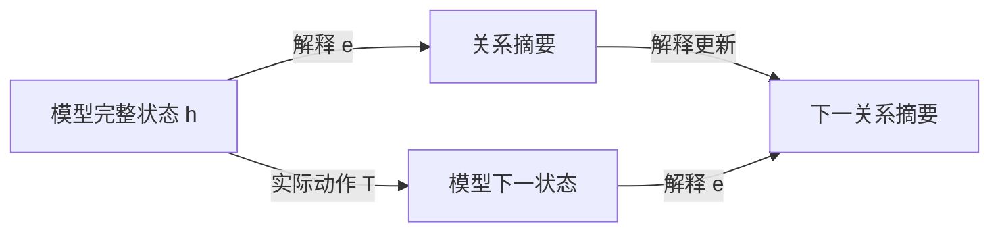

# FIB ATOM 与机器学习白盒性：五窗、关系交互与递归解释

> **参考输入。** 本卷是 [Fibonacci 原子关系生成卷](FIBONACCI_ATOMIC_RELATION_GENERATION.md) 与 [机器学习卷](CONTEXTUAL_SPACETIME_ARITHMETIC_ML.md) 的姊妹卷，给出普通数学推导与模型解释；本文新增综合尚未整体经 Lean 内核核验，不以理论文字承担形式化真值。正文聚焦五种局部窗口怎样形成可执行的解释，不预设一般神经网络已经学会这套结构。

## 1. 白盒问题要先说清解释什么

机器学习用数据选择模型的参数，使模型对指定输入产生需要的输出。选择过程可以写成更新 $\theta^+=U(\theta,\text{数据},\text{优化器状态})$；使用过程则是 $y=f_\theta(x)$，或者带记忆的 $h^+=T_\theta(h,x)$、$y=o_\theta(h)$。解释学习过程和解释使用过程，面对的状态与动作并不相同。

能查看权重和程序，提供了实现访问权。进一步给一个小表示 $e(h)$，能够计算指定输出、预测允许干预的结果，并逐步更新自身，才得到了相应任务的动态解释。人能否理解这些坐标、计算是否划算、解释的预测是否符合现实，又是另外的要求。

| 解释范围 | 要回答的问题 | 尚不能由此推出的性质 |
| --- | --- | --- |
| 实现可见 | 参数、算子、缓存是什么 | 已找到简洁机制 |
| 当前预测充分 | 这个输入为什么得到这个输出 | 新输入、干预与下一步训练仍正确 |
| 动态机制充分 | 改输入、续接或允许干预后怎样变化 | 解释坐标有唯一的人类语义 |
| 学习过程充分 | 换批次、继续训练时怎样变化 | 泛化、可靠性或价值选择必然正确 |

本卷以可计算的小系统解释这些区别。FIB ATOM 提供的核心材料是：有限的局部模式、有约束的组合、可展开的块、关系记录，以及对未来操作闭合的状态。它们给出白盒设计与检验的方法，不给任意网络指定一种普适的五分类。

## 2. 用户五分类的准确含义

**定义 2.1（低位到高位的五窗）。** 固定三个位权 $(2,3,5)$，位串记为 $b=(b_1,b_2,b_3)$，要求

$$
b_1b_2=b_2b_3=0,\qquad b_i\in\{0,1\}.
$$

于是局部字母表为

$$
\Sigma=\{000,100,010,101,001\}.
$$

| FIB 标签 | 位串 | 所选位置 | 初始窗口读数 |
| --- | --- | --- | --- |
| null | 000 | 空集 | 0 |
| 2 | 100 | 第一个位置 | 2 |
| 3 | 010 | 第二个位置 | 3 |
| 2 5 | 101 | 第一、第三个位置共同成块 | 7 |
| 5 | 001 | 第三个位置 | 5 |

原卷 §57 按高到低的 $(b_5,b_3,b_2)$ 写字面位串，下标表示对应位权；本文采用原卷 §§104、141 的低到高坐标。反转映射 $\rho(x,y,z)=(z,y,x)$ 保持所选位置集合：原卷 §57 的 `001` 对应本文的 `100`，都选择位权 2；该节的 `100` 对应本文的 `001`，都选择位权 5。`000`、`010`、`101` 在反转下不变。

五来自三位中禁止相邻占位。换成四位窗口就有八个合法模式；一般长度 $k$ 的模式数为 $F_{k+2}$，由“首位零后剩 $k-1$ 位、首位一后次位必须零而剩 $k-2$ 位”的递推得到。

下一组三位权是 $(8,13,21)$，五种模式仍在，读数却变成 $0,8,13,29,21$。局部组合语法与数值素性是两件事。跨窗还要检查接缝，`null` 消耗三个位置，不能视作结束或无操作。

在机器学习中，可以把这五类作为明确语法下的输入类别，或作为一个待验证的解释字典；不能从“五类”直接推出五个神经元、五个潜在因子或五态控制器。

按位置集合的包含序，非零原子只有三个单例；`101` 是复合模式，`000` 是空模式。五窗作为不可再切的读取字母，是指定窗口长度后的语法约定。关系任务中不能删除的区别，则要由任务和未来操作给出证据，不能只靠“原子”这个名称判定。

## 3. 五窗上的完整特征代数

**命题 3.1（五个合法点的交互展开）。** 任意函数 $f:\Sigma\to\mathbb R$ 唯一写成

$$
f(b)=c_0+c_1b_1+c_2b_2+c_3b_3+c_{13}b_1b_3.
\tag{3.1}
$$

其系数为

$$
\begin{aligned}
c_0&=f(000),\\
c_1&=f(100)-f(000),\\
c_2&=f(010)-f(000),\\
c_3&=f(001)-f(000),\\
c_{13}&=f(101)-f(100)-f(001)+f(000).
\end{aligned}
\tag{3.2}
$$

证明。依次代入空点和三个单点得到前四个系数；最后代入 $101$ 得到第五个。五点上的值全部恢复，且任何表示都被这些代入强制，故存在且唯一。$\square$

这里的五是合法域上函数空间的维数；一种固定线性特征字典要表示所有实值任务，至少需要五个线性独立特征。这不禁止用一个整数编码五个输入，再用非线性查表解码，也不规定一个给定任务必须使用全部五项。

**解释 3.2（相互作用相对于任务）。** $c_{13}$ 比较“共同出现的效果”与“分别出现的效果之和”。它为零当且仅当该任务在这五个点上没有超出常数和单项的贡献。例如：

$$
f_{\mathrm{sum}}(b)=2b_1+3b_2+5b_3
\quad\Longrightarrow\quad c_{13}=0;
$$

$$
f_{\mathrm{joint}}(b)=b_1b_3
\quad\Longrightarrow\quad c_{13}=1.
$$

相同的 FIB 结构，对加法读数没有交互修正，对共同出现任务却必须保留交互。这比给 `101` 贴上“复杂特征”标签更具体：有一条可计算、可反驳的等式。

由于本域上 $b_1b_2=b_2b_3=b_1b_2b_3=0$，这些特征的系数无法由合法域数据识别，也不影响域内任何输出。若另外开放 `110` 等输入，已经扩展了任务域；此时旧解释在域外的延拓不是唯一的。`101` 则本来合法，未采到它属于数据覆盖缺失，不能当成语法排除。

式（3.2）是给定输入坐标上的函数交互，不单独证明网络内部存在一个独立的交互模块，更不等于真实世界的因果效应。

## 4. 同块观察与解释系数是一对对偶坐标

**定义 4.1（合法块与共现记录）。** 设 $I$ 为有限位置集，$\mathcal A\subseteq2^I$ 非空且向下闭：$S\in\mathcal A,T\subseteq S$ 蕴含 $T\in\mathcal A$。无相邻占位的合法位置集满足此条件。一个有限块多重集给出重数 $m_S\in\mathbb N$。定义

$$
y_T=\sum_{S\in\mathcal A,\ T\subseteq S}m_S,
\qquad T\in\mathcal A.
\tag{4.1}
$$

$y_T$ 数的是多少个块同时包含 $T$，不是等价关系分块的布尔位。这里允许不同块重叠、重复；两个位置同现的次数一般不能决定三个位置共同出现的次数。$y_\varnothing$ 是块总数。

**命题 4.2（块函数与共现记录的精确配对）。** 给任意 $f:\mathcal A\to\mathbb R$，置

$$
c_T=\sum_{U\subseteq T}(-1)^{|T|-|U|}f(U).
$$

则

$$
f(S)=\sum_{T\subseteq S}c_T,
\qquad
\boxed{\sum_{S\in\mathcal A}m_Sf(S)
=\sum_{T\in\mathcal A}c_Ty_T.}
\tag{4.2}
$$

证明。第一式中 $f(U)$ 的合并系数为 $\sum_{U\subseteq T\subseteq S}(-1)^{|T|-|U|}$，$U=S$ 时为一，否则由二项式展开为零。向下闭保证所用 $f(U)$ 均有定义。第二式把有限和交换次序，再用式（4.1）。$\square$

这是有限集合 Möbius 反演的应用。FIB 卷 §62 从共现记录恢复块重数；这里从块函数恢复解释系数。二者通过式（4.2）相接：**关系记录说明共同发生了什么，任务系数说明这种共同发生对输出有什么贡献。** 有限配对并未假设块统计独立。

若 $c_\varnothing=f(\varnothing)\ne0$，必须保留 $y_\varnothing$ 的总块数贡献。这套无序统计不保存窗口次序、位置权重或接缝；第6、7节的递归任务还需要相应状态，不能仅由这些计数恢复。

**实例 4.3（7 与 10 的白盒差异）。** 沿用 FIB 卷 §58，只允许四个非空块 $[2],[3],[5],[2+5]$，重数分别为 $a_2,a_3,a_5,a_7$。记

$$
u=a_2+a_7,\qquad v=a_3,\qquad w=a_5+a_7,\qquad\kappa=a_7.
$$

若块内相加、块间相乘，则

$$
N=2^{u-\kappa}3^v5^{w-\kappa}7^\kappa,
\qquad 0\le\kappa\le\min(u,w).
$$

对每块的值取对数，使乘法总任务变为式（4.2）的加法任务，得到

$$
\boxed{\log N=u\log2+v\log3+w\log5
+\kappa\log\frac7{10}.}
\tag{4.3}
$$

空块在这个乘法例中不计入；为使用完整五点展开，可约定它的块因子为一、对数读数为零。这是乘法单位合同，不是把数值零的 `null` 拿来相乘。

$[2+5]$ 与 $[2][5]$ 有相同 $(u,v,w)=(1,0,1)$，却分别给 $N=7,10$。共同成块项的系数恰为 $\log7-\log2-\log5$。因此，删除 $\kappa$ 后，任何只对叶计数做后处理的模型都不能准确恢复这两个结果。

固定 $(u,v,w)$、允许全部上述合法重数组合时，$\kappa=0,\ldots,\min(u,w)$ 全可实现。因 $7/10\ne1$，这些 $N$ 两两不同，补充记录至少需要 $\min(u,w)+1$ 个值；记录 $\kappa$ 达到下界。若另加有限重数盒，须重新计算实际纤维，不能沿用这个全区间计数。

## 5. 训练能拟合单项，却没有识别关系

**定义 5.1（五窗线性解释模型）。** 取

$$
\phi(b)=(1,b_1,b_2,b_3,b_1b_3),\qquad
f_\theta(b)=\langle\theta,\phi(b)\rangle,
\quad\theta\in\mathbb R^5.
$$

训练集覆盖 $000,100,010,001$，但没有 $101$，损失为这些点上的平方误差。令 $e_{13}=(0,0,0,0,1)$。

**命题 5.2（缺少合法联合样本的识别缺口）。** 对任意 $t\in\mathbb R$，$\theta$ 与 $\theta+te_{13}$ 在全部训练点上预测相同，且整个训练损失相同；在 $101$ 上相差 $t$。四个训练行线性独立，故这个训练读数的参数核恰为 $\mathbb Re_{13}$。

证明。训练点的最后一个特征全部为零；空点及三个单点分别确定偏置和三个单项系数。联合点的最后一项是一。$\square$

即使训练误差为零，这个关系方向也没被数据决定。最小范数、稀疏性或初始化可以选定一个系数，但该选择是归纳偏置；没有新增数据或结构假设时，不能把它说成真实交互已经被识别。

这里的不可识别针对旧四模式的读数权限。黑盒若允许查询全部五个模式，同样可以由式（3.2）计算交互；白盒若允许读取参数，可以直接读出模型选取的 $c_{13}$。两者都还需区分“当前模型的系数”与“数据已经识别的真实目标系数”。

**命题 5.3（新联合样本使隐藏方向反馈到旧任务）。** 从相差 $te_{13}$ 的两组参数出发，对同一个新样本 $(101,y)$ 做一次同步的欧氏梯度下降，损失为 $\tfrac12(f_\theta(101)-y)^2$、步长同为 $\eta$，无正则、动量或额外更新项。更新后参数差为

$$
\Delta\theta^+=t(e_{13}-\eta\phi(101)).
\tag{5.1}
$$

因而旧空点上的预测差变为 $-\eta t$。若 $\eta t\ne0$，它们已不在旧训练读数的同一纤维。

证明。两组参数在新样本上的残差相差 $t$，梯度相差 $t\phi(101)$；从原参数差中减去步长乘梯度差得式（5.1）。空点只读取偏置，取第一坐标即得。$\square$

**解释 5.4（反馈取决于特征与优化规则）。** 对一般线性特征模型，一次上述更新使任意输入 $x$ 的输出变为

$$
f^+(x)=f(x)-\eta(f(z)-y)K(x,z),\qquad
K(x,z)=\langle\phi(x),\phi(z)\rangle.
\tag{5.2}
$$

五窗交互字典满足 $K(000,101)=1$，旧空点输出的改变量为 $-\eta(f(101)-y)$，该量非零时输出改变。改用五模式的独热坐标 $\psi(b)=e_b$，并在该坐标做欧氏梯度下降，则 $K(x,z)=\mathbf1_{x=z}$，新 $101$ 样本不改变旧四模式。两套特征都能表达所有五点函数，却产生不同学习动态。这里的反馈由表示与优化度量共同决定，不是 FIB 语法对所有学习算法的强制结论。

取 Fibonacci 读数 $q(u,v)=2u+3v$ 与推进 $M(u,v)=(v,u+v)$，有 $q(3,-2)=0$、$q(M(3,-2))=-1$。它与命题5.3共享一个可核对的机制：原观察的核不被新增动作保持。后者的动作是读入一个合法联合样本并学习；没有要求神经网络的更新矩阵等于 Fibonacci 矩阵。

## 6. 五种输入，却只需四个结构状态

**定义 6.1（接缝与 End 任务）。** 逐窗按低位到高位读取。状态记录上一位 $s\in\{0,1\}$ 和上一窗是否非零 $E\in\{0,1\}$。若 $s b_1=1$，接缝非法并进入吸收失败态；否则更新为

$$
(s^+,E^+)=(b_3,\mathbf1_{b\ne000}).
\tag{6.1}
$$

End 是一次结束查询，成功当且仅当当前 $E=1$。取无单位位的初态 $(s,E)=(0,0)$，故空串不接受。该模型只检查结构，不输出数值，也不保留全部历史。它是原卷 §104 的初始化取单位位零时的结构部分。

End 不属于可继续读取的窗口字母表。若把它改成输入字母，并要求拒绝 End 后的所有输入，则须另计终止后的接收态；下述四态数只针对窗串及其终端查询。

**命题 6.2（四态结构解释）。** 所有可达结构状态恰为

$$
A=(0,0),\quad B=(0,1),\quad C=(1,1),\quad D=\mathrm{fail}.
$$

其转移表为：

| 当前状态 | null / 000 | 2 / 100 | 3 / 010 | 2 5 / 101 | 5 / 001 | End 成功 |
| --- | --- | --- | --- | --- | --- | --- |
| A | A | B | B | C | C | 否 |
| B | A | B | B | C | C | 是 |
| C | A | D | B | D | C | 是 |
| D | D | D | D | D | D | 否 |

这四态在确定性、只读后续窗并最终询问 End 的模型中同时充分且最小。

证明。式（6.1）给出表，每个合法窗满足 $b_3=1\Rightarrow b\ne000$，故 $(1,0)$ 不可达。$A$ 初始可达，$100$ 到 $B$，$001$ 到 $C$，$001,100$ 到 $D$。End 区分 $A$ 与 $B,C$，也区分 $D$ 与 $B,C$；续接 $100$ 后 End 区分 $B,C$；续接 $010$ 后 End 区分 $A,D$。所以四态两两有未来见证，任意准确实现至少四个可达状态。表给上界。$\square$

这是一张完整的小白盒：不仅说“模型记得接缝”，还列出它怎样记、怎样更新、每份记忆为什么不能再删。五个输入标签、四个行为状态、五维局部函数空间，是三个不同的数量。

`null` 从 $B$ 到 $A$ 会改变能否 End；从 $C$ 到 $A$ 还会解除接缝限制。把它解释成“什么都没发生”，会同时错判两种未来。

## 7. 数值任务需要额外递归状态

**定义 7.1（同一低位扫描中的数值接口）。** 承接第6节，固定单位位 $\varepsilon=0$。当前累计值为 $r$，当前窗前两个位权为 $u,v$，第三个位权为 $u+v$。初始 $(r,u,v)=(0,2,3)$。在合法读窗后，按表加入数值：

| 窗口标签 | 累计值增量 $d_b(u,v)$ |
| --- | --- |
| null | 0 |
| 2 | $u$ |
| 3 | $v$ |
| 2 5 | $2u+v$ |
| 5 | $u+v$ |

同时更新

$$
r^+=r+d_b(u,v),\qquad
\binom{u^+}{v^+}
=\begin{pmatrix}1&2\\2&3\end{pmatrix}\binom u v.
\tag{7.1}
$$

三步位权推进就是 $M^3$，其中 $M=\begin{pmatrix}0&1\\1&1\end{pmatrix}$。接缝、End 按第6节更新。合法 End 返回 $r$，其余返回失败标签。对输入窗数归纳，$(r,u,v,s,E)$ 因而给完整数值任务的闭合接口。

这里坚持低位到高位扫描。原卷 §236 的高位到低位 Horner 写法把三步推进作用于累计组成，接缝方向也相反；不能直接拿那张公式替换式（7.1）。

**命题 7.2（有限结构记忆不等于有限数值记忆）。** 四态结构接口不足以恢复任意长度的合法且可 End 窗串的精确整数值。这里的候选是固定初态、只读窗串的确定性状态实现：每个窗口字母对应一个固定状态转移，End 输出仅由当前状态决定，不另获免费的外部时钟、位置、输入历史访问或累计寄存器。若它对所有有限合法且可 End 的窗串均精确输出整数值，则需要无限多个可达状态。

证明。连续读 $k\ge1$ 个 $100$ 窗，每条接缝合法，End 成功，结构态全为 $B$；累计数值为

$$
\sum_{j=0}^{k-1}F_{3j+3}.
$$

各项正，随 $k$ 严格增加。因此这些历史必须占不同的输出状态。$\square$

若任务只要模 $m\ge2$ 的输出，把 $(r,u,v)$ 全部模 $m$ 化，配三个合法结构态和一个失败态，得到至多 $3m^3+1$ 个状态的准确上界。并未证明这些组合全可达或彼此不可合并。读取位置若由外部提供，$u,v$ 可按位置计算，但位置与计算费用必须另记。

**解释 7.3（五窗递归与神经状态）。** 一个学习模型可以用很多神经元实现四态结构解释，也可以用很少的实数坐标编码更大甚至无限的状态族。神经元数、可区分状态数和存储位数不能互相替代。FIB 的有限窗口提供的是局部语法；递归深度和数值精度仍会增加任务负担。

## 8. 从手写白盒到学习模型，需要交换关系

**定义 8.1（指定任务的解释合同）。** 设学习模型在已声明的可达载体 $H$ 上运行，操作 $a$ 的部分更新为 $T_a:D_a\to H$，所需读数为 $o$。解释 $e:H\to Q$ 的值域取实际像，要求有读出 $\bar o$、合法域 $\bar D_a$ 和更新 $\bar T_a$ 满足

$$
\begin{aligned}
o(h)&=\bar o(e(h)),\\
h\in D_a&\Longleftrightarrow e(h)\in\bar D_a,\\
e(T_a h)&=\bar T_a(e(h))\quad(h\in D_a).
\end{aligned}
\tag{8.1}
$$

来源、允许查询、干预和记录要求均固定在合同里。操作后仍须落在 $H$，或明确扩大载体；比较同一高层干预的不同低层实现时，另需给出相容的干预映射。

逐词归纳可知式（8.1）保持全部合法性与输出。反向，解释值相同但某个未来结果不同，就否定该解释对相应动作族的充分性。仓内 `TargetRecoveryCriterion`、`DynamicClosureMinimality`、`ControlledBehaviorUniversality` 分别提供目标纤维、动态细化和有限实现的相关接口；使用时仍须满足各自前件。

图的两条路径得到相同摘要，是一个可检验的承诺。给隐藏状态训练一个能读出“接缝位”的探针，仅验证了解码的一部分；还应检验模型遇到 $100$、$001$、`null` 时，探针读数是否按第6节转移，并检验实际输出。

手写出正确的四态自动机，证明的是这项任务有一个白盒实现。要说已训练的网络具有这个机制，还需构造并验证该网络上的 $e$。有限测试没找到反例，只说明相应测试集上未找到反例。

## 9. 同一预测函数，也可以有不同学习未来

**实例 9.1（两层模型的参数纤维）。** 对标量两层线性模型

$$
f_{a,b}(x)=abx,\qquad w=ab,\qquad s=a^2+b^2,
$$

用固定损失 $\ell(w)$、步长 $\eta$ 做同步欧氏梯度下降。记 $g=\ell'(w)$、$\alpha=\eta g$。原 ML 卷 §9 的公式给

$$
\begin{aligned}
a^+&=a-\alpha b,& b^+&=b-\alpha a,\\
w^+&=(1+\alpha^2)w-\alpha s,&
s^+&=(1+\alpha^2)s-4\alpha w.
\end{aligned}
\tag{9.1}
$$

后两式分别由乘积和平方和展开得到。$w$ 足以解释固定参数下全部输入的预测，却一般不足以解释下一次训练。以 $\ell(w)=w^2/2,\eta=1/10$ 为例，

$$
(a,b)=(1,1),\ (2,1/2)
$$

都有 $w=1$，但 $s=2,17/4$，下一步 $w^+$ 分别是 $81/100,117/200$。

这个训练任务至少必须补充能区分上述两个 $s$ 值的信息；加入 $(w,s)$ 后式（9.1）闭合，并不要求所有准确编码都把该坐标命名为 $s$。固定损失与更新规则是结论的一部分，动量、Adam、不同坐标的优化度量或新的参数干预会改变合同。若 $g=0$ 且后续始终无新任务，参数可驻定，不应宣称所有纤维差异都必然显现。

这个例子与第5节互补：第5节保持同一参数化而扩大训练数据，第9节保持同一预测函数而比较不同参数因子。二者都要求解释学习时保留未来会反馈到输出的隐藏区别。

## 10. 关系原子不等于一个神经元

**解释 10.1（坐标变化与同一行为）。** 对两层线性网络 $f(x)=W_2W_1x$，任意可逆隐藏换基 $A$ 给

$$
W'_1=AW_1,\qquad W'_2=W_2A^{-1},\qquad
W'_2W'_1=W_2W_1.
$$

因此内部坐标名称和逐坐标激活值不由输入输出函数唯一决定。一般非线性网络不能随意用这个全可逆换基；例如 ReLU 只在相应置换、正缩放等确实保持运算的变换下适用。第9节还说明，保持当前函数的重参数化不自动保持欧氏训练动态。

若低层干预是“将某个神经元归零”，换基后应运输同一个干预算子；换成“仍把第一个坐标归零”通常已换了实验。任务相对的行为商规范，不代表一套神经元分工、一个最稀疏字典或一个人类概念命名也规范。

**实例 10.2（能读出概念，不等于该坐标在被使用）。** 令隐藏态 $h=(x,x)$，输出 $y=h_1$。两个坐标都能完美预测 $x$；在这个实现中将 $h_2$ 置零却不改变输出。探针的成功证明信息可解码，未证明输出通过该坐标产生。

消融后没有变化也不能一般推出关系无作用：冗余路径、饱和区、错误的干预范围都可能遮蔽变化。应固定允许的替换与背景，比较实际输出，并核对式（8.1）；不要把任意离开可达像的激活拼接当作自然数据的反事实。

FIB 的 $101$ 给一个有来源的联合特征；稀疏自编码器中的一个激活方向还取决于数据支撑、字典规范和优化目标。[白盒纤维律卷](WHITE_BOX_LOSS_FIBER_LAW.md)第4章的特征吸收实例说明，重构和稀疏性可以偏好共同出现的方向；它们不自动把真实生成因子逐一恢复。

**约定 10.3（五窗与原子语义保持分层）。** 用户所指的五分类就是第2节的五个合法窗口。本卷为解释而区分的语义层次——语法叶、可展开封装、数量乘法素元、操作不可约结构、任务行为区别——是一份概念表，并非原卷既有的五分类，也不与五个窗口逐项对应。`null` 尤其不是一个素元；`2 5` 也不自动是一种独立神经机制。称某个区别为“关系原子”，须至少附上任务、允许操作、它被合并时的错误见证；这仍不声称有唯一的生成元分解。

## 11. 怎样把解释变成可检验的学习任务

一个具体的 FIB 白盒实验可以同时保留三类目标，而不是只训练一次五分类：

1. **局部语义**：输出五窗类别、数值或 $b_1b_3$；用式（3.2）测量交互系数，并明确是否覆盖 $101$。
2. **递归结构**：预测下一窗是否合法以及能否 End；比较模型摘要与第6节四态转移，特别测试 `null` 和非法接缝。
3. **数值行为**：预测指定精度下的累计值；检验式（7.1），比较同结构态、不同数值态的历史。

这些目标不要求模型使用同一份最小表示。若还要解释训练，把优化器记忆、批次输入和参数状态并入合同，用第5、9节的成对实例测试当前解释是否闭合。

**判据 11.1（恢复与分离）。** 候选解释要被称为某个有限确定性任务的最小准确实现，需要两类证据：所有实际状态和动作上成立的恢复、保域与更新等式，以及每对不同可达解释状态的未来区分词。前者排除错误合并，后者排除冗余。第6节四态表同时给了这两类证据。

如果学习网络的可达隐藏态尚未被完整刻画，抽取出的有限表不能单独替网络通过前一项。可以证明一个覆盖可达态的归纳不变量，再逐动作验证；只有样本检验时应报告样本范围与反例，不能把长串泛化准确率改称全域证明。

近似解释还需指定度量、误差和允许时域。若 $L\ge0$、$\varepsilon\ge0$，且状态误差满足 $e_{t+1}\le Le_t+\varepsilon$，则 $e_t\le L^te_0+\varepsilon\sum_{j=0}^{t-1}L^j$；但接缝、End 这样的离散判定还需守卫裕量或精确的标签保持。数值接近不自动保证走相同分支。相关完整条件见 ML 卷 §§21、25–26。

## 12. 本卷提供的连接与尚未取得的结果

FIB 五窗给出的学习对象可写为

$$
\boxed{\text{合法局部模式}
\ \longrightarrow\ \text{单项与关系交互}
\ \longrightarrow\ \text{带接缝的递归状态}
\ \longrightarrow\ \text{指定任务的动态解释}.}
$$

五点函数展开与同块记录的配对是这里的具体桥梁：$c_{13}$ 描述任务对共现的响应，$\kappa$ 描述实际共现次数。缺失联合训练样本留下未识别方向；新增联合样本能让这个方向反馈到旧预测。结构任务具有四态解释，精确无界数值任务则不能由四态承担。

这些内容既不证明任意大型网络已有短小的全局解释，也不证明 FIB 坐标在真实学习任务上优于其他表示。本文没有训练神经网络、测量泛化收益或完成一般因果抽象的提取算法。尚待研究的具体问题是：在选定模型与干预族上，能否实际提取满足式（8.1）的低成本表示；哪些关系必须保留；超出有限窗口后需要增加哪些状态。

## 13. 来源与核验范围

| 来源 | 本卷使用的内容与边界 |
| --- | --- |
| [FIB 原卷](FIBONACCI_ATOMIC_RELATION_GENERATION.md) §§57–58、62、104、141、236–237 | §57 提供高到低位序的数值窗口，§§104、141 提供本文采用的低到高位序合同，二者经反转对应；另复用块重数与 $\kappa$、接缝和三步递归，不从素数或共同谱推断学习能力 |
| [ML 卷](CONTEXTUAL_SPACETIME_ARITHMETIC_ML.md) §§2–3、9、13、19、21 | 任务充分性、两层训练闭包、优化器状态、因果干预与近似误差；第9节公式在这里直接复用 |
| [白盒纤维律卷](WHITE_BOX_LOSS_FIBER_LAW.md) §§3–4 | 训练读数纤维与特征吸收；不将线性或特定字典结论外推到所有网络 |
| [LiteralWindowEnd.lean](../../../D5/S3/Arith/FibonacciAtomic/LiteralWindowEnd.lean) 的 `Window`、`bits`、`step`、`execution` | 五个实际构造子、部分语言的失败总化与 End；第6节四态最小性是本文针对结构子任务的推导，不冒称源码已逐字给出 |
| [DynamicClosureMinimality.lean](../../../D5/S3/ConceptDynamics/Interventions/DynamicClosureMinimality.lean) | 动态闭包及其最小细化接口；实际网络的闭合前件仍需验证 |
| [TargetRecoveryCriterion.lean](../../../D5/S3/ConceptDynamics/Restoration/TargetRecoveryCriterion.lean) | 目标在观察纤维上常值的恢复判据；不提供缺失实验数据 |
| [Geiger 等，Causal Abstraction](https://www.jmlr.org/papers/v26/23-0058.html)，JMLR 26(83) | 因果抽象需要状态和干预的对应；平均干预准确率不等于全域精确抽象，库内来源见 [条目](../../../Library/Dynamics/geiger2025causal.md) |
| [Elhage 等，Toy Models of Superposition](https://arxiv.org/abs/2209.10652)；[Chanin 等，A is for Absorption](https://arxiv.org/abs/2409.14507) | 分布式特征与特征吸收的相关研究背景；不充当本文五窗定理或任意网络解释成功的证据 |

五点展开、有限集合 Möbius 反演、自动机剩余行为及梯度代数均属成熟工具。本卷提供它们在固定 FIB 任务上的综合应用，不宣称这些工具原创。新增综合的证据是所列普通证明；没有新增冻结声明，也未把有限检查提升为全称 Lean 核验。

## 追加锚（本行以下为增补区）

## 14. 固定任务后的风险分解与表示细化

**定义 14.1（平方损失比较合同）。** 固定有限支撑的联合分布 $(X,Y)$，其中 $Y\in\mathbb R$；完整输入为 $X$，表示为 $Z=e(X)$，损失为 $(Y-h(Z))^2$。读出类 $\mathcal H$ 是预先规定的非空实值函数类，实际读出 $\widehat h\in\mathcal H$。表示取得、读出计算、训练标签及允许动作的资源合同也须固定。以下期望均对同一联合分布计算；若读出由随机训练集产生，先固定一次训练所得的读出，再按需对训练随机性取期望。

只在正概率纤维上定义条件均值，零概率处的值任取。记

$$
\begin{aligned}
m(X)&=\mathbb E[Y\mid X],& m_e(Z)&=\mathbb E[Y\mid Z],\\
N&=\mathbb E[(Y-m(X))^2],& I&=\mathbb E[(m(X)-m_e(Z))^2],\\
A&=\inf_{h\in\mathcal H}\mathbb E[(m_e(Z)-h(Z))^2],&
B&=\mathbb E[(m_e(Z)-\widehat h(Z))^2]-A.
\end{aligned}
\tag{14.1}
$$

本节 $N$ 是相对完整输入 $X$ 的标签噪声，与第4节的整数读数符号分别使用；$I$ 是表示遗漏的条件均值信息，$A$ 是读出类的逼近缺口，$B$ 是实际读出的总体类内超额。有限支撑使各个实值读出的风险有限；不要求 $\mathcal H$ 有最优元、凸性或线性结构。

**命题 14.2（四项非负分解）。** 在定义14.1的合同下，实际风险满足

$$
R(\widehat h):=\mathbb E[(Y-\widehat h(Z))^2]=N+I+A+B,
\qquad N,I,A,B\ge0.
\tag{14.2}
$$

证明。逐个正概率的 $X=x$ 纤维有 $\mathbb E[Y-m(X)\mid X=x]=0$；因此 $Y-m(X)$ 与任意 $X$ 的函数的乘积期望为零。又因 $Z=e(X)$，逐个 $Z=z$ 纤维求和得 $\mathbb E[m(X)\mid Z]=m_e(Z)$，故 $m(X)-m_e(Z)$ 与任意 $Z$ 的函数正交。展开

$$
Y-\widehat h(Z)=(Y-m(X))+(m(X)-m_e(Z))+(m_e(Z)-\widehat h(Z))
$$

的平方，三个交叉项分别由上述两种纤维求和消去，得到 $N+I+\mathbb E[(m_e-\widehat h)^2]$。加减 $A$ 得式（14.2）。前三项是平方期望或其非空类下确界；由 $\widehat h\in\mathcal H$，最后一项也非负。$\square$

$B$ 不一概是“优化残差”：未知目标的样本识别不足也能让经验最优读出具有正的 $B$。对给定非空训练集，令 $\widehat R$ 为经验平方风险。若 $\delta=\sup_{h\in\mathcal H}|R(h)-\widehat R(h)|<\infty$，则有

$$
\begin{aligned}
B&=R(\widehat h)-\inf_{h\in\mathcal H}R(h)\\
&\le \widehat R(\widehat h)-\inf_{h\in\mathcal H}\widehat R(h)+2\delta.
\end{aligned}
\tag{14.3}
$$

证明。由 $|R-\widehat R|\le\delta$，有 $R(\widehat h)\le\widehat R(\widehat h)+\delta$；又对任意 $h\in\mathcal H$ 有 $\widehat R(h)\le R(h)+\delta$，取下确界得 $\inf\widehat R\le\inf R+\delta$。两式相减即得，无需下确界可达。$\square$ 这只给总体超额的上界；经验优化差降低，不单独保证总体风险严格降低，也未给出 $\delta$ 的概率估计。

**命题 14.3（细化表示的精确收益）。** 设 $e=r\circ e'$，并允许各表示上的全部实值读出。记 $R_*(e)=\inf_h\mathbb E[(Y-h(e(X)))^2]$。则

$$
R_*(e)-R_*(e')=
\mathbb E\!\left[(\mathbb E[Y\mid e'(X)]-\mathbb E[Y\mid e(X)])^2\right].
\tag{14.4}
$$

严格改善当且仅当两个条件均值以正概率不同。

证明。令 $m'=\mathbb E[Y\mid e'(X)]$、$m_e=\mathbb E[Y\mid e(X)]$。对各表示，纤维消交叉项给 $R(h)=\mathbb E[(Y-m_e)^2]+\mathbb E[(m_e-h)^2]$，故条件均值读出达到不限类的最优风险。因 $m'-m_e$ 是 $e'$ 的函数，$Y-m'$ 与它正交；展开 $Y-m_e=(Y-m')+(m'-m_e)$ 即得式（14.4）。有限分布中平方期望为正恰等价于非零差有正概率。$\square$

因此，仅对旧表示做确定性后处理 $\widetilde e=t\circ e$，不能降低不限类的最佳风险；它可以通过计算新的非线性特征改善受限线性可读性。第15节将给出信息不变而线性误差严格下降的实例。

**实例 14.4（共同成块信息的风险价值）。** 完整输入 $X$ 等概率取第4节的两个块配置 $[2+5]$、$[2][5]$，真实目标分别为 $Y=7,10$。旧表示只有叶计数 $(u,v,w)=(1,0,1)$，最佳读出恒为 $17/2$，其风险为

$$
\frac12(7-17/2)^2+\frac12(10-17/2)^2=\frac94.
$$

加入共同成块次数 $\kappa$ 后，两输入分别有 $\kappa=1,0$，可精确读出目标，风险为零。这里 $N=0$；不限类下旧表示的 $I=9/4$、$A=B=0$。$\kappa$ 必须从块的实际来源取得，不能由相同的旧叶计数算出；添加它改变信息取得合同。

解释对模型忠实也不保证模型对真实目标正确。例如 $X$ 等概率取 $0,1$、$Y=X$，模型恒预测零。一态解释对模型的任意输入查询都忠实，状态始终不变，但真实平方风险为 $1/2$。模型“好坏”只能相对于固定目标、分布、损失和资源比较；准确解释允许看清错误，并不自行消除错误。

## 15. 五窗上受限读出的精确误差

**命题 15.1（加性读出的最佳平方风险）。** 令 $X=b\in\Sigma$、$Y=f(b)$，其中 $f$ 是任意确定实值目标，$p_b=P(X=b)$。允许任意实系数的加性读出

$$
g(b)=a_0+a_1b_1+a_2b_2+a_3b_3.
$$

若四角 $000,100,001,101$ 都有正概率，$010$ 的概率允许为零，则

$$
\inf_g\mathbb E[(f(X)-g(X))^2]
=\frac{c_{13}^2}{S},\qquad
S=\frac1{p_{000}}+\frac1{p_{100}}+\frac1{p_{001}}+\frac1{p_{101}},
\tag{15.1}
$$

其中 $c_{13}=f(101)-f(100)-f(001)+f(000)$。加入交互 $b_1b_3$ 的第3节完整字典可把风险降为零；严格收益恰在 $c_{13}\ne0$ 时成立。

证明。按 $(000,100,010,101,001)$ 排列五点值，置 $d=(1,-1,0,1,-1)$。由命题3.1，加性读出类恰是超平面 $d\cdot g=0$：四个加性系数任取，而唯一缺少的系数就是 $d\cdot g$。对残差 $r=f-g$，因此有 $d\cdot r=c_{13}$。在四角上用加权 Cauchy–Schwarz 得

$$
c_{13}^2
=\left(\sum_{b:\,d_b\ne0}\sqrt{p_b}\,r_b\frac{d_b}{\sqrt{p_b}}\right)^2
\le S\sum_b p_b r_b^2.
$$

取四角残差 $r_b=c_{13}d_b/(p_bS)$，并取 $r_{010}=0$，则 $d\cdot r=c_{13}$，故 $g=f-r$ 属于加性类，且其风险等于 $c_{13}^2/S$，达到下界。完整字典由式（3.1）准确表达 $f$。$\square$

**实例 15.2（信息完整，线性读出仍有损失）。** 五窗均匀、$f(b)=b_1b_3$ 时，$c_{13}=1$、$S=20$，最佳加性风险为 $1/20$。上述最优读出的五点值为

$$
g=(-1/4,\ 1/4,\ 0,\ 3/4,\ 1/4),
\qquad g(b)=-1/4+b_1/2+b_2/4+b_3/2.
$$

输入位串本身是单射表示，$N=I=0$；这里的正误差属于受限读出项 $A$。从已有位串计算 $b_1b_3$ 没有增加信息，却扩展了线性读出空间并使 $A=0$。本命题允许任意实值预测；上面的负值说明若强制预测落在 $[0,1]$，不能直接沿用此最小二乘等号。

**命题 15.3（支撑与噪声边界）。** 若四角至少有一个不在正概率支撑上，加性类可拟合整个正概率支撑，确定目标的最佳风险为零。若标签有噪声且条件均值为 $f(b)=\mathbb E[Y\mid X=b]$，则四角均正时加性最佳风险为

$$
\mathbb E[\operatorname{Var}(Y\mid X)]+\frac{c_{13}(f)^2}{S};
\tag{15.2}
$$

缺角时只剩条件方差项。完整字典在两种情形下都达到条件方差项。

证明。缺角时先把 $g$ 在所有正概率点置为 $f$，其余缺点任填；选一个缺角，因对应 $d_b\ne0$，可只调整这个不计风险的值，使唯一约束 $d\cdot g=0$ 成立。这给出加性读出，不使用 $1/0$。有噪声时逐个 $X=b$ 纤维消交叉项，得 $\mathbb E[(Y-g)^2]=\mathbb E[\operatorname{Var}(Y\mid X)]+\mathbb E[(f-g)^2]$，再应用命题15.1或缺角构造。$\square$

## 16. 零训练误差之外的样本识别缺口

**定义 16.1（两目标识别合同）。** 已知真实目标属于

$$
f_\theta(b)=\theta\mathbf1_{b=101},\qquad\theta\in\{0,1\};
$$

其他四点的目标已知为零。训练数据 $D_n=((X_i,f_\theta(X_i)))_{i=1}^n$ 是 $n\ge0$ 个无噪声、独立同分布局部窗口样本；输入分布不依赖 $\theta$，且 $P(X=101)=p$。测试窗口独立于训练集并服从同一分布。算法仅获得 $D_n$、上述已知合同和与 $\theta$ 无关的随机性，允许任意实值预测；没有额外标签或读取真实 $\theta$ 的权限。

**命题 16.2（精确 minimax 风险）。** 对 $0<p<1$，在训练、算法随机性与独立测试窗口上取期望，有

$$
\inf_{\mathcal A}\max_{\theta\in\{0,1\}}
\mathbb E[(f_\theta(X)-\widehat f_{\mathcal A,D_n}(X))^2]
=\frac{p(1-p)^n}{4}.
\tag{16.1}
$$

证明。令 $E$ 为训练中未见 $101$ 的事件，$P(E)=(1-p)^n$。在 $E$ 上两种目标产生完全相同的训练记录分布，连同算法随机性也无法区分它们。设算法在 $101$ 上的实值预测为 $C$，对两目标等权平均，有

$$
\frac12\mathbb E[C^2+(1-C)^2\mid E]
=\mathbb E[(C-1/2)^2\mid E]+\frac14\ge\frac14.
$$

测试取 $101$ 的概率为 $p$，其余误差非负；两目标的最大风险至少为平均风险，故下界为 $p(1-p)^n/4$。达到下界的算法在其他点恒输出零：见过 $101$ 时读出其标签并准确预测，未见时在该点输出 $1/2$。两目标的风险都等于下界。$\square$

这份算法在每一份训练集上都零误差，却仍可有正测试风险；其预测也属于第5节的完整交互字典。故这里没有表示损失或函数类逼近损失，经验优化已完成，缺的是关于固定真实目标的识别信息。实值输出权限决定常数 $1/4$；若每份训练所得预测必须是两个候选函数之一且允许随机化，未见时等概率选择给出并达到常数 $1/2$。

**推论 16.3（采样与合法查询的识别收益）。** 在 $0<p<1$ 下，每增一个同分布样本，式（16.1）的风险严格乘以 $1-p$。若另有权限向同一个固定真实目标查询合法窗口 $101$ 的无噪声标签，一次查询即识别 $\theta$，使所有五点的预测风险为零。

证明。前者直接比较相邻 $n$ 的公式；后者由 $f_\theta(101)=\theta$，其余值已知为零。$\square$

该查询取得真实目标标签；查询模型自身的预测不提供这份识别信息。标签来源、主动查询权限及其取得成本须另列，不能把新增权限当作免费算法改进。边界为：$p=0$ 时测试风险始终为零但 $\theta$ 未必识别；$n=0$ 时任意 $p$ 的 minimax 风险为 $p/4$；$p=1,n\ge1$ 时首样本已识别目标，风险为零，避免把 $0^0$ 当作推导步骤。

局部窗口独立采样的合同不自动等于第6节带接缝的合法窗串分布。序列中的窗口可以相关，选择机制也能改变未见事件概率；没有该合同便不能把 $(1-p)^n$ 用于序列风险。

## 17. 两层训练：平衡操作与状态反馈

本节承接第9节，只讨论精确实数标量参数、已知损失 $\ell(w)=w^2/2$ 和同步欧氏梯度下降；没有动量、正则、额外参数更新或数值舍入。先取固定步长 $\eta>0$，记一次更新为 $G_\eta$。

**命题 17.1（固定步长的一步下降判据）。** 对 $w=ab\ne0$、$s=a^2+b^2$，有

$$
w^+=w(1-\eta s+\eta^2w^2),\qquad
\ell(w^+)<\ell(w)
\quad\Longleftrightarrow\quad
\eta w^2<s<\frac2\eta+\eta w^2.
\tag{17.1}
$$

证明。式（9.1）代入 $g=w$ 给第一式；严格下降等价于 $|1-\eta s+\eta^2w^2|<1$，将两个严格不等式分别移项即得。$\square$ 当 $w=0$ 时损失已经为零，无严格下降。

同为 $w=1,\eta=1/10$，平衡因子 $(1,1)$ 的下一步为 $81/100$；因子 $(10,1/10)$ 有 $s=10001/100$，下一步为 $-8991/1000$，其绝对值大于一，损失反而增加。因此相同预测函数与相同目标，不保证同一次训练有相同收益。

**命题 17.2（保持当前函数的平衡与收敛）。** 约定 $\operatorname{sgn}(0)=0$，定义参数操作

$$
\operatorname{Bal}(a,b)=
(\sqrt{|w|},\operatorname{sgn}(w)\sqrt{|w|}),\qquad w=ab.
$$

它保持乘积 $w$，使 $s=2|w|$。平衡后做一步固定步长下降，得到

$$
w^+=F_\eta(w):=w(1-\eta|w|)^2.
\tag{17.2}
$$

若 $0<\eta|w_0|<2$，一次初始平衡后的连续梯度下降严格降低每个非零步的损失，并有 $w_t\to0$；若到达零则保持零。

证明。平衡乘积为 $w$，平方和为 $2|w|$，代入式（17.1）得式（17.2）。同步更新还满足

$$
(a^+)^2-(b^+)^2=(1-\eta^2w^2)(a^2-b^2),
$$

故一次平衡后 $a^2=b^2$ 永远保持，且 $s=2|w|$，无需每步重新平衡。令 $q_t=|w_t|$，则 $q_{t+1}=q_t(1-\eta q_t)^2$；在 $0<\eta q_t<2$ 内乘子严格小于一，故 $q_t$ 递减，始终小于 $2/\eta$，并有非负极限 $q_\infty$。连续性给 $q_\infty=q_\infty(1-\eta q_\infty)^2$。正的解只能是 $2/\eta$，而 $q_\infty\le q_0<2/\eta$，故极限为零。$\square$

取解释 $e(a,b)=ab$，该操作满足交换等式

$$
e\circ\operatorname{Bal}=e,\qquad
e\circ G_\eta\circ\operatorname{Bal}=F_\eta\circ e.
\tag{17.3}
$$

这给出修改动作恢复 $w$ 闭合的具体方式：执行“平衡后更新”，或者先进入并保持平衡子域。它并未使原来任意因子上的固定步长更新对 $w$ 闭合。平衡也不是处处最快：第9节的 $(2,1/2)$ 在同一步长下得到 $117/200$，其损失小于平衡所得 $81/100$ 的损失。

**命题 17.3（读取隐藏关系量的反馈收缩）。** 改用状态反馈合同：$s_t>0$ 时取 $\eta_t=1/s_t$ 并做同步欧氏更新；$s_t=0$ 时停止。则每个非停止步满足

$$
\begin{aligned}
w_{t+1}&=\frac{w_t^3}{s_t^2},&
s_{t+1}&=s_t-\frac{3w_t^2}{s_t}\ge\frac{s_t}{4}>0,\\
|w_{t+1}|&\le\frac{|w_t|}{4},&
\ell(w_{t+1})&\le\frac{\ell(w_t)}{16}.
\end{aligned}
\tag{17.4}
$$

因此 $\ell(w_t)\le16^{-t}\ell(w_0)$，从任意有限实参数出发都有 $w_t\to0$；初态 $s_0=0$ 时本来有 $w_0=0$，停止后视为保持零。

证明。由 $(|a|-|b|)^2\ge0$ 得 $s\ge2|w|$。在式（9.1）中代入 $g=w,\eta=1/s$，得到 $w^+=w^3/s^2$、$s^+=s-3w^2/s$。又 $w^2\le s^2/4$，故 $s^+\ge s/4$、$|w^+|\le|w|/4$，平方后得到损失界，归纳即得全程收缩。$\square$

此动作需要读取当前 $s=a^2+b^2$ 并计算一次倒数，固定步长合同已经换成状态反馈。闭合状态仍是 $(w,s)$：例如 $w=1$、$s=2$ 与 $s=17/4$ 的反馈下一步分别为 $1/4$ 与 $16/289$，所以 $w$ 独自不能决定该更新。白盒所见的隐藏关系量在这里成为控制资源，但计算精度和读取费用不由实数证明承担。

**命题 17.4（只读 $w$ 的步长不能统一保证下降）。** 若步长规则只依赖当前非零 $w$ 并选择 $\eta(w)>0$，且允许同一 $w$ 纤维的 $s$ 无界，则它没有对该纤维统一的一步下降保证。

证明。固定 $w\ne0$ 后步长是一个正数。取同纤维因子 $(a,w/a)$ 并让 $|a|$ 增大，$s=a^2+w^2/a^2$ 无界；可取 $s>2/\eta(w)+\eta(w)w^2$。式（17.1）的乘子于是小于 $-1$，损失严格增加。$\square$

这里优化目标已经明确为零，反馈证明不承担第16节中未知真实标签的识别义务；这些结论也不外推到一般网络、其他优化器或有限精度训练。

## 18. 从诊断量到可验证的研究路径

第14节的分解把误差定位到不同合同，第15、16、17节分别提供可计算收益。操作的成本应与收益一起比较：取得来源关系、增加读出特征、购买标签和读取训练状态不是同一种资源。

| 诊断量或障碍 | 对应操作 | 已证收益与条件 | 所需资源 |
| --- | --- | --- | --- |
| 旧表示合并了不同条件均值，$I>0$ | 从来源取得细化信息 | 不限读出时下降量恰为式（14.4）；两块配置补 $\kappa$ 下降 $9/4$ | 共同成块记录的取得与存储 |
| 四角均正且 $c_{13}\ne0$，加性类有 $A>0$ | 由位串计算并加入 $b_1b_3$ | 确定目标下降 $c_{13}^2/S$；均匀共同出现目标下降 $1/20$ | 一项交互特征及相应读出计算 |
| 两候选目标未被局部样本识别 | 增加一个同分布无噪声样本 | $0<p<1$ 时 minimax 风险乘 $1-p$ | 一个真实标签及采样成本 |
| 同一识别合同允许主动合法查询 | 查询固定真实目标的 $101$ 标签 | 一次查询使候选目标风险归零 | 主动查询权限与真实标签来源 |
| 固定步长不满足下降判据 | 保持函数的初始平衡 | $0<\eta|w_0|<2$ 时非零步严格下降并收敛；不保证每步最快 | 因子访问、乘积、平方根及参数写入 |
| 同预测纤维的 $s$ 无界 | 读取 $s$ 并取反馈步长 $1/s$ | 标量合同下每步损失至多原来的 $1/16$，无需初始平衡 | 当前平方和与一次倒数计算 |

若关注类内总体超额 $B$，式（14.3）要求同时检查经验优化差和总体—经验偏差；不能仅凭零训练误差宣布识别或泛化完成。相应上界下降也不等于实际风险已严格下降。表中每个严格收益都来自对应定理的前件，改变标签噪声、分布、输出范围或动作权限须重新核对。

回到五窗递归，局部交互误差、共同成块信息和目标识别可分别按上述公式检验；接缝、End 与累计数值还必须接受第6、7节的状态下界及第8节的恢复、保域、交换律。平均局部风险不替代序列动态闭合。例如第6节的 $B,C$ 都可 End，却在续接 $100$ 后给不同合法性；将它们合并即使不影响当前 End 风险，也不能准确执行下一窗。用探针读到这些关系之后，仍须验证真实网络是否使用它们、允许干预是否相容、更新是否保持解释，才能把手写白盒结论接回实际模型。

**来源与适用映射。** 下列既有声明提供条件期望与受限读出的结构来源。第14节的有限模型可取样本空间为 $(X,Y)$ 的有限联合支撑，配其概率测度与离散可测结构；$X$、$e(X)$ 是概念映射，平方可积自动成立，$e=r\circ e'$ 给条件 $\sigma$-代数包含关系。任意读出类 $\mathcal H$ 本身不因此成为子空间，也不取得正交投影或最近点。

| 新增连接的来源 | 对应内容与边界 |
| --- | --- |
| [ConditionalExpectationOptimality.lean](../../../D5/S3/ConceptDynamics/Prediction/ConditionalExpectationOptimality.lean)，`conditional_expectation_minimizes_mean_square_error` | 对概念生成的 $\sigma$-代数，平方可积条件期望的误差不大于任意可测平方可积读出；对应不限类最优性，不保证受限类下确界可达 |
| [ConditionalExpectationResidualDecomposition.lean](../../../D5/S3/ConceptDynamics/Prediction/ConditionalExpectationResidualDecomposition.lean)，`conditional_expectation_residual_orthogonal_decomposition` | $L^2$ 残差对概念可测子空间正交；第14节以有限纤维求和写出本卷所需的交叉项消去 |
| [ConditionalExpectationRefinementPythagoras.lean](../../../D5/S3/ConceptDynamics/Prediction/ConditionalExpectationRefinementPythagoras.lean)，`conditional_expectation_refinement_pythagoras` | 嵌套条件 $\sigma$-代数下，旧风险等于新风险加两条件期望的平方距离；对应式（14.4）的结构 |
| [ML 卷](CONTEXTUAL_SPACETIME_ARITHMETIC_ML.md) §§28.2–28.4、29.2–29.3 | 区分表示遗漏、受限解码、总体类内超额及可逆重编码的可访问性；其对数损失分解、Walsh 共同空间与下确界条件各按原合同使用，不替代本卷平方损失与五窗计算 |

以上引用按声明和正文条件核对，本文不声称重新编译这些来源。五窗精确风险、两目标采样界与两种训练改进由本卷普通数学推导给出，没有新增 Lean 核验、实际网络训练或普遍性能排名，也不据此宣称研究原创。

## 追加锚（本行以下为增补区）

## 19. 从四态结构语言到词响应合同

本批承接第6、8节，把结构任务接到 [计算行为表示卷](COMPUTATIONAL_BEHAVIOR_REPRESENTATION_THEORY.md) §§5.1–5.5 的词残余与有限块恢复，以及 [FIB 延拓几何卷](FIB_RELATIONAL_CONTINUATION_GEOMETRY.md) §6 的线性最小边界。一般构造属于既有理论；这里给出低位到高位、带终端 End 查询的具体实例及其验证证书。

**定义 19.1（总化终端响应）。** 固定 $\Sigma=\{000,100,010,101,001\}$，$\varepsilon$ 表示空词。对每个 $w\in\Sigma^*$，先从第6节初态 $A$ 读完 $w$，再执行一次 End 查询，定义

$$
F(w)=\begin{cases}1,&\text{终态为 }B\text{ 或 }C,\\0,&\text{终态为 }A\text{ 或吸收失败态 }D.\end{cases}
\tag{19.1}
$$

因此 $F(\varepsilon)=0$。End 不属于 $\Sigma$，也不消耗一个窗；$F(w)$ 本身就是完成该查询后的值。尚未执行 End 的运行记录不是另一个 $F(w)$ 值。非法接缝总化为拒绝后，$F$ 在所有窗词上有定义；这不把失败词改称合法词。

固定域 $K=\mathbb Q$，把布尔结果编码为域中的 $0,1$。一个 $d$ 维齐次线性模型由固定初始行 $\alpha$、每字母一个固定矩阵 $T_a$ 和线性终端列 $\beta$ 构成：

$$
z_{wa}=z_wT_a,\qquad z_\varepsilon=\alpha,\qquad
\widehat F(w)=\alpha T_{a_1}\cdots T_{a_n}\beta\quad(w=a_1\cdots a_n).
\tag{19.2}
$$

空乘积是单位阵；零维模型只给零响应。合同没有免费时钟、词长参数、历史访问或另加的非线性读出。系数的可表示精度与运算成本须独立记账。

记 $F_u(v)=F(uv)$、$H_F(u,v)=F(uv)$、$V_F=\operatorname{span}_K\{F_u\}$。复用上述两卷的结论：$\dim V_F$ 等于最小齐次线性维数。所需证明桥是：任意 $d$ 维实现将残余写为 $v\mapsto z_uT_v\beta$，故秩至多 $d$；反向，$g(v)\mapsto g(av)$ 保持 $V_F$，因为它把 $F_u$ 送到 $F_{ua}$，而线性关系可在后缀 $av$ 处逐项检验。以 $F_\varepsilon$ 初始化、在空后缀评价读出，即实现每个词。

这使用词拼接而非单一时间移位。仓内 [SequenceHankelRealization.lean](../../../D5/S3/Observer/Hankel/SequenceHankelRealization.lean) 的尾序列是 $m(i+j)$，对应单矩阵的 $CA^nB$；这里不同字母的矩阵一般不交换。例如 $F(001\cdot100)=0$，$F(100\cdot001)=1$，不能用词长替代字母次序。源码引用不表示本批词版本已编译或经 Lean 验证。

## 20. 三个预测坐标实现四个行为态

**命题 20.1（结构响应的最小线性维数）。** $F$ 的 Hankel 秩与最小齐次线性维数均为 $3$；第6节的四个离散未来行为类仍然是四个。

证明。记 $F_S(v)$ 为从结构态 $S$ 续读 $v$ 后的 End 结果。每个前缀的全部未来响应只取决于 $A,B,C,D$，而 $F_D$ 恒零，故 $V_F$ 由 $F_A,F_B,F_C$ 张成，秩至多三。取有序前缀与后缀

$$
P=(\varepsilon,100,001),\qquad Q=(\varepsilon,100,010).
$$

$P$ 中的前缀依次到达 $A,B,C$，并给出有限子矩阵

$$
H=(F(pq))_{p\in P,q\in Q}
=\begin{pmatrix}0&1&1\\1&1&1\\1&0&1\end{pmatrix},\qquad \det H=-1.
\tag{20.1}
$$

于是三个残余线性无关，秩至少三；结合第19节的桥得最小性。$D$ 可由 $001\cdot100$ 到达，且零残余与其他三行不同；离散类数不因零残余在线性张成中不增加维数而减少。$\square$

**构造 20.2（有限可检验的预测坐标）。** 对每个前缀置

$$
z_u=(F(u),F(u\cdot100),F(u\cdot010)),\qquad
z_A=(0,1,1),\ z_B=(1,1,1),\ z_C=(1,0,1),\ z_D=(0,0,0).
\tag{20.2}
$$

取 $\alpha=z_A$、$\beta=(1,0,0)^{\mathsf T}$。若 $e_i$ 是三维空间的第 $i$ 个单位列，则五个更新为外积

$$
T_{000}=e_3z_A,\quad T_{100}=e_2z_B,\quad
T_{010}=e_3z_B,\quad T_{101}=e_2z_C,\quad T_{001}=e_3z_C.
\tag{20.3}
$$

例如 $T_{100}$ 只有第二行非零，该行为 $(1,1,1)$；$T_{000}$ 只有第三行非零，该行为 $(0,1,1)$。式（20.3）因而逐项确定五个有理 $3\times3$ 矩阵。

验证。令 $\delta(S,a)$ 为第6节状态表的后继。矩阵乘法给全部二十个等式 $z_ST_a=z_{\delta(S,a)}$，四个读出满足 $z_S\beta=\mathbf1_{S\in\{B,C\}}$。其简短核对是：$A,B,C$ 的第三坐标均为一，$D$ 为零，故 $000,010,001$ 分别把前三态送到 $A,B,C$ 并保持 $D$；第二坐标在 $A,B$ 为一，在 $C,D$ 为零，故 $100,101$ 分别把 $A,B$ 送到 $B,C$，把 $C,D$ 送到 $D$。从 $z_\varepsilon=z_A$ 对词长归纳，每个词到达其真实结构态对应的行，终端输出即为 $F(w)$。这证明全部词，有限枚举只是额外核对。

坐标是三个指定未来查询的结果，不是三个输入标签；向量空间中的任意线性组合也不都是实际 FIB 状态。五个输入标签、四个离散行为态、三个线性维度、系数精度和计算成本分别承担不同合同。

## 21. 输出补码改变线性秩，却不增加语义信息

**命题 21.1（同一四态语言的四维齐次编码）。** 定义 $G(w)=1-F(w)$，即把拒绝（包括失败）编码为一、接受编码为零。它仍有四个离散未来类，但最小齐次线性维数为 $4$。同一三维坐标与式（20.3）仍可用仿射读出 $1-z_1$ 计算 $G$。

证明。补码是单射，两个残余 $F_u,F_v$ 相等当且仅当 $G_u,G_v$ 相等，所以四类保持。所有 $F_u$ 在后缀 $000$ 处为零；故它们的线性张成不含常值函数 $\mathbf1$。失败态可达，$G_D=\mathbf1$，而 $F_u=\mathbf1-G_u$，于是

$$
V_G=\operatorname{span}_K(\{\mathbf1\}\cup V_F),\qquad \dim V_G=1+3=4.
\tag{21.1}
$$

取 $P'=(\varepsilon,100,001,001\cdot100)$、$Q'=(\varepsilon,100,010,000)$，另有可核对的下界证书

$$
(G(pq))_{p\in P',q\in Q'}=
\begin{pmatrix}1&0&0&1\\0&0&0&1\\0&1&0&1\\1&1&1&1\end{pmatrix},\qquad \det=1.
\tag{21.2}
$$

仿射读出公式直接来自定义；若要求齐次读出，就增添恒定坐标，令 $\widetilde z=(1,z)$、$\widetilde T_a=\operatorname{diag}(1,T_a)$、$\widetilde\beta=(1,-1,0,0)^{\mathsf T}$，得到四维上界。$\square$

这里没有改变接受语义或增加来源信息；变化是输出编码与齐次读出约束。因此“线性维数更大”本身不证明任务记住了更多离散信息，也不能把仿射偏置当作齐次合同里的免费项。

## 22. 四十二个终端查询与有条件的完整重建

**应用 22.1（预测坐标中的有限块公式）。** 对域值词响应 $f$，须先有独立依据证明全局 $\dim V_f\le r$，再找到 $r\times r$ 可逆块 $H=(f(p_iq_j))$。定义

$$
H_a=(f(p_i a q_j))_{i,j},\qquad
h=(f(q_j))_j,\qquad b=(f(p_i))_i^{\mathsf T}.
$$

在预测行坐标 $z_u=(f(uq_j))_j$ 中，完整实现为

$$
\alpha=h,\qquad T_a=H^{-1}H_a,\qquad\beta=H^{-1}b.
\tag{22.1}
$$

证明桥。可逆块使所选 $r$ 个残余独立，全局上界使它们成为基。以残余基的行系数 $c$ 表示函数时，评价行是 $z=cH$，字母后评价行为 $cH_a$，故 $zT_a=cH_a$ 强制式（22.1）。空后缀输出为 $cb=zH^{-1}b$，初始评价行为 $h$。计算行为表示卷 §5.4 使用残余基坐标，给 $A_a=H_aH^{-1}$、初态 $hH^{-1}$；换基 $z=cH$ 给 $T_a=H^{-1}A_aH=H^{-1}H_a$。左右乘次序来自坐标合同，不是可互换的公式。

对本卷 $P,Q$，终端查询集合是

$$
\mathcal W=PQ\ \cup\ \bigcup_{a\in\Sigma}PaQ\ \cup\ P\ \cup\ Q,
\qquad PQ=\{pq:p\in P,q\in Q\}.
\tag{22.2}
$$

这里 $P,Q$ 都含空词，后两项已含于 $PQ$。去重后，长度 $0,1,2,3$ 的词数分别为 $1,5,16,20$，共 $42$；每一项都指读完该词后查询 End。式（22.1）由这些值恢复式（20.3）及 $\alpha,\beta$。

第20节的状态结构提供独立全局秩上界。因此在全局秩至多三的模型类内，这些数据唯一确定全部词响应，坐标或内部冗余表示仍可不同。若只给这四十二个读数，可逆块仅证明秩至少三，不能认证秩至多三；有限样本没有自行证明其重建前提。近似 Hankel 数据也没有自行取得精确恢复合同。

## 23. 受限线性模型的全序列正确性证书

**定理 23.1（已知维数下的有限等价界）。** 两个满足式（19.2）的模型使用同一域、字母表及终端输出合同，维数为 $d_1,d_2$，令 $N=d_1+d_2>0$。它们在所有词上输出相同，当且仅当在所有长度至多 $N-1$ 的词上输出相同，测试必须包含空词。若两者都零维，则都为零响应。此界是经典加权自动机等价判定的结论。[^fib-wb-kiefer]

证明。构造差模型

$$
\alpha_\Delta=(\alpha_1,-\alpha_2),\qquad
M_a=\operatorname{diag}(T_a^{(1)},T_a^{(2)}),\qquad
\beta_\Delta=\binom{\beta_1}{\beta_2}.
\tag{23.1}
$$

令 $R_k=\operatorname{span}\{\alpha_\Delta M_w:|w|\le k\}$，则

$$
R_{k+1}=R_k+\sum_{a\in\Sigma}R_kM_a.
\tag{23.2}
$$

若相邻两空间相等，该空间对全部字母闭合，此后永远不增长。若 $\alpha_\Delta=0$，差响应已为零；否则 $\dim R_0=1$。每次不稳定就至少增加一维，环境只有 $N$ 维，故 $R_{N-1}$ 已包含全部可达行。测试为零使 $\beta_\Delta$ 消去它的每个生成行，进而消去整个可达空间，差响应在每个词上为零。逆向显然。$\square$

于是与三维 FIB 参考模型比较时，候选已知维数至多 $d$，测试所有 $|w|\le d+2$ 足够。这是充分界；并未声称对每个具体候选都是最小界。输入允许非法接缝时，也须按总化合同测试相应词。

**证书 23.2（闭合行空间避免全词枚举）。** 对已给出的差模型，提供有限矩阵 $B$、行 $\lambda$ 及每字母一个矩阵 $C_a$，精确核对

$$
\alpha_\Delta=\lambda B,\qquad BM_a=C_aB\quad(a\in\Sigma),\qquad B\beta_\Delta=0.
\tag{23.3}
$$

这些等式证明 $\alpha_\Delta M_w=\lambda C_wB$，故所有词差输出为零。反向，若两个模型等价，取全部可达行空间的一组基作 $B$，初态属于该空间、空间字母闭合且输出全零，便得到式（23.3）。可达空间为零时允许空基。FIB 比较中基行数至多 $d+3$，无需把指数多个词枚举作为唯一证书。

一个具体证书比较第6节四维独热实现与第20节三维实现。令 $Z$ 为四行 $z_A,z_B,z_C,z_D$，$C_a$ 是按状态表写出的四维确定性转移矩阵，$y=(0,1,1,0)^{\mathsf T}$。取

$$
B=[I_4\mid-Z],\qquad \lambda=(1,0,0,0),\qquad
\alpha_\Delta=(\lambda,-z_A),\quad
M_a=\operatorname{diag}(C_a,T_a),\quad
\beta_\Delta=\binom{y}{\beta}.
\tag{23.4}
$$

二十个状态更新给 $ZT_a=C_aZ$，四个读出给 $Z\beta=y$，因此 $BM_a=C_aB$、$B\beta_\Delta=0$、$\alpha_\Delta=\lambda B$。四行七列的证书已覆盖任意词长。

Kiefer 的可达基算法给 $O(|\Sigma|N^3)$ 次精确域算术操作的等价判定，并在不等价时产生长度至多 $N-1$ 的区别词。[^fib-wb-kiefer] 这不是有理数位复杂度或实际运行时间保证。有效算法还要求编码系数、精确运算和可判等，例如有理数；抽象实数等式不能免费变成程序。浮点近似相等、阈值后的标签相同、非线性网络及任意未计入的偏置都不直接满足本合同。仿射更新或读出须先齐次化，并把恒定坐标计入维数。

## 24. 取消维数前提后的反例与白盒证据分层

**命题 24.1（没有已知上界的有限测试缺口）。** 对任意整数 $L\ge0$，存在有限状态、取值仍为 $0/1$ 的结构响应，与 $F$ 在全部长度至多 $L$ 的词上相同，却在一个更长词上不同。

证明。取 $W=100^{L+1}$，这里幂表示重复整个窗字母。每条接缝合法且终态为 $B$，所以 $F(W)=1$。令

$$
\widehat F_L(w)=F(w)-\mathbf1_{\{w=W\}}.
\tag{24.1}
$$

它只把 $W$ 改为拒绝。识别单词 $W$ 的前缀链有 $L+2$ 个匹配长度态及一个吸收错配态；读完恰好 $W$ 才输出一，再读任何字母进入错配态。与四态 FIB 自动机取有限乘积并在终端读出“FIB 接受且不等于 $W$”，就实现式（24.1）。其离散状态数有限，也有有限维独热线性实现，但没有与 $L$ 无关的这份构造上界。所有 $|w|\le L$ 都不等于 $W$，所以测试全过而全序列等价不成立。$\square$

空词也不能一般地漏测：一维模型 $\alpha=\beta=1$、所有 $T_a=0$ 只在空词输出一，与零模型在全部非空词上相同。它们应在初态 End 查询时就被区分。

| 研究主张 | 能支持它的证据 | 仍须单独验证的边界 |
| --- | --- | --- |
| 局部五窗任务准确 | 全部五点标签，或第15、16节相应风险与识别合同 | 接缝历史、失败与未来递归不由局部准确率承担 |
| 受限模型的整串结构输出正确 | 固定齐次线性实现、已知维数上界、精确数据；式（23.3）或全部短词等价界 | 四十二查询重建还要求独立全局秩上界；有限数据本身不认证它 |
| 实际神经模型具有该动态解释 | 在实际可达状态上验证第8节的读出、保域、更新交换律及允许干预对应 | 正确的外部实现与探针可解码不单独证明实际网络使用该机制 |

这里验证的是总化结构响应，不是第7节的累计整数、训练动态、任意网络的抽取算法或有效验证方法。即使真实模型和参考模型整串输出相同，也可能有不同内部实现；行为等价不自行提供神经机制或干预的忠实映射。

## 25. 本批来源、有限核对与未解决边界

| 核对的来源 | 使用的范围与限制 |
| --- | --- |
| [计算行为表示卷](COMPUTATIONAL_BEHAVIOR_REPRESENTATION_THEORY.md) §§5.1–5.5 | 复用词残余、最小线性维数、有限块恢复和无全局秩前提的障碍；式（22.1）显式换到预测坐标 |
| [FIB 延拓几何卷](FIB_RELATIONAL_CONTINUATION_GEOMETRY.md) §6 | 复用任意域、联合词响应的线性关系检验；本批只用单输出，其后高到低数值读者不替代本卷低到高 End 合同 |
| Kiefer，*Notes on Equivalence and Minimization of Weighted Automata*，arXiv:2009.01217v1 | §2 Propositions 2.1–2.2、Theorem 2.3 给可达基、零性及等价界；§§3–4 给最小性与 Hankel 自动机构造，均为精确域模型 |
| Balle、Quattoni、Carreras，*Local Loss Optimization in Operator Models: A New Insight into Spectral Learning*，arXiv:1206.6393v1[^fib-wb-balle] | §2.3、Lemma 1 连接最小加权自动机与完整秩 Hankel 块的因子分解；本文用有理数方阵逆给具体适配，不外推为带噪全序列保证 |

有限核对使用精确整数与有理数，分别从位串接缝规则、四态表和五个矩阵计算。已核对二十个转移、四个读出、式（20.1）与（21.2）的行列式、五个 $H_a$ 块的恢复、式（23.4）的五个闭合等式及零输出；查询集由集合生成与全部三窗词的分割判定独立确认是 $42$ 个。长度至多六的全部 $19{,}531$ 个词在三种计算中一致；对 $L=0,1,2,3,4$ 的延迟拒绝实例另核对短词匹配与长词分歧。任意词长的结论来自正文证明；这些有限计算不取代证明，也不是独立评审席的裁决。

本批没有新增 Lean 核验，没有检验实际网络，也没有证明任意模型的全局线性秩上界或有效抽取能力。尚缺的实际白盒桥，是针对给定模型及动作族取得并验证第8节交换关系，或者证明其真实运行满足第19节线性合同与已知维数前提。普通推导是成熟理论在具体结构任务上的应用与综合，不宣称研究原创。

[^fib-wb-kiefer]: Stefan Kiefer，[*Notes on Equivalence and Minimization of Weighted Automata*](https://arxiv.org/abs/2009.01217v1)，§2 Propositions 2.1–2.2、Theorem 2.3；Hankel 构造见 §4 Propositions 4.1–4.2、Theorem 4.3。
[^fib-wb-balle]: Borja Balle、Ariadna Quattoni、Xavier Carreras，[*Local Loss Optimization in Operator Models: A New Insight into Spectral Learning*](https://arxiv.org/abs/1206.6393)，v1，§2.3、Lemma 1。一般因子分解在实数上使用伪逆；本批可逆方阵的公式由普通线性代数给出。

## 追加锚（本行以下为增补区）

## 26. 固定有理衰减与终端阈值

**定义 26.1（衰减族的共同合同）。** 沿用第6、19节的低位到高位字母表 $\Sigma=\{000,100,010,101,001\}$、初态 $A$ 及吸收失败态 $D$。End 只在词末查询，不属于 $\Sigma$，也不增加词长。响应 $F:\Sigma^*\to\{0,1\}\subset\mathbb Q$ 按式（19.1）总化，故 $F(\varepsilon)=0$。记号 $(100)^r,(010)^r,(000)^r$ 均表示重复整个窗字母 $r$ 次，零次重复为空词。

固定每个模型内不随词或时间改变的有理数 $0<\lambda<1$。取第20节的 $\alpha,\beta,T_a$，定义

$$
T_a^\lambda=\lambda T_a,\qquad
F_\lambda(w)=\alpha T_{a_1}^\lambda\cdots T_{a_n}^\lambda\beta
\quad(w=a_1\cdots a_n),
\qquad
J_\lambda(w)=\mathbf1_{\{F_\lambda(w)\ge1/2\}}.
\tag{26.1}
$$

定义整数截止与截断响应

$$
h(\lambda)=\max\{k\in\mathbb N_0:\lambda^k\ge1/2\},\qquad
J_h(w)=F(w)\mathbf1_{\{|w|\le h\}}\quad(h\in\mathbb N_0).
\tag{26.2}
$$

$h(\lambda)$ 存在，因为 $\lambda^0=1$ 而 $\lambda^k\to0$。比较目标始终为 $F$。$F_\lambda$ 是三维齐次线性模型的域值读出，$J_\lambda$ 是其非线性终端阈值读出；另求 $J_h$ 的最小齐次线性维数时，要求直接以线性终端列输出 $J_h$ 的 $0,1$ 域值，采用第19节的另一输出合同。

对任意响应 $f$，记 $f_u(v)=f(uv)$、$H_f(u,v)=f(uv)$。令 $\kappa(f)$ 为这些残余函数的不同取值数，即精确确定性终端响应所需的最小可达状态数；令 $\operatorname{rank}_{\mathbb Q}H_f$ 为残余的有理线性张成维数。确定性状态数、齐次线性维数与有理系数的表示精度分别计量；参数 $\lambda$ 的分子分母不计作额外线性坐标。

## 27. 三维衰减响应与截止语言的精确复杂度

**命题 27.1（衰减、有限时域与必需区别）。** 对定义26.1中的每个固定 $\lambda$，有

$$
F_\lambda(w)=\lambda^{|w|}F(w),\qquad
\operatorname{rank}_{\mathbb Q}H_{F_\lambda}=3,
\qquad \kappa(F_\lambda)=\aleph_0.
\tag{27.1}
$$

该原始响应的最小齐次有理线性维数为三。其相对 $F$ 的精确标量误差满足

$$
\max_{|w|\le M}|F_\lambda(w)-F(w)|
=\begin{cases}0,&M=0,\\1-\lambda^M,&M\ge1,\end{cases}
\qquad
\sup_{w\in\Sigma^*}|F_\lambda(w)-F(w)|=1,
\tag{27.2}
$$

后一上确界不在任何有限词上取得。阈值响应则为 $J_\lambda=J_{h(\lambda)}$，并且

$$
\begin{array}{c|cc}
&\kappa(J_h)&\operatorname{rank}_{\mathbb Q}H_{J_h}\\ \hline
h=0&1&0\\
h\ge1&3h&2h
\end{array}
\tag{27.3}
$$

$J_h$ 的最小齐次有理线性维数恰等于表中的秩。若 $h\ge3$，则 $J_h$ 在式（22.2）的全部四十二个终端查询上与 $F$ 相同，其全局秩仍为 $2h$。

证明。把每个乘积中的标量 $\lambda$ 提出即得式（27.1）的第一式，空词也满足它。式（26.1）给秩至多三。取第20节的有序前缀 $P=(\varepsilon,100,001)$ 与后缀 $Q=(\varepsilon,100,010)$；它们的长度各为 $0,1,1$。对应有限块为

$$
H_\lambda=D_\lambda H D_\lambda,\qquad
D_\lambda=\operatorname{diag}(1,\lambda,\lambda),\qquad
\det H_\lambda=-\lambda^4\ne0,
\tag{27.4}
$$

故秩至少三。按第19节的残余秩与最小齐次维数桥，得到维数最小性；该一般桥采用既有加权自动机的 Hankel 构造。[^fib-wb-kiefer] 前缀 $(100)^k$（$k\ge1$）合法且接受，其原始残余在空后缀的值为 $\lambda^k$，彼此不同；所有有限词组成可数集，故不同残余恰为可数无穷。

拒绝词的标量误差为零，长度 $n\ge1$ 的接受词误差为 $1-\lambda^n$。每个 $n\ge1$ 都有接受词 $(100)^n$，而 $1-\lambda^n$ 随 $n$ 严格递增至一。这给出式（27.2），也给出不取到上确界的结论。对接受词，阈值条件恰为 $\lambda^{|w|}\ge1/2$；对拒绝词，原始响应为零。因此 $J_\lambda=J_{h(\lambda)}$。当 $h=0$ 时，唯一允许长度的空词仍被拒绝，故 $J_0$ 恒零，只有一个确定性残余，且零维齐次模型已足够。

以下固定 $h\ge1$。记第20节从结构态 $S\in\{A,B,C\}$ 开始的未来响应为 $F_S$，定义剩余允许长度为 $r$ 的函数

$$
S_r(v)=F_S(v)\mathbf1_{\{|v|\le r\}},\qquad
E(v)=\mathbf1_{\{v=\varepsilon\}},\qquad D(v)=0.
\tag{27.5}
$$

这里 $A_r,B_r,C_r$ 是函数记号，$D$ 也是失败态的零响应。长度未超过 $h$ 的前缀 $u$，若结构终态为 $S$，则 $(J_h)_u=S_{h-|u|}$；若已失败或长度超过 $h$，其残余为 $D$。剩余长度为零时，$A_0=D$，$B_0=C_0=E$。于是全部可达残余恰在下表中，各行右侧给出相应前缀：

$$
\begin{array}{c|c}
\text{残余}&\text{前缀见证}\\ \hline
A_h&\varepsilon\\
A_r\ (1\le r<h)&(000)^{h-r}\\
B_r\ (1\le r<h)&(000)^{h-r-1}100\\
C_r\ (1\le r<h)&(000)^{h-r-1}001\\
E&(100)^h\\
D&(100)^{h+1}
\end{array}
\tag{27.6}
$$

这些前缀均沿第6节的转移到达所称残余。$h=1$ 时中间三行的索引集为空，故不存在负指数。要证没有重合，先取两个不同的正允许长度 $r,r'$。后缀 $(010)^{\max(r,r')}$ 从 $A,B,C$ 开始均接受，但仅在较大的允许长度内，所以区分所有不同允许长度的行。同一允许长度时，空后缀区分 $A_r$ 与 $B_r,C_r$，后缀 $100$ 区分 $B_r$ 与 $C_r$。后缀 $010$ 在每个正允许长度的行上为一，在 $E,D$ 上为零；空后缀再区分 $E,D$。所以表中函数两两不同，数目为 $1+3(h-1)+2=3h$。任何确定性响应的相同状态都须有相同的全部未来输出，这给下界；以表中残余为状态、按字母续读，转移仍为可达残余，给出同样大小的上界。

线性上界更小。第6节中 $A,B$ 在每个非空后缀上的响应相同，只在空后缀上差一，故

$$
B_r=A_r+E\quad(r\ge0),\qquad A_0=0,\quad C_0=E.
\tag{27.7}
$$

因此表（27.6）的残余由以下 $2h$ 个函数张成：

$$
A_h;\quad
A_{h-1},C_{h-1};\quad\ldots;\quad A_1,C_1;\quad E.
\tag{27.8}
$$

当 $h=1$ 时此表只有 $A_1,E$。为给出匹配的下界，按式（27.8）的顺序选 $2h$ 个前缀：先 $\varepsilon$，再对 $r=h-1,h-2,\ldots,1$ 依次选

$$
(000)^{h-r},\qquad(000)^{h-r-1}001,
$$

最后选 $(100)^h$。按相应分块选 $2h$ 个后缀：先 $(010)^h$，再对同一递减的 $r$ 依次选 $(100)^r,(010)^r$，最后选 $\varepsilon$。较小允许长度的行在更长后缀上为零，$E$ 在全部非空后缀上为零，故这个 Hankel 子矩阵是分块上三角矩阵。首块、每个二阶块及末块分别为

$$
1,\qquad
\begin{pmatrix}1&1\\0&1\end{pmatrix},\qquad 1.
\tag{27.9}
$$

例如二阶块的第一行来自 $A_r$，第二行来自 $C_r$；从 $C$ 读首字母 $100$ 立即失败，读 $010$ 则进入 $B$ 并接受。因此整个子矩阵的行列式为一，秩至少 $2h$。结合式（27.8）与第19节的桥得精确秩和最小齐次维数。式（22.2）的所有查询长度至多三；当 $h\ge3$ 时它们都未被截断，而式（27.3）仍给出全局秩 $2h$。$\square$

## 28. 固定输入律下的精确风险与联合逼近

**定义 28.1（几何长度的全词概率律）。** 固定实数 $0<q<1$，在包括空词及非法接缝词的全部 $\Sigma^*$ 上赋予

$$
P_q(w)=(1-q)(q/5)^{|w|}.
\tag{28.1}
$$

记 $\Pr_q(B)=\sum_{w\in B}P_q(w)$，并定义相对同一个 $F$ 的标签风险

$$
R_h=\Pr_q\{w:J_h(w)\ne F(w)\}.
\tag{28.2}
$$

**命题 28.2（截止复杂度、精确风险与固定模型族）。** 式（28.1）是归一化概率律。令 $x=q/5$，$c_n=|\{w\in\Sigma^n:F(w)=1\}|$，则 $c_0=0,c_1=4$，且对每个 $h\ge0$，

$$
R_h=\Pr_q\{w:F(w)=1,\ |w|>h\}
=(1-q)x^{h+1}\frac{c_{h+1}+x c_h}{1-4x-x^2},
\qquad
0<R_h\le q^{h+1}.
\tag{28.3}
$$

所以 $R_h\to0$，但二元标签的最坏词误差仍为

$$
\max_{w\in\Sigma^*}|J_h(w)-F(w)|=1,
\tag{28.4}
$$

并在 $(100)^{h+1}$ 上取得。

进一步，对任意固定 $M\in\mathbb N_0$、$0<q<1$、正容差 $\eta_p,\eta_s,\eta_r$ 与复杂度界 $K\ge0$，存在整数 $h\ge\max\{1,M\}$ 及有理数

$$
2^{-1/h}<\lambda<2^{-1/(h+1)}
\tag{28.5}
$$

使同一个固定参数模型满足

$$
\begin{aligned}
\max_{a\in\Sigma,\,1\le i,j\le3}|(T_a^\lambda-T_a)_{ij}|
&=1-\lambda<\eta_p,\\
\max_{|w|\le M}|F_\lambda(w)-F(w)|&<\eta_s,\\
J_\lambda(w)&=F(w)\quad(|w|\le M),\\
R_{h(\lambda)}&<\eta_r,\\
\kappa(J_\lambda)=3h&>K,\qquad
\operatorname{rank}_{\mathbb Q}H_{J_\lambda}=2h>K,
\end{aligned}
\tag{28.6}
$$

而 $J_\lambda((100)^{h+1})=0\ne1=F((100)^{h+1})$。其中 $\alpha,\beta$ 保持定义26.1的固定值。这里的量词选择一族各自固定的模型，不是令一个模型在运行中改变 $\lambda$。

证明。长度 $n$ 的全部词共有 $5^n$ 个，包括失败词，故

$$
\sum_{w\in\Sigma^*}P_q(w)
=(1-q)\sum_{n=0}^\infty5^n(q/5)^n
=(1-q)\sum_{n=0}^\infty q^n=1.
\tag{28.7}
$$

按截断定义，$J_h$ 与 $F$ 的分歧恰为长度超过 $h$ 的接受词，因此

$$
R_h=(1-q)\sum_{n=h+1}^\infty c_nx^n.
\tag{28.8}
$$

在此尾和中求所需接受计数。接缝守卫的定长分解见 [FIB 延拓几何卷](FIB_RELATIONAL_CONTINUATION_GEOMETRY.md) §2.3；本式另要求末窗 End 成功。由第20节的五个坐标更新，矩阵和为

$$
S=\sum_{a\in\Sigma}T_a
=\begin{pmatrix}0&0&0\\2&1&2\\2&2&3\end{pmatrix},
\qquad c_n=\alpha S^n\beta.
\tag{28.9}
$$

$S$ 是三个预测坐标上的更新之和。展开 $S^n$ 时按原次序选取每个字母，得到全部定长词的 $T_w$ 之和，终端列再把它们的接受值求和；不要求各 $T_a$ 交换。$\alpha=(0,1,1)$ 给

$$
\alpha S=(4,3,5),\qquad
\alpha S^2=(16,13,21)=4\alpha S+\alpha,
$$

因此

$$
c_0=0,\qquad c_1=4,\qquad
c_{n+2}=4c_{n+1}+c_n\quad(n\ge0).
\tag{28.10}
$$

这是式（28.8）所用的具体计数递推。由于 $0\le c_n\le5^n$ 且 $5x=q<1$，该尾和绝对收敛，乘以 $1-4x-x^2$ 后可逐项整理。首项留下 $c_{h+1}x^{h+1}$，次项的系数为 $c_{h+2}-4c_{h+1}=c_h$，其余由式（28.10）消去，故

$$
(1-4x-x^2)\sum_{n=h+1}^\infty c_nx^n
=x^{h+1}(c_{h+1}+x c_h).
\tag{28.11}
$$

$0<x<1/5$ 给 $1-4x-x^2>1-4/5-1/25=4/25>0$，得到式（28.3），其中 $h=0$ 的值为 $4(1-q)x/(1-4x-x^2)$。接受词 $(100)^{h+1}$ 的概率为 $(1-q)x^{h+1}>0$，故 $R_h>0$；同时分歧事件包含于 $|w|>h$，其概率为 $q^{h+1}$，得到上界与极限。两响应取值均为 $0,1$，同一个接受词被截断即证明式（28.4）。

最后固定命题中的 $M,q,\eta_p,\eta_s,\eta_r,K$。随正整数 $h\to\infty$，有 $2^{-1/h}\to1$、$q^{h+1}\to0$；若 $M\ge1$，另有 $2^{-M/h}\to1$。因此可取足够大的整数 $h\ge\max\{1,M\}$，同时满足

$$
1-2^{-1/h}<\eta_p,\qquad q^{h+1}<\eta_r,\qquad
2h>K,
\quad\text{且当 }M\ge1\text{ 时 }1-2^{-M/h}<\eta_s.
\tag{28.12}
$$

因 $2^{-1/h}<2^{-1/(h+1)}$，式（28.5）的开区间非空；有理数稠密性允许在其中选 $\lambda\in\mathbb Q$。于是 $\lambda^h>1/2$ 而 $\lambda^{h+1}<1/2$，所以 $h(\lambda)=h$。五个参考矩阵的系数均为零或一，且至少一个系数为一，故系数最大绝对变化恰为 $1-\lambda<1-2^{-1/h}<\eta_p$。当 $M\ge1$ 时，式（27.2）给标量误差 $1-\lambda^M<1-2^{-M/h}<\eta_s$；当 $M=0$ 时误差为零。$h\ge M$ 保证全部该长度内的标签与 $F$ 相同，式（28.3）给风险小于 $\eta_r$，式（27.3）给两个复杂度超过 $K$。长度 $h+1$ 的接受词仍越过截止，完成全部同时成立的断言。$\square$

## 追加锚（本行以下为增补区）

## 29. 衰减三坐标的归一化解释与有限窗观测

**定义 29.1（可达载体、归一化与当前行观察合同）。** 固定本模型内不随词或时间改变的有理数 $0<\lambda<1$。沿用第6、19、20节的低位到高位五窗字母表 $\Sigma=\{000,100,010,101,001\}$、转移 $\delta$ 与规范行

$$
z_A=(0,1,1),\qquad z_B=(1,1,1),\qquad z_C=(1,0,1),\qquad z_D=(0,0,0).
\tag{29.1}
$$

End 是词外的终端查询，不增加词长；$S(u)=\delta(A,u)$ 与 $F(u)=z_{S(u),1}$ 在全部 $\Sigma^*$ 上总化，包含接缝失败词。令 $x_u=\lambda^{|u|}z_{S(u)}$，对整数 $M\ge0$ 取

$$
H=\{x_u:u\in\Sigma^*\},\qquad H_M=\{x_u:|u|\le M\}.
\tag{29.2}
$$

实数行向量的范数为 $\|r\|_\infty=\max_{1\le j\le3}|r_j|$，$H$ 取该范数诱导的拓扑。在 $H$ 上定义

$$
e(x)=\begin{cases}x/x_3,&x_3>0,\\0,&x=0.\end{cases}
\tag{29.3}
$$

端点观测噪声半径为实数 $\rho\ge0$。当前行观察器只读取观测行 $y$ 与截止 $M$，可另获当前读入位置 $n=|u|\le M$；不读取当前输入字母、输入历史、先前真状态、符号机旁路或独立缓存。无时钟时，将有限中心按规范状态分组为 $H_{M,S}=\{x_u:|u|\le M,\ S(u)=S\}$，在非空组中选使 $\min_{x\in H_{M,S}}\|y-x\|_\infty$ 最小的唯一组，输出 $z_S$，并列时输出 $\bot$。给定位置 $n$ 时可改用 $R_n=\{S(u):|u|=n\}$ 与 $C_n=\{\lambda^nz_S:S\in R_n\}$ 作同样的最近类解码。

**命题 29.2（FIB 精确解释、尖锐有限窗稳定性与连续性边界）。** 归一化恢复全部四个规范态，并交换每个五窗动作：

$$
\begin{aligned}
e(x_u)&=z_{S(u)},&e(\lambda xT_a)&=e(x)T_a\quad(x\in H,\ a\in\Sigma),\\
x_{u,1}&=F_\lambda(u)=\lambda^{|u|}F(u),&e(x_u)_1&=F(u).
\end{aligned}
\tag{29.4}
$$

因此 $r_{\rm new}(x)=e(x)_1$ 是恢复 $F$ 的改变后读出；它不使原读出 $F_\lambda$ 或原阈值读出 $J_\lambda=\mathbf1_{\{x_1\ge1/2\}}$ 变成 $F$。在有限载体上，空上确界取零，有

$$
L_M=\sup_{\substack{x,x'\in H_M\\x\ne x'}}
\frac{\|e(x)-e(x')\|_\infty}{\|x-x'\|_\infty}
=\begin{cases}0,&M=0,\\\lambda^{-M},&M\ge1.\end{cases}
\tag{29.5}
$$

这里比较包括不同词长的点。对 $M\ge1$，不同规范类的精确最小间隔为

$$
\min_{\substack{x,x'\in H_M\\e(x)\ne e(x')}}\|x-x'\|_\infty=\lambda^M.
\tag{29.6}
$$

在所有 $|u|\le M$ 及所有 $\|y-x_u\|_\infty\le\rho$ 的观测上，存在统一恢复规范状态的当前行解码器，当且仅当

$$
\rho<\lambda^M/2\qquad(M\ge1).
\tag{29.7}
$$

统一恢复 $F(u)$ 标签的充要条件相同；只给截止或另给位置均如此，对固定长度 $M$ 的全部端点也如此。$M=0$ 时只有 $z_A$，常值状态解码器与常值零标签对每个 $\rho\ge0$ 均正确。$M=1$ 时 $R_1=\{A,B,C\}$，恢复半径恰为严格的 $\lambda/2$；失败态 $D$ 首次在深度二可达。

在全深度载体 $H$ 上，精确规范状态恢复不能连续；也不存在连续解释 $\tilde e:H\to Q$ 与连续忠实读出 $\bar r:Q\to\mathbb R$ 使 $\bar r(\tilde e(x_u))=F(u)$ 对所有词成立。这一障碍只针对规范状态恢复，或连续解释后接连续忠实读出；允许恒等解释配不连续读出，或把离散时钟加入拓扑域，不受该结论排除。

证明。式（20.2）–（20.3）给出 $z_ST_a=z_{\delta(S,a)}$，且 $A,B,C$ 的第三坐标为一，$D$ 的行为零。因而每个非零可达行的第三坐标为 $\lambda^{|u|}$，式（29.3）恢复 $z_{S(u)}$，零行则恢复 $z_D$。对 $x=x_u$，直接计算 $\lambda xT_a=\lambda^{|u|+1}z_{\delta(S(u),a)}$，得到动作交换。第19节的终端列与式（27.1）分别给出 $e(x_u)_1=F(u)$ 和 $x_{u,1}=F_\lambda(u)$。接受词 $(100)^n$ 在 $\lambda^n<1/2$ 时仍有 $J_\lambda=0\ne1=F$，故改变读出不修正原有 $J_\lambda$。

由第6节转移表，$R_0=\{A\}$，$R_1=\{A,B,C\}$；$001\cdot100$ 到达 $D$，而长度零、一均不能失败。若 $x=\lambda^nz_S$ 与 $x'=\lambda^mz_{S'}$ 的规范态不同，二元坐标行 $z_S,z_{S'}$ 有一坐标一方为一、另一方为零，故 $\|x-x'\|_\infty\ge\min(\lambda^n,\lambda^m)\ge\lambda^M$，而 $\|e(x)-e(x')\|_\infty=1$。若规范态相同，分子为零。这证明式（29.5）的上界，且覆盖不同词长。词 $(000)^M$ 与 $(000)^{M-1}100$ 分别到达 $A,B$，对应行只在第一坐标相差 $\lambda^M$，达到 $L_M=\lambda^{-M}$ 及式（29.6）的等号。$M=0$ 的载体是单点，故 $L_0=0$。

若式（29.7）成立，真类到 $y$ 的距离至多 $\rho$，任何异类中心到 $y$ 的距离至少 $\lambda^M-\rho>\rho$。定义29.1的分组解码因而正确，不需时钟；给定 $n$ 时对 $C_n$ 的解码也正确。输出规范行的第一坐标即恢复 $F$。反之，上述同长 $A,B$ 中心的中点为 $\lambda^M(1/2,1,1)$，到两中心距离均为 $\lambda^M/2$，且两词的 $F$ 标签分别为零、一。闭观测球在等号及更大半径时相交，当前行与时钟均相同，所以状态与标签解码器都不能统一正确。$M=0$ 的常值解码直接给出唯一状态与标签。这是噪声管内解码器的存在结论，不把 $e$ 在 $H$ 外的任何延拓当作鲁棒解码。

最后，第6、20节的 $B\xrightarrow{100}B$ 与 $C\xrightarrow{100}D$ 给出实际可达序列

$$
x_{(100)^n}=\lambda^nz_B\longrightarrow0=x_{001\cdot100},\qquad
e(x_{(100)^n})=z_B\ne z_D=e(0)\quad(n\ge1).
\tag{29.8}
$$

所以 $e$ 在零行不连续，任何精确恢复规范行的映射在 $H$ 上都等于 $e$。若连续 $\tilde e,\bar r$ 存在，则连续复合 $\bar r\circ\tilde e$ 在该序列上恒为一、在其极限点为零，矛盾。恒等解释仍连续，可配 $r_{\rm new}$ 这样的不连续读出；离散时钟使 $(\lambda^nz_B,n)$ 不收敛到带固定时钟的失败点，改变了连续性论证的拓扑域。$\square$

## 30. 实际更新噪声、可达碰撞与重置反馈

**定义 30.1（原始实际更新与逐坐标重置）。** 沿用定义29.1的固定 $\lambda$、五窗与当前行观察合同，取实数 $\nu\ge0$。对词 $u=a_1\cdots a_n$，原始实际轨迹及其无噪声轨迹为

$$
\begin{aligned}
y_0&=z_A,&y_k&=\lambda y_{k-1}T_{a_k}+\xi_k,&\|\xi_k\|_\infty&\le\nu,\\
x_0&=z_A,&x_k&=\lambda x_{k-1}T_{a_k},&&1\le k\le n.
\end{aligned}
\tag{30.1}
$$

令 $s_0=0$，并对 $k\ge1$ 令 $s_k=1+\lambda+\cdots+\lambda^{k-1}=(1-\lambda^k)/(1-\lambda)$。另定义重置轨迹

$$
q_0=z_A,\qquad q_k=P_\lambda(\lambda q_{k-1}T_{a_k}+\xi_k),\qquad
(P_\lambda(t))_j=\mathbf1_{\{t_j\ge\lambda/2\}}\quad(1\le j\le3).
\tag{30.2}
$$

噪声发生在重置之前；$P_\lambda$ 的输出用于下一步反馈，故该合同改变了更新接口，并非仅在原始轨迹末端改变读出。

**命题 30.2（FIB 实际噪声的尖锐截止阈值、首次碰撞与恢复反馈比较）。** 第20节的原五个矩阵对任意实数行向量 $r$ 都满足行作用不膨胀，原始轨迹误差满足

$$
\|rT_a\|_\infty\le\|r\|_\infty,\qquad
\|y_k-x_k\|_\infty\le\nu s_k\quad(0\le k\le n).
\tag{30.3}
$$

对每个 $M\ge1$，在所有 $|u|\le M$ 及所有允许的逐步噪声下，统一恢复规范状态的当前行解码器存在，当且仅当

$$
\nu<\nu_M,\qquad \nu_M=\frac{\lambda^M}{2s_M}.
\tag{30.4}
$$

统一恢复 $F$ 标签的充要条件相同；只给截止或另给位置均如此，对固定长度 $M$ 的全部端点也如此。$M=0$ 时无更新，当前行恒为 $z_A$，状态及零标签对每个 $\nu\ge0$ 均可恢复；$M=1$ 时严格阈值为 $\nu_1=\lambda/2$。

必要性由同一时刻的实际可达轨迹给出。对 $M\ge2$，词 $u=(100)^M$ 逐步取 $\xi_k=-\nu_Mz_B$，词 $v=001(100)^{M-1}$ 逐步取 $\xi_k=+\nu_Mz_B$，则

$$
y^u_k=(\lambda^k-\nu_Ms_k)z_B\quad(1\le k\le M),\qquad
y^u_0=z_A,
\tag{30.5}
$$

$$
y^v_1=\lambda z_C+\nu_Mz_B,\qquad (y^v_1)_2=\nu_M,\qquad
y^v_k=\nu_Ms_kz_B\quad(2\le k\le M),
\tag{30.6}
$$

所以

$$
y^u_M=y^v_M=\frac{\lambda^M}{2}z_B,\qquad
S(u)=B,\quad S(v)=D,\quad F(u)=1,\quad F(v)=0.
\tag{30.7}
$$

当 $M\ge2$ 时，这对展示轨迹的最后一个字母也同为 $100$。$M=1$ 时，词 $000,100$ 分别取噪声 $+(\lambda/2)(1,0,0)$ 与 $-(\lambda/2)(1,0,0)$，共同端点为 $(\lambda/2,\lambda,\lambda)$，所需规范态为 $A,B$，$F$ 标签为零、一。首次歧义深度在声明的不提供当前字母的行观察合同下恰为

$$
n_*(\nu)=\begin{cases}
\infty,&\nu=0,\\
\min\{n\ge1:\lambda^n\le 2\nu/(1-\lambda+2\nu)\},&\nu>0.
\end{cases}
\tag{30.8}
$$

这些阈值和首次歧义只针对当前行解码器，不延伸到读取当前字母、输入历史、先前真状态、符号机旁路或独立缓存的算法。

重置反馈的全词、逐步规范状态及 $F$ 标签恢复恰具有噪声裕量 $\nu<\lambda/2$：在此条件下

$$
q_k=z_{S(a_1\cdots a_k)},\qquad (q_k)_1=F(a_1\cdots a_k)\quad(0\le k\le n).
\tag{30.9}
$$

等号已不能统一保证恢复。无噪声前缀 $100$ 与 $001$ 后，对共同字母 $100$ 分别加入 $-\lambda z_B/2$ 与 $+\lambda z_B/2$，两条实际重置前接口相同：

$$
\lambda z_BT_{100}-\lambda z_B/2
=\lambda z_CT_{100}+\lambda z_B/2
=\lambda z_B/2,
\qquad P_\lambda(\lambda z_B/2)=z_B,
\tag{30.10}
$$

而正确后继分别是 $B,D$，其 $F$ 标签为一、零。因此在等号处，任何仅凭当前重置前接口的解码器，即使获知这同一当前字母，也不能同时正确恢复两种后继或标签；此不可能性不覆盖读取先前状态或历史的控制器。原始阈值在 $M=1$ 等于重置裕量边界 $\lambda/2$，在每个 $M\ge2$ 则严格小于它并趋于零；重置裕量对所有词长保持不变。

证明。式（20.3）的五个矩阵各有外积形式 $T_a=e_jz_{S'}$，其中 $e_j$ 是单位列，$z_{S'}$ 的坐标属于 $\{0,1\}$。于是 $(rT_a)_\ell=r_j(z_{S'})_\ell$，直接得到式（30.3）的不膨胀。令 $\Delta_k=y_k-x_k$，由定义30.1有 $\Delta_0=0$ 与 $\Delta_k=\lambda\Delta_{k-1}T_{a_k}+\xi_k$，故 $\|\Delta_k\|_\infty\le\lambda\|\Delta_{k-1}\|_\infty+\nu$；归纳给出 $\nu s_k$ 上界。因 $s_k\le s_M$，式（30.4）使所有截止内误差严格小于 $\lambda^M/2$。命题29.2的跨长度类间隔于是给出无时钟的最近类恢复；给定位置时可用 $C_k$。恢复规范行后取第一坐标即可恢复 $F$。

必要性不以任意端点球代替轨迹。对词 $u$，式（20.3）的 $T_{100}=e_2z_B$ 只读取第二坐标；置 $c_k=(y^u_k)_2$，则 $c_0=1$、$c_k=\lambda c_{k-1}-\nu_M$。由此 $c_k=\lambda^k-\nu_Ms_k$，且从第一步起整行就是 $c_kz_B$，得到式（30.5）；初始行仍是 $z_A$。对词 $v$，第6、20节给 $z_AT_{001}=z_C$，故第一行正是式（30.6）的 $\lambda z_C+\nu_Mz_B$，其第二坐标为 $\nu_M$。随后每个 $100$ 的实际第二坐标满足 $c_k=\lambda c_{k-1}+\nu_M$，从 $c_1=\nu_M$ 得 $c_k=\nu_Ms_k$；从第二步起整行等于该标量乘 $z_B$。利用 $\nu_Ms_M=\lambda^M/2$ 得到式（30.7）。无噪声目标仍按第6节转移表计算，$u$ 到达 $B$，$v$ 在 $001$ 后到达 $C$，再读 $100$ 到达吸收失败态 $D$。两条噪声序列每步的无穷范数均为 $\nu_M$，因此在等号及所有更大预算下都是允许的实际轨迹，且其时钟也相同。

$M=1$ 的共同端点直接由 $\lambda z_A$、$\lambda z_B$ 加上所示实数行向量噪声得到，两词的当前字母不同；这一构造只支持定义29.1的观察合同。$M=0$ 无任何加噪更新。对 $\nu>0$，临界深度 $n$ 的条件 $\nu\ge\lambda^n/(2s_n)$，代入 $s_n=(1-\lambda^n)/(1-\lambda)$，等价于式（30.8）的不等式。上述上界排除较浅深度的异类合并，实际轨迹在每个满足临界条件的深度提供合并；$\lambda^n\to0$ 保证最小深度存在。$\nu=0$ 时规范类始终分离，故没有有限歧义深度。

对重置轨迹，若当前反馈行是 $z_S$，第20节给 $z_ST_a=z_{S'}$。进入 $P_\lambda$ 的每个无噪声坐标为零或 $\lambda$；在 $\|\xi_k\|_\infty\le\nu<\lambda/2$ 时，前者仍严格低于阈值，后者严格高于阈值，所以 $P_\lambda(\lambda z_ST_a+\xi_k)=z_{S'}$。从 $q_0=z_A$ 归纳得到式（30.9），这一步使用的是重置后的反馈行。等号构造的两个前缀以零噪声实际到达 $z_B,z_C$，第20节的 $z_BT_{100}=z_B$、$z_CT_{100}=0$ 给出式（30.10）。阈值的“$\ge$”约定将共同行送到 $z_B$，使应到达 $D$ 的轨迹状态与标签都错误；相同接口也使任何仅从该接口解码的函数无法区分两个正确后继。更大预算包含这对轨迹。深度一的共同端点 $(\lambda/2,\lambda,\lambda)$ 经 $P_\lambda$ 也成为 $z_B$，使词 $000$ 的状态与标签错误；深度零则仍是唯一的 $z_A$ 与零标签。

最后 $s_1=1$ 给出 $\nu_1=\lambda/2$；当 $M\ge2$ 时 $s_M>1$ 且 $\lambda^M<\lambda$，故 $\nu_M<\lambda/2$，又因 $s_M\ge1$ 而 $\lambda^M\to0$，有 $\nu_M\to0$。重置阈值只取决于每步零与 $\lambda$ 两种坐标的间隔，与词长无关。$\square$

## 追加锚（第30节之后）

## 31. 接缝合法源上的实际噪声阈值与观察合同

**定义 31.1（合法源承诺与统一恢复）。** 沿用第6、19、20、29、30节的低位到高位五窗 $\Sigma=\{000,100,010,101,001\}$、初态 $A$、吸收失败态 $D$、规范行 $z_A,z_B,z_C,z_D$ 及原五个矩阵 $T_a$。固定有理数 $0<\lambda<1$；End 仍是词外查询，$F(u)=z_{S(u),1}$ 仍在全部 $\Sigma^\ast$ 上定义。对字母 $a$，以 $b_i(a)$ 表示从低到高的第 $i$ 位，定义

$$
\mathrm{Legal}=\{\varepsilon\}\cup
\{a_1\cdots a_n:n\ge1,\ b_3(a_{k-1})b_1(a_k)=0\ (2\le k\le n)\}.
\tag{31.1}
$$

这只限制符号输入源，不改 $F$、矩阵或加噪方式。合法但末窗为 $000$ 的词仍在源中；它到达 $A$，End 拒绝，却未进入 $D$。接缝条件与 End 条件沿用[原卷 §104.1](FIBONACCI_ATOMIC_RELATION_GENERATION.md#1041-单位初始化窗口与终端观察)及本卷第6节，单位初始化取零。

对整数 $M\ge0$ 和实数 $\nu\ge0$，实际行严格按式（30.1）更新：

$$
y_0=z_A,\qquad
y_k=\lambda y_{k-1}T_{a_k}+\xi_k,\qquad
\|\xi_k\|_\infty\le\nu,\qquad
s_0=0,\quad s_k=\sum_{j=0}^{k-1}\lambda^j\ (k\ge1).
\tag{31.2}
$$

统一规范态恢复要求同一个解码器对每个 $0\le n\le M$、每个 $u\in\mathrm{Legal}\cap\Sigma^n$ 及每条满足式（31.2）的实际噪声轨迹，都将 $y_n$ 解码为 $z_{S(u)}$；统一 End 恢复相应要求输出 $F(u)$。解码器知道固定的 $\lambda,\nu,M$ 和源承诺，可另获位置 $n$，但不读取当前字母、历史、先前状态或独立缓存。初始行已知且不加噪。

合法源承诺由源的构造或另行扫描符号输入的验证器提供，未验证的承诺只是条件前提。另一个观察合同显式提供精确末窗 $\ell(u)$，并以独立空词标记表示 $\ell(\varepsilon)$；这份符号信息由观察接口提供，不从噪声行推出。条件解码器不承担承诺验证或末窗取得。

**命题 31.2（合法源的尖锐更新噪声边界）。** 在定义31.1的当前行合同下，规范态统一恢复与 End 标签统一恢复各自存在的充要条件均为

$$
\nu<c_M,\qquad c_M=\frac{\lambda^M}{s_M+1}\qquad(M\ge1).
\tag{31.3}
$$

不提供位置与提供位置的结论相同，固定深度 $M$ 的结论也相同。$M=0$ 时行恒为 $z_A$，任意噪声预算下都可输出 $z_A$ 与零标签；$M=1$ 时边界为严格的 $\lambda/2$。对每个 $M\ge2$，

$$
\frac{\lambda^M}{2s_M}<c_M,\qquad
\lim_{M\to\infty}c_M=0.
\tag{31.4}
$$

证明。式（20.3）将每个原矩阵写成 $T_a=e_jz_t$。合法读入时，其无噪声后继就是 $t=S(a_1\cdots a_n)\in\{A,B,C\}$：$b_1(a)=1$ 时读取前态第二坐标，合法前态只能是 $A,B$，该坐标为一；$b_1(a)=0$ 时读取第三坐标，三个合法前态该坐标均为一。对任意实际前行，末步都有

$$
y_{n,r}=\lambda y_{n-1,j}(z_t)_r+\xi_{n,r}.
\tag{31.5}
$$

因此目标中的零坐标被原矩阵直接清零，只有最后一步噪声；目标中的一坐标则复用式（30.3）的累积误差界。对 $1\le n\le M$，

$$
(z_t)_r=0\ \Longrightarrow\ |y_{n,r}|\le\nu,\qquad
(z_t)_r=1\ \Longrightarrow\
y_{n,r}\ge\lambda^n-\nu s_n\ge\lambda^M-\nu s_M.
\tag{31.6}
$$

若 $\nu<c_M$，则 $\nu<\lambda^M-\nu s_M$。选固定阈值 $\tau$ 严格位于两者之间，逐坐标输出 $\mathbf1_{\{y_r>\tau\}}$，便同时恢复 $A,B,C$ 三个规范行；其第一坐标给出 $F$，包括 $C$ 的接受标签。因 $0<\tau<1$，同一解码器也恢复初始 $z_A$。它不使用位置，故给出所有声明深度的充分性。

必要性用实际更新构造。令 $c=c_M$，取两条合法同长词 $u=(100)^M$、$w=(000)^M$。在 $u$ 的每步取 $\xi_k^u=-cz_B$；在 $w$ 的前 $M-1$ 步取 $\xi_k^w=-cz_A$，最后一步取 $\xi_M^w=(c,-c,-c)$。原矩阵 $T_{100}=e_2z_B$ 与 $T_{000}=e_3z_A$ 给出

$$
\begin{aligned}
y_k^u&=(\lambda^k-cs_k)z_B &&(1\le k\le M),\\
y_k^w&=(\lambda^k-cs_k)z_A &&(0\le k<M),\\
y_M^w&=(c,\lambda^M-cs_M,\lambda^M-cs_M).
\end{aligned}
\tag{31.7}
$$

这里 $y_0^u$ 仍为 $z_A$；第一式从第一步开始，因为它读取的初始第二坐标为一。第二式由第三坐标递推，末步用 $s_M=1+\lambda s_{M-1}$ 得到第三式。由于 $\lambda^M-cs_M=c$，

$$
y_M^u=y_M^w=cz_B,\qquad
S(u)=B,\quad S(w)=A,\quad F(u)=1,\quad F(w)=0.
\tag{31.8}
$$

每个噪声向量的无穷范数都是 $c$。故等号及更大预算允许这两条原始轨迹；终行和位置均相同，所需规范态及 End 标签却不同。当前行解码器无法同时正确，固定深度的必要性也已成立。$M=1$ 时前 $M-1$ 步为空，同一构造在 $c=\lambda/2$ 给出共同端点 $(c,c,c)$，未用不可达失败态。$M=0$ 无更新。最后 $s_1=1$、$s_M>1$（$M\ge2$）给出比较式，且 $s_M+1\ge2$ 与 $\lambda^M\to0$ 给出极限。因此任何正的逐步噪声预算都不能保证全深度合法源上的当前行恢复。$\square$

**命题 31.3（精确末窗、总域与端点噪声的区别）。** 对规范态和 End 两种恢复，式（31.2）的合同有下表中的完整比较；“任意”表示任意 $\nu\ge0$。

| 符号源 | 只读当前行，$M\ge1$ | 当前行加精确末窗，$M=1$ | 当前行加精确末窗，$M\ge2$ |
| --- | --- | --- | --- |
| $\mathrm{Legal}$ | $\nu<\lambda^M/(s_M+1)$ | 任意 | 任意 |
| 全部 $\Sigma^\ast$ | $\nu<\lambda^M/(2s_M)$ | 任意 | $\nu<\lambda^M/(2s_M)$ |

$M=0$ 的各合同均可常值恢复。若在只读当前行合同下改为独立端点噪声合同 $\|y-\lambda^{|u|}z_{S(u)}\|_\infty\le\rho$，则合法源与全源在 $M\ge1$ 上的规范态及 End 恢复边界都仍为 $\rho<\lambda^M/2$；$M=0$ 则任意 $\rho$。这里的源限制不提供额外历史，也不把精确末窗当成行读数。

证明。对非空合法词，第6节递推及式（20.3）给出精确末窗映射

$$
\ell(u)=000\Rightarrow S(u)=A,\qquad
\ell(u)\in\{100,010\}\Rightarrow S(u)=B,\qquad
\ell(u)\in\{101,001\}\Rightarrow S(u)=C.
\tag{31.9}
$$

忽略噪声行即可恢复规范态及其第一坐标，空词标记则给出 $A,0$。深度至多一的全源也是合法源。全源只读行的边界复用命题30.2；在 $M\ge2$ 时，式（30.5）–（30.7）的实际 $B/D$ 碰撞还具有相同精确末窗 $100$，所以增加末窗不能放宽边界。行解码本身给出相同边界下的充分性。这些下界不涉及读取历史或先前真状态的算法。

端点噪声比较复用命题29.2的类间隔与解码结论。合法源仍含同深度 $A/B$ 中心 $\lambda^Mz_A,\lambda^Mz_B$，距离为 $\lambda^M$，中点 $\lambda^M(1/2,1,1)$ 同时给出相反 End 标签的歧义；删去 $D$ 没有增大这个间隔。式（31.3）的改进来自原矩阵对零坐标的末步清零，不是端点球半径改进。

合法性的保持还要求合法前缀当前接缝位 $s=b_3(\ell(u))$（空词时 $s=0$）与下一窗 $a$ 满足 $s b_1(a)=0$。End 同为一的 $B,C$ 对下一窗 $100$ 分别允许与禁止。源生成器可保持这个接缝位；全源验证器还须保持已失败标记，首次违缝后永不清除。末窗映射仅在承诺成立时给出当前状态，不能自行验证历史接缝；这与 End 读出是不同义务。$\square$

## 32. 总响应的接缝因子、承诺风险与联合输入区分

**定义 32.1（接缝积、末窗读出与风险）。** 在同一个总域 $\Sigma^\ast$ 上定义

$$
\begin{aligned}
L(\varepsilon)&=1,&
L(a_1\cdots a_n)&=\prod_{k=2}^n
\bigl(1-b_3(a_{k-1})b_1(a_k)\bigr)\quad(n\ge1),\\
E(\varepsilon)&=0,&
E(a_1\cdots a_n)&=\mathbf1_{\{a_n\ne000\}}\quad(n\ge1),\\
g_B(\varepsilon)&=0,&
g_B(a_1\cdots a_n)&=\mathbf1_{\{a_n\in\{100,010\}\}}\quad(n\ge1),\\
h(u)&=E(u).
\end{aligned}
\tag{32.1}
$$

空积取一。$L=1$ 恰为定义31.1的源承诺；$g_B$ 是仅接受 $B$ 末窗的读出，$h$ 接受全部非零末窗。对任意 $\Sigma^\ast$ 上的概率律 $P$ 及布尔预测器 $f$，以总任务 $F$ 为确定标签，定义

$$
R_P(f)=\sum_{u\in\Sigma^\ast}P(u)\,
\mathbf1_{\{f(u)\ne F(u)\}}.
\tag{32.2}
$$

不要求 $P$ 有限支撑。

**命题 32.2（总域分解与两个末窗预测器的精确风险）。** 对每个词，

$$
F(u)=L(u)E(u).
\tag{32.3}
$$

因而 $h$ 在每个合法词上都等于 $F$，而 $g_B(001)=0\ne1=F(001)$，$101$ 也给出同样反例。对任意支持于 $\mathrm{Legal}$ 的概率律 $P$，令

$$
p_C=P\{a_1\cdots a_n:n\ge1,\ a_n\in\{101,001\}\}.
\tag{32.4}
$$

对任意 $n\ge2$、$q\in[0,1]$ 取 $v_n=001(100)^{n-1}$ 与 $Q=(1-q)P+q\delta_{v_n}$，则

$$
\begin{aligned}
R_P(h)&=0,&R_P(g_B)&=p_C,\\
R_Q(F)&=0,&R_Q(h)&=q,&R_Q(g_B)&=(1-q)p_C+q.
\end{aligned}
\tag{32.5}
$$

因此 $R_Q(g_B)=q$ 恰在 $(1-q)p_C=0$ 时成立。若任务只要求合法源上的 End，$h$ 已是精确预测器；若任务要求全部 $\Sigma^\ast$ 上的固定 $F$，上述失败词属于必须处理的输入。

证明。初态接缝位为零，首窗总合法。未失败时，上一窗的最高位就是当前接缝位；第一个使积中某因子为零的接缝恰使原自动机进入 $D$，此后吸收且 $F=0$。所有因子为一时，每步均合法，末态按式（31.9）确定，End 恰为 $E$；空词则 $L=1,E=F=0$。这证明式（32.3），并区分合法但 End 拒绝的 $A$ 与失败态 $D$。

在合法源上，$g_B$ 与 $F$ 的不一致指示量恰为末态 $C$ 的指示量，而 $h$ 的不一致指示量恒零。单窗 $001,101$ 都从 $A$ 到达 $C$。词 $v_n$ 则在首窗到达 $C$，第二窗 $100$ 触发接缝 $1\cdot1$ 并进入 $D$，其后保持失败；其末窗仍为 $100$，所以 $g_B(v_n)=h(v_n)=1$、$F(v_n)=0$。对有界的零一损失按 $Q$ 的两部分求期望即得式（32.5），没有有限支撑前提。$\square$

**命题 32.3（控制末窗的联合接缝区分）。** 取首窗 $x\in\{100,001\}$ 与第二窗 $a\in\{100,010\}$，总响应为

$$
F(xa)=1-b_3(x)b_1(a).
\tag{32.6}
$$

具体四词表为：

| 首窗 $\backslash$ 第二窗 | $100$ | $010$ |
| --- | --- | --- |
| $100$ | $1$ | $1$ |
| $001$ | $0$ | $1$ |

每个格子的末窗预测 $g_B,h$ 都为一。并且对每个 $n\ge2$，

$$
u_n=(100)^n\in\mathrm{Legal},\quad F(u_n)=1,\qquad
v_n=001(100)^{n-1}\notin\mathrm{Legal},\quad F(v_n)=0,
\qquad \ell(u_n)=\ell(v_n)=100.
\tag{32.7}
$$

因此在 $\mathrm{Legal}$ 内任取外部输入及其 $F$ 标签，均不能区分候选 $F,h$；总域允许的接缝输入 $v_2$ 就能区分它们，四词表还保持两个首窗各自的即时 End 标签均为一，并控制允许与禁止的下一窗。此处只比较函数，不假定某训练管线会产出两个候选。[^fib-wb-seam-evaluation]

证明。两个首窗都是从 $A$ 合法可达且 End 接受的窗；两个末窗均非零。式（32.3）于是只剩唯一接缝因子，给出式（32.6）及表中四值。$100$ 前缀到达 $B$，$001$ 前缀到达 $C$；共同续窗 $010$ 将二者送到 $B$，共同续窗 $100$ 则分别送到 $B,D$。这排除了“凡含 $001$ 就拒绝”对表中关系的替代。式（32.7）沿用式（30.5）–（30.7）的两词族：$u_n$ 始终处于 $B$，$v_n$ 第二步即失败，后续 $100$ 不改变两种结论。命题32.2给出合法域的逐词相等，所以合法域内的标签查询也不能区分 $F,h$；加入带固定总任务标签零的 $v_2$ 即产生分歧。

这些词仅构成所列候选的有限区分集。对没有已知维数上界的模型，不能由有限区分集认证全域正确，适用边界见命题24.1。若候选满足式（19.2）的同域、精确齐次线性合同且已知维数至多 $d$，才可复用定理23.1：与三维参考比较时，全体长度至多 $d+2$ 的词足以判定等价，且须包含空词及失败词；闭合可达空间证书可按式（23.3）替代枚举。[^fib-wb-kiefer] 行为区分或行为等价都不自行给出内部机制；实际动态解释仍须满足定义8.1在其可达域上的读出、保域与更新交换关系。$\square$

**命题 32.4（相同计数与相同末窗的最短区别）。** 定义受限符号观察

$$
O(u)=\bigl(|u|,(N_a(u))_{a\in\Sigma},\ell(u)\bigr),
\tag{32.8}
$$

其中 $N_a(u)$ 是窗字母 $a$ 的出现次数，空词沿用独立末窗标记。存在 $O$ 相同而 $F$ 与 $L$ 各自不同的同长词，其最小长度恰为三；每个 $n\ge3$ 都有这样的词对：

$$
\begin{aligned}
p_n&=(000)^{n-3}\,001\cdot000\cdot100,\\
r_n&=(000)^{n-3}\,000\cdot001\cdot100,\\
O(p_n)&=O(r_n),&
(L(p_n),F(p_n))&=(1,1),&
(L(r_n),F(r_n))&=(0,0).
\end{aligned}
\tag{32.9}
$$

故只经 $O$ 读出的预测器不能在总域精确恢复 $F$，也不能精确验证 $L$；此限制仅针对所声明的长度、计数、末窗观察。

证明。前置零窗保持初态 $A$。随后 $p_n$ 的三步为 $A\to C\to A\to B$，每条接缝合法；$r_n$ 的三步为 $A\to A\to C\to D$，末接缝失败。两词均有 $n-2$ 个 $000$、一个 $001$、一个 $100$，其余窗计数为零，末窗同为 $100$，得到式（32.9）。$n=0$ 时只有空词；$n=1$ 时末窗决定整词；$n=2$ 时从计数中减去一个已知末窗，剩下的唯一窗就是首窗。因此 $O$ 在长度至多二的词上单射，不能发生不同标签的合并，长度三的展示词对达到最小值。任何只经 $O$ 的函数在展示词对上输出相同，不能同时等于两种相反的 $F$ 值或 $L$ 值。$\square$

[^fib-wb-seam-evaluation]: Robert Geirhos 等，[*Shortcut Learning in Deep Neural Networks*](https://www.nature.com/articles/s42256-020-00257-z)，Nature Machine Intelligence 2，665–673；其摘要给出标准基准表现与更困难测试条件之间的快捷规则区分。Alexander D’Amour 等，[*Underspecification Presents Challenges for Credibility in Modern Machine Learning*](https://jmlr.org/papers/v23/20-1335.html)，JMLR 23(226)，1–61；其摘要区分训练域测试表现等价与部署域行为不同。这里仅借用这两项评估区分，FIB 的接缝表与风险式由上述递推证明，不从文献推出训练或实际网络结论。

## 追加锚（第30节之后）

## 33. 五窗全直方图的合法计数与固定末窗接缝期望

**定义 33.1（零初始化、直方图与计数约定）。** 沿用第6、31、32节的低位到高位总任务，记

$$
X=100,\qquad Y=001,\qquad Z=101,\qquad U=000,\qquad V=010.
\tag{33.1}
$$

单位初始接缝位固定为零，End 仍是词外查询，$F$ 在全部 $\Sigma^\ast$ 上保持式（32.3）的 $F=LE$。$U,V$ 的第一、第三位都为零，称为中性窗；每个中性窗都实际消耗一个输入位置，$U$ 不等于空词。对非负整数直方图

$$
(a,b,c,r,s)=(N_X(w),N_Y(w),N_Z(w),N_U(w),N_V(w)),\qquad t=r+s,\qquad n=a+b+c+t,
\tag{33.2}
$$

$N_g(w)$ 沿用式（32.8）的单词字母计数；无词参数的 $N_f$ 则表示下述合法末窗词数。令 $\mathcal W(a,b,c,r,s)$ 为具有这些计数的全部不同窗词，令 $\mathcal W_f$ 为其中精确末窗为 $f\in\Sigma$ 的词。定义

$$
\begin{aligned}
T_f&=|\mathcal W_f|,\\
H(a,b,c,r,s)&=|\mathcal W(a,b,c,r,s)\cap\mathrm{Legal}|,\\
N_f&=|\mathcal W_f\cap\mathrm{Legal}|,\\
J(w_1\cdots w_n)&=\sum_{i=1}^{n-1}b_3(w_i)b_1(w_{i+1}).
\end{aligned}
\tag{33.3}
$$

$J(\varepsilon)=0$，长度一的和也为空；$L(w)=1$ 恰当且仅当 $J(w)=0$。合法性只排除坏接缝，接受性另要求 $E=1$。若指定末窗的出现次数为零，则 $\mathcal W_f$ 为空，$T_f=N_f=0$。空直方图的唯一词是 $\varepsilon$，它没有末窗，$H(0,0,0,0,0)=1$，$F(\varepsilon)=0$。

对整数 $k\ge0$ 与整数 $x$，约定

$$
C_k(x)=
\begin{cases}
\displaystyle\binom{x+k-1}{k-1},&k\ge1,\ x\ge0,\\
1,&k=0,\ x=0,\\
0,&k=0,\ x>0\text{，或 }x<0.
\end{cases}
\tag{33.4}
$$

对非负整数 $q$，$\binom qj=0$ 若 $j<0$ 或 $j>q$。$H$ 的任一参数为负时先定义其值为零，不对负参数计算阶乘。$C_k(x)$ 是将 $x$ 份同类窗分配到 $k$ 个有序间隙的弱分拆数；$k=0$ 的约定表示没有容纳位置。计数中的中性窗总数用 $t$ 表示，与既有失败态 $D$ 区别。

**命题 33.2（中性分隔的唯一间隙形）。** 一个词具有恰好 $t$ 个中性窗时，按这些窗的实际位置唯一写成

$$
w=g_0d_1g_1\cdots d_tg_t,\qquad d_i\in\{U,V\},\qquad g_i\in\{X,Y,Z\}^\ast.
\tag{33.5}
$$

它合法当且仅当每个间隙唯一具有形式

$$
g_i=X^{\alpha_i}Z^{\gamma_i}Y^{\beta_i},\qquad
\alpha_i,\beta_i\ge0,\qquad \gamma_i\in\{0,1\}.
\tag{33.6}
$$

这里第一个间隙与其余间隙使用同一种形状，依赖的是初始接缝位零。

证明。$U,V$ 的两端接缝位均为零，所以进入或离开任一中性窗的接缝都合法，式（33.5）的分解又由中性窗的位置唯一确定。非中性字母的坏接缝恰为

$$
YX,\quad YZ,\quad ZX,\quad ZZ.
\tag{33.7}
$$

在没有中性窗的一个间隙中，一旦读到 $Y$，后面只能继续读 $Y$；读到 $Z$ 后，后面也只能读 $Y$。所以 $Z$ 至多一次，全部 $X$ 必须在它之前，全部 $Y$ 必须在它之后；若没有 $Z$，仍是先 $X$ 后 $Y$。这给出式（33.6），其中三个指数由各类字母的数量唯一确定。反过来，式（33.6）中出现的接缝只能是 $XX,XZ,XY,ZY,YY$，均合法。首窗没有额外禁令，因为初始接缝位为零；各间隙间的接缝则已经由中性窗排除。因此逐间隙的条件既必要又充分。$\square$

**命题 33.3（全部直方图与五种末窗的精确计数）。** 对定义33.1的每个非负直方图，

$$
H(a,b,c,r,s)=\binom tr\binom{t+1}c\,C_{t+1}(a)C_{t+1}(b).
\tag{33.8}
$$

五种合法末窗计数分别为

$$
\begin{aligned}
N_U&=H(a,b,c,r-1,s),\\
N_V&=H(a,b,c,r,s-1),\\
N_Y&=H(a,b-1,c,r,s),\\
N_X&=\binom tr\binom tc\,C_{t+1}(a-1)C_t(b),\\
N_Z&=\binom tr\binom t{c-1}\,C_{t+1}(a)C_t(b).
\end{aligned}
\tag{33.9}
$$

这些公式使用定义33.1的零值约定；没有出现的末窗一律计零。非空直方图满足

$$
\sum_{f\in\Sigma}N_f=H(a,b,c,r,s).
\tag{33.10}
$$

在精确末窗纤维内，$F$ 正标签词数为 $N_f$ 若 $f\ne U$，为零若 $f=U$。空直方图的五个 $N_f$ 都为零，因此式（33.10）不适用于空直方图。

证明。按命题33.2，先将 $r$ 个 $U$ 与 $s$ 个 $V$ 排成中性窗序列，有 $\binom tr$ 种。再从 $t+1$ 个间隙中选择 $c$ 个放置 $Z$，有 $\binom{t+1}c$ 种；每个被选间隙恰放一个 $Z$。全部 $a$ 个 $X$ 与 $b$ 个 $Y$ 各自分配到这 $t+1$ 个有序间隙，有 $C_{t+1}(a)$ 与 $C_{t+1}(b)$ 种。每份选择都由式（33.6）产生唯一合法词，也可由该词唯一恢复这些选择，故相乘得到式（33.8）。这里的弱分拆与同类字母排列仅使用标准计数规则。[^fib-wb-permutation-mcs]

若末窗为 $U$，删除它得到直方图 $(a,b,c,r-1,s)$ 的任意合法词；反过来，向这样的词附加 $U$，新接缝因 $b_1(U)=0$ 必然合法。两操作互逆，且空前缀也允许。末窗 $V$ 的删除与附加同理，得到前两式。若末窗为 $Y$，删除它得到直方图 $(a,b-1,c,r,s)$ 的任意合法词；因为 $b_1(Y)=0$，向任意这样的前缀附加 $Y$ 总合法。这个删除双射给出第三式，所用前缀也可以是空词。

若末窗为 $X$，最后一个间隙必须是一个非空 $X$ 段：它不能含 $Z$ 或 $Y$，否则式（33.6）的末字母不可能为 $X$。因此 $c$ 个 $Z$ 只能占用前 $t$ 个间隙，全部 $Y$ 也只能分配到前 $t$ 个间隙。最后间隙的 $X$ 数至少一；先保留这一个 $X$，剩下的 $a-1$ 个 $X$ 在全部 $t+1$ 个间隙自由分配。这分别给出 $\binom tc,C_t(b),C_{t+1}(a-1)$，乘以中性窗排列数即得第四式。

若末窗为 $Z$，最后间隙必须是 $X^{\alpha_t}Z$：恰有一个 $Z$，且没有 $Y$。将其余 $c-1$ 个 $Z$ 放到前 $t$ 个间隙，把全部 $Y$ 分配到前 $t$ 个间隙，而全部 $X$ 仍可分配到所有 $t+1$ 个间隙。因此得到第五式。这两种端点构造都可从结果词恢复全部分配，故没有重计，也没有遗漏。

当 $t=0$ 时，式（33.8）为一恰在 $c\in\{0,1\}$，否则为零；唯一合法候选是 $X^aZ^cY^b$。此时 $N_U=N_V=0$，其余端点公式具体化为

$$
\begin{aligned}
N_X&=\mathbf1_{\{a\ge1,\ b=0,\ c=0\}},\\
N_Y&=\mathbf1_{\{b\ge1,\ c\in\{0,1\}\}},\\
N_Z&=\mathbf1_{\{c=1,\ b=0\}}.
\end{aligned}
\tag{33.11}
$$

因而没有间隙可供分配时，$C_0$ 正好落实所需限制。对一般 $t$，若 $c>t+1$ 则没有合法词，式（33.8）为零，五个端点公式也全为零。任一末窗不存在时，删除双射的负参数或相应零因子给出 $N_f=0$，不涉及负阶乘。空直方图在式（33.8）中给一，代表空词；各端点公式则给零。非空合法词都有且只有一个末窗，端点集合分割全部合法词，故式（33.10）成立。最后复用式（32.3），合法且末窗非 $U$ 的词恰为接受词，而末窗 $U$ 的全部词均有 $E=F=0$。$\square$

**命题 33.4（固定末窗均匀纤维的接缝期望与同质判据）。** 取 $n\ge2$ 且 $T_f>0$ 的直方图与末窗，在全部不同词组成的 $\mathcal W_f$ 上取均匀概率律，不限制为合法词。令

$$
M_f=(b+c-b_3(f))(a+c)-c+\mathbf1_{\{f=Z\}}.
\tag{33.12}
$$

则

$$
\mathbb E[J]=\frac{M_f}{n-1},\qquad
M_f=0\ \Longleftrightarrow\ N_f=T_f
\ \Longleftrightarrow\ \mathcal W_f\subseteq\mathrm{Legal}.
\tag{33.13}
$$

若 $f\ne U$，纤维内同时出现零与一的 $F$ 标签，当且仅当 $N_f>0$ 且 $M_f>0$。若 $f=U$，$F$ 恒为零，包括 $0<N_f<T_f$ 的合法性混合情形。长度零的唯一词和每个长度一的可用末窗纤维都全合法，分别有空词标签零，以及单窗标签 $\mathbf1_{\{f\ne U\}}$；这些情形不使用式（33.13）的分母。

证明。临时给同类窗的各副本加不同标签，固定一份 $f$ 在最后位置，将其余 $n-1$ 份等可能排列。擦去标签时，每个不同前缀都有相同数量的标签提升，故得到本命题的全纤维均匀律。保留末窗之后，前缀副本中右接缝位为一、左接缝位为一及两位均为一的数量分别为

$$
B'=b+c-b_3(f),\qquad
A'=a+c-b_1(f),\qquad
c'=c-\mathbf1_{\{f=Z\}}.
\tag{33.14}
$$

前缀内部可能形成坏接缝的有序副本对，第一份须在右位为一的 $B'$ 份中，第二份须在左位为一的 $A'$ 份中，并且两份不同。乘积 $B'A'$ 错计同一副本与自身配对的情形，恰有 $c'$ 份 $Z$ 需要扣除，因此不同副本对数为 $B'A'-c'$。

当 $n\ge3$ 时，前缀有至少两个位置。对任一指定有序不同副本对，将它们按指定次序视为相邻的一个块，排列数为 $(n-2)!$，而总排列数为 $(n-1)!$，所以该对在前缀相邻的概率为 $1/(n-1)$。对全部这样的对求指示量期望，得到内部坏接缝期望 $(B'A'-c')/(n-1)$。末窗之前的位置在前缀副本中均匀，故最终接缝的坏事件概率为 $b_1(f)B'/(n-1)$。相加并代入式（33.14）得

$$
\begin{aligned}
\mathbb E[J]
&=\frac{B'A'-c'+b_1(f)B'}{n-1}\\
&=\frac{(b+c-b_3(f))(a+c)-c+\mathbf1_{\{f=Z\}}}{n-1}.
\end{aligned}
\tag{33.15}
$$

当 $n=2$ 时，前缀只有一份副本，没有内部有序不同副本对。若该副本为 $Z$，$B'A'=c'=1$；若不是 $Z$，两者都为零，所以仍有 $B'A'-c'=0$。唯一接缝的坏事件概率就是 $b_1(f)B'$，分母 $n-1=1$，上述相加与展开仍成立。

$J$ 是非负整数，而每个纤维词在均匀律下都有正概率。因此 $\mathbb E[J]=0$ 当且仅当每个词的 $J$ 都为零，当且仅当每个词合法，也当且仅当 $N_f=T_f$。若 $M_f>0$，至少一个词非法，故 $N_f<T_f$；反之亦然。对于 $f\ne U$，式（32.3）使合法词标签为一、非法词标签为零，所以标签混合恰要求既有合法词，又不是全合法，等价于所述 $N_f>0,M_f>0$。对于 $f=U$，末窗因子恒为零，不随 $J$ 改变。长度至多一没有内部接缝，初始接缝位零又允许每个首窗，故最后的边界结论成立。$\square$

## 34. 全排列观察纤维、极小正类与关系源的精确风险

**定义 34.1（显式排列源与受限观察）。** 对 $n\ge1$、$T_f>0$ 的直方图和精确末窗，固定一份带标签的 $f$ 副本在末位，等可能排列其余带标签副本，擦去标签得到概率律 $P_f^{\mathrm{unif}}$。这里的源包含整个 $\mathcal W_f$，并不先筛选合法词。预测器只收到式（32.8）的

$$
O(w)=\bigl(n,(N_g(w))_{g\in\Sigma},f\bigr),
\tag{34.1}
$$

不收到字母次序、邻接关系、先前状态或缓存。观察供应方精确计算并交付这份 $O$；排列源由上述规则提供。$\mathcal W_f$ 为空时不在其上定义条件概率，也不定义 $P_f^{\mathrm{unif}}$。空词另有独立末窗标记，对应唯一词 $\varepsilon$ 的点质量源。

确定性 $O$ 规则输出零或一。允许随机化时，规则在给定 $O=o$ 上以概率 $q(o)\in[0,1]$ 输出一，随机数独立于输入词及源的生成随机数。标签始终由同一个总任务 $F$ 给出，风险是式（32.2）的零一损失期望，对随机规则还对其独立随机数取期望。

**命题 34.2（全纤维大小、合法比例与精确受限风险）。** 令 $n_X=a,n_Y=b,n_Z=c,n_U=r,n_V=s$。当 $n\ge1$ 且 $n_f\ge1$ 时，

$$
T_f=\frac{(n-1)!}{\displaystyle\prod_{g\in\Sigma}(n_g-\mathbf1_{\{g=f\}})!}.
\tag{34.2}
$$

若 $n_f=0$ 则先置 $T_f=0$，不计算右边的负阶乘。对每个非空纤维，定义

$$
\lambda_f=P_f^{\mathrm{unif}}\{L=1\}=\frac{N_f}{T_f},\qquad
p_f=P_f^{\mathrm{unif}}\{F=1\}
=\mathbf1_{\{f\ne U\}}\frac{N_f}{T_f}.
\tag{34.3}
$$

纤维内的 $O$ 恒定，故一个随机规则在此就是一个常数 $q\in[0,1]$，其风险为

$$
R_{P_f^{\mathrm{unif}}}(q)=p_f(1-q)+(1-p_f)q
=p_f+q(1-2p_f).
\tag{34.4}
$$

确定性规则与允许独立随机化的规则各自的最小风险均为

$$
\min\{p_f,1-p_f\}.
\tag{34.5}
$$

当 $p_f<1/2$ 时唯一最优输出概率为 $q=0$；当 $p_f>1/2$ 时为 $q=1$；当 $p_f=1/2$ 时所有 $q$ 都最优。空词点质量的正标签比例为零、风险为 $q$，最优拒绝；这些数不来自一个带末窗的空纤维。[^fib-wb-permutation-bayes]

证明。固定最后一份 $f$ 后，前缀包含 $n_g-\mathbf1_{\{g=f\}}$ 份 $g$。共有 $(n-1)!$ 种带标签排列，每个擦去标签的不同词恰有

$$
\prod_{g\in\Sigma}(n_g-\mathbf1_{\{g=f\}})!
\tag{34.6}
$$

种标签提升：分别把各类副本标签分配到该类字母的位置即可。这个数与词的次序无关，故擦去标签后正好是全部不同词的均匀律，并由相除得到式（34.2）。这是固定末窗后的同类字母排列规则。[^fib-wb-permutation-mcs] 指定末窗若不存在，则没有任何词，零值约定已经在阶乘计算之前处理。

合法词数由命题33.3给出，所以合法概率是 $N_f/T_f$。复用 $F=LE$，若 $f\ne U$，合法概率也就是正标签概率；若 $f=U$，正标签概率为零，无论合法概率怎样。规则的独立随机数使正类错误率为 $1-q$、负类错误率为 $q$，相乘相加得到式（34.4）。这个仿射式在 $q=0$ 与 $q=1$ 上分别为 $p_f$ 与 $1-p_f$，所以确定性最小值为式（34.5）；整个区间上的最小值仍是同一个端点最小值，斜率的正、负、零又给出全部最优规则。空词标签零，故只在输出一时错误，风险为 $q$。这里计算的是所声明观察与概率律下的最优风险；完整词读出 $F$ 的逐词损失恒零。$\square$

**命题 34.3（一个中性窗的全部接受词与极小正类比例）。** 固定整数 $m\ge1$，取

$$
(a,b,c,r,s)=(m,m,0,1,0),\qquad f=X,
\tag{34.7}
$$

并记其全纤维为 $\mathcal W_m$、均匀律为 $P_m^{\mathrm{unif}}$。全部接受词恰为以下 $m$ 个不同词：

$$
u_k=X^kY^mUX^{m-k},\qquad 0\le k<m.
\tag{34.8}
$$

因此

$$
|\mathcal W_m|=m\binom{2m}m,\qquad
|\{w\in\mathcal W_m:F(w)=1\}|=m,\qquad
p_m=\frac1{\binom{2m}m}.
\tag{34.9}
$$

$m=1$ 时 $p_m=1/2$，所有随机常值规则都有最优风险 $1/2$。$m\ge2$ 时，唯一最优 $O$ 规则为拒绝，其均匀源风险为 $p_m$，而

$$
p_m\le2^{-m}\longrightarrow0.
\tag{34.10}
$$

同一纤维还满足 $\mathbb E_{P_m^{\mathrm{unif}}}[J]=m/2$，且每个 $m\ge1$ 都有混合 $F$ 标签。

证明。只有一个中性窗 $U$，所以合法词分成它前后的两个间隙。末窗是 $X$，由命题33.3的末 $X$ 构造，后间隙只能是非空 $X$ 段，全部 $m$ 个 $Y$ 必须在前间隙。又因 $c=0$，前间隙只能是 $X^kY^m$。前后 $X$ 数合计为 $m$，后段非空，故 $0\le k<m$，得到式（34.8），没有别的合法候选。这些词的全部接缝合法且末窗非零，所以全部接受。$U$ 的位置为 $k+m+1$，各 $k$ 给出不同词。

将式（34.7）代入式（34.2）得

$$
T_X=\frac{(2m)!}{(m-1)!m!}=m\binom{2m}m,
\tag{34.11}
$$

而代入式（33.9）得 $N_X=C_2(m-1)C_1(m)=m$。这也与接受词的直接列举一致，故式（34.9）成立。对 $m\ge1$，

$$
\binom{2m}m=\prod_{j=1}^m\frac{m+j}{j}\ge2^m.
\tag{34.12}
$$

每一因子都至少二；$m=1$ 时正好为二，$m\ge2$ 时至少一个因子严格大于二，尤其 $\binom{2m}m>2$。于是 $m=1$ 的比例恰为一半，而 $m\ge2$ 的比例严格小于一半；命题34.2给出所述最优规则与风险，式（34.12）给出极限。最后 $b_3(X)=0$，式（33.12）在这个直方图上给 $M_X=m^2$，且 $n-1=2m$，故接缝期望为 $m/2>0$；又 $N_X=m>0$，命题33.4给出标签混合。$\square$

**命题 34.4（单次相邻交换与显式正负关系源）。** 对命题34.3的每个 $u_k$，只交换 $U$ 与紧挨它之前的最后一个 $Y$，得到

$$
v_k=X^kY^{m-1}UYX^{m-k},\qquad 0\le k<m.
\tag{34.13}
$$

则

$$
O(u_k)=O(v_k)=o_m,\qquad
J(u_k)=0,\quad F(u_k)=1,\qquad
J(v_k)=1,\quad F(v_k)=0.
\tag{34.14}
$$

正源与负源分别定义为

$$
P_m^+=\frac1m\sum_{k=0}^{m-1}\delta_{u_k},\qquad
P_m^-=\frac1m\sum_{k=0}^{m-1}\delta_{v_k}.
\tag{34.15}
$$

每个源在每次生成时独立抽取均匀 $K\in\{0,\ldots,m-1\}$，分别输出 $(u_K,F(u_K))$ 或 $(v_K,F(v_K))$。$P_m^+$ 在全部接受词上均匀，$P_m^-$ 仅在式（34.13）的 $m$ 个词上均匀。源分支、$K$、是否交换及生成器随机数不交付给只读 $O$ 的预测器。

存在全纤维 $\mathcal W_m$ 上的配对对合 $\tau_m$：交换每对 $u_k,v_k$，固定其余词。它满足

$$
\tau_m^2=\mathrm{id},\qquad
(\tau_m)_*P_m^{\mathrm{unif}}=P_m^{\mathrm{unif}},\qquad
(\tau_m)_*P_m^+=P_m^-.
\tag{34.16}
$$

因此对全纤维均匀输入施加这个双射仍保持该输入律；正负关系源的差别由式（34.15）所指定的源选择给出。

证明。$u_k$ 中被交换的相邻二窗是 $YU$；交换后变为 $UY$，其余位置完全不动，恰得式（34.13）。两词的计数相同，$m-k\ge1$ 又保证末窗仍为 $X$，所以 $O$ 相同。$u_k$ 的合法性已在命题34.3证明。$v_k$ 中，前置的 $X^kY^{m-1}$ 合法，进入 $U$ 的接缝以及 $UY$ 的接缝也合法。唯一坏接缝是这个 $Y$ 与其后第一个 $X$ 之间的 $YX$；此后只有 $XX$。故即使 $m=1$、$Y^{m-1}$ 为空，也恰有 $J(v_k)=1$。末窗 $X$ 给 $E=1$，于是 $F=LE$ 给出两种标签。

$v_k$ 的 $U$ 位于 $k+m$，故这 $m$ 个负词互异；正词已经互异，且两组标签相反，因而两组不相交。这使逐对交换的 $\tau_m$ 良定义并且平方为恒等。全纤维均匀律给每个词相同质量，任一置换都保持它；逐对交换又将 $P_m^+$ 的每一质量 $1/m$ 送到对应的 $v_k$，得到式（34.16）。命题34.3列出了全部正词，所以 $P_m^+=P_m^{\mathrm{unif}}(\,\cdot\mid F=1)$；负源则由所列负模板直接定义。当 $m\ge2$ 时，全体拒绝词数为 $m(\binom{2m}m-1)>m$，因此 $P_m^-$ 不等于均匀源条件于 $F=0$ 的律；$m=1$ 时只有一个负词，两者才相同。

相邻交换确实改变固定任务的标签，故生成器须输出证明确定的 $F(v_K)=0$，不能沿用 $u_K$ 的正标签。若标签由一个独立验证器提供，则验证器须读取足以验证接缝与末窗的信息；其读入与验证是额外供应资源，不包含在预测器的 $O$ 合同内。式（34.15）的源与标签在这里由上述构造提供，均不由某个不透明内部状态推断。$\square$

**命题 34.5（关系混合的已知源风险与未知源极小极大值）。** 对固定 $m\ge1$，取显式混合源

$$
Q_\theta=\theta P_m^+ +(1-\theta)P_m^-,\qquad 0\le\theta\le1.
\tag{34.17}
$$

可用独立于 $K$ 的分支随机数以概率 $\theta$ 选择正源，再按定义的模板生成；分支与 $K$ 均不观察。只读 $O$ 的规则在共同读数 $o_m$ 上以概率 $q$ 输出一，且其随机数独立于生成随机数，则

$$
R_\theta(q)=\theta(1-q)+(1-\theta)q.
\tag{34.18}
$$

若规则知道 $\theta$ 后才选择，确定性与独立随机规则的最优风险均为 $\min\{\theta,1-\theta\}$。若源固定为 $\theta=1/2$，每个这样的规则的风险都为 $1/2$。若必须先选规则，之后源参数可在整个 $[0,1]$ 内未知取值，则

$$
\begin{aligned}
\min_{q\in\{0,1\}}\ \sup_{\theta\in[0,1]}R_\theta(q)&=1,\\
\min_{q\in[0,1]}\ \sup_{\theta\in[0,1]}R_\theta(q)&=\frac12.
\end{aligned}
\tag{34.19}
$$

随机极小极大值由唯一输出概率 $q=1/2$ 达到。两种源端点的失败是对称的：拒绝在 $P_m^+$ 上风险一，在 $P_m^-$ 上风险零；接受则交换这两个风险。完整读取词并计算 $F$ 的规则在所有这些源上风险零。

证明。正源的所有标签为一，负源的所有标签为零，而两源给出的 $O$ 都是 $o_m$。因此只读 $O$ 的规则不能随实际词或源分支改变输出概率，正源错误率为 $1-q$，负源错误率为 $q$，得到式（34.18）。已知 $\theta$ 时，该式关于 $q$ 仿射，两个确定性端点的风险为 $\theta$ 与 $1-\theta$；相应地，$\theta<1/2$ 最优拒绝，$\theta>1/2$ 最优接受，$\theta=1/2$ 时所有 $q$ 都最优。

对预先固定的 $q$，风险关于 $\theta$ 也仿射，所以其最坏值在源端点取得：

$$
\sup_{\theta\in[0,1]}R_\theta(q)=\max\{q,1-q\}.
\tag{34.20}
$$

$q$ 只能取零或一时，这个最大值恒为一；允许独立随机化时，它至少为一半，且恰在 $q=1/2$ 为一半，得到式（34.19）。若只在预测器与源之间共享一个与标签相关的随机数，则不满足这里的独立随机合同，不能代入同一个 $q$ 风险式。

尤其当 $m\ge2$ 时，命题34.3的均匀纤维最优拒绝规则在均匀源上只有 $p_m\to0$ 的风险，却在正关系源 $P_m^+$ 上风险一；相反，正关系源的精确常值接受规则在负关系源 $P_m^-$ 上风险一。这些结论同时控制全部五种计数、长度及精确末窗，变化的是明确声明的词序源，而 $F$ 从未改变。$m=1$ 时均匀源的所有常值随机规则打平，仍满足式（34.18）及两个源端点的风险。逐词输出 $F$ 的损失恒零，故最后的完整词结论在任意 $\theta$ 下都成立。$\square$

**命题 34.6（充分的静态接缝位与有序取得合同）。** 给式（34.1）的观察另供应静态违反位

$$
B_{\mathrm{bad}}(w)=\mathbf1_{\{J(w)>0\}},\qquad
\widetilde O(w)=(O(w),B_{\mathrm{bad}}(w)).
\tag{34.21}
$$

则总任务 $F$ 可由这份细化观察精确读出：

$$
F(w)=
\begin{cases}
0,&w=\varepsilon,\\
\mathbf1_{\{f\ne U\}}\bigl(1-B_{\mathrm{bad}}(w)\bigr),&w\ne\varepsilon,\ f=\ell(w).
\end{cases}
\tag{34.22}
$$

因此该读出在全纤维均匀源、正负关系源及其所有混合源上都具有零风险。式（34.21）只规定已取得的静态信息；按式（34.23）读取有序接缝是取得该位的一种充分方法。已经证明的源承诺或证书若能确定当前词的合法性，也可供应该位；特别地，已证合法源承诺在其承诺域内直接给出 $B_{\mathrm{bad}}=0$。

对可用纤维 $T_f>0$，$N_f$ 数的正是 $J=0$ 的词，其余 $T_f-N_f$ 个词均有 $J>0$。若 $N_f=T_f$，该位恒为零；若 $N_f=0$，该位恒为一；这两类仅凭 $O$ 与既有计数即可确定该位。例如 $n\ge2$ 时 $M_f=0$ 给出前者，$c>t+1$ 给出后者。若 $0<N_f<T_f$，则同一 $O$ 下两种违反位都出现，仅凭 $O$ 不能在整个纤维上逐词恢复该位，须另有能区分这两种合法性的额外信息。即使 $f=U$ 使 $F$ 恒为零，混合纤维内的违反位仍有两种取值。单元素纤维的 $N_f$ 只能为零或 $T_f$；空词与长度一的可用纤维均有 $J=0$；$T_f=0$ 的空纤维没有待恢复的输入。

第6节的四态机在其既有窗流加外部 End 合同下足以计算总 $F$；此静态细化不给额外供应 $O$ 或末窗的读取器提出新的状态下界，也不把一个终端违反位当作一位总流式实现。

证明。$J=0$ 与 $L=1$ 等价，故 $L=1-B_{\mathrm{bad}}$；末窗及空词标记给出 $E$。代入既有 $F=LE$ 就得到式（34.22），因此每个输入上的错误指示量都为零。式（34.14）的配对词具有相同 $O$ 而违反位相反，所以这一个静态位确实切开了所构造的正负区别。

取得该位的一个充分有序算法从接缝位 $h_0=0$ 与累计违反位 $d_0=0$ 出发，在读到 $w_i$ 时更新

$$
d_i=d_{i-1}\lor\bigl(h_{i-1}b_1(w_i)\bigr),\qquad
h_i=b_3(w_i).
\tag{34.23}
$$

归纳可得 $h_i=b_3(w_i)$（$i\ge1$），且 $d_i$ 恰为截至该位置是否出现坏接缝的指示量：首窗因 $h_0=0$ 不会违反；每个后续步骤只新增当前有序接缝，已经为一的 $d$ 永不清除。因此结束时 $d_n=B_{\mathrm{bad}}(w)$。该算法同时使用先前接缝位与累计违反位；终端读出的一个位并未承担先前接缝位的保存。观察供应方还须独立交付式（34.1）的计数与末窗；若只给合法源承诺，则由构造或验证确定 $d_n=0$，其适用域仍是承诺的域。

对总任务本身，直接复用第6节：合法前缀的 $A,B,C$ 已记录当前接缝与 End 信息，首次违反进入吸收态 $D$，外部 End 按已有表读出 $F$。这提供原合同下的充分实现。式（34.22）则是得到 $O$ 与违反位后的终端读出；它与式（34.23）的有序取得使用不同资源，故不能从静态位数推得总顺序读取器的状态数。$\square$

[^fib-wb-permutation-mcs]: MIT，[*Mathematics for Computer Science*](https://courses.csail.mit.edu/6.042/spring18/mcs.pdf)，Corollary 15.5.3（正文第667页）给出 $k>0$ 类中选择 $x$ 份的计数 $\binom{x+k-1}{k-1}$；Rule 15.6.3（正文第669页）给出固定各类重数的序列数，即总数阶乘除以各类重数阶乘。式（33.8）–（33.9）在零初始化五窗接缝下的间隙与末窗限制由本卷的双射证明给出，$k=0$ 及负参数零值使用定义33.1的显式约定。

[^fib-wb-permutation-bayes]: Thomas M. Cover、Peter E. Hart，[*Nearest Neighbor Pattern Classification*](https://isl.stanford.edu/~cover/papers/transIT/0021cove.pdf)，IEEE Transactions on Information Theory 13(1)，21–27，§IV 及式（20）给出条件零一损失的 Bayes 最小值 $\min\{p,1-p\}$。命题34.2只在所声明的 $O$ 观察下使用这个条件决策原则；其精确比例来自五窗计数，不借用近邻误差界、连续性假设或大样本结论。

## 追加锚（第34节之后）

## 35. 固定长度总任务的全部切面：端口类型与实秩

**定义 35.1（整窗坐标切面与有序接缝端口）。** 固定整数 $n\ge1$，沿用第6、19、32节的零初始化、低位到高位字母表 $\Sigma=\{000,100,010,101,001\}$。每个坐标是一个完整窗口，输入域是全部 $\Sigma^n$，包括非法接缝和末窗为零的词。End 在第 $n$ 个窗之后查询，不属于输入字母表。记

$$
F_n(w)=\mathbf1_{\{w_n\ne000\}}
\prod_{i=1}^{n-1}\bigl(1-b_3(w_i)b_1(w_{i+1})\bigr).
\tag{35.1}
$$

这是式（32.3）在长度 $n$ 上的限制，只使用原卷约定104.1、定义104.2–104.3的单位位为零的结构部分；不附加算术读出。$000$ 仍消耗一个窗，不是空词。

对 $A\subseteq[n]=\{1,\ldots,n\}$，令 $B=[n]\setminus A$，沿用 [观察边界代数卷](OBSERVATION_BOUNDARY_ALGEBRA_MINIMAL_REALIZATION.md) 定义14的全部补全响应

$$
R_A(a)(b)=F_n(a\sqcup b),\qquad
\kappa_A(F_n)=|\{R_A(a):a\in\Sigma^A\}|.
\tag{35.2}
$$

补全量词是所有 $b\in\Sigma^B$，不筛选合法补全。定义实响应矩阵 $H_A(F_n)$，行由 $a\in\Sigma^A$ 标记，列由 $b\in\Sigma^B$ 标记，矩阵元为 $F_n(a\sqcup b)$。

令 $C_A$ 为路径边 $\{i,i+1\}$ 中恰有一个端点属于 $A$ 的集合，按 $i$ 递增排序，记 $d_A=|C_A|$。对于 $e=\{i,i+1\}\in C_A$，两侧的端口是左窗的高位 $b_3(w_i)$ 和右窗的低位 $b_1(w_{i+1})$；以 $p_e(a)$、$p_e(b)$ 分别表示落在 $A$、$B$ 一侧的那个位。故每侧端口剖面均属于 $\{0,1\}^{d_A}$。置

$$
\begin{aligned}
g_A(a)&=\prod_{\substack{1\le i<n\\i,i+1\in A}}
\bigl(1-b_3(a_i)b_1(a_{i+1})\bigr)
\begin{cases}\mathbf1_{\{a_n\ne000\}},&n\in A,\\1,&n\notin A,\end{cases}\\
\epsilon_A&=\mathbf1_{\{\,n\in A\ \text{或存在 }i\text{ 使 }i,i+1\in A\,\}}.
\end{aligned}
\tag{35.3}
$$

$g_B$ 同理定义。空乘积取一。称 $g_A=1$ 的赋值为好赋值；这里的“好”只检查已在该侧闭合的因子。

**命题 35.2（端口正规形、共同实现与单端口见证）。** 对定义35.1的每个切面和全部原始赋值，

$$
F_n(a\sqcup b)=g_A(a)g_B(b)
\prod_{e\in C_A}\bigl(1-p_e(a)p_e(b)\bigr).
\tag{35.4}
$$

每侧所有 $2^{d_A}$ 个二进制端口剖面都能由好赋值共同实现。两个好赋值响应相等，当且仅当其端口剖面相等；不同剖面可以由只测试一个跨切面端口的具体补全区分。任意赋值 $a$ 的响应恒零，当且仅当 $g_A(a)=0$，而这样的赋值存在，当且仅当 $\epsilon_A=1$。

式（35.4）的二进制端口核是经典不交性函数；单坐标测试见证与其确定性单向通信论证相同。[^fib-wb-cut-disjointness] 本命题另需证明这些抽象剖面在五窗原域内同时可达，以及零响应何时可达。

**证明。** 式（35.1）的接缝因子唯一分为 $A$ 内部、$B$ 内部和跨切面三种；末窗因子恰属于包含 $n$ 的一侧。这给出式（35.4），仍保留每个接缝的实际左右方向。

任取一侧 $S\in\{A,B\}$ 的指定端口剖面。将 $S$ 唯一分为最大连续坐标段。单窗段若同时有左、右端口，其所需低、高位 $(u,v)$ 可分别由

$$
(u,v)=(0,0),(1,0),(0,1),(1,1)
\quad\longleftrightarrow\quad010,100,001,101
\tag{35.5}
$$

实现；不存在的端口取零即可。长度至少二的段，首窗取低位为指定左端口、高位为零的 $010$ 或 $100$，末窗取低位为零、高位为指定右端口的 $010$ 或 $001$，其余窗全取 $010$。所有内部接缝均合法，且所用窗全部非零，因而即使该段含 $n$ 也满足末窗条件。不同段无同侧内部接缝，可分别作此构造。空侧的唯一空剖面由空赋值实现。这证明每侧全部剖面的共同实现性。两侧任意指定的一对剖面，其好代表可合并为同一原始输入；跨切面冲突只影响式（35.4）的输出，不妨碍该输入属于总域 $\Sigma^n$。

若两个好赋值剖面相同，式（35.4）给出相同响应。反之，取一个值不同的端口。若它是 $A$ 侧某窗的高位，则在紧接的 $B$ 窗放 $100$，其低位为一；若它是 $A$ 侧某窗的低位，则在紧前的 $B$ 窗放 $001$，其高位为一。其余 $B$ 窗全放 $010$。测试窗的另一端口为零，所以即使它是两面都有跨切面接缝的单窗，也只测试所选因子；$B$ 内部接缝均合法，末窗若在 $B$ 也非零。因此两次输出分别为 $1-p_e(a)$ 与 $1-p_e(a')$，确实不同。

$g_A=0$ 时式（35.4）给恒零响应；$g_A=1$ 时，全 $010$ 的 $B$ 补全使 $g_B=1$ 且所有 $B$ 端口为零，输出为一，所以响应不恒零。若 $n\in A$，将 $a_n$ 置为 $000$ 即使 $g_A=0$；若 $i,i+1\in A$，在这两处依次置 $001,100$，就使内部接缝因子为零。若两种条件都不成立，$g_A$ 是没有末窗因子的空积，恒为一。故零响应可达恰为 $\epsilon_A=1$。末窗 $000$ 可在全部接缝合法时造成拒绝，故零响应类型并不等同于吸收接缝失败的运行原因。$\square$

**定理 35.3（全部切面的精确响应数与实秩）。** 对每个 $n\ge1$ 和每个 $A\subseteq[n]$，同时有

$$
\boxed{\kappa_A(F_n)=2^{d_A}+\epsilon_A,\qquad
\operatorname{rank}_{\mathbb R}H_A(F_n)=2^{d_A}.}
\tag{35.6}
$$

尤其空切面给 $(\kappa,\operatorname{rank})=(1,1)$，全切面给 $(2,1)$；$n=1$ 只有这两个切面。另行定义空词边界 $F_0=0$ 时，唯一切面给 $(1,0)$，不属于式（35.6）的正长度量词。

**证明。** 命题35.2给出恰好 $2^{d_A}$ 个不同的非零响应，以及仅在 $\epsilon_A=1$ 时额外出现的一个零响应，故得基数公式。

令 $e_p$ 为以剖面 $p\in\{0,1\}^{d_A}$ 标记的标准单位列，令

$$
K=\begin{pmatrix}1&1\\1&0\end{pmatrix},\qquad
\phi_A(a)=g_A(a)e_{p(a)},\qquad
\phi_B(b)=g_B(b)e_{p(b)}.
\tag{35.7}
$$

$d_A=0$ 时用一维列及 $K^{\otimes0}=[1]$。以二进制剖面的相同排序作为两侧指标，式（35.4）等价于

$$
F_n(a\sqcup b)=\phi_A(a)^{\mathsf T}
K^{\otimes d_A}\phi_B(b).
\tag{35.8}
$$

令 $Q_A$ 的第 $a$ 行为 $\phi_A(a)^{\mathsf T}$，$Q_B$ 同理，则全域上有 $H_A=Q_AK^{\otimes d_A}Q_B^{\mathsf T}$，秩至多 $2^{d_A}$。另一方面，对每侧每个剖面选命题35.2给出的一个好代表，所得到的实际 $2^{d_A}\times2^{d_A}$ 子矩阵恰为 $K^{\otimes d_A}$，而

$$
K^{-1}=\begin{pmatrix}0&1\\1&-1\end{pmatrix},\qquad
(K^{\otimes d_A})^{-1}=(K^{-1})^{\otimes d_A}.
\tag{35.9}
$$

它在 $\mathbb R$ 上可逆，故秩至少 $2^{d_A}$。这是实际原始赋值组成的子矩阵下界，连同全域因子分解给出精确秩；零响应行存在与否均不改变该秩。空、全切面的 $d_A=0$，其 $\epsilon_A$ 分别为零、一；$F_n$ 同时取零和一，例如全 $000$ 与全 $010$。空词任务则是单个零矩阵元，给出单独的边界。$\square$

此处使用有限张量因子分解和展平矩阵秩的经典背景；具体实域可逆子矩阵与五窗全域因子分解由式（35.7）–（35.9）给出。[^fib-wb-cut-tensor]

**命题 35.4（FIB 切面的两种精确接口资源）。** 在观察边界代数卷定理17的全部补全、确定性有限消息合同下，$A$ 侧最少可达消息数为 $2^{d_A}+\epsilon_A$。若每个消息使用固定长度二进制编码，最少位数为

$$
\left\lceil\log_2(2^{d_A}+\epsilon_A)\right\rceil=d_A+\epsilon_A.
\tag{35.10}
$$

另取齐次线性响应解码合同：允许任意编码 $z:\Sigma^A\to\mathbb R^q$，但对每个补全 $b$ 要有齐次线性函数 $\ell_b$，使 $F_n(a\sqcup b)=\ell_b(z(a))$ 对全部 $a,b$ 成立。这个合同的最小 $q$ 恰为 $2^{d_A}$。

**证明。** 有限消息下界与达到下界的响应类型编码直接复用上述定理17，不另引入一般最小化结论；代入式（35.6），固定长度位数按该卷推论17.1的计数并取不同标签达到。$\epsilon_A=0$ 时对数恰为 $d_A$；$\epsilon_A=1$ 时 $2^{d_A}<2^{d_A}+1\le2^{d_A+1}$，故得式（35.10）。

线性合同给出 $H_A=ZD$，其中 $Z$ 的行是 $z(a)^{\mathsf T}$，$D$ 的列是各 $\ell_b$ 的系数，故 $q\ge\operatorname{rank}_{\mathbb R}H_A=2^{d_A}$。式（35.8）以 $z=\phi_A$ 达到该维数。有限消息中的零类型有别于全部好类型，在线性表示中却是零向量，不增加张成维数。$\square$

这两种合同分别规定有限可达标签数与全部补全的齐次线性解码；一个实坐标可有任意多种取值，故有限标签数不直接给出任意非线性实编码的维数下界。位数与线性维数也不自动计入程序、精度、控制或总存储。

**命题 35.5（整窗独立乘积下的接受关系不可分解）。** 令 $n\ge2$，$\mathcal L_n=\{w\in\Sigma^n:F_n(w)=1\}$。对任意非空真子集 $A\subset[n]$，不存在关系 $U\subseteq\Sigma^A$、$V\subseteq\Sigma^B$ 使

$$
\mathcal L_n=\{a\sqcup b:a\in U,\ b\in V\}.
\tag{35.11}
$$

**证明。** 全 $010$ 属于 $\mathcal L_n$，所以接受关系非空。路径连通且两侧均非空，故必有跨切面边，即 $d_A\ge1$。若式（35.11）成立，则响应矩阵是 $\mathbf1_U\mathbf1_V^{\mathsf T}$，两因子均非零，实秩为一；定理35.3却给秩 $2^{d_A}\ge2$，矛盾。$\square$

这个不可分解性只针对独立的完整窗口坐标乘积。式（35.1）仍是相邻接缝的局部因子乘积，这些因子共享窗口坐标；命题35.5不排除这种重叠因子，也不对其他源编码或辅助变量作绝对不可约断言。

## 36. 外供读取位置下的最优与最坏顺序

**定义 36.1（固定长度的逐层状态合同）。** 对定义35.1的同一个 $F_n$，固定坐标读取排列 $\pi=(i_1,\ldots,i_n)$，每个坐标恰读一次。令 $A_k=\{i_1,\ldots,i_k\}$，包括 $A_0=\varnothing$。在第 $k$ 层只保留已读输入的确定性状态；下个窗作为当前输入供应，转移是原子操作，读取位置及排列由外部提供，只在恰好 $n$ 次输入后要求输出 $F_n$。没有额外跨已读、未读部分的信息通道。定义

$$
W_n(\pi)=\max_{0\le k\le n}\kappa_{A_k}(F_n).
\tag{36.1}
$$

观察边界代数卷定理17、18及推论20.1给出每层响应类型的最小性、相容更新与标签复用，因此 $W_n(\pi)$ 是该合同下最少的峰值可达状态数。输入寄存器、位置控制、转移函数描述与工作空间分别计费。

**命题 36.2（五窗任务的尖锐顺序分离）。** 对每个 $n\ge1$，

$$
\boxed{\min_\pi W_n(\pi)=
\begin{cases}2,&n=1,2,\\3,&n\ge3,\end{cases}
\qquad
\max_\pi W_n(\pi)=2^{n-1}+1.}
\tag{36.2}
$$

升序 $(1,2,\ldots,n)$ 达到最优值；先读与 $n$ 同奇偶的全部位置、再读另一奇偶的位置，达到最坏值，两组各自内部的次序任意。升序各层容量在 $n\ge3$ 时是

$$
1,\ 2,\ \underbrace{3,\ldots,3}_{n-2\text{ 层}},\ 2;
\tag{36.3}
$$

$n=1,2$ 时分别是 $(1,2)$、$(1,2,2)$。

**证明。** 升序的非空真前缀有 $d_A=1$。长度一的首前缀既不含 $n$ 也无内部相邻对，容量为二；长度从二到 $n-1$ 的前缀有内部相邻对，容量为三。全切面容量为二，空切面容量为一，故得所述上界及逐层值。

终值层的两个响应给全部 $n$ 的下界二。对 $n\ge3$，若首个读取位置是内部位置 $1<i_1<n$，该单窗有 $d_A=2,\epsilon_A=0$，第一层已有四类；若先读 $n$，则 $d_A=1,\epsilon_A=1$，已有三类。余下情形是先读 $1$。第二个位置为 $2$ 时，$A_2=\{1,2\}$ 是有内部接缝的真前缀，已有三类；第二个位置为 $n$ 时，两端联合有 $d_{A_2}=2,\epsilon_{A_2}=1$，已有五类；若 $2<i_2<n$，则孤立首窗和内部单窗共给三条跨切面边，且 $\epsilon_{A_2}=0$，已有八类。所有排列因此均有峰值至少三。

对任意切面，$d_A\le n-1$、$\epsilon_A\le1$，故容量不超过 $2^{n-1}+1$。与 $n$ 同奇偶的位置组成 $A$ 时，每条路径边都跨切面，且 $n\in A$，所以 $d_A=n-1,\epsilon_A=1$。所述排列在读完第一组时达到此切面，故达到最坏值；$n=1$ 时第一组就是全切面，也成立。$\square$

此处固定了长度、只在最终层查询并外供读取位置；第6、19–21节则允许任意长窗词及任意前缀后的 End 查询，其四态与词 Hankel 秩三保持原合同。式（36.2）的宽度三不改变该四态结论。树叶在其他子树输入未知时独立压缩自己的窗，而定义36.1的当前窗直接送入既有状态转移；两种输入接口不能互换计数。

## 37. 四消息迫使双梳形，五消息允许最小依赖高度

**定义 37.1（单节点消息峰值与二叉依赖高度）。** 对定义35.1的 $F_n$，给定叶与 $[n]$ 一一对应的有限有根满二叉树 $T$，每个内部节点恰有两个子节点。每叶仅读自己的一个整窗并产生完整消息，内部节点只依赖两个子节点的完整消息作原子合并，根消息决定输出。树、节点位置与调度规则外部供应，不允许用消息之外的时序、控制或跨子树通道传递输入信息。沿用观察边界代数卷定义16、定理20，根也计入消息，节点 $v$ 的坐标块记为 $A_v$。令 $P(T,m)$ 为某准确实现 $m$ 中一个节点可达消息数的最大值，令

$$
P_*(T)=\min_m P(T,m)=\max_{v\in T}\kappa_{A_v}(F_n),\qquad
h(T)=\max_{\text{叶 }v}\operatorname{dist}_T(\text{根},v).
\tag{37.1}
$$

式（37.1）的等号直接复用定理20的同时最小实现。高度按父子边数计，单叶树高度为零。峰值只计一条节点消息的字母表容量，不是同时常驻的全部消息存储；高度只计合并依赖链。满二叉树有 $n-1$ 次合并。将高度解释为平行运行时间还需供应并发资源与调度，并按原子合并计时；控制、输入取得、程序描述、总工作量、所有消息的存储及实数精度仍分别计费。

**命题 37.2（容量至多四的全部真块）。** 设 $n\ge3$。非空真子集 $A\subset[n]$ 满足 $\kappa_A(F_n)\le4$，当且仅当它属于以下三类之一：全局真前缀 $[1,k]$、全局真后缀 $[k+1,n]$，或内部单窗 $\{i\}$，其中 $1<i<n$。

**证明。** 写 $[n]$ 上的隶属位串 $\mathbf1_A$，$d_A$ 恰是该位串的翻转次数。非空真子集不能有 $d_A=0$。$d_A=1$ 时恰为前缀或后缀，容量是二或三。$d_A=2$ 时，两端隶属位相同：若两端均不在 $A$，$A$ 是一个内部区间；若两端均在 $A$，$A$ 是前后两个非空端区间的并。

内部区间为单窗时没有内部相邻对且不含 $n$，所以容量为四；长度至少二时 $\epsilon_A=1$，容量为五。两端区间的并含 $n$，容量也为五。$d_A\ge3$ 时容量至少八。定理35.3穷尽这些情况，给出所述分类。$\square$

**定理 37.3（四消息树的强制形状与最小高度）。** 设 $n\ge3$。在定义37.1的合同下，所有准确二叉树实现的最小峰值为四。若一个准确实现峰值至多四，则根的两个坐标块必为 $[1,k]$ 与 $[k+1,n]$，其中 $1\le k<n$；每个非单窗前缀块只能剥离其最右窗，每个非单窗后缀块只能剥离其最左窗。因此除了交换左右子节点，树是由这两个逐窗剥离链在根合并而成，并且

$$
h(T)=\max\{k,n-k\}.
\tag{37.2}
$$

反过来，每个这样的树均有准确峰值四实现。故

$$
\boxed{\min_{T:\,P_*(T)\le4}h(T)=\lceil n/2\rceil.}
\tag{37.3}
$$

**证明。** 每个内部位置都是独立叶，其单窗容量为四，所以任何准确实现峰值至少四。若峰值至多四，每个非根块都属于命题37.2的三类。根的两个块互为补集；内部单窗的补集是两端区间的并，容量五，因而不能作为根的一侧。一个前缀的补集是后缀，反之亦然，所以根必须作所述分割。

考虑真前缀 $[1,j]$，$j\ge2$。它的两个子块不含 $n$，均非空，且恰有一个含 $1$。含 $1$ 的子块只能是全局前缀；另一个既不能是前缀，也不能是不含 $n$ 的全局后缀，故只能是内部单窗。两者并为 $[1,j]$ 强制该单窗是 $\{j\}$，另一块是 $[1,j-1]$。对真后缀相同地考察包含 $n$ 的子块，强制剥离其最左窗。重复应用直到单窗，得到两条梳形链。

$k$ 叶的此种链高度为 $k-1$，$n-k$ 叶的另一链高度为 $n-k-1$；接上根的一条边，给出式（37.2）。反过来，链上全部块是端区间或单窗，所以所有切面容量至多四，并有内部单窗容量等于四；观察边界代数卷定理20在全部节点同时达到这些容量。取 $k=\lfloor n/2\rfloor$ 或 $\lceil n/2\rceil$ 达到最小值 $\lceil n/2\rceil$。$\square$

**定理 37.4（平衡区间树、最小高度与全部小长度边界）。** 对每个 $n\ge1$，递归地把连续区间分为长度相差至多一的两个相邻区间，得到准确峰值至多五、高度

$$
h=\lceil\log_2n\rceil
\tag{37.4}
$$

的树。这是 $n$ 叶二叉树的最小可能高度。在该最小高度下，最小准确峰值如下：

| 窗数 $n$ | 所有树的最小峰值 | 此峰值下的最小高度 | 所有树的最小高度 | 最小高度下的最小峰值 |
| --- | --- | --- | --- | --- |
| $1$ | $2$ | $0$ | $0$ | $2$ |
| $2$ | $3$ | $1$ | $1$ | $3$ |
| $3$ | $4$ | $2$ | $2$ | $4$ |
| $4$ | $4$ | $2$ | $2$ | $4$ |
| $5$ | $4$ | $3$ | $3$ | $4$ |
| $6$ | $4$ | $3$ | $3$ | $4$ |
| $n\ge7$ | $4$ | $\lceil n/2\rceil$ | $\lceil\log_2n\rceil$ | $5$ |

**证明。** 任意真连续区间是端区间或内部区间。端区间容量至多三；内部区间只有两条跨切面边，单窗容量四，长度至少二时容量五；根容量二。因此连续区间树所有节点容量至多五，定理20给准确实现。平衡分割的高度按 $h(1)=0$、$h(n)=1+h(\lceil n/2\rceil)$ 递推，等于 $\lceil\log_2n\rceil$。反过来，高度 $h$ 的二叉树最多 $2^h$ 个叶，此由对子树归纳得到，所以任何 $n$ 叶树高度至少该值。

$n=1$ 时根兼叶，$F_1=\mathbf1_{\{w_1\ne000\}}$ 有两个可达输出，峰值二、高度零。$n=2$ 时首叶容量二、末叶容量三、根容量二，唯一二叶形状的最小峰值三、高度一；它不等于定义36.1的顺序宽度二。$n=3,4,5,6$ 时，定理37.3的均分双梳形高度分别为 $2,2,3,3$，恰等于叶数高度下界，且峰值四是独立内部叶的必需值。

当 $n=7,8$ 时 $\lceil n/2\rceil\ge4>3=\lceil\log_2n\rceil$。余下令 $r=\lceil\log_2n\rceil\ge4$，则 $n\ge2^{r-1}+1$，故

$$
\lceil n/2\rceil\ge2^{r-2}+1>r.
\tag{37.5}
$$

最后一个不等式由 $2^{r-2}\ge r$ 得到：$r=4$ 为等号；从 $r$ 到 $r+1$，左侧倍增为至少 $2r\ge r+1$。因此 $n\ge7$ 的每棵最小高度树都无法满足峰值至多四，准确峰值必须至少五；平衡连续区间树给峰值至多五，故恰达到五。$\square$

## 38. 区间双线性接口：五个有限类型与四个实坐标

**定义 38.1（含端点修正的区间消息）。** 固定定义35.1的 $n\ge1$。对非空连续区间 $I=[l,r]$，记仅含其内部接缝的积为

$$
L_I(w)=\prod_{i=l}^{r-1}\bigl(1-b_3(w_i)b_1(w_{i+1})\bigr),\qquad
E(w_n)=\mathbf1_{\{w_n\ne000\}}.
\tag{38.1}
$$

令 $e_0=(1,0)^{\mathsf T}$、$e_1=(0,1)^{\mathsf T}$，$K$ 如式（35.7）。按区间相对于整个 $[n]$ 的位置取消息：

$$
\begin{aligned}
M_I(w)&=L_I(w)e_{b_1(w_l)}e_{b_3(w_r)}^{\mathsf T}
&& (1<l\le r<n),\\
p_I(w)&=L_I(w)e_{b_3(w_r)}^{\mathsf T}
&& (l=1,\ r<n),\\
s_I(w)&=L_I(w)E(w_n)e_{b_1(w_l)}
&& (1<l,\ r=n),\\
q_{[n]}(w)&=L_{[n]}(w)E(w_n)=F_n(w)
&& (l=1,\ r=n).
\end{aligned}
\tag{38.2}
$$

内部消息是 $2\times2$ 实矩阵，前缀消息是二维行，后缀消息是二维列，根消息是标量。相应的 $g_I$ 在内部、真前缀时等于 $L_I$，在真后缀及根时等于 $L_IE(w_n)$；因此末窗条件只在实际包含 $n$ 的消息中出现。

**命题 38.2（全部原始窗词上的精确区间收缩）。** 定义38.1的消息在任意相邻不交区间 $I=[l,j]$、$J=[j+1,r]$ 上按以下双线性规则合并：

$$
\begin{array}{c|c}
I\cup J\text{ 的位置与两侧消息}&\text{合并消息}\\\hline
\text{内部：矩阵 }M_I,M_J&M_IKM_J\\
\text{真前缀：行 }p_I\text{ 与矩阵 }M_J&p_IKM_J\\
\text{真后缀：矩阵 }M_I\text{ 与列 }s_J&M_IKs_J\\
\text{全区间：行 }p_I\text{ 与列 }s_J&p_IKs_J
\end{array}
\tag{38.3}
$$

任意连续区间二叉树用这些叶消息和合并规则，都在全部 $\Sigma^n$ 上输出 $F_n$。其内部合并分别对两个输入消息线性，联合是双线性；不将其称为输入的全局线性层。张量收缩与展平的通用背景沿用经典理论。[^fib-wb-cut-tensor]

**证明。** 对内部区间，设 $u=b_1(w_l)$、$v=b_3(w_j)$、$u'=b_1(w_{j+1})$、$v'=b_3(w_r)$，则

$$
\begin{aligned}
M_IKM_J
&=L_IL_J(e_v^{\mathsf T}Ke_{u'})e_ue_{v'}^{\mathsf T}\\
&=L_IL_J(1-vu')e_ue_{v'}^{\mathsf T}
=M_{I\cup J}.
\end{aligned}
\tag{38.4}
$$

中间因子就是新闭合的实际有序接缝。去掉最左端单位列得到前缀行公式；将最右端单位行改为末窗因子得到后缀列公式；同时作两种修正得到根标量公式。左右内部接缝、这条新接缝和末窗因子因而各出现恰一次，任何零因子都由零消息吸收。

对 $n\ge2$，首叶只发送 $e_{b_3(w_1)}^{\mathsf T}$；末叶在 $w_n=000$ 时发送零列，否则发送 $e_{b_1(w_n)}$；内部叶发送 $e_{b_1(w_i)}e_{b_3(w_i)}^{\mathsf T}$，其中 $000$ 与 $010$ 都发送 $e_0e_0^{\mathsf T}$。这些正是空内部接缝积的式（38.2）。对树的内部节点归纳，式（38.3）保持式（38.2），到根得到式（35.1）。$n=1$ 时单叶直接输出 $E(w_1)$。所以结论包括所有合法词、所有坏接缝词及末窗零词。$\square$

**命题 38.3（区间有限类型、线性维数与第五消息的深度作用）。** 对同一个固定长度总任务，定义38.1的消息恰代表全部区间响应类型，并同时达到命题35.4的齐次线性解码维数。各区间的精确数量为：

| 区间位置 | 可达消息 | 响应类型数 | 实响应秩与最小齐次线性解码维数 |
| --- | --- | --- | --- |
| 内部单窗 | 四个 $e_ue_v^{\mathsf T}$ | $4$ | $4$ |
| 长度至少二的内部区间 | 四个 $e_ue_v^{\mathsf T}$ 与零矩阵 | $5$ | $4$ |
| 长度一的真前缀 | 两个 $e_v^{\mathsf T}$ | $2$ | $2$ |
| 长度至少二的真前缀 | 两个 $e_v^{\mathsf T}$ 与零行 | $3$ | $2$ |
| 任意非空真后缀 | 两个 $e_u$ 与零列 | $3$ | $2$ |
| 根 $[n]$ | 标量 $0,1$ | $2$ | $1$ |

表中的位置须实际存在，例如内部单窗须 $n\ge3$，长度至少二的内部区间须 $n\ge4$。在 $n\ge7$ 时，将有限消息峰值允许量从四增加到五，使最小二叉依赖高度从 $\lceil n/2\rceil$ 降为 $\lceil\log_2n\rceil$；新增的零消息并未增加内部区间的四维线性坐标空间。

**证明。** 内部区间有两个跨切面端口，式（38.2）的矩阵保留低、高端口与内部有效性。命题35.2的构造给全部四个好端口剖面；单窗没有内部接缝，故不能产生零矩阵；长度至少二时可在相邻位置放 $001,100$，产生零矩阵。四个矩阵单位构成 $\mathbb R^{2\times2}$ 的基，零矩阵不增加维数。

真前缀只有一个高端口，长度一时没有内部失败，所以只有两个单位行；长度至少二时增加零行。真后缀只有一个低端口，$E(w_n)=0$ 已使任何长度都能产生零列；两个非零剖面可达。根不保留端口，只有总输出零和一。这些消息相等当且仅当命题35.2中的有效端口类型相等；零消息也与每个好类型由全 $010$ 补全区分，所以表中的类型计数精确。

定理35.3的秩下界分别为四、二、一。固定外部补全后，响应是内部矩阵、前缀行、后缀列或根标量的齐次线性函数：这是式（35.8）的端口因子分解按相应端口排列写出的函数。故这些四维、二维、一维消息同时给出线性解码上界，达到命题35.4的下界。合并仍是命题38.2的双线性操作。

第五有限类型是内部坏接缝产生的零响应；它允许长度至少二的内部区间成为一个独立压缩的子树块。峰值四时这些块及两端并块都由命题37.2排除，迫使定理37.3的双梳形；峰值五时连续区间可平衡合并，定理37.4给最小高度。$n\ge7$ 的严格高度分离由式（37.5）保证；$n=3,\ldots,6$ 已能在四消息下达到最小高度，没有这项严格收益。$\square$

本命题的五个有限块类型、定义2.1的五个原始窗字母及四个线性坐标承担不同任务：单个内部叶已把 $000$ 与 $010$ 合并，较长内部块才新增坏接缝零类型。命题35.5说明接受关系跨每个非平凡整窗切面保留联合约束，式（38.3）则给这种关系在区间接口中的具体组合。它们在已声明的有限消息和齐次线性响应合同下成立，不推出五个普适输入原子、五个神经单元、任意非线性网络的最小维数、训练效果或某个实际学习网络已经恢复了这些机制。

[^fib-wb-cut-disjointness]: Tim Roughgarden，[*Communication Complexity (for Algorithm Designers)*](https://arxiv.org/abs/1509.06257)，§1.9.1，Proposition 1.8，正文第15页：$\mathrm{DISJ}(x,y)=1$ 当且仅当不存在 $x_i=y_i=1$，其确定性单向下界用 $y$ 为一个单位向量区分不同 $x$。式（35.4）的端口核正是该函数，式（35.5）及单窗 $100/001$ 测试证明该见证在零初始化五窗总域内可实现；额外零类型的判据由内部接缝及末窗条件决定。

[^fib-wb-cut-tensor]: Ke Ye、Lek-Heng Lim，[*Tensor network ranks*](https://arxiv.org/abs/1801.02662v2)，§2，正文第6页明确允许实向量空间；正文第25页 Lemma 8.7 给收缩端口维数对展平秩的上界，Theorem 8.8 的式（33）给树网络的边展平秩描述。这里只引用有限收缩与展平的通用背景；FIB 的实际 $K^{\otimes d_A}$ 子矩阵、实域逆矩阵、零类型修正、有限消息树形限制与端点双线性公式由 §§35–38 的具体证明给出，不以张量网络秩替代有限消息基数。

## 追加锚（第38节之后）
## 39. 有序首次拒绝的全切面剖面

**定义 39.1（首次拒绝诊断）。** 固定 $n\ge1$，沿用式（35.1）的
$\Sigma^n$、零初始化和 End 位置。令 $\mathsf{acc}$ 表示接受，令

$$
T_n(w)=
\begin{cases}
\min\{\,i<n:b_3(w_i)b_1(w_{i+1})=1\,\},&
\text{若坏接缝非空},\\
n,&
\text{若所有接缝合法且 }w_n=000,\\
\mathsf{acc},&
\text{若所有接缝合法且 }w_n\ne000.
\end{cases}
\tag{39.1}
$$

这里的整数标签是规定的有序诊断位置；它不声称唯一的物理因果、干预归因或实际学习机制。于是
$F_n(w)=1\Longleftrightarrow T_n(w)=\mathsf{acc}$。

对 $A\subseteq[n]$ 写 $B=[n]\setminus A$，所有补全均在完整 $\Sigma^B$ 上量化（包括坏接缝和末窗 $000$），并令

$$
C_A=\{\,i<n:|\{i,i+1\}\cap A|=1\,\},\quad
J_A=\{\,j<n:j,j+1\in A\,\},\quad d_A=|C_A|.
\tag{39.2}
$$

对 $j\in J_A$ 置
$c_A(j)=|\{\,i\in C_A:i<j\,\}|$，并置
$\delta_A=\mathbf1_{\{\,n\ge2,\ n\in A,\ n-1\notin A\,\}}$。
跨切面接缝 $i\in C_A$ 的 $A$-端口记作 $p_i(a)$：若 $i\in A$，它是 $b_3(a_i)$；若 $i+1\in A$，它是 $b_1(a_{i+1})$。补全 $b$ 的另一端口记作 $q_i(b)$。定义 $A$-闭合首次拒绝

$$
\tau_A(a)=\min\Bigl(
\{\,j\in J_A:b_3(a_j)b_1(a_{j+1})=1\,\}
\cup
\{\,n:n\in A,\ a_n=000\,\}
\cup\{\infty\}\Bigr).
\tag{39.3}
$$

其中 $\infty$ 大于所有整数。于是全局诊断正是闭合失败和跨切面失败的最小者：

$$
T_n(a\sqcup b)=\min\Bigl(\tau_A(a),\tau_B(b),
\{\,i\in C_A:p_i(a)q_i(b)=1\,\}\Bigr),
\tag{39.4}
$$

若最小值为 $\infty$ 则按约定读作 $\mathsf{acc}$。式（39.4）只是把接缝因子和末窗因子按 $A$、$B$、跨切面三类重排，没有改变算术源或式（35.1）的 $F_n$。

**命题 39.2（规范首次闭合剖面与联合可实现性）。** 对 $a\in\Sigma^A$ 定义

$$
\Pi_A(a)=
\begin{cases}
(\tau_A(a),(p_i(a))_{i\in C_A,\ i<\tau_A(a)}),&\tau_A(a)<\infty,\\
(\infty,(p_i(a))_{i\in C_A}),&\tau_A(a)=\infty.
\end{cases}
\tag{39.5}
$$

则 $\Pi_A(a)$ 完全决定补全响应 $b\mapsto T_n(a\sqcup b)$；每个列出的剖面都由实际五窗赋值实现，而且 $A$、$B$ 的代表可任意合并为同一个原始词；不同的 $\tau_A$ 标签由全 $010$ 的中性补全分开，相同 $\tau_A$ 下的不同端口剖面由单端口测试补全分开。当 $B=\varnothing$ 时，中性补全就是唯一的空赋值，仍分开不同闭合标签。

**证明。** 给定 $\tau_A$，其后的 $A$-端口不会影响式（39.4）的最小值，此前的端口只通过相应的因子 $1-p_iq_i$ 出现。全为 $010$ 的补全使所有跨切面端口为零且 $\tau_B=\infty$，故先分开不同的 $\tau_A$（空补全亦然）。若两个剖面的 $\tau_A$ 相同而在最早不同的 $i$ 处有不同端口，若 $A$-端在左窗就在右侧相邻 $B$-窗取 $100$，若 $A$-端在右窗就在左侧相邻 $B$-窗取 $001$，其余 $B$-窗取 $010$。测试窗另一端口为零；更早端口相同，故两响应在 $i$ 处分开。四个非零窗的端口对

$$
(b_1,b_3)=(0,0),(1,0),(0,1),(1,1)
\longleftrightarrow 010,100,001,101
\tag{39.6}
$$

使所有指定端口同时可取；同一连通段内低位、高位独立，不同连通段之间没有同侧接缝，所以指定失败和更早合法条件可联合实现。$A$、$B$ 位于不交坐标上，拼接不需一致性条件，原始域也允许坏接缝。

若 $\tau_A(a)=n$，必须取 $a_n=000$ 并使更早闭合接缝合法。只有 $n\ge2$ 且 $n-1\notin A$ 时有额外约束：跨接缝 $n-1$ 的 $A$-端是 $000$ 的低位 $0$，故 $p_{n-1}=0$；若 $n-1\in A$ 或 $n=1$，没有跨端口约束。其余端口仍可独立取值。证毕。$\square$

**定理 39.3（首次拒绝切面的精确容量）。** 对每个 $n\ge1$ 和 $A\subseteq[n]$，定义 $\kappa_A(T_n)$ 为不同补全响应 $b\mapsto T_n(a\sqcup b)$ 的数目，则

$$
\boxed{\kappa_A(T_n)=2^{d_A}
 +\sum_{j\in J_A}2^{c_A(j)}
 +\mathbf1_{\{n\in A\}}\,2^{d_A-\delta_A}.}
\tag{39.7}
$$

前项是 $\tau_A=\infty$ 的全部跨端口剖面；每个 $j\in J_A$ 只留下 $j$ 之前的 $c_A(j)$ 个端口；最后一项是终端 $000$ 的剖面，$\delta_A$ 正好记录唯一被固定为零的 incoming 端口。命题39.2的全 $010$ 补全和单端口补全证明三类响应互异，因此计数同时是上界和下界。

对连续区间，式（39.7）给出完整端点表：

$$
\begin{array}{c|c}
A&\kappa_A(T_n)\\ \hline
\varnothing&1\\
[n]&n+1\\
[1,m],\ 1\le m<n&m+1\\
\{n\},\ n\ge2&3\\
[l,n],\ 1<l<n,\ m=n-l+1\ge2&2m+2\\
[l,r],\ 1<l\le r<n,\ m=r-l+1&2m+2
\end{array}
\tag{39.8}
$$

故首端单例为 $2$；当 $n\ge2$ 时，真末端单例为 $3$；当 $n\ge3$ 时，内部单例为 $4$；除首端前缀外，长度至少二的非前缀区间均为 $2m+2$。$n=1$ 时空切面和全切面分别为 $1,2$；不存在 $n=0$ 的窗口坐标，另取空词边界时应独立约定。

把诊断投影到布尔输出，令 $\pi(\mathsf{acc})=1$、$\pi(i)=0$。则 $\pi\circ T_n=F_n$：所有有限 $\tau_A$-类型成为同一个零响应，而 $\tau_A=\infty$ 的 $2^{d_A}$ 个 live profiles 仍彼此可分。这正解释了式（35.6）的 $2^{d_A}+\epsilon_A$；新增的首次位置信息在布尔投影中可以全部消失。

对每个 $n\ge2$，取

$$
x_n=(001,100,(010)^{n-2}),\qquad
y_n=((010)^{n-1},000).
\tag{39.9}
$$

则 $F_n(x_n)=F_n(y_n)=0$，而 $T_n(x_n)=1$、$T_n(y_n)=n$。所以只看 $F_n$ 的输出位后处理不能恢复全部规定的 $T_n$ 标签；这只说明两个不同目标的监督信息不同，不说明完整原始输入上的 $T_n$ 需要额外监督。

## 40. 端点诊断合并与固定读取顺序

**定义 40.1（区间诊断消息）。** 对非空区间 $I=[l,r]$，先检查其内部接缝 $l,\ldots,r-1$。若有坏接缝，消息记录最早位置 $f_I$，并保留左端 incoming 位 $u_I=b_1(w_l)$（$l=1$ 时固定为初始化的 $0$）；此时丢弃 outgoing 位。若内部接缝全合法，则消息为 live：保留 $u_I$，并在 $r<n$ 时保留 outgoing 位 $v_I=b_3(w_r)$，在 $r=n$ 时改保留终端标记 $z_I=\mathbf1_{\{w_n=000\}}$。根消息没有外部端口，只使用失败位置或终端标记。

对 $n\ge2$，首叶、内部叶、末叶的独立消息数分别为 $2,4,3$：首叶只有 outgoing 位；内部叶有 incoming/outgoing 两位；末叶的两个非零 live incoming 类型加上 $000$ 终端类型，后者的 incoming 位固定为 $0$。$n=1$ 时根叶直接有接受和终端 $000$ 两类。

**命题 40.2（保留最早失败所需端口的合并）。** 将相邻 $I=[l,j]$、$J=[j+1,r]$ 合并如下：

1. 若 $I$ 已失败，返回 $I$ 的 $(f_I,u_I)$；
2. 若 $I$ live 且 $v_I=u_J=1$，返回失败位置 $j$，并保留并区间的 incoming $u_I$；
3. 若前两项未发生而 $J$ 已失败，返回 $J$ 的失败位置，并把其 incoming 替换为 $u_I$；
4. 若两侧均 live 且接缝合法，返回 incoming $u_I$ 和 $J$ 的 outgoing 或终端标记 $z_J$。

在根，失败消息输出 $f_I$；live 消息在 $z_I=1$ 时输出 $n$，否则输出 $\mathsf{acc}$。

**证明。** 第一项是左侧已有更早失败；第二项是新闭合接缝；第三项在接缝合法后传递右侧第一个失败；第四项没有失败，故只需左边界 incoming 与最右侧 outgoing/终端条件。按合并树的内部节点归纳，四种情形穷尽坏接缝、合法接缝后的右侧失败和完全 live。失败后的 outgoing 永远位于其后，可以丢弃；incoming 仍可能在更高一级与更左子树形成更早跨接缝，故保留它。终端 $000$ 只在最终 $z_I$ 上读出，根输出逐词等于式（39.1）。$\square$

**命题 40.3（固定读取顺序的精确极值）。** 对排列 $\pi$ 及前缀 $A_k$，令

$$
W_n^{T}(\pi)=\max_{0\le k\le n}\kappa_{A_k}(T_n).
\tag{40.1}
$$

在固定长度、最终一次查询、读取位置由外部给定的顺序接口中，$W_n^T$ 是峰值状态数。升序读取 $1,2,\ldots,n$ 的各层容量为 $k+1$（空层为 $1$，根层为 $n+1$），并达到

$$
\boxed{\min_\pi W_n^{T}(\pi)=n+1.}
\tag{40.2}
$$

而

$$
\boxed{
\max_\pi W_n^{T}(\pi)=
\begin{cases}2,&n=1,\\3\cdot2^{n-2},&n\ge2.
\end{cases}}
\tag{40.3}
$$

**证明。** 升序前缀表由式（39.8）给出，根层有 $n+1$ 个响应，所以任意顺序受 $n+1$ 下界约束，升序达到它。对任意切面置 $q=n-1-d_A$。若 $q=0$，所有接缝均跨切面，$J_A=\varnothing$；若 $n\in A$，$\delta_A=1$，容量为 $2^{n-1}+2^{n-2}=3\cdot2^{n-2}$，否则为 $2^{n-1}$。若 $q\ge1$，至多有 $q$ 个内部接缝，每个和终端项都不超过 $2^{d_A}$，因而

$$
\kappa_A(T_n)\le(q+2)2^{d_A}
=(q+2)2^{n-1-q}\le3\cdot2^{n-2},
\tag{40.4}
$$

其中 $q+2\le3\cdot2^{q-1}$ 在 $q=1$ 为等式，随后归纳成立。取 $A=\{\,i:i\equiv n\pmod2\,\}$ 达到上界。$n=1$ 只有空层和根层，峰值为 $2$。$\square$

固定顺序接口把当前原始输入逐层送入，不能与所有长度的 End 机器或树叶在其余子树未知时的独立压缩相互替代。式（40.1）只计一层状态字母表；输入取得、位置控制、程序描述、精度、全部消息存储、总合并工作和并行资源另行计费。

## 41. 任意子集下界与尖锐二叉树前沿

**命题 41.1（不含首端的任意子集下界）。** 若 $S\subseteq[n]$、$1\notin S$、$|S|\ge2$，则

$$
\boxed{\kappa_S(T_n)\ge2|S|+2.}
\tag{41.1}
$$

**证明。** 将 $S$ 的连续段按从左到右写成长度 $\ell_1,\ldots,\ell_r$。每段内部接缝 $j$ 都满足 $c_S(j)=2i-1$，其中 $i$ 是段编号。若最后一段不是末端单例（它未到 $n$，或到 $n$ 但长度至少二），则基项与终端项之和为 $4^r$，故

$$
\kappa_S(T_n)=4^r+2\sum_{i=1}^r(\ell_i-1)4^{i-1}
\ge4^r+2(|S|-r)\ge2|S|+2.
\tag{41.2}
$$

因为 $4^r-2r\ge2$。若最后一段是末端单例，则 $r\ge2$，基项与终端项之和为 $3\cdot4^{r-1}$，从而

$$
\kappa_S(T_n)=3\cdot4^{r-1}+2\sum_{i=1}^{r-1}(\ell_i-1)4^{i-1}
\ge3\cdot4^{r-1}+2(|S|-r)\ge2|S|+2.
\tag{41.3}
$$

这里未假定 $S$ 是连续子树块。$\square$

**定理 41.2（二叉树的精确峰值—高度前沿）。** 令 $T$ 是叶集为 $[n]$ 的满二叉树，$A_v$ 是节点 $v$ 的叶坐标集，根计入消息。沿用独立的 [观察边界代数卷](OBSERVATION_BOUNDARY_ALGEBRA_MINIMAL_REALIZATION.md) 定义16、定理20的完整原子消息合同：消息是离散完整值，不允许由时序、控制或跨子树旁路携带输入。则

$$
P_*^{T_n}(T)=\min_m\max_v|m_v|=\max_v\kappa_{A_v}(T_n),
\qquad h(T)=\max_{\text{叶 }v}\operatorname{dist}(\text{根},v),
\tag{41.4}
$$

并有

$$
\boxed{\min_TP_*^{T_n}(T)=n+1,\qquad
\min_Th(T)=\lceil\log_2n\rceil.}
\tag{41.5}
$$

写 $H=\lceil\log_2n\rceil$。在所有达到最小峰值的树中，最小高度为

$$
\boxed{
\min_{T:P_*^{T_n}(T)=n+1}h(T)=
\begin{cases}
H+1,&n=2^h\ge4,\\
H,&\text{otherwise},
\end{cases}}
\tag{41.6}
$$

而在所有达到最小高度的树中，最小峰值为

$$
\boxed{
\min_{T:h(T)=H}P_*^{T_n}(T)=
\begin{cases}
n+2,&n=2^h\ge4,\\
n+1,&\text{otherwise}.
\end{cases}}
\tag{41.7}
$$

**证明。** 根的全切面容量恒为 $n+1$。对 $n\ge3$ 取

$$
a=\left\lceil\frac{n+1}{2}\right\rceil,\qquad
b=\left\lfloor\frac{n-1}{2}\right\rfloor,\qquad
[n]=[1,a]\sqcup[a+1,n],
\tag{41.8}
$$

并在两个相邻区间内递归作长度相差至多一的二分，较大的半边置于左侧。右根块长度为 $b$；所有非前缀块长度至多 $b$，而前缀块根以下的非前缀子块长度至多 $\lfloor a/2\rfloor\le b$。由式（39.8），这些块容量至多 $2b+2\le n+1$，前缀块容量至多其长度加一，故整棵树峰值恰为根的 $n+1$。$n=1,2$ 直接用单叶和两叶树。

每个高度 $h$ 的二叉树至多有 $2^h$ 片叶，故高度下界为 $H$。构造（41.8）的高度为 $1+\lceil\log_2a\rceil$。若 $n$ 不是二的幂，$a\le2^{H-1}$ 且 $a>2^{H-2}$，所以该高度为 $H$；若 $n=2^h\ge4$，$a=2^{h-1}+1$，高度为 $h+1$。

设 $n=2^h\ge4$ 且 $h(T)=h$。根的两个子树必须各有 $n/2\ge2$ 片叶；其中一个子集 $S$ 不含坐标 $1$。命题41.1给出该子树容量至少 $2(n/2)+2=n+2$。把根分为两个等长相邻区间并在各自递归平衡，式（39.8）给出峰值 $n+2$，达到下界。若 $n$ 非二的幂，构造（41.8）已有高度 $H$ 和峰值 $n+1$，而根下界已给最优性。$n=1,2,3,4$ 的端点值为

$$
\begin{array}{c|cccc}
n&\min P_*&\min h\text{ at }\min P_*&\min h&\min P_*\text{ at }\min h\\ \hline
1&2&0&0&2\\
2&3&1&1&3\\
3&4&2&2&4\\
4&5&3&2&6
\end{array}
\tag{41.9}
$$

满二叉树有 $n-1$ 次合并；这里的高度只计父子依赖边，不是无条件运行时间；峰值仍是一个节点的一次消息字母表大小，而非同时存储量。对 $n=2^h\ge4$，$n+1$ 与 $n+2$ 都需要 $h+1$ 个固定二进制位；这不产生神经元数、秩或实际学习器的结论。输入取得、控制、精度、全部消息存储、总工作量和提供的并行资源均另行计费。$\square$

固定顺序的首次匹配与有序决策列表提供首个满足局部条件即停止的成熟背景；树形全乘积和同时自底向上编码的条件见相应的树通信结果；平衡有序归约的算法背景也区分依赖高度、总工作和处理器资源。它们只支持模型对应和资源区分，不把 Boolean PAC 可学习性、交互扩展或神经网络表示界转移到 $T_n$。[^fib-wb-first-hit] [^fib-wb-tree] [^fib-wb-prefix]

[^fib-wb-first-hit]: R. L. Rivest, *Learning Decision Lists*, [PDF](https://people.csail.mit.edu/rivest/pubs/Riv87b.pdf), §2.6, p.234, DOI [10.1007/BF00058680](https://doi.org/10.1007/BF00058680). 该文提供有序首个匹配规则的成熟背景；这里的 $T_n$ 是五窗上的多类精确诊断，未转移其 Boolean 学习结论。

[^fib-wb-tree]: H. Kowshik and P. R. Kumar, *Optimal Function Computation in Directed and Undirected Graphs*, [arXiv:1105.0240v2](https://arxiv.org/pdf/1105.0240v2), Theorems 1--2 and §III.B. 其中的树形全乘积与自底向上编码条件只作通信模型背景；式（41.4）仍直接沿用独立的 [观察边界代数卷](OBSERVATION_BOUNDARY_ALGEBRA_MINIMAL_REALIZATION.md) 定理20的合同。

[^fib-wb-prefix]: G. E. Blelloch, *Prefix Sums and Their Applications*, [PDF](https://www.cs.cmu.edu/~guyb/papers/Ble93.pdf), §1.2, p.39. 该来源支持平衡有序归约以及处理器、运行时间和依赖高度的分开计费，不给出本卷的消息字母表前沿。

## 追加锚（第41节之后）

## 42. 完整诊断查询的实秩与相容最小树接口

**定义 42.1（完整标签与两种坐标合同）。** 固定 §39 的 $n\ge1$、低到高位五窗总域、零初始化、消耗位置的 $000$ 和词外 End；只取原卷 §104 的单位位为零的结构任务。沿用 $C_A,d_A,J_A,c_A(j),\delta_A,\Pi_A,\kappa_A(T_n)$，令 $B=[n]\setminus A$、$Y_n=\{1,\ldots,n,\mathsf{acc}\}$，定义实际原始赋值矩阵

$$
M_A(T_n)_{a,(b,y)}=\mathbf1_{\{T_n(a\sqcup b)=y\}},
\qquad a\in\Sigma^A,\quad (b,y)\in\Sigma^B\times Y_n.
\tag{42.1}
$$

齐次合同允许任意编码 $z:\Sigma^A\to\mathbb R^q$，要求每个固定 $(b,y)$ 的指示值是 $z(a)$ 的齐次线性函数；仿射合同另允许随 $(b,y)$ 改变的常数项。$q$ 计消息向量的实坐标数，包含消息中固定的常数坐标；编码不预设线性。长度、坐标集、查询索引、基与系数固定且不依赖输入；固定常数、程序与控制描述另计，仿射常数不伪装为齐次坐标。若以常数坐标 $1$ 齐次化仿射消息，须把该坐标计入 $q$。精度、有限位数、输出的 $n+1$ 个指示坐标、全部消息的同时存储与工作量均须另计。

**引理 42.2（诊断标签隔离的原始可逆子矩阵）。** 对每个 $n\ge1$ 和每个切面 $A$，

$$
\boxed{\operatorname{rank}_{\mathbb R}M_A(T_n)
=\kappa_A(T_n)
=2^{d_A}+\sum_{j\in J_A}2^{c_A(j)}
+\mathbf1_{\{n\in A\}}2^{d_A-\delta_A}.}
\tag{42.2}
$$

这里独立的是每个规范响应类型的一行；同类型的重复原始行仍相等。

证明。上界由命题39.2给出：所有原始行通过规范剖面因子化。下界取以下实际代表。先把各窗未指定的低、高位设为零，再用式（39.6）的四个非零窗实现位对。live 行取全部指定跨端口，内部接缝的位保持零。对于 $j\in J_A$，任取 $j$ 前的跨端口，后面的跨端口取零，并置 $b_3(a_j)=b_1(a_{j+1})=1$；这两个位不属于跨端口，恰使首个内部失败为 $j$。若 $n\in A$，终端行另取 $a_n=000$，内部接缝的位保持零，其余跨端口任取；当 $\delta_A=1$ 时必须有 $p_{n-1}=0$。这些是 §39 各类型的代表，包含所有指数为零的情形。

每组配上同样数量的实际列。live 组的列标签为 $\mathsf{acc}$，补全取命题35.2的好代表，全部 $q_i$ 任取。$j$ 组的列标签为 $j$，只令 $i<j$ 的 $q_i$ 任取，其余取零。终端组的列标签为 $n$，令除被固定端口以外的 $q_i$ 任取，被固定端口的 $q_i$ 取零。每个补全都无 $B$-内部失败，且 $n\in B$ 时末窗非零；不同组可以复用同一个补全，$(b,y)$ 仍是不同的列。

标签 $j\in J_A$ 只能由 $A$ 内部产生，$A$ 所有的终端标签 $n$ 也只能由其末窗产生；crossing 标签均在 $C_A$，与这些标签不交。因而不同组之间的矩阵元为零。组内输出相应标签，当且仅当此前所有跨接缝合法，矩阵元就是 $\prod_i(1-p_iq_i)$，得到实际子矩阵

$$
\operatorname{diag}\!\left(
K^{\otimes d_A},\ (K^{\otimes c_A(j)})_{j\in J_A},
K^{\otimes(d_A-\delta_A)}\ \text{若 }n\in A
\right),\qquad
K=\begin{pmatrix}1&1\\1&0\end{pmatrix}.
\tag{42.3}
$$

复用式（35.9）的逆矩阵及 $K^{\otimes0}=[1]$，每块可逆。子矩阵阶数恰为式（39.7）的容量，故下界与上界相等。空切面只剩一阶 live 块；全切面每个诊断标签各有一个一阶块，给秩 $n+1$；$n=1$ 的两个切面给秩 $1,2$。$\square$

**推论 42.3（坐标最小值与公平的布尔参照）。** 定义42.1的两个合同分别有

$$
q_{\mathrm{hom}}(A,T_n)=\kappa_A(T_n),\qquad
q_{\mathrm{aff}}(A,T_n)=\kappa_A(T_n)-1.
\tag{42.4}
$$

将同一完整标签查询约定用于 $F_n$，其矩阵 $M_A(F_n)=[\mathbf1-H_A(F_n),H_A(F_n)]$，其中 $\mathbf1$ 是同形全一矩阵。于是

$$
\begin{aligned}
\operatorname{rank}_{\mathbb R}M_A(F_n)&=\kappa_A(F_n)=2^{d_A}+\epsilon_A,\\
q_{\mathrm{hom}}(A,F_n)&=\kappa_A(F_n),\qquad
q_{\mathrm{aff}}(A,F_n)=\kappa_A(F_n)-1,\\
\Delta_A&=q_{\mathrm{hom}}(A,T_n)-q_{\mathrm{hom}}(A,F_n)\\
&=q_{\mathrm{aff}}(A,T_n)-q_{\mathrm{aff}}(A,F_n)\\
&=\sum_{j\in J_A}2^{c_A(j)}
+\mathbf1_{\{n\in A\}}2^{d_A-\delta_A}-\epsilon_A\ge0.
\end{aligned}
\tag{42.5}
$$

证明。齐次解码使 $M=ZD$，故 $q\ge\operatorname{rank}M$。仿射解码使 $M=[\mathbf1,Z]D$，故 $q+1\ge\operatorname{rank}M$。对 $k=\kappa_A(T_n)$ 个剖面使用标准基 $e_s\in\mathbb R^k$，每个查询以对应响应值为系数，即达到齐次下界。仿射编码删除中性剖面 $o_A=(\infty,0)$ 的坐标：它送到零，其余送到 $\mathbb R^{k-1}$ 的标准基；被删坐标以 $1-\sum_{s\ne o_A}z_s$ 恢复，即达到仿射下界。引理的 $k$ 行线性独立，使相对中性行的 $k-1$ 个行差也独立，故响应行的仿射维数为 $k-1$。

布尔 lift 的列空间恰为 $\operatorname{span}(\operatorname{col}H_A,\mathbf1)$。当 $\epsilon_A=0$ 时，命题35.2的中性补全给 $H_A$ 的全一列，故 lift 的秩仍为 $2^{d_A}$。当 $\epsilon_A=1$ 时，有一个原始行在 $H_A$ 中恒零；全一列不在其列空间中，故 lift 的秩增加一。定理35.3给其类型数也为 $2^{d_A}+\epsilon_A$，同样的标准基与删坐标编码达到两种下界。式（42.5）的非负性也由 $F_n$ 是 $T_n$ 的标签投影而得。$\square$

空切面的齐次、仿射维数为 $1,0$，仿射的 $\mathbb R^0$ 只有一个值，所有响应由固定查询常数给出；全切面分别为 $n+1,n$。特别地 $n=1$ 的根维数为 $2,1$。这些维数不能用 §35 的单输出矩阵 $H_A$ 直接作诊断增量：当 $n=4,A=\{2,3\}$ 时，$\operatorname{rank}H_A=4$、$\operatorname{rank}M_A(F_n)=5$、$\operatorname{rank}M_A(T_n)=6$，在同一查询合同下的诊断增量是 $1$。有限消息最少仍为 $\kappa_A(T_n)$ 个完整值，固定长度二进制编码为 $\lceil\log_2\kappa_A(T_n)\rceil$ 位；这些是与实坐标不同的资源。

**推论 42.4（任意不交子集的合并与同时最小实现）。** 令 $U,V\subseteq[n]$ 不交，$S=U\cup V$。写子剖面 $s=(\tau_U,p^U)$、$t=(\tau_V,p^V)$，令 $E(U,V)$ 为两端分属 $U,V$ 的接缝索引，$t_0=\min(\tau_U,\tau_V)$。将新闭合的端口按实际左右方向配对，定义

$$
\begin{aligned}
\tau&=\min\left(\{t_0\}\cup
\{i\in E(U,V):i<t_0,\ p_i^Up_i^V=1\}\right),\\
\mu_{U,V}(s,t)&=\left(\tau,
(p_i^{\operatorname{owner}(i)})_{i\in C_S,\ i<\tau}\right).
\end{aligned}
\tag{42.6}
$$

其中 $\operatorname{owner}(i)$ 是 $S$ 端点所属的子集，$\tau=\infty$ 时保留全部 $C_S$。若 $\tau=n$，终端零窗及其被固定端口从包含 $n$ 的孩子继承。该规则在全部原始赋值上满足 $\mu_{U,V}(\Pi_U(a),\Pi_V(b))=\Pi_S(a\sqcup b)$，不要求子集为区间。

取 $\mathcal P_S$ 为可达剖面集，$V_S=\mathbb R^{\mathcal P_S}$。其标准基上的合并有双线性延拓

$$
B_{U,V}(x,z)=\sum_{s\in\mathcal P_U}\sum_{t\in\mathcal P_V}
x_sz_t e_{\mu_{U,V}(s,t)}.
\tag{42.7}
$$

令 $D_S$ 删除 $o_S$ 坐标，令 $L_S:\mathbb R^{\mathcal P_S\setminus\{o_S\}}\to V_S$ 为仿射 lift：$(L_Sx)_s=x_s$（$s\ne o_S$），$(L_Sx)_{o_S}=1-\sum_{s\ne o_S}x_s$。则

$$
\widetilde B_{U,V}(x,z)=D_SB_{U,V}(L_Ux,L_Vz)
\tag{42.8}
$$

分别对两个变量仿射。任意叶集为 $[n]$ 的满二叉树，以这些叶编码、合并和根读出，在每个节点同时达到齐次维数 $\kappa_{A_v}(T_n)$，或仿射维数 $\kappa_{A_v}(T_n)-1$。

证明。所有 $i<t_0$ 的新闭合接缝在两个孩子中都有已存端口，因为 $i<\tau_U,\tau_V$；更迟的接缝不能早于已有停止。父停止以前的外端口也一定仍存于其所属孩子。父内部失败唯一分成孩子内部失败和新闭合失败，终端条件归唯一包含 $n$ 的孩子，故式（42.6）逐项给出真实父剖面。全部子剖面都可达，两个原始代表在不交坐标上能共同实现，所以 $\mu$ 的像确为可达父剖面，不拼接互不相容的状态。

叶 $i$ 接收一次完整 $w_i$，发送 $e_{\Pi_{\{i\}}(w_i)}$，或其删坐标版本。式（42.7）把两条标准基消息送到正确父标准基；式（42.8）的 lift 恢复这些标准基，对节点归纳即得全部原始输入上的准确消息。根没有外端口，其 $n+1$ 个剖面就是诊断标签，齐次根读出取相应坐标；仿射根读出对有限标签取保留坐标，对 $\mathsf{acc}$ 取 $1-\sum$。单叶根 $n=1$ 使用同样规则。中性子剖面合并为中性父剖面。双线性延拓与删去一个重心坐标都是成熟的有限基构造，不另立一般最小化定理。

反向，考虑任何上述同类树模型，允许任意叶编码，根作全部标签的线性或仿射读出。固定节点 $v$ 外部的完整原始输入后，各祖先路径上的兄弟消息固定；每次双线性合并对路径变量线性，每次 bi-affine 合并对路径变量仿射。复合到根便给出定义42.1的每个 $(b,y)$ 解码，故引理42.2及推论42.3在每个节点给出相应下界。构造同时达到所有这些下界；有限完整值也恰为各 $\kappa_{A_v}$。条件是独立整窗叶、完整原子消息、固定树以及没有携带输入的时序、控制或跨子树通道。$\square$

**推论 42.5（坐标峰值—高度的尖锐端点）。** 在推论42.4的模型中，根计入坐标峰值，令 $Q_{\mathrm{hom},*}(T),Q_{\mathrm{aff},*}(T)$ 为固定树上准确实现的最小最大节点维数。则

$$
Q_{\mathrm{hom},*}(T)=\max_v\kappa_{A_v}(T_n),\qquad
Q_{\mathrm{aff},*}(T)=\max_v\kappa_{A_v}(T_n)-1.
\tag{42.9}
$$

设 $H=\lceil\log_2n\rceil$、$\eta_n=\mathbf1_{\{n=2^h\ge4\}}$。两模型的最小峰值分别为 $n+1,n$；达到该峰值的最小高度均为 $H+\eta_n$；最小高度均为 $H$，在该高度下的最小峰值分别为 $n+1+\eta_n,n+\eta_n$。端点如下：

| $n$ | 最小齐次／仿射峰值 | 在最小峰值的最小高度 | 最小高度 | 在最小高度的齐次／仿射峰值 |
| --- | --- | --- | --- | --- |
| $1$ | $2/1$ | $0$ | $0$ | $2/1$ |
| $2$ | $3/2$ | $1$ | $1$ | $3/2$ |
| $3$ | $4/3$ | $2$ | $2$ | $4/3$ |
| $4$ | $5/4$ | $3$ | $2$ | $6/5$ |

证明。式（42.9）由每个节点的同时最小性得出；齐次峰值恰是式（41.4）的有限容量峰值，仿射峰值整体减一。代入定理41.2即可得到所有端点和达到它们的树，无需重做树形下界。高度仍只计父子依赖边；满二叉树的 $n-1$ 次合并、输入取得、输出、存储、精度、程序和并行资源另计，不能把高度视为无条件运行时间。$\square$

**命题 42.6（查询基与解释范围）。** 式（42.2）及其坐标结论保持于诊断标签的双射重命名，或每个补全上完整指示向量的可逆线性换基；它们不保持于只读某个标量标签编码的合同。完整查询本身也不保证任意任务的规范行独立。

证明。双射重命名置换列；可逆换基对每个补全右乘可逆块，保持秩、仿射行维数及可解码性。反例取 $n=2$ 的全切面：原始词 $(001,100),(010,000),(010,010)$ 分别给标签 $1,2,\mathsf{acc}$。令编码值分别为 $0,1,2$，标量编码本身用一个实坐标齐次读出，却不能仿射恢复中间标签的指示值 $0,1,0$：若 $\alpha t+\beta$ 在 $t=0,2$ 为零，则 $\alpha=\beta=0$，在 $t=1$ 不可能为一。允许任意非线性解码时，有限剖面可用互异标量编码，再查表恢复每个 $(b,y)$；这也不构造标量双线性树。

另一反例是普通选择任务 $G((u,v),b)=u$（$b=0$）或 $v$（$b=1$），其中 $u,v,b\in\{0,1\}$。四个规范行 $r_{uv}=(1-u,u,1-v,v)$ 两两不同，却满足 $r_{00}+r_{11}=r_{01}+r_{10}$；前三个 $r_{00},r_{01},r_{10}$ 独立，故完整查询秩为三而类型数为四。FIB 的独立性依靠式（42.3）的实际标签隔离见证，不能仅由类型计数推出。$\square$

这里的来源关系是具体任务的推导与接口综合（repo-derived），不主张全局原创：剖面与容量复用 §§35、39，有限树接口与前沿复用 §§38–41 及观察边界代数卷定理17、20；矩阵因子分解、Kronecker 积的秩、仿射包维数与有限基的双线性延拓是成熟工具。向量输出 Hankel 的秩—最小表示背景见 Rabusseau、Li、Precup，*Connecting Weighted Automata and Recurrent Neural Networks through Spectral Learning*，§2、Theorem 1，[PMLR 正文](https://proceedings.mlr.press/v89/rabusseau19a/rabusseau19a.pdf)：其条件是离散词上的实向量输出和完整 Hankel 展平，并非任意切面或任意神经网络。有限实空间的收缩秩背景见 Ye、Lim，*Tensor network ranks*，§2、Lemma 8.7、Theorem 8.8，[原文](https://arxiv.org/pdf/1801.02662v2)：树与全张量条件必需。零错误全乘积下的有限字母表与树形相容编码见 Kowshik、Kumar，*Optimal Function Computation in Directed and Undirected Graphs*，Theorems 1–2、§III.B，[原文](https://arxiv.org/pdf/1105.0240v2)；有限字母表不能替代实坐标合同。

在固定模型已经满足这些编码、合并和完整读出条件时，显式剖面说明哪些首次拒绝及此前端口区别必须留在接口，式（42.6）说明这些区别怎样沿树合并；这给出任务相关的结构解释。五个原始窗、有限剖面数和实坐标维数仍是不同量。本节不从这些条件推出实际网络已学得该机制、训练或泛化效果、监督需求、唯一因果、神经元数、任意读出秩或任意网络下界；精确实坐标也不是有限位内存。

## 追加锚（本行以下为增补区）
## 43. 完整诊断的概率边界、压缩风险与近似树的不相容性

本节在 §39 的同一个首次拒绝任务 $T_n$ 上，为 §42 的精确坐标容量补上概率几何：哪些规范区别出现得多、在共同补全下怎样碰撞，以及保留较少坐标时付出多少完整标签平方误差。剖面、可达性、精确秩和准确树接口仍复用 §§35、39、42；这里增加五窗实际概率算子及其风险应用，并给出一棵两叶标量树的严格近似障碍。

**定义 43.1（固定原始律与完整标签损失）。** 固定 $n\ge1$、$\Sigma=\{000,100,010,101,001\}$，窗位由低到高排列，初始接缝位为零，$000$ 消耗一个位置，End 是第 $n$ 个窗后的外部查询。只使用原卷 §104 的单位位为零的结构部分。$T_n$ 返回最早坏接缝 $i<n$，若没有则在末窗为 $000$ 时返回 $n$，否则返回 $\mathsf{acc}$。在全部原始输入上固定

$$
P_n=\operatorname{Unif}(\Sigma)^{\otimes n},\qquad
Y_n=\{1,\ldots,n,\mathsf{acc}\},\qquad
\mathcal R_A(\widehat r)=
\mathbb E_{a\sim P_A,\ b\sim P_B}
\sum_{y\in Y_n}\bigl(\mathbf1_{\{T_n(a\sqcup b)=y\}}-\widehat r_y(a,b)\bigr)^2,
\tag{43.1}
$$

其中 $A\subseteq[n]$、$B=[n]\setminus A$，$P_A,P_B$ 是相应整窗乘积边缘律，不附加合法性承诺。齐次读出为 $\widehat r_y(a,b)=\sum_{j=1}^q z_j(a)d_j(b,y)$；仿射读出另加 $c(b,y)$。编码 $z$ 任意，但同一 $z(a)$ 必须服务全部补全与标签查询。预测是任意实向量，不强制概率单纯形，不将损失除以 $n+1$。坐标、存储常数、仿射查询常数及固定基、系数、控制描述的计费沿用定义42.1。

记 $\ell(x)=b_1(x)$、$h(x)=b_3(x)$、$z_0(x)=\mathbf1_{\{x=000\}}$。五个实际 $(\ell,h,z_0)$ 依次为 $(0,0,1),(1,0,0),(0,0,0),(1,1,0),(0,1,0)$，各有质量 $1/5$。因此

$$
\bigl(P(\ell=u,h=v)\bigr)_{u,v=0,1}
=\frac15\begin{pmatrix}2&1\\1&1\end{pmatrix}.
\tag{43.2}
$$

整窗之间独立，窗内这些位不独立；特别地 $P(\ell=h=1)=1/5\ne4/25$。终端过滤必须先区分 $000$ 与 $010$，不能只对未过滤的位对表操作。

**命题 43.2（每个切面的两态剖面质量算子）。** 令 $\mathcal P_A$ 为 §39 的可达剖面集。对 $s=(\tau,p)\in\mathcal P_A$，定义 $f_i^s(x)$ 为如下条件的指示值：当 $i\in A$ 时，$x$ 满足归该窗所有的每个保留跨端口 $p_j$，其中 $j\in C_A$、$j<\tau$；若 $i=n\in A$，再要求 $x=000$ 当 $\tau=n$，要求 $x\ne000$ 当 $\tau=\infty$，而 $\tau<n$ 时不加末窗限制。没有要求的位保持自由。对接缝索引 $j$ 定义

$$
E_j^s(r,u)=
\begin{cases}
1-ru,&j\in J_A,\ j<\tau,\\
ru,&j\in J_A,\ j=\tau,\\
1,&\text{其余情形},
\end{cases}
\qquad
D_i^s(r,v)=
\begin{cases}
\displaystyle\frac15\sum_{x\in\Sigma}
\mathbf1_{\{h(x)=v\}}f_i^s(x)E_{i-1}^s(r,\ell(x)),&i\in A,\\
\mathbf1_{\{v=0\}},&i\in B,
\end{cases}
\tag{43.3}
$$

其中 $r,v\in\{0,1\}$，$E_0^s=1$。则每个规范质量由两态路径求值得到：

$$
\mu_A(s):=P_A\{\Pi_A(a)=s\}
=(1,0)D_1^s\cdots D_n^s\begin{pmatrix}1\\1\end{pmatrix}>0,
\qquad \sum_{s\in\mathcal P_A}\mu_A(s)=1.
\tag{43.4}
$$

证明。在 $i\in A$ 的一步中，实际选一个完整窗，权重为 $1/5$；保存它的高位，并检查该步新闭合的 $A$-内部接缝及已指定端口。在 $i\in B$ 的一步中，两条高位状态都送到零，权重为一：此处只计算 $A$ 边缘质量，没有抽取或计数 $B$ 窗。这个重置恰好切断不同 $A$ 连续段之间不存在的同侧接缝。

按位置归纳，行向量的第 $v$ 分量等于已选 $A$ 窗满足全部已处理过滤条件、并以 $v$ 为当前保存高位的质量；位于 $B$ 后保存值为零。展开最终乘积，每个 $a\in\Sigma^A$ 有唯一选择路径，权重为 $5^{-|A|}$。过滤条件要求：$\tau$ 前的闭合接缝合法；若 $\tau<n$，该闭合接缝坏；若 $\tau=n$，末窗为零且此前闭合接缝合法；若 $\tau=\infty$，全部闭合因子通过；并且 $\tau$ 前的跨端口恰为 $p$。这些条件逐项等价于 $\Pi_A(a)=s$。停止后的端口、内部接缝及末窗没有额外限制，所以原始后缀的全部重数都保留。由命题39.2每个所列剖面有实际代表，又因原始律全支撑，质量严格正；剖面纤维分割全部 $A$ 赋值，故质量和为一。空切面的乘积也给一。$\square$

**命题 43.3（同一补全的六态首次停止核）。** 为每个剖面取引理42.2的实际 $A$ 代表 $a_s$，令

$$
\Gamma_A(s,t)=P_B\{T_n(a_s\sqcup b)=T_n(a_t\sqcup b)\}.
\tag{43.5}
$$

使用状态 $00,01,10,11,E,D$；前四态保存两条尚未停止历史的先前高位，$E,D$ 分别吸收相同和不同的首次停止。初态为 $00$。在位置 $i\in A$ 输入固定符号对 $(a_{s,i},a_{t,i})$；在 $i\in B$ 输入同一个符号对 $(x,x)$，对五个完整 $x$ 各赋权 $1/5$。从 live 态 $(r,r')$ 读 $(c,d)$，先计算

$$
\alpha=r\ell(c),\qquad \beta=r'\ell(d).
\tag{43.6}
$$

两者均一时送到 $E$，恰一者为一时送到 $D$，两者均零且 $i<n$ 时送到 $(h(c),h(d))$。$E,D$ 保持吸收。对于 $i=n$，在接缝检查之后，将仍存活的分支直接送到 $E$ 当且仅当 $z_0(c)=z_0(d)$，否则送到 $D$。记这些位置算子为 $Q_i^{s,t}$，则

$$
\Gamma_A(s,t)=e_{00}^{\mathsf T}Q_1^{s,t}\cdots Q_n^{s,t}e_E.
\tag{43.7}
$$

非末位置的 $B$ 算子在上述六态次序下明确为

$$
Q_B=\frac15
\begin{pmatrix}
3&0&0&2&0&0\\
2&0&0&1&0&2\\
2&0&0&1&0&2\\
2&0&0&1&2&0\\
0&0&0&0&5&0\\
0&0&0&0&0&5
\end{pmatrix}.
\tag{43.8}
$$

末位置的 $B$ 算子将 $00,11$ 以概率一送到 $E$，将 $01,10$ 以概率 $3/5$ 送到 $E$、$2/5$ 送到 $D$；两吸收态仍自环。这一末位置算子折入外部 End，没有多抽一个随机符号。

证明。只要路径仍 live，两条实际历史均未遇到更早坏接缝，保存位恰为它们各自先前窗的高位。因而同时违反表示同一个最早位置，两标签已经相同；单侧违反表示该侧先停，另一侧今后只可能输出更晚位置或接受，不能再输出这个已过的索引，所以不同是永久的。零初始化使首步不会产生假接缝。末窗接缝通过后，剩余两个标签只有 $n$ 和 $\mathsf{acc}$，恰由当前零窗标记是否相同决定。吸收态自环将剩余原始窗的总质量一积分掉，而不是删除其概率。

对 $B$ 一步，先前位为 $00$ 时全部符号通过，高位零、一的数量为三、二；为 $01$ 或 $10$ 时两个低位一符号使单侧停止，其余三个符号中两个高位零、一个高位一；为 $11$ 时同样两个符号使双侧同时停止。这给出式（43.8）。末步的共享符号使每个存活分支具有相同终端标记，所以得到所列末算子。按位置归纳并用 $B$ 整窗的独立乘积律，成功路径恰为式（43.5）的事件。命题39.2使同剖面的代表对每一个固定 $b$ 都有相同响应，故核与代表选择无关。特别地 $\Gamma_A(s,s)=1$。$\square$

两态和六态都是固定 $n$、切面及剖面描述下的按位置路径求值器；外供日程、过滤条件和代表描述须计费。这不是最小状态或无时钟自主诊断读者的结论。若先对全部位置使用同一非末算子、再只从高位对读 End，就已丢失 $000/010$ 的区别，不能沿用六态证明。共享补全也不可改成独立补全：$n=1,A=\varnothing$ 时正确自碰撞为一，独立抽两次补全却给 $1/25+16/25=17/25$。

**命题 43.4（完整原始矩阵的加权等距提升）。** 记 $k=|\mathcal P_A|=\kappa_A(T_n)$、$\nu_b=P_B(b)$，令 $r_s(b,y)=\mathbf1_{\{T_n(a_s\sqcup b)=y\}}$，定义

$$
\begin{aligned}
X_{s,(b,y)}&=\sqrt{\mu_A(s)\nu_b}\,r_s(b,y),\\
W_{a,(b,y)}&=\sqrt{P_A(a)\nu_b}\,M_A(T_n)_{a,(b,y)},\\
U_{a,s}&=\mathbf1_{\{\Pi_A(a)=s\}}\sqrt{P_A(a)/\mu_A(s)}.
\end{aligned}
\tag{43.9}
$$

则 $W=UX$、$U^{\mathsf T}U=I_k$，实际全部原始行与全部完整查询列的非零奇异值平方就是

$$
\mathsf{C}_A=XX^{\mathsf T},\qquad
(\mathsf{C}_A)_{s,t}=\sqrt{\mu_A(s)\mu_A(t)}\,\Gamma_A(s,t),
\qquad \operatorname{tr}\mathsf{C}_A=1,\quad \operatorname{rank}\mathsf{C}_A=k.
\tag{43.10}
$$

令 $u_s=\sqrt{\mu_A(s)}$、$P=I_k-uu^{\mathsf T}$，则

$$
\mathsf{C}_A^0=P\mathsf{C}_AP,\qquad
\operatorname{rank}\mathsf{C}_A^0=k-1,\qquad
\operatorname{tr}\mathsf{C}_A^0=1-u^{\mathsf T}\mathsf{C}_Au.
\tag{43.11}
$$

证明。同剖面的原始响应行完全相同，故逐项得到 $W=UX$；不同纤维不交，且第 $s$ 列的平方范数为 $\sum_{\Pi_A(a)=s}P_A(a)/\mu_A(s)=1$，所以 $U$ 是等距嵌入。这识别的是完整原始矩阵，而不是 §42 的标签隔离子矩阵。两个一热完整标签向量的内积恰是标签相等的指示值，按同一个 $b$ 求和即得核公式。对角核为一，质量和为一，故迹为一。引理42.2给规范行独立，所有行列权重正，故 $\mathsf{C}_A$ 正定、秩为 $k$。$u$ 是单位向量；$v^{\mathsf T}P\mathsf{C}_APv=(Pv)^{\mathsf T}\mathsf{C}_A(Pv)$ 为零当且仅当 $Pv=0$，所以中心化核空间恰为 $\operatorname{span}\{u\}$。最后由 $P^2=P$ 和迹的循环性得到式（43.11）。$\square$

**定理 43.5（精确可达的坐标—风险曲线）。** 对每个整数 $q\ge0$，在定义43.1的两种读出类中，最小风险分别为

$$
R_{\mathrm{hom},A}(q)=\sum_{j>q}\lambda_j(\mathsf{C}_A),\qquad
R_{\mathrm{aff},A}(q)=\sum_{j>q}\lambda_j(\mathsf{C}_A^0),
\tag{43.12}
$$

其中特征值递减排列并在有限谱后补零。这是成熟加权低秩逼近和中心化理论在式（43.10）的应用。对齐次模型，取 $\mathsf{C}_A$ 的前 $\min(q,k)$ 个正交单位特征向量 $v_j$；以下编码和全部查询系数共同达到最优：

$$
z_j(a)=\frac{v_j(\Pi_A(a))}{\sqrt{\mu_A(\Pi_A(a))}},\qquad
d_j(b,y)=\sum_{t\in\mathcal P_A}\sqrt{\mu_A(t)}v_j(t)r_t(b,y),\qquad
\widehat r_y(a,b)=\sum_j z_j(a)d_j(b,y).
\tag{43.13}
$$

对仿射模型，改取 $\mathsf{C}_A^0$ 在 $u^\perp$ 中的前 $\min(q,k-1)$ 个正交单位特征向量，使用同一系数公式，并加

$$
m_y(b)=\sum_t\mu_A(t)r_t(b,y).
\tag{43.14}
$$

多余坐标置零；这明确给出服务每个 $(b,y)$ 的同一消息，而不是逐查询重新优化编码。

证明。将任意原始编码在每个规范纤维内取 $P_A$ 条件均值，仍有 $q$ 个坐标及同一组线性或仿射读出。目标在该纤维内恒定，平方误差的条件均值分解说明此操作不增加任何固定查询的风险，因而不排除更优的原始编码。正权重对行列缩放后，式（43.1）正好是矩阵误差的 Frobenius 范数平方，每个 $(b,y)$ 列权重为 $\nu_b$，没有标签平均因子。齐次可行预测恰为秩至多 $q$ 的矩阵因子分解。

为完整说明最佳秩结论，任取秩至多 $q$ 的近似 $H$，设 $L$ 为其列空间、$\mathcal Q_L$ 为正交投影。则

$$
\|X-H\|_F^2\ge\|(I-\mathcal Q_L)X\|_F^2
=\operatorname{tr}\mathsf{C}_A-\operatorname{tr}(\mathcal Q_L \mathsf{C}_A)
\ge\sum_{j>q}\lambda_j(\mathsf{C}_A).
\tag{43.15}
$$

最后一步在 $\mathsf{C}_A$ 特征基中展开：投影的对角数属于 $[0,1]$，其和至多 $q$，与递减非负特征值配对的最大值至多前 $q$ 项之和。投影到前 $q$ 个特征方向达到等号；式（43.13）逐项还原该投影，所以确实可达。这是 Eckart–Young/SVD 的有限维证明机制。

仿射情形先使每个编码坐标的 $A$ 均值为零，把原均值吸收到查询常数中。目标的 $A$ 均值与中心化响应正交；平方展开使常数误差与零均值误差分开，最佳常数因此为式（43.14）。这里对每个固定 $(b,y)$ 在 $A$ 上中心化，不对随机 $(a,b)$ 作一次全局平均。加权中心化矩阵是 $PX$，其 Gram 为 $\mathsf{C}_A^0$。对 $PX$ 重用式（43.15），得到第二个谱尾；因 $v_j\perp u$，系数中减去 $m_y(b)$ 的项消失，所列仿射构造正好达到它。$\square$

由正定性，齐次零坐标风险为一，零风险恰要求 $q\ge k$；仿射零坐标风险为

$$
1-u^{\mathsf T}\mathsf{C}_Au
=1-\sum_b\nu_b\sum_y m_y(b)^2,
\tag{43.16}
$$

零风险恰要求 $q\ge k-1$，与 §42 完全一致。空切面有 $\mathsf{C}_A=[1]$、$\mathsf{C}_A^0=0$：齐次需一个计费的常数坐标，仿射零坐标即准确。全切面没有补全，剖面就是标签，故 $\mathsf{C}_{[n]}=\operatorname{diag}(p_y)$，$p_y=P_n(T_n=y)$；其中心化非零谱也等于 $\operatorname{diag}(p)-pp^{\mathsf T}$ 的非零谱，因为它们分别是 $P\operatorname{diag}(\sqrt p)$ 的左右 Gram。$n=1$ 的全切面 $p=(1/5,4/5)$，齐次 $q=0,1,2$ 的风险依次为 $1,1/5,0$，仿射 $q=0,1$ 的风险为 $8/25,0$。

**命题 43.6（全切面首次标签概率的非枚举计算）。** 令

$$
S=\frac15\begin{pmatrix}3&2\\2&1\end{pmatrix},\qquad
v_m=(1,0)S^m.
\tag{43.17}
$$

则全部标签概率为

$$
p_j=\frac25(v_j)_1\quad(1\le j<n),\qquad
p_n=\frac15 v_{n-1}\begin{pmatrix}1\\1\end{pmatrix},\qquad
p_{\mathsf{acc}}=\frac15 v_{n-1}\begin{pmatrix}4\\2\end{pmatrix}.
\tag{43.18}
$$

证明。$v_m$ 的两分量按先前高位 $0,1$ 分别记录前 $m$ 窗尚无坏接缝的质量。高位零时五个窗均可通过，下一高位的数量为三、二；高位一时只能取低位零的三个窗，下一高位的数量为二、一，故归纳给式（43.17）。最早在接缝 $j$ 停止，需要前 $j$ 窗仍存活、高位一，并在下一窗取两个低位一符号之一；后缀不限制，总质量一。末窗 $000$ 的低位零，必可接入任一存活前缀，给 $p_n$；末窗非零时，高位零前缀有四种选择，高位一前缀只有 $010,001$ 两种，给接受概率。三类互斥并穷尽所有词。该接受质量也与 §28 的既有接受计数除以 $5^n$ 一致，计数递推不作新增结果。$\square$

**命题 43.7（同任务标量双线性树的严格风险间隙）。** 固定 $n=2$，两个叶分别只读一个独立整窗，每片叶和根消息均有一个实坐标；根合并为双线性，全部三标签由根消息齐次线性读出，不允许额外输入通道。在同一个 $P_2$ 和式（43.1）的损失下，记其风险下确界为 $R_{\mathrm{tree}}$。则自由全切面的一坐标齐次最优值为 $9/25$，而

$$
\frac{116-11\sqrt{10}}{200}\le R_{\mathrm{tree}}\le\frac37,
\qquad
R_{\mathrm{tree}}-\frac9{25}
\ge\frac{11(4-\sqrt{10})}{200}>\frac{11}{240}>0.
\tag{43.19}
$$

证明。将首窗按高位 $h=0,1$ 分组，质量为 $3/5,2/5$；将第二窗分为 $Z=\{000\}$、$L=\{100,101\}$、$N=\{010,001\}$，质量为 $1/5,2/5,2/5$。实际标签表为

$$
\begin{array}{c|ccc}
&Z&L&N\\\hline
h=0&2&\mathsf{acc}&\mathsf{acc}\\
h=1&2&1&\mathsf{acc}
\end{array}
\qquad
(p_1,p_2,p_{\mathsf{acc}})=\frac1{25}(4,5,16).
\tag{43.20}
$$

其中末窗为零时低位也为零，不产生坏接缝。因此全切面 Gram 为这三个概率组成的对角阵，定理43.5给一坐标最优风险 $1-16/25=9/25$；编码 $\mathbf1_{\{T_2=\mathsf{acc}\}}$、读出接受坐标实际达到它。

任意允许的标量树都只有一个共同预测向量 $d f(w_1)g(w_2)$，因为实标量双线性合并必为固定倍数的乘积，该倍数可吸收到 $d\in\mathbb R^3$。零乘积预测风险为一。否则把乘积 $H=fg$ 归一化为 $\mathbb E H^2=1$，相应调整 $d$。固定 $H$ 时，展开平方并优化 $d$，可解释能量恰为 $\sum_y\langle H,I_y\rangle^2$，其中 $I_y=\mathbf1_{\{T_2=y\}}$，内积按同一个 $P_2$。令 $e_y=I_y/\sqrt{p_y}$、$\alpha_y=\langle H,e_y\rangle$。标签互斥使 $e_y$ 正交单位，Bessel 不等式给 $\sum_y\alpha_y^2\le1$，故

$$
\sum_y p_y\alpha_y^2
\le\frac15+\frac{11}{25}\alpha_{\mathsf{acc}}^2.
\tag{43.21}
$$

还需用乘积约束限制接受相关性。在实际五乘五接受指示矩阵中，三条高位零行是 $(0,1,1,1,1)$，两条高位一行是 $(0,0,1,0,1)$，列按定义43.1的符号次序排列。重复行列的概率等距合并给加权接受矩阵

$$
A_{\mathsf{acc}}=\frac15
\begin{pmatrix}0&\sqrt6&\sqrt6\\0&0&2\end{pmatrix},\qquad
A_{\mathsf{acc}}A_{\mathsf{acc}}^{\mathsf T}
=\frac1{25}\begin{pmatrix}12&2\sqrt6\\2\sqrt6&4\end{pmatrix}.
\tag{43.22}
$$

未除以 $25$ 的后一个矩阵具有迹 $16$、行列式 $24$，特征多项式为 $t^2-16t+24$，所以接受矩阵的最大奇异值平方为 $(8+2\sqrt{10})/25$。对任意可能带负值的叶函数，归一化的加权向量 $\sqrt{P_1}f/\|f\|$ 和 $\sqrt{P_1}g/\|g\|$ 都是单位向量，且乘积律给 $\|fg\|=\|f\|\|g\|$。矩阵算子范数不等式因此给

$$
\langle H,I_{\mathsf{acc}}\rangle^2
\le\frac{8+2\sqrt{10}}{25},\qquad
\alpha_{\mathsf{acc}}^2\le\frac{4+\sqrt{10}}8.
\tag{43.23}
$$

聚合没有假设叶函数在重复类型上恒定：等距提升将类型内的正交分量送入接受矩阵的零空间，范数界覆盖全部原始叶函数。把式（43.23）代入式（43.21），可解释能量至多 $(84+11\sqrt{10})/200$，从总能量一中减去即得风险下界。又 $10<361/36$，故 $\sqrt{10}<19/6$；将它代入间隙表达式，得到严格有理证书 $11/240$。

上界由以下同一个实际树达到：首叶发送 $f=1$ 当 $h=0$，否则发送 $1/2$；第二叶发送

$$
g(Z)=0,\qquad g(L)=6/7,\qquad g(N)=8/7.
\tag{43.24}
$$

根发送乘积 $H=fg$，齐次读出在标签次序 $(1,2,\mathsf{acc})$ 下为 $(0,0,H)$。直接按式（43.20）的六个类型质量求和，

$$
\mathbb E H^2
=\left(\frac35+\frac25\frac14\right)
\frac25\left(\frac{36}{49}+\frac{64}{49}\right)=\frac47,
\qquad
\mathbb E(I_{\mathsf{acc}}H)
=\frac35\frac25\left(\frac67+\frac87\right)
+\frac25\frac25\frac12\frac87=\frac47.
\tag{43.25}
$$

全部三标签平方损失于是为 $1-2(4/7)+4/7=3/7$。每片叶与根都恰有一个消息坐标，固定系数描述仍另计；输出超出单纯形在本合同中允许。$\square$

这一比较使用自由全切面，不能换成首叶切面。为具体看清局部与共同实现的差别，$A=\{1\}$ 的两剖面质量为 $(3/5,2/5)$，核的非对角元为 $3/5$，故一坐标最优风险为 $(25-\sqrt{241})/50$。$A=\{2\}$ 按 $(Z,L,N)$ 排列的质量为 $(1/5,2/5,2/5)$，核为

$$
\Gamma_{\{2\}}=
\begin{pmatrix}1&0&0\\0&1&3/5\\0&3/5&1\end{pmatrix},
\qquad
\operatorname{spec}\mathsf{C}_{\{2\}}=\{16/25,5/25,4/25\}.
\tag{43.26}
$$

第二叶与全切面的谱相同，一坐标最优风险均为 $9/25$；首叶值更小。因此三个节点各自最优值的最大者是 $9/25$，却严格小于每个允许的共同标量树风险。固定一个树节点外部输入后，祖先合并及根读出仍对该节点消息齐次线性，故每个切面风险确为共同树的下界；这些下界的同时达到性不由各自最优逼近提供。§42 用完整规范基的合并闭包达到准确下界，截断的谱方向没有该闭包保证。式（43.19）给出这一失效的同任务定量实例，并未求出标量树的精确最优值或推广到所有较大树。

在机器学习解释中，规范剖面指出完整诊断依赖哪些首次停止和此前关系；$\mu_A$ 说明它们在指定输入律下的频率，$\Gamma_A$ 说明不同剖面在同一测试补全下仍有多相似。两者合成的谱将“保留多少坐标”变成可达的总体平方误差曲线，每多一个坐标的最优收益是下一特征值。即使完全知道这些最优接口，独立训练或选择局部低秩方向也未提供一个相容树，须检验共同预测及其合并约束。这里的严格正谱尾只认证声明读出类中的总体逼近缺口，不认证某个学习器达到最优，不把它改读为零一错误、训练或泛化效果、神经元数量、唯一因果或实际内部机制。§42.6 的任意可逆输出换基保持秩，却不保持本节欧氏损失；正交的输出换基保持风险，其他换基须同时搬运损失度量。

一个固定质量或固定核项只需 $O(n)$ 次定尺寸算术更新，但剖面数 $k$ 可随 $n$ 指数增长，完整 Gram 组装可需 $O(nk^2)$ 次算术及 $O(k^2)$ 存储，随后还要计算谱和解码系数。质量和碰撞为有理数；$\mathsf{C}_A$ 虽含平方根，仍与有理矩阵 $\Gamma_A\operatorname{diag}(\mu_A)$ 相似。中心化后亦可用有理核

$$
K_{s,t}=\Gamma_A(s,t)-\sum_v\mu_A(v)\Gamma_A(s,v)
-\sum_v\mu_A(v)\Gamma_A(v,t)
+\sum_{v,w}\mu_A(v)\mu_A(w)\Gamma_A(v,w)
\tag{43.27}
$$

表示为 $\mathsf{C}_A^0=\operatorname{diag}(\sqrt\mu)K\operatorname{diag}(\sqrt\mu)$。有限代数可描述这些谱与精确实数最优构造，不承诺关于 $n$ 的多项式代价、有效训练或有限精度实现。输入取得、输出的 $n+1$ 个坐标、所有消息的同时存储、算术位数、基与控制描述、总工作及依赖高度均是另外的资源；两态、六态或一实坐标不替代这些账目。

来源上，五窗合同来自原卷 §104，概率过滤、首次停止核及两窗间隙属于本库具体任务的推导（repo-derived）；既有风险 §§14–15、28、33–34 与精确接口 §§35–42 不重复计作新结果。相关静态／动态区别及联合来源条件见 [计算行为表示卷](COMPUTATIONAL_BEHAVIOR_REPRESENTATION_THEORY.md) §§4–5、[FIB 延拓几何卷](FIB_RELATIONAL_CONTINUATION_GEOMETRY.md) §§5–6。一般加权路径求和、配对转移和共享特征 Gram 已属成熟理论，见 Cortes、Haffner、Mohri，[*Rational Kernels: Theory and Algorithms*](https://www.jmlr.org/papers/volume5/cortes04a/cortes04a.pdf)，§§4.1–4.2、§5.3 Proposition 7；其 regulated 条件在这里的有限位置路径上由有限求和满足，实际共享特征必须是同一个 $(b,y)$。最佳秩逼近归于 Eckart–Young，[*The Approximation of One Matrix by Another of Lower Rank*](https://doi.org/10.1007/BF02288367)，加权缩放与中心化是成熟线性代数；产品测度及单展平的 SVD 尾等号亦见 Nouy，[*Higher-order principal component analysis for the approximation of tensors in tree-based low rank formats*](https://arxiv.org/pdf/1705.00880v2)，§3、§5.1。该文 §5.2、Theorem 5.5 需要层级相容子空间并给准最优界，不提供各切面最优值的同时等号。Balle、Panangaden、Precup，[*Singular Value Automata and Approximate Minimization*](https://arxiv.org/pdf/1711.05994v2)，§7、Theorem 7.1，明确指出截断 Hankel 的 SVD 通常失去 Hankel 结构；其最小加权自动机、平方可和词响应和结构化截断条件不替代本节的任意切面与完整标签树合同。一般张量逼近的不相容现象不作新理论，这里的贡献是指定 FIB 概率算子及可量化的共同树障碍。来源比较限于所列范围，不主张全局原创。本节为普通未编译理论，未取得 Lean kernel 身份。

## 追加锚（本行以下为增补区）

## 44. 首次诊断的共同树特征：精确长度阈值、定量障碍与最小相容修复

### 44.1. 同一任务、同一损失与根消息约束

**定义 44.1（完整标签的共同预测）。** 沿用定义39.1、42.1、43.1：$n\ge1$，$\Sigma=\{000,100,010,101,001\}$，由低位到高位读取完整窗口，单位位初始化为零，$000$ 消耗一个窗，End 是窗外终端查询。$T_n$ 返回最早坏接缝 $i<n$；没有坏接缝时，末窗 $000$ 给标签 $n$，其余给 $\mathsf{acc}$。固定整窗独立律 $P_n=\operatorname{Unif}(\Sigma)^{\otimes n}$，保持窗内低位、高位与零窗指示的实际相关性。记 $I_y=\mathbf1_{\{T_n=y\}}$、$Y_n=\{1,\ldots,n,\mathsf{acc}\}$，预测 $\widehat I$ 是完整的 $n+1$ 维实向量，风险为

$$
R(\widehat I)=\mathbb E_{P_n}\sum_{y\in Y_n}(I_y-\widehat I_y)^2.
\tag{44.1}
$$

不按标签数平均，不限制为概率单纯形，不把平方风险换成准确率。自由全切面允许任意原始输入编码和一个共同的 $q$ 坐标根消息，再齐次线性读出所有标签，记最优风险为 $R_{\mathrm{free},q}(n)$。

固定二叉树 $\mathcal T$ 的每个整窗恰位于一片叶。叶编码可为任意有符号、非线性实函数；内部合并分别双线性；根消息的 $q$ 个实坐标经一个固定齐次线性映射读出完整标签。没有跨子树输入、携带输入的时序或控制，也没有免费仿射偏置。峰值宽度 $w$ 是全部叶、内部节点及根消息维数的最大值；根消息本身必须满足指定的 $q$，不能先存三坐标再以两坐标读出冒充根 $q=2$。忽略的叶若发送常数，其坐标仍计费。记在这棵树上根 $q\le2$、峰值宽度 $w$ 的风险下确界为 $R_{w,\mathcal T}(n)$。位置、基、系数与控制是固定描述；描述大小、精度和位数、全部消息存储、输出、输入取得、总工作与依赖高度分别计量。

### 44.2. 全部标签的精确谱选择阈值

**定理 44.2（相邻长度的严格选择）。** 令 $F_0=0,F_1=1$。记接缝标签 $j<n$ 的概率为 $s_j$、终端标签的概率为 $D_n$、接受概率为 $A_n$。则

$$
s_j=\frac{2F_{3j}}{5^{j+1}},\qquad
D_n=\frac{F_{3n-1}}{5^n},\qquad
A_n=\frac{2F_{3n}}{5^n}.
\tag{44.2}
$$

接缝1是唯一最大概率标签，当且仅当 $n\ge11$；接缝1、2是唯一前二标签，当且仅当 $n\ge12$。全部长度的前二顺序为

| 长度 | 第一标签 | 第二标签 |
| --- | --- | --- |
| $n=1$ | $\mathsf{acc}$ | 终端 $n$ |
| $n=2,3$ | $\mathsf{acc}$ | 终端 $n$ |
| $4\le n\le10$ | $\mathsf{acc}$ | 接缝1 |
| $n=11$ | 接缝1 | $\mathsf{acc}$ |
| $n\ge12$ | 接缝1 | 接缝2 |

这些前二标签彼此严格分离，也与其余标签严格分离；不主张所有较低标签之间都没有相等概率。自由全切面风险为

$$
\begin{aligned}
R_{\mathrm{free},1}(n)&=
\begin{cases}1-A_n,&1\le n\le10,\\21/25,&n\ge11,\end{cases}\\
R_{\mathrm{free},2}(n)&=
\begin{cases}1-A_n-D_n,&1\le n\le3,\\21/25-A_n,&4\le n\le11,\\89/125,&n\ge12.\end{cases}
\end{aligned}
\tag{44.3}
$$

各自唯一的最优实现张量是在所选标签坐标上保留真实 $I_y$，其余预测坐标全部为零；编码基并不唯一。

证明。直接使用命题43.6的存活递推。为明确状态与向量位置，写

$$
v_m=(u_m,v_m^{(1)})=(1,0)S^m,
\qquad
S=\frac15\begin{pmatrix}3&2\\2&1\end{pmatrix}.
\tag{44.4}
$$

这里 $u_m$ 是高位状态0的质量，位于第一位置；$v_m^{(1)}$ 是高位状态1的质量，位于第二位置。式（43.18）的状态下标 $1$ 按其证明所指定的高位状态解释，故接缝概率取 $\frac25v_j^{(1)}$。以这两个具名分量直接复用原递推，整数计数为

$$
(U_m,V_m):=5^m(u_m,v_m^{(1)})
=(1,0)\begin{pmatrix}3&2\\2&1\end{pmatrix}^{m}
=(F_{3m+1},F_{3m}).
\tag{44.5}
$$

末窗过滤给 $D_n=(U_{n-1}+V_{n-1})/5^n$、$A_n=(4U_{n-1}+2V_{n-1})/5^n$，于是得到式（44.2）。这只是 §43 的概率递推与 §28 计数的参数连接。

对 $m\ge1$，$U_m<2V_m$：初值为 $(3,2)$，下一步 $U_{m+1}-2V_{m+1}=-U_m<0$。所以 $V_{m+1}=2U_m+V_m<5V_m$，接缝概率严格递减，前三项为

$$
s_1=\frac4{25},\qquad s_2=\frac{16}{125},\qquad s_3=\frac{68}{625}.
\tag{44.6}
$$

接受与终端的相邻差分别是

$$
A_n-A_{n+1}=\frac{4U_{n-1}}{5^{n+1}}>0,
\qquad
D_n-D_{n+1}=\frac{2V_{n-1}}{5^{n+1}}.
\tag{44.7}
$$

故 $D_1=D_2=1/5$，此后严格递减；始终 $A_n>D_n$。终端与首接缝的边界是 $D_3=21/125>4/25$、$D_4=89/625<4/25$。其余关键相邻比较为

$$
\begin{aligned}
A_{10}=\frac{332816}{1953125}&>\frac4{25}
>\frac{7049156}{48828125}=A_{11}>\frac{16}{125},\\
\frac{16}{125}&>\frac{29860704}{244140625}=A_{12}
>\frac{68}{625}>\frac{126491972}{1220703125}=A_{13}.
\end{aligned}
\tag{44.8}
$$

递减接缝、递减接受、终端低于接受以及 $D_3,D_4$ 的比较穷尽所有竞争标签，证明表中顺序与精确阈值。对 $n\ge12$，去掉前二标签后的实际最大概率因而为

$$
\beta_n:=\max_{y\notin\{1,2\}}P_n(T_n=y)
=\begin{cases}A_{12},&n=12,\\68/625,&n\ge13.\end{cases}
\tag{44.9}
$$

尤其 $n=12$ 的第三标签是接受，不能用接缝3提前替代它。

式（44.3）及最优张量使用命题43.5的加权全切面 SVD：标签指示互相正交，其平方范数就是各概率，保留前 $q$ 项。截止处严格谱隙给唯一最优实现张量；全支撑使 $L^2(P_n)$ 相等就是每个原始词上的相等。此处复用成熟最佳低秩逼近，不把它另算作一般新定理。$\square$

### 44.3. 相关中窗的三个共同方向与精确 Gram

**定理 44.3（三窗加权展平）。** 对 $n\ge3$，置

$$
a=h(w_1),\quad b=\ell(w_2),\quad c=h(w_2),\quad d=\ell(w_3),
\qquad
G_1=ab=I_1,\quad G_2=(1-ab)cd=I_2.
\tag{44.10}
$$

中窗的 $(b,c)$ 在 $00,10,01,11$ 上的质量依次为 $2/5,1/5,1/5,1/5$；特别地 $\mathbb E[bc]=1/5$。把共同张量 $(G_1,G_2)$ 按中窗 $s$ 与其余窗 $x$ 加标签 $k\in\{1,2\}$ 展平，矩阵元取 $\sqrt{P_{\{2\}}(s)P_{[n]\setminus\{2\}}(x)}G_k(s,x)$。行 $000,010$ 为零，非零行按 $100,001,101$ 排序，其行 Gram 为

$$
K=\frac1{125}
\begin{pmatrix}10&0&10\\0&10&6\\10&6&16\end{pmatrix},
\qquad
\operatorname{spec}_{>0}K=
\left\{\frac{10}{125},\frac{13+\sqrt{145}}{125},
\frac{13-\sqrt{145}}{125}\right\}.
\tag{44.11}
$$

完整五行 Gram 另有两个零特征值。将标签函数分别归一化为 $e_i=G_i/\sqrt{s_i}$，对应非零行 Gram 为

$$
N=\frac18\begin{pmatrix}4&0&4\\0&5&3\\4&3&7\end{pmatrix}.
\tag{44.12}
$$

其三个正特征值是 $64t^3-128t^2+58t-3$ 的根；记最小者为 $\nu$，则有精确有理证书 $\nu>1/17$。

证明。接缝1先于接缝2检查，所以实际前二指示恰为式（44.10），不依赖后续窗。三个非零中窗行在尚未加权时分别是 $(a,0)$、$(0,d)$、$(a,(1-a)d)$。利用独立整窗的 $\mathbb E[a]=\mathbb E[d]=2/5$，并给每个中窗原始符号质量 $1/5$，逐个内积给式（44.11）；尾窗的权重求和为一。这里没有把 $b,c$ 换成独立位。

$125K$ 的特征多项式为

$$
t^3-36t^2+284t-240=(t-10)(t^2-26t+24),
\tag{44.13}
$$

顺序主子式为 $10,100,240$，所以精确秩为三；迹 $36/125=s_1+s_2$。对各标签通道的行内积除以其概率，再求和得到 $N$；其迹、二阶基本对称和、行列式分别为 $2,29/32,3/64$，给所述特征多项式。进一步

$$
N-\frac1{17}I_3
=\frac1{136}
\begin{pmatrix}60&0&68\\0&77&51\\68&51&111\end{pmatrix}.
\tag{44.14}
$$

右侧整数矩阵的顺序主子式为 $60,4620,712$，全部严格正，故 $N-I_3/17$ 正定。这给与预测器无关的严格有理下界，不依赖浮点特征值。$\square$

### 44.4. 全标签谱隙把局部亏量变成每棵树的正风险间隙

**定理 44.4（任意叶编码的统一宽度二障碍）。** 对每个 $n\ge12$ 和每棵固定二叉树 $\mathcal T$，令 $\delta_n=s_2-\beta_n$。全部消息宽度至多二、根消息 $q\le2$ 的任意共同预测满足

$$
R(\widehat I)\ge\frac{89}{125}+\delta_n\nu,
\qquad
R_{2,\mathcal T}(n)\ge\frac{89}{125}+\delta_n\nu
>\frac{89}{125}+\frac{\delta_n}{17},
\tag{44.15}
$$

其中

$$
\delta_{12}=\frac{1389296}{244140625},\qquad
\delta_n=\frac{12}{625}\quad(n\ge13).
\tag{44.16}
$$

因此整个 $n\ge12$ 范围的超额下确界严格大于 $1389296/4150390625$；$n\ge13$ 的统一尾界严格大于 $12/10625$。

证明。令 $U\subseteq L^2(P_n)$ 为实际根消息坐标函数的共同线性张成，$\dim U\le2$，$Q$ 为正交投影到 $U$。每个预测标签函数都属于同一个 $U$，逐标签最小二乘给

$$
R(\widehat I)\ge1-\sum_{y\in Y_n}p_y\|Qe_y\|^2,
\qquad p_y=P_n(T_n=y),\quad e_y=I_y/\sqrt{p_y}.
\tag{44.17}
$$

此处包含所有后接缝、终端与接受标签。全部 $e_y$ 组成一个正交归一族。置 $\alpha_i=\|Qe_i\|^2$、$t=2-\alpha_1-\alpha_2$。Bessel 不等式给

$$
\sum_{y\notin\{1,2\}}\|Qe_y\|^2\le t,
\qquad
R(\widehat I)-\frac{89}{125}
\ge(s_1-\beta_n)(1-\alpha_1)
+(s_2-\beta_n)(1-\alpha_2)\ge\delta_n t.
\tag{44.18}
$$

当 $\dim U<2$ 时同样成立。其他标签至多以 $\beta_n$ 为单位补回根空间的剩余容量，不能免费抵消前二方向的亏量。这是确定性谱隙／投影超额分解在本任务中的应用。

令 $V\subseteq L^2(P_{\{2\}})$ 为中窗原始叶的至多两个编码函数的张成。固定其余输入后，沿该叶到根的每次分别双线性合并都保持对这片叶消息的齐次线性依赖；归纳给出每个根函数形如 $\sum_j f_j(w_2)c_j(w_{[n]\setminus\{2\}})$，其中 $f_j\in V$。所以

$$
U\subseteq V\otimes L^2(P_{[n]\setminus\{2\}}).
\tag{44.19}
$$

这个包含关系不要求原始叶编码线性、非负或仅为某种符号类型；其他叶可任意使用整个后缀。齐次合并与无跨子树通道正是它所需的条件。

由包含关系，投影到 $U$ 的误差不小于投影到右侧大空间的误差。对共同归一化张量 $(e_1,e_2)$，选择至多二维中窗因子空间的最佳投影误差，是式（44.12）的第三特征值 $\nu$：这是单展平加权 SVD 尾公式的直接应用。因此

$$
t=\sum_{i=1}^2\|e_i-Qe_i\|^2
\ge\sum_{i=1}^2\|(I-P_V\otimes I)e_i\|^2\ge\nu.
\tag{44.20}
$$

与式（44.18）合并得到第一不等式。$\delta_n\nu$ 是同一长度下与预测器无关的正数，故取所有允许预测器的下确界仍保留它；这不是仅从非达到性推断正间隙，也无需假设最优预测器存在。式（44.9）给实际 $\delta_n$；$A_{12}>s_3$ 说明 $\delta_{12}<12/625$，再用 $\nu>1/17$ 得两个统一常数。$\square$

### 44.5. 每棵树都可达到的最小相容特征空间

**定理 44.5（峰值三、根二的必要充分构造）。** 对 $n\ge12$，每棵固定二叉树达到自由全切面两坐标风险所需的最小峰值宽度恰为三，根消息保持两坐标。中窗叶的必要消息空间包含

$$
\operatorname{span}\{b,c,bc\}.
\tag{44.21}
$$

若该叶恰用三坐标，其坐标函数是此空间的一个可逆基。一个对所有固定树有效的相容构造如下。节点的叶集为 $A$，固定活动集 $S=A\cap\{1,2,3\}$，发送下表基的实际值；$\varnothing$ 发送一个计费的常数坐标。

| 活动集 $S$ | 消息基 $\phi_S$ | 维数 |
| --- | --- | --- |
| $\varnothing$ | $(1)$ | $1$ |
| $\{1\}$ | $(1,a)$ | $2$ |
| $\{2\}$ | $(b,c,bc)$ | $3$ |
| $\{3\}$ | $(1,d)$ | $2$ |
| $\{1,2\}$ | $(ab,c-abc)$ | $2$ |
| $\{1,3\}$ | $(a,d,ad)$ | $3$ |
| $\{2,3\}$ | $(b,cd,bcd)$ | $3$ |
| $\{1,2,3\}$ | $(ab,cd-abcd)=(G_1,G_2)$ | $2$ |

这些也是共同目标 $(G_1,G_2)$ 对相应活动子集的最小系数空间。令 $u=(u_0,u_1)$、$v=(v_1,v_2,v_3)$、$w=(w_0,w_1)$ 分别表示活动单集1、2、3的消息，$s=(s_1,s_2)$、$t=(t_1,t_2,t_3)$、$r=(r_1,r_2,r_3)$ 分别表示活动集12、13、23的消息。六个非空分拆使用固定合并

$$
\begin{aligned}
1+2 &: (u_1v_1,\ u_0v_2-u_1v_3),\\
1+3 &: (u_1w_0,\ u_0w_1,\ u_1w_1),\\
2+3 &: (v_1w_0,\ v_2w_1,\ v_3w_1),\\
12+3 &: (s_1w_0,\ s_2w_1),\\
13+2 &: (t_1v_1,\ t_2v_2-t_3v_3),\\
23+1 &: (u_1r_1,\ u_0r_2-u_1r_3).
\end{aligned}
\tag{44.22}
$$

反向子节点顺序交换相应实参。空活动子消息的一个标量乘另一消息的每个坐标；两个空活动子消息相乘。所有公式在整个相应实向量空间上分别双线性，不靠可达输入上的特殊非线性延拓。

证明。达到自由最优风险时，定理44.2的唯一性迫使实际完整预测为 $(G_1,G_2,0,\ldots,0)$。分别固定外部输入：$a=1$ 时 $G_1$ 给中窗函数 $b$；$a=0,d=1$ 时 $G_2$ 给 $c$；$a=1,d=1$ 时 $G_2$ 给 $c-bc$。于是三者都须在实际中窗叶消息张成内，且 $b,c,bc$ 在原始符号 $100,001,101$ 上线性独立。因此每棵树都需要峰值至少三；叶编码中的非线性自由不绕过这个必要空间。

表中其他空间也可由同一共同张量的系数直接取得。活动集1、3、12的展开依次为

$$
\begin{aligned}
(G_1,G_2)&=a(b,0)+1(0,cd)-a(0,bcd),\\
(G_1,G_2)&=1(ab,0)+d(0,c-abc),\\
(G_1,G_2)&=ab(1,0)+(c-abc)(0,d).
\end{aligned}
\tag{44.23}
$$

它们的局部函数与合并后的外部系数各有两个独立方向，故最小维数为二。对于活动集13、23，展开为

$$
\begin{aligned}
(G_1,G_2)&=a(b,0)+d(0,c)-ad(0,bc),\\
(G_1,G_2)&=b(a,0)+cd(0,1)-bcd(0,a).
\end{aligned}
\tag{44.24}
$$

第一行的外部系数 $(b,0),(0,c),(0,-bc)$ 独立，第二行的外部系数 $(a,0),(0,1),(0,-a)$ 独立。局部的 $a,d,ad$ 以及 $b,cd,bcd$ 也独立：前者取位对 $10,01,11$；后者取中窗与第三窗使 $(b,cd,bcd)$ 分别为 $(1,0,0),(0,1,0),(1,1,1)$。这些都是实际原始输入。因此两个活动空间确实各需三维。空集只需非零常数空间；全活动集的 $G_1,G_2$ 有互斥的正质量支撑，需二维。中窗情形已证，故得到表中全部最小空间。每个节点的完整叶集若另含忽略窗，这些必要函数对忽略窗仍恒定，不降低维数。

相容性的证明是在原始输入上作树结构归纳。每片叶发送其表中局部基，忽略叶发送存储的1。非空、互不交的活动子集只有式（44.22）的六种无序分拆；代入各自基，分别得到父节点表中基。空活动合并的标量乘法也保持该不变量。因而不论叶集是否连续、不论忽略叶插在何处，每个节点都发送所声明的实际基值，峰值至多三。根的活动集是123，消息实际为 $(G_1,G_2)$；齐次线性根读出把它们放入标签1、2，其余坐标为零。最终活动合并直接产生两坐标，若完整活动消息先形成再吸收忽略子树，仍只是二维消息乘计费标量。尤其根若隔离中窗叶，$13+2$ 的式子直接由两片三维子消息产生二维根；子边秩三不迫使根消息三维。构造达到 $89/125$，与必要下界合并证明最小峰值恰为三。$\square$

**推论 44.5a（局部混合项须相容传输）。** 只给中窗叶增加 $bc$，而把其余全部消息仍限制在二维，不足以修复每棵树：含活动集13或23节点的树，式（44.24）迫使该节点也有三个共同方向；中窗叶先吸收忽略叶时，活动集仍为2，也保留三维需求。充分修复是允许最小峰值从二到三，并按相容空间传输；它不指定恰好一个物理神经元或唯一的特征坐标。证明即式（44.21）、（44.24）与树归纳；各节点可作可逆换基并相应搬运合并系数。$\square$

### 44.6. 一个共同宽度二预测器与精确可达到的改善

**命题 44.6（可行风险与最优风险的区间）。** 对每个 $n\ge3$，完整预测

$$
H_1=ab,\qquad H_2=(1-a/2)cd,\qquad
H_y=0\quad(y\notin\{1,2\})
\tag{44.25}
$$

可在每棵固定树上以峰值宽度二、根两坐标实现，且完整标签风险恰为 $91/125$。对 $n\ge12$，定理44.5的修复将这个可行预测的风险降至 $89/125$，改善恰为 $2/125$。对于同一棵树上未知的最佳宽度二预测，有

$$
\frac{89}{125}+\delta_n\nu
\le R_{2,\mathcal T}(n)\le\frac{91}{125},
\qquad
R_{3,\mathcal T}(n)=\frac{89}{125},
\qquad
\delta_n\nu\le R_{2,\mathcal T}(n)-R_{3,\mathcal T}(n)
\le\frac2{125}.
\tag{44.26}
$$

不把 $91/125$ 声称为宽度二的精确最优值。

证明。叶1、2、3分别发送 $(a,1-a/2)$、$(b,c)$、$(1,d)$；其余叶发送一个计费标量1。有活动叶的两个子消息逐坐标相乘，空活动标量缩放另一消息，两个空活动标量相乘。树归纳给两条同一预测器的乘积通道，根恰为 $(H_1,H_2)$，全部合并齐次且分别双线性。这是一个共同张量，未拼接不同局部最优预测。

$G_1-H_1=0$，而

$$
G_2-H_2=acd(1/2-b),\qquad
\mathbb E[(G_2-H_2)^2]
=\frac14\mathbb E[acd]=\frac2{125},
\qquad
\mathbb E[H_2^2]=\mathbb E[G_2H_2]=\frac{14}{125}.
\tag{44.27}
$$

第一等式后的平方利用 $b\in\{0,1\}$，最后的期望仍在实际相关五符号律上取值。所有未预测标签的总能量为 $1-s_1-s_2=89/125$，故式（44.1）给 $91/125$；包括在先发生接缝1时第二预测通道错误触发所付的损失，没有对前二标签作条件化。定理44.4给最佳宽度二下界，定理44.5与自由全切面下界给宽度三的等号，得到式（44.26）。$\square$

### 44.7. 同一损失下的标量对照与准确诊断边界

**命题 44.7（后期首接缝的最小宽度一实现）。** 对 $n\ge11$，每棵固定树均以峰值宽度一、根 $q=1$ 达到自由一坐标风险 $21/25$，且最小达到峰值就是一。首接缝乘积预测在 $n\ge2$ 的风险恒为 $21/25$，它达到自由一坐标最优当且仅当 $n\ge11$。

证明。叶1发送 $a=h(w_1)$，叶2发送 $b=\ell(w_2)$，其他每片叶发送一个存储且计费的标量1；每次合并相乘。根消息就是 $ab=I_1$，齐次读出只在标签1返回它。平方风险为 $1-s_1=21/25$。定理44.2给达到自由最优的精确长度条件；非零最优张量不能由零维齐次消息产生，故峰值一最小。$\square$

**推论 44.7a（长度与目标张量的区别）。** 这不抵触命题43.7的 $n=2$ 标量树间隙：那时最大概率标签是接受，概率为 $16/25$，自由一坐标风险为 $9/25$，被选接受指示不能作为该两叶标量乘积实现。任务、输入律和损失没有改变，改变的是长度所决定的首选张量。$n=11$ 的自由两坐标张量选择接缝1与接受；定理44.5的两接缝构造不在该长度声称最优，也不分类 $n\le11$ 的根两坐标树问题。证明由定理44.2和命题43.7。$\square$

**命题 44.7b（近似与准确完整诊断的区别）。** 定理44.5只准确恢复被风险准则选中的两个坐标，其余完整标签预测置零；这不等于准确恢复整个 $T_n$。$n=3$ 的完整标签概率为 $(20,16,21,68)/125$，自由两坐标风险是 $36/125$，两接缝张量的风险却为 $89/125$。准确完整诊断的齐次根需要 $n+1$ 个坐标。证明。前三个风险与概率由式（44.2）–（44.3）、（44.10）得到；准确根维数直接复用 §42 的完整响应秩。因此根的近似维数、峰值传输宽度与准确诊断容量是三个不同的要求。$\square$

### 44.8. 白盒解释的合同边界与成熟供应关系

**推论 44.8（关系特征修复的可验证含义）。** 在定义44.1的合同下，一条具体架构改进路线由四个可计算对象组成：全标签谱选出同一个目标张量；共同系数空间定位中窗及特定子树的三维障碍；最小相容空间表提供分别双线性的实际传输；完整标签风险验证改善。定理44.2–44.7给这条路线的必要性、充分性与质量后果。$bc=\ell(w_2)h(w_2)$ 由已经取得的同一个完整窗口计算，未获得新的原始数据；它使已有交互能够通过受限接口共同传播。必要空间由任务与输入律确定，基可逆更换，因而不识别一个物理神经元或唯一内部机制。精确实坐标宽度与固定描述、有限精度、总消息存储、完整输出、输入取得、工作及高度仍是各自资源。证明即必要系数空间、相容构造与式（44.26）；这些总体风险等号不蕴含硬编码最优能被有效学到，也不提供训练、泛化、因果、有限位数或无条件运行时间结论。

来源与参数连接附于上述具体推导。§3 已给五窗交互代数，§§14–15 已区分表示与读出风险，§§23–25 已给有限证书的维数条件，§28 提供接受计数，§§33–43 提供关系律、剖面、精确秩和概率／SVD 接口；均作既有供应，不重复计作一般新知识。原卷 §104 的单位零结构任务是本节对象；[计算行为表示卷](COMPUTATIONAL_BEHAVIOR_REPRESENTATION_THEORY.md) §§4–5、[FIB 延拓几何卷](FIB_RELATIONAL_CONTINUATION_GEOMETRY.md) §§5–6及[观察边界代数卷](OBSERVATION_BOUNDARY_ALGEBRA_MINIMAL_REALIZATION.md) §§54–56分别提供共同响应、动态传输和联合相容性的相关框架，未替代这里的实坐标完整标签平方风险。

成熟低秩与投影工具归于原供应者。Nouy，[*Higher-order principal component analysis for the approximation of tensors in tree-based low rank formats*](https://arxiv.org/pdf/1705.00880v2)，§3 的最小子空间、§5.1 的单展平投影用于有限乘积 $L^2(P_n)$ 与欧氏标签因子；其 §5.2、Theorem 5.5 是层级相容投影的准最优界，不提供独立最优切面的同时等号。Ye、Lim，[*Tensor network ranks*](https://arxiv.org/pdf/1801.02662v2)，Lemma 8.7、Theorem 8.8 给固定树的边收缩秩与展平秩框架；这里以有限实函数空间、一个共同完整输出张量和独立的二维根消息约束连接它，实际六个合并另由式（44.22）给出，不借用复杂度结论。Reiß、Wahl，[*Non-asymptotic upper bounds for the reconstruction error of PCA*](https://arxiv.org/pdf/1609.03779)，Lemma 2.6 的确定性投影超额分解提供谱隙稳定性机制；这里使用概率 $p_y$、全标签正交族和任意根子空间，不使用其抽样或统计误差界。最佳单展平低秩尾与唯一性继续复用 §43 所引 Eckart–Young/SVD。精确长度阈值、相关中窗 Gram、全标签正间隙与相容最小修复的连接是此具体任务的仓内普通推导（repo-derived），不主张一般工具的新原创性或全局文献优先权；以上不具有新增 Lean kernel 证明身份。

## 追加锚（本行以下为增补区）

## 45. 同一三类任务的输出合同分离：线性概率与标量 softmax

### 45.1. 显式粗化、整窗律与两种计费合同

**定义 45.1（三类首次拒绝任务）。** 固定 $n\ge3$，保留定义44.1的完整原始域、零初始化、词外 End 与首次诊断 $T_n$：每个 $000$ 消耗一个窗，最早坏接缝优先，没有坏接缝时末窗 $000$ 给终端标签 $n$，其余接受。另声明输出粗化

$$
C_n(w)=\begin{cases}
1,&T_n(w)=1,\\
2,&T_n(w)=2,\\
0,&\text{其余全部原标签}.
\end{cases}
\tag{45.1}
$$

这没有删除原任务的后接缝、终端或接受标签，而是把它们在新任务中合入类0。以下两种模型比较同一个 $C_n$，不把三类预测称作完整 $n+1$ 标签诊断。固定 $P_n=\operatorname{Unif}(\Sigma)^{\otimes n}$，其中 $\Sigma=\{000,100,010,101,001\}$；独立单位是完整窗口，窗内位保持实际相关性。沿用式（44.10）的

$$
a=h(w_1),\quad b=\ell(w_2),\quad c=h(w_2),\quad d=\ell(w_3),
\qquad
G_1=ab,\quad G_2=(1-ab)cd,
\quad F=(1-G_1-G_2,G_1,G_2).
\tag{45.2}
$$

类坐标顺序恒为 $0,1,2$，$F=e_{C_n}$。整窗独立给 $\mathbb E[a]=\mathbb E[d]=2/5$；中窗 $(b,c)$ 在 $00,10,01,11$ 上的质量为 $(2,1,1,1)/5$，故

$$
P_n(C_n=0,1,2)=\frac1{125}(89,20,16).
\tag{45.3}
$$

例如 $P(C_n=2)=\mathbb E[d](\mathbb E[c]-\mathbb E[a]\mathbb E[bc])=(2/5)(2/5-2/25)=16/125$。不能以独立的 $b,c$ 替换这项计算。

固定任意二叉树，每个整窗恰在一片独立叶。叶编码可为任意有符号、非线性实函数；内部合并在整个消息空间上分别双线性，没有跨子树输入、携带输入的控制或时序、非线性内部覆盖，也没有免费仿射内部常数。峰值 $w$ 是全部叶、内部节点和根的实际消息维数最大值，根维数另记 $q$。忽略窗的常数消息也计坐标。位置、树、基和合并系数固定且与输入无关。

齐次概率合同要求 $p=Az_{\rm root}$，其中 $A$ 是固定齐次线性读出，且每个实际原始词上 $p\in\Delta_3=\{p_y\ge0:\sum_y p_y=1\}$。仿射-logit softmax 合同则要求

$$
L_y(z)=u_y\cdot z+v_y,\qquad
p_y(z)=\frac{\exp L_y(z)}{\sum_{k=0}^2\exp L_k(z)}.
\tag{45.4}
$$

偏置 $v_y$ 是显式存储的固定头参数，不是免费输入消息，也不许可内部仿射合并。头的非张量激活、三个输出概率、参数槽数、尺度、描述与求值精度另计；它们不混入消息宽度。分类取 $\arg\max_y p_y$，并固定一个只依赖并列最大标签集合的确定性选择规则，不读取输入或额外控制。

两种合同都使用完整三类总体损失

$$
R_2(p)=\mathbb E_{P_n}\sum_{y=0}^2(p_y-F_y)^2,
\qquad
R_{\log}(p)=\mathbb E_{P_n}[-\log p_{C_n}],
\qquad
R_{01}(p)=P_n(\arg\max p\ne C_n).
\tag{45.5}
$$

平方损失不按三类平均；对数为自然对数，真类零概率取 $+\infty$。分类误差单列，§44 的有符号完整标签平方风险保持其原合同。

### 45.2. 齐次概率的全部最小空间与共同树实现

**定理 45.2（准确概率的根三、峰值四）。** 对每个 $n\ge3$ 和每棵固定二叉树，准确实现 $p=F$ 的齐次概率模型，其最小根维数为三、最小峰值为四；这两个最小值可同时达到。节点叶集为 $A$，活动集为 $S=A\cap\{1,2,3\}$。准确目标在该节点所需的最小系数空间及其一组实际消息基如下，忽略窗方向恒定。

| 活动集 $S$ | 系数空间的基 $\phi_S$ | 维数 |
| --- | --- | --- |
| $\varnothing$ | $(1)$ | $1$ |
| $\{1\}$ | $(1,a)$ | $2$ |
| $\{2\}$ | $(1,b,c,bc)$ | $4$ |
| $\{3\}$ | $(1,d)$ | $2$ |
| $\{1,2\}$ | $(1,ab,c-abc)$ | $3$ |
| $\{1,3\}$ | $(1,a,d,ad)$ | $4$ |
| $\{2,3\}$ | $(1,b,cd,bcd)$ | $4$ |
| $\{1,2,3\}$ | $(1,G_1,G_2)$ | $3$ |

证明。把输出标签因子保留在补全侧，定义 $U_S(F)$ 为所有补全和所有标签对应的局部函数 $F_y(\,\cdot\,,x)$ 的实张成。由于每个补全下 $\sum_y F_y=1$，有

$$
U_S(F)=\operatorname{span}\bigl(\{1\}\cup U_S(G_1,G_2)\bigr).
\tag{45.6}
$$

$U_S(G_1,G_2)$ 直接复用定理44.5的全部系数空间。单集1、3的原空间已含1；单集2、双集12、13、23及全集的原基都在一个实际局部赋值上同时为零，所以新增1与原空间独立。具体可取中窗 $000$，或在相应局部令 $a=d=0$、$b=c=0$。原基的独立性也在实际域上成立：$(b,c)$ 和 $(a,d)$ 各取全部四个位对；$(b,cd)$ 亦可取 $00,10,01,11$；对12可取 $(ab,c-abc)=(0,0),(1,0),(0,1)$。根部三类都有正质量。因此得到表中八个最小空间，尤其12是三维。

固定节点之外的所有原始输入，沿节点到根的路径，每次合并都对该节点消息齐次线性，最终概率亦线性。因此 $U_S(F)$ 必须包含在节点坐标函数的张成中。这覆盖任意非线性、有符号叶编码；节点另含忽略窗时，这些必要函数只是沿忽略坐标恒定延拓，维数不降低。中窗叶强制四维；根的输出包含三个线性独立 one-hot 向量，强制根三维。

充分性给出一个共同构造，而非拼接不同展平的最优张量。各节点发送表中 $\phi_S$ 的实际值，以下向量坐标从零编号，$u,v$ 分别按所列左右活动集取基。六个非空分拆用

$$
\begin{aligned}
1+2 &: (u_0v_0,\ u_1v_1,\ u_0v_2-u_1v_3),\\
1+3 &: (u_0v_0,\ u_1v_0,\ u_0v_1,\ u_1v_1),\\
2+3 &: (u_0v_0,\ u_1v_0,\ u_2v_1,\ u_3v_1),\\
12+3 &: (u_0v_0,\ u_1v_0,\ u_2v_1),\\
13+2 &: (u_0v_0,\ u_1v_1,\ u_2v_2-u_3v_3),\\
23+1 &: (u_0v_0,\ u_1v_1,\ u_2v_0-u_3v_1).
\end{aligned}
\tag{45.7}
$$

反向子节点交换实参。空活动子树发送一个计费标量1，合并时乘另一消息的每个坐标；两个空活动标量相乘。每个公式在整个相应实向量空间上分别双线性。代入子基逐式得到父基，树结构归纳使所有节点同时满足不变量，不要求叶集连续。根实际发送三坐标 $(r_0,r_1,r_2)=(1,G_1,G_2)$，固定齐次读出为 $(r_0-r_1-r_2,r_1,r_2)$，故准确概率、根三与峰值四共同达到。$\square$

### 45.3. 完整概率 Gram 给出宽度不足的统一正损失

**定理 45.3（实际加权谱尾证书）。** 把 $F$ 按中窗与其余窗口加类坐标展平，矩阵元为

$$
\sqrt{P_{\{2\}}(s)P_{[n]\setminus\{2\}}(x)}\,F_y(s,x).
$$

其完整五行 Gram，在原始中窗顺序 $000,100,010,101,001$ 下恰为

$$
K=\frac1{125}
\begin{pmatrix}
25&15&25&9&15\\
15&25&15&19&9\\
25&15&25&9&15\\
9&19&9&25&15\\
15&9&15&15&25
\end{pmatrix}.
\tag{45.8}
$$

$K$ 的秩为四、迹为一。记最小正特征值为 $\gamma$，则 $\gamma>1/125$。每个峰值 $w\le3$ 的齐次概率预测满足

$$
R_2(p)\ge\gamma>\frac1{125}.
\tag{45.9}
$$

这是统一于 $n$、树、编码及参数的下确界下界。另若根 $q\le2$，无论峰值多大，均有 $R_2(p)\ge16/125$。这两个下界也各自下界 $R_{\log}(p)$。

证明。固定中窗位对时，行代表分别为：$00$ 恒属类0；$10$ 按 $a$ 在类0、1间选择；$01$ 按 $d$ 在类0、2间选择；$11$ 先按 $a$ 选类1，否则按 $d$ 选类2或0。给定同一个外部 $(a,d)$，两个 one-hot 行的内积正是两类相同的指示。对独立完整首、第三窗求和，例如 $00$ 与 $11$ 的相同概率为 $(3/5)^2=9/25$，$10$ 与 $11$ 的相同概率为 $2/5+(3/5)^2=19/25$。每个中窗原始符号另乘质量 $1/5$，得到式（45.8）；尾窗权重求和为一。重复的 $000,010$ 行都保留了它们的实际质量。

以正交和、差合并这两个相同行，差方向为零；其余四维块的位对顺序取 $00,10,01,11$。非零谱等于

$$
B=\frac1{125}DMD,\qquad
D=\operatorname{diag}(\sqrt2,1,1,1),\qquad
M=\begin{pmatrix}
25&15&15&9\\
15&25&9&19\\
15&9&25&15\\
9&19&15&25
\end{pmatrix}.
\tag{45.10}
$$

实际满权块的有理正定证书为

$$
B-\frac1{125}I_4=\frac1{250}DAD,\qquad
A=\begin{pmatrix}
49&30&30&18\\
30&48&18&38\\
30&18&48&30\\
18&38&30&48
\end{pmatrix}.
\tag{45.11}
$$

$A$ 的顺序主子式恰为 $49,1452,43020,182112$，全部严格正。Sylvester 判据给 $B-I_4/125$ 正定，故四个正特征值都大于 $1/125$；这是精确有理证书，不以未加权选行替代完整 Gram。

中窗叶的编码函数张成空间记为 $V$，$\dim V\le w$。固定其余输入后的逐层双线性性及齐次根读出给

$$
p\in V\otimes L^2(P_{[n]\setminus\{2\}})\otimes\mathbb R^3.
\tag{45.12}
$$

投影到这个较大的空间已给所有允许预测的平方误差下界。单展平最佳低秩尾公式使 $\dim V\le3$ 时误差至少为 $K$ 的第四正特征值 $\gamma$。相同 $K$ 对全部 $n\ge3$ 成立，所以取预测器下确界仍至少为这个固定正数，而非仅从非达到性推断正间隙。根 $q\le2$ 时，三个预测函数另同属一个至多二维根空间；互斥类指示的输出 Gram 为 $\operatorname{diag}(89,20,16)/125$，相同投影尾给 $16/125$。两处都在更大的有符号预测类上放松，未声称 SVD 最优张量满足单纯形或整棵树约束，也未给出不足宽度的精确最优风险。

最后，令 $u=p_{C_n}\in(0,1]$。其余概率之和为 $1-u$，所以 $\|p-e_{C_n}\|^2\le2(1-u)^2$。函数 $-\log u-2(1-u)^2$ 在 $u=1$ 为零，导数为 $-(2u-1)^2/u\le0$，故 $-\log u\ge\|p-e_{C_n}\|^2$；$u=0$ 按扩展损失解释。取期望得到对数下界。$\square$

### 45.4. 同一两通道传输的优先分数与有限分类间隔

**定理 45.4（每棵树的峰值二、实际标量根）。** 每棵固定树都能以峰值二、根 $q=1$ 发送同一个分数

$$
Z=3ab+(1-a/2)cd,
\tag{45.13}
$$

并使用同一固定仿射头模板

$$
(L_0,L_1,L_2)=\lambda(0,\ 2Z-9/4,\ Z-1/4),\qquad\lambda>0.
\tag{45.14}
$$

每个有限 $\lambda>0$ 都有 $R_{01}=0$；所有实际输入的真类 logit 比每个竞争类至少高 $\lambda/4$。

证明。复用命题44.6的两条乘积通道，叶1、2、3分别发送 $(a,1-a/2),(b,c),(1,d)$，忽略叶发送计费的1。每个有活动叶的真子树发送两条逐坐标乘积，空活动子树发送标量乘积；两个活动子消息逐坐标相乘，空活动标量缩放另一消息。全部合并在环境空间上分别双线性。

实际根直接输出一个标量：两侧均活动时取 $3x_1y_1+x_2y_2$；只有一侧活动时取 $s(3x_1+x_2)$，其中 $s$ 是另一侧的计费标量。这里通道下标为1、2。即使全部活动窗先在某个真子树聚齐，它也保持两通道，最终由后一公式在根产生标量。因而根从未先发送两坐标再以读出维数冒充根一维。归纳得到式（45.13）。

同一个原始三窗词的类、分数及两个未缩放真类差，按125个等质量词计数，恰为

| 真类 | $Z$ | 原始词数 | 真类减两个竞争类的差（由小到大） |
| --- | --- | --- | --- |
| $0$ | $0$ | $89$ | $(1/4,9/4)$ |
| $2$ | $1/2$ | $4$ | $(1/4,3/2)$ |
| $2$ | $1$ | $12$ | $(3/4,1)$ |
| $1$ | $3$ | $16$ | $(1,15/4)$ |
| $1$ | $7/2$ | $4$ | $(3/2,19/4)$ |

该表可直接按式（45.2）分情形推导：$ab=1$ 时 $Z=3$ 或 $7/2$；$ab=0,cd=1$ 时 $Z=1$ 或 $1/2$；其余恰为 $Z=0$。对五窗的实际联合值计数给上述质量。真类差全部正，softmax 保持 logit 大小顺序，故固定并列规则从未在该构造的实际输入上触发。$\square$

### 45.5. 任意有符号标量乘积都不能解决实际三类图案

**定理 45.5（峰值一的统一错误与完整损失底）。** 对每个 $n\ge3$、每棵固定树及任意峰值 $w\le1$ 的仿射-logit softmax 模型，

$$
R_{01}\ge\frac1{125},\qquad
R_2\ge\frac1{250},\qquad
R_{\log}\ge\frac{\log2}{125}.
\tag{45.15}
$$

因此任意小的完整平方损失或对数损失所需最小峰值恰为二；定理45.4的实际根一维同时达到这两个损失的零下确界。根零维不能趋近零损失。

证明。标量环境上的分别双线性映射只能是 $(x,y)\mapsto kxy$。沿任意树归纳，根分数必为 $\kappa\prod_{i=1}^n f_i(w_i)$，其中每个 $f_i$ 可为任意有符号、非线性原始叶函数。零维消息可补一个恒零坐标以归入此论证。固定任意尾赋值 $\tau=(w_4,\ldots,w_n)$，把它的乘积并入 $\kappa_\tau$，只考察下面八个实际三窗词：

$$
w_1\in\{000,001\},\qquad
w_2\in\{100,001\},\qquad
w_3\in\{000,100\}.
\tag{45.16}
$$

两种中窗的真实类表，行按第一窗、列按第三窗，分别为

$$
C\big|_{w_2=100}=\begin{pmatrix}0&0\\1&1\end{pmatrix},
\qquad
C\big|_{w_2=001}=\begin{pmatrix}0&2\\0&2\end{pmatrix}.
\tag{45.17}
$$

这是同一个 $C_n$ 的真实限制，对每个尾赋值都成立；未筛掉非法接缝，也未把尾概率固定成单个 $5^{-(n-3)}$ 事件。

先说明标量仿射头的决策几何。三条仿射 logit 的弱最大集合是仿射半直线的交，因此为区间。斜率、截距不完全相同的线只在至多一个点相等，固定并列规则至多决定区间端点是否纳入。若恰有两条线恒等，它们在共同最大区域中的胜者固定；未被选者只能在与第三条线的单个交点成为三重并列的胜者，其决策集至多为单点。全三条恒等时决策恒定。这些退化下，每个确定性决策集仍是区间、单点或空集，三类的决策集两两不交。因此同一类的两个实际标量值之间的闭区间也必须归该类。

假设这八个词全部分类正确。$\kappa_\tau=0$ 会把全部分数合并为零，立即矛盾。六个被选叶值中任何一个为零也强制不同类在零分数碰撞：第一窗任一行在两种中窗间出现不同类；中窗任一切片含不同类；第三窗任一列在两种中窗间出现不同类。因此这些因子全部非零。令第一窗两值之比为 $r$，第三窗两值之比为 $s$，两个中窗切片的基分数为 $k,t\ne0$。分数矩阵为

$$
k\begin{pmatrix}1&s\\r&rs\end{pmatrix},
\qquad
t\begin{pmatrix}1&s\\r&rs\end{pmatrix}.
\tag{45.18}
$$

$r=1$ 在第一切片合并不同类，$s=1$ 在第二切片合并不同类，均不允许。若 $r<0$，第二切片的类0值 $t,tr$ 跨过零，类2值 $ts,trs$ 亦跨过零；两个决策区间都包含零，矛盾。若 $s<0$，第一切片的类0值 $k,ks$ 与类1值 $kr,krs$ 同样强制区间重叠。故只能 $r,s>0$。

取绝对值的对数；在每个切片中分数同号，即使 $k$ 或 $t$ 为负，也只反转标量次序。第一切片两行的对数区间长度都为 $|\log s|$，平移差为 $\log r$。两个不同类的闭区间必须不交，迫使 $|\log r|>|\log s|$。第二切片两列长度都为 $|\log r|$，平移差为 $\log s$，却迫使 $|\log s|>|\log r|$。等号会使端点分数相同而类不同，固定并列选择也不能解决。矛盾证明每个尾赋值至少有一个被错分的实际三窗词。

每个实际三窗词在给定尾下的质量为 $1/125$，所以

$$
\forall\tau\ \exists\text{错分三窗词},\qquad
P_n(\text{错分}\mid\tau)\ge1/125.
\tag{45.19}
$$

错分词可随尾改变；对所有尾积分仍得统一错误下界。错分时某个竞争类 $j$ 满足 $p_j\ge p_C$，因而 $p_C\le1/2$、$-\log p_C\ge\log2$，且

$$
\|p-e_C\|^2\ge(1-p_C)^2+p_j^2
\ge(1-p_C)^2+p_C^2\ge1/2.
\tag{45.20}
$$

取期望给式（45.15）。根零维只产生固定概率向量；互斥三类的正质量使其最佳平方损失为 $1-\sum_y P(C_n=y)^2=7048/15625>0$，最佳对数损失为这些质量的正熵。结合定理45.4及下一节的趋零损失界，根最小一维、峰值最小二维。这里的风险常数是统一证书，未声称它们是精确最优风险。$\square$

### 45.6. 同一有限间隔预测器的两种完整 proper loss

**命题 45.6（指数代价、有限分类与非达到的零损失）。** 对定理45.4的同一个预测器，置 $t=\exp(-\lambda/4)$。完整总体损失满足

$$
\frac{93}{125}\log(1+t)
\le R_{\log}\le\log(1+2t)\le2t,
\qquad
\frac{186}{125}\frac{t^2}{(1+2t)^2}
\le R_2\le6t^2.
\tag{45.21}
$$

两种 proper loss 的下确界均为零，任何有限实 logit 都不达到零；分类零误差却已在每个有限 $\lambda>0$ 达到。给 $0<\varepsilon<1$，充分的尺度分别为

$$
\lambda\ge4\log(2/\varepsilon)\quad\Longrightarrow\quad R_{\log}\le\varepsilon,
\qquad
\lambda\ge2\log(6/\varepsilon)\quad\Longrightarrow\quad R_2\le\varepsilon.
\tag{45.22}
$$

若同时要求两者至多 $\varepsilon$，选两个充分尺度的最大值，仍是同一个预测器。

证明。对某个输入，未缩放真类差为 $g,h>0$，令 $r=\exp(-\lambda g)$、$s=\exp(-\lambda h)$。三概率恰为真类 $1/(1+r+s)$ 和两竞争类 $r/(1+r+s),s/(1+r+s)$，所以该输入的完整损失为

$$
\Phi_\lambda(g,h)=\log(1+r+s),\qquad
\Psi_\lambda(g,h)=\frac{(r+s)^2+r^2+s^2}{(1+r+s)^2}.
\tag{45.23}
$$

总体精确值是定理45.4五行按质量 $89,4,12,16,4$ 除以125加权的 $\Phi_\lambda$、$\Psi_\lambda$。它们对应同一真实联合实现，而非逐类另选预测器。因为 $r,s\le t$，有 $\Phi\le\log(1+2t)$、$\Psi\le(4t^2+2t^2)=6t^2$。前两行共93个词含真类差 $1/4$，至少一个竞争比率等于 $t$，因此 $\Phi\ge\log(1+t)$，且 $\Psi\ge2t^2/(1+2t)^2$；其余词贡献非负，得到全部界。

这些界直接给式（45.22）与趋零下确界。有限 logit 下三个概率都严格处于 $(0,1)$，真类不可能为1，故每个词的两种 proper loss 都严格正。更精确地，五行表达式给

$$
\lim_{\lambda\to\infty}\frac{R_{\log}}{\exp(-\lambda/4)}=\frac{93}{125},
\qquad
\lim_{\lambda\to\infty}\frac{R_2}{\exp(-\lambda/2)}=\frac{186}{125}.
\tag{45.24}
$$

因为只有前两行含 $1/4$ 差，其第二个差严格更大，其他行的最小差亦严格更大。这说明该固定分数／模板下，逼近精度要求的尺度按 $\log(1/\varepsilon)$ 增长；它不是有限参数集合中的零损失达到性或训练收敛结论。$\square$

### 45.7. 标量头的相对偏置不能由分数重标度逃掉

**命题 45.7（中位斜率的偏置代价，仅限根一维）。** 对任意标量根分数 $z(w)$ 和三个仿射 logits $u_yz+v_y$，不要求它来自定理45.4或有界消息，令相对偏置跨度 $B_v=\max_yv_y-\min_yv_y$。在本节的三类律下，

$$
R_{\log}\ge\frac{16}{125}\log(1+e^{-B_v}),
\qquad
R_2\ge\frac{24}{125}\frac1{(1+e^{B_v})^2}.
\tag{45.25}
$$

所以根一维时，任意小的任一种 proper loss 都要求相对头偏置无界，即使允许消息和斜率无界。该结论不声称一般多坐标头的系数范数必须无界。

证明。按斜率排列标签为 $-,m,+$，取 $\theta\in[0,1]$ 使 $u_m=\theta u_-+(1-\theta)u_+$；全部斜率相等时也可任取这样的 $\theta$。在每个 $z$ 上

$$
L_m-\bigl(\theta L_-+(1-\theta)L_+\bigr)
=\delta:=v_m-\theta v_--(1-\theta)v_+\le B_v.
\tag{45.26}
$$

至少一个竞争 logit 不小于 $L_m-B_v$，故竞争指数比之和 $S=\sum_{j\ne m}\exp(L_j-L_m)\ge e^{-B_v}$。当真类为 $m$ 时，对数损失至少为 $\log(1+e^{-B_v})$。平方损失中两竞争概率之和为 $S/(1+S)$，两者平方和至少为该和平方的一半，因此完整平方损失至少为 $\frac32[S/(1+S)]^2\ge\frac32/(1+e^{B_v})^2$。中位斜率标签无论是哪一类，其真实质量都至少为 $16/125$，积分得到式（45.25）。相等斜率和截距仍服从同一个凸组合等式，不需要严格分类间隔。$\square$

**推论 45.7a（宽度、尺度、描述与精度分别计量）。** 式（45.14）有六个仿射实参数槽，四个非零；可由固定有理模板与一个共享尺度 $\lambda$ 描述。其最大参数绝对值为 $9\lambda/4$，相对偏置跨度为 $9\lambda/4$，实际输入上的最大 logit 跨度为 $19\lambda/4$。传输因子始终有界、$0\le Z\le7/2$，消息峰值二与根一不随 $\lambda$ 变化；头另承担三个指数及归一化所需的输出求值。

选择正整数 $\lambda$ 即可按式（45.22）逼近任意给定精度；固定个数的参数槽不等于固定描述长度。在直接整数二进制编码中，尺度所需长度为 $\lfloor\log_2\lambda\rfloor+1$，随目标误差趋零而无界，固定模板的分母只需常量描述。这不是对所有表示的最短描述下界，也不是物理神经元或总位数计数。指数求值、舍入后概率归一化和小概率的有限精度实现未由精确实数公式证明。

消息可换基、重标度，把部分尺度搬入传输会改变头的坐标系数。因此不能从置信度提高直接推断一般 $q$ 的头系数范数必须发散；需另外控制实际 logit 差、消息尺度及精度。命题45.7给的是 $q=1$ 特有的相对截距障碍，平移或重标度标量分数仍产生三个仿射 logits，故其下界仍适用。证明由式（45.14）、五行分数表及命题45.7。$\square$

### 45.8. 哪条交互障碍消失，以及白盒结论的范围

**推论 45.8（组合输出合同的尖锐分离）。** 在定义45.1的同一个粗化任务、原始律和双线性传输限制下，两个准确度要求的最小资源为

| 输出合同与目标 | 最小实际根维数 | 最小全部消息峰值 | 额外输出资源 |
| --- | --- | --- | --- |
| 齐次线性概率，准确 one-hot | $3$ | $4$ | 固定线性读出，可有限达到零 proper loss |
| 仿射-logit softmax，任意小 proper loss | $1$ | $2$ | 固定偏置模板、非线性归一化及无界置信尺度 |

第二行在有限尺度已能准确分类，但只在尺度趋于无界时趋近零 proper loss。宽度一的 softmax 与宽度至多三的齐次概率分别仍有式（45.15）、（45.9）的统一正损失底；这些证书不比较不同合同的精确最优风险。

机制在同一中窗上可见。准确齐次概率必须同时线性恢复1、$b,c,bc$ 四个方向，尤其需在先发生第一接缝时取消第二指示的触发。两通道分数不准确恢复 $G_2$：$ab=1$ 时仍可保留 $(1-a/2)cd$ 的正值，但首接缝的分数已在 $3$ 或 $7/2$，由头判作类1；第二接缝独占时分数在 $1/2$ 或1，判作类2；其余为零，判作类0。声明的相对偏置把类2放在两个阈值之间，softmax 再把这些仿射差归一化为概率。收益属于固定仿射偏置与非线性激活的组合合同，不能单归于激活。

定理45.3要求最终概率对中窗叶消息保持齐次线性，其式（45.12）才给概率张量的线性因子限制。softmax 之后的概率已不满足这个前提，所以其目标秩不再下界传输宽度；新的必要性必须由定理45.5的实际标量乘积／决策区间论证提供。旧齐次结论没有被改判。两通道中的 $b,c$ 和从同一个已观察窗口计算的 $bc$ 都不是新增原始数据；改变头也没有取得新数据。如果表示已把不同真类合并成同一根消息，任何确定性头仍无法恢复被合并的区别。本节消除的是受限输出运算的线性障碍，而非信息丢失。

供应与新内容的范围明确如下。§3 给合法五窗的交互代数，§§14–16 区分信息、受限读出与样本识别，§§20–21 说明常数方向和输出编码的计费；§§35、38、42–44 提供真实补全、共同树空间、齐次因子路径以及式（45.2）、（45.13）的两通道供应。原卷 §104 固定低到高窗序与单位零结构部分；[观察边界代数卷](OBSERVATION_BOUNDARY_ALGEBRA_MINIMAL_REALIZATION.md) 定理19解释显式任务粗化，[计算行为表示卷](COMPUTATIONAL_BEHAVIOR_REPRESENTATION_THEORY.md) §§4–5及[FIB 延拓几何卷](FIB_RELATIONAL_CONTINUATION_GEOMETRY.md) §§5–6提供共同响应和相容传输的接口。本节在这些供应上连接实际三类的尖锐宽度、非线性头机制、有符号必要性及完整损失／头资源后果，属于具体任务的普通综合推导（repo-derived）。

成熟工具各按原适用范围引用：Nouy，[*Higher-order principal component analysis for the approximation of tensors in tree-based low rank formats*](https://arxiv.org/pdf/1705.00880v2)，§3、§5.1的最小系数空间与单展平 SVD 尾用于独立整窗的有限乘积 Hilbert 空间，标签因子为未平均的欧氏三维空间，不借其层级准最优界声称独立切面同时最优；Boyd、Vandenberghe，[*Convex Optimization*](https://web.stanford.edu/~boyd/cvxbook/bv_cvxbook.pdf)，§2.2.1的仿射半空间与 §3.1.5 的 log-sum-exp 提供区间及归一化工具，退化并列情形由本节逐项处理；Gneiting、Raftery，[*Strictly Proper Scoring Rules, Prediction, and Estimation*](https://sites.stat.washington.edu/raftery/Research/PDF/Gneiting2007jasa.pdf)，§3 Examples 1、3提供完整 quadratic/Brier 与 logarithmic score，式（45.5）采用相应的损失约定；Soudry 等，[*The Implicit Bias of Gradient Descent on Separable Data*](https://jmlr.org/papers/volume19/18-188/18-188.pdf)，引言及 §4.1区分可分分类与交叉熵在发散参数下的零下确界，本节不调用其梯度下降或最大间隔训练结论。

这里给普通理论证明，不具有新增 Lean kernel 核验身份，也不主张一般工具的新原创性或全局文献优先权。全部界限只针对声明的三类输出、精确实数及两种头合同；没有得到完整首次诊断、训练或泛化保证、唯一隐藏机制、物理神经元／有限位数下界、因果结论或无条件运行时间结论。

## 追加锚（本行以下为增补区）

## 46. 有限相对头偏置的尖锐前沿：中窗正方向、并列分类与置信尺度搬运

### 46.1. 同一原始律、三类任务与固定预算

**定义 46.1（有限相对偏置合同）。** 固定 $n\ge3$ 与 $\Sigma=\{000,100,010,101,001\}$，三位按低到高排列，$\ell(x_0x_1x_2)=x_0$、$h(x_0x_1x_2)=x_2$。沿用定义44.1、45.1：单位位初始化为零，每个 $000$ 消耗一个窗，End 是词外查询；$T_n$ 返回最早坏接缝 $i<n$，没有坏接缝时末窗 $000$ 返回 $n$，其余接受。只声明同一个粗化 $C_n=1$ 当 $T_n=1$，$C_n=2$ 当 $T_n=2$，其余原标签全部归类0。记

$$
a=h(w_1),\quad b=\ell(w_2),\quad c=h(w_2),\quad d=\ell(w_3),
\qquad G_1=ab,\quad G_2=(1-ab)cd.
\tag{46.1}
$$

因此 $C_n=1$ 当 $ab=1$；在 $ab=0$ 时，$cd=1$ 给类2，其余给类0。尾窗仍参与完整 $T_n$，但不改变这个粗化。原始律始终是独立**整窗**的 $P_n=\operatorname{Unif}(\Sigma)^{\otimes n}$，不筛去坏接缝。实际中窗 $(b,c)$ 的质量为 $P(00,10,01,11)=(2,1,1,1)/5$，窗内 $b,c$ 不独立；三类质量沿用式（45.3）的 $(89,20,16)/125$。

每棵固定二叉树把每个整窗放在一片叶。允许任意有符号、非线性实叶编码；内部合并须在完整环境消息空间上分别双线性。没有免费仿射内部偏置、跨子树输入或携带输入的控制与时序。所有叶、非根内部节点、实际根及忽略窗常数的坐标都计费；根维数记 $q$，这些实际维数的最大值记 $w$。位置、树和合并模板与输入无关。固定头为

$$
L_y(z)=u_y\cdot z+v_y,\qquad
p_y(z)=\frac{e^{L_y(z)}}{\sum_{j=0}^2e^{L_j(z)}},\qquad
B_v=\max_yv_y-\min_yv_y\le B<\infty,
\quad B\ge0.
\tag{46.2}
$$

预算 $B$ 在目标误差之前固定；每个候选预测器都须遵守同一个上限，不能随误差趋零而增长。斜率、叶与内部系数及消息值没有附加范数或紧性约束。类顺序为 $0,1,2$，分类规则只依赖最大标签集合；下文的准确分类构造规定三重并列选0，其他并列集合采用预先固定的确定性规则。

沿用完整、未按类数平均的三类损失

$$
R_{\log}=\mathbb E[-\log p_{C_n}],\qquad
R_2=\mathbb E\sum_{y=0}^2(p_y-\mathbf1_{\{C_n=y\}})^2,
\qquad R_{01}=P_n(\text{分类错误}).
\tag{46.3}
$$

对数为自然对数，真类零概率时损失为 $+\infty$。任意小 proper loss 指相应风险的下确界为零；有限实 softmax logits 不达到零损失。§45 允许相对偏置无界的结论保持原合同；本节增加的是式（46.2）的固定有限预算，不改写完整首次诊断或 §44 的有符号平方风险。

### 46.2. 同一中窗空间的三个严格符号要求

**引理 46.2（三乘四正方向障碍）。** 令 $X=\{00,10,01,11\}$，$V\subseteq\mathbb R^X$ 为维数至多二的实函数空间。不可能有 $P_0,P_B,P_C\in V$，在这个列顺序下同时满足严格符号表

$$
\operatorname{sgn}\begin{pmatrix}P_0\\P_B\\P_C\end{pmatrix}
=\begin{pmatrix}+&+&+&+\\-&+&-&+\\-&-&+&+\end{pmatrix}.
\tag{46.4}
$$

证明。$P_B,P_C$ 必线性独立：若 $P_C=tP_B$，在00列两者都负，迫使 $t>0$；在10列前者负而后者正，却迫使 $t<0$。两函数也都非零，所以维数零、一已被排除。在维数二的剩余情形，必有 $P_0=\alpha P_B+\beta P_C$。

四列包含 $(P_B,P_C)$ 的全部四种严格符号组合。若 $\alpha>0$ 就取 $P_B<0$ 的列，若 $\alpha<0$ 就取 $P_B>0$ 的列，若 $\alpha=0$ 则对其符号无要求；对 $\beta,P_C$ 同样选择。两个选择可在同一列同时实现，于是 $\alpha P_B\le0$、$\beta P_C\le0$。至少一个系数非零时其和严格负；两系数都零时其和为零。两种情形都违背 $P_0>0$。这也处理了零系数和退化空间，而不依赖函数值的大小。按严格符号秩的定义，式（46.4）的符号秩恰为三：上述论证给下界，三行本身给上界。$\square$

**定理 46.3（每个尾赋值都有不超过预算的真类差）。** 对定义46.1中的任意编码、树、根维数和头斜率，只要第二片整窗叶的实际消息维数 $r_2\le2$，则

$$
\forall\tau\in\Sigma^{n-3}\quad
\exists(w_1,w_2,w_3)\in\Sigma^3\quad
\exists j\ne C_n(w_1,w_2,w_3,\tau):\quad
L_{C_n}-L_j\le B.
\tag{46.5}
$$

证明。固定任意尾赋值 $\tau$，$n=3$ 时它是空赋值。选取实际第一窗 $000,001$，使 $a=0,1$；实际第三窗 $000,100$，使 $d=0,1$；中窗依次选 $000,100,001,101$，使 $(b,c)=00,10,01,11$。只用外侧三种上下文 $(a,d)=00,10,01$，实际真类表为

$$
\begin{array}{c|cccc}
(a,d)\backslash(b,c)&00&10&01&11\\\hline
00&0&0&0&0\\
10&0&1&0&1\\
01&0&0&2&2
\end{array}.
\tag{46.6}
$$

这些是原始域内的十二个词，包含实际坏接缝，不是独立中窗位构成的虚拟样本。由式（46.1），表对每个尾赋值成立。

设第二叶编码为 $f:\Sigma\to\mathbb R^{r_2}$，把它的坐标函数限制到这四个实际中窗，令 $V=\operatorname{span}\{f_1,\ldots,f_{r_2}\}$。固定所有外侧叶输入后，从第二叶到根的每次合并都对该叶消息齐次线性：另一子消息已是固定向量，分别双线性映射因而成为线性映射，路径复合仍线性。因此，对每个所选上下文，根消息为某个 $M_{a,d,\tau}f(w_2)$；每个**斜率部分** $u_y\cdot M_{a,d,\tau}f(w_2)$ 均在同一个 $V$ 中。允许外侧编码依赖全部尾窗，也不改变这一点。

假设这十二个词的所有真类对竞争类差都严格大于 $B$。把头的真实截距留在 $V$ 之外，定义

$$
\begin{aligned}
P_0&=(u_0-u_1)\cdot M_{0,0,\tau}f,\\
P_B&=(u_1-u_0)\cdot M_{1,0,\tau}f,\\
P_C&=(u_2-u_0)\cdot M_{0,1,\tau}f.
\end{aligned}
\tag{46.7}
$$

因为每个 $v_y-v_j\le B_v\le B$，真类差 $L_y-L_j>B$ 必迫使其斜率差 $(u_y-u_j)\cdot z>0$。在00上下文，真类0对类1给 $P_0>0$ 的四列；在10上下文，$b=1$ 时真类1给 $P_B>0$，$b=0$ 时真类0给 $P_B<0$；在01上下文，$c=1$ 时真类2给 $P_C>0$，$c=0$ 时真类0给 $P_C<0$。于是得到引理46.2的严格符号表，矛盾。

因此这十二个词中至少有一个词、一个竞争类的真类差至多 $B$，得到式（46.5）。证明没有把仿射截距当免费中窗函数，没有限制斜率或消息的幅值，也没有要求叶编码非负、线性或单射。$\square$

这个障碍作用于激活之前的齐次斜率函数，不能改称 softmax 概率张量的线性秩下界。它也不要求每个成功编码含有字面常数1；所需的是能同时承担严格正函数与两种交叉符号划分的第三个独立方向。

### 46.3. 逐尾见证到完整 proper loss 的统一正底

**推论 46.4（任意根维数下的中窗损失证书）。** 在定理46.3的条件下，对每个 $n$、每棵树及任意尾编码，有

$$
R_{\log}\ge\frac1{125}\log(1+e^{-B})>0,
\qquad
R_2\ge\frac{2}{125(1+e^B)^2}
\ge\frac{3}{250(1+e^B)^2}>0.
\tag{46.8}
$$

证明。令 $k=e^{-B}\in(0,1]$。对式（46.5）中的词，写 $x=p_C$，则某竞争类满足 $p_j\ge kx$，故 $x\le A:=1/(1+k)$。于是

$$
-\log x\ge\log(1+k),\qquad
\|p-e_C\|^2\ge(1-x)^2+p_j^2
\ge f(x):=(1-x)^2+k^2x^2.
\tag{46.9}
$$

在 $0\le x\le A$ 上，$f'(x)=2((1+k^2)x-1)\le0$，因为 $(1+k^2)/(1+k)\le1$。因此

$$
f(x)\ge f(A)=\frac{2k^2}{(1+k)^2}.
\tag{46.10}
$$

也可直接核对 $f(x)-f(A)=(A-x)[2-(1+k^2)(x+A)]\ge0$。此逐点估计包括 $B=0$，无需两个竞争类同时达到各自最优值。它仅用一个实际竞争类给下界，不是整体风险的最优化。

给定任何尾赋值，所找到的那个完整原始三窗词都有条件质量 $1/125$。其他词损失非负，故给定尾的两种风险至少分别为 $\log(1+k)/125$ 和 $2k^2/[125(1+k)^2]$。见证词和竞争类可随尾改变；**每个尾都有见证**，所以对全部尾积分不再乘 $5^{-(n-3)}$，得到式（46.8）。$\square$

根一维的另一必要性直接复用命题45.7：在相同有限预算下，不论传输峰值多大，

$$
q\le1\quad\Longrightarrow\quad
R_{\log}\ge\frac{16}{125}\log(1+e^{-B}),\qquad
R_2\ge\frac{24}{125(1+e^B)^2}.
\tag{46.11}
$$

其供应是标量头的中位斜率凸组合和每类至少 $16/125$ 的真实质量，不是本节中窗证明的替代。根零维可嵌入恒零标量，因此同样服从该证书。结合式（46.8），任一种 proper loss 的零下确界都要求实际根至少二维、峰值至少三维。

### 46.4. 零偏置、零误差而不趋零损失的 W 分类器

**定理 46.5（每棵树的准确并列分类族）。** 令 $W=2ab-cd$。对任意 $\lambda>0$，每棵固定树可用峰值二、实际根一维发送 $z=\lambda W$，接固定零偏置头

$$
(L_0,L_1,L_2)=(0,z,-z).
\tag{46.12}
$$

三重并列选0时，$R_{01}=0$；类0的真类间隔为零，故该准确性没有严格分离或正间隔保证。

证明。第一、二、三叶分别发送计费的 $(\lambda a,\lambda),(b,c),(1,d)$，忽略叶发送计费标量1。非根节点若两子树都含活动叶，即叶1、2、3之一，就逐坐标相乘；若仅一侧活动，另一侧的标量缩放两个坐标；两侧都无活动叶时相乘两个标量。活动性由固定叶位置决定，不读取输入。

设非根节点活动集为 $S$。有活动时归纳消息为 $(P_S,Q_S)$，其中

$$
\begin{aligned}
\lambda_S&=\lambda^{\mathbf1_{\{1\in S\}}},\\
P_S&=\lambda_S\prod_{i\in S}p_i,\qquad (p_1,p_2,p_3)=(a,b,1),\\
Q_S&=\lambda_S\prod_{i\in S}q_i,\qquad (q_1,q_2,q_3)=(1,c,d).
\end{aligned}
\tag{46.13}
$$

空活动节点的实际消息为1。两子活动集不交，至多一侧含叶1，因此相乘只带入一次 $\lambda$，不产生错误的 $\lambda^2$。

根直接产生**一个**坐标：两侧均活动时使用 $2u_Pv_P-u_Qv_Q$；若活动叶已在一侧聚齐而另一侧为空活动标量 $s$，使用 $s(2u_P-u_Q)$，反向同理。所有这些式子在完整环境空间上分别双线性。实际根没有先发送两个坐标再把头的标量读出当作根维数。式（46.13）给根值 $\lambda(2ab-cd)$，也覆盖活动叶先聚齐、再与任意忽略子树合并的情况。

同一原始三窗律下，完整分数直方图为

| 真类 $C_n$ | $W$ | 原始三窗词数 | 式（46.12）的真类差除以 $\lambda$，由小到大 |
| --- | --- | --- | --- |
| $0$ | $0$ | $89$ | $(0,0)$ |
| $1$ | $1$ | $4$ | $(1,2)$ |
| $1$ | $2$ | $16$ | $(2,4)$ |
| $2$ | $-1$ | $16$ | $(1,2)$ |

确实，类1恰有 $ab=1$；其中 $cd=1$ 的词数为 $2\cdot1\cdot2=4$，其余16个给 $W=2$。类2有 $ab=0,cd=1$，共16个，给 $W=-1$。其余89个两乘积都零。类1、2分别是严格最大 logit，类0的三个 logits 全为零，由固定三重并列规则选0。$\square$

为了把准确分类与 proper loss 分开，令

$$
\phi(t)=\log(1+e^{-t}+e^{-2t}),\qquad
\psi(t)=\frac{2(e^{-2t}+e^{-3t}+e^{-4t})}{(1+e^{-t}+e^{-2t})^2}.
\tag{46.14}
$$

类0始终有 $p_C=1/3$，完整平方损失为 $2/3$。其他词的两个真类差为 $(t,2t)$ 时，真类及竞争概率为 $(1,e^{-t},e^{-2t})/(1+e^{-t}+e^{-2t})$；平方误差展开恰为 $\psi(t)$。所以同一个 W 分类族的完整总体风险为

$$
\begin{aligned}
R_{\log}^{\mathrm{hard}}(\lambda)
&=\frac{89\log3+20\phi(\lambda)+16\phi(2\lambda)}{125},\\
R_2^{\mathrm{hard}}(\lambda)
&=\frac{178}{375}+\frac{20\psi(\lambda)+16\psi(2\lambda)}{125}.
\end{aligned}
\tag{46.15}
$$

各附加项非负并在 $\lambda\to\infty$ 时趋零，故这个**指定族内部**的下确界分别为 $89\log3/125$ 和 $178/375$。这不是全部有限偏置模型的最优风险，也没有把类0的并列准确性称作严格可分或鲁棒分类。

### 46.5. 三通道共同传输与实际二维根

**定理 46.6（固定有界头的共同趋零损失族）。** 对每个 $\lambda>0$、每棵固定树及每个 $n\ge3$，有同一个峰值三、实际根二维的预测器发送

$$
z=(z_1,z_2)=(\lambda W,\lambda),
\qquad
(L_0,L_1,L_2)=(z_2/2,z_1,-z_1).
\tag{46.16}
$$

该头的全部偏置为零、最大系数绝对值为1；所有实际词的最小真类差至少 $\lambda/2$。同一个预测器同时满足

$$
R_{\log}\le2e^{-\lambda/2},\qquad
R_2\le6e^{-\lambda}.
\tag{46.17}
$$

证明。三个活动叶的实际消息为

$$
(\lambda,\lambda a,\lambda),\qquad
(1,b,c),\qquad
(1,1,d),
\tag{46.18}
$$

每片忽略叶发送计费标量1。所有非根活动子树统一使用三个坐标 $(t,P,Q)$。两侧活动时合并为

$$
(u_tv_t,u_Pv_P,u_Qv_Q);
\tag{46.19}
$$

仅一侧活动时，空活动侧的标量缩放三个坐标；两侧都空活动时，相乘两个标量。因固定子树叶集决定活动性，选择这些公式不引入携带输入的控制。

式（46.13）中的 $\lambda_S,P_S,Q_S$ 给所有非根活动消息的不变量

$$
(t_S,P_S,Q_S)=(\lambda_S,P_S,Q_S).
\tag{46.20}
$$

叶消息先满足该式，两个不交活动集的合并再保持它；叶1只出现一次，故常数通道和另两通道都只缩放一次。全部忽略子树的标量仍为1。

实际根只输出两个坐标。两侧均活动时，其完整环境公式为

$$
(u,v)\longmapsto
(2u_Pv_P-u_Qv_Q,\ u_tv_t).
\tag{46.21}
$$

若一侧已经包含全部活动叶、另一侧为空活动标量 $s$，则直接输出

$$
(u,s)\longmapsto
(s(2u_P-u_Q),\ su_t),
\tag{46.22}
$$

反向参数次序同理。逐坐标乘法、标量缩放及这两个根式均在整个实环境空间上分别双线性，不只在可达消息上成立。根没有三坐标暂存；由式（46.20）直接得到式（46.16），任意树因而使用同一原始分数和同一头。

真类差的全部实际情形为

| 真类与 $W$ | 原始三窗词数 | 式（46.16）的真类差除以 $\lambda$，由小到大 |
| --- | --- | --- |
| $C_n=0,W=0$ | $89$ | $(1/2,1/2)$ |
| $C_n=1,W=1$ | $4$ | $(1/2,2)$ |
| $C_n=1,W=2$ | $16$ | $(3/2,4)$ |
| $C_n=2,W=-1$ | $16$ | $(1/2,2)$ |

于是类0也获得严格正间隔，所有词的真类都严格最大。对两个未缩放真类差 $g,h$，置 $r=e^{-\lambda g}$、$s=e^{-\lambda h}$，沿用命题45.6的完整逐点损失恒等式

$$
\Phi_\lambda(g,h)=\log(1+r+s),\qquad
\Psi_\lambda(g,h)=\frac{(r+s)^2+r^2+s^2}{(1+r+s)^2}.
\tag{46.23}
$$

两种总体风险的**精确**值分别是

$$
\begin{aligned}
R_{\log}&=\frac{89\Phi_\lambda(1/2,1/2)+20\Phi_\lambda(1/2,2)
+16\Phi_\lambda(3/2,4)}{125},\\
R_2&=\frac{89\Psi_\lambda(1/2,1/2)+20\Psi_\lambda(1/2,2)
+16\Psi_\lambda(3/2,4)}{125}.
\end{aligned}
\tag{46.24}
$$

这不是逐类或逐切面另选预测器的组合。令 $\rho=e^{-\lambda/2}$，表中所有 $r,s\le\rho$，故 $\Phi\le\log(1+2\rho)\le2\rho$，$\Psi\le(2\rho)^2+2\rho^2=6\rho^2$。完整原始律加权给式（46.17）。$\square$

给 $0<\varepsilon<1$，同一个预测器取

$$
\lambda\ge\max\{2\log(2/\varepsilon),\ \log(6/\varepsilon)\}
\tag{46.25}
$$

即可同时满足 $R_{\log},R_2\le\varepsilon$。它在每个有限尺度已有零分类误差；两个 proper loss 的下确界都是零，但有限实 logits 下三概率全为正、真类概率小于1，故有限尺度不达到零 proper loss。

### 46.6. 同一预算下的峰值与根最小值

**推论 46.7（有限偏置前沿）。** 对每个固定 $B\ge0$、每个 $n\ge3$ 及每棵固定树，在定义46.1的同一任务与传输合同下，表中每行的根与峰值最小值可同时实现，后两行还可使用同一个预测器：

| 目标，分类构造规定三重并列选0 | 最小实际根维数 $q$ | 最小全部消息峰值 $w$ | 达到性的含义 |
| --- | --- | --- | --- |
| 零分类误差 $R_{01}=0$ | $1$ | $2$ | 有限尺度可达到，但允许零间隔 |
| 对数损失的零下确界 | $2$ | $3$ | 坐标宽度可达到；零损失不在有限 logits 达到 |
| 完整 Brier 损失的零下确界 | $2$ | $3$ | 同上，且可与对数目标用同一个预测器 |

证明。定理46.5提供第一行的共同树实现。根零维给固定 logits 和固定分类结果，三类均有正质量，不能准确分类；定理45.5对任意固定并列规则给峰值一的统一错误下界 $1/125$。因此第一行的根一、峰值二确为最小。

对后两行，式（46.11）排除根至多一维；峰值至多二时，中窗叶维数必至多二，式（46.8）排除任一种风险的零下确界。定理46.6在零偏置下同时给根二、峰值三，故对每个有限 $B\ge0$ 都合法，且达到两个尖锐坐标阈值。$\square$

这里求的是实际根与全树峰值的最小值，不是每一个切面、每一个节点或全树坐标总和的最小值。统一三元消息使任意树的归纳紧凑；例如第一、第三叶可达函数的张成仅为二维，却仍各发送三个实际坐标。本构造不以重复值或可达秩较低为由少计这些坐标，也不主张总存储量最优。式（46.8）、（46.11）、（46.15）分别是统一下界证书、标量根供应和指定族的精确风险，不给出所有不足宽度模型的精确总体最优风险。

### 46.7. 尺度在哪里，以及四种响应为何仍需第三个方向

**命题 46.8（头、消息与描述分账）。** 按每类每个斜率和一个截距计仿射参数槽，式（46.12）的头有六槽、两个非零，式（46.16）的头有九槽、三个非零；二者最大头系数绝对值均为1，实际截距全零，$B_v=0$。置信尺度 $\lambda$ 存在第一叶的编码参数和被计费的消息中，不在头偏置中。

证明。标量头的三行斜率／截距为 $(0,0),(1,0),(-1,0)$；二维头的三行斜率／截距为 $(0,1/2,0),(1,0,0),(-1,0,0)$，给上述槽数与非零数。第一叶的二元或三元编码用一个共享 $\lambda$ 和固定有理模板；其中重复出现的 $\lambda$ 仍占各自实际消息坐标。其余叶与全部合并采用固定有理模板，不随目标精度改变。

由式（46.13）、（46.20），所有非根消息坐标的绝对值至多 $\max(1,\lambda)$。对 $\lambda\ge1$，全部实际消息坐标的绝对值至多 $2\lambda$，实际根可达到 $|\lambda W|=2\lambda$。两种头在实际词上的最大 logit 跨度均为 $4\lambda$，在 $W=2$ 时达到。这些是该族的真实幅值读数，与坐标数、头参数槽数及描述长度不同。$\square$

固定模板和共享一个尺度不等于固定比特预算。可以选择满足式（46.25）的正整数 $\lambda$；直接二进制表示该整数的长度为 $\lfloor\log_2\lambda\rfloor+1$，沿该族趋零时，式（46.24）中类0的正质量迫使 $\lambda\to\infty$，这个直接编码的长度因而无界。所有坐标副本都已计费，描述共享只免去重复描述同一参数，不免消息存储。精确实数与指数公式没有给出有限位数、舍入后归一化、计算精度或数值稳定性保证，也没有给出所有描述体系的最短长度下界。

相对截距跨度是**所声明消息坐标下**的头资源，不是任意仿射消息平移下不变的内禀范数。式（46.16）把类0的有效偏移作为额外根坐标 $\lambda$ 传送，头的真实截距仍为零；该坐标及其上游常数通道都已经计费。任意标量根的平移或重标度仍服从命题45.7，所以不能靠重命名标量绕开根二维的必要性。中窗障碍则来自齐次路径与实际截距分离，不能靠把头截距暗放进一个免费局部函数绕开。

在 [观察边界代数卷](OBSERVATION_BOUNDARY_ALGEBRA_MINIMAL_REALIZATION.md) 定理19的任务粗化意义下，中窗恰有四种剩余响应类型 $(b,c)$：$000$ 与 $010$ 对所有实际补全给同一粗化响应；上下文 $(a,d)=10$ 检验 $b$，上下文01检验 $c$，所以四个位对两两可由某个共同实际补全区别。$(b,c)$ 与 $(1,b,c)$ 区分的仍是同样四个类型，加入常数方向没有增加原始信息区别。

然而在固定有限截距与齐次双线性传输下，需要趋近 one-hot 时，真类差必须突破任意固定预算；式（46.4）要求一个严格正方向与两种交叉符号方向共同实现。二维中窗即使区分了四种类型，也不能实现这三个严格要求；三维编码 $(1,b,c)$ 直接提供一组独立方向，定理46.6把它接成同一个全树预测器。因此这项损失差由**允许运算与 margin 响应**决定，不能只按原始区别数量判断。这是 FIB 五种整窗模式、交叠接缝关系与任务相关白盒接口的一次具体应用，不是四个语义状态、三个实坐标和物理比特的等同。

可验证的理论推进路线是补入已证明缺失的方向，或另行声明并检验改变后的偏置预算／算子合同。该路线本身不保证训练找到参数、泛化到另一分布或给出经验模型排序；这里的闭合对象只是指定原始律、精确实数和固定树合同下的资源前沿。

### 46.8. 供应、具体新增内容与边界

本节直接复用 §45 的实际三类粗化和质量、定理45.5的峰值一分类必要性、命题45.7的根一维偏置证书及命题45.6的完整损失恒等式；§§44–45 的计费常数和齐次路径线性提供共同树接口。原卷 §104 提供低到高五窗、单位初始化及词外 End 的结构合同，观察边界代数卷定理19提供任务粗化的响应商解释。本节的具体新增推导是实际十二词的三乘四严格符号障碍、逐尾赋值的有限预算损失底，以及 W 的准确并列分类与共同三通道置信搬运联立得到的尖锐根／峰值前沿；属于具体任务的普通综合推导（repo-derived）。

成熟工具各按原范围署名：Noga Alon、Shay Moran、Amir Yehudayoff，[*Sign rank versus VC dimension*](https://arxiv.org/pdf/1503.07648v2)，§1 的 Sign rank 定义与过原点半空间表示提供严格符号秩语言，式（46.4）的实际小矩阵在本节直接证明，不借其 VC 维或学习界；Stephen Boyd、Lieven Vandenberghe，[*Convex Optimization*](https://web.stanford.edu/~boyd/cvxbook/bv_cvxbook.pdf)，§2.1.5 的凸锥、§2.2.1 的半空间及 §3.1.5 的 log-sum-exp 提供正方向、仿射差和归一化的成熟工具；Tilmann Gneiting、Adrian E. Raftery，[*Strictly Proper Scoring Rules, Prediction, and Estimation*](https://sites.stat.washington.edu/raftery/Research/PDF/Gneiting2007jasa.pdf)，§3 Examples 1、3 给 quadratic/Brier 与 logarithmic score，式（46.3）取其负评分损失约定，Brier 保留全部三类平方和。

以上署名不把通用符号秩、凸锥或 proper score 框架称作新理论，不主张全局文献优先权。这里只给普通理论证明，没有新增 Lean kernel 核验身份。结论不覆盖完整 $T_n$ 的最小诊断资源、一般机器学习模型、概率张量的错误秩推断、唯一隐藏基、物理神经元或比特下界、训练收敛、泛化、因果结论、有限精度实现或无条件运行时间；也未求出不足宽度时的精确总体最优风险。

## 追加锚（本行以下为增补区）
## 47. 内点噪声后验的交互方向：相对偏置阈值与共同树的正超额风险

### 47.1. 新联合律、准确后验与实际资源

§§45–46 在同一三类教师上区分分类与 proper prediction；这里另行固定一个带对称标签噪声的联合律。目标是准确的 Bayes 后验，或 proper 风险相对 Bayes 值的零超额下确界。普通可靠性校准是较弱的目标，命题47.9给出两者的具体区别。

**定义 47.1（内点噪声与有界相对截距合同）。** 固定 $n\ge3$、任意一棵二叉树，以及在目标声明之前选定的

$$
0<\varepsilon<\frac13,\qquad B\ge0,\qquad
\gamma=\log\frac{1-2\varepsilon}{\varepsilon}>0.
\tag{47.1}
$$

保留 $X=(w_1,\ldots,w_n)\sim P_n=\operatorname{Unif}(\Sigma)^{\otimes n}$，其中 $\Sigma=\{000,100,010,101,001\}$；独立因子是整窗。沿用式（45.1）–（45.3）的三类粗化 $C=C_n$、位 $a=h(w_1),b=\ell(w_2),c=h(w_2),d=\ell(w_3)$，以及

$$
G_1=ab,\qquad G_2=(1-ab)cd,\qquad
\pi=P_n(C=0,1,2)=\frac1{125}(89,20,16).
\tag{47.2}
$$

中窗 $(b,c)$ 四种位对 $00,10,01,11$ 的质量仍为 $(2,1,1,1)/5$，不能把 $b,c$ 当作独立变量。新联合律明确规定

$$
r(X)=P_\varepsilon(Y=\,\cdot\mid X)
=\varepsilon\mathbf1+(1-3\varepsilon)e_C,
\qquad Y\in\{0,1,2\}.
\tag{47.3}
$$

即真教师类的条件概率为 $1-2\varepsilon$，另两类各为 $\varepsilon$。它没有重写原来的无噪声联合律或完整诊断 $T_n$。教师类仍是唯一的条件概率最大类，预测观测噪声标签的 Bayes 零一风险为 $2\varepsilon$，准确率为 $1-2\varepsilon$。

每片叶只接收一个完整窗口，原始编码可以是任意非线性、有符号实函数；内部合并在整个环境消息空间上分别双线性。没有免费内部仿射常数、跨子树输入、携带输入的控制或时序。树、编码、合并及读出参数固定且与输入无关。所有实际叶、非根、忽略子树中的常数坐标和根坐标均计费，峰值记为 $w$，实际根维数记为 $q$。头取三个有限实仿射 logits

$$
L_y(z)=u_y\cdot z+v_y,\qquad
p_y(X)=\frac{e^{L_y(z)}}{\sum_{k=0}^2e^{L_k(z)}},\qquad
B_v=\max_yv_y-\min_yv_y\le B.
\tag{47.4}
$$

头参数槽与概率输出另计，不暗作内部消息。除声明的相对截距资源外，不对消息、斜率、合并系数或其他参数施加范数或紧致性假设。置

$$
\beta=(v_1-v_0,v_2-v_0),\qquad
H(p)=\left(\log\frac{p_1}{p_0},\log\frac{p_2}{p_0}\right).
\tag{47.5}
$$

可行相对偏置恰为 $|\beta_1|,|\beta_2|,|\beta_1-\beta_2|\le B$：三者分别是三对截距差；反之取 $(v_0,v_1,v_2)=(0,\beta_1,\beta_2)$ 即可。概率内点性使 log-odds 有限，准确目标为

$$
H^\star=H(r)=\gamma(2G_1+G_2-1,\ G_1+2G_2-1).
\tag{47.6}
$$

三类对应的目标点依次是 $(-\gamma,-\gamma),(\gamma,0),(0,\gamma)$。

**约定 47.2（两种完整 proper excess）。** 以下总体期望都使用式（47.3）的同一联合律，对数为自然对数，Brier 不按类平均：

$$
\begin{aligned}
R_{\log,\varepsilon}(p)&=\mathbb E[-\log p_Y(X)],&
R_{2,\varepsilon}(p)&=\mathbb E\sum_{y=0}^2(p_y(X)-\mathbf1_{\{Y=y\}})^2,\\
h_\varepsilon&=-(1-2\varepsilon)\log(1-2\varepsilon)-2\varepsilon\log\varepsilon,&
b_\varepsilon&=4\varepsilon-6\varepsilon^2,\\
\Delta_{\log}(p)&=R_{\log,\varepsilon}(p)-h_\varepsilon
=\mathbb E\,\mathrm{KL}(r\Vert p),&
\Delta_2(p)&=R_{2,\varepsilon}(p)-b_\varepsilon
=\mathbb E\|p-r\|_2^2.
\end{aligned}
\tag{47.7}
$$

这里直接复用 §14 的条件均值风险分解、§34 的条件 Bayes 决策及严格 proper score 恒等式。具体地，给定 $X$，对数风险减去 $-\sum_y r_y\log r_y$ 得 $\sum_y r_y\log(r_y/p_y)$；平方风险展开为 $1-\|r\|_2^2+\|p-r\|_2^2$，而 $1-\|r\|_2^2=4\varepsilon-6\varepsilon^2$。因此两个 Bayes 风险均由 $p=r$ 唯一达到；有限域上每个原始词质量为正，任一个零超额都等价于逐词准确后验。这里追求零的是超额，不是带噪声的完整 proper 风险。

### 47.2. 齐次路径与中窗的精确必要空间

**引理 47.3（任意叶编码下的共同路径空间）。** 令中窗叶的 $m$ 个坐标函数张成 $V\subseteq\mathbb R^\Sigma$。固定该叶之外的所有输入后，预测的每个 log-odds 坐标减去相应 $\beta_i$ 都属于同一个 $V$。若预测准确，则它必须包含目标所有外部截面；其联合张成恰为

$$
U_2(H^\star-\beta)=
\begin{cases}
\operatorname{span}\{1,b,c,bc\},&\beta\ne(-\gamma,-\gamma),\\
\operatorname{span}\{b,c,bc\},&\beta=(-\gamma,-\gamma).
\end{cases}
\tag{47.8}
$$

两行维数分别为四、三。唯一使常数方向消失的相对偏置，其跨度正好是 $\gamma$。

证明。沿中窗叶到根的路径，固定另一子树的消息后，每次分别双线性合并成为对当前消息的齐次线性映射；与头斜率复合仍齐次线性。头只在最后加入实际 $\beta$，所以所有外部环境共用叶坐标空间 $V$。这一步约束的是 log-odds，未把 softmax 概率当作线性张量。

写 $t_i=-\gamma-\beta_i$。第一坐标的四个外部 $(a,d)=00,10,01,11$ 截面为

$$
t_1\mathbf1,\quad t_1\mathbf1+2\gamma b,\quad
 t_1\mathbf1+\gamma c,\quad
 t_1\mathbf1+2\gamma b+\gamma c-\gamma bc.
\tag{47.9}
$$

作差得到 $b,c,bc$；若 $t_1\ne0$，还得到1。第二坐标把 $2\gamma b,\gamma c,-\gamma bc$ 分别换为 $\gamma b,2\gamma c,-2\gamma bc$，所以 $t_2\ne0$ 时同样得到四维空间。四个函数在实际中窗 $000,100,001,101$ 上独立；原始符号 $010$ 与 $000$ 的目标截面相同，但任意编码仍可区分这两个符号。当两个 $t_i$ 均为零，联合输出为 $\gamma(2G_1+G_2,G_1+2G_2)$，其二乘二系数矩阵行列式为3，故其截面空间等于 $(G_1,G_2)$ 的截面空间，即 $\operatorname{span}\{b,c,bc\}$。相对偏置 $(-\gamma,-\gamma)$ 对应截距 $(0,-\gamma,-\gamma)$，跨度为 $\gamma$。$\square$

这个必要空间不是关于信息状态数的下界：二维非线性编码可以给有限中窗状态安排不同实数值。这里恢复的 $bc$ 是完成所有外部环境下准确后验所需的关系响应方向；它连同是否需传输1，由齐次运算和实际头截距共同决定。维数下界也不要求隐藏坐标恰叫 $b,c,bc$。

### 47.3. 十六个实际词的逆矩阵证书

**命题 47.4（不限制学习参数的中窗定量分离）。** 对每个固定尾赋值 $\tau=(w_4,\ldots,w_n)$，考虑首窗 $w_1\in\{000,001\}$、第三窗 $w_3\in\{000,100\}$，以及中窗依次为 $000,100,001,101$。外部列按 $(a,d)=00,10,01,11$ 排列。令 $t=-\gamma-\beta_1$，第一目标 log-odds 减偏置的实际四乘四矩阵为

$$
M(t)=
\begin{pmatrix}
t&t&t&t\\
t&t+2\gamma&t&t+2\gamma\\
t&t&t+\gamma&t+\gamma\\
t&t+2\gamma&t+\gamma&t+2\gamma
\end{pmatrix},\qquad
\det M(t)=-2t\gamma^3.
\tag{47.10}
$$

当 $t\ne0$，所选逆及其 Frobenius 范数恒等式是

$$
\begin{aligned}
M(t)^{-1}&=
\begin{pmatrix}
\frac1t+\frac1{2\gamma}&\frac1{2\gamma}&0&-\frac1\gamma\\
\frac1{2\gamma}&-\frac1{2\gamma}&-\frac1\gamma&\frac1\gamma\\
0&-\frac1\gamma&0&\frac1\gamma\\
-\frac1\gamma&\frac1\gamma&\frac1\gamma&-\frac1\gamma
\end{pmatrix},\\
\|M(t)^{-1}\|_F^2&=\frac1{t^2}+\frac1{\gamma t}+\frac{10}{\gamma^2}.
\end{aligned}
\tag{47.11}
$$

若中窗叶 $m\le3$ 且 $B<\gamma$，每个尾下都有一个上述实际词满足

$$
\|H(p)-H^\star\|_2\ge\delta_B:=\frac{\gamma-B}{4\sqrt{11}}.
\tag{47.12}
$$

若 $m\le2$，不论偏置大小，每个尾下都有一个上述实际词满足

$$
\|H(p)-H^\star\|_2\ge\delta_2:=\frac{\gamma}{4\sqrt{10}}.
\tag{47.13}
$$

证明。首、第三窗选取确实实现所列四个位对，中窗行实现全部四种 $b,c$；因此十六个矩阵元都是不同的原始三窗词，给定尾时各有质量 $1/125$。逐式代入式（47.6）得到 $M(t)$；直接乘法给式（47.11）的左右逆，平方求和给其范数。第二目标坐标对应矩阵是

$$
M_2(t_2)=
\begin{pmatrix}
t_2&t_2&t_2&t_2\\
t_2&t_2+\gamma&t_2&t_2+\gamma\\
t_2&t_2&t_2+2\gamma&t_2+2\gamma\\
t_2&t_2+\gamma&t_2+2\gamma&t_2+\gamma
\end{pmatrix},\qquad \det M_2(t_2)=-4t_2\gamma^3,
\tag{47.14}
$$

也给出式（47.8）的例外判据。

由引理47.3，第一预测坐标减偏置的矩阵 $N$ 可分解为四行叶编码乘四列路径系数，故 $\operatorname{rank}N\le m$。任意秩至多三的 $N$ 都有单位向量 $x\in\ker N$，而

$$
\|M-N\|_F\ge\|(M-N)x\|_2=\|Mx\|_2
\ge\frac1{\|M^{-1}\|_{\rm op}}\ge\frac1{\|M^{-1}\|_F}.
\tag{47.15}
$$

十六个元中至少一个误差不小于此值的四分之一。若 $B<\gamma$，有 $t<0$、$|t|\ge\gamma-B$，式（47.11）的交叉项非正，因而

$$
\|M(t)^{-1}\|_F^2
\le\frac1{(\gamma-B)^2}+\frac{10}{\gamma^2}
\le\frac{11}{(\gamma-B)^2}.
\tag{47.16}
$$

这给式（47.12），不需控制 $N$。当 $m\le2$，第一预测 log-odds 本身的矩阵为 $N+\beta_1\mathbf1\mathbf1^{\mathsf T}$，秩至多三；与未移去偏置的目标 $M(-\gamma)$ 比较。式（47.11）给 $\|M(-\gamma)^{-1}\|_F^2=10/\gamma^2$，故式（47.15）给式（47.13），也不需限制 $\beta$。$\square$

### 47.4. 根三角形与内点误差转换

**引理 47.5（根一维距离与统一 proper 转换）。** 若实际根 $q\le1$，不论传输峰值与偏置大小，都有一整个教师类上的所有输入满足

$$
\|H(p)-H^\star\|_2\ge\delta_q:=\frac{\gamma}{\sqrt3};
\qquad P_n(\text{该类})\ge\frac{16}{125}.
\tag{47.17}
$$

对任意本节的后验 $r$ 和有限 softmax 预测 $p$，若 log-odds 误差至少为 $\delta\ge0$，则

$$
\begin{aligned}
\|p-r\|_2^2&\ge\Phi_\varepsilon(\delta)
:=\varepsilon^2\min\left\{\frac14,\frac{\delta^2}{12}\right\},\\
\mathrm{KL}(r\Vert p)&\ge\|p-r\|_2^2.
\end{aligned}
\tag{47.18}
$$

证明。根至多一维意味着 $H(p)=Az+\beta$ 的实际像落在同一固定仿射直线上；像为点时把它包含在任意直线上。设直线的单位法向量为 $(u,v)$、法向偏移为 $t$。三个目标点的未加权质心为零，它们到该线的平方距离平均为

$$
\frac{(-\gamma u-\gamma v-t)^2+(\gamma u-t)^2+(\gamma v-t)^2}{3}
=\frac{2\gamma^2}{3}(u^2+uv+v^2)+t^2
\ge\frac{\gamma^2}{3},
\tag{47.19}
$$

其中 $u^2+v^2=1$、$uv\ge-1/2$。至少一个目标点到直线距离为 $\gamma/\sqrt3$ 或更大；属于该类的所有预测仍在这条线上，得到式（47.17）。此处未加权几何只用来找整类，积分时用该类的真实质量。

令 $e=\|p-r\|_2$。若 $e\le\varepsilon/2$，每个 $p_y\ge r_y-e\ge\varepsilon/2$，连接 $p,r$ 的线段每个坐标也至少为 $\varepsilon/2$。对数逐坐标的导数模至多 $2/\varepsilon$；差矩阵

$$
A=\begin{pmatrix}-1&1&0\\-1&0&1\end{pmatrix},\qquad
AA^{\mathsf T}=\begin{pmatrix}2&1\\1&2\end{pmatrix},\qquad
\|A\|_{\rm op}=\sqrt3
\tag{47.20}
$$

给出沿线段积分后的 $\|H(p)-H(r)\|_2\le(2\sqrt3/\varepsilon)e$。因此此分支有 $e^2\ge\varepsilon^2\delta^2/12$；若 $e>\varepsilon/2$，直接有 $e^2>\varepsilon^2/4$。合并得式（47.18）的第一行，覆盖无界 log-odds。

自然对数 Pinsker 给 $\mathrm{KL}(r\Vert p)\ge\|r-p\|_1^2/2$。差向量的坐标和为零；正分量总和与负分量绝对值总和同为 $s$，故 $\|r-p\|_2^2\le2s^2=\|r-p\|_1^2/2$。得到第二行，未引入按三类平均的因子。$\square$

**定理 47.6（同一预测器的参数、长度与树统一正下界）。** 在定义47.1下，总有 $\Delta_{\log}\ge\Delta_2$。以下每个适用条件都为两种超额提供同一个严格正的数值下界：

$$
\begin{aligned}
m\le3,\ B<\gamma:\quad
\Delta_{\log},\Delta_2&\ge
\frac{\varepsilon^2}{125}\min\left\{\frac14,\frac{(\gamma-B)^2}{2112}\right\},\\
m\le2:\quad
\Delta_{\log},\Delta_2&\ge
\frac{\varepsilon^2}{125}\min\left\{\frac14,\frac{\gamma^2}{1920}\right\},\\
q\le1:\quad
\Delta_{\log},\Delta_2&\ge
\frac{16\varepsilon^2}{125}\min\left\{\frac14,\frac{\gamma^2}{36}\right\}.
\end{aligned}
\tag{47.21}
$$

第二行允许任意偏置，第三行还允许任意峰值。特别地，$w\le3$ 使第一行的中窗条件成立，$w\le2$ 使第二行成立。

证明。每个尾赋值都由命题47.4找到一个条件质量为 $1/125$ 的实际三窗词；将式（47.12）或（47.13）代入式（47.18），给每个尾相同的条件超额下界。再对全部尾积分，尾质量之和为1，得到前两行。见证词可以随尾改变，所以这里没有 $5^{-(n-3)}$ 损失。根一维使用引理47.5的整个类及其至少 $16/125$ 的质量，得到第三行。式（47.7）、（47.18）给两种风险的同一数值底及其顺序。所有证书约束同一预测器、同一联合律；多个条件同时成立时可以取这些下界的最大值，未断言它们可相加。这些是正分离证书，不是不足资源时的精确最优风险。$\square$

### 47.5. 同一完整输入上的两套相容构造

**定理 47.7（每棵树的有限参数准确后验）。** 对每个 $n\ge3$ 和每棵固定树，零相对头偏置下可用峰值四、实际根二准确实现 $r$；当 $B\ge\gamma$ 时，可用峰值三、实际根二准确实现 $r$。每套构造都是一个共同预测器，同时达到两种 proper Bayes 风险。

证明。节点叶集为 $A$，固定活动集 $S=A\cap\{1,2,3\}$。以下是非根节点实际发送的全部坐标，常数1及其每份副本均计费：

| §47 活动集 $S$ | 零偏置构造的消息 | 足够偏置构造的消息 |
| --- | --- | --- |
| $\varnothing$ | $(1)$ | $(1)$ |
| $\{1\}$ | $(1,a)$ | $(1,a)$ |
| $\{2\}$ | $(1,b,c,bc)$ | $(b,c,bc)$ |
| $\{3\}$ | $(1,d)$ | $(1,d)$ |
| $\{1,2\}$ | $(1,ab,c-abc)$ | $(ab,c-abc)$ |
| $\{1,3\}$ | $(1,a,d,ad)$ | $(a,d,ad)$ |
| $\{2,3\}$ | $(1,b,cd,bcd)$ | $(b,cd,bcd)$ |
| $\{1,2,3\}$ | $(1,G_1,G_2)$ | $(G_1,G_2)$ |

非根的六种非空无序分拆恰为 $1+2,1+3,2+3,12+3,13+2,23+1$。第一套逐项使用式（45.7），第二套逐项使用式（44.22）；这里复用的是已给出的多项式恒等式，不是定理44.5的 $n\ge12$ 最优性结论。将子消息代入六式，各自得到本表的父消息。空活动子消息用其一个实标量乘另一消息的每个坐标，两个空活动标量相乘；反向子序交换实参。这些公式在整个环境空间上分别双线性。叶消息满足本表，合并保持它，因而树结构归纳覆盖非连续叶集、忽略叶先进入活动子树及任意忽略子树插入。

实际根必须直接给两个坐标。为明确这一点，以下 $u,v$ 按表中相应左右子活动集取值，坐标从零编号。第一套在三种最终非空分拆上直接输出

$$
\begin{aligned}
12+3:&\quad\gamma(-u_0v_0+2u_1v_0+u_2v_1,\ -u_0v_0+u_1v_0+2u_2v_1),\\
13+2:&\quad\gamma(-u_0v_0+2u_1v_1+u_2v_2-u_3v_3,\ -u_0v_0+u_1v_1+2u_2v_2-2u_3v_3),\\
23+1:&\quad\gamma(-u_0v_0+2u_1v_1+u_2v_0-u_3v_1,\ -u_0v_0+u_1v_1+2u_2v_0-2u_3v_1).
\end{aligned}
\tag{47.22}
$$

若全部活动叶已在一个真子树中，其实际消息为 $r'=(r'_0,r'_1,r'_2)$，另一子树为空活动标量 $s$，根直接输出

$$
\gamma s(-r'_0+2r'_1+r'_2,\ -r'_0+r'_1+2r'_2).
\tag{47.23}
$$

故实际根为 $z=H^\star$，头取 $(L_0,L_1,L_2)=(0,z_1,z_2)$、三个真实截距均为零。式（47.22）–（47.23）是两坐标的双线性根映射，没有先传输三坐标根再让头压缩。

第二套在相应三种最终分拆直接输出

$$
\begin{aligned}
12+3:&\quad(u_0v_0,u_1v_1),\\
13+2:&\quad(u_0v_0,u_1v_1-u_2v_2),\\
23+1:&\quad(u_0v_1,u_1v_0-u_2v_1).
\end{aligned}
\tag{47.24}
$$

完整活动子树吸收空活动标量时，根直接输出 $s(r'_0,r'_1)$。所以实际根是 $z=(G_1,G_2)$，固定头为

$$
(L_0,L_1,L_2)=
(0,\ \gamma(2z_1+z_2)-\gamma,\ \gamma(z_1+2z_2)-\gamma).
\tag{47.25}
$$

它的相对截距是 $(-\gamma,-\gamma)$，跨度恰为 $\gamma$，包括 $B=\gamma$ 的等号情形。

两套均使三类 logits 分别为 $(0,-\gamma,-\gamma),(0,\gamma,0),(0,0,\gamma)$。因 $e^\gamma=(1-2\varepsilon)/\varepsilon$，三者 softmax 都逐词等于式（47.3）。非根峰值分别为四、三，实际根均只有二；所有概率与参数在固定内点 $\varepsilon$ 下有限。$\square$

**推论 47.8（准确达到与零超额下确界的同一尖锐前沿）。** 固定定义47.1中的 $\varepsilon,B,n$ 和树。对根与峰值上限 $(Q,W)$，以下三个要求有同一必要充分条件：准确后验存在；对数超额的下确界为零；完整 Brier 超额的下确界为零。条件为

$$
Q\ge2,\qquad W\ge W_B,
\qquad
W_B=\begin{cases}4,&0\le B<\gamma,\\3,&B\ge\gamma.\end{cases}
\tag{47.26}
$$

在可行侧，还可用同一个有限参数预测器同时达到两种 Bayes 风险，所以要求两种超额同时趋零也给相同前沿。

证明。定理47.6在各个不可行区域保留统一严格正下界，排除精确达到和任何参数序列的零超额下确界；定理47.7在可行侧给共同精确达到。准确后验的中窗必要空间及偏置例外另外由引理47.3给出。$\square$

资源数字与系数规模分别计量。第一套所有非根坐标的绝对值至多1，实际根坐标绝对值至多 $\gamma$；头有九个仿射实参数槽、两个非零，截距均零。第二套所有实际消息坐标绝对值至多1；头同样有九个槽、六个非零，最大系数绝对值为 $2\gamma$、截距跨度为 $\gamma$。两套实际 logit 跨度都是 $\gamma$。固定有理合并模板与一个共享实数 $\gamma$ 足以描述所列构造；任意实数 $\varepsilon$ 不因此获得有限数字描述，且 $\varepsilon\downarrow0$ 时 $\gamma\to\infty$。共享参数描述没有免去重复常数与消息坐标的费用，准确实数结论也没有给出量化精度保证。

### 47.6. 普通校准的常数反例与端点

**命题 47.9（可靠性校准不足以要求中窗交互）。** 若可靠性校准指 $P_\varepsilon(Y=y\mid p(X))=p_y(X)$，则本节有一个合法的峰值一、根一、零头偏置的校准预测器，却有严格正的 Brier 超额

$$
\Delta_2=(1-3\varepsilon)^2\frac{7048}{15625}>0.
\tag{47.27}
$$

证明。置 $\bar p=\varepsilon\mathbf1+(1-3\varepsilon)\pi=P_\varepsilon(Y=\,\cdot)$。每片叶发送计费标量1，内部相乘至根1，头取 $L_y(z)=(\log\bar p_y)z$，截距全零；softmax 输出恒为 $\bar p$。因此条件于该常值预测的标签律就是 $\bar p$，满足校准。另一方面

$$
\mathbb E\|\bar p-r(X)\|_2^2
=(1-3\varepsilon)^2\left(1-\sum_y\pi_y^2\right)
=(1-3\varepsilon)^2\frac{7048}{15625},
\tag{47.28}
$$

由式（47.7）得结论。$\square$

所以“校准的 Bayes 概率预测”在本节必须保留准确 Bayes 后验或零 Bayes 超额的限定。类频率校准没有保留每个原始词的条件概率，不能替代式（47.26）的目标。

两个端点另行区分：$\varepsilon=0$ 的目标是 one-hot，有限 softmax 不能精确输出它；§46 的固定有限偏置、峰值三、根二族给的是无噪声 proper 风险的零下确界。这里的内点逆链常数不延伸到该端点。$\varepsilon=1/3$ 时目标恒为 $(1/3,1/3,1/3)$、$\gamma=0$，一个计费常数树与零 logits 即可达到它，式（47.26）的非退化前沿不适用。

### 47.7. W 族的有限最优置信度

**命题 47.10（同一 Bayes 分类下的过度置信）。** 取 §46.5 式（46.16）的实际族

$$
W=2ab-cd,\qquad z=(\lambda W,\lambda),\qquad
(L_0,L_1,L_2)=\lambda(1/2,W,-W),\qquad \lambda>0.
\tag{47.29}
$$

它仍在每棵树上使用峰值三、实际根二与零头偏置。对式（47.3）的噪声律，它对每个 $\lambda>0$ 都有 Bayes 分类风险 $2\varepsilon$。令 $R_{\log,0}(\lambda),R_{2,0}(\lambda)$ 专指式（46.24）的这个严格分类 W 族，则

$$
R_{\log,\varepsilon}(\lambda)
=R_{\log,0}(\lambda)+\frac{227\varepsilon}{125}\lambda.
\tag{47.30}
$$

该族的对数风险有唯一有限正极小点 $\lambda_\star\in(0,\infty)$；越过它继续提高置信度，分类不变，对数风险严格增加。完整 Brier 风险则满足

$$
\begin{aligned}
R_{2,\varepsilon}(\lambda)
&=R_{2,0}(\lambda)+2\varepsilon\bigl(3\mathbb E_{P_n}[p_C(\lambda)]-1\bigr),\\
\lim_{\lambda\to\infty}R_{2,\varepsilon}(\lambda)&=4\varepsilon,\qquad
\lim_{\lambda\to\infty}\Delta_2(\lambda)=6\varepsilon^2>0.
\end{aligned}
\tag{47.31}
$$

证明。式（46.18）–（46.22）已经给共同树的三通道搬运与直接二坐标根。此族在所有词上教师类严格最大，故在新噪声律下仍作条件 Bayes 分类。两个未缩放真类差 $(g,h)$ 的实际词数分别是 $(1/2,1/2)$ 上89词、$(1/2,2)$ 上20词、$(3/2,4)$ 上16词。第二组包括4个类1、$W=1$ 的词与16个类2的词，第三组是16个类1、$W=2$ 的词；这些计数不能与类质量表逐行等同。它们的差之和均值为

$$
\mathbb E[g+h]=\frac{89+50+88}{125}=\frac{227}{125}.
\tag{47.32}
$$

逐词噪声对数损失与无噪声损失之差为 $\varepsilon[(L_C-L_j)+(L_C-L_k)]$，得到式（47.30）。式（46.24）的每个 $\log(1+e^{-\lambda g}+e^{-\lambda h})$ 二阶导数，是三种斜率 $0,-g,-h$ 在其正指数权重下的方差；至少两个斜率不同，故严格为正。加上线性噪声项后仍严格凸，且延伸至 $\lambda=0$ 的右导数与无穷处导数分别为

$$
R'_{\log,\varepsilon}(0)=\frac{227(3\varepsilon-1)}{375}<0,
\qquad
\lim_{\lambda\to\infty}R'_{\log,\varepsilon}(\lambda)
=\frac{227\varepsilon}{125}>0.
\tag{47.33}
$$

连续严格递增导数因此恰过零一次，得到唯一有限正族内极小点。平方风险逐词展开，噪声相对无噪声的改变量为 $-2(r-e_C)\cdot p=2\varepsilon(3p_C-1)$，给式（47.31）。该族所有真类差为正，所以 $p_C\to1$、$R_{2,0}\to0$，完整风险极限为 $4\varepsilon$；减去 $4\varepsilon-6\varepsilon^2$ 得超额极限。$\square$

这里的唯一性限于 W 的单参数族。零偏置、峰值三在本节内点噪声目标下已有定理47.6的正超额底，故该族的对数极小值也不能成为整个允许模型的 Bayes 值。保持分类的优先顺序不等于准确概率：无噪声时可把置信尺度推向无穷，这里两个竞争类的正条件质量会对过大的 logit 差收费。

### 47.8. 工具来源与关系结论的范围

风险恒等式与条件 Bayes 原理复用 §§14、34；整窗三类律、实际消息和 W 族复用 §§44–46。这里的具体综合推导是内点噪声 log-odds 对中窗 $bc$ 的必要响应、相对偏置 $\gamma$ 消去常数方向的唯一例外、任意参数下的正超额证书，以及两套同一输入上的全树相容达到。它改变的是所声明条件概率目标所需的关系接口：$bc$ 恢复交叠接缝的响应，计费的1或足额固定截距承载常数方向；同一个较薄分类分数仍可保持类序，却不能满足这个后验目标。

成熟工具按其假设署名。Yang、Dai、Salakhutdinov、Cohen，[*Breaking the Softmax Bottleneck: A High-Rank RNN Language Model*](https://arxiv.org/pdf/1711.03953)，§2.1 Proposition 1、Corollary 1 给 log-probability 矩阵模逐上下文共同平移的秩视角；其充分性使用 universal-approximator 假设。本节以 log-odds 消去共同平移，并单独证明有界相对截距和齐次树的达到性，不借该假设。Nouy，[*Higher-order principal component analysis for the approximation of tensors in tree-based low-rank formats*](https://arxiv.org/pdf/1705.00880v2)，§3 的最小子空间等于展平秩、§5.1 的单展平 SVD 用于乘积测度 Hilbert 空间；本节的独立因子是完整窗口，窗内 $b,c$ 相关，其根秩约定也不能替代实际二坐标根的证明。逆矩阵、核向量距离和树归纳在本节直接给出必要与充分证书，未拼接分别最优的切面。

Gneiting、Raftery，[*Strictly Proper Scoring Rules, Prediction, and Estimation*](https://sites.stat.washington.edu/raftery/Research/PDF/Gneiting2007jasa.pdf)，§3 Examples 1、3 供应完整平方和的 Brier divergence 与正确方向的 KL；本节取负评分损失。Reid、Williamson，[*Information, Divergence and Risk for Binary Experiments*](https://jmlr.org/papers/volume12/reid11a/reid11a.pdf)，§3.2 与 Appendix E 的变差定义对应有限分布 $L^1$ 距离，自然对数 Pinsker 为 $\mathrm{KL}\ge\|r-p\|_1^2/2$。式（47.18）的特定局部逆 log-odds 常数则由内点线段直接证明。

Müller、Kornblith、Hinton，[*When Does Label Smoothing Help?*](https://arxiv.org/pdf/1906.02629)，§1.1 的软目标 $(1-\alpha)e_C+(\alpha/K)\mathbf1$ 在 $K=3,\alpha=3\varepsilon$ 时等于式（47.3），§2 已讨论由目标决定的有限正确类／竞争类 logit 差；有限软目标置信度不是本节另创的原则。Olmin、Lindsten，[*Robustness and Reliability When Training With Noisy Labels*](https://proceedings.mlr.press/v151/olmin22a/olmin22a.pdf)，Lemma 3.1、Propositions 3.1–3.3 在其对称噪声条件下给概率变换和类序保留；取 $K=3,\omega=2\varepsilon$ 得本节的 $(1-3\varepsilon)e_C+\varepsilon\mathbf1$。其对干净标签的校准比较不改成本节的评分对象：这里始终对明确的噪声联合律评分。

本节给指定精确实数模型的普通数学证明与显式资源证书，未求不足预算时的精确最优风险。有限族极小点不替代总体模型极小点，坐标数不等于物理神经元或比特，所列基也不具有唯一隐藏表示身份；这里没有训练、泛化、因果或运行时间结论。

## 追加锚（本行以下为增补区）

## 48. 同一响应商与分类误差下的两重偏置阈值：根截距和中窗系数空间

### 48.1. 两个明确的标签通道与各自的 Bayes 基线

**定义 48.1（等分类难度的对称通道与曲线通道）。** 固定 $n\ge3$、任意一棵二叉树及 $B\ge0$。原始输入仍为

$$
X=(w_1,\ldots,w_n)\sim P_n=\operatorname{Unif}(\Sigma)^{\otimes n},
\qquad \Sigma=\{000,100,010,101,001\}.
$$

独立单位是整窗。令 $\ell,h$ 分别取窗口的最低位、最高位，沿用定义45.1的首次诊断粗化 $C=C_n$，并写

$$
a=h(w_1),\quad b=\ell(w_2),\quad c=h(w_2),\quad d=\ell(w_3),
\qquad G_1=ab,\quad G_2=(1-ab)cd,
\qquad C=G_1+2G_2.
\tag{48.1}
$$

$G_1,G_2$ 不同时为一；类0包括原诊断中没有被单独保留的全部标签。固定

$$
\begin{aligned}
\frac13<r<1,\qquad e&=\frac{1-r}{2},\qquad K=\frac re=\frac{2r}{1-r},\qquad k=\log K,\\
x&=\frac{K^2+\sqrt{K^4+8K}}4,\qquad t=\log x,\qquad
A=\frac{Kr}{x},\qquad D=\frac r{x^2},\qquad \eta=D.
\end{aligned}
\tag{48.2}
$$

这里是两个不同的联合律 $P^{\mathrm{s}}$、$P^{\mathrm{c}}$，两者均有输入边缘 $P_n$，标签均为 $Y\in\{0,1,2\}$。按标签顺序 $0,1,2$，分别规定

$$
\rho^{\mathrm{s}}(X)=e\mathbf1+(r-e)e_C,
\qquad
\rho^{\mathrm{c}}(X)=
\begin{cases}
(r,A,D),&C=0,\\
(e,r,e),&C=1,\\
(D,A,r),&C=2.
\end{cases}
\tag{48.3}
$$

$\rho^j=P^j(Y=\,\cdot\mid X)$ 是相应通道的后验；不把两套条件律置于同一个未声明的联合律内。

每片叶接收恰一个完整窗口，原始编码可为任意有符号、非线性实函数。每个内部合并在整个环境实向量空间上分别双线性，没有免费内部仿射常数、跨子树输入或携带输入的控制／时序。树、所有映射及参数固定且与输入无关。所有实际叶、非根、根及忽略子树中的常数坐标均计费；峰值 $w$ 包括根，实际根维数为 $q$，中窗叶维数为 $m$。维数零也纳入比较。固定头为

$$
L_y(z)=u_y\cdot z+v_y,\qquad
p_y(X)=\frac{e^{L_y(z)}}{\sum_{j=0}^2e^{L_j(z)}},\qquad
B_v=\max_yv_y-\min_yv_y\le B.
\tag{48.4}
$$

头的 $3(q+1)$ 个仿射实参数槽及三个概率输出另计，不充作内部消息。除实际相对截距跨度外，不限制斜率、编码、消息或合并系数的范数，也不假定学习参数紧致。令

$$
H(p)=\left(\log\frac{p_1}{p_0},\log\frac{p_2}{p_0}\right),\qquad
\beta=(v_1-v_0,v_2-v_0),\qquad
\mathfrak b(\beta)=\max\{0,\beta_1,\beta_2\}-\min\{0,\beta_1,\beta_2\}.
\tag{48.5}
$$

$\mathfrak b(\beta)=B_v$，可行性等价于 $|\beta_1|,|\beta_2|,|\beta_1-\beta_2|\le B$；共同平移三个截距不改变这个费用。

对 $j\in\{\mathrm{s},\mathrm{c}\}$，自然对数损失、完整且不按类平均的 Brier 损失，以及各自的 Bayes 基线和超额，约定为

$$
\begin{aligned}
R_{\log}^{j}(p)&=\mathbb E_{P^j}[-\log p_Y(X)],&
h_j&=\mathbb E_{P_n}\left[-\sum_y\rho_y^j\log\rho_y^j\right],\\
R_2^{j}(p)&=\mathbb E_{P^j}\sum_y(p_y(X)-\mathbf1_{\{Y=y\}})^2,&
b_j&=\mathbb E_{P_n}[1-\|\rho^j\|_2^2],\\
\Delta_{\log}^{j}(p)&=R_{\log}^{j}(p)-h_j,&
\Delta_2^{j}(p)&=R_2^{j}(p)-b_j.
\end{aligned}
\tag{48.6}
$$

准确后验是逐原始词 $p=\rho^j$；零超额下确界则对本定义允许的全部有限实参数预测器取下确界。本节关于准确后验或零超额下确界的陈述，均不以可靠性校准 $P^j(Y=y\mid p(X))=p_y(X)$ 替换。

**引理 48.2（正通道、有限像重编码与不同 proper 基线）。** 式（48.2）满足

$$
t>k>0,\qquad r>A>e>D>0,\qquad A+D=2e.
\tag{48.7}
$$

两个通道都严格以 $C$ 为唯一后验最大类，每个对角概率都为 $r$，两者对各自观测标签的 Bayes 零一风险同为 $1-r$。两组三点后验像之间有双射

$$
\rho_C^{\mathrm{s}}\longmapsto\rho_C^{\mathrm{c}},
\qquad \rho_C^{\mathrm{c}}\longmapsto\rho_C^{\mathrm{s}}.
\tag{48.8}
$$

对于任意切面 $J\subseteq\{1,\ldots,n\}$，两种后验任务与教师 $C$ 的补全响应等价关系完全相同，故有相同的任务响应商及相容拼接。式（48.8）只定义在这两组三点像上，不宣称全概率单纯形上的仿射等价、随机后处理或 Blackwell 等价。

置 $h_E=-r\log r-A\log A-D\log D$、$b_E=1-r^2-A^2-D^2$。各自的 proper 基线为

$$
\begin{aligned}
h_{\mathrm{s}}&=-r\log r-2e\log e,&
b_{\mathrm{s}}&=1-r^2-2e^2,\\
h_{\mathrm{c}}&=\frac{21}{25}h_E+\frac4{25}h_{\mathrm{s}},&
b_{\mathrm{c}}&=\frac{21}{25}b_E+\frac4{25}b_{\mathrm{s}},\\
h_{\mathrm{s}}-h_{\mathrm{c}}
&=\frac{21}{25}\left[A\log\frac Ae+D\log\frac De\right]>0,&
b_{\mathrm{s}}-b_{\mathrm{c}}&=\frac{21}{50}(A-D)^2>0.
\end{aligned}
\tag{48.9}
$$

并且每个通道独立满足

$$
\Delta_{\log}^{j}(p)=\mathbb E_{P_n}\mathrm{KL}(\rho^j\Vert p),\qquad
\Delta_2^{j}(p)=\mathbb E_{P_n}\|p-\rho^j\|_2^2.
\tag{48.10}
$$

证明。$K>1$，$x$ 是 $2x^2-K^2x-K=0$ 的唯一正根；两根乘积为 $-K/2$。该多项式在 $x=K$ 处为 $-K(K-1)^2<0$，故 $x>K>1$，即 $t>k>0$。又 $r=K/(K+2)$，根方程等价于

$$
\frac{x}{x^{-1}+K+x}=r.
\tag{48.11}
$$

所以在 $\zeta=-t,0,t$ 处，$\operatorname{softmax}(-\zeta,k,\zeta)$ 依次给式（48.3）的三个曲线行，其中两端的正确类概率由式（48.11）给 $r$，中间为 $K/(K+2)=r$。两端的竞争概率分别为 $A,D$，因而行和为一、$A+D=1-r=2e$。$x>K$ 给 $A<r$；$A/D=Kx>1$ 与竞争概率之和给 $A>e>D$，而 $r>e$。故两通道严格保留教师赢家，且曲线通道的所有后验坐标至少为 $\eta=D$。

整窗独立与实际中窗关系给 $\mathbb E[a]=\mathbb E[b]=\mathbb E[c]=\mathbb E[d]=2/5$、$\mathbb E[bc]=1/5$。于是

$$
P_n(C=1)=\frac4{25},\qquad
P_n(C=2)=\frac25\left(\frac25-\frac25\frac15\right)=\frac{16}{125},\qquad
P_n(C=0)=\frac{89}{125}.
\tag{48.12}
$$

这里没有把中窗两位当成独立样本。每个输入的最大后验都为 $r$，积分得到 Bayes 零一风险 $1-r$。

三行各有不同的唯一最大类，故两种类到后验的映射均单射，其逆在各自三点像上就是 $\arg\max$。这证明式（48.8）。对于局部赋值 $u,u'$，逐一对全部补全 $v$ 应用这些单射，得到

$$
\rho^j(u,v)=\rho^j(u',v)\ \Longleftrightarrow\ C(u,v)=C(u',v).
$$

因此任意切面的响应等价关系相同；在代表元上拼接给相同的商运算。这是 §21 输出单射重编码原则在指定后验像上的应用，也可由观察边界代数卷定理19的任务细化映射分别沿两个方向得到。

曲线边缘类0、2的总质量为 $105/125=21/25$，中间类1的质量为 $20/125=4/25$，故条件熵与 $1-\|\rho\|_2^2$ 的积分给式（48.9）的前两行。对数基线之差由 $A+D=2e$ 化简；其中方括号内的量等于 $2e$ 乘概率对 $(A/(2e),D/(2e))$ 相对 $(1/2,1/2)$ 的 KL，且 $A\ne D$，故严格正。平方基线之差用 $A^2+D^2-2e^2=(A-D)^2/2$。给定输入时，对数风险减熵为 $\mathrm{KL}(\rho^j\Vert p)$，平方风险展开为 $1-\|\rho^j\|_2^2+\|p-\rho^j\|_2^2$，证明式（48.10）。因此两个 proper Bayes 值均由相应后验唯一达到，不能用一个通道的完整风险代替另一个通道的超额。

这些评分恒等式使用 Gneiting、Raftery，[*Strictly Proper Scoring Rules, Prediction, and Estimation*](https://sites.stat.washington.edu/raftery/Research/PDF/Gneiting2007jasa.pdf)，§3 Examples 1、3 的负评分损失约定：完整 Brier divergence 是平方欧氏距离，logarithmic divergence 的顺序是 $\mathrm{KL}(\rho\Vert p)$。$\square$

### 48.2. 根可选截距与中窗唯一消常截距

**引理 48.3（两个截距几何及实际词的统一分离）。** 以下目标与预测均使用曲线通道。记

$$
\begin{aligned}
h_0&=(k-t,-2t),\qquad \mathcal H(\zeta)=(k+\zeta,2\zeta),\\
H^\star(X)=H(\rho^{\mathrm{c}}(X))
&=h_0+t(1,2)(G_1+2G_2)
=\mathcal H(-t+tG_1+2tG_2).
\end{aligned}
\tag{48.13}
$$

准确根一维头的偏置 $\beta$ 必须位于整条目标直线 $\mathcal H(\mathbb R)$ 上；该线上的最小实际截距跨度为 $k$，且只在 $\beta=\mathcal H(0)=(k,0)$ 达到。记 $U_2$ 为两个目标坐标在全部外部补全下所得中窗截面的联合实张成。任意准确预测的中窗共同路径空间必须包含

$$
U_2(H^\star-\beta)=
\begin{cases}
\operatorname{span}\{1,b,c,bc\},&\beta\ne h_0,\\
\operatorname{span}\{b,c,bc\},&\beta=h_0.
\end{cases}
\tag{48.14}
$$

两行的维数分别为四、三；唯一消去中窗常数方向的偏置 $h_0$ 有费用 $\mathfrak b(h_0)=2t>k$。

这些维数障碍有下列不限制学习参数的定量版本。对于每个固定尾赋值 $\tau=(w_4,\ldots,w_n)$：若 $m\le3$ 且 $B<2t$，存在一个实际三窗词，其 log-odds 误差至少为 $\delta_M$；若 $m\le2$，不论 $B$ 多大，存在一个实际三窗词，其误差至少为 $\delta_2$。根方面，若 $q\le1$ 且 $B<k$，存在 $C=0$ 或 $C=2$ 的一个整类，其每个输入的误差至少为 $\delta_R$；若 $q=0$，不论 $B$ 多大，也有一个这样的整类，其每个输入的误差至少为 $\delta_0$。常数为

$$
\delta_M=\frac{2t-B}{4\sqrt5},\qquad
\delta_2=\frac{t}{2\sqrt3},\qquad
\delta_R=\sqrt{\frac25}(k-B),\qquad
\delta_0=t\sqrt5.
\tag{48.15}
$$

误差均指 $\|H(p)-H^\star\|_2$；中窗见证在该尾下的条件质量为 $1/125$，根整类质量至少为 $16/125$。

证明。三个目标后验的 logits 可取 $(-\zeta,k,\zeta)$，消去第0类 logit 后得到式（48.13）。三个目标点是 $\mathcal H(-t),\mathcal H(0),\mathcal H(t)$，且彼此不同。若 $q=1$ 且准确，$H(p)=\beta+Az$ 的仿射像必须包含这三个点，故其整条直线与目标线重合，$\beta=\mathcal H(\zeta_0)$。该偏置的费用为

$$
\mathfrak b(\mathcal H(\zeta_0))
=\max\{|k+\zeta_0|,|2\zeta_0|,|k-\zeta_0|\}
=\max\{k+|\zeta_0|,2|\zeta_0|\}.
\tag{48.16}
$$

最小值恰为 $k$，仅在 $\zeta_0=0$ 达到。根维数零的仿射像为点，不能包含这三个目标。

固定中窗叶之外的全部输入，沿该叶到根的每次双线性合并都成为对当前消息的齐次线性映射。再与头斜率复合，两个预测 log-odds 减去 $\beta$ 都属于中窗叶坐标函数的同一个张成空间；任意有符号、非线性叶编码也服从这个约束。第二目标坐标减偏置的四个外部 $(a,d)=00,10,01,11$ 截面为

$$
a_0\mathbf1,\quad a_0\mathbf1+2tb,\quad
 a_0\mathbf1+4tc,\quad a_0\mathbf1+2tb+4tc-4tbc,
\qquad a_0=-2t-\beta_2.
\tag{48.17}
$$

作差得到 $b,c,bc$；当 $a_0\ne0$ 时还得到1。第一坐标有同样的非恒定方向，常数系数为 $k-t-\beta_1$。所以恰在 $\beta=h_0$ 时两者都不需要常数。$1,b,c,bc$ 在实际中窗 $000,100,001,101$ 上独立；原字母 $010$ 不被删去，只是其目标截面与 $000$ 相同。又 $k-t<0$、$-2t<k-t$，故 $\mathfrak b(h_0)=2t$，证明式（48.14）。

定量证书仍取这些四个中窗，首窗取 $000,001$，第三窗取 $000,100$，外部列依次为 $(a,d)=00,10,01,11$。十六个不同实际词各有条件质量 $1/125$。令

$$
V=\begin{pmatrix}
1&0&0&0\\1&1&0&0\\1&0&1&0\\1&1&1&1
\end{pmatrix}.
$$

式（48.17）的实际第二坐标目标矩阵是

$$
\begin{aligned}
M(a_0)&=V\operatorname{diag}(a_0,2t,4t,-4t)V^{\mathsf T}\\
&=\begin{pmatrix}
a_0&a_0&a_0&a_0\\
a_0&a_0+2t&a_0&a_0+2t\\
a_0&a_0&a_0+4t&a_0+4t\\
a_0&a_0+2t&a_0+4t&a_0+2t
\end{pmatrix},\qquad
\det M(a_0)=-32a_0t^3.
\end{aligned}
\tag{48.18}
$$

对于 $a_0\ne0$，直接逆为

$$
\begin{aligned}
M(a_0)^{-1}&=\begin{pmatrix}
\frac1{a_0}+\frac1{2t}&-\frac1{4t}&0&-\frac1{4t}\\
-\frac1{4t}&\frac1{4t}&-\frac1{4t}&\frac1{4t}\\
0&-\frac1{4t}&0&\frac1{4t}\\
-\frac1{4t}&\frac1{4t}&\frac1{4t}&-\frac1{4t}
\end{pmatrix},\\
\|M(a_0)^{-1}\|_F^2&=\frac1{a_0^2}+\frac1{a_0t}+\frac1{t^2}.
\end{aligned}
\tag{48.19}
$$

任意预测的对应矩阵 $N$ 可分解为四行实际叶编码乘四列路径系数，故 $\operatorname{rank}N\le m$。秩至多三时，取单位核向量 $u$，得到

$$
\|M-N\|_F\ge\|(M-N)u\|_2=\|Mu\|_2
\ge\frac1{\|M^{-1}\|_{\mathrm{op}}}\ge\frac1{\|M^{-1}\|_F}.
\tag{48.20}
$$

十六个元中有一个误差至少为右端的四分之一。若 $B<2t$，实际偏置限制给 $a_0<0$、$|a_0|\ge2t-B$。式（48.19）的交叉项非正，且 $2t-B\le2t$，所以

$$
\|M(a_0)^{-1}\|_F^2
\le\frac1{(2t-B)^2}+\frac1{t^2}
\le\frac5{(2t-B)^2}.
\tag{48.21}
$$

这证明 $\delta_M$。若 $m\le2$，不移去偏置的预测矩阵为 $N+\beta_2\mathbf1\mathbf1^{\mathsf T}$，秩仍至多三。未移去偏置的目标是 $M(-2t)$，其逆 Frobenius 范数平方恰为 $3/(4t^2)$；式（48.20）给 $\delta_2=t/(2\sqrt3)$，无需控制偏置。

根证书使用目标端点相对实际偏置的两列

$$
R_\beta=
\begin{pmatrix}
k-t-\beta_1&k+t-\beta_1\\
-2t-\beta_2&2t-\beta_2
\end{pmatrix}.
\tag{48.22}
$$

当 $B<k$ 时，偏置六边形的限制给

$$
\begin{aligned}
\det R_\beta&=2t(2k-2\beta_1+\beta_2)\ge4t(k-B)>0,\\
\|R_\beta\|_F^2&=2(k-\beta_1)^2+2\beta_2^2+10t^2
\le2(k+B)^2+2B^2+10t^2<20t^2.
\end{aligned}
\tag{48.23}
$$

第一行用 $2\beta_1-\beta_2=\beta_1+(\beta_1-\beta_2)\le2B$，第二行用 $B<k<t$。根至多一维时，所有 $H(p)-\beta$ 落在同一至多一维线性空间。将两目标列正交投影到此空间得到秩至多一的矩阵。该矩阵与 $R_\beta$ 的 Frobenius 距离至少为最小奇异值，而

$$
\sigma_{\min}(R_\beta)
=\frac{|\det R_\beta|}{\sigma_{\max}(R_\beta)}
\ge\frac{4t(k-B)}{\sqrt{20}\,t}.
$$

两列中至少一列到该空间的距离不小于此值的 $1/\sqrt2$，即 $\delta_R$；该端点类的全部预测都在同一个仿射空间内，故整个类保留此误差。若 $q=0$，预测为固定点；两个目标端点的距离为 $2t\sqrt5$，三角不等式使至少一个端点到固定点的距离不小于 $t\sqrt5$。两个端点类的真实质量分别为 $89/125,16/125$，均至少为 $16/125$。所有证书只限制目标、实际偏置及秩，没有对预测矩阵或消息设置紧致性。$\square$

### 48.3. 两种 proper 超额的共同尖锐前沿与相容达到

**定理 48.4（双阈值的同时根／峰值前沿）。** 固定定义48.1的 $r,B,n$ 及树。对根和峰值上限 $Q,W\in\mathbb Z_{\ge0}$，曲线通道的下列要求有同一个必要充分条件：存在准确后验预测器；$\inf\Delta_{\log}^{\mathrm{c}}=0$；$\inf\Delta_2^{\mathrm{c}}=0$；存在一列共同预测器使两种超额同时趋零。条件为 $Q\ge q_B,W\ge w_B$，其中

$$
(q_B,w_B)=
\begin{cases}
(2,4),&0\le B<k,\\
(1,4),&k\le B<2t,\\
(1,3),&B\ge2t.
\end{cases}
\tag{48.24}
$$

三个前沿点均由每棵固定树上的一个有限实参数预测器同时达到两种 proper Bayes 风险；等号 $B=k$、$B=2t$ 分别属于第二、第三行。

不充分预算下，令

$$
\Phi_\eta(\delta)=\eta^2\min\left\{\frac14,\frac{\delta^2}{12}\right\}.
\tag{48.25}
$$

对于任意同一预测器，总有 $\Delta_{\log}^{\mathrm{c}}\ge\Delta_2^{\mathrm{c}}$，并有以下参数、长度、树统一的正超额底：

$$
\begin{aligned}
m\le3,\ B<2t:&\quad
\Delta_{\log}^{\mathrm{c}},\Delta_2^{\mathrm{c}}
\ge\frac1{125}\Phi_\eta\!\left(\frac{2t-B}{4\sqrt5}\right),\\
m\le2:&\quad
\Delta_{\log}^{\mathrm{c}},\Delta_2^{\mathrm{c}}
\ge\frac1{125}\Phi_\eta\!\left(\frac{t}{2\sqrt3}\right),\\
q\le1,\ B<k:&\quad
\Delta_{\log}^{\mathrm{c}},\Delta_2^{\mathrm{c}}
\ge\frac{16}{125}\Phi_\eta\!\left(\sqrt{\frac25}(k-B)\right),\\
q=0:&\quad
\Delta_{\log}^{\mathrm{c}},\Delta_2^{\mathrm{c}}
\ge\frac{16}{125}\Phi_\eta(t\sqrt5).
\end{aligned}
\tag{48.26}
$$

第二、第四行允许任意偏置；根证书允许任意峰值。多个条件同时成立时取适用下界的最大值，不将它们相加。这些是固定内点 $r$、固定 $B$ 下的严格正证书，不声称是不足预算时的精确最优风险，也不声称关于 $r$ 的端点一致性。

证明。先把引理48.3的 log-odds 证书转成两种 proper 超额。曲线目标的最小坐标为 $\eta$。若 $s=\|p-\rho^{\mathrm{c}}\|_2\le\eta/2$，两者连线的每个概率坐标至少为 $\eta/2$。对数导数模至多 $2/\eta$，log-odds 差矩阵

$$
\begin{pmatrix}-1&1&0\\-1&0&1\end{pmatrix}
$$

的算子范数为 $\sqrt3$，故沿线段积分给

$$
\|H(p)-H^\star\|_2\le\frac{2\sqrt3}{\eta}s.
\tag{48.27}
$$

若 $s>\eta/2$，直接有 $s^2>\eta^2/4$。两个分支合并，任意 log-odds 误差 $\delta$ 都迫使 $s^2\ge\Phi_\eta(\delta)$，包括无界 log-odds 的情形。这复用引理47.5的内点线段方法，所需前提只是当前真实后验下界 $\eta$，没有把曲线后验替换为对称律。

自然对数 Pinsker 给 $\mathrm{KL}(\rho^{\mathrm{c}}\Vert p)\ge\|\rho^{\mathrm{c}}-p\|_1^2/2$。差向量坐标和为零，正、负部分的总质量相同，故 $\|\rho^{\mathrm{c}}-p\|_2^2\le\|\rho^{\mathrm{c}}-p\|_1^2/2$。于是两种超额满足所述顺序及同一数值底。这里使用 Reid、Williamson，[*Information, Divergence and Risk for Binary Experiments*](https://jmlr.org/papers/volume12/reid11a/reid11a.pdf)，§3.2 的变差约定和 Appendix E 的 Pinsker 常数；其变差在有限域上为完整 $L^1$ 距离。

每个尾赋值由中窗证书得到至少一个条件质量 $1/125$ 的见证词，再对全部尾积分，得到式（48.26）的前两行。见证可随尾改变，条件下界相同，故不损失 $5^{-(n-3)}$ 因子。根证书在整个端点类上成立，真实类质量至少为 $16/125$，得到后两行。这些量化底排除全部任意参数序列的零超额下确界，而不只是排除精确达到。特别地，$w\le3,B<2t$ 触发第一行，$w\le2$ 触发第二行，$q\le1,B<k$ 触发第三行，$q=0$ 总触发第四行；这给式（48.24）的全部必要性，包括维数零、一、二。

充分性直接复用已有相容多项式传输。对每个非根节点，令其叶集为 $J$、活动集为 $S=J\cap\{1,2,3\}$。前两种构造逐节点使用定理45.2的常数增广基及式（45.7）；第三种使用定理44.5的 $G$ 共同基及式（44.22）。这里仅使用这些基与合并恒等式，不调用定理44.5限定 $n\ge12$ 的最优性结论。所有 $S=\varnothing$ 子树都发送一个实际、计费的标量1；空活动合并用该标量乘另一子消息的每个坐标，两个空活动标量相乘，逆子序交换实参。

叶消息满足对应基值不变量。非空、不交的活动子集恰有 $1+2,1+3,2+3,12+3,13+2,23+1$ 六种无序分拆；所引供应式的每项都是一个左坐标乘一个右坐标的固定线性组合，代入子基逐式给父基。空活动乘法也保持不变量。因此整树归纳同时覆盖所有节点，不要求叶集连续，也覆盖忽略叶先进入活动子树和全部活动叶先在真子树中汇合的情形。前两种非根峰值为四，第三种为三，中窗叶分别已经达到四、三；非根各坐标实际值均在 $[0,1]$。

为直接产生实际根，不在根处先发送供应式的完整向量。对于常数增广构造，记 $(T_0,T_1,T_2)$ 为式（45.7）在最终非空分拆 $12+3,13+2,23+1$ 上的三个双线性表达式；这仅是表达式记号，不是额外根消息。它们在实际子基上取值 $(1,G_1,G_2)$。当完整活动子树与空活动子树在根汇合时，若前者实际消息为 $(c_0,c_1,c_2)$、后者为标量 $s$，同一记号改取 $T_j=sc_j$。于是第一种根直接输出两坐标

$$
z_{\mathrm{low}}=
\bigl((k-t)T_0+tT_1+2tT_2,\ -2tT_0+2tT_1+4tT_2\bigr),
\qquad (L_0,L_1,L_2)=(0,z_{\mathrm{low},1},z_{\mathrm{low},2}).
\tag{48.28}
$$

其根就是 $H^\star$，实际根二，截距均零，适用于全部 $B\ge0$。第二种根直接输出一个标量

$$
z_{\mathrm{mid}}=-tT_0+tT_1+2tT_2,
\qquad (L_0,L_1,L_2)=(-z_{\mathrm{mid}},k,z_{\mathrm{mid}}).
\tag{48.29}
$$

实际根一，取值 $-t,0,t$；实际截距为 $(0,k,0)$，跨度恰为 $k$。式（48.11）及引理48.2证明其逐词后验准确，包括 $B=k$。

对于第三种构造，记 $(P_1,P_2)$ 为式（44.22）在最终三种非空分拆上的两个双线性表达式，它们在实际子基上取值 $(G_1,G_2)$。完整活动子树与空活动子树在根汇合时，改取 $P_i=sg_i$，其中前者实际消息为 $(g_1,g_2)$、后者为 $s$。根直接输出

$$
u=tP_1+2tP_2,
\qquad (L_0,L_1,L_2)=(-u+t,k,u-t).
\tag{48.30}
$$

实际根一，取值 $0,t,2t$。头的截距为 $(t,k,-t)$，因为 $t>k>0$，实际跨度恰为 $2t$，相对偏置恰为 $h_0$。令 $\zeta=u-t$，头又是 $(-\zeta,k,\zeta)$，故逐词后验准确，包括 $B=2t$。

式（48.28）–（48.30）把固定线性组合直接作用于供应的双线性表达式，故仍在整个相应环境空间上分别双线性；没有先物化三坐标根再由头压缩。尤其非连续分拆 $13+2$ 的增广表达式是 $T_0=u_0v_0,T_1=u_1v_1,T_2=u_2v_2-u_3v_3$，非增广表达式是 $P_1=u_0v_0,P_2=u_1v_1-u_2v_2$，直接代入上述根式即可。完整活动加空活动的 $sc_j,sg_i$ 也在全环境上双线性，所有常数来源都已由实际非根坐标计费。这样每套构造都是同一个完整输入上的共同预测器，其准确后验由式（48.10）同时达到两种 Bayes 风险，完成充分性。

所给构造的资源分别核算如下：实际 $(q,w,B_v)$ 为 $(2,4,0),(1,4,k),(1,3,2t)$；非根合并系数均为 $0,\pm1$，三种直接根合并系数的绝对值分别至多 $4t,2t,2t$。实际根坐标的绝对值分别至多 $2t,t,2t$。三种头分别有九、六、六个仿射实参数槽，其中非零数为二、三、五；所列头参数的最大绝对值分别为 $1,\max\{1,k\},\max\{1,t\}$。实际 logits 的最大跨度均为 $2t$，中间类的跨度为 $k$。固定有理供应模板与共享实参数 $k,t$ 描述这些表达式，或由一个共享 $r$ 通过式（48.2）指定它们；共享描述不免除每份实际常数、坐标及头参数槽的费用。这里的有限实参数不为任意实数 $r$ 提供有限数字描述，所给基的系数上界也不是换基不变量或所有模型的范数下界。$\square$

### 48.4. 同商通道的交叉资源前沿

**推论 48.5（等 Bayes 分类、等响应商与不等概率接口）。** 在定义48.1的同一输入域、整窗律、教师及树合同下，对称通道的准确后验和两种零 proper 超额下确界的同时最小根／峰值为

$$
(q_B^{\mathrm{s}},w_B^{\mathrm{s}})=
\begin{cases}
(2,4),&0\le B<k,\\
(2,3),&B\ge k.
\end{cases}
\tag{48.31}
$$

因而在非空区间 $k\le B<2t$，对称通道需要 $(2,3)$，曲线通道需要 $(1,4)$。两个通道的 Bayes 零一风险同为 $1-r$，全部切面响应商相同，却有互不弱支配的最小根／峰值资源。曲线通道内部的根一维阈值 $k$ 与中窗三维阈值 $2t$ 也严格不同。

证明。取 §47 的 $\varepsilon=e$；因 $0<e<1/3$、$1-2e=r$，其实际通道恰为式（48.3）的对称通道，且 $\gamma=\log(r/e)=k$。定理47.6、47.7及推论47.8分别给参数统一的正超额底、每棵树的共同有限参数达到，以及式（48.31）。每个通道都使用式（48.9）中自己的 Bayes 基线。引理48.2给相同分类风险和响应商，定理48.4给曲线前沿，$t>k$ 保证所列交叉区间非空。

两种几何要求可以明确分开：根一维只要求三个目标 log-odds 点处于同一经过实际 $\beta$ 的仿射线，允许在整条目标线上选择费用最小的截距；中窗三维则要求全部外部补全的共同齐次系数空间不再含1，强制唯一偏置 $h_0$。在曲线通道中，前者由中间点 $(k,0)$ 达到费用 $k$，后者由端点 $(k-t,-2t)$ 达到费用 $2t$。有限后验像上的单射重编码保留补全响应相等关系，却不承诺保留这些齐次系数空间或允许头的截距几何。

因此 FIB 五种实际整窗模式及其接缝关系的语义响应结构，不决定指定概率头合同的坐标前沿；所需 $bc$ 方向与计费常数是完成全部补全响应的运算条件，不能按类型数解释为坐标数。结论只涉及上述精确实数、齐次双线性、固定有限相对头偏置模型的准确后验和 Bayes 超额；它没有给节点逐一或总存储最优性、物理神经元／比特下界、训练、泛化、因果、运行时间或有限精度结论，也没有给全局文献优先权。$\square$

## 追加锚（本行以下为增补区）

## 49. 严格标签退化与概率接口增维：同一 FIB 教师的 Markov 反例及解码闭包

### 49.1. 同一整窗输入上的实际退化通道

**定义 49.1（曲线后验、追加标签噪声与原头合同）。** 固定 $n\ge3$ 及任意一棵叶标号为 $1,\ldots,n$ 的二叉树。输入边缘仍为

$$
P_n=\operatorname{Unif}(\Sigma)^{\otimes n},\qquad
\Sigma=\{000,100,010,101,001\}.
$$

独立单位是完整窗口，窗内两端位不拆成独立样本。沿用定义48.1的教师粗化与实际位函数

$$
a=h(w_1),\quad b=\ell(w_2),\quad c=h(w_2),\quad d=\ell(w_3),
\qquad G_1=ab,\quad G_2=(1-ab)cd,\quad C=G_1+2G_2.
\tag{49.1}
$$

令 $s=\sqrt2$，取定义48.1的曲线通道参数 $r=1/2$。其参数对应为

$$
r=\frac12,\quad e=\frac14,\quad A=s-1,\quad
D=\frac{3-2s}{2},\quad k=\log2,\quad t=\log(1+s).
\tag{49.2}
$$

标签 $Y,Y'\in\{0,1,2\}$；所有概率向量按行排列，标签顺序为 $0,1,2$。记

$$
Q=\begin{pmatrix}r&A&D\\e&r&e\\D&A&r\end{pmatrix},\qquad
T=\frac12I_3+\frac16J_3
=\begin{pmatrix}2/3&1/6&1/6\\1/6&2/3&1/6\\1/6&1/6&2/3\end{pmatrix},
\tag{49.3}
$$

其中 $J_3$ 是全1矩阵。直接规定同一个联合律

$$
P(X=x,Y=i,Y'=j)=5^{-n}Q_{C(x),i}T_{ij}.
\tag{49.4}
$$

因此 $Y$ 已有曲线后验噪声，$T$ 是在它之后追加的标签通道；$Y$ 不是确定教师标签 $C$。分别记旧律、退化律的后验为

$$
\rho(X)=Q_{C(X),\cdot},\qquad
\rho'(X)=Q'_{C(X),\cdot},\qquad
Q'=QT=\frac12Q+\frac16J_3
=\begin{pmatrix}r'&A'&D'\\e'&r'&e'\\D'&A'&r'\end{pmatrix},
\tag{49.5}
$$

其中

$$
r'=\frac5{12},\quad e'=\frac7{24},\quad
A'=\frac{s}{2}-\frac13,\quad D'=\frac{11-6s}{12},\qquad \mu=D'.
\tag{49.6}
$$

每片叶只接收其一个完整窗口，可使用任意非线性、有符号实编码。内部合并在整个环境向量空间上分别齐次双线性；不允许免费内部常数、跨子树输入、携带输入的控制或时序通道。树、编码、合并与头参数均固定且与输入无关；全部实际叶、非根、根以及忽略子树的坐标都计费。$q$ 是实际根维数，$w$ 是包括根的消息维数峰值。原头合同仍为

$$
L_i(z)=u_i\cdot z+v_i,\qquad p_i=\frac{\exp L_i}{\sum_j\exp L_j},\qquad
H(p)=\left(\log\frac{p_1}{p_0},\log\frac{p_2}{p_0}\right).
\tag{49.7}
$$

头允许任意有限、输入无关的偏置，不设偏置跨度预算；编码、消息和其余实参数也无范数上界。头的 $3(q+1)$ 个仿射参数槽、三个 logits 和三个概率输出另计，不混入 $q,w$。本合同不含 softmax 之后的概率适配器。

旧律的风险对 $(X,Y)$ 评分，退化律的风险对 $(X,Y')$ 评分。对 $j\in\{\mathrm{o},\mathrm{g}\}$，令 $Y_{\mathrm{o}}=Y$、$Y_{\mathrm{g}}=Y'$、$\rho^{\mathrm{o}}=\rho$、$\rho^{\mathrm{g}}=\rho'$。使用自然对数损失和完整、不按类平均的三类 Brier 损失，零预测真类概率的对数损失为 $+\infty$；本例的有限 softmax 预测始终为正。各自的风险、Bayes 值及超额记为

$$
\begin{aligned}
R_{\log}^j(p)&=\mathbb E[-\log p_{Y_j}(X)],&
R_2^j(p)&=\mathbb E\sum_{i=0}^2(p_i(X)-\mathbf1_{\{Y_j=i\}})^2,\\
h_j&=\mathbb E_{P_n}\mathcal E(\rho^j),&
\mathcal E(p)&=-\sum_i p_i\log p_i,\\
b_j&=\mathbb E_{P_n}[1-\|\rho^j\|_2^2],&
\Delta_{\log}^j(p)&=R_{\log}^j(p)-h_j,\qquad
\Delta_2^j(p)=R_2^j(p)-b_j.
\end{aligned}
\tag{49.8}
$$

准确后验指每个原始词上 $p=\rho^j$；零超额下确界对上述全部有限参数预测器取下确界，不以可靠性校准代替准确后验。

### 49.2. 概率、响应商与严格随机顺序

**命题 49.2（同商但严格退化的两个实际实验）。** 式（49.4）是正联合概率律，满足 $X\to Y\to Y'$，且式（49.5）是其真实条件后验。三个教师类的质量为

$$
(\pi_0,\pi_1,\pi_2)=\frac1{125}(89,20,16).
\tag{49.9}
$$

两套行向量正、归一，均严格以 $C$ 为唯一最大类；对各自观测标签的 Bayes 零一风险分别为 $1/2,7/12$。对于教师 $C$ 的每个切面和全部合法补全，两后验的补全响应等价关系与 $C$ 的等价关系完全相同。

实验 $C\to Y'$ 是 $C\to Y$ 的随机后处理，但不存在与 $C,X$ 无关的反向行随机矩阵 $S$ 使 $Q'S=Q$。与此同时，已知通道的后验向量在其像上有准确代数反演

$$
\rho=2\rho'-\frac13\mathbf1.
\tag{49.10}
$$

这个反演不是随机标签解码。两矩阵的普通概率秩均为三。

各律的 proper Bayes 基线及超额恒等式为

$$
\begin{aligned}
h_{\mathrm{o}}&=\frac{21}{25}\mathcal E(r,A,D)+\frac4{25}\mathcal E(e,r,e),\\
h_{\mathrm{g}}&=\frac{21}{25}\mathcal E(r',A',D')+\frac4{25}\mathcal E(e',r',e'),\\
b_{\mathrm{o}}&=\frac{105\sqrt2-134}{25},\qquad
b_{\mathrm{g}}=\frac{105\sqrt2-84}{100}=\frac12+\frac14b_{\mathrm{o}},\\
\Delta_{\log}^j(p)&=\mathbb E_{P_n}\mathrm{KL}(\rho^j\Vert p),\qquad
\Delta_2^j(p)=\mathbb E_{P_n}\|p-\rho^j\|_2^2.
\end{aligned}
\tag{49.11}
$$

证明。$e^t=1+s$、$e^{-t}=s-1$，在 $\zeta=-t,0,t$ 处，$\operatorname{softmax}(-\zeta,k,\zeta)$ 依次等于 $Q$ 的三行。两端的归一化分母为 $(1+s)+2+(s-1)=2(1+s)$，给 $r,A,D$；中间分母为4，给 $e,r,e$。$1<s<3/2$ 给 $A,D>0$，且

$$
A+D=\frac12,\qquad r-A=D>0,\qquad r-D=A>0,\qquad r-e=\frac14>0.
$$

$T$ 正且每行和为一，所以式（49.4）总和为一，并直接给 $P(Y'=j\mid X,Y=i)=T_{ij}$。求和得到 $\rho'=\rho T$ 及式（49.6）。所有坐标差在这个后处理中减半，故严格教师赢家保留，正确类概率从 $r$ 变为 $r'$。又 $A-e=e-D=s-5/4>0$，所以 $r>A>e>D>0$，退化律的最小坐标恰为 $\mu=D'>0$。

整窗独立给 $\mathbb E[a]=\mathbb E[b]=\mathbb E[c]=\mathbb E[d]=2/5$，实际中窗则给 $\mathbb E[bc]=1/5$。因此

$$
P(ab=1)=\frac4{25},\quad P(cd=1)=\frac4{25},\quad
P(abcd=1)=\frac25\frac15\frac25=\frac4{125}.
$$

互斥指示 $G_1,G_2$ 给式（49.9）。这些质量也对每个固定尾 $w_4,\ldots,w_n$ 条件成立。每个输入的最大标签概率分别为 $r,r'$，故两标签预测任务的 Bayes 零一风险不同；它们不是从 $Y$ 或 $Y'$ 反推 $C$ 的风险。

每套行映射 $C\mapsto Q_C$、$C\mapsto Q'_C$ 都单射，其在三点像上的逆是 $\arg\max$。对任意切面 $J$、局部赋值 $u,\widetilde u$，逐补全 $v$ 有

$$
\begin{aligned}
Q_{C(u,v)}=Q_{C(\widetilde u,v)}
&\ \Longleftrightarrow\ C(u,v)=C(\widetilde u,v)\\
&\ \Longleftrightarrow\ Q'_{C(u,v)}=Q'_{C(\widetilde u,v)}.
\end{aligned}
$$

对全部合法 $v$ 取全称量词就得到同一响应商，商上的代表元拼接也相同。特别地，作为确定统计量，$\sigma(\rho(X))=\sigma(\rho'(X))=\sigma(C(X))$。此处教师仅是粗化 $C$，不将这个结论提升为完整首次诊断教师的全部响应。

有限实验的随机顺序采用 Blackwell，[*Equivalent Comparisons of Experiments*](https://doi.org/10.1214/aoms/1177729032)，1953，24(2)，265–272 的成熟比较框架。本例的方向可直接由 $Q'=QT$ 看出：任何使用 $Y'$ 的随机决策规则，都可在 $Y$ 后先应用 $T$ 再应用该规则，得到相同的逐教师类决策律。反向则由以下精确矩阵证书排除：

$$
\det Q=AD>0,\qquad \det T=\frac14,\qquad
\det Q'=\frac14AD>0,\qquad T^{-1}=2I_3-\frac13J_3.
\tag{49.12}
$$

若 $Q'S=Q$，可逆性迫使 $S=T^{-1}$；其非对角元为 $-1/3$，不可能行随机。式（49.10）却在已知后验像上成立。又 $P(Y=i\mid X=x,Y'=j)=Q_{C(x),i}T_{ij}/Q'_{C(x),j}>0$ 对每个 $i$ 都成立，所以即使给定 $X,Y'$，也不能确定原来那次 $Y$ 抽样。故随机标签实验的严格退化、后验向量的代数反演与指定头合同中的可取得性是三个不同问题；这里没有全单纯形上的随机反演。

最后，对每个律分别条件于 $X$，对数损失减条件熵给正确方向的 KL，Brier 展开给 $1-\|\rho^j\|_2^2+\|p-\rho^j\|_2^2$。两端类总质量为 $21/25$，中间类为 $4/25$，得到式（49.11）；代入式（49.2）给 $b_{\mathrm{o}}$。对任意三类概率向量 $v$，$\|vT\|_2^2=\|v\|_2^2/4+1/4$，给 $b_{\mathrm{g}}$。评分约定复用 Gneiting、Raftery，[*Strictly Proper Scoring Rules, Prediction, and Estimation*](https://sites.stat.washington.edu/raftery/Research/PDF/Gneiting2007jasa.pdf)，§3 Examples 1、3 的负评分损失；不把一个律的完整风险作为另一个律的超额。$\square$

### 49.3. 精确 log-odds 三角形与全部参数统一的正超额底

**定理 49.3（退化后的根一维不能逼近 proper Bayes 值）。** 在定义49.1的原仿射-softmax 头合同内，对每个 $n\ge3$、固定树、任意有限参数、任意峰值及全部尾输入，只要实际根 $q\le1$，就有

$$
\Delta_2^{\mathrm{g}}(p)\ge\kappa,\qquad
\Delta_{\log}^{\mathrm{g}}(p)\ge\kappa,\qquad
\kappa=\frac{\mu^2}{1875}\left[\log\frac{125}{98}\right]^2
=\frac{193-132\sqrt2}{270000}\left[\log\frac{125}{98}\right]^2>0.
\tag{49.13}
$$

这一下界同时排除准确后验和两种零 proper 超额下确界，允许偏置、斜率及内部消息沿任意参数序列无界。

证明。采用式（49.7）的同一个 $H$ 坐标图。旧律三点为 $(k+\zeta,2\zeta)$、$\zeta=-t,0,t$，仿射维数恰为一。置

$$
\eta=\log\frac{A'}{r'},\quad \xi=\log\frac{r'}{e'},\quad
\lambda=\log\frac{r'}{D'},\quad \delta=\log\frac{125}{98}.
$$

退化律的三个目标点为

$$
v_0=(\eta,-\lambda),\qquad v_1=(\xi,0),\qquad
v_2=(\eta+\lambda,\lambda).
\tag{49.14}
$$

精确代数给

$$
(A')^2=\frac23D',\qquad
(r')^3D'-(A')^2(e')^2=\frac{D'}{64}>0,\qquad
\frac{(r')^3D'}{(A')^2(e')^2}=\frac{125}{98}.
\tag{49.15}
$$

其中 $(r')^3=125/1728$，而 $(A')^2(e')^2=(98/1728)D'$，两者的差系数为 $27/1728=1/64$。故

$$
2(\xi-\eta)-\lambda=\delta,\qquad
\det(v_1-v_0,v_2-v_0)=\lambda\delta>0.
\tag{49.16}
$$

因为本例 $r'>D'>0$，三个点共线当且仅当 $(A')^2(e')^2=(r')^3D'$。它约束 log-odds 的仿射维数；式（49.12）的两个普通概率秩相同，不能用它们区分根一维与根二维。

现在证明所需的条带距离。$s>4/3$ 给 $r'/D'>5/3>125/98$，所以 $\lambda>\delta>0$；又 $125/98<2$ 给 $\delta<\log2<1$。式（49.16）说明

$$
v_1-\frac{v_0+v_2}{2}=\left(\frac\delta2,0\right),\qquad
\|v_2-v_0\|_2=\sqrt5\lambda,\qquad
\|v_1-v_0\|_2^2,\|v_2-v_1\|_2^2<2\lambda^2.
$$

因此 $v_0v_2$ 是最长边，三角形的二倍面积为 $\lambda\delta$。

这里使用的三角形最小条带事实可以直接证明。对单位方向 $\nu=(\cos\theta,\sin\theta)$，宽度为

$$
W(\nu)=\max_i\nu\cdot v_i-\min_i\nu\cdot v_i.
$$

非退化三角形给 $W>0$。投影次序只在 $\nu$ 垂直于某条边时改变；在两次改变之间，极大、极小顶点固定，故 $W(\theta)=\nu\cdot(v_i-v_j)$，且 $W''=-W<0$。这样的开区间内不可能有局部极小点。因此单位圆上连续宽度的最小值在某条边的法向方向取得。该方向上这条边的两个顶点投影相同，第三顶点在另一条平行支撑线上，宽度就是该边的高，即二倍面积除以边长。最小宽度于是是最长边上的高，本例为 $\delta/\sqrt5$。对任意仿射直线 $\ell$，设其单位法向为 $\nu$；若所有顶点到 $\ell$ 的距离至多 $a$，则其投影落在长 $2a$ 的区间内。因此

$$
\max_c\operatorname{dist}(v_c,\ell)\ge
\frac12\min_\nu W(\nu)=\frac{\delta}{2\sqrt5}=:d_*.
\tag{49.17}
$$

这个固定目标三角形的几何证明没有给学习参数或根消息设置紧致域。

根 $q\le1$ 时，消去第0类 logit 后 $H(p(X))=\beta+Mz(X)$ 落在一个固定仿射直线上；仿射像为点时，把它包含在任意直线内即可。式（49.17）选出一个教师类 $c_*$，使其目标到该线的距离至少为 $d_*$。于是对这个类的每个原始输入和每个尾，均有 $\|H(p)-v_{c_*}\|_2\ge d_*$。

把几何距离转成概率误差必须保留内点和大误差两个分支。记 $a_p=\|p-Q'_{c_*}\|_2$。若 $a_p\le\mu/2$，连接二者的概率线段上每个坐标至少为 $\mu/2$。差分矩阵

$$
M_0=\begin{pmatrix}-1&1&0\\-1&0&1\end{pmatrix},\qquad
M_0M_0^{\mathsf T}=\begin{pmatrix}2&1\\1&2\end{pmatrix}
$$

的算子范数为 $\sqrt3$，各对数导数绝对值至多 $2/\mu$。沿该线段积分得到

$$
d_*\le\|H(p)-v_{c_*}\|_2\le\frac{2\sqrt3}{\mu}a_p,\qquad
a_p^2\ge\frac{\mu^2\delta^2}{240}.
\tag{49.18}
$$

若 $a_p>\mu/2$，直接有 $a_p^2>\mu^2/4\ge\mu^2\delta^2/240$，因为 $\delta<1$。所以式（49.18）的最后一个下界覆盖所有预测，包括逼近单纯形边界的参数序列。所选整类的实际质量至少为 $16/125$，故

$$
\mathbb E_{P_n}\|p-\rho'\|_2^2
\ge\frac{16}{125}\frac{\mu^2\delta^2}{240}
=\frac{\mu^2\delta^2}{1875}.
$$

只用了一个整类见证，未把重叠障碍的下界相加；也未选取一个尾词而付出 $5^{-(n-3)}$ 的代价。

自然对数 Pinsker 给 $\mathrm{KL}(R\Vert p)\ge\|R-p\|_1^2/2$。因差向量的坐标和为零，正、负部分各有同一总质量 $m$，各部分平方和至多 $m^2$，所以 $\|R-p\|_2^2\le2m^2=\|R-p\|_1^2/2$。由式（49.11）得对数超额的同一个底。这里的 Pinsker 常数复用 Reid、Williamson，[*Information, Divergence and Risk for Binary Experiments*](https://jmlr.org/papers/volume12/reid11a/reid11a.pdf)，§3.2、Appendix E 的完整 $L^1$ 变差约定。

softmax 的 log-probability 因子化与概率混合逃出单 softmax 秩限制的成熟视角见 Yang、Dai、Salakhutdinov、Cohen，[*Breaking the Softmax Bottleneck: A High-Rank RNN Language Model*](https://arxiv.org/pdf/1711.03953)，§2.1、§2.4；其 universal-approximator 充分性不用于本节。Ganea、Gelly、Bécigneul、Severyn，[*Breaking the Softmax Bottleneck via Learnable Monotonic Pointwise Non-linearities*](https://proceedings.mlr.press/v97/ganea19a/ganea19a.pdf)，§3 区分 log-probability 逼近、交叉熵和众数匹配；其 Theorem 2 固定词嵌入的最大熵刻画不替代本节对全部头的统一风险底。式（49.15）–（49.18）把这些视角接到当前实际整窗律与自由偏置合同，正底由固定三角形和内点常数直接给出。$\square$

### 49.4. 每棵树的直接根与准确达到

**定理 49.4（严格退化把最小实际根从一维提高到二维）。** 固定定义49.1的任意 $n\ge3$ 和树，在原仿射-softmax 合同内，不对峰值另设上限时，准确后验及每一种零 proper 超额下确界所需的最小实际根维数分别是

$$
q_{\min}^{\mathrm{o}}=1,\qquad q_{\min}^{\mathrm{g}}=2.
\tag{49.19}
$$

两种律各有一个有限参数、全树相容的预测器，逐词准确并同时达到该律的两种 proper Bayes 值；所给构造均有 $w\le3$。此处未主张峰值三的最优性，也未要求一个预测器在两个律下同时等于两个不同后验。

证明。旧律正是定义48.1的曲线通道取 $r=1/2$：$K=r/e=2$，式（48.2）的正根 $x=1+\sqrt2$，故其 $k,t,A,D$ 与式（49.2）逐项相同。根零维的排除直接复用定理48.4、式（48.26）第四行：对任意偏置与任意峰值，

$$
q=0\quad\Longrightarrow\quad
\Delta_{\log}^{\mathrm{o}}(p),\Delta_2^{\mathrm{o}}(p)
\ge\frac{16}{125}D^2\min\left\{\frac14,\frac{5t^2}{12}\right\}>0.
\tag{49.20}
$$

本节虽不固定 $B$，每个允许头的偏置跨度仍有限，可取该跨度为定理48.4的 $B$；其第四行与 $B$ 无关，所以同一底覆盖任意偏置序列。退化律根至多一维的排除由定理49.3给出。两个排除都针对下确界，而不只是准确非达到。

充分性复用 §44.5 的实际 $G$ 基及式（44.22）的六个合并恒等式，使用范围是这些多项式传输，不是定理44.5的 $n\ge12$ 最优性断言。每个非根节点的固定活动集为其叶集与 $\{1,2,3\}$ 的交；它发送所引表中的实际基值，每个维数至多三。每个忽略叶和空活动子树发送一个实际计费标量1。对空活动合并，标量乘另一子消息的各坐标；两个空活动标量相乘。反向子序交换实参。

叶消息给正确基值。非空、不交活动集的六种无序分拆恰为式（44.22）中的六式，代入各自基给父基；空活动合并也保留这一不变量。每个坐标表达式都是一个左坐标乘一个右坐标的固定线性组合，故在整个环境空间上分别双线性。树结构归纳于是覆盖全部节点、非连续叶集、忽略叶先进入活动子树，以及完整活动集先在真子树形成再吸收忽略子树的情形。这是同一完整输入的相容传输，不拼接不同切面的分别最优值。

在实际根处，令 $B_1,B_2$ 表示最终合并的两条双线性坐标表达式，它们在真实子消息上分别等于 $G_1,G_2$；这个记号不是先物化的二坐标根。旧律直接输出

$$
u=tB_1+2tB_2\in\mathbb R,\qquad
(L_0,L_1,L_2)=(-u+t,k,u-t).
\tag{49.21}
$$

这就是式（48.30）的实际根一维构造。$u$ 的实际值为 $0,t,2t$，令 $\zeta=u-t$ 即得到 $\operatorname{softmax}(-\zeta,k,\zeta)=\rho$。

退化律在根直接输出 $g=(B_1,B_2)$，使用头

$$
(L_0,L_1,L_2)=
\left(0,\ \eta+(\xi-\eta)g_1+\lambda g_2,
\ -\lambda+\lambda g_1+2\lambda g_2\right).
\tag{49.22}
$$

$g=(0,0),(1,0),(0,1)$ 时，这个头的 log-odds 分别是式（49.14）的 $v_0,v_1,v_2$。正概率向量由两个 log-odds 唯一确定，故其概率逐词等于 $\rho'$。

所有根活动分拆都由同一直接定义覆盖。例如非连续分拆 $13+2$ 的子消息为 $x=(a,d,ad)$、$y=(b,c,bc)$；旧根是单条标量双线性式

$$
u=tx_1y_1+2t(x_2y_2-x_3y_3),
$$

退化根是 $(x_1y_1,x_2y_2-x_3y_3)$。$12+3$ 和 $23+1$ 直接使用式（44.22）各自末端的两条表达式及同一个标量组合。若完整活动子树消息 $(g_1,g_2)$ 与忽略标量 $s_0$ 在根汇合，旧根直接为 $ts_0(g_1+2g_2)$，退化根直接为 $(s_0g_1,s_0g_2)$；逆方向交换实参。这些仍在整个子消息空间上分别双线性，没有内部加常数或额外根坐标。

两构造保留全部非根及忽略坐标的费用。旧头有六个仿射参数槽，退化头有九个；各自产生三个 logits 和三个概率。式（49.21）的偏置 $(t,k,-t)$ 与式（49.22）的偏置 $(0,\eta,-\lambda)$ 有限且输入无关。参数共享不删除实际坐标或参数槽。每个律的同一个准确预测器由式（49.11）同时达到自己的对数、Brier Bayes 值；与必要底合并给式（49.19）。$\square$

### 49.5. 输出后复合的闭包条件与独立费用

**定义 49.5（在可达根集上的随机后复合闭包）。** 设允许解码族中的 $d:\mathbb R^q\to\Delta_m$ 与一个允许编码相配，其可达根集为 $S_z\subseteq\mathbb R^q$。对一个固定、输入无关的行随机矩阵 $U\in[0,1]^{m\times m'}$，闭包条件是存在准入解码 $d_U$，使

$$
d_U(z)=d(z)U\qquad(z\in S_z),
\tag{49.23}
$$

并保持原树及全部叶、非根、根消息资源，只给解码侧增加明确允许的费用向量 $c_U$；$m'$ 个输出及其系数、常数、运算和实际存储另计。若对所比较的全部允许编码／解码与矩阵都满足此条件，称该族有相应的构造闭包。要求等式在全部 $\mathbb R^q$ 上成立是充分的更强条件；可达集上的条件已经足够。这是对同一编码的构造转移条件，不规定它是重新选择编码后所有最小资源比较的必要条件。

**命题 49.6（适配器恢复根资源单调构造，但改变原头族）。** 若显式准入概率后适配器 $p\mapsto pT$ 并允许其解码费用，式（49.21）的旧根一维预测器可在不改变任一树消息的条件下准确给退化律后验，同时达到退化律的两个 proper Bayes 值。更一般地，对任意旧律概率预测 $p(X)$，本例适配器满足

$$
\Delta_2^{\mathrm{g}}(pT)=\frac14\Delta_2^{\mathrm{o}}(p),\qquad
\Delta_{\log}^{\mathrm{g}}(pT)\le\Delta_{\log}^{\mathrm{o}}(p).
\tag{49.24}
$$

因此定义49.5的闭包给同一编码的根／树消息资源不增加的构造关系；它不是解码零费用或总资源单调定理。原仿射-softmax 族在本例可达根集上不满足这个闭包，所以原合同的式（49.13）、（49.19）保持成立。

证明。将解码改为 $d_T(z)=d(z)T$，可达根和所有树消息逐点不变。旧律的 $d(z(X))=\rho(X)$ 给 $d_T(z(X))=\rho'(X)$，无需反演任何标签通道。

对任意概率向量，$pT=p/2+\mathbf1/6$，故 $pT-\rho T=(p-\rho)/2$。平方范数和式（49.11）给式（49.24）的等号。对数不等号逐输入使用 log-sum：对每个输出 $j$，取 $a_i=\rho_iT_{ij}$、$b_i=p_iT_{ij}$，则

$$
\left(\sum_i a_i\right)\log\frac{\sum_i a_i}{\sum_i b_i}
\le\sum_i a_i\log\frac{a_i}{b_i}.
$$

求和并用 $\sum_jT_{ij}=1$ 得 $\mathrm{KL}(\rho T\Vert pT)\le\mathrm{KL}(\rho\Vert p)$；对 $X$ 积分完成证明。这是随机后处理的成熟数据处理机制。式（49.24）把准确达到以及两种消失超额同时转移，仍使用退化律自身的 Bayes 基线。

一般闭包也只按式（49.23）复用同一编码，因而原来的 $q,w$ 保持。对有限矩阵 $U$，还分别有 KL 数据处理和 $\|(p-\rho)U\|_2\le\|U\|_{\mathrm{op}}\|p-\rho\|_2$，所以所需解码费用准入时，零 proper 超额构造也可转移。这里没有比较所有模型的总存储或运行时间。

本例的解码费用可明确列出。密集适配器是一个 $3\times3$ 系数矩阵，三维概率输入、三维概率输出；逐坐标展开有九个系数槽、九次乘法和六次加法。若同时保留输入与输出，二者是六个解码存储坐标。利用 $\sum_i p_i=1$ 的专用表达式

$$
p'_j=\frac12p_j+\frac16\qquad(j=0,1,2)
\tag{49.25}
$$

有三次乘法、三次加法，系数 $1/2$ 和常数 $1/6$ 各有三次表达式出现；它们可共享数值描述，其实际槽、出现和输出坐标仍由所声明解码费用核算。是否允许原位覆盖输入是另外的存储合同，不能从根维数不变推出额外存储为零。这些概率运算在原 softmax 之后发生，既不是免费内部常数，也不是原头合同的一部分。

若原仿射-softmax 族已对这个旧预测器闭合，就会有同一根一维、原族头输出准确 $\rho'$，与定理49.3矛盾。因此本例展示的是真实输出算子族不闭合造成的资源顺序失败，而非语义教师更复杂。已知 posterior 向量的式（49.10）反演也没有提供随机标签逆矩阵或原头族的闭包。

概率级前向修正归于 Patrini、Rozza、Menon、Nock、Qu，[*Making Deep Neural Networks Robust to Label Noise: A Loss Correction Approach*](https://openaccess.thecvf.com/content_cvpr_2017/papers/Patrini_Making_Deep_Neural_CVPR_2017_paper.pdf)，CVPR 2017，§4.2、式（3）–（5）、Theorem 2。其列概率约定写 $T^{\mathsf T}p$，对应这里的行概率 $pT$；其 proper-composite、非奇异噪声矩阵下的总体最小化结论不被用作本节受限头的训练保证。Lukasik、Bhojanapalli、Menon、Kumar，[*Does Label Smoothing Mitigate Label Noise?*](https://proceedings.mlr.press/v119/lukasik20a/lukasik20a.pdf)，§2.2 式（2）–（5）明确行随机标签通道、对称形式及 softmax 概率之后的前向修正；其中类数 $L=3$、$\alpha=1/2$、翻转率 $\varrho=1/3$ 对应式（49.3），不把旧曲线通道换成 one-hot 教师。

本例的新增连接是同一实际 FIB 律上的严格随机退化、精确仿射 log-odds 增维、无尾质量损失的统一正底及兼容直接根。五种整窗模式的窗内相关、接缝相消和忽略方向仍按既有传输共同实现；它们的语义响应分类没有增加，却不能决定指定概率算子所需的实际根维数。结论限于所声明精确实数、分别齐次双线性树和解码合同；不推出物理比特／神经元、唯一表示、总存储、有限精度、运行时间、训练、泛化或因果学习结论，也不主张成熟工具的原创性或全局文献优先权。$\square$

## 追加锚（本行以下为增补区）

## 50. 连续标签退化的根维数相图与双端点二次逼近阶

### 50.1. 同一整窗律上的连续后验族

**定义 50.1（保留原头合同的连续 Markov 族）。** 固定定义49.1的任意 $n\ge3$ 和叶标号二叉树，沿用其完整输入域 $\Sigma^n$、整窗独立律 $P_n$、实际位函数 $a,b,c,d$、互斥指示 $G_1,G_2$、教师 $C=G_1+2G_2$ 及矩阵 $Q$。窗口位序与原卷 §104 的五种低到高字母一致；这里的概率域仍是完整乘积，不另加跨窗接缝合法性筛选。置

$$
s=\sqrt2,\qquad A=s-1,\qquad \chi=3-2s=A^2,\qquad D=\frac\chi2,
\qquad t=\log(1+s).
$$

对每个预先固定、输入无关的 $\alpha\in[0,1]$，令

$$
T_\alpha=\alpha I_3+\frac{1-\alpha}{3}J_3,\qquad
P(X=x,Y=i,Y_\alpha=j)=5^{-n}Q_{C(x),i}(T_\alpha)_{ij}.
\tag{50.1}
$$

$Y$ 是定义49.1已有噪声的标签，不是确定教师 $C$。按标签顺序 $0,1,2$ 写

$$
\begin{aligned}
R&=\frac{2+\alpha}{6},& E&=\frac{4-\alpha}{12},\\
U&=\frac{1+(3s-4)\alpha}{3},& V&=\frac{2+(7-6s)\alpha}{6},\\
Q_\alpha&=QT_\alpha
=\begin{pmatrix}R&U&V\\E&R&E\\V&U&R\end{pmatrix},&
\rho_\alpha(X)&=(Q_\alpha)_{C(X),\cdot}.
\end{aligned}
\tag{50.2}
$$

每个预测器仍满足定义49.1的有符号非线性叶编码、全环境分别齐次双线性合并和实际坐标计费条件；无免费内部常数、跨子树输入或携带输入的控制。实际根维数为 $q$，原头只有有限、输入无关的仿射 logits 和 softmax，偏置、斜率及所有消息参数无范数预算。全文仅用同一坐标图

$$
H(p)=\left(\log\frac{p_1}{p_0},\log\frac{p_2}{p_0}\right).
\tag{50.3}
$$

本合同不含概率后适配器。$\alpha$ 只指定一个联合律和该律下的固定模型参数，不是额外输入通道。

沿用式（49.8）的自然对数损失与完整、不按类平均的三类 Brier 损失，各自对 $(X,Y_\alpha)$ 评分。令 $h(\alpha),b(\alpha)$ 为这个律的 Bayes 基线，$\Delta_\ell^\alpha(p)=R_\ell^\alpha(p)-R_{\ell,\mathrm{Bayes}}^\alpha$。对固定 $n$ 和树，定义

$$
E_\ell(\alpha)=\inf_{p:\ q\le1}\Delta_\ell^\alpha(p),
\qquad \ell\in\{\log,2\}.
\tag{50.4}
$$

下确界包括该树上全部准入的有限参数、全部非根维数和叶编码；不额外限制峰值。不同 $\alpha$ 分别使用自己的联合律和基线。

**定理 50.2（全族的概率、响应与基线）。** 式（50.1）是归一的非负联合律，满足 $X\to Y\to Y_\alpha$；$0\le\alpha<1$ 时每个三元事件 $(x,i,j)$ 的概率严格为正，$\alpha=1$ 时只有 $i=j$ 有正概率。所有后验坐标在整个闭区间上至少为 $D>0$。对于 $\alpha>0$，$\rho_\alpha$ 严格以 $C$ 为唯一最大类，三行互异，全部补全响应商与 $C$ 相同；$\alpha=0$ 时后验恒定，后验响应商为单点。

各律的 Bayes 分类错误率及 proper 基线为

$$
\begin{aligned}
R_{01,\mathrm{Bayes}}^\alpha&=\frac23-\frac\alpha6,\\
h(\alpha)&=\frac{21}{25}\mathcal E(R,U,V)
+\frac4{25}\mathcal E(E,R,E),\\
b(\alpha)&=\frac23(1-\alpha^2)
+\alpha^2\frac{105\sqrt2-134}{25},
\qquad \mathcal E(v)=-\sum_i v_i\log v_i.
\end{aligned}
\tag{50.5}
$$

特别地 $h(0)=\log3,b(0)=2/3$。对每个准入预测器，

$$
\Delta_{\log}^\alpha(p)=\mathbb E_{P_n}\operatorname{KL}(\rho_\alpha\Vert p),
\qquad
\Delta_2^\alpha(p)=\mathbb E_{P_n}\|\rho_\alpha-p\|_2^2.
\tag{50.6}
$$

证明。$T_\alpha$ 行随机，且
$Q_\alpha=\alpha Q+(1-\alpha)J_3/3$，所以式（50.1）的求和给式（50.2）及所述 Markov 性。$Q$ 的最小坐标为 $D$，与 $1/3$ 的凸组合仍至少为 $D$；联合律在 $\alpha=1$ 的支撑由 $T_1=I_3$ 决定。准确差值为

$$
R-U=\alpha D,\qquad R-V=\alpha A,\qquad R-E=\frac\alpha4.
\tag{50.7}
$$

它们对 $\alpha>0$ 全部为正。因此三行的不同唯一赢家使行映射单射，逆在其三点像上就是 $\arg\max$。对任意切面和任意共同补全，后验相等当且仅当 $C$ 相等；再取全部补全的全称量词就得到同一响应商。这是边界卷定理19的任务细化关系在可逆有限像上的应用，不是随机标签的反演。

式（49.9）的整类质量仍为 $(89,20,16)/125$，也对每个固定尾条件成立：整窗独立给 $P(ab=1)=P(cd=1)=4/25$，实际中窗给 $\mathbb E[bc]=1/5$，从而 $P(abcd=1)=4/125$，而 $G_2=cd-abcd$。没有把 $b,c$ 拆成独立位。正确类概率恒为 $R$，于是分类基线为 $1-R$；在 $\alpha=0$ 三类并列，Bayes 正确率仍为 $1/3$。类0和类2的熵相同，两端总质量为 $21/25$，给 $h(\alpha)$。对任意概率向量 $v$，

$$
\left\|\alpha v+\frac{1-\alpha}{3}\mathbf1\right\|_2^2
=\alpha^2\|v\|_2^2+\frac{1-\alpha^2}{3}.
$$

结合式（49.11）的旧 Brier 基线即得 $b(\alpha)$。分别条件于 $X$，对数损失减熵给 KL，Brier 展开给
$1-\|\rho_\alpha\|_2^2+\|p-\rho_\alpha\|_2^2$，得到式（50.6）。评分约定是 Gneiting、Raftery，[*Strictly Proper Scoring Rules, Prediction, and Estimation*](https://sites.stat.washington.edu/raftery/Research/PDF/Gneiting2007jasa.pdf)，JASA 102(477):359–378，2007，§3 Examples 1、3 的负评分，平方距离不除以类数。

概率矩阵还满足

$$
\det Q_\alpha=\alpha^2AD,\qquad
\rho=\frac{\rho_\alpha-(1-\alpha)\mathbf1/3}{\alpha}\quad(\alpha>0).
\tag{50.8}
$$

第一式由 $\det Q=AD$ 和 $T_\alpha$ 在常数方向、零和方向上的特征值 $1,\alpha,\alpha$ 得到。若 $0<\alpha<1$ 且有反向行随机矩阵 $S$ 使 $Q_\alpha S=Q$，可逆性迫使
$S=T_\alpha^{-1}=\alpha^{-1}I_3-(1-\alpha)J_3/(3\alpha)$，其非对角元为负；$\alpha=0$ 的秩也排除反向矩阵，$\alpha=1$ 则是恒等。故式（50.8）的后验代数反演不等于随机标签逆通道，响应商保留不等于原头的概率可实现性。

这种类条件随机通道与概率级前向修正是既有工具：Lukasik、Bhojanapalli、Menon、Kumar，[*Does Label Smoothing Mitigate Label Noise?*](https://proceedings.mlr.press/v119/lukasik20a.html)，ICML 2020，PMLR 119:6448–6458，§2.2 式（2）–（5）；其中对称混合参数对应本节 $1-\alpha$，本文独立定义完全混合端点。Patrini、Rozza、Menon、Nock、Qu，[*Making Deep Neural Networks Robust to Label Noise: A Loss Correction Approach*](https://openaccess.thecvf.com/content_cvpr_2017/html/Patrini_Making_Deep_Neural_CVPR_2017_paper.html)，CVPR 2017:1944–1952，§4.2、Theorem 2 的非奇异矩阵和 proper-composite 条件属于其总体前向修正结论；本节不借此增加原头族，也不推论训练保证。$\square$

### 50.2. 准确的全区间共线例外

**定理 50.3（只有两个端点退化的 log-odds 因式分解）。** 对 $\alpha\in[0,1]$ 定义

$$
\lambda=\log\frac RV,\qquad \eta=\log\frac UR,\qquad
\xi=\log\frac RE,\qquad
\delta=2(\xi-\eta)-\lambda
=\log\frac{R^3V}{U^2E^2}.
\tag{50.9}
$$

三个目标点在同一 $H$ 图中为

$$
v_0=(\eta,-\lambda),\qquad v_1=(\xi,0),\qquad
v_2=(\eta+\lambda,\lambda),\qquad
\det(v_1-v_0,v_2-v_0)=\lambda\delta.
\tag{50.10}
$$

置 $F=R^3V-U^2E^2$，则准确恒等式为

$$
\begin{aligned}
F&=\frac\chi{144}\alpha(1-\alpha)
\bigl[\alpha^2+(6s-3)\alpha+8\bigr],\\
RV-EU&=-\frac A{12}\alpha(\alpha+5-3s).
\end{aligned}
\tag{50.11}
$$

因此内部 $0<\alpha<1$ 有 $0<\delta<\lambda\le2t<2$，不存在内部共线例外。三点的仿射维数在 $\alpha=0$、$0<\alpha<1$、$\alpha=1$ 分别为 $0,2,1$。整个闭区间上另有

$$
\frac{4\chi}{3}\alpha(1-\alpha)
\le\delta(\alpha)\le6A\alpha(1-\alpha).
\tag{50.12}
$$

证明。对三行分别取式（50.3）就得到式（50.10）。特别地
$v_1-(v_0+v_2)/2=(\delta/2,0)$，行列式为 $\lambda\delta$。

将式（50.2）代入 $F$ 并清除分母，利用 $s^2=2$ 逐次幂相减得到

$$
\begin{aligned}
1296F
&=(2+\alpha)^3[2+(7-6s)\alpha]
-[1+(3s-4)\alpha]^2(4-\alpha)^2\\
&=9\chi\bigl[8\alpha+(6s-11)\alpha^2
+(4-6s)\alpha^3-\alpha^4\bigr]\\
&=9\chi\alpha(1-\alpha)
[\alpha^2+(6s-3)\alpha+8].
\end{aligned}
\tag{50.13}
$$

同样，相减 $RV$ 与 $EU$ 给式（50.11）的第二式。因为 $\chi>0$、$6s-3>0$，方括号在闭区间上至少为8；$5-3s>0$。由正分母知 $F>0$ 恰在内部，$F=0$ 恰在两个端点。因此 $\delta>0$ 恰在内部，并且

$$
\delta-\lambda=2\log\frac{RV}{EU}<0\qquad(\alpha>0).
$$

又 $R-V=\alpha A>0$，且 $R'V-RV'=A/3>0$，故 $R/V$ 随 $\alpha$ 严格增加，$\lambda(1)=\log(1/\chi)=2t$。$1+s<5/2<\exp1$ 给 $2t<2$。在 $\alpha=0$，$R=E=U=V=1/3$，三点全为零；在 $\alpha=1$，$\delta=0$ 而 $\lambda=2t>0$，端点三行仍互异且共线。这证明全部例外和仿射维数。

对于 $x\ge0$，对 $1/(1+u)$ 积分给
$x/(1+x)\le\log(1+x)\le x$。应用于 $x=F/(U^2E^2)$，得到

$$
\frac F{R^3V}\le\delta\le\frac F{U^2E^2}.
\tag{50.14}
$$

全区间有 $R\le1/2,V\le1/3,U\ge1/3,E\ge1/4$，以及

$$
8\le\alpha^2+(6s-3)\alpha+8\le6(1+s).
$$

于是左端至少为 $(4\chi/3)\alpha(1-\alpha)$，右端至多为
$6\chi(1+s)\alpha(1-\alpha)=6A\alpha(1-\alpha)$，给式（50.12），包括两个零端点。特别地 $\alpha=1/2$ 代回得到式（49.15）的 $\delta=\log(125/98)$；全区间判定使用的是式（50.13），而不是从该单点外推。$\square$

### 50.3. 不受参数范数与尾长度影响的族风险底

**定理 50.4（每个内部参数的整类统一障碍）。** 在定义50.1的同一个准入类中，对任意 $n\ge3$、树和全部有限参数预测器，只要 $q\le1$，就有

$$
\Delta_{\log}^\alpha(p)\ge\Delta_2^\alpha(p)
\ge\frac{V^2\delta^2}{1875}
\ge\frac{D^2\delta^2}{1875}
\qquad(0<\alpha<1).
\tag{50.15}
$$

下界覆盖非根维数无界、任意尾、任意偏置与斜率序列；不含随 $n$ 消失的尾质量因子。

证明。复用定理49.3的最小条带与逆链方法，先核对该族的尺度。由式（50.10），

$$
\begin{aligned}
\|v_2-v_0\|_2&=\sqrt5\lambda,\\
\|v_1-v_0\|_2^2&=\lambda^2+\frac{(\lambda+\delta)^2}{4},\\
\|v_2-v_1\|_2^2&=\lambda^2+\frac{(\lambda-\delta)^2}{4}.
\end{aligned}
$$

$0<\delta<\lambda$ 使后两边都短于 $v_0v_2$，三角形二倍面积为 $\lambda\delta$。定理49.3所证的最小条带事实于是给最小宽度 $\delta/\sqrt5$：投影极大、极小顶点固定的角区间内，宽度满足 $W''=-W<0$，最小值只能在边的法向方向取得；这些宽度就是三条边上的高，最小高对应最长边。因此每条仿射线至少有一个目标顶点距其不小于 $\delta/(2\sqrt5)$。

$q\le1$ 时全部 $H(p(X))$ 位于一个固定仿射线或点。点可包含在任意线中。因此可选一个教师类 $c_*$，使对该类的每个完整输入与每个尾同时有

$$
\|H(p(X))-v_{c_*}\|_2\ge\frac\delta{2\sqrt5}.
\tag{50.16}
$$

这里选的是一个整类；不主张三类各自都有该距离底。类可依赖预测器和 $\alpha$，但不依赖类内单个输入或尾。

各原后验坐标与同一个 $1/3$ 作凸组合，保留定义49.1的坐标序，因此当前后验的最小坐标为 $V$。若 $a_p=\|p-(Q_\alpha)_{c_*,\cdot}\|_2\le V/2$，连接两概率向量的线段每个坐标至少为 $V/2$。式（49.18）的对数差分矩阵范数为 $\sqrt3$，故沿线段积分给

$$
\|H(p)-v_{c_*}\|_2\le\frac{2\sqrt3}{V}a_p,
\qquad a_p^2\ge\frac{V^2\delta^2}{240}.
\tag{50.17}
$$

若 $a_p>V/2$，则 $a_p^2>V^2/4\ge V^2\delta^2/240$，因为本族 $\delta<2$。这个分支同时覆盖预测逼近单纯形边界、log-odds 无界的情形。整类质量至少为 $16/125$，对该类的全部输入积分就给 $V^2\delta^2/1875$。式（49.9）的条件尾质量相同，也可先对每个尾积分再平均；没有固定一个尾词而付出 $5^{-(n-3)}$。

自然对数 Pinsker 的完整 $L^1$ 约定给
$\operatorname{KL}(r\Vert p)\ge\|r-p\|_1^2/2$。零和差向量的正、负部分质量同为 $m$，两部分平方和各至多 $m^2$，因此
$\|r-p\|_2^2\le2m^2=\|r-p\|_1^2/2$。由式（50.6）得同一对数底和超额顺序。该常数归于 Reid、Williamson，[*Information, Divergence and Risk for Binary Experiments*](https://jmlr.org/papers/volume12/reid11a/reid11a.pdf)，JMLR 12:731–817，2011，§3.2、Appendix E；其变差是完整 $L^1$，不是其一半。上述界逐个准入参数成立，故取任意参数序列或下确界都保留；未使用学习参数紧致性。$\square$

### 50.4. 同一直接标量根达到两个匹配上界

**定理 50.5（全树相容的 secant 头族）。** 对任意定义50.1的固定 $n$ 和树，存在一族实际根一维、消息峰值至多三的有限参数预测器 $p_\alpha^{\mathrm{sec}}$，其树消息和合并不随 $\alpha$ 改变，实际根直接为

$$
u=C=G_1+2G_2.
$$

取同一个原仿射头

$$
(L_0,L_1,L_2)=
\left(0,\ \eta+\frac\lambda2u,\ -\lambda+\lambda u\right).
\tag{50.18}
$$

它在类0、2逐词准确；类1仅在第1个 log-odds 坐标有位移 $-\delta/2$。对整个闭区间同时有

$$
\Delta_{\log}^\alpha(p_\alpha^{\mathrm{sec}})\le\frac{\delta^2}{200},
\qquad
\Delta_2^\alpha(p_\alpha^{\mathrm{sec}})\le\frac{3\delta^2}{800}.
\tag{50.19}
$$

两个端点该族都准确；上界由同一预测器提供，不要求求解最佳仿射线或最佳标量头。

证明。非根传输完整复用 §44.5 的 $G$ 基和式（44.22），不复用定理44.5限定 $n\ge12$ 的峰值最优性。活动集是节点叶集与 $\{1,2,3\}$ 的交。每个叶给所引基的实际值，忽略叶和空活动子树都保存一个计费标量1。两个非空、不交活动集只有式（44.22）的六种无序分拆；代入子基各自产生父基。空活动标量乘另一消息的全部坐标，两个空活动标量相乘，反向子序交换实参。因此树结构归纳在同一完整输入上同时保持全部节点基值，覆盖非连续活动叶集、忽略叶插入，以及全部活动叶先在真子树汇合的情形。每项是一个左坐标乘一个右坐标的固定线性组合，所以合并在整个环境空间上分别齐次双线性。

在实际根，直接组合最后的双线性表达式，而不先输出一个两坐标根。用零起始子坐标，三种非空最终分拆的标量式为

$$
\begin{aligned}
12+3:&\quad x=(ab,c-abc),\ y=(1,d),
&u&=x_0y_0+2x_1y_1,\\
13+2:&\quad x=(a,d,ad),\ y=(b,c,bc),
&u&=x_0y_0+2x_1y_1-2x_2y_2,\\
23+1:&\quad x=(b,cd,bcd),\ y=(1,a),
&u&=x_0y_1+2x_1y_0-2x_2y_1.
\end{aligned}
\tag{50.20}
$$

逆序交换实参即可。若完整活动子树的已计费非根消息 $(g_1,g_2)$ 与忽略标量 $s_0$ 在根汇合，则直接输出 $u=s_0g_1+2s_0g_2$。这些都是单个标量环境双线性映射，实际值为 $C$，并没有隐藏的物化二维根。

$u=0,2$ 时式（50.18）的两个 log-odds 正是 $v_0,v_2$。$u=1$ 时为

$$
\left(\eta+\frac\lambda2,0\right)=
\left(\xi-\frac\delta2,0\right).
$$

于是只需计算类1的损失。置 $f(x)=\log(2+\exp x)$，$h=\delta/2\ge0$；目标中间类概率为
$f'(\xi)=\exp\xi/(2+\exp\xi)=R$，而 $f''=f'(1-f')\le1/4$。类1的准确 KL 为

$$
\operatorname{KL}((E,R,E)\Vert p_\alpha^{\mathrm{sec}})
=f(\xi-h)-f(\xi)+hf'(\xi)
=\int_0^h(h-v)f''(\xi-v)\,dv
\le\frac{h^2}{8}=\frac{\delta^2}{32}.
\tag{50.21}
$$

乘类1质量 $4/25$ 得式（50.19）的对数常数。

令 $\widetilde R=f'(\xi-h)$。同一个 $f''\le1/4$ 给
$|R-\widetilde R|\le h/4=\delta/8$；预测的其他两类概率各为 $(1-\widetilde R)/2$，目标各为 $E=(1-R)/2$。所以类1的平方误差准确为

$$
\|(E,R,E)-p_\alpha^{\mathrm{sec}}\|_2^2
=\frac32(R-\widetilde R)^2
\le\frac{3\delta^2}{128}.
\tag{50.22}
$$

再乘 $4/25$ 得 Brier 常数 $3/800$。两个端点 $\delta=0$，三类全部准确。

费用仍逐项保留：非根各消息维数至多三，忽略标量和每份常数坐标都计费；标量根取值为 $0,1,2$，式（50.20）及活动加空活动根的系数为 $1,2,-2$ 的所列出现。非根供应系数仍为 $0,\pm1$。头有六个仿射参数槽、三个 logits 和三个概率输出，$\eta,\lambda$ 的每个实际参数出现均计入头费用；共享数值描述不删除槽位。所有参数有限且输入无关。这是一套构造上界，不主张峰值三最优、正风险头最优或总存储最优。$\square$

### 50.5. 不连续维数与连续逼近难度的完整结论

**定理 50.6（全区间风险夹界与准确根相图）。** 对每个固定 $n\ge3$ 和树，定义50.1的两种根至多一维风险下确界满足

$$
\frac{D^2\delta(\alpha)^2}{1875}
\le E_2(\alpha)\le E_{\log}(\alpha)
\le\frac{\delta(\alpha)^2}{200},
\qquad E_2(\alpha)\le\frac{3\delta(\alpha)^2}{800}.
\tag{50.23}
$$

因而整个闭区间上有显式、长度和树统一的夹界

$$
\begin{aligned}
\frac{4\chi^4}{16875}\alpha^2(1-\alpha)^2
&\le E_2(\alpha)\le E_{\log}(\alpha)
\le\frac{9\chi}{50}\alpha^2(1-\alpha)^2,\\
E_2(\alpha)&\le\frac{27\chi}{200}\alpha^2(1-\alpha)^2.
\end{aligned}
\tag{50.24}
$$

对两种损失分别都成立以下双端点同阶界，常数严格为正：

$$
\begin{aligned}
0\le\alpha\le\frac12:
&\quad \frac{\chi^4}{16875}\alpha^2
\le E_\ell(\alpha)\le\frac{9\chi}{50}\alpha^2,\\
\frac12\le\alpha\le1:
&\quad \frac{\chi^4}{16875}(1-\alpha)^2
\le E_\ell(\alpha)\le\frac{9\chi}{50}(1-\alpha)^2,
\qquad \ell\in\{\log,2\}.
\end{aligned}
\tag{50.25}
$$

不另设峰值上限时，以下四种要求所需的最小实际根维数相同：准确后验；零对数超额下确界；零 Brier 超额下确界；一列共同预测器使两种超额同时趋零。它们的完整相图是

$$
q_{\min}(\alpha)=
\begin{cases}
0,&\alpha=0,\\
2,&0<\alpha<1,\\
1,&\alpha=1.
\end{cases}
\tag{50.26}
$$

每个充分根维数都由每棵树上的一个有限参数预测器同时准确达到该律的两个 Bayes 值。常数和 secant 头不被断言最优。

证明。内部由定理50.4、50.5取下确界得到式（50.23）；同一预测器上 $\Delta_2^\alpha\le\Delta_{\log}^\alpha$ 也给两个下确界的顺序。两个端点由定理50.5准确达到，故同一夹界在那里亦成立。把 $D=\chi/2$ 及式（50.12）两边平方代入，分别得到下界常数
$4\chi^4/16875$、对数上界常数 $9\chi/50$ 和 Brier 上界常数 $27\chi/200$，即式（50.24）。在左半区间，$1/4\le(1-\alpha)^2\le1$；在右半区间，$1/4\le\alpha^2\le1$，遂得式（50.25）。右端变量因子始终是 $(1-\alpha)^2$，不是正的常数底。

端点的几何尺度还能直接由式（50.11）确定。$x=F/(U^2E^2)$ 在两个端点趋零，且 $\log(1+x)/x\to1$。代入各端点的正分母给准确极限

$$
\lim_{\alpha\downarrow0}\frac{\delta(\alpha)}\alpha=\frac{9\chi}{2},
\qquad
\lim_{\alpha\uparrow1}\frac{\delta(\alpha)}{1-\alpha}
=\frac{2(1+\sqrt2)}3,
\qquad
\lim_{\alpha\downarrow0}\frac{\lambda(\alpha)}\alpha=3A.
\tag{50.27}
$$

最后一个极限也由 $R'V-RV'=A/3$ 和 $R(0)=V(0)=1/3$ 得到。这些极限不代替式（50.25）的指定半区间统一界。尤其在 $\alpha\downarrow0$，行列式 $\lambda\delta$ 含两个一次消失因素，但最长边 $\sqrt5\lambda$ 也含一个；用于概率下界的条带宽度是 $\delta/\sqrt5$。只平方行列式而不除以收缩的边长，不能得到正确风险阶。

接着证明式（50.26）的必要性。内部式（50.15）是严格正底，已经排除根零、一的准确后验、各自零下确界及共同消失序列。在任意 $\alpha>0$，根零维的仿射头是一个常概率 $p$。令 $\bar\rho=\mathbb E\rho_\alpha$，方差恒等式和式（50.6）给

$$
\begin{aligned}
\Delta_2^\alpha(p)
&=\|p-\bar\rho\|_2^2+
\sum_{i<j}\pi_i\pi_j\|(Q_\alpha)_i-(Q_\alpha)_j\|_2^2\\
&\ge\pi_0\pi_2\|(R,U,V)-(V,U,R)\|_2^2
=\frac{2848\chi}{15625}\alpha^2>0.
\end{aligned}
\tag{50.28}
$$

对数超额至少同大，所以特别在 $\alpha=1$ 排除根零的三个逼近要求。这个证书针对该律的常预测最小风险，不把别的联合律的完整风险拿来比较。

充分性仍在原头族内完成。对任何 $\alpha$，按定理50.5的同一非根传输，在根直接输出 $g=(G_1,G_2)$，其两个坐标是式（44.22）最后合并的两个环境双线性表达式；活动加空活动情形直接为 $(s_0g_1,s_0g_2)$，逆序交换实参。使用

$$
(L_0,L_1,L_2)=
\left(0,\ \eta+(\xi-\eta)g_1+\lambda g_2,
\ -\lambda+\lambda g_1+2\lambda g_2\right).
\tag{50.29}
$$

$g=(0,0),(1,0),(0,1)$ 时逐一给 $v_0,v_1,v_2$；两个 log-odds 唯一确定正概率向量，故逐词准确为 $\rho_\alpha$。树归纳与式（50.20）的全部分拆相同，实际根二、非根至多三、头九个仿射参数槽，全部常数与忽略消息仍计费。在 $\alpha=1$，定理50.5的标量头已准确，等价于式（49.21）把根缩放为 $C$ 后的原曲线头；无需二维根。在 $\alpha=0$，另取每片叶和每个非根的已计费标量1，合并为标量乘法，根直接采用到 $\mathbb R^0$ 的唯一双线性映射，三个头偏置为零；其实际根零，softmax 恒为均匀后验。每种准确构造由式（50.6）同时给两种零超额，常序列也满足共同趋零要求。与必要底合并得到四种要求的同一最小维数。

这里的 log-odds 仿射维数机制沿用 Yang、Dai、Salakhutdinov、Cohen，[*Breaking the Softmax Bottleneck: A High-Rank RNN Language Model*](https://arxiv.org/pdf/1711.03953)，ICLR 2018，§2.1、§2.4 的 log-probability 因子化视角；其概率混合并不属于本节原头。Ganea、Gelly、Bécigneul、Severyn，[*Breaking the Softmax Bottleneck via Learnable Monotonic Pointwise Non-linearities*](https://proceedings.mlr.press/v97/ganea19a.html)，ICML 2019，PMLR 97:2073–2082，§3 区分 log-probability 与交叉熵逼近，Theorem 2 的固定嵌入矩阵条件不提供本节对全部头的统一底。

式（50.11）、（50.24）–（50.27）把 §49 的单个退化参数延伸为全族例外判定和匹配的双端点风险阶；它们是本族的普通综合推导（repo-derived），传输、proper-score 和随机通道工具仍按所引来源复用。指定原头的准确维数在端点跳变，而其根一维最佳超额有上述二次消失界；这两个结论兼容。对 $\alpha>0$，语义教师响应商并未改变，发生变化的是指定概率接口的实现要求。式（49.23）的已知概率适配器若准入，可给不同解码合同的根一维准确实现，并需其独立费用；它不属于式（50.4）的预测类。以上不推出峰值最优性、全局资源单调性、物理比特／神经元、总存储、有限精度、运行时间、训练、泛化、因果学习或全局文献优先权。$\square$

## 追加锚（本行以下为增补区）
## 51. 准确根相位的统计边界与同一置信事件下的计费后验学习

§50 的准确根维数在两个端点跳变，而 proper 超额在端点连续消失。这里让通道参数未知，并区分三件事：一个联合律固有的准确表示维数；从有限训练记录判别这个维数；用训练选出的一个实际预测器控制独立测试的总体超额。已知教师与一个未知标量使后两件事可作完整的定量比较。主要连接是标量 secant 头的跨参数风险恒等式：估计与表示近似之间有带符号的交叉项，它决定哪些低维根能在同一统计证书下合法选用。

### 51.1. 一个未知标量、完整记录与条件总体损失

**定义 51.1（连续正实验与准确相位）。** 固定任意 $n\ge3$ 及定义50.1准入的一棵叶标号二叉树。完整输入窗彼此独立，均匀分布于 $\Sigma=\{000,100,010,101,001\}$；窗内位仍相关。活动窗、位函数 $a,b,c,d$、教师 $G_1=ab,G_2=(1-ab)cd,C=G_1+2G_2$ 和矩阵 $Q$ 全部已知。唯一未知量是开始采样前固定的 $\alpha\in[0,1]$。本节的 $Y$ 专指 §50 的 $Y_\alpha$，退化前标签不在训练记录中。令

$$
\begin{aligned}
u&=(1/3,1/3,1/3),& w_c&=Q_{c,\cdot}-u,\\
q_t(c)&=u+t w_c,&
P_t(x,y)&=5^{-n}q_t(C(x),y),\qquad 0\le t\le1,\\
\pi&=(89,20,16)/125,&
\phi(t)&=\begin{cases}0,&t=0,\\2,&0<t<1,\\1,&t=1.\end{cases}
\end{aligned}
\tag{51.1}
$$

整类质量 $\pi$ 与尾窗无关，来自 §50.2 的整窗律；例如中窗 $\mathbb E[bc]=1/5$，不能把它改成两个边缘均值的乘积。式（50.26）把 $\phi(\alpha)$ 解释为原仿射-softmax 头的最小准确实际根维数，也分别是零对数、零完整 Brier 超额下确界的最小根。这里复用该结构结论，不重新判定相图。

训练集 $D_m=((X_i,Y_i))_{i=1}^m$ 来自同一个 $P_\alpha$ 的独立同分布抽样；测试记录独立于训练并服从同一律。训练结束后，一个所选预测器 $p_{D_m}$ 的全部参数固定、有限、测试输入无关。对训练条件化，定义

$$
\begin{aligned}
\Delta_{\log}(\alpha,p_{D_m})
&=\mathbb E_{X\sim P_n}\operatorname{KL}
\bigl(q_\alpha(C(X))\Vert p_{D_m}(X)\bigr),\\
\Delta_B(\alpha,p_{D_m})
&=\mathbb E_{X\sim P_n}\|q_\alpha(C(X))-p_{D_m}(X)\|_2^2.
\end{aligned}
\tag{51.2}
$$

这是各自在真实 $\alpha$ 律下、减去同律 Bayes 值的独立测试总体超额。对数采用自然底，Brier 是三类平方差之和，不除以三；恒等式直接复用式（50.6）。若允许算法随机化，条件对象还包括与 $\alpha$ 无关的随机种子。本节给出的学习器本身是确定性的。原头、环境双线性合并、常数与忽略子树的收费合同完整保留；不增加概率适配器、未知教师、任意未知噪声或额外标签视图。

**引理 51.2（匹配计数的显式估计与一个置信区间）。** 对整数 $m\ge1$，令

$$
Z_i=\mathbf1\{Y_i=C(X_i)\},\qquad
M_{\mathrm{match}}=\sum_{i=1}^m Z_i,\qquad
\beta=\operatorname{clip}_{[0,1]}
\left(\frac{6M_{\mathrm{match}}}{m}-2\right).
\tag{51.3}
$$

这些 $Z_i$ 独立同分布，均值为 $(2+\alpha)/6$。对 $r>0$，

$$
P_\alpha^m\{ |\beta-\alpha|\ge r\}
\le 2\exp(-mr^2/18).
\tag{51.4}
$$

因而给定 $0<\delta<1$，置

$$
r=\sqrt{\frac{18\log(2/\delta)}m},\qquad
I=[\max(0,\beta-r),\min(1,\beta+r)],
\tag{51.5}
$$

就有 $P_\alpha^m\{\alpha\in I\}\ge1-\delta$，对 $\alpha\in[0,1]$ 一致成立。$m=0$ 不使用式（51.3）或（51.5）。

证明。式（50.2）的三个对角元都为 $R_\alpha=(2+\alpha)/6$，故条件于每个完整输入也有 $\mathbb E_\alpha[Z_i\mid X_i]=R_\alpha$。独立完整记录经同一个确定函数映射，给所述 Bernoulli 抽样。由这个均值倒解参数才得到 $6M_{\mathrm{match}}/m-2$。投影到包含 $\alpha$ 的闭区间不增加与 $\alpha$ 的距离，因此估计偏差至少为 $r$ 时，匹配频率偏差至少为 $r/6$。

此处仅应用成熟 Bernoulli Hoeffding 界。其必要计算也可直接写出：对于均值为 $p$ 的 Bernoulli 变量，中心化对数矩母函数为 $\psi_p(t)=\log(1-p+pe^t)-pt$，满足 $\psi_p(0)=\psi_p'(0)=0$、$\psi_p''(t)\le1/4$，故 $\psi_p(t)\le t^2/8$。独立乘积和指数 Markov 界在 $t=4v$ 给频率上尾 $e^{-2mv^2}$，下尾同理。取 $v=r/6$、合并两尾即得式（51.4）；置信区间只需其严格偏差事件。这是 Hoeffding，[*Probability Inequalities for Sums of Bounded Random Variables*](https://doi.org/10.1080/01621459.1963.10500830)，JASA 58(301):13–30 的指数浓缩应用，不是新的一般浓缩定理。

匹配数不被主张为充分统计量。例如条件于 $C=0$，两个不匹配标签的概率比为 $U_\alpha/V_\alpha$，随 $\alpha$ 改变；保留完整 $(X,Y)$ 可看到匹配指示丢弃的这项信息。$\square$

### 51.2. 有限样本不能一致认证的准确相位

**定理 51.3（严格有限样本障碍及其极限）。** 令 $\mathcal A$ 遍历所有从 $m$ 个完整记录输出 $\{0,1,2\}$ 的规则，允许与 $\alpha$ 无关的随机化，定义

$$
\mathfrak R_m=
\inf_{\mathcal A}\sup_{\alpha\in[0,1]}
P_\alpha^m\{\mathcal A\ne\phi(\alpha)\}.
\tag{51.6}
$$

对每个整数 $m\ge0$，置 $c_m=(2/3)^m$，则

$$
\mathfrak R_m\ge\frac{1+c_m}{2+c_m}>\frac12.
\tag{51.7}
$$

无数据时 $\mathfrak R_0=2/3$；对 $m\ge1$ 另有

$$
\mathfrak R_m\le
\min\left\{\frac23,\frac12+\frac12e^{-m/72}\right\},
\qquad
\lim_{m\to\infty}\mathfrak R_m=\frac12.
\tag{51.8}
$$

不主张 $m>0$ 的精确 minimax 值。

证明。固定一个规则，写
$a_\alpha=P_\alpha^m\{\mathcal A=0\}$、
$b_\alpha=P_\alpha^m\{\mathcal A=1\}$。
完整样本字母表有限，每个记录概率关于 $\alpha$ 仿射，样本概率为次数不超过 $m$ 的多项式。对每个样本词先平均独立随机种子，规则只给固定的三个输出概率；故 $a_\alpha,b_\alpha$ 仍连续。内部相位错误为 $a_\alpha+b_\alpha$，从两个内部方向趋向端点时分别满足

$$
\begin{aligned}
\lim_{\alpha\downarrow0}P_\alpha^m\{\mathcal A\ne2\}
&=a_0+b_0,\qquad &
P_0^m\{\mathcal A\ne0\}&=1-a_0,\\
\lim_{\alpha\uparrow1}P_\alpha^m\{\mathcal A\ne2\}
&=a_1+b_1,&
P_1^m\{\mathcal A\ne1\}&=1-b_1.
\end{aligned}
\tag{51.9}
$$

令 $v$ 为该规则在式（51.6）中的上确界错误。上确界不小于两个内部极限，因此 $v\ge a_0+b_0$，同时 $a_0\ge1-v$、$b_1\ge1-v$。所有 $Q$ 坐标至多为 $1/2$，而 $q_0$ 坐标恒为 $1/3$，所以完整单记录逐点有 $P_0\ge(2/3)P_1$，完整 $m$ 记录逐点有 $P_0^m\ge c_mP_1^m$。对输出1的非负随机规则积分，得到 $b_0\ge c_mb_1$。于是

$$
v\ge a_0+b_0\ge(1+c_m)(1-v),
$$

即式（51.7）；对所有规则取下确界保留它。该推导包含 $m=0$ 的空记录律。

独立等概率输出三个相位的规则在所有参数下错误均为 $2/3$。当 $m\ge1$，还可用独立公平硬币：一面输出2；另一面按匹配频率是否大于 $5/12$ 作端点检验，大于时输出1，否则输出0。两个端点的匹配均值是 $1/3,1/2$，与阈值的距离均为 $1/12$，各端点检验的单侧错误至多 $e^{-m/72}$。因此每个端点的三相位错误至多 $1/2+e^{-m/72}/2$，每个内部参数的错误恰为 $1/2$。这给式（51.8），两边夹住其极限，也给 $m=0$ 的准确值。$\square$

式（51.9）说明为什么式（51.6）必须使用 $\sup$：内部极限控制的最坏值未必在某个内部参数取得。这里的障碍是相位函数在正概率律的极限处不连续，不能仅由有限支撑或互相绝对连续推出“所有非零置信检验都无效”。固定分离的正概率律仍可作有用检验。

**推论 51.4（非一致的点态相位识别）。** 对 $m\ge1$，令 $t_m=\min\{1/4,m^{-1/4}\}$，按以下互不重叠的分支输出：$\beta\le t_m$ 时为0，$\beta\ge1-t_m$ 时为1，其余为2。对每个固定 $\alpha$，错误概率趋零；沿同一个无限独立样本序列的嵌套前缀，规则最终几乎必然一直输出 $\phi(\alpha)$。

证明。在两个端点，错误概率至多 $2e^{-mt_m^2/18}$。在固定内部参数，令 $d=\min\{\alpha,1-\alpha\}>0$；当 $t_m<d/2$，出错蕴含 $|\beta-\alpha|\ge d/2$，概率至多 $2e^{-md^2/72}$。前一种尾界最终按 $e^{-\sqrt m/18}$ 衰减，后一种按 $e^{-md^2/72}$ 衰减，两者各自可求和。第一 Borel–Cantelli 引理给每个固定律下的最终正确性；无需置信失败事件独立。这个点态结论不把式（51.8）的极限改成零，也不认证精确后验。收缩阈值和非一致性的成熟背景可见 Leeb、Pötscher，[*Sparse Estimators and the Oracle Property, or the Return of Hodges' Estimator*](https://arxiv.org/abs/0704.1466)，其引言的 $m^{-1/4}$ 阈值与点态边界；这里没有将其回归定理移用为本实验的证明。$\square$

### 51.3. 分离参数集合上的完整记录样本上下界

**定理 51.5（准确相位识别的分离尺度）。** 固定 $0<\gamma<1/2$，令

$$
\Theta_\gamma=\{0,1\}\cup[\gamma,1-\gamma],\qquad
S=\frac{452-315\sqrt2}{75}>0.
\tag{51.10}
$$

采用 $\gamma/2,1-\gamma/2$ 替换推论51.4的两个阈值，等号分别归于端点分支。该规则对 $\Theta_\gamma$ 的一致错误至多 $2e^{-m\gamma^2/72}$。对任意 $0<\delta<1$，充分样本条件为

$$
m\ge\left\lceil72\gamma^{-2}\log(2/\delta)\right\rceil.
\tag{51.11}
$$

反之，如果任意完整记录规则在 $\Theta_\gamma$ 上一致错误至多 $\delta$，其中 $0<\delta<1/2$，那么必要条件为

$$
m\ge\frac{\operatorname{kl}(1-\delta,\delta)}{3S\gamma^2},\qquad
\operatorname{kl}(1-\delta,\delta)
=(1-2\delta)\log\frac{1-\delta}{\delta}.
\tag{51.12}
$$

特别在 $0<\delta\le1/4$，必要样本数至少为
$\log(1/\delta)/(12S\gamma^2)$，与充分界同为 $\gamma^{-2}\log(1/\delta)$ 阶。

证明。在分离集合中，错误都要求 $|\beta-\alpha|\ge\gamma/2$，式（51.4）给充分界，包括阈值等号。

必要界使用完整 $(X,Y)$，而不先压缩成匹配数。对任意 $a,b\in[0,1]$，共同输入因子逐项消去，得到

$$
\begin{aligned}
\operatorname{KL}(P_a\Vert P_b)
&=\sum_{c=0}^2\pi_c\sum_{y=0}^2
q_a(c,y)\log\frac{q_a(c,y)}{q_b(c,y)},\\
\operatorname{KL}(P_a^m\Vert P_b^m)
&=m\operatorname{KL}(P_a\Vert P_b).
\end{aligned}
\tag{51.13}
$$

所有坐标正，似然比有限；独立记录的对数似然相加。取 $a=\gamma,b=0$，成熟的 $\operatorname{KL}\le\chi^2$ 比较给

$$
\operatorname{KL}(P_\gamma\Vert P_0)
\le\sum_c\pi_c\sum_y
\frac{(q_\gamma(c,y)-1/3)^2}{1/3}
=3\gamma^2\sum_c\pi_c\|w_c\|_2^2
=3S\gamma^2.
\tag{51.14}
$$

其中类0、2的平方和相同，类1的平方和为 $1/24$；将 $w_0=(1/6,\sqrt2-4/3,7/6-\sqrt2)$ 代入给式（51.10）的 $S$。这里没有随尾长度下降的质量因子。

令事件 $E$ 为规则输出非零相位。在 $P_\gamma^m$ 下其概率至少 $1-\delta$，在 $P_0^m$ 下至多 $\delta$。对事件及其补集使用 log-sum／KL 数据处理不等式，就有

$$
\operatorname{KL}(P_\gamma^m\Vert P_0^m)
\ge\operatorname{kl}(P_\gamma^m(E),P_0^m(E))
\ge\operatorname{kl}(1-\delta,\delta).
\tag{51.15}
$$

最后一步在第一参数大于第二参数的区域中，二元 KL 随第一参数增大、随第二参数减小。独立算法随机化只是在记录之后加同一个 Markov 核，不改变此不等式。这个事件级变换的成熟供应是 Kaufmann、Cappé、Garivier，[*On the Complexity of Best-Arm Identification in Multi-Armed Bandit Models*](https://jmlr.org/papers/volume17/kaufman16a/kaufman16a.pdf)，JMLR 17:1–42，Appendix A.1、Lemma 19；此处取固定停止时刻 $m$，不需自适应 bandit 条件。式（51.13）–（51.15）给必要界。$\delta\le1/4$ 时 $1-2\delta\ge1/2$ 且 $1-\delta\ge\sqrt\delta$，故二元 KL 至少为 $\log(1/\delta)/4$，得到明确的同阶范围。$\square$

### 51.4. 参数连续性与 secant 头的带符号跨律误差

**引理 51.6（负熵势、曲率与统一参数损失）。** 定义负 Shannon 熵势函数

$$
\begin{aligned}
F(t)&=\sum_c\pi_c\sum_y q_t(c,y)\log q_t(c,y),\\
F''(t)&=\sum_c\pi_c\sum_y\frac{w_{cy}^2}{q_t(c,y)},\\
M&=F''(1)=\frac{4+105\sqrt2}{225},\qquad
K=\frac M2=\frac{4+105\sqrt2}{450}.
\end{aligned}
\tag{51.16}
$$

$F$ 是负熵，$F''$ 才是曲率。对整个闭区间和任意 $a,b$，

$$
\begin{aligned}
\Delta_{\log}(a,q_b)&=\operatorname{KL}(P_a\Vert P_b)
=D_F(a,b):=F(a)-F(b)-F'(b)(a-b)
\le K(a-b)^2,\\
\Delta_B(a,q_b)&=S(a-b)^2\le K(a-b)^2.
\end{aligned}
\tag{51.17}
$$

证明。每行的 $w_c$ 和为零。对正的仿射概率逐项求导，得到式（51.16）的曲率与式（51.17）的准确 Bregman 恒等式。每个正仿射函数的倒数凸，故 $F''$ 凸，在区间上不超过两个端点的较大值。端点直接求和为

$$
F''(0)=3S,\qquad
F''(1)=\frac{21}{25}
\left[\frac{(1/6)^2}{1/2}
+\frac{(\sqrt2-4/3)^2}{\sqrt2-1}
+\frac{(7/6-\sqrt2)^2}{(3-2\sqrt2)/2}\right]
+\frac4{25}\frac19=M.
\tag{51.18}
$$

$M-3S=(2940\sqrt2-4064)/225>0$，例如 $\sqrt2>7/5$ 已足够；因此 $K>S>0$。所有概率在闭区间至少为 §50 的 $D=(3-2\sqrt2)/2$，求导和积分均合法。Taylor 积分余项在任意方向给

$$
D_F(a,b)=(a-b)^2\int_0^1(1-v)F''(b+v(a-b))\,dv
\le\frac M2(a-b)^2.
$$

平方差则直接由 $q_a-q_b=(a-b)w$ 得到。$\square$

**引理 51.7（实际标量头的两种准确跨律恒等式）。** 在估计值 $\beta\in[0,1]$ 处，把式（50.2）的 $R,E,U,V$ 记作 $R_\beta,E_\beta,U_\beta,V_\beta$。定义

$$
\begin{aligned}
\lambda_\beta&=\log(R_\beta/V_\beta),&
\eta_\beta&=\log(U_\beta/R_\beta),&
\xi_\beta&=\log(R_\beta/E_\beta),\\
g_\beta&=2(\xi_\beta-\eta_\beta)-\lambda_\beta,&
0\le g_\beta&\le6A\beta(1-\beta),& A&=\sqrt2-1.
\end{aligned}
\tag{51.19}
$$

$g$ 是式（50.9）的几何位移，不是置信失败概率 $\delta$；它在内部严格正，在两个端点为零，这些事实与上界复用式（50.11）–（50.12）。使用定理50.5的实际标量根 $C$ 及原头

$$
p_\beta^{(1)}(X)=\operatorname{softmax}
\left(0,\eta_\beta+\frac{\lambda_\beta}2 C(X),
-\lambda_\beta+\lambda_\beta C(X)\right).
\tag{51.20}
$$

令 $f(z)=\log(2+e^z)$，并置

$$
\begin{aligned}
\widetilde R_\beta&=f'(\xi_\beta-g_\beta/2),\qquad
 e_\beta=R_\beta-\widetilde R_\beta,\qquad 0\le e_\beta\le g_\beta/8,\\
L_\beta&=\frac4{25}
\left[f(\xi_\beta-g_\beta/2)-f(\xi_\beta)
+R_\beta g_\beta/2\right],\qquad
0\le L_\beta\le g_\beta^2/200.
\end{aligned}
\tag{51.21}
$$

那么对每个真实参数 $\alpha\in[0,1]$，准确有

$$
\begin{aligned}
\Delta_{\log}(\alpha,p_\beta^{(1)})
&=D_F(\alpha,\beta)+L_\beta
+\frac{(\alpha-\beta)g_\beta}{75},\\
\Delta_B(\alpha,p_\beta^{(1)})
&=S(\alpha-\beta)^2+\frac6{25}e_\beta^2
+\frac2{25}(\alpha-\beta)e_\beta.
\end{aligned}
\tag{51.22}
$$

特别在 $|\alpha-\beta|\le r$ 上，两种损失共享证书

$$
\begin{aligned}
\Delta_{\log}(\alpha,p_\beta^{(1)})&\le U_1
:=Kr^2+\frac{g_\beta^2}{200}+\frac{rg_\beta}{75},\\
\Delta_B(\alpha,p_\beta^{(1)})
&\le Sr^2+\frac{3g_\beta^2}{800}+\frac{rg_\beta}{100}
\le U_1.
\end{aligned}
\tag{51.23}
$$

证明。式（51.20）在类0、2等于 $q_\beta$，类1的 logits 为 $(0,\xi_\beta-g_\beta/2,0)$；这是既有 secant 头的逐类值。由于 $f'(\xi_\beta)=R_\beta$、$0<f''=f'(1-f')\le1/4$，式（51.21）的两个界就是式（50.21）–（50.22）所用的一维积分界。

对数交叉项可准确求出。在类1，三个坐标的 $\log(q_\beta/p_\beta^{(1)})$ 都含共同项 $f(\xi_\beta-g_\beta/2)-f(\xi_\beta)$，中间坐标另含 $g_\beta/2$。从真实 $q_\alpha$ 而非 $q_\beta$ 对它取期望，平均差为

$$
\pi_1(R_\alpha-R_\beta)g_\beta/2
=\frac4{25}\frac{\alpha-\beta}{6}\frac{g_\beta}{2}
=\frac{(\alpha-\beta)g_\beta}{75}.
$$

类0、2的这项差为零。将 $\operatorname{KL}(q_\alpha\Vert q_\beta)$ 加回，得到第一个恒等式。

Brier 使用同一个真实差向量分解。类1有

$$
w_1=(-1/12,1/6,-1/12),\qquad
q_\beta(1)-p_\beta^{(1)}(1)=(-e_\beta/2,e_\beta,-e_\beta/2).
$$

两向量内积为 $e_\beta/4$，后者平方范数为 $3e_\beta^2/2$。展开 $\|q_\alpha-p_\beta^{(1)}\|^2$ 后，估计项为 $S(\alpha-\beta)^2$，其余两项乘 $\pi_1=4/25$，恰为式（51.22）的两个系数。交叉项的符号随 $\alpha-\beta$ 改变，不能把自律近似误差与估计误差简单相加当成跨律恒等式。最后用引理51.6与式（51.21），再逐系数比较 $S<K$、$3/800<1/200$、$1/100<1/75$，即得同时证书。$\square$

### 51.5. 一个数据依赖、全树相容的根选择器

**定理 51.8（共同置信事件上的根零、一、二学习）。** 给定 $\epsilon>0$、$0<\delta<1$，定义

$$
\epsilon_0=\min\{\epsilon,K/4\},\qquad
m\ge\left\lceil72K\epsilon_0^{-1}\log(2/\delta)\right\rceil.
\tag{51.24}
$$

按式（51.3）、（51.5）计算 $\beta,r$。设 $u_I=\min(1,\beta+r)$，三个候选的共同损失证书分别为

$$
U_0=Ku_I^2,\qquad
U_1=Kr^2+g_\beta^2/200+rg_\beta/75,\qquad
U_2=Kr^2.
\tag{51.25}
$$

学习器按固定优先次序选择一个实际预测器：$U_0\le\epsilon_0$ 时选均匀预测器 $p^{(0)}=u$；否则，$U_1\le\epsilon_0$ 时选式（51.20）的 $p_\beta^{(1)}$；其余选 $p_\beta^{(2)}=q_\beta(C(X))$。两处等号均包含在前一分支。三个实际根维数依次为0、1、2，原树和原头均可实现它们。对每个 $\alpha$、每个 $n\ge3$ 和每棵固定准入树，

$$
P_\alpha^m\left\{
\Delta_{\log}(\alpha,p_{D_m})\le\epsilon,
\quad\Delta_B(\alpha,p_{D_m})\le\epsilon
\right\}\ge1-\delta.
\tag{51.26}
$$

对 $\alpha=0$，至少以概率 $1-\delta$ 选实际根0；对 $\alpha=1$，至少以概率 $1-\delta$ 选实际根1。这个选择给三个候选中证书准入的最小根，不主张正容差下所有预测器的最小可能根。

证明。式（51.24）保证

$$
Kr^2\le\epsilon_0/4,\qquad r\le1/4.
\tag{51.27}
$$

在唯一事件 $\mathcal E=\{|\beta-\alpha|\le r\}$ 上，真实参数属于 $I$。均匀预测器即 $q_0$，故引理51.6给两种超额至多 $K\alpha^2\le Ku_I^2$。标量候选由引理51.7控制，根二候选由式（51.17）控制。这三个结论在同一事件上同时对实际算出的候选成立；数据依赖选择后仍保留各自证书，无需为候选再取并集界或分割样本。根二总满足 $U_2\le\epsilon_0/4$，因而必有合格候选。式（51.5）的置信度和 $\epsilon_0\le\epsilon$ 给式（51.26）。其括号内两个数是在该份训练条件下计算的总体风险，不是训练损失，也不是对训练再取期望的风险。

全树实现复用式（44.22）的相容 $G$ 传输与 §50.4–50.5 的直接根解释，只使用构造，不将定理44.5的 $n\ge12$ 峰值最优性移用于 $n\ge3$。非根节点保留该供应器实际基值，忽略叶和空活动子树保留收费标量1。若根的两个子基给最后双线性表达式 $(P_1,P_2)$，那么根二直接输出 $(P_1,P_2)$，根一直接输出一个坐标 $P_1+2P_2$。例如非连续活动分拆 $13+2$ 的子消息为 $x=(a,d,ad)$、$y=(b,c,bc)$，根一直接为

$$
x_0y_0+2x_1y_1-2x_2y_2.
\tag{51.28}
$$

这不是先物化根二再免费压缩。其余最终分拆直接沿用式（50.20），逆方向交换实参。完整活动消息若先形成于真子树，再与忽略标量 $s_0$ 在根相遇，根一直接为 $s_0g_1+2s_0g_2$，根二为 $(s_0g_1,s_0g_2)$。每个表达式在整个子消息环境空间分别齐次双线性，树归纳覆盖忽略窗插入与任意叶次序。

根二的原头参数由同一组 $\lambda_\beta,\eta_\beta,\xi_\beta$ 给出：

$$
(L_0,L_1,L_2)=
\left(0,\eta_\beta+(\xi_\beta-\eta_\beta)G_1+\lambda_\beta G_2,
-\lambda_\beta+\lambda_\beta G_1+2\lambda_\beta G_2\right).
\tag{51.29}
$$

三类互斥值逐一给 $q_\beta$ 的 log-odds，故准确实现这个估计后验。根一用式（51.20）。根零则让每片叶和每个非根节点发送一个收费标量1，非根合并为乘法，实际根采用到 $\mathbb R^0$ 的唯一双线性映射，头的三个偏置均为零。三个预测器都只有原仿射-softmax 输出，没有另加概率适配器或测试时携带训练输入的控制。

端点资格在同一 $\mathcal E$ 上成立。$\alpha=0$ 时 $\beta\le r$，故 $u_I\le2r$、$U_0\le4Kr^2\le\epsilon_0$。$\alpha=1$ 时 $\beta\ge1-r$，故 $u_I=1$、$U_0=K>\epsilon_0$；又由式（51.19）有 $g_\beta\le6Ar$，于是

$$
\begin{aligned}
U_1&\le C_1r^2,\qquad
C_1=K+\frac{9\chi}{50}+\frac{2A}{25},\qquad \chi=A^2,\\
4K-C_1&=\frac{49\sqrt2}{50}-\frac{13}{30}>0.
\end{aligned}
\tag{51.30}
$$

结合式（51.27）给 $U_1\le\epsilon_0$，所以根一分支被选择。$\square$

在 $\mathcal E$ 上，一个明确的根零邻域充分条件是
$\alpha+2r\le\sqrt{\epsilon_0/K}$。根一邻域的充分风险条件为

$$
Kr^2+\frac{9\chi}{50}(1-\alpha+r)^2
+\frac{2A}{25}r(1-\alpha+r)\le\epsilon_0;
\tag{51.31}
$$

因为 $g_\beta\le6A(1-\alpha+r)$。在该条件下 $U_1$ 合格；若 $U_0$ 也合格，仍按既定次序选根零，否则选根一。实际 $g_\beta$ 证书还可在这些充分邻域以外合格，不将邻域当成准确的容差相图。无数据时没有 $\beta$；均匀根零由式（51.17）在所有 $\alpha$ 下同时给两种风险至多 $K$，所以 $\epsilon\ge K$ 时也有无数据方案。式（51.24）是一条统一的充分路径，不主张其大容差预算最优。

**命题 51.9（选定预测器与训练生成器的分立费用）。** 对定理51.8的一棵 $n$ 叶完整二叉树，根维数 $q\in\{1,2\}$ 的选定模型可以把每个非根消息维数限制在三以内。若物化全部节点消息，树消息坐标总数至多 $3(2n-2)+q$。一种包含零槽、固定常数及重复出现的稠密参数计数上界为

$$
15n\quad\hbox{叶表槽},\qquad
27(n-2)\quad\hbox{非根合并张量槽},\qquad
9q\quad\hbox{直接根张量槽},\qquad
3(q+1)\quad\hbox{仿射头槽}.
\tag{51.32}
$$

根零的常量路线有 $2n-2$ 个非根标量消息，可按 $5n$ 个叶表槽、$n-2$ 个非根乘法系数槽、零个根张量槽和三个头偏置槽计费。忽略分支也在这些计数内。每种模型另有三个 logits 与三个概率输出的头存储；它们不算根消息坐标。树的元数据、模板、参数生成、训练记录取得及训练控制费用另计。

证明。完整二叉树有 $n$ 片叶、$n-1$ 个内部节点，其中非根内部节点为 $n-2$，全部非根节点为 $2n-2$。每片叶在五个窗口字母上的至多三坐标值用至多15槽存储；每个非根合并的三维输入、输出稠密张量至多 $3^3=27$ 槽。实际根是从至多三维的两片子消息直接输出 $q$ 维，张量至多 $9q$ 槽，不含更大隐藏根。仿射头每行 $q$ 个斜率和一个偏置，三行给 $3(q+1)$ 槽。常量路线按同样节点数逐个计费即可。共享同一个数值不删除它在参数槽中的每次实际出现；有符号的固定系数、常数坐标与忽略子树也不免费。

训练可流式保存匹配计数与样本计数，二者各在 $0,\ldots,m$ 中；名义计数状态不超过 $(m+1)^2$，再加有界数目的算术寄存器与三分支选择状态。每个 $C(X_i)$ 由已知活动窗口实际计算，标签来自记录中的 $Y_i$，不由教师预言机提供。取得 $m$ 份完整记录、读取活动窗和累加计数仍是训练操作。给定 $m$ 后，置信半径需要对数与平方根；头生成至多需要 $\lambda_\beta,\eta_\beta,\xi_\beta$ 三个对数，再作固定算术。secant 资格检验复用这三个数计算 $g_\beta$，无需另求最优仿射线或新增优化型参数生成器。模板存储、生成和写出式（51.32）的全部参数槽、常数保存、比较与计数控制均另外收费。训练一旦结束，所选参数对所有独立测试输入固定；训练计数不是免费测试消息。以上只是有限实数数学模型中的资源上界，不是数字精度、物理神经元、运行时间或全部资源最优性结论。$\square$

### 51.6. 小容差必需的样本阶与同一学习器的点态路径

**定理 51.10（完整记录的容差样本下界）。** 若一个任意学习器对所有 $\alpha\in[0,1]$ 都以至少 $1-\delta$ 的训练概率满足式（51.26），那么在
$0<\epsilon\le S/9$、$0<\delta<1/2$ 的范围内必有

$$
m\ge\frac{\operatorname{kl}(1-\delta,\delta)}{27\epsilon}.
\tag{51.33}
$$

对 $0<\delta\le1/4$，这给
$m\ge\log(1/\delta)/(108\epsilon)$。该下界甚至只需 Brier 保证，也适用于原树模型之外的预测器。结合式（51.24），对小 $\epsilon$ 与上述小失败概率范围，样本阶为匹配的 $\epsilon^{-1}\log(1/\delta)$；不推出根数、参数数或运行时间的最优性。

证明。取两条完整记录律 $\alpha_0=0$、$\alpha_1=t=3\sqrt{\epsilon/S}\le1$。它们共用输入边缘，后验函数在 $L^2(P_n;\mathbb R^3)$ 中的距离由式（51.17）恰为

$$
\|q_t(C(\cdot))-q_0(C(\cdot))\|_{L^2(P_n)}
=\sqrt S\,t=3\sqrt\epsilon.
\tag{51.34}
$$

两个 Brier 超额 $\epsilon$ 球的半径各为 $\sqrt\epsilon$，因此不相交。对学习器输出作最近后验测试：哪个已知目标后验与该输出的 $L^2(P_n)$ 距离较小，就判哪个律，距离相等时固定处理。只要真实律的 Brier 保证成立，到另一目标的距离至少 $2\sqrt\epsilon$，该测试必正确。因此两条律下测试错误各至多 $\delta$，包括学习器独立随机化。

对这个测试使用式（51.15）的事件数据处理，并在式（51.14）中把 $\gamma$ 换成 $t$，得到

$$
\operatorname{kl}(1-\delta,\delta)
\le m\operatorname{KL}(P_t\Vert P_0)
\le3mSt^2=27m\epsilon.
$$

这是完整 $(X,Y)$ 的信息界；最近后验测试仅承担下界归约，不是被部署预测器中的免费组件。$\delta\le1/4$ 时使用定理51.5已经给出的二元 KL 常数即可。$\square$

**推论 51.11（一个学习器同时逼近风险并最终点态选对根）。** 沿同一个独立记录序列，在充分大的整数 $m\ge2$ 处令

$$
\delta_m=m^{-2},\qquad
\epsilon_m=\frac{72K\log(2m^2)}m\le K/4,
\tag{51.35}
$$

并用定理51.8的同一个估计、证书和选择规则。对每个固定 $\alpha$，两种条件总体超额最终几乎必然都不超过 $\epsilon_m$，且所选实际根最终几乎必然恒等于 $\phi(\alpha)$。风险速率是 $O(\log m/m)$，不是一致准确相位识别。

证明。式（51.24）在这里恰由 $m$ 满足，置信失败概率 $m^{-2}$ 可求和。Borel–Cantelli 给最终一直发生共同置信事件，式（51.26）给最终风险界。$r_m\to0$，且在这些事件上 $\beta_m\to\alpha$。两个端点的选择由式（51.30）及根零证明直接确定。

固定内部参数时，连续的 $g_\beta$ 趋于严格正的 $g_\alpha$。两个低根证书分别趋于 $K\alpha^2>0$ 和 $g_\alpha^2/200>0$，而 $\epsilon_m\to0$，所以它们最终都被拒绝，根二被选择。这只在每个固定律下断言，未把所有参数的最坏相位错误变成零。即使选中的根等于该律的固有最小准确根，有限训练的 $\beta$ 仍不被认证等于 $\alpha$，所选后验只获得容差保证。$\square$

### 51.7. 三分支实例、供应关系与解释范围

**例 51.12（一个预算中三个实际根）。** 取 $\epsilon=10^{-4}$、$\delta=1/20$，式（51.24）允许 $m=900048$。在估计值 $\beta=0$ 处，$U_0=Kr^2\le\epsilon/4$，选根零；在 $\beta=1$ 处，$U_0=K>\epsilon$、$g_1=0$，选根一。中点 $g_{1/2}=\log(125/98)$，于是
$U_1\ge\log(125/98)^2/200>10^{-4}$，且 $U_0\ge K/4>10^{-4}$，选根二。式（51.3）在这个样本数上 $\beta=0,1/2,1$ 分别由匹配计数 $300016,375020,450024$ 取得。这个实例说明分支确实可用；每个真实律的高概率保证仍由定理51.8的共同事件承担，不由这些估计值的展示承担。

§16 已处理无噪声未见原子的两目标识别风险；本节使用任意接近的严格正标签律和不连续的准确根相位。更广的既有供应还包括[恢复几何卷](RECURSIVE_RELATIONAL_OBSERVATION_RECOVERY_GEOMETRY.md)§14 的同一联合置信事件与数据依赖合法拟合，以及[机器学习观察卷](CONTEXTUAL_SPACETIME_ARITHMETIC_ML_OBSERVATION.md)§50 的有限候选辨识、一次选择和独立计费控制。它们分别提供成熟的置信组织与有限模型机制，不提供这里的连续根相图、两种带符号 secant 跨律系数或同一 $0/1/2$ 根选择证书。一般二点检验、KL 数据处理、指数浓缩和 proper-score 恒等式仍是原供应者的工具；Gneiting、Raftery，[*Strictly Proper Scoring Rules, Prediction, and Estimation*](https://sites.stat.washington.edu/raftery/Research/PDF/Gneiting2007jasa.pdf)，JASA 102(477):359–378，§3 Examples 1、3 的负评分分别给本节的完整 Brier 与自然对数约定。

数据依赖选择后的保证必须保留其实际概率对象。Liang、Zhu、Barber，[*Conformal prediction after data-dependent model selection*](https://arxiv.org/abs/2408.07066v3)，Theorem 3.1 在交换性和预训练评分族下给边缘预测集覆盖；该结论没有给出式（51.2）的训练条件总体 proper 超额，也不替代这里的同一事件证明。本节不要求候选经选模后仍交换，只要求真实参数在那份训练的区间中。

始终输出根二的 plug-in 后验已经由引理51.6给有用风险上界；本节在其相同的参数生成信息上，用式（51.22）添加低根资格而不另建拟合问题。实际新连接是这个具体 FIB 正实验的严格有限相位底、完整记录样本尺度、带符号跨律恒等式与共同选择路径，属于仓内普通综合推导。它不主张一般统计工具或边界选模现象的新原创性，不具有新增 Lean kernel 证明身份，不认证未知教师学习、一般神经网络训练、梯度优化、因果发现、隐藏标签多视图恢复、有限精度或总资源最优性。准确相位、参数识别和有限容差预测三个要求始终分开。

## 追加锚（本行以下为增补区）
